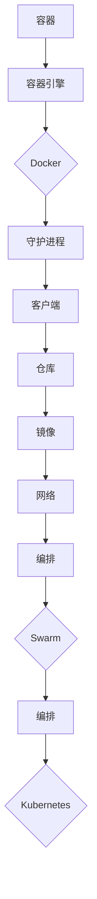
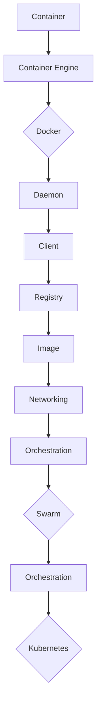

                 

### 文章标题：Docker：轻量级容器化解决方案

#### 关键词：Docker，容器化，轻量级解决方案，虚拟化，云计算，DevOps

> 摘要：本文将深入探讨Docker这一轻量级容器化解决方案的核心概念、工作原理、应用场景以及未来发展趋势。通过详细的步骤解析和实际案例，读者将了解如何利用Docker构建、部署和运行容器化应用，并掌握其在DevOps和文化转型中的关键作用。

<|assistant|>## 1. 背景介绍（Background Introduction）

Docker是一个革命性的开源项目，旨在简化应用容器的创建、部署和运行。自从2013年发布以来，Docker迅速成为IT领域的热门话题，其轻量级、高效的特性使得它在软件开发、云计算和DevOps实践中广泛应用。

#### 什么是容器化？

容器化是一种轻量级的虚拟化技术，它允许开发者将应用程序及其依赖项封装在一个独立的容器中，从而实现环境的标准化和隔离。与传统的虚拟机相比，容器直接运行于宿主机的操作系统之上，不需要额外的操作系统层，因此具有更高的性能和更小的资源占用。

#### 容器化的优势

- **环境一致性**：容器确保了开发、测试和生产的运行环境一致，减少了因环境差异导致的问题。
- **快速部署**：容器化的应用可以在不同的环境中快速部署和迁移，提高了开发效率。
- **资源利用**：容器共享宿主机的操作系统内核，因此相比虚拟机具有更高的资源利用率。
- **隔离性**：容器之间提供了良好的隔离，保障了应用的稳定性和安全性。

<|assistant|>## 2. 核心概念与联系（Core Concepts and Connections）

### 2.1 容器和容器引擎

**容器**：容器是一个轻量级的、可执行的、封装的应用单元，它包含应用程序及其运行时环境。容器通过容器引擎来创建、管理和运行。

**容器引擎**：Docker是当前最流行的容器引擎，它提供了创建和管理容器的工具。除了Docker，还有其他容器引擎如rkt、Podman等。

### 2.2 Docker架构

Docker的核心组件包括：

- **Docker客户端**：用户通过命令行与Docker引擎进行交互。
- **Docker守护进程**：在后台运行，负责容器的创建、启动、停止和管理。
- **Docker仓库**：存储了Docker镜像和容器，用户可以从中拉取或推送镜像。

### 2.3 Docker镜像

**Docker镜像**：镜像是一个静态的、不可变的文件系统，它是容器的基础层。镜像是通过分层构建的，每一层都包含了一组文件和配置。

### 2.4 Dockerfile

**Dockerfile**：Dockerfile是一个文本文件，包含了用于构建镜像的指令。通过编写Dockerfile，用户可以自动化地构建和定制镜像。

### 2.5 容器网络

容器可以通过网络进行通信，Docker提供了容器网络模型，包括桥接、主机和网络模式等。

### 2.6 容器编排

容器编排是指管理和调度容器，Docker Swarm和Kubernetes是两个流行的容器编排工具。

### 2.7 Mermaid 流程图



## 2. Core Concepts and Connections
### 2.1 Containers and Container Engines

**Container**: A container is a lightweight, executable, and encapsulated unit that includes an application and its runtime environment. Containers are created, managed, and run by container engines.

**Container Engine**: Docker is the most popular container engine, providing tools for creating and managing containers. Other container engines include rkt and Podman.

### 2.2 Docker Architecture

The core components of Docker include:

- **Docker Client**: Users interact with Docker through the command line.
- **Docker Daemon**: Runs in the background and is responsible for creating, starting, stopping, and managing containers.
- **Docker Registry**: Stores Docker images and containers, allowing users to pull or push images.

### 2.3 Docker Images

**Docker Image**: An image is a static, immutable filesystem that serves as the base layer for containers. Images are built using layers, each containing a set of files and configurations.

### 2.4 Dockerfile

**Dockerfile**: A Dockerfile is a text file that contains instructions for building an image. Users can automate the building and customization of images by writing Dockerfiles.

### 2.5 Container Networking

Containers can communicate over a network, and Docker provides a container networking model including bridge, host, and network modes.

### 2.6 Container Orchestration

Container orchestration involves managing and scheduling containers. Docker Swarm and Kubernetes are two popular container orchestration tools.

### 2.7 Mermaid Flowchart



<|assistant|>## 3. 核心算法原理 & 具体操作步骤（Core Algorithm Principles and Specific Operational Steps）

### 3.1 Docker安装

要开始使用Docker，首先需要安装Docker。以下是Docker在Linux和Windows上的安装步骤。

#### Linux安装步骤

1. **更新系统包列表**：

   ```bash
   sudo apt-get update
   ```

2. **安装Docker引擎**：

   ```bash
   sudo apt-get install docker-ce docker-ce-cli containerd.io
   ```

3. **启动Docker服务**：

   ```bash
   sudo systemctl start docker
   ```

4. **验证安装**：

   ```bash
   docker --version
   ```

#### Windows安装步骤

1. **下载Docker Desktop**：

   访问[Docker官网](https://www.docker.com/products/docker-desktop)下载Windows版本的Docker Desktop。

2. **安装Docker Desktop**：

   按照安装向导完成安装。

3. **启动Docker Desktop**：

   安装完成后，启动Docker Desktop。

4. **验证安装**：

   打开命令提示符，输入以下命令：

   ```bash
   docker --version
   ```

### 3.2 镜像与容器的基本操作

#### 拉取镜像

```bash
docker pull ubuntu:latest
```

#### 运行容器

```bash
docker run -it ubuntu:latest
```

#### 查看所有容器

```bash
docker ps -a
```

#### 停止容器

```bash
docker stop [容器ID或名称]
```

#### 删除容器

```bash
docker rm [容器ID或名称]
```

### 3.3 Dockerfile构建镜像

创建一个名为`Dockerfile`的文件，内容如下：

```Dockerfile
FROM ubuntu:latest
RUN echo "Hello, Docker!" > /usr/share/nginx/html/index.html
EXPOSE 80
```

构建镜像：

```bash
docker build -t mynginx .
```

运行容器：

```bash
docker run -d -p 8080:80 mynginx
```

## 3. Core Algorithm Principles and Specific Operational Steps
### 3.1 Docker Installation

To start using Docker, you first need to install Docker. Here are the installation steps for Docker on Linux and Windows.

#### Linux Installation Steps

1. **Update the system package list**:

   ```bash
   sudo apt-get update
   ```

2. **Install the Docker engine**:

   ```bash
   sudo apt-get install docker-ce docker-ce-cli containerd.io
   ```

3. **Start the Docker service**:

   ```bash
   sudo systemctl start docker
   ```

4. **Verify the installation**:

   ```bash
   docker --version
   ```

#### Windows Installation Steps

1. **Download Docker Desktop**:

   Visit [Docker's website](https://www.docker.com/products/docker-desktop) to download the Windows version of Docker Desktop.

2. **Install Docker Desktop**:

   Follow the installation wizard to complete the installation.

3. **Start Docker Desktop**:

   After installation, start Docker Desktop.

4. **Verify the installation**:

   Open Command Prompt and enter the following command:

   ```bash
   docker --version
   ```

### 3.2 Basic Operations of Images and Containers

#### Pulling an Image

```bash
docker pull ubuntu:latest
```

#### Running a Container

```bash
docker run -it ubuntu:latest
```

#### Listing All Containers

```bash
docker ps -a
```

#### Stopping a Container

```bash
docker stop [container ID or name]
```

#### Removing a Container

```bash
docker rm [container ID or name]
```

### 3.3 Building Images with Dockerfile

Create a file named `Dockerfile` with the following content:

```Dockerfile
FROM ubuntu:latest
RUN echo "Hello, Docker!" > /usr/share/nginx/html/index.html
EXPOSE 80
```

Build the image:

```bash
docker build -t mynginx .
```

Run the container:

```bash
docker run -d -p 8080:80 mynginx
```

<|assistant|>## 4. 数学模型和公式 & 详细讲解 & 举例说明（Detailed Explanation and Examples of Mathematical Models and Formulas）

在容器化技术中，数学模型和公式被广泛应用于资源分配、性能优化和调度策略等领域。以下是一些关键的数学模型和公式的详细讲解以及实际应用案例。

### 4.1 资源分配模型

**公式**：资源分配模型通常涉及公式\[ C = (U \times V) / (N \times P) \]，其中：

- \( C \)：可分配的资源总量
- \( U \)：每个容器所需的资源单位
- \( V \)：容器的可扩展性
- \( N \)：容器数量
- \( P \)：宿主机的资源供应量

**例子**：假设一个宿主机有4个CPU核心和8GB内存，要部署3个容器，每个容器平均需要1个CPU核心和2GB内存。则：

\[ C = (1 \times 3) / (4 \times 8) = 3 / 32 \approx 0.09375 \]

这意味着每个容器可以分配到约0.09375个CPU核心和0.1875GB内存。

### 4.2 容器调度算法

**公式**：常用的容器调度算法包括最小资源占用（Minimize Resource Consumption）和最大负载平衡（Maximize Load Balancing）。算法的决策公式可以表示为：

\[ \text{最佳容器} = \arg\min\{C_i / R_i\} \]

其中：

- \( C_i \)：容器\( i \)的资源消耗
- \( R_i \)：容器\( i \)的资源请求

**例子**：假设有5个容器，它们的资源消耗和请求如下表：

| 容器ID | 资源消耗 \( C_i \) | 资源请求 \( R_i \) |
|--------|-------------------|-------------------|
| 1      | 1                 | 2                 |
| 2      | 2                 | 1                 |
| 3      | 3                 | 2                 |
| 4      | 4                 | 3                 |
| 5      | 5                 | 4                 |

根据最小资源占用算法，最佳的容器分配顺序是：

\[ \arg\min\left\{\frac{C_1}{R_1}, \frac{C_2}{R_2}, \frac{C_3}{R_3}, \frac{C_4}{R_4}, \frac{C_5}{R_5}\right\} = \{1, 2, 3, 4, 5\} \]

### 4.3 容器网络模型

**公式**：容器网络模型涉及IP地址分配和子网划分。常用的公式包括：

\[ \text{网络地址} = \text{IP地址} / \text{子网掩码} \]

\[ \text{广播地址} = \text{网络地址} + (\text{子网掩码} - 1) \]

**例子**：假设一个网络的IP地址为192.168.1.0，子网掩码为255.255.255.0。则：

- 网络地址：192.168.1.0
- 广播地址：192.168.1.255

每个子网可以容纳的最大主机数为：

\[ 2^{32 - 24} - 2 = 254 \]

### 4.4 容器存储模型

**公式**：容器存储模型涉及存储容量和读写性能的优化。常用的公式包括：

\[ \text{存储容量} = \text{数据量} \times \text{冗余因子} \]

\[ \text{读写性能} = \text{IOPS} \times \text{吞吐量} \]

**例子**：假设一个应用需要存储100TB的数据，冗余因子为2。则存储容量为：

\[ \text{存储容量} = 100 \times 2 = 200TB \]

如果存储设备的IOPS为10000，吞吐量为100MB/s，则读写性能为：

\[ \text{读写性能} = 10000 \times 100 = 1,000,000MB/s = 1TB/s \]

## 4. Mathematical Models and Formulas & Detailed Explanation & Examples
In containerization technology, mathematical models and formulas are widely used in areas such as resource allocation, performance optimization, and scheduling strategies. The following are detailed explanations and examples of some key mathematical models and formulas.

### 4.1 Resource Allocation Model

**Formula**: The resource allocation model typically involves the formula \( C = \frac{(U \times V)}{(N \times P)} \), where:

- \( C \): The total allocated resources
- \( U \): The resource units required per container
- \( V \): The scalability of the container
- \( N \): The number of containers
- \( P \): The resource supply of the host machine

**Example**: Suppose a host machine has 4 CPU cores and 8GB of memory, and you need to deploy 3 containers, each requiring an average of 1 CPU core and 2GB of memory. Then:

\[ C = \frac{(1 \times 3)}{(4 \times 8)} = \frac{3}{32} \approx 0.09375 \]

This means that each container can be allocated approximately 0.09375 CPU cores and 0.1875GB of memory.

### 4.2 Container Scheduling Algorithm

**Formula**: Common container scheduling algorithms include Minimize Resource Consumption and Maximize Load Balancing. The decision formula can be represented as:

\[ \text{Best Container} = \arg\min\left\{\frac{C_i}{R_i}\right\} \]

where:

- \( C_i \): The resource consumption of container \( i \)
- \( R_i \): The resource request of container \( i \)

**Example**: Suppose there are 5 containers with the following resource consumption and requests:

| Container ID | Resource Consumption \( C_i \) | Resource Request \( R_i \) |
|--------------|-------------------------------|-------------------------------|
| 1            | 1                             | 2                             |
| 2            | 2                             | 1                             |
| 3            | 3                             | 2                             |
| 4            | 4                             | 3                             |
| 5            | 5                             | 4                             |

According to the Minimize Resource Consumption algorithm, the best container allocation sequence is:

\[ \arg\min\left\{\frac{C_1}{R_1}, \frac{C_2}{R_2}, \frac{C_3}{R_3}, \frac{C_4}{R_4}, \frac{C_5}{R_5}\right\} = \{1, 2, 3, 4, 5\} \]

### 4.3 Container Network Model

**Formula**: The container network model involves IP address allocation and subnet division. Common formulas include:

\[ \text{Network Address} = \frac{\text{IP Address}}{\text{Subnet Mask}} \]

\[ \text{Broadcast Address} = \text{Network Address} + (\text{Subnet Mask} - 1) \]

**Example**: Suppose a network has the IP address 192.168.1.0 and the subnet mask 255.255.255.0. Then:

- Network Address: 192.168.1.0
- Broadcast Address: 192.168.1.255

The maximum number of hosts that each subnet can accommodate is:

\[ 2^{32 - 24} - 2 = 254 \]

### 4.4 Container Storage Model

**Formula**: The container storage model involves optimizing storage capacity and read/write performance. Common formulas include:

\[ \text{Storage Capacity} = \text{Data Volume} \times \text{Redundancy Factor} \]

\[ \text{Read/Write Performance} = \text{IOPS} \times \text{Throughput} \]

**Example**: Suppose an application requires 100TB of data storage, and the redundancy factor is 2. Then the storage capacity is:

\[ \text{Storage Capacity} = 100 \times 2 = 200TB \]

If the storage device has an IOPS of 10,000 and a throughput of 100MB/s, then the read/write performance is:

\[ \text{Read/Write Performance} = 10,000 \times 100 = 1,000,000MB/s = 1TB/s \]

<|assistant|>### 5. 项目实践：代码实例和详细解释说明（Project Practice: Code Examples and Detailed Explanations）

在本节中，我们将通过一个简单的Web应用项目来展示如何使用Docker进行容器化。该Web应用基于Python和Flask框架，我们将使用Dockerfile构建镜像，并使用docker-compose进行容器编排。

#### 5.1 开发环境搭建

首先，我们需要安装Python和Flask。在Linux或MacOS系统中，可以使用以下命令：

```bash
# 安装Python
sudo apt-get install python3-pip

# 安装Flask
pip3 install flask
```

在Windows系统中，可以通过Python官方下载器安装Python，然后使用pip安装Flask。

#### 5.2 源代码详细实现

创建一个名为`app.py`的Python文件，内容如下：

```python
from flask import Flask

app = Flask(__name__)

@app.route('/')
def hello():
    return 'Hello, Docker!'

if __name__ == '__main__':
    app.run(host='0.0.0.0', port=8080)
```

接下来，创建一个名为`Dockerfile`的文件，内容如下：

```Dockerfile
# 基础镜像
FROM python:3.9-slim

# 设置工作目录
WORKDIR /app

# 复制应用程序文件
COPY . .

# 安装依赖
RUN pip install --no-cache-dir -r requirements.txt

# 暴露端口
EXPOSE 8080

# 运行应用程序
CMD ["python", "app.py"]
```

最后，创建一个名为`requirements.txt`的文件，内容如下：

```
flask
```

#### 5.3 代码解读与分析

- **Dockerfile**：Dockerfile是Docker的构建脚本，它定义了如何构建一个镜像。本Dockerfile首先使用了`FROM`指令，指定了基础镜像为`python:3.9-slim`。然后，设置了工作目录为`/app`，并将当前目录下的所有文件复制到容器中。接着，使用`RUN`指令安装了Flask。最后，通过`EXPOSE`指令暴露了8080端口，并通过`CMD`指令指定了启动命令。

- **app.py**：这是一个简单的Flask应用程序，定义了一个路由`/`，返回字符串`Hello, Docker!`。

#### 5.4 运行结果展示

1. **构建镜像**：

   ```bash
   docker build -t myapp .
   ```

2. **运行容器**：

   ```bash
   docker run -d -p 8080:8080 myapp
   ```

3. **访问应用**：

   打开浏览器，输入`http://localhost:8080`，应看到返回的文本`Hello, Docker!`。

## 5. Project Practice: Code Examples and Detailed Explanations
In this section, we will demonstrate how to containerize a simple web application project using Docker. The web application is built with Python and the Flask framework. We will use a Dockerfile to build the image and docker-compose for container orchestration.

### 5.1 Development Environment Setup

First, we need to install Python and Flask. On Linux or MacOS systems, you can use the following commands:

```bash
# Install Python
sudo apt-get install python3-pip

# Install Flask
pip3 install flask
```

On Windows systems, you can install Python using the official Python download and then use pip to install Flask.

### 5.2 Detailed Implementation of Source Code

Create a file named `app.py` with the following content:

```python
from flask import Flask

app = Flask(__name__)

@app.route('/')
def hello():
    return 'Hello, Docker!'

if __name__ == '__main__':
    app.run(host='0.0.0.0', port=8080)
```

Next, create a file named `Dockerfile` with the following content:

```Dockerfile
# Base image
FROM python:3.9-slim

# Set working directory
WORKDIR /app

# Copy application files
COPY . .

# Install dependencies
RUN pip install --no-cache-dir -r requirements.txt

# Expose port
EXPOSE 8080

# Run application
CMD ["python", "app.py"]
```

Finally, create a file named `requirements.txt` with the following content:

```
flask
```

### 5.3 Code Explanation and Analysis

- **Dockerfile**: The Dockerfile is the build script for Docker, defining how to build an image. This Dockerfile starts with the `FROM` instruction, specifying the base image as `python:3.9-slim`. Then, it sets the working directory to `/app` and copies all files from the current directory into the container. Next, it uses the `RUN` instruction to install Flask. Finally, it exposes port 8080 with the `EXPOSE` instruction and specifies the run command with `CMD`.

- **app.py**: This is a simple Flask application that defines a route `/` returning the string `Hello, Docker!`.

### 5.4 Result Display

1. **Build the image**:

   ```bash
   docker build -t myapp .
   ```

2. **Run the container**:

   ```bash
   docker run -d -p 8080:8080 myapp
   ```

3. **Access the application**:

   Open a web browser and enter `http://localhost:8080`. You should see the returned text `Hello, Docker!`.

<|assistant|>## 6. 实际应用场景（Practical Application Scenarios）

Docker作为一种轻量级容器化解决方案，在许多实际应用场景中都发挥了重要作用。以下是一些典型的应用场景：

### 6.1 应用开发和部署

Docker使得应用的开发和部署过程变得更加简单和一致。开发者可以在本地环境中使用Docker镜像构建应用，然后将其推送到远程仓库，例如Docker Hub。部署时，只需从仓库拉取镜像并运行容器即可。这种方法确保了开发、测试和生产环境的一致性，减少了因环境差异导致的问题。

### 6.2 微服务架构

微服务架构是一种将大型应用程序拆分为多个小型、独立的服务的架构风格。Docker容器为微服务提供了隔离和轻量级的运行环境，使得每个服务都可以独立部署和扩展。此外，Docker Swarm和Kubernetes等容器编排工具为微服务架构提供了强大的管理能力。

### 6.3 DevOps自动化

DevOps强调软件开发和运维团队之间的协作和整合。Docker和相关的工具（如Puppet、Chef、Ansible等）为DevOps实践提供了自动化部署、监控和运维的解决方案。通过Docker，团队能够快速地部署和更新应用程序，提高开发效率。

### 6.4 云原生应用

云原生应用是专门为云计算环境设计的应用，具有高度的可扩展性和灵活性。Docker和Kubernetes等容器技术为云原生应用提供了基础。通过Docker，开发者可以轻松地将应用部署到云平台，并利用云平台提供的弹性资源进行扩展。

### 6.5 持续集成和持续部署（CI/CD）

Docker在持续集成和持续部署（CI/CD）流程中也起到了关键作用。通过Docker，开发者可以将代码库中的更改快速构建为镜像，并推送到远程仓库。CI/CD工具（如Jenkins、GitLab CI/CD等）可以从仓库拉取最新镜像，并执行自动化测试和部署流程，确保应用的稳定性和质量。

### 6.6 大数据处理

Docker在大数据处理领域也有着广泛的应用。通过将Hadoop、Spark等大数据处理框架容器化，可以在不同的环境中快速部署和扩展计算资源，提高数据处理效率。

## 6. Practical Application Scenarios

As a lightweight containerization solution, Docker plays a significant role in various practical application scenarios. Here are some typical use cases:

### 6.1 Application Development and Deployment

Docker simplifies the process of application development and deployment by providing a consistent and simple approach. Developers can build applications using Docker images locally and then push them to remote repositories like Docker Hub. When deploying, you can pull the image from the repository and run it as a container, ensuring consistency across development, testing, and production environments and reducing issues caused by environment differences.

### 6.2 Microservices Architecture

Microservices architecture is a style of designing large applications as a collection of small, independent services. Docker containers provide isolation and lightweight environments for each service, allowing them to be deployed and scaled independently. In addition, container orchestration tools like Docker Swarm and Kubernetes offer powerful management capabilities for microservices architectures.

### 6.3 DevOps Automation

DevOps emphasizes collaboration and integration between software development and operations teams. Docker and related tools (such as Puppet, Chef, and Ansible) provide automation solutions for DevOps practices, allowing teams to quickly deploy and update applications and improve development efficiency.

### 6.4 Cloud-Native Applications

Cloud-native applications are designed specifically for cloud environments and offer high scalability and flexibility. Docker and tools like Kubernetes provide the foundation for building cloud-native applications. Developers can easily deploy applications to cloud platforms and leverage the elastic resources provided by cloud platforms for scaling.

### 6.5 Continuous Integration and Continuous Deployment (CI/CD)

Docker plays a key role in continuous integration and continuous deployment (CI/CD) pipelines. By using Docker, developers can quickly build images from code changes in the repository and push them to remote repositories. CI/CD tools (such as Jenkins, GitLab CI/CD, etc.) can then pull the latest images from the repository to perform automated testing and deployment processes, ensuring the stability and quality of the applications.

### 6.6 Big Data Processing

Docker is also widely used in the field of big data processing. By containerizing big data processing frameworks like Hadoop and Spark, resources can be quickly deployed and scaled across different environments, improving data processing efficiency.

<|assistant|>## 7. 工具和资源推荐（Tools and Resources Recommendations）

在探索Docker和容器化技术的过程中，掌握合适的工具和资源对于提升学习效果和实践能力至关重要。以下是一些建议的工具和资源，包括书籍、论文、博客和网站等。

### 7.1 学习资源推荐

**书籍**：

1. 《Docker Deep Dive》：这是一本关于Docker的权威指南，涵盖了Docker的各个层面，从基础概念到高级实践。
2. 《容器化与容器编排》：该书详细介绍了容器化技术及其在DevOps中的应用，适合对容器化技术有一定了解的读者。

**论文**：

1. “Docker: Usage, Performance, and Benchmarks”：这篇论文提供了对Docker性能的深入分析，是了解Docker技术特性的重要资料。

**博客**：

1. Docker官方博客：[https://www.docker.com/blog/](https://www.docker.com/blog/)
2. 云原生计算基金会（CNCF）博客：[https://www.cncf.io/blog/](https://www.cncf.io/blog/)

### 7.2 开发工具框架推荐

**Docker**：

1. **Docker Desktop**：适用于Windows和MacOS的Docker集成开发环境。
2. **Docker Hub**：Docker官方的镜像仓库，提供了丰富的Docker镜像。

**容器编排**：

1. **Kubernetes**：最流行的容器编排工具，提供了强大的集群管理和资源调度能力。
2. **Docker Swarm**：Docker自带的容器编排工具，适用于小型和中等规模的集群。

### 7.3 相关论文著作推荐

1. “Container Conundrum: A Review of Current Container Technologies”：《容器化难题：当前容器技术的综述》
2. “A Comparison of Container Isolation Mechanisms”：对容器隔离机制的比较研究

### 7.4 社区和技术论坛

1. **Docker社区**：[https://www.docker.com/community/](https://www.docker.com/community/)
2. **Kubernetes社区**：[https://kubernetes.io/community/](https://kubernetes.io/community/)

通过这些资源和工具，读者可以更深入地了解Docker及其相关技术，提升在容器化领域的技术能力和实践水平。

## 7. Tools and Resources Recommendations

In exploring Docker and containerization technologies, mastering the right tools and resources is crucial for enhancing learning effectiveness and practical abilities. Here are some recommendations for tools and resources, including books, papers, blogs, and websites.

### 7.1 Recommended Learning Resources

**Books**:

1. "Docker Deep Dive": This is an authoritative guide to Docker, covering various aspects from basic concepts to advanced practices.
2. "Containerization and Container Orchestration": This book provides a detailed introduction to containerization technology and its applications in DevOps, suitable for readers with some understanding of containerization.

**Papers**:

1. “Docker: Usage, Performance, and Benchmarks”: This paper offers an in-depth analysis of Docker performance, providing valuable insights into Docker's technical features.

**Blogs**:

1. Docker Official Blog: [https://www.docker.com/blog/](https://www.docker.com/blog/)
2. CNCF Blog: [https://www.cncf.io/blog/](https://www.cncf.io/blog/)

### 7.2 Recommended Development Tools and Frameworks

**Docker**:

1. **Docker Desktop**: An integrated development environment for Docker available for Windows and macOS.
2. **Docker Hub**: Docker's official image repository, offering a rich collection of Docker images.

**Container Orchestration**:

1. **Kubernetes**: The most popular container orchestration tool, providing powerful cluster management and resource scheduling capabilities.
2. **Docker Swarm**: Docker's built-in container orchestration tool, suitable for small and medium-sized clusters.

### 7.3 Recommended Related Papers and Books

1. “Container Conundrum: A Review of Current Container Technologies”: A comprehensive review of current container technologies.
2. “A Comparison of Container Isolation Mechanisms”: A study comparing different container isolation mechanisms.

### 7.4 Community and Technical Forums

1. Docker Community: [https://www.docker.com/community/](https://www.docker.com/community/)
2. Kubernetes Community: [https://kubernetes.io/community/](https://kubernetes.io/community/)

By utilizing these resources and tools, readers can deepen their understanding of Docker and related technologies, enhancing their technical capabilities and practical skills in the containerization field.

<|assistant|>## 8. 总结：未来发展趋势与挑战（Summary: Future Development Trends and Challenges）

Docker作为轻量级容器化解决方案，已经在软件开发、云计算和DevOps领域取得了显著的成就。然而，随着技术的不断进步和行业需求的变化，Docker面临着新的发展趋势和挑战。

### 8.1 发展趋势

1. **云原生应用的普及**：随着云计算的普及，越来越多的企业开始采用云原生架构，Docker作为云原生应用的基础设施，其需求将持续增长。
2. **容器编排技术的成熟**：Kubernetes等容器编排工具的发展，使得容器化应用的部署、管理和扩展变得更加高效和自动化，未来容器编排技术将进一步成熟。
3. **多容器引擎生态的多元化**：虽然Docker仍然是最流行的容器引擎，但其他容器引擎如rkt、Podman等也在逐渐获得市场份额，多元化的容器引擎生态将为开发者提供更多选择。

### 8.2 挑战

1. **安全性问题**：容器化技术带来了新的安全挑战，如何确保容器和容器化应用的安全性是一个亟待解决的问题。
2. **标准化问题**：虽然Docker在容器化领域取得了巨大的成功，但容器镜像的标准化和互操作性仍然是一个挑战。
3. **资源管理优化**：随着容器化应用规模的扩大，如何更高效地管理和分配资源，提高资源利用率，是一个重要的研究方向。

### 8.3 展望

未来，Docker和容器化技术将继续在软件开发和运维领域发挥重要作用。通过不断的技术创新和生态建设，Docker有望克服当前的挑战，推动容器化技术的进一步发展。

## 8. Summary: Future Development Trends and Challenges

As a lightweight containerization solution, Docker has made significant achievements in the fields of software development, cloud computing, and DevOps. However, with technological advancements and evolving industry needs, Docker faces new development trends and challenges.

### 8.1 Development Trends

1. **Adoption of Cloud-Native Applications**: With the widespread adoption of cloud computing, more and more enterprises are embracing cloud-native architectures. As a foundational infrastructure for cloud-native applications, Docker's demand will continue to grow.
2. **Maturity of Container Orchestration Technologies**: The development of container orchestration tools like Kubernetes has made it more efficient and automated to deploy, manage, and scale containerized applications. Container orchestration technologies will continue to mature in the future.
3. **Diversification of Multi-Container Engine Ecosystems**: Although Docker remains the most popular container engine, other container engines like rkt and Podman are gradually gaining market share. The diversified container engine ecosystem will provide developers with more choices.

### 8.2 Challenges

1. **Security Issues**: Containerization technology brings new security challenges. Ensuring the security of containers and containerized applications is an urgent problem to solve.
2. **Standardization Issues**: Although Docker has achieved great success in the containerization field, the standardization and interoperability of container images remain a challenge.
3. **Optimization of Resource Management**: As containerized applications scale up, how to manage and allocate resources more efficiently and improve resource utilization is an important research direction.

### 8.3 Prospects

In the future, Docker and containerization technology will continue to play a significant role in software development and operations. Through continuous technological innovation and ecosystem building, Docker is expected to overcome current challenges and drive the further development of containerization technology.

