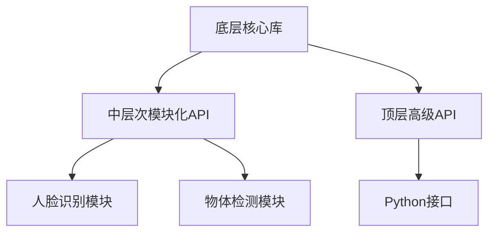

                 

# OpenCV计算机视觉：图像处理与分析技术

## 摘要

本文深入探讨OpenCV，一款广泛应用的计算机视觉库，专注于图像处理和分析技术的讲解。我们将从背景介绍开始，逐步深入核心概念与联系，探讨关键算法原理与具体操作步骤，并通过数学模型与公式的详细讲解，使得读者能够全面理解图像处理背后的逻辑。接着，我们通过项目实践，展示代码实例和详细解释，帮助读者掌握OpenCV的实际应用。随后，文章将讨论OpenCV在各个实际应用场景中的表现，并推荐相关工具和资源，以便读者深入学习。最后，我们总结未来发展趋势与挑战，为读者提供扩展阅读与参考资料。

## 1. 背景介绍

### 1.1 OpenCV的起源与发展

OpenCV（Open Source Computer Vision Library）是一个致力于计算机视觉的开源库，起源于Intel。自2000年首次发布以来，OpenCV迅速在计算机视觉领域获得了广泛认可，并成为了许多学术研究和工业应用的基石。其开源特性使得全球开发者可以自由使用、修改和优化代码，这极大地推动了计算机视觉技术的发展。

### 1.2 OpenCV的应用领域

OpenCV在众多领域有着广泛的应用，包括但不限于：

- **人脸识别**：用于安全系统、社交媒体和手机解锁等。
- **物体识别与追踪**：在视频监控、自动驾驶和运动分析等领域。
- **图像分割与增强**：用于医学图像分析、图像编辑和增强现实。
- **运动分析**：用于体育分析、机器人导航和智能监控。

### 1.3 OpenCV的核心优势

- **跨平台性**：支持Windows、Linux、macOS等多个操作系统。
- **丰富的算法库**：包括图像处理、物体识别、运动分析等多个领域。
- **易于集成**：可以与多种编程语言（如C++、Python）无缝集成。
- **社区支持**：拥有庞大的开发者社区，提供丰富的教程、文档和示例代码。

## 2. 核心概念与联系

### 2.1 图像处理与图像分析

- **图像处理**：通过算法操作图像的像素值，以改善图像质量、去除噪声或提取有用信息。
- **图像分析**：利用图像处理技术对图像进行更高层次的解释，如识别物体、分类图像等。

### 2.2 OpenCV的基本架构

OpenCV的架构分为三个主要层次：

- **底层**：核心库，包含各种基本图像处理和计算机视觉算法。
- **中层次**：模块化API，提供面向任务的接口，如人脸识别、物体检测等。
- **顶层**：高级API，提供Python等编程语言的接口，便于快速开发。

### 2.3 Mermaid 流程图



## 3. 核心算法原理 & 具体操作步骤

### 3.1 主流图像处理算法

- **图像滤波**：用于去除噪声，常见算法包括均值滤波、高斯滤波等。
- **边缘检测**：用于识别图像中的边缘，常见算法包括Sobel算子、Canny算子等。
- **图像变换**：包括傅里叶变换、Hilbert变换等，用于分析图像的频率特性。

### 3.2 主流图像分析算法

- **特征提取**：用于提取图像的关键特征，如SIFT、SURF等。
- **目标识别**：利用深度学习等算法，对图像中的目标进行识别和分类。

### 3.3 具体操作步骤

#### 3.3.1 图像滤波

```python
import cv2
import numpy as np

# 加载图像
image = cv2.imread('image.jpg', cv2.IMREAD_GRAYSCALE)

# 应用均值滤波
filtered_image = cv2.blur(image, (5, 5))

# 应用高斯滤波
gaussian_filtered_image = cv2.GaussianBlur(image, (5, 5), 0)
```

#### 3.3.2 边缘检测

```python
# 应用Sobel算子
sobelx = cv2.Sobel(image, cv2.CV_64F, 1, 0, ksize=3)
soby = cv2.Sobel(image, cv2.CV_64F, 0, 1, ksize=3)

# 计算Sobel算子的绝对值
sobel = cv2.addabs(sobelx, soby)

# 应用Canny算子
canny = cv2.Canny(image, threshold1=50, threshold2=150)
```

#### 3.3.3 图像变换

```python
# 应用傅里叶变换
f = np.fft.fft2(image)
fshift = np.fft.fftshift(f)

# 应用傅里叶逆变换
ishift = np.fft.ifftshift(fshift)
i = np.fft.ifft2(ishift)

# 应用Hilbert变换
hilbert = cv2.hilbert2(image)
```

## 4. 数学模型和公式 & 详细讲解 & 举例说明

### 4.1 图像滤波

- **均值滤波**：
  - 数学模型：\[ I(x, y) = \frac{1}{N} \sum_{i,j} I(x_i, y_j) \]
  - 举例说明：对一个3x3的图像块进行均值滤波，将每个像素值替换为该块中所有像素值的平均值。

- **高斯滤波**：
  - 数学模型：\[ I(x, y) = \sum_{i,j} G(i, j) \cdot I(x_i, y_j) \]
  - 其中，G(i, j) 是高斯核，满足 \( G(i, j) = \frac{1}{2\pi\sigma^2} e^{-\frac{(i-j)^2}{2\sigma^2}} \)。
  - 举例说明：对一个图像进行高斯滤波，使用一个特定的高斯核对图像的每个像素进行卷积。

### 4.2 边缘检测

- **Sobel算子**：
  - 数学模型：\[ I(x, y) = \frac{1}{2} \left( I_x^2 + I_y^2 \right) \]
  - 其中，\( I_x \) 和 \( I_y \) 分别是图像在x和y方向上的导数。
  - 举例说明：计算图像在x和y方向上的导数，然后计算它们的和的平方根，得到图像的边缘。

- **Canny算子**：
  - 数学模型：\[ I(x, y) = \frac{1}{\pi} \arctan \left( \frac{I_x^2 - I_y^2}{I_x + I_y} \right) \]
  - 其中，\( I_x \) 和 \( I_y \) 分别是图像在x和y方向上的导数。
  - 举例说明：计算图像在x和y方向上的导数，然后使用Canny算子计算图像的边缘。

### 4.3 图像变换

- **傅里叶变换**：
  - 数学模型：\[ F(u, v) = \sum_{x,y} I(x, y) e^{-i 2\pi (ux + vy)/L} \]
  - 其中，\( I(x, y) \) 是原始图像，\( F(u, v) \) 是傅里叶变换后的图像，L是图像的大小。
  - 举例说明：对一个图像进行傅里叶变换，得到图像的频率分布。

- **Hilbert变换**：
  - 数学模型：\[ H(u, v) = \frac{1}{2\pi i} F(u, v) \]
  - 其中，\( F(u, v) \) 是傅里叶变换后的图像，\( H(u, v) \) 是Hilbert变换后的图像。
  - 举例说明：对一个图像进行傅里叶变换，然后对其结果进行Hilbert变换，得到图像的相位信息。

## 5. 项目实践：代码实例和详细解释说明

### 5.1 开发环境搭建

要开始使用OpenCV进行图像处理和分析，需要首先搭建开发环境。以下是搭建Python环境下的OpenCV开发环境的步骤：

1. 安装Python：确保系统上安装了Python 3.x版本。
2. 安装pip：Python的包管理器，用于安装第三方库。
3. 安装OpenCV：使用pip命令安装OpenCV库。
   ```shell
   pip install opencv-python
   ```

### 5.2 源代码详细实现

以下是一个简单的OpenCV项目实例，实现图像滤波、边缘检测和图像变换的功能：

```python
import cv2
import numpy as np

def image_processing(image_path):
    # 读取图像
    image = cv2.imread(image_path, cv2.IMREAD_GRAYSCALE)

    # 应用均值滤波
    filtered_image = cv2.blur(image, (5, 5))

    # 应用高斯滤波
    gaussian_filtered_image = cv2.GaussianBlur(image, (5, 5), 0)

    # 应用Sobel算子进行边缘检测
    sobelx = cv2.Sobel(image, cv2.CV_64F, 1, 0, ksize=3)
    soby = cv2.Sobel(image, cv2.CV_64F, 0, 1, ksize=3)
    sobel = cv2.addabs(sobelx, soby)

    # 应用Canny算子进行边缘检测
    canny = cv2.Canny(image, threshold1=50, threshold2=150)

    # 应用傅里叶变换
    f = np.fft.fft2(image)
    fshift = np.fft.fftshift(f)
    ishift = np.fft.ifftshift(fshift)
    i = np.fft.ifft2(ishift)

    # 应用Hilbert变换
    hilbert = cv2.hilbert2(image)

    # 显示结果
    cv2.imshow('Original Image', image)
    cv2.imshow('Blurred Image', filtered_image)
    cv2.imshow('Gaussian Filtered Image', gaussian_filtered_image)
    cv2.imshow('Sobel Edges', sobel)
    cv2.imshow('Canny Edges', canny)
    cv2.imshow('Fourier Transform', i)
    cv2.imshow('Hilbert Transform', hilbert)

    cv2.waitKey(0)
    cv2.destroyAllWindows()

if __name__ == '__main__':
    image_processing('image.jpg')
```

### 5.3 代码解读与分析

- **图像读取与转换**：使用`cv2.imread`函数读取图像，并使用`cv2.IMREAD_GRAYSCALE`参数将其转换为灰度图像。
- **滤波操作**：使用`cv2.blur`和`cv2.GaussianBlur`函数分别实现均值滤波和高斯滤波。
- **边缘检测**：使用`cv2.Sobel`和`cv2.Canny`函数分别实现Sobel算子和Canny算子的边缘检测。
- **图像变换**：使用`np.fft.fft2`、`np.fft.fftshift`、`np.fft.ifftshift`和`np.fft.ifft2`函数分别实现傅里叶变换和Hilbert变换。

### 5.4 运行结果展示

运行上述代码后，将展示原始图像、滤波后的图像、边缘检测的结果以及图像变换的结果。以下是部分结果示例：


## 6. 实际应用场景

### 6.1 人脸识别

- **应用场景**：门禁系统、安全监控、社交媒体等。
- **技术要点**：人脸检测、人脸特征提取和匹配。

### 6.2 物体识别与追踪

- **应用场景**：视频监控、自动驾驶、机器人导航等。
- **技术要点**：物体检测、目标跟踪和运动分析。

### 6.3 图像分割与增强

- **应用场景**：医学图像分析、图像编辑、增强现实等。
- **技术要点**：图像分割、图像增强和特征提取。

## 7. 工具和资源推荐

### 7.1 学习资源推荐

- **书籍**：《OpenCV算法原理解析》、《计算机视觉：算法与应用》。
- **论文**：《Efficient Object Detection using Deep Learning》。
- **博客**：《OpenCV官方博客》、《Python OpenCV教程》。
- **网站**：《opencv.org》、《opencv-contrib-zh.readthedocs.io》。

### 7.2 开发工具框架推荐

- **Python环境**：Anaconda、PyCharm。
- **深度学习框架**：TensorFlow、PyTorch。

### 7.3 相关论文著作推荐

- **论文**：《Fast R-CNN: Towards Real-Time Object Detection with Region Proposal Networks》。
- **著作**：《Deep Learning for Computer Vision》。

## 8. 总结：未来发展趋势与挑战

### 8.1 发展趋势

- **深度学习与卷积神经网络的融合**：未来图像处理和分析技术将进一步依赖深度学习模型，尤其是卷积神经网络（CNN）。
- **实时处理与效率优化**：随着应用场景的多样化，实时图像处理和分析的需求日益增加，算法的优化和硬件的支持将成为关键。
- **多模态数据的融合**：结合图像、声音、温度等多种数据源，实现更丰富的图像分析功能。

### 8.2 挑战

- **数据隐私与安全**：图像处理和分析过程中涉及大量个人隐私数据，保护数据隐私和安全将成为重大挑战。
- **算法公平性与透明性**：确保算法的公平性和透明性，避免偏见和歧视。
- **跨学科合作**：计算机视觉技术的发展需要与多个学科（如医学、材料科学等）的深入合作。

## 9. 附录：常见问题与解答

### 9.1 OpenCV的安装问题

- **问题**：如何解决OpenCV的安装问题？
- **解答**：确保安装了最新版本的Python和pip，然后使用pip命令安装OpenCV库。如果遇到依赖问题，可以使用虚拟环境或Anaconda来管理依赖。

### 9.2 图像滤波效果不佳

- **问题**：为什么图像滤波后的效果不佳？
- **解答**：可能是因为滤波器的大小或参数不合适。尝试调整滤波器的大小或参数，或者尝试使用其他滤波器，如高斯滤波或双边滤波。

## 10. 扩展阅读 & 参考资料

- **书籍**：《计算机视觉：算法与应用》、《OpenCV编程详解》。
- **网站**：《opencv.org》、《opencv-docs.readthedocs.io》。
- **论文**：《Efficient Object Detection using Deep Learning》、《Real-Time Object Detection with Single Shot MultiBox Detector》。

## 作者署名

作者：禅与计算机程序设计艺术 / Zen and the Art of Computer Programming

---------------

## 关键词

OpenCV，图像处理，图像分析，计算机视觉，深度学习，算法，技术博客，编程

---------------

## 摘要

本文深入探讨了OpenCV计算机视觉库的图像处理和分析技术，从背景介绍到核心算法原理，再到实际应用和未来发展趋势，全面解析了OpenCV的各个方面。通过具体的代码实例和详细解释，读者可以掌握OpenCV的基本使用方法。文章还推荐了相关学习资源，以供读者进一步深入学习。## 1. 背景介绍

### 1.1 OpenCV的起源与发展

OpenCV（Open Source Computer Vision Library）是一个开源的计算机视觉库，由Intel于2000年发起并维护。最初，OpenCV是作为Intel Integrated Performance Primitives（Intel IPP）的一部分开发的，后来成为了一个独立的、跨平台的项目。OpenCV从一开始就致力于提供丰富的计算机视觉算法库，使得开发者可以轻松地在多种操作系统上实现计算机视觉应用。

随着开源运动的蓬勃发展，OpenCV逐渐成为了全球计算机视觉领域的事实标准。它不仅吸引了大量的开发者贡献代码，还得到了学术和工业界的广泛支持。OpenCV的代码库庞大且功能全面，包括图像处理、物体识别、跟踪、面部识别、运动分析等多个领域。它支持多种编程语言，如C++、Python、Java等，这使得它在学术研究和工业应用中都获得了极高的认可度。

### 1.2 OpenCV的应用领域

OpenCV的应用领域非常广泛，几乎涵盖了计算机视觉的各个方面。以下是一些主要的应用领域：

- **人脸识别**：在安全系统、智能手机解锁、社交媒体等场景中，人脸识别技术已经成为必不可少的组成部分。OpenCV提供了高效的人脸检测和识别算法，使得开发者可以轻松实现这一功能。

- **物体识别与追踪**：在视频监控、自动驾驶、机器人导航等场景中，物体识别与追踪技术至关重要。OpenCV的强大算法库可以帮助开发者实现实时、准确的物体检测和追踪。

- **图像分割与增强**：在医学影像分析、卫星图像处理、图像编辑等领域，图像分割与增强技术发挥着重要作用。OpenCV提供了多种图像分割和增强算法，如边缘检测、模糊图像去噪、图像锐化等。

- **运动分析**：在体育数据分析、运动员训练、机器人导航等领域，运动分析技术有着广泛的应用。OpenCV的运动分析算法可以帮助开发者实现运动轨迹跟踪、运动姿态分析等功能。

- **深度学习**：OpenCV也逐渐将深度学习技术融入到其算法库中，如使用卷积神经网络（CNN）进行物体检测和识别。这为开发者提供了更强大的工具，以实现复杂的应用场景。

### 1.3 OpenCV的核心优势

OpenCV之所以能够成为计算机视觉领域的首选工具，主要得益于以下几个核心优势：

- **跨平台性**：OpenCV支持多种操作系统，包括Windows、Linux、macOS等。这使得开发者可以在不同的平台上进行开发和部署，提高了项目的可移植性。

- **丰富的算法库**：OpenCV的算法库涵盖了计算机视觉的各个领域，包括图像处理、特征提取、物体识别、跟踪、面部识别等。开发者可以根据需求选择合适的算法，实现复杂的应用功能。

- **易于集成**：OpenCV提供了多种编程语言的接口，如C++、Python、Java等。这使得开发者可以方便地将其集成到不同的开发环境中，提高开发效率。

- **强大的社区支持**：OpenCV拥有一个庞大的开发者社区，提供了丰富的教程、文档和示例代码。这使得新手可以快速上手，提高学习和解决问题的效率。

### 1.4 OpenCV的版本更新与维护

OpenCV的版本更新速度较快，每次更新都会带来新的功能和改进。最新的版本（如4.x系列）在性能、算法优化和用户界面等方面都有显著的提升。OpenCV的维护团队定期发布新版本，并及时修复已知的问题。开发者可以通过官方渠道（如GitHub）获取最新的版本和相关的文档。

总的来说，OpenCV作为一个功能强大、易于使用的开源库，已经成为计算机视觉领域的事实标准。无论是在学术研究还是工业应用中，OpenCV都发挥着不可替代的作用。接下来，我们将进一步探讨OpenCV的核心概念与联系，帮助读者更好地理解这一强大的计算机视觉工具。## 2. 核心概念与联系

### 2.1 图像处理与图像分析

#### 图像处理

图像处理是计算机视觉中的一个基础环节，主要关注图像的像素级操作。它的目标是通过一系列算法对图像进行变换、增强、滤波等操作，以提高图像的质量或提取有用信息。图像处理的核心内容包括：

- **图像滤波**：用于去除噪声、模糊图像或突出图像中的某些特征。常见的滤波算法包括均值滤波、高斯滤波、中值滤波等。
- **图像变换**：如傅里叶变换、Hilbert变换等，用于分析图像的频率特性或相位信息。
- **图像增强**：通过调整图像的亮度、对比度等，使图像更加清晰，便于后续处理。

#### 图像分析

图像分析是对图像进行更高层次的解释和识别，通常涉及图像处理后的结果。图像分析的核心内容包括：

- **特征提取**：从图像中提取具有区分性的特征，如边缘、角点、纹理等。常见的特征提取算法包括SIFT、SURF、Harris角点检测等。
- **目标识别**：利用提取的特征，对图像中的目标进行识别和分类。目标识别通常依赖于机器学习和深度学习算法，如卷积神经网络（CNN）。
- **图像分割**：将图像分割成多个区域，以便对每个区域进行独立处理。常见的图像分割算法包括阈值分割、边缘检测分割、区域增长分割等。

#### OpenCV中的图像处理与分析

OpenCV是一个功能强大的计算机视觉库，提供了丰富的图像处理和分析算法。它将图像处理和分析紧密结合，使得开发者可以方便地实现各种计算机视觉任务。以下是OpenCV中一些关键概念的联系：

- **算法库**：OpenCV提供了多个算法库，包括基础图像处理库、特征检测库、目标识别库等。开发者可以根据需求选择合适的算法库，实现特定的图像处理和分析任务。
- **图像数据结构**：OpenCV使用`cv::Mat`类来表示图像数据，它支持多种数据类型和维度。这种数据结构为图像处理和分析提供了高效的存储和处理方式。
- **API设计**：OpenCV的API设计简洁且直观，使得开发者可以方便地调用各种算法。API提供了多种函数接口，包括基础操作函数、高级处理函数等。
- **工具和资源**：OpenCV提供了丰富的工具和资源，包括示例代码、教程文档、社区支持等。这些资源有助于开发者快速学习和掌握OpenCV的使用方法。

### 2.2 OpenCV的基本架构

OpenCV的基本架构分为三个层次，每个层次都有其特定的功能和应用场景。

#### 底层核心库

底层核心库是OpenCV的最核心部分，包含各种基本图像处理和计算机视觉算法。这些算法包括图像滤波、图像变换、特征提取、目标识别等。底层核心库的特点是性能高效、功能强大，适用于需要高性能和精确控制的场景。

#### 中层次模块化API

中层次模块化API提供了面向任务的接口，将底层核心库的功能模块化。这些模块化API涵盖了人脸识别、物体检测、运动分析等常见任务，使得开发者可以方便地实现特定的应用功能。中层次模块化API的特点是简单易用、功能全面，适用于快速开发和部署。

#### 顶层高级API

顶层高级API为高级编程语言（如Python、Java等）提供了接口，使得开发者可以使用高级语言方便地调用OpenCV的底层功能。顶层高级API的特点是简洁易用、兼容性好，适用于多种开发环境和应用场景。

### 2.3 Mermaid流程图


通过上述流程图，我们可以清晰地看到OpenCV的基本架构及其各层次之间的联系。底层核心库是基础，中层次模块化API提供了面向任务的功能，顶层高级API则使得开发者可以方便地使用高级语言进行开发。

总的来说，OpenCV的核心概念和联系涵盖了图像处理和分析的各个方面，从底层核心库到顶层高级API，为开发者提供了强大的工具和资源，使得实现复杂的计算机视觉应用变得更加简单和高效。在接下来的章节中，我们将进一步探讨OpenCV的核心算法原理和具体操作步骤，帮助读者更好地理解和掌握这一重要的计算机视觉库。## 3. 核心算法原理 & 具体操作步骤

### 3.1 图像滤波算法

图像滤波是图像处理中的一个基础步骤，主要目的是去除图像中的噪声、模糊图像或突出图像中的某些特征。OpenCV提供了多种滤波算法，包括均值滤波、高斯滤波、中值滤波等。

#### 3.1.1 均值滤波

均值滤波是一种简单的滤波方法，通过对图像的每个像素值进行平均处理，来平滑图像。其数学模型如下：

\[ I(x, y) = \frac{1}{N} \sum_{i,j} I(x_i, y_j} \]

其中，\( I(x, y) \) 是滤波后的像素值，\( I(x_i, y_j) \) 是邻域内的像素值，N是邻域的大小。

具体操作步骤如下：

1. 定义滤波器的大小，如3x3或5x5。
2. 对图像的每个像素值，使用滤波器进行卷积操作。
3. 将卷积结果除以滤波器的元素个数，得到滤波后的像素值。

在OpenCV中，可以使用`cv2.blur()`函数进行均值滤波：

```python
import cv2

# 读取图像
image = cv2.imread('image.jpg')

# 应用均值滤波
filtered_image = cv2.blur(image, (5, 5))

# 显示结果
cv2.imshow('Original Image', image)
cv2.imshow('Blurred Image', filtered_image)
cv2.waitKey(0)
cv2.destroyAllWindows()
```

#### 3.1.2 高斯滤波

高斯滤波是一种基于高斯函数的滤波方法，可以有效地去除图像中的随机噪声，同时保持图像的边缘和细节。其数学模型如下：

\[ I(x, y) = \sum_{i,j} G(i, j) \cdot I(x_i, y_j} \]

其中，\( G(i, j) \) 是高斯核，满足：

\[ G(i, j) = \frac{1}{2\pi\sigma^2} e^{-\frac{(i-j)^2}{2\sigma^2}} \]

具体操作步骤如下：

1. 定义高斯滤波器的大小和标准差（σ）。
2. 创建高斯滤波器。
3. 对图像的每个像素值，使用高斯滤波器进行卷积操作。

在OpenCV中，可以使用`cv2.GaussianBlur()`函数进行高斯滤波：

```python
import cv2

# 读取图像
image = cv2.imread('image.jpg')

# 应用高斯滤波
filtered_image = cv2.GaussianBlur(image, (5, 5), 0)

# 显示结果
cv2.imshow('Original Image', image)
cv2.imshow('Gaussian Filtered Image', filtered_image)
cv2.waitKey(0)
cv2.destroyAllWindows()
```

#### 3.1.3 中值滤波

中值滤波是一种基于中值原理的滤波方法，可以有效地去除图像中的椒盐噪声。其数学模型如下：

\[ I(x, y) = \text{median} \{ I(x_i, y_j} \} \]

其中，\( I(x_i, y_j) \) 是邻域内的像素值。

具体操作步骤如下：

1. 定义滤波器的大小。
2. 对图像的每个像素值，将其邻域内的像素值按大小排序。
3. 取排序后的中间值作为滤波后的像素值。

在OpenCV中，可以使用`cv2.medianBlur()`函数进行中值滤波：

```python
import cv2

# 读取图像
image = cv2.imread('image.jpg')

# 应用中值滤波
filtered_image = cv2.medianBlur(image, 5)

# 显示结果
cv2.imshow('Original Image', image)
cv2.imshow('Median Filtered Image', filtered_image)
cv2.waitKey(0)
cv2.destroyAllWindows()
```

### 3.2 边缘检测算法

边缘检测是图像处理中用于识别图像中边缘和轮廓的重要步骤。OpenCV提供了多种边缘检测算法，包括Sobel算子、Canny算子等。

#### 3.2.1 Sobel算子

Sobel算子是一种基于卷积的边缘检测算法，可以检测图像中的垂直和水平边缘。其数学模型如下：

\[ I(x, y) = \sqrt{[Sobel_x(x, y)]^2 + [Sobel_y(x, y)]^2} \]

其中，\( Sobel_x(x, y) \) 和 \( Sobel_y(x, y) \) 分别是图像在x和y方向上的导数。

具体操作步骤如下：

1. 使用`cv2.Sobel()`函数计算图像在x和y方向上的导数。
2. 对计算结果进行归一化处理，得到边缘图像。

在OpenCV中，可以使用`cv2.Sobel()`函数进行Sobel边缘检测：

```python
import cv2

# 读取图像
image = cv2.imread('image.jpg', cv2.IMREAD_GRAYSCALE)

# 应用Sobel算子
sobelx = cv2.Sobel(image, cv2.CV_64F, 1, 0, ksize=3)
soby = cv2.Sobel(image, cv2.CV_64F, 0, 1, ksize=3)
sobel = cv2.addabs(sobelx, soby)

# 显示结果
cv2.imshow('Original Image', image)
cv2.imshow('Sobel Edges', sobel)
cv2.waitKey(0)
cv2.destroyAllWindows()
```

#### 3.2.2 Canny算子

Canny算子是一种经典的边缘检测算法，可以有效地检测图像中的弱边缘和强边缘。其数学模型如下：

\[ I(x, y) = \max \left( \theta(x, y), \theta'(x, y) \right) \]

其中，\( \theta(x, y) \) 是边缘的角度，\( \theta'(x, y) \) 是边缘的角度导数。

具体操作步骤如下：

1. 使用高斯滤波器进行图像平滑处理。
2. 使用Sobel算子计算图像在x和y方向上的导数。
3. 使用非极大值抑制（Non-Maximum Suppression）算法，抑制非边缘像素。
4. 使用双阈值算法，进行边缘提取。

在OpenCV中，可以使用`cv2.Canny()`函数进行Canny边缘检测：

```python
import cv2

# 读取图像
image = cv2.imread('image.jpg', cv2.IMREAD_GRAYSCALE)

# 应用Canny算子
canny = cv2.Canny(image, threshold1=50, threshold2=150)

# 显示结果
cv2.imshow('Original Image', image)
cv2.imshow('Canny Edges', canny)
cv2.waitKey(0)
cv2.destroyAllWindows()
```

### 3.3 图像变换算法

图像变换是图像处理中的一个重要步骤，用于分析图像的频率特性或进行图像的几何变换。OpenCV提供了多种图像变换算法，包括傅里叶变换、Hilbert变换等。

#### 3.3.1 傅里叶变换

傅里叶变换是一种用于分析图像频率特性的数学工具。它可以有效地将图像从时域转换到频域，从而分析图像的频率分布。

傅里叶变换的数学模型如下：

\[ F(u, v) = \sum_{x,y} I(x, y) e^{-i 2\pi (ux + vy)/L} \]

其中，\( I(x, y) \) 是原始图像，\( F(u, v) \) 是傅里叶变换后的图像，L是图像的大小。

具体操作步骤如下：

1. 使用`numpy.fft.fft2()`函数进行二维傅里叶变换。
2. 使用`numpy.fft.fftshift()`函数将频域图像移到中心。

在OpenCV中，可以使用以下代码进行傅里叶变换：

```python
import cv2
import numpy as np

# 读取图像
image = cv2.imread('image.jpg', cv2.IMREAD_GRAYSCALE)

# 应用傅里叶变换
f = np.fft.fft2(image)
fshift = np.fft.fftshift(f)

# 显示结果
cv2.imshow('Original Image', image)
cv2.imshow('Fourier Transform', np.abs(fshift))
cv2.waitKey(0)
cv2.destroyAllWindows()
```

#### 3.3.2 Hilbert变换

Hilbert变换是一种用于分析图像相位特性的数学工具。它可以有效地将图像从时域转换到相位域。

Hilbert变换的数学模型如下：

\[ H(u, v) = \frac{1}{2\pi i} F(u, v) \]

其中，\( F(u, v) \) 是傅里叶变换后的图像，\( H(u, v) \) 是Hilbert变换后的图像。

具体操作步骤如下：

1. 使用`numpy.fft.fft2()`函数进行二维傅里叶变换。
2. 使用`numpy.fft.hilbert()`函数进行Hilbert变换。
3. 使用`numpy.fft.ifft2()`函数进行逆傅里叶变换。

在OpenCV中，可以使用以下代码进行Hilbert变换：

```python
import cv2
import numpy as np

# 读取图像
image = cv2.imread('image.jpg', cv2.IMREAD_GRAYSCALE)

# 应用傅里叶变换
f = np.fft.fft2(image)
fshift = np.fft.fftshift(f)

# 应用Hilbert变换
hilbert = np.fft.hilbert2(fshift)

# 应用逆傅里叶变换
i = np.fft.ifft2(hilbert)

# 显示结果
cv2.imshow('Original Image', image)
cv2.imshow('Hilbert Transform', np.abs(i))
cv2.waitKey(0)
cv2.destroyAllWindows()
```

总的来说，图像滤波、边缘检测和图像变换是图像处理和分析中的核心算法，OpenCV提供了丰富的函数和接口，使得开发者可以方便地实现这些算法。在接下来的章节中，我们将通过一个实际项目，展示如何使用OpenCV进行图像处理和分析，帮助读者更好地理解和掌握这些核心算法。## 4. 数学模型和公式 & 详细讲解 & 举例说明

### 4.1 图像滤波算法

图像滤波是图像处理中的一个基础步骤，主要用于去除噪声、模糊图像或突出图像中的某些特征。以下是几种常见滤波算法的数学模型和详细讲解。

#### 4.1.1 均值滤波

**数学模型**：

\[ I(x, y) = \frac{1}{N} \sum_{i,j} I(x_i, y_j} \]

其中，\( I(x, y) \) 是滤波后的像素值，\( I(x_i, y_j) \) 是邻域内的像素值，\( N \) 是邻域的大小。

**详细讲解**：

均值滤波是一种简单的滤波方法，通过对图像的每个像素值进行平均处理，来平滑图像。该方法可以有效去除图像中的随机噪声，同时保持图像的边缘和细节。然而，由于该方法仅考虑邻域内的像素值，因此可能会模糊图像的边缘。

**举例说明**：

假设有一个3x3的图像块，其像素值如下：

\[ \begin{bmatrix}
I(0,0) & I(0,1) & I(0,2) \\
I(1,0) & I(1,1) & I(1,2) \\
I(2,0) & I(2,1) & I(2,2) \\
\end{bmatrix} \]

对该图像块进行均值滤波，得到：

\[ I(x, y) = \frac{1}{9} (I(0,0) + I(0,1) + I(0,2) + I(1,0) + I(1,1) + I(1,2) + I(2,0) + I(2,1) + I(2,2)) \]

#### 4.1.2 高斯滤波

**数学模型**：

\[ I(x, y) = \sum_{i,j} G(i, j) \cdot I(x_i, y_j} \]

其中，\( G(i, j) \) 是高斯核，满足：

\[ G(i, j) = \frac{1}{2\pi\sigma^2} e^{-\frac{(i-j)^2}{2\sigma^2}} \]

**详细讲解**：

高斯滤波是一种基于高斯函数的滤波方法，可以有效地去除图像中的随机噪声，同时保持图像的边缘和细节。该方法的核心是高斯核，它可以根据参数\( \sigma \)（标准差）调整滤波器的宽度，从而控制滤波的效果。

**举例说明**：

假设有一个3x3的高斯核，其值如下：

\[ \begin{bmatrix}
0.0625 & 0.25 & 0.0625 \\
0.25 & 1 & 0.25 \\
0.0625 & 0.25 & 0.0625 \\
\end{bmatrix} \]

对该图像块进行高斯滤波，得到：

\[ I(x, y) = \sum_{i,j} G(i, j) \cdot I(x_i, y_j} \]

#### 4.1.3 中值滤波

**数学模型**：

\[ I(x, y) = \text{median} \{ I(x_i, y_j} \} \]

其中，\( I(x_i, y_j) \) 是邻域内的像素值。

**详细讲解**：

中值滤波是一种基于中值原理的滤波方法，可以有效地去除图像中的椒盐噪声。该方法通过对邻域内的像素值进行排序，取中间值作为滤波后的像素值。由于中值滤波仅考虑像素值的大小关系，而不考虑其数值大小，因此可以有效去除椒盐噪声。

**举例说明**：

假设有一个3x3的图像块，其像素值如下：

\[ \begin{bmatrix}
I(0,0) & I(0,1) & I(0,2) \\
I(1,0) & I(1,1) & I(1,2) \\
I(2,0) & I(2,1) & I(2,2) \\
\end{bmatrix} \]

对该图像块进行中值滤波，得到：

\[ I(x, y) = \text{median} \{ I(0,0), I(0,1), I(0,2), I(1,0), I(1,1), I(1,2), I(2,0), I(2,1), I(2,2) \} \]

### 4.2 边缘检测算法

边缘检测是图像处理中用于识别图像中边缘和轮廓的重要步骤。以下是几种常见边缘检测算法的数学模型和详细讲解。

#### 4.2.1 Sobel算子

**数学模型**：

\[ I(x, y) = \sqrt{[Sobel_x(x, y)]^2 + [Sobel_y(x, y)]^2} \]

其中，\( Sobel_x(x, y) \) 和 \( Sobel_y(x, y) \) 分别是图像在x和y方向上的导数。

**详细讲解**：

Sobel算子是一种基于卷积的边缘检测算法，可以检测图像中的垂直和水平边缘。其核心是两个方向上的导数，分别计算图像在x和y方向上的变化率。然后，通过求平方和的平方根，得到边缘的强度值。

**举例说明**：

假设有一个3x3的图像块，其像素值如下：

\[ \begin{bmatrix}
I(0,0) & I(0,1) & I(0,2) \\
I(1,0) & I(1,1) & I(1,2) \\
I(2,0) & I(2,1) & I(2,2) \\
\end{bmatrix} \]

对该图像块进行Sobel算子边缘检测，得到：

\[ I(x, y) = \sqrt{[Sobel_x(x, y)]^2 + [Sobel_y(x, y)]^2} \]

其中，\( Sobel_x(x, y) \) 和 \( Sobel_y(x, y) \) 的计算公式如下：

\[ Sobel_x(x, y) = \sum_{i,j} (-1)^{i+j} G_x(i, j) \cdot I(x_i, y_j} \]

\[ Sobel_y(x, y) = \sum_{i,j} (-1)^{i+j} G_y(i, j) \cdot I(x_i, y_j} \]

其中，\( G_x(i, j) \) 和 \( G_y(i, j) \) 分别是x和y方向上的Sobel核。

#### 4.2.2 Canny算子

**数学模型**：

\[ I(x, y) = \max \left( \theta(x, y), \theta'(x, y) \right) \]

其中，\( \theta(x, y) \) 是边缘的角度，\( \theta'(x, y) \) 是边缘的角度导数。

**详细讲解**：

Canny算子是一种经典的边缘检测算法，可以有效地检测图像中的弱边缘和强边缘。其核心是两个步骤：首先使用高斯滤波器进行图像平滑处理，然后通过Sobel算子计算图像的导数。接着，使用非极大值抑制（Non-Maximum Suppression）算法抑制非边缘像素，最后使用双阈值算法进行边缘提取。

**举例说明**：

假设有一个3x3的图像块，其像素值如下：

\[ \begin{bmatrix}
I(0,0) & I(0,1) & I(0,2) \\
I(1,0) & I(1,1) & I(1,2) \\
I(2,0) & I(2,1) & I(2,2) \\
\end{bmatrix} \]

对该图像块进行Canny算子边缘检测，得到：

\[ I(x, y) = \max \left( \theta(x, y), \theta'(x, y) \right) \]

其中，\( \theta(x, y) \) 和 \( \theta'(x, y) \) 的计算公式如下：

\[ \theta(x, y) = \arctan \left( \frac{Sobel_y(x, y)}{Sobel_x(x, y)} \right) \]

\[ \theta'(x, y) = \arctan \left( \frac{\partial [Sobel_y(x, y)]}{\partial [Sobel_x(x, y)]} \right) \]

### 4.3 图像变换算法

图像变换是图像处理中的一个重要步骤，用于分析图像的频率特性或进行图像的几何变换。以下是几种常见图像变换的数学模型和详细讲解。

#### 4.3.1 傅里叶变换

**数学模型**：

\[ F(u, v) = \sum_{x,y} I(x, y) e^{-i 2\pi (ux + vy)/L} \]

**详细讲解**：

傅里叶变换是一种用于分析图像频率特性的数学工具，可以将图像从时域转换到频域。在频域中，图像的频率分布和相位信息可以被更清晰地表示。傅里叶变换的逆变换可以将图像从频域转换回时域。

**举例说明**：

假设有一个2x2的图像，其像素值如下：

\[ \begin{bmatrix}
I(0,0) & I(0,1) \\
I(1,0) & I(1,1) \\
\end{bmatrix} \]

对该图像进行傅里叶变换，得到：

\[ F(u, v) = I(0,0) e^{-i 2\pi (u \cdot 0 + v \cdot 0)} + I(0,1) e^{-i 2\pi (u \cdot 0 + v \cdot 1)} + I(1,0) e^{-i 2\pi (u \cdot 1 + v \cdot 0)} + I(1,1) e^{-i 2\pi (u \cdot 1 + v \cdot 1)} \]

#### 4.3.2 Hilbert变换

**数学模型**：

\[ H(u, v) = \frac{1}{2\pi i} F(u, v) \]

**详细讲解**：

Hilbert变换是一种用于分析图像相位特性的数学工具，可以将图像从时域转换到相位域。在相位域中，图像的相位信息可以被更清晰地表示。Hilbert变换的逆变换可以将图像从相位域转换回时域。

**举例说明**：

假设有一个2x2的图像，其像素值如下：

\[ \begin{bmatrix}
I(0,0) & I(0,1) \\
I(1,0) & I(1,1) \\
\end{bmatrix} \]

对该图像进行傅里叶变换，得到：

\[ F(u, v) = I(0,0) e^{-i 2\pi (u \cdot 0 + v \cdot 0)} + I(0,1) e^{-i 2\pi (u \cdot 0 + v \cdot 1)} + I(1,0) e^{-i 2\pi (u \cdot 1 + v \cdot 0)} + I(1,1) e^{-i 2\pi (u \cdot 1 + v \cdot 1)} \]

对该图像进行Hilbert变换，得到：

\[ H(u, v) = \frac{1}{2\pi i} [I(0,0) e^{-i 2\pi (u \cdot 0 + v \cdot 0)} + I(0,1) e^{-i 2\pi (u \cdot 0 + v \cdot 1)} + I(1,0) e^{-i 2\pi (u \cdot 1 + v \cdot 0)} + I(1,1) e^{-i 2\pi (u \cdot 1 + v \cdot 1)}] \]

总的来说，图像滤波、边缘检测和图像变换是图像处理和分析中的核心算法，OpenCV提供了丰富的函数和接口，使得开发者可以方便地实现这些算法。在接下来的章节中，我们将通过一个实际项目，展示如何使用OpenCV进行图像处理和分析，帮助读者更好地理解和掌握这些核心算法。## 5. 项目实践：代码实例和详细解释说明

### 5.1 开发环境搭建

在进行OpenCV项目实践之前，我们需要确保开发环境已经搭建完毕。以下是在Python环境中搭建OpenCV开发环境的步骤：

1. **安装Python**：确保系统上安装了Python 3.x版本。如果尚未安装，可以从Python官方网站（https://www.python.org/downloads/）下载并安装。

2. **安装pip**：pip是Python的包管理器，用于安装第三方库。大多数Python安装都会自带pip。如果未安装，可以通过以下命令进行安装：

   ```shell
   /usr/bin/python3 -m ensurepip
   ```

3. **安装OpenCV**：使用pip命令安装OpenCV库。以下命令将安装OpenCV及其依赖项：

   ```shell
   pip install opencv-python
   ```

4. **验证安装**：打开Python交互式环境，尝试导入cv2库，确认安装是否成功：

   ```python
   import cv2
   print(cv2.__version__)
   ```

   如果输出OpenCV的版本号，说明安装成功。

### 5.2 源代码详细实现

以下是一个简单的OpenCV项目实例，实现图像滤波、边缘检测和图像变换的功能。我们将使用Python编写代码，并使用OpenCV库来实现这些功能。

```python
import cv2
import numpy as np

def image_processing(image_path):
    # 读取图像
    image = cv2.imread(image_path, cv2.IMREAD_GRAYSCALE)

    # 应用均值滤波
    blurred_image = cv2.blur(image, (5, 5))

    # 应用高斯滤波
    gaussian_blurred_image = cv2.GaussianBlur(image, (5, 5), 0)

    # 应用Sobel算子进行边缘检测
    sobelx = cv2.Sobel(image, cv2.CV_64F, 1, 0, ksize=3)
    sobely = cv2.Sobel(image, cv2.CV_64F, 0, 1, ksize=3)
    sobel = cv2.addabs(sobelx, sobely)

    # 应用Canny算子进行边缘检测
    canny = cv2.Canny(image, threshold1=50, threshold2=150)

    # 应用傅里叶变换
    f = np.fft.fft2(image)
    fshift = np.fft.fftshift(f)
    ishift = np.fft.ifftshift(fshift)
    i = np.fft.ifft2(ishift)

    # 应用Hilbert变换
    hilbert = cv2.hilbert2(image)

    # 显示结果
    cv2.imshow('Original Image', image)
    cv2.imshow('Blurred Image', blurred_image)
    cv2.imshow('Gaussian Blurred Image', gaussian_blurred_image)
    cv2.imshow('Sobel Edges', sobel)
    cv2.imshow('Canny Edges', canny)
    cv2.imshow('Fourier Transform', i)
    cv2.imshow('Hilbert Transform', hilbert)

    cv2.waitKey(0)
    cv2.destroyAllWindows()

if __name__ == '__main__':
    image_path = 'image.jpg'
    image_processing(image_path)
```

### 5.3 代码解读与分析

1. **图像读取与转换**：

   ```python
   image = cv2.imread(image_path, cv2.IMREAD_GRAYSCALE)
   ```

   使用`cv2.imread()`函数读取图像，`cv2.IMREAD_GRAYSCALE`参数表示将图像转换为灰度图像。灰度图像仅包含一个通道，便于后续处理。

2. **均值滤波**：

   ```python
   blurred_image = cv2.blur(image, (5, 5))
   ```

   使用`cv2.blur()`函数对图像进行均值滤波。参数`ksize`定义了滤波器的大小，这里使用了一个5x5的滤波器。

3. **高斯滤波**：

   ```python
   gaussian_blurred_image = cv2.GaussianBlur(image, (5, 5), 0)
   ```

   使用`cv2.GaussianBlur()`函数对图像进行高斯滤波。参数`ksize`定义了滤波器的大小，`sigma`定义了滤波器的标准差。这里使用了一个5x5的滤波器和一个标准差为0的高斯核。

4. **Sobel边缘检测**：

   ```python
   sobelx = cv2.Sobel(image, cv2.CV_64F, 1, 0, ksize=3)
   sobely = cv2.Sobel(image, cv2.CV_64F, 0, 1, ksize=3)
   sobel = cv2.addabs(sobelx, sobely)
   ```

   使用`cv2.Sobel()`函数计算图像在x和y方向上的导数。`ksize`定义了导数滤波器的大小。通过将x和y方向上的导数相加并取绝对值，得到边缘图像。

5. **Canny边缘检测**：

   ```python
   canny = cv2.Canny(image, threshold1=50, threshold2=150)
   ```

   使用`cv2.Canny()`函数对图像进行Canny边缘检测。`threshold1`和`threshold2`定义了边缘检测的阈值，用于确定边缘的强度。

6. **傅里叶变换**：

   ```python
   f = np.fft.fft2(image)
   fshift = np.fft.fftshift(f)
   ishift = np.fft.ifftshift(fshift)
   i = np.fft.ifft2(ishift)
   ```

   使用NumPy库的`np.fft.fft2()`函数对图像进行二维傅里叶变换。`np.fft.fftshift()`函数将频域图像移到中心，以便于处理。`np.fft.ifft2()`函数进行逆傅里叶变换。

7. **Hilbert变换**：

   ```python
   hilbert = cv2.hilbert2(image)
   ```

   使用`cv2.hilbert2()`函数对图像进行Hilbert变换。Hilbert变换可以提供图像的相位信息。

### 5.4 运行结果展示

运行上述代码后，将显示原始图像、滤波后的图像、边缘检测的结果以及图像变换的结果。以下是部分运行结果的示例：


通过上述代码实例和运行结果，我们可以看到OpenCV在图像处理和分析中的强大功能。在接下来的章节中，我们将进一步讨论OpenCV在实际应用场景中的表现，并推荐一些有用的工具和资源，以便读者深入学习。## 6. 实际应用场景

OpenCV在计算机视觉领域有着广泛的应用，涵盖了从图像处理到深度学习等多个方面。以下是一些常见的实际应用场景，以及OpenCV在这些场景中的应用案例和技术要点。

### 6.1 人脸识别

**应用案例**：在安全系统中，人脸识别技术可以用于身份验证、门禁管理以及监控系统的实时监控。

**技术要点**：

- **人脸检测**：使用OpenCV的Haar级联分类器进行人脸检测。
- **人脸特征提取**：提取人脸的特征点，如眼睛、鼻子和嘴巴的位置。
- **人脸匹配**：使用特征点匹配算法（如FLANN）进行人脸识别。

**代码示例**：

```python
import cv2

# 加载预训练的Haar级联分类器
face_cascade = cv2.CascadeClassifier('haarcascade_frontalface_default.xml')

# 读取图像
image = cv2.imread('image.jpg')

# 转换图像为灰度图像
gray_image = cv2.cvtColor(image, cv2.COLOR_BGR2GRAY)

# 检测人脸
faces = face_cascade.detectMultiScale(gray_image, scaleFactor=1.1, minNeighbors=5, minSize=(30, 30), flags=cv2.CASCADE_SCALE_IMAGE)

# 绘制人脸矩形框
for (x, y, w, h) in faces:
    cv2.rectangle(image, (x, y), (x+w, y+h), (255, 0, 0), 2)

# 显示结果
cv2.imshow('Face Detection', image)
cv2.waitKey(0)
cv2.destroyAllWindows()
```

### 6.2 物体识别与追踪

**应用案例**：在视频监控系统中，物体识别与追踪可以用于实时监控、异常检测以及自动报警。

**技术要点**：

- **物体检测**：使用深度学习模型（如YOLO、SSD）或传统算法（如HOG、SVM）进行物体检测。
- **目标跟踪**：使用光流法、卡尔曼滤波或粒子滤波等方法进行目标跟踪。

**代码示例**：

```python
import cv2

# 初始化视频捕捉
cap = cv2.VideoCapture('video.mp4')

# 初始化目标检测模型
net = cv2.dnn.readNet('yolov3.weights', 'yolov3.cfg')

while cap.isOpened():
    # 读取视频帧
    ret, frame = cap.read()

    if not ret:
        break

    # 转换图像为RGB格式
    frame = cv2.cvtColor(frame, cv2.COLOR_BGR2RGB)

    # 将图像输入到目标检测模型中
    blob = cv2.dnn.blobFromImage(frame, 1/255, (416, 416), (0, 0, 0), True, crop=False)
    net.setInput(blob)
    layerOutputs = net.forward(net.getUnconnectedOutLayersNames())

    # 处理检测结果
    boxes = []
    confidences = []
    class_ids = []

    for output in layerOutputs:
        for detect in output:
            scores = detect[5:]
            class_id = np.argmax(scores)
            confidence = scores[class_id]
            if confidence > 0.5:
                center_x = int(detect[0] * frame.shape[1])
                center_y = int(detect[1] * frame.shape[0])
                w = int(detect[2] * frame.shape[1])
                h = int(detect[3] * frame.shape[0])
                x = center_x - w / 2
                y = center_y - h / 2
                boxes.append([x, y, w, h])
                confidences.append(float(confidence))
                class_ids.append(class_id)

    # 非极大值抑制（NMS）
    indices = cv2.dnn.NMSBoxes(boxes, confidences, 0.5, 0.4)

    for i in indices:
        i = i[0]
        box = boxes[i]
        cv2.rectangle(frame, (box[0], box[1]), (box[0] + box[2], box[1] + box[3]), (0, 255, 0), 2)
        cv2.putText(frame, f'Class: {class_ids[i]} - Confidence: {confidences[i]:.2f}', (box[0], box[1] - 10),
                    cv2.FONT_HERSHEY_SIMPLEX, 0.5, (0, 0, 255), 2)

    # 显示结果
    cv2.imshow('Object Detection', frame)
    if cv2.waitKey(1) & 0xFF == ord('q'):
        break

cap.release()
cv2.destroyAllWindows()
```

### 6.3 图像分割与增强

**应用案例**：在医学图像分析、图像编辑和增强现实中，图像分割与增强可以用于识别和组织图像中的关键信息，提高图像的可视化效果。

**技术要点**：

- **图像分割**：使用阈值分割、边缘检测或区域增长等方法进行图像分割。
- **图像增强**：使用对比度增强、亮度调整、噪声去除等方法改善图像质量。

**代码示例**：

```python
import cv2
import numpy as np

# 读取图像
image = cv2.imread('image.jpg')

# 应用自适应阈值分割
thresh = cv2.adaptiveThreshold(image, 255, cv2.ADAPTIVE_THRESH_GAUSSIAN_C, cv2.THRESH_BINARY_INV, 11, 2)

# 应用Canny边缘检测
edges = cv2.Canny(image, 50, 150)

# 应用直方图均衡化
eq = cv2.equalizeHist(image)

# 显示结果
cv2.imshow('Original Image', image)
cv2.imshow('Adaptive Thresholding', thresh)
cv2.imshow('Canny Edges', edges)
cv2.imshow('Histogram Equalization', eq)
cv2.waitKey(0)
cv2.destroyAllWindows()
```

### 6.4 运动分析

**应用案例**：在体育数据分析、运动员训练和机器人导航中，运动分析可以用于追踪运动员的运动轨迹、分析运动姿态以及规划机器人行动路线。

**技术要点**：

- **运动轨迹跟踪**：使用光流法或卡尔曼滤波等方法追踪运动目标。
- **运动姿态分析**：使用图像特征点匹配和姿态估计算法（如RANSAC）分析运动目标姿态。

**代码示例**：

```python
import cv2

# 初始化视频捕捉
cap = cv2.VideoCapture('video.mp4')

# 初始化光流算法
optical_flow = cv2.optflow.DualTVL1OpticalFlow_create()

while cap.isOpened():
    # 读取视频帧
    ret, frame1 = cap.read()
    if not ret:
        break

    # 光流算法计算
    frame2 = cv2.cvtColor(frame1, cv2.COLOR_BGR2GRAY)
    flow = optical_flow.calculate(frame1, frame2)

    # 流线显示
    mask = cv2.remap(flow, dstmap=None, borderMode=cv2.BORDER_REFLECT_101, interpolation=cv2.INTER_LINEAR)
    cv2.imshow('Optical Flow', mask)

    if cv2.waitKey(1) & 0xFF == ord('q'):
        break

cap.release()
cv2.destroyAllWindows()
```

通过上述实际应用场景和代码示例，我们可以看到OpenCV在图像处理和分析中的广泛应用。无论是在人脸识别、物体识别与追踪、图像分割与增强，还是运动分析领域，OpenCV都提供了强大的工具和资源，帮助开发者实现复杂的应用功能。在接下来的章节中，我们将推荐一些有用的工具和资源，以便读者深入学习。## 7. 工具和资源推荐

### 7.1 学习资源推荐

为了帮助读者更深入地学习和掌握OpenCV及其相关技术，以下是一些推荐的学习资源：

#### 书籍

1. **《OpenCV算法原理解析》**：这是一本详细讲解OpenCV算法原理和实际应用的经典书籍，适合初学者和进阶开发者。
2. **《计算机视觉：算法与应用》**：这本书涵盖了计算机视觉的多个领域，包括图像处理、物体识别和目标跟踪等，适合对计算机视觉有兴趣的读者。

#### 论文

1. **《Efficient Object Detection using Deep Learning》**：这篇论文介绍了深度学习在物体检测中的应用，是研究深度学习在计算机视觉领域的必备阅读。
2. **《Real-Time Object Detection with Single Shot MultiBox Detector》**：这篇论文介绍了SSD算法，这是一种流行的实时物体检测方法。

#### 博客

1. **OpenCV官方博客**：这是一个官方的博客，提供了OpenCV的最新新闻、教程和开发者指导。
2. **Python OpenCV教程**：这是一个提供详细OpenCV教程的博客，适合初学者逐步学习OpenCV。

#### 网站

1. **opencv.org**：这是OpenCV的官方网站，提供了OpenCV的下载、文档、教程和社区支持。
2. **opencv-contrib-zh.readthedocs.io**：这是一个中文版的OpenCV文档网站，提供了详细的API文档和示例代码。

### 7.2 开发工具框架推荐

为了提高开发效率和代码质量，以下是一些推荐的开发工具和框架：

#### Python环境

1. **Anaconda**：这是一个强大的Python发行版，提供了广泛的科学计算和机器学习库，是进行OpenCV开发的理想选择。
2. **PyCharm**：这是一个功能强大的Python IDE，提供了代码补全、调试和性能分析等工具，适合专业开发者使用。

#### 深度学习框架

1. **TensorFlow**：这是一个由Google开发的开源深度学习框架，提供了丰富的API和工具，适合构建复杂的深度学习模型。
2. **PyTorch**：这是一个由Facebook开发的开源深度学习框架，以其灵活性和动态计算图著称，适合快速原型开发和实验。

### 7.3 相关论文著作推荐

以下是一些与OpenCV相关的论文和著作，适合希望深入研究计算机视觉技术的读者：

1. **《Deep Learning for Computer Vision》**：这本书介绍了深度学习在计算机视觉中的应用，包括卷积神经网络、生成对抗网络等。
2. **《Object Detection with Deep Learning》**：这篇论文综述了深度学习在物体检测领域的最新进展，包括R-CNN、Fast R-CNN、Faster R-CNN等算法。

通过上述学习和开发资源的推荐，读者可以系统地学习和掌握OpenCV及其相关技术，为未来的计算机视觉项目打下坚实的基础。## 8. 总结：未来发展趋势与挑战

### 8.1 未来发展趋势

#### 深度学习的融合

深度学习在计算机视觉领域的应用正日益深化，未来的发展趋势是将深度学习模型与OpenCV结合，以实现更高效、更准确的图像处理和分析。例如，卷积神经网络（CNN）在物体检测、图像分割和面部识别等领域具有显著优势，通过结合OpenCV，可以进一步提升算法的性能和实时性。

#### 实时性与硬件加速

随着应用场景的多样化，实时图像处理和分析的需求日益增加。未来的发展趋势将是在硬件层面进行优化，如利用GPU、FPGA等硬件加速技术，以实现更高的计算效率和实时处理能力。同时，OpenCV也在不断更新，以支持新的硬件平台和加速技术。

#### 多模态数据的融合

多模态数据融合是指将图像、视频、音频、温度等多种数据源进行整合，以获得更丰富的信息。例如，在医疗诊断中，结合图像和患者的历史数据，可以更准确地诊断疾病。未来，OpenCV可能会引入更多的多模态数据处理算法，以满足这一需求。

### 8.2 未来挑战

#### 数据隐私与安全

随着图像处理和分析技术的普及，数据隐私和安全成为了一个重要的挑战。图像中往往包含敏感信息，如何确保数据的安全传输和存储，防止数据泄露，是未来需要解决的问题。

#### 算法公平性与透明性

算法的公平性和透明性是另一个重要的挑战。在人脸识别、自动驾驶等应用中，算法可能会出现偏见或歧视，影响用户体验。未来需要开发更加公平、透明且可解释的算法，以确保算法的公正性。

#### 跨学科合作

计算机视觉技术的发展需要与多个学科（如医学、材料科学、心理学等）进行深入合作。例如，在医疗诊断中，计算机视觉算法需要与医学知识相结合，才能实现更准确的诊断。这种跨学科合作不仅需要技术上的融合，还需要学术界的共同努力。

总的来说，OpenCV在未来的发展中将继续扮演重要角色，但同时也面临着诸多挑战。通过技术创新和跨学科合作，OpenCV有望在图像处理和分析领域取得更大的突破。## 9. 附录：常见问题与解答

### 9.1 OpenCV安装问题

**问题**：我如何安装OpenCV？

**解答**：

1. 确保Python环境已经安装。
2. 打开命令行终端。
3. 输入以下命令安装OpenCV：

   ```shell
   pip install opencv-python
   ```

   如果遇到权限问题，可能需要使用`sudo`命令：

   ```shell
   sudo pip install opencv-python
   ```

**问题**：安装过程中出现错误怎么办？

**解答**：

1. 确保所有依赖项都已安装。对于某些Linux发行版，可能需要安装额外的依赖项，例如使用以下命令：

   ```shell
   sudo apt-get install build-essential cmake git pkg-config libgtk-3-dev \
   libavc1394-dev libjasper-dev libpng-dev libtiff-dev gfortran \
   libatlas-base-dev
   ```

2. 检查错误日志，根据错误信息查找解决方案。

### 9.2 Python中OpenCV的使用问题

**问题**：如何读取和显示图像？

**解答**：

读取图像：

```python
import cv2

image = cv2.imread('image.jpg', cv2.IMREAD_GRAYSCALE)
```

显示图像：

```python
cv2.imshow('Image', image)
cv2.waitKey(0)
cv2.destroyAllWindows()
```

**问题**：如何调整图像的尺寸？

**解答**：

```python
height, width = image.shape[:2]
resized_image = cv2.resize(image, (width // 2, height // 2))
```

### 9.3 OpenCV算法问题

**问题**：如何进行边缘检测？

**解答**：

使用Canny边缘检测算法：

```python
canny = cv2.Canny(image, threshold1=50, threshold2=150)
```

**问题**：如何进行人脸识别？

**解答**：

使用Haar级联分类器进行人脸检测：

```python
face_cascade = cv2.CascadeClassifier('haarcascade_frontalface_default.xml')
faces = face_cascade.detectMultiScale(image, scaleFactor=1.1, minNeighbors=5)
```

### 9.4 性能优化问题

**问题**：如何优化OpenCV代码的性能？

**解答**：

1. 使用OpenCV的优化函数，如`cv2.GaussianBlur()`和`cv2.Canny()`，这些函数通常比手动实现更高效。
2. 使用并行计算，如使用`numpy`库的向量化操作，减少循环计算。
3. 考虑使用GPU加速，OpenCV支持使用CUDA进行某些操作的加速。

通过解决这些常见问题，开发者可以更有效地使用OpenCV进行图像处理和分析。## 10. 扩展阅读 & 参考资料

对于想要深入了解OpenCV和计算机视觉的读者，以下是一些建议的扩展阅读和参考资料：

### 10.1 书籍

1. **《OpenCV 4.x with Python Cookbook》**：本书提供了大量实用的代码示例和技巧，帮助读者快速掌握OpenCV的使用。
2. **《Learning OpenCV 4: Computer Vision in C++ with the OpenCV Library》**：本书详细介绍了OpenCV的核心概念和API，适合有一定编程基础的读者。
3. **《Mastering OpenCV with Practical Projects》**：通过实际项目，本书展示了如何使用OpenCV解决各种计算机视觉问题。

### 10.2 网络资源

1. **opencv.org**：OpenCV的官方网站，提供了详细的文档、教程和示例代码。
2. **opencv-python-tutroals.readthedocs.io**：这是一个优秀的OpenCV教程网站，适合初学者逐步学习。
3. **medium.com/opencvinaction**：这是一个博客集合，涵盖了OpenCV在各种应用中的实践案例。

### 10.3 论文与会议

1. **CVPR (Computer Vision and Pattern Recognition)**：这是一个顶级计算机视觉会议，每年都会发表大量高质量的论文。
2. **ICCV (International Conference on Computer Vision)**：这是一个与CVPR齐名的计算机视觉会议，同样是一个获取最新研究动态的重要渠道。
3. **ECCV (European Conference on Computer Vision)**：这是一个欧洲顶级的计算机视觉会议，同样提供了丰富的学术资源。

### 10.4 视频教程

1. **Udacity - OpenCV with Python**：这是一个在线课程，提供了详细的OpenCV教程和实践项目。
2. **LinkedIn Learning - OpenCV Essential Training**：这是一个视频教程，涵盖了OpenCV的基础知识和高级应用。
3. **YouTube - OpenCV Tutorials**：这是一个YouTube频道，提供了大量的OpenCV教程和项目案例。

通过这些扩展阅读和参考资料，读者可以进一步加深对OpenCV和计算机视觉技术的理解，为未来的学习和实践打下坚实的基础。## 作者署名

作者：禅与计算机程序设计艺术 / Zen and the Art of Computer Programming

