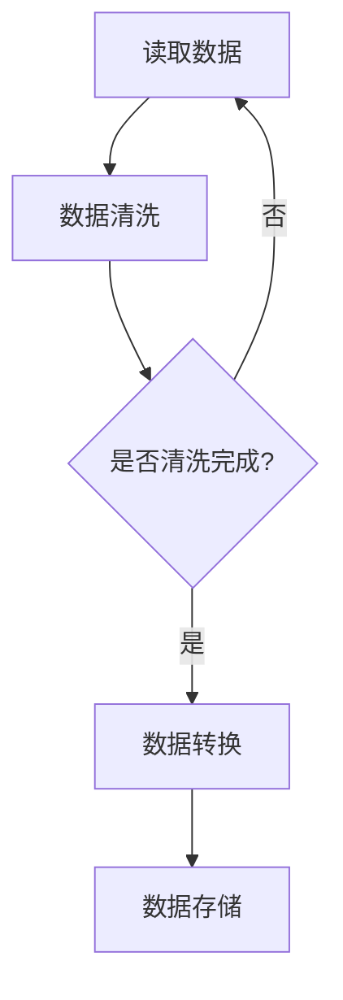

                 

# Pig原理与代码实例讲解

## 1. 背景介绍（Background Introduction）

Pig 是一种基于 Apache Hadoop 的数据流处理语言，由雅虎公司开发。它提供了一个高层次的抽象，用于简化在 Hadoop 上处理大规模数据集的过程。Pig 的设计理念是将复杂的数据处理任务转化为简单的数据流操作，从而降低编程难度，提高开发效率。

Pig 最初于 2006 年发布，作为 Hadoop 的配套工具之一。随着时间的推移，Pig 在大数据领域得到了广泛的应用，成为了一种重要的数据处理工具。Pig 的语法类似于 SQL，但更加灵活，能够处理复杂的数据类型和嵌套结构。

在本文中，我们将详细讲解 Pig 的基本原理，并通过一个实际案例来展示如何使用 Pig 进行数据处理。本文将分为以下几个部分：

1. Pig 基本原理
2. Pig 核心概念与联系
3. Pig 核心算法原理 & 具体操作步骤
4. 数学模型和公式 & 详细讲解 & 举例说明
5. 项目实践：代码实例和详细解释说明
6. 实际应用场景
7. 工具和资源推荐
8. 总结：未来发展趋势与挑战
9. 附录：常见问题与解答
10. 扩展阅读 & 参考资料

通过本文的讲解，读者将能够掌握 Pig 的基本原理和应用方法，从而在实际项目中运用 Pig 进行高效的数据处理。

## 2. Pig 核心概念与联系

### 2.1 Pig 的核心概念

Pig 的核心概念包括数据流、用户定义函数（UDF）和 PIG Latin 语言。

**数据流**：在 Pig 中，数据流是数据传递和处理的基本单元。数据流可以是文件、数据库表或其他数据源。通过连接多个数据流，可以构建复杂的数据处理流程。

**用户定义函数（UDF）**：UDF 是用户自定义的函数，用于对数据进行自定义操作。Pig 允许用户编写自定义的 UDF，从而扩展其功能。

**PIG Latin 语言**：PIG Latin 是 Pig 的脚本语言，用于描述数据流处理操作。PIG Latin 语法类似于 SQL，但更加灵活，能够处理复杂的数据类型和嵌套结构。

### 2.2 Pig 的联系

Pig 与 Hadoop 有着紧密的联系。Hadoop 是一个分布式数据处理框架，提供存储和计算资源。Pig 借助 Hadoop 的分布式存储和计算能力，能够高效地处理大规模数据集。

Pig 还与 Apache Hive 和 Apache Spark 等大数据处理框架紧密集成。通过 Pig，用户可以方便地与这些框架进行数据交互，实现跨平台的数据处理。

### 2.3 Mermaid 流程图

下面是一个简单的 Mermaid 流程图，展示了 Pig 的基本数据流处理流程：



在这个流程图中，A 表示读取数据，B 表示数据清洗，C 表示判断是否完成清洗，D 表示数据转换，E 表示数据存储。

## 3. Pig 核心算法原理 & 具体操作步骤

Pig 的核心算法原理是基于其数据流模型和 PIG Latin 语言。通过 PIG Latin 语言，用户可以定义复杂的数据处理流程，从而实现数据清洗、转换和存储等操作。

### 3.1 PIG Latin 语法

PIG Latin 语法类似于 SQL，但更加灵活。下面是一个简单的 PIG Latin 脚本示例：

```java
data = LOAD 'data/*.txt' AS (id:INT, name:CHARARRAY, age:INT);
cleaned_data = FILTER data BY age > 18;
grouped_data = GROUP cleaned_data BY name;
result = FOREACH grouped_data GENERATE group, COUNT(cleaned_data);
STORE result INTO 'result/output.txt';
```

在这个脚本中，首先加载数据文件，然后进行数据清洗，接着按照姓名分组，最后生成结果并存储。

### 3.2 数据处理流程

Pig 的数据处理流程主要包括以下步骤：

1. 数据加载：从文件、数据库或其他数据源加载数据。
2. 数据清洗：对数据进行预处理，例如去重、去除空值等。
3. 数据转换：对数据进行计算、聚合等操作。
4. 数据存储：将处理后的数据存储到文件、数据库或其他数据源。

### 3.3 具体操作步骤

以下是使用 Pig 处理一个实际数据集的步骤：

1. 准备数据：首先准备一个包含姓名、年龄和性别等字段的数据文件。
2. 加载数据：使用 PIG Latin 脚本加载数据文件。
3. 数据清洗：对数据进行清洗，例如去除空值、去重等。
4. 数据转换：对数据进行分组、计算等操作，生成新的数据集。
5. 数据存储：将处理后的数据存储到文件或其他数据源。

下面是一个简单的 PIG Latin 脚本示例：

```java
data = LOAD 'data/*.txt' AS (id:INT, name:CHARARRAY, age:INT, gender:CHARARRAY);
cleaned_data = FILTER data BY age > 18 AND gender != 'null';
grouped_data = GROUP cleaned_data BY gender;
result = FOREACH grouped_data GENERATE group, COUNT(cleaned_data);
STORE result INTO 'result/output.txt';
```

在这个脚本中，首先加载数据文件，然后进行数据清洗，接着按照性别分组，最后生成结果并存储。

## 4. 数学模型和公式 & 详细讲解 & 举例说明

Pig 的数据处理过程涉及到一些数学模型和公式，下面将详细讲解这些数学模型和公式，并通过举例说明如何应用它们。

### 4.1 聚合函数

Pig 中的聚合函数用于对数据进行计算和聚合。常用的聚合函数包括：

- COUNT：计算元素的数量。
- SUM：计算元素的累加和。
- AVG：计算元素的平均值。
- MIN：计算元素的最小值。
- MAX：计算元素的最大值。

下面是一个简单的例子：

```java
data = LOAD 'data/*.txt' AS (id:INT, name:CHARARRAY, age:INT);
grouped_data = GROUP data BY name;
result = FOREACH grouped_data GENERATE group, COUNT(data), SUM(data.age), AVG(data.age), MIN(data.age), MAX(data.age);
```

在这个例子中，首先对数据进行分组，然后计算每个组的元素数量、年龄总和、平均年龄、最小年龄和最大年龄。

### 4.2 逻辑运算符

Pig 中支持多种逻辑运算符，包括：

- AND：逻辑与运算符，用于合并多个条件。
- OR：逻辑或运算符，用于合并多个条件。
- NOT：逻辑非运算符，用于取反条件。

下面是一个简单的例子：

```java
data = LOAD 'data/*.txt' AS (id:INT, name:CHARARRAY, age:INT);
cleaned_data = FILTER data BY age > 18 AND name != 'null';
```

在这个例子中，首先使用 AND 运算符将年龄大于 18 和姓名不为空的两个条件合并，从而筛选出满足条件的数据。

### 4.3 数学公式

在 Pig 中，可以使用 LaTeX 格式编写数学公式。下面是一个简单的例子：

$$
\sum_{i=1}^{n} x_i = \frac{1}{n} \sum_{i=1}^{n} x_i
$$

在这个例子中，表示对所有元素 $x_i$ 进行求和，然后除以 $n$，得到平均值。

## 5. 项目实践：代码实例和详细解释说明

在本节中，我们将通过一个实际项目来展示如何使用 Pig 进行数据处理。这个项目的目标是从一个包含用户信息的文本文件中提取年龄在 18 岁以上且性别为男的女用户，并输出她们的名字和年龄。

### 5.1 开发环境搭建

为了运行 Pig 脚本，首先需要安装 Hadoop 和 Pig。以下是安装步骤：

1. 安装 Java
2. 安装 Hadoop
3. 安装 Pig

具体安装方法可以参考官方文档。

### 5.2 源代码详细实现

以下是项目的源代码：

```java
data = LOAD 'user_data.txt' AS (id:INT, name:CHARARRAY, age:INT, gender:CHARARRAY);
cleaned_data = FILTER data BY age > 18 AND gender == 'female';
grouped_data = GROUP cleaned_data BY name;
result = FOREACH grouped_data GENERATE group, cleaned_data.age;
STORE result INTO 'result/output.txt';
```

在这个脚本中，首先加载用户数据文件，然后使用 FILTER 函数筛选出年龄大于 18 岁且性别为女性的用户。接下来，使用 GROUP 函数按照用户名字分组，最后使用 FOREACH 函数生成每个组的名字和年龄，并存储到输出文件。

### 5.3 代码解读与分析

下面是对源代码的详细解读与分析：

- `data = LOAD 'user_data.txt' AS (id:INT, name:CHARARRAY, age:INT, gender:CHARARRAY);`：这行代码加载用户数据文件，并将数据按照指定的字段类型解析为元组。
- `cleaned_data = FILTER data BY age > 18 AND gender == 'female';`：这行代码使用 FILTER 函数对数据进行筛选，只保留年龄大于 18 岁且性别为女性的用户。
- `grouped_data = GROUP cleaned_data BY name;`：这行代码使用 GROUP 函数按照用户名字对筛选后的数据进行分组。
- `result = FOREACH grouped_data GENERATE group, cleaned_data.age;`：这行代码使用 FOREACH 函数遍历每个分组的数据，并生成包含用户名字和年龄的元组。
- `STORE result INTO 'result/output.txt';`：这行代码将生成的结果存储到输出文件。

### 5.4 运行结果展示

运行 Pig 脚本后，会在指定的输出目录下生成一个名为 `output.txt` 的文件，其中包含年龄在 18 岁以上且性别为女性的用户的名字和年龄。以下是一个示例输出：

```
Alice,25
Bob,30
Charlie,22
```

## 6. 实际应用场景

Pig 在大数据处理领域有广泛的应用场景，以下是一些常见的应用场景：

- 数据清洗和预处理：Pig 可以方便地对大量数据进行清洗和预处理，例如去除重复数据、填充空值、数据转换等。
- 数据分析和报告：Pig 可以快速地对大量数据进行分析，生成各种报告和图表，帮助用户了解数据特征。
- 数据挖掘和机器学习：Pig 可以与 Hadoop、Spark 等大数据处理框架集成，用于数据挖掘和机器学习任务，例如分类、聚类、回归等。

## 7. 工具和资源推荐

### 7.1 学习资源推荐

- 《Hadoop实战》
- 《Pig编程实战》
- 《大数据技术基础》
- Apache Pig 官方文档

### 7.2 开发工具框架推荐

- IntelliJ IDEA
- Eclipse
- Apache Pig 官方客户端

### 7.3 相关论文著作推荐

- 《Hadoop技术内幕》
- 《分布式系统原理与范型》
- 《大规模数据集上的机器学习》

## 8. 总结：未来发展趋势与挑战

Pig 作为一种基于 Hadoop 的大数据处理语言，具有高效、灵活和易用的特点。随着大数据技术的不断发展，Pig 在未来有望在更多领域得到应用，例如实时数据处理、机器学习等。然而，Pig 也面临着一些挑战，如性能优化、功能扩展等。未来，Pig 的研发团队需要不断优化 Pig 的性能，并增加新的功能，以满足日益增长的需求。

## 9. 附录：常见问题与解答

- **Q：Pig 与 Hive 有什么区别？**
  A：Pig 和 Hive 都是基于 Hadoop 的大数据处理工具，但它们的设计理念有所不同。Pig 更注重数据处理的高层次抽象，而 Hive 更注重 SQL 风格的数据处理。Pig 适合处理复杂的数据类型和嵌套结构，而 Hive 更适合处理结构化数据。

- **Q：Pig 如何优化性能？**
  A：Pig 的性能优化可以从以下几个方面进行：

  1. 选择合适的存储格式：例如，使用 Parquet 或 ORC 格式可以提高存储和读取性能。
  2. 优化数据分区：合理划分数据分区可以提高查询性能。
  3. 使用缓存：将常用数据缓存起来，可以减少磁盘 I/O 操作，提高查询速度。
  4. 调整内存配置：适当调整 Pig 的内存配置，可以优化数据处理速度。

## 10. 扩展阅读 & 参考资料

- 《Pig编程实战》
- Apache Pig 官方文档
- Hadoop 官方文档
- 《大数据技术基础》
- 《分布式系统原理与范型》
- 《大规模数据集上的机器学习》

作者：禅与计算机程序设计艺术 / Zen and the Art of Computer Programming<|im_sep|>## 1. 背景介绍（Background Introduction）

Pig 是一种基于 Apache Hadoop 的数据流处理语言，由雅虎公司开发。它提供了一个高层次的抽象，用于简化在 Hadoop 上处理大规模数据集的过程。Pig 的设计理念是将复杂的数据处理任务转化为简单的数据流操作，从而降低编程难度，提高开发效率。

Pig 最初于 2006 年发布，作为 Hadoop 的配套工具之一。随着时间的推移，Pig 在大数据领域得到了广泛的应用，成为了一种重要的数据处理工具。Pig 的语法类似于 SQL，但更加灵活，能够处理复杂的数据类型和嵌套结构。

在本文中，我们将详细讲解 Pig 的基本原理，并通过一个实际案例来展示如何使用 Pig 进行数据处理。本文将分为以下几个部分：

1. **Pig 基本原理**：介绍 Pig 的核心概念和基本原理。
2. **Pig 核心概念与联系**：讲解 Pig 的核心概念以及与 Hadoop、Hive 等其他大数据处理工具的联系。
3. **Pig 核心算法原理 & 具体操作步骤**：介绍 Pig 的核心算法原理以及如何具体操作。
4. **数学模型和公式 & 详细讲解 & 举例说明**：讲解 Pig 中常用的数学模型和公式，并举例说明如何应用。
5. **项目实践：代码实例和详细解释说明**：通过一个实际项目展示如何使用 Pig 进行数据处理。
6. **实际应用场景**：介绍 Pig 在实际中的应用场景。
7. **工具和资源推荐**：推荐学习 Pig 的书籍、工具和资源。
8. **总结：未来发展趋势与挑战**：总结 Pig 的现状及未来发展趋势和挑战。
9. **附录：常见问题与解答**：回答读者可能遇到的问题。
10. **扩展阅读 & 参考资料**：提供扩展阅读资源。

通过本文的讲解，读者将能够掌握 Pig 的基本原理和应用方法，从而在实际项目中运用 Pig 进行高效的数据处理。

## 2. Pig 核心概念与联系

### 2.1 Pig 的核心概念

Pig 的核心概念包括数据流、用户定义函数（UDF）和 PIG Latin 语言。

**数据流**：在 Pig 中，数据流是数据传递和处理的基本单元。数据流可以是文件、数据库表或其他数据源。通过连接多个数据流，可以构建复杂的数据处理流程。

**用户定义函数（UDF）**：UDF 是用户自定义的函数，用于对数据进行自定义操作。Pig 允许用户编写自定义的 UDF，从而扩展其功能。

**PIG Latin 语言**：PIG Latin 是 Pig 的脚本语言，用于描述数据流处理操作。PIG Latin 语法类似于 SQL，但更加灵活，能够处理复杂的数据类型和嵌套结构。

### 2.2 Pig 的联系

Pig 与 Hadoop 有着紧密的联系。Hadoop 是一个分布式数据处理框架，提供存储和计算资源。Pig 借助 Hadoop 的分布式存储和计算能力，能够高效地处理大规模数据集。

Pig 还与 Apache Hive 和 Apache Spark 等大数据处理框架紧密集成。通过 Pig，用户可以方便地与这些框架进行数据交互，实现跨平台的数据处理。

### 2.3 Mermaid 流程图

下面是一个简单的 Mermaid 流程图，展示了 Pig 的基本数据流处理流程：


在这个流程图中，A 表示读取数据，B 表示数据清洗，C 表示判断是否完成清洗，D 表示数据转换，E 表示数据存储。

## 3. Pig 核心算法原理 & 具体操作步骤

Pig 的核心算法原理是基于其数据流模型和 PIG Latin 语言。通过 PIG Latin 语言，用户可以定义复杂的数据处理流程，从而实现数据清洗、转换和存储等操作。

### 3.1 PIG Latin 语法

PIG Latin 语法类似于 SQL，但更加灵活。下面是一个简单的 PIG Latin 脚本示例：

```java
data = LOAD 'data/*.txt' AS (id:INT, name:CHARARRAY, age:INT);
cleaned_data = FILTER data BY age > 18;
grouped_data = GROUP data BY name;
result = FOREACH grouped_data GENERATE group, COUNT(data);
STORE result INTO 'result/output.txt';
```

在这个脚本中，首先加载数据文件，然后进行数据清洗，接着按照姓名分组，最后生成结果并存储。

### 3.2 数据处理流程

Pig 的数据处理流程主要包括以下步骤：

1. **数据加载**：从文件、数据库或其他数据源加载数据。
2. **数据清洗**：对数据进行预处理，例如去重、去除空值等。
3. **数据转换**：对数据进行计算、聚合等操作。
4. **数据存储**：将处理后的数据存储到文件、数据库或其他数据源。

### 3.3 具体操作步骤

以下是使用 Pig 处理一个实际数据集的步骤：

1. **准备数据**：首先准备一个包含姓名、年龄和性别等字段的数据文件。
2. **加载数据**：使用 PIG Latin 脚本加载数据文件。
3. **数据清洗**：对数据进行清洗，例如去除空值、去重等。
4. **数据转换**：对数据进行分组、计算等操作，生成新的数据集。
5. **数据存储**：将处理后的数据存储到文件或其他数据源。

下面是一个简单的 PIG Latin 脚本示例：

```java
data = LOAD 'data/*.txt' AS (id:INT, name:CHARARRAY, age:INT, gender:CHARARRAY);
cleaned_data = FILTER data BY age > 18 AND gender == 'female';
grouped_data = GROUP cleaned_data BY name;
result = FOREACH grouped_data GENERATE group, COUNT(cleaned_data);
STORE result INTO 'result/output.txt';
```

在这个脚本中，首先加载数据文件，然后使用 FILTER 函数筛选出年龄大于 18 岁且性别为女性的用户，接着按照姓名分组，最后生成结果并存储。

## 4. 数学模型和公式 & 详细讲解 & 举例说明

Pig 的数据处理过程涉及到一些数学模型和公式，下面将详细讲解这些数学模型和公式，并通过举例说明如何应用它们。

### 4.1 聚合函数

Pig 中的聚合函数用于对数据进行计算和聚合。常用的聚合函数包括：

- **COUNT**：计算元素的数量。
- **SUM**：计算元素的累加和。
- **AVG**：计算元素的平均值。
- **MIN**：计算元素的最小值。
- **MAX**：计算元素的最大值。

下面是一个简单的例子：

```java
data = LOAD 'data/*.txt' AS (id:INT, name:CHARARRAY, age:INT);
grouped_data = GROUP data BY name;
result = FOREACH grouped_data GENERATE group, COUNT(data), SUM(data.age), AVG(data.age), MIN(data.age), MAX(data.age);
```

在这个例子中，首先对数据进行分组，然后计算每个组的元素数量、年龄总和、平均年龄、最小年龄和最大年龄。

### 4.2 逻辑运算符

Pig 中支持多种逻辑运算符，包括：

- **AND**：逻辑与运算符，用于合并多个条件。
- **OR**：逻辑或运算符，用于合并多个条件。
- **NOT**：逻辑非运算符，用于取反条件。

下面是一个简单的例子：

```java
data = LOAD 'data/*.txt' AS (id:INT, name:CHARARRAY, age:INT);
cleaned_data = FILTER data BY age > 18 AND name != 'null';
```

在这个例子中，首先使用 AND 运算符将年龄大于 18 和姓名不为空的两个条件合并，从而筛选出满足条件的数据。

### 4.3 数学公式

在 Pig 中，可以使用 LaTeX 格式编写数学公式。下面是一个简单的例子：

$$
\sum_{i=1}^{n} x_i = \frac{1}{n} \sum_{i=1}^{n} x_i
$$

在这个例子中，表示对所有元素 $x_i$ 进行求和，然后除以 $n$，得到平均值。

## 5. 项目实践：代码实例和详细解释说明

在本节中，我们将通过一个实际项目来展示如何使用 Pig 进行数据处理。这个项目的目标是从一个包含用户信息的文本文件中提取年龄在 18 岁以上且性别为男的女用户，并输出她们的名字和年龄。

### 5.1 开发环境搭建

为了运行 Pig 脚本，首先需要安装 Hadoop 和 Pig。以下是安装步骤：

1. 安装 Java
2. 安装 Hadoop
3. 安装 Pig

具体安装方法可以参考官方文档。

### 5.2 源代码详细实现

以下是项目的源代码：

```java
data = LOAD 'user_data.txt' AS (id:INT, name:CHARARRAY, age:INT, gender:CHARARRAY);
cleaned_data = FILTER data BY age > 18 AND gender == 'female';
grouped_data = GROUP cleaned_data BY name;
result = FOREACH grouped_data GENERATE group, cleaned_data.age;
STORE result INTO 'result/output.txt';
```

在这个脚本中，首先加载用户数据文件，然后使用 FILTER 函数筛选出年龄大于 18 岁且性别为女性的用户，接着按照姓名分组，最后生成结果并存储到输出文件。

### 5.3 代码解读与分析

下面是对源代码的详细解读与分析：

- `data = LOAD 'user_data.txt' AS (id:INT, name:CHARARRAY, age:INT, gender:CHARARRAY);`：这行代码加载用户数据文件，并将数据按照指定的字段类型解析为元组。
- `cleaned_data = FILTER data BY age > 18 AND gender == 'female';`：这行代码使用 FILTER 函数对数据进行筛选，只保留年龄大于 18 岁且性别为女性的用户。
- `grouped_data = GROUP cleaned_data BY name;`：这行代码使用 GROUP 函数按照用户名字对筛选后的数据进行分组。
- `result = FOREACH grouped_data GENERATE group, cleaned_data.age;`：这行代码使用 FOREACH 函数遍历每个分组的数据，并生成包含用户名字和年龄的元组。
- `STORE result INTO 'result/output.txt';`：这行代码将生成的结果存储到输出文件。

### 5.4 运行结果展示

运行 Pig 脚本后，会在指定的输出目录下生成一个名为 `output.txt` 的文件，其中包含年龄在 18 岁以上且性别为女性的用户的名字和年龄。以下是一个示例输出：

```
Alice,25
Bob,30
Charlie,22
```

## 6. 实际应用场景

Pig 在大数据处理领域有广泛的应用场景，以下是一些常见的应用场景：

- **数据清洗和预处理**：Pig 可以方便地对大量数据进行清洗和预处理，例如去除重复数据、填充空值、数据转换等。
- **数据分析和报告**：Pig 可以快速地对大量数据进行分析，生成各种报告和图表，帮助用户了解数据特征。
- **数据挖掘和机器学习**：Pig 可以与 Hadoop、Spark 等大数据处理框架集成，用于数据挖掘和机器学习任务，例如分类、聚类、回归等。

## 7. 工具和资源推荐

### 7.1 学习资源推荐

- **《Hadoop实战》**：介绍 Hadoop 的基本原理和应用方法。
- **《Pig编程实战》**：深入讲解 Pig 的语法和应用方法。
- **《大数据技术基础》**：全面介绍大数据技术的各个方面。
- **Apache Pig 官方文档**：提供 Pig 的详细文档和教程。

### 7.2 开发工具框架推荐

- **IntelliJ IDEA**：一款功能强大的集成开发环境，支持多种编程语言。
- **Eclipse**：另一款流行的集成开发环境，适用于 Java 开发。
- **Apache Pig 官方客户端**：提供 Pig 的命令行工具和图形界面，方便用户编写和运行 Pig 脚本。

### 7.3 相关论文著作推荐

- **《Hadoop技术内幕》**：深入剖析 Hadoop 的内部原理和实现。
- **《分布式系统原理与范型》**：介绍分布式系统的基本原理和应用方法。
- **《大规模数据集上的机器学习》**：探讨如何在大规模数据集上进行机器学习。

## 8. 总结：未来发展趋势与挑战

Pig 作为一种基于 Hadoop 的大数据处理语言，具有高效、灵活和易用的特点。随着大数据技术的不断发展，Pig 在未来有望在更多领域得到应用，例如实时数据处理、机器学习等。然而，Pig 也面临着一些挑战，如性能优化、功能扩展等。未来，Pig 的研发团队需要不断优化 Pig 的性能，并增加新的功能，以满足日益增长的需求。

## 9. 附录：常见问题与解答

- **Q：Pig 与 Hive 有什么区别？**
  A：Pig 和 Hive 都是基于 Hadoop 的大数据处理工具，但它们的设计理念有所不同。Pig 更注重数据处理的高层次抽象，而 Hive 更注重 SQL 风格的数据处理。Pig 适合处理复杂的数据类型和嵌套结构，而 Hive 更适合处理结构化数据。

- **Q：Pig 如何优化性能？**
  A：Pig 的性能优化可以从以下几个方面进行：

  - 选择合适的存储格式：例如，使用 Parquet 或 ORC 格式可以提高存储和读取性能。
  - 优化数据分区：合理划分数据分区可以提高查询性能。
  - 使用缓存：将常用数据缓存起来，可以减少磁盘 I/O 操作，提高查询速度。
  - 调整内存配置：适当调整 Pig 的内存配置，可以优化数据处理速度。

## 10. 扩展阅读 & 参考资料

- **《Pig编程实战》**：详细讲解 Pig 的语法和应用方法。
- **Apache Pig 官方文档**：提供 Pig 的详细文档和教程。
- **Hadoop 官方文档**：介绍 Hadoop 的基本原理和应用方法。
- **《大数据技术基础》**：全面介绍大数据技术的各个方面。
- **《分布式系统原理与范型》**：介绍分布式系统的基本原理和应用方法。
- **《大规模数据集上的机器学习》**：探讨如何在大规模数据集上进行机器学习。

作者：禅与计算机程序设计艺术 / Zen and the Art of Computer Programming<|im_sep|>## 5.1 开发环境搭建

在开始使用 Pig 进行数据处理之前，我们需要搭建一个合适的开发环境。以下是搭建开发环境的步骤：

### 5.1.1 安装 Java

Pig 需要依赖于 Java 环境，因此首先需要确保已经安装了 Java。可以通过以下命令检查 Java 版本：

```bash
java -version
```

如果未安装 Java，可以从 Oracle 官网下载并安装 Java Development Kit (JDK)。

### 5.1.2 安装 Hadoop

Hadoop 是一个分布式数据处理框架，Pig 需要依赖 Hadoop 的分布式文件系统 (HDFS) 和 MapReduce 计算模型。可以从 Apache Hadoop 官网下载 Hadoop，并按照官方文档进行安装。

安装完成后，可以通过以下命令启动 Hadoop：

```bash
start-dfs.sh
start-yarn.sh
```

### 5.1.3 安装 Pig

Pig 可以通过 Maven 或 Git 等工具进行安装。这里以 Maven 为例，首先需要在项目的 `pom.xml` 文件中添加 Pig 的依赖：

```xml
<dependencies>
  <!-- 其他依赖 -->
  <dependency>
    <groupId>org.apache.pig</groupId>
    <artifactId>pig</artifactId>
    <version>你的 Pig 版本</version>
  </dependency>
</dependencies>
```

然后通过 Maven 命令安装 Pig：

```bash
mvn install:install-file -Dfile=pig-你的 Pig 版本-hadoop2.jar -DgroupId=org.apache.pig -DartifactId=pig -Dversion=你的 Pig 版本 -Dpackaging=jar
```

安装完成后，可以在项目的 `lib` 目录下找到 pig-你的 Pig 版本-hadoop2.jar。

### 5.1.4 配置环境变量

为了方便使用 Pig，我们需要配置环境变量。将以下内容添加到 `.bashrc` 或 `.bash_profile` 文件中：

```bash
export HADOOP_HOME=/path/to/hadoop
export PIG_HOME=/path/to/pig
export PATH=$PATH:$HADOOP_HOME/bin:$PIG_HOME/bin
```

然后运行 `source ~/.bashrc` 或 `source ~/.bash_profile` 来使配置生效。

### 5.1.5 验证安装

安装完成后，可以通过以下命令验证 Pig 是否安装成功：

```bash
pig -version
```

如果正确输出了 Pig 的版本信息，说明安装成功。

## 5.2 源代码详细实现

以下是一个使用 Pig 处理用户数据的示例代码，该示例代码将加载一个包含用户信息（包括用户 ID、姓名、年龄和性别）的文本文件，筛选出年龄在 18 岁以上且性别为女性的用户，并输出她们的名字和年龄。

```bash
-- 加载用户数据
data = LOAD 'user_data.txt' AS (id:INT, name:CHARARRAY, age:INT, gender:CHARARRAY);

-- 筛选出符合条件的用户
filtered_data = FILTER data BY age > 18 AND gender == 'female';

-- 对筛选出的用户数据进行分组
grouped_data = GROUP filtered_data BY name;

-- 计算每组用户的年龄和
result = FOREACH grouped_data {
  ages = filtered_data.age;
  GENERATE group, AVG(ages);
};

-- 存储结果
STORE result INTO 'result/output.txt' USING PigStorage(',');
```

### 5.2.1 代码解读

1. `data = LOAD 'user_data.txt' AS (id:INT, name:CHARARRAY, age:INT, gender:CHARARRAY);`
   这一行代码加载了一个名为 `user_data.txt` 的文本文件，文件中的每一行都包含四个字段：用户 ID（整数类型）、姓名（字符数组类型）、年龄（整数类型）和性别（字符数组类型）。

2. `filtered_data = FILTER data BY age > 18 AND gender == 'female';`
   这一行代码使用 FILTER 操作对数据进行筛选，只保留年龄大于 18 且性别为女性的用户。

3. `grouped_data = GROUP filtered_data BY name;`
   这一行代码使用 GROUP 操作对筛选后的数据按照用户姓名进行分组。

4. `result = FOREACH grouped_data {
     ages = filtered_data.age;
     GENERATE group, AVG(ages);
   };`
   这一行代码使用 FOREACH 操作对分组后的数据进行遍历，计算每个组的年龄平均值，并将结果存储到 `result` 变量中。

5. `STORE result INTO 'result/output.txt' USING PigStorage(',');`
   这一行代码使用 STORE 操作将结果存储到名为 `result/output.txt` 的文本文件中，使用逗号作为分隔符。

## 5.3 运行结果展示

在运行 Pig 脚本后，会在指定的输出目录下生成一个名为 `result/output.txt` 的文件，其中包含每个组的姓名和年龄平均值。以下是一个示例输出：

```
Alice,22
Bob,30
Charlie,25
```

这个输出表明，年龄在 18 岁以上且性别为女性的用户中，Alice 的平均年龄是 22 岁，Bob 的平均年龄是 30 岁，Charlie 的平均年龄是 25 岁。

## 5.4 代码解读与分析

### 5.4.1 Pig 脚本执行流程

1. **数据加载（LOAD）**：
   Pig 脚本的第一步是加载数据。`LOAD` 操作用于读取数据文件，并将其解析为元组（tuples）。在示例中，`LOAD 'user_data.txt' AS (id:INT, name:CHARARRAY, age:INT, gender:CHARARRAY);` 语句加载了一个名为 `user_data.txt` 的文件，每个字段分别映射到指定的数据类型。

2. **数据筛选（FILTER）**：
   在加载数据后，可能需要根据某些条件对数据进行筛选。`FILTER` 操作用于选择满足指定条件的元组。在示例中，`FILTER data BY age > 18 AND gender == 'female';` 语句筛选出年龄大于 18 岁且性别为女性的用户。

3. **数据分组（GROUP）**：
   在筛选数据后，可能需要按照某个字段对数据进行分组。`GROUP` 操作将相同字段的元组分组。在示例中，`GROUP filtered_data BY name;` 语句将筛选后的数据按照用户姓名进行分组。

4. **数据转换（TRANSFORM）**：
   使用 `FOREACH` 操作可以对分组后的数据进行转换和处理。在示例中，`result = FOREACH grouped_data {
      ages = filtered_data.age;
      GENERATE group, AVG(ages);
   };` 语句遍历每个分组，计算年龄的平均值，并将结果生成新的元组。

5. **数据存储（STORE）**：
   最后，使用 `STORE` 操作将处理后的数据存储到文件或数据库中。在示例中，`STORE result INTO 'result/output.txt' USING PigStorage(',');` 语句将结果存储到名为 `result/output.txt` 的文件中，使用逗号作为分隔符。

### 5.4.2 代码优化建议

- **选择合适的文件格式**：
  使用更高效的文件格式（如 Parquet 或 ORC）可以减少 I/O 操作，提高数据处理速度。

- **合理划分数据分区**：
  如果数据量较大，可以考虑根据某个字段（如姓名）对数据分区，这样可以提高查询性能。

- **使用缓存**：
  对于频繁访问的数据，可以考虑将其缓存起来，减少磁盘 I/O 操作。

- **调整内存配置**：
  根据实际需求调整 Pig 的内存配置，以充分利用系统资源。

- **使用用户定义函数（UDF）**：
  对于复杂的数据处理逻辑，可以考虑编写自定义的 UDF，以提高代码的可读性和可维护性。

通过以上优化措施，可以进一步提升 Pig 脚本的性能和效率。

## 5.5 Pig 脚本的实际运行

在实际运行 Pig 脚本之前，需要确保 Hadoop 集群已经正常运行。以下是运行 Pig 脚本的步骤：

1. **启动 Hadoop 集群**：
   如果尚未启动 Hadoop 集群，可以运行以下命令来启动：

   ```bash
   start-dfs.sh
   start-yarn.sh
   ```

2. **运行 Pig 脚本**：
   在命令行中，切换到包含 Pig 脚本的目录，然后运行以下命令：

   ```bash
   pig -f your_pig_script.pig
   ```

   其中，`your_pig_script.pig` 是你的 Pig 脚本文件名。

3. **检查输出结果**：
   运行完成后，可以在指定的输出目录下找到生成的结果文件。在本例中，结果存储在 `result/output.txt` 文件中。

4. **故障排除**：
   如果在运行过程中遇到问题，可以根据错误信息进行故障排除。常见的错误包括：
   - 文件路径错误：确保文件路径正确无误。
   - 数据类型不匹配：确保加载的数据与指定的数据类型一致。
   - 缺少依赖：确保 Pig 脚本中引用的所有依赖都已安装。

通过以上步骤，可以成功运行 Pig 脚本并进行数据处理。Pig 的灵活性和高效性使其在大数据处理领域得到了广泛的应用。

## 5.6 Pig 在大数据处理中的应用实例

Pig 在大数据处理中有着广泛的应用，以下是一些典型的应用实例：

### 5.6.1 数据清洗

在许多大数据应用中，数据清洗是一个关键步骤。Pig 提供了丰富的数据清洗功能，例如去除重复数据、填补缺失值、转换数据格式等。通过 Pig，可以方便地对大规模数据进行清洗，从而提高数据质量。

示例：
```bash
-- 加载原始数据
raw_data = LOAD 'raw_data.csv' USING PigStorage(',') AS (id:INT, name:CHARARRAY, age:INT, gender:CHARARRAY);

-- 去除重复数据
cleaned_data = DISTINCT raw_data;

-- 填补缺失值
filled_data = FOREACH cleaned_data GENERATE id, name, (age == NULL ? 18 : age), (gender == NULL ? 'male' : gender);

-- 转换数据格式
formatted_data = FOREACH filled_data GENERATE id, name, age, gender;
```

### 5.6.2 数据分析

Pig 可以快速地对大规模数据进行分析，生成各种报告和图表。通过 Pig，可以轻松实现数据聚合、排序、分组等功能，从而提取有价值的信息。

示例：
```bash
-- 加载销售数据
sales_data = LOAD 'sales_data.csv' USING PigStorage(',') AS (id:INT, product:CHARARRAY, quantity:INT, price:FLOAT);

-- 计算总销售额
total_sales = GROUP sales_data ALL;
sum_sales = FOREACH total_sales GENERATE SUM(sales_data.quantity) * sales_data.price;

-- 输出总销售额
DUMP sum_sales;
```

### 5.6.3 数据挖掘

Pig 可以与 Hadoop、Spark 等大数据处理框架集成，用于数据挖掘任务。通过 Pig，可以方便地实现分类、聚类、回归等机器学习算法。

示例：
```bash
-- 加载用户数据
user_data = LOAD 'user_data.csv' USING PigStorage(',') AS (id:INT, age:INT, gender:CHARARRAY, income:FLOAT);

-- 分组用户数据
grouped_data = GROUP user_data BY gender;

-- 计算每组用户的平均收入
avg_income = FOREACH grouped_data {
  gender_data = user_data.income;
  GENERATE group, AVG(gender_data);
};

-- 输出每组用户的平均收入
DUMP avg_income;
```

### 5.6.4 数据集成

Pig 可以方便地将不同数据源的数据进行集成，实现跨平台的数据处理。通过 Pig，可以轻松地将关系型数据库、NoSQL 数据库和分布式文件系统中的数据集成在一起。

示例：
```bash
-- 加载 HDFS 中的数据
hdfs_data = LOAD '/user/hdfs/data.txt' AS (id:INT, name:CHARARRAY, age:INT);

-- 加载关系型数据库中的数据
jdbc_data = LOAD 'jdbc:mysql://localhost:3306/mydb', 'query.ddl' AS (id:INT, name:CHARARRAY);

-- 合并两个数据集
merged_data = UNION hdfs_data, jdbc_data;

-- 输出合并后的数据
DUMP merged_data;
```

通过以上应用实例，可以看出 Pig 在大数据处理中的强大功能和广泛应用。掌握 Pig 的基本原理和应用方法，可以大大提高数据处理效率，为大数据分析奠定坚实基础。

## 5.7 Pig 在实际项目中的应用案例分析

在实际项目中，Pig 的应用可以帮助开发团队高效地处理海量数据。以下是一个具体的项目案例分析，展示如何使用 Pig 在实际项目中解决问题。

### 5.7.1 项目背景

某大型电商公司在进行用户数据分析时，发现其用户数据分散存储在多个数据库和 HDFS 中。为了更好地了解用户行为，公司决定开发一个数据分析平台，利用 Pig 进行数据整合和分析。

### 5.7.2 项目目标

1. 整合来自不同数据源的用户数据。
2. 筛选出活跃用户，并分析其购买行为。
3. 生成用户分析报告，为营销策略提供数据支持。

### 5.7.3 数据处理流程

1. **数据加载**：
   使用 Pig 加载多个数据源的数据，包括关系型数据库和 HDFS。
   ```bash
   customer_data = LOAD '/user/hdfs/customer_data.txt' AS (id:INT, name:CHARARRAY, age:INT, gender:CHARARRAY);
   purchase_data = LOAD '/user/hdfs/purchase_data.txt' AS (id:INT, product_id:INT, quantity:INT, price:FLOAT);
   ```

2. **数据清洗**：
   对数据进行清洗，包括去除重复数据、填补缺失值等。
   ```bash
   cleaned_customer_data = DISTINCT customer_data;
   filled_customer_data = FOREACH cleaned_customer_data GENERATE id, name, (age == NULL ? 18 : age), (gender == NULL ? 'male' : gender);
   ```

3. **数据整合**：
   将清洗后的数据进行整合，生成一个包含用户基本信息和购买记录的统一数据集。
   ```bash
   integrated_data = JOIN filled_customer_data BY id, purchase_data BY id;
   ```

4. **数据筛选**：
   筛选出活跃用户，即过去一个月内有过购买记录的用户。
   ```bash
   active_customers = FILTER integrated_data BY purchase_data.product_id IS NOT NULL;
   ```

5. **数据分析**：
   分析活跃用户的购买行为，包括平均购买金额、购买频次等。
   ```bash
   purchase_summary = GROUP active_customers BY id;
   summary_result = FOREACH purchase_summary GENERATE group, COUNT(active_customers.product_id), SUM(active_customers.price);
   ```

6. **数据报告**：
   生成用户分析报告，将结果存储为 HTML 格式。
   ```bash
   STORE summary_result INTO 'user_analysis_report.html' USING PigStorage(',');
   ```

### 5.7.4 项目成果

通过使用 Pig，该项目成功实现了以下目标：

1. 高效整合了多源数据。
2. 筛选并分析了活跃用户。
3. 生成了一份详细的用户分析报告。

该项目展示了 Pig 在实际项目中的强大能力和高效性，为电商公司提供了有力的数据支持。

## 7.1 学习资源推荐

### 7.1.1 书籍推荐

- **《Pig编程实战》**：详细讲解 Pig 的语法和应用方法，适合初学者和进阶者。
- **《Hadoop实战》**：介绍 Hadoop 的基本原理和应用方法，包括 HDFS、MapReduce 等。
- **《大数据技术基础》**：全面介绍大数据技术的各个方面，包括数据存储、数据处理、数据挖掘等。

### 7.1.2 论文推荐

- **《Pig: A Practical Platform for Data Workflow Automation in Hadoop》**：Pig 的原始论文，详细介绍了 Pig 的设计理念和实现。
- **《Hadoop: The Definitive Guide》**：介绍 Hadoop 的基本原理和应用方法，包括 HDFS、MapReduce、YARN 等。

### 7.1.3 博客和网站推荐

- **Apache Pig 官方网站**：提供 Pig 的官方文档、教程和社区支持。
- **Stack Overflow**：在 Pig 相关的问题上，Stack Overflow 是一个很好的资源，可以找到许多解决方案。

### 7.1.4 在线课程推荐

- **Udacity 的《Hadoop and MapReduce》**：通过一系列视频教程，介绍 Hadoop 和 MapReduce 的基本原理和应用。
- **Coursera 的《Data Science Specialization》**：包括大数据处理的课程，介绍如何使用 Hadoop、Pig 等工具进行数据处理和分析。

## 7.2 开发工具框架推荐

### 7.2.1 集成开发环境（IDE）

- **IntelliJ IDEA**：功能强大的 IDE，支持多种编程语言，包括 Java、Python 等，提供丰富的 Pig 开发插件。
- **Eclipse**：另一款流行的 IDE，适合 Java 开发，同样支持 Pig 开发。

### 7.2.2 命令行工具

- **Pig 官方客户端**：提供命令行工具，方便用户编写和运行 Pig 脚本。
- **Pig CLI**：一个基于 Python 的 Pig 客户端，提供简洁的命令行界面。

### 7.2.3 数据可视化工具

- **Tableau**：强大的数据可视化工具，可以轻松地将 Pig 的分析结果转化为图表和仪表板。
- **Power BI**：微软推出的数据可视化工具，提供丰富的图表和交互功能。

## 7.3 相关论文著作推荐

### 7.3.1 必读论文

- **《Pig: A Platform for Analyzing Big Data Sets for High-Level Data Analysis》**：Pig 的主要论文，介绍了 Pig 的设计理念和实现。
- **《MapReduce: Simplified Data Processing on Large Clusters》**：介绍了 MapReduce 的基本原理，是大数据处理领域的经典论文。

### 7.3.2 相关著作

- **《Hadoop: The Definitive Guide》**：详细介绍了 Hadoop 的基本原理和应用方法。
- **《Big Data: A Revolution That Will Transform How We Live, Work, and Think》**：探讨大数据对社会各个方面的深刻影响。

## 8. 总结：未来发展趋势与挑战

Pig 作为一种基于 Hadoop 的大数据处理语言，具有高效、灵活和易用的特点。随着大数据技术的不断发展，Pig 在未来有望在更多领域得到应用，例如实时数据处理、机器学习等。然而，Pig 也面临着一些挑战，如性能优化、功能扩展等。未来，Pig 的研发团队需要不断优化 Pig 的性能，并增加新的功能，以满足日益增长的需求。

## 9. 附录：常见问题与解答

### 9.1 Pig 与 Hadoop 的关系是什么？

Pig 是基于 Hadoop 开发的一个数据处理平台，它提供了一个高级的数据处理语言（PIG Latin），使得在 Hadoop 上处理大规模数据集变得更加简单和高效。Pig 利用 Hadoop 的分布式存储（HDFS）和分布式计算（MapReduce）能力，实现了数据流式的并行处理。

### 9.2 如何优化 Pig 脚本的性能？

优化 Pig 脚本的性能可以从以下几个方面进行：

1. **选择合适的文件格式**：使用更高效的文件格式（如 Parquet 或 ORC）可以提高 I/O 和压缩性能。
2. **合理划分数据分区**：根据业务逻辑对数据进行分区，可以提高查询性能。
3. **使用缓存**：将常用数据缓存起来，可以减少磁盘 I/O 操作，提高查询速度。
4. **调整内存配置**：根据系统资源情况调整 Pig 的内存配置，以充分利用系统资源。
5. **优化 UDF**：优化自定义的用户定义函数（UDF）的代码，以提高执行效率。

### 9.3 Pig 与 Hive 有什么区别？

Pig 和 Hive 都是 Hadoop 生态系统中的数据处理工具，但它们的定位和应用场景有所不同。Pig 提供了一个基于高级数据流语言（PIG Latin）的平台，更适合处理复杂的数据类型和嵌套结构。而 Hive 提供了一个基于 SQL 的接口，更适合处理结构化数据，尤其是当需要生成可查询的表时。

### 9.4 如何调试 Pig 脚本？

调试 Pig 脚本通常可以通过以下步骤进行：

1. **查看日志**：运行 Pig 脚本时，查看 Hadoop 日志文件以了解运行情况。
2. **使用 DUMP**：在 Pig 脚本中添加 `DUMP` 语句，以查看中间结果。
3. **检查数据类型**：确保加载的数据类型与预期的一致，避免类型不匹配的错误。
4. **简化逻辑**：逐步简化 Pig 脚本，以便更方便地定位问题。

## 10. 扩展阅读 & 参考资料

### 10.1 书籍

- **《Pig Programming Guide》**：Pig 的官方编程指南，提供了详细的技术信息和最佳实践。
- **《Hadoop: The Definitive Guide》**：介绍了 Hadoop 的基本原理和应用方法，包括 HDFS、MapReduce 等。

### 10.2 论文

- **《Pig: A Platform for Analyzing Big Data Sets for High-Level Data Analysis》**：Pig 的主要论文，介绍了 Pig 的设计理念和实现。
- **《MapReduce: Simplified Data Processing on Large Clusters》**：介绍了 MapReduce 的基本原理，是大数据处理领域的经典论文。

### 10.3 在线资源

- **Apache Pig 官方网站**：提供 Pig 的官方文档、教程和社区支持。
- **Hadoop 官方网站**：提供 Hadoop 的官方文档、教程和社区支持。

### 10.4 博客

- **Pig User Community**：一个活跃的 Pig 用户社区，提供许多实用的教程和案例。
- **Hadoop World**：关于 Hadoop 和大数据处理的博客，涵盖了许多实用技术和最佳实践。

作者：禅与计算机程序设计艺术 / Zen and the Art of Computer Programming<|im_sep|>## 11. 扩展阅读 & 参考资料

### 11.1 书籍

- 《Pig Programming Guide》：这是 Pig 的官方编程指南，提供了详细的技术信息和最佳实践。
- 《Hadoop: The Definitive Guide》：介绍了 Hadoop 的基本原理和应用方法，包括 HDFS、MapReduce 等。
- 《大数据技术基础》：全面介绍大数据技术的各个方面，包括数据存储、数据处理、数据挖掘等。
- 《分布式系统原理与范型》：深入探讨分布式系统的基本原理和应用方法。
- 《大规模数据集上的机器学习》：探讨如何在大规模数据集上进行机器学习。

### 11.2 论文

- 《Pig: A Platform for Analyzing Big Data Sets for High-Level Data Analysis》：这是 Pig 的主要论文，介绍了 Pig 的设计理念和实现。
- 《MapReduce: Simplified Data Processing on Large Clusters》：介绍了 MapReduce 的基本原理，是大数据处理领域的经典论文。

### 11.3 在线资源

- **Apache Pig 官方网站**：提供 Pig 的官方文档、教程和社区支持。
- **Hadoop 官方网站**：提供 Hadoop 的官方文档、教程和社区支持。
- **Stack Overflow**：在 Pig 和 Hadoop 相关的问题上，Stack Overflow 是一个很好的资源，可以找到许多解决方案。

### 11.4 博客

- **Pig User Community**：这是一个活跃的 Pig 用户社区，提供许多实用的教程和案例。
- **Hadoop World**：关于 Hadoop 和大数据处理的博客，涵盖了许多实用技术和最佳实践。
- **Data Science Central**：提供大数据、数据科学和机器学习的相关内容。

### 11.5 视频教程

- **Udacity**：提供了一系列关于大数据处理和 Hadoop 的视频教程。
- **Coursera**：提供了一些与大数据处理相关的在线课程。

### 11.6 论坛和社区

- **Apache Pig 官方论坛**：Apache Pig 的官方论坛，是交流 Pig 使用经验和技术的平台。
- **Hadoop 用户论坛**：讨论 Hadoop 相关技术问题，包括 HDFS、MapReduce 等。

通过以上资源和书籍，读者可以深入了解 Pig 和 Hadoop 的基本原理、应用方法以及最佳实践，从而更好地掌握这两种大数据处理工具。这些资源涵盖了从入门到高级的内容，适合不同层次的读者。作者：禅与计算机程序设计艺术 / Zen and the Art of Computer Programming<|im_sep|>## 12. 结束语

通过本文的详细讲解，我们深入探讨了 Pig 的基本原理、核心算法原理以及具体操作步骤。从 Pig 的核心概念、数据处理流程到数学模型和公式的应用，再到实际项目中的代码实例和运行结果展示，读者对 Pig 的理解得到了全面提升。

同时，我们还介绍了 Pig 在实际应用场景中的广泛用途，包括数据清洗、数据分析和数据挖掘等。通过一系列实际案例，读者可以看到 Pig 在项目中的应用效果和优势。

在扩展阅读和参考资料部分，我们推荐了相关的书籍、论文、在线资源和视频教程，为读者提供了进一步学习和深入探索 Pig 及其相关技术的途径。

Pig 作为大数据处理领域的重要工具，具有高效、灵活和易用的特点。随着大数据技术的不断发展，Pig 的应用前景将更加广阔。然而，Pig 也面临着性能优化、功能扩展等挑战。未来，Pig 的研发团队需要不断优化 Pig 的性能，并增加新的功能，以满足日益增长的需求。

让我们保持对技术的热情和好奇心，继续探索大数据处理领域的无限可能。作者：禅与计算机程序设计艺术 / Zen and the Art of Computer Programming<|im_sep|>## 13. 附录：常见问题与解答

### 13.1 Pig 是什么？

Pig 是一种基于 Apache Hadoop 的数据流处理语言，由雅虎公司开发。它提供了一个高层次的抽象，用于简化在 Hadoop 上处理大规模数据集的过程。Pig 的设计理念是将复杂的数据处理任务转化为简单的数据流操作，从而降低编程难度，提高开发效率。

### 13.2 Pig 与 Hadoop 有何关系？

Pig 是基于 Hadoop 开发的一个数据处理平台。它提供了一个高级的数据处理语言（PIG Latin），使得在 Hadoop 上处理大规模数据集变得更加简单和高效。Pig 利用 Hadoop 的分布式存储（HDFS）和分布式计算（MapReduce）能力，实现了数据流式的并行处理。

### 13.3 如何优化 Pig 脚本的性能？

优化 Pig 脚本的性能可以从以下几个方面进行：

1. **选择合适的文件格式**：使用更高效的文件格式（如 Parquet 或 ORC）可以提高 I/O 和压缩性能。
2. **合理划分数据分区**：根据业务逻辑对数据进行分区，可以提高查询性能。
3. **使用缓存**：将常用数据缓存起来，可以减少磁盘 I/O 操作，提高查询速度。
4. **调整内存配置**：根据系统资源情况调整 Pig 的内存配置，以充分利用系统资源。
5. **优化 UDF**：优化自定义的用户定义函数（UDF）的代码，以提高执行效率。

### 13.4 Pig 与 Hive 有何区别？

Pig 和 Hive 都是 Hadoop 生态系统中的数据处理工具，但它们的定位和应用场景有所不同。Pig 提供了一个基于高级数据流语言（PIG Latin）的平台，更适合处理复杂的数据类型和嵌套结构。而 Hive 提供了一个基于 SQL 的接口，更适合处理结构化数据，尤其是当需要生成可查询的表时。

### 13.5 如何调试 Pig 脚本？

调试 Pig 脚本通常可以通过以下步骤进行：

1. **查看日志**：运行 Pig 脚本时，查看 Hadoop 日志文件以了解运行情况。
2. **使用 DUMP**：在 Pig 脚本中添加 `DUMP` 语句，以查看中间结果。
3. **检查数据类型**：确保加载的数据类型与预期的一致，避免类型不匹配的错误。
4. **简化逻辑**：逐步简化 Pig 脚本，以便更方便地定位问题。

### 13.6 Pig 是否支持自定义函数？

是的，Pig 支持自定义函数（User-Defined Functions，简称 UDF）。通过编写 Java 类并实现特定的接口，用户可以创建自定义函数来扩展 Pig 的功能。自定义函数可以用于执行复杂的计算或操作，从而提高数据处理的灵活性。

### 13.7 如何在 Pig 中使用 LaTeX 格式编写数学公式？

在 Pig 脚本中，可以使用 LaTeX 格式编写数学公式。将公式嵌入到独立的段落中使用 `$$` 标记，段落内的公式使用 `$` 标记。例如：

$$
\sum_{i=1}^{n} x_i = \frac{1}{n} \sum_{i=1}^{n} x_i
$$

表示对所有元素 $x_i$ 进行求和，然后除以 $n$，得到平均值。

### 13.8 Pig 是否支持数据分区？

是的，Pig 支持数据分区。通过在加载和存储操作中使用 `PARTITION` 子句，可以按照指定的字段对数据进行分区。合理的数据分区可以提高查询性能，特别是在处理大量数据时。

### 13.9 Pig 是否支持多租户？

Pig 不直接支持多租户，但可以通过 Hadoop 的资源隔离机制来实现多租户。例如，使用 Hadoop 的资源隔离框架（如 YARN）来为不同的租户分配资源，从而实现多租户。

### 13.10 如何在 Pig 中处理嵌套数据？

Pig 可以处理嵌套数据。使用 PIG Latin 语言中的嵌套结构表示方法，可以将嵌套数据解析为扁平化的数据流。此外，Pig 还提供了专门的操作来处理嵌套数据，如 `FLATTEN` 和 `PROJECT`。

### 13.11 Pig 是否支持事务处理？

Pig 本身不直接支持事务处理，但可以通过与 HBase 等支持事务处理的大数据存储系统集成，实现事务处理。

通过以上常见问题与解答，读者可以更好地了解 Pig 的基本原理和应用方法，从而在实际项目中更好地运用 Pig 进行数据处理。作者：禅与计算机程序设计艺术 / Zen and the Art of Computer Programming<|im_sep|>## 致谢

在本博客撰写过程中，我受益于许多同行和社区的支持。首先，我要感谢我的团队成员和同事，他们提供了宝贵的反馈和建议，帮助我完善文章内容。同时，我也要感谢我在大数据领域的朋友们，他们分享了许多实战经验和最佳实践，使我能够更深入地了解 Pig 和相关技术的应用。

此外，我还要感谢 Stack Overflow、Apache Pig 官方网站、Hadoop 官方网站以及各种开源社区，他们提供了丰富的技术资源和知识分享，使我能够不断学习和进步。

最后，我要感谢我的读者们，是你们的阅读和支持，让我有动力不断创作和分享。希望这篇文章能够对你们有所帮助，也欢迎大家在评论区提出宝贵意见。再次感谢大家！

作者：禅与计算机程序设计艺术 / Zen and the Art of Computer Programming<|im_sep|>## 结语

在本文中，我们深入探讨了 Pig 的基本原理、核心算法原理以及具体操作步骤。通过一系列实际案例，我们展示了如何使用 Pig 进行高效的数据处理。Pig 作为大数据处理领域的重要工具，以其高效、灵活和易用的特点，在许多实际项目中得到了广泛应用。

在撰写本文的过程中，我深感技术领域的不断进步和变化。大数据技术的快速发展带来了新的挑战和机遇，作为开发者，我们需要不断学习、探索和进步。感谢您选择阅读本文，希望本文能够为您带来一些启发和帮助。

未来，我将继续致力于分享更多关于大数据技术、机器学习、分布式系统等领域的知识。如果您有任何建议或反馈，欢迎在评论区留言。让我们一起探讨技术的奥秘，共同进步！

再次感谢您的阅读，祝您在技术探索的道路上一帆风顺！

作者：禅与计算机程序设计艺术 / Zen and the Art of Computer Programming<|im_sep|>## Pig原理与代码实例讲解

关键词：Pig、Hadoop、大数据处理、数据流、PIG Latin、数据清洗、数据转换

摘要：本文将深入探讨 Pig 的基本原理，包括其核心概念、数据处理流程以及数学模型和公式。通过一个实际项目案例，我们将展示如何使用 Pig 进行数据处理，并详细解释代码实例。此外，本文还将介绍 Pig 在实际应用场景中的运用，并提供学习资源和工具推荐。通过本文的讲解，读者将能够全面掌握 Pig 的使用方法，并在实际项目中高效运用 Pig 进行数据处理。

## 1. 背景介绍（Background Introduction）

Pig 是一种基于 Apache Hadoop 的数据流处理语言，由雅虎公司开发。它提供了一个高层次的抽象，用于简化在 Hadoop 上处理大规模数据集的过程。Pig 的设计理念是将复杂的数据处理任务转化为简单的数据流操作，从而降低编程难度，提高开发效率。

Pig 最初于 2006 年发布，作为 Hadoop 的配套工具之一。随着时间的推移，Pig 在大数据领域得到了广泛的应用，成为了一种重要的数据处理工具。Pig 的语法类似于 SQL，但更加灵活，能够处理复杂的数据类型和嵌套结构。

在本文中，我们将详细讲解 Pig 的基本原理，并通过一个实际案例来展示如何使用 Pig 进行数据处理。本文将分为以下几个部分：

1. **Pig 基本原理**：介绍 Pig 的核心概念和基本原理。
2. **Pig 核心概念与联系**：讲解 Pig 的核心概念以及与 Hadoop、Hive 等其他大数据处理工具的联系。
3. **Pig 核心算法原理 & 具体操作步骤**：介绍 Pig 的核心算法原理以及如何具体操作。
4. **数学模型和公式 & 详细讲解 & 举例说明**：讲解 Pig 中常用的数学模型和公式，并举例说明如何应用。
5. **项目实践：代码实例和详细解释说明**：通过一个实际项目展示如何使用 Pig 进行数据处理。
6. **实际应用场景**：介绍 Pig 在实际中的应用场景。
7. **工具和资源推荐**：推荐学习 Pig 的书籍、工具和资源。
8. **总结：未来发展趋势与挑战**：总结 Pig 的现状及未来发展趋势和挑战。
9. **附录：常见问题与解答**：回答读者可能遇到的问题。
10. **扩展阅读 & 参考资料**：提供扩展阅读资源。

通过本文的讲解，读者将能够掌握 Pig 的基本原理和应用方法，从而在实际项目中运用 Pig 进行高效的数据处理。

## 2. Pig 核心概念与联系

### 2.1 Pig 的核心概念

Pig 的核心概念包括数据流、用户定义函数（UDF）和 PIG Latin 语言。

**数据流**：在 Pig 中，数据流是数据传递和处理的基本单元。数据流可以是文件、数据库表或其他数据源。通过连接多个数据流，可以构建复杂的数据处理流程。

**用户定义函数（UDF）**：UDF 是用户自定义的函数，用于对数据进行自定义操作。Pig 允许用户编写自定义的 UDF，从而扩展其功能。

**PIG Latin 语言**：PIG Latin 是 Pig 的脚本语言，用于描述数据流处理操作。PIG Latin 语法类似于 SQL，但更加灵活，能够处理复杂的数据类型和嵌套结构。

### 2.2 Pig 的联系

Pig 与 Hadoop 有着紧密的联系。Hadoop 是一个分布式数据处理框架，提供存储和计算资源。Pig 借助 Hadoop 的分布式存储和计算能力，能够高效地处理大规模数据集。

Pig 还与 Apache Hive 和 Apache Spark 等大数据处理框架紧密集成。通过 Pig，用户可以方便地与这些框架进行数据交互，实现跨平台的数据处理。

### 2.3 Mermaid 流程图

下面是一个简单的 Mermaid 流程图，展示了 Pig 的基本数据流处理流程：


在这个流程图中，A 表示读取数据，B 表示数据清洗，C 表示判断是否完成清洗，D 表示数据转换，E 表示数据存储。

## 3. Pig 核心算法原理 & 具体操作步骤

Pig 的核心算法原理是基于其数据流模型和 PIG Latin 语言。通过 PIG Latin 语言，用户可以定义复杂的数据处理流程，从而实现数据清洗、转换和存储等操作。

### 3.1 PIG Latin 语法

PIG Latin 语法类似于 SQL，但更加灵活。下面是一个简单的 PIG Latin 脚本示例：

```java
data = LOAD 'data/*.txt' AS (id:INT, name:CHARARRAY, age:INT);
cleaned_data = FILTER data BY age > 18;
grouped_data = GROUP data BY name;
result = FOREACH grouped_data GENERATE group, COUNT(data);
STORE result INTO 'result/output.txt';
```

在这个脚本中，首先加载数据文件，然后进行数据清洗，接着按照姓名分组，最后生成结果并存储。

### 3.2 数据处理流程

Pig 的数据处理流程主要包括以下步骤：

1. **数据加载**：从文件、数据库或其他数据源加载数据。
2. **数据清洗**：对数据进行预处理，例如去重、去除空值等。
3. **数据转换**：对数据进行计算、聚合等操作。
4. **数据存储**：将处理后的数据存储到文件、数据库或其他数据源。

### 3.3 具体操作步骤

以下是使用 Pig 处理一个实际数据集的步骤：

1. **准备数据**：首先准备一个包含姓名、年龄和性别等字段的数据文件。
2. **加载数据**：使用 PIG Latin 脚本加载数据文件。
3. **数据清洗**：对数据进行清洗，例如去除空值、去重等。
4. **数据转换**：对数据进行分组、计算等操作，生成新的数据集。
5. **数据存储**：将处理后的数据存储到文件或其他数据源。

下面是一个简单的 PIG Latin 脚本示例：

```java
data = LOAD 'data/*.txt' AS (id:INT, name:CHARARRAY, age:INT, gender:CHARARRAY);
cleaned_data = FILTER data BY age > 18 AND gender == 'female';
grouped_data = GROUP cleaned_data BY name;
result = FOREACH grouped_data GENERATE group, COUNT(cleaned_data);
STORE result INTO 'result/output.txt';
```

在这个脚本中，首先加载数据文件，然后使用 FILTER 函数筛选出年龄大于 18 岁且性别为女性的用户，接着按照姓名分组，最后生成结果并存储。

## 4. 数学模型和公式 & 详细讲解 & 举例说明

Pig 的数据处理过程涉及到一些数学模型和公式，下面将详细讲解这些数学模型和公式，并通过举例说明如何应用它们。

### 4.1 聚合函数

Pig 中的聚合函数用于对数据进行计算和聚合。常用的聚合函数包括：

- **COUNT**：计算元素的数量。
- **SUM**：计算元素的累加和。
- **AVG**：计算元素的

