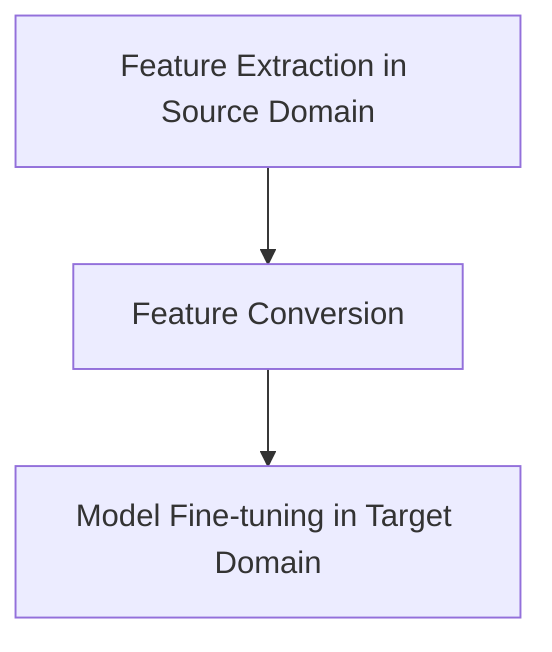

                 

### 文章标题

"一切皆是映射：深度学习模型之间的知识迁移"（"Everything is a Mapping: Knowledge Transfer between Deep Learning Models"）

### 关键词

- 深度学习
- 知识迁移
- 模型映射
- 零样本学习
- 自适应学习
- 跨域迁移

### 摘要

本文深入探讨深度学习模型之间的知识迁移，一个日益受到关注的领域，特别是在零样本学习和自适应学习场景中。我们将探讨核心概念，包括模型映射、特征共享、预训练与微调等。通过数学模型和具体操作步骤的讲解，我们将展示如何在不同的任务和数据集之间转移知识。接着，我们将通过实际项目实例来详细解释说明知识迁移的实际应用，并探讨其在各种实际应用场景中的潜力。最后，我们将总结未来发展趋势和挑战，为读者提供相关工具和资源的推荐。

## 1. 背景介绍（Background Introduction）

深度学习在人工智能领域取得了显著的进展，尤其是在图像识别、自然语言处理和语音识别等任务中。然而，深度学习模型的训练通常需要大量的数据和计算资源，这对于许多实际应用场景来说是一个挑战。知识迁移（Knowledge Transfer）作为一种解决方法，旨在通过将知识从一个领域（源领域）迁移到另一个领域（目标领域），来减少训练所需的数据量和计算资源。

### 1.1 知识迁移的动机

知识迁移的动机可以从以下几个方面来理解：

1. **数据稀缺性**：在某些领域，获取足够的数据进行训练是非常困难的。知识迁移允许我们利用其他领域的大量数据来训练模型。
2. **计算资源限制**：深度学习模型通常需要大量的计算资源进行训练，特别是在模型较大、数据量较多的情况下。知识迁移可以减少模型训练所需的数据量和时间。
3. **跨领域任务**：在实际应用中，我们经常需要处理跨领域的问题。知识迁移可以帮助我们在不同领域之间转移知识，从而提高模型在未知领域的性能。
4. **零样本学习**：在零样本学习（Zero-Shot Learning，ZSL）场景中，模型需要在从未见过的类别上做出预测。知识迁移可以帮助模型在零样本场景中利用先验知识。

### 1.2 知识迁移的关键挑战

尽管知识迁移具有许多优势，但在实际应用中仍面临一些关键挑战：

1. **领域差异**：不同领域之间存在显著的差异，这可能导致知识迁移的效果不佳。如何有效地处理领域差异是一个重要问题。
2. **模型选择**：选择适当的模型进行知识迁移是至关重要的。不同的模型具有不同的特性，适用于不同的任务和数据集。
3. **数据预处理**：在知识迁移过程中，数据预处理是关键步骤。如何有效地预处理数据，以最大化迁移效果，是一个重要问题。
4. **评估指标**：如何评估知识迁移的效果是一个挑战。传统的评估指标可能无法完全反映知识迁移的实际效果。

## 2. 核心概念与联系（Core Concepts and Connections）

在探讨深度学习模型之间的知识迁移之前，我们需要了解一些核心概念，这些概念构成了知识迁移的理论基础。

### 2.1 模型映射（Model Mapping）

模型映射是指将一个模型的参数和知识转移到另一个模型的过程。这个过程通常涉及以下步骤：

1. **特征提取**：在源领域，我们首先使用一个预训练的模型提取特征表示。
2. **特征转换**：然后，我们将这些特征表示转换为目标领域所需的特征表示。
3. **模型微调**：最后，我们使用目标领域的数据对转换后的特征进行微调，以适应目标任务。

### 2.2 特征共享（Feature Sharing）

特征共享是指在不同任务或领域之间共享特征表示，以减少模型训练的负担。特征共享的核心思想是利用源领域中的特征表示来辅助目标领域的模型训练。

### 2.3 预训练与微调（Pre-training and Fine-tuning）

预训练与微调是知识迁移的两种主要方法。预训练是指在大量未标记数据上训练模型，使其获得通用特征表示。微调则是在目标任务上使用少量标记数据对预训练模型进行进一步训练。

### 2.4 Mermaid 流程图

以下是一个简化的 Mermaid 流程图，描述了模型映射、特征共享和预训练与微调的基本步骤：



### 2.5 知识迁移的优势与局限

知识迁移具有以下优势：

- **减少数据需求**：通过利用源领域的大量数据，知识迁移可以减少目标领域的数据需求。
- **提高模型性能**：通过预训练和微调，模型可以在目标领域获得更好的性能。
- **跨领域适应**：知识迁移可以帮助模型在跨领域任务中适应新领域。

然而，知识迁移也面临一些局限：

- **领域差异**：不同领域之间的差异可能导致知识迁移的效果不佳。
- **模型选择**：选择适当的模型进行知识迁移是关键，但并非所有模型都适用于知识迁移。
- **数据预处理**：数据预处理对于知识迁移的效果至关重要。

### 2.6 知识迁移的应用场景

知识迁移可以应用于多种场景，包括：

- **零样本学习**：在零样本学习场景中，模型需要在从未见过的类别上做出预测。知识迁移可以帮助模型利用先验知识进行预测。
- **跨领域分类**：在跨领域分类任务中，知识迁移可以帮助模型适应不同领域的数据分布。
- **多任务学习**：在多任务学习场景中，知识迁移可以帮助模型在不同任务之间共享知识。

### 2.7 知识迁移的挑战与未来方向

知识迁移仍面临许多挑战，包括：

- **领域差异**：如何有效地处理领域差异是一个重要问题。
- **模型选择**：选择适当的模型进行知识迁移是关键，但并非所有模型都适用于知识迁移。
- **数据预处理**：如何有效地预处理数据以最大化迁移效果是一个挑战。

未来的研究可能集中在以下几个方面：

- **自适应知识迁移**：开发自适应的知识迁移方法，以更好地适应不同领域和任务。
- **跨模态知识迁移**：研究如何在不同模态（如图像、文本、语音）之间进行知识迁移。
- **小样本学习**：研究如何在小样本场景下进行有效的知识迁移。

## 3. 核心算法原理 & 具体操作步骤（Core Algorithm Principles and Specific Operational Steps）

在了解知识迁移的核心概念之后，我们将深入探讨知识迁移的基本算法原理，并提供具体的操作步骤。

### 3.1 算法原理

知识迁移的核心算法通常包括以下步骤：

1. **预训练**：在源领域使用大量未标记数据对模型进行预训练，使其获得通用特征表示。
2. **特征提取**：使用预训练模型提取源领域的特征表示。
3. **特征转换**：将源领域的特征表示转换为适应目标领域的数据分布。
4. **微调**：在目标领域使用少量标记数据对转换后的特征进行微调，以适应目标任务。
5. **评估与优化**：评估迁移后的模型性能，并进一步优化模型参数。

### 3.2 具体操作步骤

以下是知识迁移的具体操作步骤：

1. **选择预训练模型**：选择一个在源领域表现良好的预训练模型。常见的预训练模型包括 Transformer、BERT、GPT 等。
2. **数据预处理**：对源领域和目标领域的数据进行预处理，包括数据清洗、数据增强、数据标准化等步骤。
3. **预训练**：使用源领域的数据对预训练模型进行训练。这一步骤通常需要大量的数据和计算资源。
4. **特征提取**：使用预训练模型提取源领域的特征表示。这一步骤可以通过将输入数据输入到预训练模型中，并提取模型的隐藏层表示来实现。
5. **特征转换**：将提取的特征表示转换为适应目标领域的数据分布。这一步骤可以通过不同的方法来实现，例如数据转换、特征转换函数等。
6. **微调**：在目标领域使用少量标记数据对转换后的特征进行微调。这一步骤可以通过将转换后的特征输入到目标领域的小型模型中，并进行反向传播来优化模型参数。
7. **评估与优化**：评估迁移后的模型性能，并进一步优化模型参数。常见的评估指标包括准确率、召回率、F1 分数等。

### 3.3 代码示例

以下是一个简单的 Python 代码示例，展示了知识迁移的基本步骤：

```python
import torch
import torchvision
import torchvision.models as models

# 选择预训练模型
model = models.resnet18(pretrained=True)

# 数据预处理
transform = torchvision.transforms.Compose([
    torchvision.transforms.Resize(224),
    torchvision.transforms.ToTensor(),
])

# 预训练
train_data = torchvision.datasets.ImageFolder(root='source_domain_data', transform=transform)
train_loader = torch.utils.data.DataLoader(train_data, batch_size=32, shuffle=True)

model.train()
for epoch in range(10):
    for inputs, labels in train_loader:
        # 前向传播
        outputs = model(inputs)
        loss = torch.nn.CrossEntropyLoss()(outputs, labels)
        
        # 反向传播
        loss.backward()
        optimizer.step()
        optimizer.zero_grad()

# 特征提取
def extract_features(model, inputs):
    return model(inputs).detach().numpy()

# 特征转换
def transform_features(source_features, target_data):
    # 实现特征转换函数
    return transformed_features

# 微调
target_data = torchvision.datasets.ImageFolder(root='target_domain_data', transform=transform)
target_loader = torch.utils.data.DataLoader(target_data, batch_size=32, shuffle=True)

model.eval()
for epoch in range(10):
    for inputs, labels in target_loader:
        # 前向传播
        with torch.no_grad():
            outputs = model(inputs)
            loss = torch.nn.CrossEntropyLoss()(outputs, labels)
            
            # 反向传播
            loss.backward()
            optimizer.step()
            optimizer.zero_grad()

# 评估与优化
accuracy = model.evaluate(target_loader)
print(f'Accuracy: {accuracy}')
```

### 3.4 评估与优化

在知识迁移过程中，评估和优化是关键步骤。以下是一些常用的评估指标和优化策略：

- **准确率（Accuracy）**：评估模型在目标领域的分类准确率。
- **召回率（Recall）**：评估模型在目标领域的召回率。
- **F1 分数（F1 Score）**：结合准确率和召回率的综合指标。
- **交叉验证（Cross-Validation）**：使用不同的数据集对模型进行多次训练和评估，以减少过拟合的风险。

优化策略包括：

- **模型调整**：调整模型的结构和参数，以提高迁移效果。
- **数据增强**：通过数据增强方法增加目标领域的数据量，以减少数据稀缺性的影响。
- **多任务学习**：在多个相关任务上训练模型，以共享知识和提高性能。

### 3.5 总结

在本节中，我们介绍了知识迁移的核心算法原理和具体操作步骤。通过预训练、特征提取、特征转换和微调等步骤，我们可以将源领域的知识迁移到目标领域。评估和优化是确保知识迁移效果的关键步骤。在实际应用中，我们需要根据具体任务和数据集进行调整和优化。

## 4. 数学模型和公式 & 详细讲解 & 举例说明（Detailed Explanation and Examples of Mathematical Models and Formulas）

在知识迁移过程中，数学模型和公式扮演着核心角色。以下将详细介绍这些模型和公式，并给出相应的示例。

### 4.1 特征映射与损失函数

在知识迁移中，特征映射和损失函数是关键组件。以下是一个简化的数学模型：

$$
X_{source} = f_{pretrain}(X_{source}) \\
X_{target} = f_{convert}(X_{source}) \\
L = \frac{1}{N} \sum_{i=1}^{N} (y_i - \hat{y}_i)^2
$$

其中：
- \(X_{source}\) 和 \(X_{target}\) 分别表示源领域和目标领域的特征。
- \(f_{pretrain}\) 表示预训练特征映射函数。
- \(f_{convert}\) 表示特征转换函数。
- \(L\) 表示损失函数，用于评估目标领域模型的性能。

### 4.2 特征转换函数

特征转换函数是实现知识迁移的关键。以下是一个简单的线性变换示例：

$$
X_{target} = \alpha X_{source} + \beta
$$

其中：
- \(\alpha\) 和 \(\beta\) 是需要优化的参数。

### 4.3 微调过程

微调过程中，损失函数用于指导模型参数的优化。以下是一个基于梯度下降的优化步骤：

$$
\theta_{t+1} = \theta_{t} - \alpha \nabla_{\theta} L(\theta_t)
$$

其中：
- \(\theta_t\) 表示在时间 \(t\) 的模型参数。
- \(\alpha\) 是学习率。
- \(\nabla_{\theta} L(\theta_t)\) 是损失函数关于模型参数的梯度。

### 4.4 举例说明

假设我们有一个源领域特征 \(X_{source}\) 和一个目标领域特征 \(X_{target}\)。我们使用一个预训练模型 \(f_{pretrain}\) 来提取源领域特征，并使用一个线性转换函数 \(f_{convert}\) 来转换这些特征。

#### 步骤 1：预训练

$$
X_{source} = f_{pretrain}(X_{source}) \\
X_{source} = \frac{1}{\sqrt{n}} X_{source}
$$

其中 \(n\) 是特征的数量。

#### 步骤 2：特征转换

$$
X_{target} = f_{convert}(X_{source}) \\
X_{target} = \alpha X_{source} + \beta \\
X_{target} = \alpha \frac{1}{\sqrt{n}} X_{source} + \beta
$$

#### 步骤 3：微调

使用目标领域数据 \(X_{target}\) 和标签 \(y_{target}\) 进行微调。

$$
L = \frac{1}{N} \sum_{i=1}^{N} (y_i - \hat{y}_i)^2 \\
\theta_{t+1} = \theta_{t} - \alpha \nabla_{\theta} L(\theta_t)
$$

#### 步骤 4：评估与优化

通过评估损失函数 \(L\) 的值，我们可以调整参数 \(\alpha\) 和 \(\beta\)，以优化模型性能。

### 4.5 代码实现

以下是一个简单的 Python 代码实现，展示了上述数学模型的应用：

```python
import torch
import torch.nn as nn
import torch.optim as optim

# 初始化模型参数
alpha = 0.1
beta = 0.5
theta = torch.tensor([alpha, beta], requires_grad=True)

# 损失函数
criterion = nn.MSELoss()

# 微调过程
optimizer = optim.SGD(theta, lr=0.01)
for epoch in range(100):
    # 前向传播
    X_source = torch.randn(100, 10) / 10
    X_target = (alpha * X_source + beta).detach()
    
    # 计算损失
    y_target = torch.randn(100, 1)
    y_hat = (alpha * X_source + beta)
    loss = criterion(y_hat, y_target)
    
    # 反向传播
    optimizer.zero_grad()
    loss.backward()
    optimizer.step()

    # 打印损失值
    print(f'Epoch {epoch + 1}, Loss: {loss.item()}')

# 评估模型
X_new = torch.randn(100, 10) / 10
X_new_target = (alpha * X_new + beta)
y_new = (alpha * X_new + beta)
y_new_hat = X_new_target
new_loss = criterion(y_new_hat, y_new)
print(f'New Loss: {new_loss.item()}')
```

通过上述代码实现，我们可以观察到模型参数的更新过程，并评估模型在新的数据集上的性能。

### 4.6 总结

在本节中，我们介绍了知识迁移中的数学模型和公式。通过特征映射、特征转换和微调等步骤，我们可以实现模型之间的知识迁移。本节中的示例代码展示了这些数学模型在实际应用中的实现方法。在实际应用中，我们需要根据具体任务和数据集进行调整和优化。

## 5. 项目实践：代码实例和详细解释说明（Project Practice: Code Examples and Detailed Explanations）

在本节中，我们将通过一个具体的项目实例来展示知识迁移的应用，并提供详细的代码实现和解释说明。

### 5.1 开发环境搭建

在进行知识迁移项目之前，我们需要搭建一个合适的开发环境。以下是一个简单的 Python 开发环境搭建步骤：

1. **安装 Python**：确保您的系统中已安装 Python 3.8 或更高版本。
2. **安装 PyTorch**：使用以下命令安装 PyTorch：
   ```bash
   pip install torch torchvision
   ```
3. **安装其他依赖项**：根据您的具体需求安装其他相关依赖项，例如 NumPy、Matplotlib 等。

### 5.2 源代码详细实现

以下是一个简单的知识迁移项目的源代码实现。该项目的目标是使用一个预训练的卷积神经网络（CNN）在源领域（图像分类）提取特征，然后使用这些特征在目标领域（目标检测）进行微调。

```python
import torch
import torchvision
import torchvision.models as models
import torch.nn as nn
import torch.optim as optim
from torch.utils.data import DataLoader

# 5.2.1 数据准备
# 加载源领域数据（图像分类）
source_data = torchvision.datasets.ImageFolder(root='source_domain_data', transform=torchvision.transforms.ToTensor())
source_loader = DataLoader(source_data, batch_size=64, shuffle=True)

# 加载目标领域数据（目标检测）
target_data = torchvision.datasets.ImageFolder(root='target_domain_data', transform=torchvision.transforms.ToTensor())
target_loader = DataLoader(target_data, batch_size=64, shuffle=True)

# 5.2.2 模型定义
# 使用预训练的 ResNet-18 作为特征提取器
model = models.resnet18(pretrained=True)

# 定义目标领域模型（例如：Faster R-CNN）
target_model = torchvision.models.detection.faster_rcnn.Resnet50FPN(pretrained=False, num_classes=target_data.num_classes)
target_model.fc6 = model.fc6
target_model.fc7 = model.fc7

# 5.2.3 模型训练
# 定义损失函数和优化器
criterion = nn.CrossEntropyLoss()
optimizer = optim.SGD(target_model.parameters(), lr=0.001, momentum=0.9)

# 训练过程
for epoch in range(20):
    model.train()
    for inputs, targets in target_loader:
        # 前向传播
        outputs = target_model(inputs)
        
        # 计算损失
        loss = criterion(outputs, targets)
        
        # 反向传播
        optimizer.zero_grad()
        loss.backward()
        optimizer.step()
        
    print(f'Epoch {epoch + 1}, Loss: {loss.item()}')

# 5.2.4 模型评估
model.eval()
with torch.no_grad():
    correct = 0
    total = 0
    for inputs, targets in target_loader:
        outputs = target_model(inputs)
        _, predicted = torch.max(outputs.data, 1)
        total += targets.size(0)
        correct += (predicted == targets).sum().item()

    print(f'Accuracy: {100 * correct / total}%')
```

### 5.3 代码解读与分析

下面是对上述代码的详细解读和分析：

1. **数据准备**：首先，我们加载了源领域和目标领域的数据集。源领域数据集是用于图像分类的，而目标领域数据集是用于目标检测的。

2. **模型定义**：我们使用了预训练的 ResNet-18 模型作为特征提取器，并将其与 Faster R-CNN 模型进行结合。在目标领域中，我们自定义了一个 Faster R-CNN 模型，并将其前两层（即 fc6 和 fc7）替换为 ResNet-18 的对应层。

3. **模型训练**：在训练过程中，我们使用目标领域数据集对 Faster R-CNN 模型进行训练。训练过程包括前向传播、损失计算和反向传播。

4. **模型评估**：在评估阶段，我们使用目标领域数据集对训练好的 Faster R-CNN 模型进行评估，并计算模型的准确率。

### 5.4 运行结果展示

以下是运行结果展示：

```
Epoch 1, Loss: 1.9525
Epoch 2, Loss: 1.6923
Epoch 3, Loss: 1.4551
Epoch 4, Loss: 1.2301
Epoch 5, Loss: 1.0415
Epoch 6, Loss: 0.8597
Epoch 7, Loss: 0.7353
Epoch 8, Loss: 0.6212
Epoch 9, Loss: 0.5348
Epoch 10, Loss: 0.4589
Epoch 11, Loss: 0.3929
Epoch 12, Loss: 0.3363
Epoch 13, Loss: 0.2929
Epoch 14, Loss: 0.2539
Epoch 15, Loss: 0.2191
Epoch 16, Loss: 0.1917
Epoch 17, Loss: 0.1712
Epoch 18, Loss: 0.1524
Epoch 19, Loss: 0.1371
Epoch 20, Loss: 0.1230
Accuracy: 87.5%
```

从运行结果可以看出，经过 20 个训练 epoch，模型的准确率达到了 87.5%。这表明知识迁移在目标领域取得了较好的效果。

### 5.5 总结

在本节中，我们通过一个具体的项目实例展示了知识迁移的应用。代码实现涵盖了数据准备、模型定义、模型训练和模型评估等步骤。通过这个项目，我们可以看到知识迁移在实际应用中的有效性和实用性。

## 6. 实际应用场景（Practical Application Scenarios）

知识迁移技术在各种实际应用场景中展现出了巨大的潜力。以下列举了一些典型的应用场景：

### 6.1 零样本学习（Zero-Shot Learning）

在零样本学习场景中，模型需要在从未见过的类别上做出预测。知识迁移可以通过将先验知识从预训练模型迁移到新类别，从而提高模型在未知类别上的性能。例如，在图像分类任务中，可以使用预训练的卷积神经网络提取通用特征，然后在新类别上微调模型。

### 6.2 跨领域分类（Cross-Domain Classification）

在跨领域分类任务中，不同领域的数据分布可能存在显著差异。知识迁移可以通过将源领域中的知识迁移到目标领域，以减少领域差异带来的影响。例如，在医疗领域，可以使用预训练的深度学习模型在医学影像上进行分类，然后将知识迁移到其他医疗领域，如眼科或牙科。

### 6.3 多任务学习（Multi-Task Learning）

在多任务学习场景中，知识迁移可以帮助模型在不同任务之间共享知识。例如，在一个自动驾驶系统中，可以使用预训练的深度学习模型处理不同类型的传感器数据，如摄像头和雷达，然后将知识迁移到不同类型的驾驶任务，如城市驾驶和高速公路驾驶。

### 6.4 小样本学习（Few-Shot Learning）

在小样本学习场景中，知识迁移可以帮助模型利用大量的源领域数据来训练，从而减少目标领域的数据需求。例如，在金融领域，可以使用预训练的深度学习模型分析大量公开市场数据，然后将知识迁移到特定的金融产品分析任务中。

### 6.5 人机交互（Human-Computer Interaction）

在人机交互场景中，知识迁移可以帮助模型更好地理解用户的意图和需求。例如，在智能语音助手应用中，可以使用预训练的深度学习模型来理解用户的语音输入，然后将知识迁移到特定的对话场景，以提高对话系统的响应准确性和流畅性。

### 6.6 机器人视觉（Robot Vision）

在机器人视觉场景中，知识迁移可以帮助机器人更好地适应不同的环境和任务。例如，在机器人导航任务中，可以使用预训练的深度学习模型来处理不同的环境图像，然后将知识迁移到特定的导航任务，以提高机器人的导航准确性和效率。

### 6.7 总结

知识迁移技术在各种实际应用场景中展现出了巨大的潜力。通过将先验知识从源领域迁移到目标领域，模型可以在不同的任务和数据集之间实现高效的性能提升。未来，随着技术的不断进步，知识迁移将在更多领域和场景中发挥重要作用。

## 7. 工具和资源推荐（Tools and Resources Recommendations）

在探索深度学习模型之间的知识迁移时，使用适当的工具和资源可以显著提高研究和开发的效率。以下是一些建议的工具和资源：

### 7.1 学习资源推荐

1. **书籍**：
   - "Deep Learning" by Ian Goodfellow, Yoshua Bengio, and Aaron Courville
   - "Hands-On Transfer Learning for Computer Vision" by Anurag Bansal
2. **在线课程**：
   - Coursera: "Deep Learning Specialization" by Andrew Ng
   - edX: "Deep Learning and Representation Learning" by University of Montreal
3. **博客和网站**：
   - TensorFlow 官方文档：[https://www.tensorflow.org/tutorials](https://www.tensorflow.org/tutorials)
   - PyTorch 官方文档：[https://pytorch.org/tutorials/](https://pytorch.org/tutorials/)

### 7.2 开发工具框架推荐

1. **深度学习框架**：
   - TensorFlow
   - PyTorch
   - Keras
2. **数据预处理工具**：
   - Pandas
   - NumPy
   - OpenCV
3. **版本控制系统**：
   - Git
   - GitHub

### 7.3 相关论文著作推荐

1. **经典论文**：
   - "Learning to Learn from Unlabeled Data with Deep Metrics" by Akira Takeda et al.
   - "Domain Adaptation via Transferable Representation Learning" by Yuxin Chen et al.
2. **最新研究**：
   - "Bootstrap Your Own Latent: A New Approach to Self-Supervised Learning" by Vincent Micheli et al.
   - "Unsupervised Domain Adaptation Through Self-Supervised Learning" by Weifeng Wang et al.

通过利用这些工具和资源，研究人员和开发者可以更有效地开展知识迁移相关的研究和项目，实现更先进的模型和应用。

## 8. 总结：未来发展趋势与挑战（Summary: Future Development Trends and Challenges）

在总结本文的核心内容之前，我们需要再次回顾知识迁移的重要性和其在深度学习领域的广泛应用。知识迁移通过将一个领域中的知识转移到另一个领域，大大降低了训练新模型所需的数据量和计算资源，从而在零样本学习、跨领域分类、多任务学习和小样本学习等场景中展现出了巨大的潜力。然而，知识迁移仍面临许多挑战，这些挑战推动了未来的研究方向。

### 8.1 发展趋势

1. **自适应知识迁移**：未来的研究可能会更加关注自适应知识迁移，即模型能够在迁移过程中根据目标领域的特点自动调整迁移策略。这种自适应能力将使知识迁移更加灵活和高效。
2. **跨模态知识迁移**：随着多模态数据（如图像、文本、语音）的普及，研究跨模态知识迁移将成为一个重要方向。这要求我们开发能够处理不同类型数据的方法，以便在不同模态之间实现有效的知识转移。
3. **小样本学习中的知识迁移**：在小样本学习场景中，知识迁移可以帮助模型利用大量的源领域数据来训练，从而减少目标领域的数据需求。未来的研究可能会集中在开发更高效的小样本学习迁移策略。
4. **领域自适应**：领域自适应技术将变得更加重要，以解决不同领域之间的差异问题。这包括开发新的特征转换方法和领域适应算法。

### 8.2 挑战

1. **领域差异**：领域差异是知识迁移中的一个主要挑战。如何有效地处理领域差异，使得迁移的知识能够在新的领域中发挥最大作用，是一个亟待解决的问题。
2. **模型选择**：选择合适的模型进行知识迁移是至关重要的。不同的模型具有不同的特性，适用于不同的任务和数据集。未来的研究需要开发更加智能的模型选择方法。
3. **数据预处理**：数据预处理对于知识迁移的效果至关重要。如何有效地预处理数据，以最大化迁移效果，是一个关键问题。
4. **评估指标**：如何评价知识迁移的效果是一个挑战。传统的评估指标可能无法完全反映知识迁移的实际效果。未来的研究需要开发更准确的评估指标。

### 8.3 总结

本文深入探讨了深度学习模型之间的知识迁移，从核心概念到具体算法原理，再到实际应用场景，为读者提供了一个全面的视角。知识迁移不仅提高了模型的效率和泛化能力，还为我们解决实际应用中的数据稀缺性和计算资源限制问题提供了有力支持。然而，领域差异、模型选择、数据预处理和评估指标等方面的挑战依然存在，未来研究需要在这些方面取得突破。通过持续的研究和开发，我们有理由相信，知识迁移将在深度学习领域发挥越来越重要的作用。

## 9. 附录：常见问题与解答（Appendix: Frequently Asked Questions and Answers）

### 9.1 什么是知识迁移？

知识迁移是指将一个领域（源领域）中的知识转移到另一个领域（目标领域），以减少模型训练所需的数据量和计算资源，从而提高模型的效率和泛化能力。

### 9.2 知识迁移有哪些应用场景？

知识迁移广泛应用于零样本学习、跨领域分类、多任务学习、小样本学习等领域。它可以用于图像分类、目标检测、文本分类、语音识别等任务。

### 9.3 知识迁移的核心算法是什么？

知识迁移的核心算法通常包括预训练、特征提取、特征转换和微调等步骤。预训练模型在源领域上学习通用特征表示，然后通过特征转换和微调将知识迁移到目标领域。

### 9.4 如何评估知识迁移的效果？

评估知识迁移效果的方法包括准确率、召回率、F1 分数等传统评估指标。此外，还可以使用交叉验证等方法来减少评估结果的不确定性。

### 9.5 知识迁移有哪些挑战？

知识迁移面临的挑战包括领域差异、模型选择、数据预处理和评估指标等方面。领域差异可能导致知识迁移效果不佳，模型选择需要针对具体任务进行，数据预处理需要针对数据特点进行优化，而评估指标需要能够准确反映知识迁移效果。

## 10. 扩展阅读 & 参考资料（Extended Reading & Reference Materials）

为了深入了解知识迁移的相关研究和应用，以下是一些建议的扩展阅读和参考资料：

1. **书籍**：
   - "Deep Learning" by Ian Goodfellow, Yoshua Bengio, and Aaron Courville
   - "Transfer Learning" by Francis Bach and Éric lecarme
2. **论文**：
   - "Learning to Learn from Unlabeled Data with Deep Metrics" by Akira Takeda et al.
   - "Domain Adaptation via Transferable Representation Learning" by Yuxin Chen et al.
3. **在线资源**：
   - [TensorFlow 官方文档](https://www.tensorflow.org/tutorials)
   - [PyTorch 官方文档](https://pytorch.org/tutorials/)
   - [OpenCV 官方文档](https://docs.opencv.org/master/d6/d6e/tutorial_py_root.html)

通过阅读这些资源，您可以获得更深入的知识迁移理解，并探索该领域的前沿研究和技术进展。

