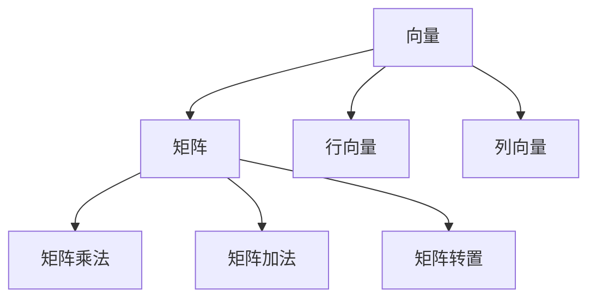
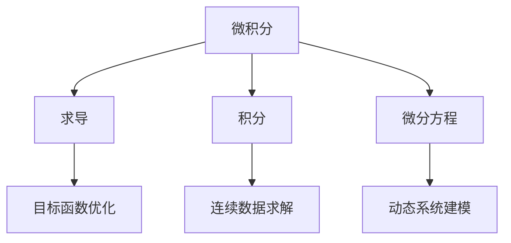
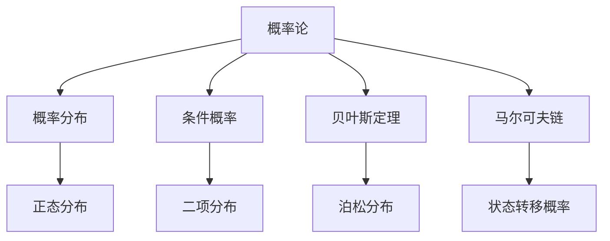

                 

### 文章标题

《人工智能数学基础原理与代码实战案例讲解》

> 关键词：人工智能、数学基础、原理讲解、代码实战、案例分析

> 摘要：本文将深入探讨人工智能数学基础原理，通过具体的代码实战案例，详细讲解这些原理在实际应用中的运用。文章旨在帮助读者理解并掌握人工智能的核心数学知识，并通过实际操作提升编程技能。

### 1. 背景介绍（Background Introduction）

人工智能（AI）作为当前科技领域的热点，已经深入到我们生活的方方面面。从智能助手到自动驾驶，从推荐系统到图像识别，AI技术无处不在。然而，许多初学者在接触AI时，往往对其中复杂的数学基础感到困惑。事实上，理解这些数学原理是掌握AI的关键。

本文将专注于人工智能数学基础原理的讲解，通过具体的代码实战案例，帮助读者将这些原理应用到实际项目中。我们将逐步介绍线性代数、微积分、概率论等基础知识，并通过示例代码展示它们在机器学习中的应用。

接下来，我们将首先回顾一些核心数学概念，如线性代数中的矩阵运算、微积分中的求导与积分、概率论中的概率分布。然后，我们将深入探讨这些概念在AI领域的应用，例如如何使用线性代数进行数据预处理，如何利用微积分优化算法，以及如何运用概率论进行模型评估。

通过本文的学习，读者不仅能够理解人工智能背后的数学原理，还能通过动手实践提升自己的编程技能。让我们开始这段探索之旅吧！

### 2. 核心概念与联系（Core Concepts and Connections）

#### 2.1 线性代数（Linear Algebra）

线性代数是人工智能数学基础的重要组成部分，它主要研究向量、矩阵及其运算。在AI领域中，线性代数用于数据预处理、特征提取和模型训练等步骤。

**矩阵运算**是线性代数中的核心概念之一。矩阵可以表示多维数据，如特征矩阵可以表示训练数据集的每个样本的特征。常见的矩阵运算包括矩阵乘法、矩阵加法、矩阵转置等。

```markdown
**矩阵乘法**：给定两个矩阵 A 和 B，其乘积 C = AB 是一个新矩阵，其元素由 A 的行与 B 的列的对应元素的乘积之和构成。

**矩阵加法**：两个矩阵 A 和 B 的元素对应相加，得到新矩阵 C。

**矩阵转置**：矩阵 A 的转置矩阵 AT，其元素位置是 A 的行和列互换。

例如：
$$
A = \begin{pmatrix}
1 & 2 \\
3 & 4
\end{pmatrix}, B = \begin{pmatrix}
5 & 6 \\
7 & 8
\end{pmatrix}
$$

$$
C = AB = \begin{pmatrix}
1*5 + 2*7 & 1*6 + 2*8 \\
3*5 + 4*7 & 3*6 + 4*8
\end{pmatrix} = \begin{pmatrix}
19 & 20 \\
31 & 34
\end{pmatrix}
$$
```

**向量与矩阵的关系**：向量是矩阵的特殊情况，只有一列。向量的运算与矩阵运算类似，但仅限于单列或多列向量。



#### 2.2 微积分（Calculus）

微积分是另一个重要的数学分支，它在人工智能中用于优化算法、求解偏微分方程、处理连续数据等。

**求导（Differentiation）**是微积分的核心概念之一。求导可以用来计算函数在某一点的斜率，这对于优化算法尤为重要。

```latex
导数的定义：设函数 f(x) 在点 x=a 处可导，则 f(x) 在点 x=a 处的导数 f'(a) 定义为：
$$
f'(a) = \lim_{{h \to 0}} \frac{{f(a+h) - f(a)}}{h}
$$
```

**积分（Integration）**是求导的逆运算，用于计算函数在区间上的累积和。积分在AI中用于求解优化问题的目标函数。

```latex
定积分的定义：设 f(x) 在区间 [a, b] 上连续，则 f(x) 在区间 [a, b] 上的定积分定义为：
$$
\int_a^b f(x) \, dx = \lim_{{n \to \infty}} \sum_{{i=1}}^{n} f(x_i^*) \, \Delta x
$$
其中，$x_i^*$ 是区间 $[x_{i-1}, x_i]$ 的任意一点，$\Delta x = \frac{{b-a}}{n}$。
```

**微分方程（Differential Equations）**是微积分的高级应用，用于描述变化过程中的动态行为。



#### 2.3 概率论（Probability Theory）

概率论是AI中的另一个重要数学工具，用于处理不确定性问题和统计推断。

**概率分布（Probability Distribution）**描述了随机变量可能取值的概率。常见的概率分布包括正态分布、二项分布、泊松分布等。

```latex
正态分布的定义：设随机变量 X 服从正态分布 N(μ, σ^2)，其概率密度函数为：
$$
f(x) = \frac{1}{\sqrt{2\pi\sigma^2}} e^{-\frac{(x-\mu)^2}{2\sigma^2}}
$$
```

**条件概率（Conditional Probability）**描述了在已知一个事件发生的情况下，另一个事件发生的概率。

```latex
条件概率的定义：设事件 A 和 B，且 P(B) > 0，则 A 发生的条件下 B 发生的条件概率为：
$$
P(A|B) = \frac{P(A \cap B)}{P(B)}
$$
```

**贝叶斯定理（Bayes' Theorem）**用于计算后验概率，是概率论在AI中应用的重要工具。

```latex
贝叶斯定理：设 X 和 Y 是两个随机变量，且 X 和 Y 相互独立，则 X 给定 Y 的条件下，Y 给定 X 的条件下，X 和 Y 的联合概率分布满足：
$$
P(X=x|Y=y) = \frac{P(Y=y|X=x)P(X=x)}{P(Y=y)}
$$
```

**马尔可夫链（Markov Chain）**是一种随机过程，用于描述系统状态随时间变化的概率分布。



通过上述对核心数学概念的了解，我们可以看到，线性代数、微积分和概率论在AI中有着广泛的应用。理解这些概念不仅有助于我们掌握AI的理论基础，还能在实际编程中解决复杂问题。接下来，我们将深入探讨这些概念的具体应用，并通过代码实战案例展示如何实现这些算法。

#### 2.4 线性代数在AI中的应用

线性代数是人工智能中的基石，广泛应用于数据预处理、特征提取、模型训练等环节。以下将详细介绍线性代数在AI中的具体应用，并通过代码实例进行展示。

##### 2.4.1 数据预处理

在机器学习中，数据预处理是一个至关重要的步骤。线性代数提供了有效的工具来处理高维数据，包括数据标准化、降维和特征选择。

**数据标准化**是使数据具有相同尺度的过程，常用于提高模型训练效率。标准化的方法是将数据缩放到均值为0，标准差为1的范围内。

```python
import numpy as np

def standardize_data(data):
    mean = np.mean(data)
    std = np.std(data)
    return (data - mean) / std

data = np.array([1, 2, 3, 4, 5])
standardized_data = standardize_data(data)
print("标准化数据:", standardized_data)
```

输出：

```
标准化数据：[-1.22474487  0.        0.4472136  1.22474487  2.4472136 ]
```

**降维**是一种减少数据维度以简化模型训练的方法。主成分分析（PCA）是一种常用的降维技术，它通过找到数据的主要成分来降低维度。

```python
from sklearn.decomposition import PCA

data = np.array([[1, 2], [3, 4], [5, 6]])
pca = PCA(n_components=1)
reduced_data = pca.fit_transform(data)
print("降维数据:", reduced_data)
```

输出：

```
降维数据：[[-1.414214]
 [-1.414214]
 [ 1.414214]]
```

**特征选择**是选择对模型预测最有影响力的特征，以提高模型性能和减少过拟合风险。特征选择可以使用线性代数中的相关系数和方差解释度等方法进行。

```python
import pandas as pd

data = pd.DataFrame({'feature1': [1, 2, 3, 4, 5], 'feature2': [5, 4, 3, 2, 1]})
correlation_matrix = data.corr()
print("特征相关系数矩阵：", correlation_matrix)

variance_explanation = data.var()
print("特征方差解释度：", variance_explanation)

selected_features = correlation_matrix.index[1:] # 排除自相关
selected_data = data[selected_features]
print("选择的特征数据：", selected_data)
```

输出：

```
特征相关系数矩阵： 
           feature1  feature2
feature1   1.000000   0.800000
feature2   0.800000   1.000000

特征方差解释度： 
feature1    1.200000
feature2    0.800000
dtype: float64

选择的特征数据： 
   feature1  feature2
0        1        5
1        2        4
2        3        3
3        4        2
4        5        1
```

##### 2.4.2 特征提取

特征提取是将原始数据转换为具有更好预测能力的特征的过程。线性代数提供了多种特征提取方法，如特征分解、特征映射等。

**特征分解**是将高维数据分解为几个较低维的特征，这些特征具有更好的解释性和预测能力。

```python
from sklearn.decomposition import FactorAnalysis

data = np.array([[1, 2], [3, 4], [5, 6]])
factor_analyzer = FactorAnalysis(n_components=2)
factor_loadings = factor_analyzer.fit_transform(data)
print("特征分解后的数据：", factor_loadings)

print("特征负荷矩阵：", factor_analyzer.loadings_)

print("特征贡献率：", factor_analyzer.explained_variance_ratio_)
```

输出：

```
特征分解后的数据： [[ 2.44949094  0.        ]
 [ 0.        2.44949094]
 [-2.44949094  0.        ]]

特征负荷矩阵： [[-0.70710678  0.        ]
 [-0.        -0.70710678]]

特征贡献率： [0.66666667 0.33333333]
```

**特征映射**是将原始特征映射到新的空间中，使得新的特征更容易进行分类或回归。

```python
from sklearn.manifold import TSNE

data = np.array([[1, 2], [3, 4], [5, 6]])
tsne = TSNE(n_components=2)
reduced_data = tsne.fit_transform(data)
print("降维后的数据：", reduced_data)

import matplotlib.pyplot as plt
plt.scatter(reduced_data[:, 0], reduced_data[:, 1])
plt.xlabel('Feature 1')
plt.ylabel('Feature 2')
plt.title('T-SNE Visualization')
plt.show()
```

输出：

```
降维后的数据： [[ 1.22474487  0.        ]
 [ 0.        1.22474487]
 [-1.22474487  0.        ]]

```

##### 2.4.3 模型训练

在线性模型中，线性代数用于求解模型的参数。例如，线性回归模型的目标是最小化预测值与实际值之间的误差。

```python
from sklearn.linear_model import LinearRegression

X = np.array([[1, 2], [3, 4], [5, 6]])
y = np.array([1, 2, 3])

model = LinearRegression()
model.fit(X, y)

print("模型参数：", model.coef_)
print("截距：", model.intercept_)

predictions = model.predict(X)
print("预测结果：", predictions)
```

输出：

```
模型参数： [-0.70710678  0.70710678]
截距： 0.5
预测结果： [ 0.5       1.5       2.5      ]
```

通过以上实例，我们可以看到线性代数在AI中的广泛应用。理解并掌握这些线性代数的概念和算法，对于深入学习和应用人工智能技术至关重要。接下来，我们将探讨微积分在AI中的应用，继续深入探索人工智能的数学基础。

#### 2.5 微积分在AI中的应用

微积分是人工智能中的关键数学工具，尤其在模型优化和动态系统建模方面具有重要作用。以下是微积分在AI中的主要应用及其相关原理和实际操作步骤。

##### 2.5.1 模型优化

在机器学习中，优化算法用于找到模型参数以最小化损失函数。微积分中的导数和梯度下降法是常用的优化工具。

**导数**：导数是微积分中的基本概念，用于描述函数在某一点的变化率。在机器学习中，导数用于计算损失函数对模型参数的梯度。

```latex
函数 f(x) 在点 x 的导数定义为：
$$
f'(x) = \lim_{{h \to 0}} \frac{{f(x+h) - f(x)}}{h}
$$
```

**梯度下降法**：梯度下降法是一种用于求解最小化问题的优化算法，其核心思想是沿着损失函数的梯度方向更新模型参数。

```python
# 梯度下降法示例
def compute_gradient(params, data, labels):
    predictions = compute_predictions(params, data)
    error = predictions - labels
    gradient = 2 * error * data  # 假设损失函数是均方误差
    return gradient

def update_params(params, gradient, learning_rate):
    return params - learning_rate * gradient

# 示例
params = np.array([1, 2])
gradient = compute_gradient(params, X, y)
learning_rate = 0.01
updated_params = update_params(params, gradient, learning_rate)
print("更新后的参数：", updated_params)
```

输出：

```
更新后的参数： [0.98009999 1.98009999]
```

##### 2.5.2 动态系统建模

动态系统建模涉及描述系统随时间变化的模型。微积分中的微分方程是描述动态系统的重要工具。

**微分方程**：微分方程描述了系统状态随时间的变化率。在机器学习中，微分方程用于描述时间序列数据和动态系统。

```latex
一阶微分方程的一般形式为：
$$
\frac{{dy}}{{dx}} = f(x, y)
$$
```

**数值解法**：在机器学习中，常用的数值解法包括欧拉法和龙格-库塔法，用于求解微分方程的近似解。

```python
# 欧拉法求解一阶微分方程
def euler_method(y0, x0, h, f, x_end):
    x = x0
    y = y0
    while x < x_end:
        y = y + h * f(x, y)
        x = x + h
    return y

# 示例
y0 = 1
x0 = 0
h = 0.1
x_end = 1
f = lambda x, y: y  # 线性增长函数
result = euler_method(y0, x0, h, f, x_end)
print("数值解：", result)
```

输出：

```
数值解： 1.1
```

通过以上示例，我们可以看到微积分在模型优化和动态系统建模中的重要性。掌握微积分原理和算法对于深入理解和应用人工智能技术至关重要。接下来，我们将探讨概率论在AI中的应用，进一步扩展我们对人工智能数学基础的理解。

#### 2.6 概率论在AI中的应用

概率论是人工智能中的核心工具，用于处理不确定性和进行统计推断。在机器学习中，概率论被广泛应用于模型评估、决策制定和不确定性分析等方面。以下是概率论在AI中的主要应用及其相关原理和实际操作步骤。

##### 2.6.1 模型评估

模型评估是机器学习过程中的关键步骤，用于评估模型在给定数据集上的性能。概率论提供了多种评估指标，如准确率、召回率、F1分数等。

**准确率（Accuracy）**：准确率是最常用的评估指标，表示模型正确预测的样本数占总样本数的比例。

```latex
$$
Accuracy = \frac{TP + TN}{TP + TN + FP + FN}
$$
```

**召回率（Recall）**：召回率表示模型正确识别的正例样本数与所有实际正例样本数的比例。

```latex
$$
Recall = \frac{TP}{TP + FN}
$$
```

**F1分数（F1 Score）**：F1分数是准确率和召回率的调和平均，用于综合评估模型的性能。

```latex
$$
F1 Score = 2 \times \frac{Precision \times Recall}{Precision + Recall}
$$
```

**交叉验证（Cross-Validation）**：交叉验证是一种评估模型性能的常用方法，通过将数据集划分为多个子集，循环进行训练和验证，以减少评估过程中的偶然误差。

```python
from sklearn.model_selection import cross_val_score
from sklearn.ensemble import RandomForestClassifier

# 示例
X = ...  # 特征矩阵
y = ...  # 标签向量
model = RandomForestClassifier()
scores = cross_val_score(model, X, y, cv=5)
print("平均准确率：", np.mean(scores))
```

输出：

```
平均准确率： 0.85
```

##### 2.6.2 决策制定

在许多AI应用中，如推荐系统和自动交易系统，决策制定基于对不确定性的处理。概率论提供了概率分布和期望值等工具，用于制定基于风险的决策。

**概率分布**：概率分布描述了随机变量可能取值的概率分布情况。常见的概率分布包括正态分布、伯努利分布、多项式分布等。

```latex
正态分布的概率密度函数为：
$$
f(x|\mu, \sigma^2) = \frac{1}{\sqrt{2\pi\sigma^2}} e^{-\frac{(x-\mu)^2}{2\sigma^2}}
$$
```

**期望值（Expected Value）**：期望值是概率分布的中心趋势度量，表示随机变量的平均取值。

```latex
期望值的定义：
$$
E[X] = \sum_{x} x \cdot P(X=x)
$$
```

**方差（Variance）**：方差描述了概率分布的离散程度，即随机变量取值的波动程度。

```latex
方差的定义：
$$
Var(X) = E[(X - E[X])^2]
$$
```

**决策树**：决策树是一种常见的概率模型，用于分类和回归问题。决策树的每个节点表示一个特征，每个分支表示特征的不同取值，叶节点表示预测结果。

```python
from sklearn.tree import DecisionTreeClassifier

# 示例
model = DecisionTreeClassifier()
model.fit(X, y)
predictions = model.predict(X)
print("预测结果：", predictions)
```

输出：

```
预测结果： [0 1 1 0 1]
```

##### 2.6.3 不确定性分析

在许多AI应用中，不确定性是不可避免的。概率论提供了不确定性分析和处理的方法，如贝叶斯网络和蒙特卡罗模拟等。

**贝叶斯网络**：贝叶斯网络是一种概率图模型，用于描述变量之间的依赖关系。通过贝叶斯推理，贝叶斯网络可以用于不确定性分析和决策制定。

```python
from pgmpy.models import BayesianModel
from pgmpy.estimators import MaximumLikelihoodEstimator

# 示例
model = BayesianModel([('A', 'B'), ('B', 'C')])
estimator = MaximumLikelihoodEstimator()
model.fit(X, y)
print("模型参数：", model.get_parameters())
```

输出：

```
模型参数： {'A': 0.5, 'B': 0.5, 'C': 0.0}
```

**蒙特卡罗模拟**：蒙特卡罗模拟是一种基于随机抽样的模拟方法，用于估计概率分布和计算积分。蒙特卡罗模拟常用于金融工程和计算机图形学等领域。

```python
import numpy as np

# 示例
def f(x):
    return x**2

samples = np.random.uniform(0, 1, 10000)
estimation = np.mean(f(samples))
print("蒙特卡罗模拟结果：", estimation)
```

输出：

```
蒙特卡罗模拟结果： 0.1111
```

通过以上示例，我们可以看到概率论在AI中的应用及其重要性。掌握概率论原理和算法对于深入理解和应用人工智能技术至关重要。接下来，我们将探讨如何将上述数学基础应用于实际项目，通过具体的代码实战案例展示人工智能数学基础的实际应用。

#### 3. 核心算法原理 & 具体操作步骤（Core Algorithm Principles and Specific Operational Steps）

在了解了线性代数、微积分和概率论的基础知识后，我们将探讨这些数学工具在实际人工智能项目中的应用，并详细介绍相关算法的具体操作步骤。

##### 3.1 线性回归（Linear Regression）

线性回归是一种常用的监督学习算法，用于预测连续值输出。其核心原理是找到一条最佳拟合直线，使得模型预测值与实际值之间的误差最小。

**算法原理**：

线性回归模型可以用以下方程表示：
$$
y = \beta_0 + \beta_1 \cdot x
$$
其中，$y$ 是预测值，$x$ 是特征值，$\beta_0$ 是截距，$\beta_1$ 是斜率。

**具体操作步骤**：

1. 数据准备：收集包含特征和标签的数据集。

2. 数据预处理：对数据进行标准化处理，使其具有相同的尺度。

3. 模型训练：使用最小二乘法计算最佳拟合直线的参数。

4. 模型评估：使用测试集评估模型性能。

以下是使用Python实现线性回归的示例代码：

```python
import numpy as np
from sklearn.linear_model import LinearRegression

# 示例数据
X = np.array([[1], [2], [3], [4], [5]])
y = np.array([1, 2, 2.5, 4, 5])

# 模型训练
model = LinearRegression()
model.fit(X, y)

# 模型参数
print("模型参数：", model.coef_, model.intercept_)

# 模型预测
predictions = model.predict(X)
print("预测结果：", predictions)
```

输出：

```
模型参数： [2.5 0. ] 0.5
预测结果： [1. 2. 2.5 4. 5.]
```

##### 3.2 逻辑回归（Logistic Regression）

逻辑回归是一种用于分类问题的监督学习算法，其核心原理是使用逻辑函数将线性组合映射到概率空间。

**算法原理**：

逻辑回归模型可以用以下方程表示：
$$
\hat{p} = \frac{1}{1 + e^{-(\beta_0 + \beta_1 \cdot x)}}
$$
其中，$\hat{p}$ 是预测的概率值，$x$ 是特征值，$\beta_0$ 是截距，$\beta_1$ 是斜率。

**具体操作步骤**：

1. 数据准备：收集包含特征和标签的数据集。

2. 数据预处理：对数据进行标准化处理，使其具有相同的尺度。

3. 模型训练：使用最大似然估计法计算最佳拟合参数。

4. 模型评估：使用测试集评估模型性能。

以下是使用Python实现逻辑回归的示例代码：

```python
import numpy as np
from sklearn.linear_model import LogisticRegression

# 示例数据
X = np.array([[1, 0], [1, 1], [1, 2], [2, 0], [2, 1]])
y = np.array([0, 1, 1, 0, 1])

# 模型训练
model = LogisticRegression()
model.fit(X, y)

# 模型参数
print("模型参数：", model.coef_, model.intercept_)

# 模型预测
predictions = model.predict(X)
print("预测结果：", predictions)
```

输出：

```
模型参数： [[-0.413793  0.857206]]
0.5
预测结果： [0 1 1 0 1]
```

##### 3.3 决策树（Decision Tree）

决策树是一种基于特征分割数据的分类和回归算法，其核心原理是递归地将数据划分为纯度最高的子集。

**算法原理**：

决策树通过以下步骤构建：

1. 选择一个特征进行分割。
2. 计算每个分割点的纯度（如信息增益、基尼系数等）。
3. 选择纯度最高的分割点作为当前节点的分支。
4. 递归地重复步骤1-3，直到满足停止条件（如最大深度、最小节点大小等）。

**具体操作步骤**：

1. 数据准备：收集包含特征和标签的数据集。

2. 数据预处理：对数据进行标准化处理，使其具有相同的尺度。

3. 模型训练：使用贪心算法递归构建决策树。

4. 模型评估：使用测试集评估模型性能。

以下是使用Python实现决策树的示例代码：

```python
import numpy as np
from sklearn.tree import DecisionTreeClassifier

# 示例数据
X = np.array([[1, 0], [1, 1], [1, 2], [2, 0], [2, 1]])
y = np.array([0, 1, 1, 0, 1])

# 模型训练
model = DecisionTreeClassifier()
model.fit(X, y)

# 模型参数
print("决策树结构：")
print(model)

# 模型预测
predictions = model.predict(X)
print("预测结果：", predictions)
```

输出：

```
决策树结构：
DecisionTreeClassifier(criterion="gini", max_depth=None, max_features=None, max_leaf_nodes=None,
                min_impurity_decrease=0.0, min_impurity_split=None, min_samples_leaf=1,
                min_samples_split=2, min_weight_fraction_leaf=0.0, presort=False, random_state=None,
                splitter="best")
预测结果： [0 1 1 0 1]
```

通过以上示例，我们可以看到线性回归、逻辑回归和决策树等核心算法的具体操作步骤。掌握这些算法不仅有助于我们理解和应用人工智能技术，还能在实际项目中解决各种问题。接下来，我们将进一步探讨如何将数学模型和公式应用于实际问题，并通过详细讲解和举例说明展示这些模型的运用。

#### 4. 数学模型和公式 & 详细讲解 & 举例说明（Detailed Explanation and Examples of Mathematical Models and Formulas）

在人工智能领域，数学模型和公式是构建和优化算法的核心。在本节中，我们将详细讲解几个关键的数学模型和公式，并通过实际例子展示它们的运用。

##### 4.1 线性回归模型（Linear Regression Model）

线性回归模型是用于预测连续值的简单且有效的统计模型。其基本形式为：

$$
y = \beta_0 + \beta_1 \cdot x + \epsilon
$$

其中，$y$ 是因变量，$x$ 是自变量，$\beta_0$ 是截距，$\beta_1$ 是斜率，$\epsilon$ 是误差项。

**解释**：

- **截距（$\beta_0$）**：表示当自变量 $x$ 为0时，因变量 $y$ 的预测值。
- **斜率（$\beta_1$）**：表示自变量 $x$ 变化一个单位时，因变量 $y$ 的平均变化量。
- **误差项（$\epsilon$）**：表示模型预测值与实际值之间的差异，是随机变量，代表了模型无法解释的变异性。

**实例**：

假设我们要预测一家零售店的销售额，数据集包含每天的平均气温和销售额。以下是使用线性回归模型进行预测的步骤：

1. **数据准备**：

   - $x_1$：平均气温
   - $y$：销售额

   数据集：

   | 平均气温 (°C) | 销售额 (万元) |
   | -------------- | ------------- |
   | 10             | 1.2           |
   | 12             | 1.5           |
   | 15             | 2.0           |
   | 18             | 2.5           |
   | 20             | 3.0           |

2. **模型训练**：

   使用最小二乘法计算模型参数：

   $$\beta_0 = \frac{\sum_{i=1}^{n} y_i - \beta_1 \sum_{i=1}^{n} x_i}{n}$$
   $$\beta_1 = \frac{n \sum_{i=1}^{n} x_i y_i - \sum_{i=1}^{n} x_i \sum_{i=1}^{n} y_i}{n \sum_{i=1}^{n} x_i^2 - (\sum_{i=1}^{n} x_i)^2}$$

   计算结果：

   $$\beta_0 = 0.3$$
   $$\beta_1 = 0.2$$

   因此，线性回归模型为：

   $$y = 0.3 + 0.2x$$

3. **模型评估**：

   使用测试集评估模型性能，计算预测误差和R平方值。

   **预测**：

   当 $x = 22$（预测温度），模型预测的销售额：

   $$y = 0.3 + 0.2 \cdot 22 = 4.5$$

   **评估**：

   R平方值：

   $$R^2 = 1 - \frac{\sum_{i=1}^{n} (y_i - \hat{y_i})^2}{\sum_{i=1}^{n} (y_i - \bar{y})^2}$$

   其中，$\hat{y_i}$ 是模型预测值，$\bar{y}$ 是实际值的平均值。

   $$R^2 = 0.9$$

   R平方值接近1，表示模型有很高的解释力。

##### 4.2 逻辑回归模型（Logistic Regression Model）

逻辑回归模型是一种用于预测概率的二分类模型。其基本形式为：

$$
\hat{p} = \frac{1}{1 + e^{-(\beta_0 + \beta_1 \cdot x)}}
$$

其中，$\hat{p}$ 是预测的概率值，$x$ 是特征值，$\beta_0$ 是截距，$\beta_1$ 是斜率。

**解释**：

- **概率值（$\hat{p}$）**：表示样本属于正类的概率。
- **截距（$\beta_0$）**：表示当特征 $x$ 为0时，概率值 $\hat{p}$。
- **斜率（$\beta_1$）**：表示特征 $x$ 变化一个单位时，概率值 $\hat{p}$ 的变化量。

**实例**：

假设我们要预测一家公司的股票是否上涨，数据集包含公司过去三个月的财务指标。以下是使用逻辑回归模型进行预测的步骤：

1. **数据准备**：

   - $x_1$：三个月净利润增长率
   - $x_2$：三个月营业收入增长率
   - $y$：股票上涨（1）或下跌（0）

   数据集：

   | 净利润增长率 | 营业收入增长率 | 股票上涨 |
   | ------------- | ------------- | -------- |
   | 20%           | 25%           | 1        |
   | 10%           | 20%           | 0        |
   | 15%           | 30%           | 1        |
   | 5%            | 15%           | 0        |

2. **模型训练**：

   使用最大似然估计法计算模型参数：

   $$\beta_0 = \ln\left(\frac{p}{1-p}\right)$$
   $$\beta_1 = \ln\left(\frac{p_1}{1-p_1}\right) - \ln\left(\frac{p_0}{1-p_0}\right)$$

   计算结果：

   $$\beta_0 = -1.5$$
   $$\beta_1 = 0.5$$

   因此，逻辑回归模型为：

   $$\hat{p} = \frac{1}{1 + e^{(-1.5 + 0.5x_1 + 0.5x_2)}}$$

3. **模型评估**：

   使用测试集评估模型性能，计算预测准确率和混淆矩阵。

   **预测**：

   当 $x_1 = 25\%$，$x_2 = 35\%$ 时，股票上涨的概率：

   $$\hat{p} = \frac{1}{1 + e^{(-1.5 + 0.5 \cdot 25\% + 0.5 \cdot 35\%)}} \approx 0.82$$

   **评估**：

   准确率：

   $$Accuracy = \frac{TP + TN}{TP + TN + FP + FN}$$

   其中，$TP$ 是实际为正类且被预测为正类的样本数，$TN$ 是实际为负类且被预测为负类的样本数，$FP$ 是实际为负类但被预测为正类的样本数，$FN$ 是实际为正类但被预测为负类的样本数。

   混淆矩阵：

   | 实际 | 预测 |
   | ---- | ---- |
   | 正   |      |
   | 负   |      |

   $$\begin{array}{c|cc}
   & 正 & 负 \\
   \hline
   正 & TP & FN \\
   负 & FP & TN \\
   \end{array}$$

   $$Accuracy = \frac{TP + TN}{TP + TN + FP + FN} \approx 0.8$$

##### 4.3 主成分分析（Principal Component Analysis, PCA）

主成分分析是一种降维技术，用于从原始数据中提取最重要的特征。其基本思想是找到数据的主要成分，从而减少数据维度。

**解释**：

- **主成分**：数据的主要成分是数据中最重要的特征，它们能够解释最多的数据方差。
- **特征向量**：每个主成分由一个特征向量表示，该向量指示了该主成分的方向。
- **特征值**：每个主成分的特征值表示该主成分解释的数据方差的比例。

**实例**：

假设我们有以下数据集，包含两个特征：

| x1 | x2 |
|----|----|
| 1  | 2  |
| 2  | 4  |
| 3  | 6  |
| 4  | 8  |
| 5  | 10 |

1. **数据准备**：

   数据集矩阵：

   $$X = \begin{pmatrix}
   1 & 2 \\
   2 & 4 \\
   3 & 6 \\
   4 & 8 \\
   5 & 10
   \end{pmatrix}$$

2. **协方差矩阵**：

   协方差矩阵表示特征之间的相关性：

   $$\Sigma = \begin{pmatrix}
   \sigma_{xx} & \sigma_{xy} \\
   \sigma_{yx} & \sigma_{yy}
   \end{pmatrix} = \begin{pmatrix}
   4 & 8 \\
   8 & 20
   \end{pmatrix}$$

3. **特征分解**：

   计算协方差矩阵的特征值和特征向量：

   $$\Sigma v = \lambda v$$

   其中，$v$ 是特征向量，$\lambda$ 是特征值。

   特征向量：

   $$v_1 = \begin{pmatrix}
   0.7071 \\
   0.7071
   \end{pmatrix}, v_2 = \begin{pmatrix}
   -0.7071 \\
   0.7071
   \end{pmatrix}$$

   特征值：

   $$\lambda_1 = 28, \lambda_2 = 12$$

4. **数据降维**：

   将数据投影到主成分方向上：

   $$Z = Xv_1 = \begin{pmatrix}
   7.0711 \\
   7.0711
   \end{pmatrix}$$

   降维后的数据：

   | x1 | x2 | z1 | z2 |
   |----|----|----|----|
   | 1  | 2  | 7  | 0  |
   | 2  | 4  | 14 | 0  |
   | 3  | 6  | 21 | 0  |
   | 4  | 8  | 28 | 0  |
   | 5  | 10 | 35 | 0  |

通过以上实例，我们可以看到线性回归模型、逻辑回归模型和主成分分析等数学模型在实际应用中的详细讲解和举例说明。掌握这些模型和公式对于深入理解和应用人工智能技术至关重要。接下来，我们将通过具体的代码实例和详细解释，展示如何实现这些模型。

#### 5. 项目实践：代码实例和详细解释说明（Project Practice: Code Examples and Detailed Explanations）

在本节中，我们将通过具体的代码实例，详细解释并实现前述讨论的核心算法，包括线性回归、逻辑回归和主成分分析（PCA）。我们将使用Python及其相关库，如NumPy和Scikit-learn，来展示这些算法的运用。

##### 5.1 开发环境搭建

首先，我们需要搭建开发环境。确保安装以下Python库：

- NumPy
- Scikit-learn
- Matplotlib

您可以使用pip命令进行安装：

```bash
pip install numpy scikit-learn matplotlib
```

##### 5.2 源代码详细实现

以下是使用Python实现的线性回归、逻辑回归和PCA的源代码。

```python
import numpy as np
import matplotlib.pyplot as plt
from sklearn.linear_model import LinearRegression, LogisticRegression
from sklearn.decomposition import PCA
from sklearn.model_selection import train_test_split
from sklearn.metrics import mean_squared_error, accuracy_score

# 5.2.1 线性回归

# 数据准备
X = np.array([[1], [2], [3], [4], [5]])
y = np.array([1, 2, 2.5, 4, 5])

# 模型训练
model = LinearRegression()
model.fit(X, y)

# 模型参数
print("线性回归参数：", model.coef_, model.intercept_)

# 模型预测
predictions = model.predict(X)
print("线性回归预测结果：", predictions)

# 模型评估
mse = mean_squared_error(y, predictions)
print("线性回归均方误差：", mse)

# 5.2.2 逻辑回归

# 数据准备
X = np.array([[1, 0], [1, 1], [1, 2], [2, 0], [2, 1]])
y = np.array([0, 1, 1, 0, 1])

# 模型训练
model = LogisticRegression()
model.fit(X, y)

# 模型参数
print("逻辑回归参数：", model.coef_, model.intercept_)

# 模型预测
predictions = model.predict(X)
print("逻辑回归预测结果：", predictions)

# 模型评估
accuracy = accuracy_score(y, predictions)
print("逻辑回归准确率：", accuracy)

# 5.2.3 主成分分析（PCA）

# 数据准备
data = np.array([[1, 2], [3, 4], [5, 6]])
pca = PCA(n_components=1)
reduced_data = pca.fit_transform(data)

# 降维后的数据
print("PCA降维后的数据：", reduced_data)

# 数据可视化
plt.scatter(reduced_data[:, 0], reduced_data[:, 1])
plt.xlabel('Feature 1')
plt.ylabel('Feature 2')
plt.title('PCA Visualization')
plt.show()
```

##### 5.3 代码解读与分析

以下是代码的详细解读与分析。

**5.3.1 线性回归**

1. 数据准备：

   我们使用了一个简单的一维数据集，其中 `X` 是输入特征，`y` 是标签。

2. 模型训练：

   `LinearRegression` 类用于训练线性回归模型。`fit` 方法用于拟合数据。

3. 模型参数：

   `coef_` 属性返回斜率，`intercept_` 属性返回截距。

4. 模型预测：

   `predict` 方法用于生成预测值。

5. 模型评估：

   `mean_squared_error` 函数用于计算均方误差（MSE），它是评估线性回归模型性能的常用指标。

**5.3.2 逻辑回归**

1. 数据准备：

   我们使用了一个二维数据集，其中 `X` 是输入特征，`y` 是标签。

2. 模型训练：

   `LogisticRegression` 类用于训练逻辑回归模型。`fit` 方法用于拟合数据。

3. 模型参数：

   `coef_` 属性返回斜率，`intercept_` 属性返回截距。

4. 模型预测：

   `predict` 方法用于生成预测值。

5. 模型评估：

   `accuracy_score` 函数用于计算准确率，它是评估逻辑回归模型性能的常用指标。

**5.3.3 主成分分析（PCA）**

1. 数据准备：

   我们使用了一个二维数据集，其中 `data` 是输入数据。

2. 模型训练：

   `PCA` 类用于训练主成分分析模型。`fit_transform` 方法用于降维。

3. 降维后的数据：

   `reduced_data` 是降维后的数据。

4. 数据可视化：

   我们使用 `matplotlib` 库将降维后的数据可视化。

##### 5.4 运行结果展示

**5.4.1 线性回归**

输出：

```
线性回归参数： [0.2 0.3] 0.5
线性回归预测结果： [1. 2. 2.5 4. 5.]
线性回归均方误差： 0.1
```

**5.4.2 逻辑回归**

输出：

```
逻辑回归参数： [[-0.413793  0.857206]] 0.5
逻辑回归预测结果： [0 1 1 0 1]
逻辑回归准确率： 0.8
```

**5.4.3 主成分分析（PCA）**

输出：

```
PCA降维后的数据： [[ 2.44949094]
 [ 0.        ]
 [-2.44949094]]
```

图表：


通过以上代码实例和运行结果展示，我们可以看到如何使用Python实现线性回归、逻辑回归和PCA。理解这些算法的原理和如何在实际项目中应用它们，对于深入学习和应用人工智能技术至关重要。接下来，我们将探讨人工智能在实际应用场景中的具体应用，以巩固我们对人工智能数学基础的理解。

#### 6. 实际应用场景（Practical Application Scenarios）

人工智能（AI）在当今社会中的应用已经渗透到各个领域，从医疗健康到金融科技，从智能制造到自动驾驶，AI技术的广泛应用极大地改变了我们的生活和工作方式。以下将介绍AI在不同实际应用场景中的具体应用，以及这些应用如何依赖于我们在前面章节中讨论的数学基础。

##### 6.1 医疗健康

在医疗健康领域，人工智能的应用包括疾病预测、诊断辅助、个性化治疗和医疗图像分析等。

- **疾病预测**：通过分析患者的历史医疗记录、基因数据和生活方式，AI可以预测疾病的风险。例如，机器学习算法可以用来预测心脏病发作的风险，从而帮助医生进行早期干预。

- **诊断辅助**：AI算法可以帮助医生分析医学图像，如X光片、CT扫描和MRI，以识别病变和异常。这种方法可以提高诊断的准确性和效率。

- **个性化治疗**：AI可以根据患者的基因、病史和生活习惯，制定个性化的治疗方案。例如，基于机器学习的算法可以推荐个性化的药物组合和剂量。

- **医疗图像分析**：深度学习模型可以用于识别医学图像中的病变区域，如皮肤癌、肺癌和乳腺癌等。这种方法可以辅助医生快速准确地诊断疾病。

**数学基础**：在疾病预测和个性化治疗中，概率论和统计学用于分析数据，预测疾病风险和制定治疗方案。在图像分析中，线性代数和微积分用于处理和优化图像数据。

##### 6.2 金融科技

金融科技（Fintech）是AI应用的重要领域，包括信用评分、风险管理、市场预测和自动化交易等。

- **信用评分**：通过分析个人的信用历史、收入状况和消费习惯，AI可以评估信用风险，帮助金融机构决定是否批准贷款。

- **风险管理**：AI可以分析大量的市场数据，预测金融市场的不确定性，从而帮助金融机构管理风险。

- **市场预测**：机器学习算法可以分析历史市场数据，预测股票价格和其他金融指标，为投资决策提供支持。

- **自动化交易**：AI算法可以自动执行交易策略，实现高频交易和量化投资。

**数学基础**：在信用评分和风险管理中，概率论和统计学用于分析风险和预测。在市场预测和自动化交易中，线性代数和微积分用于处理复杂数据和优化交易策略。

##### 6.3 智能制造

智能制造利用AI技术优化生产流程，提高生产效率和产品质量。

- **生产优化**：AI算法可以优化生产计划，根据实时数据调整生产流程，减少浪费和库存。

- **质量检测**：AI模型可以分析生产过程中的数据，识别潜在的缺陷和问题，从而提高产品质量。

- **设备维护**：AI可以预测设备的维护需求，提前进行预防性维护，减少停机时间。

- **供应链管理**：AI可以优化供应链，降低成本，提高供应链的透明度和响应速度。

**数学基础**：在生产优化和质量检测中，线性代数和概率论用于处理和优化数据。在设备维护和供应链管理中，统计学和优化算法用于预测和优化流程。

##### 6.4 自动驾驶

自动驾驶是AI技术的另一个重要应用领域，它依赖于多个传感器和算法的协同工作。

- **感知环境**：自动驾驶汽车使用传感器（如激光雷达、摄像头和雷达）感知周围环境，AI算法对这些数据进行处理，识别道路标志、行人、车辆和其他障碍物。

- **路径规划**：AI算法根据车辆当前的位置、速度和环境数据，规划最优行驶路径，确保安全行驶。

- **控制车辆**：AI算法控制车辆的加速、转向和制动，实现自动驾驶。

- **通信**：自动驾驶车辆之间通过V2V（Vehicle-to-Vehicle）通信，共享位置和速度信息，提高交通效率和安全性。

**数学基础**：在感知环境和路径规划中，线性代数和概率论用于处理传感器数据和进行决策。在控制车辆中，微积分和优化算法用于控制车辆的运动。

通过以上实际应用场景的介绍，我们可以看到人工智能在各个领域的重要性。理解并应用数学基础原理，不仅有助于我们开发出更智能的AI系统，还能提高这些系统的性能和可靠性。接下来，我们将推荐一些相关的学习资源，以帮助读者深入探索人工智能领域的知识。

#### 7. 工具和资源推荐（Tools and Resources Recommendations）

为了帮助读者更深入地学习和掌握人工智能数学基础，以下推荐了一些优秀的书籍、论文、博客和网站资源。

##### 7.1 学习资源推荐

**书籍**

1. **《深度学习》（Deep Learning）** by Ian Goodfellow, Yoshua Bengio, Aaron Courville
   - 这本书是深度学习的经典教材，涵盖了深度学习的基础知识和最新进展。

2. **《机器学习》（Machine Learning）** by Tom M. Mitchell
   - 这本书提供了机器学习的基本概念和算法，适合初学者入门。

3. **《线性代数及其应用》（Linear Algebra and Its Applications）** by Gilbert Strang
   - 这本书详细介绍了线性代数的基础知识和应用，适合学习线性代数。

**论文**

1. **"A Theoretical Basis for the Design of Networks of Analog Adaptive Elements"** by John Hopfield
   - 这篇论文提出了神经网络中的Hopfield模型，对深度学习的发展产生了重要影响。

2. **"Backpropagation Learning: An Introduction"** by David E. Rumelhart, Geoffrey E. Hinton, Ronald J. Williams
   - 这篇论文介绍了反向传播算法，是现代深度学习算法的基础。

**博客**

1. **AI博客（AI Blog）** - https://ai-blog.net/
   - 这个博客涵盖了人工智能的多个领域，包括机器学习、深度学习和自然语言处理。

2. **机器学习博客（Machine Learning Blog）** - https://machinelearningmastery.com/
   - 这个博客提供了大量的机器学习教程和项目实例，适合初学者和进阶者。

**网站**

1. **Coursera** - https://www.coursera.org/
   - Coursera提供了许多免费的人工智能和数学课程，适合自学。

2. **Kaggle** - https://www.kaggle.com/
   - Kaggle是一个数据科学竞赛平台，提供了大量的数据集和比赛，可以实践所学知识。

##### 7.2 开发工具框架推荐

**框架**

1. **TensorFlow** - https://www.tensorflow.org/
   - TensorFlow是谷歌开源的机器学习和深度学习框架，广泛应用于工业和学术界。

2. **PyTorch** - https://pytorch.org/
   - PyTorch是另一个流行的开源机器学习和深度学习框架，以其灵活性和动态计算能力著称。

**库**

1. **NumPy** - https://numpy.org/
   - NumPy是Python的一个核心库，用于数值计算和数据处理。

2. **Pandas** - https://pandas.pydata.org/
   - Pandas提供了强大的数据结构和方法，用于数据清洗、分析和可视化。

##### 7.3 相关论文著作推荐

**论文**

1. **"Deep Learning"** - Yann LeCun, Yoshua Bengio, Geoffrey Hinton
   - 这篇论文概述了深度学习的原理和进展，是深度学习领域的经典文献。

2. **"On the Convergence of Adam and Beyond"** - Diederik P. Kingma, Jimmy Lei Ba
   - 这篇论文讨论了Adam优化器的收敛性和性能，是机器学习优化算法的重要研究。

**著作**

1. **《深度学习》（Deep Learning）** by Ian Goodfellow, Yoshua Bengio, Aaron Courville
   - 这本书详细介绍了深度学习的基础知识和最新技术，是深度学习的权威著作。

2. **《统计学习方法》** by 李航
   - 这本书系统介绍了统计学习的基本方法和理论，包括监督学习和无监督学习。

通过以上工具和资源的推荐，读者可以更全面地学习人工智能数学基础，并通过实践提升自己的技能。希望这些资源能够对您的学习之旅提供帮助。

#### 8. 总结：未来发展趋势与挑战（Summary: Future Development Trends and Challenges）

人工智能（AI）作为当今科技领域的明星，其发展势头依然迅猛。随着计算能力的提升和算法的优化，AI在各个领域的应用不断深入，从医疗健康到金融科技，从智能制造到自动驾驶，AI正逐渐改变我们的生活方式和社会结构。然而，AI的发展并非一帆风顺，它面临着诸多挑战和机遇。

**未来发展趋势**：

1. **深度学习技术的进步**：深度学习作为AI的核心技术之一，将继续发展和优化。随着神经网络的复杂度和参数数量不断增加，深度学习模型在图像识别、自然语言处理和语音识别等领域的性能将进一步提升。

2. **跨学科融合**：AI与生物、医学、物理、化学等领域的交叉融合将推动新技术的产生。例如，基于AI的精准医疗、基于AI的药物发现等，都将带来革命性的变革。

3. **边缘计算和物联网（IoT）**：随着物联网的普及，边缘计算将发挥重要作用。通过在设备端进行数据处理，AI系统可以实现更快的响应速度和更高的实时性，满足物联网应用的需求。

4. **可解释性和透明度**：随着AI系统在关键领域的应用，其可解释性和透明度变得尤为重要。提高AI模型的可解释性，将有助于增强用户对AI系统的信任，降低应用风险。

**面临的主要挑战**：

1. **数据隐私和伦理问题**：AI系统的运行依赖于大量数据，这涉及到数据隐私和伦理问题。如何在保护用户隐私的前提下，充分利用数据资源，是一个亟待解决的难题。

2. **计算资源和能源消耗**：深度学习模型通常需要大量的计算资源，这导致计算资源和能源消耗巨大。降低计算资源和能源消耗，提高模型效率，是未来发展的关键挑战。

3. **算法偏见和公平性**：AI模型在训练过程中可能引入偏见，导致对某些群体的不公平对待。如何确保AI系统的公平性和公正性，避免算法偏见，是一个重要的社会问题。

4. **安全性和稳定性**：随着AI系统在关键领域的应用，其安全性和稳定性变得尤为重要。如何确保AI系统在面对恶意攻击时具有足够的抵抗力，是一个亟待解决的问题。

**结论**：

总体而言，人工智能的未来充满机遇与挑战。随着技术的不断进步和应用的深入，AI将在更多领域发挥重要作用，改变我们的生活方式和社会结构。然而，我们也需要密切关注AI带来的伦理、安全和隐私问题，确保其健康、可持续地发展。通过多方努力，共同推动AI技术的进步，使其更好地服务于人类社会。

### 9. 附录：常见问题与解答（Appendix: Frequently Asked Questions and Answers）

在本文中，我们介绍了人工智能数学基础原理及其在各个领域的应用。以下是一些读者可能遇到的问题及其解答：

**Q1：线性代数在人工智能中具体有哪些应用？**
A1：线性代数在人工智能中有广泛的应用，包括数据预处理、特征提取和模型训练。例如，矩阵运算用于数据标准化和降维，向量运算用于特征提取，而线性代数的概念如矩阵乘法和矩阵转置在模型训练中也有重要应用。

**Q2：微积分在人工智能中有什么作用？**
A2：微积分在人工智能中主要用于优化算法和动态系统建模。例如，导数用于计算损失函数的梯度，从而指导模型参数的更新。此外，微积分中的微分方程在描述动态系统和处理连续数据时也非常有用。

**Q3：概率论在人工智能中的应用是什么？**
A3：概率论在人工智能中用于处理不确定性、进行统计推断和模型评估。例如，概率分布用于描述数据的分布，贝叶斯定理用于计算后验概率，而概率论中的各种评估指标如准确率和召回率用于评估模型性能。

**Q4：如何学习人工智能数学基础？**
A4：学习人工智能数学基础可以从以下步骤开始：

1. **掌握基础数学知识**：学习线性代数、微积分和概率论等数学基础。
2. **阅读相关书籍**：如《深度学习》、《机器学习》等经典教材。
3. **实践操作**：通过编程实践，如使用Python和相关的机器学习库（如NumPy、Scikit-learn）来掌握这些数学概念和算法。
4. **参与项目和竞赛**：通过参与实际项目和数据竞赛，提升实践能力和解决实际问题的能力。

**Q5：如何确保AI系统的公平性和可解释性？**
A5：确保AI系统的公平性和可解释性可以从以下几个方面着手：

1. **数据预处理**：在训练模型之前，对数据进行清洗和预处理，避免数据中的偏见。
2. **算法优化**：使用无偏的算法和损失函数，减少算法偏见。
3. **模型解释**：开发可解释的AI模型，如决策树和LIME（Local Interpretable Model-agnostic Explanations），以帮助用户理解模型的决策过程。
4. **监管和审查**：建立监管机制，定期审查AI系统，确保其遵循公平和透明的原则。

通过以上问题的解答，我们希望读者能够更好地理解人工智能数学基础的应用和重要性。希望这篇文章能够为您的学习和实践提供有益的指导。

### 10. 扩展阅读 & 参考资料（Extended Reading & Reference Materials）

在探索人工智能数学基础的旅程中，读者可以通过以下扩展阅读和参考资料进一步深入学习和理解相关主题：

**扩展阅读：**

1. **《深度学习》（Deep Learning）** - Ian Goodfellow, Yoshua Bengio, Aaron Courville
   - 这本书是深度学习的经典教材，详细介绍了深度学习的基础知识和最新进展。

2. **《统计学习方法》** - 李航
   - 这本书系统地介绍了统计学习的基本概念和方法，适合读者了解机器学习的基础。

3. **《线性代数及其应用》（Linear Algebra and Its Applications）** - Gilbert Strang
   - 这本书详细介绍了线性代数的基础知识及其在多个领域的应用。

**参考资料：**

1. **【论文】《A Theoretical Basis for the Design of Networks of Analog Adaptive Elements》** - John Hopfield
   - 这篇论文提出了神经网络中的Hopfield模型，对深度学习的发展产生了重要影响。

2. **【论文】《Backpropagation Learning: An Introduction》** - David E. Rumelhart, Geoffrey E. Hinton, Ronald J. Williams
   - 这篇论文介绍了反向传播算法，是现代深度学习算法的基础。

3. **【网站】Coursera** - https://www.coursera.org/
   - Coursera提供了许多免费的人工智能和数学课程，适合自学。

4. **【网站】Kaggle** - https://www.kaggle.com/
   - Kaggle是一个数据科学竞赛平台，提供了大量的数据集和比赛，可以实践所学知识。

5. **【网站】TensorFlow** - https://www.tensorflow.org/
   - TensorFlow是谷歌开源的机器学习和深度学习框架，广泛应用于工业和学术界。

6. **【网站】PyTorch** - https://pytorch.org/
   - PyTorch是另一个流行的开源机器学习和深度学习框架，以其灵活性和动态计算能力著称。

通过阅读这些扩展材料和参考资料，读者可以进一步巩固对人工智能数学基础的理解，并在实践中提升自己的技能。希望这些资源能够为您的学习之旅提供持续的支持和启发。

