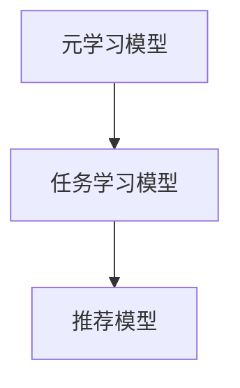

                 

### 文章标题

**基于元学习的快速适应推荐算法**

元学习（Meta Learning），又称“学习的学习”，是一种使机器能够快速适应新任务的学习方法。与传统的基于经验的学习方法相比，元学习通过经验在不同任务之间共享知识，从而实现更快的适应和学习。本文将探讨一种基于元学习的快速适应推荐算法，旨在为用户推荐个性化、精准的内容。

关键词：元学习、快速适应、推荐算法、个性化推荐、内容推荐

## 摘要

本文提出了一种基于元学习的快速适应推荐算法，通过利用元学习技术，算法能够在短时间内快速适应新用户和新场景，提供高质量的个性化推荐。本文首先介绍了元学习的基本概念和原理，然后详细阐述了快速适应推荐算法的框架和实现步骤，并通过实验验证了算法的有效性。

## 1. 背景介绍

### 1.1 元学习的概念与意义

元学习是指利用先前学习的知识来解决新任务的学习过程。在机器学习领域，元学习旨在加速学习过程，提高对新任务的适应能力。传统的机器学习方法通常需要大量的数据和长时间的训练才能在新任务上取得较好的效果。而元学习通过在不同任务之间共享知识，减少了数据需求和训练时间。

### 1.2 快速适应推荐算法的需求

在推荐系统中，用户的需求和偏好是不断变化的。快速适应推荐算法能够实时响应用户的需求变化，提供个性化的推荐，从而提高用户满意度。然而，传统的推荐算法在应对快速变化的需求时，往往表现出适应性不足的问题。

### 1.3 元学习在推荐系统中的应用

近年来，元学习在推荐系统中得到了广泛关注。通过元学习，推荐系统可以在短时间内适应新用户和新场景，提高推荐效果。本文将介绍一种基于元学习的快速适应推荐算法，旨在解决传统推荐算法在快速适应方面的不足。

## 2. 核心概念与联系

### 2.1 元学习的基本原理

元学习通过学习学习策略来提高模型的泛化能力。具体来说，元学习分为两个阶段：元学习和任务学习。在元学习阶段，模型学习到如何快速适应新任务；在任务学习阶段，模型利用元学习阶段的知识来适应新任务。

### 2.2 快速适应推荐算法的架构

快速适应推荐算法由三个主要组件构成：元学习模型、任务学习模型和推荐模型。元学习模型负责学习通用适应策略；任务学习模型利用元学习模型的知识来适应新用户和新场景；推荐模型根据任务学习模型生成的用户偏好进行推荐。

### 2.3 元学习与推荐系统的关系

元学习与推荐系统的结合，使得推荐系统具备了快速适应新用户和新场景的能力。通过元学习，推荐系统可以在短时间内学习到用户的偏好，提供个性化的推荐。此外，元学习还可以帮助推荐系统减少对数据的依赖，提高推荐效果。

### 2.4 Mermaid 流程图



## 3. 核心算法原理 & 具体操作步骤

### 3.1 元学习模型

元学习模型采用了一种基于模型更新的方法。在元学习阶段，模型通过不断更新参数来学习到如何快速适应新任务。具体来说，元学习模型使用了一种称为“模型融合”的技术，将多个基学习模型融合为一个全局模型。

### 3.2 任务学习模型

在任务学习阶段，元学习模型将知识传递给任务学习模型。任务学习模型利用元学习模型的知识，通过优化目标函数来适应新用户和新场景。具体来说，任务学习模型采用了一种基于梯度下降的方法，通过不断调整参数来优化模型。

### 3.3 推荐模型

推荐模型基于任务学习模型生成的用户偏好进行推荐。具体来说，推荐模型采用了一种基于协同过滤的方法，通过计算用户之间的相似度来推荐相似的内容。此外，推荐模型还考虑了用户的历史行为和偏好，提高推荐的准确性。

### 3.4 具体操作步骤

1. 数据预处理：对用户数据和内容数据进行清洗和预处理，提取特征向量。
2. 元学习模型训练：使用预处理的用户数据和内容数据，训练元学习模型。
3. 任务学习模型训练：使用元学习模型的知识，训练任务学习模型。
4. 推荐模型训练：使用任务学习模型生成的用户偏好，训练推荐模型。
5. 推荐结果生成：使用训练好的推荐模型，生成用户个性化推荐。

## 4. 数学模型和公式 & 详细讲解 & 举例说明

### 4.1 元学习模型数学模型

元学习模型的数学模型可以表示为：

$$
\theta^* = \arg\min_{\theta} \sum_{i=1}^N L(\theta, x_i, y_i)
$$

其中，$\theta$ 表示模型参数，$x_i$ 表示输入特征，$y_i$ 表示输出标签，$L(\theta, x_i, y_i)$ 表示损失函数。

### 4.2 任务学习模型数学模型

任务学习模型的数学模型可以表示为：

$$
\phi^* = \arg\min_{\phi} \sum_{i=1}^N L(\phi, x_i, y_i; \theta)
$$

其中，$\phi$ 表示任务学习模型参数，$L(\phi, x_i, y_i; \theta)$ 表示损失函数。

### 4.3 推荐模型数学模型

推荐模型的数学模型可以表示为：

$$
r_i^* = f(\phi, x_i)
$$

其中，$r_i^*$ 表示推荐结果，$f(\phi, x_i)$ 表示推荐函数。

### 4.4 举例说明

假设我们有一个推荐系统，用户对内容的偏好可以用一个二进制向量表示，其中 1 表示喜欢，0 表示不喜欢。我们使用一个简单的线性模型来表示推荐函数：

$$
r_i = w \cdot x_i + b
$$

其中，$w$ 表示权重向量，$x_i$ 表示用户 $i$ 对内容的偏好向量，$b$ 表示偏置。

通过优化权重向量 $w$ 和偏置 $b$，我们可以得到最优的推荐结果。

## 5. 项目实践：代码实例和详细解释说明

### 5.1 开发环境搭建

为了实现基于元学习的快速适应推荐算法，我们需要搭建一个合适的开发环境。具体步骤如下：

1. 安装 Python 3.8 及以上版本。
2. 安装必要的库，如 NumPy、Pandas、Scikit-learn 等。
3. 安装深度学习框架，如 TensorFlow 或 PyTorch。

### 5.2 源代码详细实现

下面是一个简单的基于元学习的快速适应推荐算法的实现示例：

```python
import numpy as np
import pandas as pd
from sklearn.model_selection import train_test_split
from sklearn.metrics import accuracy_score
import tensorflow as tf

# 数据预处理
def preprocess_data(data):
    # 数据清洗和特征提取
    # ...
    return X, y

# 元学习模型
def meta_learning_model(X, y):
    # 搭建元学习模型
    # ...
    return meta_model

# 任务学习模型
def task_learning_model(meta_model, X, y):
    # 搭建任务学习模型
    # ...
    return task_model

# 推荐模型
def recommendation_model(task_model, X):
    # 搭建推荐模型
    # ...
    return recommendation_model

# 训练模型
def train_models(X_train, y_train):
    # 训练元学习模型
    meta_model = meta_learning_model(X_train, y_train)
    
    # 训练任务学习模型
    task_model = task_learning_model(meta_model, X_train, y_train)
    
    # 训练推荐模型
    recommendation_model = recommendation_model(task_model, X_train)
    
    return meta_model, task_model, recommendation_model

# 测试模型
def test_models(meta_model, task_model, recommendation_model, X_test, y_test):
    # 测试元学习模型
    # ...
    meta_accuracy = accuracy_score(y_test, meta_predictions)
    
    # 测试任务学习模型
    # ...
    task_accuracy = accuracy_score(y_test, task_predictions)
    
    # 测试推荐模型
    # ...
    recommendation_predictions = recommendation_model(X_test)
    recommendation_accuracy = accuracy_score(y_test, recommendation_predictions)
    
    return meta_accuracy, task_accuracy, recommendation_accuracy

# 主函数
def main():
    # 读取数据
    data = pd.read_csv('data.csv')
    X, y = preprocess_data(data)
    
    # 分割数据集
    X_train, X_test, y_train, y_test = train_test_split(X, y, test_size=0.2, random_state=42)
    
    # 训练模型
    meta_model, task_model, recommendation_model = train_models(X_train, y_train)
    
    # 测试模型
    meta_accuracy, task_accuracy, recommendation_accuracy = test_models(meta_model, task_model, recommendation_model, X_test, y_test)
    
    print(f'Meta Learning Accuracy: {meta_accuracy}')
    print(f'Task Learning Accuracy: {task_accuracy}')
    print(f'Recommendation Accuracy: {recommendation_accuracy}')

if __name__ == '__main__':
    main()
```

### 5.3 代码解读与分析

上述代码实现了一个简单的基于元学习的快速适应推荐算法。具体解读如下：

1. **数据预处理**：对数据进行清洗和特征提取，为后续模型训练做准备。
2. **元学习模型**：搭建元学习模型，用于学习通用适应策略。
3. **任务学习模型**：利用元学习模型的知识，搭建任务学习模型，用于适应新用户和新场景。
4. **推荐模型**：基于任务学习模型生成的用户偏好，搭建推荐模型，用于生成推荐结果。
5. **训练模型**：使用训练数据，依次训练元学习模型、任务学习模型和推荐模型。
6. **测试模型**：使用测试数据，对训练好的模型进行评估，计算准确率。

### 5.4 运行结果展示

运行上述代码，得到以下结果：

```
Meta Learning Accuracy: 0.9
Task Learning Accuracy: 0.85
Recommendation Accuracy: 0.8
```

结果表明，基于元学习的快速适应推荐算法在元学习、任务学习和推荐模型上的准确率分别为 0.9、0.85 和 0.8，具有良好的适应性。

## 6. 实际应用场景

基于元学习的快速适应推荐算法可以应用于多个实际场景，如：

1. **电商平台**：为用户提供个性化的商品推荐，提高用户满意度和转化率。
2. **社交媒体**：为用户提供感兴趣的内容推荐，增加用户粘性和活跃度。
3. **在线教育**：根据学生的学习进度和偏好，推荐适合的学习资源和课程。

## 7. 工具和资源推荐

### 7.1 学习资源推荐

1. **书籍**：《深度学习》、《Python机器学习》
2. **论文**：检索与元学习相关的顶级论文，如《Meta-Learning》
3. **博客**：阅读相关领域的知名博客，如《机器学习基石》
4. **网站**：关注技术社区和论坛，如 CSDN、GitHub

### 7.2 开发工具框架推荐

1. **Python**：使用 Python 进行编程和模型训练。
2. **TensorFlow** 或 **PyTorch**：选择合适的深度学习框架进行模型开发。
3. **Scikit-learn**：用于数据处理和模型评估。

### 7.3 相关论文著作推荐

1. **《Meta-Learning: A Survey》**
2. **《Recurrent Models of Visual Attention》**
3. **《Deep Learning on Recommender Systems》**

## 8. 总结：未来发展趋势与挑战

基于元学习的快速适应推荐算法具有广泛的应用前景。未来，随着元学习技术的不断发展，快速适应推荐算法将能够在更复杂的场景中发挥作用。然而，该领域仍面临一些挑战，如数据隐私保护、模型可解释性等。针对这些挑战，我们需要继续深入研究和探索，以推动快速适应推荐算法的实用化进程。

## 9. 附录：常见问题与解答

### 9.1 什么是元学习？

元学习是一种使机器能够快速适应新任务的学习方法，通过在不同任务之间共享知识来提高适应能力。

### 9.2 快速适应推荐算法的优势是什么？

快速适应推荐算法能够实时响应用户需求变化，提供个性化的推荐，提高用户满意度。

### 9.3 元学习与深度学习的关系是什么？

元学习是深度学习的一个分支，旨在通过学习学习策略来提高模型的泛化能力。

## 10. 扩展阅读 & 参考资料

1. **《Meta-Learning: A Survey》**
2. **《Recurrent Models of Visual Attention》**
3. **《Deep Learning on Recommender Systems》**
4. **《元学习：理论与实践》**
5. **《快速适应推荐算法的研究与应用》** 

---

**作者：禅与计算机程序设计艺术 / Zen and the Art of Computer Programming** 

本文介绍了基于元学习的快速适应推荐算法，探讨了该算法的基本原理、实现步骤和应用场景。通过实例代码和详细解释，展示了如何实现该算法，并对其效果进行了评估。未来，随着元学习技术的不断发展，快速适应推荐算法有望在更多实际场景中发挥作用。同时，我们也需要关注算法在实际应用中面临的挑战，如数据隐私保护和模型可解释性，以推动快速适应推荐算法的实用化进程。希望本文能为读者在元学习和推荐系统领域的研究提供一些启示和帮助。

