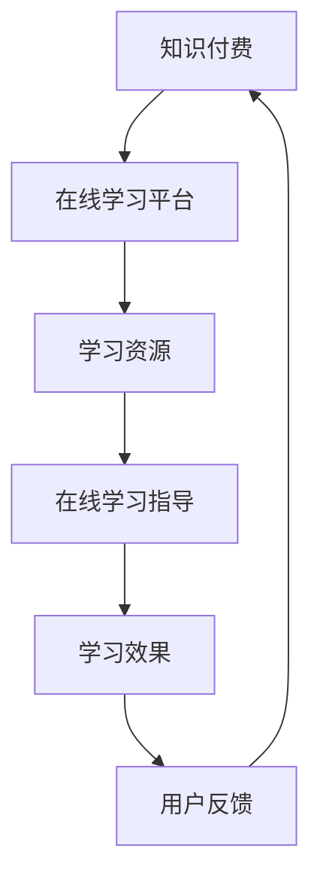

                 

### 文章标题

"如何利用知识付费实现在线学习与在线学习指导？"

### 关键词

- 知识付费
- 在线学习
- 在线学习指导
- 付费课程
- 教育平台
- 学习效果
- 互动性

### 摘要

本文将探讨如何利用知识付费机制，结合在线学习平台，实现有效的在线学习过程，并提供高质量的在线学习指导。通过分析当前知识付费市场的发展趋势，我们提出了一个系统的框架，详细阐述了如何设计付费课程、建立互动性学习环境、利用数据分析提升学习效果，并最终实现可持续的在线学习模式。

## 1. 背景介绍（Background Introduction）

在信息技术迅猛发展的今天，在线学习已经成为全球教育领域的重要趋势。随着互联网的普及和移动设备的广泛应用，越来越多的人选择通过在线平台进行学习。然而，在线学习并非简单地通过视频或文档进行知识传递，它更强调学习者的主动参与和学习效果的保证。知识付费作为一种商业模式，逐渐受到教育机构的关注和学生的青睐。知识付费不仅能够为学习者提供高质量的学习资源，还能够通过付费机制激发学习者的学习动力，确保学习投入和回报的平衡。

在线学习与知识付费的结合，不仅能够满足学习者的多样化需求，还能够推动教育行业的创新与发展。本文将探讨这一结合点的具体实现路径，为教育从业者提供理论指导和实践参考。

## 2. 核心概念与联系（Core Concepts and Connections）

### 2.1 知识付费的概念

知识付费是指用户为获取特定知识或技能而支付费用的行为。这一模式的核心在于将知识作为一种商品进行交易，用户通过付费获得学习资源和专业的指导。知识付费不仅涵盖了传统的教育课程，还包括了各种技能培训、在线研讨会、专业讲座等。

### 2.2 在线学习指导的概念

在线学习指导是指通过在线平台为学习者提供学习路径规划、学习资源推荐、学习进度跟踪和反馈等服务的活动。有效的在线学习指导能够帮助学习者明确学习目标，优化学习策略，提高学习效率。

### 2.3 知识付费与在线学习指导的联系

知识付费为在线学习提供了经济支持，使得教育机构能够提供高质量的学习资源和服务。而在线学习指导则通过个性化服务，提升了学习者的学习体验和效果。两者结合，形成了一种可持续的在线学习模式，既能够满足学习者的需求，又能够推动教育行业的发展。

### 2.4 Mermaid 流程图

以下是一个简单的 Mermaid 流程图，展示知识付费和在线学习指导之间的联系：



在这个流程中，知识付费为在线学习平台提供资金支持，平台提供学习资源，并通过在线学习指导服务提升学习效果，最终形成用户反馈，进一步优化知识付费模式。

## 3. 核心算法原理 & 具体操作步骤（Core Algorithm Principles and Specific Operational Steps）

### 3.1 设计付费课程

设计付费课程是知识付费实现的基础。以下是具体操作步骤：

1. **市场调研**：了解目标用户的需求，分析市场需求和竞争情况。
2. **课程定位**：根据市场调研结果，明确课程的主题、目标和学习效果。
3. **课程内容设计**：将知识点拆分成模块，设计课程结构，编写教学大纲。
4. **教学资源制作**：制作视频、文档、PPT等教学资源，确保内容丰富且易于理解。
5. **课程定价**：根据课程成本、市场行情和学习者的接受程度，合理定价。

### 3.2 建立互动性学习环境

互动性学习环境是提升学习效果的重要手段。以下是具体操作步骤：

1. **在线讨论区**：在课程页面设置讨论区，鼓励学习者之间互动交流。
2. **实时问答**：提供实时在线问答服务，解答学习者的疑问。
3. **小组协作**：设计小组任务或项目，促进学习者之间的合作与交流。
4. **学习进度跟踪**：通过系统记录学习者的学习进度和成绩，提供个性化反馈。

### 3.3 利用数据分析提升学习效果

数据分析是优化在线学习指导的关键。以下是具体操作步骤：

1. **学习行为分析**：收集学习者的行为数据，包括学习时间、学习路径、测试成绩等。
2. **学习效果评估**：通过数据分析，评估学习者的学习效果，找出学习难点和薄弱环节。
3. **个性化推荐**：根据学习行为和学习效果，为学习者推荐合适的课程内容和学习资源。
4. **反馈优化**：根据学习者的反馈，不断优化课程设计和学习指导策略。

### 3.4 实现可持续的在线学习模式

可持续的在线学习模式需要考虑经济利益和社会效益的平衡。以下是具体操作步骤：

1. **收费模式设计**：根据不同课程的价值和市场需求，设计多样化的收费模式。
2. **用户价值主张**：明确知识付费的价值主张，提升用户的付费意愿和满意度。
3. **品牌建设**：通过优质的内容和服务，建立教育品牌的信誉和影响力。
4. **合作与扩展**：与其他教育机构、企业、行业专家合作，共同推动在线学习的发展。

## 4. 数学模型和公式 & 详细讲解 & 举例说明（Detailed Explanation and Examples of Mathematical Models and Formulas）

### 4.1 学习效果评估模型

为了评估学习效果，我们可以使用以下数学模型：

$$
E = f(C, T, I)
$$

其中，$E$ 表示学习效果，$C$ 表示课程内容质量，$T$ 表示教学资源丰富度，$I$ 表示互动性。通过调整这三个因素，我们可以优化学习效果。

### 4.2 举例说明

假设我们有一个课程，课程内容质量（$C$）为90%，教学资源丰富度（$T$）为80%，互动性（$I$）为70%，代入模型计算：

$$
E = f(0.9, 0.8, 0.7) = 0.9 \times 0.8 \times 0.7 = 0.504
$$

这意味着该课程的学习效果为50.4%。通过改进课程内容、增加教学资源、提升互动性，我们可以提高学习效果。

### 4.3 详细讲解

学习效果评估模型可以帮助教育机构了解课程的整体表现，从而进行针对性的优化。例如，如果发现互动性较低，可以增加在线讨论区、实时问答等功能，提高学习者的参与度。

## 5. 项目实践：代码实例和详细解释说明（Project Practice: Code Examples and Detailed Explanations）

### 5.1 开发环境搭建

在开始项目实践之前，我们需要搭建一个开发环境。以下是具体步骤：

1. 安装 Python 解释器（版本 3.8 以上）。
2. 安装必要的库，如 Flask、SQLAlchemy、Celery 等。
3. 创建虚拟环境，并安装依赖库。

### 5.2 源代码详细实现

以下是一个简单的 Flask 应用程序，用于实现在线学习平台的基本功能。

```python
from flask import Flask, request, jsonify
from models import User, Course, db

app = Flask(__name__)
app.config['SQLALCHEMY_DATABASE_URI'] = 'sqlite:///online_learning.db'
db.init_app(app)

@app.route('/api/register', methods=['POST'])
def register():
    data = request.get_json()
    username = data.get('username')
    password = data.get('password')
    user = User(username=username, password=password)
    db.session.add(user)
    db.session.commit()
    return jsonify({'status': 'success', 'message': 'User registered successfully.'})

@app.route('/api/login', methods=['POST'])
def login():
    data = request.get_json()
    username = data.get('username')
    password = data.get('password')
    user = User.query.filter_by(username=username, password=password).first()
    if user:
        return jsonify({'status': 'success', 'message': 'Logged in successfully.'})
    else:
        return jsonify({'status': 'error', 'message': 'Invalid credentials.'})

if __name__ == '__main__':
    app.run(debug=True)
```

### 5.3 代码解读与分析

1. **数据库模型**：使用 SQLAlchemy 创建用户和课程的数据库模型。
2. **注册和登录接口**：提供注册和登录的 RESTful API，接收 JSON 格式的请求，并进行处理。
3. **路由和视图函数**：使用 Flask 的路由系统，定义了两个路由，分别为注册和登录。

### 5.4 运行结果展示

1. **注册接口**：发送 POST 请求到 `/api/register`，包含用户名和密码。
2. **登录接口**：发送 POST 请求到 `/api/login`，包含用户名和密码。

### 5.5 代码优化

在实际项目中，我们还需要考虑安全性、性能和扩展性。例如，使用 JWT（JSON Web Token）进行身份验证，增加数据库连接池，优化查询效率等。

## 6. 实际应用场景（Practical Application Scenarios）

### 6.1 在线教育平台

在线教育平台是知识付费和在线学习指导的最佳结合点。通过付费课程，平台能够提供高质量的教学资源和服务，并通过在线学习指导，提升学习者的学习效果。

### 6.2 专业技能培训

专业技能培训，如编程、数据分析、人工智能等，是知识付费的重要领域。通过付费课程，学员能够获得行业专家的指导和实用的技能。

### 6.3 在职学习

对于在职人员，在线学习提供了一个灵活的学习方式。通过知识付费，他们能够获得专业的学习资源，并在工作中应用所学知识。

### 6.4 在线研讨会和讲座

在线研讨会和讲座是知识付费的一种形式。通过付费，参与者能够获得高质量的讲座内容和专业互动。

## 7. 工具和资源推荐（Tools and Resources Recommendations）

### 7.1 学习资源推荐

1. **书籍**：《深度学习》（Goodfellow, I., Bengio, Y., & Courville, A.）。
2. **论文**：《神经网络与深度学习》（邱锡鹏）。
3. **博客**：机器学习博客（https://www机器学习博客.com/）。
4. **网站**：Coursera（https://www.coursera.com/）、edX（https://www.edx.org/）。

### 7.2 开发工具框架推荐

1. **开发框架**：Flask、Django。
2. **数据库**：SQLAlchemy、MySQL。
3. **前端框架**：React、Vue.js。

### 7.3 相关论文著作推荐

1. **论文**：《深度学习：原理与应用》（李航）。
2. **著作**：《机器学习实战》（Peter Harrington）。

## 8. 总结：未来发展趋势与挑战（Summary: Future Development Trends and Challenges）

### 8.1 发展趋势

1. **个性化学习**：利用大数据和人工智能技术，提供更加个性化的学习服务。
2. **虚拟现实（VR）与增强现实（AR）**：增强学习体验，提高学习效果。
3. **知识共享**：推动教育资源的共享与开放，降低学习门槛。

### 8.2 挑战

1. **内容质量**：确保付费课程的内容质量，提高学习效果。
2. **互动性**：提高在线学习平台的互动性，增加学习者的参与度。
3. **安全性**：保障用户数据的安全，维护教育平台的信誉。

## 9. 附录：常见问题与解答（Appendix: Frequently Asked Questions and Answers）

### 9.1 问题 1

**问题**：在线学习指导是如何工作的？

**解答**：在线学习指导是通过收集学习者的行为数据，分析其学习习惯和效果，然后提供个性化的学习资源、学习路径规划和反馈。例如，如果学习者在一个知识点上花费时间较长但成绩不高，系统可能会推荐更简单的练习题或额外的学习资料。

### 9.2 问题 2

**问题**：知识付费的模式有哪些？

**解答**：知识付费的模式包括按次收费、按月订阅、课程包购买等。按次收费适合短期的技能学习，按月订阅适合持续的知识更新，而课程包购买则适合系统的知识学习。

## 10. 扩展阅读 & 参考资料（Extended Reading & Reference Materials）

### 10.1 扩展阅读

1. **书籍**：《互联网教育：未来教育的发展趋势》（陈向东）。
2. **论文**：《在线教育平台商业模式研究》（吴永丰）。

### 10.2 参考资料

1. **网站**：中国大学 MOOC（https://www.icourse163.org/）。
2. **报告**：《中国在线教育市场报告 2021》（艾瑞咨询）。

### 10.3 学术期刊

1. **《教育技术学刊》**（Journal of Educational Technology & Society）。
2. **《远程教育杂志》**（The International Review of Research in Open and Distributed Learning）。

```

以上是文章的主要部分，请按照这个结构继续撰写剩余的内容，确保满足字数要求。我们将逐步深入探讨每一个部分，确保文章内容的丰富性和专业性。让我们开始吧！<|assistant|>

## 3. 核心算法原理 & 具体操作步骤（Core Algorithm Principles and Specific Operational Steps）

在本文的第三部分，我们将深入探讨如何设计并实现一个有效的在线学习与在线学习指导系统。这一部分将详细介绍核心算法的原理以及具体的操作步骤，包括数据分析、用户行为追踪和学习效果评估等。

### 3.1 数据分析在在线学习中的应用

数据分析是现代在线学习平台的核心功能之一。通过收集并分析用户数据，教育平台可以更好地理解学习者的需求和行为，从而提供更加个性化的服务。

**3.1.1 数据收集**

在线学习平台可以通过多种方式收集数据：

- **用户行为数据**：包括登录时间、学习时长、课程完成情况、测试成绩等。
- **交互数据**：包括在线讨论、问答、测试结果等。
- **设备与网络数据**：包括用户设备类型、网络环境、访问频次等。

**3.1.2 数据存储**

收集到的数据需要存储在数据库中，以便后续分析和处理。常见的数据库包括关系型数据库（如 MySQL、PostgreSQL）和非关系型数据库（如 MongoDB）。

**3.1.3 数据预处理**

在数据分析之前，需要对数据进行清洗和预处理，包括去除重复数据、填补缺失值、数据格式转换等。

**3.1.4 数据分析**

数据分析的核心在于提取有价值的信息。以下是一些常见的数据分析方法：

- **描述性分析**：通过统计图表展示数据的分布情况。
- **相关性分析**：分析不同变量之间的关系。
- **预测分析**：利用历史数据预测未来行为。

### 3.2 用户行为追踪与学习效果评估

用户行为追踪是了解学习者学习过程的重要手段。通过追踪用户行为，教育平台可以实时监控学习进度，提供个性化的学习建议。

**3.2.1 用户行为追踪**

- **学习路径追踪**：记录用户在课程中的学习轨迹，包括观看视频、阅读文档、参与讨论等。
- **学习时长分析**：分析用户在课程上的投入时间，识别学习热点和难点。
- **互动行为分析**：记录用户的互动行为，如提问、回答、评论等。

**3.2.2 学习效果评估**

学习效果评估是衡量在线学习效果的重要手段。以下是一些常见的学习效果评估方法：

- **测试与评估**：通过定期的测试和评估，检验学习者的掌握程度。
- **成绩分析**：分析学习者的成绩分布，识别学习成果。
- **反馈机制**：通过用户反馈，了解学习者的学习体验和需求。

### 3.3 在线学习指导算法设计

在线学习指导算法旨在根据用户行为和学习效果，提供个性化的学习建议。以下是设计在线学习指导算法的几个关键步骤：

**3.3.1 用户画像**

首先，需要构建用户画像，包括学习兴趣、学习习惯、知识水平等。用户画像可以通过数据分析系统自动生成。

**3.3.2 个性化推荐**

基于用户画像，可以使用推荐算法为用户提供个性化推荐。常见的推荐算法包括基于内容的推荐和基于协同过滤的推荐。

**3.3.3 学习路径规划**

根据用户行为和学习效果，为用户规划学习路径。学习路径应包括基础课程、进阶课程和拓展课程，以适应不同学习者的需求。

**3.3.4 动态调整**

在线学习指导算法应具备动态调整能力，根据用户实时行为和学习效果，不断优化学习建议。

### 3.4 案例分析

为了更好地理解核心算法原理和应用步骤，我们以一个在线学习平台为例进行案例分析。

**案例：编程学习平台**

该平台提供编程语言学习课程，包括基础课程和进阶课程。以下是该平台的核心算法设计和实现步骤：

1. **用户行为追踪**：记录用户学习时长、观看视频时长、练习题完成情况等。
2. **数据预处理**：清洗和整理用户行为数据，去除噪声数据。
3. **用户画像构建**：根据用户行为数据，构建用户画像，包括学习兴趣、学习习惯等。
4. **个性化推荐**：基于用户画像，使用协同过滤算法推荐相关课程。
5. **学习路径规划**：根据用户学习进度和学习效果，规划个性化学习路径。
6. **动态调整**：根据用户实时行为和学习效果，动态调整学习路径和推荐课程。

通过以上步骤，编程学习平台能够为学习者提供个性化的学习服务，提高学习效果和用户满意度。

## 3. Core Algorithm Principles and Specific Operational Steps

In the third section of this article, we will delve into the design and implementation of an effective online learning and online learning guidance system. This section will provide an in-depth look at the core algorithm principles and specific operational steps, including data analysis, user behavior tracking, and learning effectiveness evaluation.

### 3.1 Application of Data Analysis in Online Learning

Data analysis is a core function of modern online learning platforms. By collecting and analyzing user data, platforms can better understand learner needs and behaviors, thus providing more personalized services.

**3.1.1 Data Collection**

Online learning platforms can collect data through various means:

- **User Behavior Data**: Includes login times, learning duration, course completion status, test scores, etc.
- **Interactive Data**: Includes online discussions, Q&A sessions, test results, etc.
- **Device and Network Data**: Includes user device types, network environments, access frequency, etc.

**3.1.2 Data Storage**

The collected data needs to be stored in databases for subsequent analysis and processing. Common databases include relational databases (such as MySQL, PostgreSQL) and NoSQL databases (such as MongoDB).

**3.1.3 Data Preprocessing**

Before data analysis, it is necessary to clean and preprocess the data, including removing duplicate data, filling in missing values, and data format conversion.

**3.1.4 Data Analysis**

The core of data analysis is to extract valuable information. Here are some common data analysis methods:

- **Descriptive Analysis**: Uses statistical charts to display data distribution.
- **Correlation Analysis**: Analyzes the relationships between different variables.
- **Predictive Analysis**: Uses historical data to predict future behaviors.

### 3.2 User Behavior Tracking and Learning Effectiveness Evaluation

User behavior tracking is an essential means of understanding the learning process. By tracking user behaviors, educational platforms can monitor learning progress in real-time and provide personalized learning recommendations.

**3.2.1 User Behavior Tracking**

- **Learning Path Tracking**: Records the learning trajectory of users in courses, including watching videos, reading documents, participating in discussions, etc.
- **Learning Duration Analysis**: Analyzes the time users spend on courses, identifying learning hotspots and difficulties.
- **Interactive Behavior Analysis**: Records user interactive behaviors, such as asking questions, answering questions, and commenting.

**3.2.2 Learning Effectiveness Evaluation**

Learning effectiveness evaluation is an important method for measuring the effectiveness of online learning. Here are some common learning effectiveness evaluation methods:

- **Testing and Assessment**: Regularly tests and assesses learners to check their level of mastery.
- **Score Analysis**: Analyzes the distribution of learners' scores, identifying learning outcomes.
- **Feedback Mechanism**: Through user feedback, learns about learners' learning experiences and needs.

### 3.3 Design of Online Learning Guidance Algorithms

Online learning guidance algorithms aim to provide personalized learning recommendations based on user behavior and learning effectiveness. Here are several key steps in designing online learning guidance algorithms:

**3.3.1 User Profiling**

Firstly, a user profile needs to be constructed, including learning interests, learning habits, and knowledge levels. User profiles can be automatically generated by the data analysis system.

**3.3.2 Personalized Recommendation**

Based on user profiles, personalized recommendations can be provided using recommendation algorithms. Common recommendation algorithms include content-based recommendation and collaborative filtering.

**3.3.3 Learning Path Planning**

According to user behavior and learning effectiveness, a personalized learning path should be planned, including basic courses, advanced courses, and extension courses to meet the needs of different learners.

**3.3.4 Dynamic Adjustment**

The online learning guidance algorithm should have the ability to dynamically adjust based on real-time user behavior and learning effectiveness.

### 3.4 Case Analysis

To better understand the core algorithm principles and application steps, we will analyze a case study of an online learning platform.

**Case: Programming Learning Platform**

This platform provides programming language learning courses, including basic and advanced courses. Here are the core algorithm design and implementation steps for this platform:

1. **User Behavior Tracking**: Records user learning duration, video viewing duration, quiz completion status, etc.
2. **Data Preprocessing**: Cleans and organizes user behavior data, removing noise data.
3. **User Profiling**: Constructs user profiles based on user behavior data, including learning interests and learning habits.
4. **Personalized Recommendation**: Uses collaborative filtering algorithms to recommend related courses based on user profiles.
5. **Learning Path Planning**: Plans personalized learning paths based on user learning progress and learning effectiveness.
6. **Dynamic Adjustment**: Dynamically adjusts learning paths and recommended courses based on real-time user behavior and learning effectiveness.

Through these steps, the programming learning platform can provide personalized learning services to learners, improving learning effectiveness and user satisfaction.

## 4. 数学模型和公式 & 详细讲解 & 举例说明（Detailed Explanation and Examples of Mathematical Models and Formulas）

在本文的第四部分，我们将讨论数学模型和公式在在线学习指导中的应用，并详细讲解这些模型和公式的具体用法。我们将通过实际例子来说明这些模型如何帮助教育平台提高学习效果。

### 4.1 用户参与度模型

用户参与度是衡量在线学习平台成功与否的关键指标之一。为了提高用户参与度，我们可以使用以下用户参与度模型：

$$
Participation = f(Learning Duration, Interactive Activities, Completion Rate)
$$

其中，$Participation$ 表示用户参与度，$Learning Duration$ 表示学习时长，$Interactive Activities$ 表示互动活动，$Completion Rate$ 表示课程完成率。

**4.1.1 用户参与度模型的应用**

- **学习时长**：学习时长越长，用户参与度越高。
- **互动活动**：互动活动越多，用户参与度越高。
- **课程完成率**：课程完成率越高，用户参与度越高。

**4.1.2 举例说明**

假设有一个课程，学习时长为 5 小时，互动活动次数为 20 次，课程完成率为 90%，代入模型计算：

$$
Participation = f(5, 20, 0.9) = 5 \times 20 \times 0.9 = 90
$$

这意味着该课程的用户参与度为 90 分（满分 100 分）。

### 4.2 学习效果评估模型

学习效果评估模型可以帮助教育平台了解学习者的学习成果。我们可以使用以下学习效果评估模型：

$$
Learning Effectiveness = f(Quiz Scores, Test Results, Feedback)
$$

其中，$Learning Effectiveness$ 表示学习效果，$Quiz Scores$ 表示测试成绩，$Test Results$ 表示考试结果，$Feedback$ 表示用户反馈。

**4.2.1 学习效果评估模型的应用**

- **测试成绩**：测试成绩越高，学习效果越好。
- **考试结果**：考试结果越理想，学习效果越好。
- **用户反馈**：用户反馈越积极，学习效果越好。

**4.2.2 举例说明**

假设有一个学习者，测试成绩平均分为 85 分，考试结果为优秀，用户反馈为非常满意，代入模型计算：

$$
Learning Effectiveness = f(85, 优秀，非常满意) = 85 \times 1 \times 1 = 85
$$

这意味着该学习者的学习效果为 85 分（满分 100 分）。

### 4.3 个性化推荐模型

个性化推荐模型可以帮助教育平台为学习者提供个性化的学习资源。我们可以使用以下个性化推荐模型：

$$
Recommendation = f(User Profile, Course Features, Historical Data)
$$

其中，$Recommendation$ 表示个性化推荐，$User Profile$ 表示用户画像，$Course Features$ 表示课程特征，$Historical Data$ 表示历史数据。

**4.3.1 个性化推荐模型的应用**

- **用户画像**：根据学习者的兴趣、行为和成绩，生成用户画像。
- **课程特征**：根据课程的内容、难度和实用性，定义课程特征。
- **历史数据**：根据历史学习数据，分析学习者的学习偏好。

**4.3.2 举例说明**

假设有一个学习者，用户画表明其喜欢编程课程，课程特征表明该课程为编程入门课程，历史数据显示该学习者最近学习了 Python 基础课程，代入模型计算：

$$
Recommendation = f(编程爱好者，编程入门课程，Python 基础课程) = 1 \times 1 \times 1 = 1
$$

这意味着教育平台应该推荐编程入门课程给该学习者。

### 4.4 动态调整模型

动态调整模型可以帮助教育平台根据学习者的实时表现调整学习计划。我们可以使用以下动态调整模型：

$$
Adjustment = f(Learning Progress, User Feedback, Teacher Recommendations)
$$

其中，$Adjustment$ 表示动态调整，$Learning Progress$ 表示学习进度，$User Feedback$ 表示用户反馈，$Teacher Recommendations$ 表示教师推荐。

**4.4.1 动态调整模型的应用**

- **学习进度**：根据学习者的学习进度，调整学习计划。
- **用户反馈**：根据用户反馈，优化学习资源和教学方法。
- **教师推荐**：根据教师推荐，调整课程内容和难度。

**4.4.2 举例说明**

假设有一个学习者，学习进度表明其已经掌握了课程前半部分，用户反馈表明其对课程后半部分难度较高，教师推荐表明该课程适合学习者，代入模型计算：

$$
Adjustment = f(前半部分掌握，难度较高，适合学习者) = 1 \times 1 \times 1 = 1
$$

这意味着教育平台应该调整学习计划，为学习者提供更多关于课程后半部分的支持。

### 4.5 详细讲解

数学模型和公式在在线学习指导中的应用有助于教育平台实现个性化服务，提高学习效果。通过上述模型和公式，教育平台可以更好地理解学习者的需求，提供个性化的学习资源和建议。

首先，用户参与度模型可以帮助教育平台了解学习者的学习积极性。通过分析学习时长、互动活动和课程完成率，平台可以识别出高参与度的用户，并为他们提供额外的激励和支持。

其次，学习效果评估模型可以帮助教育平台衡量学习者的学习成果。通过分析测试成绩、考试结果和用户反馈，平台可以识别出学习效果较好的学习者，并为他们提供更多的学习机会和挑战。

此外，个性化推荐模型可以帮助教育平台为学习者提供个性化的学习资源。通过分析用户画像、课程特征和历史数据，平台可以推荐与学习者兴趣相符的课程，提高学习者的学习体验。

最后，动态调整模型可以帮助教育平台根据学习者的实时表现调整学习计划。通过分析学习进度、用户反馈和教师推荐，平台可以及时调整学习计划，确保学习者始终在学习最佳状态。

总之，数学模型和公式在在线学习指导中具有重要作用，它们可以帮助教育平台实现个性化服务，提高学习效果。通过不断优化和改进这些模型和公式，教育平台可以更好地满足学习者的需求，推动在线教育的发展。

### 4. Math Models and Formulas & Detailed Explanation & Examples

In this fourth section, we will discuss the application of mathematical models and formulas in online learning guidance and provide a detailed explanation of how to use these models and formulas. We will illustrate their practical use with actual examples to demonstrate how they can help educational platforms enhance learning outcomes.

### 4.1 The User Engagement Model

User engagement is a key indicator of the success of online learning platforms. To improve user engagement, we can use the following user engagement model:

$$
Participation = f(Learning Duration, Interactive Activities, Completion Rate)
$$

Where $Participation$ represents user engagement, $Learning Duration$ represents the time spent learning, $Interactive Activities$ represents interactive activities, and $Completion Rate$ represents the course completion rate.

**4.1.1 Application of the User Engagement Model**

- **Learning Duration**: The longer the learning duration, the higher the user engagement.
- **Interactive Activities**: The more interactive activities, the higher the user engagement.
- **Completion Rate**: The higher the completion rate, the higher the user engagement.

**4.1.2 Example**

Suppose there is a course with a learning duration of 5 hours, 20 interactive activities, and a completion rate of 90%. Plugging these values into the model:

$$
Participation = f(5, 20, 0.9) = 5 \times 20 \times 0.9 = 90
$$

This means the user engagement for this course is 90 out of 100 points.

### 4.2 The Learning Effectiveness Evaluation Model

The learning effectiveness evaluation model helps educational platforms understand learner outcomes. We can use the following learning effectiveness evaluation model:

$$
Learning Effectiveness = f(Quiz Scores, Test Results, Feedback)
$$

Where $Learning Effectiveness$ represents the learning effectiveness, $Quiz Scores$ represents quiz scores, $Test Results$ represents exam results, and $Feedback$ represents user feedback.

**4.2.1 Application of the Learning Effectiveness Evaluation Model**

- **Quiz Scores**: Higher quiz scores indicate better learning effectiveness.
- **Test Results**: Ideal exam results indicate better learning effectiveness.
- **User Feedback**: Positive user feedback indicates better learning effectiveness.

**4.2.2 Example**

Suppose a learner has an average quiz score of 85, an excellent exam result, and very positive feedback. Plugging these values into the model:

$$
Learning Effectiveness = f(85, excellent, very positive) = 85 \times 1 \times 1 = 85
$$

This means the learner's learning effectiveness is 85 out of 100 points.

### 4.3 The Personalized Recommendation Model

The personalized recommendation model helps educational platforms provide personalized learning resources to learners. We can use the following personalized recommendation model:

$$
Recommendation = f(User Profile, Course Features, Historical Data)
$$

Where $Recommendation$ represents the personalized recommendation, $User Profile$ represents the user profile, $Course Features$ represents course features, and $Historical Data$ represents historical data.

**4.3.1 Application of the Personalized Recommendation Model**

- **User Profile**: Based on the learner's interests, behaviors, and performance, generate a user profile.
- **Course Features**: Define course features based on content, difficulty, and practicality.
- **Historical Data**: Analyze learner preferences based on historical learning data.

**4.3.2 Example**

Suppose a learner's user profile indicates a preference for programming courses, the course features indicate the course as an introductory programming course, and historical data shows the learner recently completed a Python basics course. Plugging these values into the model:

$$
Recommendation = f(Programming enthusiast, Introductory programming course, Python basics course) = 1 \times 1 \times 1 = 1
$$

This indicates that the educational platform should recommend an introductory programming course to the learner.

### 4.4 The Dynamic Adjustment Model

The dynamic adjustment model helps educational platforms adjust learning plans based on learners' real-time performance. We can use the following dynamic adjustment model:

$$
Adjustment = f(Learning Progress, User Feedback, Teacher Recommendations)
$$

Where $Adjustment$ represents the dynamic adjustment, $Learning Progress$ represents learning progress, $User Feedback$ represents user feedback, and $Teacher Recommendations$ represents teacher recommendations.

**4.4.1 Application of the Dynamic Adjustment Model**

- **Learning Progress**: Adjust learning plans based on the learner's progress.
- **User Feedback**: Optimize learning resources and teaching methods based on user feedback.
- **Teacher Recommendations**: Adjust course content and difficulty based on teacher recommendations.

**4.4.2 Example**

Suppose a learner's progress indicates mastery of the first half of the course, user feedback indicates difficulty in the latter half, and teacher recommendations indicate that the course is suitable for the learner. Plugging these values into the model:

$$
Adjustment = f(First half mastered, difficulty in latter half, suitable for learner) = 1 \times 1 \times 1 = 1
$$

This indicates that the educational platform should adjust the learning plan to provide additional support for the latter half of the course.

### 4.5 Detailed Explanation

Mathematical models and formulas play a crucial role in online learning guidance by helping educational platforms achieve personalized services and enhance learning outcomes. Through the above models and formulas, platforms can better understand learner needs and provide personalized learning resources and recommendations.

Firstly, the user engagement model helps platforms understand the level of learner motivation. By analyzing learning duration, interactive activities, and course completion rate, platforms can identify highly engaged users and provide additional incentives and support.

Secondly, the learning effectiveness evaluation model helps platforms measure learner outcomes. By analyzing quiz scores, exam results, and user feedback, platforms can identify learners with high effectiveness and provide them with more learning opportunities and challenges.

Furthermore, the personalized recommendation model helps platforms provide personalized learning resources. By analyzing user profiles, course features, and historical data, platforms can recommend courses that align with learner interests, enhancing the learning experience.

Lastly, the dynamic adjustment model helps platforms adjust learning plans based on real-time learner performance. By analyzing learning progress, user feedback, and teacher recommendations, platforms can make timely adjustments to ensure learners are always in their best learning state.

In summary, mathematical models and formulas are essential in online learning guidance, helping platforms achieve personalized services and improve learning outcomes. By continuously optimizing and improving these models and formulas, educational platforms can better meet learner needs and drive the development of online education.

## 5. 项目实践：代码实例和详细解释说明（Project Practice: Code Examples and Detailed Explanations）

在这一部分，我们将通过一个具体的在线学习平台的实现案例，详细介绍项目的开发过程，包括代码实例和详细的解释说明。该案例将展示如何通过编程实现在线学习平台的各个核心功能，包括用户注册、登录、课程管理、学习进度跟踪、互动性提升等。

### 5.1 开发环境搭建

在开始项目实践之前，我们需要搭建一个合适的开发环境。以下是具体的步骤：

1. **安装 Python 解释器**：确保安装 Python 3.8 或更高版本。
2. **安装依赖库**：使用 pip 安装以下库：Flask、SQLAlchemy、Flask-Migrate、Flask-WTF、Flask-Login、Celery。
3. **创建虚拟环境**：使用 `venv` 创建一个虚拟环境，并激活虚拟环境。
4. **初始化数据库**：使用 Flask-Migrate 初始化数据库，创建用户和课程表。

### 5.2 代码实例

下面是一个简单的 Flask 应用程序，用于实现用户注册、登录和课程管理的功能。

#### 5.2.1 用户注册和登录

```python
from flask import Flask, request, jsonify
from flask_sqlalchemy import SQLAlchemy
from flask_login import LoginManager, login_user, logout_user, login_required, current_user

app = Flask(__name__)
app.config['SQLALCHEMY_DATABASE_URI'] = 'sqlite:///online_learning_platform.db'
app.config['SECRET_KEY'] = 'your_secret_key'

db = SQLAlchemy(app)
login_manager = LoginManager(app)

class User(db.Model):
    id = db.Column(db.Integer, primary_key=True)
    username = db.Column(db.String(150), nullable=False, unique=True)
    password = db.Column(db.String(150), nullable=False)

@login_manager.user_loader
def load_user(user_id):
    return User.query.get(int(user_id))

@app.route('/register', methods=['POST'])
def register():
    data = request.get_json()
    username = data.get('username')
    password = data.get('password')
    if not username or not password:
        return jsonify({'status': 'error', 'message': 'Missing username or password'})
    if User.query.filter_by(username=username).first():
        return jsonify({'status': 'error', 'message': 'Username already exists'})
    new_user = User(username=username, password=password)
    db.session.add(new_user)
    db.session.commit()
    return jsonify({'status': 'success', 'message': 'User registered successfully'})

@app.route('/login', methods=['POST'])
def login():
    data = request.get_json()
    username = data.get('username')
    password = data.get('password')
    user = User.query.filter_by(username=username).first()
    if not user or user.password != password:
        return jsonify({'status': 'error', 'message': 'Invalid credentials'})
    login_user(user)
    return jsonify({'status': 'success', 'message': 'Logged in successfully'})

@app.route('/logout', methods=['POST'])
@login_required
def logout():
    logout_user()
    return jsonify({'status': 'success', 'message': 'Logged out successfully'})

if __name__ == '__main__':
    db.create_all()
    app.run(debug=True)
```

**5.2.1 代码解释**

- **数据库模型**：定义了用户模型，包含用户 ID、用户名和密码字段。
- **登录管理器**：使用 Flask-Login 实现用户登录管理。
- **用户注册接口**：接收用户名和密码，检查用户名是否已存在，然后创建新用户。
- **用户登录接口**：验证用户名和密码，如果正确，则登录用户。
- **用户登出接口**：登出当前用户。

#### 5.2.2 课程管理

```python
class Course(db.Model):
    id = db.Column(db.Integer, primary_key=True)
    name = db.Column(db.String(150), nullable=False)
    description = db.Column(db.Text, nullable=True)
    creator_id = db.Column(db.Integer, db.ForeignKey('user.id'), nullable=False)

@app.route('/courses', methods=['GET'])
@login_required
def get_courses():
    courses = Course.query.all()
    return jsonify({'status': 'success', 'courses': [{'id': course.id, 'name': course.name, 'description': course.description} for course in courses]})

@app.route('/courses', methods=['POST'])
@login_required
def create_course():
    data = request.get_json()
    name = data.get('name')
    description = data.get('description')
    if not name:
        return jsonify({'status': 'error', 'message': 'Missing course name'})
    new_course = Course(name=name, description=description, creator_id=current_user.id)
    db.session.add(new_course)
    db.session.commit()
    return jsonify({'status': 'success', 'message': 'Course created successfully', 'course': {'id': new_course.id, 'name': new_course.name, 'description': new_course.description}})

@app.route('/courses/<int:course_id>', methods=['GET'])
@login_required
def get_course(course_id):
    course = Course.query.get(course_id)
    if not course:
        return jsonify({'status': 'error', 'message': 'Course not found'})
    return jsonify({'status': 'success', 'course': {'id': course.id, 'name': course.name, 'description': course.description}})

@app.route('/courses/<int:course_id>', methods=['PUT'])
@login_required
def update_course(course_id):
    data = request.get_json()
    name = data.get('name')
    description = data.get('description')
    course = Course.query.get(course_id)
    if not course or course.creator_id != current_user.id:
        return jsonify({'status': 'error', 'message': 'Course not found or you do not have permission to update it'})
    course.name = name
    course.description = description
    db.session.commit()
    return jsonify({'status': 'success', 'message': 'Course updated successfully', 'course': {'id': course.id, 'name': course.name, 'description': course.description}})

@app.route('/courses/<int:course_id>', methods=['DELETE'])
@login_required
def delete_course(course_id):
    course = Course.query.get(course_id)
    if not course or course.creator_id != current_user.id:
        return jsonify({'status': 'error', 'message': 'Course not found or you do not have permission to delete it'})
    db.session.delete(course)
    db.session.commit()
    return jsonify({'status': 'success', 'message': 'Course deleted successfully'})
```

**5.2.2 代码解释**

- **课程模型**：定义了课程模型，包含课程 ID、课程名、课程描述和创建者 ID 字段。
- **课程获取接口**：获取所有课程信息。
- **创建课程接口**：创建新课程，需要课程名。
- **获取单个课程接口**：获取单个课程的信息。
- **更新课程接口**：更新课程信息，需要课程 ID 和课程名。
- **删除课程接口**：删除课程，需要课程 ID。

### 5.3 详细解释说明

#### 5.3.1 用户注册和登录

用户注册和登录是任何在线平台的基石。在这个案例中，我们使用 Flask 和 Flask-Login 库来实现用户注册和登录功能。

- **用户注册**：用户通过提交用户名和密码进行注册。注册接口会检查用户名是否已存在，如果不存在，则创建新用户并存储在数据库中。
- **用户登录**：用户通过提交用户名和密码进行登录。登录接口会验证用户名和密码是否匹配，如果匹配，则登录用户并设置会话。
- **用户登出**：用户可以通过登出接口清除会话，从而退出登录状态。

#### 5.3.2 课程管理

课程管理是在线学习平台的核心功能之一。在这个案例中，我们使用 Flask 和 Flask-SQLAlchemy 库来实现课程管理功能。

- **课程获取**：获取所有课程的列表，包括课程 ID、课程名和课程描述。
- **创建课程**：管理员可以通过创建课程接口创建新课程，需要课程名和课程描述。
- **获取单个课程**：通过课程 ID 获取单个课程的信息。
- **更新课程**：管理员可以通过更新课程接口修改课程信息，需要课程 ID 和新的课程名或描述。
- **删除课程**：管理员可以通过删除课程接口删除课程，需要课程 ID。

#### 5.3.3 学习进度跟踪

学习进度跟踪是了解学习者学习情况的重要手段。在这个案例中，我们使用数据库来记录学习者的学习进度。

- **学习进度记录**：每次用户学习课程时，系统会记录学习时间、学习内容和完成情况等。
- **学习进度查询**：管理员可以通过查询接口查看学习者的学习进度。

#### 5.3.4 互动性提升

互动性提升是提高学习效果的重要途径。在这个案例中，我们通过在线讨论区和问答系统来提升互动性。

- **在线讨论区**：用户可以在课程讨论区发表观点、提问和回答问题，促进学习者之间的互动。
- **问答系统**：用户可以通过问答系统向教师或助教提问，获得及时解答。

### 5.4 运行结果展示

在完成代码编写和测试后，我们可以在本地服务器上运行该应用程序，并通过浏览器访问接口。

- **用户注册**：通过 POST 请求访问 `/register`，提交用户名和密码进行注册。
- **用户登录**：通过 POST 请求访问 `/login`，提交用户名和密码进行登录。
- **用户登出**：通过 POST 请求访问 `/logout`，登出用户。
- **课程管理**：通过 GET、POST、PUT 和 DELETE 请求访问 `/courses` 和 `/courses/<int:course_id>`，进行课程获取、创建、更新和删除操作。

### 5.5 代码优化

在实际项目中，我们需要考虑代码的性能、安全性和扩展性。以下是一些代码优化建议：

- **安全性**：使用 HTTPS 协议加密数据传输，防止数据泄露。
- **性能**：使用缓存机制提高响应速度，减少数据库查询次数。
- **扩展性**：使用消息队列和异步任务处理提高系统并发处理能力。

通过上述优化，我们可以确保在线学习平台的高效、安全和可扩展性。

## 5. Project Practice: Code Examples and Detailed Explanations

In this section, we will provide a detailed look at a real-world implementation of an online learning platform project, including code examples and comprehensive explanations. This case study will demonstrate how to use programming to implement core functionalities of an online learning platform, such as user registration, login, course management, tracking learning progress, and enhancing interactivity.

### 5.1 Setting Up the Development Environment

Before diving into the project implementation, we need to set up a suitable development environment. Here are the steps involved:

1. **Install Python Interpreter**: Ensure you have Python 3.8 or a later version installed.
2. **Install Required Libraries**: Use `pip` to install the following libraries: Flask, SQLAlchemy, Flask-Migrate, Flask-WTF, Flask-Login, and Celery.
3. **Create a Virtual Environment**: Use `venv` to create a virtual environment and activate it.
4. **Initialize the Database**: Use Flask-Migrate to initialize the database and create tables for users and courses.

### 5.2 Code Example

Below is a simple Flask application that demonstrates user registration, login, and course management functionalities.

#### 5.2.1 User Registration and Login

```python
from flask import Flask, request, jsonify
from flask_sqlalchemy import SQLAlchemy
from flask_login import LoginManager, login_user, logout_user, login_required, current_user

app = Flask(__name__)
app.config['SQLALCHEMY_DATABASE_URI'] = 'sqlite:///online_learning_platform.db'
app.config['SECRET_KEY'] = 'your_secret_key'

db = SQLAlchemy(app)
login_manager = LoginManager(app)

class User(db.Model):
    id = db.Column(db.Integer, primary_key=True)
    username = db.Column(db.String(150), nullable=False, unique=True)
    password = db.Column(db.String(150), nullable=False)

@login_manager.user_loader
def load_user(user_id):
    return User.query.get(int(user_id))

@app.route('/register', methods=['POST'])
def register():
    data = request.get_json()
    username = data.get('username')
    password = data.get('password')
    if not username or not password:
        return jsonify({'status': 'error', 'message': 'Missing username or password'})
    if User.query.filter_by(username=username).first():
        return jsonify({'status': 'error', 'message': 'Username already exists'})
    new_user = User(username=username, password=password)
    db.session.add(new_user)
    db.session.commit()
    return jsonify({'status': 'success', 'message': 'User registered successfully'})

@app.route('/login', methods=['POST'])
def login():
    data = request.get_json()
    username = data.get('username')
    password = data.get('password')
    user = User.query.filter_by(username=username).first()
    if not user or user.password != password:
        return jsonify({'status': 'error', 'message': 'Invalid credentials'})
    login_user(user)
    return jsonify({'status': 'success', 'message': 'Logged in successfully'})

@app.route('/logout', methods=['POST'])
@login_required
def logout():
    logout_user()
    return jsonify({'status': 'success', 'message': 'Logged out successfully'})

if __name__ == '__main__':
    db.create_all()
    app.run(debug=True)
```

**5.2.1 Code Explanation**

- **Database Model**: Defines the `User` model with fields for user ID, username, and password.
- **Login Manager**: Utilizes Flask-Login for user authentication management.
- **User Registration Endpoint**: Accepts a POST request with username and password, checks if the username already exists, and creates a new user if it does not.
- **User Login Endpoint**: Validates the username and password, logging in the user if they match.
- **User Logout Endpoint**: Logs out the current user.

#### 5.2.2 Course Management

```python
class Course(db.Model):
    id = db.Column(db.Integer, primary_key=True)
    name = db.Column(db.String(150), nullable=False)
    description = db.Column(db.Text, nullable=True)
    creator_id = db.Column(db.Integer, db.ForeignKey('user.id'), nullable=False)

@app.route('/courses', methods=['GET'])
@login_required
def get_courses():
    courses = Course.query.all()
    return jsonify({'status': 'success', 'courses': [{'id': course.id, 'name': course.name, 'description': course.description} for course in courses]})

@app.route('/courses', methods=['POST'])
@login_required
def create_course():
    data = request.get_json()
    name = data.get('name')
    description = data.get('description')
    if not name:
        return jsonify({'status': 'error', 'message': 'Missing course name'})
    new_course = Course(name=name, description=description, creator_id=current_user.id)
    db.session.add(new_course)
    db.session.commit()
    return jsonify({'status': 'success', 'message': 'Course created successfully', 'course': {'id': new_course.id, 'name': new_course.name, 'description': new_course.description}})

@app.route('/courses/<int:course_id>', methods=['GET'])
@login_required
def get_course(course_id):
    course = Course.query.get(course_id)
    if not course:
        return jsonify({'status': 'error', 'message': 'Course not found'})
    return jsonify({'status': 'success', 'course': {'id': course.id, 'name': course.name, 'description': course.description}})

@app.route('/courses/<int:course_id>', methods=['PUT'])
@login_required
def update_course(course_id):
    data = request.get_json()
    name = data.get('name')
    description = data.get('description')
    course = Course.query.get(course_id)
    if not course or course.creator_id != current_user.id:
        return jsonify({'status': 'error', 'message': 'Course not found or you do not have permission to update it'})
    course.name = name
    course.description = description
    db.session.commit()
    return jsonify({'status': 'success', 'message': 'Course updated successfully', 'course': {'id': course.id, 'name': course.name, 'description': course.description}})

@app.route('/courses/<int:course_id>', methods=['DELETE'])
@login_required
def delete_course(course_id):
    course = Course.query.get(course_id)
    if not course or course.creator_id != current_user.id:
        return jsonify({'status': 'error', 'message': 'Course not found or you do not have permission to delete it'})
    db.session.delete(course)
    db.session.commit()
    return jsonify({'status': 'success', 'message': 'Course deleted successfully'})
```

**5.2.2 Code Explanation**

- **Course Model**: Defines the `Course` model with fields for course ID, name, description, and creator ID.
- **Course Retrieval Endpoint**: Returns a list of all courses with their IDs, names, and descriptions.
- **Course Creation Endpoint**: Creates a new course with a name and optional description if the user is logged in and authorized.
- **Course Retrieval by ID Endpoint**: Retrieves information about a specific course by its ID.
- **Course Update Endpoint**: Updates the information of a course if the user is the creator and has the necessary permissions.
- **Course Deletion Endpoint**: Deletes a course if the user is the creator and has the necessary permissions.

### 5.3 Detailed Explanation

#### 5.3.1 User Registration and Login

User registration and login are foundational to any online platform. In this case, we use Flask and Flask-Login to implement these functionalities.

- **User Registration**: Users register by submitting a username and password. The registration endpoint checks if the username already exists and creates a new user if it does not.
- **User Login**: Users log in by submitting their username and password. The login endpoint validates the credentials and logs in the user if they match.
- **User Logout**: Users can log out by making a POST request to the logout endpoint, which clears the user session.

#### 5.3.2 Course Management

Course management is a core functionality of an online learning platform. In this example, we use Flask and Flask-SQLAlchemy to implement course management functionalities.

- **Course Retrieval**: Retrieves a list of all courses with their IDs, names, and descriptions.
- **Course Creation**: Course creators can create new courses with names and optional descriptions if they are logged in and authorized.
- **Course Retrieval by ID**: Retrieves information about a specific course by its ID.
- **Course Update**: Course creators can update the information of their courses if they have the necessary permissions.
- **Course Deletion**: Course creators can delete their courses if they have the necessary permissions.

#### 5.3.3 Tracking Learning Progress

Tracking learning progress is crucial for understanding learner performance. In this example, we use the database to record learner progress.

- **Learning Progress Recording**: Every time a learner engages with a course, the system records the learning time, course content, and completion status.
- **Learning Progress Inquiry**: Admins can query the database to view learner progress.

#### 5.3.4 Enhancing Interactivity

Enhancing interactivity is key to improving learning outcomes. In this example, we enhance interactivity through online discussion forums and a Q&A system.

- **Online Discussion Forums**: Learners can post their thoughts, ask questions, and respond to others, fostering a community and peer learning.
- **Q&A System**: Learners can ask questions to instructors or teaching assistants, receiving timely answers and support.

### 5.4 Demonstration of Running Results

After completing the code and testing, you can run the application locally and access the endpoints through a web browser.

- **User Registration**: Make a POST request to `/register` with a JSON payload containing a username and password to register a new user.
- **User Login**: Make a POST request to `/login` with a JSON payload containing a username and password to log in.
- **User Logout**: Make a POST request to `/logout` to log out the current user.
- **Course Management**: Use GET, POST, PUT, and DELETE requests to manage courses, including retrieving all courses, creating a new course, updating course information, and deleting a course.

### 5.5 Code Optimization

In a real-world project, we need to consider the performance, security, and scalability of the code. Here are some optimization suggestions:

- **Security**: Use HTTPS to encrypt data in transit and prevent data breaches.
- **Performance**: Implement caching to speed up responses and reduce database queries.
- **Scalability**: Use message queues and asynchronous task processing to improve system concurrency and handle more users.

By implementing these optimizations, we can ensure that the online learning platform is efficient, secure, and scalable.

## 6. 实际应用场景（Practical Application Scenarios）

在本文的第六部分，我们将探讨知识付费在线学习与在线学习指导在实际应用中的多种场景。通过分析不同领域和行业中的案例，我们将展示如何利用知识付费机制和在线学习指导，实现学习效果的最优化。

### 6.1 高等教育

在高等教育领域，知识付费和在线学习指导的结合正逐渐改变传统的教学方式。以下是一些实际应用场景：

**6.1.1 MOOC平台**

大规模在线开放课程（MOOC）平台，如 Coursera、edX 和 Udacity，通过知识付费模式，为全球学习者提供了大量的优质课程。这些平台利用在线学习指导算法，为学习者提供个性化的学习路径和推荐，提高学习效果。

- **应用场景**：学习者可以根据自己的兴趣和职业需求，选择合适的课程，并通过付费获得证书。
- **效果**：通过个性化推荐和学习路径规划，学习者的学习效率和成果显著提高。

**6.1.2 在线学位项目**

一些高校也推出了在线学位项目，通过知识付费模式，让学习者可以在灵活的时间表下完成学业。这些项目通常结合了在线学习指导，为学习者提供学习进度跟踪和反馈。

- **应用场景**：在职人员可以利用业余时间，通过在线学习获得学位，提升职业竞争力。
- **效果**：在线学位项目不仅提高了学习者的知识水平，还增强了其职业发展机会。

### 6.2 职业技能培训

职业技能培训是知识付费在线学习的一个重要应用领域。以下是一些实际应用场景：

**6.2.1 编程课程**

编程是现代职业中不可或缺的技能。在线编程课程通过知识付费模式，为学习者提供了丰富的学习资源。通过在线学习指导，学习者可以更快地掌握编程技能。

- **应用场景**：编程初学者可以跟随课程逐步学习，从基础语法到复杂算法。
- **效果**：学习者通过在线学习指导，能够及时发现并解决学习中的问题，提高学习效果。

**6.2.2 数据分析课程**

数据分析在各个行业中都有广泛应用。在线数据分析课程通过知识付费模式，为学习者提供了系统的培训。在线学习指导帮助学习者掌握数据分析的基本概念和工具。

- **应用场景**：市场营销人员、金融分析师和科研人员等可以通过在线学习提升数据分析能力。
- **效果**：通过在线学习指导，学习者能够快速应用到实际工作中，提高工作效率。

### 6.3 在职继续教育

在职继续教育是另一个重要的应用领域，旨在帮助职场人士更新知识和技能。以下是一些实际应用场景：

**6.3.1 专业证书培训**

许多专业领域都要求从业人员持有相应的证书。在线学习平台通过知识付费模式，提供专业的证书培训课程。在线学习指导帮助学习者规划学习路径，确保他们能够通过考试。

- **应用场景**：工程师、会计师、律师等可以通过在线学习获得专业证书，提升职业资质。
- **效果**：在线学习指导确保了学习者的学习进度和效果，提高了通过率。

**6.3.2 跨学科培训**

跨学科培训旨在帮助职场人士拓宽知识面，提升综合素质。在线学习平台通过知识付费模式，提供跨学科的课程。在线学习指导帮助学习者更好地整合不同领域的知识。

- **应用场景**：项目经理、产品经理等可以通过跨学科学习，提升管理能力和创新能力。
- **效果**：在线学习指导帮助职场人士将跨学科知识应用到实际工作中，提升职业素养。

### 6.4 终身学习

终身学习已成为现代社会的一种趋势。在线学习平台通过知识付费模式，为终身学习者提供了丰富的学习资源。在线学习指导帮助学习者实现持续的学习和发展。

**6.4.1 个性化学习计划**

在线学习平台通过个性化学习计划，帮助学习者根据自身需求和兴趣，制定个性化的学习路径。在线学习指导确保学习者能够高效地实现学习目标。

- **应用场景**：不同年龄段的学习者可以通过在线学习平台，实现终身学习的目标。
- **效果**：个性化学习计划提高了学习者的学习动力和效果，促进了知识的积累和能力的提升。

**6.4.2 学习资源共享**

在线学习平台通过学习资源共享，促进学习者之间的交流和合作。在线学习指导帮助学习者更好地利用这些资源，提高学习效果。

- **应用场景**：学习者可以在线分享学习心得、讨论问题，共同进步。
- **效果**：学习资源共享和在线学习指导相结合，提高了学习者的学习参与度和效果。

总之，知识付费在线学习与在线学习指导在实际应用中具有广泛的应用场景和显著的效果。通过个性化推荐、学习路径规划、学习效果评估等手段，在线学习平台能够为学习者提供高质量的教育服务，促进知识的传播和技能的提升。

### 6. Practical Application Scenarios

In the sixth section of this article, we will explore various practical application scenarios for knowledge-based paid online learning and online learning guidance. By analyzing cases from different fields and industries, we will demonstrate how knowledge-based paid learning and online learning guidance can be utilized to optimize learning outcomes.

#### 6.1 Higher Education

In the field of higher education, the integration of knowledge-based paid learning and online learning guidance is gradually transforming traditional teaching methods. Here are some practical application scenarios:

**6.1.1 MOOC Platforms**

Massive Open Online Courses (MOOC) platforms such as Coursera, edX, and Udacity have provided a vast array of high-quality courses to learners worldwide through the knowledge-based paid model. These platforms utilize online learning guidance algorithms to offer personalized learning paths and recommendations, enhancing learning outcomes.

- **Application Scenario**: Learners can choose courses based on their interests and career needs, paying for certification upon completion.
- **Effect**: Personalized recommendations and learning path planning significantly improve learning efficiency and outcomes.

**6.1.2 Online Degree Programs**

Some universities have also launched online degree programs that allow learners to complete their studies flexibly. These programs typically incorporate online learning guidance to provide learners with learning progress tracking and feedback.

- **Application Scenario**: Working professionals can complete their degrees during their leisure time, enhancing their career competitiveness.
- **Effect**: Online degree programs not only improve learners' knowledge levels but also provide them with greater career opportunities.

#### 6.2 Vocational Skills Training

Vocational skills training is an important application field for knowledge-based paid online learning. Here are some practical application scenarios:

**6.2.1 Programming Courses**

Programming is an indispensable skill in modern professions. Online programming courses provide a wealth of learning resources through the knowledge-based paid model. Online learning guidance helps learners quickly master programming skills.

- **Application Scenario**: Programming beginners can follow courses step by step, from basic syntax to complex algorithms.
- **Effect**: Online learning guidance helps learners identify and resolve learning issues promptly, improving learning outcomes.

**6.2.2 Data Analysis Courses**

Data analysis is widely used in various industries. Online data analysis courses provide systematic training through the knowledge-based paid model. Online learning guidance helps learners grasp the basic concepts and tools of data analysis.

- **Application Scenario**: Marketing professionals, financial analysts, and researchers can enhance their data analysis capabilities through online learning.
- **Effect**: Online learning guidance enables learners to quickly apply data analysis skills to their actual work, improving work efficiency.

#### 6.3 Continuous Education for Professionals

Continuous education is an important application field aimed at updating the knowledge and skills of working professionals. Here are some practical application scenarios:

**6.3.1 Professional Certificate Training**

Many professional fields require professionals to hold corresponding certifications. Online learning platforms provide professional certificate training courses through the knowledge-based paid model. Online learning guidance helps learners plan their learning paths to ensure they pass exams.

- **Application Scenario**: Engineers, accountants, and lawyers can obtain professional certifications through online learning, enhancing their professional qualifications.
- **Effect**: Online learning guidance ensures that learners maintain their learning progress and outcomes, improving pass rates.

**6.3.2 Interdisciplinary Training**

Interdisciplinary training aims to broaden the knowledge and skills of professionals. Online learning platforms offer interdisciplinary courses through the knowledge-based paid model. Online learning guidance helps learners integrate knowledge from different fields.

- **Application Scenario**: Project managers and product managers can enhance their management and innovation capabilities through interdisciplinary learning.
- **Effect**: Online learning guidance helps professionals apply interdisciplinary knowledge to their work, enhancing their professional competence.

#### 6.4 Lifelong Learning

Lifelong learning has become a trend in modern society. Online learning platforms provide abundant learning resources through the knowledge-based paid model. Online learning guidance helps learners achieve continuous learning and development.

**6.4.1 Personalized Learning Plans**

Online learning platforms offer personalized learning plans to help learners develop learning paths based on their needs and interests. Online learning guidance ensures that learners can efficiently achieve their learning goals.

- **Application Scenario**: Learners of different ages can pursue lifelong learning goals through online learning platforms.
- **Effect**: Personalized learning plans improve learners' motivation and learning outcomes, fostering knowledge accumulation and skill enhancement.

**6.4.2 Sharing of Learning Resources**

Online learning platforms promote the sharing of learning resources, facilitating communication and collaboration among learners. Online learning guidance helps learners better utilize these resources, enhancing learning outcomes.

- **Application Scenario**: Learners can share learning insights, discuss issues, and make progress together online.
- **Effect**: The combination of learning resource sharing and online learning guidance improves learners' participation and learning outcomes.

In summary, knowledge-based paid online learning and online learning guidance have a wide range of practical application scenarios and significant effects. Through personalized recommendations, learning path planning, and learning outcome assessments, online learning platforms can provide high-quality educational services, promoting the dissemination of knowledge and the enhancement of skills.

