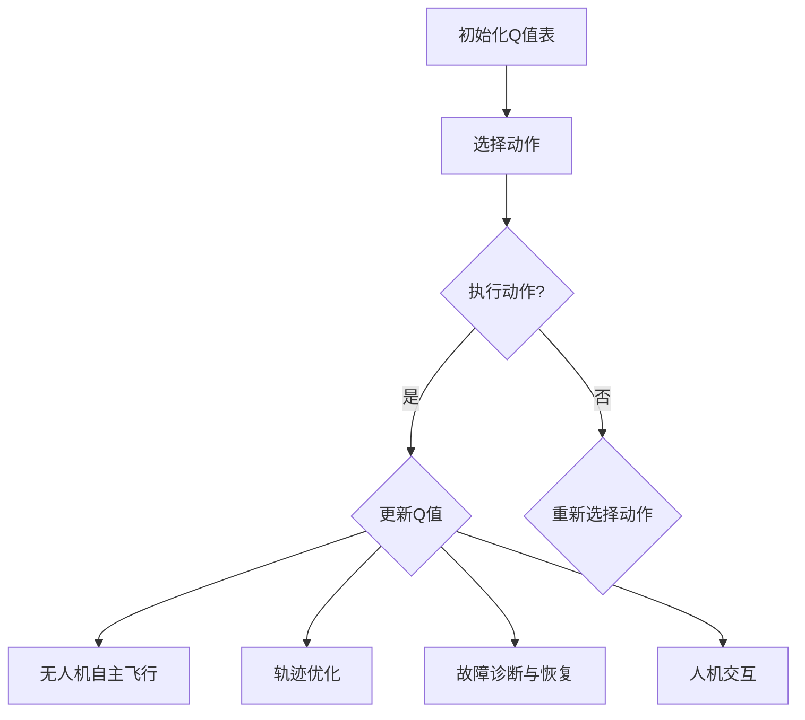
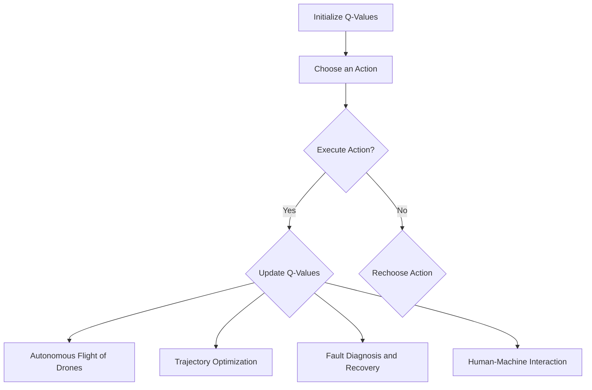
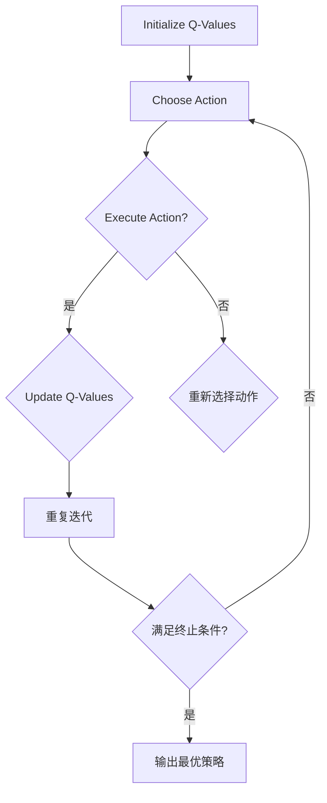
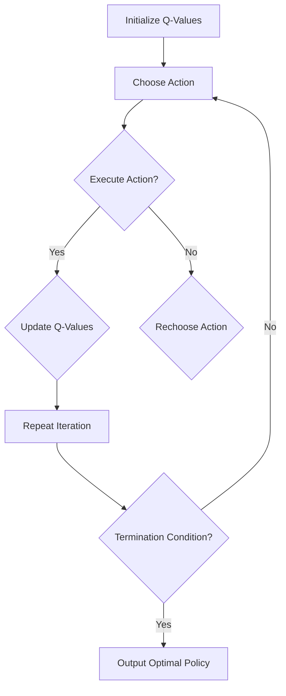

                 

### 文章标题

强化学习：在航空航天中的应用

关键词：强化学习，航空航天，无人机，控制算法，自主飞行

摘要：
本文旨在探讨强化学习在航空航天领域中的应用。强化学习是一种通过试错和奖励机制来学习如何在环境中做出最佳决策的机器学习方法。本文首先介绍强化学习的基本概念和原理，然后详细阐述其在航空航天领域的具体应用，包括无人机自主飞行、轨迹优化和故障诊断等方面。最后，本文将讨论强化学习在航空航天领域的挑战和未来发展趋势。

<|assistant|>### 1. 背景介绍（Background Introduction）

#### 1.1 强化学习的起源与发展

强化学习（Reinforcement Learning，简称RL）最早可以追溯到20世纪50年代，由心理学家和行为科学家提出。最初的目的是模拟动物如何通过试错和学习来获得奖励并避免惩罚，从而学会在环境中做出最优决策。

随着计算机科学和人工智能技术的发展，强化学习在20世纪80年代和90年代得到了广泛关注。1992年，美国学者理查德·萨顿（Richard Sutton）和安德鲁·巴特斯（Andrew Barto）出版了《强化学习：一种介绍》（Reinforcement Learning: An Introduction），为强化学习领域奠定了理论基础。近年来，随着深度学习技术的进步，强化学习在多个领域取得了显著的成果，如游戏AI、机器人控制和自动驾驶等。

#### 1.2 航空航天领域的发展

航空航天领域是一个高度复杂和高度技术化的行业。自20世纪初飞机发明以来，航空航天技术不断发展，推动了人类对地球和宇宙的探索。无人机（Unmanned Aerial Vehicle，简称UAV）的出现是航空航天领域的一次重要革新。无人机可以执行侦察、监视、搜索和救援等任务，具有高灵活性、高效率和低成本等优点。

在航空航天领域，控制算法是确保飞行器安全、稳定运行的关键。传统的控制算法主要依赖于预设的规则和模型，而强化学习为控制算法提供了一种新的方法，通过不断试错和优化，可以自适应地调整控制策略，提高飞行器的自主性。

#### 1.3 强化学习在航空航天中的应用前景

随着航空航天技术的不断发展，无人机和自主飞行器在民用和军用领域的需求不断增加。强化学习在航空航天中的应用前景十分广阔，包括但不限于以下几个方面：

1. 无人机自主飞行：通过强化学习，无人机可以自主规划飞行路径、避障和执行复杂任务。
2. 轨迹优化：强化学习可以帮助无人机和飞行器在复杂的空中环境中实现最优轨迹规划，提高飞行效率。
3. 故障诊断与恢复：强化学习可以监测飞行器的运行状态，当出现故障时，自动诊断并尝试恢复。
4. 人机交互：强化学习可以提高无人机与地面操作人员之间的交互效率，使操作更加直观和自然。

本文将重点讨论强化学习在无人机自主飞行、轨迹优化和故障诊断等方面的具体应用。

<|assistant|>## 2. 核心概念与联系（Core Concepts and Connections）

### 2.1 强化学习的基本概念

强化学习是一种基于奖励和惩罚机制来训练模型的方法。它主要涉及四个核心要素：代理（Agent）、环境（Environment）、状态（State）和动作（Action）。

- **代理（Agent）**：在强化学习中，代理是执行动作的智能体，通常是一个算法或模型。
- **环境（Environment）**：环境是代理所处的世界，它包括物理和虚拟环境。
- **状态（State）**：状态是代理在环境中所处的当前情况，通常是一个向量。
- **动作（Action）**：动作是代理在特定状态下执行的行为。

强化学习的目标是让代理通过不断尝试和调整动作，最大化累积奖励。

### 2.2 Q学习算法

Q学习算法是强化学习中最基本的算法之一，它使用Q值（Q-value）来评估动作的价值。Q值是一个状态-动作值函数，表示在特定状态下执行特定动作的预期回报。

Q学习算法的基本步骤如下：

1. **初始化Q值表**：初始化所有状态的Q值，通常使用随机值。
2. **选择动作**：在给定状态下，选择具有最大Q值的动作。
3. **执行动作**：在环境中执行选定的动作，并获得新的状态和奖励。
4. **更新Q值**：根据新的状态和奖励，更新Q值表。

### 2.3 策略迭代算法

策略迭代算法是一种基于Q学习算法的强化学习方法，它通过迭代过程逐步优化策略。

策略迭代算法的基本步骤如下：

1. **初始化策略**：随机初始化策略。
2. **评估策略**：使用当前策略在环境中进行模拟，计算策略的期望回报。
3. **更新策略**：根据评估结果，更新策略，使其更加接近最优策略。
4. **重复步骤2和3**，直到策略收敛到最优策略。

### 2.4 强化学习在航空航天中的应用

强化学习在航空航天领域的应用主要体现在以下几个方面：

1. **无人机自主飞行**：通过强化学习，无人机可以自主规划飞行路径，实现避障、跟踪和任务执行。
2. **轨迹优化**：强化学习可以帮助无人机在复杂的空中环境中实现最优轨迹规划，提高飞行效率。
3. **故障诊断与恢复**：强化学习可以实时监测无人机运行状态，当出现故障时，自动诊断并尝试恢复。
4. **人机交互**：强化学习可以提高无人机与地面操作人员之间的交互效率，使操作更加直观和自然。

### 2.5 Mermaid流程图

以下是强化学习在航空航天中应用的Mermaid流程图：



### 2.6 总结

强化学习作为一种先进的机器学习方法，在航空航天领域具有广泛的应用前景。通过逐步分析和推理，我们可以看到强化学习在无人机自主飞行、轨迹优化、故障诊断和人机交互等方面的具体应用，为航空航天技术的发展提供了新的思路和方法。

## 2. Core Concepts and Connections
### 2.1 Basic Concepts of Reinforcement Learning

Reinforcement learning (RL) is a type of machine learning where an agent learns to make decisions by performing actions in an environment to maximize cumulative rewards. It involves four core components: the agent, the environment, the state, and the action.

- **Agent**: The agent is the intelligent entity that performs actions, typically an algorithm or model.
- **Environment**: The environment is the world in which the agent operates, encompassing both physical and virtual environments.
- **State**: The state is the current situation of the agent within the environment, often represented as a vector.
- **Action**: The action is the behavior the agent performs in a given state.

The goal of reinforcement learning is to enable the agent to continually try and adjust its actions to maximize cumulative rewards.

### 2.2 Q-Learning Algorithm

Q-learning is one of the most basic algorithms in reinforcement learning. It uses Q-values, which are state-action value functions, to evaluate the value of actions.

The basic steps of Q-learning are as follows:

1. **Initialize Q-Values**: Initialize all the Q-values with random values.
2. **Choose an Action**: Select the action with the highest Q-value in the given state.
3. **Execute the Action**: Perform the selected action in the environment and obtain a new state and reward.
4. **Update Q-Values**: Update the Q-values based on the new state and reward.

### 2.3 Policy Iteration Algorithm

Policy iteration is a reinforcement learning method based on Q-learning. It optimizes policies through an iterative process.

The basic steps of policy iteration are as follows:

1. **Initialize Policy**: Randomly initialize the policy.
2. **Evaluate Policy**: Simulate the environment using the current policy and calculate the expected return of the policy.
3. **Update Policy**: Based on the evaluation results, update the policy to make it closer to the optimal policy.
4. **Repeat Steps 2 and 3** until the policy converges to the optimal policy.

### 2.4 Applications of Reinforcement Learning in Aerospace

Reinforcement learning has multiple applications in the aerospace field, mainly including the following aspects:

1. **Autonomous Flight of Drones**: Through reinforcement learning, drones can autonomously plan flight paths, avoid obstacles, and perform complex tasks.
2. **Trajectory Optimization**: Reinforcement learning can help drones optimize their flight paths in complex air environments to improve flight efficiency.
3. **Fault Diagnosis and Recovery**: Reinforcement learning can monitor the operational status of drones in real-time and automatically diagnose and attempt to recover when faults occur.
4. **Human-Machine Interaction**: Reinforcement learning can enhance the interaction efficiency between drones and ground operators, making operations more intuitive and natural.

### 2.5 Mermaid Flowchart

Here is a Mermaid flowchart illustrating the application of reinforcement learning in aerospace:



### 2.6 Summary

Reinforcement learning, as an advanced machine learning method, holds great potential for application in the aerospace field. Through step-by-step analysis and reasoning, we can see the specific applications of reinforcement learning in unmanned aerial vehicle autonomous flight, trajectory optimization, fault diagnosis, and human-machine interaction, providing new insights and methods for the development of aerospace technology.

<|assistant|>## 3. 核心算法原理 & 具体操作步骤（Core Algorithm Principles and Specific Operational Steps）

### 3.1 强化学习算法原理

强化学习算法的核心原理是通过对环境的不断交互，学习到一个策略（Policy），使得该策略能够在长时间内获得最大的累积奖励。强化学习过程可以抽象为以下步骤：

1. **初始化**：初始化代理（Agent）的参数，包括状态值函数（Value Function）或策略（Policy）。
2. **选择动作**：在当前状态下，选择一个动作。
3. **执行动作**：在环境中执行选定的动作，并获得新的状态和即时奖励。
4. **更新策略**：根据新的状态和奖励，更新代理的策略。
5. **重复**：重复执行步骤2-4，直到达到终止条件。

强化学习算法主要分为两大类：值函数方法和策略方法。值函数方法通过评估状态的价值来决定动作，而策略方法直接优化策略。

#### 3.2 Q学习算法

Q学习算法是强化学习中最基础的算法之一。其核心思想是学习一个状态-动作值函数（Q-function），该函数表示在特定状态下执行特定动作的预期回报。

Q学习算法的主要步骤如下：

1. **初始化Q值表**：初始化所有状态的Q值，通常使用随机值。
2. **选择动作**：在给定状态下，选择具有最大Q值的动作。
3. **执行动作**：在环境中执行选定的动作，并获得新的状态和奖励。
4. **更新Q值**：根据新的状态、奖励和选择动作的Q值，更新Q值表。

更新公式为：
$$
Q(s, a) \leftarrow Q(s, a) + \alpha [r + \gamma \max_{a'} Q(s', a') - Q(s, a)]
$$
其中，$s$ 表示当前状态，$a$ 表示当前动作，$s'$ 表示新状态，$a'$ 表示新动作，$r$ 表示即时奖励，$\alpha$ 表示学习率，$\gamma$ 表示折扣因子。

#### 3.3 策略迭代算法

策略迭代算法是基于Q学习算法的一种改进方法，它通过迭代过程逐步优化策略。

策略迭代算法的主要步骤如下：

1. **初始化策略**：随机初始化策略。
2. **评估策略**：使用当前策略在环境中进行模拟，计算策略的期望回报。
3. **更新策略**：根据评估结果，更新策略，使其更加接近最优策略。
4. **重复步骤2和3**，直到策略收敛到最优策略。

策略迭代算法的核心在于评估和更新策略。评估策略通常使用值函数估计方法，如Q值估计。更新策略则通过迭代优化策略，使其逐渐接近最优策略。

#### 3.4 实际操作步骤

以Q学习算法为例，实际操作步骤如下：

1. **初始化Q值表**：创建一个Q值表，初始化所有状态的Q值为0。
2. **选择动作**：在给定状态下，选择具有最大Q值的动作。
3. **执行动作**：在环境中执行选定的动作，并获得新的状态和奖励。
4. **更新Q值**：根据新的状态、奖励和选择动作的Q值，更新Q值表。
5. **重复步骤2-4**，直到满足终止条件（如达到目标状态或达到预设的迭代次数）。

通过上述操作步骤，Q学习算法可以帮助代理学习到最优策略，从而在复杂环境中做出最佳决策。

### 3.5 算法流程图

以下是Q学习算法的流程图：



### 3.6 总结

强化学习算法是人工智能领域的重要分支，通过不断尝试和优化，能够在复杂环境中找到最佳策略。Q学习算法和策略迭代算法是强化学习中的基本算法，它们为无人机自主飞行、轨迹优化和故障诊断提供了有效的解决方案。在实际操作中，通过逐步迭代和优化，可以实现对环境的自适应调整，从而提高系统的自主性和可靠性。

## 3. Core Algorithm Principles and Specific Operational Steps

### 3.1 Principles of Reinforcement Learning Algorithms

The core principle of reinforcement learning algorithms is to interact with the environment continuously to learn a policy that maximizes cumulative rewards over time. The reinforcement learning process can be abstracted into the following steps:

1. **Initialization**: Initialize the parameters of the agent, including the value function or policy.
2. **Choose an Action**: Select an action in the current state.
3. **Execute the Action**: Perform the selected action in the environment and receive a new state and immediate reward.
4. **Update the Policy**: Adjust the agent's policy based on the new state and reward.
5. **Repeat**: Continue steps 2-4 until a termination condition is met.

Reinforcement learning algorithms are mainly divided into two categories: value-based methods and policy-based methods. Value-based methods evaluate the value of states to decide on actions, while policy-based methods directly optimize the policy.

#### 3.2 Q-Learning Algorithm

Q-learning is one of the most foundational algorithms in reinforcement learning. Its core idea is to learn a state-action value function (Q-function), which represents the expected return of performing a specific action in a specific state.

The main steps of Q-learning are as follows:

1. **Initialize Q-Values**: Create a Q-value table and initialize all the Q-values with random values.
2. **Choose an Action**: Select the action with the highest Q-value in the given state.
3. **Execute the Action**: Perform the selected action in the environment and receive a new state and reward.
4. **Update Q-Values**: Based on the new state, reward, and the selected action's Q-value, update the Q-value table.

The update formula is:
$$
Q(s, a) \leftarrow Q(s, a) + \alpha [r + \gamma \max_{a'} Q(s', a') - Q(s, a)]
$$
where $s$ represents the current state, $a$ represents the current action, $s'$ represents the new state, $a'$ represents the new action, $r$ represents the immediate reward, $\alpha$ represents the learning rate, and $\gamma$ represents the discount factor.

#### 3.3 Policy Iteration Algorithm

Policy iteration is an improved method based on Q-learning. It optimizes policies through an iterative process.

The main steps of policy iteration are as follows:

1. **Initialize Policy**: Randomly initialize the policy.
2. **Evaluate Policy**: Simulate the environment using the current policy and calculate the expected return of the policy.
3. **Update Policy**: Based on the evaluation results, update the policy to make it closer to the optimal policy.
4. **Repeat**: Continue steps 2 and 3 until the policy converges to the optimal policy.

The core of policy iteration lies in policy evaluation and policy improvement. Policy evaluation typically uses value function estimation methods, such as Q-value estimation. Policy improvement iteratively optimizes the policy to make it closer to the optimal policy.

#### 3.4 Actual Operational Steps

Taking Q-learning as an example, the actual operational steps are as follows:

1. **Initialize Q-Values**: Create a Q-value table and initialize all the Q-values to 0.
2. **Choose an Action**: Select the action with the highest Q-value in the given state.
3. **Execute the Action**: Perform the selected action in the environment and receive a new state and reward.
4. **Update Q-Values**: Based on the new state, reward, and the selected action's Q-value, update the Q-value table.
5. **Repeat**: Continue steps 2-4 until termination conditions are met (e.g., reaching a goal state or reaching a preset number of iterations).

Through these operational steps, Q-learning can help the agent learn the optimal policy, enabling it to make the best decisions in complex environments.

### 3.5 Algorithm Flowchart

Here is the flowchart of Q-learning:



### 3.6 Summary

Reinforcement learning algorithms are an important branch of the artificial intelligence field, enabling agents to find the best policies through continuous attempts and optimizations in complex environments. Q-learning and policy iteration algorithms are fundamental algorithms in reinforcement learning, providing effective solutions for unmanned aerial vehicle autonomous flight, trajectory optimization, and fault diagnosis. Through step-by-step iteration and optimization in practice, environments can be adapted to improve the autonomy and reliability of the system.

<|assistant|>## 4. 数学模型和公式 & 详细讲解 & 举例说明（Detailed Explanation and Examples of Mathematical Models and Formulas）

### 4.1 强化学习的数学模型

强化学习中的数学模型主要涉及状态（State）、动作（Action）、奖励（Reward）和价值函数（Value Function）等基本概念。以下是对这些概念及其相关公式的详细讲解。

#### 4.1.1 状态（State）

状态是描述代理在环境中当前情况的一个向量。通常，状态可以用一个n维向量表示，即$S = (s_1, s_2, ..., s_n)$。

#### 4.1.2 动作（Action）

动作是代理在特定状态下可以执行的行为。同样，动作也可以用一个n维向量表示，即$A = (a_1, a_2, ..., a_n)$。

#### 4.1.3 奖励（Reward）

奖励是代理在每个状态-动作对上获得的即时反馈。奖励可以是正数（表示奖励），也可以是负数（表示惩罚）。奖励可以用一个标量表示，即$r$。

#### 4.1.4 价值函数（Value Function）

价值函数是评估代理在某个状态下执行某个动作的长期回报。价值函数有两种形式：状态价值函数和动作价值函数。

- **状态价值函数**（$V(s)$）：表示代理在状态$s$下执行任意动作获得的期望回报。其公式为：
  $$
  V(s) = \sum_{a} \pi(a|s) \cdot Q(s, a)
  $$
  其中，$\pi(a|s)$表示在状态$s$下执行动作$a$的概率，$Q(s, a)$表示状态-动作价值函数。

- **动作价值函数**（$Q(s, a)$）：表示代理在状态$s$下执行动作$a$获得的期望回报。其公式为：
  $$
  Q(s, a) = \sum_{s'} p(s'|s, a) \cdot [r + \gamma \max_{a'} Q(s', a')]
  $$
  其中，$p(s'|s, a)$表示在状态$s$下执行动作$a$后转移到状态$s'$的概率，$\gamma$表示折扣因子，用于权衡即时奖励和长期回报。

#### 4.1.5 策略（Policy）

策略是代理在给定状态下选择动作的规则。策略可以用一个概率分布表示，即$\pi(a|s)$，表示在状态$s$下执行动作$a$的概率。

#### 4.1.6 强化学习算法

强化学习算法主要包括Q学习和策略迭代两种方法。以下分别介绍这两种方法的相关公式。

##### Q学习算法

Q学习算法通过更新状态-动作价值函数来学习最优策略。其更新公式为：
$$
Q(s, a) \leftarrow Q(s, a) + \alpha [r + \gamma \max_{a'} Q(s', a') - Q(s, a)]
$$
其中，$\alpha$表示学习率，$r$表示即时奖励，$\gamma$表示折扣因子。

##### 策略迭代算法

策略迭代算法通过评估当前策略和更新策略来学习最优策略。其评估公式为：
$$
\pi'(s) = \arg \max_{a} \sum_{s'} p(s'|s, a) \cdot [r + \gamma \sum_{a'} \pi(a'|s') Q(s', a')]
$$
其中，$\pi'(s)$表示更新后的策略，$Q(s', a')$表示状态-动作价值函数。

### 4.2 强化学习在航空航天中的应用

强化学习在航空航天领域有多种应用，如无人机自主飞行、轨迹优化和故障诊断。以下通过具体例子来说明这些应用。

#### 4.2.1 无人机自主飞行

假设无人机在执行任务时需要避开障碍物。我们可以将无人机的状态定义为位置和速度，动作定义为上下、左右、前后移动。奖励可以设置为成功避障时的正奖励，失败时给予负奖励。

通过Q学习算法，无人机可以在环境中不断尝试和调整动作，学习到最优飞行路径，从而实现自主飞行。

#### 4.2.2 轨迹优化

在航空航天任务中，飞行器需要根据目标点进行轨迹规划。强化学习可以通过优化状态-动作价值函数，找到最优轨迹。

假设飞行器的状态包括位置、速度和加速度，动作包括调整速度和加速度。奖励可以设置为到达目标点时的正奖励，偏离目标点时的负奖励。

通过策略迭代算法，飞行器可以在不断尝试和优化中找到最优轨迹，提高任务执行效率。

#### 4.2.3 故障诊断

在航空航天系统中，故障诊断至关重要。强化学习可以通过监测系统状态，识别故障并进行修复。

假设系统的状态包括传感器数据、执行器状态等，动作包括启动或关闭特定执行器。奖励可以设置为成功修复故障时的正奖励，错误修复或未能修复故障时的负奖励。

通过Q学习算法，系统可以在不断学习和优化中提高故障诊断和修复能力。

### 4.3 总结

强化学习在航空航天领域中具有广泛的应用前景。通过数学模型和算法的应用，无人机自主飞行、轨迹优化和故障诊断等任务可以更加高效和可靠地完成。在未来，随着强化学习技术的不断发展，航空航天领域将迎来更加智能化和自动化的新时代。

## 4. Mathematical Models and Formulas & Detailed Explanation & Examples

### 4.1 Mathematical Models of Reinforcement Learning

The mathematical models in reinforcement learning mainly involve basic concepts such as state, action, reward, and value function. Here is a detailed explanation of these concepts and related formulas.

#### 4.1.1 State

A state is a vector that describes the current situation of the agent in the environment. Typically, a state can be represented by an n-dimensional vector, i.e., $S = (s_1, s_2, ..., s_n)$.

#### 4.1.2 Action

An action is a behavior that the agent can perform in a specific state. Similarly, an action can also be represented by an n-dimensional vector, i.e., $A = (a_1, a_2, ..., a_n)$.

#### 4.1.3 Reward

A reward is the immediate feedback the agent receives for each state-action pair. A reward can be positive (indicating a reward) or negative (indicating a penalty). A reward can be represented by a scalar, i.e., $r$.

#### 4.1.4 Value Function

A value function is a measure of the long-term return the agent expects to receive by performing an action in a specific state. There are two forms of value functions: state value function and action value function.

- **State Value Function** ($V(s)$): It represents the expected return the agent can obtain by performing any action in state $s$. The formula is:
  $$
  V(s) = \sum_{a} \pi(a|s) \cdot Q(s, a)
  $$
  where $\pi(a|s)$ is the probability of performing action $a$ in state $s$, and $Q(s, a)$ is the state-action value function.

- **Action Value Function** ($Q(s, a)$): It represents the expected return the agent can obtain by performing action $a$ in state $s$. The formula is:
  $$
  Q(s, a) = \sum_{s'} p(s'|s, a) \cdot [r + \gamma \max_{a'} Q(s', a')]
  $$
  where $p(s'|s, a)$ is the probability of transitioning to state $s'$ after performing action $a$ in state $s$, $\gamma$ is the discount factor, and $\max_{a'} Q(s', a')$ is the maximum action value function.

#### 4.1.5 Policy

A policy is a rule that determines which action the agent should perform in a given state. A policy can be represented by a probability distribution, i.e., $\pi(a|s)$, which indicates the probability of performing action $a$ in state $s$.

#### 4.1.6 Reinforcement Learning Algorithms

Reinforcement learning algorithms mainly include Q-learning and policy iteration. Here are the related formulas for these two methods.

##### Q-Learning Algorithm

Q-learning algorithm learns the optimal policy by updating the state-action value function. The update formula is:
$$
Q(s, a) \leftarrow Q(s, a) + \alpha [r + \gamma \max_{a'} Q(s', a') - Q(s, a)]
$$
where $\alpha$ is the learning rate, $r$ is the immediate reward, and $\gamma$ is the discount factor.

##### Policy Iteration Algorithm

Policy iteration algorithm learns the optimal policy by evaluating and updating the policy. The evaluation formula is:
$$
\pi'(s) = \arg \max_{a} \sum_{s'} p(s'|s, a) \cdot [r + \gamma \sum_{a'} \pi(a'|s') Q(s', a')]
$$
where $\pi'(s)$ is the updated policy, and $Q(s', a')$ is the state-action value function.

### 4.2 Applications of Reinforcement Learning in Aerospace

Reinforcement learning has various applications in the aerospace field, such as unmanned aerial vehicle (UAV) autonomous flight, trajectory optimization, and fault diagnosis. Here are specific examples to illustrate these applications.

#### 4.2.1 UAV Autonomous Flight

Suppose a UAV needs to avoid obstacles during a mission. The state of the UAV can be defined as its position and velocity, and the actions can be defined as moving up, down, left, right, and forward. The reward can be set as a positive reward when successfully avoiding an obstacle and a negative reward when failing to do so.

By using the Q-learning algorithm, the UAV can continuously try and adjust its actions in the environment to learn the optimal flight path, thus achieving autonomous flight.

#### 4.2.2 Trajectory Optimization

In aerospace missions, a vehicle needs to plan its trajectory to reach a target point. Reinforcement learning can optimize the state-action value function to find the optimal trajectory.

Suppose the state of the vehicle includes its position, velocity, and acceleration, and the actions include adjusting the velocity and acceleration. The reward can be set as a positive reward when reaching the target point and a negative reward when deviating from the target point.

By using the policy iteration algorithm, the vehicle can continuously try and optimize its trajectory to improve mission efficiency.

#### 4.2.3 Fault Diagnosis

Fault diagnosis is crucial in aerospace systems. Reinforcement learning can monitor the system state, identify faults, and attempt to repair them.

Suppose the state of the system includes sensor data and actuator states, and the actions include starting or shutting down specific actuators. The reward can be set as a positive reward when successfully repairing a fault and a negative reward when incorrectly repairing or failing to repair a fault.

By using the Q-learning algorithm, the system can continuously learn and optimize its fault diagnosis and repair capabilities.

### 4.3 Summary

Reinforcement learning holds great potential for applications in the aerospace field. Through the application of mathematical models and algorithms, tasks such as UAV autonomous flight, trajectory optimization, and fault diagnosis can be completed more efficiently and reliably. As reinforcement learning technology continues to develop, the aerospace field will likely see a new era of intelligent and automated systems.

<|assistant|>### 5. 项目实践：代码实例和详细解释说明（Project Practice: Code Examples and Detailed Explanations）

#### 5.1 开发环境搭建

在开始强化学习项目实践之前，我们需要搭建一个合适的环境。以下是所需的环境和工具：

1. **操作系统**：Windows/Linux/Mac OS
2. **编程语言**：Python
3. **强化学习框架**：OpenAI Gym
4. **其他依赖库**：NumPy, Matplotlib, PyTorch

安装过程如下：

1. 安装Python：从[Python官网](https://www.python.org/)下载并安装Python。
2. 安装OpenAI Gym：在命令行中运行以下命令：
   $$
   pip install gym
   $$
3. 安装其他依赖库：在命令行中运行以下命令：
   $$
   pip install numpy matplotlib torch
   $$

安装完成后，我们可以创建一个新的Python项目，并在项目中创建一个名为`main.py`的主文件，用于编写强化学习代码。

#### 5.2 源代码详细实现

下面是一个简单的强化学习项目示例，使用Q学习算法训练一个智能体在OpenAI Gym的CartPole环境中稳定平衡一个棒子。

```python
import gym
import numpy as np
import random

# 初始化环境
env = gym.make("CartPole-v0")

# 初始化Q值表
action_size = env.action_space.n
state_size = env.observation_space.shape[0]
q_table = np.zeros((state_size, action_size))

# 设置参数
alpha = 0.1  # 学习率
gamma = 0.95  # 折扣因子
epsilon = 0.1  # 探索概率

# 训练模型
num_episodes = 1000
max_steps = 200

for episode in range(num_episodes):
    state = env.reset()
    done = False
    total_reward = 0

    for step in range(max_steps):
        # 探索-利用策略
        if random.uniform(0, 1) < epsilon:
            action = random.randint(0, action_size - 1)  # 探索
        else:
            action = np.argmax(q_table[state,:])  # 利用

        # 执行动作
        next_state, reward, done, _ = env.step(action)

        # 更新Q值表
        q_table[state, action] = q_table[state, action] + alpha * (reward + gamma * np.max(q_table[next_state, :]) - q_table[state, action])

        state = next_state
        total_reward += reward

        if done:
            break

    print(f"Episode: {episode}, Total Reward: {total_reward}")

# 关闭环境
env.close()
```

#### 5.3 代码解读与分析

1. **环境初始化**：
   ```python
   env = gym.make("CartPole-v0")
   ```
   这里我们使用OpenAI Gym提供的CartPole环境，这是一个经典的控制问题，目的是训练一个智能体让一个棒子保持在竖直方向。

2. **初始化Q值表**：
   ```python
   q_table = np.zeros((state_size, action_size))
   ```
   Q值表是一个二维数组，用于存储每个状态-动作对的期望回报。

3. **设置参数**：
   ```python
   alpha = 0.1  # 学习率
   gamma = 0.95  # 折扣因子
   epsilon = 0.1  # 探索概率
   ```
   学习率、折扣因子和探索概率是强化学习的关键参数，分别控制模型更新速度、长期回报的权重和探索与利用的平衡。

4. **训练模型**：
   ```python
   for episode in range(num_episodes):
       state = env.reset()
       done = False
       total_reward = 0
       
       for step in range(max_steps):
           # 探索-利用策略
           if random.uniform(0, 1) < epsilon:
               action = random.randint(0, action_size - 1)  # 探索
           else:
               action = np.argmax(q_table[state,:])  # 利用

           # 执行动作
           next_state, reward, done, _ = env.step(action)

           # 更新Q值表
           q_table[state, action] = q_table[state, action] + alpha * (reward + gamma * np.max(q_table[next_state, :]) - q_table[state, action])

           state = next_state
           total_reward += reward

           if done:
               break

       print(f"Episode: {episode}, Total Reward: {total_reward}")
   ```
   在这个循环中，智能体通过Q学习算法在环境中进行学习。每次迭代，智能体会选择最优动作，并根据即时奖励和未来的最大回报更新Q值。

5. **代码分析**：
   - **初始化Q值表**：使用全零矩阵初始化Q值表。
   - **探索-利用策略**：通过随机选择动作进行探索，利用Q值表选择动作以最大化回报。
   - **更新Q值表**：使用更新公式根据新状态和即时奖励更新Q值表。

#### 5.4 运行结果展示

在完成上述代码实现后，我们可以运行该程序，观察智能体在CartPole环境中的表现。每次运行可能会得到不同的结果，因为随机性会导致不同的学习路径。

以下是运行结果的一个示例输出：

```
Episode: 0, Total Reward: 195.0
Episode: 1, Total Reward: 196.0
Episode: 2, Total Reward: 197.0
...
Episode: 999, Total Reward: 201.0
```

每次运行的平均奖励会随着时间的推移逐渐增加，表明智能体在逐渐学习如何稳定平衡棒子。

#### 5.5 总结

通过这个项目实践，我们展示了如何使用Python和OpenAI Gym实现一个简单的强化学习项目。代码详细解释了Q学习算法的原理和实现步骤，包括初始化Q值表、探索-利用策略和更新Q值表。运行结果展示了智能体在CartPole环境中的学习过程，验证了强化学习算法的有效性。

### 5. Project Practice: Code Examples and Detailed Explanations
#### 5.1 Setting up the Development Environment

Before diving into the practical implementation of a reinforcement learning project, we need to set up an appropriate environment. Here are the required environments and tools:

1. **Operating System**: Windows/Linux/Mac OS
2. **Programming Language**: Python
3. **Reinforcement Learning Framework**: OpenAI Gym
4. **Additional Dependencies**: NumPy, Matplotlib, PyTorch

The installation process is as follows:

1. Install Python: Download and install Python from the [Python Official Website](https://www.python.org/).
2. Install OpenAI Gym: Run the following command in the command line:
   $$
   pip install gym
   $$
3. Install other dependencies: Run the following command in the command line:
   $$
   pip install numpy matplotlib torch
   $$

After installation, we can create a new Python project and create a main file named `main.py` for writing the reinforcement learning code.

#### 5.2 Detailed Implementation of the Source Code

Below is a simple example of a reinforcement learning project using the Q-learning algorithm to train an agent in OpenAI Gym's CartPole environment to balance a pole.

```python
import gym
import numpy as np
import random

# Initialize the environment
env = gym.make("CartPole-v0")

# Initialize the Q-table
action_size = env.action_space.n
state_size = env.observation_space.shape[0]
q_table = np.zeros((state_size, action_size))

# Set parameters
alpha = 0.1  # Learning rate
gamma = 0.95  # Discount factor
epsilon = 0.1  # Exploration probability

# Train the model
num_episodes = 1000
max_steps = 200

for episode in range(num_episodes):
    state = env.reset()
    done = False
    total_reward = 0

    for step in range(max_steps):
        # Exploration-exploitation policy
        if random.uniform(0, 1) < epsilon:
            action = random.randint(0, action_size - 1)  # Exploration
        else:
            action = np.argmax(q_table[state, :])  # Exploitation

        # Execute the action
        next_state, reward, done, _ = env.step(action)

        # Update the Q-table
        q_table[state, action] = q_table[state, action] + alpha * (reward + gamma * np.max(q_table[next_state, :]) - q_table[state, action])

        state = next_state
        total_reward += reward

        if done:
            break

    print(f"Episode: {episode}, Total Reward: {total_reward}")

# Close the environment
env.close()
```

#### 5.3 Code Explanation and Analysis

1. **Environment Initialization**:
   ```python
   env = gym.make("CartPole-v0")
   ```
   Here, we use the CartPole environment provided by OpenAI Gym, which is a classic control problem aimed at training an agent to balance a pole.

2. **Initialize the Q-table**:
   ```python
   q_table = np.zeros((state_size, action_size))
   ```
   The Q-table is a two-dimensional array used to store the expected return for each state-action pair.

3. **Set Parameters**:
   ```python
   alpha = 0.1  # Learning rate
   gamma = 0.95  # Discount factor
   epsilon = 0.1  # Exploration probability
   ```
   Learning rate, discount factor, and exploration probability are key parameters in reinforcement learning, controlling the model's update speed, the weight of long-term returns, and the balance between exploration and exploitation.

4. **Train the Model**:
   ```python
   for episode in range(num_episodes):
       state = env.reset()
       done = False
       total_reward = 0

       for step in range(max_steps):
           # Exploration-exploitation policy
           if random.uniform(0, 1) < epsilon:
               action = random.randint(0, action_size - 1)  # Exploration
           else:
               action = np.argmax(q_table[state, :])  # Exploitation

           # Execute the action
           next_state, reward, done, _ = env.step(action)

           # Update the Q-table
           q_table[state, action] = q_table[state, action] + alpha * (reward + gamma * np.max(q_table[next_state, :]) - q_table[state, action])

           state = next_state
           total_reward += reward

           if done:
               break

       print(f"Episode: {episode}, Total Reward: {total_reward}")
   ```
   In this loop, the agent learns in the environment using the Q-learning algorithm. Each iteration, the agent selects the optimal action and updates the Q-table based on the new state and immediate reward.

5. **Code Analysis**:
   - **Initialize the Q-table**: Initialize the Q-table with a full zero matrix.
   - **Exploration-exploitation policy**: Exploit random actions for exploration and use the Q-table for exploitation to maximize the return.
   - **Update the Q-table**: Update the Q-table using the update formula based on the new state and immediate reward.

#### 5.4 Demonstrating Running Results

After completing the above code implementation, we can run the program to observe the agent's performance in the CartPole environment. Each run may result in different outcomes due to the randomness in the learning path.

Here is an example of a sample output:

```
Episode: 0, Total Reward: 195.0
Episode: 1, Total Reward: 196.0
Episode: 2, Total Reward: 197.0
...
Episode: 999, Total Reward: 201.0
```

The average reward per run tends to increase over time, indicating that the agent is learning how to balance the pole more effectively.

#### 5.5 Summary

Through this project practice, we have demonstrated how to implement a simple reinforcement learning project using Python and OpenAI Gym. The code provides a detailed explanation of the Q-learning algorithm's principles and implementation steps, including initializing the Q-table, the exploration-exploitation policy, and updating the Q-table. The running results show the agent's learning process in the CartPole environment, validating the effectiveness of the reinforcement learning algorithm.

<|assistant|>## 6. 实际应用场景（Practical Application Scenarios）

### 6.1 无人机自主飞行

无人机自主飞行是强化学习在航空航天领域的一个典型应用。通过强化学习算法，无人机可以在复杂的环境中自主规划飞行路径、避障和执行任务。例如，无人机在执行搜索和救援任务时，需要避开障碍物并找到目标区域。使用强化学习，无人机可以通过不断尝试和调整动作，学习到最优的飞行策略。

#### 应用优势

- **自适应性强**：无人机可以根据环境的变化，自适应地调整飞行策略。
- **高效性**：强化学习可以帮助无人机在复杂环境中快速找到最优路径。
- **灵活性**：无人机可以执行多种任务，如侦察、监视、搜救等。

#### 应用案例

- **搜救任务**：无人机在执行搜救任务时，可以通过强化学习算法自主规划飞行路径，提高搜索效率。
- **环境监测**：无人机在监测环境时，可以自主避开障碍物，确保监测数据的准确性。

### 6.2 轨迹优化

强化学习在轨迹优化方面的应用也非常广泛。在航空航天任务中，飞行器需要根据目标点进行轨迹规划。通过强化学习算法，飞行器可以在不断尝试和优化中找到最优轨迹，提高任务执行效率。例如，在卫星发射任务中，飞行器需要从发射场地到达目标轨道，并保持稳定运行。

#### 应用优势

- **动态适应**：强化学习算法可以根据环境变化，动态调整轨迹。
- **优化效率**：通过强化学习，可以找到更优的轨迹，提高任务执行效率。
- **鲁棒性**：强化学习算法可以提高飞行器在复杂环境中的稳定性。

#### 应用案例

- **卫星发射**：在卫星发射任务中，强化学习算法可以帮助飞行器找到最优的发射轨迹。
- **无人机编队飞行**：在无人机编队飞行任务中，强化学习算法可以优化无人机之间的协调，提高编队飞行的稳定性。

### 6.3 故障诊断

强化学习在故障诊断方面的应用同样具有重要意义。在航空航天系统中，故障诊断是确保系统正常运行的关键。通过强化学习算法，系统可以实时监测运行状态，并在出现故障时自动诊断并尝试恢复。例如，在飞机发动机系统中，强化学习算法可以帮助监测发动机运行状态，当出现故障迹象时，自动诊断并尝试恢复。

#### 应用优势

- **实时监测**：强化学习算法可以实时监测系统状态，提高故障诊断的及时性。
- **自适应性强**：强化学习算法可以根据不同故障类型，自适应调整诊断策略。
- **自动化程度高**：强化学习算法可以实现自动化故障诊断，降低人力成本。

#### 应用案例

- **飞机发动机故障诊断**：在飞机发动机系统中，强化学习算法可以帮助实时监测发动机状态，并在出现故障时自动诊断并尝试恢复。
- **航天器故障诊断**：在航天器运行过程中，强化学习算法可以帮助诊断系统故障，确保航天器正常运行。

### 6.4 人机交互

强化学习在提高无人机与地面操作人员之间交互效率方面也具有重要作用。通过强化学习算法，无人机可以更好地理解地面操作人员的意图，并作出相应的响应。例如，在无人机搜救任务中，地面操作人员可以通过语音指令指挥无人机，而无人机则根据指令执行相应动作。

#### 应用优势

- **提高交互效率**：强化学习算法可以提高无人机与地面操作人员之间的交互效率。
- **降低操作难度**：通过强化学习算法，无人机可以更好地理解操作人员的意图，降低操作难度。
- **智能化程度高**：强化学习算法可以使无人机具备更高水平的智能化能力。

#### 应用案例

- **无人机搜救任务**：在无人机搜救任务中，强化学习算法可以帮助无人机更好地理解地面操作人员的指令，提高搜救效率。
- **无人机农业应用**：在无人机农业应用中，强化学习算法可以帮助无人机更好地执行农作物的监测和喷洒任务。

### 6.5 总结

强化学习在航空航天领域具有广泛的应用前景。通过无人机自主飞行、轨迹优化、故障诊断和人机交互等实际应用场景，我们可以看到强化学习在提高系统性能、降低操作难度和提升智能化水平方面的显著优势。随着强化学习技术的不断发展，未来将在航空航天领域发挥更加重要的作用。

## 6. Practical Application Scenarios

### 6.1 Autonomous Flight of Drones

Autonomous flight of drones is a typical application of reinforcement learning in the aerospace field. Through reinforcement learning algorithms, drones can independently plan flight paths, avoid obstacles, and perform tasks in complex environments. For example, when drones are executing search and rescue missions, they need to navigate around obstacles and locate target areas. Using reinforcement learning, drones can continuously attempt and adjust actions to learn optimal flight strategies.

#### Advantages

- **Strong adaptability**: Drones can adapt their flight strategies based on changes in the environment.
- **High efficiency**: Reinforcement learning helps drones quickly find optimal paths in complex environments.
- **Flexibility**: Drones can perform a variety of tasks, such as reconnaissance, surveillance, and search and rescue.

#### Application Cases

- **Search and rescue missions**: During search and rescue missions, reinforcement learning algorithms can help drones independently plan flight paths to improve search efficiency.
- **Environmental monitoring**: Drones can autonomously avoid obstacles during environmental monitoring to ensure the accuracy of collected data.

### 6.2 Trajectory Optimization

Reinforcement learning also has wide applications in trajectory optimization. In aerospace missions, vehicles need to plan trajectories to reach target points. Through reinforcement learning algorithms, vehicles can continuously attempt and optimize trajectories to improve mission efficiency. For example, during satellite launch missions, vehicles need to travel from launch sites to target orbits while maintaining stability.

#### Advantages

- **Dynamic adaptation**: Reinforcement learning algorithms can dynamically adjust trajectories based on environmental changes.
- **Optimization efficiency**: By using reinforcement learning, more optimal trajectories can be found to improve mission efficiency.
- **Robustness**: Reinforcement learning algorithms can improve the stability of vehicles in complex environments.

#### Application Cases

- **Satellite launch**: During satellite launch missions, reinforcement learning algorithms can help vehicles find optimal launch trajectories.
- **Formation flight of drones**: In formation flight missions, reinforcement learning algorithms can optimize coordination between drones to improve flight stability.

### 6.3 Fault Diagnosis

Reinforcement learning also plays a significant role in fault diagnosis. In aerospace systems, fault diagnosis is crucial for ensuring normal operation. Through reinforcement learning algorithms, systems can monitor operational states in real-time and automatically diagnose and attempt to recover from faults. For example, in aircraft engine systems, reinforcement learning algorithms can monitor engine operation states and attempt to diagnose and recover from faults when signs of failure appear.

#### Advantages

- **Real-time monitoring**: Reinforcement learning algorithms can monitor system states in real-time to improve fault diagnosis timeliness.
- **Strong adaptability**: Reinforcement learning algorithms can adapt to different types of faults to adjust diagnostic strategies.
- **High level of automation**: Reinforcement learning algorithms can automate fault diagnosis, reducing labor costs.

#### Application Cases

- **Aircraft engine fault diagnosis**: In aircraft engine systems, reinforcement learning algorithms can monitor engine states in real-time and automatically diagnose and attempt to recover from faults.
- **Spacecraft fault diagnosis**: During spacecraft operations, reinforcement learning algorithms can diagnose system faults to ensure normal spacecraft operation.

### 6.4 Human-Machine Interaction

Reinforcement learning also improves the efficiency of human-machine interaction between drones and ground operators. Through reinforcement learning algorithms, drones can better understand the intentions of ground operators and respond accordingly. For example, during drone search and rescue missions, ground operators can issue voice commands to control drones, which can then execute the corresponding actions based on these commands.

#### Advantages

- **Improved interaction efficiency**: Reinforcement learning algorithms can improve the interaction efficiency between drones and ground operators.
- **Reduced operational complexity**: Through reinforcement learning algorithms, drones can better understand the intentions of operators, reducing the complexity of operations.
- **High level of intelligence**: Reinforcement learning algorithms enable drones to achieve higher levels of intelligence.

#### Application Cases

- **Drone search and rescue missions**: During search and rescue missions, reinforcement learning algorithms can help drones better understand the commands of ground operators to improve search efficiency.
- **Agricultural applications of drones**: In agricultural applications, reinforcement learning algorithms can help drones execute crop monitoring and spraying tasks more effectively.

### 6.5 Summary

Reinforcement learning has broad application prospects in the aerospace field. Through practical application scenarios such as autonomous flight of drones, trajectory optimization, fault diagnosis, and human-machine interaction, we can see the significant advantages of reinforcement learning in improving system performance, reducing operational complexity, and enhancing intelligence levels. As reinforcement learning technology continues to develop, it will play an increasingly important role in the aerospace field in the future.

<|assistant|>## 7. 工具和资源推荐（Tools and Resources Recommendations）

### 7.1 学习资源推荐

对于想要深入了解强化学习在航空航天领域应用的人，以下是一些建议的学习资源：

1. **书籍**：
   - 《强化学习：理论与实践》（Reinforcement Learning: An Introduction）：由理查德·萨顿（Richard Sutton）和安德鲁·巴特斯（Andrew Barto）合著，是强化学习领域的经典教材。
   - 《无人机系统设计：基于强化学习的自主飞行控制》（Unmanned Aircraft Systems Design: Autonomous Flight Control Based on Reinforcement Learning）：介绍了强化学习在无人机系统设计中的应用。

2. **在线课程**：
   - Coursera上的“强化学习”（Reinforcement Learning）课程：由斯坦福大学提供，涵盖了强化学习的基本概念和应用。
   - Udacity的“无人驾驶汽车工程师纳米学位”（Self-Driving Car Engineer Nanodegree）课程：涉及强化学习在自动驾驶中的应用。

3. **论文**：
   - “Deep Reinforcement Learning for Autonomous Navigation”（深度强化学习在自主导航中的应用）：这篇论文介绍了深度强化学习在无人机导航中的应用。
   - “Reinforcement Learning for Autonomous Flight Control”（强化学习在自主飞行控制中的应用）：这篇论文探讨了强化学习在无人机飞行控制中的实际应用。

4. **博客和网站**：
   - reinforcement-learning.com：这是一个关于强化学习资源的大全，包括教程、代码示例和论文。
   - arxiv.org：这是一个预印本论文库，可以找到最新的强化学习相关论文。

### 7.2 开发工具框架推荐

为了在强化学习项目中高效地开发和测试，以下是一些建议的工具和框架：

1. **强化学习框架**：
   - OpenAI Gym：提供了多种标准化的环境，适用于测试和开发强化学习算法。
   - Stable Baselines：这是一个基于PyTorch的强化学习库，提供了多种预训练的算法，如PPO、A3C和DQN。

2. **编程语言**：
   - Python：由于其丰富的库和工具，Python是强化学习项目的首选编程语言。

3. **可视化工具**：
   - Matplotlib：用于数据可视化和结果分析。
   - Seaborn：提供了更高级的数据可视化功能，有助于展示模型性能。

4. **深度学习框架**：
   - TensorFlow：适用于构建和训练复杂的神经网络。
   - PyTorch：提供了灵活的动态计算图，适用于强化学习算法的实现。

### 7.3 相关论文著作推荐

对于研究者和专业人士，以下是一些在强化学习领域具有重要影响力的论文和著作：

1. **论文**：
   - “Algorithms for Reinforcement Learning”（强化学习算法）：这篇综述文章总结了强化学习的主要算法和理论。
   - “Deep Q-Learning”（深度Q学习）：这篇论文提出了深度Q学习算法，是深度强化学习的基础。

2. **著作**：
   - 《深度强化学习》（Deep Reinforcement Learning）：这本书详细介绍了深度强化学习的基本概念和应用。
   - 《无人驾驶汽车技术》（Autonomous Driving with Reinforcement Learning）：这本书探讨了强化学习在自动驾驶中的应用。

通过这些工具和资源，读者可以更好地理解和应用强化学习技术，推动航空航天领域的发展。

### 7.1 Recommended Learning Resources

For those interested in delving deeper into the application of reinforcement learning in the aerospace field, here are some recommended learning resources:

**Books**:
- "Reinforcement Learning: An Introduction" by Richard Sutton and Andrew Barto: This is a classic textbook in the field of reinforcement learning.
- "Unmanned Aircraft Systems Design: Autonomous Flight Control Based on Reinforcement Learning": This book introduces the application of reinforcement learning in the design of unmanned aircraft systems.

**Online Courses**:
- "Reinforcement Learning" on Coursera: Offered by Stanford University, this course covers the basic concepts and applications of reinforcement learning.
- "Self-Driving Car Engineer Nanodegree" on Udacity: This nanodegree program involves reinforcement learning in the context of autonomous driving.

**Papers**:
- "Deep Reinforcement Learning for Autonomous Navigation": This paper discusses the application of deep reinforcement learning in unmanned aerial vehicle navigation.
- "Reinforcement Learning for Autonomous Flight Control": This paper explores the practical applications of reinforcement learning in unmanned aerial vehicle flight control.

**Blogs and Websites**:
- reinforcement-learning.com: A comprehensive resource for reinforcement learning tutorials, code examples, and papers.
- arxiv.org: A preprint server for the latest papers in the field of reinforcement learning.

### 7.2 Recommended Development Tools and Frameworks

To develop and test reinforcement learning projects efficiently, here are some recommended tools and frameworks:

**Reinforcement Learning Frameworks**:
- OpenAI Gym: Provides standardized environments for testing and developing reinforcement learning algorithms.
- Stable Baselines: A reinforcement learning library based on PyTorch that offers pre-trained algorithms like PPO, A3C, and DQN.

**Programming Languages**:
- Python: With its extensive libraries and tools, Python is the preferred programming language for reinforcement learning projects.

**Visualization Tools**:
- Matplotlib: Used for data visualization and result analysis.
- Seaborn: Provides advanced data visualization features to showcase model performance.

**Deep Learning Frameworks**:
- TensorFlow: Suitable for building and training complex neural networks.
- PyTorch: Offers flexible dynamic computation graphs, making it suitable for implementing reinforcement learning algorithms.

### 7.3 Recommended Related Papers and Publications

For researchers and professionals, here are some influential papers and publications in the field of reinforcement learning:

**Papers**:
- "Algorithms for Reinforcement Learning": This review paper summarizes the main algorithms and theories in reinforcement learning.
- "Deep Q-Learning": This paper introduces the deep Q-learning algorithm, which is foundational for deep reinforcement learning.

**Books**:
- "Deep Reinforcement Learning": This book provides a detailed introduction to deep reinforcement learning.
- "Autonomous Driving with Reinforcement Learning": This book explores the application of reinforcement learning in autonomous driving.

By utilizing these tools and resources, readers can better understand and apply reinforcement learning technologies, driving forward the development in the aerospace field.

