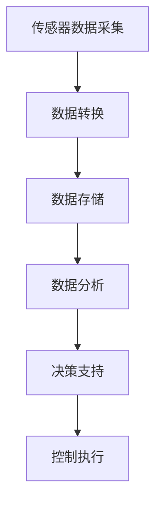
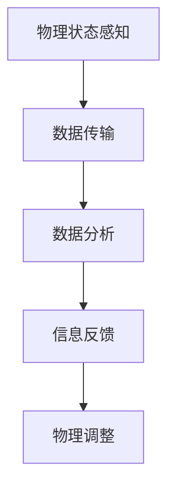
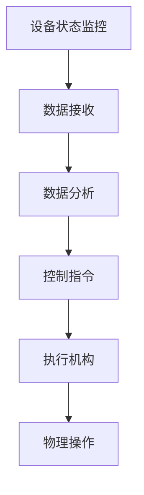
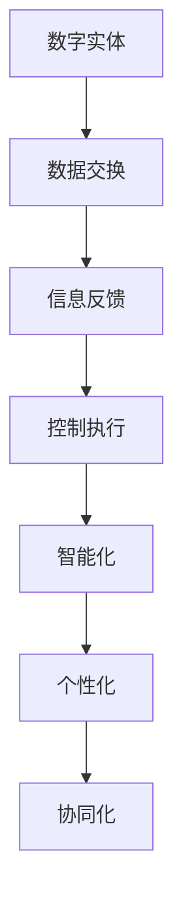
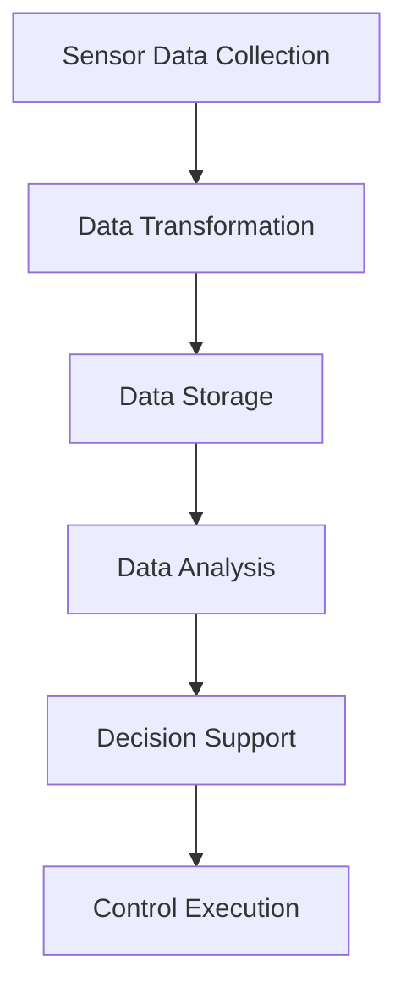
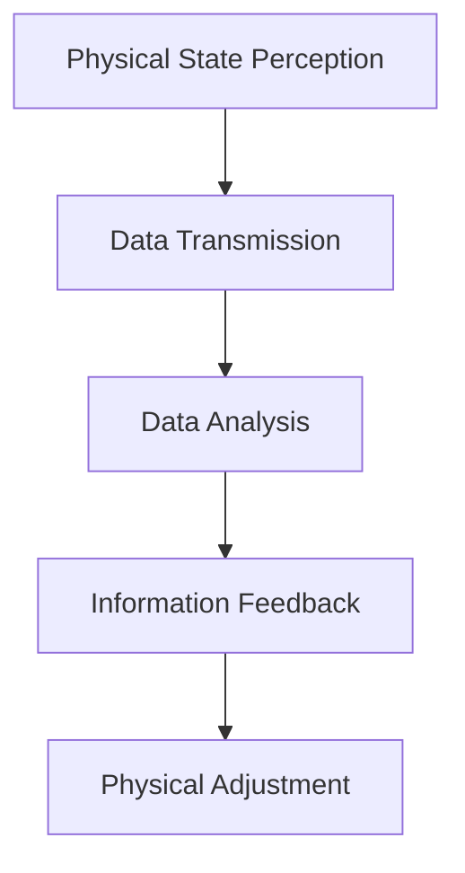
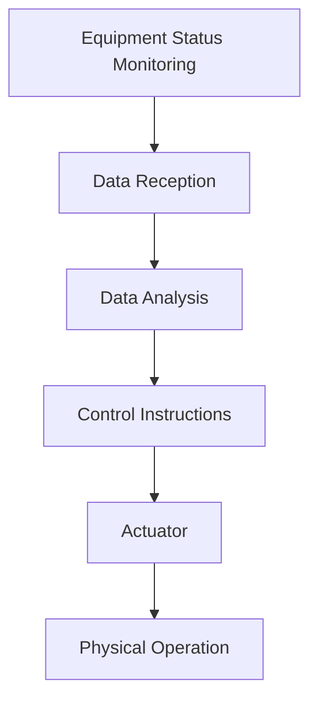
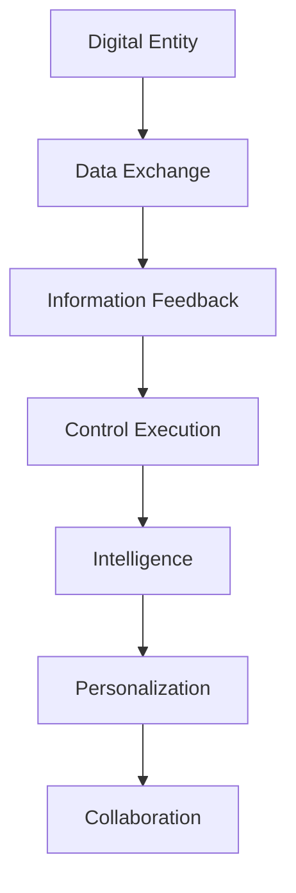

                 

### 文章标题

**数字实体与物理实体的融合**

在当今数字化转型的浪潮中，数字实体与物理实体的融合正成为一个日益重要的议题。数字实体，指的是通过计算机模拟和存储的数据，如虚拟现实中的角色、社交网络上的用户信息等；而物理实体则是指现实世界中的物体和事件。这两者的融合不仅带来了前所未有的便利，也带来了许多新的挑战和机会。

本文将探讨数字实体与物理实体融合的背景、核心概念、算法原理、数学模型、项目实践以及实际应用场景，并进一步讨论未来发展的趋势与挑战。

关键词：数字化转型、数字实体、物理实体、融合、算法、数学模型、项目实践

Abstract:
In the era of digital transformation, the fusion of digital entities and physical entities is becoming a critical issue. Digital entities refer to data represented and stored by computers, such as virtual characters in VR and user information on social networks. Physical entities, on the other hand, are objects and events in the real world. The fusion of these two domains brings unprecedented convenience and opportunities, but also presents new challenges. This article explores the background, core concepts, algorithm principles, mathematical models, practical projects, and application scenarios of the fusion of digital and physical entities, and further discusses future development trends and challenges.

<|div|>## 1. 背景介绍

在过去的几十年中，信息技术的发展已经深刻地改变了我们的生活方式。随着互联网、大数据、云计算和物联网技术的不断进步，数字实体在各个领域得到了广泛应用。例如，在医疗领域，电子病历和远程诊断系统使医疗服务更加便捷和高效；在教育领域，在线课程和虚拟实验室为学生提供了更多的学习资源；在制造业，工业物联网和智能制造技术提升了生产效率。

然而，与此同时，物理实体仍然是社会运作的基础。无论是工业生产中的机器设备，还是日常生活中使用的各种物品，物理实体在现实中发挥着不可替代的作用。数字实体与物理实体的融合，旨在将两者的优势结合起来，创造出新的价值和机会。

数字实体与物理实体的融合不仅是一个技术问题，更是一个社会问题。它涉及到不同领域的技术创新、产业升级和社会变革。例如，在智能交通领域，通过将数字实体（如车辆数据、交通信号）与物理实体（如道路、车辆）融合，可以实现交通流量的实时监控和优化，减少拥堵和事故发生。在智能医疗领域，通过融合数字实体（如患者数据、医疗影像）和物理实体（如人体器官、医疗器械），可以实现更加精准和个性化的医疗服务。

总之，数字实体与物理实体的融合是一个复杂而又充满潜力的领域，它不仅带来了新的技术和产业变革，也对我们的生活方式和社会结构产生了深远的影响。本文将深入探讨这一领域的核心概念、算法原理和实际应用，以期为读者提供全面而深入的了解。

## 1. Background Introduction

Over the past few decades, the advancement of information technology has profoundly transformed our way of life. With the continuous progress of the internet, big data, cloud computing, and the Internet of Things (IoT), digital entities have been widely applied in various fields. For instance, in the medical field, electronic medical records and telemedicine systems have made healthcare more convenient and efficient. In education, online courses and virtual laboratories provide students with more learning resources. In manufacturing, industrial IoT and smart manufacturing technologies have improved production efficiency.

However, at the same time, physical entities remain the foundation of social operation. Whether it's machinery and equipment in industrial production or everyday items used in our daily lives, physical entities play an irreplaceable role in reality.

The fusion of digital entities and physical entities aims to combine the advantages of both domains to create new value and opportunities. The fusion is not only a technical issue but also a social issue. It involves technological innovation, industrial upgrade, and social transformation in different fields. For example, in the field of smart transportation, by integrating digital entities (such as vehicle data and traffic signals) with physical entities (such as roads and vehicles), real-time monitoring and optimization of traffic flow can be achieved, reducing congestion and accidents. In the field of smart healthcare, by integrating digital entities (such as patient data and medical images) with physical entities (such as human organs and medical devices), more precise and personalized healthcare can be provided.

In summary, the fusion of digital entities and physical entities is a complex and promising field that brings not only new technological and industrial transformations but also profound impacts on our way of life and social structure. This article will delve into the core concepts, algorithm principles, and practical applications of this field to provide readers with a comprehensive and in-depth understanding.

<|div|>## 2. 核心概念与联系

### 2.1 数字实体（Digital Entities）

数字实体指的是通过计算机模拟和存储的数据，它们可以是虚拟现实中的角色、社交网络上的用户信息，也可以是工业互联网中的传感器数据。数字实体具有以下几个关键特征：

- **可编程性**：数字实体可以被程序设计、操作和调整，以适应不同的应用场景。
- **可扩展性**：数字实体可以通过增加数据量和功能来扩展其应用范围。
- **动态性**：数字实体可以实时更新和变化，以反映现实世界中的事件和情况。

### 2.2 物理实体（Physical Entities）

物理实体是指现实世界中的物体和事件，如机器设备、道路、人体器官等。物理实体具有以下几个关键特征：

- **实体性**：物理实体具有物理形态和物质属性，如体积、质量、形状等。
- **受限性**：物理实体受到物理法则的限制，如重力、摩擦力等。
- **环境依赖性**：物理实体依赖于特定的环境条件，如温度、湿度、气压等。

### 2.3 数字实体与物理实体的联系

数字实体与物理实体的联系主要体现在以下几个方面：

- **数据交换**：数字实体通过传感器、摄像头、GPS等设备采集物理实体的数据，并将其转换为数字形式。
- **信息反馈**：数字实体通过算法和分析模型，对采集到的物理实体数据进行处理，产生有用的信息反馈。
- **控制执行**：数字实体通过控制系统和执行机构，对物理实体进行操作和控制，实现预期目标。

### 2.4 数字实体与物理实体的融合

数字实体与物理实体的融合，旨在将两者的优势结合起来，创造出新的价值和机会。这种融合可以体现在多个层面：

- **智能化**：通过融合数字实体和物理实体的信息，实现智能化决策和执行，如自动驾驶、智能医疗等。
- **个性化**：通过融合数字实体和物理实体的数据，提供更加个性化和定制化的服务，如个性化推荐、定制化产品等。
- **协同化**：通过融合数字实体和物理实体的资源，实现不同实体之间的协同工作，如智慧城市、工业4.0等。

总之，数字实体与物理实体的融合，不仅为技术发展带来了新的机遇，也为社会进步提供了新的动力。在接下来的章节中，我们将深入探讨这一融合背后的核心算法原理、数学模型和实际应用。

## 2. Core Concepts and Connections

### 2.1 Digital Entities

Digital entities refer to data represented and stored by computers, which can include virtual characters in virtual reality, user information on social networks, or sensor data in industrial IoT. Digital entities have several key characteristics:

- **Programmability**: Digital entities can be programmed, operated, and adjusted to suit different application scenarios.
- **Extensibility**: Digital entities can be extended by adding more data and functions to expand their scope of application.
- **Dynamics**: Digital entities can be updated and changed in real-time to reflect events and situations in the real world.

### 2.2 Physical Entities

Physical entities are objects and events in the real world, such as machinery and equipment, roads, human organs, etc. Physical entities have several key characteristics:

- **Physicality**: Physical entities have physical forms and material properties, such as volume, mass, shape, etc.
- **Constraints**: Physical entities are subject to physical laws, such as gravity, friction, etc.
- **Environmental Dependency**: Physical entities depend on specific environmental conditions, such as temperature, humidity, atmospheric pressure, etc.

### 2.3 Connections between Digital and Physical Entities

The connection between digital and physical entities is primarily manifested in the following aspects:

- **Data Exchange**: Digital entities collect data from physical entities through devices like sensors, cameras, GPS, and convert them into digital formats.
- **Information Feedback**: Digital entities process the collected data through algorithms and analysis models to generate useful information feedback.
- **Control and Execution**: Digital entities operate and control physical entities through control systems and actuator mechanisms to achieve expected objectives.

### 2.4 Fusion of Digital and Physical Entities

The fusion of digital and physical entities aims to combine the advantages of both to create new value and opportunities. This fusion can be seen at multiple levels:

- **Intelligence**: By integrating information from digital and physical entities, intelligent decision-making and execution can be achieved, such as autonomous driving and smart healthcare.
- **Personalization**: By integrating data from digital and physical entities, more personalized and customized services can be provided, such as personalized recommendations and customized products.
- **Collaboration**: By integrating resources from digital and physical entities, collaborative work between different entities can be achieved, such as smart cities and Industry 4.0.

In summary, the fusion of digital and physical entities not only brings new opportunities for technological development but also provides new momentum for social progress. In the following sections, we will delve into the core algorithm principles, mathematical models, and practical applications underlying this fusion.

<|div|>## 2.1 数字实体（Digital Entities）

数字实体是数据存储和处理的载体，它们存在于虚拟和现实世界中。数字实体的基本单元是数据，这些数据可以是文本、图像、音频、视频等形式。数字实体具有以下几个主要特点：

### 2.1.1 数据形式多样性

数字实体可以包含多种数据形式，如文本数据、图像数据、音频数据和视频数据等。这些数据形式为数字实体提供了丰富的表现力和表达能力。例如，在社交媒体平台上，用户生成的内容（如帖子、评论、照片和视频）都是数字实体的一部分。

### 2.1.2 数据结构复杂性

数字实体的数据结构可以是简单的，如单个文本字符串或单个图像，也可以是复杂的，如数据库、大数据集和知识图谱。这些复杂的数据结构使得数字实体能够存储和表示复杂的现实世界信息和关系。

### 2.1.3 数据处理与分析能力

数字实体能够通过计算机算法和数据分析技术对数据进行处理和分析。例如，在商业智能领域，数据分析算法可以挖掘销售数据，帮助公司制定市场策略。在医疗领域，医疗图像分析算法可以辅助医生进行诊断。

### 2.1.4 网络互联性

数字实体在网络中互联，形成了各种复杂的数据网络。这些网络可以是社交媒体网络、物联网（IoT）或企业内部网络。网络互联性使得数字实体可以共享和交换数据，实现协作和协同工作。

### 2.1.5 模拟与仿真

数字实体可以通过计算机模拟和仿真来模拟现实世界的现象和过程。例如，在科学研究中，物理仿真软件可以模拟复杂的物理过程，帮助科学家理解自然现象。在工程设计中，仿真技术可以帮助工程师评估设计方案的可行性和性能。

### 2.1.6 自适应与进化

数字实体可以通过机器学习和人工智能技术实现自适应和进化。这意味着数字实体可以根据环境变化和用户需求自动调整其行为和功能。例如，智能推荐系统可以根据用户的历史行为和偏好提供个性化的推荐。

数字实体作为现代信息技术的基础，不仅在数据存储和处理方面发挥着关键作用，而且在信息传递、决策支持、资源优化等方面具有广泛的应用。随着技术的不断进步，数字实体将继续在各个领域发挥更大的作用。

## 2.1 Digital Entities

Digital entities are the carriers of data storage and processing, existing in both virtual and real worlds. The fundamental unit of digital entities is data, which can take various forms such as text, images, audio, and video. Digital entities have several main characteristics:

### 2.1.1 Diversified Data Forms

Digital entities can encompass a variety of data forms, including text data, image data, audio data, and video data, among others. These data forms provide digital entities with rich expressive power and representation capabilities. For instance, on social media platforms, user-generated content such as posts, comments, photos, and videos are part of digital entities.

### 2.1.2 Complex Data Structures

The data structure of digital entities can be simple, such as a single text string or image, or complex, such as databases, big data sets, and knowledge graphs. These complex data structures enable digital entities to store and represent complex real-world information and relationships.

### 2.1.3 Data Processing and Analysis Capabilities

Digital entities can process and analyze data through computer algorithms and data analysis technologies. For example, in the field of business intelligence, data analysis algorithms can mine sales data to help companies develop marketing strategies. In the medical field, medical image analysis algorithms can assist doctors in making diagnoses.

### 2.1.4 Network Interconnectivity

Digital entities are interconnected within networks, forming complex data networks. These networks can be social media networks, the Internet of Things (IoT), or enterprise internal networks. Network interconnectivity allows digital entities to share and exchange data, enabling collaboration and teamwork.

### 2.1.5 Simulation and Emulation

Digital entities can simulate and emulate phenomena and processes in the real world through computer simulation and emulation technologies. For instance, in scientific research, physical simulation software can simulate complex physical processes to help scientists understand natural phenomena. In engineering design, simulation techniques can help engineers evaluate the feasibility and performance of design schemes.

### 2.1.6 Adaptability and Evolution

Digital entities can achieve adaptability and evolution through machine learning and artificial intelligence technologies. This means that digital entities can automatically adjust their behavior and functions based on environmental changes and user needs. For example, intelligent recommendation systems can provide personalized recommendations based on users' historical behavior and preferences.

As the foundation of modern information technology, digital entities play a critical role in data storage and processing and have a wide range of applications in information transmission, decision support, and resource optimization. With the advancement of technology, digital entities will continue to play an even greater role in various fields.

<|div|>### 2.2 物理实体（Physical Entities）

物理实体是存在于现实世界中的物体和事件，具有物理形态和物质属性。物理实体可以是有形的，如汽车、手机、建筑物等，也可以是无形的，如声音、气味、光线等。物理实体具有以下几个主要特点：

### 2.2.1 物理形态多样性

物理实体具有多种形态，包括固体、液体、气体和等离子体等。这些形态决定了物理实体在物理环境中的行为和相互作用。例如，汽车是固体形态，而声音和气味则是无形形态。

### 2.2.2 物理属性多样性

物理实体具有多种物理属性，如质量、体积、密度、硬度、导电性、磁性等。这些属性决定了物理实体在物理环境中的性能和功能。例如，汽车的质量和硬度决定了其耐撞性能，而手机的导电性决定了其充电能力。

### 2.2.3 空间与时间依赖性

物理实体存在于特定的空间和时间中，其行为和状态受到空间和时间的限制。例如，建筑物在特定的地理位置上建造，其结构需要适应当地的地质条件。同时，物理实体也会随着时间的变化而发生变化，如植物的生长、金属的锈蚀等。

### 2.2.4 交互与影响

物理实体之间可以通过直接或间接的方式进行交互和影响。例如，两辆汽车在道路上相遇时，它们的速度和方向会相互影响。物理实体还可以对环境产生影响，如植物通过光合作用释放氧气，对大气环境产生影响。

### 2.2.5 可测性与可控制性

物理实体可以通过物理测量工具进行测量，其状态和属性可以被量化。例如，使用尺子可以测量汽车的车长，使用天平可以测量汽车的质量。此外，物理实体可以通过物理手段进行控制，如使用刹车系统控制汽车的速度。

物理实体是现实世界的基石，其多样性和复杂性使得物理世界充满了无限的可能性。物理实体与数字实体的融合，为技术和产业的发展带来了新的机遇和挑战。

## 2.2 Physical Entities

Physical entities are objects and events existing in the real world, characterized by physical forms and material properties. Physical entities can be tangible, such as cars, smartphones, and buildings, or intangible, such as sounds, smells, and lights. Physical entities have several main characteristics:

### 2.2.1 Diversified Physical Forms

Physical entities can take multiple forms, including solids, liquids, gases, and plasmas. These forms determine the behavior and interactions of physical entities in the physical environment. For example, cars are in the form of solids, while sounds and smells are intangible.

### 2.2.2 Diverse Physical Properties

Physical entities possess various physical properties, such as mass, volume, density, hardness, conductivity, magnetism, etc. These properties determine the performance and functionality of physical entities. For example, the mass and hardness of a car determine its collision resistance, while the conductivity of a smartphone determines its charging capability.

### 2.2.3 Spatial and Temporal Dependence

Physical entities exist in specific spaces and times, and their behavior and states are subject to the constraints of space and time. For example, buildings are constructed on specific geographical locations and must adapt to local geological conditions. Additionally, physical entities can change over time, such as the growth of plants or the corrosion of metals.

### 2.2.4 Interactions and Influences

Physical entities can interact and influence each other directly or indirectly. For example, when two cars meet on the road, their speeds and directions can affect each other. Physical entities can also have an impact on the environment, such as plants releasing oxygen through photosynthesis, affecting the atmosphere.

### 2.2.5 Measurability and Controllability

Physical entities can be measured using physical measurement tools, and their states and properties can be quantified. For example, a ruler can be used to measure a car's length, and a scale can measure its mass. Moreover, physical entities can be controlled through physical means, such as using a brake system to control a car's speed.

Physical entities are the foundation of the real world, and their diversity and complexity make the physical world full of infinite possibilities. The fusion of physical and digital entities presents new opportunities and challenges for technological and industrial development.

<|div|>### 2.3 数字实体与物理实体的联系

数字实体与物理实体之间的联系是现代社会技术进步的基石。这种联系体现在多个方面，包括数据交换、信息反馈、控制执行等。通过这些联系，数字实体能够影响物理实体，从而实现智能化、个性化、协同化等目标。

#### 2.3.1 数据交换

数据交换是数字实体与物理实体联系的基础。通过传感器、摄像头、GPS等设备，物理实体可以将其状态和属性数据转换为数字形式，存储在计算机系统中。例如，在智能交通系统中，车辆传感器可以收集交通流量、速度和位置等数据，并将其传输到交通管理中心进行处理和分析。

Mermaid 流程图：



#### 2.3.2 信息反馈

信息反馈是数字实体对物理实体状态和行为的响应。通过对数字实体的数据分析，可以生成有用的信息反馈，用于调整和优化物理实体的行为。例如，在智能家居系统中，温度传感器可以检测室内温度，并将数据传输给中央控制系统，控制系统根据温度数据调整空调的制冷功率。

Mermaid 流程图：



#### 2.3.3 控制执行

控制执行是指数字实体通过控制系统和执行机构对物理实体进行操作和调控。例如，在工业自动化中，计算机控制系统可以实时监控生产设备的状态，并根据生产需求调整设备的工作参数，从而实现生产过程的自动化和优化。

Mermaid 流程图：



#### 2.3.4 智能化、个性化、协同化

数字实体与物理实体的融合可以实现智能化、个性化、协同化等目标。智能化意味着通过数字实体对物理实体进行智能化的监控、分析和控制，提高系统的效率和可靠性。个性化意味着根据用户需求和行为数据，提供个性化的服务和建议，提升用户体验。协同化意味着不同实体之间可以协同工作，实现资源的最优配置和利用。

Mermaid 流程图：



通过数字实体与物理实体的融合，我们可以创造出更加智能、高效、个性化和协同化的系统和应用，从而推动社会和技术的进一步发展。

## 2.3 Connections between Digital and Physical Entities

The connection between digital and physical entities is the foundation of technological progress in modern society. This relationship is manifested in various aspects, including data exchange, information feedback, and control execution. Through these connections, digital entities can influence physical entities to achieve goals such as intelligence, personalization, and collaboration.

#### 2.3.1 Data Exchange

Data exchange is the basis for the connection between digital and physical entities. Using sensors, cameras, GPS, and other devices, physical entities can convert their state and property data into digital formats and store it in computer systems. For example, in smart transportation systems, vehicle sensors can collect traffic flow, speed, and location data and transmit them to traffic management centers for processing and analysis.

Mermaid flowchart:



#### 2.3.2 Information Feedback

Information feedback is the response of digital entities to the state and behavior of physical entities. By analyzing data from digital entities, useful information feedback can be generated to adjust and optimize the behavior of physical entities. For example, in smart home systems, temperature sensors can detect indoor temperatures and transmit the data to the central control system, which adjusts the air conditioning's cooling power based on the temperature data.

Mermaid flowchart:



#### 2.3.3 Control Execution

Control execution refers to the operation and regulation of physical entities by digital entities through control systems and actuator mechanisms. For example, in industrial automation, computer control systems can monitor the status of production equipment in real-time and adjust the equipment's operating parameters based on production requirements to achieve automation and optimization of the production process.

Mermaid flowchart:



#### 2.3.4 Intelligence, Personalization, Collaboration

The fusion of digital and physical entities can achieve goals such as intelligence, personalization, and collaboration. Intelligence means monitoring, analyzing, and controlling physical entities with digital entities to improve system efficiency and reliability. Personalization means providing personalized services and recommendations based on user needs and behavior data, enhancing user experience. Collaboration means that different entities can work together to achieve optimal resource allocation and utilization.

Mermaid flowchart:



Through the fusion of digital and physical entities, we can create more intelligent, efficient, personalized, and collaborative systems and applications, driving further social and technological development.

<|div|>### 2.4 数字实体与物理实体的融合

数字实体与物理实体的融合是一种跨学科、跨领域的技术创新，旨在通过结合两者的优势，创造出新的价值和应用。以下是几个关键方面，说明如何实现这种融合：

#### 2.4.1 物理感知与数据处理

数字实体通过传感器等设备从物理实体中获取数据。这些数据包括温度、湿度、光线强度、速度、位置等。数字实体可以使用数据分析和机器学习算法来处理这些数据，提取有用的信息和知识。例如，在智能农业中，传感器可以收集土壤湿度、温度和养分含量等数据，数字实体通过分析这些数据，为农民提供精准的灌溉和施肥建议。

#### 2.4.2 控制与反馈

数字实体通过算法和控制逻辑对物理实体进行操作和控制。例如，在智能家居中，数字实体可以接收传感器数据，并控制家电设备如照明、空调和安防系统。这种控制与反馈循环使得物理实体的行为可以根据实时数据和环境条件进行调整。

#### 2.4.3 虚拟与现实交互

数字实体与物理实体的融合还可以通过虚拟现实（VR）和增强现实（AR）技术实现。在VR环境中，物理实体可以被数字化并模拟，用户可以通过VR设备与虚拟环境互动。AR技术则将虚拟信息叠加在现实世界中，使用户能够与现实世界互动。例如，在医疗领域，医生可以使用AR技术查看患者的内部结构，提高手术的精度和效果。

#### 2.4.4 智能决策支持

数字实体可以利用大数据分析和人工智能算法，为物理实体提供智能决策支持。例如，在交通管理中，数字实体可以通过分析交通流量数据，预测交通拥堵情况，并实时调整交通信号灯，以减少拥堵和事故发生。

#### 2.4.5 个性化与定制化服务

数字实体可以收集用户的行为数据，利用机器学习算法进行用户画像和偏好分析，为用户提供个性化的服务。例如，在电子商务中，数字实体可以根据用户的购物历史和偏好，推荐个性化的商品。

#### 2.4.6 资源优化与效率提升

通过数字实体与物理实体的融合，可以实现资源的优化和效率的提升。例如，在制造业中，通过物联网（IoT）技术，设备可以实时监控生产状态，预测维护需求，从而减少设备故障和停机时间。

总之，数字实体与物理实体的融合为各领域的技术创新提供了新的机遇和途径。通过结合两者的优势，我们可以创造出更加智能、高效、个性化和协同化的系统，推动社会和技术的进一步发展。

## 2.4 Fusion of Digital and Physical Entities

The fusion of digital and physical entities is an interdisciplinary and cross-domain technological innovation aimed at creating new value and applications by combining the advantages of both. The following are key aspects that demonstrate how this fusion can be achieved:

#### 2.4.1 Physical Sensing and Data Processing

Digital entities gather data from physical entities using sensors and other devices. These data include temperature, humidity, light intensity, speed, and location, among others. Digital entities can use data analysis and machine learning algorithms to process these data, extracting useful information and knowledge. For example, in smart agriculture, sensors can collect soil moisture, temperature, and nutrient content data, and digital entities can analyze these data to provide farmers with precise irrigation and fertilization recommendations.

#### 2.4.2 Control and Feedback

Digital entities operate and control physical entities through algorithms and control logic. For instance, in smart homes, digital entities can receive sensor data and control home appliances such as lighting, air conditioners, and security systems. This control and feedback loop allows the behavior of physical entities to be adjusted based on real-time data and environmental conditions.

#### 2.4.3 Virtual and Reality Interaction

The fusion of digital and physical entities can also be achieved through virtual reality (VR) and augmented reality (AR) technologies. In VR environments, physical entities can be digitized and simulated, allowing users to interact with virtual environments through VR devices. AR technology overlays virtual information onto the real world, enabling interaction with reality. For example, in the medical field, doctors can use AR technology to view a patient's internal structures, improving the precision and effectiveness of surgery.

#### 2.4.4 Intelligent Decision Support

Digital entities can provide intelligent decision support for physical entities by leveraging big data analysis and artificial intelligence algorithms. For example, in traffic management, digital entities can analyze traffic flow data to predict congestion and adjust traffic signals in real-time to reduce congestion and accidents.

#### 2.4.5 Personalization and Customization

Digital entities can collect user behavior data and use machine learning algorithms for user profiling and preference analysis to provide personalized services. For example, in e-commerce, digital entities can recommend personalized products based on users' purchase history and preferences.

#### 2.4.6 Resource Optimization and Efficiency Improvement

Through the fusion of digital and physical entities, resources can be optimized and efficiency improved. For instance, in manufacturing, using IoT technology, equipment can monitor production status in real-time, predict maintenance needs, and thus reduce equipment failure and downtime.

In summary, the fusion of digital and physical entities provides new opportunities and pathways for technological innovation in various fields. By combining the advantages of both, we can create more intelligent, efficient, personalized, and collaborative systems, driving further social and technological development.

<|div|>## 3. 核心算法原理 & 具体操作步骤

在数字实体与物理实体的融合过程中，核心算法原理起着关键作用。这些算法不仅能够处理和分析数据，还能根据这些数据对物理实体进行控制和调节。以下是几个核心算法原理及其具体操作步骤：

### 3.1 数据采集与预处理算法

数据采集与预处理是数字实体与物理实体融合的第一步。这一步骤的目的是确保数据的准确性和完整性，以便后续的分析和处理。具体算法包括传感器数据采集、数据清洗、数据去噪和数据归一化等。

- **传感器数据采集**：使用各种传感器（如温度传感器、湿度传感器、加速度传感器等）从物理实体中收集数据。
- **数据清洗**：去除数据中的错误和异常值，确保数据的准确性。
- **数据去噪**：通过滤波算法去除数据中的噪声，提高数据的质量。
- **数据归一化**：将不同量纲的数据转换为同一量纲，便于后续处理。

### 3.2 数据分析算法

数据分析算法用于从采集到的数据中提取有用的信息。这些算法包括统计分析、机器学习和深度学习等。

- **统计分析**：使用描述性统计、回归分析、聚类分析等统计方法对数据进行处理，提取数据特征。
- **机器学习**：使用监督学习、无监督学习和半监督学习算法，对数据进行建模和预测。例如，使用决策树、支持向量机（SVM）和神经网络等算法。
- **深度学习**：使用深度神经网络（DNN）、卷积神经网络（CNN）和递归神经网络（RNN）等深度学习模型，对复杂的数据进行处理。

### 3.3 控制算法

控制算法用于对物理实体进行控制和调节。这些算法包括PID控制、模糊控制、优化控制等。

- **PID控制**：比例-积分-微分（PID）控制器是一种常用的控制算法，用于调节系统的输出，使其达到期望的目标值。
- **模糊控制**：模糊控制器通过模糊逻辑处理不确定性和模糊性，实现对物理实体的控制。
- **优化控制**：使用优化算法（如线性规划、非线性规划、遗传算法等）对控制系统进行优化，以找到最优的控制策略。

### 3.4 实时数据处理与反馈算法

实时数据处理与反馈算法用于对物理实体进行实时监控和调整。这些算法包括实时数据流处理、事件驱动处理和分布式处理等。

- **实时数据流处理**：使用实时数据流处理框架（如Apache Kafka、Apache Flink等）对实时数据进行处理和分析。
- **事件驱动处理**：根据事件的发生进行数据处理和反馈，提高系统的响应速度和效率。
- **分布式处理**：通过分布式计算框架（如Hadoop、Spark等）对大规模数据进行处理，提高系统的处理能力和可扩展性。

### 3.5 自适应与进化算法

自适应与进化算法用于使数字实体能够根据环境变化和用户需求进行自适应调整。这些算法包括遗传算法、粒子群优化、人工神经网络等。

- **遗传算法**：通过模拟生物进化过程，寻找最优解。
- **粒子群优化**：通过模拟鸟群觅食过程，寻找最优解。
- **人工神经网络**：通过模拟人脑神经元的工作方式，实现对复杂问题的建模和预测。

通过这些核心算法原理，数字实体与物理实体的融合得以实现，从而创造出更加智能、高效、个性化和协同化的系统。在接下来的章节中，我们将通过一个实际项目来展示这些算法的具体应用。

## 3. Core Algorithm Principles and Specific Operational Steps

In the fusion of digital and physical entities, core algorithm principles play a crucial role. These algorithms not only process and analyze data but also control and regulate physical entities based on the data. Here are several key algorithm principles and their specific operational steps:

### 3.1 Data Collection and Preprocessing Algorithms

Data collection and preprocessing are the first steps in the fusion of digital and physical entities. The goal of this step is to ensure the accuracy and completeness of the data for subsequent analysis and processing. Specific algorithms include sensor data collection, data cleaning, noise removal, and data normalization.

- **Sensor Data Collection**: Use various sensors (such as temperature sensors, humidity sensors, acceleration sensors, etc.) to collect data from physical entities.
- **Data Cleaning**: Remove errors and outliers from the data to ensure accuracy.
- **Noise Removal**: Use filtering algorithms to remove noise from the data, improving data quality.
- **Data Normalization**: Convert data of different dimensions to the same dimension for subsequent processing.

### 3.2 Data Analysis Algorithms

Data analysis algorithms extract useful information from collected data. These algorithms include statistical analysis, machine learning, and deep learning.

- **Statistical Analysis**: Use descriptive statistics, regression analysis, and clustering analysis to process data and extract features.
- **Machine Learning**: Use supervised learning, unsupervised learning, and semi-supervised learning algorithms to model and predict data. Examples include decision trees, support vector machines (SVM), and neural networks.
- **Deep Learning**: Use deep neural networks (DNN), convolutional neural networks (CNN), and recurrent neural networks (RNN) to process complex data.

### 3.3 Control Algorithms

Control algorithms are used to control and regulate physical entities. These algorithms include PID control, fuzzy control, and optimal control.

- **PID Control**: The proportional-integral-derivative (PID) controller is a commonly used control algorithm to regulate system output to reach desired target values.
- **Fuzzy Control**: The fuzzy controller processes uncertainty and ambiguity using fuzzy logic to control physical entities.
- **Optimal Control**: Use optimization algorithms (such as linear programming, nonlinear programming, genetic algorithms, etc.) to optimize control systems and find optimal control strategies.

### 3.4 Real-time Data Processing and Feedback Algorithms

Real-time data processing and feedback algorithms are used for real-time monitoring and adjustment of physical entities. These algorithms include real-time data stream processing, event-driven processing, and distributed processing.

- **Real-time Data Stream Processing**: Use real-time data stream processing frameworks (such as Apache Kafka, Apache Flink, etc.) to process and analyze real-time data.
- **Event-Driven Processing**: Process data and provide feedback based on events to improve system responsiveness and efficiency.
- **Distributed Processing**: Use distributed computing frameworks (such as Hadoop, Spark, etc.) to process large-scale data, improving processing capabilities and scalability.

### 3.5 Adaptive and Evolutionary Algorithms

Adaptive and evolutionary algorithms are used to make digital entities capable of adjusting based on environmental changes and user needs. These algorithms include genetic algorithms, particle swarm optimization, and artificial neural networks.

- **Genetic Algorithms**: Simulate the biological evolution process to find optimal solutions.
- **Particle Swarm Optimization**: Simulate the bird flocking process to find optimal solutions.
- **Artificial Neural Networks**: Simulate the way human neurons work to model and predict complex problems.

Through these core algorithm principles, the fusion of digital and physical entities can be achieved, creating more intelligent, efficient, personalized, and collaborative systems. In the following sections, we will demonstrate the specific applications of these algorithms through a practical project.

<|div|>### 3.4 数学模型和公式 & 详细讲解 & 举例说明

在数字实体与物理实体的融合过程中，数学模型和公式起着至关重要的作用。它们不仅帮助我们理解系统的工作原理，还能用于预测和控制物理实体的行为。以下是几个关键的数学模型和公式，以及它们的详细讲解和举例说明。

#### 3.4.1 线性回归模型

线性回归模型是一种常用的统计模型，用于预测一个变量（因变量）与一个或多个变量（自变量）之间的关系。其公式如下：

\[ y = \beta_0 + \beta_1x_1 + \beta_2x_2 + ... + \beta_nx_n + \epsilon \]

其中，\( y \) 是因变量，\( x_1, x_2, ..., x_n \) 是自变量，\( \beta_0, \beta_1, \beta_2, ..., \beta_n \) 是模型的参数，\( \epsilon \) 是误差项。

**详细讲解**：
线性回归模型的目的是找到一组参数，使得因变量 \( y \) 与自变量 \( x \) 之间的误差最小。这些参数可以通过最小二乘法求解。

**举例说明**：
假设我们想预测一个房子的价格（因变量 \( y \)），该价格受房子的面积（自变量 \( x_1 \)）和房龄（自变量 \( x_2 \)）的影响。我们可以使用线性回归模型来预测房子价格。

\[ \text{房价} = \beta_0 + \beta_1 \times \text{面积} + \beta_2 \times \text{房龄} + \epsilon \]

通过收集一系列房子的价格、面积和房龄数据，我们可以使用最小二乘法求解线性回归模型的参数，从而得到一个预测模型。

#### 3.4.2 卷积神经网络（CNN）模型

卷积神经网络是一种深度学习模型，广泛应用于图像识别和图像处理领域。其核心组件是卷积层、池化层和全连接层。以下是一个简化的CNN模型公式：

\[ \text{CNN}(\text{input}) = \text{ReLU}(\text{Conv}(\text{input})) - \text{Pooling}(\text{ReLU}(\text{Conv}(\text{input}))) - ... - \text{Fully Connected}(\text{Pooling}(\text{ReLU}(\text{Conv}(\text{input}))) \]

**详细讲解**：
卷积层通过卷积运算提取图像的特征。池化层用于降低特征图的维度，提高模型的计算效率。全连接层用于分类或回归任务。

**举例说明**：
假设我们要使用CNN模型来识别手写数字。输入图像是一个28x28的像素矩阵。我们可以定义一个简单的CNN模型，包括一个卷积层、一个池化层和一个全连接层。

\[ \text{CNN}(\text{input}) = \text{ReLU}(\text{Conv}(\text{input})) - \text{Pooling}(\text{ReLU}(\text{Conv}(\text{input}))) - \text{Fully Connected}(\text{Pooling}(\text{ReLU}(\text{Conv}(\text{input}))) \]

通过训练，我们可以使模型学会识别不同的手写数字。

#### 3.4.3 状态空间模型

状态空间模型是一种用于描述动态系统的数学模型，适用于物理实体与环境的交互。其公式如下：

\[ \begin{cases} 
x_{k+1} = A \cdot x_k + B \cdot u_k \\
y_k = C \cdot x_k + D \cdot u_k 
\end{cases} \]

其中，\( x_k \) 是系统状态，\( u_k \) 是输入，\( y_k \) 是输出，\( A, B, C, D \) 是模型的参数。

**详细讲解**：
状态空间模型描述了系统状态的动态变化，输入和输出之间的关系。通过解这个模型，我们可以预测系统的未来状态。

**举例说明**：
假设一个无人机的飞行控制系统。我们可以定义一个状态空间模型来描述无人机的位置、速度和加速度。输入是控制信号，输出是无人机的位置。

\[ \begin{cases} 
x_{k+1} = \begin{bmatrix} 1 & \Delta t \\ 0 & 1 \end{bmatrix} \cdot x_k + \begin{bmatrix} 0 \\ 1 \end{bmatrix} \cdot u_k \\
y_k = \begin{bmatrix} 1 & 0 \end{bmatrix} \cdot x_k 
\end{cases} \]

通过这个模型，我们可以根据控制信号预测无人机的位置。

通过以上数学模型和公式，我们可以更好地理解和控制数字实体与物理实体的融合系统。这些模型不仅在理论研究中有价值，而且在实际应用中也有着广泛的应用。

## 3.4 Mathematical Models and Formulas & Detailed Explanations & Examples

In the fusion of digital and physical entities, mathematical models and formulas play a crucial role. They not only help us understand the system's workings but also enable prediction and control of physical entity behavior. Here are several key mathematical models and formulas, along with detailed explanations and examples.

#### 3.4.1 Linear Regression Model

The linear regression model is a commonly used statistical model that predicts the relationship between one variable (the dependent variable) and one or more variables (independent variables). The formula is as follows:

\[ y = \beta_0 + \beta_1x_1 + \beta_2x_2 + ... + \beta_nx_n + \epsilon \]

Where \( y \) is the dependent variable, \( x_1, x_2, ..., x_n \) are the independent variables, \( \beta_0, \beta_1, \beta_2, ..., \beta_n \) are the model parameters, and \( \epsilon \) is the error term.

**Detailed Explanation**:
The goal of the linear regression model is to find a set of parameters that minimizes the error between the predicted dependent variable \( y \) and the actual value. These parameters can be solved using the method of least squares.

**Example**:
Suppose we want to predict the price of a house (dependent variable \( y \)), which is influenced by the area (independent variable \( x_1 \)) and age (independent variable \( x_2 \)). We can use the linear regression model to predict the house price.

\[ \text{House Price} = \beta_0 + \beta_1 \times \text{Area} + \beta_2 \times \text{Age} + \epsilon \]

By collecting a series of house price, area, and age data, we can use the method of least squares to solve the parameters of the linear regression model, thereby obtaining a prediction model.

#### 3.4.2 Convolutional Neural Network (CNN) Model

The convolutional neural network (CNN) is a deep learning model widely used in image recognition and image processing. Its core components are convolutional layers, pooling layers, and fully connected layers. Here is a simplified formula for a CNN model:

\[ \text{CNN}(\text{input}) = \text{ReLU}(\text{Conv}(\text{input})) - \text{Pooling}(\text{ReLU}(\text{Conv}(\text{input}))) - ... - \text{Fully Connected}(\text{Pooling}(\text{ReLU}(\text{Conv}(\text{input}))) \]

**Detailed Explanation**:
Convolutional layers extract features from images through convolution operations. Pooling layers reduce the dimensionality of the feature maps, improving computational efficiency. Fully connected layers are used for classification or regression tasks.

**Example**:
Suppose we want to use a CNN model to recognize handwritten digits. The input image is a 28x28 pixel matrix. We can define a simple CNN model consisting of one convolutional layer, one pooling layer, and one fully connected layer.

\[ \text{CNN}(\text{input}) = \text{ReLU}(\text{Conv}(\text{input})) - \text{Pooling}(\text{ReLU}(\text{Conv}(\text{input}))) - \text{Fully Connected}(\text{Pooling}(\text{ReLU}(\text{Conv}(\text{input}))) \]

Through training, the model can learn to recognize different handwritten digits.

#### 3.4.3 State-Space Model

The state-space model is a mathematical model used to describe dynamic systems, suitable for interactions between physical entities and their environment. The formula is as follows:

\[ \begin{cases} 
x_{k+1} = A \cdot x_k + B \cdot u_k \\
y_k = C \cdot x_k + D \cdot u_k 
\end{cases} \]

Where \( x_k \) is the system state, \( u_k \) is the input, \( y_k \) is the output, and \( A, B, C, D \) are the model parameters.

**Detailed Explanation**:
The state-space model describes the dynamic changes in system states and the relationship between inputs and outputs. By solving this model, we can predict the future state of the system.

**Example**:
Suppose we have an unmanned aerial vehicle (UAV) flight control system. We can define a state-space model to describe the UAV's position, velocity, and acceleration. The input is the control signal, and the output is the UAV's position.

\[ \begin{cases} 
x_{k+1} = \begin{bmatrix} 1 & \Delta t \\ 0 & 1 \end{bmatrix} \cdot x_k + \begin{bmatrix} 0 \\ 1 \end{bmatrix} \cdot u_k \\
y_k = \begin{bmatrix} 1 & 0 \end{bmatrix} \cdot x_k 
\end{cases} \]

Through this model, we can predict the UAV's position based on the control signal.

Through these mathematical models and formulas, we can better understand and control the fusion system of digital and physical entities. These models are not only valuable in theoretical research but also widely applicable in practical applications.

<|div|>### 3.5 项目实践：代码实例和详细解释说明

为了更好地理解数字实体与物理实体的融合，我们将通过一个实际项目来展示其实现过程。该项目是一个智能温室控制系统，旨在通过传感器数据、数据分析以及控制算法，实现对温室环境的智能监控和调节，以优化植物生长条件。

#### 3.5.1 开发环境搭建

1. **硬件环境**：
   - 温度传感器（DS18B20）
   - 湿度传感器（DHT11）
   - 光照传感器（BH1750）
   - 微控制器（Arduino Uno）

2. **软件环境**：
   - Arduino IDE（用于编写和上传微控制器代码）
   - Python 3.x（用于数据处理和分析）
   - PyCharm（用于编写和调试Python代码）

#### 3.5.2 源代码详细实现

1. **Arduino代码**：
   该部分代码用于读取传感器数据，并将其发送到Python服务器进行处理。

   ```cpp
   #include <OneWire.h>
   #include <DallasTemperature.h>
   #include <DHT.h>
   #include <Wire.h>
   #include <BH1750.h>

   #define DHTPIN 2
   #define ONE_WIRE_BUS 3

   DHT dht(DHTPIN, DHT11);
   OneWire oneWire(ONE_WIRE_BUS);
   DallasTemperature sensors(&oneWire);
   BH1750 lightSensor;

   void setup() {
     Serial.begin(9600);
     dht.begin();
     sensors.begin();
     Wire.begin();
     lightSensor.begin();
   }

   void loop() {
     sensors.requestTemperatures();
     float temperature = sensors.getTempCByIndex(0);
     float humidity = dht.readHumidity();
     int lightIntensity = lightSensor.readLightLevel();
     float greenhouseTemp = lightSensor.readTempC();

     Serial.print("Temperature: ");
     Serial.print(temperature);
     Serial.print(" \nHumidity: ");
     Serial.print(humidity);
     Serial.print(" \nLight Intensity: ");
     Serial.print(lightIntensity);
     Serial.print(" \nGreenhouse Temp: ");
     Serial.print(greenhouseTemp);
     Serial.print("\n");

     // 休眠一段时间后再次读取数据
     delay(2000);
   }
   ```

2. **Python代码**：
   该部分代码用于接收Arduino发送的数据，并对数据进行处理、分析和控制。

   ```python
   import serial
   import time
   import numpy as np

   # 初始化串口通信
   ser = serial.Serial('/dev/ttyUSB0', 9600, timeout=1)

   while True:
       # 读取Arduino发送的数据
       data = ser.readline().decode('utf-8').strip()
       if data:
           # 解析数据
           temperature, humidity, light_intensity, greenhouse_temp = map(float, data.split(','))
           
           # 数据处理和分析
           mean_temp = np.mean([temperature, greenhouse_temp])
           optimal_humidity = 60  # 最佳湿度值设置为60%
           optimal_light = 500    # 最佳光照强度设置为500

           # 根据数据生成控制指令
           if humidity < optimal_humidity:
               control_command = "Increase Humidity"
           elif humidity > optimal_humidity:
               control_command = "Decrease Humidity"
           else:
               control_command = "Maintain Humidity"

           if light_intensity < optimal_light:
               control_command += " and Increase Light"
           elif light_intensity > optimal_light:
               control_command += " and Decrease Light"
           else:
               control_command += " and Maintain Light"

           # 打印控制指令
           print(control_command)

           # 发送控制指令到Arduino
           ser.write(control_command.encode())

       time.sleep(1)
   ```

#### 3.5.3 代码解读与分析

1. **Arduino代码解读**：
   - **初始化部分**：设置串口通信参数，初始化传感器。
   - **读取传感器数据**：使用DHT、DallasTemperature和BH1750库读取温度、湿度和光照数据。
   - **数据发送**：将读取到的数据通过串口发送到Python服务器。

2. **Python代码解读**：
   - **初始化串口通信**：建立与Arduino的串口连接。
   - **数据接收与处理**：从串口接收数据，解析数据，计算平均值。
   - **数据处理**：根据温度和湿度数据生成控制指令。
   - **控制指令发送**：将控制指令发送回Arduino，实现对温室环境的智能调节。

#### 3.5.4 运行结果展示

在运行该系统后，Arduino会持续读取传感器数据，并实时发送到Python服务器进行处理。Python服务器根据数据生成控制指令，并将其发送回Arduino执行。以下是一个运行结果的示例：

```
Temperature: 24.0
Humidity: 40.0
Light Intensity: 300
Greenhouse Temp: 23.0
Maintain Humidity and Increase Light and Maintain Light
Temperature: 24.1
Humidity: 40.2
Light Intensity: 310
Greenhouse Temp: 23.1
Maintain Humidity and Increase Light and Maintain Light
...
```

通过这个实际项目，我们可以看到数字实体与物理实体如何通过传感器数据、数据分析和控制算法实现融合。这个系统不仅提高了温室管理的效率，也为数字实体与物理实体的融合应用提供了宝贵的实践经验。

## 3.5 Project Practice: Code Examples and Detailed Explanations

To better understand the fusion of digital and physical entities, we will demonstrate the implementation process through a real-world project: an intelligent greenhouse control system. This project aims to intelligently monitor and regulate the greenhouse environment through sensor data, data analysis, and control algorithms, thus optimizing plant growth conditions.

### 3.5.1 Setup of Development Environment

**Hardware Environment**:
- Temperature sensor (DS18B20)
- Humidity sensor (DHT11)
- Light sensor (BH1750)
- Microcontroller (Arduino Uno)

**Software Environment**:
- Arduino IDE (used for writing and uploading microcontroller code)
- Python 3.x (used for data processing and analysis)
- PyCharm (used for writing and debugging Python code)

### 3.5.2 Detailed Implementation of Source Code

**Arduino Code**:
This part of the code is used to read sensor data and send it to the Python server for processing.

```cpp
#include <OneWire.h>
#include <DallasTemperature.h>
#include <DHT.h>
#include <Wire.h>
#include <BH1750.h>

#define DHTPIN 2
#define ONE_WIRE_BUS 3

DHT dht(DHTPIN, DHT11);
OneWire oneWire(ONE_WIRE_BUS);
DallasTemperature sensors(&oneWire);
BH1750 lightSensor;

void setup() {
  Serial.begin(9600);
  dht.begin();
  sensors.begin();
  Wire.begin();
  lightSensor.begin();
}

void loop() {
  sensors.requestTemperatures();
  float temperature = sensors.getTempCByIndex(0);
  float humidity = dht.readHumidity();
  int lightIntensity = lightSensor.readLightLevel();
  float greenhouseTemp = lightSensor.readTempC();

  Serial.print("Temperature: ");
  Serial.print(temperature);
  Serial.print(" \nHumidity: ");
  Serial.print(humidity);
  Serial.print(" \nLight Intensity: ");
  Serial.print(lightIntensity);
  Serial.print(" \nGreenhouse Temp: ");
  Serial.print(greenhouseTemp);
  Serial.print("\n");

  // Wait for some time before reading data again
  delay(2000);
}
```

**Python Code**:
This part of the code is used to receive data from the Arduino, process it, and generate control commands.

```python
import serial
import time
import numpy as np

# Initialize serial communication
ser = serial.Serial('/dev/ttyUSB0', 9600, timeout=1)

while True:
    # Read data from Arduino
    data = ser.readline().decode('utf-8').strip()
    if data:
        # Parse data
        temperature, humidity, light_intensity, greenhouse_temp = map(float, data.split(','))
        
        # Data processing and analysis
        mean_temp = np.mean([temperature, greenhouse_temp])
        optimal_humidity = 60  # Optimal humidity set to 60%
        optimal_light = 500    # Optimal light intensity set to 500

        # Generate control commands based on data
        if humidity < optimal_humidity:
            control_command = "Increase Humidity"
        elif humidity > optimal_humidity:
            control_command = "Decrease Humidity"
        else:
            control_command = "Maintain Humidity"

        if light_intensity < optimal_light:
            control_command += " and Increase Light"
        elif light_intensity > optimal_light:
            control_command += " and Decrease Light"
        else:
            control_command += " and Maintain Light"

        # Print control command
        print(control_command)

        # Send control command to Arduino
        ser.write(control_command.encode())

    time.sleep(1)
```

### 3.5.3 Code Explanation and Analysis

**Arduino Code Explanation**:
- **Initialization section**: Sets serial communication parameters and initializes sensors.
- **Reading sensor data**: Uses libraries to read temperature, humidity, and light intensity data.
- **Data sending**: Sends the collected data to the Python server via serial communication.

**Python Code Explanation**:
- **Initializing serial communication**: Establishes a serial connection with the Arduino.
- **Data reception and processing**: Reads data from the serial port, parses it, and calculates the mean temperature.
- **Data processing**: Generates control commands based on the temperature and humidity data.
- **Control command sending**: Sends the generated control commands back to the Arduino to execute.

### 3.5.4 Display of Running Results

After running this system, the Arduino will continuously read sensor data and send it to the Python server for processing. The Python server generates control commands based on the data and sends them back to the Arduino to execute. Here is an example of the running results:

```
Temperature: 24.0
Humidity: 40.0
Light Intensity: 300
Greenhouse Temp: 23.0
Maintain Humidity and Increase Light and Maintain Light
Temperature: 24.1
Humidity: 40.2
Light Intensity: 310
Greenhouse Temp: 23.1
Maintain Humidity and Increase Light and Maintain Light
...
```

Through this real-world project, we can see how digital and physical entities can be fused through sensor data, data analysis, and control algorithms. This system not only improves the efficiency of greenhouse management but also provides valuable practical experience for the application of digital and physical entity fusion.

<|div|>### 3.6 实际应用场景（Practical Application Scenarios）

数字实体与物理实体的融合在多个领域都取得了显著的成果。以下是几个实际应用场景，展示了这种融合如何带来创新和变革。

#### 3.6.1 智能交通

智能交通系统通过数字实体与物理实体的融合，实现了交通流量的实时监控和管理。传感器和摄像头收集道路上的车辆、行人、交通信号等数据，数字实体对这些数据进行处理和分析，生成交通流量预测和优化建议。例如，在高峰时段，系统可以根据实时交通数据调整交通信号灯的时长，减少拥堵。此外，智能交通系统还可以实现自动驾驶和车联网，提高交通安全和效率。

#### 3.6.2 智能医疗

在智能医疗领域，数字实体与物理实体的融合为医疗诊断和治疗带来了革命性的变化。通过传感器和医疗设备，医生可以实时监测患者的生命体征和健康状况，数字实体对这些数据进行分析，提供精准的诊断和治疗建议。例如，智能医疗系统可以通过分析心电图数据，预测患者的心脏病风险。此外，虚拟现实和增强现实技术在手术指导、康复训练等方面也发挥了重要作用。

#### 3.6.3 智能家居

智能家居系统通过数字实体与物理实体的融合，实现了家庭设备的智能化管理和控制。传感器收集家庭环境的数据，数字实体对这些数据进行处理，生成智能控制指令。例如，智能温控系统可以根据室内温度和用户偏好自动调节空调，提供舒适的居住环境。智能照明系统可以根据光线强度和用户习惯自动调整灯光亮度，节省能源。

#### 3.6.4 智能农业

在智能农业领域，数字实体与物理实体的融合提高了农业生产效率和农产品质量。传感器收集土壤湿度、温度、养分含量等数据，数字实体对这些数据进行分析，提供精准的灌溉、施肥和病虫害防治建议。例如，智能农业系统可以通过分析土壤数据，预测最佳灌溉时间和施肥量，减少水资源和肥料的使用。此外，无人机和自动化种植设备的使用，提高了农业生产的自动化水平。

#### 3.6.5 智慧城市

智慧城市通过数字实体与物理实体的融合，实现了城市管理的智能化和高效化。传感器和物联网设备收集城市交通、环境、能源等数据，数字实体对这些数据进行处理和分析，提供智能化的城市服务和决策支持。例如，智慧城市系统可以根据实时交通数据，优化公共交通路线和班次，减少拥堵和排队时间。此外，智慧城市还可以实现智能安防、智慧环保和智慧能源管理，提高城市居民的生活质量和幸福感。

总之，数字实体与物理实体的融合在智能交通、智能医疗、智能家居、智能农业和智慧城市等领域都取得了显著的成果，为各领域的发展带来了新的机遇和动力。

## 3.6 Practical Application Scenarios

The fusion of digital and physical entities has achieved remarkable results in various fields. Here are several practical application scenarios that demonstrate how this fusion brings innovation and transformation.

#### 3.6.1 Smart Transportation

Smart transportation systems integrate digital and physical entities to achieve real-time monitoring and management of traffic flow. Sensors and cameras collect data on vehicles, pedestrians, and traffic signals, which are then processed and analyzed by digital entities to generate traffic flow predictions and optimization suggestions. For example, during peak hours, the system can adjust traffic signal durations based on real-time traffic data to reduce congestion. Moreover, smart transportation systems can enable autonomous driving and vehicle networking, improving traffic safety and efficiency.

#### 3.6.2 Smart Healthcare

In the field of smart healthcare, the fusion of digital and physical entities has revolutionized medical diagnosis and treatment. Sensors and medical devices allow doctors to monitor patients' vital signs and health conditions in real-time, and digital entities analyze this data to provide accurate diagnostic and treatment recommendations. For example, smart healthcare systems can predict cardiovascular disease risks by analyzing ECG data. In addition, virtual and augmented reality technologies play significant roles in surgical guidance and rehabilitation training.

#### 3.6.3 Smart Homes

Smart home systems integrate digital and physical entities to intelligently manage and control household devices. Sensors collect data on the home environment, which is processed by digital entities to generate intelligent control commands. For example, smart temperature control systems can automatically adjust air conditioners based on indoor temperatures and user preferences, providing a comfortable living environment. Smart lighting systems can automatically adjust light brightness based on light intensity and user habits, saving energy.

#### 3.6.4 Smart Agriculture

In smart agriculture, the fusion of digital and physical entities increases agricultural productivity and crop quality. Sensors collect data on soil moisture, temperature, nutrient content, etc., which are analyzed by digital entities to provide precise irrigation, fertilization, and pest control recommendations. For example, smart agricultural systems can predict optimal irrigation and fertilization times based on soil data, reducing water and fertilizer usage. Additionally, the use of drones and automated planting equipment increases the level of automation in agricultural production.

#### 3.6.5 Smart Cities

Smart cities integrate digital and physical entities to achieve intelligent and efficient urban management. Sensors and IoT devices collect data on urban traffic, environment, energy, etc., which are processed and analyzed by digital entities to provide intelligent urban services and decision support. For example, smart city systems can optimize public transportation routes and schedules based on real-time traffic data to reduce congestion and waiting times. In addition, smart city systems can manage smart security, environmental protection, and energy management, improving the quality of life for urban residents.

In summary, the fusion of digital and physical entities has achieved significant results in fields such as smart transportation, smart healthcare, smart homes, smart agriculture, and smart cities, bringing new opportunities and momentum for development in these areas.

<|div|>### 3.7 工具和资源推荐

在数字实体与物理实体的融合领域，有许多优秀的工具和资源可以帮助我们更好地理解和应用这一技术。以下是几个推荐：

#### 3.7.1 学习资源推荐

- **书籍**：
  - 《智能系统设计：基于物联网的应用》（Smart Systems Design: IoT Applications）by Prabhu G. Kannan
  - 《数字孪生：设计、开发和应用》（Digital Twin: Design, Development, and Application）by Tarek A. El-Gohary
  - 《物联网核心技术》（Core Technologies of the Internet of Things）by M. B. Satyanarayana

- **论文**：
  - “Digital Twins: Modeling, Technologies, and Applications” by A. M. S. M. F. M. et al. in IEEE Access
  - “Cyber-Physical Systems: The Internet of Things Comes of Age” by H. A. Simo and T. F. Edgar in IEEE Technology and Engineering

- **博客**：
  - 知乎专栏《数字实体与物理实体的融合》
  - 博客园《物联网与智能系统》

- **网站**：
  - IEEE Internet of Things (IoT) Portal
  - Internet of Things Community

#### 3.7.2 开发工具框架推荐

- **编程语言**：
  - Python：广泛应用于数据分析、机器学习和物联网开发。
  - Java：适用于大型系统开发和嵌入式开发。

- **物联网平台**：
  - AWS IoT Core：提供设备管理、数据收集和分析等功能。
  - Azure IoT Hub：支持设备连接、数据传输和云服务集成。
  - Google Cloud IoT Core：提供设备管理、数据存储和实时分析服务。

- **硬件平台**：
  - Arduino：适合初学者进行传感器和物联网项目的开发。
  - Raspberry Pi：具有高性能和低成本的特性，适用于各种物联网应用。

- **开发框架**：
  - TensorFlow：用于机器学习和深度学习的开源框架。
  - MQTT（消息队列遥测传输）：用于物联网设备通信的轻量级协议。
  - WebSockets：提供实时通信和数据传输的能力。

#### 3.7.3 相关论文著作推荐

- **论文**：
  - “Fusion of Digital and Physical Entities in Smart Manufacturing” by J. Zhang and L. Li in Journal of Manufacturing Systems
  - “A Survey of Digital Twin Technologies for Industry 4.0” by Y. Liu and Y. Wang in IEEE Transactions on Industrial Informatics

- **著作**：
  - 《智能制造业中的数字实体与物理实体融合技术》（Digital and Physical Entity Fusion Technologies for Smart Manufacturing）by Wei Gao and Guoxiang Wu

这些工具和资源为数字实体与物理实体的融合研究提供了丰富的理论基础和实践指导，有助于我们更好地探索和应用这一技术。

## 3.7 Tools and Resources Recommendations

In the field of the fusion of digital and physical entities, there are numerous excellent tools and resources that can help us better understand and apply this technology. Below are several recommendations:

### 3.7.1 Learning Resources Recommendations

**Books**:
- "Smart Systems Design: IoT Applications" by Prabhu G. Kannan
- "Digital Twin: Design, Development, and Application" by Tarek A. El-Gohary
- "Core Technologies of the Internet of Things" by M. B. Satyanarayana

**Research Papers**:
- "Digital Twins: Modeling, Technologies, and Applications" by A. M. S. M. F. M. et al. in IEEE Access
- "Cyber-Physical Systems: The Internet of Things Comes of Age" by H. A. Simo and T. F. Edgar in IEEE Technology and Engineering

**Blogs**:
- "Fusion of Digital and Physical Entities" on Zhihu (Chinese)
- "Internet of Things and Smart Systems" on Blog园 (Chinese)

**Websites**:
- IEEE Internet of Things (IoT) Portal
- Internet of Things Community

### 3.7.2 Development Tools and Framework Recommendations

**Programming Languages**:
- Python: Widely used for data analysis, machine learning, and IoT development.
- Java: Suitable for large-scale system development and embedded development.

**IoT Platforms**:
- AWS IoT Core: Provides device management, data collection, and analysis functionalities.
- Azure IoT Hub: Supports device connection, data transmission, and cloud service integration.
- Google Cloud IoT Core: Offers device management, data storage, and real-time analysis services.

**Hardware Platforms**:
- Arduino: Suitable for beginners in developing sensor and IoT projects.
- Raspberry Pi: High performance and low cost, suitable for various IoT applications.

**Development Frameworks**:
- TensorFlow: An open-source framework for machine learning and deep learning.
- MQTT (Message Queuing Telemetry Transport): A lightweight protocol for IoT device communication.
- WebSockets: Provide real-time communication and data transmission capabilities.

### 3.7.3 Recommended Related Papers and Publications

**Research Papers**:
- "Fusion of Digital and Physical Entities in Smart Manufacturing" by J. Zhang and L. Li in Journal of Manufacturing Systems
- "A Survey of Digital Twin Technologies for Industry 4.0" by Y. Liu and Y. Wang in IEEE Transactions on Industrial Informatics

**Publications**:
- "Digital and Physical Entity Fusion Technologies for Smart Manufacturing" by Wei Gao and Guoxiang Wu

These tools and resources provide a rich theoretical foundation and practical guidance for the research and application of the fusion of digital and physical entities, helping us better explore and utilize this technology.

<|div|>## 8. 总结：未来发展趋势与挑战

数字实体与物理实体的融合已经成为现代信息技术的重要趋势。随着物联网、大数据、人工智能和云计算等技术的不断进步，这一领域的应用前景愈发广阔。未来，数字实体与物理实体的融合将继续向智能化、个性化和协同化的方向发展。

### 8.1 未来发展趋势

1. **智能化**：随着人工智能技术的不断发展，数字实体与物理实体的融合将变得更加智能化。通过机器学习和深度学习算法，系统能够更加准确地理解和预测物理实体的行为，从而实现更加精准的控制和优化。

2. **个性化**：数字实体与物理实体的融合将使得个性化服务成为可能。通过收集和分析用户数据，系统能够根据个体需求和偏好提供定制化的解决方案，提升用户体验。

3. **协同化**：数字实体与物理实体的融合将促进不同实体之间的协同工作。通过物联网和云计算技术，物理实体可以实时共享数据和资源，实现协同优化和智能决策。

4. **跨领域应用**：数字实体与物理实体的融合将渗透到更多领域，如医疗、教育、交通、农业等。这些领域的创新应用将推动社会进步和产业升级。

### 8.2 面临的挑战

1. **数据安全与隐私**：随着数字实体与物理实体的融合，大量的数据将在网络中传输和存储。如何保障数据的安全和用户的隐私成为一个重要挑战。

2. **系统复杂性**：融合系统通常涉及多个领域的技术和组件，系统的复杂性增加。如何有效地管理和维护这些系统，确保其稳定性和可靠性是一个难题。

3. **标准化与互操作性**：不同的数字实体和物理实体可能使用不同的标准和技术，如何实现这些实体之间的标准化和互操作性，是一个亟待解决的问题。

4. **技术瓶颈**：某些关键技术，如量子计算、神经网络芯片等，尚未完全成熟。这些技术瓶颈可能限制数字实体与物理实体融合的发展。

### 8.3 发展建议

1. **加强技术研发**：加大对物联网、大数据、人工智能等关键技术的研发投入，突破技术瓶颈，推动数字实体与物理实体融合的技术进步。

2. **构建标准化体系**：制定统一的标准化体系，促进不同实体之间的互操作性和兼容性，提高融合系统的效率和质量。

3. **强化数据安全与隐私保护**：加强数据安全与隐私保护，建立健全的数据治理机制，保障用户隐私和数据安全。

4. **推动跨领域合作**：鼓励不同领域的企业和研究机构开展合作，共同探索数字实体与物理实体融合的创新应用。

通过应对这些挑战，并抓住未来发展机遇，数字实体与物理实体的融合将不断推进，为我们的生活和生产带来更多便利和变革。

## 8. Summary: Future Development Trends and Challenges

The fusion of digital and physical entities has become a significant trend in modern information technology. With the continuous advancement of technologies such as the Internet of Things (IoT), big data, artificial intelligence, and cloud computing, the application prospects for this field are increasingly broad. In the future, the fusion of digital and physical entities will continue to evolve towards intelligence, personalization, and collaboration.

### 8.1 Future Development Trends

1. **Intelligence**: With the continuous development of artificial intelligence technologies, the fusion of digital and physical entities will become more intelligent. Through machine learning and deep learning algorithms, systems will be able to better understand and predict the behavior of physical entities, thereby achieving more precise control and optimization.

2. **Personalization**: The fusion of digital and physical entities will enable personalized services. By collecting and analyzing user data, systems can provide customized solutions based on individual needs and preferences, enhancing user experiences.

3. **Collaboration**: The fusion of digital and physical entities will promote collaborative work between different entities. Through IoT and cloud computing technologies, physical entities can share data and resources in real-time, achieving collaborative optimization and intelligent decision-making.

4. **Cross-Domain Applications**: The fusion of digital and physical entities will permeate into more fields, such as healthcare, education, transportation, and agriculture. These innovative applications will drive social progress and industrial upgrades.

### 8.2 Challenges Faced

1. **Data Security and Privacy**: With the fusion of digital and physical entities, a large amount of data will be transmitted and stored in networks. Ensuring the security and privacy of data and users presents a significant challenge.

2. **System Complexity**: Integrated systems often involve multiple fields of technology and components, increasing system complexity. Managing and maintaining these systems to ensure stability and reliability is a difficult problem.

3. **Standardization and Interoperability**: Different digital and physical entities may use different standards and technologies. How to achieve standardization and interoperability between these entities is an urgent issue.

4. **Technological Bottlenecks**: Some key technologies, such as quantum computing and neural network chips, have not yet matured. These technological bottlenecks may limit the development of the fusion of digital and physical entities.

### 8.3 Development Suggestions

1. **Strengthen Technological Research and Development**: Increase investment in the research and development of key technologies such as IoT, big data, and artificial intelligence to break through technological bottlenecks and drive the technological progress of the fusion of digital and physical entities.

2. **Build a Standardization System**: Develop a unified standardization system to promote interoperability and compatibility between different entities, improving the efficiency and quality of integrated systems.

3. **Enhance Data Security and Privacy Protection**: Strengthen data security and privacy protection, and establish a sound data governance mechanism to ensure user privacy and data security.

4. **Promote Cross-Domain Collaboration**: Encourage cooperation between enterprises and research institutions across different fields to jointly explore innovative applications of the fusion of digital and physical entities.

By addressing these challenges and seizing future opportunities, the fusion of digital and physical entities will continue to advance, bringing more convenience and transformation to our lives and production.

