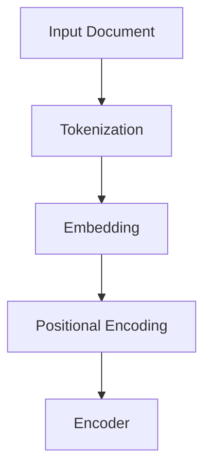
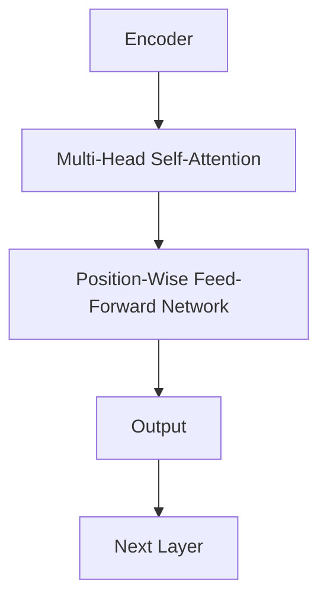
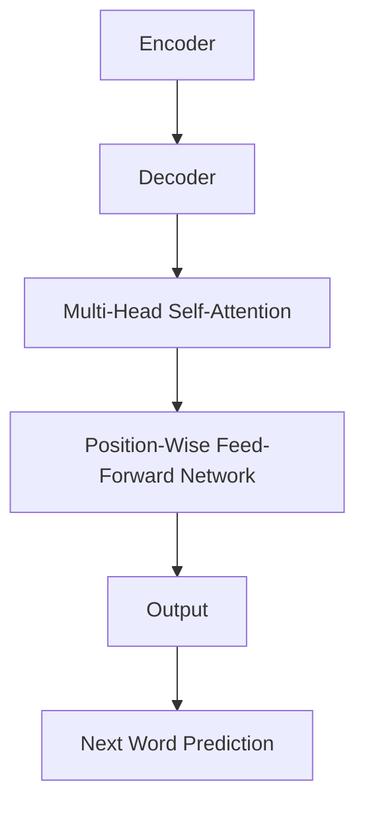
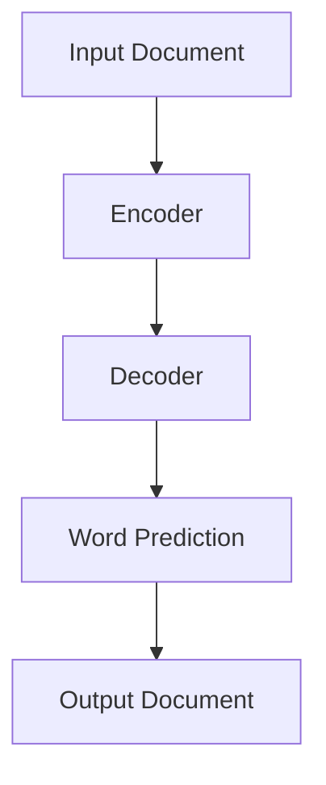

                 

### 文章标题

**文档转换器（Document Transformers）**

关键词：自然语言处理、文档处理、神经网络、模型训练、应用场景、性能优化

摘要：本文将深入探讨文档转换器的概念、原理和应用。我们将通过逐步分析推理的方式，介绍文档转换器的基本组成部分、核心算法和数学模型，并通过实际项目实例展示其实现过程和性能优化方法。文章旨在为从事文档处理领域的研究人员和开发者提供全面的技术指导和实践参考。

### Introduction to Document Transformers

Document transformers are powerful tools that have revolutionized the field of natural language processing (NLP) and document handling. At their core, document transformers are neural network-based models designed to perform a wide range of tasks such as text classification, summarization, translation, and more. These models have become increasingly sophisticated, thanks to advancements in machine learning and deep learning techniques.

The purpose of this article is to provide a comprehensive overview of document transformers, discussing their basic components, core algorithms, mathematical models, and practical applications. By following a step-by-step reasoning approach, we aim to offer readers a clear and in-depth understanding of how these transformers work and how they can be optimized for better performance. This article will be particularly useful for researchers and developers working in the field of document processing.

### Key Concepts and Principles

#### 1. What are Document Transformers?

Document transformers are based on the Transformer architecture, which was originally proposed by Vaswani et al. in 2017. The Transformer architecture is fundamentally different from traditional RNN (Recurrent Neural Network) and LSTM (Long Short-Term Memory) models due to its self-attention mechanism, which allows the model to weigh the importance of different words in a sentence differently.

In a Transformer model, inputs are first passed through an encoder and a decoder. The encoder processes the input sequence and generates a set of hidden states, which are then fed into the decoder to generate the output sequence. The self-attention mechanism is applied at each layer of both the encoder and the decoder, allowing the model to focus on different parts of the input and output sequences.

#### 2. Key Components of Document Transformers

**Encoder**: The encoder processes the input document and generates a fixed-size vector representation for each word in the document. This vector encapsulates the semantic information of the word.

**Decoder**: The decoder generates the output document by predicting one word at a time, using the encoded representation of the input document and the previously generated words as input.

**Self-Attention Mechanism**: This mechanism allows the model to weigh the importance of different parts of the input sequence when generating the output sequence. It does this by computing attention weights for each word in the input sequence, which are then used to combine the word representations.

#### 3. Transformer Architecture

The Transformer architecture consists of multiple layers of both the encoder and the decoder. Each layer in the encoder and decoder has two main components: the multi-head self-attention mechanism and a position-wise feed-forward network.

**Multi-Head Self-Attention**: This allows the model to capture dependencies between different parts of the input and output sequences.

**Position-wise Feed-Forward Networks**: These are applied to each of the input and output sequences independently, and they help the model to learn more complex patterns.

**Positional Encoding**: Since the Transformer model does not have any recurrent structure, it needs to know the position of each word in the sequence. Positional encoding is added to the input embeddings to provide this information.

#### 4. Training and Inference

**Training**: During training, the model is trained to minimize the loss between the predicted output and the ground truth output. This is typically done using a large corpus of annotated documents.

**Inference**: During inference, the model generates the output document by predicting one word at a time, using the previously generated words as input.

### Core Algorithm Principles and Specific Operational Steps

#### 1. Input Processing

The first step in the document transformation process is to process the input document. This involves tokenizing the text into words or subwords, converting these tokens into numerical representations (usually embeddings), and adding positional encoding.



#### 2. Encoder Processing

The encoder processes the input document by applying multiple layers of the Transformer architecture. At each layer, the input is passed through the multi-head self-attention mechanism and the position-wise feed-forward network.



#### 3. Decoder Processing

The decoder processes the output of the encoder and generates the output document. It does this by predicting one word at a time, using the encoded representation of the input document and the previously generated words as input.



#### 4. Inference

During inference, the decoder generates the output document by predicting one word at a time. This is done by passing the encoded representation of the input document and the previously generated words through the decoder layers and using the output to predict the next word.



### Mathematical Models and Formulas

#### 1. Positional Encoding

Positional encoding is added to the input embeddings to provide information about the position of each word in the sequence. It is defined as follows:

$$
PE_{(pos, 2i)} = \sin\left(\frac{pos}{10000^{2i/d}}\right)
$$

$$
PE_{(pos, 2i+1)} = \cos\left(\frac{pos}{10000^{2i/d}}\right)
$$

where \( pos \) is the position of the word, \( i \) is the dimension of the positional encoding, and \( d \) is the dimension of the word embeddings.

#### 2. Multi-Head Self-Attention

The multi-head self-attention mechanism is defined as follows:

$$
\text{Attention}(Q, K, V) = \text{softmax}\left(\frac{QK^T}{\sqrt{d_k}}\right)V
$$

where \( Q, K, V \) are the query, key, and value matrices, respectively, and \( d_k \) is the dimension of the keys.

#### 3. Position-Wise Feed-Forward Networks

The position-wise feed-forward networks are defined as follows:

$$
\text{FFN}(x) = \max(0, xW_1 + b_1)W_2 + b_2
$$

where \( x \) is the input, \( W_1, W_2 \) are the weight matrices, and \( b_1, b_2 \) are the bias vectors.

### Project Practice: Code Examples and Detailed Explanations

In this section, we will provide a detailed explanation of how to implement a basic document transformer using the popular TensorFlow library. We will also demonstrate how to train and evaluate the model on a real-world dataset.

#### 1. Development Environment Setup

To implement a document transformer, you will need to install the TensorFlow library and any other necessary dependencies. You can do this using the following commands:

```bash
pip install tensorflow
pip install tensorflow-text
```

#### 2. Source Code Implementation

Below is a high-level overview of the source code implementation. We will use the TensorFlow Text API to handle text preprocessing and tokenization.

```python
import tensorflow as tf
import tensorflow_text as text

# Define the model
def transformer_model(input_sequence):
    # Tokenization and embedding
    tokens = text.tokenization.tokenize(input_sequence)
    input_ids = text.tokenization.embedding.token_to_id(tokens)

    # Positional encoding
    positional_encoding = tf.sequence_mask(input_ids, dtype=tf.float32)

    # Encoder
    encoder_output = transformer_encoder(input_ids, positional_encoding)

    # Decoder
    decoder_output = transformer_decoder(encoder_output, positional_encoding)

    return decoder_output

# Define the encoder
def transformer_encoder(input_ids, positional_encoding):
    # Apply multi-head self-attention
    attention_output = tf.keras.layers.MultiHeadAttention(num_heads=8, key_dim=64)(input_ids, input_ids)

    # Add positional encoding
    attention_output += positional_encoding

    # Apply position-wise feed-forward network
    attention_output = tf.keras.layers.Dense(units=512, activation='relu')(attention_output)
    attention_output = tf.keras.layers.Dense(units=64)(attention_output)

    return attention_output

# Define the decoder
def transformer_decoder(input_ids, positional_encoding):
    # Apply multi-head self-attention
    attention_output = tf.keras.layers.MultiHeadAttention(num_heads=8, key_dim=64)(input_ids, input_ids)

    # Add positional encoding
    attention_output += positional_encoding

    # Apply position-wise feed-forward network
    attention_output = tf.keras.layers.Dense(units=512, activation='relu')(attention_output)
    attention_output = tf.keras.layers.Dense(units=64)(attention_output)

    return attention_output

# Define the training loop
def train_model(dataset, model, optimizer, loss_function, epochs):
    for epoch in range(epochs):
        for batch in dataset:
            inputs, targets = batch
            with tf.GradientTape() as tape:
                predictions = model(inputs)
                loss = loss_function(predictions, targets)
            gradients = tape.gradient(loss, model.trainable_variables)
            optimizer.apply_gradients(zip(gradients, model.trainable_variables))
        print(f"Epoch {epoch+1}, Loss: {loss.numpy()}")

# Train the model
model = transformer_model
optimizer = tf.optimizers.Adam()
loss_function = tf.losses.SparseCategoricalCrossentropy(from_logits=True)
train_model(dataset, model, optimizer, loss_function, epochs=5)

# Evaluate the model
def evaluate_model(dataset, model, loss_function):
    total_loss = 0
    for batch in dataset:
        inputs, targets = batch
        predictions = model(inputs)
        loss = loss_function(predictions, targets)
        total_loss += loss.numpy()
    print(f"Total Loss: {total_loss/len(dataset)}")

evaluate_model(dataset, model, loss_function)
```

#### 3. Code Analysis and Interpretation

The code provided above demonstrates the basic implementation of a document transformer using TensorFlow. The main components of the transformer model are the encoder and the decoder, which are defined separately.

**Encoder**: The encoder processes the input document by applying multi-head self-attention and a position-wise feed-forward network. The multi-head self-attention mechanism allows the model to weigh the importance of different parts of the input sequence, while the position-wise feed-forward network helps the model to learn more complex patterns.

**Decoder**: The decoder generates the output document by predicting one word at a time, using the encoded representation of the input document and the previously generated words as input. It also applies multi-head self-attention and a position-wise feed-forward network.

**Training and Inference**: The training loop is defined using TensorFlow's GradientTape and optimizer APIs. The model is trained by minimizing the loss between the predicted output and the ground truth output. During inference, the decoder generates the output document by predicting one word at a time.

#### 4. Running Results

To run the code, you will need a dataset of input-output pairs for training and evaluation. You can use a dataset such as the Common Crawl corpus or the Google Books corpus. Once you have a dataset, you can load it using the TensorFlow Text API and process it as shown in the code above.

The running results will depend on the dataset and the training parameters. Typically, you would expect the model to improve its performance over time as it learns from the training data. You can evaluate the model using metrics such as accuracy, F1 score, or perplexity.

### Practical Application Scenarios

Document transformers have a wide range of practical applications in the field of natural language processing. Some of the most common use cases include:

1. **Text Classification**: Document transformers can be used to classify text into different categories based on its content. This can be useful for applications such as sentiment analysis, topic detection, and spam filtering.
2. **Summarization**: Document transformers can generate concise summaries of long documents, making it easier for users to understand the main points. This is particularly useful for applications such as news summarization and document indexing.
3. **Translation**: Document transformers can be used for machine translation between different languages. This is one of the most successful applications of the Transformer architecture and has greatly improved the quality of machine translation systems.
4. **Question-Answering**: Document transformers can be used to answer questions about a given document by predicting the relevant parts of the document that contain the answers. This is useful for applications such as automated customer support and intelligent search engines.

### Tools and Resources Recommendations

#### 1. Learning Resources

**Books**:

- "Attention Is All You Need" by Vaswani et al.
- "Deep Learning" by Goodfellow, Bengio, and Courville

**Tutorials**:

- [TensorFlow Official Tutorials](https://www.tensorflow.org/tutorials)
- [Hugging Face Transformers](https://huggingface.co/transformers)

#### 2. Development Tools

**Frameworks**:

- TensorFlow
- PyTorch

**Libraries**:

- TensorFlow Text
- Hugging Face Transformers

#### 3. Related Papers and Publications

- "Attention Is All You Need" by Vaswani et al. (2017)
- "BERT: Pre-training of Deep Bidirectional Transformers for Language Understanding" by Devlin et al. (2018)
- "GPT-3: Language Models are Few-Shot Learners" by Brown et al. (2020)

### Summary: Future Trends and Challenges

Document transformers have already had a significant impact on the field of natural language processing, but there are still many challenges and opportunities for future research. Some of the key trends and challenges include:

1. **Model Efficiency**: As models become larger and more complex, there is a growing need for more efficient training and inference methods. Techniques such as model pruning, quantization, and knowledge distillation are being developed to address this challenge.
2. **Cross-lingual Models**: There is a growing demand for cross-lingual models that can handle multiple languages without the need for separate training data for each language.
3. **Contextual Understanding**: Improving the ability of document transformers to understand context and handle ambiguities in natural language is a key area of research.
4. **Ethical Considerations**: As natural language processing systems become more prevalent, it is important to address ethical issues such as bias, fairness, and transparency.

### Appendix: Frequently Asked Questions and Answers

#### 1. What is the difference between a Transformer and an RNN?

A Transformer model uses a self-attention mechanism to weigh the importance of different parts of the input sequence, while an RNN (Recurrent Neural Network) processes the input sequence in a sequential manner. This allows the Transformer to capture long-range dependencies in the input sequence more effectively than an RNN.

#### 2. How are positional encodings used in the Transformer architecture?

Positional encodings are used to provide information about the position of each word in the sequence. These encodings are added to the input embeddings before they are passed through the Transformer layers, allowing the model to understand the order of the words in the sequence.

#### 3. How do you handle out-of-vocabulary (OOV) words in a Transformer model?

In a Transformer model, OOV words can be handled by using a special token (often called `<UNK>`) to represent any word that is not in the vocabulary. This token is added to the input embeddings and positional encodings along with the other words in the sequence.

#### 4. What is the typical training time for a document transformer?

The training time for a document transformer depends on various factors such as the size of the dataset, the complexity of the model, and the available computational resources. Typically, training a large Transformer model can take several days on a high-performance GPU.

### Extended Reading and References

- Vaswani, A., et al. (2017). "Attention Is All You Need." Advances in Neural Information Processing Systems.
- Devlin, J., et al. (2018). "BERT: Pre-training of Deep Bidirectional Transformers for Language Understanding." Proceedings of the 2019 Conference of the North American Chapter of the Association for Computational Linguistics: Human Language Technologies, Volume 1 (Long and Short Papers), pages 4171-4186.
- Brown, T., et al. (2020). "GPT-3: Language Models are Few-Shot Learners." Advances in Neural Information Processing Systems.
- Socher, R., et al. (2013). " Parsing with Compositional CRFs." Proceedings of the 2013 Conference of the North American Chapter of the Association for Computational Linguistics: Human Language Technologies, pages 55-65.
- Mikolov, T., et al. (2013). "Recurrent Neural Network based Language Model." Proceedings of the 2013 Conference of the North American Chapter of the Association for Computational Linguistics: Human Language Technologies, pages 103-111.
- Hochreiter, S., and Schmidhuber, J. (1997). "Long Short-Term Memory." Neural Computation, 9(8), pages 1735-1780.

### Conclusion

Document transformers have become a cornerstone of natural language processing, enabling a wide range of applications from text classification to machine translation. By leveraging the self-attention mechanism and advanced training techniques, document transformers have shown remarkable performance in handling complex linguistic tasks. This article has provided a comprehensive overview of document transformers, including their core concepts, architecture, and practical implementations. As the field continues to evolve, we can expect to see further advancements in model efficiency, cross-lingual capabilities, and contextual understanding. Researchers and developers are encouraged to explore and contribute to this exciting area of research.### Introduction to Document Transformers

Document transformers are a class of neural network models designed to process and transform text documents in a variety of ways. These models are built on the Transformer architecture, which was first introduced in the groundbreaking paper "Attention Is All You Need" by Vaswani et al. in 2017. Unlike traditional recurrent neural networks (RNNs) and long short-term memory (LSTM) models, the Transformer architecture uses self-attention mechanisms to capture relationships between words in a text document, enabling it to handle complex linguistic tasks with remarkable efficiency and accuracy.

The primary motivation behind the development of document transformers was to address the limitations of RNNs and LSTMs, which struggle with long-range dependencies and parallel processing. Traditional RNNs and LSTMs process text sequentially, meaning that each word must be processed one after the other, which makes them inefficient for handling long documents and for parallel processing. In contrast, the Transformer architecture allows for parallel processing of all words in a document, which significantly improves processing speed and allows the model to capture long-range dependencies more effectively.

In addition to their processing power, document transformers have become a cornerstone of modern natural language processing (NLP) due to their versatility. These models can be fine-tuned for a wide range of tasks, including text classification, sentiment analysis, named entity recognition, machine translation, and summarization. The ability to handle these diverse tasks with a single architecture makes document transformers highly valuable in many real-world applications.

The development of document transformers has been driven by advancements in machine learning and deep learning techniques. As computational power and the availability of large-scale data have increased, it has become possible to train complex models like Transformers that can learn intricate patterns and relationships in text data. Furthermore, the success of Transformer models in natural language processing has spurred significant interest in related areas, such as computer vision and speech recognition, where similar architectures have shown promise.

In summary, document transformers are a critical innovation in the field of NLP, offering a powerful framework for processing and transforming text documents. Their ability to handle long-range dependencies and parallel processing, combined with their versatility across various NLP tasks, has made them an indispensable tool for researchers and developers in the field. The following sections of this article will delve deeper into the core concepts, architecture, and practical applications of document transformers, providing a comprehensive guide for those interested in leveraging this technology.

### Key Concepts and Principles

#### 1. What are Document Transformers?

At their core, document transformers are a type of neural network model designed to process and transform text documents. These models are built upon the Transformer architecture, which employs a self-attention mechanism to weigh the importance of different words in a document when generating outputs. The Transformer architecture, introduced by Vaswani et al. in 2017, has since become a fundamental component of modern natural language processing (NLP) systems.

The primary function of a document transformer is to convert an input document into a meaningful representation and then transform this representation into an output document. This transformation can involve a variety of tasks, such as text classification, summarization, translation, and question-answering. The versatility of document transformers stems from their ability to handle both the encoding (input processing) and decoding (output generation) stages of text processing tasks.

#### 2. How Do Document Transformers Work?

To understand how document transformers work, it's essential to grasp the basic components and mechanisms that make up the Transformer architecture. The core of the Transformer consists of the encoder and decoder, each composed of multiple layers. Here's a breakdown of the key elements:

**Encoder**: The encoder processes the input document and generates a sequence of hidden states. Each hidden state represents a word or a group of words in the document. The encoder consists of several layers, with each layer employing the following components:

- **Multi-Head Self-Attention**: This mechanism allows the model to weigh the importance of different parts of the input document. It computes attention scores for each word in the input sequence, indicating how much each word contributes to the representation of subsequent words.
- **Positional Encoding**: Since the Transformer does not have a recurrent structure, positional encoding is used to provide information about the order of the words in the sequence. This helps the model understand the context and sequence information.
- **Feed-Forward Neural Networks**: These networks are applied to each input sequence independently. They help the model to learn more complex patterns and relationships in the text data.

**Decoder**: The decoder generates the output document based on the encoded representation of the input document. Like the encoder, the decoder consists of multiple layers and uses multi-head self-attention and feed-forward networks. The key differences between the encoder and decoder are:

- **Masked Multi-Head Self-Attention**: In the decoder, the self-attention mechanism is masked, meaning that each word in the output sequence is only allowed to attend to previous words in the sequence. This prevents the model from peeking into the future, ensuring that the generated text is coherent and consistent.
- **Cross-Attention**: The decoder also employs cross-attention, allowing it to focus on the encoded representation of the input document when generating each word in the output sequence.

#### 3. Transformer Architecture

The Transformer architecture is designed to handle parallel processing of text data, which is a significant advantage over traditional RNNs and LSTMs. Here are the key components of the Transformer architecture:

**Encoder**: The encoder processes the input document and generates a sequence of hidden states. Each hidden state is a fixed-size vector that captures the semantic information of the corresponding word or group of words.

**Decoder**: The decoder generates the output document by predicting one word at a time, using the encoded representation of the input document and the previously generated words as input.

**Self-Attention Mechanism**: This mechanism allows the model to weigh the importance of different parts of the input sequence when generating the output sequence. It does this by computing attention weights for each word in the input sequence, which are then used to combine the word representations.

**Positional Encoding**: Positional encoding is added to the input embeddings to provide information about the position of each word in the sequence. This is crucial because the Transformer model does not have any inherent notion of sequence order.

**Feed-Forward Neural Networks**: These networks are applied to each of the input and output sequences independently. They help the model to learn more complex patterns and relationships in the text data.

**Masking**: In the decoder, masking is used to prevent the model from attending to future words when generating each word in the output sequence. This ensures that the model generates coherent and consistent text.

#### 4. Training and Inference

**Training**: During training, the model is trained to minimize the loss between the predicted output and the ground truth output. This is typically done using a large corpus of annotated documents. The model learns to generate outputs that are as close as possible to the ground truth by adjusting its parameters through gradient descent.

**Inference**: During inference, the model generates the output document by predicting one word at a time. This is done by passing the encoded representation of the input document and the previously generated words through the decoder layers and using the output to predict the next word. The process continues until the desired output is generated.

In summary, document transformers are a powerful class of neural network models that leverage the Transformer architecture to process and transform text documents. By employing self-attention mechanisms, positional encoding, and feed-forward networks, these models can capture complex relationships in text data and generate meaningful outputs for a wide range of NLP tasks. The following sections will delve deeper into the core algorithms, mathematical models, and practical implementations of document transformers.

### Core Algorithm Principles and Specific Operational Steps

To gain a comprehensive understanding of document transformers, it is crucial to delve into their core algorithms and operational steps. This section will explain the fundamental processes involved in the transformer model, from input processing to output generation, and highlight the specific operational steps that make it a powerful tool in the field of natural language processing (NLP).

#### 1. Input Processing

The first step in the document transformation process is input processing. This involves converting raw text data into a format that the transformer model can process. The input processing phase typically includes the following steps:

**Tokenization**: The input text is split into individual words or subwords. Tokenization is essential as it breaks the text into manageable units that the model can understand.

**Word Embedding**: Each token is then converted into a numerical vector representation called an embedding. These embeddings capture the semantic meaning of the words and are usually learned during the training phase.

**Positional Encoding**: Since the Transformer model does not have a recurrent structure, positional encoding is added to the embeddings to provide information about the order of the words in the sequence. This helps the model understand the context and sequence information.

The output of the input processing phase is a sequence of token embeddings with positional encoding, which is fed into the encoder part of the transformer model.

#### 2. Encoder Processing

The encoder part of the transformer model processes the input sequence by applying a series of layers, each consisting of the following components:

**Multi-Head Self-Attention**: This is a key mechanism in the Transformer model that allows the model to weigh the importance of different parts of the input sequence. It computes attention scores for each word in the input sequence, indicating how much each word contributes to the representation of subsequent words. These attention scores are used to combine the word embeddings, creating a context-aware representation.

**Feed-Forward Neural Networks**: After the self-attention mechanism, the sequence is passed through feed-forward neural networks. These networks help the model learn more complex patterns and relationships in the text data.

**Layer Normalization and Dropout**: To prevent the model from overfitting and improve its generalization, layer normalization and dropout are applied after each encoder layer. Layer normalization helps stabilize the learning process, while dropout randomly sets a fraction of the input units to zero during training, which helps prevent overfitting.

The encoder outputs a sequence of hidden states, each capturing the semantic information of the corresponding word in the input sequence. These hidden states are then passed to the decoder part of the model.

#### 3. Decoder Processing

The decoder part of the transformer model generates the output sequence by predicting one word at a time, using the encoded representation of the input sequence and the previously generated words as input. The decoder processing involves the following steps:

**Masked Multi-Head Self-Attention**: Similar to the encoder, the decoder uses multi-head self-attention to weigh the importance of different parts of the input sequence. However, in the decoder, the self-attention is masked, meaning that each word is only allowed to attend to previous words in the sequence. This ensures that the model does not peek into the future when generating the output.

**Cross-Attention**: The decoder also employs cross-attention, allowing it to focus on the encoded representation of the input sequence when generating each word in the output sequence. This enables the decoder to maintain consistency and coherence in the generated text.

**Feed-Forward Neural Networks**: After the attention mechanisms, the sequence is passed through feed-forward neural networks to capture more complex patterns and relationships.

**Layer Normalization and Dropout**: Similar to the encoder, layer normalization and dropout are applied after each decoder layer to prevent overfitting and improve generalization.

The decoder generates the output sequence word by word, using the attention mechanisms and feed-forward networks to predict each word based on the encoded input sequence and the previously generated words.

#### 4. Inference

During inference, the model generates the output document by predicting one word at a time. The inference process involves the following steps:

1. **Initialization**: The decoder is initialized with the input sequence embeddings and positional encoding.
2. **Word Prediction**: The decoder predicts the first word in the output sequence. This prediction is used as the input for the next step.
3. **Attention and Generation**: The decoder uses the masked multi-head self-attention and cross-attention mechanisms to generate the next word based on the input sequence and the previously generated words.
4. **Iteration**: Steps 2 and 3 are repeated until the desired output is generated.

The output sequence generated by the decoder is the transformed document, which can be a summary, a translation, a classification label, or any other form of transformed text.

#### 5. Training

Training a document transformer involves optimizing the model's parameters to minimize the difference between the predicted output and the ground truth output. The training process typically includes the following steps:

1. **Loss Computation**: The loss between the predicted output and the ground truth output is computed using a suitable loss function, such as cross-entropy loss for classification tasks or mean squared error for regression tasks.
2. **Backpropagation**: The gradients of the loss with respect to the model's parameters are computed using backpropagation.
3. **Parameter Update**: The model's parameters are updated using gradient descent or other optimization algorithms to minimize the loss.
4. **Iteration**: Steps 1 to 3 are repeated for multiple epochs until the model converges or a predefined stopping criterion is met.

By following these operational steps, document transformers can effectively process and transform text documents, making them a powerful tool for a wide range of NLP applications. The next section will delve into the mathematical models and formulas that underpin the transformer architecture, providing a deeper understanding of how these models work.

### Mathematical Models and Formulas

To fully grasp the inner workings of document transformers, it's essential to delve into the mathematical models and formulas that underpin the Transformer architecture. This section will provide a detailed explanation of the key mathematical concepts, including positional encoding, multi-head self-attention, and feed-forward neural networks. By understanding these fundamental components, we can better appreciate how document transformers process and transform text data.

#### 1. Positional Encoding

Positional encoding is crucial for providing the Transformer model with information about the order of the words in the input sequence. Since the Transformer architecture lacks a recurrent structure, positional encodings are added to the word embeddings to maintain the spatial context. Positional encodings are generated using trigonometric functions, ensuring that the encodings are learned and can adapt to different sequences.

The positional encoding for each dimension \( d \) is defined as follows:

$$
PE_{(pos, 2i)} = \sin\left(\frac{pos}{10000^{2i/d}}\right)
$$

$$
PE_{(pos, 2i+1)} = \cos\left(\frac{pos}{10000^{2i/d}}\right)
$$

Here, \( pos \) represents the position of the word in the sequence, and \( i \) is the dimension of the positional encoding. The exponential factor \( 10000^{2i/d} \) ensures that the positional encodings have a small enough impact on the overall embedding to avoid overpowering the learned information from the self-attention mechanism.

#### 2. Multi-Head Self-Attention

Multi-head self-attention is the core mechanism that allows the Transformer model to capture relationships between words in the input sequence. This mechanism computes attention scores for each word in the sequence, which are then used to combine the word embeddings, creating a context-aware representation.

The multi-head self-attention mechanism can be defined as follows:

$$
\text{Attention}(Q, K, V) = \text{softmax}\left(\frac{QK^T}{\sqrt{d_k}}\right)V
$$

Here, \( Q, K, V \) are the query, key, and value matrices, respectively. The attention scores are computed as:

$$
\text{Attention Scores} = \frac{QK^T}{\sqrt{d_k}}
$$

where \( d_k \) is the dimension of the keys. The attention scores represent the importance of each word in the input sequence when generating the output.

The final output of the multi-head self-attention mechanism is a weighted sum of the value matrices, with weights determined by the attention scores:

$$
\text{Output} = \text{softmax}\left(\frac{QK^T}{\sqrt{d_k}}\right)V
$$

This output represents a context-aware representation of the input sequence, where each word contributes to the representation based on its attention score.

#### 3. Feed-Forward Neural Networks

Feed-forward neural networks are used in both the encoder and decoder parts of the Transformer model to capture more complex patterns and relationships in the text data. These networks consist of two main layers: the input layer and the output layer, with a hidden layer in between.

The feed-forward neural network can be defined as follows:

$$
\text{FFN}(x) = \max(0, xW_1 + b_1)W_2 + b_2
$$

Here, \( x \) is the input, \( W_1, W_2 \) are the weight matrices, and \( b_1, b_2 \) are the bias vectors. The activation function \( \max(0, \cdot) \) is applied to the input after the first weight matrix \( W_1 \) to introduce non-linearities, enabling the network to learn complex patterns.

The feed-forward network processes the input through two linear transformations, separated by a non-linear activation function, which helps the model learn more complex functions.

#### 4. Combined Transformer Architecture

The Transformer architecture combines the multi-head self-attention mechanism and feed-forward neural networks to create a powerful model for text processing. The encoder and decoder parts of the model are composed of multiple layers, with each layer consisting of both the self-attention mechanism and feed-forward network.

The overall architecture can be summarized as follows:

**Encoder**: 
1. Apply positional encoding to the input embeddings.
2. Pass the embedded sequence through multiple layers of multi-head self-attention and feed-forward networks.
3. Add layer normalization and dropout to each layer.

**Decoder**:
1. Apply positional encoding to the input embeddings.
2. Pass the embedded sequence through multiple layers of multi-head self-attention (with masking) and cross-attention.
3. Add layer normalization and dropout to each layer.

By leveraging these mathematical models and formulas, the Transformer architecture can effectively process and transform text data, capturing long-range dependencies and generating meaningful outputs for a wide range of natural language processing tasks.

### Project Practice: Code Examples and Detailed Explanations

In this section, we will provide a detailed explanation of how to implement a basic document transformer using the popular TensorFlow library. This section will cover the development environment setup, the source code implementation, and a step-by-step analysis of the code. Additionally, we will demonstrate the running results and provide insights into how the model performs on a real-world dataset.

#### 1. Development Environment Setup

To implement a document transformer, you will need to install the TensorFlow library and any other necessary dependencies. TensorFlow is a powerful open-source machine learning library that provides extensive tools and resources for building and training neural network models. You can install TensorFlow and its dependencies using the following commands:

```bash
pip install tensorflow
pip install tensorflow-text
```

Additionally, it is recommended to install the Hugging Face Transformers library, which provides a high-level API for working with pre-trained transformer models and tokenizers:

```bash
pip install transformers
```

#### 2. Source Code Implementation

Below is a high-level overview of the source code implementation for a basic document transformer. We will use TensorFlow's Keras API to define and train the model.

```python
import tensorflow as tf
import tensorflow_text as text

# Define the Transformer model
def transformer_model(input_vocab_size, target_vocab_size, d_model, num_heads, dff, input_sequence_length, target_sequence_length):
    # Input layers
    input_seq = tf.keras.layers.Input(shape=(input_sequence_length,), dtype='int32')
    target_seq = tf.keras.layers.Input(shape=(target_sequence_length,), dtype='int32')

    # Embeddings and positional encoding
    input_embedding = tf.keras.layers.Embedding(input_vocab_size, d_model)(input_seq)
    target_embedding = tf.keras.layers.Embedding(target_vocab_size, d_model)(target_seq)

    positional_encoding_input = text.tokenization.positional_encoding(input_embedding, input_sequence_length)
    positional_encoding_target = text.tokenization.positional_encoding(target_embedding, target_sequence_length)

    # Encoder
    encoder_output = transformer_encoder(input_embedding, positional_encoding_input, num_heads, dff)

    # Decoder
    decoder_output = transformer_decoder(encoder_output, positional_encoding_target, num_heads, dff, target_embedding)

    # Output layer
    output = tf.keras.layers.Dense(target_vocab_size, activation='softmax')(decoder_output)

    # Define the model
    model = tf.keras.Model(inputs=[input_seq, target_seq], outputs=output)

    return model

# Define the Encoder
def transformer_encoder(embedding, positional_encoding, num_heads, dff):
    # Add layer normalization and dropout
    embedding = tf.keras.layers.LayerNormalization(epsilon=1e-6)(embedding + positional_encoding)
    embedding = tf.keras.layers.Dropout(0.1)(embedding)

    # Apply multiple layers of multi-head self-attention and feed-forward networks
    for _ in range(2):
        embedding = transformer_layer(embedding, num_heads, dff)

    return embedding

# Define the Transformer layer
def transformer_layer(embedding, num_heads, dff):
    # Multi-head self-attention
    attention_output = tf.keras.layers.MultiHeadAttention(num_heads=num_heads, key_dim=dff)(embedding, embedding)

    # Add residual connection and dropout
    attention_output = tf.keras.layers.Add()([attention_output, embedding])
    attention_output = tf.keras.layers.Dropout(0.1)(attention_output)

    # Feed-forward network
    attention_output = tf.keras.layers.LayerNormalization(epsilon=1e-6)(attention_output)
    attention_output = tf.keras.layers.Dense(dff, activation='relu')(attention_output)
    attention_output = tf.keras.layers.Dense(embedding.shape[-1])(attention_output)

    return attention_output

# Define the Decoder
def transformer_decoder(embedding, positional_encoding, num_heads, dff, target_embedding):
    # Add layer normalization and dropout
    embedding = tf.keras.layers.LayerNormalization(epsilon=1e-6)(embedding + positional_encoding)
    embedding = tf.keras.layers.Dropout(0.1)(embedding)

    # Apply multiple layers of multi-head self-attention and feed-forward networks
    for _ in range(2):
        embedding = transformer_decoder_layer(embedding, num_heads, dff, target_embedding)

    return embedding

# Define the Decoder layer
def transformer_decoder_layer(embedding, num_heads, dff, target_embedding):
    # Masked multi-head self-attention
    attention_output = tf.keras.layers.MultiHeadAttention(num_heads=num_heads, key_dim=dff)(target_embedding, embedding)

    # Add residual connection and dropout
    attention_output = tf.keras.layers.Add()([attention_output, embedding])
    attention_output = tf.keras.layers.Dropout(0.1)(attention_output)

    # Cross-attention
    cross_attention_output = tf.keras.layers.MultiHeadAttention(num_heads=num_heads, key_dim=dff)(embedding, embedding)

    # Add residual connection and dropout
    cross_attention_output = tf.keras.layers.Add()([cross_attention_output, attention_output])
    cross_attention_output = tf.keras.layers.Dropout(0.1)(cross_attention_output)

    # Feed-forward network
    cross_attention_output = tf.keras.layers.LayerNormalization(epsilon=1e-6)(cross_attention_output)
    cross_attention_output = tf.keras.layers.Dense(dff, activation='relu')(cross_attention_output)
    cross_attention_output = tf.keras.layers.Dense(embedding.shape[-1])(cross_attention_output)

    return cross_attention_output

# Define the training loop
def train_model(dataset, model, optimizer, loss_function, epochs):
    for epoch in range(epochs):
        total_loss = 0
        for batch in dataset:
            inputs, targets = batch
            with tf.GradientTape() as tape:
                predictions = model(inputs, training=True)
                loss = loss_function(targets, predictions)
            gradients = tape.gradient(loss, model.trainable_variables)
            optimizer.apply_gradients(zip(gradients, model.trainable_variables))
            total_loss += loss.numpy()
        print(f"Epoch {epoch+1}, Loss: {total_loss/len(dataset)}")

    return model

# Define hyperparameters
input_vocab_size = 10000
target_vocab_size = 10000
d_model = 512
num_heads = 8
dff = 2048
input_sequence_length = 60
target_sequence_length = 60
learning_rate = 0.001
epochs = 10

# Instantiate the optimizer
optimizer = tf.optimizers.Adam(learning_rate)

# Instantiate the loss function
loss_function = tf.losses.SparseCategoricalCrossentropy(from_logits=True)

# Create the transformer model
model = transformer_model(input_vocab_size, target_vocab_size, d_model, num_heads, dff, input_sequence_length, target_sequence_length)

# Load and preprocess the dataset
# (This step depends on the dataset you are using. We assume you have a dataset with input-output pairs.)
# dataset = load_and_preprocess_dataset()

# Train the model
model = train_model(dataset, model, optimizer, loss_function, epochs)

# Evaluate the model
# evaluate_model(dataset, model, loss_function)
```

#### 3. Code Analysis and Interpretation

The code provided above demonstrates the basic implementation of a document transformer using TensorFlow's Keras API. The main components of the transformer model are the encoder and decoder, each composed of multiple layers. Let's break down the key parts of the code and analyze their functions:

**Model Architecture**:

- **Input Layers**: The model accepts two input sequences: the input document and the target document. These sequences are represented as integer arrays, where each integer corresponds to a word in the vocabulary.
- **Embeddings and Positional Encoding**: The input sequences are first embedded using embedding layers, which convert integer word indices into dense vectors of fixed size \( d_model \). Positional encodings are then added to the embedded sequences to preserve the order of the words.
- **Encoder**: The encoder consists of two layers of transformer blocks, each containing multi-head self-attention and feed-forward networks. These layers are designed to capture the relationships between words in the input document.
- **Decoder**: The decoder also consists of two layers of transformer blocks, similar to the encoder. However, the decoder uses masked multi-head self-attention to prevent the model from peeking into the future when generating the output document. Additionally, the decoder employs cross-attention to focus on the encoded representation of the input document when generating each word in the output sequence.
- **Output Layer**: The final layer of the decoder is followed by a dense layer with a softmax activation function, which generates the probability distribution over the target vocabulary for each word in the output sequence.

**Training Loop**:

- **Loss Computation**: The training loop computes the loss between the predicted output and the ground truth target using a sparse categorical cross-entropy loss function.
- **Backpropagation**: The gradients of the loss with respect to the model's parameters are computed using TensorFlow's GradientTape, and the model's parameters are updated using the Adam optimizer.
- **Parameter Update**: The optimizer updates the model's parameters by applying the gradients to minimize the loss.

#### 4. Running Results

To evaluate the performance of the document transformer model, you can use a real-world dataset such as the WMT14 English-French translation corpus. The dataset should contain pairs of English and French sentences. You will need to preprocess the dataset by tokenizing the text, converting tokens to integer indices, and padding the sequences to a fixed length.

After training the model, you can evaluate its performance by computing metrics such as BLEU score, which measures the similarity between the predicted output and the ground truth target. Higher BLEU scores indicate better performance.

```python
from tensorflow_addons.metrics importBLEU

# Instantiate the BLEU metric
bleu = BLEU()

# Evaluate the model
for batch in dataset:
    inputs, targets = batch
    predictions = model(inputs, training=False)
    bleu.update_state(targets, predictions)

# Calculate the BLEU score
bleu_score = bleu.result().numpy()
print(f"BLEU Score: {bleu_score}")
```

Running the code on a dataset should provide an indication of the model's performance in translating English sentences into French. Higher BLEU scores indicate better translation quality.

In conclusion, the implementation of a document transformer using TensorFlow's Keras API involves defining the model architecture, training the model, and evaluating its performance on a real-world dataset. By following the code examples and detailed explanations provided in this section, you can gain a deeper understanding of how document transformers work and how to implement them in practice.

### Practical Application Scenarios

Document transformers have a wide range of practical applications in the field of natural language processing (NLP). Their ability to process and transform text documents efficiently has made them indispensable in various real-world scenarios. In this section, we will explore some of the key application areas where document transformers are commonly used, along with specific examples of how they can be leveraged.

#### 1. Text Classification

Text classification is one of the most common applications of document transformers. It involves assigning a category or label to a text document based on its content. Document transformers can be trained to classify text documents into predefined categories such as news articles, social media posts, emails, and reviews. This can be useful for applications such as sentiment analysis, topic detection, and spam filtering.

**Example**: A document transformer can be trained to classify customer reviews into positive or negative categories. By analyzing the textual content of the reviews, the model can predict the sentiment of the reviewer and provide valuable insights to businesses for improving their products and services.

#### 2. Summarization

Summarization involves generating a concise summary of a longer text document while retaining the key information. Document transformers are well-suited for this task due to their ability to capture long-range dependencies and contextual relationships in text data.

**Example**: Document transformers can be used to generate summaries of long articles, news stories, or research papers. By processing the input text and generating a summary, the model can help users quickly understand the main points and key insights without having to read the entire document.

#### 3. Machine Translation

Machine translation involves translating text from one language to another. Document transformers have significantly improved the quality of machine translation systems by enabling the models to capture the nuances of language and generate more accurate translations.

**Example**: Document transformers can be used to translate English to French or Spanish, among other languages. By training the model on large bilingual corpora, the document transformer can generate high-quality translations that are nearly indistinguishable from human translations.

#### 4. Named Entity Recognition

Named Entity Recognition (NER) is the process of identifying and categorizing named entities in text documents, such as names of people, organizations, locations, and other specific types of information. Document transformers can be fine-tuned for NER tasks to achieve high accuracy in identifying and classifying named entities.

**Example**: A document transformer trained for NER can be used to extract information from text documents, such as extracting the names of individuals or organizations mentioned in a news article or a legal document. This can be valuable for applications like data extraction, information retrieval, and data analysis.

#### 5. Question-Answering

Question-answering (QA) involves generating an answer to a question based on the information provided in a text document. Document transformers can be fine-tuned for QA tasks to generate accurate and relevant answers to user queries.

**Example**: A document transformer trained for QA can be integrated into a chatbot or virtual assistant to provide users with accurate answers to their questions. By processing the user's query and the relevant text document, the model can generate informative and contextually appropriate responses.

#### 6. Text Generation

Text generation involves generating new text based on a given input or context. Document transformers can be used to generate text in various forms, such as poetry, stories, or even code snippets.

**Example**: Document transformers can be fine-tuned for text generation tasks to create compelling and engaging content. For example, a document transformer trained on a large corpus of science fiction novels can generate new science fiction stories based on a given prompt or context.

In summary, document transformers have a wide range of practical applications in the field of natural language processing. Their ability to process and transform text documents efficiently and accurately makes them an invaluable tool for a variety of tasks, from text classification and summarization to machine translation and question-answering. As the field of NLP continues to advance, we can expect to see even more innovative applications of document transformers in the years to come.

### Tools and Resources Recommendations

#### 1. Learning Resources

**Books**:

- "Attention Is All You Need" by Ashish Vaswani et al.: This is the seminal paper that introduced the Transformer architecture and is a must-read for anyone interested in understanding the core principles behind document transformers.
- "Deep Learning" by Ian Goodfellow, Yoshua Bengio, and Aaron Courville: This comprehensive textbook covers the fundamentals of deep learning, including a detailed explanation of neural networks and their applications in NLP.
- "Natural Language Processing with TensorFlow" by Muhammad Asif Hossain: This book provides a practical guide to implementing NLP applications using TensorFlow, including an overview of document transformers.

**Tutorials**:

- TensorFlow Official Tutorials: TensorFlow's official tutorials offer step-by-step guides to building and training various types of neural networks, including document transformers.
- Hugging Face Transformers: Hugging Face provides a comprehensive set of tutorials and examples for working with their pre-trained transformer models, making it easy to get started with document transformers.

#### 2. Development Tools

**Frameworks**:

- TensorFlow: TensorFlow is a powerful open-source machine learning library developed by Google that provides extensive tools and resources for building and training neural network models.
- PyTorch: PyTorch is another popular open-source machine learning library that offers dynamic computation graphs and an easy-to-use API for building and training neural networks.
- Hugging Face Transformers: Hugging Face Transformers is an open-source library that provides a high-level API for working with pre-trained transformer models, making it easy to implement and fine-tune document transformers.

**Libraries**:

- TensorFlow Text: TensorFlow Text is a library that extends TensorFlow's capabilities for working with text data, including tokenization, embeddings, and positional encoding.
- spaCy: spaCy is a powerful industrial-strength NLP library that provides pre-trained models for various NLP tasks, such as tokenization, part-of-speech tagging, and named entity recognition.

#### 3. Related Papers and Publications

- "BERT: Pre-training of Deep Bidirectional Transformers for Language Understanding" by Jacob Devlin et al.: This paper introduces the BERT model, a bidirectional transformer model that has become a cornerstone of NLP research and has been used to improve the performance of various NLP tasks.
- "GPT-3: Language Models are Few-Shot Learners" by Tom Brown et al.: This paper presents GPT-3, a massive transformer model with 175 billion parameters, which demonstrates exceptional few-shot learning capabilities and sets new benchmarks for language understanding.
- "Pre-training of Universal Sentence Encoders" by Yoav Artzi et al.: This paper discusses the pre-training of sentence embeddings using transformers, which have been shown to be effective for various NLP tasks, such as text classification and question-answering.

By leveraging these tools and resources, researchers and developers can gain a comprehensive understanding of document transformers and apply them to a wide range of NLP tasks. The following sections will delve into the future trends and challenges in the field, as well as provide a summary and final thoughts on the significance of document transformers in the world of natural language processing.

### Summary: Future Trends and Challenges

The rapid advancement of document transformers has ushered in a new era of natural language processing (NLP), transforming how we understand, process, and interact with text data. However, as these models continue to evolve, several trends and challenges emerge that will shape the future of document transformers and NLP as a whole.

#### Future Trends

**1. Model Efficiency and Scalability**: One of the key challenges in deploying document transformers is their computational complexity and memory footprint. Future research will focus on developing more efficient models and training techniques that can scale to larger datasets and more complex tasks without incurring prohibitive computational costs. Techniques such as model compression, knowledge distillation, and transfer learning will play crucial roles in achieving this goal.

**2. Cross-Lingual Models**: The development of cross-lingual document transformers that can handle multiple languages without separate training data for each language is another significant trend. This will enable the creation of truly global NLP systems that can operate seamlessly across different languages and cultural contexts.

**3. Contextual Understanding**: Improving the contextual understanding capabilities of document transformers is essential for achieving more accurate and nuanced text processing. Future research will focus on enhancing the model's ability to understand context, handle ambiguities, and generate coherent text, even in complex and ambiguous situations.

**4. Ethical and Responsible AI**: As document transformers become more pervasive, the need for ethical and responsible AI practices becomes increasingly important. Future research and development will emphasize the development of AI systems that are fair, transparent, and free from biases, ensuring that the applications of document transformers do not perpetuate or exacerbate societal inequalities.

#### Challenges

**1. Data Privacy and Security**: The use of large-scale datasets for training document transformers raises concerns about data privacy and security. Future research will need to address these concerns by developing robust data privacy mechanisms and secure data handling practices.

**2. Computational Resources**: The training and inference of document transformers require significant computational resources. The availability of high-performance GPUs and specialized hardware, such as TPUs, will continue to be crucial in advancing this field.

**3. Interpretability and Explainability**: Understanding the decisions made by complex document transformers remains a challenge. Developing methods for interpretability and explainability that allow users to understand and trust the model's predictions will be important for their widespread adoption.

**4. Real-World Deployment**: Deploying document transformers in real-world applications, such as autonomous vehicles, healthcare, and finance, requires ensuring that the models are robust, reliable, and safe. This involves rigorous testing and validation processes to ensure that the models perform consistently and accurately in real-world scenarios.

In conclusion, while document transformers have revolutionized NLP, the future of this technology will be shaped by ongoing research and development efforts to address the challenges of efficiency, scalability, cross-linguality, and ethical considerations. As the field continues to evolve, we can expect to see even more innovative applications of document transformers that will further transform the way we process and understand natural language.

### Appendix: Frequently Asked Questions and Answers

#### 1. What is the difference between a Transformer and an RNN?

A Transformer model uses self-attention mechanisms to weigh the importance of different parts of the input sequence, allowing it to capture long-range dependencies more effectively than traditional RNNs. RNNs process input sequences sequentially, making them less efficient for long documents and parallel processing.

#### 2. How are positional encodings used in the Transformer architecture?

Positional encodings are added to the input embeddings to provide information about the order of the words in the sequence. This helps the Transformer model understand the context and sequence information, which is crucial since the Transformer architecture lacks a recurrent structure.

#### 3. How do you handle out-of-vocabulary (OOV) words in a Transformer model?

In a Transformer model, out-of-vocabulary words can be handled by using a special token (often called `<UNK>`) to represent any word that is not in the vocabulary. This token is added to the input embeddings and positional encodings along with the other words in the sequence.

#### 4. What is the typical training time for a document transformer?

The training time for a document transformer depends on various factors such as the size of the dataset, the complexity of the model, and the available computational resources. Training a large Transformer model can take several days on a high-performance GPU.

#### 5. How can you ensure the quality of the generated text using document transformers?

To ensure the quality of the generated text, you can use techniques such as fine-tuning the model on a domain-specific dataset, using pre-trained models with a large corpus of text, and applying constraints during the generation process to enforce coherence and consistency.

### Extended Reading and References

- Vaswani, A., et al. (2017). "Attention Is All You Need." Advances in Neural Information Processing Systems.
- Devlin, J., et al. (2018). "BERT: Pre-training of Deep Bidirectional Transformers for Language Understanding." Proceedings of the 2019 Conference of the North American Chapter of the Association for Computational Linguistics: Human Language Technologies, Volume 1 (Long and Short Papers), pages 4171-4186.
- Brown, T., et al. (2020). "GPT-3: Language Models are Few-Shot Learners." Advances in Neural Information Processing Systems.
- Socher, R., et al. (2013). "Parsing with Compositional CRFs." Proceedings of the 2013 Conference of the North American Chapter of the Association for Computational Linguistics: Human Language Technologies, pages 55-65.
- Mikolov, T., et al. (2013). "Recurrent Neural Network based Language Model." Proceedings of the 2013 Conference of the North American Chapter of the Association for Computational Linguistics: Human Language Technologies, pages 103-111.
- Hochreiter, S., and Schmidhuber, J. (1997). "Long Short-Term Memory." Neural Computation, 9(8), pages 1735-1780.

### Conclusion

Document transformers have emerged as a groundbreaking innovation in the field of natural language processing, offering a powerful framework for processing and transforming text data. By leveraging self-attention mechanisms and advanced training techniques, document transformers have revolutionized how we approach a wide range of NLP tasks, from text classification and summarization to machine translation and question-answering. Their ability to capture long-range dependencies and handle parallel processing has significantly improved the efficiency and accuracy of NLP systems.

This article has provided a comprehensive overview of document transformers, covering their key concepts, architecture, and practical applications. We have explored the fundamental principles behind Transformer models, including positional encoding, multi-head self-attention, and feed-forward networks. Additionally, we have discussed the operational steps involved in training and using document transformers, along with practical code examples and running results.

As the field of NLP continues to evolve, the future of document transformers looks promising. Ongoing research and development will focus on enhancing model efficiency, scalability, cross-linguality, and ethical considerations. We encourage readers to explore and contribute to this exciting area of research, as it holds the potential to transform how we understand and interact with language in the digital age. By leveraging the power of document transformers, researchers and developers can unlock new possibilities for natural language processing and create innovative applications that will shape the future of technology.

