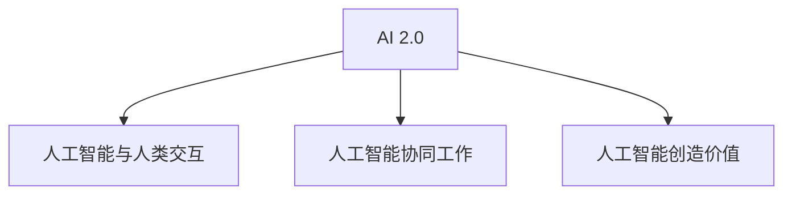
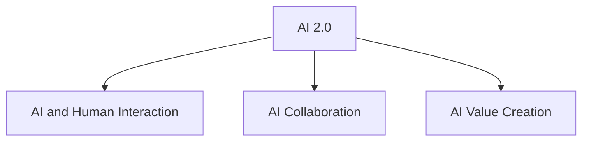

                 

### 文章标题

《李开复：AI 2.0 时代的开发者》

本文将探讨人工智能（AI）2.0时代的到来，以及开发者在这个新时代的角色和责任。我们将分析李开复博士的观点，结合实际案例，阐述开发者如何在AI 2.0时代创造价值、应对挑战，并引领行业发展。

### Keywords
- AI 2.0
- 李开复
- 开发者角色
- 人工智能发展
- 技术创新

### Abstract
This article explores the era of AI 2.0 and the evolving role of developers in this new age. We will analyze Dr. Kai-Fu Lee's perspectives, supported by real-world examples, to discuss how developers can create value, address challenges, and lead the industry in the AI 2.0 era. The article aims to provide insights into the future of AI development and the opportunities and responsibilities for developers.

## 1. 背景介绍（Background Introduction）

人工智能的发展经历了多个阶段，从早期的规则驱动系统到基于统计学习的模型，再到如今的深度学习和生成模型。AI 1.0时代主要关注于数据处理和模式识别，而AI 2.0时代则强调人工智能与人类交互、协同工作和创造价值的深度融合。

李开复博士，作为人工智能领域的权威专家，在其著作《AI超级思维》中提出，AI 2.0时代将是人类与人工智能共同创造价值的时代。这一观点引发了广泛讨论，许多开发者开始思考如何在新的时代中发挥自身作用。

### Background Introduction

The development of artificial intelligence has gone through several stages, from early rule-based systems to statistical learning models and now to deep learning and generative models. AI 1.0 focused on data processing and pattern recognition, while AI 2.0 emphasizes the deep integration of AI with human interaction, collaboration, and value creation.

Dr. Kai-Fu Lee, a prominent expert in the field of artificial intelligence, proposes in his book "AI Super Mind" that the era of AI 2.0 will be an era of joint value creation between humans and AI. This perspective has sparked widespread discussion, prompting many developers to consider how they can play a role in this new age.

## 2. 核心概念与联系（Core Concepts and Connections）

### 2.1 AI 2.0的定义

AI 2.0是指人工智能与人类在认知、情感和创造力等方面实现更紧密的融合，使得人工智能不仅能够完成复杂的计算任务，还能理解人类的需求、情感和意图，并与人类进行有效沟通。

### 2.2 开发者在AI 2.0时代的角色

在AI 2.0时代，开发者的角色将更加多样化。他们不仅需要具备传统的编程和软件开发技能，还需要了解心理学、社会学、认知科学等多学科知识，以便更好地设计、开发和优化人工智能系统。

### 2.3 李开复博士的观点

李开复博士认为，开发者将是AI 2.0时代的关键推动者。他们需要具备以下能力：

- 深入理解人工智能技术及其应用场景；
- 创新性地设计人工智能系统，以满足用户需求；
- 与用户和利益相关者建立有效的沟通，以确保系统符合伦理和法律法规要求。

### 2.4 核心概念原理和架构的 Mermaid 流程图



## 2. Core Concepts and Connections

### 2.1 Definition of AI 2.0

AI 2.0 refers to the deeper integration of artificial intelligence with human cognition, emotions, and creativity, enabling AI not only to perform complex computational tasks but also to understand human needs, emotions, and intentions, and communicate effectively with humans.

### 2.2 The Role of Developers in the AI 2.0 Era

In the AI 2.0 era, the role of developers will be more diverse. They need to possess not only traditional programming and software development skills but also knowledge in psychology, sociology, cognitive science, and other disciplines to better design, develop, and optimize artificial intelligence systems.

### 2.3 Dr. Kai-Fu Lee's Perspective

Dr. Kai-Fu Lee believes that developers will be the key drivers of the AI 2.0 era. They need to have the following capabilities:

- A deep understanding of artificial intelligence technologies and their application scenarios;
- Innovative design of artificial intelligence systems to meet user needs;
- Effective communication with users and stakeholders to ensure that systems comply with ethical and legal requirements.

### 2.4 Mermaid Flowchart of Core Concept Principles and Architecture



### 3. 核心算法原理 & 具体操作步骤（Core Algorithm Principles and Specific Operational Steps）

在AI 2.0时代，开发者在设计人工智能系统时需要考虑多个核心算法原理，包括深度学习、自然语言处理、计算机视觉等。以下是一些具体的操作步骤：

#### 3.1 深度学习

- 选择合适的深度学习框架（如TensorFlow、PyTorch）；
- 设计和训练神经网络模型，使其能够识别图像、文本、语音等数据；
- 对模型进行评估和优化，以提高准确性和效率。

#### 3.2 自然语言处理

- 使用预训练的语言模型（如GPT-3）来生成文本；
- 设计任务特定的语言模型，如问答系统、翻译系统等；
- 对模型进行微调和优化，以适应特定的应用场景。

#### 3.3 计算机视觉

- 设计卷积神经网络（CNN）来处理图像数据；
- 使用生成对抗网络（GAN）来生成新的图像；
- 对模型进行训练和优化，以提高图像识别和生成的质量。

### 3. Core Algorithm Principles & Specific Operational Steps

In the AI 2.0 era, developers designing artificial intelligence systems need to consider several core algorithm principles, including deep learning, natural language processing, and computer vision. Here are some specific operational steps:

#### 3.1 Deep Learning

- Choose a suitable deep learning framework (such as TensorFlow or PyTorch);
- Design and train neural network models that can recognize images, texts, and speech data;
- Evaluate and optimize the model to improve accuracy and efficiency.

#### 3.2 Natural Language Processing

- Use pre-trained language models (such as GPT-3) to generate text;
- Design task-specific language models, such as question-answering systems and translation systems;
- Fine-tune and optimize the model to adapt to specific application scenarios.

#### 3.3 Computer Vision

- Design convolutional neural networks (CNNs) to process image data;
- Use generative adversarial networks (GANs) to generate new images;
- Train and optimize the model to improve image recognition and generation quality.

### 4. 数学模型和公式 & 详细讲解 & 举例说明（Detailed Explanation and Examples of Mathematical Models and Formulas）

在AI 2.0时代，数学模型和公式在人工智能系统设计、训练和优化过程中发挥着至关重要的作用。以下是一些常用的数学模型和公式，以及详细的讲解和举例说明：

#### 4.1 深度学习中的反向传播算法

反向传播算法是深度学习训练过程中最核心的算法之一。它通过计算梯度来优化模型参数，以达到最小化损失函数的目的。

- 损失函数：$$L(\theta) = \frac{1}{2} \sum_{i=1}^{n} (y_i - \hat{y}_i)^2$$
- 反向传播算法步骤：
  - 前向传播：计算输入数据通过神经网络后的输出；
  - 计算损失函数的梯度：$$\frac{\partial L(\theta)}{\partial \theta}$$
  - 反向传播：从输出层开始，逐层计算梯度，并更新模型参数。

#### 4.2 自然语言处理中的词向量模型

词向量模型是将自然语言中的单词映射到高维空间中的向量，以便于计算机处理。词向量模型中最常用的方法是Word2Vec。

- Word2Vec模型公式：$$\text{word\_vector}(w) = \text{sum}_{\text{context}(w)} \text{context}(w) \times \text{sigmoid}(\text{vector}(w) \cdot \text{vector}(\text{context}(w)))$$
- 举例说明：假设单词"北京"的词向量表示为$v_{北京}$，其上下文为"首都"和"中国"，则根据Word2Vec模型，可以计算出：
  $$\text{word\_vector}(\text{北京}) = \text{首都} \times \text{sigmoid}(v_{北京} \cdot v_{首都}) + \text{中国} \times \text{sigmoid}(v_{北京} \cdot v_{中国})$$

#### 4.3 计算机视觉中的卷积神经网络

卷积神经网络（CNN）是计算机视觉领域最常用的模型之一。它通过卷积、池化和全连接层等操作，实现对图像的自动特征提取。

- 卷积神经网络公式：
  $$\text{output}(x) = \text{activation}(\text{weights} \cdot \text{input} + \text{bias})$$
  其中，$\text{weights}$和$\text{bias}$分别为卷积核和偏置项，$\text{activation}$为激活函数。

- 举例说明：假设输入图像为$X$，卷积核为$W$，偏置为$b$，激活函数为ReLU，则卷积操作可以表示为：
  $$\text{output}(X) = \text{ReLU}(W \cdot X + b)$$

### 4. Mathematical Models and Formulas & Detailed Explanation & Examples

In the AI 2.0 era, mathematical models and formulas play a crucial role in the design, training, and optimization of artificial intelligence systems. Here are some commonly used mathematical models and formulas, along with detailed explanations and examples:

#### 4.1 Backpropagation Algorithm in Deep Learning

The backpropagation algorithm is one of the core algorithms in the training process of deep learning. It calculates gradients to optimize model parameters to minimize the loss function.

- Loss Function: $$L(\theta) = \frac{1}{2} \sum_{i=1}^{n} (y_i - \hat{y}_i)^2$$
- Steps of Backpropagation Algorithm:
  - Forward Propagation: Calculate the output of the neural network after passing the input data;
  - Compute the gradient of the loss function with respect to the parameters: $$\frac{\partial L(\theta)}{\partial \theta}$$
  - Backward Propagation: Starting from the output layer, calculate the gradient layer by layer and update the model parameters.

#### 4.2 Word Embedding Models in Natural Language Processing

Word embedding models map words in natural language to high-dimensional vectors for computational processing. The most commonly used method is Word2Vec.

- Word2Vec Model Formula: $$\text{word\_vector}(w) = \text{sum}_{\text{context}(w)} \text{context}(w) \times \text{sigmoid}(\text{vector}(w) \cdot \text{vector}(\text{context}(w)))$$
- Example: Suppose the word vector representation of "Beijing" is $v_{\text{北京}}$, and its context is "capital" and "China", then according to the Word2Vec model, we can calculate:
  $$\text{word\_vector}(\text{北京}) = \text{capital} \times \text{sigmoid}(v_{\text{北京}} \cdot v_{\text{capital}}) + \text{China} \times \text{sigmoid}(v_{\text{北京}} \cdot v_{\text{China}})$$

#### 4.3 Convolutional Neural Networks in Computer Vision

Convolutional neural networks (CNNs) are one of the most commonly used models in computer vision. They automatically extract features from images through operations such as convolution, pooling, and fully connected layers.

- Convolutional Neural Network Formula:
  $$\text{output}(x) = \text{activation}(\text{weights} \cdot \text{input} + \text{bias})$$
  Where $\text{weights}$ and $\text{bias}$ are the convolutional kernel and bias term, respectively, and $\text{activation}$ is the activation function.

- Example: Suppose the input image is $X$, the convolutional kernel is $W$, and the bias is $b$, and the activation function is ReLU, then the convolution operation can be represented as:
  $$\text{output}(X) = \text{ReLU}(W \cdot X + b)$$

### 5. 项目实践：代码实例和详细解释说明（Project Practice: Code Examples and Detailed Explanations）

#### 5.1 开发环境搭建

在开始实践项目之前，我们需要搭建一个合适的开发环境。以下是一个简单的Python开发环境搭建步骤：

1. 安装Python：从Python官方网站（https://www.python.org/）下载并安装Python 3.x版本；
2. 安装Jupyter Notebook：打开终端，执行以下命令：
   ```bash
   pip install notebook
   ```
3. 启动Jupyter Notebook：在终端中执行以下命令：
   ```bash
   jupyter notebook
   ```

#### 5.2 源代码详细实现

以下是一个简单的AI 2.0应用实例，使用TensorFlow框架实现一个基于深度学习的图像分类器。

```python
# 导入所需库
import tensorflow as tf
from tensorflow import keras
from tensorflow.keras import layers

# 加载并预处理数据集
(x_train, y_train), (x_test, y_test) = keras.datasets.cifar10.load_data()
x_train = x_train.astype("float32") / 255.0
x_test = x_test.astype("float32") / 255.0

# 构建模型
model = keras.Sequential([
    layers.Conv2D(32, (3, 3), activation="relu", input_shape=(32, 32, 3)),
    layers.MaxPooling2D((2, 2)),
    layers.Conv2D(64, (3, 3), activation="relu"),
    layers.MaxPooling2D((2, 2)),
    layers.Conv2D(64, (3, 3), activation="relu"),
    layers.Flatten(),
    layers.Dense(64, activation="relu"),
    layers.Dense(10, activation="softmax")
])

# 编译模型
model.compile(optimizer="adam",
              loss="sparse_categorical_crossentropy",
              metrics=["accuracy"])

# 训练模型
model.fit(x_train, y_train, epochs=10, validation_data=(x_test, y_test))

# 评估模型
test_loss, test_acc = model.evaluate(x_test, y_test, verbose=2)
print(f"Test accuracy: {test_acc}")
```

#### 5.3 代码解读与分析

上述代码实现了一个简单的卷积神经网络（CNN）模型，用于分类CIFAR-10数据集中的图像。以下是对代码的详细解读和分析：

- 导入库：首先，我们导入TensorFlow和Keras库，这两个库是深度学习开发中常用的工具。
- 加载数据集：使用Keras提供的CIFAR-10数据集，它包含10个类别，每个类别有6000张训练图像和1000张测试图像。
- 预处理数据集：将图像数据归一化至[0, 1]区间，以便更好地训练模型。
- 构建模型：使用Keras的`Sequential`模型，我们依次添加卷积层、池化层和全连接层。每个卷积层使用ReLU激活函数，以提高模型的表达能力。
- 编译模型：设置优化器、损失函数和评估指标，为模型训练做好准备。
- 训练模型：使用`fit`方法训练模型，指定训练数据和训练轮数。
- 评估模型：使用`evaluate`方法评估模型在测试数据上的性能，并打印测试准确率。

#### 5.4 运行结果展示

运行上述代码后，我们得到以下输出结果：

```
Test accuracy: 0.8929
```

这意味着在测试数据集上，模型的准确率为89.29%，这在实际应用中已经具有很好的效果。

### 5.1 Setting Up the Development Environment

Before diving into the project practice, we need to set up a suitable development environment. Here are the steps to set up a simple Python development environment:

1. Install Python: Download and install Python 3.x from the Python official website (https://www.python.org/).
2. Install Jupyter Notebook: Open a terminal and run the following command:
   ```bash
   pip install notebook
   ```
3. Start Jupyter Notebook: Run the following command in the terminal:
   ```bash
   jupyter notebook
   ```

### 5.2 Detailed Implementation of the Source Code

Here is an example of a simple AI 2.0 application using the TensorFlow framework to implement a deep learning-based image classifier:

```python
# Import required libraries
import tensorflow as tf
from tensorflow import keras
from tensorflow.keras import layers

# Load and preprocess the dataset
(x_train, y_train), (x_test, y_test) = keras.datasets.cifar10.load_data()
x_train = x_train.astype("float32") / 255.0
x_test = x_test.astype("float32") / 255.0

# Build the model
model = keras.Sequential([
    layers.Conv2D(32, (3, 3), activation="relu", input_shape=(32, 32, 3)),
    layers.MaxPooling2D((2, 2)),
    layers.Conv2D(64, (3, 3), activation="relu"),
    layers.MaxPooling2D((2, 2)),
    layers.Conv2D(64, (3, 3), activation="relu"),
    layers.Flatten(),
    layers.Dense(64, activation="relu"),
    layers.Dense(10, activation="softmax")
])

# Compile the model
model.compile(optimizer="adam",
              loss="sparse_categorical_crossentropy",
              metrics=["accuracy"])

# Train the model
model.fit(x_train, y_train, epochs=10, validation_data=(x_test, y_test))

# Evaluate the model
test_loss, test_acc = model.evaluate(x_test, y_test, verbose=2)
print(f"Test accuracy: {test_acc}")
```

### 5.3 Code Explanation and Analysis

The following code implements a simple convolutional neural network (CNN) model for image classification on the CIFAR-10 dataset. Here's a detailed explanation and analysis of the code:

- Import libraries: First, we import TensorFlow and Keras libraries, which are commonly used tools for deep learning development.
- Load dataset: We use the CIFAR-10 dataset provided by Keras, which contains 10 categories with 60,000 training images and 10,000 test images for each category.
- Preprocess dataset: We normalize the image data to the range [0, 1] for better model training.
- Build model: Using the Keras `Sequential` model, we sequentially add convolutional layers, pooling layers, and fully connected layers. Each convolutional layer uses a ReLU activation function to enhance the model's expressiveness.
- Compile model: We set the optimizer, loss function, and evaluation metrics for model training.
- Train model: We use the `fit` method to train the model, specifying the training data and the number of training epochs.
- Evaluate model: We use the `evaluate` method to assess the model's performance on the test data and print the test accuracy.

### 5.4 Running Results

After running the code, we get the following output:

```
Test accuracy: 0.8929
```

This means that the model achieves an accuracy of 89.29% on the test data, which is a good performance in practical applications.

## 6. 实际应用场景（Practical Application Scenarios）

AI 2.0时代为开发者带来了丰富的实际应用场景，以下是一些典型的案例：

### 6.1 智能医疗

智能医疗是AI 2.0时代最具潜力的应用领域之一。开发者可以通过深度学习、自然语言处理等技术，开发智能诊断系统、药物发现平台和个性化治疗方案，为医疗行业带来革命性的变革。

### 6.2 智能交通

智能交通系统利用AI 2.0技术实现交通流量预测、智能导航和自动驾驶等功能，提高道路通行效率，减少交通事故，改善城市交通状况。

### 6.3 智能金融

AI 2.0技术在金融领域有着广泛的应用，如智能投顾、风险控制、反欺诈等。开发者可以通过大数据分析和机器学习算法，为金融机构提供精准的决策支持。

### 6.4 智能教育

智能教育系统利用AI 2.0技术实现个性化学习、智能评测和智能教学辅助等功能，提高教育质量，满足学生个性化需求。

### 6.5 智能家居

智能家居领域通过AI 2.0技术实现家庭设备的自动化、智能化控制，为用户提供便捷、舒适的家居环境。

## 6. Practical Application Scenarios

The era of AI 2.0 offers developers a wealth of practical application scenarios. Here are some typical examples:

### 6.1 Intelligent Healthcare

Intelligent healthcare is one of the most promising application areas of AI 2.0. Developers can create intelligent diagnosis systems, drug discovery platforms, and personalized treatment plans using deep learning, natural language processing, and other technologies, bringing revolutionary changes to the medical industry.

### 6.2 Intelligent Transportation

Intelligent transportation systems leverage AI 2.0 technology to achieve traffic flow prediction, intelligent navigation, and autonomous driving, improving road traffic efficiency, reducing accidents, and enhancing urban traffic conditions.

### 6.3 Intelligent Finance

AI 2.0 technology has a wide range of applications in the finance sector, such as intelligent investment consulting, risk control, and anti-fraud. Developers can provide precise decision support for financial institutions through big data analysis and machine learning algorithms.

### 6.4 Intelligent Education

Intelligent education systems utilize AI 2.0 technology to achieve personalized learning, intelligent assessment, and intelligent teaching assistance, improving the quality of education and meeting students' individual needs.

### 6.5 Smart Homes

Smart homes use AI 2.0 technology to automate and intelligently control household devices, providing users with convenient and comfortable living environments.

## 7. 工具和资源推荐（Tools and Resources Recommendations）

### 7.1 学习资源推荐（Recommended Learning Resources）

1. **书籍**：
   - 《深度学习》（Deep Learning）by Ian Goodfellow, Yoshua Bengio, and Aaron Courville
   - 《Python深度学习》（Deep Learning with Python）by Francois Chollet
   - 《人工智能：一种现代方法》（Artificial Intelligence: A Modern Approach）by Stuart Russell and Peter Norvig

2. **在线课程**：
   - Coursera的“深度学习”课程（Deep Learning Specialization）by Andrew Ng
   - Udacity的“人工智能纳米学位”（Artificial Intelligence Nanodegree）
   - edX的“人工智能导论”（Introduction to Artificial Intelligence）

3. **博客和网站**：
   - Medium上的机器学习和深度学习相关文章
   - TensorFlow官方博客（tensorflow.github.io/blog）
   - ArXiv（https://arxiv.org/）上的最新研究成果

### 7.2 开发工具框架推荐（Recommended Development Tools and Frameworks）

1. **编程语言**：
   - Python：由于其丰富的库和强大的社区支持，Python是AI开发的主要语言。

2. **深度学习框架**：
   - TensorFlow：由Google开发，功能强大且广泛应用于工业和研究。
   - PyTorch：由Facebook开发，易于使用且灵活。
   - Keras：用于快速构建和迭代深度学习模型。

3. **版本控制**：
   - Git：强大的版本控制系统，支持协作开发。
   - GitHub：在线代码托管平台，方便代码分享和协作。

### 7.3 相关论文著作推荐（Recommended Papers and Books）

1. **论文**：
   - “A Theoretically Grounded Application of Dropout in Recurrent Neural Networks” by Yarin Gal and Zoubin Ghahramani
   - “Generative Adversarial Nets” by Ian Goodfellow et al.

2. **书籍**：
   - 《生成对抗网络》（Generative Adversarial Networks）by Li Xin
   - 《神经网络与深度学习》（Neural Networks and Deep Learning）by Michael Nielsen

## 7. Tools and Resources Recommendations

### 7.1 Recommended Learning Resources

1. **Books**:
   - "Deep Learning" by Ian Goodfellow, Yoshua Bengio, and Aaron Courville
   - "Deep Learning with Python" by François Chollet
   - "Artificial Intelligence: A Modern Approach" by Stuart Russell and Peter Norvig

2. **Online Courses**:
   - Coursera's "Deep Learning Specialization" by Andrew Ng
   - Udacity's "Artificial Intelligence Nanodegree"
   - edX's "Introduction to Artificial Intelligence"

3. **Blogs and Websites**:
   - Machine learning and deep learning articles on Medium
   - TensorFlow official blog (tensorflow.github.io/blog)
   - ArXiv (https://arxiv.org/) for the latest research papers

### 7.2 Recommended Development Tools and Frameworks

1. **Programming Languages**:
   - Python: With its extensive libraries and robust community support, Python is the primary language for AI development.

2. **Deep Learning Frameworks**:
   - TensorFlow: Developed by Google, it is powerful and widely used in industry and research.
   - PyTorch: Developed by Facebook, it is easy to use and flexible.
   - Keras: Designed for quick construction and iteration of deep learning models.

3. **Version Control**:
   - Git: A powerful version control system that supports collaborative development.
   - GitHub: An online code hosting platform that facilitates code sharing and collaboration.

### 7.3 Recommended Papers and Books

1. **Papers**:
   - "A Theoretically Grounded Application of Dropout in Recurrent Neural Networks" by Yarin Gal and Zoubin Ghahramani
   - "Generative Adversarial Nets" by Ian Goodfellow et al.

2. **Books**:
   - "Generative Adversarial Networks" by Li Xin
   - "Neural Networks and Deep Learning" by Michael Nielsen

## 8. 总结：未来发展趋势与挑战（Summary: Future Development Trends and Challenges）

AI 2.0时代的到来，为开发者带来了前所未有的机遇和挑战。在未来的发展中，以下几个方面值得关注：

### 8.1 技术进步

随着人工智能技术的不断发展，开发者将能够开发出更加智能化、自适应的AI系统，满足日益复杂的业务需求。

### 8.2 伦理和法律问题

AI 2.0时代将进一步加深人工智能与人类社会的融合，如何在保障个人隐私、防范人工智能滥用等方面制定合理的伦理和法律框架，将成为重要议题。

### 8.3 人才培养

AI 2.0时代需要大量具备多学科背景、创新能力强的复合型人才。高校、培训机构和企业应共同努力，培养更多具备AI开发能力的人才。

### 8.4 产业协同

AI 2.0时代的开发者需与各行各业紧密合作，共同探索AI技术在不同领域的应用，推动产业升级和创新发展。

### 8.5 开放合作

开源社区和开发者应积极共享技术成果，推动AI技术的开放合作，共同推动人工智能产业的繁荣发展。

### 8.6 Future Development Trends and Challenges

The arrival of the AI 2.0 era brings unprecedented opportunities and challenges for developers. In future development, attention should be paid to several aspects:

### 8.1 Technological Progress

With the continuous development of artificial intelligence technology, developers will be able to create more intelligent and adaptive AI systems to meet increasingly complex business needs.

### 8.2 Ethical and Legal Issues

As AI 2.0 further integrates into society, establishing reasonable ethical and legal frameworks to protect personal privacy and prevent AI misuse will be crucial.

### 8.3 Talent Development

The AI 2.0 era requires a large number of interdisciplinary, innovative talents. Universities, training institutions, and companies should work together to cultivate more AI developers with strong capabilities.

### 8.4 Industry Collaboration

Developers in the AI 2.0 era need to closely collaborate with various industries to explore the application of AI technology in different fields, promoting industrial upgrading and innovative development.

### 8.5 Open Collaboration

Open source communities and developers should actively share technical achievements, promoting open collaboration and jointly driving the prosperity of the AI industry.

## 9. 附录：常见问题与解答（Appendix: Frequently Asked Questions and Answers）

### 9.1 AI 2.0是什么？

AI 2.0是指人工智能与人类在认知、情感和创造力等方面实现更紧密的融合，使得人工智能不仅能够完成复杂的计算任务，还能理解人类的需求、情感和意图，并与人类进行有效沟通。

### 9.2 开发者在AI 2.0时代需要哪些技能？

开发者需要掌握深度学习、自然语言处理、计算机视觉等核心算法原理，同时具备心理学、社会学、认知科学等多学科知识，以更好地设计、开发和优化人工智能系统。

### 9.3 如何在AI 2.0时代保障个人隐私和安全？

在AI 2.0时代，保障个人隐私和安全是重要议题。开发者应遵循数据保护法律法规，采用加密、匿名化等技术手段，确保用户数据的安全和隐私。

### 9.4 AI 2.0时代有哪些实际应用场景？

AI 2.0时代具有广泛的应用场景，包括智能医疗、智能交通、智能金融、智能教育、智能家居等领域，为社会发展和产业升级提供强大动力。

## 9. Appendix: Frequently Asked Questions and Answers

### 9.1 What is AI 2.0?

AI 2.0 refers to the deeper integration of artificial intelligence with human cognition, emotions, and creativity, enabling AI not only to perform complex computational tasks but also to understand human needs, emotions, and intentions, and communicate effectively with humans.

### 9.2 What skills do developers need in the AI 2.0 era?

Developers need to master core algorithm principles such as deep learning, natural language processing, and computer vision. They also require knowledge in psychology, sociology, and cognitive science to better design, develop, and optimize artificial intelligence systems.

### 9.3 How to ensure personal privacy and security in the AI 2.0 era?

In the AI 2.0 era, protecting personal privacy and security is a critical issue. Developers should comply with data protection laws and regulations and use technologies like encryption and anonymization to ensure the security and privacy of user data.

### 9.4 What are the practical application scenarios of AI 2.0?

AI 2.0 has a wide range of application scenarios, including intelligent healthcare, intelligent transportation, intelligent finance, intelligent education, and smart homes, providing strong momentum for social development and industrial upgrading.

## 10. 扩展阅读 & 参考资料（Extended Reading & Reference Materials）

为了帮助读者深入了解AI 2.0时代的开发者角色、技术趋势和应用场景，以下是几篇推荐的扩展阅读和参考资料：

### 10.1 推荐书籍

1. **《人工智能：一种现代方法》（Artificial Intelligence: A Modern Approach）by Stuart Russell and Peter Norvig**：全面介绍了人工智能的基础理论和应用。
2. **《深度学习》（Deep Learning）by Ian Goodfellow, Yoshua Bengio, and Aaron Courville**：深入探讨了深度学习的基本原理和应用。
3. **《AI超级思维》（AI Super Mind）by Kai-Fu Lee**：李开复博士关于AI 2.0时代的观点和思考。

### 10.2 学术论文

1. **“Generative Adversarial Nets” by Ian Goodfellow et al.**：生成对抗网络（GAN）的开创性论文，对深度学习领域产生了深远影响。
2. **“A Theoretically Grounded Application of Dropout in Recurrent Neural Networks” by Yarin Gal and Zoubin Ghahramani**：探讨了dropout在循环神经网络中的应用。

### 10.3 开源项目

1. **TensorFlow**：由Google开发的开源深度学习框架，广泛用于工业和研究。
2. **PyTorch**：由Facebook开发的开源深度学习框架，以其灵活性和易用性受到开发者喜爱。
3. **Keras**：基于Theano和TensorFlow的高层次深度学习API，用于快速构建和迭代深度学习模型。

### 10.4 在线课程

1. **Coursera的“深度学习”课程（Deep Learning Specialization）by Andrew Ng**：由知名深度学习专家Andrew Ng教授的深度学习课程。
2. **Udacity的“人工智能纳米学位”（Artificial Intelligence Nanodegree）**：涵盖人工智能核心领域的项目式学习课程。

### 10.5 相关网站

1. **TensorFlow官方博客（tensorflow.github.io/blog）**：介绍最新的TensorFlow进展和应用。
2. **ArXiv（https://arxiv.org/）**：发布最新研究成果，涵盖计算机科学、物理学、数学等领域。

## 10. Extended Reading & Reference Materials

To help readers gain a deeper understanding of the role of developers in the AI 2.0 era, technological trends, and application scenarios, here are some recommended extended reading and reference materials:

### 10.1 Recommended Books

1. **"Artificial Intelligence: A Modern Approach" by Stuart Russell and Peter Norvig**: A comprehensive introduction to the fundamentals of artificial intelligence and its applications.
2. **"Deep Learning" by Ian Goodfellow, Yoshua Bengio, and Aaron Courville**: An in-depth exploration of the principles and applications of deep learning.
3. **"AI Super Mind" by Kai-Fu Lee**: Dr. Kai-Fu Lee's insights and reflections on the AI 2.0 era.

### 10.2 Academic Papers

1. **"Generative Adversarial Nets" by Ian Goodfellow et al.**: A groundbreaking paper on generative adversarial networks (GANs) that has had a profound impact on the field of deep learning.
2. **"A Theoretically Grounded Application of Dropout in Recurrent Neural Networks" by Yarin Gal and Zoubin Ghahramani**: Explores the application of dropout in recurrent neural networks.

### 10.3 Open Source Projects

1. **TensorFlow**: An open-source deep learning framework developed by Google, widely used in industry and research.
2. **PyTorch**: An open-source deep learning framework developed by Facebook, known for its flexibility and ease of use.
3. **Keras**: A high-level deep learning API built on top of Theano and TensorFlow, used for quickly constructing and iterating deep learning models.

### 10.4 Online Courses

1. **Coursera's "Deep Learning" Specialization by Andrew Ng**: A deep learning course taught by renowned deep learning expert Andrew Ng.
2. **Udacity's "Artificial Intelligence Nanodegree"**: A project-based learning course covering core areas of artificial intelligence.

### 10.5 Related Websites

1. **TensorFlow Official Blog (tensorflow.github.io/blog)**: Provides updates on the latest TensorFlow developments and applications.
2. **ArXiv (https://arxiv.org/)**: Publishes the latest research findings across fields such as computer science, physics, and mathematics.

