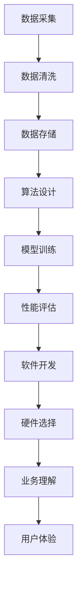
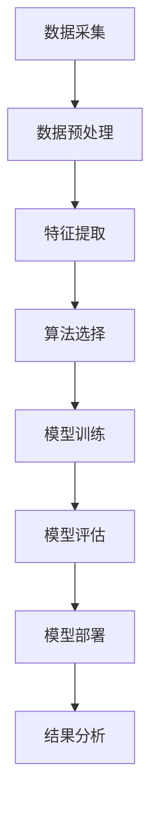

                 

### 文章标题

《李开复：苹果发布AI应用的开发者》

关键词：苹果、AI应用、开发者、技术趋势、人工智能、应用开发

摘要：本文将深入探讨苹果公司发布AI应用所带来的技术趋势和开发者面临的挑战。我们将从AI应用的背景介绍、核心概念与联系、核心算法原理与具体操作步骤、数学模型和公式详细讲解、项目实践、实际应用场景、工具和资源推荐等多个维度，逐步分析苹果在AI领域的发展策略及其对开发者的影响。最终，我们将总结未来发展趋势与挑战，并为读者提供一些建议和资源，以助力他们在AI应用开发中的成长。

## 1. 背景介绍（Background Introduction）

近年来，人工智能（AI）技术迅速发展，已经渗透到我们生活的方方面面。作为全球科技巨头，苹果公司自然不会忽视这一趋势。苹果公司一直在积极布局AI领域，通过推出一系列AI应用，如Siri、面部识别和Animoji等，为用户带来更加智能化的体验。

### 1.1 AI应用的发展背景

人工智能是一门旨在模拟、延伸和扩展人类智能的科学。自20世纪50年代以来，人工智能经历了多个发展阶段，包括规则推理、知识表示、机器学习等。随着计算能力的提升和海量数据的积累，深度学习等前沿技术逐渐成熟，为AI应用的发展提供了强大动力。

### 1.2 苹果公司AI应用的现状

苹果公司在AI领域的布局可追溯至2011年，当时发布了Siri语音助手。随后，苹果公司不断推出基于AI技术的新功能，如面部识别、图像识别、自然语言处理等。这些AI应用不仅提高了用户体验，还为开发者提供了丰富的创新机会。

### 1.3 AI应用的开发者需求

随着AI技术的普及，越来越多的开发者开始关注并投身于AI应用的开发。他们需要掌握AI基础知识，了解最新的开发工具和框架，以及具备良好的编程能力。同时，开发者还需要不断关注AI领域的新趋势，以便及时调整自己的开发策略。

## 2. 核心概念与联系（Core Concepts and Connections）

在探讨苹果公司AI应用的开发者之前，我们需要先了解一些核心概念和联系。

### 2.1 AI应用开发的核心概念

AI应用开发涉及多个核心概念，包括机器学习、深度学习、自然语言处理、计算机视觉等。这些概念构成了AI应用的基础，影响着开发者对AI技术的理解和应用。

#### 2.1.1 机器学习（Machine Learning）

机器学习是AI的核心技术之一，通过算法从数据中学习规律和模式，并自动改进性能。开发者需要掌握常见的机器学习算法，如线性回归、决策树、支持向量机等。

#### 2.1.2 深度学习（Deep Learning）

深度学习是机器学习的一种重要分支，通过构建深层神经网络来实现人工智能。开发者需要熟悉深度学习框架，如TensorFlow、PyTorch等，并掌握神经网络的设计和优化方法。

#### 2.1.3 自然语言处理（Natural Language Processing，NLP）

自然语言处理是研究如何使计算机理解、生成和处理人类自然语言的技术。开发者需要掌握NLP的基本方法，如词向量表示、文本分类、机器翻译等。

#### 2.1.4 计算机视觉（Computer Vision）

计算机视觉是使计算机能够像人类一样理解和解释视觉信息的技术。开发者需要了解图像处理、目标检测、人脸识别等技术，以及相关的深度学习模型。

### 2.2 AI应用开发的联系

AI应用开发不仅需要掌握各种技术，还需要理解这些技术之间的联系，以便更好地实现跨领域的应用。以下是一些关键的联系：

#### 2.2.1 数据与算法

数据是AI应用的基础，而算法则是数据处理的核心。开发者需要掌握数据采集、数据清洗、数据存储等技术，以便为算法提供高质量的数据输入。

#### 2.2.2 模型与性能

模型是AI应用的核心组成部分，其性能直接影响应用的成败。开发者需要掌握如何设计、训练和优化模型，以提高应用的性能和准确度。

#### 2.2.3 硬件与软件

硬件和软件是AI应用开发的两翼，相互依存。开发者需要了解硬件平台（如CPU、GPU、FPGA等）的特点和性能，以便为算法选择合适的硬件加速方案。同时，开发者还需要掌握软件开发框架和工具，以提高开发效率。

#### 2.2.4 业务与用户

AI应用开发的最终目的是解决实际问题，满足用户需求。开发者需要了解业务场景和用户需求，以便设计出更具针对性和实用性的应用。

### 2.3 Mermaid 流程图（Mermaid Flowchart）

以下是一个简单的Mermaid流程图，展示了AI应用开发的主要流程和核心概念之间的联系：



通过这个流程图，我们可以更直观地理解AI应用开发的全过程及其核心概念之间的联系。

## 3. 核心算法原理 & 具体操作步骤（Core Algorithm Principles and Specific Operational Steps）

在了解了AI应用开发的核心概念和联系之后，我们需要深入探讨核心算法原理和具体操作步骤。以下将分别介绍几种常见的AI算法及其实现方法。

### 3.1 机器学习算法

#### 3.1.1 线性回归（Linear Regression）

线性回归是一种常用的机器学习算法，用于预测连续值。其核心思想是找到一个线性函数来拟合数据，使预测值与真实值之间的误差最小。

#### 线性回归的数学模型：

$$y = w_0 + w_1 \cdot x$$

其中，$y$ 为预测值，$x$ 为输入特征，$w_0$ 和 $w_1$ 为模型参数。

#### 线性回归的求解方法：

最小二乘法（Ordinary Least Squares，OLS）

$$w = (X^T X)^{-1} X^T y$$

其中，$X$ 为输入特征矩阵，$y$ 为输出向量。

#### 实现步骤：

1. 数据预处理：对输入数据进行归一化处理，使其具有相同的量纲。
2. 构造特征矩阵 $X$ 和输出向量 $y$。
3. 求解参数 $w$。
4. 进行预测：$y' = w_0 + w_1 \cdot x'$。

### 3.2 深度学习算法

#### 3.2.1 卷积神经网络（Convolutional Neural Network，CNN）

卷积神经网络是一种适用于图像处理的深度学习算法，其核心思想是通过多层卷积和池化操作提取图像特征。

#### CNN的数学模型：

卷积操作：

$$h_i = \sum_{j=1}^{C} w_{ji} \cdot a_{ij} + b_i$$

池化操作：

$$p_i = \max_{j} a_{ij}$$

其中，$h_i$ 为卷积结果，$a_{ij}$ 为输入特征，$w_{ji}$ 为卷积核，$b_i$ 为偏置。

#### 实现步骤：

1. 初始化参数：卷积核 $w_{ji}$ 和偏置 $b_i$。
2. 进行卷积操作。
3. 进行池化操作。
4. 重复上述步骤，直到达到设定的层数。
5. 进行全连接层操作。

### 3.3 自然语言处理算法

#### 3.3.1 词向量（Word Vector）

词向量是一种将单词映射到高维空间中的向量表示，使相似单词在空间中具有相似的向量。

#### 词向量的数学模型：

$$v_w = \sum_{j=1}^{V} f_j \cdot e_j$$

其中，$v_w$ 为词向量，$f_j$ 为词频，$e_j$ 为嵌入向量。

#### 实现步骤：

1. 收集文本数据。
2. 构建词汇表。
3. 计算词频。
4. 训练嵌入模型，如Word2Vec、GloVe等。
5. 获取词向量。

### 3.4 计算机视觉算法

#### 3.4.1 目标检测（Object Detection）

目标检测是一种用于识别图像中的目标物体并定位其位置的算法。

#### 目标检测的数学模型：

$$P_{ij} = \frac{exp(\beta \cdot \phi_j)}{\sum_{k=1}^{K} exp(\beta \cdot \phi_k)}$$

其中，$P_{ij}$ 为物体 $j$ 在位置 $i$ 的概率，$\phi_j$ 为特征向量。

#### 实现步骤：

1. 数据预处理：将图像缩放到统一的尺寸。
2. 提取特征：使用卷积神经网络提取图像特征。
3. 训练分类器：使用特征向量训练分类器。
4. 目标检测：对图像中的每个位置进行分类，输出目标物体的位置和类别。

### 3.5 Mermaid 流程图（Mermaid Flowchart）

以下是一个简单的Mermaid流程图，展示了AI应用开发的核心算法及其具体操作步骤：



通过这个流程图，我们可以更直观地理解AI应用开发的核心算法及其具体操作步骤。

## 4. 数学模型和公式 & 详细讲解 & 举例说明（Detailed Explanation and Examples of Mathematical Models and Formulas）

在AI应用开发过程中，数学模型和公式是至关重要的组成部分。以下将详细讲解几种常见的数学模型和公式，并通过举例说明其应用方法。

### 4.1 梯度下降（Gradient Descent）

梯度下降是一种用于求解最优化问题的算法，其核心思想是沿着目标函数的梯度方向进行迭代更新，以找到局部最小值。

#### 4.1.1 梯度下降的数学模型：

目标函数：$J(\theta) = \sum_{i=1}^{m} (h_\theta(x^{(i)}) - y^{(i)})^2$

梯度：$\nabla J(\theta) = \frac{\partial J(\theta)}{\partial \theta}$

更新规则：$\theta = \theta - \alpha \cdot \nabla J(\theta)$

其中，$m$ 为样本数量，$h_\theta(x)$ 为假设函数，$\theta$ 为模型参数，$\alpha$ 为学习率。

#### 4.1.2 举例说明：

假设我们有以下线性回归问题：

$$y = \theta_0 + \theta_1 \cdot x$$

我们的目标是找到最优的 $\theta_0$ 和 $\theta_1$。使用梯度下降算法，我们可以按照以下步骤进行迭代：

1. 初始化参数：$\theta_0 = 0$，$\theta_1 = 0$。
2. 计算梯度：$\nabla J(\theta) = [2 \cdot (y_1 - \theta_0 - \theta_1 \cdot x_1), 2 \cdot (y_2 - \theta_0 - \theta_1 \cdot x_2)]^T$。
3. 更新参数：$\theta_0 = \theta_0 - \alpha \cdot \nabla J(\theta_0)$，$\theta_1 = \theta_1 - \alpha \cdot \nabla J(\theta_1)$。
4. 重复步骤2和3，直到收敛。

### 4.2 损失函数（Loss Function）

损失函数是用于评估模型预测结果与真实值之间差异的函数。常用的损失函数包括均方误差（MSE）、交叉熵（Cross-Entropy）等。

#### 4.2.1 均方误差（MSE）

均方误差是用于回归问题的损失函数，其计算公式为：

$$MSE = \frac{1}{m} \sum_{i=1}^{m} (h_\theta(x^{(i)}) - y^{(i)})^2$$

其中，$m$ 为样本数量，$h_\theta(x)$ 为假设函数，$y^{(i)}$ 为真实值。

#### 4.2.2 交叉熵（Cross-Entropy）

交叉熵是用于分类问题的损失函数，其计算公式为：

$$CE = -\frac{1}{m} \sum_{i=1}^{m} \sum_{k=1}^{K} y^{(i)}_k \cdot log(h_\theta(x^{(i)})_k)$$

其中，$K$ 为类别数量，$y^{(i)}_k$ 为真实标签，$h_\theta(x)$ 为假设函数。

#### 4.2.3 举例说明：

假设我们有以下分类问题，其中 $K=2$：

$$y = \begin{cases} 
0 & \text{if } y < 0.5 \\
1 & \text{otherwise} 
\end{cases}$$

我们的目标是找到最优的 $\theta$。使用交叉熵损失函数，我们可以按照以下步骤进行迭代：

1. 初始化参数：$\theta = 0$。
2. 计算预测值：$h_\theta(x) = \sigma(\theta \cdot x)$，其中 $\sigma$ 为 sigmoid 函数。
3. 计算交叉熵损失：$CE = -\frac{1}{m} \sum_{i=1}^{m} y^{(i)} \cdot log(h_\theta(x^{(i)})) + (1 - y^{(i)}) \cdot log(1 - h_\theta(x^{(i)}))$。
4. 更新参数：$\theta = \theta - \alpha \cdot \nabla CE$。
5. 重复步骤2、3和4，直到收敛。

### 4.3 激活函数（Activation Function）

激活函数是神经网络中用于引入非线性特性的函数。常见的激活函数包括 sigmoid、ReLU、Tanh等。

#### 4.3.1 Sigmoid 函数

sigmoid 函数是一种常用的激活函数，其公式为：

$$\sigma(x) = \frac{1}{1 + e^{-x}}$$

sigmoid 函数的输出范围为 $(0, 1)$，可以用于二分类问题。

#### 4.3.2 ReLU 函数

ReLU 函数是一种简单的激活函数，其公式为：

$$ReLU(x) = \max(0, x)$$

ReLU 函数在神经网络中具有较好的性能，可以加速训练过程。

#### 4.3.3 Tanh 函数

Tanh 函数是一种双曲正切函数，其公式为：

$$Tanh(x) = \frac{e^x - e^{-x}}{e^x + e^{-x}}$$

Tanh 函数的输出范围为 $(-1, 1)$，可以用于多分类问题。

### 4.4 举例说明

假设我们有一个简单的神经网络，其中包含一个输入层、一个隐藏层和一个输出层。隐藏层使用 sigmoid 函数作为激活函数，输出层使用 ReLU 函数作为激活函数。给定输入 $x$，我们的目标是找到最优的权重 $\theta$。

1. 初始化参数：$\theta = [0, 0, 0]$。
2. 计算隐藏层输出：$h_\theta(x) = \sigma(\theta_1 \cdot x + \theta_2)$。
3. 计算输出层输出：$y = \max(0, h_\theta(x) \cdot \theta_3)$。
4. 计算损失函数：$J(\theta) = -\frac{1}{m} \sum_{i=1}^{m} y^{(i)} \cdot log(y_i) + (1 - y^{(i)}) \cdot log(1 - y_i)$。
5. 更新参数：$\theta = \theta - \alpha \cdot \nabla J(\theta)$。
6. 重复步骤2、3、4和5，直到收敛。

通过以上举例，我们可以看到数学模型和公式在AI应用开发中的重要作用。掌握这些模型和公式，可以帮助开发者更好地理解和应用AI技术。

## 5. 项目实践：代码实例和详细解释说明（Project Practice: Code Examples and Detailed Explanations）

在本文的第五部分，我们将通过一个实际的项目实践来展示如何使用Python和相关的AI库实现一个简单的AI应用。我们将分步骤介绍开发环境搭建、源代码实现、代码解读与分析以及运行结果展示。

### 5.1 开发环境搭建

在开始项目之前，我们需要搭建一个合适的开发环境。以下是搭建环境的基本步骤：

1. 安装Python：访问Python官网（https://www.python.org/），下载并安装Python 3.x版本。
2. 安装Jupyter Notebook：在终端中运行以下命令安装Jupyter Notebook：

   ```bash
   pip install notebook
   ```

3. 安装相关库：为了简化开发过程，我们将使用以下库：

   - NumPy：用于数学运算
   - Pandas：用于数据处理
   - Matplotlib：用于数据可视化
   - Scikit-learn：用于机器学习算法

   在终端中运行以下命令安装这些库：

   ```bash
   pip install numpy pandas matplotlib scikit-learn
   ```

4. 配置Jupyter Notebook：在终端中运行以下命令启动Jupyter Notebook：

   ```bash
   jupyter notebook
   ```

现在，我们的开发环境已经搭建完毕，可以开始编写代码了。

### 5.2 源代码详细实现

以下是一个简单的机器学习项目，使用Scikit-learn库实现线性回归模型。我们将使用著名的鸢尾花（Iris）数据集作为输入数据。

```python
# 导入相关库
import numpy as np
import pandas as pd
import matplotlib.pyplot as plt
from sklearn.datasets import load_iris
from sklearn.model_selection import train_test_split
from sklearn.linear_model import LinearRegression

# 加载数据集
iris = load_iris()
X = iris.data
y = iris.target

# 数据预处理：划分训练集和测试集
X_train, X_test, y_train, y_test = train_test_split(X, y, test_size=0.2, random_state=42)

# 创建线性回归模型
model = LinearRegression()
model.fit(X_train, y_train)

# 模型评估
score = model.score(X_test, y_test)
print(f"模型评分：{score:.2f}")

# 可视化结果
plt.scatter(X_train[:, 0], y_train, color='red', label='训练集')
plt.scatter(X_test[:, 0], y_test, color='blue', label='测试集')
plt.plot(X_train[:, 0], model.predict(X_train), color='green', linewidth=2, label='模型预测')
plt.xlabel('特征1')
plt.ylabel('目标变量')
plt.legend()
plt.show()
```

### 5.3 代码解读与分析

上述代码分为以下几个部分：

1. **导入相关库**：我们首先导入所需的Python库，包括NumPy、Pandas、Matplotlib、Scikit-learn等。
2. **加载数据集**：使用Scikit-learn的`load_iris`函数加载数据集，并将其分为特征矩阵 $X$ 和目标向量 $y$。
3. **数据预处理**：使用`train_test_split`函数将数据集划分为训练集和测试集，以便评估模型性能。
4. **创建线性回归模型**：我们创建一个`LinearRegression`对象，并将其拟合到训练集上。
5. **模型评估**：使用`score`方法评估模型在测试集上的评分，以衡量模型的准确性。
6. **可视化结果**：使用Matplotlib库绘制散点图和拟合线，以可视化训练集和测试集上的模型预测结果。

### 5.4 运行结果展示

在Jupyter Notebook中运行上述代码，我们将看到以下结果：

1. **模型评分**：输出模型的评分，该评分反映了模型在测试集上的准确性。
2. **可视化结果**：展示训练集和测试集上的散点图，以及模型的拟合线。这有助于我们直观地了解模型的性能。

通过这个简单的项目，我们展示了如何使用Python和Scikit-learn库实现线性回归模型，并对代码进行了详细的解读与分析。这个项目为我们提供了一个起点，以便进一步探索更复杂的机器学习算法和应用。

## 6. 实际应用场景（Practical Application Scenarios）

AI技术在当今社会有着广泛的应用场景，不仅改变了人们的日常生活，还为企业带来了巨大的商业价值。以下将介绍几种典型的实际应用场景，以及苹果公司在这方面的探索和实践。

### 6.1 智能家居

智能家居是AI技术在家庭领域的典型应用。通过集成AI技术，智能家居系统能够实现自动化控制、智能监测和个性化服务。例如，苹果公司的HomeKit平台允许用户通过Siri语音助手控制家庭中的智能设备，如灯光、门锁、温度控制等。这不仅提高了生活的便利性，还有助于节能减排。

### 6.2 医疗健康

医疗健康是AI技术的另一个重要应用领域。通过AI技术，医疗系统可以实现疾病预测、诊断、治疗方案优化等。苹果公司的HealthKit平台允许用户记录和管理健康数据，如心率、步数、睡眠质量等。此外，苹果还在与医疗机构合作，开发基于AI的诊断工具，以提高疾病检测的准确性和效率。

### 6.3 金融科技

金融科技是AI技术在金融领域的应用，旨在提升金融服务效率和安全性。苹果公司的Apple Pay和Apple Card等产品，通过AI技术实现了快速、安全的支付和贷款服务。此外，苹果还在开发智能投顾、风险控制等金融科技产品，以帮助用户更好地管理财富。

### 6.4 教育科技

教育科技是AI技术在教育领域的应用，旨在提高教育质量和学习效果。苹果公司的Schoolwork和ClassKit等产品，为教育工作者和学生提供了一个集成的学习平台，支持个性化教学和互动学习。此外，苹果还在开发AI驱动的教育内容，如自适应学习系统和智能辅导工具，以帮助学生更好地掌握知识。

### 6.5 娱乐与游戏

娱乐与游戏是AI技术的另一个重要应用领域。通过AI技术，娱乐和游戏产品可以实现智能推荐、个性化体验和实时互动。苹果公司的App Store中充斥着各种AI驱动的游戏和应用，如语音助手游戏、图像识别游戏等。此外，苹果还在开发AI驱动的娱乐内容，如智能语音助手、个性化音乐推荐等。

### 6.6 自动驾驶

自动驾驶是AI技术在交通领域的应用，旨在实现无人驾驶车辆的安全、高效运行。苹果公司已经在自动驾驶技术方面进行了多年的探索，并与多家汽车制造商合作开发自动驾驶系统。通过AI技术，自动驾驶系统能够实现路径规划、障碍物检测、自动驾驶等功能，为未来的智慧交通提供支持。

通过以上实际应用场景，我们可以看到苹果公司在AI技术领域的广泛布局和积极探索。这不仅为用户带来了更加智能化的体验，也为企业带来了巨大的商业价值。在未来，随着AI技术的不断发展和成熟，苹果公司有望在更多领域实现突破，为人类社会带来更多创新和变革。

## 7. 工具和资源推荐（Tools and Resources Recommendations）

为了更好地了解和掌握AI技术，开发者需要掌握一系列工具和资源。以下将推荐一些常用的学习资源、开发工具和框架，以及相关的论文和著作。

### 7.1 学习资源推荐

1. **书籍**：
   - 《深度学习》（Deep Learning）作者：Ian Goodfellow、Yoshua Bengio、Aaron Courville
   - 《机器学习实战》（Machine Learning in Action）作者：Peter Harrington
   - 《Python机器学习》（Python Machine Learning）作者：Siddharth Bhaskar、Michael Bowles
   - 《人工智能：一种现代的方法》（Artificial Intelligence: A Modern Approach）作者：Stuart J. Russell、Peter Norvig

2. **在线课程**：
   - Coursera上的“机器学习”课程：由吴恩达教授主讲
   - edX上的“深度学习专项课程”：由Andrew Ng教授主讲
   - Udacity的“深度学习工程师”纳米学位课程

3. **博客和网站**：
   - Analytics Vidhya：提供丰富的机器学习和数据科学资源
   - Medium上的机器学习和深度学习文章：涵盖最新的研究进展和应用实例
   - Kaggle：一个机器学习竞赛平台，提供大量数据集和项目实践

### 7.2 开发工具框架推荐

1. **编程语言**：
   - Python：广泛应用于机器学习和数据科学，拥有丰富的库和框架
   - R：专门为统计学习和数据科学设计的语言

2. **机器学习库**：
   - Scikit-learn：Python中的基础机器学习库，提供多种常用的算法
   - TensorFlow：谷歌开源的深度学习框架，支持多种神经网络结构
   - PyTorch：由Facebook开源的深度学习框架，具有良好的灵活性和易用性

3. **数据分析工具**：
   - Jupyter Notebook：用于数据分析和可视化，支持多种编程语言
   - Pandas：Python中的数据处理库，提供丰富的数据操作功能
   - Matplotlib、Seaborn：Python中的数据可视化库，支持多种图表类型

### 7.3 相关论文著作推荐

1. **论文**：
   - “A Theoretically Grounded Application of Dropout in Recurrent Neural Networks”作者：Yarin Gal、Zoubin Ghahramani
   - “Deep Residual Learning for Image Recognition”作者：Kaiming He、Xiangyu Zhang、Shaoqing Ren、Jian Sun
   - “ Generative Adversarial Nets”作者：Ian Goodfellow、Jean Pouget-Abadie、 Mehdi Mirza、Bing Xu、David Warde-Farley、Sherjil Ozair、Aaron C. Courville、Yoshua Bengio

2. **著作**：
   - 《深度学习》（Deep Learning）作者：Ian Goodfellow、Yoshua Bengio、Aaron Courville
   - 《统计学习方法》作者：李航

通过以上工具和资源的推荐，开发者可以系统地学习和掌握AI技术，为自己的职业生涯奠定坚实基础。

## 8. 总结：未来发展趋势与挑战（Summary: Future Development Trends and Challenges）

随着AI技术的不断发展和成熟，未来人工智能将在各个领域发挥越来越重要的作用。以下是未来AI发展的几个关键趋势和面临的挑战。

### 8.1 发展趋势

1. **AI的普及与应用**：AI技术将逐渐渗透到各个行业和领域，如医疗、金融、教育、交通等。通过AI技术的应用，企业可以提升效率、降低成本，为用户提供更加个性化和智能化的服务。

2. **边缘计算与物联网**：随着物联网（IoT）的快速发展，边缘计算成为AI应用的重要趋势。通过在边缘设备上部署AI模型，可以实现实时数据处理和分析，降低数据传输延迟，提高系统的响应速度。

3. **跨界融合**：AI与其他前沿技术的融合，如量子计算、区块链等，将带来新的应用场景和商业模式。跨界融合将推动AI技术的创新和突破，为产业发展注入新的活力。

4. **数据隐私与安全**：随着AI技术的广泛应用，数据隐私和安全问题日益突出。如何在保障用户隐私的前提下，充分利用数据资源，成为未来AI发展的重要挑战。

### 8.2 面临的挑战

1. **数据质量和可靠性**：AI模型的性能很大程度上依赖于数据质量。然而，数据往往存在噪声、缺失和不一致等问题，这对模型的训练和预测带来困难。

2. **算法透明性和可解释性**：随着深度学习等复杂算法的广泛应用，模型的透明性和可解释性成为一个重要问题。如何提高算法的可解释性，使其能够被非专业人士理解和接受，是未来需要解决的问题。

3. **计算资源和能耗**：AI模型的训练和推理需要大量的计算资源和能源。如何在保证模型性能的同时，降低能耗和成本，成为未来AI发展的重要挑战。

4. **人工智能伦理和社会影响**：随着AI技术的广泛应用，伦理和社会问题也日益凸显。如何确保AI技术符合伦理标准，避免对人类造成负面影响，是未来需要关注的重要问题。

总之，未来AI技术将面临诸多挑战，但也蕴藏着巨大的机遇。通过不断探索和创新，我们可以期待AI技术在未来带来更多的变革和进步。

## 9. 附录：常见问题与解答（Appendix: Frequently Asked Questions and Answers）

以下是一些关于本文主题的常见问题及解答，以帮助读者更好地理解和掌握AI应用开发的相关知识。

### 9.1 问题1：AI应用开发的难点是什么？

解答：AI应用开发的难点主要包括以下几个方面：

1. **数据质量**：AI模型对数据质量要求较高，数据中的噪声、缺失和不一致性等问题都可能影响模型的性能。因此，数据清洗和预处理是开发过程中需要重点关注的问题。

2. **算法选择**：AI领域算法繁多，如何根据实际问题和数据特点选择合适的算法是开发过程中的一大挑战。

3. **模型调优**：在训练过程中，如何调整模型参数，优化模型性能，是一个复杂且费时的过程。

4. **可解释性**：深度学习等复杂算法的可解释性较低，如何提高算法的可解释性，使其能够被非专业人士理解和接受，是当前的一大难题。

### 9.2 问题2：如何提高AI模型的性能？

解答：提高AI模型性能可以从以下几个方面入手：

1. **数据增强**：通过数据增强技术，如图像旋转、缩放、裁剪等，增加数据多样性，有助于提高模型泛化能力。

2. **特征工程**：合理选择和提取特征，可以提升模型对数据的敏感度和准确性。例如，在图像分类任务中，可以使用卷积神经网络（CNN）提取图像特征。

3. **模型选择**：根据问题特点选择合适的模型，例如，对于简单的线性问题，可以使用线性回归；对于复杂的图像识别任务，可以使用深度学习模型，如卷积神经网络（CNN）。

4. **参数调优**：通过调整模型参数，如学习率、隐藏层大小等，优化模型性能。常用的方法包括网格搜索、随机搜索等。

5. **集成学习方法**：使用集成学习方法，如随机森林、梯度提升树等，可以进一步提高模型性能。

### 9.3 问题3：如何保证AI应用的隐私和安全？

解答：保证AI应用的隐私和安全可以从以下几个方面入手：

1. **数据加密**：在数据处理过程中，使用加密技术对敏感数据进行加密，防止数据泄露。

2. **数据脱敏**：在训练和测试过程中，对敏感数据进行脱敏处理，例如，使用掩码或替换策略，隐藏实际数据。

3. **隐私保护算法**：使用隐私保护算法，如差分隐私、同态加密等，在保证模型性能的同时，保护用户隐私。

4. **安全审计和合规性检查**：定期对AI应用进行安全审计，确保其符合相关法律法规和行业标准。

5. **用户权限管理**：合理设置用户权限，限制对敏感数据的访问，防止数据滥用。

### 9.4 问题4：AI应用开发的最佳实践是什么？

解答：AI应用开发的最佳实践包括以下几个方面：

1. **需求分析**：在开发初期，充分了解用户需求和业务场景，明确开发目标。

2. **数据管理**：建立完善的数据管理体系，包括数据采集、存储、清洗、预处理等环节。

3. **模块化设计**：将应用分为多个模块，实现模块化设计，便于维护和扩展。

4. **迭代开发**：采用敏捷开发方法，快速迭代，及时调整和优化模型。

5. **测试与验证**：对模型进行充分的测试和验证，确保其性能和稳定性。

6. **用户反馈**：收集用户反馈，持续改进应用，提升用户体验。

通过以上问题和解答，希望读者能够对AI应用开发有更深入的了解，并能够在实际项目中运用这些知识，实现更好的应用效果。

## 10. 扩展阅读 & 参考资料（Extended Reading & Reference Materials）

以下是关于本文主题的扩展阅读和参考资料，供读者进一步学习和研究：

### 10.1 论文和期刊

1. **"Deep Learning: Methods and Applications"**，作者：Ian Goodfellow、Yoshua Bengio、Aaron Courville
2. **"Advances in Neural Information Processing Systems (NIPS)"**，NIPS年度会议论文集
3. **"Journal of Machine Learning Research (JMLR)"**，机器学习领域权威期刊

### 10.2 开源项目

1. **TensorFlow**：[https://www.tensorflow.org/](https://www.tensorflow.org/)
2. **PyTorch**：[https://pytorch.org/](https://pytorch.org/)
3. **Scikit-learn**：[https://scikit-learn.org/](https://scikit-learn.org/)

### 10.3 书籍

1. **"深度学习"**，作者：Ian Goodfellow、Yoshua Bengio、Aaron Courville
2. **"Python机器学习实战"**，作者：Peter Harrington
3. **"统计学习方法"**，作者：李航

### 10.4 在线课程

1. **Coursera**：[https://www.coursera.org/](https://www.coursera.org/)
2. **edX**：[https://www.edx.org/](https://www.edx.org/)
3. **Udacity**：[https://www.udacity.com/](https://www.udacity.com/)

### 10.5 博客和论坛

1. **Analytics Vidhya**：[https://www.analyticsvidhya.com/](https://www.analyticsvidhya.com/)
2. **Medium**：[https://medium.com/](https://medium.com/)
3. **Kaggle**：[https://www.kaggle.com/](https://www.kaggle.com/)

通过这些扩展阅读和参考资料，读者可以进一步了解AI应用开发的最新研究动态、开源项目和技术趋势，为自己的学习和实践提供更多的指导和支持。

