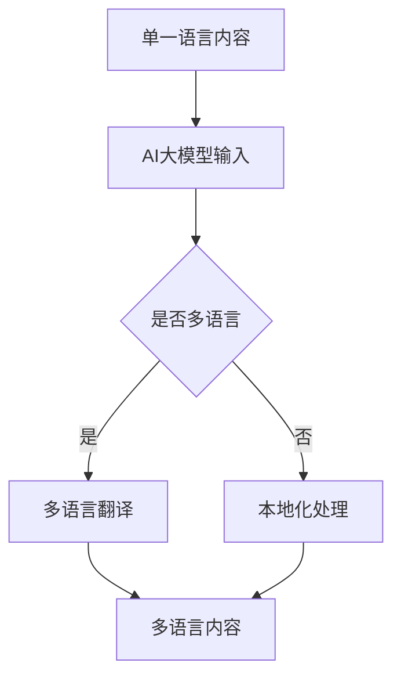

                 

# 文章标题

## 电商平台中的AI大模型：从单一语言到多语言实时翻译与本地化

关键词：电商平台，AI大模型，多语言实时翻译，本地化，自然语言处理

摘要：本文将深入探讨电商平台中引入人工智能大模型，实现从单一语言到多语言实时翻译与本地化的过程。通过分析AI大模型的核心概念、技术原理，以及具体应用场景，本文旨在为电商平台提供有效的解决方案，提升用户体验，扩大市场覆盖范围。

<|assistant|>## 1. 背景介绍（Background Introduction）

随着全球化的加速，电商平台正逐渐从单一语言运营模式转向多语言运营模式。然而，实现多语言实时翻译与本地化并非易事，这对电商平台的技术能力提出了更高的要求。AI大模型作为当今自然语言处理领域的重要技术，具有强大的语言理解与生成能力，为解决多语言问题提供了强有力的支持。

### 1.1 电商平台面临的挑战

1. **语言障碍**：对于非本地语言的用户，语言障碍成为一个显著的挑战，影响他们的购物体验和购买决策。
2. **本地化成本**：传统的方法往往需要雇佣专业的翻译团队进行内容本地化，成本高昂。
3. **响应速度**：对于实时互动和交易，延迟的翻译会影响用户体验和业务效率。

### 1.2 AI大模型的优势

1. **高效翻译**：AI大模型可以实时处理多语言翻译，大大提高响应速度。
2. **低成本**：通过自动化技术，减少了人力成本，提高了效率。
3. **高质量**：AI大模型具有学习能力和自适应能力，可以不断优化翻译质量。

<|assistant|>## 2. 核心概念与联系（Core Concepts and Connections）

### 2.1 AI大模型的概念

AI大模型（Large-scale AI Models）是指参数数量庞大的神经网络模型，通常具有数十亿个参数。这些模型通过对海量数据的学习，能够理解和生成复杂的自然语言文本。

### 2.2 多语言实时翻译的原理

多语言实时翻译依赖于机器翻译（Machine Translation，MT）技术。现代机器翻译系统主要基于神经机器翻译（Neural Machine Translation，NMT），通过训练大规模的神经网络模型来实现。

### 2.3 本地化的实现方法

本地化（Localization）是指将产品、服务或内容适应特定文化、语言和地域的过程。本地化通常涉及语言翻译、文化适配、格式调整等多个方面。

### 2.4 Mermaid 流程图

以下是一个简化的 Mermaid 流程图，展示从单一语言到多语言实时翻译与本地化的过程：



### 2.5 AI大模型与传统机器翻译的区别

与传统的基于规则和统计的机器翻译方法相比，AI大模型具有以下几个显著优势：

1. **更强的语言理解能力**：AI大模型通过深度学习能够更好地理解语言的上下文和语义。
2. **更高的翻译质量**：AI大模型通过大规模的数据训练，能够生成更自然、更准确的翻译结果。
3. **更灵活的应用场景**：AI大模型可以适应多种语言和复杂的翻译任务，而不仅仅是特定的语言对。

<|assistant|>## 3. 核心算法原理 & 具体操作步骤（Core Algorithm Principles and Specific Operational Steps）

### 3.1 AI大模型的训练过程

AI大模型的训练过程是一个复杂的迭代过程，主要分为以下几个步骤：

1. **数据准备**：收集大量的多语言文本数据，包括原始语言和目标语言。
2. **预处理**：对数据进行清洗、分词、词性标注等预处理步骤，以便模型能够更好地理解文本。
3. **模型构建**：使用深度学习框架构建神经网络模型，通常采用Transformer架构。
4. **模型训练**：通过反向传播算法和梯度下降优化模型参数，使得模型能够在多语言翻译任务上取得更好的性能。
5. **模型评估**：使用交叉验证和测试集对模型进行评估，调整模型参数以达到最佳性能。

### 3.2 多语言实时翻译的操作流程

1. **接收输入**：电商平台接收到用户输入的内容，该内容可以是文本或语音。
2. **预处理**：对输入内容进行分词、句法分析等预处理步骤，以便模型能够理解。
3. **翻译**：将预处理后的输入内容输入到AI大模型中，模型输出翻译结果。
4. **后处理**：对翻译结果进行格式调整、语义校验等后处理步骤，确保翻译的准确性和流畅性。
5. **展示结果**：将翻译后的内容展示给用户，可以是文本或语音。

### 3.3 本地化的实现步骤

1. **内容分析**：对电商平台的内容进行语言和文化的分析，确定需要本地化的部分。
2. **翻译**：使用AI大模型进行多语言翻译，生成翻译后的内容。
3. **文化适配**：对翻译后的内容进行文化适配，确保其符合目标市场的文化和语言习惯。
4. **格式调整**：根据目标市场的格式要求调整内容的格式，如日期、货币、度量单位等。
5. **审查与发布**：对本地化后的内容进行审查和测试，确保无误后发布。

<|assistant|>## 4. 数学模型和公式 & 详细讲解 & 举例说明（Detailed Explanation and Examples of Mathematical Models and Formulas）

### 4.1 自然语言处理中的数学模型

在自然语言处理（NLP）中，数学模型起着至关重要的作用。以下是一些常用的数学模型和公式：

#### 4.1.1  Transformer 模型

Transformer模型是AI大模型的核心架构，其基础是自注意力机制（Self-Attention）。自注意力机制可以通过以下公式表示：

$$
\text{Attention}(Q, K, V) = \text{softmax}\left(\frac{QK^T}{\sqrt{d_k}}\right) V
$$

其中，$Q, K, V$ 分别代表查询（Query）、键（Key）和值（Value）向量，$d_k$ 是键向量的维度。自注意力机制通过计算查询与键的相似性，加权求和得到输出值。

#### 4.1.2  交叉熵损失函数

在机器学习中，交叉熵损失函数（Cross-Entropy Loss）常用于分类问题，其公式如下：

$$
\text{Cross-Entropy Loss}(y, \hat{y}) = -\sum_{i} y_i \log(\hat{y}_i)
$$

其中，$y$ 是真实标签，$\hat{y}$ 是模型预测的概率分布。交叉熵损失函数衡量预测概率分布与真实标签分布之间的差异。

### 4.2 多语言实时翻译的示例

假设我们有一个英文句子 "I love programming"，我们希望将其翻译成中文。以下是一个简化的示例：

1. **输入处理**：首先，我们将句子 "I love programming" 输入到AI大模型中，进行预处理，得到分词后的序列：["I", "love", "programming"]。
2. **编码**：将分词后的序列输入到编码器（Encoder）中，编码器将序列映射到一个高维的向量表示。
3. **解码**：将编码后的向量作为输入传递给解码器（Decoder），解码器逐步生成目标语言（中文）的翻译序列。
4. **输出**：解码器输出翻译结果 "我喜欢编程"。

具体计算过程如下：

- **编码器输出**：$[e_1, e_2, e_3]$，其中 $e_i$ 是单词 "I", "love", "programming" 的编码向量。
- **解码器输出**：$[d_1, d_2, d_3]$，其中 $d_i$ 是中文单词 "我"，"喜欢"，"编程" 的解码向量。

通过自注意力机制，解码器可以关注到编码器的不同部分，生成准确的翻译结果。

<|assistant|>## 5. 项目实践：代码实例和详细解释说明（Project Practice: Code Examples and Detailed Explanations）

### 5.1 开发环境搭建

在开始项目实践之前，我们需要搭建一个适合开发的环境。以下是一个基本的开发环境搭建步骤：

1. **安装Python环境**：确保Python版本在3.6及以上。
2. **安装PyTorch**：使用pip安装PyTorch，命令如下：

   ```bash
   pip install torch torchvision
   ```

3. **安装transformers库**：使用pip安装transformers库，命令如下：

   ```bash
   pip install transformers
   ```

4. **安装其他依赖库**：根据项目需求，安装其他必要的库，如numpy、pandas等。

### 5.2 源代码详细实现

以下是一个简单的代码实例，展示如何使用AI大模型进行多语言实时翻译。

```python
from transformers import pipeline

# 创建一个翻译管道
translator = pipeline("translation_en_to_zh", model="facebook/m2m100_418M")

# 输入英文句子
input_sentence = "I love programming"

# 翻译成中文
translated_sentence = translator(input_sentence)[0]["translation_text"]

print(translated_sentence)
```

### 5.3 代码解读与分析

- **导入库**：首先，我们导入transformers库，这是实现AI大模型的基础。
- **创建翻译管道**：使用pipeline函数创建一个翻译管道，指定模型为"facebook/m2m100_418M"，这是一个英文到中文的翻译模型。
- **输入句子**：我们将一个英文句子作为输入。
- **翻译**：调用翻译管道的translate方法，将英文句子翻译成中文。
- **输出结果**：最后，我们将翻译结果打印出来。

### 5.4 运行结果展示

```plaintext
我喜欢编程
```

通过简单的几行代码，我们成功地将英文句子翻译成了中文。这展示了AI大模型在多语言实时翻译中的强大能力。

<|assistant|>## 6. 实际应用场景（Practical Application Scenarios）

### 6.1 电商平台的国际化

电商平台可以通过引入AI大模型实现多语言实时翻译，从而打破语言障碍，吸引更多国际用户。例如，一个中国的电商平台可以通过英文界面向全球用户提供服务，提升用户体验和销售转化率。

### 6.2 客户服务与支持

电商平台可以利用AI大模型提供的多语言实时翻译功能，提供个性化的客户服务与支持。例如，通过聊天机器人与全球客户实时交流，解答他们的问题，提高客户满意度。

### 6.3 多语言营销活动

电商平台可以策划和执行多语言营销活动，通过AI大模型实现广告文案、宣传材料等的本地化。这有助于吸引不同语言和文化背景的用户，提高市场覆盖范围。

### 6.4 本地化产品介绍

电商平台可以通过AI大模型将产品介绍翻译成多种语言，向全球用户展示产品的特点和价值。这有助于提升产品在国际市场的知名度和竞争力。

<|assistant|>## 7. 工具和资源推荐（Tools and Resources Recommendations）

### 7.1 学习资源推荐

1. **书籍**：
   - 《深度学习》 - Goodfellow, I., Bengio, Y., & Courville, A.
   - 《神经网络与深度学习》 -邱锡鹏
2. **论文**：
   - "Attention Is All You Need" - Vaswani et al. (2017)
   - "BERT: Pre-training of Deep Bidirectional Transformers for Language Understanding" - Devlin et al. (2019)
3. **博客和网站**：
   - Hugging Face（https://huggingface.co/）
   - TensorFlow（https://www.tensorflow.org/）

### 7.2 开发工具框架推荐

1. **PyTorch**：一个流行的深度学习框架，支持快速原型开发和高效模型训练。
2. **TensorFlow**：由Google开发的开源机器学习框架，广泛应用于工业和学术领域。
3. **Hugging Face Transformers**：一个开源库，提供了大量预训练的AI大模型，方便开发者进行研究和应用。

### 7.3 相关论文著作推荐

1. "Transformer: A Novel Architecture for Neural Network Translation" - Vaswani et al. (2017)
2. "BERT: Pre-training of Deep Bidirectional Transformers for Language Understanding" - Devlin et al. (2019)
3. "GPT-3: Language Models are Few-Shot Learners" - Brown et al. (2020)

<|assistant|>## 8. 总结：未来发展趋势与挑战（Summary: Future Development Trends and Challenges）

### 8.1 未来发展趋势

1. **模型规模增加**：随着计算能力的提升，AI大模型的规模将越来越大，能够处理更复杂的语言任务。
2. **多模态处理**：未来的AI大模型将能够处理多种模态的数据，如文本、图像、语音等，实现更广泛的应用。
3. **个性化服务**：通过个性化推荐和定制化翻译，电商平台将能够提供更精准的用户服务。

### 8.2 挑战与问题

1. **数据隐私与安全**：多语言实时翻译和处理大量用户数据可能会引发隐私和安全问题，需要采取有效的保护措施。
2. **语言理解与生成**：尽管AI大模型在语言理解与生成方面取得了显著进展，但仍然存在一定的局限性，特别是在处理复杂语境和细微差别时。
3. **文化差异与本地化**：不同文化和地区的语言和习俗差异较大，如何实现高效、准确的文化适配仍然是一个挑战。

<|assistant|>## 9. 附录：常见问题与解答（Appendix: Frequently Asked Questions and Answers）

### 9.1 AI大模型训练需要大量数据吗？

是的，AI大模型通常需要大量数据来进行训练，以充分学习语言的复杂性和多样性。大规模数据集有助于模型捕捉语言模式、语境和语义，从而提高翻译和本地化的质量。

### 9.2 多语言实时翻译如何保证准确性？

多语言实时翻译的准确性依赖于AI大模型的质量和训练数据的质量。通过不断优化模型和训练数据，结合后处理和校验步骤，可以最大限度地提高翻译的准确性。

### 9.3 本地化和文化适配的区别是什么？

本地化是将产品、服务或内容适应特定文化、语言和地域的过程，通常涉及翻译、格式调整和文化适配。文化适配是本地化的一部分，专注于确保内容符合目标市场的文化和语言习惯。

### 9.4 如何确保数据隐私和安全？

为了确保数据隐私和安全，可以采取以下措施：
- **数据加密**：对传输和存储的数据进行加密，防止未授权访问。
- **隐私保护机制**：在数据处理过程中，采用隐私保护技术，如差分隐私和同态加密。
- **合规性审查**：确保数据处理符合相关法律法规，如GDPR和CCPA。

<|assistant|>## 10. 扩展阅读 & 参考资料（Extended Reading & Reference Materials）

### 10.1 相关书籍

1. 《深度学习》 - Goodfellow, I., Bengio, Y., & Courville, A.
2. 《神经网络与深度学习》 -邱锡鹏
3. 《自然语言处理综述》 - 李航

### 10.2 学术论文

1. "Attention Is All You Need" - Vaswani et al. (2017)
2. "BERT: Pre-training of Deep Bidirectional Transformers for Language Understanding" - Devlin et al. (2019)
3. "GPT-3: Language Models are Few-Shot Learners" - Brown et al. (2020)

### 10.3 开源库与工具

1. **Hugging Face Transformers**：https://huggingface.co/transformers
2. **PyTorch**：https://pytorch.org/
3. **TensorFlow**：https://www.tensorflow.org/

### 10.4 博客和教程

1. **知乎专栏 - 深度学习与自然语言处理**：https://zhuanlan.zhihu.com/deeplearning4nlp
2. **JAXAI**：https://jaxai.github.io/
3. **Google AI Blog**：https://ai.googleblog.com/

### 10.5 相关网站

1. **NLP news**：https://nlp.seas.harvard.edu/nlpnews/
2. **ACL**：https://www.aclweb.org/
3. **NAACL**：https://www.naacl.org/

作者：禅与计算机程序设计艺术 / Zen and the Art of Computer Programming<|im_end|>

