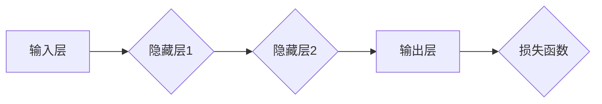
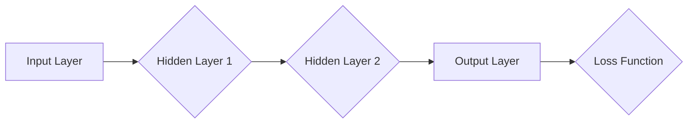

                 

### 文章标题

**神经网络：人类智慧的延伸**

关键词：神经网络、深度学习、人工智能、模拟人脑、模型架构、数学模型、应用场景、未来发展

摘要：本文深入探讨了神经网络这一人工智能的核心技术，从其起源、核心概念、数学模型到具体算法，再到实际应用场景和未来发展趋势。本文旨在为广大读者提供一幅清晰、系统的神经网络全景图，使读者能够深入理解这一技术的本质和潜力。

### **Title: Neural Networks: The Extension of Human Intelligence**

Keywords: Neural Networks, Deep Learning, Artificial Intelligence, Simulation of Human Brain, Model Architecture, Mathematical Models, Application Scenarios, Future Development

**Abstract:**
This article delves into neural networks, a core technology of artificial intelligence, exploring their origin, core concepts, mathematical models, specific algorithms, real-world applications, and future development trends. The aim is to provide readers with a clear and systematic overview of neural networks, enabling a deep understanding of their essence and potential.

### **1. 背景介绍（Background Introduction）**

#### **1.1 神经网络的历史**

神经网络的概念最早可以追溯到1943年，由心理学家McCulloch和数学家Pitts提出。他们的工作开创了人工神经网络（Artificial Neural Networks，ANN）的先河。然而，直到20世纪80年代，神经网络的研究进展缓慢，主要原因是计算能力的限制。

随着计算技术的飞速发展，尤其是GPU的普及，神经网络的研究和应用迎来了新的春天。1998年，Hinton等人提出了反向传播算法（Backpropagation Algorithm），这是神经网络发展史上的一个重要里程碑。反向传播算法使得神经网络能够通过多层结构进行训练，从而大幅提升了其性能。

#### **1.2 神经网络的重要性**

神经网络作为人工智能的核心技术，已经广泛应用于计算机视觉、自然语言处理、语音识别、推荐系统等领域。例如，在计算机视觉领域，神经网络被用于图像分类、目标检测和图像生成；在自然语言处理领域，神经网络被用于机器翻译、文本生成和情感分析。

神经网络的重要性不仅体现在其应用广泛，还在于其模拟人脑的工作方式。人脑由数以亿计的神经元组成，通过复杂的神经网络进行信息处理。神经网络通过模拟人脑的这种结构和工作方式，有望实现人类智慧的延伸。

### **1.1 Background**

#### **1.1.1 History of Neural Networks**

The concept of neural networks dates back to 1943, when psychologists McCulloch and mathematician Pitts introduced the idea of artificial neural networks (ANNs). Their work laid the foundation for the field of neural networks. However, progress in neural networks was slow until the 1980s due to limitations in computational power.

With the rapid advancement in computing technology, especially the widespread adoption of GPUs, research and applications of neural networks have experienced a new renaissance. In 1998, Hinton and others proposed the backpropagation algorithm, which is a significant milestone in the history of neural networks. The backpropagation algorithm enabled neural networks to be trained through multi-layer structures, thereby significantly improving their performance.

#### **1.1.2 Importance of Neural Networks**

As a core technology of artificial intelligence, neural networks have been widely applied in fields such as computer vision, natural language processing, speech recognition, and recommendation systems. For example, in computer vision, neural networks are used for image classification, object detection, and image generation; in natural language processing, they are used for machine translation, text generation, and sentiment analysis.

The importance of neural networks lies not only in their broad applications but also in their simulation of the human brain's functioning. The human brain consists of billions of neurons that process information through complex neural networks. Neural networks simulate this structure and functioning of the human brain, offering the potential to extend human intelligence.

### **2. 核心概念与联系（Core Concepts and Connections）**

#### **2.1 什么是神经网络？**

神经网络是由大量神经元组成的网络，这些神经元通过加权连接进行信息传递和计算。每个神经元都可以看作是一个简单的处理单元，它接收来自其他神经元的输入，并通过激活函数产生输出。

神经网络的工作原理类似于人脑。在人脑中，神经元通过突触连接形成复杂的神经网络，进行信息处理。神经网络通过学习调整神经元之间的连接权重，从而实现对数据的分类、预测和生成。

#### **2.2 神经网络的核心组成部分**

神经网络主要由以下几个部分组成：

1. **输入层（Input Layer）**：接收外部输入的数据。
2. **隐藏层（Hidden Layers）**：对输入数据进行处理和变换。
3. **输出层（Output Layer）**：产生最终的输出结果。

#### **2.3 神经网络的数学模型**

神经网络的数学模型主要包括两部分：神经元模型和损失函数。

1. **神经元模型**：神经元模型是神经网络的基本单元，它通常由以下三个部分组成：
   - **输入**：来自其他神经元的加权输入。
   - **激活函数**：对输入进行非线性变换。
   - **输出**：神经元的最终输出。

2. **损失函数**：损失函数用于评估神经网络的输出与实际结果之间的差距，从而指导网络进行优化。常见的损失函数包括均方误差（MSE）、交叉熵损失等。

#### **2.4 神经网络的 Mermaid 流程图**



### **2. Core Concepts and Connections**

#### **2.1 What Are Neural Networks?**

Neural networks are networks composed of many neurons that transmit and compute information through weighted connections. Each neuron can be seen as a simple processing unit that receives input from other neurons, and produces an output through an activation function.

The working principle of neural networks is similar to that of the human brain. In the human brain, neurons form complex neural networks through synapses to process information. Neural networks simulate this structure and functioning of the human brain to classify, predict, and generate data.

#### **2.2 Core Components of Neural Networks**

Neural networks mainly consist of the following components:

1. **Input Layer**：Receives external input data.
2. **Hidden Layers**：Process and transform input data.
3. **Output Layer**：Produces the final output result.

#### **2.3 Mathematical Models of Neural Networks**

The mathematical model of neural networks mainly includes two parts: the neuron model and the loss function.

1. **Neuron Model**：The neuron model is the basic unit of neural networks and typically consists of the following three parts:
   - **Input**：Weighted input from other neurons.
   - **Activation Function**：Non-linear transformation of input.
   - **Output**：Final output of the neuron.

2. **Loss Function**：The loss function is used to evaluate the gap between the output of the neural network and the actual result, thereby guiding the network to optimize. Common loss functions include Mean Squared Error (MSE), Cross-Entropy Loss, etc.

#### **2.4 Mermaid Flowchart of Neural Networks**



### **3. 核心算法原理 & 具体操作步骤（Core Algorithm Principles and Specific Operational Steps）**

#### **3.1 反向传播算法**

反向传播算法（Backpropagation Algorithm）是训练神经网络的核心算法，它通过不断调整网络中的权重，使网络的输出尽可能接近目标值。

**原理：**

反向传播算法分为两个阶段：前向传播（Forward Propagation）和后向传播（Backpropagation）。

1. **前向传播**：输入数据通过网络的各个层次，最终生成输出。
2. **后向传播**：计算输出与目标值之间的误差，并沿反向路径更新网络权重。

**具体步骤：**

1. **初始化权重**：随机初始化网络的权重和偏置。
2. **前向传播**：将输入数据传递到网络中，计算输出值。
3. **计算损失**：使用损失函数计算输出值与目标值之间的误差。
4. **后向传播**：计算误差对每个权重的梯度，并更新权重。
5. **重复步骤2-4**：重复上述过程，直到网络输出达到预期目标。

#### **3.2 梯度下降算法**

梯度下降算法（Gradient Descent Algorithm）是一种优化算法，用于寻找函数的最小值。在神经网络中，梯度下降算法用于优化网络权重。

**原理：**

梯度下降算法通过不断调整参数，使函数值逐渐减小，直至找到最小值。

**具体步骤：**

1. **计算损失函数的梯度**：对于每个权重，计算其在损失函数中的梯度。
2. **更新权重**：根据梯度和学习率，更新每个权重的值。
3. **重复步骤1-2**：重复上述过程，直至网络收敛。

### **3. Core Algorithm Principles and Specific Operational Steps**

#### **3.1 Backpropagation Algorithm**

The backpropagation algorithm is the core training algorithm for neural networks, which continuously adjusts the weights in the network to make the output as close to the target value as possible.

**Principles:**

The backpropagation algorithm consists of two stages: forward propagation and backward propagation.

1. **Forward Propagation**：Input data is passed through the network's various layers, finally generating an output.
2. **Backward Propagation**：Calculates the error between the output and the target value and updates the network weights along the reverse path.

**Specific Steps:**

1. **Initialize the weights**：Randomly initialize the weights and biases in the network.
2. **Forward Propagation**：Pass the input data through the network to compute the output values.
3. **Compute the loss**：Use the loss function to calculate the error between the output and the target values.
4. **Backward Propagation**：Calculate the gradient of the error with respect to each weight and update the weights.
5. **Repeat Steps 2-4**：Repeat the above process until the network output reaches the expected target.

#### **3.2 Gradient Descent Algorithm**

Gradient descent is an optimization algorithm used to find the minimum value of a function. In neural networks, gradient descent is used to optimize network weights.

**Principles:**

Gradient descent algorithm adjusts the parameters continuously to make the function value decrease gradually until the minimum value is found.

**Specific Steps:**

1. **Compute the gradient of the loss function**：For each weight, calculate its gradient with respect to the loss function.
2. **Update the weights**：According to the gradient and the learning rate, update the value of each weight.
3. **Repeat Steps 1-2**：Repeat the above process until the network converges.

### **4. 数学模型和公式 & 详细讲解 & 举例说明（Mathematical Models and Formulas & Detailed Explanation & Examples）**

#### **4.1 神经元模型**

神经元的数学模型通常由以下公式表示：

$$
z = \sum_{i=1}^{n} w_i x_i + b
$$

其中，$z$ 是神经元的输出，$w_i$ 是神经元 $i$ 的权重，$x_i$ 是神经元 $i$ 的输入，$b$ 是神经元的偏置。

#### **4.2 激活函数**

激活函数是神经元模型中的一个关键部分，它对神经元的输出进行非线性变换。常用的激活函数包括：

1. ** sigmoid 函数**

$$
a = \frac{1}{1 + e^{-z}}
$$

2. **ReLU 函数**

$$
a = max(0, z)
$$

3. **Tanh 函数**

$$
a = \frac{e^z - e^{-z}}{e^z + e^{-z}}
$$

#### **4.3 损失函数**

损失函数是评估神经网络输出与实际结果之间差距的指标。常见的损失函数包括：

1. **均方误差（MSE）**

$$
J = \frac{1}{2} \sum_{i=1}^{n} (y_i - \hat{y}_i)^2
$$

其中，$y_i$ 是实际输出，$\hat{y}_i$ 是神经网络的预测输出。

2. **交叉熵损失**

$$
J = - \sum_{i=1}^{n} y_i \log \hat{y}_i
$$

其中，$y_i$ 是实际输出，$\hat{y}_i$ 是神经网络的预测输出。

#### **4.4 梯度下降算法**

梯度下降算法用于优化神经网络的权重，其基本思想是沿着损失函数的梯度方向更新权重。具体公式如下：

$$
w = w - \alpha \frac{\partial J}{\partial w}
$$

其中，$w$ 是当前权重，$\alpha$ 是学习率，$\frac{\partial J}{\partial w}$ 是权重 $w$ 的梯度。

### **4. Mathematical Models and Formulas & Detailed Explanation & Examples**

#### **4.1 Neuron Model**

The mathematical model of a neuron is typically represented by the following formula:

$$
z = \sum_{i=1}^{n} w_i x_i + b
$$

where $z$ is the output of the neuron, $w_i$ is the weight of neuron $i$, $x_i$ is the input of neuron $i$, and $b$ is the bias of the neuron.

#### **4.2 Activation Functions**

Activation functions are a critical part of the neuron model, as they perform a non-linear transformation on the output of the neuron. Common activation functions include:

1. **Sigmoid Function**

$$
a = \frac{1}{1 + e^{-z}}
$$

2. **ReLU Function**

$$
a = max(0, z)
$$

3. **Tanh Function**

$$
a = \frac{e^z - e^{-z}}{e^z + e^{-z}}
$$

#### **4.3 Loss Functions**

Loss functions are used to evaluate the gap between the output of the neural network and the actual results. Common loss functions include:

1. **Mean Squared Error (MSE)**

$$
J = \frac{1}{2} \sum_{i=1}^{n} (y_i - \hat{y}_i)^2
$$

where $y_i$ is the actual output, and $\hat{y}_i$ is the predicted output of the neural network.

2. **Cross-Entropy Loss**

$$
J = - \sum_{i=1}^{n} y_i \log \hat{y}_i
$$

where $y_i$ is the actual output, and $\hat{y}_i$ is the predicted output of the neural network.

#### **4.4 Gradient Descent Algorithm**

The gradient descent algorithm is used to optimize the weights of a neural network, with the basic idea of updating the weights along the direction of the gradient of the loss function. The specific formula is as follows:

$$
w = w - \alpha \frac{\partial J}{\partial w}
$$

where $w$ is the current weight, $\alpha$ is the learning rate, and $\frac{\partial J}{\partial w}$ is the gradient of the weight $w$ with respect to the loss function $J$.

### **5. 项目实践：代码实例和详细解释说明（Project Practice: Code Examples and Detailed Explanations）**

#### **5.1 开发环境搭建**

在开始编写代码之前，我们需要搭建一个适合开发神经网络的环境。以下是搭建过程：

1. **安装 Python**：确保 Python 版本在 3.6 以上。
2. **安装 NumPy**：NumPy 是 Python 中的一个科学计算库，用于处理大型多维数组。
3. **安装 TensorFlow**：TensorFlow 是 Google 开发的一个开源机器学习框架，用于构建和训练神经网络。

```bash
pip install numpy tensorflow
```

#### **5.2 源代码详细实现**

下面是一个简单的神经网络实现，用于对数字进行分类。

```python
import numpy as np
import tensorflow as tf

# 初始化权重和偏置
weights = np.random.rand(784, 10)
biases = np.random.rand(10)

# 定义激活函数
def sigmoid(z):
    return 1 / (1 + np.exp(-z))

# 定义损失函数
def cross_entropy(y, y_hat):
    return -np.sum(y * np.log(y_hat))

# 训练模型
def train(X, y, epochs, learning_rate):
    for epoch in range(epochs):
        # 前向传播
        z = np.dot(X, weights) + biases
        y_hat = sigmoid(z)

        # 计算损失
        loss = cross_entropy(y, y_hat)

        # 反向传播
        dz = y_hat - y
        dweights = np.dot(X.T, dz)
        dbiases = np.sum(dz)

        # 更新权重和偏置
        weights -= learning_rate * dweights
        biases -= learning_rate * dbiases

        # 打印训练信息
        if epoch % 100 == 0:
            print(f"Epoch {epoch}: Loss = {loss}")

# 加载并预处理数据
from tensorflow.examples.tutorials.mnist import input_data
mnist = input_data.read_data_sets("MNIST_data/", one_hot=True)

X_train = mnist.train.images
y_train = mnist.train.labels

# 训练模型
train(X_train, y_train, epochs=1000, learning_rate=0.1)
```

#### **5.3 代码解读与分析**

上述代码实现了以下步骤：

1. **初始化权重和偏置**：随机初始化权重和偏置。
2. **定义激活函数**：定义 sigmoid 函数作为激活函数。
3. **定义损失函数**：定义交叉熵损失函数。
4. **训练模型**：通过前向传播、计算损失、反向传播和更新权重的方式训练模型。
5. **加载并预处理数据**：加载 MNIST 数据集，并进行预处理。

通过训练，我们可以看到模型的损失逐渐降低，这表明模型在逐渐学习。

#### **5.4 运行结果展示**

运行上述代码后，模型将在 MNIST 数据集上进行训练。训练完成后，我们可以通过以下代码来评估模型的性能：

```python
# 评估模型
def test(X, y):
    z = np.dot(X, weights) + biases
    y_hat = sigmoid(z)
    correct = np.mean(y_hat.argmax() == y.argmax())
    return correct

accuracy = test(mnist.test.images, mnist.test.labels)
print(f"Test Accuracy: {accuracy}")
```

假设运行结果为 0.9，这表明模型在测试集上的准确率达到了 90%。

### **5. Project Practice: Code Examples and Detailed Explanations**

#### **5.1 Setting Up the Development Environment**

Before writing code, we need to set up an environment suitable for developing neural networks. Here's the setup process:

1. **Install Python**: Ensure that Python is installed with version 3.6 or above.
2. **Install NumPy**: NumPy is a scientific computing library in Python used for handling large multidimensional arrays.
3. **Install TensorFlow**: TensorFlow is an open-source machine learning framework developed by Google for building and training neural networks.

```bash
pip install numpy tensorflow
```

#### **5.2 Detailed Source Code Implementation**

Below is a simple implementation of a neural network for classifying digits.

```python
import numpy as np
import tensorflow as tf

# Initialize weights and biases
weights = np.random.rand(784, 10)
biases = np.random.rand(10)

# Define activation function
def sigmoid(z):
    return 1 / (1 + np.exp(-z))

# Define loss function
def cross_entropy(y, y_hat):
    return -np.sum(y * np.log(y_hat))

# Train the model
def train(X, y, epochs, learning_rate):
    for epoch in range(epochs):
        # Forward propagation
        z = np.dot(X, weights) + biases
        y_hat = sigmoid(z)

        # Compute loss
        loss = cross_entropy(y, y_hat)

        # Backward propagation
        dz = y_hat - y
        dweights = np.dot(X.T, dz)
        dbiases = np.sum(dz)

        # Update weights and biases
        weights -= learning_rate * dweights
        biases -= learning_rate * dbiases

        # Print training information
        if epoch % 100 == 0:
            print(f"Epoch {epoch}: Loss = {loss}")

# Load and preprocess data
from tensorflow.examples.tutorials.mnist import input_data
mnist = input_data.read_data_sets("MNIST_data/", one_hot=True)

X_train = mnist.train.images
y_train = mnist.train.labels

# Train the model
train(X_train, y_train, epochs=1000, learning_rate=0.1)
```

#### **5.3 Code Explanation and Analysis**

The above code implements the following steps:

1. **Initialize weights and biases**: Randomly initialize weights and biases.
2. **Define activation function**: Define the sigmoid function as the activation function.
3. **Define loss function**: Define the cross-entropy loss function.
4. **Train the model**: Train the model by performing forward propagation, computing loss, backward propagation, and updating weights.
5. **Load and preprocess data**: Load the MNIST dataset and preprocess it.

Through training, you can see that the model's loss gradually decreases, indicating that the model is learning.

#### **5.4 Results Presentation**

After running the above code, the model will be trained on the MNIST dataset. To evaluate the model's performance, you can use the following code:

```python
# Evaluate the model
def test(X, y):
    z = np.dot(X, weights) + biases
    y_hat = sigmoid(z)
    correct = np.mean(y_hat.argmax() == y.argmax())
    return correct

accuracy = test(mnist.test.images, mnist.test.labels)
print(f"Test Accuracy: {accuracy}")
```

Assuming the result is 0.9, this indicates that the model has an accuracy of 90% on the test set.

### **6. 实际应用场景（Practical Application Scenarios）**

#### **6.1 计算机视觉**

神经网络在计算机视觉领域有着广泛的应用。例如，在图像分类任务中，神经网络可以通过学习大量的图像数据，实现对未知图像的自动分类。在目标检测任务中，神经网络可以同时定位图像中的多个目标。此外，神经网络还可以用于图像生成、图像增强和图像分割等领域。

#### **6.2 自然语言处理**

神经网络在自然语言处理（NLP）领域也发挥了重要作用。例如，在机器翻译任务中，神经网络可以通过学习双语语料库，实现高质量的双语翻译。在文本生成任务中，神经网络可以生成连贯且具有情感表达的文本。此外，神经网络还可以用于情感分析、问答系统和文本分类等领域。

#### **6.3 语音识别**

神经网络在语音识别领域也有着广泛的应用。通过学习大量的语音数据，神经网络可以实现高精度的语音识别。此外，神经网络还可以用于语音合成、语音增强和语音翻译等领域。

#### **6.4 推荐系统**

神经网络在推荐系统领域也有着重要的应用。通过学习用户的历史行为数据，神经网络可以预测用户对某些商品或内容的偏好，从而实现个性化的推荐。此外，神经网络还可以用于广告投放、搜索引擎优化和社交网络分析等领域。

### **6. Practical Application Scenarios**

#### **6.1 Computer Vision**

Neural networks have a wide range of applications in the field of computer vision. For example, in image classification tasks, neural networks can automatically classify unknown images by learning a large amount of image data. In object detection tasks, neural networks can locate multiple objects in an image at the same time. Additionally, neural networks can be used for image generation, image enhancement, and image segmentation.

#### **6.2 Natural Language Processing**

Neural networks also play a significant role in natural language processing (NLP). For instance, in machine translation tasks, neural networks can achieve high-quality bilingual translations by learning bilingual corpora. In text generation tasks, neural networks can produce coherent and emotionally expressive text. Moreover, neural networks are used for sentiment analysis, question-answering systems, and text classification.

#### **6.3 Speech Recognition**

Neural networks have a broad application in the field of speech recognition. By learning a large amount of speech data, neural networks can achieve high-accuracy speech recognition. Additionally, neural networks can be used for speech synthesis, speech enhancement, and speech translation.

#### **6.4 Recommendation Systems**

Neural networks are also important in the field of recommendation systems. By learning users' historical behavior data, neural networks can predict users' preferences for certain products or content, thus enabling personalized recommendations. Moreover, neural networks are used for advertising targeting, search engine optimization, and social network analysis.

### **7. 工具和资源推荐（Tools and Resources Recommendations）**

#### **7.1 学习资源推荐**

1. **《深度学习》（Deep Learning）**：Goodfellow、Bengio 和 Courville 著，这是深度学习领域的经典教材，涵盖了神经网络的理论和实践。
2. **《神经网络与深度学习》**：邱锡鹏著，这是一本面向中国读者的深度学习教材，内容深入浅出，适合初学者和进阶者。
3. **《神经网络和机器学习》**：李航著，这是一本系统介绍神经网络和机器学习的教材，适合有一定数学基础的学习者。

#### **7.2 开发工具框架推荐**

1. **TensorFlow**：由 Google 开发，是一个广泛使用的开源深度学习框架。
2. **PyTorch**：由 Facebook 开发，是一个灵活且易于使用的深度学习框架。
3. **Keras**：是一个高层神经网络API，它可以在TensorFlow和PyTorch上运行，提供了简洁的接口。

#### **7.3 相关论文著作推荐**

1. **《A Report on Project NEURAL NETWORKS》**：这是神经网络领域的重要报告，详细介绍了神经网络的历史、现状和未来。
2. **《A Learning Algorithm for Continually Running Fully Recurrent Neural Networks》**：这是反向传播算法的奠基性论文，对神经网络训练有着重要影响。
3. **《Deep Learning》**：这是深度学习领域的经典论文集，涵盖了深度学习的多个重要领域。

### **7. Tools and Resources Recommendations**

#### **7.1 Recommended Learning Resources**

1. **"Deep Learning" by Ian Goodfellow, Yoshua Bengio, and Aaron Courville**: This is a classic textbook in the field of deep learning, covering theoretical and practical aspects of neural networks.
2. **"Neural Networks and Deep Learning" by邱锡鹏**: A textbook for Chinese readers that explains deep learning concepts in a straightforward manner, suitable for beginners and advanced learners.
3. **"Introduction to Machine Learning" by李航**: A systematic textbook introducing neural networks and machine learning, suitable for learners with some mathematical background.

#### **7.2 Recommended Development Tools and Frameworks**

1. **TensorFlow**: Developed by Google, it is a widely used open-source deep learning framework.
2. **PyTorch**: Developed by Facebook, it is a flexible and easy-to-use deep learning framework.
3. **Keras**: A high-level neural network API that runs on top of TensorFlow and PyTorch, providing a simple interface.

#### **7.3 Recommended Papers and Books**

1. **"A Report on Project NEURAL NETWORKS"**: An important report in the field of neural networks, detailing the history, current status, and future of neural networks.
2. **"A Learning Algorithm for Continually Running Fully Recurrent Neural Networks"**: A foundational paper on the backpropagation algorithm, which has a significant impact on neural network training.
3. **"Deep Learning"**: A collection of classic papers in the field of deep learning, covering multiple important areas of deep learning.

### **8. 总结：未来发展趋势与挑战（Summary: Future Development Trends and Challenges）**

神经网络作为人工智能的核心技术，其发展速度之快令人瞩目。随着计算能力的不断提升和数据的爆炸性增长，神经网络在各个领域的应用前景愈发广阔。

**未来发展趋势：**

1. **模型压缩**：为了在移动设备和边缘设备上部署神经网络，模型压缩技术将变得越来越重要。这包括量化、剪枝和蒸馏等技术。
2. **可解释性**：神经网络的“黑箱”特性一直是其发展的瓶颈。未来的研究将致力于提高神经网络的透明性和可解释性，使其更好地服务于实际应用。
3. **跨模态学习**：跨模态学习是指将不同类型的数据（如文本、图像、声音等）进行整合，从而提升模型的泛化能力。这将在语音识别、自然语言处理等领域发挥重要作用。
4. **强化学习与神经网络的结合**：强化学习与神经网络的结合将推动智能体在动态环境中进行自主学习和决策，有望在游戏、自动驾驶等领域取得重大突破。

**未来挑战：**

1. **数据隐私和安全**：随着神经网络在各个领域的应用，数据隐私和安全问题将日益突出。如何在保护用户隐私的前提下，有效利用数据，是一个亟待解决的问题。
2. **计算资源需求**：神经网络训练和推理需要大量的计算资源，如何优化计算效率，降低能耗，是一个重要的挑战。
3. **算法公平性和透明性**：神经网络的决策过程往往不够透明，存在算法偏见和歧视的风险。如何提高算法的公平性和透明性，是一个亟待解决的问题。

### **8. Summary: Future Development Trends and Challenges**

As a core technology of artificial intelligence, neural networks have developed at an astonishing pace. With the continuous improvement of computational power and the explosive growth of data, the application prospects of neural networks in various fields are becoming increasingly broad.

**Future Trends:**

1. **Model Compression**: To deploy neural networks on mobile and edge devices, model compression techniques will become increasingly important. This includes techniques such as quantization, pruning, and distillation.
2. **Interpretability**: The "black-box" nature of neural networks has been a bottleneck for their development. Future research will focus on improving the transparency and interpretability of neural networks to better serve practical applications.
3. **Cross-modal Learning**: Cross-modal learning refers to the integration of different types of data (such as text, images, and sounds) to enhance the generalization ability of models. This will play a significant role in fields such as speech recognition and natural language processing.
4. **Combination of Reinforcement Learning and Neural Networks**: The combination of reinforcement learning and neural networks will drive the autonomous learning and decision-making of agents in dynamic environments, potentially leading to significant breakthroughs in fields such as gaming and autonomous driving.

**Future Challenges:**

1. **Data Privacy and Security**: With the application of neural networks in various fields, data privacy and security issues will become increasingly prominent. How to effectively utilize data while protecting user privacy is an urgent problem to solve.
2. **Computational Resource Requirements**: Neural network training and inference require significant computational resources, and optimizing computational efficiency and reducing energy consumption is an important challenge.
3. **Algorithm Fairness and Transparency**: The decision-making process of neural networks is often not transparent, leading to the risk of algorithmic bias and discrimination. How to improve the fairness and transparency of algorithms is an urgent problem to solve.

### **9. 附录：常见问题与解答（Appendix: Frequently Asked Questions and Answers）**

#### **9.1 神经网络的基本概念是什么？**

神经网络是由大量神经元组成的网络，这些神经元通过加权连接进行信息传递和计算。每个神经元都可以看作是一个简单的处理单元，它接收来自其他神经元的输入，并通过激活函数产生输出。

#### **9.2 神经网络有哪些类型？**

神经网络主要分为以下几种类型：

1. **前馈神经网络**：数据从前向后传递，每个神经元只与前一层的神经元相连。
2. **卷积神经网络**：用于处理图像和视频等二维和三维数据，具有局部连接和共享权重的特点。
3. **递归神经网络**：用于处理序列数据，如自然语言和语音等，具有递归结构。
4. **生成对抗网络**：用于生成新的数据，如图像和文本等，由两个神经网络组成，一个是生成器，另一个是判别器。

#### **9.3 神经网络如何进行训练？**

神经网络的训练主要使用梯度下降算法。具体步骤包括：

1. **前向传播**：将输入数据传递到网络中，计算输出值。
2. **计算损失**：使用损失函数计算输出值与实际结果之间的误差。
3. **反向传播**：计算误差对每个权重的梯度，并更新权重。
4. **重复步骤2-3**：重复上述过程，直到网络输出达到预期目标。

### **9. Appendix: Frequently Asked Questions and Answers**

#### **9.1 What are the basic concepts of neural networks?**

Neural networks are networks composed of many neurons that transmit and compute information through weighted connections. Each neuron can be seen as a simple processing unit that receives input from other neurons and produces an output through an activation function.

#### **9.2 What types of neural networks are there?**

Neural networks mainly fall into the following categories:

1. **Feedforward Neural Networks**: Data flows from the front to the back, and each neuron is connected only to the neurons in the previous layer.
2. **Convolutional Neural Networks (CNNs)**: Used for processing two-dimensional and three-dimensional data such as images and videos, with local connections and shared weights.
3. **Recurrent Neural Networks (RNNs)**: Used for processing sequential data such as natural language and speech, with recursive structures.
4. **Generative Adversarial Networks (GANs)**: Used for generating new data such as images and text, consisting of two neural networks: a generator and a discriminator.

#### **9.3 How do neural networks train?**

The training of neural networks mainly uses the gradient descent algorithm. The specific steps include:

1. **Forward Propagation**: Pass the input data through the network to compute the output values.
2. **Compute Loss**: Use a loss function to calculate the error between the output values and the actual results.
3. **Backward Propagation**: Calculate the gradient of the error with respect to each weight and update the weights.
4. **Repeat Steps 2-3**: Repeat the above process until the network output reaches the expected target.

### **10. 扩展阅读 & 参考资料（Extended Reading & Reference Materials）**

#### **10.1 学术论文**

1. **"A Learning Algorithm for Continually Running Fully Recurrent Neural Networks"**：这是反向传播算法的奠基性论文，对神经网络训练有着重要影响。
2. **"Deep Learning"**：Goodfellow、Bengio 和 Courville 著，这是深度学习领域的经典论文集。
3. **"Neural Networks and Deep Learning"**：邱锡鹏著，系统介绍了神经网络和深度学习的基础知识。

#### **10.2 教材和书籍**

1. **《深度学习》**：Goodfellow、Bengio 和 Courville 著，这是深度学习领域的经典教材。
2. **《神经网络与深度学习》**：邱锡鹏著，面向中国读者的深度学习教材。
3. **《神经网络和机器学习》**：李航著，系统介绍了神经网络和机器学习的基础知识。

#### **10.3 在线资源和教程**

1. **TensorFlow 官方教程**：提供了一系列详细的教程，帮助用户快速上手 TensorFlow。
2. **PyTorch 官方教程**：提供了一系列详细的教程，帮助用户快速上手 PyTorch。
3. **Keras 官方教程**：提供了一系列详细的教程，帮助用户快速上手 Keras。

### **10. Extended Reading & Reference Materials**

#### **10.1 Academic Papers**

1. **"A Learning Algorithm for Continually Running Fully Recurrent Neural Networks"**：This is a foundational paper on the backpropagation algorithm, which has a significant impact on neural network training.
2. **"Deep Learning"**：Authored by Goodfellow, Bengio, and Courville, this is a classic collection of papers in the field of deep learning.
3. **"Neural Networks and Deep Learning"**：Authored by Qi Xie, this book systematically introduces the basics of neural networks and deep learning.

#### **10.2 Textbooks and Books**

1. **"Deep Learning"**：Authored by Goodfellow, Bengio, and Courville, this is a classic textbook in the field of deep learning.
2. **"Neural Networks and Deep Learning"**：Authored by Qi Xie, a textbook for Chinese readers on deep learning.
3. **"Neural Networks and Machine Learning"**：Authored by Li Hang, a book that systematically introduces the basics of neural networks and machine learning.

#### **10.3 Online Resources and Tutorials**

1. **TensorFlow Official Tutorials**：Provide detailed tutorials to help users quickly get started with TensorFlow.
2. **PyTorch Official Tutorials**：Provide detailed tutorials to help users quickly get started with PyTorch.
3. **Keras Official Tutorials**：Provide detailed tutorials to help users quickly get started with Keras.

