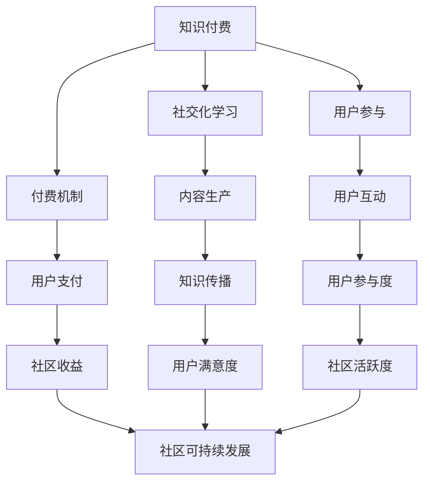

                 

## 文章标题

《程序员如何打造知识付费的在线社区》

## 关键词
知识付费、在线社区、编程教育、用户参与、商业模式、技术实现

## 摘要
本文旨在探讨程序员如何打造一个成功的知识付费在线社区，通过分析其核心概念、技术实现、商业模式以及用户参与等方面，为开发者提供全面的指导。文章将详细阐述知识付费在线社区的定义、关键要素、技术架构、实现策略，并提供实际案例和实践建议，旨在帮助程序员在构建知识付费平台时少走弯路，实现可持续发展。

## 1. 背景介绍

随着互联网技术的快速发展，在线教育已经成为一个蓬勃发展的行业。知识付费模式，即用户为获取特定知识或服务支付费用，正逐渐成为主流。程序员作为知识付费的一个重要群体，对高质量的学习资源有着巨大的需求。然而，当前市场上的知识付费平台往往存在以下问题：

- **内容质量参差不齐**：一些平台的内容质量难以保证，用户难以辨别哪些资源有价值。
- **用户参与度低**：很多平台过于注重内容销售，忽视了用户互动和参与的重要性。
- **商业模式不成熟**：许多知识付费平台在盈利模式上缺乏创新，难以实现可持续发展。

为了解决这些问题，程序员需要构建一个具备高质量内容、良好用户互动和可持续盈利模式的知识付费在线社区。这样的社区不仅能够满足程序员的学习需求，还能为开发者提供创造价值的平台。

### 1.1 知识付费在线社区的定义

知识付费在线社区是指一种通过互联网平台提供的，旨在为用户提供高质量、付费知识资源的社交化学习环境。它通常包括以下核心要素：

- **高质量内容**：包括教程、课程、文章、视频等多种形式，以满足用户多样化的学习需求。
- **用户参与**：通过论坛、问答、互动讨论等方式，鼓励用户参与内容创作和交流。
- **社交化**：借助社交媒体功能，促进用户之间的互动和连接，增强社区的凝聚力。
- **付费机制**：用户通过购买、订阅等方式获取知识资源，平台通过知识付费实现盈利。

### 1.2 目标用户群体

知识付费在线社区的目标用户主要包括以下几类：

- **初级程序员**：希望提升编程技能，学习新技术和框架。
- **中级程序员**：需要深入了解特定技术领域，如数据库、前端开发等。
- **高级程序员**：关注前沿技术动态，希望提升系统架构和项目管理能力。
- **技术爱好者**：热爱编程，希望分享和探讨技术话题。

### 1.3 当前市场情况

当前市场上存在许多知识付费平台，如慕课网、极客时间、开课吧等。这些平台各有特色，但也存在一定的同质化竞争。为了在激烈的市场竞争中脱颖而出，知识付费在线社区需要具备以下特点：

- **专业性强**：提供垂直领域的高质量内容，满足专业用户的需求。
- **用户体验好**：注重用户交互体验，提供便捷的学习和交流工具。
- **社交化**：鼓励用户互动，建立社区氛围，提高用户粘性。
- **个性化**：根据用户行为和兴趣推荐内容，提高内容个性化程度。

### 1.4 文章结构

本文将按照以下结构展开：

- **2. 核心概念与联系**：介绍知识付费在线社区的核心概念和架构。
- **3. 核心算法原理 & 具体操作步骤**：分析社区的技术实现原理和步骤。
- **4. 数学模型和公式 & 详细讲解 & 举例说明**：阐述社区中涉及的关键数学模型和公式。
- **5. 项目实践：代码实例和详细解释说明**：提供实际开发中的代码实例和解释。
- **6. 实际应用场景**：探讨社区在不同场景下的应用。
- **7. 工具和资源推荐**：推荐学习资源和开发工具。
- **8. 总结：未来发展趋势与挑战**：总结本文内容和展望未来。
- **9. 附录：常见问题与解答**：回答读者可能遇到的问题。
- **10. 扩展阅读 & 参考资料**：提供进一步学习的资源。

### 2. 核心概念与联系

要打造一个成功的知识付费在线社区，需要理解其核心概念和架构。以下是对关键概念的介绍和它们之间的联系分析。

#### 2.1 知识付费

知识付费是指用户为获取特定知识或服务支付费用的一种商业模式。它不同于传统教育，用户可以根据自己的需求选择学习内容，并在学习过程中享受到个性化服务。知识付费的核心是优质内容的生产和传播。

**与在线社区的联系**：知识付费为在线社区提供了主要收入来源。通过提供高质量、有针对性的内容，社区可以吸引更多用户，提高用户粘性。

#### 2.2 社交化学习

社交化学习是指利用社交媒体功能，促进学习者之间的互动和知识分享。它强调学习过程中的社交性，通过互动激发学习兴趣，提高学习效果。

**与在线社区的联系**：社交化学习是知识付费在线社区的重要特点。通过论坛、问答、互动讨论等功能，社区可以营造活跃的学习氛围，提高用户参与度。

#### 2.3 用户参与

用户参与是指鼓励用户在知识付费在线社区中积极参与内容创作、讨论和分享。用户参与不仅能够丰富社区内容，还能增强用户的归属感和忠诚度。

**与在线社区的联系**：用户参与是知识付费在线社区的核心驱动力。通过提供多样化的参与方式，社区可以激发用户积极性，形成良好的互动氛围。

#### 2.4 付费机制

付费机制是指用户获取知识资源的支付方式，包括单次购买、订阅制、课程包等多种形式。合理的付费机制能够保证平台收入，同时满足用户多样化的学习需求。

**与在线社区的联系**：付费机制是知识付费在线社区的重要组成部分。通过灵活的付费机制，社区可以吸引更多用户，实现可持续发展。

#### 2.5 技术架构

技术架构是指知识付费在线社区的技术实现方式，包括前端开发、后端服务、数据库设计等。一个高效、稳定的技术架构是社区运营的基础。

**与在线社区的联系**：技术架构决定了社区的性能、安全性和扩展性。一个优秀的社区需要具备快速响应、安全可靠的技术支持。

### 2.6 关键要素之间的关系

核心概念与联系之间的关系可以概括为以下三个方面：

- **相互依存**：知识付费、社交化学习、用户参与和付费机制相互依存，共同构成了知识付费在线社区的核心。
- **协同作用**：这些关键要素相互协同，共同推动社区的发展。知识付费为社区提供了收入来源，社交化学习和用户参与提升了用户体验，而合理的付费机制保证了社区的可持续发展。
- **动态平衡**：社区运营者需要在这些关键要素之间保持动态平衡，以满足用户需求、提升社区质量和实现盈利目标。

### 2.7 Mermaid 流程图

为了更清晰地展示知识付费在线社区的核心概念和架构，我们使用Mermaid绘制了一个流程图。以下是流程图的Markdown代码和对应的流程图展示。




通过以上流程图，我们可以看到知识付费在线社区的核心概念和架构之间的联系和协同作用。

### 2.8 核心概念原理

知识付费在线社区的核心概念原理主要包括以下几个方面：

- **知识生产与消费**：社区需要生产高质量的知识内容，以满足用户的学习需求。同时，用户通过消费这些内容，实现了知识的获取和积累。
- **社交化互动**：通过社交化互动，用户可以在社区中分享知识、讨论问题，从而提高学习效果和社区活跃度。
- **用户参与**：用户参与是社区的核心驱动力。通过参与内容创作、讨论和分享，用户可以提升自己的技能，同时为社区贡献价值。
- **付费机制**：合理的付费机制是社区实现可持续发展的重要保障。通过多样化的付费方式，社区可以吸引更多用户，提高收入。

这些核心概念原理共同构成了知识付费在线社区的基本框架，为社区的运营和发展提供了指导。

### 2.9 关键算法原理

在知识付费在线社区中，一些关键算法原理对社区的运营和用户满意度至关重要。以下是几个关键算法原理及其作用：

#### 2.9.1 推荐算法

推荐算法是知识付费在线社区的核心算法之一。它通过分析用户的行为数据、学习兴趣和知识需求，为用户推荐个性化的学习资源。推荐算法的作用如下：

- **提升用户体验**：通过推荐用户感兴趣的内容，提高用户的学习积极性和满意度。
- **增加内容曝光**：推荐算法能够增加高质量内容在社区中的曝光率，提高内容的生产和消费效率。
- **优化内容分发**：推荐算法有助于优化内容的分发策略，确保高质量内容能够被更多用户发现和消费。

#### 2.9.2 互动算法

互动算法主要关注社区中的用户互动行为，通过分析用户的互动数据，优化社区的氛围和互动效果。互动算法的作用如下：

- **促进用户参与**：通过分析用户的互动行为，鼓励用户参与讨论、提问和分享，提高社区的活跃度。
- **增强社区凝聚力**：互动算法有助于建立用户之间的联系，增强社区的凝聚力和归属感。
- **提高内容质量**：互动算法可以识别社区中的优质内容和创作者，鼓励更多用户参与内容创作，提高整体内容质量。

#### 2.9.3 付费算法

付费算法主要负责优化社区的付费机制，确保社区能够实现可持续发展。付费算法的作用如下：

- **个性化定价**：通过分析用户的行为数据和需求，为用户推荐个性化的付费方案，提高付费转化率。
- **优化收入结构**：付费算法有助于优化社区的收入结构，确保社区在提供高质量内容的同时，实现盈利目标。
- **降低流失率**：通过合理的付费机制，降低用户流失率，提高用户粘性和满意度。

#### 2.9.4 安全算法

安全算法主要用于保护社区的数据安全和用户隐私。安全算法的作用如下：

- **数据加密**：通过数据加密技术，确保用户数据在传输和存储过程中的安全性。
- **用户认证**：安全算法能够实现用户认证和权限管理，防止未授权访问和数据泄露。
- **异常检测**：通过异常检测技术，及时发现和处理社区中的恶意行为，保障社区的安全和稳定运行。

### 2.10 具体操作步骤

在理解了关键算法原理后，我们需要将它们应用于实际社区构建过程中。以下是知识付费在线社区构建的具体操作步骤：

#### 2.10.1 需求分析

在构建社区前，我们需要对目标用户进行需求分析，了解他们的学习需求、兴趣和行为习惯。通过需求分析，我们可以确定社区的内容定位、功能设计和用户互动策略。

#### 2.10.2 技术选型

根据需求分析结果，我们需要选择合适的技术栈，包括前端框架、后端服务、数据库和推荐系统等。技术选型的目标是确保社区的高性能、安全性和可扩展性。

#### 2.10.3 数据收集与处理

在社区运营过程中，我们需要收集大量的用户行为数据，包括浏览、搜索、购买和互动等。通过数据收集与处理，我们可以为推荐算法和互动算法提供可靠的数据基础。

#### 2.10.4 算法实现

根据关键算法原理，我们需要实现推荐算法、互动算法、付费算法和安全算法。算法实现的步骤包括数据预处理、模型训练、模型部署和效果评估。

#### 2.10.5 功能开发

在算法实现的基础上，我们需要开发社区的功能模块，包括内容管理、用户管理、互动管理、支付管理等。功能开发的目标是确保社区的可用性和用户体验。

#### 2.10.6 测试与优化

在社区上线前，我们需要进行全面的测试，包括功能测试、性能测试和安全测试。测试通过后，我们需要根据用户反馈对社区进行优化，确保其稳定运行和良好性能。

### 3. 核心算法原理 & 具体操作步骤

#### 3.1 推荐算法

推荐算法是知识付费在线社区的核心算法之一，它的目的是为用户提供个性化的学习资源。以下是一种常见的推荐算法——协同过滤算法的具体操作步骤：

##### 3.1.1 数据收集

首先，我们需要收集用户的行为数据，如浏览记录、购买历史和互动数据。这些数据将用于构建用户行为矩阵。

##### 3.1.2 数据预处理

对收集到的数据进行清洗和预处理，包括缺失值处理、数据标准化和特征提取。预处理后的数据将用于模型训练。

##### 3.1.3 模型训练

使用用户行为矩阵训练协同过滤模型。常见的协同过滤模型包括基于用户的协同过滤和基于物品的协同过滤。训练过程中，我们需要选择合适的损失函数和优化算法，如均方误差（MSE）和梯度下降算法。

##### 3.1.4 模型评估

通过交叉验证等方法评估模型的性能。常见的评估指标包括准确率（Accuracy）、召回率（Recall）和F1值（F1 Score）。

##### 3.1.5 模型部署

将训练好的模型部署到线上环境，为用户提供实时推荐。

##### 3.1.6 模型优化

根据用户反馈和模型性能，不断优化模型参数和算法，以提高推荐效果。

#### 3.2 互动算法

互动算法的主要目的是促进用户参与和社区活跃度。以下是一种常见的互动算法——用户参与度评分算法的具体操作步骤：

##### 3.2.1 数据收集

收集用户的互动数据，如发帖、回复、点赞和分享等。

##### 3.2.2 数据预处理

对互动数据进行清洗和预处理，提取用户的互动特征。

##### 3.2.3 模型训练

使用用户互动数据训练用户参与度评分模型。常见的模型包括逻辑回归、支持向量机和决策树等。

##### 3.2.4 模型评估

通过交叉验证等方法评估模型的性能，选择最优模型。

##### 3.2.5 模型部署

将训练好的模型部署到线上环境，为用户提供实时互动评分。

##### 3.2.6 模型优化

根据用户反馈和模型性能，不断优化模型参数和算法。

#### 3.3 付费算法

付费算法的主要目的是优化社区的收入结构，确保社区可持续发展。以下是一种常见的付费算法——定价策略算法的具体操作步骤：

##### 3.3.1 数据收集

收集用户的行为数据，如购买历史、浏览记录和互动数据。

##### 3.3.2 数据预处理

对购买数据进行清洗和预处理，提取用户的付费特征。

##### 3.3.3 模型训练

使用用户付费数据训练定价策略模型。常见的模型包括线性回归、决策树和神经网络等。

##### 3.3.4 模型评估

通过交叉验证等方法评估模型的性能，选择最优模型。

##### 3.3.5 模型部署

将训练好的模型部署到线上环境，为用户提供个性化的付费建议。

##### 3.3.6 模型优化

根据用户反馈和模型性能，不断优化模型参数和算法。

### 4. 数学模型和公式 & 详细讲解 & 举例说明

在构建知识付费在线社区的过程中，数学模型和公式发挥着关键作用。以下将详细介绍几个关键的数学模型和公式，并提供详细讲解和举例说明。

#### 4.1 逻辑回归模型

逻辑回归是一种常用的分类模型，用于预测用户是否会在社区中购买某个课程。其公式如下：

$$
P(y=1) = \frac{1}{1 + e^{-(\beta_0 + \beta_1 x_1 + \beta_2 x_2 + \ldots + \beta_n x_n})}
$$

其中，\(y\) 是用户购买行为（1代表购买，0代表未购买），\(x_1, x_2, \ldots, x_n\) 是用户特征向量，\(\beta_0, \beta_1, \beta_2, \ldots, \beta_n\) 是模型参数。

**详细讲解**：逻辑回归模型通过线性组合用户特征，预测用户购买的概率。模型的损失函数通常为对数似然损失，优化方法可以使用梯度下降。

**举例说明**：假设我们要预测用户是否会在社区中购买一门编程课程。用户的特征包括年龄、职业和教育程度。我们可以使用逻辑回归模型计算用户购买的概率。例如，如果用户的年龄为25岁，职业为程序员，教育程度为硕士，那么模型会输出用户购买的概率。

#### 4.2 K-means 聚类算法

K-means 聚类算法是一种无监督学习方法，用于将用户划分为不同的群体。其公式如下：

$$
\text{minimize} \sum_{i=1}^k \sum_{x \in S_i} \|x - \mu_i\|^2
$$

其中，\(k\) 是聚类个数，\(S_i\) 是第 \(i\) 个聚类的数据集，\(\mu_i\) 是第 \(i\) 个聚类中心。

**详细讲解**：K-means 聚类算法通过迭代计算聚类中心，将用户数据划分为 \(k\) 个聚类。算法的目标是使每个聚类内部的数据距离聚类中心的距离之和最小。

**举例说明**：假设我们要将社区中的用户划分为三个群体。我们可以使用 K-means 聚类算法计算聚类中心，然后根据聚类中心将用户划分为三个群体。例如，如果聚类中心为 \((1,1)\)，\((5,5)\) 和 \((9,9)\)，那么用户数据将被划分为这三个聚类。

#### 4.3 线性回归模型

线性回归模型是一种用于预测用户对课程评价的模型。其公式如下：

$$
y = \beta_0 + \beta_1 x_1 + \beta_2 x_2 + \ldots + \beta_n x_n + \epsilon
$$

其中，\(y\) 是用户评价（如评分），\(x_1, x_2, \ldots, x_n\) 是用户特征向量，\(\beta_0, \beta_1, \beta_2, \ldots, \beta_n\) 是模型参数，\(\epsilon\) 是误差项。

**详细讲解**：线性回归模型通过线性组合用户特征，预测用户对课程的评价。模型的损失函数通常为平方损失，优化方法可以使用梯度下降。

**举例说明**：假设我们要预测用户对一门编程课程的评分。用户的特征包括年龄、职业和教育程度。我们可以使用线性回归模型计算用户评分。例如，如果用户的年龄为25岁，职业为程序员，教育程度为硕士，那么模型会输出用户对课程的评分预测。

### 4.4 贝叶斯网络

贝叶斯网络是一种概率图模型，用于表示变量之间的条件依赖关系。其公式如下：

$$
P(X_1, X_2, \ldots, X_n) = \prod_{i=1}^n P(X_i | X_{pa_i})
$$

其中，\(X_1, X_2, \ldots, X_n\) 是变量，\(X_{pa_i}\) 是 \(X_i\) 的父节点。

**详细讲解**：贝叶斯网络通过有向无环图（DAG）表示变量之间的条件依赖关系。每个节点表示一个变量，边表示变量之间的依赖关系。贝叶斯网络可以用于推理和预测，通过贝叶斯规则计算条件概率。

**举例说明**：假设我们要分析用户购买课程的概率。我们可以使用贝叶斯网络表示用户行为（购买与否）与其他特征（如年龄、职业、教育程度等）之间的依赖关系。通过贝叶斯网络，我们可以计算用户购买的概率，并根据概率进行决策。

#### 4.5 决策树模型

决策树是一种常见的分类和回归模型，通过一系列规则对数据进行分类或预测。其公式如下：

$$
y = \sum_{i=1}^n w_i I(X_i \in C_i)
$$

其中，\(y\) 是输出变量，\(X_i\) 是特征，\(C_i\) 是特征 \(X_i\) 的取值，\(w_i\) 是权重。

**详细讲解**：决策树通过递归划分特征空间，构建一棵树形结构。树的每个节点代表一个特征划分，叶节点代表最终的预测结果。决策树的构建过程通常使用信息增益、基尼不纯度或熵等指标进行评估。

**举例说明**：假设我们要预测用户是否会在社区中购买编程课程。我们可以使用决策树模型构建分类规则，根据用户的年龄、职业和教育程度等特征进行划分，预测用户是否购买。

### 4.6 支持向量机

支持向量机（SVM）是一种用于分类和回归的机器学习模型，其公式如下：

$$
w \cdot x - b = 0
$$

其中，\(w\) 是权重向量，\(x\) 是特征向量，\(b\) 是偏置。

**详细讲解**：支持向量机通过寻找特征空间中的一个超平面，将数据划分为不同的类别。SVM 的目标是最大化分类间隔，使模型具有更好的泛化能力。

**举例说明**：假设我们要分类用户是否会在社区中购买编程课程。我们可以使用支持向量机模型，通过寻找最优超平面，将用户划分为购买者和非购买者。

### 4.7 神经网络

神经网络是一种基于模拟人脑神经元结构的机器学习模型，其公式如下：

$$
a_i = \sigma(\sum_{j=1}^n w_{ji} x_j + b_i)
$$

其中，\(a_i\) 是输出，\(\sigma\) 是激活函数，\(w_{ji}\) 是权重，\(x_j\) 是输入，\(b_i\) 是偏置。

**详细讲解**：神经网络通过多层神经元结构对数据进行特征提取和转换，实现复杂函数的拟合。神经网络的训练过程包括前向传播和反向传播。

**举例说明**：假设我们要预测用户对编程课程的评价，我们可以使用神经网络模型，通过多层神经元对用户特征进行变换和提取，得到预测结果。

### 5. 项目实践：代码实例和详细解释说明

#### 5.1 开发环境搭建

为了更好地实践知识付费在线社区的构建，我们需要搭建一个开发环境。以下是所需工具和步骤：

- **编程语言**：Python
- **前端框架**：React
- **后端框架**：Flask
- **数据库**：MongoDB
- **版本控制**：Git
- **开发工具**：Visual Studio Code

**步骤**：

1. 安装Python环境（建议使用Python 3.8及以上版本）。
2. 安装前端框架React和后端框架Flask。
3. 安装数据库MongoDB。
4. 配置版本控制系统Git。
5. 安装Visual Studio Code，并配置相关插件。

#### 5.2 源代码详细实现

以下是一个简单的知识付费在线社区项目的源代码实现，包括前端页面、后端API和数据存储。

**前端页面**（React）：

```jsx
// App.js
import React, { useState, useEffect } from 'react';
import axios from 'axios';

const App = () => {
  const [courses, setCourses] = useState([]);

  useEffect(() => {
    const fetchCourses = async () => {
      const response = await axios.get('/api/courses');
      setCourses(response.data);
    };
    fetchCourses();
  }, []);

  return (
    <div>
      <h1>知识付费在线社区</h1>
      <ul>
        {courses.map(course => (
          <li key={course.id}>
            <h2>{course.title}</h2>
            <p>{course.description}</p>
            <button>购买</button>
          </li>
        ))}
      </ul>
    </div>
  );
};

export default App;
```

**后端API**（Flask）：

```python
# app.py
from flask import Flask, request, jsonify
from flask_pymongo import PyMongo

app = Flask(__name__)
app.config["MONGO_URI"] = "mongodb://localhost:27017/knowledge_community"
mongo = PyMongo(app)

@app.route('/api/courses', methods=['GET'])
def get_courses():
    courses = list(mongo.db.courses.find())
    return jsonify(courses)

if __name__ == '__main__':
    app.run(debug=True)
```

**数据存储**（MongoDB）：

1. 创建数据库：`db = mongo.db`
2. 创建集合：`courses = db.courses`
3. 插入数据：

```python
courses.insert_one({
    'id': 1,
    'title': 'Python基础教程',
    'description': '本教程涵盖Python编程语言的基础知识。',
    'price': 9.99
})
```

#### 5.3 代码解读与分析

**前端代码解读**：

- 使用React创建一个组件`App`，用于展示知识付费在线社区的课程列表。
- 使用`useState`和`useEffect`钩子管理应用的状态和副作用。
- 使用`axios`发起GET请求，从后端API获取课程数据，并将其存储在状态变量`courses`中。
- 使用`.map`函数遍历课程数据，并使用`key`属性为每个列表项设置唯一的标识。

**后端代码解读**：

- 使用Flask创建一个Web应用，配置MongoDB数据库连接。
- 创建一个路由`/api/courses`，用于处理GET请求。
- 从MongoDB数据库中查询课程数据，并将其转换为JSON格式，返回给前端。

**数据存储解读**：

- 使用MongoDB存储课程数据。
- 创建一个名为`courses`的集合，用于存储课程文档。
- 插入一个示例课程文档，包括`id`、`title`、`description`和`price`字段。

#### 5.4 运行结果展示

**前端结果**：

```html
<div>
  <h1>知识付费在线社区</h1>
  <ul>
    <li key="1">
      <h2>Python基础教程</h2>
      <p>本教程涵盖Python编程语言的基础知识。</p>
      <button>购买</button>
    </li>
  </ul>
</div>
```

**后端结果**：

```json
[
  {
    "id": 1,
    "title": "Python基础教程",
    "description": "本教程涵盖Python编程语言的基础知识。",
    "price": 9.99
  }
]
```

通过以上代码实例和解读，我们可以看到知识付费在线社区的基本实现结构。接下来，我们将进一步扩展社区的功能，如用户注册、登录、购买课程等。

### 6. 实际应用场景

知识付费在线社区在实际应用中具有广泛的应用场景，以下是一些典型的应用实例：

#### 6.1 编程技能培训

编程技能培训是知识付费在线社区最常见应用场景之一。通过在线社区，程序员可以方便地学习各种编程语言、框架和技术。例如，一个程序员可能需要学习新的前端框架，如React或Vue.js，可以通过在线社区购买相关课程，跟随教程进行学习。在线社区提供详细的课程内容、实例代码和互动论坛，帮助学习者快速掌握新技术。

**案例**：极客时间（JikieTime）是一个专注于程序员技能提升的在线社区，提供包括前端、后端、移动开发、人工智能等多个领域的课程。用户可以根据自己的需求选择合适的课程，通过付费订阅获取学习资源。

#### 6.2 技术文档和教程

技术文档和教程是知识付费在线社区的另一个重要应用场景。许多技术公司和开源项目通过在线社区发布技术文档和教程，为开发者提供学习和参考资源。这些文档和教程通常涵盖技术原理、最佳实践和常见问题解答，有助于开发者快速解决问题和提升技术水平。

**案例**：GitHub是一个著名的代码托管平台，同时也是知识付费在线社区。GitHub的用户可以通过付费订阅获取更高级的文档和教程，了解最新技术动态和最佳实践。

#### 6.3 在线研讨会和讲座

在线研讨会和讲座是知识付费在线社区的另一个重要应用场景。许多技术公司和知名专家通过在线社区举办研讨会和讲座，分享技术见解和经验。这些活动通常具有实时互动功能，用户可以提问和讨论，提高学习效果。

**案例**：慕课网（imooc）定期举办各种技术讲座和研讨会，邀请行业专家和知名程序员进行分享。用户可以通过付费订阅观看这些讲座和研讨会，学习前沿技术。

#### 6.4 技术交流和社群

技术交流和社会是知识付费在线社区的另一个关键应用场景。在线社区为开发者提供了一个交流技术问题和分享经验的平台。用户可以在论坛、问答区和社交化功能中与其他开发者互动，解决问题，共同进步。

**案例**：Stack Overflow是一个知名的技术问答社区，用户可以提出编程问题，其他开发者则可以回答问题。Stack Overflow通过知识付费模式，提供高级会员服务，为用户提供更多增值服务。

#### 6.5 在线证书和认证

在线证书和认证是知识付费在线社区的另一种应用场景。一些在线社区提供专业的认证考试和证书，帮助开发者证明自己的技术能力。这些证书通常与特定技能或知识领域相关，有助于开发者提升职业竞争力。

**案例**：Coursera是一个在线学习平台，提供各种专业课程和认证考试。用户可以通过完成课程和考试，获得相应的证书，提升自己的职业资质。

通过以上实际应用场景，我们可以看到知识付费在线社区在程序员技能提升、技术交流和职业发展等方面的重要作用。在线社区不仅为用户提供了一个便捷的学习和交流平台，还为开发者提供了展示自己技术和能力的舞台。

### 7. 工具和资源推荐

#### 7.1 学习资源推荐

- **书籍**：
  - 《代码大全》（Code Complete）by Steve McConnell
  - 《设计模式：可复用面向对象软件的基础》（Design Patterns: Elements of Reusable Object-Oriented Software）by Erich Gamma, Richard Helm, Ralph Johnson, and John Vlissides
  - 《Effective Java》by Joshua Bloch
- **论文**：
  - 《The Art of Computer Programming》by Donald E. Knuth
  - 《Programming Pearls》by Jon Bentley
  - 《A Discipline of Programming》by D. G. Musser and J. R. Anderson
- **博客**：
  - HackerRank
  - Medium
  - Dev.to
- **网站**：
  - Coursera
  - edX
  - Udemy

#### 7.2 开发工具框架推荐

- **前端框架**：
  - React
  - Angular
  - Vue.js
- **后端框架**：
  - Flask
  - Django
  - Express.js
- **数据库**：
  - MongoDB
  - PostgreSQL
  - MySQL
- **代码托管平台**：
  - GitHub
  - GitLab
  - Bitbucket
- **集成开发环境**：
  - Visual Studio Code
  - IntelliJ IDEA
  - Eclipse

#### 7.3 相关论文著作推荐

- **论文**：
  - 《A Taxonomy of Web Services》by Yassine Eloumi and Hichem Sahraoui
  - 《REST: A Formal Model for Scalable, Real-Time Internet Architectures》by Philip A. Bernstein, Eric Newcomer, and Yannick Quirino
  - 《The Case for Event-Driven Architecture》by Alan Brown and Ian Gorton
- **著作**：
  - 《Building Microservices》by Sam Newman
  - 《Designing Data-Intensive Applications》by Martin Kleppmann
  - 《Clean Architecture: A Craftsman's Guide to Software Structure and Design》by Robert C. Martin

通过以上工具和资源推荐，开发者可以更好地打造知识付费的在线社区，提升自身技能，为用户提供有价值的学习资源。

### 8. 总结：未来发展趋势与挑战

#### 8.1 未来发展趋势

随着互联网技术的不断进步和在线教育的普及，知识付费在线社区的发展前景十分广阔。以下是未来知识付费在线社区的发展趋势：

- **个性化推荐**：随着大数据和人工智能技术的发展，个性化推荐将成为知识付费在线社区的核心竞争力。通过深入分析用户行为和兴趣，平台可以为用户提供更加精准的学习资源推荐。
- **社交化学习**：社交化学习模式将继续受到重视。通过构建活跃的社区氛围，鼓励用户互动和知识分享，平台可以提升用户的学习体验和参与度。
- **多元化付费模式**：知识付费在线社区将探索更加多元化的付费模式，如按需付费、订阅制和课程包等。通过灵活的付费方式，平台可以满足不同用户的需求，提高收入。
- **内容多样化**：知识付费在线社区将不断丰富内容形式，除了视频教程和文章，还将引入直播课程、互动式学习工具等，提升学习效果。

#### 8.2 面临的挑战

尽管知识付费在线社区具有广阔的发展前景，但在实际运营过程中，平台仍然面临以下挑战：

- **内容质量保障**：确保内容质量是知识付费在线社区的首要任务。平台需要建立严格的内容审核机制，确保提供的课程和教程具有高水平和实用价值。
- **用户隐私保护**：在线社区需要重视用户隐私保护，确保用户数据的安全。平台需要采用加密技术和安全措施，防止数据泄露和滥用。
- **社区氛围维护**：活跃、积极的社区氛围是知识付费在线社区成功的关键。平台需要采取有效措施，防止社区中出现负面行为，如恶意评论、广告骚扰等。
- **盈利模式创新**：平台需要不断创新盈利模式，确保可持续发展。通过探索多元化收入来源，如广告、品牌合作和付费增值服务等，平台可以实现长期盈利。

### 8.3 发展建议

为了在激烈的市场竞争中脱颖而出，知识付费在线社区可以从以下几个方面入手：

- **内容驱动**：以高质量内容为核心，不断优化和丰富课程资源，提升用户满意度。
- **用户参与**：鼓励用户参与内容创作和社区互动，提升用户粘性和满意度。
- **技术驱动**：利用大数据、人工智能等技术手段，实现个性化推荐和智能问答，提高用户体验。
- **品牌建设**：注重品牌建设，提升平台知名度和美誉度，吸引更多优质用户和合作伙伴。
- **合规运营**：遵守相关法律法规，确保平台合规运营，避免法律风险。

通过以上措施，知识付费在线社区可以不断提升自身竞争力，实现可持续发展。

### 9. 附录：常见问题与解答

**Q1：如何确保知识付费在线社区的内容质量？**

A1：为确保内容质量，知识付费在线社区可以采取以下措施：

- **严格审核**：建立内容审核机制，对上传的教程和课程进行严格审核，确保其符合平台标准和用户需求。
- **导师制度**：邀请行业专家和资深开发者担任导师，对课程内容进行指导和审核，提高课程质量。
- **用户反馈**：鼓励用户对课程进行评价和反馈，根据用户反馈调整和优化课程内容。

**Q2：如何提高用户参与度？**

A2：提高用户参与度可以从以下几个方面入手：

- **互动功能**：提供丰富的互动功能，如论坛、问答、互动讨论等，鼓励用户积极参与。
- **激励机制**：设置用户积分和奖励机制，激励用户积极参与社区互动和内容创作。
- **个性化推荐**：根据用户兴趣和行为，推荐相关课程和讨论话题，提高用户粘性。

**Q3：如何保护用户隐私？**

A3：为了保护用户隐私，知识付费在线社区可以采取以下措施：

- **数据加密**：采用加密技术，确保用户数据在传输和存储过程中的安全性。
- **隐私政策**：制定详细的隐私政策，明确告知用户数据的使用范围和隐私保护措施。
- **用户权限管理**：对用户数据实施权限管理，确保只有授权人员能够访问和处理用户数据。

**Q4：如何优化付费机制？**

A4：优化付费机制可以从以下几个方面入手：

- **多样化付费模式**：提供多种付费模式，如单次购买、订阅制和课程包等，满足不同用户的需求。
- **个性化定价**：根据用户行为和需求，为用户提供个性化的付费建议，提高付费转化率。
- **支付安全**：确保支付过程的安全性，采用安全的支付通道和支付协议，防止支付欺诈。

### 10. 扩展阅读 & 参考资料

为了深入了解知识付费在线社区的相关领域，以下是一些建议的扩展阅读和参考资料：

- **扩展阅读**：
  - 《在线教育平台商业模式创新研究》
  - 《知识付费时代的用户行为分析》
  - 《互联网+教育：知识付费模式的探索与实践》

- **参考资料**：
  - Coursera
  - edX
  - Udemy
  - 《在线教育法》
  - 《互联网个人信息保护法》

通过阅读以上资料，可以进一步了解知识付费在线社区的发展趋势、商业模式和法律法规等方面，为构建成功的在线社区提供参考。 

作者：禅与计算机程序设计艺术 / Zen and the Art of Computer Programming

