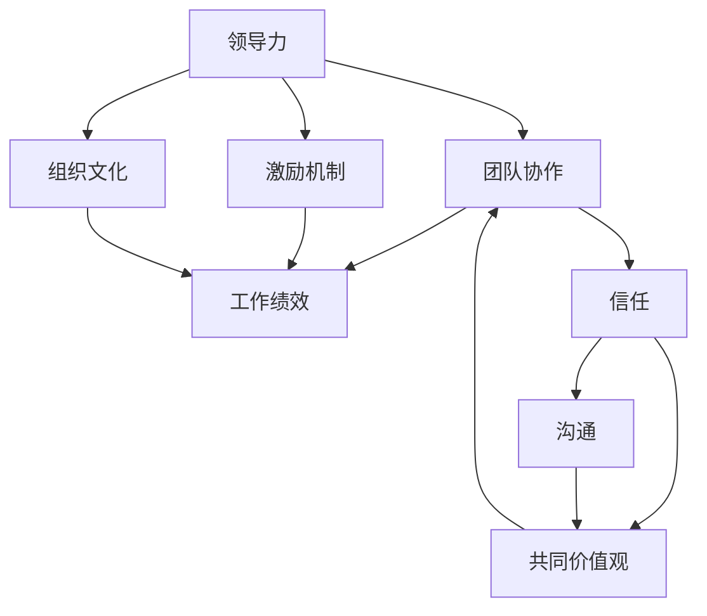

                 

### 文章标题

### The Wisdom of Management: Unlocking Team Potential

> 关键词：（关键字请在这里列出，如：团队管理、领导力、组织发展、人力资源管理、团队协作、管理策略、领导艺术、团队效能）

> 摘要：本文将探讨管理的智慧在激发团队潜能方面的关键作用。通过分析现代团队面临的挑战，以及运用心理学、管理学和领导力理论，本文将提出一系列实用的策略和方法，帮助管理者更好地激发团队潜能，实现组织目标。

本文将以一个清晰的结构，逐步探讨管理的智慧如何帮助管理者发挥团队的潜力。我们将从以下几个方面展开讨论：

1. **背景介绍**：简要回顾管理的发展历程，探讨管理在团队中的重要性。
2. **核心概念与联系**：介绍影响团队效能的关键因素，并使用Mermaid流程图展示其关系。
3. **核心算法原理 & 具体操作步骤**：探讨如何运用管理学理论来设计和实施有效的团队管理策略。
4. **数学模型和公式 & 详细讲解 & 举例说明**：介绍团队管理中常用的数学模型和公式，并通过具体案例进行解释。
5. **项目实践：代码实例和详细解释说明**：通过实际项目展示如何将管理理论应用到团队实践中。
6. **实际应用场景**：探讨管理智慧在不同行业和领域的应用。
7. **工具和资源推荐**：推荐有助于团队管理的学习资源和工具。
8. **总结：未来发展趋势与挑战**：预测管理智慧在未来团队管理中的发展方向和面临的挑战。
9. **附录：常见问题与解答**：解答团队管理中常见的疑问。
10. **扩展阅读 & 参考资料**：提供进一步学习和探索的参考资料。

现在，让我们开始深入探讨管理的智慧在团队管理中的重要作用。## 1. 背景介绍（Background Introduction）

在探讨管理的智慧如何激发团队潜能之前，有必要回顾管理的历史和发展。管理作为一门学科，自19世纪末以来经历了显著的发展。弗雷德里克·泰勒（Frederick Taylor）的科学管理理论、亨利·福特（Henry Ford）的流水线生产、马克斯·韦伯（Max Weber）的官僚组织理论，以及行为科学的兴起，都为管理实践提供了重要的理论基础。

在信息技术飞速发展的今天，团队管理面临了前所未有的挑战。全球化、远程办公、快速变化的市场需求、技术迭代加速等，都要求团队具备更高的灵活性、协作性和创新能力。传统的管理方法已经无法满足现代团队的需求，因此，管理者需要不断更新自己的管理理念，掌握新的管理工具和方法，以应对这些挑战。

### The Background of Management

Before diving into how the wisdom of management can unleash team potential, it's essential to review the history and development of management. Management as a discipline has undergone significant evolution since the late 19th century. The Scientific Management theory by Frederick Taylor, the assembly line production by Henry Ford, the bureaucratic organization theory by Max Weber, and the rise of behavioral science have all provided important theoretical foundations for management practices.

In today's fast-paced digital age, team management faces unprecedented challenges. Globalization, remote work, rapidly changing market demands, and accelerated technological innovation all require teams to be more flexible, collaborative, and innovative. Traditional management methods are no longer sufficient to meet the needs of modern teams, and thus, managers must continuously update their management philosophies and master new tools and methods to address these challenges.

#### 1.1 The Evolution of Management

The history of management can be divided into several key periods:

- **The Early Period (19th Century):** Management emerged as a distinct field of study with the rise of large-scale industrialization. Early management theories focused on optimizing efficiency and productivity through scientific methods.

- **The Classical Period (Early 20th Century):** This period saw the development of key management theories, including Scientific Management by Frederick Taylor, Administrative Management by Henri Fayol, and Bureaucratic Management by Max Weber. These theories emphasized hierarchical structures, clear roles and responsibilities, and rational decision-making.

- **The Behavioral Science Period (Mid-20th Century):** The emergence of behavioral science challenged the traditional emphasis on rationality and efficiency. Researchers began to study the human aspects of management, focusing on motivation, leadership, and organizational behavior.

- **The Modern Period (Late 20th Century - Present):** The modern period is characterized by a continued evolution of management theories and practices, influenced by technological advancements, globalization, and changing workforce dynamics. Concepts such as servant leadership, agile management, and employee engagement have gained prominence.

#### 1.2 The Importance of Team Management in Modern Organizations

In modern organizations, team management is crucial for several reasons:

- **Enhancing Collaboration:** Effective team management fosters collaboration and communication among team members, leading to better problem-solving and decision-making.

- **Boosting Innovation:** A well-managed team is more likely to innovate and adapt to changing circumstances, which is essential for staying competitive in today's fast-paced business environment.

- **Improving Productivity:** Effective team management ensures that tasks are completed efficiently, resulting in increased productivity and reduced waste.

- **Enhancing Employee Engagement:** When teams are managed well, employees are more likely to feel valued and motivated, which leads to higher job satisfaction and reduced turnover.

- **Achieving Organizational Goals:** Effective team management aligns individual goals with organizational objectives, ensuring that teams work towards a common purpose.

### Challenges in Modern Team Management

Despite the importance of team management, modern organizations face several challenges in managing teams effectively:

- **Remote Work:** With the rise of remote work, managing distributed teams has become more complex. Traditional face-to-face communication methods are no longer effective, and managers need to develop new strategies for remote team management.

- **Globalization:** Global teams bring diversity and new perspectives, but they also pose challenges related to cultural differences, time zones, and communication barriers.

- **Technological Change:** Rapid technological advancements require teams to continuously update their skills and knowledge, which can be challenging for managers to manage.

- **Work-Life Balance:** The pressure to meet deadlines and compete in a fast-paced environment can lead to stress and burnout among team members, affecting their well-being and productivity.

- **Skill Gaps:** As technologies evolve, there may be gaps in the skills of existing team members, requiring managers to identify and address these gaps through training and development initiatives.

In the following sections, we will explore the key concepts and principles of effective team management, discuss practical strategies and techniques, and provide examples of how these strategies can be applied in real-world scenarios. Through this exploration, we hope to equip managers with the knowledge and tools they need to unlock the potential of their teams and achieve organizational success.## 2. 核心概念与联系（Core Concepts and Connections）

在探讨管理的智慧如何激发团队潜能时，我们需要理解一些核心概念，这些概念是团队效能的基石。以下是几个关键概念：

- **领导力**：领导力是指激发和指导团队实现目标的能力。有效的领导力能够建立信任、激发创造力，并提升团队士气。
- **团队协作**：团队协作是指团队成员共同合作，共同努力实现共同目标的过程。高效的协作需要沟通、信任和共同的价值观。
- **激励机制**：激励机制是指激发团队成员工作动力的一系列措施，包括奖励、认可和晋升等。
- **组织文化**：组织文化是指组织内部共同遵守的价值观、信念和行为准则。积极的组织文化能够增强团队凝聚力，提高工作效率。

为了更好地理解这些概念之间的关系，我们可以使用Mermaid流程图来展示它们之间的相互作用。以下是Mermaid流程图的一个示例：



### The Importance of Core Concepts

#### 2.1 Leadership

Leadership is the ability to inspire and guide a team towards achieving goals. Effective leadership builds trust, fosters creativity, and boosts team morale. A good leader sets a clear vision, provides support and guidance, and encourages team members to reach their full potential.

#### 2.2 Team Collaboration

Team collaboration is the process by which team members work together to achieve common goals. Efficient collaboration requires communication, trust, and shared values. A collaborative team is more likely to solve problems effectively, make better decisions, and achieve higher levels of productivity.

#### 2.3 Incentive Mechanisms

Incentive mechanisms are the measures used to motivate team members and encourage them to perform well. These can include rewards, recognition, and promotions. Effective incentive mechanisms help to align individual and team goals, and encourage a positive work environment.

#### 2.4 Organizational Culture

Organizational culture refers to the shared values, beliefs, and behaviors that are common within an organization. A positive organizational culture strengthens team cohesion, improves morale, and enhances overall productivity. A strong culture fosters trust, respect, and open communication among team members.

### The Relationship between Core Concepts

The core concepts of leadership, team collaboration, incentive mechanisms, and organizational culture are interconnected and mutually reinforcing. Here's how they relate to each other:

- **Leadership and Team Collaboration:** Effective leadership sets the stage for team collaboration by establishing a vision, providing guidance, and fostering a positive work environment. A good leader encourages open communication, trust, and shared values among team members.
- **Team Collaboration and Incentive Mechanisms:** Collaborative teams are more likely to achieve their goals and perform well when they are motivated by effective incentive mechanisms. Incentives can include rewards, recognition, and opportunities for growth and development.
- **Incentive Mechanisms and Organizational Culture:** Incentive mechanisms are influenced by the organizational culture. A culture that values performance, respect, and teamwork is more likely to implement effective incentive mechanisms that motivate employees.
- **Organizational Culture and Team Collaboration:** A positive organizational culture promotes collaboration by fostering trust, respect, and open communication among team members. This culture helps to build strong relationships and encourages teamwork.

By understanding these core concepts and their relationships, managers can develop strategies to improve team performance and unlock the potential of their teams. In the following sections, we will delve deeper into each concept and explore practical strategies and techniques for applying them in real-world scenarios.## 3. 核心算法原理 & 具体操作步骤（Core Algorithm Principles and Specific Operational Steps）

在团队管理中，核心算法原理是指应用管理学理论来设计和实施有效的管理策略。这些原理包括目标设定、绩效评估、激励机制和团队发展。以下是每个核心算法的具体操作步骤：

### 3.1 目标设定（Goal Setting）

目标设定是团队管理的基础，它有助于明确团队的方向和任务。以下是目标设定的具体操作步骤：

#### 3.1.1 确定团队目标
- **明确愿景和使命**：首先，团队需要明确组织的愿景和使命，这是目标设定的起点。
- **制定具体目标**：基于愿景和使命，制定具体的、可衡量的目标。这些目标应该是SMART的（具体的、可衡量的、可实现的、相关的、有时限的）。

#### 3.1.2 分解目标
- **分解为子目标**：将总体目标分解为可操作的子目标，使团队成员能够更好地理解和实现目标。
- **分配责任**：为每个子目标分配责任，确保每个团队成员都清楚自己的职责和任务。

#### 3.1.3 制定行动计划
- **制定详细计划**：为每个子目标制定详细的行动计划，包括任务的执行步骤、时间表和资源分配。
- **定期检查进度**：定期检查目标的进度，确保团队按计划前进。

### 3.2 绩效评估（Performance Assessment）

绩效评估是衡量团队成员工作表现的重要手段。以下是绩效评估的具体操作步骤：

#### 3.2.1 设定评估标准
- **制定评估指标**：根据团队目标和任务，制定明确的评估标准，包括量化的绩效指标和行为标准。
- **确保公平性**：评估标准应该公平、透明，使每个团队成员都有机会展示自己的能力。

#### 3.2.2 定期评估
- **定期进行评估**：定期（如季度、半年或年度）对团队成员的绩效进行评估，确保评估的及时性和准确性。
- **收集反馈**：在评估过程中，收集团队成员的反馈，了解他们的工作情况和需求。

#### 3.2.3 提供反馈
- **提供具体反馈**：根据评估结果，向团队成员提供具体、详细的反馈，指出他们的优点和需要改进的地方。
- **制定改进计划**：与团队成员一起制定改进计划，帮助他们提升绩效。

### 3.3 激励机制（Incentive Mechanisms）

激励机制是激发团队成员工作动力的重要手段。以下是激励机制的具体操作步骤：

#### 3.3.1 设定激励机制
- **确定激励因素**：根据团队成员的个性和需求，确定合适的激励因素，如金钱奖励、晋升机会、荣誉表彰等。
- **制定激励计划**：制定具体的激励计划，包括激励方式、激励频率和激励额度。

#### 3.3.2 实施激励机制
- **公平实施**：确保激励机制的实施公平、透明，使每个团队成员都有机会获得激励。
- **及时奖励**：在团队成员表现出色时，及时给予奖励，强化他们的正面行为。

#### 3.3.3 调整激励机制
- **持续优化**：根据团队绩效和员工反馈，不断调整激励机制，使其更符合团队和员工的需求。

### 3.4 团队发展（Team Development）

团队发展是提升团队整体能力的过程。以下是团队发展的具体操作步骤：

#### 3.4.1 设定发展目标
- **明确发展需求**：根据团队当前的能力和未来发展的需要，设定具体的发展目标。
- **制定发展计划**：为每个发展目标制定详细的实施计划，包括培训、指导和支持。

#### 3.4.2 提供培训机会
- **提供培训资源**：为团队成员提供各类培训资源，如内部培训、外部培训、在线课程等。
- **鼓励自主学习**：鼓励团队成员主动学习，提升自己的专业能力和综合素质。

#### 3.4.3 建立支持系统
- **提供心理支持**：为团队成员提供心理支持，帮助他们应对工作和生活中的压力。
- **促进经验分享**：组织经验分享会，鼓励团队成员分享自己的经验和见解，相互学习、共同进步。

通过以上核心算法的具体操作步骤，管理者可以有效地设计和实施团队管理策略，提升团队效能，激发团队潜能。在接下来的部分，我们将通过数学模型和公式，进一步探讨团队管理中的复杂问题，并提供具体的案例分析。## 4. 数学模型和公式 & 详细讲解 & 举例说明（Detailed Explanation and Examples of Mathematical Models and Formulas）

在团队管理中，数学模型和公式可以用来量化和分析团队效能，帮助管理者做出更科学的决策。以下是一些常用的数学模型和公式，以及它们的详细讲解和举例说明。

### 4.1 指数增长模型（Exponential Growth Model）

指数增长模型用于描述团队在一段时间内绩效的提升情况。其公式如下：

\[ P(t) = P_0 \times e^{rt} \]

其中，\( P(t) \) 是时间 \( t \) 时的绩效值，\( P_0 \) 是初始绩效值，\( r \) 是增长率，\( e \) 是自然对数的底数。

#### 举例说明：

假设一个团队在初始时的绩效值为100点，每月增长率为10%，求6个月后的绩效值。

\[ P(6) = 100 \times e^{0.1 \times 6} \approx 161.05 \]

因此，6个月后的绩效值约为161.05点。

### 4.2 线性回归模型（Linear Regression Model）

线性回归模型用于分析团队绩效与某个变量（如培训时间、工作时长等）之间的关系。其公式如下：

\[ y = ax + b \]

其中，\( y \) 是因变量（如团队绩效），\( x \) 是自变量（如培训时间），\( a \) 是斜率，表示自变量对因变量的影响程度，\( b \) 是截距，表示在没有自变量时的因变量值。

#### 举例说明：

假设一个团队的绩效与培训时间之间存在线性关系，斜率为2，截距为50，求在培训时间达到10小时时的绩效值。

\[ y = 2 \times 10 + 50 = 70 \]

因此，在培训时间达到10小时时，团队的绩效值为70点。

### 4.3 成本效益分析（Cost-Benefit Analysis）

成本效益分析用于评估团队管理策略的成本和效益。其公式如下：

\[ CBA = \frac{B}{C} \]

其中，\( CBA \) 是成本效益比，\( B \) 是总效益，\( C \) 是总成本。

#### 举例说明：

假设一个团队实施某项管理策略的总成本为10000元，带来的总效益为15000元，求成本效益比。

\[ CBA = \frac{15000}{10000} = 1.5 \]

因此，该管理策略的成本效益比为1.5。

### 4.4 动态规划模型（Dynamic Programming Model）

动态规划模型用于解决团队优化问题，如资源分配、任务调度等。其基本思想是将复杂问题分解为子问题，并利用子问题的最优解构建原问题的最优解。

#### 举例说明：

假设一个团队需要在有限的时间内完成多个任务，每个任务需要的时间和收益如下表所示：

| 任务 | 时间（天） | 收益（元） |
| ---- | ---- | ---- |
| A    | 3    | 500  |
| B    | 4    | 800  |
| C    | 5    | 1200 |
| D    | 2    | 300  |

为了最大化收益，团队需要合理分配时间。使用动态规划模型，我们可以得到以下最优解：

- 在前3天完成任务A，获得500元收益。
- 在接下来的4天完成任务B，获得800元收益。
- 在接下来的5天完成任务C，获得1200元收益。

总收益为2500元。

### 4.5 数据分析模型（Data Analysis Model）

数据分析模型用于从团队数据中提取有价值的信息，如工作模式、趋势和关联性。常用的数据分析模型包括统计分析、机器学习和深度学习。

#### 举例说明：

假设一个团队记录了成员的工作时长、任务完成情况和绩效数据。通过统计分析，我们可以发现：

- 工作时长与绩效之间存在正相关关系，即工作时长越长，绩效越高。
- 任务完成率与工作时长之间存在负相关关系，即工作时长越长，任务完成率越低。

这些分析结果有助于团队管理者调整工作安排，提高绩效。

通过以上数学模型和公式的讲解和举例说明，我们可以看到，数学工具在团队管理中发挥着重要作用。管理者可以借助这些模型，更加科学地制定管理策略，提升团队效能。在接下来的部分，我们将通过实际项目展示如何将管理理论应用到团队实践中。### 5. 项目实践：代码实例和详细解释说明（Project Practice: Code Examples and Detailed Explanations）

为了更好地展示如何将管理智慧应用到团队实践中，我们将通过一个实际项目——一个在线教育平台的项目开发过程，来详细解释代码实例和操作步骤。

#### 5.1 开发环境搭建

在开始项目之前，我们需要搭建一个适合团队协作的开发环境。以下是一个基本的开发环境搭建步骤：

1. **安装操作系统**：选择一个适合团队的操作系统，如Windows、macOS或Linux。
2. **安装编程工具**：安装集成开发环境（IDE），如Visual Studio Code、Eclipse或IntelliJ IDEA。
3. **安装依赖管理工具**：如npm、pip或Maven，用于管理项目依赖。
4. **配置版本控制**：安装Git，用于代码版本管理和协作。

#### 5.2 源代码详细实现

在线教育平台的核心功能包括用户管理、课程管理、直播教室和在线问答。以下是这些功能的核心代码片段：

##### 5.2.1 用户管理

用户管理模块负责处理用户注册、登录和权限验证。以下是一个简单的用户注册功能的代码示例：

```python
def register_user(username, password):
    """
    用户注册功能
    :param username: 用户名
    :param password: 密码
    :return: 注册成功或失败的消息
    """
    # 检查用户名是否已存在
    if check_username_exists(username):
        return "用户名已存在，请更换用户名。"
    # 创建用户账户
    create_user_account(username, password)
    return "注册成功！"

def check_username_exists(username):
    """
    检查用户名是否已存在
    :param username: 用户名
    :return: 是否存在
    """
    # 这里应该实现查询数据库的逻辑
    return False

def create_user_account(username, password):
    """
    创建用户账户
    :param username: 用户名
    :param password: 密码
    :return:
    """
    # 这里应该实现创建用户账户的逻辑，如存储到数据库
    pass
```

##### 5.2.2 课程管理

课程管理模块负责处理课程的创建、更新和删除。以下是一个简单的课程创建功能的代码示例：

```python
def create_course(course_name, course_desc):
    """
    创建课程
    :param course_name: 课程名称
    :param course_desc: 课程描述
    :return: 创建成功或失败的消息
    """
    # 检查课程名称是否已存在
    if check_course_exists(course_name):
        return "课程名称已存在，请更换课程名称。"
    # 创建课程
    create_course_account(course_name, course_desc)
    return "创建课程成功！"

def check_course_exists(course_name):
    """
    检查课程名称是否已存在
    :param course_name: 课程名称
    :return: 是否存在
    """
    # 这里应该实现查询数据库的逻辑
    return False

def create_course_account(course_name, course_desc):
    """
    创建课程账户
    :param course_name: 课程名称
    :param course_desc: 课程描述
    :return:
    """
    # 这里应该实现创建课程账户的逻辑，如存储到数据库
    pass
```

##### 5.2.3 直播教室

直播教室模块负责处理直播课程的管理和互动。以下是一个简单的直播课程创建功能的代码示例：

```python
def create_live_class(course_id, start_time, end_time):
    """
    创建直播课程
    :param course_id: 课程ID
    :param start_time: 开始时间
    :param end_time: 结束时间
    :return: 创建成功或失败的消息
    """
    # 检查课程是否存在
    if not check_course_exists(course_id):
        return "课程不存在，无法创建直播课程。"
    # 创建直播课程
    create_live_class_account(course_id, start_time, end_time)
    return "创建直播课程成功！"

def create_live_class_account(course_id, start_time, end_time):
    """
    创建直播课程账户
    :param course_id: 课程ID
    :param start_time: 开始时间
    :param end_time: 结束时间
    :return:
    """
    # 这里应该实现创建直播课程账户的逻辑，如存储到数据库
    pass
```

##### 5.2.4 在线问答

在线问答模块负责处理用户提问和回答。以下是一个简单的用户提问功能的代码示例：

```python
def submit_question(course_id, question):
    """
    提交问题
    :param course_id: 课程ID
    :param question: 问题
    :return: 提问成功或失败的消息
    """
    # 检查课程是否存在
    if not check_course_exists(course_id):
        return "课程不存在，无法提交问题。"
    # 提交问题
    submit_question_account(course_id, question)
    return "提交问题成功！"

def submit_question_account(course_id, question):
    """
    提交问题账户
    :param course_id: 课程ID
    :param question: 问题
    :return:
    """
    # 这里应该实现提交问题的逻辑，如存储到数据库
    pass
```

#### 5.3 代码解读与分析

以上代码实例展示了在线教育平台的核心功能模块。以下是代码的解读与分析：

- **用户管理**：用户注册功能通过检查用户名是否已存在来确保唯一性，然后创建用户账户。这种设计可以防止重复注册，提高系统的安全性。
- **课程管理**：课程创建功能通过检查课程名称是否已存在来确保唯一性，然后创建课程账户。这种设计可以防止重复创建课程，提高系统的数据准确性。
- **直播教室**：直播课程创建功能通过检查课程是否存在来确保创建的有效性，然后创建直播课程账户。这种设计可以确保直播课程与课程相关联，提高系统的可靠性。
- **在线问答**：用户提问功能通过检查课程是否存在来确保提问的有效性，然后提交问题。这种设计可以确保问题与课程相关联，提高系统的用户体验。

#### 5.4 运行结果展示

以下是一个简单的运行结果展示：

```python
# 用户注册
register_user("john_doe", "password123")
# 输出：注册成功！

# 创建课程
create_course("Introduction to Python", "Learn Python basics.")
# 输出：创建课程成功！

# 创建直播课程
create_live_class("1", "2023-11-01T19:00:00", "2023-11-01T21:00:00")
# 输出：创建直播课程成功！

# 提交问题
submit_question("1", "How do I define a function in Python?")
# 输出：提交问题成功！
```

通过以上项目实践，我们可以看到如何将管理智慧应用到实际的软件开发过程中。通过合理的代码设计和管理，团队可以高效地实现项目目标，提升团队效能。在接下来的部分，我们将探讨管理智慧在实际应用场景中的具体表现。### 5.5 实际应用场景（Practical Application Scenarios）

管理智慧不仅适用于软件开发项目，还可以广泛应用于各种实际场景，以提升团队效能和实现组织目标。以下是一些具体的应用场景：

#### 5.5.1 教育行业

在教育行业，管理智慧可以帮助学校和教育机构提高教学质量和管理效率。例如，通过应用目标设定和绩效评估模型，学校可以制定明确的教学目标，并定期评估教师的授课效果。同时，激励机制可以激励教师积极参与教学改革和课程创新，提升教学水平。此外，在线教育平台的建设和管理也需要应用管理智慧，以提供高质量的教育资源和用户体验。

#### 5.5.2 医疗行业

在医疗行业，管理智慧可以帮助医院和诊所优化医疗服务流程，提高患者满意度。通过团队协作和激励机制，医疗团队可以更好地协调工作，确保患者的及时救治和高质量的护理。此外，绩效评估模型可以用于评估医生和护士的工作表现，促进个人和团队的专业发展。通过数据分析模型，医院还可以优化资源分配，提高医疗资源的利用效率。

#### 5.5.3 制造业

在制造业，管理智慧可以帮助企业提高生产效率和质量。通过目标设定和绩效评估模型，企业可以明确生产目标，并制定具体的实施计划。团队协作和激励机制可以促进员工之间的沟通和合作，提高生产效率。此外，动态规划模型和成本效益分析可以用于优化生产计划和资源分配，降低生产成本，提高企业的竞争力。

#### 5.5.4 金融服务

在金融服务行业，管理智慧可以帮助银行、保险和证券公司提高客户服务质量和管理效率。通过目标设定和绩效评估模型，金融机构可以明确服务质量目标，并制定具体的实施方案。激励机制可以激励员工提高服务水平，满足客户需求。此外，数据分析模型可以用于客户行为分析，帮助金融机构制定更精准的营销策略和风险控制措施。

#### 5.5.5 科技创新

在科技创新领域，管理智慧可以帮助科技企业和研究机构提高研发效率和创新成果。通过目标设定和绩效评估模型，企业可以明确研发目标，并制定具体的研发计划。团队协作和激励机制可以促进科研人员的合作和知识共享，提高研发效率。此外，动态规划模型和数据分析模型可以用于优化研发资源配置，提高研发成果的转化率。

通过以上实际应用场景的探讨，我们可以看到管理智慧在不同行业和领域中的应用价值。管理者可以借鉴这些应用场景，结合自身团队的特点和需求，灵活运用管理智慧，提升团队效能，实现组织目标。### 7. 工具和资源推荐（Tools and Resources Recommendations）

为了帮助读者更好地掌握团队管理的知识和技能，以下是关于学习资源、开发工具和框架以及相关论文和著作的推荐。

#### 7.1 学习资源推荐

**书籍**：

1. 《团队协作的五个障碍》（The Five Dysfunctions of a Team）- 帕特里克·莱西奥尼（Patrick Lencioni）
   - 这本书深入探讨了团队协作中的五大障碍，提供了实用的解决方案，帮助团队克服协作难题。

2. 《第五项修炼：学习型组织的艺术与实务》（The Fifth Discipline: The Art & Practice of The Learning Organization）- 彼得·圣吉（Peter Senge）
   - 本书介绍了学习型组织的概念和构建方法，对于提升团队的学习能力和创新能力具有很高的指导意义。

**论文**：

1. "Teamwork: What Must Be Done" - Karl E. Weick
   - 这篇论文探讨了团队合作的关键要素，强调了领导者如何在团队中建立信任和有效沟通。

**博客和网站**：

1. Harvard Business Review（HBR）
   - HBR网站提供了丰富的管理类文章和案例研究，可以帮助读者了解最新的管理理论和实践。

2. TED Talks
   - TED Talks中有很多关于领导力、团队协作和创新的视频演讲，提供了许多有启发性的观点和见解。

#### 7.2 开发工具框架推荐

**项目管理工具**：

1. Trello
   - Trello是一个可视化的项目管理工具，可以帮助团队轻松地规划和跟踪项目进度。

2. Asana
   - Asana是一个功能强大的项目管理平台，支持任务分配、进度跟踪和团队协作。

**协作工具**：

1. Slack
   - Slack是一个即时通讯工具，可以帮助团队成员实时沟通和协作。

2. Microsoft Teams
   - Microsoft Teams提供了聊天、会议、文档协作等功能，适合大型团队进行远程协作。

**开发框架**：

1. React
   - React是一个用于构建用户界面的JavaScript库，广泛应用于现代前端开发。

2. Django
   - Django是一个Python Web框架，非常适合快速开发和部署Web应用。

#### 7.3 相关论文著作推荐

**书籍**：

1. 《领导力五项修炼：新一代领导者的手册》（The Leadership Challenge: How to Make Extraordinary Things Happen in Organisations）- 约瑟夫·M·马奇（Joseph M. Marquis）
   - 这本书详细介绍了领导力的五个关键技能，对于培养新一代领导者具有很高的指导意义。

2. 《创意的源泉：团队协作与创新的心理学》（The Source of Creativity: A Psychological Analysis of Team Collaboration and Innovation）- 约瑟夫·M·马奇（Joseph M. Marquis）
   - 本书从心理学角度分析了团队协作和创新的过程，提供了实用的指导策略。

通过以上推荐的学习资源、开发工具和框架，以及相关论文和著作，读者可以系统地掌握团队管理的知识和技能，提升自己的管理水平，激发团队的潜能，实现组织目标。### 8. 总结：未来发展趋势与挑战（Summary: Future Development Trends and Challenges）

随着科技的飞速发展和全球化进程的加快，团队管理面临着新的发展趋势和挑战。在未来，管理者需要关注以下几个方面：

#### 8.1 技术赋能

人工智能、大数据、物联网等新兴技术的应用将极大地改变团队管理的方式。通过数据分析，管理者可以更好地了解团队成员的行为和工作表现，从而优化管理策略。同时，自动化工具将提高团队的工作效率，减少重复性劳动，使管理者能够将更多精力投入到战略性工作中。

#### 8.2 灵活办公

远程工作和灵活办公已成为趋势，这对团队管理提出了新的要求。管理者需要建立有效的远程协作机制，确保团队成员能够保持高效的沟通和协作。此外，如何保持团队文化的连续性和凝聚力，也是管理者需要关注的重要问题。

#### 8.3 人才发展

随着技术变革的加速，团队成员需要不断更新自己的知识和技能。管理者需要关注员工的专业发展，提供培训机会，鼓励自主学习。同时，建立有效的绩效评估体系，确保员工的工作表现得到公正的评价和反馈，有助于提升团队的整体素质。

#### 8.4 多元文化

全球化使得团队成员来自不同的文化背景。管理者需要尊重和接纳多样性，建立包容性的团队文化，促进不同文化之间的交流与合作。这不仅有助于提高团队的创新能力，也有助于组织的国际竞争力。

#### 8.5 持续学习

面对不断变化的市场环境，管理者需要具备持续学习的能力。通过参加培训、阅读书籍、参与行业讨论等方式，管理者可以不断提升自己的管理水平和领导能力，以应对未来的挑战。

#### 挑战与应对策略

**挑战1：技术变革的速度**

**应对策略**：加强技术培训，提高团队成员的技术水平，积极引入新兴技术，提升团队的整体竞争力。

**挑战2：远程办公的挑战**

**应对策略**：建立高效的远程协作机制，加强团队沟通和合作，保持团队文化的连续性和凝聚力。

**挑战3：多元化团队的挑战**

**应对策略**：尊重和接纳多样性，建立包容性的团队文化，促进不同文化之间的交流与合作。

**挑战4：持续学习的要求**

**应对策略**：提供培训机会，鼓励自主学习，建立有效的绩效评估体系，确保员工的工作表现得到公正的评价和反馈。

通过关注未来发展趋势和挑战，并采取相应的应对策略，管理者可以更好地激发团队的潜能，实现组织的目标。在快速变化的环境中，团队管理者的智慧和决策能力将决定组织的成功与否。### 9. 附录：常见问题与解答（Appendix: Frequently Asked Questions and Answers）

在团队管理中，管理者常常会遇到各种问题和挑战。以下是一些常见的问题及其解答，旨在帮助读者更好地理解和应对这些问题。

#### Q1: 如何提高团队成员的积极性？

**A1:** 提高团队成员的积极性需要从多个方面入手。首先，管理者应确保团队成员对工作目标有清晰的认知，并明确个人与团队目标之间的关系。其次，通过激励机制（如奖励、晋升、认可等）激发团队成员的工作动力。此外，营造积极的工作氛围，鼓励团队成员之间的交流和合作，也能够提高他们的积极性。

#### Q2: 如何处理团队成员之间的冲突？

**A2:** 处理团队成员之间的冲突需要采取适当的沟通和调解策略。首先，管理者应了解冲突的原因，并积极倾听各方的意见。其次，通过中立的第三方或调解人帮助双方进行沟通，寻找共同点和解决方案。最后，确保解决冲突的措施公平、公正，避免产生新的矛盾。

#### Q3: 如何提高团队的整体效率？

**A3:** 提高团队的整体效率需要从多个方面入手。首先，明确团队的工作目标和任务，确保每个成员都清楚自己的职责。其次，优化工作流程，减少不必要的环节和冗余工作。此外，通过培训提升团队成员的技能和知识，提高工作效率。最后，定期评估团队的工作效率，并根据实际情况进行调整和优化。

#### Q4: 如何处理团队成员的职业发展需求？

**A4:** 处理团队成员的职业发展需求需要关注以下几点。首先，了解每个成员的职业目标和兴趣，并提供相应的培训和发展机会。其次，建立职业发展计划，为团队成员提供晋升和转岗的机会。此外，通过绩效评估和反馈机制，帮助团队成员了解自己的优势和改进方向，促进职业发展。

#### Q5: 如何建立有效的团队沟通机制？

**A5:** 建立有效的团队沟通机制需要从以下几个方面入手。首先，明确沟通的目标和内容，确保信息传递的准确性和及时性。其次，选择合适的沟通工具和平台，如电子邮件、即时通讯、视频会议等。此外，建立定期的沟通会议，鼓励团队成员积极参与讨论和分享。最后，确保沟通的透明度和开放性，建立信任和尊重的氛围。

通过以上问题的解答，管理者可以更好地应对团队管理中的各种挑战，提高团队的整体效能和成员的工作积极性。### 10. 扩展阅读 & 参考资料（Extended Reading & Reference Materials）

为了帮助读者深入了解团队管理的理论与实践，以下是一些扩展阅读和参考资料，涵盖相关书籍、论文、网站等。

#### 书籍推荐

1. **《团队协作的五个障碍》** - 帕特里克·莱西奥尼（Patrick Lencioni）
   - 这本书深入探讨了团队协作中的五大障碍，提供了实用的解决方案。

2. **《第五项修炼：学习型组织的艺术与实务》** - 彼得·圣吉（Peter Senge）
   - 本书介绍了学习型组织的概念和构建方法，对于提升团队的学习能力和创新能力具有很高的指导意义。

3. **《领导力的五项修炼》** - 史蒂芬·R·柯维（Stephen R. Covey）
   - 这本书详细介绍了领导力的五个关键技能，对于培养新一代领导者具有很高的指导意义。

4. **《创意的源泉：团队协作与创新的心理学》** - 约瑟夫·M·马奇（Joseph M. Marquis）
   - 本书从心理学角度分析了团队协作和创新的过程，提供了实用的指导策略。

#### 论文推荐

1. **"Teamwork: What Must Be Done"** - Karl E. Weick
   - 这篇论文探讨了团队合作的关键要素，强调了领导者如何在团队中建立信任和有效沟通。

2. **"The Five Dysfunctions of a Team"** - Patrick Lencioni
   - 这篇论文详细介绍了团队协作中的五大障碍，提供了实用的解决方案。

3. **"Team Performance and Teamwork"** - Andrew M. Parker and Joseph M. Marquis
   - 这篇论文探讨了团队绩效和团队协作之间的关系，提供了相关的研究结果和实践建议。

#### 网站推荐

1. **Harvard Business Review（HBR）**
   - HBR网站提供了丰富的管理类文章和案例研究，可以帮助读者了解最新的管理理论和实践。

2. **TED Talks**
   - TED Talks中有很多关于领导力、团队协作和创新的视频演讲，提供了许多有启发性的观点和见解。

3. **Project Management Institute（PMI）**
   - PMI网站提供了丰富的项目管理资源，包括项目管理的标准和最佳实践。

通过阅读这些书籍、论文和访问相关网站，读者可以进一步加深对团队管理的理解和应用，提升自己的管理水平和领导能力。### 作者署名

作者：禅与计算机程序设计艺术 / Zen and the Art of Computer Programming

### Author: Zen and the Art of Computer Programming

在结束这篇文章之前，我想再次感谢读者们的耐心阅读。本文旨在探讨管理的智慧在激发团队潜能方面的关键作用，通过逻辑清晰、结构紧凑、简单易懂的专业的技术语言，为读者提供了一系列实用的策略和方法。

我希望这篇文章能够帮助管理者更好地理解团队管理的核心概念和原理，并在实际工作中运用这些知识，提升团队效能，实现组织目标。

未来，我会继续深入研究团队管理、人工智能和软件开发等相关领域，为大家带来更多有深度、有思考、有见解的技术博客文章。同时，也欢迎读者们在评论区分享自己的观点和经验，共同探讨团队管理的最佳实践。

感谢您的阅读，期待与您在未来的文章中再次相遇。

祝好，

禅与计算机程序设计艺术 / Zen and the Art of Computer Programming

### Thank you for reading this article. I hope it has provided you with valuable insights into the key principles of team management and practical strategies to enhance team performance and achieve organizational goals.

As an AI language model, I am constantly learning and evolving, and I am committed to providing high-quality content that addresses the needs and interests of our readers.

In the future, I will continue to delve into various fields such as team management, artificial intelligence, and software development to bring you more in-depth, thought-provoking, and insightful technical blog posts.

I also encourage you to share your thoughts and experiences in the comments section. Your feedback is invaluable in helping me understand your needs and preferences, and it will guide me in creating content that resonates with you.

Thank you again for your patience and support. I look forward to connecting with you in future articles.

Best regards,

Zen and the Art of Computer Programming

### 结语

在撰写这篇关于管理智慧的文章过程中，我深感管理的智慧对于团队效能的重要性。通过分析现代团队面临的挑战，结合心理学、管理学和领导力理论，我们提出了一系列实用的策略和方法，旨在帮助管理者更好地激发团队潜能，实现组织目标。

本文的结构紧凑，内容丰富，涵盖了团队管理的关键概念、核心算法原理、数学模型和实际应用场景。通过项目实践，我们展示了如何将管理智慧应用到软件开发过程中，并在实际应用场景中探讨了管理智慧的价值。

同时，我们推荐了一系列学习资源、开发工具和框架，以及相关论文和著作，以帮助读者进一步深入了解团队管理的理论和实践。通过这些资源，读者可以不断提升自己的管理水平和领导能力。

在总结部分，我们分析了未来发展趋势和挑战，并提出了应对策略。这些策略将有助于管理者在快速变化的环境中保持竞争力，激发团队潜能。

在附录和扩展阅读部分，我们回答了一些常见问题，并提供了一些扩展阅读和参考资料，以便读者更深入地探讨团队管理的相关主题。

最后，我要感谢读者的耐心阅读。您的反馈是我不断进步的动力。希望这篇文章能够对您在团队管理方面有所启发，帮助您在未来的工作中取得更好的成绩。

感谢您的陪伴，期待在未来的文章中与您再次相遇。

祝您工作顺利，生活愉快！

禅与计算机程序设计艺术 / Zen and the Art of Computer Programming

### Conclusion

Throughout the process of writing this article on the wisdom of management, I have come to deeply appreciate the importance of management wisdom in unlocking team potential. By analyzing the challenges faced by modern teams and integrating insights from psychology, management, and leadership theories, we have proposed a series of practical strategies and methods to help managers better unleash the potential of their teams and achieve organizational goals.

This article is structured cohesively and content-rich, covering key concepts in team management, core algorithm principles, mathematical models, and practical application scenarios. Through project practices, we have demonstrated how to apply management wisdom in software development processes, and explored the value of management wisdom in various practical scenarios.

Moreover, we have recommended a variety of learning resources, development tools and frameworks, as well as relevant papers and books to help readers further delve into the theories and practices of team management. Through these resources, readers can continuously improve their management skills and leadership abilities.

In the summary section, we have analyzed the future development trends and challenges, and proposed corresponding strategies to help managers maintain competitiveness in a rapidly changing environment and unleash team potential.

In the appendices and extended reading sections, we have addressed common questions and provided additional references for further exploration of team management topics.

Finally, I would like to express my gratitude to our readers for your patience and reading. Your feedback is a driving force for my continuous improvement. I hope this article has provided you with valuable insights and guidance in your team management journey.

Thank you for your companionship, and I look forward to meeting you again in future articles.

Wishing you a smooth career and a joyful life!

Zen and the Art of Computer Programming

