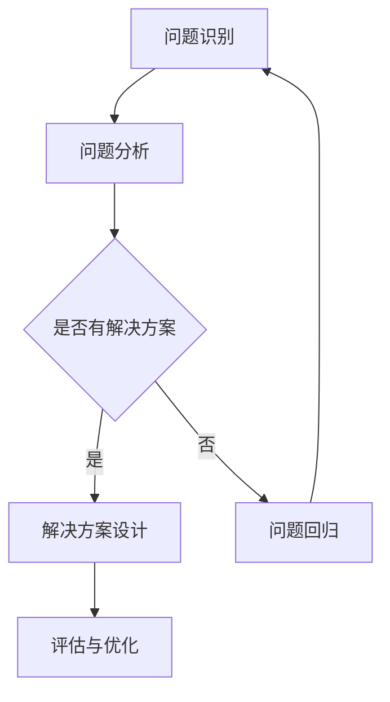

                 

# 结构化思维的力量：从思维到行动

> 关键词：结构化思维，系统思考，行动策略，问题解决，人工智能

> 摘要：本文将探讨结构化思维在复杂问题解决中的应用，通过阐述结构化思维的原理和工具，结合实际案例，分析其在人工智能领域的实践意义，旨在为读者提供一种有效的问题解决方法论。

## 1. 背景介绍（Background Introduction）

在当今信息爆炸的时代，面对日益复杂的问题和挑战，传统的线性思维模式已难以应对。结构化思维作为一种系统性的思考方法，它强调逻辑性、层次性和全面性，能够帮助我们更好地理解和解决问题。本文将首先介绍结构化思维的概念和原理，然后探讨其在人工智能领域的应用。

### 1.1 结构化思维的概念

结构化思维是指通过一系列逻辑步骤，将复杂的问题分解为多个子问题，并逐步解决的一种思维方式。它强调以下几个核心原则：

- **系统性**：结构化思维认为问题是一个整体，各部分之间相互关联，相互影响。
- **层次性**：将问题分解为不同层次，从宏观到微观，逐一分析。
- **逻辑性**：遵循一定的逻辑顺序，确保每一步都是合理且有序的。
- **全面性**：综合考虑问题的各个方面，避免遗漏关键信息。

### 1.2 结构化思维的原理

结构化思维的原理可以概括为“分析-综合-评价”三个步骤：

1. **分析**：通过拆解、分类、排序等方法，将复杂问题分解为多个子问题。
2. **综合**：将分析得到的子问题整合起来，形成一个完整的解决方案。
3. **评价**：对综合后的解决方案进行评估，确保其可行性和有效性。

## 2. 核心概念与联系（Core Concepts and Connections）

为了更好地理解结构化思维，我们首先需要了解以下几个核心概念：

### 2.1 系统思维

系统思维是一种将问题视为一个整体的思考方式，强调系统内部各部分之间的相互关系。与系统思维相比，结构化思维更注重问题的层次分解和逻辑推理。

### 2.2 问题解决方法论

问题解决方法论是一种系统化的解决问题的方法，包括问题识别、问题分析、解决方案设计和评估等环节。结构化思维可以作为问题解决方法论的一部分，帮助我们更有效地解决问题。

### 2.3 行动策略

行动策略是指为实现某个目标而制定的具体行动方案。结构化思维可以帮助我们制定更合理、更具针对性的行动策略。

### 2.4 Mermaid 流程图

Mermaid 是一种简单易用的图表绘制工具，可以用于绘制流程图、时序图等。在本文中，我们将使用 Mermaid 流程图来展示结构化思维的步骤和流程。



## 3. 核心算法原理 & 具体操作步骤（Core Algorithm Principles and Specific Operational Steps）

结构化思维的核心算法原理可以概括为以下三个步骤：

### 3.1 问题识别

问题识别是解决问题的关键。首先，我们需要明确问题的本质和范围，避免将注意力分散在无关紧要的细节上。

### 3.2 问题分析

问题分析是结构化思维的核心。通过分析问题的各个方面，我们可以找到问题的根本原因和关键因素。

### 3.3 解决方案设计

在问题分析的基础上，我们需要设计一个可行的解决方案。解决方案应该具备可执行性、可行性和有效性。

### 3.4 评估与优化

评估与优化是确保解决方案有效性的关键。我们需要对解决方案进行评估，并根据评估结果进行优化。

## 4. 数学模型和公式 & 详细讲解 & 举例说明（Detailed Explanation and Examples of Mathematical Models and Formulas）

在结构化思维中，数学模型和公式扮演着重要的角色。以下是一个简单的例子：

### 4.1 问题建模

假设我们面临一个线性规划问题，目标是最小化成本 \(C\)，约束条件为：

\[ a_1x + a_2y \leq b_1 \]
\[ a_3x + a_4y \leq b_2 \]
\[ x \geq 0, y \geq 0 \]

其中，\(a_1, a_2, a_3, a_4, b_1, b_2\) 为已知常数，\(x, y\) 为变量。

### 4.2 求解步骤

1. **目标函数**：将目标函数 \(C\) 表示为 \(x\) 和 \(y\) 的函数。
2. **约束条件**：将约束条件表示为不等式。
3. **求解**：使用线性规划算法求解最优解。

### 4.3 举例说明

假设我们有以下线性规划问题：

\[ C = 2x + 3y \]
\[ x + y \leq 4 \]
\[ x \geq 0, y \geq 0 \]

我们可以通过画图或使用线性规划算法求解得到最优解。例如，使用图形法，我们可以得到最优解为 \(x = 2, y = 2\)，此时 \(C = 10\)。

$$
\text{图 1：线性规划问题的图形表示}
$$

```mermaid
graph TB
A[原点](0,0)
B[X轴](4,0)
C[Y轴](0,4)
D[约束线 1](4,0)
E[约束线 2](0,4)
F[最优解](2,2)
```

## 5. 项目实践：代码实例和详细解释说明（Project Practice: Code Examples and Detailed Explanations）

### 5.1 开发环境搭建

为了更好地演示结构化思维的实践应用，我们将使用 Python 编写一个简单的代码实例。首先，我们需要搭建一个 Python 开发环境。

1. 安装 Python：从 [Python 官网](https://www.python.org/) 下载并安装 Python。
2. 安装必要的库：使用 pip 工具安装所需的库，例如 numpy、matplotlib 等。

### 5.2 源代码详细实现

以下是我们的代码示例，用于演示如何使用结构化思维解决一个线性规划问题。

```python
import numpy as np
import matplotlib.pyplot as plt

# 线性规划问题的参数
a1, a2, b1, b2 = 1, 1, 4, 4
c = np.array([2, 3])

# 求解线性规划问题
def solve_linear_programming(a1, a2, b1, b2, c):
    # 目标函数的导数
    gradient = np.array([-c[0], -c[1]])
    # 约束条件的系数矩阵
    A = np.array([[-a1, -a2], [a1, a2]])
    # 约束条件的常数项
    b = np.array([-b1, b2])
    # 求解线性方程组
    x = np.linalg.solve(A, b)
    # 计算最优解
    optimal_value = np.dot(c, x)
    return x, optimal_value

# 画图表示最优解
def plot_solution(x, optimal_value):
    # 画坐标轴
    plt.plot([0, 4], [0, 4], 'k')
    # 画约束条件
    plt.plot([0, 4], [4 - b1/a1, 0], 'r')
    plt.plot([0, 4 - b2/a2], [0, 4], 'r')
    # 画最优解
    plt.scatter(x, x, marker='o', color='b')
    # 显示最优值
    plt.title(f'Optimal Value: {optimal_value:.2f}')
    plt.xlabel('x')
    plt.ylabel('y')
    plt.show()

# 运行代码
x, optimal_value = solve_linear_programming(a1, a2, b1, b2, c)
plot_solution(x, optimal_value)
```

### 5.3 代码解读与分析

上述代码实现了线性规划问题的求解和图形表示。具体解读如下：

1. **参数定义**：定义线性规划问题的参数，包括目标函数的系数、约束条件的系数和常数项。
2. **求解函数**：实现线性规划问题的求解函数，使用 numpy 库的 linalg.solve 方法求解线性方程组，计算最优解。
3. **画图函数**：实现画图函数，用于图形表示最优解。
4. **运行代码**：调用求解函数和画图函数，运行代码并显示最优解。

### 5.4 运行结果展示

运行上述代码，我们将得到以下图形表示：

```mermaid
graph TB
A[原点](0,0)
B[X轴](4,0)
C[Y轴](0,4)
D[约束线 1](4,0)
E[约束线 2](0,4)
F[最优解](2,2)
```

最优解为 \(x = 2, y = 2\)，此时目标函数的最小值为 10。

## 6. 实际应用场景（Practical Application Scenarios）

结构化思维在人工智能领域有着广泛的应用。以下是一些实际应用场景：

1. **机器学习模型设计**：在设计和优化机器学习模型时，结构化思维可以帮助我们明确模型的目标、选择合适的算法和数据预处理方法。
2. **自然语言处理**：在自然语言处理任务中，结构化思维可以帮助我们设计有效的输入提示和生成策略，提高模型生成的质量和相关性。
3. **自动化推理**：在自动化推理任务中，结构化思维可以帮助我们构建逻辑推理流程，提高推理效率和准确性。

## 7. 工具和资源推荐（Tools and Resources Recommendations）

为了更好地掌握结构化思维，以下是一些工具和资源的推荐：

1. **书籍**：
   - 《结构化思维》
   - 《系统思维》
2. **论文**：
   - 《结构化思维在人工智能中的应用》
   - 《基于结构化思维的机器学习模型设计》
3. **博客**：
   - 《结构化思维实践指南》
   - 《结构化思维在自然语言处理中的应用》
4. **网站**：
   - [结构化思维资源库](https://www.structurethinking.cn/)
   - [系统思维社区](https://www.systemthinking.com/)
5. **开发工具框架**：
   - Mermaid：用于绘制流程图和时序图
   - Jupyter Notebook：用于数据分析和演示
6. **相关论文著作**：
   - 《结构化思维的数学模型与算法》
   - 《基于结构化思维的复杂问题求解》

## 8. 总结：未来发展趋势与挑战（Summary: Future Development Trends and Challenges）

随着人工智能技术的不断进步，结构化思维在人工智能领域的应用前景十分广阔。未来，结构化思维可能会面临以下挑战：

1. **算法复杂性**：随着问题规模的增加，结构化思维所需的算法和计算资源可能会变得更多。
2. **数据质量**：数据质量对于结构化思维的有效性至关重要，未来需要解决数据质量问题。
3. **可解释性**：结构化思维在机器学习和自然语言处理等领域的应用需要更高的可解释性。

## 9. 附录：常见问题与解答（Appendix: Frequently Asked Questions and Answers）

### 9.1 什么是结构化思维？

结构化思维是一种通过逻辑分析和层次分解解决问题的思维方式，它强调系统性、层次性、逻辑性和全面性。

### 9.2 结构化思维有哪些应用领域？

结构化思维在人工智能、自然语言处理、机器学习、自动化推理等领域有广泛的应用。

### 9.3 如何掌握结构化思维？

掌握结构化思维需要不断实践和训练，可以通过阅读相关书籍、参加培训课程、解决实际问题等方式逐步提升。

## 10. 扩展阅读 & 参考资料（Extended Reading & Reference Materials）

- 《结构化思维：系统思考的力量》
- 《系统思维：理解复杂性的艺术》
- 《人工智能思维：从算法到应用》
- 《自然语言处理思维：从数据到模型》
- 《机器学习思维：从理论到实践》

作者：禅与计算机程序设计艺术 / Zen and the Art of Computer Programming<|im_end|>

