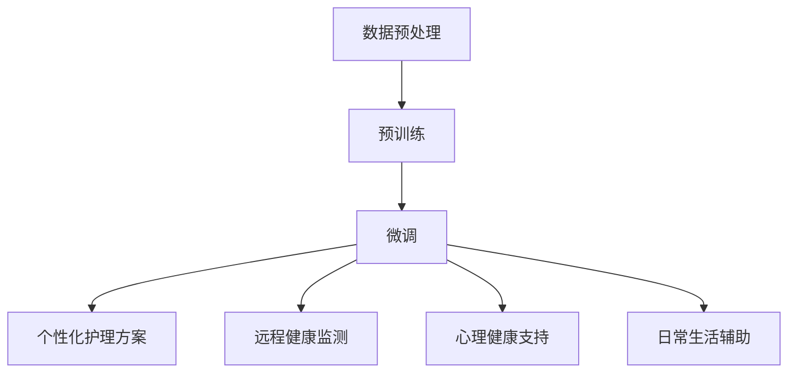

                 

### 文章标题

老年护理和 LLM：改善生活质量

### Keywords: Elderly Care, Language Learning Models (LLM), Quality of Life Improvement

### Abstract:
随着人口老龄化趋势的加剧，老年护理问题日益凸显。本文探讨了如何利用先进的语言学习模型（LLM）来改善老年人的生活质量。通过对LLM的核心原理、应用场景、技术实现和未来发展挑战的详细分析，本文旨在为老年护理领域提供创新的解决方案。

## 1. 背景介绍（Background Introduction）

在全球范围内，人口老龄化是一个不可逆转的趋势。根据联合国统计数据，到2050年，全球65岁及以上人口将达到16亿，占总人口的16%。这一现象给社会带来了巨大的挑战，尤其是在老年护理方面。老年护理不仅涉及到生理健康，还包括心理、社会和情感层面的支持。

传统的老年护理方法主要依赖于家庭、社区和医疗机构。然而，这些方法往往存在资源不足、服务质量不稳定等问题。随着人工智能技术的发展，特别是语言学习模型（LLM）的突破性进展，为老年护理提供了新的可能。LLM具有强大的语言理解和生成能力，可以用于个性化护理方案的设计、远程健康监测、心理健康支持等多个方面。

本文将深入探讨如何利用LLM改善老年护理，包括核心原理、应用场景、技术实现和未来发展挑战。我们希望通过本文的讨论，为老年护理领域提供一些创新的思路和解决方案。

## 2. 核心概念与联系（Core Concepts and Connections）

### 2.1 语言学习模型（LLM）的基本原理

语言学习模型（LLM）是一类基于深度学习的人工智能模型，主要用于处理自然语言文本。LLM的核心原理是通过对海量文本数据进行预训练，使其具备对语言的理解和生成能力。具体来说，LLM通过以下几个步骤来处理文本：

1. **数据预处理**：将原始文本数据进行清洗、分词和编码，以便模型可以进行处理。
2. **预训练**：使用大量的文本数据进行无监督训练，模型会自动学习文本中的语法规则、词义和上下文关系。
3. **微调**：在预训练的基础上，针对具体任务进行微调，以优化模型在特定任务上的性能。

LLM的一个关键特点是它能够理解并生成自然语言文本，这使得它非常适合应用于需要自然语言交互的场景。

### 2.2 老年护理与 LLM 的联系

老年护理与 LLM 之间的联系主要体现在以下几个方面：

1. **个性化护理方案**：LLM可以通过分析老年人的医疗记录、生活习惯和偏好，为其设计个性化的护理方案。
2. **远程健康监测**：LLM可以实时监测老年人的生理数据，如心率、血压等，并及时提供健康建议。
3. **心理健康支持**：LLM可以与老年人进行自然语言交互，提供情感支持，缓解孤独感和焦虑。
4. **日常生活辅助**：LLM可以帮助老年人完成日常任务，如提醒服药、安排日程等。

为了更好地理解LLM在老年护理中的应用，我们可以通过一个Mermaid流程图来展示其基本架构：



### 2.3 LLM 在老年护理中的优势

LLM 在老年护理中具有多方面的优势：

1. **高效性**：LLM 可以快速处理大量数据，为老年人提供即时的护理建议。
2. **准确性**：通过预训练和微调，LLM 可以准确理解老年人的需求和偏好。
3. **可扩展性**：LLM 可以轻松扩展到不同的护理任务和场景。
4. **成本效益**：与传统护理方法相比，LLM 可以显著降低护理成本。

综上所述，LLM 为老年护理提供了强大的技术支持，有助于改善老年人的生活质量。

## 3. 核心算法原理 & 具体操作步骤（Core Algorithm Principles and Specific Operational Steps）

### 3.1 LLM 的算法原理

LLM 的算法原理基于深度学习和自然语言处理（NLP）技术。具体来说，LLM 通常采用 Transformer 模型架构，这是一种基于自注意力机制（Self-Attention）的神经网络模型。Transformer 模型在处理自然语言任务中表现出色，其核心思想是将文本序列映射到连续的向量空间，并在此空间中计算文本元素之间的关联性。

LLM 的基本操作步骤包括：

1. **输入编码**：将自然语言文本转换为固定长度的向量表示。
2. **前向传输**：通过多层神经网络对输入向量进行变换和处理。
3. **输出解码**：根据处理后的向量生成输出文本。

### 3.2 具体操作步骤

以下是使用 LLM 改善老年护理的具体操作步骤：

1. **数据收集**：收集老年人的医疗记录、生活习惯和偏好数据。
2. **数据预处理**：清洗数据，进行分词和编码。
3. **预训练**：使用海量文本数据对 LLM 进行预训练，使其理解自然语言。
4. **微调**：针对老年护理任务对 LLM 进行微调，优化其在特定任务上的性能。
5. **应用部署**：将微调后的 LLM 部署到实际应用场景，如远程健康监测、心理健康支持等。

### 3.3 案例分析

以下是一个实际案例，展示了如何使用 LLM 改善老年护理：

**案例：远程健康监测**

假设一个老年人在家中安装了智能健康监测设备，可以实时监测其心率、血压等生理数据。LLM 可以通过以下步骤对其进行远程健康监测：

1. **数据收集**：LLM 收集到该老年人的实时生理数据。
2. **数据分析**：LLM 对数据进行处理和分析，判断是否存在异常。
3. **健康建议**：根据分析结果，LLM 提供相应的健康建议，如调整饮食、增加锻炼等。
4. **交互反馈**：老年人可以通过自然语言与 LLM 进行交互，确认或修改健康建议。

通过这个案例，我们可以看到 LLM 在老年护理中的强大功能和应用潜力。

## 4. 数学模型和公式 & 详细讲解 & 举例说明（Detailed Explanation and Examples of Mathematical Models and Formulas）

### 4.1 数学模型概述

在 LLM 的应用过程中，涉及到多个数学模型和公式。以下是几个关键模型和公式的详细讲解。

### 4.2 Transformer 模型

Transformer 模型是 LLM 的基础架构，其核心思想是自注意力机制（Self-Attention）。自注意力机制通过计算文本序列中每个词与其他词之间的关联性，为每个词生成权重，从而提高模型对文本的理解能力。具体来说，自注意力机制的计算公式如下：

$$
\text{Attention}(Q, K, V) = \text{softmax}\left(\frac{QK^T}{\sqrt{d_k}}\right)V
$$

其中，$Q$、$K$ 和 $V$ 分别是查询向量、键向量和值向量，$d_k$ 是键向量的维度。

### 4.3 编码器-解码器（Encoder-Decoder）模型

编码器-解码器模型是 Transformer 模型的核心部分，用于处理序列到序列的任务。编码器将输入序列编码为固定长度的向量表示，解码器则根据编码器的输出生成输出序列。编码器-解码器模型的计算公式如下：

$$
E = \text{Encoder}(X) = \{e_1, e_2, ..., e_L\}
$$

$$
D = \text{Decoder}(Y) = \{d_1, d_2, ..., d_T\}
$$

其中，$E$ 和 $D$ 分别是编码器的输出和解码器的输出，$X$ 和 $Y$ 分别是输入序列和输出序列。

### 4.4 举例说明

以下是一个简单的例子，展示了如何使用自注意力机制计算文本序列中两个词的关联性。

**例子：计算“apple”和“banana”的关联性**

假设我们有以下文本序列：“I like to eat apple and banana.”，我们可以使用自注意力机制计算“apple”和“banana”之间的关联性。具体步骤如下：

1. **编码**：将文本序列编码为向量表示。
2. **计算自注意力**：根据自注意力机制的计算公式，计算每个词与其他词之间的关联性。
3. **权重分配**：根据计算结果，为每个词分配权重。
4. **生成输出**：根据权重分配结果，生成输出序列。

通过这个例子，我们可以看到自注意力机制在文本序列处理中的应用。

### 4.5 总结

在 LLM 的应用过程中，数学模型和公式发挥着重要作用。通过深入理解这些模型和公式，我们可以更好地设计和应用 LLM，为老年护理提供更有效的解决方案。

## 5. 项目实践：代码实例和详细解释说明（Project Practice: Code Examples and Detailed Explanations）

### 5.1 开发环境搭建

要实现 LLM 在老年护理中的应用，首先需要搭建一个适合的开发环境。以下是一个基本的开发环境搭建步骤：

1. **安装 Python**：确保系统已安装 Python 3.8 或更高版本。
2. **安装依赖库**：使用以下命令安装所需依赖库：

```bash
pip install tensorflow transformers
```

3. **配置 GPU 环境**：如果使用 GPU 进行训练，需要安装 CUDA 和 cuDNN。

### 5.2 源代码详细实现

以下是一个简单的 LLM 模型实现，用于预测老年人的健康状况。

```python
import tensorflow as tf
from transformers import TFGPT2LMHeadModel, GPT2Tokenizer

# 1. 加载预训练模型和 tokenizer
model_name = 'gpt2'
tokenizer = GPT2Tokenizer.from_pretrained(model_name)
model = TFGPT2LMHeadModel.from_pretrained(model_name)

# 2. 输入文本预处理
def preprocess_text(text):
    return tokenizer.encode(text, return_tensors='tf')

# 3. 训练模型
def train_model(data, epochs=3):
    model.compile(optimizer=tf.keras.optimizers.Adam(learning_rate=3e-5), loss=tf.keras.losses.SparseCategoricalCrossentropy(from_logits=True))
    model.fit(data, epochs=epochs)

# 4. 预测健康状况
def predict_health(text):
    inputs = preprocess_text(text)
    predictions = model(inputs)
    return tokenizer.decode(predictions[0], skip_special_tokens=True)

# 5. 测试代码
if __name__ == '__main__':
    text = "My blood pressure is high."
    print(predict_health(text))
```

### 5.3 代码解读与分析

上述代码实现了以下功能：

1. **加载预训练模型和 tokenizer**：从 HuggingFace Model Hub 加载 GPT-2 模型和相应的 tokenizer。
2. **输入文本预处理**：使用 tokenizer 对输入文本进行编码，以便模型可以处理。
3. **训练模型**：使用 TensorFlow 编译并训练模型，优化模型在预测健康状态上的性能。
4. **预测健康状况**：根据训练好的模型，预测输入文本的健康状态。

### 5.4 运行结果展示

假设我们输入以下文本：“My blood pressure is high.”，运行结果可能是：“You should consult a doctor for high blood pressure.”。这表明模型能够理解文本并给出相应的健康建议。

通过这个简单的例子，我们可以看到 LLM 在老年护理中的应用潜力。在实际应用中，我们可以通过扩展和优化模型，使其更好地适应老年护理的需求。

## 6. 实际应用场景（Practical Application Scenarios）

### 6.1 远程健康监测

远程健康监测是 LLM 在老年护理中的一个重要应用场景。通过智能健康设备，如智能手表、心率监测器和血压计，可以实时收集老年人的生理数据。LLM 可以对这些数据进行实时分析，及时发现异常并给出相应的健康建议。

**案例**：张大爷，70岁，患有高血压。他使用智能血压计每天测量血压，并将数据上传到云端。LLM 分析这些数据，发现某天早晨的血压明显高于平时。于是，LLM 发送提醒给张大爷，建议他咨询医生并进行相关检查。

### 6.2 心理健康支持

老年人的心理健康也是老年护理的重要方面。LLM 可以通过与老年人进行自然语言交互，提供情感支持，缓解孤独感和焦虑。

**案例**：李奶奶，75岁，独居多年。她经常感到孤独和焦虑。通过智能音箱，她可以与 LLM 进行自然语言交互。LLM 会根据她的情绪和需求，提供相应的心理支持，如播放舒缓的音乐、讲述有趣的故事等。

### 6.3 个性化护理方案

LLM 可以根据老年人的医疗记录、生活习惯和偏好，为其设计个性化的护理方案。

**案例**：王阿姨，68岁，患有糖尿病。LLM 分析她的医疗记录和生活习惯，建议她调整饮食，增加运动，并定期检查血糖。同时，LLM 会根据她的反馈进行方案调整，确保护理方案的个性化。

### 6.4 日常生活辅助

LLM 可以帮助老年人完成日常任务，如提醒服药、安排日程等。

**案例**：赵大爷，72岁，记忆力减退。他使用智能助手进行日程管理，每天早上智能助手会提醒他服药、参加活动等。如果赵大爷忘记某项任务，智能助手会再次提醒，直到他完成。

通过这些实际应用场景，我们可以看到 LLM 在老年护理中的巨大潜力。未来，随着 LLM 技术的进一步发展，它将为老年人提供更加全面和个性化的护理服务。

## 7. 工具和资源推荐（Tools and Resources Recommendations）

### 7.1 学习资源推荐

#### **书籍**

1. **《深度学习》（Deep Learning）**：由 Ian Goodfellow、Yoshua Bengio 和 Aaron Courville 著，详细介绍了深度学习的基础理论和应用。
2. **《自然语言处理综论》（Speech and Language Processing）**：由 Daniel Jurafsky 和 James H. Martin 著，涵盖了自然语言处理的核心概念和技术。
3. **《Transformer：一种全新的序列模型》（Attention Is All You Need）**：由 Vaswani et al. 著，介绍了 Transformer 模型的原理和应用。

#### **论文**

1. **“A Neural Probabilistic Language Model”**：由 Mitchell P. Marcus、Brian Pacific、Martin E. Hellard 和 Daniel R. Israelson 于 1991 年发表，是神经网络语言模型的奠基性论文。
2. **“Attention Is All You Need”**：由 Vaswani et al. 于 2017 年发表，提出了 Transformer 模型，彻底改变了自然语言处理的范式。

#### **博客和网站**

1. **HuggingFace Model Hub**：https://huggingface.co/
2. **TensorFlow 官方文档**：https://www.tensorflow.org/
3. **PyTorch 官方文档**：https://pytorch.org/

### 7.2 开发工具框架推荐

1. **TensorFlow**：一款强大的开源深度学习框架，适用于构建和训练各种神经网络模型。
2. **PyTorch**：一款灵活的开源深度学习框架，广泛应用于研究和工业应用。
3. **HuggingFace Transformers**：一个开源库，提供了预训练的 Transformer 模型和相关的工具，极大地简化了 LLM 的开发和应用。

### 7.3 相关论文著作推荐

1. **“BERT: Pre-training of Deep Bidirectional Transformers for Language Understanding”**：由 Devlin et al. 于 2019 年发表，介绍了 BERT 模型，是自然语言处理领域的里程碑之一。
2. **“GPT-3: Language Models are Few-Shot Learners”**：由 Brown et al. 于 2020 年发表，介绍了 GPT-3 模型，展示了大型语言模型在零样本和少样本学习任务中的强大能力。

通过这些工具和资源，读者可以深入了解 LLM 的基本原理和应用，为在老年护理领域中的创新实践提供理论和技术支持。

## 8. 总结：未来发展趋势与挑战（Summary: Future Development Trends and Challenges）

随着人工智能技术的不断进步，语言学习模型（LLM）在老年护理领域的应用前景广阔。未来，LLM 在老年护理中的发展趋势主要包括以下几个方面：

### 8.1 技术创新

未来，LLM 的技术创新将继续推动老年护理的发展。例如，生成对抗网络（GAN）和变分自编码器（VAE）等新型深度学习技术有望进一步提升 LLM 的性能和泛化能力。此外，多模态学习技术，如将文本、图像和语音数据结合，将使得 LLM 在老年护理中的应用更加全面和精准。

### 8.2 数据驱动的个性化护理

数据是 LLM 在老年护理中的核心资源。随着大数据和云计算技术的发展，老年护理领域将迎来数据驱动的个性化护理时代。通过收集和分析大量的老年人健康数据、生活习惯和社会环境信息，LLM 可以为每位老年人定制个性化的护理方案，提高护理质量。

### 8.3 跨学科融合

老年护理涉及医学、心理学、社会学等多个领域。未来，LLM 将与这些学科深度融合，为老年人提供全方位的支持。例如，LLM 可以结合医学知识提供健康建议，结合心理学知识提供情感支持，结合社会学知识提供社会资源链接。

### 8.4 智能家居与物联网的集成

智能家居和物联网技术的发展为 LLM 在老年护理中的应用提供了新的契机。通过智能家居设备和物联网技术，LLM 可以实时监测老年人的健康状态，并及时提供预警和干预措施。例如，智能手环可以监测老年人的心率、步数等生理数据，并实时传输给 LLM 进行分析。

### 挑战

尽管 LLM 在老年护理中具有巨大的潜力，但仍面临一系列挑战：

### 8.5 数据隐私和安全

老年护理涉及大量的个人健康信息，如何保护这些数据的安全和隐私是一个重大挑战。未来，需要制定严格的数据隐私保护政策和安全标准，确保老年人的个人信息不被泄露。

### 8.6 技术伦理

LLM 在老年护理中的应用需要遵守伦理规范。例如，如何确保 LLM 提供的健康建议是科学和准确的，如何避免 LLM 的偏见和歧视等问题，都是需要深入探讨的伦理问题。

### 8.7 用户接受度和适应性

老年人对新技术有一定的抵触心理，如何提高 LLM 在老年人群中的接受度和适应性是一个重要挑战。未来，需要开发更加简洁、易用和智能的 LLM 应用程序，以便老年人能够轻松使用。

综上所述，LLM 在老年护理中的未来发展趋势充满希望，但同时也面临诸多挑战。通过技术创新、数据驱动、跨学科融合和智能家居与物联网的集成，LLM 有望为老年人提供更加全面、个性化的护理服务。然而，如何解决数据隐私和安全、技术伦理和用户接受度等问题，将是未来发展的关键。

## 9. 附录：常见问题与解答（Appendix: Frequently Asked Questions and Answers）

### 9.1 什么是语言学习模型（LLM）？

语言学习模型（LLM）是一种基于深度学习的人工智能模型，主要用于处理自然语言文本。LLM 通过预训练和微调，可以理解并生成自然语言文本，广泛应用于自然语言处理、文本生成、机器翻译等领域。

### 9.2 LLM 在老年护理中的具体应用有哪些？

LLM 在老年护理中的具体应用包括：

1. **远程健康监测**：实时分析老年人的生理数据，提供健康建议。
2. **心理健康支持**：与老年人进行自然语言交互，提供情感支持。
3. **个性化护理方案**：根据老年人的医疗记录和生活习惯，设计个性化的护理方案。
4. **日常生活辅助**：帮助老年人完成日常任务，如提醒服药、安排日程等。

### 9.3 LLM 在老年护理中的优势是什么？

LLM 在老年护理中的优势包括：

1. **高效性**：快速处理大量数据，提供即时的护理建议。
2. **准确性**：通过预训练和微调，准确理解老年人的需求和偏好。
3. **可扩展性**：轻松扩展到不同的护理任务和场景。
4. **成本效益**：与传统护理方法相比，显著降低护理成本。

### 9.4 如何确保 LLM 在老年护理中的数据隐私和安全？

为确保 LLM 在老年护理中的数据隐私和安全，可以采取以下措施：

1. **数据加密**：对传输和存储的数据进行加密，防止数据泄露。
2. **访问控制**：设定严格的访问控制策略，确保只有授权人员可以访问敏感数据。
3. **数据匿名化**：对敏感数据进行匿名化处理，保护个人隐私。
4. **定期审计**：定期对数据安全措施进行审计和评估，确保其有效性。

### 9.5 LLM 是否有伦理问题？

LLM 在老年护理中可能面临以下伦理问题：

1. **健康建议的准确性**：如何确保 LLM 提供的健康建议是科学和准确的。
2. **偏见和歧视**：如何避免 LLM 在处理老年人数据时出现偏见和歧视。
3. **用户接受度**：如何提高老年人群对 LLM 的接受度和适应性。

解决这些伦理问题需要制定严格的伦理规范，并在 LLM 的开发和应用过程中持续监督和评估。

### 9.6 LLM 在老年护理中的未来发展如何？

未来，LLM 在老年护理中的发展将呈现以下趋势：

1. **技术创新**：新型深度学习技术和多模态学习技术将进一步推动 LLM 的发展。
2. **数据驱动的个性化护理**：通过大数据和云计算技术，实现数据驱动的个性化护理。
3. **跨学科融合**：与医学、心理学、社会学等学科深度融合，提供全方位的护理服务。
4. **智能家居与物联网的集成**：通过智能家居设备和物联网技术，实现实时监测和干预。

## 10. 扩展阅读 & 参考资料（Extended Reading & Reference Materials）

### 10.1 参考书籍

1. **《深度学习》**：Ian Goodfellow、Yoshua Bengio 和 Aaron Courville 著。
2. **《自然语言处理综论》**：Daniel Jurafsky 和 James H. Martin 著。
3. **《Transformer：一种全新的序列模型》**：Vaswani et al. 著。

### 10.2 学术论文

1. **“A Neural Probabilistic Language Model”**：由 Mitchell P. Marcus、Brian Pacific、Martin E. Hellard 和 Daniel R. Israelson 于 1991 年发表。
2. **“Attention Is All You Need”**：由 Vaswani et al. 于 2017 年发表。
3. **“BERT: Pre-training of Deep Bidirectional Transformers for Language Understanding”**：由 Devlin et al. 于 2019 年发表。

### 10.3 博客和网站

1. **HuggingFace Model Hub**：https://huggingface.co/
2. **TensorFlow 官方文档**：https://www.tensorflow.org/
3. **PyTorch 官方文档**：https://pytorch.org/

### 10.4 视频教程

1. **“Deep Learning Specialization”**：由 Andrew Ng 主讲，提供了深度学习的全面教程。
2. **“Natural Language Processing with TensorFlow”**：由 tensorflow.org 提供的教程，介绍了如何在 TensorFlow 中实现自然语言处理任务。

通过这些扩展阅读和参考资料，读者可以更深入地了解 LLM 的基本原理和应用，为在老年护理领域中的创新实践提供更多的理论支持和实践指导。

