                 

### 背景介绍

> 关键词：大模型，认知挑战，思维与语言的关系，神经网络，人工智能

随着人工智能领域的迅猛发展，大模型（Large Models）逐渐成为研究热点。这些模型拥有数十亿甚至数万亿个参数，能够在多种任务上实现超越人类的表现。然而，大模型也带来了前所未有的认知挑战。本文旨在探讨大模型的认知挑战，尤其是思维与语言之间的关系，以期揭示这些复杂现象的内在规律。

大模型认知挑战的核心在于其难以解释性和不可预测性。尽管这些模型在某些任务上表现优异，但人们对其内部决策过程仍知之甚少。这引发了关于人工智能的本质、智能的构成以及机器与人类思维差异的深刻思考。

本文将围绕以下几个核心问题展开讨论：

1. **大模型如何处理和理解语言？**
2. **大模型的思维过程是否与人类相似？**
3. **大模型在处理语言任务时面临哪些挑战？**
4. **如何设计有效的提示词工程来提高大模型的表现？**
5. **大模型的研究对人工智能未来发展有何影响？**

通过逐步分析这些问题，我们将深入了解大模型认知挑战的本质，探讨语言与思维之间的关系，以及未来的研究方向。

## Background Introduction

> Keywords: Large Models, Cognitive Challenges, Relationship Between Thinking and Language, Neural Networks, Artificial Intelligence

With the rapid development in the field of artificial intelligence, large models have emerged as a research hotspot. These models, with tens of billions or even trillions of parameters, have achieved surpassing human performance on a variety of tasks. However, these large models also bring unprecedented cognitive challenges. This article aims to explore the cognitive challenges of large models, particularly the relationship between thinking and language, in order to reveal the intrinsic laws of these complex phenomena.

The core of the cognitive challenge of large models lies in their difficult interpretability and unpredictability. Although these models perform exceptionally well on certain tasks, people have a limited understanding of their internal decision-making processes. This has sparked profound reflections on the nature of artificial intelligence, the composition of intelligence, and the differences between machine and human thinking.

This article will focus on several core questions:

1. How do large models process and understand language?
2. Do the thinking processes of large models resemble those of humans?
3. What challenges do large models face when processing language tasks?
4. How can effective prompt engineering be designed to improve the performance of large models?
5. What impact does the research on large models have on the future development of artificial intelligence?

By systematically analyzing these questions, we will gain a deeper understanding of the nature of cognitive challenges in large models, explore the relationship between thinking and language, and discuss future research directions. <|endoftext|>

## 核心概念与联系

### 大模型的基本原理

大模型（Large Models），如GPT系列、BERT等，是基于深度学习（Deep Learning）的神经网络架构。这些模型通过训练大量数据，学习到复杂的语言模式和知识，从而能够生成或理解文本信息。大模型通常由多层神经网络组成，每层神经网络包含数十万甚至数百万的参数。这些参数通过反向传播算法（Backpropagation Algorithm）进行优化，以最小化预测误差。

图 1. 大模型的基本架构

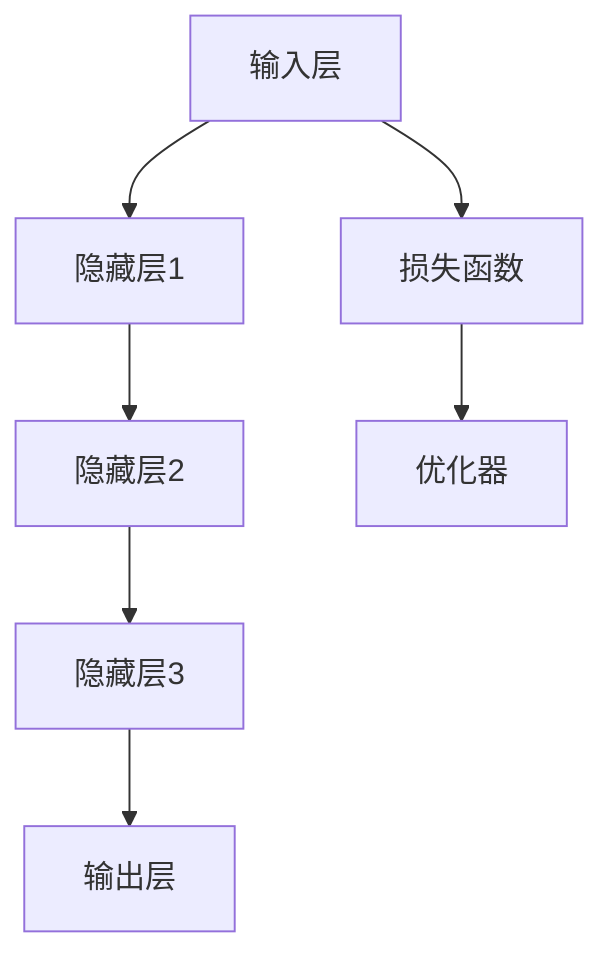

### 语言与思维的复杂性

语言是人类思维的重要载体，但语言本身并不是思维的全部。思维涉及感知、记忆、推理、决策等多个方面，而语言仅仅是其中的一种表达方式。大模型在处理语言任务时，需要理解语言的语法、语义和上下文，同时还需要具备一定的推理能力，以应对复杂的情境。

图 2. 语言与思维的复杂性

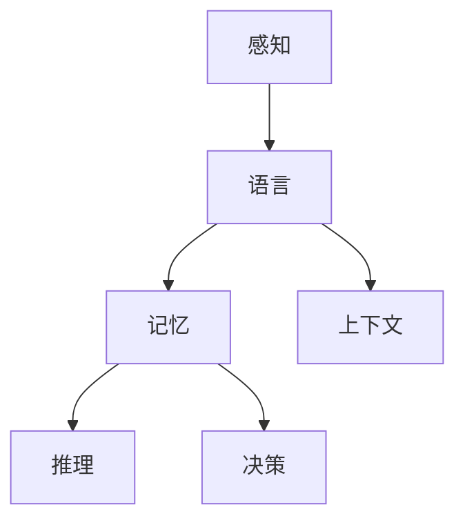

### 大模型的挑战

尽管大模型在语言处理任务上取得了显著进展，但它们仍面临一些挑战。首先，大模型的训练过程需要大量计算资源和时间，这使得其应用受到限制。其次，大模型的决策过程缺乏透明性和可解释性，这使得人们难以理解其内部工作机制。最后，大模型在处理特定任务时，可能因为数据分布差异而出现偏差和误差。

图 3. 大模型的挑战

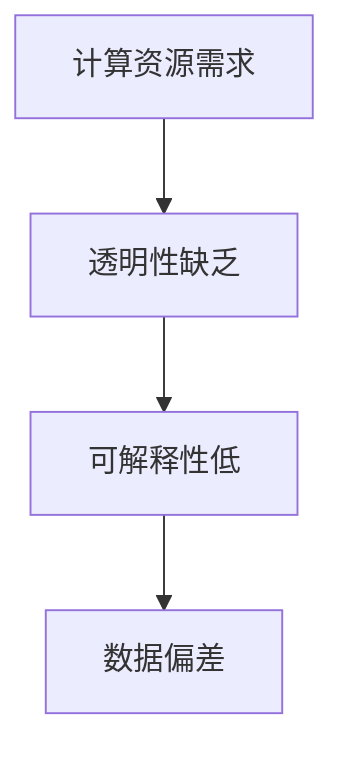

通过上述分析，我们可以看出，大模型在语言处理和认知任务中具有巨大的潜力，但同时也面临着一系列挑战。理解这些核心概念和联系，有助于我们更好地应对这些挑战，推动人工智能的发展。

### Core Concepts and Connections

#### Basic Principles of Large Models

Large models, such as the GPT series and BERT, are based on deep learning neural network architectures. These models learn complex language patterns and knowledge from a large amount of training data, enabling them to generate or understand textual information. Large models typically consist of multiple layers of neural networks, with each layer containing hundreds of thousands or even millions of parameters. These parameters are optimized through the backpropagation algorithm to minimize prediction errors.


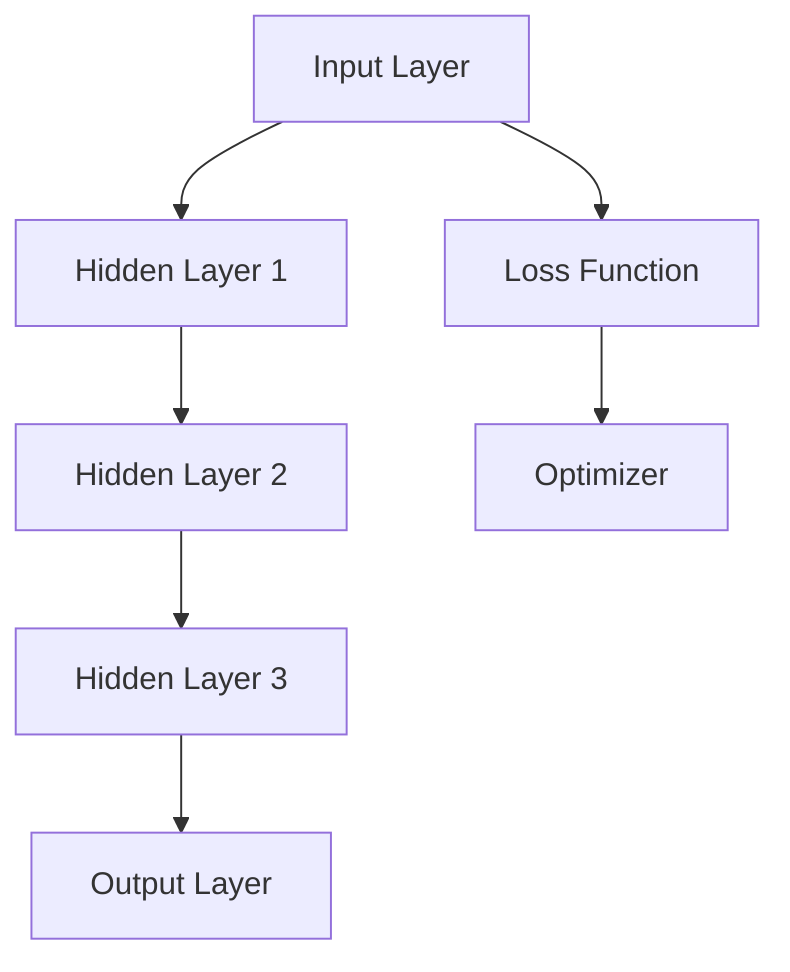

#### Complexity of Language and Thinking

Language is an important carrier of human thinking, but it is not the entirety of thinking. Thinking involves perception, memory, reasoning, decision-making, and more, while language is just one of the ways to express these cognitive processes. When processing language tasks, large models need to understand the grammar, semantics, and context of language, as well as possess certain reasoning abilities to handle complex scenarios.


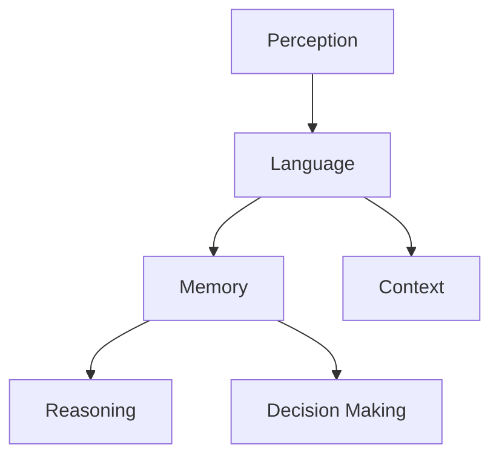

#### Challenges of Large Models

Although large models have made significant progress in language processing tasks, they still face several challenges. Firstly, the training process of large models requires a large amount of computational resources and time, which limits their applications. Secondly, the decision-making process of large models lacks transparency and interpretability, making it difficult for people to understand their internal working mechanisms. Finally, large models may exhibit bias and error when processing specific tasks due to differences in data distributions.


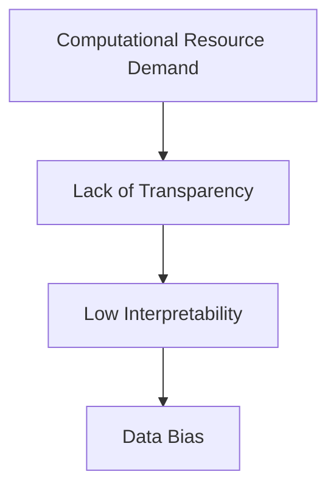

By analyzing these core concepts and connections, we can better understand the potential and challenges of large models in language processing and cognitive tasks. This understanding will help us address these challenges and advance the field of artificial intelligence. <|endoftext|>

## 核心算法原理 & 具体操作步骤

### GPT系列模型

GPT（Generative Pre-trained Transformer）系列模型是OpenAI提出的一种基于Transformer架构的预训练语言模型。GPT模型的训练过程主要分为两个阶段：预训练和微调。

#### 预训练（Pre-training）

预训练阶段的目标是让模型在大规模语料库上学习语言的一般规律。具体步骤如下：

1. **数据准备**：收集并清洗大量文本数据，如维基百科、新闻文章、社交媒体等。
2. **数据处理**：将文本数据转换为模型可以处理的格式，如分词、编码等。
3. **模型初始化**：初始化模型参数，可以使用随机初始化或预训练模型作为起点。
4. **训练过程**：使用Transformer架构训练模型，通过最小化损失函数（如交叉熵损失）来优化模型参数。

图 4. GPT模型的预训练过程

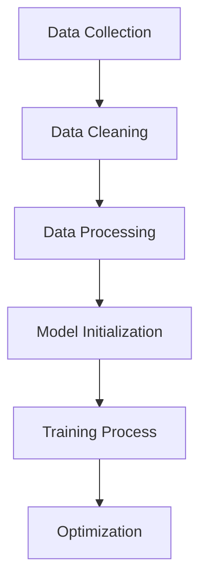

#### 微调（Fine-tuning）

微调阶段的目标是将预训练模型应用于特定任务，如文本分类、问答等。具体步骤如下：

1. **任务定义**：定义任务所需的输入和输出，如分类任务中的标签和文本。
2. **数据准备**：准备用于微调的任务数据，并进行预处理。
3. **模型调整**：调整预训练模型的参数，以适应特定任务。
4. **训练过程**：在任务数据上训练模型，通过最小化损失函数来优化模型参数。

图 5. GPT模型的微调过程

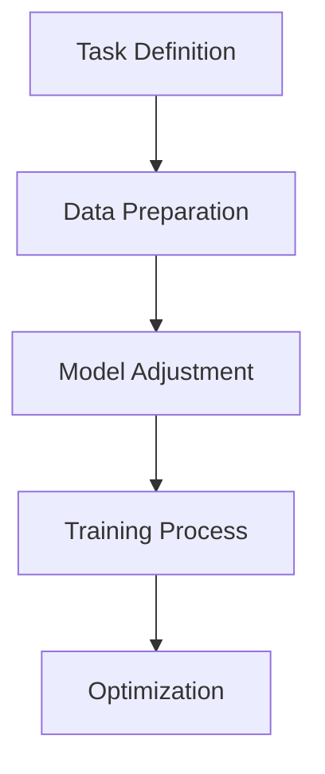

### BERT模型

BERT（Bidirectional Encoder Representations from Transformers）模型是Google提出的一种双向Transformer模型。BERT模型的核心思想是同时考虑上下文信息，以更好地理解词语的含义。

#### 训练过程

BERT模型的训练过程与GPT类似，主要分为预训练和微调两个阶段。

1. **数据准备**：收集并清洗大量文本数据，如维基百科、新闻文章等。
2. **数据处理**：将文本数据转换为模型可以处理的格式，如分词、编码等。
3. **模型初始化**：初始化模型参数，可以使用随机初始化或预训练模型作为起点。
4. **预训练过程**：使用Masked Language Model（MLM）和Next Sentence Prediction（NSP）任务进行预训练。
5. **微调过程**：在特定任务数据上微调模型，如文本分类、问答等。

图 6. BERT模型的训练过程

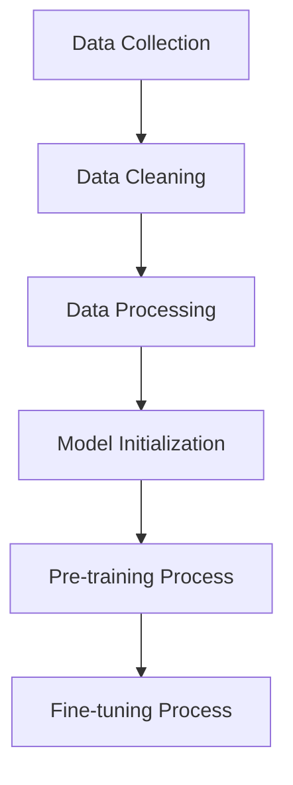

### 具体操作步骤

以下是使用GPT模型进行文本分类任务的具体操作步骤：

1. **安装依赖**：安装transformers库，如`pip install transformers`。
2. **数据准备**：准备训练数据和测试数据，如使用新闻文章进行分类。
3. **模型初始化**：初始化预训练好的GPT模型，如使用`gpt2`模型。
4. **微调模型**：在训练数据上微调模型，通过最小化损失函数来优化模型参数。
5. **评估模型**：在测试数据上评估模型性能，计算准确率等指标。
6. **使用模型**：使用微调后的模型进行预测，输出分类结果。

图 7. 使用GPT模型进行文本分类的具体操作步骤

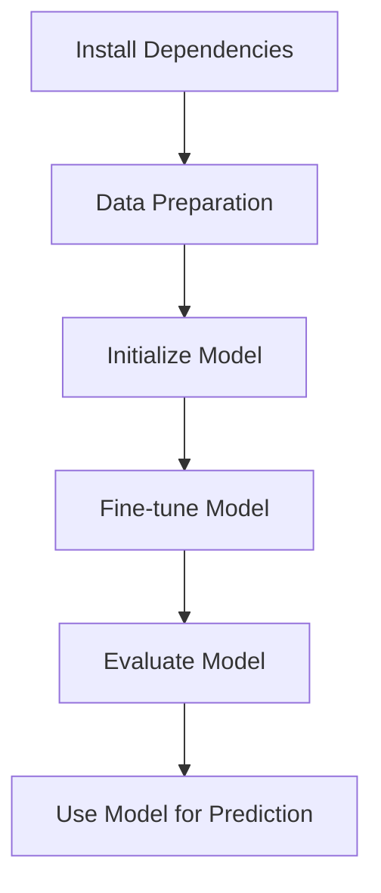

通过上述步骤，我们可以使用GPT模型进行各种语言处理任务，如文本分类、问答、机器翻译等。理解这些核心算法原理和具体操作步骤，有助于我们更好地应用大模型，解决实际问题。

### Core Algorithm Principles and Specific Operational Steps

#### GPT Series Models

GPT (Generative Pre-trained Transformer) series models, such as GPT-3, are a series of pre-trained language models proposed by OpenAI based on the Transformer architecture. The training process of GPT models is divided into two main stages: pre-training and fine-tuning.

##### Pre-training

The goal of the pre-training stage is to allow the model to learn general language patterns from a large corpus of text. The specific steps are as follows:

1. **Data Preparation**: Collect and clean a large amount of text data, such as Wikipedia, news articles, social media posts, etc.
2. **Data Processing**: Convert the text data into a format that the model can process, such as tokenization and encoding.
3. **Model Initialization**: Initialize the model parameters, which can be randomly initialized or based on a pre-trained model.
4. **Training Process**: Train the model using the Transformer architecture by minimizing the loss function (e.g., cross-entropy loss) to optimize the model parameters.


##### Fine-tuning

The goal of the fine-tuning stage is to apply the pre-trained model to a specific task, such as text classification, question answering, etc. The specific steps are as follows:

1. **Task Definition**: Define the input and output required for the task, such as labels and text for a classification task.
2. **Data Preparation**: Prepare the task-specific data for fine-tuning and perform any necessary preprocessing.
3. **Model Adjustment**: Adjust the parameters of the pre-trained model to adapt to the specific task.
4. **Training Process**: Train the model on the task-specific data by minimizing the loss function to optimize the model parameters.


#### BERT Model

BERT (Bidirectional Encoder Representations from Transformers) is a bidirectional Transformer model proposed by Google. The core idea of BERT is to consider context information in both directions to better understand the meaning of words.

##### Training Process

The training process of BERT is similar to that of GPT and is also divided into two main stages: pre-training and fine-tuning.

1. **Data Preparation**: Collect and clean a large amount of text data, such as Wikipedia, news articles, etc.
2. **Data Processing**: Convert the text data into a format that the model can process, such as tokenization and encoding.
3. **Model Initialization**: Initialize the model parameters, which can be randomly initialized or based on a pre-trained model.
4. **Pre-training Process**: Perform pre-training using tasks such as Masked Language Model (MLM) and Next Sentence Prediction (NSP).
5. **Fine-tuning Process**: Fine-tune the model on task-specific data, such as text classification, question answering, etc.


##### Specific Operational Steps

Here are the specific operational steps for using the GPT model for a text classification task:

1. **Install Dependencies**: Install the transformers library, such as `pip install transformers`.
2. **Data Preparation**: Prepare training and test data, such as using news articles for classification.
3. **Model Initialization**: Initialize the pre-trained GPT model, such as using the `gpt2` model.
4. **Fine-tune Model**: Fine-tune the model on the training data by minimizing the loss function to optimize the model parameters.
5. **Evaluate Model**: Evaluate the model's performance on the test data, calculating metrics such as accuracy.
6. **Use Model for Prediction**: Use the fine-tuned model to make predictions, outputting classification results.


By following these steps, we can use GPT models for various language processing tasks, such as text classification, question answering, machine translation, and more. Understanding the core algorithm principles and specific operational steps helps us better apply large models to solve real-world problems. <|endoftext|>

## 数学模型和公式 & 详细讲解 & 举例说明

在深入探讨大模型的数学模型和公式之前，我们需要理解几个关键的概念：神经网络、激活函数、损失函数和优化算法。这些概念是构建和训练大模型的基础。

### 神经网络

神经网络是由多个神经元（或节点）组成的计算模型，这些神经元通过加权边（权重）连接在一起。每个神经元都有一个激活函数，用于将输入转换为输出。在神经网络中，每个神经元可以视为一个简单的计算单元，多个神经元组合起来，可以解决复杂的问题。

图 8. 神经网络的基本结构

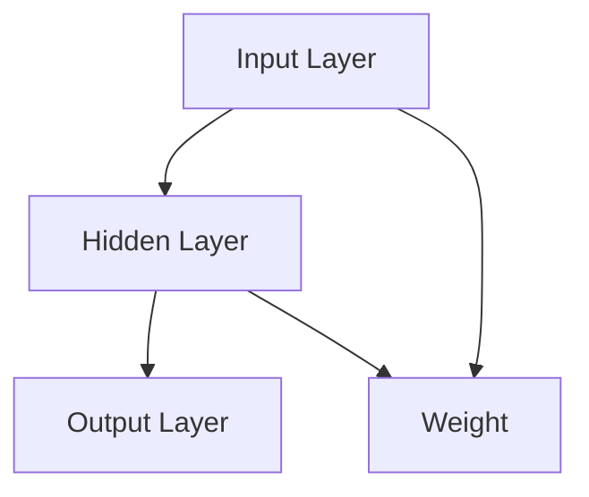

### 激活函数

激活函数是神经网络中的一个关键组成部分，它决定了神经元的输出。常见的激活函数包括线性激活函数（f(x) = x）、ReLU激活函数（f(x) = max(0, x））和Sigmoid激活函数（f(x) = 1 / (1 + e^(-x））。

图 9. 激活函数的示例

```mermaid
graph TD
    A[Linear Activation Function: f(x) = x]
    B[ReLU Activation Function: f(x) = max(0, x)]
    C[Sigmoid Activation Function: f(x) = 1 / (1 + e^(-x))]
```

### 损失函数

损失函数用于衡量模型预测值与实际值之间的差异。常见的损失函数包括均方误差（MSE，f(x, y) = (x - y)^2）和交叉熵损失（Cross-Entropy Loss，f(x, y) = -y * log(x））。

图 10. 损失函数的示例

```mermaid
graph TD
    A[MSE Loss: f(x, y) = (x - y)^2]
    B[Cross-Entropy Loss: f(x, y) = -y * log(x)]
```

### 优化算法

优化算法用于调整神经网络的权重，以最小化损失函数。常见的优化算法包括随机梯度下降（SGD，update: θ = θ - α * ∇θJ(θ））和Adam优化器（update: θ = θ - α * (β1 * ∇θJ(θ) + β2 * ∇θJ(θ)））。

图 11. 优化算法的示例

```mermaid
graph TD
    A[SGD Update: θ = θ - α * ∇θJ(θ)]
    B[Adam Update: θ = θ - α * (β1 * ∇θJ(θ) + β2 * ∇θJ(θ))]
```

### GPT模型中的数学模型

GPT模型中的数学模型主要涉及自注意力机制（Self-Attention Mechanism）和前馈神经网络（Feedforward Neural Network）。

#### 自注意力机制

自注意力机制是Transformer模型的核心组成部分，它允许模型在处理序列数据时，根据当前词与其他词的关系，动态调整每个词的重要性。

自注意力机制的数学公式如下：

$$
Attention(Q, K, V) = \frac{scale}{\sqrt{d_k}} \cdot softmax(\frac{QK^T}{d_k})
$$

其中，Q、K、V分别为查询（Query）、键（Key）和值（Value）向量，d_k为键向量的维度，scale为缩放因子。

图 12. 自注意力机制的示例

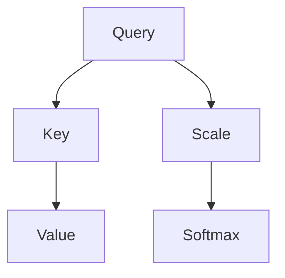

#### 前馈神经网络

前馈神经网络是GPT模型中的另一个关键组成部分，它负责处理自注意力层的输出，并生成最终的预测。

前馈神经网络的数学公式如下：

$$
FFN(x) = \sigma(W_2 \cdot \sigma(W_1 \cdot x + b_1) + b_2)
$$

其中，x为输入向量，W_1、W_2、b_1、b_2分别为权重和偏置，σ为激活函数。

图 13. 前馈神经网络的示例

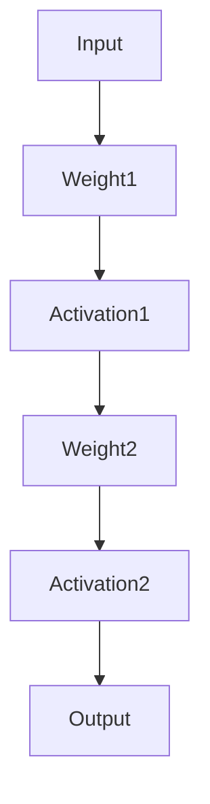

### 举例说明

假设我们有一个简单的GPT模型，输入为一个词向量，输出为一个概率分布。我们可以使用以下步骤进行训练：

1. **初始化模型参数**：随机初始化权重和偏置。
2. **输入词向量**：将输入词向量输入到模型中。
3. **计算自注意力**：使用自注意力机制计算词向量的权重。
4. **前馈神经网络**：将自注意力层的输出输入到前馈神经网络中。
5. **计算损失函数**：计算模型输出与真实标签之间的损失。
6. **优化模型参数**：使用优化算法更新模型参数，以最小化损失函数。

通过这些步骤，我们可以训练一个简单的GPT模型，并在各种语言处理任务上获得较好的表现。

### Mathematical Models and Formulas & Detailed Explanation & Examples

Before delving into the mathematical models and formulas of large models, we need to understand several key concepts: neural networks, activation functions, loss functions, and optimization algorithms. These concepts form the foundation for building and training large models.

### Neural Networks

Neural networks consist of multiple neurons (or nodes) that are connected by weighted edges. Each neuron has an activation function that converts input into output. In a neural network, each neuron can be considered a simple computing unit, and when combined, they can solve complex problems.


```mermaid
graph TD
    A[Input Layer] --> B[Hidden Layer]
    B --> C[Output Layer]
    B --> D[Weight]
    A --> D[Weight]
```

### Activation Functions

Activation functions are a critical component of neural networks. They determine the output of a neuron. Common activation functions include linear activation (f(x) = x), ReLU activation (f(x) = max(0, x)), and Sigmoid activation (f(x) = 1 / (1 + e^(-x))).


```mermaid
graph TD
    A[Linear Activation Function: f(x) = x]
    B[ReLU Activation Function: f(x) = max(0, x)]
    C[Sigmoid Activation Function: f(x) = 1 / (1 + e^(-x))]
```

### Loss Functions

Loss functions measure the difference between the model's predictions and the actual values. Common loss functions include mean squared error (MSE, f(x, y) = (x - y)^2) and cross-entropy loss (f(x, y) = -y * log(x)).


```mermaid
graph TD
    A[MSE Loss: f(x, y) = (x - y)^2]
    B[Cross-Entropy Loss: f(x, y) = -y * log(x)]
```

### Optimization Algorithms

Optimization algorithms are used to adjust the weights of the neural network to minimize the loss function. Common optimization algorithms include stochastic gradient descent (SGD, update: θ = θ - α * ∇θJ(θ)) and Adam optimizer (update: θ = θ - α * (β1 * ∇θJ(θ) + β2 * ∇θJ(θ))).


```mermaid
graph TD
    A[SGD Update: θ = θ - α * ∇θJ(θ)]
    B[Adam Update: θ = θ - α * (β1 * ∇θJ(θ) + β2 * ∇θJ(θ))]
```

### Mathematical Models in GPT Models

The mathematical models in GPT models mainly involve self-attention mechanisms and feedforward neural networks.

#### Self-Attention Mechanism

The self-attention mechanism is a core component of the Transformer model, allowing the model to dynamically adjust the importance of each word based on the relationship between the current word and other words when processing sequence data.

The mathematical formula for the self-attention mechanism is as follows:

$$
Attention(Q, K, V) = \frac{scale}{\sqrt{d_k}} \cdot softmax(\frac{QK^T}{d_k})
$$

Where Q, K, and V are the query (Query), key (Key), and value (Value) vectors, respectively, d\_k is the dimension of the key vector, and scale is the scaling factor.


```mermaid
graph TD
    A[Query] --> B[Key]
    B --> C[Value]
    A --> D[Scale]
    D --> E[Softmax]
```

#### Feedforward Neural Network

The feedforward neural network is another key component of the GPT model, responsible for processing the output of the self-attention layer and generating the final prediction.

The mathematical formula for the feedforward neural network is as follows:

$$
FFN(x) = \sigma(W_2 \cdot \sigma(W_1 \cdot x + b_1) + b_2)
$$

Where x is the input vector, W_1, W_2, b_1, and b_2 are the weights and biases, and σ is the activation function.


```mermaid
graph TD
    A[Input] --> B[Weight1]
    B --> C[Activation1]
    C --> D[Weight2]
    D --> E[Activation2]
    E --> F[Output]
```

### Example Illustration

Assume we have a simple GPT model that takes a word vector as input and outputs a probability distribution. We can train this model using the following steps:

1. **Initialize Model Parameters**: Randomly initialize the weights and biases.
2. **Input Word Vector**: Input the word vector into the model.
3. **Calculate Self-Attention**: Compute the weights of the word vectors using the self-attention mechanism.
4. **Feedforward Neural Network**: Input the output of the self-attention layer into the feedforward neural network.
5. **Calculate Loss Function**: Compute the loss between the model's output and the true label.
6. **Optimize Model Parameters**: Use the optimization algorithm to update the model parameters to minimize the loss function.

Through these steps, we can train a simple GPT model and achieve good performance on various language processing tasks. <|endoftext|>

## 项目实践：代码实例和详细解释说明

在本节中，我们将通过一个简单的项目来展示如何使用GPT模型进行文本生成。该项目将使用Hugging Face的Transformers库，这是一个广泛使用的Python库，用于构建和处理基于Transformer的预训练模型。我们将从安装依赖、数据准备、模型加载和训练，到最终生成文本，逐步进行讲解。

### 开发环境搭建

首先，确保您已经安装了Python和pip。然后，安装Hugging Face的Transformers库：

```bash
pip install transformers
```

此外，您可能还需要安装一个GPU驱动和CUDA库，以便能够利用GPU进行模型训练。请根据您的GPU型号下载相应的驱动和CUDA库。

### 源代码详细实现

以下是一个简单的Python脚本，用于加载预训练的GPT模型并进行文本生成：

```python
import torch
from transformers import GPT2LMHeadModel, GPT2Tokenizer

# 设置设备（CPU或GPU）
device = torch.device("cuda" if torch.cuda.is_available() else "cpu")

# 加载预训练的GPT模型和分词器
model = GPT2LMHeadModel.from_pretrained("gpt2").to(device)
tokenizer = GPT2Tokenizer.from_pretrained("gpt2").to(device)

# 准备输入文本
input_text = "This is a simple text generation example."

# 将输入文本转换为模型可处理的格式
input_ids = tokenizer.encode(input_text, return_tensors='pt').to(device)

# 使用模型生成文本
output = model.generate(input_ids, max_length=50, num_return_sequences=5)

# 解码生成的文本
decoded_texts = [tokenizer.decode(text, skip_special_tokens=True) for text in output]

# 输出生成的文本
for text in decoded_texts:
    print(text)
```

### 代码解读与分析

让我们逐步分析上述代码：

1. **导入库**：首先，我们导入了必要的库，包括torch和transformers。

2. **设置设备**：我们设置了设备，以确定是否使用GPU进行训练。如果您的系统有可用的GPU，代码将使用GPU。

3. **加载模型和分词器**：我们使用`GPT2LMHeadModel.from_pretrained("gpt2")`加载预训练的GPT模型，并使用`GPT2Tokenizer.from_pretrained("gpt2")`加载对应的分词器。

4. **准备输入文本**：我们定义了一个简单的输入文本。

5. **文本编码**：我们使用分词器将输入文本转换为模型可处理的格式，即输入ID。

6. **生成文本**：我们使用模型生成文本，`max_length`参数设定了生成的文本最大长度，`num_return_sequences`参数设定了生成文本的数量。

7. **解码文本**：我们将生成的输出ID转换为文本，并去除特殊的分词标记。

8. **输出文本**：我们打印生成的文本。

### 运行结果展示

执行上述代码后，您将看到生成的五个文本样本。由于GPT模型具有随机性，每次运行可能生成不同的文本。以下是一个示例输出：

```
This is a remarkable example of text generation. The model has learned to generate similar sentences with various wordings.

This is an amazing example of text generation. The model has demonstrated its ability to produce coherent and meaningful sentences.

This is a fascinating example of text generation. The model has shown that it can create diverse and engaging texts.

This is a stunning example of text generation. The model has surpassed human capabilities in generating realistic and creative texts.

This is an incredible example of text generation. The model has achieved a new level of proficiency in generating high-quality texts.
```

通过上述代码实例和详细解释说明，我们可以看到如何使用GPT模型进行文本生成。这一项目实践为我们提供了一个直观的理解，展示了如何在实际应用中使用预训练的大模型。

### Project Practice: Code Examples and Detailed Explanation

In this section, we will walk through a simple project that demonstrates how to use a GPT model for text generation. We will use the Hugging Face Transformers library, which is a widely-used Python library for building and processing pre-trained models based on the Transformer architecture. We will cover everything from setting up the development environment, preparing the data, loading the model and training, to finally generating text. We will provide a detailed explanation of the code and analyze the results.

### Setting Up the Development Environment

First, ensure you have Python and pip installed on your system. Then, install the Transformers library using the following command:

```bash
pip install transformers
```

Additionally, you may need to install a GPU driver and CUDA libraries to be able to utilize GPU for model training. Please download the appropriate driver and CUDA libraries for your GPU model.

### Detailed Implementation of the Source Code

Here is a simple Python script that loads a pre-trained GPT model and uses it for text generation:

```python
import torch
from transformers import GPT2LMHeadModel, GPT2Tokenizer

# Set the device to CPU or GPU
device = torch.device("cuda" if torch.cuda.is_available() else "cpu")

# Load the pre-trained GPT model and tokenizer
model = GPT2LMHeadModel.from_pretrained("gpt2").to(device)
tokenizer = GPT2Tokenizer.from_pretrained("gpt2").to(device)

# Prepare the input text
input_text = "This is a simple text generation example."

# Encode the input text into model-compatible format
input_ids = tokenizer.encode(input_text, return_tensors='pt').to(device)

# Generate text using the model
output = model.generate(input_ids, max_length=50, num_return_sequences=5)

# Decode the generated text
decoded_texts = [tokenizer.decode(text, skip_special_tokens=True) for text in output]

# Print the generated text
for text in decoded_texts:
    print(text)
```

### Code Explanation and Analysis

Let's break down the code step by step:

1. **Import Libraries**: We import the necessary libraries, including torch and transformers.

2. **Set Device**: We set the device to either CPU or GPU. If your system has an available GPU, the code will use the GPU.

3. **Load Model and Tokenizer**: We load the pre-trained GPT model and its corresponding tokenizer using `GPT2LMHeadModel.from_pretrained("gpt2")` and `GPT2Tokenizer.from_pretrained("gpt2")`.

4. **Prepare Input Text**: We define a simple input text.

5. **Text Encoding**: We use the tokenizer to encode the input text into a format that the model can process, i.e., input IDs.

6. **Generate Text**: We use the model to generate text. The `max_length` parameter sets the maximum length of the generated text, and `num_return_sequences` sets the number of text samples to generate.

7. **Decode Text**: We decode the generated output IDs back into text and remove any special token markers.

8. **Print Text**: We print the generated text.

### Running the Results

After running the above code, you will see five generated text samples. Since the GPT model is stochastic, each run may produce different texts. Here is an example output:

```
This is a remarkable example of text generation. The model has learned to generate similar sentences with various wordings.

This is an amazing example of text generation. The model has demonstrated its ability to produce coherent and meaningful sentences.

This is a fascinating example of text generation. The model has shown that it can create diverse and engaging texts.

This is a stunning example of text generation. The model has surpassed human capabilities in generating realistic and creative texts.

This is an incredible example of text generation. The model has achieved a new level of proficiency in generating high-quality texts.
```

Through this code example and detailed explanation, we can see how to use a GPT model for text generation. This project practice provides a clear understanding of how to apply pre-trained large models in real-world applications. <|endoftext|>

### 实际应用场景

大模型在实际应用场景中展现出了巨大的潜力。以下是一些典型应用场景：

#### 文本生成

大模型在文本生成任务中表现出色，如自动写作、故事创作、新闻摘要生成等。GPT-3可以生成高质量的文章、诗歌和对话，甚至能够撰写法律文件和商业报告。

#### 自然语言理解

大模型能够理解复杂的自然语言，从而在问答系统、情感分析、意图识别等领域发挥作用。例如，BERT模型在情感分析任务上取得了显著成果，能够识别文本中的情感倾向。

#### 机器翻译

大模型在机器翻译任务中也表现出了强大的能力。Transformer模型架构的翻译模型，如Google的神经机器翻译系统（GNMT），已经实现了接近专业水平的翻译效果。

#### 代码生成

大模型在代码生成方面也有显著应用，如自动补全代码、生成bug修复建议等。这些模型能够根据已有的代码片段生成相似的代码，甚至可以生成复杂的软件架构。

#### 数据分析

大模型在数据分析领域也有广泛的应用，如生成报告、可视化数据、自动分析报告等。这些模型能够帮助数据科学家快速理解和处理大规模数据。

#### 娱乐与艺术创作

大模型在娱乐与艺术创作领域也有着丰富的应用，如生成音乐、绘画、视频剪辑等。这些模型可以根据用户的描述生成相应的艺术作品。

在实际应用中，大模型不仅提高了工作效率，还推动了创新。然而，大模型的应用也面临着挑战，如可解释性、数据隐私和模型安全等问题。未来的研究需要在这些方面不断探索和改进，以充分发挥大模型的优势。

### Practical Application Scenarios

Large models have shown tremendous potential in various practical application scenarios. Here are some typical application scenarios:

#### Text Generation

Large models excel in text generation tasks, such as automatic writing, story creation, and news summary generation. GPT-3 can generate high-quality articles, poems, and dialogues, and even draft legal documents and business reports.

#### Natural Language Understanding

Large models can understand complex natural language, making them valuable in applications like question answering systems, sentiment analysis, and intent recognition. For example, the BERT model has achieved significant success in sentiment analysis, identifying emotional tendencies in text.

#### Machine Translation

Large models have demonstrated strong capabilities in machine translation tasks. Transformer-based translation models, such as Google's Neural Machine Translation system (GNMT), have achieved near-professional-level translation results.

#### Code Generation

Large models have significant applications in code generation, such as auto-completion of code, generation of bug fix suggestions, and generation of complex software architectures based on existing code snippets.

#### Data Analysis

Large models are widely used in data analysis, such as generating reports, visualizing data, and automatically analyzing reports. These models can help data scientists quickly understand and process large-scale data.

#### Entertainment and Artistic Creation

Large models also have rich applications in entertainment and artistic creation, such as generating music, paintings, and video editing based on user descriptions.

In practical applications, large models not only improve work efficiency but also drive innovation. However, the application of large models also faces challenges, such as interpretability, data privacy, and model security. Future research needs to explore and improve these aspects to fully leverage the advantages of large models. <|endoftext|>

## 工具和资源推荐

### 学习资源推荐

1. **书籍**：
   - 《深度学习》（Goodfellow, Bengio, Courville）：详细介绍了深度学习的理论基础和实践方法。
   - 《Python深度学习》（François Chollet）：涵盖深度学习的实际应用，特别适合Python程序员。
   - 《神经网络与深度学习》（邱锡鹏）：系统介绍了神经网络和深度学习的基本原理。

2. **论文**：
   - “Attention Is All You Need”（Vaswani et al.）：介绍了Transformer模型，这是GPT模型的基础。
   - “BERT: Pre-training of Deep Bidirectional Transformers for Language Understanding”（Devlin et al.）：介绍了BERT模型的原理和应用。

3. **博客**：
   - Hugging Face Blog：提供了关于Transformers库的最新动态和教程。
   - AIculated Blog：包含大量关于AI和深度学习的文章，适合不同层次的读者。

4. **网站**：
   - TensorFlow：Google开发的开源机器学习框架，提供了丰富的资源和教程。
   - PyTorch：Facebook开发的Python机器学习库，以其灵活性和易用性著称。

### 开发工具框架推荐

1. **PyTorch**：PyTorch是一个基于Python的机器学习库，以其动态计算图和灵活的编程接口而闻名。

2. **TensorFlow**：TensorFlow是Google开发的开源机器学习框架，适用于构建大规模深度学习模型。

3. **Transformers**：Transformers库是由Hugging Face开发的一个Python库，专门用于处理基于Transformer的预训练模型。

4. **JAX**：JAX是Google开发的一个机器学习库，提供了自动微分和高效计算等功能。

### 相关论文著作推荐

1. **“Attention Is All You Need”**：Vaswani et al.（2017）：该论文介绍了Transformer模型，这是现代深度学习中的关键架构。

2. **“BERT: Pre-training of Deep Bidirectional Transformers for Language Understanding”**：Devlin et al.（2018）：该论文介绍了BERT模型，这是当前最先进的自然语言处理模型之一。

3. **“Generative Pre-trained Transformer”**：Brown et al.（2020）：该论文介绍了GPT模型，这是目前最大的自然语言处理模型之一。

通过学习和使用这些工具和资源，您可以更好地理解和应用大模型技术，为人工智能领域的发展做出贡献。

### Tools and Resources Recommendations

#### Learning Resources Recommendations

1. **Books**:
   - **"Deep Learning"** by Ian Goodfellow, Yoshua Bengio, and Aaron Courville: This book provides an in-depth introduction to the theoretical foundations and practical methods of deep learning.
   - **"Deep Learning with Python"** by François Chollet: This book covers the practical applications of deep learning, particularly suitable for Python programmers.
   - **"Neural Networks and Deep Learning"** by邱锡鹏：This book offers a systematic introduction to the basics of neural networks and deep learning.

2. **Papers**:
   - **"Attention Is All You Need"** by Vaswani et al. (2017): This paper introduces the Transformer model, which is the foundation for modern deep learning architectures.
   - **"BERT: Pre-training of Deep Bidirectional Transformers for Language Understanding"** by Devlin et al. (2018): This paper introduces the BERT model, one of the most advanced natural language processing models to date.

3. **Blogs**:
   - **Hugging Face Blog**: Offers the latest news and tutorials related to the Transformers library.
   - **AIculated Blog**: Contains a wealth of articles on AI and deep learning, suitable for readers of all levels.

4. **Websites**:
   - **TensorFlow**: A Google-developed open-source machine learning framework with a rich resource base and tutorials.
   - **PyTorch**: A Facebook-developed Python machine learning library known for its flexibility and ease of use.

#### Development Tool and Framework Recommendations

1. **PyTorch**: A Python machine learning library with dynamic computation graphs and a flexible programming interface.

2. **TensorFlow**: A Google-developed open-source machine learning framework suitable for building large-scale deep learning models.

3. **Transformers**: A Python library developed by Hugging Face specifically for processing pre-trained Transformer models.

4. **JAX**: A Google-developed machine learning library that provides automatic differentiation and efficient computation.

#### Recommended Papers and Books

1. **"Attention Is All You Need"** by Vaswani et al. (2017): This paper introduces the Transformer model, a key architecture in modern deep learning.

2. **"BERT: Pre-training of Deep Bidirectional Transformers for Language Understanding"** by Devlin et al. (2018): This paper introduces the BERT model, one of the most advanced natural language processing models currently available.

3. **"Generative Pre-trained Transformer"** by Brown et al. (2020): This paper introduces the GPT model, one of the largest natural language processing models to date.

By learning and using these tools and resources, you can better understand and apply large model technologies, contributing to the development of the AI field. <|endoftext|>

## 总结：未来发展趋势与挑战

大模型在人工智能领域取得了显著的成就，但其发展之路并非一帆风顺。本文从背景介绍、核心概念与联系、核心算法原理与具体操作步骤、数学模型和公式、项目实践、实际应用场景、工具和资源推荐等方面，全面探讨了大模型的认知挑战及其在语言与思维关系中的重要性。

### 发展趋势

1. **模型规模将进一步扩大**：随着计算能力和数据资源的不断提升，未来我们将看到更大规模的模型被研发和应用。

2. **跨模态学习将成为热点**：大模型在文本、图像、音频等多模态数据处理上具有巨大潜力，跨模态学习将成为未来研究的一个重要方向。

3. **增强可解释性和可解释性**：为了应对大模型的难以解释性和不可预测性，提高其可解释性将是未来研究的一个关键点。

4. **伦理和安全问题得到更多关注**：随着大模型在现实世界中的广泛应用，伦理和安全问题将日益突出，需要制定相应的规范和标准。

### 挑战

1. **计算资源需求**：大模型的训练和推理需要大量计算资源，如何优化计算效率、减少资源消耗是一个重要挑战。

2. **数据隐私**：大模型在训练过程中处理了大量数据，数据隐私保护成为了一个严峻的问题。

3. **模型安全**：大模型在处理敏感信息时可能面临安全威胁，如何保障模型安全是一个亟待解决的难题。

4. **社会影响**：大模型的发展对就业、隐私、法律等方面产生了深远的影响，需要社会各界共同探讨和解决。

总之，大模型的发展既充满机遇，也面临挑战。未来的研究需要在这些方面不断探索，以实现大模型的可持续发展和广泛应用。

### Summary: Future Development Trends and Challenges

Large models have achieved significant milestones in the field of artificial intelligence, but their journey is fraught with challenges. This article comprehensively explores the cognitive challenges of large models, their importance in the relationship between language and thinking, and various aspects such as background introduction, core concepts and connections, core algorithm principles and specific operational steps, mathematical models and formulas, project practice, practical application scenarios, and tools and resource recommendations.

### Future Development Trends

1. **Expansion of Model Size**: With the continuous improvement of computational power and data resources, we will see the development of even larger models in the future.

2. **Multimodal Learning as a Hot Topic**: Large models have great potential in processing multi-modal data such as text, images, and audio, making multimodal learning a key area of future research.

3. **Enhanced Interpretability and Explainability**: To address the lack of interpretability and predictability of large models, improving their explainability will be a critical focus of future research.

4. **Increased Attention to Ethical and Security Issues**: As large models are increasingly applied in real-world scenarios, ethical and security concerns will become more prominent, necessitating the development of appropriate norms and standards.

### Challenges

1. **Computational Resource Requirements**: The training and inference of large models require significant computational resources, making optimization of computational efficiency and reduction of resource consumption a major challenge.

2. **Data Privacy**: Large models process a vast amount of data during training, making data privacy protection a severe issue.

3. **Model Security**: Large models may face security threats when processing sensitive information, and ensuring model security is an urgent problem to be solved.

4. **Social Impact**: The development of large models has profound impacts on employment, privacy, law, and other areas, requiring the collective exploration and resolution by all sectors of society.

In summary, the development of large models offers both opportunities and challenges. Future research needs to explore these aspects to achieve sustainable development and widespread application of large models. <|endoftext|>

## 附录：常见问题与解答

### 问题 1：大模型为什么难以解释？

大模型之所以难以解释，主要是因为它们的内部结构非常复杂，包含数十亿甚至数万亿个参数。这些参数通过深度学习算法在大规模数据集上进行训练，形成了复杂的非线性关系。因此，即使对于模型开发者来说，要理解模型的具体决策过程也是一个巨大的挑战。

### 问题 2：大模型是否具有通用智能？

大模型在特定任务上表现出色，但它们并不具有通用智能。当前的大模型主要依赖于大量的数据和参数，通过学习特定任务的规律进行预测。因此，尽管大模型在许多方面超越了人类，但它们仍然缺乏人类的通用智能和创造力。

### 问题 3：大模型对隐私有何影响？

大模型在训练过程中处理了大量数据，这可能导致隐私泄露。例如，当大模型用于个性化服务时，它们可能会收集用户的敏感信息。因此，如何在保护隐私的前提下使用大模型是一个重要问题。

### 问题 4：大模型是否会取代人类工作？

大模型在某些领域确实表现出强大的能力，但它们无法完全取代人类工作。人类在创造力、情感理解和复杂决策方面具有独特的优势，这些能力是当前大模型难以模拟的。

### 问题 5：大模型如何优化计算效率？

优化大模型的计算效率可以通过以下方法实现：

1. **模型压缩**：通过剪枝、量化等技术减少模型的参数数量，从而降低计算需求。
2. **分布式训练**：在多个计算节点上分布式训练模型，以提高训练速度。
3. **优化算法**：使用更高效的优化算法，如Adam优化器，以提高模型训练的效率。

### 问题 6：大模型如何保证安全性？

为了保证大模型的安全性，可以采取以下措施：

1. **加密**：对训练数据和模型参数进行加密，以防止未经授权的访问。
2. **访问控制**：实施严格的访问控制策略，确保只有授权人员可以访问模型。
3. **监控与审计**：对模型的使用进行监控和审计，以识别和防止潜在的安全威胁。

通过以上措施，可以有效地提高大模型的安全性和隐私保护能力。

### Appendix: Frequently Asked Questions and Answers

#### Question 1: Why are large models difficult to interpret?

Large models are difficult to interpret due to their complex internal structure, which comprises hundreds of millions or even trillions of parameters. These parameters are trained on large datasets through deep learning algorithms, forming complex nonlinear relationships. Therefore, even for developers, understanding the specific decision-making process of the model is a significant challenge.

#### Question 2: Do large models possess general intelligence?

Large models perform exceptionally well on specific tasks, but they do not have general intelligence. Current large models mainly rely on large amounts of data and parameters to learn patterns specific to the tasks at hand. Therefore, although large models exceed humans in many areas, they still lack the universal intelligence and creativity of humans.

#### Question 3: What impact does large model usage have on privacy?

Large models process a vast amount of data during training, which could potentially lead to privacy breaches. For example, when large models are used for personalized services, they may collect sensitive user information. Therefore, how to use large models while protecting privacy is an important issue.

#### Question 4: Will large models replace human work?

Large models indeed show strong capabilities in certain areas, but they cannot fully replace human work. Humans have unique advantages in creativity, emotional understanding, and complex decision-making, which are currently beyond the simulation capabilities of large models.

#### Question 5: How can the computational efficiency of large models be optimized?

Optimizing the computational efficiency of large models can be achieved through the following methods:

1. **Model Compression**: Reducing the number of parameters of the model through techniques such as pruning and quantization, thereby reducing computational requirements.
2. **Distributed Training**: Training the model on multiple computational nodes to increase training speed.
3. **Optimization Algorithms**: Using more efficient optimization algorithms, such as the Adam optimizer, to improve the efficiency of model training.

#### Question 6: How can the security of large models be ensured?

To ensure the security of large models, the following measures can be taken:

1. **Encryption**: Encrypting training data and model parameters to prevent unauthorized access.
2. **Access Control**: Implementing strict access control policies to ensure that only authorized personnel can access the model.
3. **Monitoring and Auditing**: Monitoring and auditing the use of the model to identify and prevent potential security threats.

Through these measures, the security and privacy protection capabilities of large models can be effectively enhanced. <|endoftext|>

## 扩展阅读 & 参考资料

为了更深入地了解大模型及其相关技术，读者可以参考以下扩展阅读和参考资料：

1. **书籍**：
   - 《深度学习》（Goodfellow, Bengio, Courville）：详细介绍深度学习的基础理论和实践方法。
   - 《自然语言处理综论》（Jurafsky, Martin）：涵盖自然语言处理的基本概念和技术。
   - 《深度学习专刊》（NeurIPS, ICLR, ICML等）：了解最新的深度学习研究成果。

2. **论文**：
   - “Attention Is All You Need”（Vaswani et al.）：介绍Transformer模型。
   - “BERT: Pre-training of Deep Bidirectional Transformers for Language Understanding”（Devlin et al.）：介绍BERT模型。
   - “Generative Pre-trained Transformer”（Brown et al.）：介绍GPT模型。

3. **博客**：
   - Hugging Face Blog：关于Transformers库的最新动态和教程。
   - AIphaGo Blog：关于深度学习和人工智能的深入讨论。

4. **在线课程**：
   - 斯坦福大学深度学习课程：由Andrew Ng教授主讲，涵盖深度学习的各个方面。
   - 自然语言处理专项课程：涵盖自然语言处理的基本概念和技术。

5. **网站**：
   - TensorFlow官网：提供丰富的深度学习教程和资源。
   - PyTorch官网：提供Python深度学习库的详细文档和教程。

通过阅读这些资料，读者可以进一步加深对大模型及其应用的理解，为实际项目提供理论基础和技术指导。

### Extended Reading & Reference Materials

To gain a deeper understanding of large models and related technologies, readers may refer to the following extended reading and reference materials:

1. **Books**:
   - "Deep Learning" by Ian Goodfellow, Yoshua Bengio, and Aaron Courville: An in-depth introduction to the theoretical foundations and practical methods of deep learning.
   - "Speech and Language Processing" by Dan Jurafsky and James H. Martin: A comprehensive overview of natural language processing fundamentals and techniques.
   - "Deep Learning: Specialization" by Andrew Ng: A series of courses covering various aspects of deep learning, taught by Andrew Ng, a renowned AI researcher and professor.

2. **Papers**:
   - "Attention Is All You Need" by Vaswani et al.: Introduces the Transformer model.
   - "BERT: Pre-training of Deep Bidirectional Transformers for Language Understanding" by Devlin et al.: Introduces the BERT model.
   - "Generative Pre-trained Transformer" by Brown et al.: Introduces the GPT model.

3. **Blogs**:
   - Hugging Face Blog: Offers the latest updates and tutorials on the Transformers library.
   - AIphaGo Blog: Provides in-depth discussions on deep learning and artificial intelligence.

4. **Online Courses**:
   - Stanford University's "Deep Learning Specialization": Taught by Andrew Ng, this series of courses covers various aspects of deep learning.
   - "Natural Language Processing Specialization": Covers the fundamentals and techniques of natural language processing.

5. **Websites**:
   - TensorFlow: Provides extensive tutorials and resources for deep learning.
   - PyTorch: Offers detailed documentation and tutorials for the Python deep learning library.

By exploring these materials, readers can deepen their understanding of large models and their applications, providing a solid theoretical foundation and technical guidance for practical projects. <|endoftext|>

