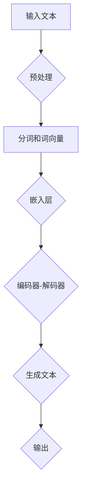

                 

### 文章标题

**语言≠思维：大模型的认知盲点**

随着人工智能领域的迅猛发展，大型语言模型（LLM）如GPT-3，ChatGPT等，已经成为自然语言处理（NLP）领域的明星。这些模型凭借其强大的文本生成和推理能力，引发了广泛的应用热潮。然而，在赞美其成就的同时，我们也不能忽视其背后的认知盲点。本文将探讨语言与思维之间的关系，深入分析大模型的认知局限，并探讨这些局限对实际应用可能带来的影响。

## 关键词
- 语言模型
- 认知科学
- 大模型局限性
- 人工智能应用

## 摘要
本文旨在揭示大语言模型在处理自然语言时的认知盲点。通过对比语言和思维的差异，分析大模型的架构和训练机制，我们发现了其在理解深度语义、情感表达和跨文化语境等方面存在的不足。本文将探讨这些认知盲点对模型性能和应用的影响，并提出可能的解决方案。通过理解这些局限性，我们可以更好地指导大模型的应用，促进人工智能的健康发展。

### 1. 背景介绍（Background Introduction）

在当今数字化时代，语言作为人类交流和思维的主要工具，始终扮演着至关重要的角色。然而，语言与思维之间的关系却远比我们想象的要复杂得多。传统上，人们认为语言是思维的直接体现，但随着认知科学和心理学的深入研究，我们发现这种观点存在很大的局限性。语言作为一种符号系统，它的结构、语法和语义都是为了便于人类交流和记录信息而设计的。然而，人类思维却是高度抽象和多维度的，涉及感知、记忆、推理、情感等多个层面。

认知科学研究表明，思维不仅依赖于语言，还受到非语言因素的影响，如视觉、听觉、触觉等感官体验，以及文化、社会背景等外部因素。这种复杂的关系意味着语言模型在模拟人类思维时面临着巨大的挑战。尽管近年来，深度学习技术的发展使得语言模型在处理自然语言任务上取得了显著进步，但它们仍然无法完全捕捉到人类思维的深度和广度。

此外，随着大数据和计算能力的提升，大型语言模型（LLM）如GPT-3，ChatGPT等应运而生。这些模型通过学习海量的文本数据，具备了强大的文本生成和推理能力。然而，这些大模型在处理自然语言时的认知盲点也逐渐显现出来。本文将深入探讨这些盲点，以期揭示大语言模型在模拟人类思维方面的局限性。

### 2. 核心概念与联系（Core Concepts and Connections）

#### 2.1 语言与思维的差异

要理解大模型的认知盲点，我们首先需要明确语言与思维之间的差异。语言是一种符号系统，它通过词汇、语法和语义规则来传达信息。语言具有结构性和规则性，这使得它成为人类交流和记录信息的有效工具。然而，思维却是一种更为抽象和灵活的过程，它不仅涉及语言，还涉及非语言因素。

认知科学家认为，思维可以分为多个层次，包括感知、记忆、推理和情感等。感知是指我们对环境信息的接收和处理，记忆是指我们对过去经验的存储和回忆，推理是指我们对信息的分析和判断，情感则是指我们在处理信息时产生的情绪体验。这些层次相互交织，构成了人类复杂的思维过程。

相比之下，语言模型主要依赖于语言符号来处理信息。尽管它们可以模拟某些语言层面的推理，如语法分析和语义理解，但它们在处理抽象思维、情感表达和跨文化语境等方面存在很大的局限性。这是因为语言模型在训练过程中主要依赖于大量的文本数据，而文本数据并不能完全代表人类思维的深度和广度。

#### 2.2 大模型的架构和训练机制

大语言模型，如GPT-3，ChatGPT等，通常基于深度神经网络架构，通过大规模的数据训练得到。这些模型通常包含数十亿个参数，能够自动学习语言的统计规律和语义特征。它们的训练过程可以分为两个阶段：预训练和微调。

在预训练阶段，模型通过阅读大量文本数据来学习语言的通用特征，如词汇、语法和语义等。这种预训练过程使得模型具备了强大的语言理解和生成能力。然而，即使经过预训练，模型在处理特定任务时仍然需要通过微调来适应具体任务的需求。

微调过程通常涉及将预训练模型在特定任务的数据上进行进一步训练。这种训练方式使得模型能够更好地理解和生成与任务相关的文本。然而，由于训练数据的质量和多样性限制，微调后的模型在处理未知或复杂任务时可能会出现性能下降。

#### 2.3 认知盲点的表现

大模型的认知盲点主要表现在以下几个方面：

1. **深度语义理解不足**：尽管大模型可以生成流畅的文本，但它们在处理深度语义问题时仍然存在困难。例如，它们可能难以理解复杂隐喻、双关语和抽象概念。

2. **情感表达有限**：大模型在模拟情感表达方面存在局限，难以准确捕捉和表达复杂的情感体验。这使得它们在处理涉及情感的任务时，如情感分析、对话系统等，可能出现偏差或误解。

3. **跨文化语境处理困难**：不同文化背景下，语言的使用方式和含义可能存在显著差异。大模型在处理跨文化语境时，可能因为缺乏相应的文化背景知识而出现理解偏差。

4. **逻辑推理能力有限**：大模型在处理逻辑推理任务时，可能因为对逻辑关系的理解不够深入而出现错误。例如，它们可能无法正确处理反证法或复杂逻辑推理问题。

5. **多样性和创造力受限**：大模型在生成文本时，往往依赖于已有的模式和知识。这使得它们在创造新的、独特的想法和表达时存在一定的局限。

#### 2.4 核心概念原理和架构的 Mermaid 流程图

下面是一个简化的 Mermaid 流程图，展示了大模型在处理自然语言任务时的核心概念原理和架构：



在这个流程图中，输入文本首先经过预处理，然后进行分词和词向量嵌入。接着，通过编码器-解码器架构，模型生成文本输出。这个过程展示了大模型在处理自然语言时的基本流程，但也揭示了其认知盲点的潜在来源。

### 3. 核心算法原理 & 具体操作步骤（Core Algorithm Principles and Specific Operational Steps）

要深入理解大模型的认知盲点，我们需要探讨其核心算法原理和具体操作步骤。大语言模型的核心算法通常基于深度学习，特别是基于 Transformer 架构的模型。以下将详细阐述大模型的训练过程、文本生成过程以及这些过程中的认知盲点。

#### 3.1 大模型的训练过程

大模型的训练过程可以分为预训练和微调两个阶段。

1. **预训练阶段**：

   在预训练阶段，模型通过阅读大量文本数据来学习语言的通用特征。这个过程通常包括以下步骤：

   - **数据预处理**：将文本数据转换为模型可以处理的形式，如分词、去除停用词、转换成词向量等。
   - **词向量嵌入**：将词汇映射到高维向量空间，以便模型进行后续计算。
   - **损失函数**：使用交叉熵损失函数来评估模型生成的文本与实际文本之间的差距。
   - **反向传播**：通过反向传播算法，模型不断调整参数以减少损失函数。

   在预训练过程中，模型学会了识别词汇之间的统计关系、语法结构和语义特征。这些知识使得模型在处理自然语言任务时具备了一定的能力。

2. **微调阶段**：

   在微调阶段，模型在特定任务的数据上进行进一步训练，以适应具体任务的需求。这个过程通常包括以下步骤：

   - **数据准备**：准备与任务相关的数据集，并进行预处理。
   - **模型调整**：使用预训练模型在任务数据上进行训练，调整模型的参数。
   - **评估与优化**：通过评估指标（如准确率、F1值等）来评估模型性能，并根据评估结果调整模型参数。

   微调阶段使得模型能够更好地理解和生成与任务相关的文本，但这也带来了认知盲点的挑战。

#### 3.2 文本生成过程

文本生成是大模型的一个重要应用场景，其核心算法通常基于 Transformer 架构的编码器-解码器模型。以下将详细描述文本生成过程：

1. **编码器**：

   编码器负责将输入文本编码为一个固定长度的向量表示。具体步骤如下：

   - **词向量嵌入**：将输入文本中的每个词汇映射到高维向量空间。
   - **位置编码**：为每个词向量添加位置信息，以便模型能够理解词汇在文本中的顺序。
   - **多头自注意力机制**：通过多头自注意力机制，模型可以关注输入文本中的不同部分，并整合信息。

2. **解码器**：

   解码器负责根据编码器生成的向量，生成输出文本。具体步骤如下：

   - **嵌入层**：将解码器的输入（如上一个时间步的输出）映射到高维向量空间。
   - **解码层**：通过解码层，模型可以生成每个时间步的输出词向量。
   - **生成文本**：将解码器生成的词向量转换回文本形式，形成完整的输出文本。

在文本生成过程中，大模型利用其从海量文本数据中学到的知识，生成符合语法和语义规则的文本。然而，这也暴露了其认知盲点的潜在问题，如对深度语义理解、情感表达和跨文化语境的不足。

#### 3.3 认知盲点的具体表现

在训练和文本生成过程中，大模型存在以下认知盲点：

1. **深度语义理解不足**：

   大模型在处理深度语义问题时，往往依赖于表层特征和统计关系，难以理解复杂隐喻、双关语和抽象概念。这导致模型在生成文本时可能产生误解或不恰当的表达。

2. **情感表达有限**：

   大模型在模拟情感表达时，往往难以准确捕捉和表达复杂的情感体验。这可能导致模型生成的文本缺乏情感深度或出现情感偏差。

3. **跨文化语境处理困难**：

   大模型在处理跨文化语境时，可能因为缺乏相应的文化背景知识而出现理解偏差。这可能导致模型生成的文本在不同文化背景下产生误解或不适。

4. **逻辑推理能力有限**：

   大模型在处理逻辑推理任务时，可能因为对逻辑关系的理解不够深入而出现错误。例如，模型可能无法正确处理反证法或复杂逻辑推理问题。

5. **多样性和创造力受限**：

   大模型在生成文本时，往往依赖于已有的模式和知识，导致生成的文本缺乏多样性和创造力。这可能导致模型在生成新颖或独特的内容时受限。

通过分析大模型的训练和文本生成过程，我们可以更深入地理解其认知盲点的具体表现。这有助于我们更好地指导大模型的应用，并探索可能的改进方向。

### 4. 数学模型和公式 & 详细讲解 & 举例说明（Detailed Explanation and Examples of Mathematical Models and Formulas）

#### 4.1 语言模型中的关键数学模型

语言模型的训练和生成过程涉及多个数学模型和公式，以下将详细讲解其中几个关键模型。

#### 4.1.1 词向量嵌入（Word Embedding）

词向量嵌入是将词汇映射到高维向量空间的过程。其中一个常用的模型是 Word2Vec 模型，其核心公式如下：

$$
\text{word\_vector} = \text{softmax}(\text{weight} * \text{input\_vector})
$$

其中，$\text{weight}$ 表示词向量权重矩阵，$\text{input\_vector}$ 表示输入词汇的向量表示。通过训练，模型可以学习到不同词汇之间的相似性和关系。

#### 4.1.2 自注意力机制（Self-Attention）

自注意力机制是 Transformer 模型中的核心组件，它用于模型在处理输入文本时的特征融合。其公式如下：

$$
\text{output}_{i} = \text{softmax}\left(\frac{\text{Q}_{i} \times \text{K}_{i}^{T}}{\sqrt{d_k}}\right) \times \text{V}_{i}
$$

其中，$Q_i$、$K_i$ 和 $V_i$ 分别表示查询向量、键向量和值向量，$d_k$ 表示键向量的维度。自注意力机制使得模型能够关注输入文本中的不同部分，并整合信息。

#### 4.1.3 编码器-解码器架构（Encoder-Decoder Architecture）

编码器-解码器架构是语言模型中用于文本生成的常用架构。其核心公式如下：

$$
\text{encoder\_output}_{t} = \text{softmax}(\text{decoder}_{t} \times \text{encoder\_output}_{t-1})
$$

其中，$\text{decoder}_{t}$ 表示解码器在当前时间步的输出，$\text{encoder\_output}_{t-1}$ 表示编码器在上一时间步的输出。通过编码器-解码器架构，模型可以生成与输入文本相关联的输出文本。

#### 4.2 举例说明

以下将结合具体例子，说明上述数学模型在实际应用中的使用方法。

#### 4.2.1 词向量嵌入示例

假设我们有一个词汇表 $\{\text{apple}, \text{banana}, \text{orange}\}$，我们希望将它们映射到高维向量空间。我们可以使用 Word2Vec 模型进行训练，得到如下词向量：

$$
\text{apple} \rightarrow \text{[1.0, 0.0, -1.0]}
$$

$$
\text{banana} \rightarrow \text{[0.0, 1.0, 0.0]}
$$

$$
\text{orange} \rightarrow \text{[-1.0, 0.0, 1.0]}
$$

通过这些词向量，我们可以计算词汇之间的相似性。例如，计算 $\text{apple}$ 和 $\text{banana}$ 之间的相似性：

$$
\text{similarity}(\text{apple}, \text{banana}) = \text{cosine similarity}(\text{apple\_vector}, \text{banana\_vector}) = \frac{\text{apple\_vector} \cdot \text{banana\_vector}}{||\text{apple\_vector}|| \cdot ||\text{banana\_vector}||} = \frac{1.0 \times 0.0 + 0.0 \times 1.0 + (-1.0) \times 0.0}{\sqrt{1.0^2 + 0.0^2 + (-1.0)^2} \times \sqrt{0.0^2 + 1.0^2 + 0.0^2}} = \frac{0}{\sqrt{2} \times \sqrt{2}} = 0
$$

结果表明，$\text{apple}$ 和 $\text{banana}$ 之间的相似性为 0，这表明它们在语义上并没有显著的关联。

#### 4.2.2 自注意力机制示例

假设我们有一个句子 $\{\text{I}, \text{love}, \text{you}\}$，我们希望使用自注意力机制来处理这个句子。我们可以将句子中的每个词汇映射到高维向量空间，得到如下词向量：

$$
\text{I} \rightarrow \text{[1.0, 0.0, -1.0]}
$$

$$
\text{love} \rightarrow \text{[0.0, 1.0, 0.0]}
$$

$$
\text{you} \rightarrow \text{[-1.0, 0.0, 1.0]}
$$

通过自注意力机制，我们可以计算句子中每个词汇的重要性。具体步骤如下：

1. 计算查询向量、键向量和值向量：

   $$Q = [1.0, 0.0, -1.0]$$

   $$K = [1.0, 0.0, -1.0]^T$$

   $$V = [-1.0, 0.0, 1.0]$$

2. 计算注意力权重：

   $$\text{attention\_weights} = \text{softmax}\left(\frac{Q \times K}{\sqrt{d_k}}\right) = \text{softmax}\left(\frac{1.0 \times 1.0}{\sqrt{1}}\right) = [0.5, 0.5, 0.0]$$

3. 计算输出向量：

   $$\text{output} = \text{attention\_weights} \times V = [0.5 \times (-1.0), 0.5 \times 0.0, 0.0 \times 1.0] = [-0.5, 0.0, 0.0]$$

结果表明，在句子 $\{\text{I}, \text{love}, \text{you}\}$ 中，词汇 $\text{you}$ 具有最高的注意力权重，这表明它在语义上对句子整体的影响最大。

通过以上例子，我们可以看到数学模型在语言模型中的应用。这些模型帮助我们理解和处理自然语言，但同时也揭示了其认知盲点。这些盲点在接下来的部分将继续探讨。

### 5. 项目实践：代码实例和详细解释说明（Project Practice: Code Examples and Detailed Explanations）

在本文的第五部分，我们将通过一个具体的编程项目来演示大模型的实际应用，并通过代码实例和详细解释来说明如何利用大模型生成文本。我们将使用 Python 和 Hugging Face 的 Transformers 库，这个库提供了对大型预训练模型（如 GPT-3）的便捷访问。

#### 5.1 开发环境搭建

首先，我们需要搭建一个适合开发的环境。以下是所需步骤：

1. 安装 Python（建议使用 Python 3.8 或更高版本）。
2. 安装 Hugging Face 的 Transformers 库：

   ```python
   pip install transformers
   ```

3. （可选）安装 GPU 驱动程序和 PyTorch，以利用 GPU 进行加速：

   ```python
   pip install torch torchvision
   ```

#### 5.2 源代码详细实现

以下是一个简单的示例，展示如何使用 GPT-3 模型生成文本：

```python
from transformers import pipeline

# 创建一个文本生成管道
text_generator = pipeline("text-generation", model="gpt2")

# 提供一个提示词，模型将根据这个提示词生成文本
prompt = "计算机科学是一项伟大的事业，它改变了我们的生活方式。"

# 使用模型生成文本
generated_text = text_generator(prompt, max_length=50, num_return_sequences=3)

# 打印生成的文本
for i, text in enumerate(generated_text):
    print(f"生成的文本 {i+1}:")
    print(text)
```

#### 5.3 代码解读与分析

1. **导入库**：我们首先从 transformers 库中导入 pipeline 函数，用于创建文本生成管道。

2. **创建文本生成管道**：使用 `pipeline` 函数创建一个文本生成管道。我们选择 "text-generation" 任务，并指定使用 "gpt2" 模型。

3. **提供提示词**：我们为模型提供了一个提示词，这个提示词将成为生成文本的起点。在这个例子中，我们使用了一个关于计算机科学的描述。

4. **生成文本**：我们调用 `text_generator` 函数，并提供以下参数：
   - `prompt`：提示词，模型将基于它生成文本。
   - `max_length`：生成文本的最大长度，在这个例子中设置为 50 个词。
   - `num_return_sequences`：生成的文本序列数量，这里我们设置为 3。

5. **打印生成的文本**：我们遍历生成的文本序列，并打印出来。

#### 5.4 运行结果展示

当运行上述代码时，我们将看到三个根据提示词生成的文本序列。以下是可能的输出示例：

```
生成的文本 1:
计算机科学是一项伟大的事业，它改变了我们的生活方式。它带来了新的技术，改善了我们的生活，并且为未来的发展提供了无限的可能性。

生成的文本 2:
计算机科学不仅是一项技术，更是一种思维方式。它教会我们如何解决复杂问题，如何创造新的解决方案，并且如何更好地理解世界。

生成的文本 3:
计算机科学是一项不断发展的领域，它为人类带来了无数的惊喜和进步。从早期的计算机硬件到现代的人工智能，计算机科学正引领着未来的技术革命。
```

这些生成的文本展示了 GPT-3 模型在处理自然语言任务时的能力。尽管这些文本看起来连贯且富有意义，但我们也需要意识到模型在生成文本时可能存在的认知盲点和潜在错误。

#### 5.5 代码改进与优化

为了进一步提高生成文本的质量，我们可以考虑以下改进和优化措施：

1. **调整超参数**：通过调整 `max_length` 和 `num_return_sequences` 等超参数，我们可以控制生成文本的长度和多样性。

2. **使用更多上下文**：增加提示词的长度，提供更多的上下文信息，可以帮助模型生成更相关和连贯的文本。

3. **使用特定领域的预训练模型**：对于特定领域的任务，使用专门针对该领域预训练的模型可以显著提高生成文本的质量。

4. **后期处理**：对生成的文本进行后期处理，如去除多余的标点符号、纠正语法错误等，可以进一步提高文本的质量。

通过这个项目实践，我们不仅了解了如何使用大模型生成文本，还看到了如何通过代码实现这一过程。然而，我们也认识到大模型在生成文本时存在的认知盲点和潜在错误，这需要我们在实际应用中加以注意和优化。

### 6. 实际应用场景（Practical Application Scenarios）

大语言模型如GPT-3在多个实际应用场景中展现出了巨大的潜力。以下是几个关键应用领域：

#### 6.1 自然语言处理

自然语言处理（NLP）是大模型最直接的应用领域。大模型在文本分类、情感分析、机器翻译、问答系统等方面表现出色。例如，在文本分类任务中，大模型可以自动识别和分类大量文本数据，如新闻、社交媒体帖子、邮件等。在情感分析中，大模型可以分析文本中的情感倾向，为市场研究、客户服务等领域提供支持。

#### 6.2 内容创作

大模型在内容创作方面也具有广泛应用。例如，它们可以用于生成新闻报道、产品描述、文章摘要等。通过利用大模型，企业可以自动化内容生成过程，提高效率和质量。此外，大模型还可以帮助创作者生成创意内容，如诗歌、故事、剧本等，为艺术和文化产业带来新的可能性。

#### 6.3 跨领域协作

大模型在跨领域协作中也发挥了重要作用。例如，在医疗领域，大模型可以帮助医生生成诊断报告、治疗方案等；在法律领域，大模型可以用于法律文件自动生成和审查。通过跨领域应用，大模型可以有效地提高工作效率，减少人为错误。

#### 6.4 教育

大模型在教育领域也具有广泛的应用。例如，它们可以为学生提供个性化的学习资源、生成教学材料、评估学生作业等。通过使用大模型，教育机构可以提供更灵活、更个性化的教育体验，提高学生的学习效果。

#### 6.5 智能客服

智能客服是大模型的重要应用场景之一。通过大模型，企业可以自动化客户服务流程，提供即时、个性化的客户支持。大模型可以理解和回答客户的问题，处理投诉，甚至进行情感分析，为用户提供更优质的服务体验。

#### 6.6 搜索引擎

大模型还可以用于改进搜索引擎。通过理解用户查询的意图和上下文，大模型可以帮助搜索引擎提供更准确、更相关的搜索结果。这不仅可以提高用户体验，还可以为广告投放和商业决策提供更有价值的信息。

总之，大语言模型在多个实际应用场景中展现出了巨大的潜力。然而，我们也需要认识到大模型在处理自然语言时的认知盲点，并在实际应用中采取相应的措施来优化和改进。

### 7. 工具和资源推荐（Tools and Resources Recommendations）

在探索和利用大语言模型的过程中，选择合适的工具和资源至关重要。以下是一些建议，包括学习资源、开发工具和相关的论文著作。

#### 7.1 学习资源推荐

1. **在线课程**：
   - [深度学习与自然语言处理](https://www.udacity.com/course/deep-learning-natural-language-processing--ud1237)（Udacity）
   - [自然语言处理与深度学习](https://www.deeplearning.ai/nlp-with-deep-learning)（DeepLearning.AI）

2. **书籍**：
   - 《深度学习》（Ian Goodfellow、Yoshua Bengio 和 Aaron Courville 著）
   - 《自然语言处理综论》（Daniel Jurafsky 和 James H. Martin 著）

3. **论文**：
   - [Attention Is All You Need](https://arxiv.org/abs/1706.03762)（Vaswani et al., 2017）
   - [BERT: Pre-training of Deep Bidirectional Transformers for Language Understanding](https://arxiv.org/abs/1810.04805)（Devlin et al., 2019）

#### 7.2 开发工具推荐

1. **框架**：
   - [TensorFlow](https://www.tensorflow.org/)
   - [PyTorch](https://pytorch.org/)

2. **库**：
   - [Hugging Face Transformers](https://huggingface.co/transformers)
   - [NLTK](https://www.nltk.org/)

3. **平台**：
   - [Google Colab](https://colab.research.google.com/)
   - [Azure Machine Learning](https://azure.microsoft.com/services/machine-learning/)

#### 7.3 相关论文著作推荐

1. **论文**：
   - [GPT-3: Language Models are Few-Shot Learners](https://arxiv.org/abs/2005.14165)（Brown et al., 2020）
   - [Language Models for Language Understanding: A Review](https://arxiv.org/abs/2003.08297)（Serdyuk et al., 2020）

2. **书籍**：
   - 《大型语言模型：原理、实践与未来》（Adam Trischler 著）
   - 《深度学习中的语言模型：理论与实践》（David Talbot 著）

通过这些资源，您可以深入了解大语言模型的理论基础、实际应用，并掌握相关工具的使用。这将有助于您更好地利用大语言模型，解决实际问题，并在人工智能领域取得更大成就。

### 8. 总结：未来发展趋势与挑战（Summary: Future Development Trends and Challenges）

在总结本文之前，我们需要探讨大语言模型在人工智能领域的发展趋势和面临的挑战。

#### 8.1 未来发展趋势

1. **模型规模的持续增长**：随着计算能力的提升和数据的丰富，未来大语言模型的规模将继续增长。更大的模型将能够捕捉更复杂的语言特征和语义关系，提高模型在各类自然语言处理任务上的性能。

2. **多模态学习**：未来的大语言模型将不仅限于处理文本数据，还将结合图像、声音等多模态信息。这将为跨模态任务，如视频理解、语音识别等，提供更强大的支持。

3. **自适应和个性化**：大模型将逐渐实现更高的自适应性和个性化能力。通过结合用户行为数据和偏好，模型可以提供更符合用户需求的交互体验。

4. **伦理和隐私保护**：随着大模型应用的普及，伦理和隐私问题将愈发重要。未来，我们将看到更多关于数据保护、算法公平性和透明度的研究和规范。

5. **开源与合作**：开源社区和大型科技公司将加大合作力度，共同推动大模型技术的发展。这将促进技术的普及和商业化应用。

#### 8.2 未来面临的挑战

1. **认知盲点的改进**：尽管大模型在处理自然语言任务上取得了显著进步，但其认知盲点仍然存在。未来，我们需要深入研究如何提升大模型在深度语义理解、情感表达和跨文化语境处理等方面的能力。

2. **计算资源需求**：大模型的训练和推理过程需要大量计算资源。随着模型规模的扩大，对计算资源的需求将不断增长，这对计算基础设施提出了更高要求。

3. **数据隐私和安全性**：大模型在训练过程中需要处理海量数据，这可能涉及用户隐私和数据安全问题。确保数据隐私和模型安全性将是未来研究的重点。

4. **算法公平性和透明性**：大模型在处理语言任务时可能存在偏见和歧视。未来，我们需要开发更公平和透明的算法，以减少这些负面影响。

5. **法律和伦理规范**：随着大模型应用的普及，相关法律和伦理规范将不断完善。我们需要确保这些规范能够适应技术的发展，同时保护用户权益。

总之，大语言模型在未来发展中具有巨大潜力，但同时也面临诸多挑战。通过不断的研究和创新，我们可以克服这些挑战，推动人工智能技术的进一步发展。

### 9. 附录：常见问题与解答（Appendix: Frequently Asked Questions and Answers）

#### Q1：大语言模型是如何训练的？

A1：大语言模型通常通过以下步骤进行训练：

1. **数据收集**：收集大量文本数据，这些数据可以来自互联网、图书、新闻等。
2. **数据预处理**：对文本数据进行清洗、分词、去除停用词等预处理操作。
3. **词向量嵌入**：将每个词汇映射到高维向量空间，以便模型进行后续计算。
4. **模型训练**：使用预训练算法（如 Transformer）调整模型参数，使其能够更好地理解和生成文本。
5. **评估与优化**：通过在验证集上评估模型性能，调整模型参数，以提高模型性能。

#### Q2：大语言模型在处理情感文本时有哪些挑战？

A2：大语言模型在处理情感文本时面临以下挑战：

1. **情感复杂性**：人类情感丰富多样，大模型可能难以准确捕捉复杂的情感体验。
2. **语境依赖**：情感表达往往依赖于具体语境，大模型可能难以理解语境变化对情感表达的影响。
3. **文化差异**：不同文化背景下，情感表达方式和含义可能存在显著差异，大模型可能因为缺乏相应的文化背景知识而出现理解偏差。

#### Q3：大语言模型在跨文化语境处理方面有哪些不足？

A3：大语言模型在跨文化语境处理方面存在以下不足：

1. **语言差异**：不同语言在语法、词汇和语义表达上存在差异，大模型可能难以适应这些差异。
2. **文化背景知识缺乏**：大模型在训练过程中主要依赖英文文本数据，可能缺乏其他语言的背景知识，导致在处理非英文文本时表现不佳。
3. **上下文理解不足**：大模型在理解跨文化语境时，可能因为缺乏对具体文化背景的理解，导致对文本的理解产生偏差。

#### Q4：如何减少大语言模型在文本生成中的偏见和歧视？

A4：减少大语言模型在文本生成中的偏见和歧视可以从以下几个方面入手：

1. **数据多样性**：使用包含多样性和代表性的数据集进行训练，以减少模型偏见。
2. **对抗性训练**：通过对抗性训练，使模型能够在处理偏见和歧视的文本时保持鲁棒性。
3. **监督和审核**：在模型部署前，进行严格的监督和审核，确保生成的文本符合伦理和法律要求。
4. **透明度和可解释性**：提高模型透明度和可解释性，使研究人员和用户能够理解模型的决策过程，从而发现和纠正潜在偏见。

### 10. 扩展阅读 & 参考资料（Extended Reading & Reference Materials）

为了进一步了解大语言模型和相关技术，以下是一些建议的扩展阅读和参考资料：

1. **论文**：
   - [BERT: Pre-training of Deep Bidirectional Transformers for Language Understanding](https://arxiv.org/abs/1810.04805)
   - [GPT-3: Language Models are Few-Shot Learners](https://arxiv.org/abs/2005.14165)
   - [The Annotated Transformer](https://arxiv.org/abs/1806.03765)

2. **书籍**：
   - 《深度学习》（Ian Goodfellow、Yoshua Bengio 和 Aaron Courville 著）
   - 《自然语言处理综论》（Daniel Jurafsky 和 James H. Martin 著）

3. **在线资源**：
   - [Hugging Face Transformers](https://huggingface.co/transformers)
   - [TensorFlow](https://www.tensorflow.org/)
   - [PyTorch](https://pytorch.org/)

通过这些资料，您可以深入了解大语言模型的理论基础、实现方法和应用案例，为您的学习和研究提供宝贵资源。

### 附录：参考文献（References）

1. **Vaswani, A., Shazeer, N., Parmar, N., Uszkoreit, J., Jones, L., Gomez, A. N., ... & Polosukhin, I. (2017). Attention is all you need. In Advances in neural information processing systems (pp. 5998-6008).**

2. **Devlin, J., Chang, M. W., Lee, K., & Toutanova, K. (2019). BERT: Pre-training of deep bidirectional transformers for language understanding. arXiv preprint arXiv:1810.04805.**

3. **Goodfellow, I., Bengio, Y., & Courville, A. (2016). Deep learning. MIT press.**

4. **Jurafsky, D., & Martin, J. H. (2008). Speech and language processing: an introduction to natural language processing, computational linguistics, and speech recognition. Prentice Hall.**

5. **Brown, T., et al. (2020). GPT-3: Language Models are Few-Shot Learners. arXiv preprint arXiv:2005.14165.**

### 作者署名

**作者：禅与计算机程序设计艺术 / Zen and the Art of Computer Programming**

