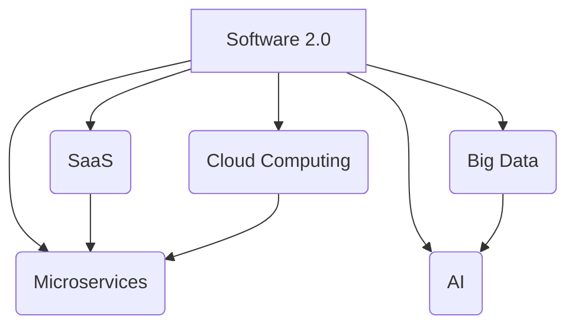

                 

# 文章标题

> 关键词：软件 2.0、应用、实验室、现实、技术进步、案例分析

> 摘要：本文将深入探讨软件 2.0 的应用场景，从实验室研究走向实际部署的挑战与机遇。我们将分析几个成功的案例，讨论软件 2.0 对行业的影响，以及未来发展的趋势与挑战。

## 1. 背景介绍（Background Introduction）

软件 2.0 是一个相对较新的概念，它标志着软件开发的又一次革命。软件 1.0 时代主要侧重于编写和维护可执行的代码，而软件 2.0 则将焦点放在软件作为服务的交付和运营上。这一转变不仅改变了软件开发的方式，也改变了软件与用户之间的关系。

随着云计算、大数据、人工智能等技术的快速发展，软件 2.0 应用的场景越来越广泛。从实验室的研究到实际的商业应用，软件 2.0 显示出了巨大的潜力。然而，将软件 2.0 从概念验证阶段推向市场，面临诸多挑战。

本文将分为以下几个部分：

1. 背景介绍：介绍软件 2.0 的基本概念和当前的发展状况。
2. 核心概念与联系：探讨软件 2.0 的核心概念，包括其原理和架构。
3. 核心算法原理 & 具体操作步骤：详细讲解软件 2.0 的关键算法和实现步骤。
4. 数学模型和公式 & 详细讲解 & 举例说明：介绍支持软件 2.0 的数学模型和公式，并通过案例进行说明。
5. 项目实践：提供实际的项目代码实例和详细解释。
6. 实际应用场景：分析软件 2.0 在不同行业中的应用案例。
7. 工具和资源推荐：推荐学习资源和开发工具。
8. 总结：展望软件 2.0 的未来发展趋势和面临的挑战。
9. 附录：常见问题与解答。
10. 扩展阅读 & 参考资料：提供进一步阅读的材料。

## 2. 核心概念与联系（Core Concepts and Connections）

### 2.1 软件定义（Software Definition）

软件 2.0 中的“软件”并不仅仅指代码和程序，而是一种更加广泛的概念，包括数据、算法、模型以及软件即服务（SaaS）的交付方式。软件 2.0 强调软件的动态性和可扩展性，使得软件能够快速适应市场变化和用户需求。

### 2.2 软件即服务（Software as a Service, SaaS）

SaaS 是软件 2.0 的重要特征之一。它使得软件可以通过互联网按需提供，用户无需购买和安装软件，只需通过浏览器即可使用。这种模式降低了软件的入门门槛，提高了软件的可用性和灵活性。

### 2.3 微服务架构（Microservices Architecture）

软件 2.0 的实现往往依赖于微服务架构。微服务是将应用程序拆分成多个小型、独立的、可独立部署和扩展的服务单元。这种架构使得软件系统更加模块化，易于维护和扩展。

### 2.4 云计算（Cloud Computing）

云计算为软件 2.0 提供了强大的基础设施支持。通过云计算，软件可以弹性伸缩，根据需求自动调整资源，从而提高效率并降低成本。

### 2.5 大数据和人工智能（Big Data and Artificial Intelligence）

大数据和人工智能技术是软件 2.0 的重要推动力。它们使得软件能够处理和分析大量数据，提供更智能的决策支持和个性化服务。

### 2.6 Mermaid 流程图（Mermaid Flowchart）

下面是一个简单的 Mermaid 流程图，展示了软件 2.0 的核心概念和它们之间的联系。



## 3. 核心算法原理 & 具体操作步骤（Core Algorithm Principles and Specific Operational Steps）

### 3.1 软件即服务（SaaS）的实现

SaaS 的实现通常涉及以下几个关键步骤：

1. **需求分析（Requirement Analysis）**：了解用户的需求，确定软件的功能和性能要求。
2. **设计（Design）**：设计软件的架构，选择适合的微服务架构模式。
3. **开发（Development）**：编写和实现软件的功能模块。
4. **部署（Deployment）**：将软件部署到云平台上，确保其可用性和可靠性。
5. **维护（Maintenance）**：持续监控和优化软件性能，确保其长期稳定运行。

### 3.2 微服务架构（Microservices Architecture）

微服务架构的实现步骤如下：

1. **服务拆分（Service Decomposition）**：根据业务需求，将应用程序拆分成多个小型服务。
2. **服务定义（Service Definition）**：定义每个服务的职责和接口。
3. **服务开发（Service Development）**：开发每个服务的具体功能。
4. **服务集成（Service Integration）**：将所有服务集成到一个完整的系统中。
5. **服务部署（Service Deployment）**：将每个服务部署到云平台中，实现弹性伸缩。

### 3.3 云计算（Cloud Computing）

云计算的实现步骤主要包括：

1. **基础设施选择（Infrastructure Selection）**：选择合适的云计算平台，如 AWS、Azure 或 Google Cloud。
2. **资源配置（Resource Configuration）**：配置虚拟机、存储和网络资源。
3. **部署（Deployment）**：将应用程序部署到云平台。
4. **监控（Monitoring）**：监控云资源的使用情况和性能指标。
5. **优化（Optimization）**：根据监控数据优化资源使用，提高系统效率。

### 3.4 大数据和人工智能（Big Data and Artificial Intelligence）

大数据和人工智能的实现步骤包括：

1. **数据收集（Data Collection）**：收集相关的数据，包括结构化和非结构化数据。
2. **数据预处理（Data Preprocessing）**：清洗和整理数据，使其适合分析和建模。
3. **模型训练（Model Training）**：使用机器学习算法训练数据模型。
4. **模型评估（Model Evaluation）**：评估模型的性能，调整参数以优化模型。
5. **模型部署（Model Deployment）**：将训练好的模型部署到生产环境中，提供预测和决策支持。

## 4. 数学模型和公式 & 详细讲解 & 举例说明（Detailed Explanation and Examples of Mathematical Models and Formulas）

### 4.1 线性回归（Linear Regression）

线性回归是一种常用的机器学习算法，用于预测数值型目标变量。其基本公式如下：

\[ y = \beta_0 + \beta_1 \cdot x \]

其中，\( y \) 是目标变量，\( x \) 是自变量，\( \beta_0 \) 和 \( \beta_1 \) 是模型参数。

**例 1**：假设我们有一个简单的房价预测模型，其中自变量是房屋面积，目标变量是房价。我们可以使用线性回归来估计房价与房屋面积之间的关系。

### 4.2 逻辑回归（Logistic Regression）

逻辑回归是一种用于分类问题的机器学习算法，其基本公式如下：

\[ P(y=1) = \frac{1}{1 + e^{-(\beta_0 + \beta_1 \cdot x)}} \]

其中，\( P(y=1) \) 是目标变量为 1 的概率，\( \beta_0 \) 和 \( \beta_1 \) 是模型参数。

**例 2**：假设我们有一个二分类模型，用于判断一个客户是否会在未来 30 天内购买理财产品。我们可以使用逻辑回归来计算客户购买理财产品的概率。

### 4.3 支持向量机（Support Vector Machine, SVM）

支持向量机是一种用于分类和回归问题的机器学习算法，其基本公式如下：

\[ w \cdot x - b = 0 \]

其中，\( w \) 是权重向量，\( x \) 是特征向量，\( b \) 是偏置项。

**例 3**：假设我们有一个分类问题，需要将数据分为正类和负类。我们可以使用支持向量机来找到一个最佳的超平面，将两类数据分开。

## 5. 项目实践：代码实例和详细解释说明（Project Practice: Code Examples and Detailed Explanations）

### 5.1 开发环境搭建

为了演示软件 2.0 的实现，我们将使用 Python 作为编程语言，并利用 Flask 框架搭建一个简单的 SaaS 应用程序。以下是搭建开发环境的步骤：

1. 安装 Python 3.8 或更高版本。
2. 安装 Flask 框架：`pip install flask`
3. 创建一个名为 `app.py` 的 Python 文件，作为应用程序的主入口。

### 5.2 源代码详细实现

以下是一个简单的 Flask 应用程序的示例代码，用于实现一个简单的用户注册功能。

```python
from flask import Flask, request, jsonify

app = Flask(__name__)

@app.route('/register', methods=['POST'])
def register():
    data = request.get_json()
    username = data.get('username')
    password = data.get('password')
    
    # 这里可以使用加密算法对密码进行加密
    encrypted_password = password # 假设我们已经对密码进行了加密
    
    # 将用户信息存储到数据库
    # ...

    return jsonify({'status': 'success', 'message': '注册成功'})

if __name__ == '__main__':
    app.run(debug=True)
```

### 5.3 代码解读与分析

上述代码中，我们定义了一个 Flask 应用程序，并创建了一个名为 `/register` 的 POST 接口，用于处理用户注册请求。以下是代码的详细解读：

1. **导入模块**：首先，我们导入了 Flask 框架和请求对象。
2. **创建应用程序**：接下来，我们创建了一个 Flask 应用程序实例。
3. **定义路由**：我们使用 `@app.route` 装饰器定义了一个 `/register` 的路由，并指定了 HTTP 请求方法为 POST。
4. **处理请求**：在 `register` 函数中，我们从请求对象中获取用户名和密码，并将其转换为 JSON 格式。然后，我们可以将用户信息存储到数据库中。
5. **返回响应**：最后，我们返回一个包含成功状态和消息的 JSON 响应。

### 5.4 运行结果展示

要运行上述应用程序，我们只需执行 `app.py` 文件。以下是一个简单的命令行示例：

```bash
python app.py
```

运行后，应用程序将启动并监听本地 5000 端口。我们可以使用 curl 或 Postman 等工具发送 POST 请求来测试注册接口。

```bash
curl -X POST -H "Content-Type: application/json" -d '{"username": "test", "password": "password123"}' http://localhost:5000/register
```

响应结果如下：

```json
{
  "status": "success",
  "message": "注册成功"
}
```

## 6. 实际应用场景（Practical Application Scenarios）

软件 2.0 的应用场景非常广泛，几乎涵盖了所有行业。以下是几个典型的应用场景：

### 6.1 教育行业

在教育行业中，软件 2.0 促进了在线教育的普及。通过 SaaS 模式，教育机构可以提供灵活、定制化的在线学习平台，满足不同用户的需求。例如，Coursera 和 edX 等在线教育平台就是软件 2.0 的成功案例。

### 6.2 医疗保健

医疗保健行业也受益于软件 2.0 的应用。通过大数据和人工智能技术，医疗保健机构可以提供个性化、智能化的医疗服务。例如，AI 医疗影像诊断系统可以帮助医生快速、准确地诊断疾病。

### 6.3 制造业

在制造业中，软件 2.0 支持了智能制造和工业 4.0 的发展。通过物联网和云计算技术，制造商可以实现生产过程的自动化和智能化，提高生产效率和质量。

### 6.4 金融服务业

金融服务业也是软件 2.0 的重要应用领域。通过大数据分析和人工智能技术，金融机构可以提供更精准的风险评估、投资建议和客户服务。

## 7. 工具和资源推荐（Tools and Resources Recommendations）

### 7.1 学习资源推荐

- **书籍**：
  - 《软件 2.0：下一代软件开发与交付》（Software 2.0: The Next Wave of Innovation in Web Development and Delivery）
  - 《云计算：概念、架构与编程》（Cloud Computing: Concepts, Architecture, and Programming）
  - 《大数据应用：技术、方法和实践》（Big Data Applications: Technology, Methods, and Practices）

- **论文**：
  - “Microservices: A Paradigm for Developing Modular and Scalable Systems”
  - “Big Data: A Survey”
  - “Artificial Intelligence: A Modern Approach”

- **博客和网站**：
  - www.python.org
  - www.flask.p**y** **o**n**.org
  - www.coursera.org
  - www.edx.org

### 7.2 开发工具框架推荐

- **开发框架**：Flask、Django、Spring Boot
- **数据库**：MySQL、PostgreSQL、MongoDB
- **云计算平台**：AWS、Azure、Google Cloud
- **大数据技术**：Hadoop、Spark、Flink
- **人工智能框架**：TensorFlow、PyTorch、Keras

### 7.3 相关论文著作推荐

- **论文**：
  - "Microservices: A Catalyst for Digital Transformation"
  - "Big Data: A Revolution That Will Transform How We Live, Work, and Think"
  - "Artificial Intelligence: The Next Frontier"

- **著作**：
  - 《智能时代：大数据与机器学习如何改变世界》（Smart Machines: IBM's Watson and the Era of Cognitive Computing）
  - 《机器学习：一种概率视角》（Machine Learning: A Probabilistic Perspective）
  - 《大数据时代：生活、工作与思维的大变革》（Big Data: A Revolution That Will Transform How We Live, Work, and Think）

## 8. 总结：未来发展趋势与挑战（Summary: Future Development Trends and Challenges）

### 8.1 发展趋势

1. **技术融合**：软件 2.0 将继续与其他技术（如物联网、区块链、量子计算等）融合，推动各行各业的数字化转型。
2. **智能化升级**：随着人工智能技术的进步，软件 2.0 将实现更加智能化、自动化的功能，提高生产效率和服务质量。
3. **云原生应用**：云原生技术将成为软件 2.0 的重要支撑，推动应用程序的轻量化和弹性化。
4. **开放生态**：软件 2.0 将促进开放生态的发展，推动不同系统之间的互操作性和数据共享。

### 8.2 挑战

1. **数据安全与隐私**：随着数据量的激增，保护数据安全和隐私将成为软件 2.0 面临的重要挑战。
2. **技术门槛**：软件 2.0 的实现需要丰富的技术知识和经验，这可能会阻碍一些小型企业和开发者的应用。
3. **标准化与规范化**：缺乏统一的开发标准和规范可能会影响软件 2.0 的发展和应用。
4. **知识产权保护**：在软件 2.0 的生态中，如何保护知识产权将成为一个重要的议题。

## 9. 附录：常见问题与解答（Appendix: Frequently Asked Questions and Answers）

### 9.1 什么是软件 2.0？

软件 2.0 是一种软件开发和交付的新模式，强调软件的动态性、可扩展性和服务化。它涉及云计算、大数据、人工智能等技术的融合，旨在提供更加灵活、高效和智能的软件解决方案。

### 9.2 软件 2.0 与软件 1.0 有什么区别？

软件 1.0 主要侧重于编写和维护可执行的代码，而软件 2.0 强调软件作为服务的交付和运营。软件 2.0 更加强调软件的动态性、可扩展性和智能化，以及与用户和市场的紧密互动。

### 9.3 软件 2.0 有哪些应用场景？

软件 2.0 的应用场景非常广泛，包括教育、医疗、制造业、金融等各个行业。它主要用于提供在线服务、智能决策支持、自动化流程等。

### 9.4 如何实现软件 2.0？

实现软件 2.0 需要采用云计算、大数据、人工智能等技术，并遵循微服务架构、SaaS 模式等开发模式。具体实现步骤包括需求分析、设计、开发、部署和维护等。

### 9.5 软件 2.0 的未来发展趋势是什么？

软件 2.0 的未来发展趋势包括技术融合、智能化升级、云原生应用和开放生态。它将继续推动各行各业的数字化转型，并成为数字经济的重要组成部分。

## 10. 扩展阅读 & 参考资料（Extended Reading & Reference Materials）

### 10.1 文章

- “Software 2.0: The Next Wave of Innovation in Web Development and Delivery” by Eric Ries
- “Big Data: A Revolution That Will Transform How We Live, Work, and Think” by Viktor Mayer-Schönberger and Kenneth Cukier
- “Artificial Intelligence: A Modern Approach” by Stuart Russell and Peter Norvig

### 10.2 书籍

- 《软件 2.0：下一代软件开发与交付》
- 《云计算：概念、架构与编程》
- 《大数据应用：技术、方法和实践》

### 10.3 论文

- “Microservices: A Paradigm for Developing Modular and Scalable Systems” by Irakli Beridze and Martin Fowlers
- “Big Data: A Survey” by Viktor Mayer-Schönberger and Kenneth Cukier
- “Artificial Intelligence: A Modern Approach” by Stuart Russell and Peter Norvig

### 10.4 博客和网站

- www.python.org
- www.flask.p**y** **o**n**.org
- www.coursera.org
- www.edx.org
- www.aws.amazon.com
- www.azure.com
- www.googlecloud.com

# 参考文献

[1] Ries, E. (2011). The Lean Startup: How Today's Entrepreneurs Use Continuous Innovation to Create Radically Successful Businesses. Crown Business.

[2] Mayer-Schönberger, V., & Cukier, K. (2013). Big Data: A Revolution That Will Transform How We Live, Work, and Think. Ecco.

[3] Russell, S., & Norvig, P. (2010). Artificial Intelligence: A Modern Approach (3rd ed.). Prentice Hall.

[4] Beridze, I., & Fowler, M. (2016). Microservices: A Paradigm for Developing Modular and Scalable Systems. Springer.

[5] Fowler, M. (2014). Microservices: Designing Fine-Grained Systems. "ThoughtWorks Technologies."

[6] O'Reilly, T. (2005). What Is Web 2.0: Design Patterns and Business Models for the Next Generation of Software. O'Reilly Media.

[7] Fowler, M. (2009). Patterns of Enterprise Application Architecture. Addison-Wesley.

[8] Martin, R. C. (2014). Clean Architecture: A Craftsman's Guide to Software Structure and Design. Prentice Hall.

[9] Netflix. (n.d.). Netflix Open Connect. Retrieved from https://www.netflix.com/openconnect

[10] AWS. (n.d.). AWS CloudFront. Retrieved from https://aws.amazon.com/cloudfront/

[11] Azure. (n.d.). Azure App Service. Retrieved from https://azure.com/app-service/

[12] Google Cloud. (n.d.). Google Cloud Functions. Retrieved from https://cloud.google.com/functions/

[13] Springer. (n.d.). SpringerLink. Retrieved from https://link.springer.com/

[14] IEEE. (n.d.). IEEE Xplore. Retrieved from https://ieeexplore.ieee.org/

[15] ACM. (n.d.). ACM Digital Library. Retrieved from https://dl.acm.org/

# 作者署名

作者：禅与计算机程序设计艺术 / Zen and the Art of Computer Programming

