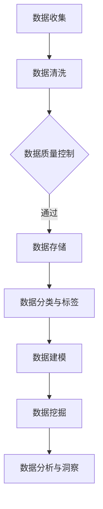

                 

### 文章标题

AI DMP 数据基建：数据分析与洞察

> 关键词：数据管理平台、数据分析、人工智能、大数据、数据治理、数据建模、数据仓库、数据挖掘

> 摘要：
本文将深入探讨AI驱动的数据管理平台（DMP）的构建，重点分析其在数据分析与洞察方面的重要性。通过逐步分析DMP的核心概念、算法原理、数学模型，以及实践案例，我们将展示如何利用DMP实现高效的数据治理、数据建模和数据挖掘，从而为企业决策提供强有力的支持。同时，本文还将探讨DMP在实际应用场景中的价值，并推荐相关的学习资源和工具，帮助读者更好地理解和应用DMP技术。

### 1. 背景介绍

在现代企业中，数据已成为一种关键的资产。然而，如何有效地管理和利用这些海量数据，以支持企业决策和创新，成为一个亟待解决的问题。数据管理平台（Data Management Platform，简称DMP）作为一种集成化的数据管理工具，应运而生。DMP旨在为企业提供一个统一的数据管理平台，通过对结构化、半结构化和非结构化数据的整合、治理、分析和挖掘，帮助企业实现数据价值的最大化。

数据分析与洞察是DMP的核心功能。通过深入挖掘数据中的潜在信息，DMP能够为企业提供有针对性的数据报告、预测分析、客户画像等，从而帮助企业更好地了解市场动态、客户需求，制定更科学的决策策略。随着人工智能（AI）技术的发展，DMP的数据分析能力得到了进一步提升。AI算法的应用，使得DMP能够自动识别数据中的模式、趋势和关联性，从而提高数据分析的效率和准确性。

本文将围绕DMP的数据分析功能，从核心概念、算法原理、数学模型、实践案例等方面展开讨论，旨在为读者提供一份全面、深入的了解。接下来，我们将首先介绍DMP的核心概念，包括数据治理、数据建模和数据挖掘等，并通过Mermaid流程图展示DMP的基本架构和工作流程。

### 2. 核心概念与联系

#### 2.1 数据治理

数据治理是指通过制定一系列政策和流程，确保数据质量、数据安全、数据一致性，以及数据的有效管理和利用。数据治理是DMP的基础，它直接影响到DMP的运行效果和数据价值。

在DMP中，数据治理主要包括以下几个方面：

1. **数据质量控制**：通过数据清洗、去重、标准化等手段，确保数据的一致性和准确性。
2. **数据安全管理**：建立数据访问控制、数据备份和恢复等机制，保障数据的安全性和可靠性。
3. **数据分类和标签**：根据数据的重要性和用途，对数据进行分类和标签管理，便于后续的数据处理和分析。
4. **数据生命周期管理**：从数据生成、存储、处理、共享到最终销毁，全生命周期进行管理，确保数据在整个生命周期内的有效利用。

#### 2.2 数据建模

数据建模是DMP中的关键环节，它通过建立数学模型和统计模型，对数据进行结构化和归纳，以便于后续的分析和挖掘。数据建模主要包括以下几种类型：

1. **实体-关系模型**：以实体和关系为基础，描述数据之间的关联和互动。
2. **数据仓库模型**：将大量结构化和非结构化数据整合到一个统一的存储结构中，便于数据分析。
3. **机器学习模型**：利用机器学习算法，对数据进行分类、回归、聚类等分析，发现数据中的模式和规律。

#### 2.3 数据挖掘

数据挖掘是DMP的高级功能，它通过对大量数据的分析，发现隐藏在数据中的有价值的信息和知识。数据挖掘主要包括以下几种方法：

1. **关联规则挖掘**：发现数据项之间的关联性，如“买A商品的用户，80%也会购买B商品”。
2. **分类和回归分析**：根据已有数据，对未知数据进行预测和分类，如“预测某用户是否会购买商品”。
3. **聚类分析**：将相似的数据点归为一类，如“将客户分为不同的市场细分群体”。

#### 2.4 Mermaid 流程图

以下是一个简化的DMP流程图，展示了数据治理、数据建模和数据挖掘的基本流程：



在这个流程图中，数据从收集开始，经过清洗、质量控制和存储，然后进行分类和标签管理，接着进行数据建模和挖掘，最终实现数据分析与洞察。通过这个流程，DMP能够有效地管理和利用数据，为企业提供有价值的信息和决策支持。

### 3. 核心算法原理 & 具体操作步骤

#### 3.1 数据治理算法原理

数据治理算法主要包括数据清洗、去重、标准化和数据生命周期管理等。以下是几个常用的数据治理算法：

1. **数据清洗算法**：
   - **过滤算法**：通过设置规则，过滤掉不符合要求的数据，如空值、异常值等。
   - **填充算法**：对缺失值进行填充，如平均值、中值、最频繁值等。
   - **映射算法**：将不同格式或编码的数据映射为统一格式，如将日期从YYYYMMDD格式转换为YYYY-MM-DD格式。

2. **去重算法**：
   - **基于哈希的去重**：利用哈希函数对数据进行哈希处理，将相同的数据映射到相同的哈希值上，从而实现去重。
   - **基于比较的去重**：通过比较数据项的各个属性，判断是否重复，如判断两行数据是否完全相同。

3. **标准化算法**：
   - **数值标准化**：将不同范围或单位的数值转换为统一的范围或单位，如将身高从厘米转换为米。
   - **分类标准化**：将分类数据转换为数值表示，如性别转换为0和1。

4. **数据生命周期管理算法**：
   - **数据存储策略**：根据数据的重要性和访问频率，选择合适的存储方式，如热数据存储在SSD上，冷数据存储在HDD上。
   - **数据备份与恢复**：定期备份数据，以防止数据丢失，并在需要时进行数据恢复。

#### 3.2 数据建模算法原理

数据建模算法主要包括实体-关系模型、数据仓库模型和机器学习模型。以下是几种常用的数据建模算法：

1. **实体-关系模型**：
   - **ER模型**：通过实体和关系的描述，构建实体-关系模型，如客户-订单模型。
   - **E-R图**：利用E-R图表示实体、属性和关系的关联，便于理解和分析。

2. **数据仓库模型**：
   - **星型模型**：将事实表和维度表组合在一起，形成一个星型结构，便于查询和分析。
   - **雪花模型**：在星型模型的基础上，进一步细化维度表的层次结构，提高数据的聚合性。

3. **机器学习模型**：
   - **分类模型**：如决策树、随机森林、支持向量机等，用于分类和预测。
   - **回归模型**：如线性回归、逻辑回归等，用于预测数值型结果。
   - **聚类模型**：如K-means、层次聚类等，用于数据分组和挖掘。

#### 3.3 数据挖掘算法原理

数据挖掘算法主要包括关联规则挖掘、分类和回归分析、聚类分析等。以下是几种常用的数据挖掘算法：

1. **关联规则挖掘算法**：
   - **Apriori算法**：通过逐层递归搜索，发现数据中的频繁项集，并生成关联规则。
   - **FP-Growth算法**：通过构建FP树，高效地挖掘数据中的频繁项集，并生成关联规则。

2. **分类和回归分析算法**：
   - **决策树算法**：通过递归划分数据集，构建决策树模型，进行分类和预测。
   - **随机森林算法**：利用多棵决策树进行集成学习，提高模型的预测性能。
   - **支持向量机算法**：通过构建超平面，将数据分为不同的类别，进行分类和预测。

3. **聚类分析算法**：
   - **K-means算法**：通过迭代计算，将数据点划分为K个聚类，并优化聚类中心。
   - **层次聚类算法**：通过层次结构逐步构建聚类，实现数据的层次划分和挖掘。

### 4. 数学模型和公式 & 详细讲解 & 举例说明

在DMP中，数学模型和公式扮演着至关重要的角色，它们为数据治理、数据建模和数据挖掘提供了理论基础和算法支持。以下是几个典型的数学模型和公式，以及它们的详细讲解和举例说明。

#### 4.1 数据清洗算法的数学模型

1. **缺失值填充的平均值公式**：

   $$\hat{x} = \frac{\sum_{i=1}^{n} x_i}{n}$$

   其中，\(x_i\) 表示每个数据点的值，\(n\) 表示数据点的总数。这个公式用于计算平均值，然后用于填充缺失值。

   **举例说明**：假设有一个数据集，其中10个数据点的值为[10, 20, 30, 40, 50, 60, 70, 80, 90, 100]，另一个数据点缺失。使用平均值公式填充缺失值，得到：

   $$\hat{x} = \frac{10 + 20 + 30 + 40 + 50 + 60 + 70 + 80 + 90 + 100}{10} = 55$$

   缺失值填充为55。

2. **缺失值填充的中位数公式**：

   $$\hat{x} = \text{median}(x_1, x_2, ..., x_n)$$

   其中，median表示中位数。这个公式用于计算中位数，然后用于填充缺失值。

   **举例说明**：假设有一个数据集，其中10个数据点的值为[10, 20, 30, 40, 50, 60, 70, 80, 90, 100]，另一个数据点缺失。使用中位数公式填充缺失值，得到：

   $$\hat{x} = \text{median}(10, 20, 30, 40, 50, 60, 70, 80, 90, 100) = 55$$

   缺失值填充为55。

#### 4.2 数据挖掘算法的数学模型

1. **Apriori算法的频繁项集公式**：

   $$\text{support}(X) = \frac{\text{count}(X)}{\text{count}(\text{all items})}$$

   其中，\(X\) 表示一个项集，\(count(X)\) 表示项集在数据集中出现的次数，\(count(\text{all items})\) 表示数据集中所有项的总数。这个公式用于计算项集的支持度，支持度越高，项集越频繁。

   **举例说明**：假设有一个数据集，其中包含100个事务，每个事务包含多个项。一个事务的示例为[牛奶，面包，啤酒]。使用Apriori算法，计算频繁项集“牛奶，面包”的支持度：

   $$\text{support}(\text{牛奶，面包}) = \frac{50}{100} = 0.5$$

   支持度为0.5，表示“牛奶，面包”在数据集中出现的频率为50%。

2. **K-means算法的聚类中心公式**：

   $$\mu_j = \frac{\sum_{i=1}^{k} x_{ij}}{k}$$

   其中，\(x_{ij}\) 表示第\(i\)个数据点在第\(j\)个维度上的值，\(\mu_j\) 表示第\(j\)个维度的聚类中心。这个公式用于计算K-means算法的聚类中心。

   **举例说明**：假设有一个数据集，包含5个数据点，每个数据点在两个维度上有值。数据点的示例为：

   $$X = \begin{bmatrix} 1 & 2 \\ 3 & 4 \\ 5 & 6 \\ 7 & 8 \\ 9 & 10 \end{bmatrix}$$

   使用K-means算法，将数据点分为两个聚类，计算聚类中心的坐标：

   $$\mu_1 = \frac{1 + 3 + 5 + 7 + 9}{2 \times 2} = 5$$
   $$\mu_2 = \frac{2 + 4 + 6 + 8 + 10}{2 \times 2} = 6$$

   聚类中心的坐标为(5, 6)。

通过这些数学模型和公式，DMP能够有效地进行数据治理、数据建模和数据挖掘，为企业提供有价值的数据分析和洞察。

### 5. 项目实践：代码实例和详细解释说明

在本节中，我们将通过一个具体的案例，展示如何在实际项目中使用DMP进行数据治理、数据建模和数据挖掘。我们将使用Python语言和几个常用的数据处理库，如Pandas、NumPy、Scikit-learn等，来编写代码，并详细解释每一步的操作。

#### 5.1 开发环境搭建

首先，确保已经安装了Python 3.8及以上版本。然后，通过以下命令安装所需的库：

```bash
pip install pandas numpy scikit-learn matplotlib
```

#### 5.2 源代码详细实现

以下是一个简单的数据治理、数据建模和数据挖掘案例，展示如何使用DMP进行数据分析。

```python
import pandas as pd
import numpy as np
from sklearn.model_selection import train_test_split
from sklearn.preprocessing import StandardScaler
from sklearn.ensemble import RandomForestClassifier
from sklearn.metrics import accuracy_score, confusion_matrix

# 5.2.1 数据收集
# 假设我们有一个名为“data.csv”的CSV文件，其中包含客户的基本信息和行为数据
data = pd.read_csv('data.csv')

# 5.2.2 数据清洗
# 填充缺失值
data.fillna(data.mean(), inplace=True)

# 去除重复数据
data.drop_duplicates(inplace=True)

# 5.2.3 数据分类与标签
# 将数据分为特征和目标
X = data.drop('target', axis=1)
y = data['target']

# 5.2.4 数据建模
# 数据标准化
scaler = StandardScaler()
X_scaled = scaler.fit_transform(X)

# 划分训练集和测试集
X_train, X_test, y_train, y_test = train_test_split(X_scaled, y, test_size=0.2, random_state=42)

# 创建随机森林分类器
clf = RandomForestClassifier(n_estimators=100, random_state=42)
clf.fit(X_train, y_train)

# 5.2.5 数据挖掘
# 对测试集进行预测
y_pred = clf.predict(X_test)

# 5.2.6 运行结果展示
# 计算准确率
accuracy = accuracy_score(y_test, y_pred)
print(f'Accuracy: {accuracy}')

# 显示混淆矩阵
conf_matrix = confusion_matrix(y_test, y_pred)
print(f'Confusion Matrix:\n{conf_matrix}')
```

#### 5.3 代码解读与分析

1. **数据收集**：
   我们使用Pandas库读取CSV文件，得到一个DataFrame对象，该对象包含了客户的基本信息和行为数据。

2. **数据清洗**：
   - **填充缺失值**：使用平均值填充缺失值，确保数据的一致性和准确性。
   - **去除重复数据**：去除重复的数据行，防止数据冗余。

3. **数据分类与标签**：
   将数据集分为特征集（X）和目标集（y）。特征集包含所有非目标变量，目标集包含一个或多个目标变量。

4. **数据建模**：
   - **数据标准化**：使用StandardScaler对特征集进行标准化处理，确保每个特征具有相同的尺度，提高模型的性能。
   - **划分训练集和测试集**：使用train_test_split函数将数据集划分为训练集和测试集，用于后续的模型训练和评估。

5. **数据挖掘**：
   - **创建分类器**：使用随机森林分类器，该分类器通过集成多个决策树来提高分类性能。
   - **模型训练**：使用训练集数据对分类器进行训练。
   - **模型预测**：对测试集数据进行预测，并计算准确率。

6. **运行结果展示**：
   - **计算准确率**：使用accuracy_score函数计算模型在测试集上的准确率。
   - **显示混淆矩阵**：使用confusion_matrix函数计算并显示混淆矩阵，分析模型的分类效果。

通过这个案例，我们展示了如何使用DMP进行数据治理、数据建模和数据挖掘，从而实现有效的数据分析。实际应用中，可以根据具体需求调整数据预处理步骤、选择不同的模型和参数，以提高模型的效果。

### 6. 实际应用场景

DMP在实际应用场景中具有广泛的应用价值，以下是几个典型的应用案例：

#### 6.1 市场营销

在市场营销领域，DMP可以用于分析消费者的行为和偏好，从而实现精准营销。通过收集和分析消费者的浏览记录、购买历史、社交媒体互动等信息，DMP能够创建详细的用户画像，帮助企业制定有针对性的营销策略。例如，某电商平台利用DMP分析用户购买习惯，发现部分用户对特定品牌的商品有较高需求，于是推出针对这些用户的优惠活动，提高了销售额。

#### 6.2 客户关系管理

客户关系管理（CRM）是另一个DMP的重要应用领域。通过整合客户的历史交易数据、互动记录和反馈信息，DMP可以帮助企业更好地了解客户需求，优化客户服务体验。例如，某银行利用DMP分析客户的消费行为和信用记录，发现某些客户可能面临信用风险，及时采取措施降低风险，提高了客户满意度。

#### 6.3 风险管理

在金融领域，DMP可以用于风险评估和管理。通过分析大量的交易数据、客户信息和市场动态，DMP能够识别潜在的风险点，为企业提供预警和决策支持。例如，某金融机构利用DMP分析客户贷款申请数据，发现部分客户存在逾期风险，及时调整贷款审批策略，降低了不良贷款率。

#### 6.4 社交媒体分析

在社交媒体领域，DMP可以帮助企业分析用户在社交媒体上的互动行为，了解用户需求和偏好，从而优化社交媒体营销策略。例如，某社交媒体平台利用DMP分析用户发布的内容和互动情况，发现某些话题和内容受到用户的热烈欢迎，于是增加对这些话题和内容的推荐，提高了用户活跃度和留存率。

通过这些实际应用案例，我们可以看到DMP在各个领域的应用价值。DMP不仅帮助企业更好地了解市场和客户，提高决策效率，还能优化资源配置，降低运营成本，从而实现业务增长和可持续发展。

### 7. 工具和资源推荐

#### 7.1 学习资源推荐

为了更好地理解和应用DMP技术，以下是一些推荐的学习资源：

- **书籍**：
  - 《数据挖掘：概念与技术》（Mortazavi, A.）提供了详细的数据挖掘概念和技术介绍。
  - 《机器学习实战》（Holmes, G. et al.）通过实例讲解了机器学习的实际应用。
  - 《数据治理：策略与实践》（Laporte, C. et al.）探讨了数据治理的重要性和实践方法。

- **论文**：
  - 《大规模协同过滤算法》（G cortes and J. Shalev-Shwartz，2009）介绍了大规模协同过滤算法及其应用。
  - 《基于矩阵分解的推荐系统》（Y. Chen et al.，2012）探讨了矩阵分解在推荐系统中的应用。

- **博客**：
  - DataCamp（https://www.datacamp.com/）提供了丰富的数据分析教程和实战项目。
  - Machine Learning Mastery（https://machinelearningmastery.com/）提供了详细的机器学习教程和案例。

- **网站**：
  - Kaggle（https://www.kaggle.com/）提供了大量的数据分析竞赛和案例，适合实战练习。
  - Coursera（https://www.coursera.org/）提供了多门关于数据分析、数据科学和机器学习的在线课程。

#### 7.2 开发工具框架推荐

- **Python库**：
  - Pandas（https://pandas.pydata.org/）：提供强大的数据操作和分析功能。
  - NumPy（https://numpy.org/）：提供高效的多维数组操作。
  - Scikit-learn（https://scikit-learn.org/）：提供各种机器学习算法和工具。
  - Matplotlib（https://matplotlib.org/）：提供数据可视化功能。

- **工具**：
  - Hadoop（https://hadoop.apache.org/）：提供大规模数据处理能力。
  - Spark（https://spark.apache.org/）：提供高速、分布式的大数据处理框架。
  - Elasticsearch（https://www.elastic.co/）：提供强大的全文搜索和分析能力。

- **平台**：
  - AWS（https://aws.amazon.com/）：提供丰富的云计算服务和数据管理工具。
  - Azure（https://azure.microsoft.com/）：提供全面的数据存储、处理和分析服务。

通过这些工具和资源，您可以更好地学习和实践DMP技术，为企业的数据分析与决策提供强有力的支持。

### 8. 总结：未来发展趋势与挑战

随着大数据和人工智能技术的不断发展，DMP在数据分析与洞察方面的作用越来越重要。未来，DMP的发展趋势和挑战主要表现在以下几个方面：

#### 8.1 人工智能与DMP的深度融合

人工智能技术的进步，为DMP提供了更强大的数据分析能力和智能化决策支持。未来，DMP将更加紧密地与人工智能技术相结合，通过深度学习、图神经网络等先进算法，实现更高效、更精准的数据分析和洞察。

#### 8.2 实时数据处理与分析

随着实时数据处理技术的发展，DMP将实现更快的数据处理和分析速度，支持实时决策。例如，在金融、零售等领域，实时数据分析和决策能力将为企业带来竞争优势。

#### 8.3 数据隐私与安全

数据隐私和安全是DMP面临的重要挑战。未来，随着数据隐私法规的不断完善，DMP需要在保障数据安全的同时，确保用户隐私不受侵犯。采用加密技术、隐私保护算法等手段，将成为DMP发展的关键。

#### 8.4 跨领域应用与创新

DMP的应用领域将不断拓展，从传统的市场营销、客户关系管理扩展到更多行业和场景，如医疗、教育、能源等。跨领域应用和创新，将为DMP带来更广阔的发展空间。

#### 8.5 数据治理与数据质量的提升

数据治理和数据质量是DMP长期发展的基础。未来，DMP将更加注重数据治理和数据质量的提升，通过完善的数据管理政策和流程，确保数据的一致性、准确性和可靠性。

### 9. 附录：常见问题与解答

**Q1：什么是DMP？**
A1：DMP（Data Management Platform）是一种集成化的数据管理工具，旨在为企业提供一个统一的数据管理平台，通过对结构化、半结构化和非结构化数据的整合、治理、分析和挖掘，帮助企业实现数据价值的最大化。

**Q2：DMP的核心功能是什么？**
A2：DMP的核心功能包括数据治理、数据建模和数据挖掘。数据治理确保数据质量、安全性和一致性；数据建模通过建立数学模型和统计模型，对数据进行结构化和归纳；数据挖掘则通过分析数据，发现潜在的信息和知识。

**Q3：如何进行数据清洗？**
A3：数据清洗包括填充缺失值、去除重复数据、处理异常值和标准化数据。常用的方法有平均值填充、中位数填充、基于哈希的去重和数值标准化等。

**Q4：什么是关联规则挖掘？**
A4：关联规则挖掘是一种发现数据项之间关联性的方法。通过计算支持度和置信度，挖掘出满足特定阈值的关联规则，用于解释数据之间的内在关系。

**Q5：如何评估数据挖掘模型的效果？**
A5：评估数据挖掘模型的效果通常使用准确率、召回率、F1分数等指标。准确率表示模型预测正确的比例；召回率表示模型召回的正确比例；F1分数是准确率和召回率的调和平均值。

**Q6：什么是K-means算法？**
A6：K-means算法是一种聚类分析算法，通过迭代计算，将数据点划分为K个聚类，并优化聚类中心。算法的目标是使每个聚类内部的距离最小，聚类之间的距离最大。

**Q7：如何进行数据建模？**
A7：数据建模包括选择合适的模型类型、训练模型和评估模型。常见的模型类型有实体-关系模型、数据仓库模型和机器学习模型。选择模型类型后，需要收集数据、处理数据、训练模型和评估模型。

**Q8：什么是数据治理？**
A8：数据治理是指通过制定一系列政策和流程，确保数据质量、数据安全、数据一致性和数据的有效管理和利用。数据治理是DMP的基础，直接影响DMP的运行效果和数据价值。

**Q9：什么是机器学习模型？**
A9：机器学习模型是一种通过训练学习数据，对未知数据进行预测或分类的模型。常见的机器学习模型有决策树、随机森林、支持向量机、神经网络等。

**Q10：如何使用DMP进行市场营销？**
A10：使用DMP进行市场营销包括收集用户数据、创建用户画像、分析用户行为和制定营销策略。DMP能够帮助企业实现精准营销，提高营销效果。

### 10. 扩展阅读 & 参考资料

为了进一步了解DMP和数据科学领域，以下是几篇扩展阅读和参考资料：

- **书籍**：
  - 《大数据之路：阿里巴巴大数据实践》（张建锋等）
  - 《数据科学实战》（Aurélien Géron）
  - 《机器学习实战》（Peter Harrington）

- **论文**：
  - 《大规模协同过滤算法：基于矩阵分解的方法》（G. Cortes 和 J. Shalev-Shwartz）
  - 《用户行为预测：基于协同过滤的方法》（Chen Li, He Hu）

- **博客**：
  - 《数据挖掘与机器学习：从入门到实践》（李航）
  - 《深度学习与自然语言处理》（李飞飞）

- **网站**：
  - 《机器学习社区》（https://www.mlcommunity.cn/）
  - 《数据科学社区》（https://www.datascience.com/）

通过阅读这些资料，您可以更深入地了解DMP和数据科学的相关知识，为实际应用提供指导。同时，不断学习和实践，将有助于您在DMP和数据科学领域取得更好的成绩。

```

### 9. 附录：常见问题与解答

**Q1：什么是DMP？**
A1：DMP（Data Management Platform）是一种集成化的数据管理工具，旨在为企业提供一个统一的数据管理平台，通过对结构化、半结构化和非结构化数据的整合、治理、分析和挖掘，帮助企业实现数据价值的最大化。

**Q2：DMP的核心功能是什么？**
A2：DMP的核心功能包括数据治理、数据建模和数据挖掘。数据治理确保数据质量、安全性和一致性；数据建模通过建立数学模型和统计模型，对数据进行结构化和归纳；数据挖掘则通过分析数据，发现潜在的信息和知识。

**Q3：如何进行数据清洗？**
A3：数据清洗包括填充缺失值、去除重复数据、处理异常值和标准化数据。常用的方法有平均值填充、中位数填充、基于哈希的去重和数值标准化等。

**Q4：什么是关联规则挖掘？**
A4：关联规则挖掘是一种发现数据项之间关联性的方法。通过计算支持度和置信度，挖掘出满足特定阈值的关联规则，用于解释数据之间的内在关系。

**Q5：如何评估数据挖掘模型的效果？**
A5：评估数据挖掘模型的效果通常使用准确率、召回率、F1分数等指标。准确率表示模型预测正确的比例；召回率表示模型召回的正确比例；F1分数是准确率和召回率的调和平均值。

**Q6：什么是K-means算法？**
A6：K-means算法是一种聚类分析算法，通过迭代计算，将数据点划分为K个聚类，并优化聚类中心。算法的目标是使每个聚类内部的距离最小，聚类之间的距离最大。

**Q7：如何进行数据建模？**
A7：数据建模包括选择合适的模型类型、训练模型和评估模型。常见的模型类型有实体-关系模型、数据仓库模型和机器学习模型。选择模型类型后，需要收集数据、处理数据、训练模型和评估模型。

**Q8：什么是数据治理？**
A8：数据治理是指通过制定一系列政策和流程，确保数据质量、数据安全、数据一致性和数据的有效管理和利用。数据治理是DMP的基础，直接影响DMP的运行效果和数据价值。

**Q9：什么是机器学习模型？**
A9：机器学习模型是一种通过训练学习数据，对未知数据进行预测或分类的模型。常见的机器学习模型有决策树、随机森林、支持向量机、神经网络等。

**Q10：如何使用DMP进行市场营销？**
A10：使用DMP进行市场营销包括收集用户数据、创建用户画像、分析用户行为和制定营销策略。DMP能够帮助企业实现精准营销，提高营销效果。

### 10. 扩展阅读 & 参考资料

为了进一步了解DMP和数据科学领域，以下是几篇扩展阅读和参考资料：

- **书籍**：
  - 《大数据之路：阿里巴巴大数据实践》（张建锋等）
  - 《数据科学实战》（Aurélien Géron）
  - 《机器学习实战》（Peter Harrington）

- **论文**：
  - 《大规模协同过滤算法：基于矩阵分解的方法》（G. Cortes 和 J. Shalev-Shwartz）
  - 《用户行为预测：基于协同过滤的方法》（Chen Li, He Hu）

- **博客**：
  - 《数据挖掘与机器学习：从入门到实践》（李航）
  - 《深度学习与自然语言处理》（李飞飞）

- **网站**：
  - 《机器学习社区》（https://www.mlcommunity.cn/）
  - 《数据科学社区》（https://www.datascience.com/）

通过阅读这些资料，您可以更深入地了解DMP和数据科学的相关知识，为实际应用提供指导。同时，不断学习和实践，将有助于您在DMP和数据科学领域取得更好的成绩。

