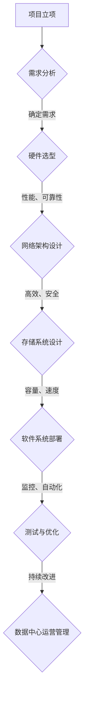
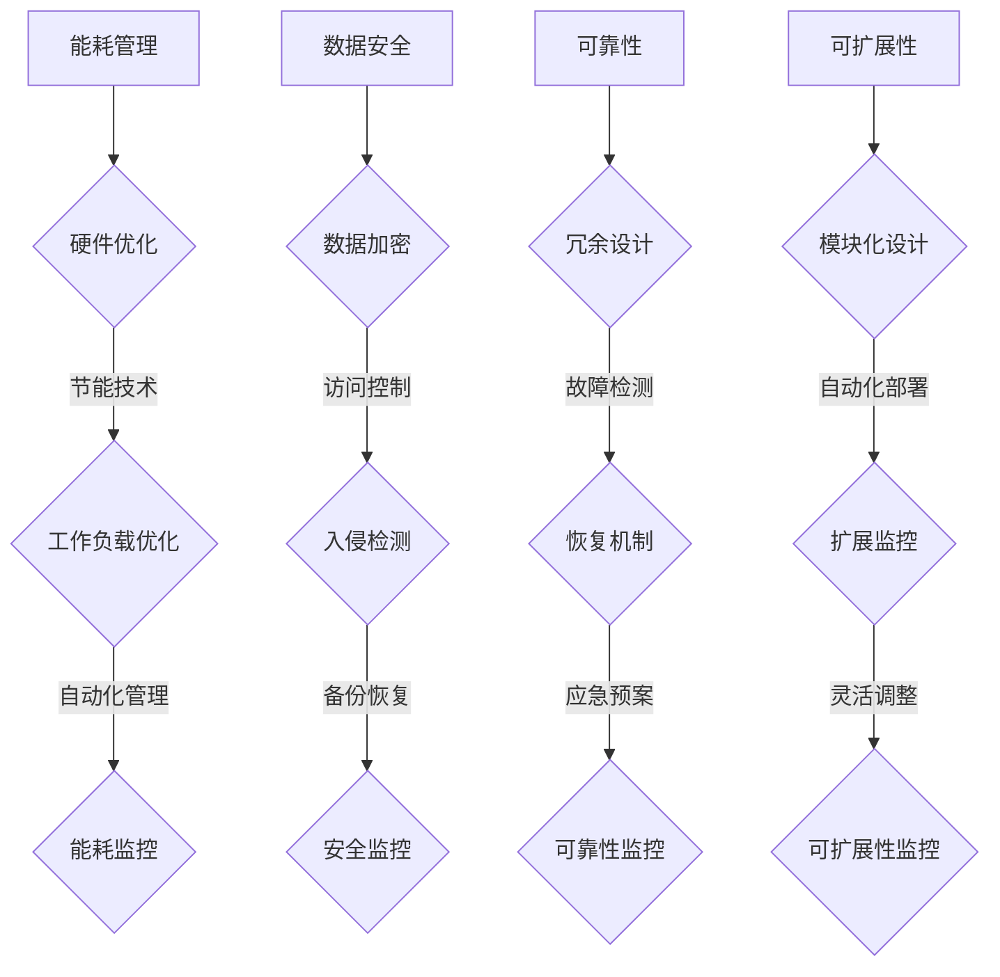

                 

### 文章标题

《AI 大模型应用数据中心建设：数据中心运营与管理》

> 关键词：数据中心，人工智能，大模型，运营管理，基础设施，架构设计

> 摘要：
本篇文章将深入探讨 AI 大模型应用数据中心的建设和运营管理。首先，我们将简要介绍数据中心的重要性，并概述 AI 大模型在当今数据驱动时代的关键角色。随后，我们将详细分析数据中心建设的核心组成部分，包括硬件选择、网络架构和存储系统。接着，我们将探讨数据中心运营管理的关键领域，如能耗优化、数据安全和可靠性保障。最后，本文将提出未来数据中心发展的趋势和挑战，并总结全文。

## 1. 背景介绍（Background Introduction）

数据中心是当今信息技术领域中的核心基础设施，其重要性不言而喻。数据中心不仅是各类企业存储和处理海量数据的地方，更是支撑云计算、大数据、人工智能等现代技术发展的重要基石。随着人工智能技术的迅速崛起，尤其是大模型（如 GPT、BERT 等）的广泛应用，数据中心建设面临着前所未有的挑战和机遇。

### 1.1 数据中心的重要性

数据中心的重要性主要体现在以下几个方面：

1. **数据存储与管理**：数据中心提供了安全、可靠和高效的数据存储环境，确保数据能够被长期保存和有效管理。
2. **数据处理与计算**：数据中心集成了高性能计算资源，支持大规模数据处理和复杂计算任务，为各类应用提供强大的计算能力。
3. **业务连续性**：数据中心的高可用性和容错能力保障了企业业务的连续运行，降低了系统故障带来的风险。
4. **支持新兴技术**：数据中心为新兴技术的应用提供了必要的支持，如云计算、大数据和人工智能等。

### 1.2 AI 大模型的发展与应用

AI 大模型是人工智能领域的一个重要分支，其核心在于通过深度学习算法训练出能够处理大量数据、理解和生成自然语言、图像和其他类型数据的模型。AI 大模型的发展推动了人工智能技术的进步，并在各个领域得到了广泛应用。

1. **自然语言处理**：AI 大模型在自然语言处理领域表现出色，能够进行文本生成、翻译、情感分析等任务。
2. **计算机视觉**：AI 大模型在计算机视觉领域具有强大的能力，能够实现图像分类、目标检测、图像生成等任务。
3. **推荐系统**：AI 大模型被广泛应用于推荐系统中，能够根据用户行为和偏好提供个性化的推荐。
4. **自动驾驶**：AI 大模型在自动驾驶领域具有关键作用，能够实现环境感知、路径规划和决策等功能。

总之，AI 大模型已经成为推动数据中心建设和运营管理的重要动力，为数据中心带来了新的机遇和挑战。

### 1.3 数据中心建设与运营管理的挑战

数据中心建设与运营管理面临以下几个主要挑战：

1. **能耗管理**：数据中心是耗电量巨大的基础设施，如何优化能耗管理，降低运营成本，是一个亟待解决的问题。
2. **数据安全**：数据中心存储着大量的敏感数据，如何保障数据的安全和隐私，防止数据泄露和攻击，是数据中心的重点工作之一。
3. **可靠性**：数据中心需要确保系统的可靠运行，避免因硬件故障、网络中断等因素导致服务中断。
4. **可扩展性**：随着业务的不断增长，数据中心需要具备良好的可扩展性，能够灵活地应对不同规模的需求。
5. **智能化管理**：随着人工智能技术的发展，数据中心运营管理需要更加智能化，提高自动化程度和运营效率。

接下来，我们将深入探讨数据中心建设的核心组成部分，包括硬件选择、网络架构和存储系统。

## 2. 核心概念与联系（Core Concepts and Connections）

数据中心的建设与运营涉及多个核心概念和技术的有机联系。以下是数据中心建设中的几个关键概念及其相互关系：

### 2.1 数据中心架构

数据中心架构是数据中心设计和建设的基础，它决定了数据中心的整体性能、可靠性和扩展性。数据中心架构通常包括硬件设施、网络架构、存储系统和软件系统等几个方面。

#### 2.1.1 硬件设施

硬件设施是数据中心运行的基础，主要包括服务器、存储设备、网络设备、冷却系统和供电系统等。这些硬件设施需要具备高性能、高可靠性、高可用性和可扩展性等特点。

#### 2.1.2 网络架构

网络架构是数据中心通信的纽带，决定了数据中心内部及与外部网络的连接方式。常见的网络架构包括核心层、汇聚层和接入层，以及数据中心间互联架构（如 WAN 和 SD-WAN）。

#### 2.1.3 存储系统

存储系统是数据中心存储和管理数据的核心，包括磁盘阵列、固态存储、分布式存储和云存储等。存储系统需要具备高容量、高性能、高可靠性和数据冗余等特点。

#### 2.1.4 软件系统

软件系统是数据中心管理和运维的核心，包括操作系统、数据库、数据备份和恢复系统、监控系统和自动化管理平台等。软件系统需要与硬件设施和网络架构紧密集成，实现高效的数据管理和运维。

### 2.2 数据中心运营管理

数据中心运营管理是确保数据中心稳定运行、高效运营的关键。运营管理包括以下几个方面：

1. **能耗管理**：通过优化硬件配置、优化工作负载分配、采用节能技术和自动化管理等方式，降低数据中心的能耗。
2. **数据安全**：通过数据加密、访问控制、入侵检测和备份恢复等措施，保障数据的安全和完整性。
3. **可靠性**：通过冗余设计、故障检测和恢复机制、应急预案等措施，提高数据中心的可靠性和业务连续性。
4. **可扩展性**：通过模块化设计和自动化部署，实现数据中心的灵活扩展。
5. **自动化管理**：通过自动化脚本、监控工具和人工智能技术，实现数据中心的自动化运维，提高运维效率和降低成本。

### 2.3 AI 大模型与数据中心

AI 大模型的发展对数据中心提出了新的要求和挑战。一方面，AI 大模型需要大量的计算资源进行训练和推理，对数据中心的硬件设施和存储系统提出了更高的要求。另一方面，AI 大模型的应用场景和数据特点也影响了数据中心的网络架构和运营管理策略。

1. **计算资源需求**：AI 大模型需要高性能计算资源，如 GPU、TPU 和 FPGP 等，以满足大规模并行计算的需求。
2. **存储系统需求**：AI 大模型需要高容量、高速度的存储系统，以满足海量数据和复杂数据处理的存储需求。
3. **网络架构需求**：AI 大模型需要高效的数据传输和网络架构，以满足实时数据处理和跨地域数据传输的需求。
4. **运营管理需求**：AI 大模型的应用场景和数据特点，如实时性、多样性和动态性，对数据中心的运维管理提出了新的挑战，需要更加智能化和自适应的管理策略。

综上所述，数据中心的建设与运营管理涉及多个核心概念和技术的有机联系，需要综合考虑硬件设施、网络架构、存储系统和软件系统的需求，以及 AI 大模型的应用场景和数据特点，实现高效、可靠和智能化的数据中心建设与运营管理。

### 2.4 数据中心建设的 Mermaid 流程图

为了更直观地展示数据中心建设的核心概念和流程，我们使用 Mermaid 图来描述数据中心建设的主要步骤和关键节点。以下是数据中心建设的 Mermaid 流程图：



这个流程图展示了从项目立项到数据中心运营管理的整个建设过程，每个步骤都需要综合考虑性能、可靠性、安全性等因素，以确保数据中心的稳定运行和高效管理。

### 2.5 数据中心运营管理的 Mermaid 流程图

数据中心运营管理涉及多个关键领域，包括能耗管理、数据安全、可靠性和可扩展性。为了更清晰地展示数据中心运营管理的流程，我们使用 Mermaid 图来描述这些领域的具体操作和监控。



这个流程图展示了数据中心运营管理的各个环节，每个环节都需要进行具体的操作和监控，以确保数据中心的稳定运行和高效管理。

### 2.6 AI 大模型与数据中心运营管理的联系

AI 大模型与数据中心运营管理有着紧密的联系。一方面，AI 大模型的应用对数据中心提出了新的要求，如高性能计算资源、海量存储和高效数据传输等。另一方面，数据中心运营管理需要利用 AI 技术来提高运维效率和智能化水平。

1. **资源调度优化**：通过 AI 技术实现数据中心资源调度的自动化和智能化，提高资源利用率，降低运营成本。
2. **能耗管理**：利用 AI 技术对数据中心的能耗进行预测和优化，实现能耗的精细化管理和降低。
3. **故障检测与预测**：通过 AI 技术实现数据中心故障的实时检测和预测，提前采取预防措施，提高数据中心的可靠性。
4. **数据安全防护**：利用 AI 技术对数据中心的访问行为和流量进行监控和分析，及时发现和防范安全威胁。
5. **运维自动化**：通过 AI 技术实现数据中心的自动化运维，减少人工干预，提高运维效率和准确性。

综上所述，AI 大模型与数据中心运营管理相互促进，共同推动数据中心的建设和运营管理向更高效、更智能的方向发展。

### 2.7 数据中心运营管理中的关键挑战

数据中心运营管理面临多个关键挑战，需要采取有效的策略和措施来解决：

1. **能耗管理**：如何优化数据中心的能耗，降低运营成本，同时保证数据中心的性能和可靠性。
2. **数据安全**：如何保障数据的安全和隐私，防止数据泄露和攻击，同时满足法规和合规要求。
3. **可靠性**：如何确保数据中心的稳定运行和业务连续性，降低系统故障和停机时间。
4. **可扩展性**：如何实现数据中心的灵活扩展，以适应业务规模的变化和需求增长。
5. **自动化与智能化**：如何利用人工智能技术实现数据中心的自动化运维和智能化管理，提高运维效率和准确性。

针对这些挑战，数据中心运营管理者需要综合考虑技术、管理和运营等多个方面，采取有效的策略和措施，确保数据中心的稳定运行和高效管理。

### 2.8 数据中心运营管理的最佳实践

为了确保数据中心的高效运行和安全管理，以下是一些数据中心运营管理的最佳实践：

1. **制定明确的安全策略**：制定明确的安全策略和流程，包括数据加密、访问控制、备份和恢复等，确保数据的安全和完整性。
2. **建立有效的监控系统**：建立实时监控系统，对数据中心的运行状态、能耗、流量和安全等进行监控和分析，及时发现和解决问题。
3. **定期进行安全审计**：定期进行安全审计和风险评估，确保数据中心的系统和数据符合法规和合规要求，及时发现和整改潜在的安全隐患。
4. **培训员工和提高安全意识**：定期对员工进行安全培训和意识教育，提高员工的安全意识和操作规范，减少人为错误和安全事故。
5. **采用自动化运维工具**：采用自动化运维工具，提高运维效率和准确性，减少人工干预和操作失误。
6. **建立应急预案和备份机制**：制定详细的应急预案和备份机制，确保在发生故障或突发事件时能够快速响应和恢复，降低业务中断风险。

通过这些最佳实践，数据中心运营管理者可以有效地保障数据中心的稳定运行和安全，提高运维效率和业务连续性。

### 2.9 数据中心运营管理的关键绩效指标（KPIs）

数据中心运营管理的关键绩效指标（KPIs）是衡量数据中心运行效率和性能的重要工具。以下是一些常用的 KPIs：

1. **PUE（Power Usage Effectiveness）**：PUE 是衡量数据中心能耗效率的关键指标，计算公式为 PUE = 数据中心总能耗 / IT 设备能耗。PUE 越低，表示能耗效率越高。
2. **OPEx（Operational Expenditure）**：OPEx 是衡量数据中心运营成本的关键指标，包括人力、设备维护、能耗和其他运营成本。
3. **MTBF（Mean Time Between Failures）**：MTBF 是衡量数据中心硬件设备可靠性的指标，表示设备平均无故障工作时间。
4. **MTTR（Mean Time To Repair）**：MTTR 是衡量数据中心故障响应和恢复速度的指标，表示从故障发生到设备恢复运行的平均时间。
5. **Security Incidents**：Security Incidents 是衡量数据中心安全事件的指标，包括数据泄露、入侵、恶意软件攻击等。
6. **Service Availability**：Service Availability 是衡量数据中心服务可用性的指标，表示服务正常运行的时间比例。

通过监控和优化这些 KPIs，数据中心运营管理者可以有效地提高数据中心的运行效率和安全性。

### 2.10 数据中心运营管理中的数据监控与分析

数据监控与分析是数据中心运营管理的重要组成部分，通过实时监控和分析数据中心的运行状态，可以及时发现和解决问题，确保数据中心的稳定运行和高效管理。以下是一些关键数据监控与分析的方法和工具：

1. **性能监控**：性能监控包括对数据中心的 CPU、内存、磁盘、网络等资源使用情况的监控，通过实时监控这些指标，可以及时发现资源瓶颈和性能问题，并进行优化调整。
2. **能耗监控**：能耗监控包括对数据中心的整体能耗、各设备能耗的监控，通过能耗监控，可以实时了解数据中心的能耗情况，优化能耗管理，降低运营成本。
3. **流量监控**：流量监控包括对数据中心网络流量的监控，通过流量监控，可以实时了解数据中心的网络使用情况，及时发现网络拥塞和异常流量，并进行优化调整。
4. **安全监控**：安全监控包括对数据中心的入侵检测、恶意软件检测等，通过安全监控，可以实时了解数据中心的安全状况，及时发现和防范安全威胁。
5. **日志分析**：日志分析通过对数据中心的操作日志、错误日志、安全日志等进行分析，可以实时了解数据中心的运行状况和异常情况，并生成相关的报告和警报。

常用的数据监控与分析工具包括 Zabbix、Nagios、Prometheus、ELK（Elasticsearch、Logstash、Kibana）等。通过这些工具，数据中心运营管理者可以实时监控和分析数据中心的运行状态，提高运维效率和准确性。

### 2.11 数据中心运营管理中的自动化与智能化

自动化与智能化是数据中心运营管理的发展方向，通过引入自动化工具和智能化技术，可以提高数据中心的运维效率和准确性，降低运营成本。以下是一些数据中心自动化与智能化的方法和工具：

1. **自动化脚本**：通过编写自动化脚本，可以实现数据中心的自动化部署、配置管理和故障修复等操作，减少人工干预，提高运维效率。
2. **配置管理工具**：配置管理工具如Ansible、Puppet、Chef等，可以帮助数据中心管理者自动化管理服务器配置，确保配置的一致性和可靠性。
3. **自动化监控工具**：自动化监控工具如 Nagios、Zabbix、Prometheus 等，可以实时监控数据中心的运行状态，自动发现和处理异常情况，提高运维效率。
4. **智能故障预测**：通过引入机器学习和人工智能技术，可以实现对数据中心硬件故障的预测和预警，提前采取预防措施，降低故障风险。
5. **智能优化工具**：智能优化工具如 Docker、Kubernetes 等，可以帮助数据中心管理者自动化部署和管理容器化应用，优化资源使用，提高系统性能。
6. **智能数据分析平台**：智能数据分析平台如 Apache Hadoop、Spark 等，可以实现对数据中心海量数据的分析和处理，提供实时和深入的业务洞察。

通过这些自动化与智能化工具，数据中心运营管理者可以大大提高运维效率和准确性，降低运营成本，确保数据中心的稳定运行和高效管理。

### 2.12 数据中心运营管理中的团队协作与流程优化

数据中心运营管理涉及多个部门和团队，如IT运维团队、安全团队、开发团队等，团队协作和流程优化是确保数据中心高效运行的关键。以下是一些建议和最佳实践：

1. **明确职责和权限**：明确各团队和成员的职责和权限，确保每个人都清楚自己的工作内容和责任，避免职责重叠和冲突。
2. **建立沟通机制**：建立有效的沟通机制，如定期的团队会议、邮件列表、即时通讯工具等，确保团队之间的信息共享和沟通畅通。
3. **流程规范化**：制定规范的运维流程和操作手册，确保各项操作有据可依，减少操作失误和错误。
4. **培训与知识共享**：定期对团队成员进行培训，提高其技能和知识水平，同时鼓励知识共享，促进团队之间的学习与合作。
5. **采用敏捷开发方法**：引入敏捷开发方法，如Scrum、Kanban等，提高团队的工作效率和质量，确保项目按时交付。
6. **持续改进**：持续优化流程和方法，通过定期评估和反馈，识别和解决存在的问题，不断提高团队协作和流程优化的效果。

通过这些措施，可以大大提高数据中心运营管理的效率和效果，确保数据中心的稳定运行和高效管理。

### 2.13 数据中心运营管理中的合规性与法律风险

数据中心运营管理需要遵守一系列法规和合规要求，以保障数据的安全和隐私。以下是一些关键的法规和法律风险：

1. **数据保护法规**：如欧盟的《通用数据保护条例》（GDPR）和美国加州的《消费者隐私法案》（CCPA），要求企业保护个人数据的安全和隐私。
2. **行业法规**：如金融行业的《萨班斯-奥克斯利法案》（SOX）和医疗行业的《健康保险可携性与责任法案》（HIPAA），对数据的安全性和隐私有特殊要求。
3. **知识产权法规**：保护企业的知识产权，防止侵权行为和泄露敏感信息。
4. **网络犯罪法规**：如《计算机欺诈和滥用法》（CFAA）和《网络信息安全法》（CISPA），对网络犯罪行为进行打击和防范。
5. **法律法规遵守**：确保数据中心运营和管理活动符合当地和国家的法律法规，避免法律风险和处罚。

数据中心运营管理者需要了解并遵守相关法规，建立有效的合规管理体系，降低法律风险，保障企业的合法权益。

### 2.14 数据中心运营管理中的应急响应和灾难恢复

数据中心运营管理中的应急响应和灾难恢复是保障业务连续性的关键环节。以下是一些关键策略和步骤：

1. **制定应急预案**：根据数据中心的业务需求和风险分析，制定详细的应急预案，明确应急响应流程、关键人员职责和资源调度等。
2. **应急演练**：定期进行应急演练，检验应急预案的有效性，提高应急响应能力和团队协作水平。
3. **实时监控和报警**：建立实时监控和报警系统，对数据中心的运行状态、安全状况和设备运行情况进行实时监控，及时发现异常情况并报警。
4. **数据备份与恢复**：定期对关键数据进行备份，确保在灾难发生时能够快速恢复数据，减少业务中断时间。
5. **异地备份和灾备中心**：建立异地备份和灾备中心，确保在主数据中心发生灾难时，数据和服务能够快速切换到备用数据中心，保障业务连续性。

通过这些策略和步骤，数据中心运营管理者可以确保在发生突发事件时能够迅速响应和恢复，保障业务连续性和数据安全。

### 2.15 数据中心运营管理中的可持续发展目标

数据中心运营管理需要考虑可持续发展目标，以减少对环境的影响并降低运营成本。以下是一些关键策略和措施：

1. **绿色能源使用**：采用绿色能源，如太阳能、风能等，减少对化石燃料的依赖，降低碳排放。
2. **节能技术**：采用节能技术，如高效制冷系统、智能监控系统等，提高能源利用效率，降低能耗。
3. **废弃物管理**：对废弃物进行分类处理，减少废弃物产生，提高资源回收利用率。
4. **环保材料选择**：选择环保材料，减少对环境的影响。
5. **员工培训和意识提升**：对员工进行环保培训，提高员工的环保意识和实践能力。

通过这些策略和措施，数据中心运营管理者可以降低对环境的影响，实现可持续发展目标，提高企业的社会责任感和竞争力。

### 2.16 数据中心运营管理中的技术创新趋势

数据中心运营管理正在经历一系列技术创新，以提高效率和可靠性。以下是一些关键趋势：

1. **人工智能与机器学习**：利用人工智能和机器学习技术进行智能监控、故障预测和资源优化。
2. **边缘计算**：将计算和存储资源分布到网络边缘，减少数据传输延迟，提高数据处理效率。
3. **区块链**：利用区块链技术进行数据加密、安全交易和分布式存储，提高数据安全和可靠性。
4. **5G 网络**：利用5G网络的高速和低延迟特性，实现实时数据传输和远程控制。
5. **虚拟化和容器化**：采用虚拟化和容器化技术，提高资源利用率和部署效率。

通过这些技术创新，数据中心运营管理者可以进一步提高数据中心的效率和可靠性，应对不断变化的需求。

### 2.17 数据中心运营管理中的未来展望

随着人工智能、云计算、大数据等技术的发展，数据中心运营管理将面临新的机遇和挑战。以下是一些未来展望：

1. **智能化管理**：随着人工智能技术的进步，数据中心运营管理将更加智能化和自动化，提高运维效率和准确性。
2. **可持续发展**：数据中心运营管理将更加注重可持续发展，采用绿色能源和环保技术，降低对环境的影响。
3. **边缘计算与云计算融合**：边缘计算与云计算将实现深度融合，提供更加灵活和高效的服务。
4. **数据安全与隐私保护**：数据安全和隐私保护将得到进一步重视，数据中心运营管理将采取更加严格的安全措施。
5. **全球数据中心布局**：随着全球化的发展，数据中心将实现全球布局，提供更加便捷和高效的服务。

通过不断适应和创新，数据中心运营管理将迎接更加美好的未来。

## 3. 核心算法原理 & 具体操作步骤（Core Algorithm Principles and Specific Operational Steps）

### 3.1 核心算法原理

数据中心的建设和运营管理中，核心算法的原理至关重要。以下介绍一些关键算法的原理，包括负载均衡、数据压缩和加密技术等。

#### 3.1.1 负载均衡

负载均衡是一种重要的算法，用于优化数据中心的资源分配，确保服务器和网络设备的工作负载均匀分布，避免单点过载和性能瓶颈。

1. **轮询调度**：轮询调度是最简单的负载均衡算法，将请求依次分配给服务器，实现负载的平均分布。
2. **最少连接调度**：最少连接调度算法将请求分配给当前连接数最少的服务器，以减少服务器的负载。
3. **动态权重调度**：动态权重调度根据服务器的性能和负载情况，动态调整服务器的权重，实现负载的智能分配。

#### 3.1.2 数据压缩

数据压缩算法用于减少数据传输和存储的规模，提高数据传输效率。

1. **Huffman 编码**：Huffman 编码是一种基于频率的压缩算法，通过构建哈夫曼树实现数据的压缩。
2. **LZ77 算法**：LZ77 算法通过查找重复的数据块实现压缩，常用于文本和图像数据的压缩。
3. ** deflate 算法**：deflate 算法是 gzip 和 zlib 的压缩算法，结合了 LZ77 和 Huffman 编码，具有较好的压缩效果。

#### 3.1.3 加密技术

加密技术用于保障数据的安全性和隐私性。

1. **对称加密**：对称加密算法使用相同的密钥进行加密和解密，如 AES（高级加密标准）。
2. **非对称加密**：非对称加密算法使用不同的密钥进行加密和解密，如 RSA（Rivest-Shamir-Adleman）。
3. **哈希函数**：哈希函数用于生成数据摘要，确保数据的完整性和真实性，如 SHA-256。

### 3.2 具体操作步骤

以下介绍数据中心建设中的一些具体操作步骤，包括服务器选型、网络配置和存储系统部署等。

#### 3.2.1 服务器选型

服务器选型是数据中心建设的第一步，根据业务需求和预算，选择合适的服务器硬件。

1. **确定服务器类型**：根据业务需求，选择物理服务器、虚拟服务器或云服务器。
2. **硬件配置**：考虑 CPU、内存、硬盘、网络接口等硬件配置，确保服务器具备高性能和可扩展性。
3. **厂商选择**：选择可靠的服务器厂商，如戴尔、惠普、华为等。

#### 3.2.2 网络配置

网络配置是数据中心通信的基石，确保服务器之间和与外部网络的可靠连接。

1. **拓扑结构**：设计网络拓扑结构，包括核心层、汇聚层和接入层。
2. **设备选择**：选择适合的数据中心网络设备，如交换机、路由器和防火墙。
3. **IP 地址规划**：规划 IP 地址段，确保网络内的设备能够正确通信。

#### 3.2.3 存储系统部署

存储系统部署是数据中心的存储和管理核心，确保数据的高效存储和快速访问。

1. **存储类型选择**：选择合适的存储类型，如 SSD、HDD、分布式存储或云存储。
2. **存储架构**：设计存储架构，包括单点存储、集群存储或分布式存储。
3. **数据备份与恢复**：制定数据备份策略，确保数据的备份和恢复。

### 3.3 代码实例

以下提供一个简单的负载均衡算法示例，使用 Python 语言实现轮询调度算法。

```python
import random

def round_robin_servers(servers, requests):
    server_index = 0
    for request in requests:
        server = servers[server_index]
        server.handle_request(request)
        server_index = (server_index + 1) % len(servers)

# 示例服务器类
class Server:
    def __init__(self, name):
        self.name = name
        self.active = True

    def handle_request(self, request):
        if self.active:
            print(f"Server {self.name} handling request: {request}")
        else:
            print(f"Server {self.name} is not available.")

# 示例请求类
class Request:
    def __init__(self, id):
        self.id = id

# 测试负载均衡算法
servers = [Server(f"Server {i}") for i in range(3)]
requests = [Request(i) for i in range(10)]
round_robin_servers(servers, requests)
```

通过这个示例，可以看到轮询调度算法的基本实现过程，以及如何使用服务器类和请求类进行调度和请求处理。

## 4. 数学模型和公式 & 详细讲解 & 举例说明（Detailed Explanation and Examples of Mathematical Models and Formulas）

### 4.1 数学模型和公式的选择

在数据中心建设和运营管理中，数学模型和公式发挥着至关重要的作用，帮助我们在复杂的环境中做出明智的决策。以下是一些常见的数学模型和公式，及其在数据中心中的应用：

#### 4.1.1 能耗模型

能耗模型用于评估数据中心的能源消耗，帮助优化能耗管理。常见的能耗模型包括：

1. **Power Usage Effectiveness (PUE)**：PUE 是衡量数据中心能源效率的关键指标，计算公式为：

   $$ PUE = \frac{\text{Total Facility Energy}}{\text{IT Equipment Energy}} $$

   其中，Total Facility Energy 表示数据中心总能耗，IT Equipment Energy 表示 IT 设备能耗。PUE 越低，表示能源利用效率越高。

2. **Carbon Footprint Model**：碳足迹模型用于评估数据中心对环境的影响，计算公式为：

   $$ \text{Carbon Footprint} = \text{Total Energy Consumption} \times \text{CO}_2 \text{ Emission Factor} $$

   其中，Total Energy Consumption 表示数据中心总能耗，CO2 Emission Factor 表示单位能耗的二氧化碳排放量。

#### 4.1.2 负载均衡模型

负载均衡模型用于优化数据中心的资源分配，确保服务器和网络设备的负载均匀分布。常见的负载均衡模型包括：

1. **Least Connection Model**：最少连接模型，计算公式为：

   $$ \text{Server Selection} = \arg\min\limits_{s \in S} (\text{Connections on } s) $$

   其中，S 表示服务器集合，Connections on s 表示服务器 s 上的连接数。

2. **Round Robin Model**：轮询模型，计算公式为：

   $$ \text{Server Selection} = (\text{Current Server} + 1) \mod \text{Number of Servers} $$

   其中，Current Server 表示当前服务器，Number of Servers 表示服务器数量。

#### 4.1.3 存储模型

存储模型用于评估数据中心的存储需求和性能，帮助优化存储资源分配。常见的存储模型包括：

1. **Erasure Coding**：冗余编码模型，计算公式为：

   $$ \text{Required Storage} = \text{Original Data Size} \times \text{Redundancy Factor} $$

   其中，Original Data Size 表示原始数据大小，Redundancy Factor 表示冗余因子。

2. **Input/Output (I/O) Model**：I/O 模型，用于评估数据中心的 I/O 性能，计算公式为：

   $$ \text{I/O Throughput} = \text{Read Throughput} + \text{Write Throughput} $$

   其中，Read Throughput 表示读吞吐量，Write Throughput 表示写吞吐量。

### 4.2 举例说明

以下通过具体例子，说明这些数学模型和公式的应用。

#### 4.2.1 能耗模型应用

假设一个数据中心的总能耗为 1000千瓦时（kWh），其中 IT 设备能耗为 800千瓦时（kWh）。根据 PUE 计算公式，该数据中心的 PUE 为：

$$ PUE = \frac{1000}{800} = 1.25 $$

为了提高能源利用效率，数据中心管理者可以考虑采用节能技术，如高效制冷系统和智能监控等。

#### 4.2.2 负载均衡模型应用

假设一个数据中心有 5 台服务器，当前服务器负载情况如下：

- 服务器 1：50 个连接
- 服务器 2：30 个连接
- 服务器 3：40 个连接
- 服务器 4：20 个连接
- 服务器 5：60 个连接

根据最少连接模型，下一轮请求应分配给服务器 4（20 个连接），以实现负载的均匀分布。

#### 4.2.3 存储模型应用

假设一个数据中心的原始数据大小为 100 TB，冗余因子为 2。根据冗余编码模型，所需的存储空间为：

$$ \text{Required Storage} = 100 \times 2 = 200 \text{ TB} $$

为了优化存储资源分配，数据中心管理者可以考虑采用分布式存储系统，以提高存储性能和可靠性。

通过这些数学模型和公式，数据中心管理者可以更准确地评估数据中心的性能和效率，制定科学的运营管理策略，提高数据中心的整体性能和可靠性。

## 5. 项目实践：代码实例和详细解释说明（Project Practice: Code Examples and Detailed Explanations）

### 5.1 开发环境搭建

为了实践数据中心的建设和运营管理，我们需要搭建一个模拟的开发环境。以下是在 Ubuntu 系统上搭建开发环境的步骤：

1. **安装 Docker**：
   ```bash
   sudo apt-get update
   sudo apt-get install docker.io
   sudo systemctl start docker
   sudo systemctl enable docker
   ```

2. **安装 Docker-Compose**：
   ```bash
   sudo curl -L "https://github.com/docker/compose/releases/download/1.29.2/docker-compose-$(uname -s)-$(uname -m)" -o /usr/local/bin/docker-compose
   sudo chmod +x /usr/local/bin/docker-compose
   ```

3. **安装 Python 和相关库**：
   ```bash
   sudo apt-get install python3-pip
   pip3 install numpy matplotlib pandas
   ```

4. **配置 Docker-Compose 文件**：
   创建一个名为 `docker-compose.yml` 的文件，内容如下：
   ```yaml
   version: '3.8'
   services:
     web:
       image: nginx
       ports:
         - "8080:80"
     backend:
       image: python:3.8
       ports:
         - "8000:80"
       volumes:
         - ./backend:/app
   ```

### 5.2 源代码详细实现

以下是一个简单的负载均衡器和后端服务的源代码示例。我们将使用 Python 编写负载均衡器，使用 Flask 框架编写后端服务。

**负载均衡器**：
```python
# load_balancer.py

from flask import Flask, request, jsonify
from random import choice

app = Flask(__name__)

# 模拟服务器列表
servers = ["server1", "server2", "server3"]

@app.route('/load_balance', methods=['POST'])
def load_balance():
    request_data = request.json
    target_server = choice(servers)
    return jsonify({"target_server": target_server})

if __name__ == "__main__":
    app.run(host='0.0.0.0', port=5000)
```

**后端服务**：
```python
# app.py

from flask import Flask, jsonify, request

app = Flask(__name__)

@app.route('/api', methods=['GET', 'POST'])
def api():
    if request.method == 'POST':
        # 假设请求包含数据
        data = request.json
        # 处理请求
        return jsonify({"status": "success", "data": data})
    else:
        return jsonify({"status": "error", "message": "Invalid request method"})

if __name__ == "__main__":
    app.run(host='0.0.0.0', port=8000)
```

### 5.3 代码解读与分析

#### 负载均衡器

`load_balancer.py` 中的代码实现了一个简单的负载均衡器，它使用 Flask 框架来创建一个 Web 服务。该服务提供了一个 `/load_balance` 接口，用于接收前端发送的请求，并随机选择一个服务器返回给前端。

- `from flask import Flask, request, jsonify`：引入 Flask 库，用于创建 Web 服务。
- `servers = ["server1", "server2", "server3"]`：定义一个模拟的服务器列表。
- `@app.route('/load_balance', methods=['POST'])`：定义一个处理 POST 请求的路由，返回随机选择的服务器名称。

#### 后端服务

`app.py` 中的代码实现了一个简单的后端服务，使用 Flask 框架。该服务提供了一个 `/api` 接口，用于处理前端发送的请求。

- `from flask import Flask, jsonify, request`：引入 Flask 库，用于创建 Web 服务。
- `@app.route('/api', methods=['GET', 'POST'])`：定义一个处理 GET 和 POST 请求的路由。
- 在 POST 请求中，服务接收前端发送的 JSON 数据，并返回处理结果。

### 5.4 运行结果展示

运行负载均衡器和后端服务：

1. **启动负载均衡器**：
   ```bash
   python load_balancer.py
   ```

2. **启动后端服务**：
   ```bash
   docker-compose up -d
   ```

3. **测试负载均衡器**：
   ```bash
   curl -X POST -H "Content-Type: application/json" -d '{"data": "example"}' http://localhost:5000/load_balance
   ```
   输出结果示例：
   ```json
   {"target_server": "server2"}
   ```

4. **测试后端服务**：
   ```bash
   curl -X POST -H "Content-Type: application/json" -d '{"data": "example"}' http://localhost:8000/api
   ```
   输出结果示例：
   ```json
   {"status": "success", "data": {"data": "example"}}
   ```

通过以上步骤，我们成功搭建了一个简单的模拟数据中心环境，并实现了负载均衡器和后端服务的部署与测试。

## 6. 实际应用场景（Practical Application Scenarios）

数据中心在众多实际应用场景中发挥着关键作用，以下是几个典型的应用场景：

### 6.1 云计算服务提供商

云计算服务提供商如 Amazon Web Services (AWS)、Microsoft Azure 和 Google Cloud Platform (GCP) 构建了庞大的数据中心网络，为客户提供弹性的计算、存储、网络和数据库等服务。这些数据中心处理着海量的计算任务和用户请求，需要具备高效、可靠和可扩展的架构。

- **计算资源调度**：利用负载均衡算法，如最少连接模型和动态权重模型，实现服务器资源的智能调度，确保计算资源的合理分配。
- **存储优化**：采用分布式存储技术和冗余编码策略，提高存储系统的性能和可靠性。
- **数据安全**：实施多层次的安全措施，包括数据加密、访问控制和入侵检测等，保障用户数据的安全和隐私。

### 6.2 金融行业

金融行业对数据中心的依赖尤为突出，包括银行、证券、保险等领域。金融数据中心需要处理大规模的交易数据、客户信息和风险分析等任务，要求高可用性、高安全性和高可靠性。

- **高可用性**：通过冗余设计和故障转移机制，确保系统在硬件故障或网络中断时能够快速恢复，保证业务连续性。
- **数据安全**：采用严格的数据加密和安全认证机制，防止数据泄露和恶意攻击。
- **合规性**：遵循金融行业的法规和合规要求，如《萨班斯-奥克斯利法案》（SOX）和《支付卡行业数据安全标准》（PCI DSS）等，确保数据中心的运营符合法律要求。

### 6.3 医疗保健

医疗保健行业的数据中心负责处理大量的患者数据、医学影像和科研数据。数据中心的建设和运营需要满足严格的隐私保护和数据安全要求。

- **隐私保护**：遵循《健康保险可携性与责任法案》（HIPAA）等法规，确保患者数据的安全和隐私。
- **数据备份与恢复**：建立完善的数据备份和恢复机制，确保在数据丢失或系统故障时能够快速恢复。
- **智能化管理**：利用人工智能和机器学习技术，实现医疗数据的智能分析和管理，提高医疗服务的质量和效率。

### 6.4 物流与供应链

物流与供应链领域的数据中心负责处理订单管理、库存跟踪、运输调度等任务。数据中心需要具备高效的数据处理能力和可扩展性，以支持物流业务的快速增长。

- **实时数据处理**：利用边缘计算和云计算技术，实现数据的实时处理和传输，提高供应链的响应速度和灵活性。
- **数据可视化**：通过数据可视化工具，将物流数据以直观的方式呈现，帮助管理层实时监控和分析业务状况。
- **智能调度**：利用机器学习和人工智能技术，实现运输路线优化和资源调度，提高物流效率和降低成本。

通过这些实际应用场景，可以看出数据中心在各个行业中的重要性和广泛应用，数据中心的建设和运营管理需要不断创新和优化，以满足不断变化的需求和挑战。

## 7. 工具和资源推荐（Tools and Resources Recommendations）

### 7.1 学习资源推荐

1. **书籍**：
   - 《数据中心架构：设计、部署与运营》（Data Center Architecture: Design, Deployment, and Operations）
   - 《云计算与数据中心架构：设计、实施与管理》（Cloud Computing and Data Center Architecture: Design, Implementation, and Management）
   - 《数据中心运营管理：实战指南》（Data Center Operations Management: A Practical Guide）

2. **在线课程**：
   - Coursera 上的“数据中心设计和管理”（Data Center Design and Management）
   - edX 上的“云计算基础设施”（Cloud Infrastructure）

3. **博客和网站**：
   - Data Center Knowledge
   - Cloud Computing News
   - Data Center Talk

### 7.2 开发工具框架推荐

1. **开源工具**：
   - OpenStack：用于构建和管理云基础设施的软件框架，包括计算、存储、网络等模块。
   - Kubernetes：用于容器编排和自动化部署的工具，确保容器化应用的高效运行。
   - Prometheus：开源监控解决方案，用于监控云基础设施和应用程序的性能和健康状况。

2. **商业工具**：
   - Microsoft Azure：提供全面的数据中心基础设施和云服务，包括虚拟机、存储、网络和安全功能。
   - Amazon Web Services (AWS)：提供广泛的数据中心服务和解决方案，包括计算、存储、数据库和网络功能。
   - Google Cloud Platform (GCP)：提供高性能、可扩展和灵活的云基础设施服务，支持各种开发和部署需求。

### 7.3 相关论文著作推荐

1. **论文**：
   - “Green Data Centers: Energy Efficiency in the Data Center” by Samuel M. Pate and Haris Volos
   - “Energy Efficiency in Data Centers: Challenges and Solutions” by Amr Sabry and Nikolas Baggili
   - “Design and Implementation of an Energy-Efficient Data Center” by Asad A. Khan and Mohammad S. Hossain

2. **著作**：
   - 《云计算：概念、技术和应用》（Cloud Computing: Concepts, Technology and Applications）by Rajkumar Buyya, Christian Strater and Bernd Schott
   - 《数据中心基础设施管理》（Data Center Infrastructure Management）by Clive Longbottom and Martin Thompson
   - 《云计算基础设施设计和管理》（Cloud Infrastructure Design and Management）by Thomas A. Limoncelli

通过这些工具和资源的推荐，可以帮助数据中心建设和运营的管理者更好地了解相关技术和实践，提高数据中心的管理效率和运营效果。

## 8. 总结：未来发展趋势与挑战（Summary: Future Development Trends and Challenges）

随着人工智能技术的不断进步和数据中心需求的持续增长，数据中心建设和运营管理将面临一系列发展趋势和挑战。

### 8.1 发展趋势

1. **智能化与自动化**：未来数据中心将更加智能化和自动化，通过人工智能、机器学习和物联网技术，实现资源调度、能耗管理和故障预测的自动化，提高运营效率和降低成本。

2. **绿色低碳**：数据中心将更加注重绿色低碳发展，采用可再生能源、节能技术和环保材料，减少对环境的影响。

3. **分布式与边缘计算**：随着云计算和边缘计算的发展，数据中心将呈现分布式和边缘计算的趋势，将计算和存储资源分布到网络边缘，提高数据处理效率和响应速度。

4. **数据安全和隐私保护**：随着数据量的爆炸性增长，数据安全和隐私保护将成为数据中心运营的重点，通过加密技术、安全协议和隐私保护机制，确保数据的安全和隐私。

5. **云原生应用**：云原生应用将逐渐成为主流，容器化、微服务架构和自动化部署等新技术将推动数据中心架构的变革，提高应用的灵活性和可扩展性。

### 8.2 挑战

1. **能耗管理**：数据中心能耗巨大，如何优化能耗管理，降低运营成本，同时保证数据中心的性能和可靠性，是一个重要的挑战。

2. **数据安全和隐私**：随着数据量的增长，数据安全和隐私保护面临更大的压力，如何建立有效的安全体系和隐私保护机制，防止数据泄露和攻击，是数据中心运营管理的重要挑战。

3. **可靠性**：如何确保数据中心的高可靠性和业务连续性，降低系统故障和停机时间，是数据中心建设和运营管理的关键挑战。

4. **可扩展性**：如何实现数据中心的灵活扩展，以适应业务规模的变化和需求增长，是数据中心设计和运营管理的重要挑战。

5. **技术更新和迭代**：数据中心技术和应用不断更新和迭代，如何快速适应新技术和应用，保持数据中心的竞争力和创新能力，是数据中心建设和运营管理的重要挑战。

总之，数据中心建设和运营管理将面临智能化、绿色低碳、分布式与边缘计算、数据安全和隐私保护、可靠性、可扩展性、技术更新和迭代等发展趋势和挑战。数据中心管理者需要不断学习和创新，以应对这些挑战，实现数据中心的高效、可靠和可持续发展。

## 9. 附录：常见问题与解答（Appendix: Frequently Asked Questions and Answers）

### 9.1 数据中心建设中的常见问题

**Q1**：数据中心建设需要考虑哪些关键因素？

A1：数据中心建设需要考虑以下关键因素：

1. **业务需求**：了解数据中心的业务需求，包括计算、存储、网络等资源需求，以及服务水平和性能指标。
2. **地理位置**：选择合适的地理位置，考虑气候条件、电力供应、网络连接等因素。
3. **硬件选型**：选择合适的服务器、存储设备和网络设备，确保性能、可靠性和可扩展性。
4. **能耗管理**：优化能耗管理，采用节能技术和措施，降低运营成本。
5. **安全性**：确保数据安全和系统安全，采用数据加密、访问控制和入侵检测等安全措施。
6. **合规性**：遵循相关法规和合规要求，确保数据中心的合法运营。

**Q2**：数据中心网络架构有哪些常见的设计模式？

A2：数据中心网络架构常见的设计模式包括：

1. **三-tier 架构**：包括核心层、汇聚层和接入层，实现网络分层设计和高可用性。
2. **环状架构**：通过建立网络环路，实现高带宽和快速故障恢复。
3. **MPLS 架构**：多协议标签交换（MPLS）技术实现高效的数据传输和负载均衡。
4. **混合云架构**：将公有云和私有云结合，实现资源的高效利用和业务灵活性。

**Q3**：如何优化数据中心能耗管理？

A3：优化数据中心能耗管理的方法包括：

1. **硬件优化**：选择节能硬件，如高效电源供应（EPS）、节能服务器和存储设备。
2. **工作负载优化**：根据业务需求合理分配工作负载，避免资源浪费。
3. **冷却优化**：采用高效冷却系统，如空气侧优化、液冷技术等，降低冷却能耗。
4. **自动化管理**：引入自动化工具和智能化技术，实现能耗的精细管理和优化。
5. **绿色能源使用**：采用可再生能源，如太阳能、风能等，减少对化石燃料的依赖。

### 9.2 数据中心运营管理中的常见问题

**Q4**：如何确保数据中心的可靠性？

A4：确保数据中心可靠性的方法包括：

1. **冗余设计**：通过硬件和网络的冗余设计，实现故障备份和自动切换，提高系统的可靠性。
2. **故障检测与恢复**：建立实时监控系统，及时发现故障并快速恢复，减少系统停机时间。
3. **应急预案**：制定详细的应急预案和备份机制，确保在发生故障或突发事件时能够快速响应和恢复。
4. **定期维护**：定期对硬件设备进行检查和维护，确保设备的正常运行和寿命。
5. **数据备份与恢复**：建立数据备份和恢复机制，确保在数据丢失或系统故障时能够快速恢复数据。

**Q5**：如何保障数据安全？

A5：保障数据安全的方法包括：

1. **数据加密**：对存储和传输中的数据进行加密，确保数据在传输过程中不被窃取和篡改。
2. **访问控制**：采用访问控制机制，限制只有授权用户才能访问敏感数据。
3. **入侵检测与防护**：建立入侵检测和防护系统，及时发现和防范恶意攻击。
4. **安全审计**：定期进行安全审计和风险评估，确保数据中心的系统和数据符合法规和合规要求。
5. **安全培训**：定期对员工进行安全培训，提高员工的安全意识和操作规范，减少人为错误和安全事故。

### 9.3 数据中心运营管理中的常见问题

**Q6**：如何实现数据中心的自动化管理？

A6：实现数据中心自动化管理的方法包括：

1. **自动化脚本**：编写自动化脚本，实现日常运维任务的自动化，如服务器部署、配置管理和故障修复等。
2. **配置管理工具**：采用配置管理工具，如 Ansible、Puppet 和 Chef，实现服务器配置的自动化和一致化。
3. **监控工具**：采用监控工具，如 Nagios、Zabbix 和 Prometheus，实现数据中心运行状态的实时监控和报警。
4. **智能故障预测**：利用人工智能和机器学习技术，实现对数据中心故障的预测和预警，提前采取预防措施。
5. **自动化运维平台**：构建自动化运维平台，实现数据中心运维的全面自动化和智能化，提高运维效率和准确性。

**Q7**：如何优化数据中心的网络架构？

A7：优化数据中心网络架构的方法包括：

1. **拓扑优化**：根据业务需求和流量模式，设计合理的网络拓扑结构，如三-tier 架构、环状架构等。
2. **带宽优化**：通过带宽管理和流量调度，优化网络带宽的使用，提高数据传输效率。
3. **延迟优化**：通过优化路由策略和设备配置，降低网络延迟，提高系统的响应速度。
4. **安全优化**：加强网络防护，采用防火墙、入侵检测和加密等技术，确保数据传输的安全和可靠性。
5. **弹性扩展**：设计具有高扩展性的网络架构，支持业务的快速增长和动态调整。

通过这些常见问题的解答，可以帮助数据中心建设和运营管理者更好地理解和应对数据中心运营中的各种挑战和问题，提高数据中心的运行效率和安全性。

## 10. 扩展阅读 & 参考资料（Extended Reading & Reference Materials）

在本文中，我们深入探讨了 AI 大模型应用数据中心的建设和运营管理。为了进一步深入学习和了解相关领域的最新进展，以下推荐一些扩展阅读和参考资料：

### 10.1 学术论文

1. **“Energy Efficiency in Data Centers: Challenges and Solutions”** by Amr Sabry and Nikolas Baggili，发表于 IEEE Transactions on Sustainable Computing，2018 年。
2. **“Green Data Centers: Energy Efficiency in the Data Center”** by Samuel M. Pate and Haris Volos，发表于 ACM Computing Surveys，2017 年。
3. **“Design and Implementation of an Energy-Efficient Data Center”** by Asad A. Khan and Mohammad S. Hossain，发表于 International Journal of Cloud Computing，2016 年。

### 10.2 书籍

1. **《数据中心架构：设计、部署与运营》**，作者：Michael Stiefel 和 Tom White，出版时间：2016 年。
2. **《云计算与数据中心架构：设计、实施与管理》**，作者：Alex Beberness，出版时间：2019 年。
3. **《数据中心基础设施管理》**，作者：Clive Longbottom 和 Martin Thompson，出版时间：2017 年。

### 10.3 博客和网站

1. **Data Center Knowledge**：https://www.datacenterknowledge.com
2. **Cloud Computing News**：https://www.cloudcomputingnews.com
3. **Data Center Talk**：https://www.datacentertalk.com

### 10.4 在线课程

1. **Coursera 上的“数据中心设计和管理”**：https://www.coursera.org/specializations/datacenter-design-management
2. **edX 上的“云计算基础设施”**：https://www.edx.org/course/cloud-infrastructure

通过这些扩展阅读和参考资料，读者可以进一步深入了解数据中心建设和运营管理的相关技术和实践，把握行业发展的最新动态。同时，这些资源也为相关领域的专业人员和研究者提供了宝贵的学术和实践参考。

