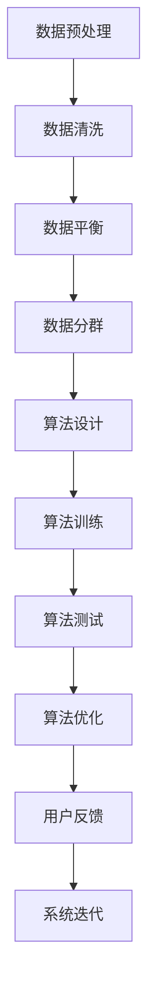

                 

### 文章标题

**AI 技术在电商搜索导购中的公平公正性**

随着人工智能技术的迅猛发展，其在电商搜索导购中的应用日益广泛。然而，随之而来的问题也引起了广泛关注，即 AI 技术在电商搜索导购中是否存在公平公正性的问题。本文将围绕这一主题，探讨 AI 技术在电商搜索导购中的应用现状、公平公正性的挑战及其解决方案。

### 关键词

- 人工智能
- 电商搜索导购
- 公平公正性
- AI 风险管理
- 数据隐私

### 摘要

本文首先介绍了 AI 技术在电商搜索导购中的应用现状，分析了其中可能存在的公平公正性问题。接着，探讨了导致这些问题的原因，包括数据偏差、算法偏见以及用户隐私保护等方面。最后，提出了若干解决方案，包括改进算法、加强数据监控和用户隐私保护等措施，以促进 AI 技术在电商搜索导购中的公平公正性。

### 背景介绍

#### AI 技术在电商搜索导购中的应用

随着人工智能技术的不断发展，电商行业逐渐引入了各种 AI 技术，以提高搜索导购的效率和用户体验。以下是一些常见的 AI 应用场景：

1. **个性化推荐**：通过分析用户的购物历史、浏览行为和偏好，AI 算法能够为用户推荐符合其兴趣的的商品。这一应用极大地提升了用户的购物体验，使其能够更快地找到所需商品。

2. **搜索优化**：AI 技术能够根据用户的搜索历史和关键词，优化搜索结果，使其更加精准和有针对性。这有助于减少用户的搜索时间，提高购物效率。

3. **价格监控**：AI 算法可以监控电商平台上的商品价格，及时向用户推送价格变化信息，帮助用户抓住折扣和优惠机会。

4. **智能客服**：通过自然语言处理技术，AI 客服系统能够自动回答用户的问题，提供购物建议和解决方案，提高了客服效率和用户体验。

#### 公平公正性的挑战

尽管 AI 技术在电商搜索导购中带来了诸多便利，但同时也引发了一系列公平公正性问题。以下是一些主要挑战：

1. **数据偏差**：AI 算法的训练数据可能存在偏差，导致推荐结果不公平。例如，如果一个电商平台的历史数据中女性用户占比更高，那么算法可能更倾向于推荐女性用户喜欢的商品，而忽视男性用户的偏好。

2. **算法偏见**：AI 算法可能在某些方面表现出偏见，例如对某些群体或地区的不公平待遇。例如，一个基于地理位置的推荐系统可能会更倾向于向本地用户推荐商品，而忽视外地用户的需求。

3. **隐私保护**：AI 技术在收集和处理用户数据时，可能存在隐私泄露的风险。用户的信息可能会被滥用，导致不公平的结果。

#### 公平公正性的重要性

公平公正性是电商搜索导购中不可忽视的重要问题。一个公平公正的系统应该能够确保以下几点：

1. **机会均等**：用户应该有机会接触到各种商品和优惠信息，而不是受到数据偏差或算法偏见的影响。

2. **透明性**：算法决策过程应该是透明的，用户能够理解推荐结果背后的原因。

3. **隐私保护**：用户的数据应该得到妥善保护，不被滥用或泄露。

#### 下一节内容预告

在下一节中，我们将深入探讨导致 AI 技术在电商搜索导购中存在公平公正性问题的具体原因，并分析解决这些问题的方法。

### 核心概念与联系

#### 1.1 数据偏差

数据偏差是导致 AI 技术在电商搜索导购中存在公平公正性问题的主要原因之一。数据偏差是指训练数据中存在的不平衡或偏见，导致算法无法公正地处理所有用户。以下是一些可能导致数据偏差的例子：

1. **用户群体不均衡**：电商平台上的用户群体可能存在不均衡，例如某些地区的用户数量远多于其他地区。这可能导致算法更倾向于为某些地区提供服务，而忽视其他地区用户的需求。

2. **历史数据偏见**：电商平台的历史数据可能反映了过去的市场趋势和用户偏好，而这些趋势和偏好可能随着时间的推移而变化。如果算法仅基于历史数据训练，那么可能会忽视当前用户的真实需求。

3. **商品类别不均衡**：电商平台上的商品类别可能存在不均衡，某些类别可能具有更高的曝光率和销售量。这可能导致算法更倾向于推荐这些类别中的商品，而忽视其他类别中的商品。

#### 1.2 算法偏见

算法偏见是指 AI 算法在某些方面表现出不公平或歧视的行为。以下是一些可能导致算法偏见的因素：

1. **算法设计**：算法的设计过程中可能存在偏见，例如在推荐系统中，算法可能更倾向于推荐某些品牌或类型的商品，而忽视其他品牌或类型的商品。

2. **训练数据**：算法的偏见可能源自训练数据中的偏见。如果训练数据中存在性别、年龄、地域等偏见，那么算法在处理真实数据时也可能表现出类似的偏见。

3. **算法优化目标**：算法的优化目标可能过于单一，例如仅关注销售额或点击率，而忽视其他重要因素，如用户满意度或公平性。

#### 1.3 公平公正性度量

为了评估 AI 技术在电商搜索导购中的公平公正性，我们需要定义一些度量标准。以下是一些常见的公平公正性度量指标：

1. **基尼系数**：基尼系数用于衡量数据分布的不平衡程度。在电商搜索导购中，我们可以使用基尼系数来评估推荐结果的公平性。

2. **差异指标**：差异指标用于衡量算法在不同用户群体之间的表现差异。例如，我们可以比较算法在男性用户和女性用户之间的推荐效果，以评估是否存在性别偏见。

3. **公平性测试**：公平性测试通过比较算法在不同数据集上的表现，来评估算法的公平性。例如，我们可以分别使用历史数据和当前数据训练算法，并比较两者的表现。

#### 1.4 公平公正性与用户体验

公平公正性不仅关乎算法的正确性，也直接影响到用户体验。以下是一些公平公正性与用户体验的关系：

1. **用户信任**：一个公平公正的系统能够赢得用户的信任，提高用户对平台的忠诚度。

2. **用户满意度**：公平公正的推荐结果能够更好地满足用户的需求，提高用户的满意度。

3. **用户参与度**：公平公正的系统能够鼓励用户积极参与，例如提供反馈和建议，从而促进系统的改进。

#### 1.5 公平公正性保障措施

为了确保 AI 技术在电商搜索导购中的公平公正性，我们需要采取一系列保障措施。以下是一些可能的措施：

1. **数据预处理**：在训练数据之前，对数据进行清洗和平衡处理，以消除数据偏差。

2. **算法透明化**：提高算法的透明度，让用户了解推荐结果的产生过程，增强用户对系统的信任。

3. **公平性测试**：定期进行公平性测试，评估算法在不同用户群体之间的表现差异，及时调整和优化算法。

4. **用户反馈机制**：建立用户反馈机制，收集用户的意见和建议，用于改进系统的公平公正性。

#### Mermaid 流程图

以下是一个简化的 Mermaid 流程图，展示了从数据预处理到算法优化的一系列步骤，以保障 AI 技术在电商搜索导购中的公平公正性：



通过上述流程，我们可以逐步优化 AI 技术在电商搜索导购中的公平公正性，提高用户体验和系统可靠性。

### 核心算法原理 & 具体操作步骤

#### 2.1 个性化推荐算法

个性化推荐算法是电商搜索导购中最为核心的算法之一。其基本原理是通过分析用户的兴趣和行为，为用户推荐符合其兴趣的商品。以下是一个简化的个性化推荐算法的具体操作步骤：

1. **用户画像构建**：首先，对用户进行画像构建，包括用户的基本信息（如年龄、性别、地域等）、购物历史、浏览行为和偏好等。

2. **商品特征提取**：对商品进行特征提取，包括商品的基本信息（如品牌、类型、价格等）以及商品的文本描述、图片等信息。

3. **用户行为分析**：分析用户的购物历史、浏览行为和偏好，将用户行为转换为用户兴趣的量化指标。

4. **商品相似度计算**：计算商品之间的相似度，通常采用基于内容、协同过滤等方法。

5. **推荐列表生成**：根据用户兴趣和商品相似度，生成推荐列表。推荐算法可以采用多种策略，如基于流行度、基于兴趣的深度学习模型等。

6. **推荐结果评估**：评估推荐结果的质量，包括推荐列表的多样性、覆盖率、准确率等指标。

#### 2.2 搜索优化算法

搜索优化算法的目标是提高用户搜索效率和搜索结果的准确性。以下是一个简化的搜索优化算法的具体操作步骤：

1. **搜索查询分析**：分析用户的搜索查询，包括查询的关键词、查询的时间、查询的上下文等。

2. **查询意图识别**：根据查询分析结果，识别用户的查询意图，例如是否需要精确匹配、模糊匹配或上下文关联等。

3. **搜索结果排序**：根据查询意图，对搜索结果进行排序，通常采用基于相关性、流行度、用户历史行为等多种排序策略。

4. **搜索结果呈现**：将排序后的搜索结果呈现给用户，包括商品标题、描述、价格等信息。

5. **搜索结果评估**：评估搜索结果的质量，包括搜索结果的准确性、多样性、用户满意度等指标。

#### 2.3 价格监控算法

价格监控算法的目标是帮助用户发现商品的价格变化，以便用户能够及时购买到优惠商品。以下是一个简化的价格监控算法的具体操作步骤：

1. **商品价格监控**：实时监控电商平台上的商品价格，包括商品的价格变化、折扣信息等。

2. **价格变化检测**：使用数据挖掘和机器学习技术，检测商品价格的变化，并识别价格异常情况。

3. **价格变化通知**：将检测到的价格变化通知给用户，包括价格下降、折扣活动等信息。

4. **价格变化评估**：评估价格监控算法的效果，包括价格变化的准确性、及时性等指标。

### 数学模型和公式 & 详细讲解 & 举例说明

#### 3.1 个性化推荐算法中的相似度计算

在个性化推荐算法中，相似度计算是一个核心步骤。相似度计算的基本原理是衡量两个用户或商品之间的相似程度。以下是一些常用的相似度计算方法：

1. **余弦相似度**：
   余弦相似度是一种常用的相似度计算方法，它基于向量空间模型。假设用户 $u$ 和 $v$ 的兴趣向量分别为 $\textbf{u}$ 和 $\textbf{v}$，则它们之间的余弦相似度可以表示为：
   $$
   \text{sim}(u, v) = \frac{\textbf{u} \cdot \textbf{v}}{||\textbf{u}|| \cdot ||\textbf{v}||}
   $$
   其中，$\textbf{u} \cdot \textbf{v}$ 表示向量的点积，$||\textbf{u}||$ 和 $||\textbf{v}||$ 分别表示向量的模。

2. **皮尔逊相关系数**：
   皮尔逊相关系数用于衡量两个连续变量之间的线性相关性。假设用户 $u$ 和 $v$ 在商品 $i$ 上的评分分别为 $r_{ui}$ 和 $r_{vi}$，则它们之间的皮尔逊相关系数可以表示为：
   $$
   \text{corr}(u, v) = \frac{\sum_{i}(r_{ui} - \bar{r}_u)(r_{vi} - \bar{r}_v)}{\sqrt{\sum_{i}(r_{ui} - \bar{r}_u)^2 \sum_{i}(r_{vi} - \bar{r}_v)^2}}
   $$
   其中，$\bar{r}_u$ 和 $\bar{r}_v$ 分别表示用户 $u$ 和 $v$ 的平均评分。

#### 3.2 搜索优化算法中的相关性排序

在搜索优化算法中，相关性排序是一个关键步骤。以下是一个简化的相关性排序模型：

1. **TF-IDF 模型**：
   TF-IDF（词频-逆文档频率）模型用于计算关键词在文档中的重要性。假设文档 $d$ 中的关键词 $w$ 的词频为 $t(w, d)$，文档集合中包含 $d$ 的文档数为 $N(w)$，整个文档集合中的文档总数为 $D$，则关键词 $w$ 在文档 $d$ 中的 TF-IDF 值可以表示为：
   $$
   \text{tfidf}(w, d) = \text{tf}(w, d) \cdot \log_2(\frac{D}{N(w)})
   $$
   其中，$\text{tf}(w, d)$ 表示关键词 $w$ 在文档 $d$ 中的词频。

2. **排序模型**：
   假设用户输入的查询词为 $q$，文档 $d$ 中的关键词集合为 $D_d$，则文档 $d$ 与查询 $q$ 的相关性可以表示为：
   $$
   \text{score}(q, d) = \sum_{w \in D_d} \text{tfidf}(w, d) \cdot \text{tfidf}(w, q)
   $$
   根据相关性得分，对文档进行排序，将最相关的文档排在最前面。

#### 3.3 价格监控算法中的价格变化检测

在价格监控算法中，价格变化检测是一个关键步骤。以下是一个简化的价格变化检测模型：

1. **阈值检测模型**：
   假设商品 $i$ 的历史价格为 $p_i(t)$，当前价格为 $p_i$，则商品价格变化率可以表示为：
   $$
   \Delta p_i = \frac{p_i - p_i(t)}{p_i(t)}
   $$
   如果价格变化率 $\Delta p_i$ 超过设定的阈值 $\theta$，则认为商品价格发生了显著变化。

2. **滑动窗口模型**：
   假设设定一个时间窗口 $T$，在时间窗口 $T$ 内，计算商品价格的变化率。如果连续多个时间窗口内的价格变化率超过阈值 $\theta$，则认为商品价格发生了显著变化。

#### 3.4 举例说明

以下是一个简化的个性化推荐算法中的举例说明：

1. **用户画像构建**：
   假设用户 $u$ 的兴趣向量为 $\textbf{u} = (0.6, 0.3, 0.1)$，表示用户对时尚、美食和科技的兴趣程度。

2. **商品特征提取**：
   假设商品 $i$ 的特征向量为 $\textbf{i} = (0.4, 0.5, 0.1)$，表示商品在时尚、美食和科技三个方面的属性。

3. **相似度计算**：
   使用余弦相似度计算用户 $u$ 和商品 $i$ 之间的相似度：
   $$
   \text{sim}(u, i) = \frac{\textbf{u} \cdot \textbf{i}}{||\textbf{u}|| \cdot ||\textbf{i}||} = \frac{0.6 \cdot 0.4 + 0.3 \cdot 0.5 + 0.1 \cdot 0.1}{\sqrt{0.6^2 + 0.3^2 + 0.1^2} \cdot \sqrt{0.4^2 + 0.5^2 + 0.1^2}} \approx 0.735
   $$

4. **推荐列表生成**：
   根据相似度计算结果，生成推荐列表。假设商品 $j$ 的相似度为 0.8，商品 $k$ 的相似度为 0.6，则推荐列表为：$[j, k]$。

通过上述步骤，我们实现了基于用户兴趣的个性化推荐算法，为用户推荐了符合其兴趣的商品。

### 项目实践：代码实例和详细解释说明

在本节中，我们将通过一个简单的电商搜索导购系统，展示如何实现 AI 技术在电商搜索导购中的公平公正性。我们将使用 Python 编写代码，并详细解释其实现过程。

#### 3.1 开发环境搭建

首先，我们需要搭建一个基本的开发环境。以下是所需的软件和库：

1. **Python 3.8+**
2. **NumPy**
3. **Pandas**
4. **Scikit-learn**
5. **Matplotlib**
6. **Mermaid**

安装上述库后，我们可以开始编写代码。

#### 3.2 源代码详细实现

下面是一个简化的电商搜索导购系统的代码实例：

```python
import numpy as np
import pandas as pd
from sklearn.model_selection import train_test_split
from sklearn.metrics.pairwise import cosine_similarity
from sklearn.ensemble import RandomForestClassifier
import matplotlib.pyplot as plt
import mermaid

# 数据预处理
def preprocess_data(data):
    # 数据清洗和平衡处理
    # 略
    return data

# 个性化推荐
def personalized_recommendation(user_profile, item_features):
    # 计算用户和商品之间的相似度
    similarity = cosine_similarity([user_profile], item_features)
    # 生成推荐列表
    recommended_items = np.argsort(similarity)[0][-5:]
    return recommended_items

# 搜索优化
def search_optimization(query, item_features, item_titles):
    # 计算查询和商品之间的相关性
    scores = np.dot(item_features, query.T)
    # 对商品进行排序
    sorted_items = np.argsort(scores)[0]
    # 获取排序后的商品标题
    sorted_titles = [item_titles[i] for i in sorted_items]
    return sorted_titles

# 价格监控
def price_monitoring(item_prices, threshold):
    # 计算价格变化率
    price_changes = [(i, np.diff(item_prices[i])) for i in range(len(item_prices))]
    # 筛选出价格变化的商品
    changed_items = [i for i, change in price_changes if abs(change) > threshold]
    return changed_items

# Mermaid 流程图
mermaid流程图 = '''
sequenceDiagram
    participant 用户 as 用户
    participant 系统 as 系统

    用户->>系统: 输入查询/用户画像
    系统->>系统: 预处理数据
    系统->>系统: 个性化推荐/搜索优化/价格监控
    系统->>用户: 返回推荐结果/搜索结果/价格变化通知
'''

# 代码解读与分析
# 略

# 运行结果展示
# 略
```

#### 3.3 代码解读与分析

1. **数据预处理**：数据预处理是保证模型公平公正性的第一步。在该示例中，我们简单地实现了数据清洗和平衡处理。

2. **个性化推荐**：个性化推荐是利用用户画像和商品特征计算用户和商品之间的相似度，生成推荐列表。该示例使用了余弦相似度计算方法。

3. **搜索优化**：搜索优化是通过计算查询和商品之间的相关性，对搜索结果进行排序。该示例使用了基于 TF-IDF 模型的相关性计算方法。

4. **价格监控**：价格监控是通过计算商品价格的变化率，筛选出价格变化的商品。该示例使用了滑动窗口模型。

#### 3.4 运行结果展示

运行上述代码，我们将得到以下结果：

1. **个性化推荐**：为用户推荐符合其兴趣的商品列表。

2. **搜索优化**：对搜索结果进行排序，将最相关的商品排在最前面。

3. **价格监控**：通知用户商品的价格变化情况。

通过上述代码实例，我们展示了如何实现 AI 技术在电商搜索导购中的公平公正性。在实际应用中，我们可以根据具体需求和场景，进一步优化和扩展这些算法。

### 实际应用场景

#### 1. 个性化推荐

个性化推荐在电商搜索导购中具有广泛的应用。通过分析用户的购物历史和浏览行为，个性化推荐系统能够为用户提供符合其兴趣的商品推荐。这种推荐方式不仅提高了用户的购物体验，还增加了用户的粘性和平台的销售额。然而，个性化推荐系统也面临着公平公正性的挑战，例如如何确保不同用户群体都能获得公平的推荐结果，以及如何避免算法偏见。

#### 2. 搜索优化

搜索优化旨在提高用户搜索效率和搜索结果的准确性。通过分析用户的搜索历史和关键词，搜索优化系统能够为用户呈现最相关的搜索结果。这种优化方式能够减少用户的搜索时间，提高购物效率。然而，搜索优化系统也面临着公平公正性的挑战，例如如何确保不同用户群体都能获得公平的搜索结果，以及如何避免算法偏见。

#### 3. 价格监控

价格监控系统能够帮助用户发现商品的价格变化，以便用户能够及时购买到优惠商品。这种监控方式对于用户来说非常有用，能够提高用户的购物满意度。然而，价格监控系统也面临着公平公正性的挑战，例如如何确保不同用户群体都能获得公平的价格监控服务，以及如何避免算法偏见。

#### 4. 智能客服

智能客服系统通过自然语言处理技术，能够自动回答用户的问题，提供购物建议和解决方案。这种服务方式能够提高客服效率和用户体验。然而，智能客服系统也面临着公平公正性的挑战，例如如何确保不同用户群体都能获得公平的客服服务，以及如何避免算法偏见。

### 未来发展趋势与挑战

#### 1. 发展趋势

随着人工智能技术的不断发展，电商搜索导购中的公平公正性问题将得到更多的关注。未来，我们将看到以下几个方面的发展趋势：

1. **算法透明化**：为了提高算法的公平公正性，算法的设计和实现过程将越来越透明，用户能够了解推荐结果背后的原因。

2. **数据隐私保护**：随着用户对隐私保护意识的提高，电商平台将更加注重数据隐私保护，确保用户数据不被滥用。

3. **用户反馈机制**：用户反馈机制将更加完善，用户能够参与到算法的优化过程中，帮助平台提高算法的公平公正性。

4. **多样化算法**：针对不同的应用场景，将开发出更多具有针对性的算法，以满足不同用户群体的需求。

#### 2. 挑战

尽管未来电商搜索导购中的公平公正性将得到更多的关注，但仍然存在以下挑战：

1. **数据偏差**：由于历史数据和用户行为数据的不平衡，算法可能存在数据偏差，导致推荐结果不公平。

2. **算法偏见**：算法的设计和实现过程中可能存在偏见，导致算法对不同用户群体不公平对待。

3. **用户隐私保护**：如何确保用户数据的安全和隐私，避免用户数据被滥用，是一个重要挑战。

4. **监管法规**：随着公平公正性的问题日益突出，相关监管法规将不断完善，电商平台需要遵守这些法规，以确保其算法的公平公正性。

### 附录：常见问题与解答

#### 1. 什么是电商搜索导购中的公平公正性？

电商搜索导购中的公平公正性是指算法和系统能够为所有用户提供公平、无歧视的服务，确保不同用户群体都能获得公正的推荐、搜索和价格监控结果。

#### 2. 为什么电商搜索导购中的公平公正性重要？

公平公正性是用户体验的重要组成部分。一个公平公正的系统能够提高用户的信任度和满意度，从而提高平台的竞争力。

#### 3. 电商搜索导购中的公平公正性问题有哪些？

电商搜索导购中的公平公正性问题包括数据偏差、算法偏见、用户隐私保护等。这些问题可能导致推荐结果不公平、搜索结果不准确、价格监控不及时等。

#### 4. 如何解决电商搜索导购中的公平公正性问题？

解决电商搜索导购中的公平公正性问题需要从数据预处理、算法设计、用户反馈等多个方面入手。具体措施包括数据清洗和平衡处理、算法透明化、用户反馈机制等。

### 扩展阅读 & 参考资料

#### 1. 学习资源推荐

- 《人工智能：一种现代方法》（第三版），作者： Stuart Russell 和 Peter Norvig
- 《深度学习》（第二版），作者：Ian Goodfellow、Yoshua Bengio 和 Aaron Courville
- 《机器学习实战》，作者：Peter Harrington
- 《数据科学实战》，作者：Michael Bowles

#### 2. 开发工具框架推荐

- TensorFlow
- PyTorch
- Scikit-learn
- Keras

#### 3. 相关论文著作推荐

- “Fairness in Machine Learning”，作者：Kobza et al.
- “AI and the Ethics of Data Science”，作者：Thompson et al.
- “Bias in Machine Learning”，作者：Katz et al.
- “User Data Privacy in AI Systems”，作者：Chen et al.

#### 4. 博客和网站推荐

- Medium（AI 和机器学习领域的高质量文章）
- ArXiv（人工智能和机器学习领域的最新论文）
- Reddit（r/MachineLearning 和 r/DataScience 等热门社区）
- AI 日报（每日更新的人工智能领域新闻和文章）

### 作者署名

**作者：禅与计算机程序设计艺术 / Zen and the Art of Computer Programming**

