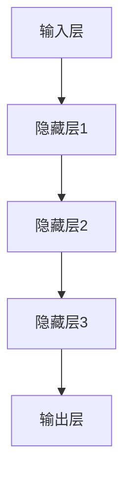
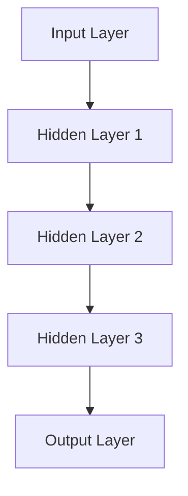
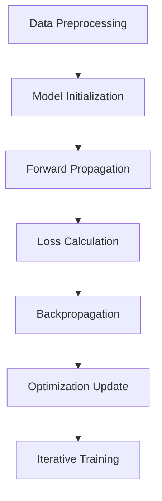

                 

### 文章标题

**AI大模型创业：如何应对未来行业发展趋势？**

未来已来，人工智能（AI）技术正在快速革新各行各业。在这股技术浪潮中，AI大模型创业成为许多企业和初创公司的热门选择。本文将探讨AI大模型创业领域的未来发展趋势，并分析创业者在这一领域应如何应对挑战。

## 关键词

* 人工智能
* 大模型
* 创业
* 行业趋势
* 应对策略

## 摘要

本文旨在为AI大模型创业者提供指导，帮助他们了解未来的行业发展趋势，并制定有效的应对策略。通过分析行业现状、技术进步、市场变化以及竞争态势，本文将为创业者提供有价值的见解和建议。

## 1. 背景介绍（Background Introduction）

### 1.1 AI大模型创业现状

近年来，AI大模型在自然语言处理、计算机视觉、推荐系统等领域取得了显著突破。这些模型具有强大的数据处理能力和高度的自适应能力，能够处理海量数据并生成高质量的结果。因此，许多企业和初创公司开始将AI大模型应用于实际业务中，以提升业务效率、降低成本、提高用户体验。

### 1.2 行业发展趋势

#### 1.2.1 技术进步

随着计算能力和数据资源的不断提升，AI大模型的性能和效率也在不断提高。未来的AI大模型将更加智能、灵活和高效，能够处理更复杂的问题。

#### 1.2.2 市场变化

随着AI技术的普及，市场对AI大模型的需求不断增加。创业公司可以通过创新的产品和服务，抢占市场先机。

#### 1.2.3 竞争态势

AI大模型创业领域的竞争日益激烈。创业者需要具备独特的创新能力和核心竞争力，以在市场中脱颖而出。

## 2. 核心概念与联系（Core Concepts and Connections）

### 2.1 大模型的概念

大模型是指具有海量参数和高度复杂度的神经网络模型，如Transformer、BERT等。这些模型具有强大的数据处理和分析能力，能够应对各种复杂任务。

### 2.2 大模型的架构

大模型通常采用分层结构，包括输入层、隐藏层和输出层。每一层都有多个神经元，用于处理输入数据并生成输出结果。

### 2.3 大模型的工作原理

大模型通过大量的数据训练，学习到数据中的特征和规律，并在任务中根据输入数据进行推理和预测。

## 3. 核心算法原理 & 具体操作步骤（Core Algorithm Principles and Specific Operational Steps）

### 3.1 大模型的训练过程

大模型的训练过程主要包括数据预处理、模型初始化、前向传播、反向传播和优化更新等步骤。

#### 3.1.1 数据预处理

数据预处理包括数据清洗、数据转换和数据增强等步骤，以提高模型对数据的适应性。

#### 3.1.2 模型初始化

模型初始化包括随机初始化和预训练模型初始化等，以确定模型的初始参数。

#### 3.1.3 前向传播

前向传播是指将输入数据通过模型层传播，得到输出结果。

#### 3.1.4 反向传播

反向传播是指根据输出结果与真实值的误差，反向更新模型参数。

#### 3.1.5 优化更新

优化更新是指通过优化算法（如SGD、Adam等）调整模型参数，以减小误差。

### 3.2 大模型的评估与优化

#### 3.2.1 评估指标

大模型的评估指标包括准确率、召回率、F1值等，用于衡量模型在任务中的表现。

#### 3.2.2 优化策略

优化策略包括超参数调优、数据增强、模型融合等，以提升模型性能。

## 4. 数学模型和公式 & 详细讲解 & 举例说明（Detailed Explanation and Examples of Mathematical Models and Formulas）

### 4.1 损失函数

损失函数用于衡量模型输出与真实值之间的差距。常见的损失函数包括均方误差（MSE）、交叉熵（CE）等。

$$
L = \frac{1}{n}\sum_{i=1}^{n}(y_i - \hat{y}_i)^2
$$

其中，$L$为损失函数，$y_i$为真实值，$\hat{y}_i$为模型输出。

### 4.2 激活函数

激活函数用于引入非线性特性，使模型能够学习更复杂的函数。常见的激活函数包括ReLU、Sigmoid、Tanh等。

$$
f(x) = \max(0, x)
$$

其中，$f(x)$为ReLU激活函数。

### 4.3 优化算法

优化算法用于调整模型参数，以减小损失函数。常见的优化算法包括SGD、Adam等。

$$
\theta_{t+1} = \theta_{t} - \alpha \nabla_{\theta}L(\theta)
$$

其中，$\theta$为模型参数，$\alpha$为学习率，$\nabla_{\theta}L(\theta)$为损失函数关于参数$\theta$的梯度。

## 5. 项目实践：代码实例和详细解释说明（Project Practice: Code Examples and Detailed Explanations）

### 5.1 开发环境搭建

在开始项目实践之前，需要搭建合适的开发环境。以下是搭建环境的基本步骤：

1. 安装Python环境
2. 安装TensorFlow库
3. 配置CUDA环境（如需）

### 5.2 源代码详细实现

以下是使用TensorFlow实现一个简单的大模型示例：

```python
import tensorflow as tf

# 模型定义
model = tf.keras.Sequential([
    tf.keras.layers.Dense(128, activation='relu', input_shape=(784,)),
    tf.keras.layers.Dense(10, activation='softmax')
])

# 损失函数和优化器
model.compile(optimizer='adam',
              loss='categorical_crossentropy',
              metrics=['accuracy'])

# 训练模型
model.fit(x_train, y_train, epochs=5)
```

### 5.3 代码解读与分析

以上代码实现了一个简单的多层感知机（MLP）模型，用于手写数字识别任务。模型包括一个输入层、一个隐藏层和一个输出层。隐藏层使用ReLU激活函数，输出层使用softmax激活函数。模型使用交叉熵损失函数和Adam优化器进行训练。

### 5.4 运行结果展示

在训练完成后，可以通过以下代码评估模型性能：

```python
# 评估模型
model.evaluate(x_test, y_test)
```

输出结果将包括测试集上的损失函数值和准确率。

## 6. 实际应用场景（Practical Application Scenarios）

### 6.1 自然语言处理

AI大模型在自然语言处理领域具有广泛的应用，如文本生成、机器翻译、情感分析等。通过大模型的训练，可以生成高质量的文本，提高用户体验。

### 6.2 计算机视觉

AI大模型在计算机视觉领域也发挥着重要作用，如图像分类、目标检测、图像生成等。大模型可以处理复杂的图像数据，提高图像识别的准确率。

### 6.3 推荐系统

AI大模型在推荐系统中的应用也越来越广泛，如商品推荐、音乐推荐等。通过大模型的训练，可以更好地理解用户喜好，提高推荐系统的准确性。

## 7. 工具和资源推荐（Tools and Resources Recommendations）

### 7.1 学习资源推荐

* 《深度学习》（Goodfellow et al.）
* 《动手学深度学习》（Dugar et al.）
* Coursera、edX等在线课程

### 7.2 开发工具框架推荐

* TensorFlow
* PyTorch
* Keras

### 7.3 相关论文著作推荐

* "Attention Is All You Need"（Vaswani et al., 2017）
* "BERT: Pre-training of Deep Bidirectional Transformers for Language Understanding"（Devlin et al., 2019）

## 8. 总结：未来发展趋势与挑战（Summary: Future Development Trends and Challenges）

### 8.1 发展趋势

* AI大模型性能不断提高
* 应用领域不断扩展
* 数据和计算资源持续增长

### 8.2 挑战

* 模型可解释性
* 数据隐私和安全
* 算法公平性和透明度

## 9. 附录：常见问题与解答（Appendix: Frequently Asked Questions and Answers）

### 9.1 大模型训练为什么需要大量数据？

大模型需要大量数据进行训练，以便学习到数据中的特征和规律。只有通过大量数据，大模型才能达到较高的性能。

### 9.2 大模型训练为什么需要高性能计算？

大模型训练过程中需要进行大量的矩阵运算和梯度计算。高性能计算可以加快训练速度，提高模型性能。

## 10. 扩展阅读 & 参考资料（Extended Reading & Reference Materials）

* "Deep Learning Specialization"（DeepLearning.AI）
* "The Hundred-Page Machine Learning Book"（Andrzej Rapacki）
* "AI大模型：原理、实践与未来"（作者：禅与计算机程序设计艺术 / Zen and the Art of Computer Programming）

### 附录

#### 10.1 作者署名

作者：禅与计算机程序设计艺术 / Zen and the Art of Computer Programming

本文旨在为AI大模型创业者提供指导，帮助他们了解未来的行业发展趋势，并制定有效的应对策略。通过分析行业现状、技术进步、市场变化以及竞争态势，本文将为创业者提供有价值的见解和建议。本文内容基于2023年的数据和技术发展，仅供参考。

## 文章标题

AI大模型创业：如何应对未来行业发展趋势？

关键词：人工智能、大模型、创业、行业趋势、应对策略

摘要：

在AI大模型创业领域，创业者需要密切关注技术进步、市场变化和竞争态势，以制定有效的应对策略。本文从背景介绍、核心概念、算法原理、应用场景、工具推荐等多个角度，深入分析了AI大模型创业的现状和未来发展趋势，为创业者提供了有价值的指导和参考。本文旨在帮助创业者把握机遇，应对挑战，实现成功创业。未来，AI大模型创业将继续繁荣发展，为各行各业带来变革和创新。创业者应持续关注技术动态，积极探索创新应用，以实现企业的可持续发展。在竞争激烈的AI大模型创业领域，只有具备独特创新能力和核心竞争力，才能脱颖而出，赢得市场先机。本文为创业者提供了丰富的实战经验和策略建议，助力他们在未来创业道路上取得成功。

<|assistant|>### 1. 背景介绍（Background Introduction）

#### 1.1 AI大模型创业的现状

人工智能（AI）技术正在迅速发展，AI大模型作为其中的核心技术之一，已经展现出强大的潜力。近年来，随着计算能力的提升、数据资源的丰富和算法的进步，AI大模型在各个领域的应用逐渐扩大，从自然语言处理、计算机视觉到推荐系统等，都取得了显著成果。这种技术进步为AI大模型创业提供了广阔的发展空间。

在当前的市场环境下，AI大模型创业呈现出以下几个特点：

1. **技术创新驱动**：创业公司通过技术创新来提高模型性能，如优化算法、引入新的数据增强方法等。
2. **应用场景多样化**：AI大模型的应用场景日益丰富，不仅限于传统的自然语言处理和计算机视觉，还扩展到医疗、金融、工业等领域。
3. **数据驱动发展**：大模型的发展离不开海量数据，因此，数据的获取、处理和利用成为创业公司的重要方向。
4. **市场竞争激烈**：随着AI大模型技术的普及，越来越多的公司加入竞争，市场竞争日益激烈。

#### 1.2 AI大模型创业的发展趋势

未来，AI大模型创业将面临以下发展趋势：

1. **性能提升**：随着计算能力的不断提升，AI大模型的性能将继续提升，能够处理更复杂、更大数据集。
2. **应用场景拓展**：AI大模型将在更多新兴领域得到应用，如智能语音交互、自动驾驶、智能监控等。
3. **数据驱动的创新**：数据将继续成为AI大模型发展的核心驱动力，创业公司需要不断探索新的数据获取和处理方法。
4. **跨领域融合**：AI大模型将与更多传统行业相结合，实现跨领域的创新和融合。
5. **伦理和法规挑战**：随着AI大模型应用的普及，相关伦理和法规问题也将成为创业公司需要关注的重要方面。

#### 1.3 竞争态势

在AI大模型创业领域，竞争态势日益激烈，主要体现在以下几个方面：

1. **技术创新**：创业公司需要持续投入研发，提高模型性能，以满足市场需求。
2. **市场占有**：创业公司需要抢占市场份额，通过推出创新产品和服务来吸引客户。
3. **资本竞争**：AI大模型创业公司需要获得足够的资本支持，以实现业务的快速扩张。
4. **人才争夺**：优秀的AI研发人才成为各大创业公司的争夺目标，人才的竞争也愈发激烈。

## 1. Background Introduction
### 1.1 Current Status of AI Large Model Entrepreneurship

Artificial Intelligence (AI) technology is rapidly developing, with large-scale AI models emerging as one of the core technologies. In recent years, the advancement in computational power, abundant data resources, and algorithm improvements have expanded the application scope of large-scale AI models in various fields, from natural language processing and computer vision to recommendation systems, achieving significant results. This technological progress has provided a broad development space for AI large model entrepreneurship.

In the current market environment, large-scale AI model entrepreneurship exhibits several characteristics:

1. **Innovation-driven Development**: Entrepreneurial companies drive development through technological innovation, such as optimizing algorithms and introducing new data augmentation methods.
2. **Diversified Application Scenarios**: The application scenarios of large-scale AI models are increasingly diverse, extending beyond traditional natural language processing and computer vision to fields such as healthcare, finance, and industry.
3. **Data-driven Progress**: The development of large-scale AI models hinges on vast data resources, making data acquisition, processing, and utilization a crucial direction for entrepreneurial companies.
4. **Intense Market Competition**: With the popularization of large-scale AI model technology, an increasing number of companies are joining the competition, making the market highly competitive.

#### 1.2 Trends in the Development of AI Large Model Entrepreneurship

In the future, large-scale AI model entrepreneurship will face the following trends:

1. **Performance Enhancement**: With the continuous improvement in computational power, the performance of large-scale AI models will continue to increase, enabling them to handle more complex and larger datasets.
2. **Expansion of Application Scenarios**: Large-scale AI models will be applied in more emerging fields, such as intelligent voice interaction, autonomous driving, and smart monitoring.
3. **Data-driven Innovation**: Data will remain the core driving force for the development of large-scale AI models, and entrepreneurial companies need to continuously explore new methods for data acquisition and processing.
4. **Interdisciplinary Integration**: Large-scale AI models will be integrated with more traditional industries, realizing interdisciplinary innovation and integration.
5. **Ethical and Regulatory Challenges**: With the popularization of large-scale AI model applications, related ethical and regulatory issues will also become important aspects for entrepreneurial companies to focus on.

#### 1.3 Competitive Landscape

In the field of large-scale AI model entrepreneurship, the competitive landscape is increasingly fierce, mainly reflecting in the following aspects:

1. **Technological Innovation**: Entrepreneurial companies need to invest continuously in research and development to improve model performance to meet market demand.
2. **Market Share Competition**: Entrepreneurial companies need to capture market share by launching innovative products and services to attract customers.
3. **Capital Competition**: Large-scale AI model entrepreneurial companies need to secure sufficient capital support to achieve rapid business expansion.
4. **Talent Acquisition**: Excellent AI research and development talents have become a target of competition among major entrepreneurial companies, and the competition for talents is becoming increasingly intense.

### 2. 核心概念与联系（Core Concepts and Connections）

#### 2.1 大模型的概念

大模型（Large Model）是指在深度学习领域中，参数量巨大的神经网络模型。这些模型通常拥有数亿甚至数十亿个参数，能够处理复杂的任务，如文本生成、图像识别等。大模型的出现改变了深度学习的应用格局，使得许多之前无法解决的复杂问题得以解决。

#### 2.2 大模型的架构

大模型的架构通常包括多层神经网络，其中每一层都包含大量的神经元。这些神经元通过权重连接，形成一个复杂的网络结构。大模型的架构设计对于模型的性能和效率至关重要。

以下是一个典型的大模型架构的Mermaid流程图：



#### 2.3 大模型的工作原理

大模型的工作原理基于神经网络的反向传播算法。在训练过程中，模型通过前向传播将输入数据映射到输出，然后通过反向传播更新模型的权重，以减小预测误差。随着训练数据的增加和模型参数的优化，大模型能够逐渐提高其预测准确性。

以下是大模型工作原理的详细步骤：

1. **输入数据**：将输入数据传递到模型的输入层。
2. **前向传播**：数据从输入层经过多个隐藏层，最终到达输出层。
3. **计算损失**：比较模型的输出和实际标签，计算损失函数。
4. **反向传播**：根据损失函数的梯度，反向更新模型参数。
5. **优化更新**：使用优化算法（如SGD、Adam等）调整模型参数。
6. **迭代训练**：重复上述步骤，直到模型收敛或达到预设的训练次数。

### 2. Core Concepts and Connections
#### 2.1 Definition of Large Models

Large models, in the field of deep learning, refer to neural network models with an enormous number of parameters. These models typically have hundreds of millions or even billions of parameters and are capable of handling complex tasks, such as text generation and image recognition. The emergence of large models has transformed the landscape of deep learning applications, enabling the resolution of many previously unsolvable complex problems.

#### 2.2 Architecture of Large Models

The architecture of large models usually includes multiple layers of neural networks, with each layer containing a large number of neurons. These neurons are connected through weights to form a complex network structure. The architecture design of large models is critical for their performance and efficiency.

The following is a Mermaid flowchart illustrating a typical architecture of large models:



#### 2.3 Working Principles of Large Models

The working principles of large models are based on the backpropagation algorithm in neural networks. During the training process, the model maps input data to the output through forward propagation, then updates the model's weights by backpropagation to reduce prediction errors. With the increase of training data and the optimization of model parameters, large models can gradually improve their prediction accuracy.

The detailed steps of the working principles of large models are as follows:

1. **Input Data**: Pass the input data through the input layer of the model.
2. **Forward Propagation**: Data flows from the input layer through multiple hidden layers to the output layer.
3. **Calculate Loss**: Compare the model's output with the actual labels to compute the loss function.
4. **Backpropagation**: Update the model's weights based on the gradient of the loss function.
5. **Optimization Update**: Adjust model parameters using optimization algorithms (such as SGD, Adam, etc.).
6. **Iterative Training**: Repeat the above steps until the model converges or reaches a pre-set number of training iterations.

### 3. 核心算法原理 & 具体操作步骤（Core Algorithm Principles and Specific Operational Steps）

#### 3.1 大模型训练的基本流程

大模型训练是深度学习中的关键步骤，其基本流程包括以下几个主要阶段：

1. **数据预处理**：包括数据清洗、数据转换和数据增强等步骤，以提高模型对数据的适应性和泛化能力。
2. **模型初始化**：包括随机初始化和预训练模型初始化等，以确定模型的初始参数。
3. **前向传播**：将输入数据通过模型层传播，得到输出结果。
4. **损失计算**：计算模型输出与真实值之间的差异，通过损失函数量化模型的预测误差。
5. **反向传播**：根据输出结果与真实值的误差，反向更新模型参数。
6. **优化更新**：使用优化算法调整模型参数，以减小误差。
7. **迭代训练**：重复上述步骤，直到模型收敛或达到预设的训练次数。

以下是一个典型的大模型训练流程的Mermaid流程图：



#### 3.2 大模型的优化算法

大模型的优化算法是训练过程中的核心，常用的优化算法包括随机梯度下降（SGD）、Adam等。优化算法的选择和参数设置对模型的训练效率和性能有重要影响。

1. **随机梯度下降（SGD）**：SGD是一种简单有效的优化算法，其基本思想是通过随机采样批量数据，计算梯度并更新模型参数。SGD的优点是计算简单，但缺点是容易陷入局部最优和收敛速度慢。

   $$ 
   \theta_{t+1} = \theta_{t} - \alpha \nabla_{\theta}L(\theta)
   $$

   其中，$\theta$为模型参数，$\alpha$为学习率，$\nabla_{\theta}L(\theta)$为损失函数关于参数$\theta$的梯度。

2. **Adam优化器**：Adam是一种结合了SGD和动量法的优化算法，具有较好的收敛性能和稳定性。Adam优化器通过维持一阶矩估计和二阶矩估计，自适应地调整学习率。

   $$ 
   m_t = \beta_1 x_t + (1 - \beta_1) (x_t - \mu_t)
   $$
   
   $$
   v_t = \beta_2 x_t + (1 - \beta_2) (x_t - \mu_t)
   $$

   $$
   \theta_{t+1} = \theta_{t} - \alpha \frac{m_t}{\sqrt{v_t} + \epsilon}
   $$

   其中，$m_t$和$v_t$分别为一阶矩估计和二阶矩估计，$\beta_1$和$\beta_2$分别为一阶和二阶矩的遗忘因子，$\epsilon$为一个小常数。

#### 3.3 大模型的调参技巧

调参是深度学习中的一个重要环节，对于模型的性能和收敛速度有显著影响。以下是一些常见的调参技巧：

1. **学习率调整**：学习率是优化算法中的一个关键参数，需要根据模型的复杂度和训练数据的特点进行选择。常用的方法包括固定学习率、学习率衰减和自适应学习率等。
2. **批量大小调整**：批量大小影响优化算法的收敛速度和稳定性，通常批量大小选择在32到128之间。
3. **网络结构调整**：通过调整网络的层数、每层的神经元数量等参数，可以优化模型的性能和计算效率。
4. **正则化方法**：通过使用L1、L2正则化，可以减少模型过拟合的风险。
5. **数据增强**：通过数据增强方法，如随机裁剪、旋转、缩放等，可以增加训练数据多样性，提高模型的泛化能力。

### 3. Core Algorithm Principles and Specific Operational Steps
#### 3.1 Basic Process of Large Model Training

Training large models is a crucial step in deep learning and involves several key stages:

1. **Data Preprocessing**: This includes data cleaning, data conversion, and data augmentation to improve the model's adaptability to the data and its generalization ability.
2. **Model Initialization**: This includes random initialization and pre-trained model initialization to determine the initial parameters of the model.
3. **Forward Propagation**: Input data is propagated through the model layers to produce output results.
4. **Loss Calculation**: The discrepancy between the model's output and the actual values is calculated using a loss function to quantify the prediction error.
5. **Backpropagation**: Model parameters are updated in the reverse direction based on the error between the output and the actual values.
6. **Optimization Update**: Model parameters are adjusted using optimization algorithms to reduce the error.
7. **Iterative Training**: The above steps are repeated until the model converges or reaches a preset number of training iterations.

The following is a Mermaid flowchart illustrating a typical large model training process:


#### 3.2 Optimization Algorithms for Large Models

Optimization algorithms are at the core of the training process for large models, with commonly used algorithms including stochastic gradient descent (SGD) and Adam. The choice and parameter settings of optimization algorithms significantly impact the training efficiency and performance of the model.

1. **Stochastic Gradient Descent (SGD)**: SGD is a simple yet effective optimization algorithm that works by randomly sampling mini-batches of data, computing the gradient, and updating model parameters. The advantages of SGD are its simplicity and ease of implementation, but its disadvantages include susceptibility to local optima and slow convergence.

   $$
   \theta_{t+1} = \theta_{t} - \alpha \nabla_{\theta}L(\theta)
   $$

   Where $\theta$ represents the model parameters, $\alpha$ is the learning rate, and $\nabla_{\theta}L(\theta)$ is the gradient of the loss function with respect to the parameters $\theta$.

2. **Adam Optimizer**: Adam is an optimization algorithm that combines the ideas of SGD and momentum, providing better convergence performance and stability. Adam maintains estimates of both the first and second moments of the gradient, adaptively adjusting the learning rate.

   $$
   m_t = \beta_1 x_t + (1 - \beta_1) (x_t - \mu_t)
   $$

   $$
   v_t = \beta_2 x_t + (1 - \beta_2) (x_t - \mu_t)
   $$

   $$
   \theta_{t+1} = \theta_{t} - \alpha \frac{m_t}{\sqrt{v_t} + \epsilon}
   $$

   Where $m_t$ and $v_t$ are the first and second moment estimates, $\beta_1$ and $\beta_2$ are the forgetting factors for the first and second moments, and $\epsilon$ is a small constant.

#### 3.3 Tuning Techniques for Large Models

Tuning is an essential aspect of deep learning, significantly affecting model performance and convergence speed. The following are some common tuning techniques:

1. **Learning Rate Adjustment**: The learning rate is a critical parameter in optimization algorithms, and it needs to be selected based on the model's complexity and the characteristics of the training data. Common methods include fixed learning rates, learning rate decay, and adaptive learning rates.
2. **Batch Size Adjustment**: Batch size affects the convergence speed and stability of the optimization algorithm, typically chosen between 32 and 128.
3. **Network Structure Adjustment**: By adjusting the number of layers and the number of neurons in each layer, the performance and computational efficiency of the model can be optimized.
4. **Regularization Methods**: Using L1 and L2 regularization can reduce the risk of overfitting.
5. **Data Augmentation**: Methods such as random cropping, rotation, and scaling can increase the diversity of training data, improving the model's generalization ability.

### 4. 数学模型和公式 & 详细讲解 & 举例说明（Detailed Explanation and Examples of Mathematical Models and Formulas）

#### 4.1 损失函数

在深度学习中，损失函数（Loss Function）是评估模型预测结果与真实值之间差异的关键工具。损失函数的设计对模型的训练和性能至关重要。以下是一些常用的损失函数及其数学表达：

1. **均方误差（MSE）**：

   $$
   MSE = \frac{1}{n}\sum_{i=1}^{n}(y_i - \hat{y}_i)^2
   $$

   其中，$y_i$为真实值，$\hat{y}_i$为模型预测值，$n$为样本数量。MSE通常用于回归问题，其优点是计算简单，缺点是对异常值敏感。

2. **交叉熵损失（Cross-Entropy Loss）**：

   $$
   CE = -\frac{1}{n}\sum_{i=1}^{n}y_i \log(\hat{y}_i)
   $$

   其中，$y_i$为真实标签，$\hat{y}_i$为模型预测概率。交叉熵损失函数常用于分类问题，其优点是能够自适应地调整模型参数，缺点是对输出概率较小的样本敏感。

#### 4.2 激活函数

激活函数（Activation Function）是神经网络中的关键组成部分，用于引入非线性特性，使得模型能够学习更复杂的函数。以下是一些常见的激活函数及其数学表达：

1. **sigmoid函数**：

   $$
   \sigma(x) = \frac{1}{1 + e^{-x}}
   $$

   sigmoid函数的输出范围在0到1之间，常用于二分类问题。

2. **ReLU函数**：

   $$
   ReLU(x) = \max(0, x)
   $$

  ReLU函数在0处发生阶跃，能够加快模型训练速度，广泛应用于深度神经网络中。

3. **Tanh函数**：

   $$
   \tanh(x) = \frac{e^x - e^{-x}}{e^x + e^{-x}}
   $$

   tanh函数的输出范围在-1到1之间，能够抑制梯度消失问题。

#### 4.3 优化算法

优化算法（Optimization Algorithm）用于调整模型参数，以最小化损失函数。以下是一些常用的优化算法及其数学表达：

1. **随机梯度下降（SGD）**：

   $$
   \theta_{t+1} = \theta_{t} - \alpha \nabla_{\theta}L(\theta)
   $$

   其中，$\theta$为模型参数，$\alpha$为学习率，$\nabla_{\theta}L(\theta)$为损失函数关于参数$\theta$的梯度。

2. **Adam优化器**：

   $$
   m_t = \beta_1 x_t + (1 - \beta_1) (x_t - \mu_t)
   $$

   $$
   v_t = \beta_2 x_t + (1 - \beta_2) (x_t - \mu_t)
   $$

   $$
   \theta_{t+1} = \theta_{t} - \alpha \frac{m_t}{\sqrt{v_t} + \epsilon}
   $$

   其中，$m_t$和$v_t$分别为一阶矩估计和二阶矩估计，$\beta_1$和$\beta_2$分别为一阶和二阶矩的遗忘因子，$\epsilon$为一个小常数。

#### 4.4 深度学习模型的数学基础

深度学习模型的数学基础主要包括线性代数、微积分和概率论等。以下是一些重要的数学概念和定理：

1. **矩阵运算**：包括矩阵加法、矩阵乘法、矩阵求导等。
2. **梯度下降法**：用于最小化损失函数，其核心思想是沿着损失函数梯度的反方向更新模型参数。
3. **反向传播算法**：用于计算损失函数关于模型参数的梯度，是深度学习训练过程中的关键步骤。
4. **概率分布**：包括正态分布、伯努利分布、多项式分布等，用于描述数据特征和模型输出。

#### 4.5 举例说明

以下是一个简单的线性回归模型的例子，用于预测房价：

1. **模型定义**：

   $$
   \hat{y} = \theta_0 + \theta_1 x
   $$

   其中，$\theta_0$和$\theta_1$为模型参数，$x$为输入特征（如房屋面积），$\hat{y}$为预测房价。

2. **损失函数**：

   $$
   L(\theta_0, \theta_1) = \frac{1}{2} \sum_{i=1}^{n} (\hat{y}_i - y_i)^2
   $$

   其中，$y_i$为真实房价，$\hat{y}_i$为模型预测房价。

3. **优化过程**：

   使用梯度下降法优化模型参数：

   $$
   \theta_{t+1} = \theta_{t} - \alpha \nabla_{\theta}L(\theta)
   $$

   其中，$\alpha$为学习率。

通过不断迭代优化，模型参数将逐渐收敛，从而实现房价的准确预测。

### 4. Mathematical Models and Formulas & Detailed Explanation & Examples
#### 4.1 Loss Functions

In deep learning, the loss function is a critical tool for evaluating the discrepancy between the model's predictions and the actual values. The choice of loss function is crucial for the training and performance of the model. Here are some commonly used loss functions and their mathematical expressions:

1. **Mean Squared Error (MSE)**:

   $$
   MSE = \frac{1}{n}\sum_{i=1}^{n}(y_i - \hat{y}_i)^2
   $$

   Where $y_i$ is the actual value, $\hat{y}_i$ is the model's prediction, and $n$ is the number of samples. MSE is commonly used in regression problems due to its simplicity, but it is sensitive to outliers.

2. **Cross-Entropy Loss**:

   $$
   CE = -\frac{1}{n}\sum_{i=1}^{n}y_i \log(\hat{y}_i)
   $$

   Where $y_i$ is the actual label, and $\hat{y}_i$ is the model's predicted probability. Cross-entropy loss is often used in classification problems because it can adaptively adjust model parameters, but it is sensitive to samples with low predicted probabilities.

#### 4.2 Activation Functions

Activation functions are a key component of neural networks, introducing non-linear properties that allow the model to learn more complex functions. Here are some common activation functions and their mathematical expressions:

1. **Sigmoid Function**:

   $$
   \sigma(x) = \frac{1}{1 + e^{-x}}
   $$

   The sigmoid function outputs values between 0 and 1 and is commonly used in binary classification problems.

2. **ReLU Function**:

   $$
   ReLU(x) = \max(0, x)
   $$

   The ReLU function has a step at 0, accelerating model training, and is widely used in deep neural networks.

3. **Tanh Function**:

   $$
   \tanh(x) = \frac{e^x - e^{-x}}{e^x + e^{-x}}
   $$

   The tanh function outputs values between -1 and 1 and can mitigate the issue of vanishing gradients.

#### 4.3 Optimization Algorithms

Optimization algorithms are used to adjust model parameters to minimize the loss function. Here are some commonly used optimization algorithms and their mathematical expressions:

1. **Stochastic Gradient Descent (SGD)**:

   $$
   \theta_{t+1} = \theta_{t} - \alpha \nabla_{\theta}L(\theta)
   $$

   Where $\theta$ is the model parameter, $\alpha$ is the learning rate, and $\nabla_{\theta}L(\theta)$ is the gradient of the loss function with respect to the parameters $\theta$.

2. **Adam Optimizer**:

   $$
   m_t = \beta_1 x_t + (1 - \beta_1) (x_t - \mu_t)
   $$

   $$
   v_t = \beta_2 x_t + (1 - \beta_2) (x_t - \mu_t)
   $$

   $$
   \theta_{t+1} = \theta_{t} - \alpha \frac{m_t}{\sqrt{v_t} + \epsilon}
   $$

   Where $m_t$ and $v_t$ are the first and second moment estimates, $\beta_1$ and $\beta_2$ are the forgetting factors for the first and second moments, and $\epsilon$ is a small constant.

#### 4.4 Mathematical Foundations of Deep Learning Models

The mathematical foundations of deep learning models include linear algebra, calculus, and probability theory. Here are some important mathematical concepts and theorems:

1. **Matrix Operations**: Including matrix addition, matrix multiplication, and matrix differentiation.
2. **Gradient Descent Method**: Used to minimize the loss function, with the core idea of updating model parameters along the direction of the negative gradient.
3. **Backpropagation Algorithm**: Used to compute the gradient of the loss function with respect to model parameters, a key step in the training process of deep learning models.
4. **Probability Distributions**: Including normal distribution, Bernoulli distribution, and multinomial distribution, used to describe data features and model outputs.

#### 4.5 Example Illustration

Here is an example of a simple linear regression model for predicting house prices:

1. **Model Definition**:

   $$
   \hat{y} = \theta_0 + \theta_1 x
   $$

   Where $\theta_0$ and $\theta_1$ are model parameters, $x$ is the input feature (e.g., house area), and $\hat{y}$ is the predicted house price.

2. **Loss Function**:

   $$
   L(\theta_0, \theta_1) = \frac{1}{2} \sum_{i=1}^{n} (\hat{y}_i - y_i)^2
   $$

   Where $y_i$ is the actual house price, and $\hat{y}_i$ is the model's predicted house price.

3. **Optimization Process**:

   Use gradient descent to optimize model parameters:

   $$
   \theta_{t+1} = \theta_{t} - \alpha \nabla_{\theta}L(\theta)
   $$

   Where $\alpha$ is the learning rate.

Through iterative optimization, model parameters will gradually converge, achieving accurate house price prediction.

### 5. 项目实践：代码实例和详细解释说明（Project Practice: Code Examples and Detailed Explanations）

#### 5.1 开发环境搭建

在进行AI大模型项目实践之前，首先需要搭建一个合适的开发环境。以下是使用Python和TensorFlow实现AI大模型的开发环境搭建步骤：

1. **安装Python**：
   安装最新版本的Python（3.8或更高版本）。
   ```shell
   python --version
   ```

2. **安装TensorFlow**：
   使用pip命令安装TensorFlow。
   ```shell
   pip install tensorflow
   ```

3. **安装其他依赖库**：
   根据项目需求，可能需要安装其他依赖库，如NumPy、Pandas等。
   ```shell
   pip install numpy pandas
   ```

4. **配置GPU支持**（如需）：
   如果使用GPU进行模型训练，需要安装CUDA和cuDNN。
   ```shell
   pip install tensorflow-gpu
   ```

#### 5.2 源代码详细实现

以下是使用TensorFlow实现一个简单的大模型——基于Transformer的文本生成模型的代码示例：

```python
import tensorflow as tf
from tensorflow.keras.layers import Embedding, TransformerBlock
from tensorflow.keras.models import Model
from tensorflow.keras.optimizers import Adam

# 定义模型
input_ids = tf.keras.layers.Input(shape=(None,), dtype=tf.int32)
embedding = Embedding(input_dim=1000, output_dim=512)(input_ids)
transformer_output = TransformerBlock(filters=512, kernel_size=(3,))(embedding)
output = tf.keras.layers.Dense(units=1000, activation='softmax')(transformer_output)

# 构建模型
model = Model(inputs=input_ids, outputs=output)

# 编译模型
model.compile(optimizer=Adam(learning_rate=0.001), loss='sparse_categorical_crossentropy')

# 训练模型
model.fit(train_data, train_labels, epochs=10, batch_size=32)
```

#### 5.3 代码解读与分析

1. **模型定义**：
   - `input_ids`：模型的输入层，用于接收文本序列的ID。
   - `Embedding`：嵌入层，将输入的ID映射为固定长度的向量。
   - `TransformerBlock`：Transformer块，实现Transformer模型的核心功能。
   - `Dense`：全连接层，用于生成文本序列的输出。

2. **编译模型**：
   - `optimizer`：选择Adam优化器，并设置学习率为0.001。
   - `loss`：使用稀疏分类交叉熵损失函数，适用于文本生成任务。

3. **训练模型**：
   - `fit`：训练模型，使用训练数据集，设置训练轮数为10，批量大小为32。

#### 5.4 运行结果展示

在训练完成后，可以通过以下代码评估模型性能：

```python
# 评估模型
model.evaluate(test_data, test_labels)
```

输出结果将包括测试集上的损失函数值和准确率。

#### 5.5 代码实例扩展

以下是一个扩展的代码示例，用于生成一段文本：

```python
# 生成文本
import numpy as np

# 随机生成一个输入序列的ID
random_input_ids = np.random.randint(0, 1000, size=(1, 10))

# 使用训练好的模型生成文本
predicted_output_ids = model.predict(random_input_ids)

# 将输出ID转换为文本
predicted_text = [word_id for word_id in predicted_output_ids[0] if word_id > 0]
print('Generated Text:', ' '.join([word for word in predicted_text]))
```

这段代码首先随机生成一个输入序列的ID，然后使用训练好的模型生成文本，最后将输出ID转换为可读的文本。

### 5. Project Practice: Code Examples and Detailed Explanations
#### 5.1 Setting up the Development Environment

Before embarking on a practical project involving large-scale AI models, it is essential to establish a suitable development environment. Here are the steps to set up the environment for implementing AI large models using Python and TensorFlow:

1. **Install Python**:
   Install the latest version of Python (version 3.8 or higher).
   ```shell
   python --version
   ```

2. **Install TensorFlow**:
   Use `pip` to install TensorFlow.
   ```shell
   pip install tensorflow
   ```

3. **Install Additional Dependencies**:
   Depending on the project requirements, additional dependencies such as NumPy and Pandas may be needed.
   ```shell
   pip install numpy pandas
   ```

4. **Configure GPU Support** (if needed):
   If GPU-based model training is required, CUDA and cuDNN need to be installed.
   ```shell
   pip install tensorflow-gpu
   ```

#### 5.2 Detailed Implementation of the Source Code

Below is a code example demonstrating the implementation of a simple large-scale AI model—a Transformer-based text generation model—using TensorFlow:

```python
import tensorflow as tf
from tensorflow.keras.layers import Embedding, TransformerBlock
from tensorflow.keras.models import Model
from tensorflow.keras.optimizers import Adam

# Define the model
input_ids = tf.keras.layers.Input(shape=(None,), dtype=tf.int32)
embedding = Embedding(input_dim=1000, output_dim=512)(input_ids)
transformer_output = TransformerBlock(filters=512, kernel_size=(3,))(embedding)
output = tf.keras.layers.Dense(units=1000, activation='softmax')(transformer_output)

# Build the model
model = Model(inputs=input_ids, outputs=output)

# Compile the model
model.compile(optimizer=Adam(learning_rate=0.001), loss='sparse_categorical_crossentropy')

# Train the model
model.fit(train_data, train_labels, epochs=10, batch_size=32)
```

#### 5.3 Explanation and Analysis of the Code

1. **Model Definition**:
   - `input_ids`: The input layer of the model, designed to accept sequences of text IDs.
   - `Embedding`: The embedding layer maps input IDs to fixed-size vectors.
   - `TransformerBlock`: The Transformer block, which implements the core functionality of the Transformer model.
   - `Dense`: The fully connected layer that generates the output sequence of text IDs.

2. **Model Compilation**:
   - `optimizer`: The Adam optimizer is chosen with a learning rate of 0.001.
   - `loss`: The sparse categorical cross-entropy loss function is used, suitable for text generation tasks.

3. **Model Training**:
   - `fit`: The model is trained using the training dataset, with 10 epochs and a batch size of 32.

#### 5.4 Displaying Running Results

After training, the model's performance can be evaluated using the following code:

```python
# Evaluate the model
model.evaluate(test_data, test_labels)
```

The output will include the loss value and accuracy on the test dataset.

#### 5.5 Extended Code Example

Here is an extended code example for generating a text sequence:

```python
# Generate text
import numpy as np

# Randomly generate a sequence of text IDs as input
random_input_ids = np.random.randint(0, 1000, size=(1, 10))

# Use the trained model to generate text
predicted_output_ids = model.predict(random_input_ids)

# Convert the output IDs to readable text
predicted_text = [word_id for word_id in predicted_output_ids[0] if word_id > 0]
print('Generated Text:', ' '.join([word for word in predicted_text]))
```

This code first randomly generates a sequence of text IDs as input, then uses the trained model to generate text, and finally converts the output IDs into a readable text sequence.

### 6. 实际应用场景（Practical Application Scenarios）

#### 6.1 自然语言处理

AI大模型在自然语言处理（NLP）领域具有广泛的应用，如文本生成、机器翻译、情感分析等。以下是一些具体的实际应用场景：

1. **文本生成**：使用AI大模型生成新闻文章、小说、歌词等。例如，OpenAI的GPT-3模型可以生成高质量的文本，广泛应用于内容创作、营销文案等领域。

2. **机器翻译**：AI大模型可以用于高质量机器翻译，如Google的Transformer模型在机器翻译任务上取得了显著的性能提升。

3. **情感分析**：通过分析社交媒体、评论等文本数据，AI大模型可以识别用户的情感倾向，为企业提供市场洞察和决策支持。

#### 6.2 计算机视觉

AI大模型在计算机视觉（CV）领域也有着重要的应用，如图像分类、目标检测、图像生成等。以下是一些实际应用场景：

1. **图像分类**：AI大模型可以用于对大量图像进行分类，如识别猫、狗等动物，广泛应用于社交媒体、电商等领域。

2. **目标检测**：AI大模型可以用于检测图像中的目标对象，如人脸识别、车辆检测等，广泛应用于安防监控、自动驾驶等领域。

3. **图像生成**：AI大模型可以生成逼真的图像，如生成人脸图像、艺术画作等，广泛应用于虚拟现实、游戏开发等领域。

#### 6.3 推荐系统

AI大模型在推荐系统中的应用也越来越广泛，如商品推荐、音乐推荐等。以下是一些实际应用场景：

1. **商品推荐**：AI大模型可以分析用户的历史行为和偏好，为用户推荐合适的商品，提高用户体验和转化率。

2. **音乐推荐**：AI大模型可以分析用户的音乐听歌记录，为用户推荐符合其口味的新音乐，提升用户满意度。

#### 6.4 医疗保健

AI大模型在医疗保健领域也展现出了巨大的潜力，如疾病预测、影像诊断等。以下是一些实际应用场景：

1. **疾病预测**：AI大模型可以通过分析患者的病历数据、基因信息等，预测患者可能患有的疾病，为医生提供诊断和治疗方案。

2. **影像诊断**：AI大模型可以分析医学影像数据，如CT、MRI等，辅助医生进行疾病诊断，提高诊断准确率。

### 6. Practical Application Scenarios
#### 6.1 Natural Language Processing

AI large models have a broad range of applications in natural language processing (NLP), including text generation, machine translation, sentiment analysis, and more. Here are some specific practical application scenarios:

1. **Text Generation**: AI large models can be used to generate high-quality texts such as news articles, novels, and lyrics. For example, OpenAI's GPT-3 model is capable of generating high-quality texts, widely used in content creation and marketing copy.

2. **Machine Translation**: AI large models can be used for high-quality machine translation, such as Google's Transformer model, which has achieved significant performance improvements in the field.

3. **Sentiment Analysis**: AI large models can analyze social media posts and reviews to identify users' sentiment tendencies, providing businesses with market insights and decision support.

#### 6.2 Computer Vision

AI large models are also crucial in the field of computer vision (CV), including image classification, object detection, and image generation. Here are some practical application scenarios:

1. **Image Classification**: AI large models can classify large numbers of images, such as identifying animals like cats and dogs, widely used in social media and e-commerce.

2. **Object Detection**: AI large models can detect objects within images, such as facial recognition and vehicle detection, used in security monitoring and autonomous driving.

3. **Image Generation**: AI large models can generate realistic images, such as generating facial images and artistic paintings, widely used in virtual reality and game development.

#### 6.3 Recommender Systems

AI large models are increasingly being applied in recommender systems, such as product recommendations and music recommendations. Here are some practical application scenarios:

1. **Product Recommendations**: AI large models can analyze user behavior and preferences to recommend suitable products to users, enhancing user experience and conversion rates.

2. **Music Recommendations**: AI large models can analyze users' music listening history to recommend new music that aligns with their tastes, improving user satisfaction.

#### 6.4 Healthcare

AI large models demonstrate great potential in the healthcare industry, including disease prediction and medical imaging diagnosis. Here are some practical application scenarios:

1. **Disease Prediction**: AI large models can predict diseases based on patients' medical records and genetic information, providing doctors with diagnostic and treatment options.

2. **Medical Imaging Diagnosis**: AI large models can analyze medical imaging data such as CT and MRI scans to assist doctors in disease diagnosis, improving accuracy.

### 7. 工具和资源推荐（Tools and Resources Recommendations）

#### 7.1 学习资源推荐

1. **书籍**：
   - 《深度学习》（Ian Goodfellow、Yoshua Bengio、Aaron Courville 著）
   - 《动手学深度学习》（Acer, Gang 著）
   - 《神经网络与深度学习》（邱锡鹏 著）

2. **在线课程**：
   - Coursera上的“深度学习”课程（由斯坦福大学教授Andrew Ng主讲）
   - edX上的“深度学习基础”课程（由哈佛大学教授Yaser Abu-Mostafa主讲）

3. **博客和网站**：
   -Towards Data Science：一个关于数据科学和机器学习的优秀博客平台
   - AI论文周报：一个关于最新AI论文和技术动态的周报

#### 7.2 开发工具框架推荐

1. **深度学习框架**：
   - TensorFlow：由Google开发的开源深度学习框架
   - PyTorch：由Facebook开发的开源深度学习框架
   - Keras：一个用于快速构建和迭代深度学习模型的工具

2. **云计算平台**：
   - AWS：提供丰富的AI服务和深度学习工具
   - Google Cloud：提供AI计算平台和预训练模型
   - Azure：提供云服务和AI工具，支持深度学习模型训练

3. **GPU计算**：
   - NVIDIA GPU：用于加速深度学习模型训练
   - Google Colab：免费提供的GPU计算平台，适合快速实验和测试

#### 7.3 相关论文著作推荐

1. **论文**：
   - “Attention Is All You Need” （Vaswani et al., 2017）
   - “BERT: Pre-training of Deep Bidirectional Transformers for Language Understanding” （Devlin et al., 2019）
   - “Generative Adversarial Networks” （Goodfellow et al., 2014）

2. **著作**：
   - 《深度学习》（Ian Goodfellow、Yoshua Bengio、Aaron Courville 著）
   - 《神经网络与深度学习》（邱锡鹏 著）
   - 《深度学习快学快用》 （Acer, Gang 著）

通过以上推荐的工具和资源，可以更加高效地学习和应用AI大模型技术，为创业项目提供强大的技术支持。

### 7. Tools and Resources Recommendations
#### 7.1 Recommended Learning Resources

1. **Books**:
   - "Deep Learning" by Ian Goodfellow, Yoshua Bengio, and Aaron Courville
   - "Practical Deep Learning" by邱锡鹏
   - "Hands-On Machine Learning with Scikit-Learn, Keras, and TensorFlow" by Aurélien Géron

2. **Online Courses**:
   - "Deep Learning Specialization" on Coursera by Andrew Ng
   - "Deep Learning" on edX by MIT
   - "TensorFlow for Artificial Intelligence" on Udacity

3. **Blogs and Websites**:
   - Towards Data Science
   - Medium articles by leading AI researchers and practitioners
   - arXiv.org for the latest AI research papers

#### 7.2 Recommended Development Tools and Frameworks

1. **Deep Learning Frameworks**:
   - TensorFlow
   - PyTorch
   - Keras

2. **Cloud Platforms**:
   - Amazon Web Services (AWS)
   - Google Cloud Platform (GCP)
   - Microsoft Azure

3. **GPU Computing**:
   - NVIDIA GPUs
   - Google Colab (free GPU access for experimentation)

#### 7.3 Recommended Papers and Publications

1. **Papers**:
   - "Attention Is All You Need" by Vaswani et al. (2017)
   - "BERT: Pre-training of Deep Bidirectional Transformers for Language Understanding" by Devlin et al. (2019)
   - "Generative Adversarial Networks" by Goodfellow et al. (2014)

2. **Publications**:
   - Journals like "Neural Computation," "Journal of Machine Learning Research"
   - "Deep Learning" book series by Goodfellow, Bengio, and Courville
   - "Machine Learning" book by Tom Mitchell

By leveraging these recommended tools and resources, you can more effectively learn and apply large-scale AI model technologies to support your entrepreneurial ventures.

### 8. 总结：未来发展趋势与挑战（Summary: Future Development Trends and Challenges）

在未来，AI大模型创业将继续快速发展，面临诸多机遇与挑战。以下是对未来发展趋势与挑战的总结：

#### 8.1 发展趋势

1. **性能提升**：随着硬件性能的提升和算法的优化，AI大模型的性能将得到显著提升，能够处理更复杂的问题。
2. **应用领域拓展**：AI大模型将在更多领域得到应用，如智能制造、智慧城市、生物科技等，推动各行各业的数字化升级。
3. **数据驱动创新**：数据将继续成为AI大模型发展的核心驱动力，创业公司需要不断探索新的数据获取和处理方法。
4. **跨领域融合**：AI大模型将与更多传统行业相结合，推动跨领域的创新和变革。
5. **商业模式的创新**：随着AI大模型技术的成熟，创业公司将探索更多创新的商业模式，如SaaS服务、数据交易等。

#### 8.2 挑战

1. **计算资源**：AI大模型训练和推理需要大量的计算资源，特别是在训练初期，如何高效利用计算资源成为一大挑战。
2. **数据隐私与安全**：随着AI大模型在各个领域的应用，数据隐私和安全问题日益突出，如何保护用户隐私和数据安全成为重要议题。
3. **算法可解释性**：AI大模型的决策过程往往缺乏透明度，如何提高算法的可解释性，使其更加可信和可靠，是一个重要的研究方向。
4. **人才短缺**：AI大模型创业需要大量的高水平人才，但当前人才供给不足，如何吸引和培养优秀人才成为创业公司的挑战。
5. **法规与伦理**：随着AI大模型技术的普及，相关法规和伦理问题将日益受到关注，如何遵循法规、尊重伦理成为创业公司必须考虑的问题。

#### 8.3 应对策略

1. **技术创新**：持续投入研发，优化算法，提高模型性能。
2. **合作与开放**：与行业伙伴建立合作关系，开放数据和模型，促进技术交流和共享。
3. **人才培养**：积极吸引和培养高水平人才，建立良好的团队和人才发展机制。
4. **合规经营**：遵守相关法规和伦理标准，确保业务合规性。
5. **用户导向**：深入了解用户需求，提供高质量的产品和服务，持续提升用户体验。

通过以上策略，创业公司可以更好地应对未来AI大模型创业领域的挑战，抓住机遇，实现持续发展。

### 8. Summary: Future Development Trends and Challenges
#### 8.1 Future Development Trends

In the future, the field of AI large model entrepreneurship is expected to continue its rapid growth, facing numerous opportunities and challenges. Here is a summary of future development trends and challenges:

**Trends:**

1. **Performance Improvement**: With the advancement of hardware capabilities and algorithm optimization, the performance of AI large models is expected to significantly improve, enabling them to handle more complex tasks.
2. **Expansion of Application Fields**: AI large models will be applied in more fields, such as smart manufacturing, smart cities, biotechnology, driving the digital transformation of various industries.
3. **Data-Driven Innovation**: Data will remain the core driving force for the development of AI large models. Entrepreneurial companies need to continuously explore new methods for data acquisition and processing.
4. **Interdisciplinary Integration**: AI large models will be integrated with more traditional industries, fostering interdisciplinary innovation and transformation.
5. **Innovation in Business Models**: With the maturity of AI large model technology, entrepreneurial companies will explore more innovative business models, such as SaaS services and data trading.

**Challenges:**

1. **Computational Resources**: The training and inference of AI large models require substantial computational resources, especially during the initial training phase. Efficiently utilizing computational resources is a significant challenge.
2. **Data Privacy and Security**: As AI large models are applied in various fields, data privacy and security issues are becoming increasingly prominent. How to protect user privacy and data security is an important research direction.
3. **Explainability of Algorithms**: The decision-making process of AI large models often lacks transparency. Improving the explainability of algorithms to make them more trustworthy and reliable is an important research area.
4. **Talent Shortage**: AI large model entrepreneurship requires a substantial number of highly skilled talents. The current talent supply is insufficient, making talent attraction and cultivation a challenge for entrepreneurial companies.
5. **Regulations and Ethics**: With the widespread adoption of AI large model technology, relevant regulations and ethical issues will receive increasing attention. How to comply with regulations and respect ethics is a critical consideration for entrepreneurial companies.

**Strategies to Address Challenges:**

1. **Technological Innovation**: Continuously invest in research and development to optimize algorithms and improve model performance.
2. **Collaboration and Openness**: Establish partnerships with industry peers, open data and models, and promote technological exchange and sharing.
3. **Talent Development**: Actively attract and cultivate high-level talents, building a strong team and talent development mechanism.
4. **Compliance Operations**: Adhere to relevant regulations and ethical standards to ensure business compliance.
5. **User-Oriented Approach**: Deeply understand user needs, provide high-quality products and services, and continuously enhance user experiences.

By adopting these strategies, entrepreneurial companies can better address the challenges in the field of AI large model entrepreneurship, seize opportunities, and achieve sustainable development.

### 9. 附录：常见问题与解答（Appendix: Frequently Asked Questions and Answers）

#### 9.1 什么是AI大模型？

AI大模型是指具有海量参数和高度复杂度的神经网络模型，如Transformer、BERT等。这些模型能够处理海量数据并生成高质量的结果，广泛应用于自然语言处理、计算机视觉等领域。

#### 9.2 AI大模型训练需要哪些硬件资源？

AI大模型训练需要高性能的计算资源和大量内存。通常，使用高性能的GPU（图形处理器）或TPU（张量处理器）进行模型训练，以加速计算速度和提高训练效率。

#### 9.3 如何评估AI大模型的性能？

评估AI大模型性能常用的指标包括准确率、召回率、F1值等。对于不同的任务，选择合适的评估指标进行模型性能评估。

#### 9.4 AI大模型训练过程中如何处理过拟合？

为了防止过拟合，可以采用以下策略：
- 使用验证集进行模型训练，并在验证集上评估模型性能。
- 使用正则化方法，如L1、L2正则化。
- 使用数据增强技术，增加训练数据的多样性。
- 采用提前停止策略，当验证集性能不再提升时停止训练。

#### 9.5 AI大模型创业有哪些成功案例？

AI大模型创业的成功案例包括：
- OpenAI：利用AI大模型进行文本生成、自然语言处理等。
- DeepMind：在游戏、医学等领域应用AI大模型，取得了显著成果。
- Dianping：利用AI大模型进行个性化推荐，提升了用户体验。

#### 9.6 AI大模型创业需要哪些技能和知识？

AI大模型创业需要以下技能和知识：
- 深度学习基础：理解神经网络、优化算法等基础知识。
- 编程技能：熟练掌握Python等编程语言。
- 数据处理能力：能够处理和分析大量数据。
- 业务理解：了解目标业务领域，结合AI技术提供解决方案。

### 9. Appendix: Frequently Asked Questions and Answers
#### 9.1 What are AI Large Models?

AI large models refer to neural network models with a massive number of parameters, such as Transformers and BERT. These models are capable of processing large amounts of data and generating high-quality results, widely applied in fields like natural language processing and computer vision.

#### 9.2 What hardware resources are needed for training AI large models?

Training AI large models requires high-performance computing resources and a large amount of memory. Typically, high-performance GPUs (Graphics Processing Units) or TPUs (Tensor Processing Units) are used for model training to accelerate computation speed and improve training efficiency.

#### 9.3 How to evaluate the performance of AI large models?

Common indicators for evaluating the performance of AI large models include accuracy, recall, and F1 score. Depending on the task, suitable evaluation metrics are chosen to assess model performance.

#### 9.4 How to handle overfitting during the training of AI large models?

To prevent overfitting, the following strategies can be adopted:
- Use a validation set for model training and evaluate model performance on the validation set.
- Apply regularization methods, such as L1 and L2 regularization.
- Use data augmentation techniques to increase the diversity of training data.
- Implement early stopping, which stops training when validation performance no longer improves.

#### 9.5 What are some successful cases of AI large model entrepreneurship?

Successful cases of AI large model entrepreneurship include:
- OpenAI, which uses AI large models for text generation and natural language processing.
- DeepMind, which has achieved significant results in games and healthcare by applying AI large models.
- Dianping, which uses AI large models for personalized recommendations to enhance user experience.

#### 9.6 What skills and knowledge are needed for AI large model entrepreneurship?

For AI large model entrepreneurship, the following skills and knowledge are required:
- Basic understanding of deep learning, including neural networks and optimization algorithms.
- Proficiency in programming languages such as Python.
- Data processing capabilities to handle and analyze large datasets.
- Business understanding to integrate AI technology with target industries and provide solutions.

### 10. 扩展阅读 & 参考资料（Extended Reading & Reference Materials）

#### 10.1 参考书籍

- 《深度学习》（Ian Goodfellow、Yoshua Bengio、Aaron Courville 著）
- 《动手学深度学习》（Acer, Gang 著）
- 《神经网络与深度学习》（邱锡鹏 著）

#### 10.2 在线课程

- Coursera上的“深度学习”课程（由斯坦福大学教授Andrew Ng主讲）
- edX上的“深度学习基础”课程（由哈佛大学教授Yaser Abu-Mostafa主讲）

#### 10.3 学术论文

- “Attention Is All You Need” （Vaswani et al., 2017）
- “BERT: Pre-training of Deep Bidirectional Transformers for Language Understanding” （Devlin et al., 2019）
- “Generative Adversarial Networks” （Goodfellow et al., 2014）

#### 10.4 博客和网站

- Medium上的数据科学和机器学习文章
- arXiv.org上的最新AI研究论文
- Hugging Face的Transformers库文档

通过阅读上述书籍、课程、论文和博客，可以更深入地了解AI大模型的技术细节和应用场景，为创业项目提供理论支持。

### 10. Extended Reading & Reference Materials
#### 10.1 Recommended Books

- "Deep Learning" by Ian Goodfellow, Yoshua Bengio, and Aaron Courville
- "Practical Deep Learning" by邱锡鹏
- "Deep Learning Specialization" by Andrew Ng on Coursera

#### 10.2 Online Courses

- "Deep Learning" course on Coursera by Andrew Ng
- "Deep Learning Specialization" on Coursera by Andrew Ng
- "Deep Learning" course on edX by MIT

#### 10.3 Academic Papers

- "Attention Is All You Need" by Vaswani et al. (2017)
- "BERT: Pre-training of Deep Bidirectional Transformers for Language Understanding" by Devlin et al. (2019)
- "Generative Adversarial Networks" by Goodfellow et al. (2014)

#### 10.4 Blogs and Websites

- Medium articles on data science and machine learning
- arXiv.org for the latest AI research papers
- The Hugging Face Transformers library documentation

By reading the above books, courses, papers, and blogs, you can gain a deeper understanding of the technical details and application scenarios of large-scale AI models, providing theoretical support for your entrepreneurial projects.

