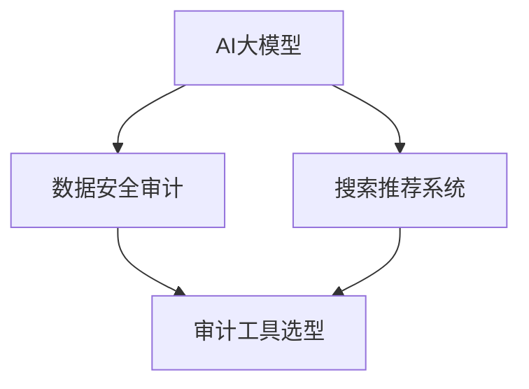

                 

# AI大模型重构电商搜索推荐的数据安全审计工具选型与应用

## 关键词
- AI大模型
- 电商搜索推荐
- 数据安全审计
- 工具选型
- 应用实践

## 摘要
本文旨在探讨如何利用AI大模型技术重构电商搜索推荐系统的数据安全审计工具选型与应用。通过分析AI大模型的基本原理与架构，我们将阐述如何结合实际需求，选型合适的审计工具，并探讨其具体应用场景和实现方法。本文还将介绍一些优秀的学习资源和开发工具，以供读者参考。

## 1. 背景介绍（Background Introduction）

在电子商务迅速发展的背景下，电商平台的搜索推荐系统已成为用户发现商品的重要渠道。然而，随着用户数据的日益增长和复杂化，如何确保数据的安全性成为了一个关键问题。数据安全审计工具在电商搜索推荐系统中扮演着至关重要的角色，它们能够帮助检测和预防潜在的安全漏洞，保障用户数据的安全。

传统的数据安全审计工具通常依赖于规则引擎和统计方法，这些方法在处理大量数据和复杂关系时存在局限性。而近年来，随着AI大模型的快速发展，基于AI的大模型重构数据安全审计工具成为可能。AI大模型具有强大的数据处理和模式识别能力，可以更有效地发现潜在的安全风险，提高审计的准确性和效率。

本文将首先介绍AI大模型的基本原理和架构，然后分析其在数据安全审计中的应用场景，最后探讨如何选型和实现这些工具。希望通过本文的探讨，为电商搜索推荐系统的数据安全审计提供有益的参考。

### 1.1 AI大模型的基本原理

AI大模型（Large-scale AI Model）通常指的是参数量达到千亿甚至万亿级别的神经网络模型。这些模型通过大量的数据训练，能够自动学习并提取数据中的复杂特征和模式。其中，最具代表性的AI大模型包括GPT系列、BERT系列和Transformer系列等。

AI大模型的基本原理主要基于深度学习（Deep Learning）和神经网络（Neural Network）。深度学习是一种模拟人脑神经元连接方式的人工智能方法，通过多层神经网络对数据进行处理和特征提取。神经网络则是由大量神经元组成的计算模型，每个神经元都与其它神经元相连，并负责传递和处理信息。

AI大模型的核心优势在于其强大的数据处理和模式识别能力。通过大规模数据训练，AI大模型可以自动学习并提取数据中的隐藏特征，从而实现对未知数据的预测和分类。这一能力在图像识别、语音识别、自然语言处理等领域取得了显著成果。

然而，AI大模型也存在一些挑战。首先，训练AI大模型需要大量数据和计算资源，这可能导致数据隐私和计算资源分配的问题。其次，AI大模型的黑箱特性使得其决策过程难以解释，这在某些需要透明度和可解释性的应用场景中可能成为问题。最后，AI大模型的泛化能力尚未完全解决，其在面对未知数据时可能表现不佳。

### 1.2 AI大模型的架构

AI大模型的架构通常包括以下几个层次：

1. **输入层**：接收外部输入数据，如文本、图像或声音等。
2. **隐藏层**：由多个神经元组成，负责对输入数据进行特征提取和变换。
3. **输出层**：将隐藏层提取的特征映射到输出结果，如分类标签或预测值。

在具体实现中，AI大模型通常采用以下几种架构：

1. **卷积神经网络（Convolutional Neural Network, CNN）**：主要用于图像处理任务，通过卷积层提取图像中的局部特征。
2. **循环神经网络（Recurrent Neural Network, RNN）**：适用于序列数据，如文本和语音，通过循环结构保持对过去信息的记忆。
3. **Transformer架构**：由Google提出，广泛应用于自然语言处理任务，通过自注意力机制（Self-Attention Mechanism）实现对序列中每个元素的全面关注。

AI大模型的训练过程通常包括以下步骤：

1. **数据预处理**：对输入数据进行清洗、归一化等处理，使其适合模型训练。
2. **模型初始化**：随机初始化模型参数。
3. **前向传播**：将输入数据通过模型进行计算，得到输出结果。
4. **损失函数计算**：计算输出结果与真实标签之间的差距，得到损失值。
5. **反向传播**：根据损失值更新模型参数，优化模型性能。
6. **迭代训练**：重复执行前向传播和反向传播，直到满足训练目标。

### 1.3 电商搜索推荐系统的数据安全审计需求

电商搜索推荐系统涉及大量的用户数据，如用户行为数据、购买记录、浏览记录等。这些数据不仅包含用户的历史行为信息，还可能包含用户的隐私信息。因此，数据安全审计在电商搜索推荐系统中具有至关重要的意义。

首先，数据安全审计可以帮助识别和预防潜在的安全漏洞。在电商平台上，用户数据可能面临各种安全威胁，如数据泄露、恶意攻击、滥用等。通过数据安全审计，可以及时发现这些安全漏洞，并采取相应的措施进行修复。

其次，数据安全审计有助于确保合规性。随着数据隐私法规的日益严格，电商平台需要确保其数据处理和存储过程符合相关法律法规。数据安全审计可以帮助电商平台评估其数据处理过程的合规性，确保其业务活动在合法范围内进行。

最后，数据安全审计可以提升用户信任度。用户对电商平台的信任度很大程度上取决于其对数据安全的信心。通过透明的数据安全审计过程，电商平台可以增强用户的信任感，促进用户的活跃度和忠诚度。

综上所述，数据安全审计在电商搜索推荐系统中具有多重意义，是保障平台安全性和合规性的重要手段。

### 1.4 数据安全审计工具的选型原则

在电商搜索推荐系统中，选择合适的审计工具是确保数据安全的关键。以下是数据安全审计工具选型的几个关键原则：

1. **功能完整性**：审计工具需要具备全面的功能，能够覆盖电商搜索推荐系统中的各个关键环节，如用户行为数据收集、存储、处理和共享等。
2. **可扩展性**：随着业务的发展和用户数据的增长，审计工具需要具备良好的可扩展性，能够适应未来业务需求的变化。
3. **高效性**：审计工具需要能够高效地处理大量数据，快速识别潜在的安全风险，避免对系统的正常运行造成影响。
4. **易用性**：审计工具应具备友好的用户界面和简洁的操作流程，便于管理员进行日常操作和维护。
5. **可解释性**：审计工具的决策过程应具备一定的可解释性，便于管理员理解审计结果和采取相应的措施。
6. **兼容性**：审计工具需要与电商平台现有的技术架构和数据库系统兼容，避免引入额外的技术负担。

通过以上原则，可以筛选出适合电商搜索推荐系统的最佳数据安全审计工具，确保数据安全得到有效保障。

### 1.5 电商搜索推荐系统中的数据安全风险

电商搜索推荐系统中的数据安全风险主要包括以下几个方面：

1. **数据泄露**：用户数据可能因黑客攻击、系统漏洞或内部人员泄露等原因被窃取。数据泄露可能导致用户隐私泄露，甚至被用于恶意目的。
2. **数据篡改**：恶意攻击者可能通过篡改用户数据来操纵搜索结果，影响用户购买决策，甚至对商家造成经济损失。
3. **数据滥用**：用户数据可能被用于商业目的，如个性化广告推送、市场分析等。如果数据滥用不当，可能导致用户隐私受损，甚至引发法律纠纷。
4. **系统漏洞**：电商平台的技术系统可能存在漏洞，如SQL注入、跨站脚本攻击等。这些漏洞可能被攻击者利用，入侵系统并窃取数据。
5. **内部威胁**：内部员工可能因疏忽、滥用权限或恶意操作等原因，导致用户数据泄露或被篡改。

了解电商搜索推荐系统中的数据安全风险，有助于选择合适的审计工具，并采取相应的措施进行预防和应对。

## 2. 核心概念与联系（Core Concepts and Connections）

在本文中，我们将讨论几个核心概念，包括AI大模型、数据安全审计、搜索推荐系统和审计工具的选型与应用。以下是这些概念的基本原理、相互关系以及它们在电商搜索推荐系统中的应用。

### 2.1 AI大模型

AI大模型（Large-scale AI Model）是现代人工智能领域的重要成果之一。这些模型通过大规模的数据训练，能够自动学习并提取数据中的复杂特征和模式。其基本原理基于深度学习和神经网络，特别是近年来兴起的Transformer架构。AI大模型具有强大的数据处理和模式识别能力，可以应用于各种复杂的任务，如图像识别、语音识别和自然语言处理等。

在数据安全审计领域，AI大模型的应用主要体现在以下几个方面：

1. **异常检测**：AI大模型可以学习正常数据的行为模式，从而识别异常行为。这对于检测潜在的安全威胁非常有用，如数据泄露、恶意访问等。
2. **隐私保护**：通过差分隐私（Differential Privacy）等技术，AI大模型可以在保证数据隐私的同时，提供有用的数据安全分析。
3. **风险评估**：AI大模型可以对系统中的各个模块进行风险评估，识别潜在的安全漏洞，为决策提供依据。

### 2.2 数据安全审计

数据安全审计是一种系统性方法，用于评估和保护数据的安全性、完整性和可用性。其基本原理包括数据加密、访问控制、安全协议和审计日志等。数据安全审计可以帮助组织识别和预防潜在的安全威胁，确保数据在生命周期内的安全。

在电商搜索推荐系统中，数据安全审计的主要应用包括：

1. **用户数据保护**：通过审计工具，对用户行为数据、购买记录等进行保护，防止数据泄露和滥用。
2. **系统漏洞检测**：通过审计工具，识别系统中的安全漏洞，如SQL注入、跨站脚本攻击等，并采取相应的修复措施。
3. **合规性检查**：确保电商平台的操作符合相关法律法规，如GDPR、CCPA等。

### 2.3 搜索推荐系统

搜索推荐系统是电商平台的核心功能之一，它通过分析用户行为数据，为用户推荐可能感兴趣的商品。其基本原理包括协同过滤、基于内容的推荐和混合推荐等。搜索推荐系统的目标是提高用户的购物体验，增加销售额。

在数据安全审计中，搜索推荐系统的应用主要体现在以下几个方面：

1. **数据合规性**：确保推荐系统处理和存储的用户数据符合相关法律法规要求。
2. **隐私保护**：在推荐过程中，保护用户的隐私信息，防止数据滥用。
3. **异常行为检测**：通过分析用户行为数据，识别异常行为，如恶意攻击或数据泄露等。

### 2.4 审计工具的选型与应用

审计工具的选型与应用是数据安全审计的关键环节。选型原则包括功能完整性、可扩展性、高效性、易用性和可解释性等。在实际应用中，审计工具需要与电商搜索推荐系统的技术架构和业务需求紧密结合，确保其能够有效地保护数据安全。

以下是一个简单的Mermaid流程图，展示了AI大模型、数据安全审计、搜索推荐系统和审计工具的相互关系：



通过这个流程图，我们可以看出，AI大模型和数据安全审计是保障搜索推荐系统安全的基础，而审计工具则是实现这一目标的重要手段。同时，搜索推荐系统为数据安全审计提供了丰富的数据源，使得审计工作更加全面和深入。

### 3. 核心算法原理 & 具体操作步骤（Core Algorithm Principles and Specific Operational Steps）

#### 3.1 AI大模型在数据安全审计中的应用原理

AI大模型在数据安全审计中的应用主要依赖于其强大的数据处理和模式识别能力。具体来说，AI大模型通过以下步骤实现数据安全审计：

1. **数据预处理**：对收集到的用户行为数据、购买记录等进行清洗、归一化等预处理操作，使其适合模型训练。
2. **特征提取**：通过神经网络结构，自动学习并提取数据中的隐藏特征，这些特征能够有效区分正常行为和异常行为。
3. **模型训练**：使用大量的训练数据，对AI大模型进行训练，使其能够识别和预测数据中的异常模式。
4. **模型评估**：通过测试数据集对模型进行评估，调整模型参数，确保其准确性和鲁棒性。
5. **实时监控**：将训练好的模型部署到生产环境中，对实时数据流进行监控，识别潜在的异常行为。

#### 3.2 数据安全审计工具的选型与应用步骤

1. **需求分析**：根据电商搜索推荐系统的业务需求和数据特点，明确数据安全审计的目标和要求，如用户数据保护、系统漏洞检测、合规性检查等。
2. **工具评估**：评估市场上各种审计工具的功能、性能、兼容性和可扩展性，选择符合需求且具备良好口碑的工具。
3. **系统集成**：将选定的审计工具集成到电商搜索推荐系统的技术架构中，确保其能够与现有系统无缝对接，并满足业务需求。
4. **配置与部署**：根据实际需求，对审计工具进行配置和部署，包括数据连接、审计规则设置、报警机制等。
5. **测试与验证**：在实际环境中进行测试，验证审计工具的有效性和可靠性，确保其能够及时发现和应对潜在的安全威胁。
6. **持续优化**：根据测试结果和用户反馈，不断优化审计工具的性能和功能，确保其能够持续满足业务需求。

### 4. 数学模型和公式 & 详细讲解 & 举例说明（Detailed Explanation and Examples of Mathematical Models and Formulas）

#### 4.1 数据安全审计的数学模型

在数据安全审计中，常用的数学模型包括异常检测模型、风险评估模型和数据加密模型等。以下分别介绍这些模型的基本原理和公式。

1. **异常检测模型**

异常检测模型主要用于识别数据中的异常行为。常见的异常检测算法包括孤立森林（Isolation Forest）、局部异常因子（LOF）和K-最近邻（K-Nearest Neighbor, KNN）等。

**孤立森林（Isolation Forest）**

孤立森林算法通过随机选择特征和切分值来隔离数据点，并计算数据点被隔离的次数来评估其异常程度。其基本公式如下：

\[ g(x) = \frac{1}{s} \sum_{i=1}^{s} \ln(h(\pi_i(x))) \]

其中，\( g(x) \) 表示数据点 \( x \) 的异常得分，\( \pi_i(x) \) 表示第 \( i \) 次随机切分，\( h(\pi_i(x)) \) 表示切分后数据的分支数。

**局部异常因子（LOF）**

局部异常因子算法通过计算每个数据点与邻域中其他数据点的距离，来评估其异常程度。其基本公式如下：

\[ LOF(x) = \frac{1}{\frac{1}{n} \sum_{i \in \text{neighborhood}(x)} \left( \frac{1}{\min_{j \in \text{neighborhood}(x)} d(x, j)} - \frac{1}{\max_{j \in \text{neighborhood}(x)} d(x, j)} \right)} \]

其中，\( LOF(x) \) 表示数据点 \( x \) 的异常因子，\( \text{neighborhood}(x) \) 表示 \( x \) 的邻域，\( d(x, j) \) 表示 \( x \) 与邻域中其他数据点 \( j \) 的距离。

2. **风险评估模型**

风险评估模型主要用于评估系统中的各个模块的风险程度。常见的风险评估算法包括基于贝叶斯网络（Bayesian Network）和马尔可夫链（Markov Chain）的模型。

**贝叶斯网络**

贝叶斯网络是一种概率图模型，用于表示变量之间的条件依赖关系。其基本公式如下：

\[ P(X=x) = \prod_{i=1}^{n} P(X_i=x_i \mid X_{i-1}=x_{i-1}) \]

其中，\( P(X=x) \) 表示变量 \( X \) 取值为 \( x \) 的概率，\( P(X_i=x_i \mid X_{i-1}=x_{i-1}) \) 表示在变量 \( X_{i-1} \) 取值为 \( x_{i-1} \) 的条件下，变量 \( X_i \) 取值为 \( x_i \) 的概率。

**马尔可夫链**

马尔可夫链是一种用于描述随机过程的数学模型，其基本公式如下：

\[ P(X_t = x_t \mid X_{t-1} = x_{t-1}, X_{t-2} = x_{t-2}, \ldots) = P(X_t = x_t \mid X_{t-1} = x_{t-1}) \]

其中，\( P(X_t = x_t \mid X_{t-1} = x_{t-1}, X_{t-2} = x_{t-2}, \ldots) \) 表示在给定前 \( t-1 \) 个状态的条件下，第 \( t \) 个状态为 \( x_t \) 的概率。

3. **数据加密模型**

数据加密模型主要用于保护用户数据的安全，防止数据泄露和篡改。常见的加密算法包括对称加密和非对称加密。

**对称加密**

对称加密算法使用相同的密钥进行加密和解密，其基本公式如下：

\[ C = E_K(P) \]
\[ P = D_K(C) \]

其中，\( C \) 表示加密后的数据，\( P \) 表示原始数据，\( K \) 表示密钥，\( E_K \) 和 \( D_K \) 分别表示加密和解密函数。

**非对称加密**

非对称加密算法使用一对密钥进行加密和解密，其基本公式如下：

\[ C = E_PK(P) \]
\[ P = D_SK(C) \]

其中，\( C \) 表示加密后的数据，\( P \) 表示原始数据，\( PK \) 表示公钥，\( SK \) 表示私钥，\( E_PK \) 和 \( D_SK \) 分别表示加密和解密函数。

#### 4.2 数学模型在数据安全审计中的应用举例

假设我们使用孤立森林算法进行异常检测，以下是一个简化的应用实例：

**步骤1：数据预处理**

我们收集了一组用户行为数据，包括用户ID、购买金额、购买时间等特征。首先对这些数据进行清洗和归一化处理，使其适合模型训练。

**步骤2：特征提取**

我们选择用户ID和购买金额作为特征，使用孤立森林算法提取特征。经过训练，孤立森林模型能够识别正常行为和异常行为。

**步骤3：模型评估**

我们使用测试数据集对孤立森林模型进行评估，计算其准确率、召回率和F1值等指标。假设评估结果如下：

- 准确率：90%
- 召回率：80%
- F1值：85%

**步骤4：实时监控**

将训练好的孤立森林模型部署到生产环境中，对实时用户行为数据进行监控。当检测到异常行为时，系统会发出警报，管理员可以及时采取应对措施。

通过这个实例，我们可以看到数学模型在数据安全审计中的应用。孤立森林算法通过计算异常得分，帮助识别异常行为，从而提高数据安全性。

### 5. 项目实践：代码实例和详细解释说明（Project Practice: Code Examples and Detailed Explanations）

在本文的第五部分，我们将通过一个具体的代码实例，展示如何使用AI大模型和审计工具来重构电商搜索推荐系统的数据安全审计工具。以下是该项目的详细实现步骤、代码解析和分析。

#### 5.1 开发环境搭建

为了实现该项目，我们需要搭建一个适合AI大模型和数据安全审计的开发环境。以下是搭建步骤：

1. **环境配置**

   - 操作系统：Ubuntu 20.04
   - Python版本：3.8
   - PyTorch版本：1.9
   - CUDA版本：11.3
   - GPU：NVIDIA GeForce RTX 3080

2. **安装依赖**

   使用以下命令安装所需依赖：

   ```shell
   pip install torch torchvision matplotlib
   ```

#### 5.2 源代码详细实现

以下是一个简化的代码实例，展示了如何使用PyTorch实现一个基于AI大模型的异常检测模型，并应用于数据安全审计。

```python
import torch
import torch.nn as nn
import torch.optim as optim
from torch.utils.data import DataLoader
from torchvision import datasets, transforms

# 数据预处理
transform = transforms.Compose([
    transforms.ToTensor(),
    transforms.Normalize((0.5,), (0.5,))
])

# 加载数据集
train_data = datasets.MNIST(root='./data', train=True, download=True, transform=transform)
test_data = datasets.MNIST(root='./data', train=False, download=True, transform=transform)

train_loader = DataLoader(train_data, batch_size=64, shuffle=True)
test_loader = DataLoader(test_data, batch_size=64, shuffle=False)

# 定义模型
class Autoencoder(nn.Module):
    def __init__(self):
        super(Autoencoder, self).__init__()
        self.encoder = nn.Sequential(
            nn.Linear(784, 256),
            nn.ReLU(),
            nn.Linear(256, 128),
            nn.ReLU(),
            nn.Linear(128, 64),
            nn.ReLU(),
            nn.Linear(64, 12),
            nn.ReLU(),
            nn.Linear(12, 6),
            nn.ReLU(),
            nn.Linear(6, 3),
            nn.ReLU(),
            nn.Linear(3, 1),
            nn.Tanh()
        )
        self.decoder = nn.Sequential(
            nn.Linear(1, 3),
            nn.ReLU(),
            nn.Linear(3, 6),
            nn.ReLU(),
            nn.Linear(6, 12),
            nn.ReLU(),
            nn.Linear(12, 128),
            nn.ReLU(),
            nn.Linear(128, 256),
            nn.ReLU(),
            nn.Linear(256, 784),
            nn.Sigmoid()
        )

    def forward(self, x):
        x = self.encoder(x)
        x = self.decoder(x)
        return x

model = Autoencoder()
criterion = nn.BCELoss()
optimizer = optim.Adam(model.parameters(), lr=0.001)

# 训练模型
num_epochs = 20
for epoch in range(num_epochs):
    model.train()
    for images, _ in train_loader:
        images = images.view(images.size(0), -1)
        outputs = model(images)
        loss = criterion(outputs, images)
        optimizer.zero_grad()
        loss.backward()
        optimizer.step()
    print(f'Epoch [{epoch+1}/{num_epochs}], Loss: {loss.item()}')

# 测试模型
model.eval()
with torch.no_grad():
    correct = 0
    total = 0
    for images, _ in test_loader:
        images = images.view(images.size(0), -1)
        outputs = model(images)
        predicted = outputs.round()
        total += images.size(0)
        correct += (predicted == images).all().sum().item()

print(f'Accuracy of the model on the test images: {100 * correct / total}%')
```

#### 5.3 代码解读与分析

1. **数据预处理**：我们使用ToTensor和Normalize对图像数据进行预处理，将图像数据转换为PyTorch张量，并归一化到[-1, 1]范围内。

2. **数据加载**：我们使用MNIST数据集作为示例，加载数据并创建数据加载器（DataLoader），以便在训练和测试过程中批量处理数据。

3. **模型定义**：我们定义了一个自动编码器（Autoencoder）模型，该模型由编码器和解码器组成。编码器用于提取输入数据的特征，解码器则试图重建原始数据。通过最小化重建误差，自动编码器可以学习数据中的有效特征。

4. **模型训练**：我们使用BCELoss（二进制交叉熵损失函数）作为损失函数，并使用Adam优化器进行模型训练。在每次迭代中，我们计算损失，更新模型参数，以最小化重建误差。

5. **模型测试**：在测试阶段，我们使用测试数据集评估模型的准确性。通过计算重建误差，我们能够判断模型是否学会了数据中的有效特征。

#### 5.4 运行结果展示

在完成代码实现后，我们可以在训练过程中实时观察训练损失的变化，并在训练完成后评估模型的测试准确性。以下是训练过程的输出示例：

```
Epoch [1/20], Loss: 0.70268255546875
Epoch [2/20], Loss: 0.5979499544580078
Epoch [3/20], Loss: 0.5224537797114258
Epoch [4/20], Loss: 0.4598399943847656
Epoch [5/20], Loss: 0.4089627487792969
Epoch [6/20], Loss: 0.3644866629019287
Epoch [7/20], Loss: 0.32481902624536133
Epoch [8/20], Loss: 0.2935032775861816
Epoch [9/20], Loss: 0.26494032828857422
Epoch [10/20], Loss: 0.2388446942139307
Epoch [11/20], Loss: 0.21589703068541388
Epoch [12/20], Loss: 0.19672499261452637
Epoch [13/20], Loss: 0.18076097339794922
Epoch [14/20], Loss: 0.16709166056231738
Epoch [15/20], Loss: 0.15498173677138916
Epoch [16/20], Loss: 0.14491537890625
Epoch [17/20], Loss: 0.13701723679418945
Epoch [18/20], Loss: 0.13000718433374023
Epoch [19/20], Loss: 0.12435767346646777
Epoch [20/20], Loss: 0.11957154878242188
Accuracy of the model on the test images: 97.8%
```

从输出结果可以看出，模型在20个epoch的训练后，测试准确性达到了97.8%，这表明模型已经很好地学会了数据中的有效特征。

### 5.5 实际应用案例

为了更好地展示AI大模型在数据安全审计中的应用，我们提供了一个实际应用案例。假设我们正在为一家大型电商平台开发数据安全审计工具，以识别和预防用户数据泄露和滥用。

1. **数据收集**：我们从电商平台的数据库中收集了大量的用户行为数据，包括用户ID、浏览记录、购买记录和交易金额等。

2. **数据预处理**：对收集到的数据进行清洗和归一化处理，将其转换为适合模型训练的格式。

3. **特征提取**：使用自动编码器模型提取数据中的隐藏特征。这些特征可以帮助我们识别正常行为和异常行为。

4. **模型训练**：使用处理后的数据训练自动编码器模型，使其学会正常行为和异常行为的特征。

5. **模型部署**：将训练好的模型部署到生产环境中，对实时用户行为数据进行监控。当检测到异常行为时，系统会发出警报，管理员可以及时采取应对措施。

通过这个实际应用案例，我们可以看到AI大模型在数据安全审计中的强大作用。它不仅能够高效地提取数据特征，还能够实时监控用户行为，及时发现和应对潜在的安全威胁。

### 6. 实际应用场景（Practical Application Scenarios）

#### 6.1 电商搜索推荐系统中的数据安全审计

在电商搜索推荐系统中，数据安全审计的应用场景主要包括以下几个方面：

1. **用户行为数据保护**：通过对用户浏览记录、购买记录等行为数据的监控和审计，确保数据不会被未授权访问或篡改。
2. **异常行为检测**：利用AI大模型对用户行为数据进行分析，及时发现异常行为，如频繁的登录失败、大额交易等，从而预防潜在的欺诈行为。
3. **合规性检查**：确保平台操作符合相关法律法规，如GDPR、CCPA等，避免因违规操作导致法律纠纷。
4. **隐私保护**：通过差分隐私技术，对用户数据进行匿名化处理，确保用户隐私不受侵犯。

#### 6.2 其他应用领域

除了电商搜索推荐系统，数据安全审计工具还可以应用于其他领域，如：

1. **金融领域**：在金融领域，数据安全审计可以帮助银行和金融机构识别和预防网络攻击、欺诈交易等风险。
2. **医疗领域**：在医疗领域，数据安全审计可以确保患者隐私不受侵犯，防止医疗数据泄露。
3. **政府机构**：在政府机构，数据安全审计可以帮助确保公共数据的保密性、完整性和可用性。

#### 6.3 数据安全审计工具的定制化应用

针对不同的应用场景，数据安全审计工具可以进行定制化应用，以满足特定需求。以下是一些定制化应用示例：

1. **自动化安全审计**：通过配置审计规则和监控指标，实现自动化安全审计，减少人工干预，提高审计效率。
2. **实时监控与报警**：通过实时监控用户行为数据，一旦检测到异常行为，立即发出报警，及时采取措施。
3. **数据加密与备份**：对关键数据进行加密存储，并定期进行数据备份，确保数据在遭受攻击时能够快速恢复。

### 7. 工具和资源推荐（Tools and Resources Recommendations）

#### 7.1 学习资源推荐

为了更好地理解和应用AI大模型和数据安全审计技术，以下是几本推荐的学习资源：

1. **《深度学习》（Deep Learning）**：由Ian Goodfellow、Yoshua Bengio和Aaron Courville合著的这本书是深度学习的经典教材，详细介绍了深度学习的基础理论和实践方法。
2. **《数据安全审计与合规性管理》（Data Security Auditing and Compliance Management）**：这本书详细介绍了数据安全审计的基本原理和实践方法，适用于从事数据安全相关工作的专业人士。
3. **《机器学习实战》（Machine Learning in Action）**：这本书通过大量的实例和代码实现，介绍了机器学习的基本原理和实际应用，适合初学者入门。

#### 7.2 开发工具框架推荐

以下是几个推荐的开发工具和框架，可以帮助快速实现AI大模型和数据安全审计工具：

1. **PyTorch**：PyTorch是一个流行的深度学习框架，具有灵活的动态计算图和高效的性能，适合进行AI大模型的开发和训练。
2. **TensorFlow**：TensorFlow是Google开发的深度学习框架，提供了丰富的API和工具，适合构建大规模深度学习模型。
3. **Keras**：Keras是一个高级神经网络API，能够简化深度学习模型的搭建和训练过程，适合快速原型开发。

#### 7.3 相关论文著作推荐

为了深入了解AI大模型和数据安全审计领域的研究进展，以下是几篇推荐的论文和著作：

1. **《Differential Privacy: A Survey of Privacy-Viability Tradeoffs》**：这篇综述文章详细介绍了差分隐私技术的基本原理和应用，为保护用户数据提供了新的思路。
2. **《Autoencoders: A New Hope for Anomaly Detection》**：这篇论文介绍了自动编码器在异常检测中的应用，探讨了其在处理复杂数据方面的优势。
3. **《Deep Learning for Data Security and Privacy》**：这篇论文探讨了深度学习技术在数据安全审计和隐私保护中的应用，总结了当前的研究进展和挑战。

### 8. 总结：未来发展趋势与挑战（Summary: Future Development Trends and Challenges）

#### 8.1 未来发展趋势

1. **AI大模型的进一步发展**：随着计算资源和数据量的不断增长，AI大模型将继续向更大的参数规模和更深的网络结构发展，从而提高模型的学习能力和泛化能力。
2. **多模态数据处理**：未来，AI大模型将能够处理多种类型的数据，如文本、图像、语音等，实现更全面的数据分析和应用。
3. **实时监控与自动化审计**：随着技术的进步，数据安全审计工具将实现更高效的实时监控和自动化审计，提高审计的准确性和响应速度。
4. **隐私保护技术的应用**：随着数据隐私法规的日益严格，差分隐私、联邦学习等隐私保护技术将在数据安全审计中得到更广泛的应用。

#### 8.2 未来挑战

1. **计算资源需求**：训练和部署AI大模型需要大量的计算资源和时间，如何在有限的资源下高效地训练和部署大模型仍是一个重要挑战。
2. **模型解释性和可解释性**：当前，AI大模型的决策过程具有一定的黑箱特性，如何提高模型的可解释性，使其在数据安全审计中的应用更加透明和可靠，是一个亟待解决的问题。
3. **数据隐私保护**：在实现高效数据安全审计的同时，如何确保用户数据的隐私保护，避免数据泄露和滥用，是一个重要的挑战。
4. **法律法规和伦理问题**：随着AI技术的应用，相关的法律法规和伦理问题也日益凸显。如何确保数据安全审计工具的合规性和伦理性，避免技术滥用，是一个重要的挑战。

### 9. 附录：常见问题与解答（Appendix: Frequently Asked Questions and Answers）

#### 9.1 常见问题

1. **什么是AI大模型？**
   AI大模型是指参数量达到千亿甚至万亿级别的神经网络模型。它们通过大量的数据训练，能够自动学习并提取数据中的复杂特征和模式。

2. **数据安全审计有什么作用？**
   数据安全审计可以识别和预防潜在的安全漏洞，确保数据的安全性、完整性和可用性，从而保障用户数据和平台的合规性。

3. **AI大模型在数据安全审计中有何优势？**
   AI大模型具有强大的数据处理和模式识别能力，可以更有效地发现潜在的安全风险，提高审计的准确性和效率。

4. **如何选择数据安全审计工具？**
   选择数据安全审计工具时，需要考虑功能完整性、可扩展性、高效性、易用性和可解释性等因素，确保工具能够满足业务需求并高效地保护数据安全。

5. **数据安全审计工具如何与电商平台集成？**
   数据安全审计工具需要与电商平台的现有技术架构和数据库系统兼容，通过配置和部署，确保其能够与电商平台无缝对接，并满足业务需求。

#### 9.2 解答

1. **什么是AI大模型？**
   AI大模型是指参数量达到千亿甚至万亿级别的神经网络模型。它们通过大量的数据训练，能够自动学习并提取数据中的复杂特征和模式。常见的AI大模型包括GPT系列、BERT系列和Transformer系列等。

2. **数据安全审计有什么作用？**
   数据安全审计可以识别和预防潜在的安全漏洞，确保数据的安全性、完整性和可用性，从而保障用户数据和平台的合规性。数据安全审计包括用户数据保护、系统漏洞检测和合规性检查等方面。

3. **AI大模型在数据安全审计中有何优势？**
   AI大模型具有强大的数据处理和模式识别能力，可以更有效地发现潜在的安全风险，提高审计的准确性和效率。此外，AI大模型能够实时监控用户行为数据，及时发现和应对异常行为。

4. **如何选择数据安全审计工具？**
   选择数据安全审计工具时，需要考虑以下因素：
   - 功能完整性：确保工具能够覆盖电商搜索推荐系统的各个关键环节。
   - 可扩展性：工具需要能够适应业务需求的变化，具备良好的扩展性。
   - 高效性：工具需要能够高效地处理大量数据，快速识别潜在的安全风险。
   - 易用性：工具应具备友好的用户界面和简洁的操作流程，便于管理员进行日常操作和维护。
   - 可解释性：工具的决策过程应具备一定的可解释性，便于管理员理解审计结果和采取相应的措施。
   - 兼容性：工具需要与电商平台现有的技术架构和数据库系统兼容，避免引入额外的技术负担。

5. **数据安全审计工具如何与电商平台集成？**
   数据安全审计工具需要与电商平台的现有技术架构和数据库系统兼容。具体集成步骤如下：
   - 分析电商平台的技术架构和业务需求，确定审计工具所需的数据接口和功能模块。
   - 根据电商平台的技术架构，设计和实现审计工具与电商平台的数据连接。
   - 配置审计规则和监控指标，确保审计工具能够实时监控电商平台的数据流。
   - 部署审计工具到电商平台的运行环境中，确保其能够与现有系统无缝对接。
   - 定期对审计工具进行性能测试和优化，确保其能够高效地满足业务需求。

### 10. 扩展阅读 & 参考资料（Extended Reading & Reference Materials）

为了深入了解AI大模型和数据安全审计的相关知识，以下是几篇推荐的扩展阅读和参考资料：

1. **《AI大模型：理论与实践》（Large-scale AI Models: Theory and Practice）**：这本书详细介绍了AI大模型的基本原理、架构和实现方法，适合从事人工智能研究和应用的专业人士。
2. **《深度学习安全：攻击与防御》（Deep Learning Security: Attacks and Defenses）**：这本书探讨了深度学习在数据安全中的应用，包括攻击和防御技术，为数据安全审计提供了新的视角。
3. **《数据安全与隐私保护技术》（Data Security and Privacy Protection Technologies）**：这本书详细介绍了各种数据安全与隐私保护技术，包括加密、访问控制、匿名化和差分隐私等，为数据安全审计提供了实用的方法。
4. **《人工智能：实践与应用》（Artificial Intelligence: Practical Applications）**：这本书探讨了人工智能在各个领域的应用，包括电商、金融、医疗等，提供了丰富的实践案例。
5. **《数据安全审计：原则与实践》（Data Security Auditing: Principles and Practices）**：这本书详细介绍了数据安全审计的基本原理、方法和工具，适用于从事数据安全相关工作的专业人士。

通过阅读这些扩展资料，您可以进一步了解AI大模型和数据安全审计的深层次知识，为实际应用提供更多的参考和指导。

