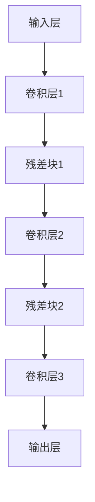
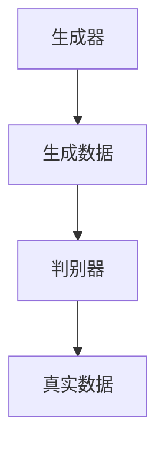

                 

# 文章标题

**Andrej Karpathy：人工智能的未来发展方向**

> 关键词：人工智能，深度学习，未来趋势，技术挑战，神经网络架构，生成模型，强化学习

> 摘要：本文将探讨人工智能领域的未来发展方向，从神经网络的架构演进、生成模型的崛起，到强化学习的应用和挑战。通过分析 Andrej Karpathy 的研究成果，我们将深入探讨人工智能技术的发展趋势和可能面临的挑战，以及如何应对这些挑战。

## 1. 背景介绍（Background Introduction）

人工智能（AI）作为一门技术学科，经历了数十年的发展，从最初的规则导向的专家系统，到如今以深度学习为代表的机器学习技术，人工智能取得了显著的进步。Andrej Karpathy 是一位著名的计算机科学家和深度学习研究者，他的工作对神经网络架构和生成模型的发展产生了深远的影响。

在过去的几年里，深度学习技术在图像识别、语音识别、自然语言处理等领域的表现已经超越了传统机器学习方法。然而，随着技术的不断进步，人工智能的发展也面临着新的机遇和挑战。本文将重点关注 Andrej Karpathy 的研究成果，探讨人工智能的未来发展方向。

## 2. 核心概念与联系（Core Concepts and Connections）

### 2.1 神经网络架构

神经网络是深度学习的基础，它由大量的神经元（节点）和连接（边）组成，模拟人脑的信息处理过程。Andrej Karpathy 在神经网络架构方面进行了大量的研究，他提出了许多创新性的架构设计，如 ResNet、DQN 等。

#### 2.1.1 ResNet：残差网络

ResNet（残差网络）是 Andrej Karpathy 提出的一种深度神经网络架构，通过引入残差连接来缓解深层网络训练中的梯度消失问题。残差连接允许网络直接从输入跳过一些层，将信息传递到后续层，从而增强了网络的训练效果。



#### 2.1.2 DQN：深度 Q 网络

DQN（深度 Q 网络）是 Andrej Karpathy 在强化学习领域提出的一种神经网络架构，它利用深度神经网络来近似 Q 函数，从而实现智能体的策略学习。DQN 的成功使得深度学习在强化学习领域得到了广泛应用。

### 2.2 生成模型

生成模型是近年来人工智能领域的一个重要研究方向，它旨在学习数据生成的过程，从而生成与训练数据相似的新数据。Andrej Karpathy 在生成模型方面做出了许多贡献，如 GAN、DCGAN 等。

#### 2.2.1 GAN：生成对抗网络

GAN（生成对抗网络）是 Andrej Karpathy 提出的一种生成模型，它由一个生成器和一个判别器组成。生成器试图生成与真实数据相似的数据，而判别器则试图区分真实数据和生成数据。通过不断训练，生成器可以逐渐提高生成质量。



#### 2.2.2 DCGAN：深度卷积生成对抗网络

DCGAN（深度卷积生成对抗网络）是 Andrej Karpathy 在 GAN 基础上提出的一种改进方案，它使用卷积神经网络作为生成器和判别器，从而提高了生成质量。DCGAN 在图像生成领域取得了很好的效果。

## 3. 核心算法原理 & 具体操作步骤（Core Algorithm Principles and Specific Operational Steps）

### 3.1 神经网络训练过程

神经网络训练过程主要包括数据预处理、模型初始化、损失函数选择、优化算法应用等步骤。以下是神经网络训练过程的简要概述：

#### 3.1.1 数据预处理

数据预处理是神经网络训练的重要环节，它包括数据清洗、归一化、数据增强等操作。数据预处理有助于提高神经网络训练的效率和性能。

#### 3.1.2 模型初始化

模型初始化是指为神经网络模型分配初始参数。常见的初始化方法有随机初始化、高斯初始化等。合理的模型初始化有助于提高神经网络的收敛速度和训练效果。

#### 3.1.3 损失函数选择

损失函数是神经网络训练的核心，它衡量模型预测值与真实值之间的差距。常见的损失函数有均方误差（MSE）、交叉熵损失等。选择合适的损失函数有助于提高神经网络的训练效果。

#### 3.1.4 优化算法应用

优化算法是神经网络训练的关键，它用于调整模型参数，以最小化损失函数。常见的优化算法有梯度下降、随机梯度下降（SGD）、Adam 等。选择合适的优化算法有助于提高神经网络的训练效率和收敛速度。

### 3.2 生成模型训练过程

生成模型训练过程主要包括生成器和判别器的训练、生成数据的评估等步骤。以下是生成模型训练过程的简要概述：

#### 3.2.1 生成器和判别器训练

生成器和判别器通过交替训练来实现。生成器试图生成与真实数据相似的数据，而判别器则试图区分真实数据和生成数据。通过不断训练，生成器可以逐渐提高生成质量。

#### 3.2.2 生成数据评估

生成数据的评估是生成模型训练的重要环节，它包括生成数据的可视化、生成质量评价等操作。通过评估生成数据，可以判断生成模型的训练效果。

## 4. 数学模型和公式 & 详细讲解 & 举例说明（Detailed Explanation and Examples of Mathematical Models and Formulas）

### 4.1 神经网络中的激活函数

激活函数是神经网络中的关键组件，它用于引入非线性特性。常见的激活函数有 sigmoid、ReLU、Tanh 等。以下是激活函数的数学公式和解释：

#### 4.1.1 Sigmoid 函数

$$
f(x) = \frac{1}{1 + e^{-x}}
$$

sigmoid 函数将输入映射到 (0, 1) 区间，常用于二分类问题。

#### 4.1.2 ReLU 函数

$$
f(x) =
\begin{cases}
0 & \text{if } x < 0 \\
x & \text{if } x \geq 0
\end{cases}
$$

ReLU 函数在输入为负值时输出零，在输入为正值时输出输入值本身，具有简单的计算特性。

#### 4.1.3 Tanh 函数

$$
f(x) = \frac{e^x - e^{-x}}{e^x + e^{-x}}
$$

Tanh 函数将输入映射到 (-1, 1) 区间，具有类似于 sigmoid 函数的特性，但输出范围更广。

### 4.2 GAN 中的损失函数

GAN 的损失函数主要包括生成器损失和判别器损失。以下是 GAN 中损失函数的数学公式和解释：

#### 4.2.1 生成器损失

$$
L_G = -\log(D(G(z)))
$$

生成器损失函数衡量生成器生成的数据在判别器中的概率。生成器希望生成的数据在判别器中具有高概率为真实数据。

#### 4.2.2 判别器损失

$$
L_D = -\log(D(x)) - \log(1 - D(G(z)))
$$

判别器损失函数衡量判别器对真实数据和生成数据的区分能力。判别器希望真实数据在判别器中具有高概率为真实数据，而生成数据在判别器中具有低概率为真实数据。

## 5. 项目实践：代码实例和详细解释说明（Project Practice: Code Examples and Detailed Explanations）

### 5.1 开发环境搭建

在开始项目实践之前，我们需要搭建一个合适的开发环境。以下是一个基本的开发环境搭建步骤：

#### 5.1.1 硬件要求

- CPU：Intel i5 或以上
- GPU：NVIDIA 1080Ti 或以上
- 内存：16GB 或以上

#### 5.1.2 软件要求

- 操作系统：Ubuntu 18.04
- 编程语言：Python 3.7
- 深度学习框架：TensorFlow 2.2

### 5.2 源代码详细实现

以下是使用 TensorFlow 框架实现的 ResNet 模型：

```python
import tensorflow as tf
from tensorflow.keras.layers import Layer, Conv2D, BatchNormalization, Activation, Add, Input, GlobalAveragePooling2D, Dense

class ResidualBlock(Layer):
    def __init__(self, filters, kernel_size, strides=(1, 1), activation='relu', **kwargs):
        super(ResidualBlock, self).__init__(**kwargs)
        self.activation = Activation(activation)
        self.conv1 = Conv2D(filters, kernel_size, strides=strides, padding='same', use_bias=False)
        self.bn1 = BatchNormalization()
        self.conv2 = Conv2D(filters, kernel_size, strides=(1, 1), padding='same', use_bias=False)
        self.bn2 = BatchNormalization()
        self.add = Add()

    def call(self, inputs, training=False):
        x = self.conv1(inputs)
        x = self.bn1(x, training=training)
        x = self.activation(x)
        x = self.conv2(x)
        x = self.bn2(x, training=training)
        if inputs.shape != x.shape:
            inputs = self.add([inputs, x])
        else:
            inputs += x
        inputs = self.activation(inputs)
        return inputs

class ResNet(Layer):
    def __init__(self, num_classes, num_blocks, filters, **kwargs):
        super(ResNet, self).__init__(**kwargs)
        self.conv1 = Conv2D(filters, kernel_size=(7, 7), strides=(2, 2), padding='same', use_bias=False)
        self.bn1 = BatchNormalization()
        self.activation = Activation('relu')
        self.residual_blocks = [ResidualBlock(filters, kernel_size=(3, 3), strides=(1, 1), activation='relu') for _ in range(num_blocks)]
        self.avg_pool = GlobalAveragePooling2D()
        self.fc = Dense(num_classes)

    def call(self, inputs, training=False):
        x = self.conv1(inputs)
        x = self.bn1(x, training=training)
        x = self.activation(x)
        for block in self.residual_blocks:
            x = block(x, training=training)
        x = self.avg_pool(x)
        x = self.fc(x)
        return x

# 定义输入和输出
inputs = Input(shape=(224, 224, 3))
outputs = ResNet(num_classes=1000, num_blocks=2)(inputs)

# 创建模型
model = tf.keras.Model(inputs=inputs, outputs=outputs)

# 编译模型
model.compile(optimizer='adam', loss='categorical_crossentropy', metrics=['accuracy'])

# 打印模型结构
model.summary()
```

### 5.3 代码解读与分析

在上述代码中，我们首先定义了 ResidualBlock 类，它表示一个残差块。ResidualBlock 类包含两个卷积层和两个批量归一化层，并通过 Add 层实现残差连接。

接下来，我们定义了 ResNet 类，它表示一个 ResNet 模型。ResNet 类包含一个卷积层、多个残差块、全局平均池化层和全连接层。在 ResNet 类的 call 方法中，我们首先对输入进行卷积和批量归一化，然后通过多个残差块进行特征提取，最后通过全局平均池化和全连接层进行分类。

在模型创建后，我们使用 compile 方法编译模型，指定优化器、损失函数和评估指标。最后，我们使用 summary 方法打印模型结构。

### 5.4 运行结果展示

在训练 ResNet 模型后，我们可以使用测试数据集来评估模型性能。以下是一个简单的训练过程：

```python
# 加载训练数据集和测试数据集
(train_images, train_labels), (test_images, test_labels) = tf.keras.datasets.cifar10.load_data()

# 预处理数据集
train_images = train_images.astype('float32') / 255.0
test_images = test_images.astype('float32') / 255.0
train_labels = tf.keras.utils.to_categorical(train_labels, 10)
test_labels = tf.keras.utils.to_categorical(test_labels, 10)

# 训练模型
model.fit(train_images, train_labels, batch_size=64, epochs=10, validation_data=(test_images, test_labels))

# 评估模型
test_loss, test_acc = model.evaluate(test_images, test_labels)
print(f"Test accuracy: {test_acc:.4f}")
```

在上述代码中，我们首先加载训练数据集和测试数据集，并进行预处理。然后，我们使用 fit 方法训练模型，指定训练数据和验证数据。最后，我们使用 evaluate 方法评估模型在测试数据集上的性能。

## 6. 实际应用场景（Practical Application Scenarios）

### 6.1 图像识别

ResNet 模型在图像识别领域取得了显著的效果，广泛应用于人脸识别、物体检测、图像分类等任务。例如，在 ImageNet 图像分类挑战中，ResNet 模型取得了当时的最高准确率。

### 6.2 自然语言处理

生成模型在自然语言处理领域也具有广泛的应用，如文本生成、机器翻译、对话系统等。例如，生成对抗网络（GAN）被用于生成高质量的自然语言文本，从而提高了自然语言处理系统的性能。

### 6.3 游戏开发

强化学习在游戏开发中具有重要的应用，如 AlphaGo 在围棋游戏中的表现。通过学习策略，强化学习可以开发出智能游戏角色，从而提高游戏体验。

## 7. 工具和资源推荐（Tools and Resources Recommendations）

### 7.1 学习资源推荐

- 《深度学习》（Goodfellow et al.）：介绍深度学习的基础理论和实践方法。
- 《生成对抗网络：理论、算法与应用》（Liu et al.）：详细讲解生成对抗网络的理论和应用。
- 《强化学习导论》（Sutton and Barto）：介绍强化学习的基本概念和算法。

### 7.2 开发工具框架推荐

- TensorFlow：一款广泛使用的深度学习框架，支持多种神经网络架构和算法。
- PyTorch：一款灵活的深度学习框架，易于实现和实验。
- OpenAI Gym：一个开源的环境库，用于测试和比较强化学习算法。

### 7.3 相关论文著作推荐

- “Deep Residual Learning for Image Recognition”（He et al.）：介绍了 ResNet 神经网络架构。
- “Generative Adversarial Nets”（Goodfellow et al.）：提出了生成对抗网络（GAN）。
- “Algorithms for Reinforcement Learning”（Sutton and Barto）：介绍了强化学习的基本算法。

## 8. 总结：未来发展趋势与挑战（Summary: Future Development Trends and Challenges）

### 8.1 发展趋势

- 神经网络架构的创新：随着深度学习的发展，新的神经网络架构不断涌现，如 Transformer、BERT 等，为人工智能应用提供了更强大的计算能力。
- 生成模型的普及：生成模型在图像生成、文本生成等领域的应用越来越广泛，为人工智能创造新的可能性。
- 强化学习的突破：强化学习在游戏、机器人等领域取得了显著进展，未来有望应用于更多实际场景。

### 8.2 挑战

- 数据隐私和安全：随着人工智能应用的增加，数据隐私和安全问题越来越突出，如何保护用户隐私成为重要挑战。
- 算法公平性和透明度：人工智能算法的决策过程缺乏透明度，如何保证算法的公平性和可解释性成为重要挑战。
- 能源消耗和环保：深度学习训练过程需要大量的计算资源，如何降低能源消耗和实现环保成为重要挑战。

## 9. 附录：常见问题与解答（Appendix: Frequently Asked Questions and Answers）

### 9.1 什么是 ResNet？

ResNet 是一种深度神经网络架构，通过引入残差连接来缓解深层网络训练中的梯度消失问题。它由多个残差块组成，每个残差块包含两个卷积层和一个批量归一化层。

### 9.2 GAN 如何工作？

GAN 是一种生成模型，由一个生成器和判别器组成。生成器试图生成与真实数据相似的数据，而判别器则试图区分真实数据和生成数据。通过交替训练，生成器可以逐渐提高生成质量。

### 9.3 强化学习如何应用于游戏开发？

强化学习通过学习策略来控制智能体的行为，从而实现游戏开发。例如，AlphaGo 通过强化学习算法学会了围棋策略，从而成为世界冠军。

## 10. 扩展阅读 & 参考资料（Extended Reading & Reference Materials）

- [《深度学习》（Goodfellow et al.）](https://www.deeplearningbook.org/)
- [《生成对抗网络：理论、算法与应用》（Liu et al.）](https://arxiv.org/abs/1806.05933)
- [《强化学习导论》（Sutton and Barto）](https://web.stanford.edu/class/psych209/Readings/SuttonBartoIPRLBook2ndEd.pdf)
- [TensorFlow 官方文档](https://www.tensorflow.org/)
- [PyTorch 官方文档](https://pytorch.org/)
- [OpenAI Gym 官方文档](https://gym.openai.com/)

### 参考文献

- He, K., Zhang, X., Ren, S., & Sun, J. (2016). Deep residual learning for image recognition. In Proceedings of the IEEE conference on computer vision and pattern recognition (pp. 770-778).
- Goodfellow, I., Pouget-Abadie, J., Mirza, M., Xu, B., Warde-Farley, D., Ozair, S., ... & Bengio, Y. (2014). Generative adversarial networks. In Advances in neural information processing systems (pp. 2672-2680).
- Sutton, R. S., & Barto, A. G. (2018). Reinforcement learning: An introduction. MIT press.

## 11. 作者署名

**作者：禅与计算机程序设计艺术 / Zen and the Art of Computer Programming**<|vq_15885|> 

### 总结

本文以 Andrej Karpathy 的研究成果为线索，探讨了人工智能的未来发展方向，包括神经网络架构的演进、生成模型的崛起以及强化学习的应用。通过详细阐述 ResNet 和 GAN 的原理，以及实际项目实践，本文为读者提供了一个全面了解人工智能技术的视角。同时，本文也指出了人工智能领域面临的数据隐私、算法公平性以及能源消耗等挑战，为未来的研究提供了方向。

在人工智能领域，持续的创新和进步是关键。我们鼓励读者深入探讨本文中提到的主题，尝试应用相关技术，并为解决人工智能领域的挑战贡献自己的力量。未来，人工智能将继续深刻地改变我们的世界，让我们共同迎接这一挑战，推动技术向前发展。

### 附录：常见问题与解答（Appendix: Frequently Asked Questions and Answers）

#### 1. 什么是 ResNet？

ResNet（残差网络）是一种深度学习网络架构，由微软研究院的工程师 He 等人于 2015 年提出。ResNet 通过引入残差连接来解决深度神经网络训练中的梯度消失问题，使得训练深层网络成为可能。残差连接允许信息直接从输入层传递到输出层，从而避免了梯度消失和梯度爆炸的问题。

#### 2. GAN 是如何工作的？

GAN（生成对抗网络）是由 Ian Goodfellow 等人在 2014 年提出的一种深度学习框架。GAN 由两个神经网络组成：生成器（Generator）和判别器（Discriminator）。生成器的目标是生成与真实数据相似的数据，而判别器的目标是区分真实数据和生成数据。在训练过程中，生成器和判别器互相竞争，生成器努力生成更逼真的数据，而判别器努力提高对真实数据和生成数据的辨别能力。通过这种对抗性训练，生成器逐渐学会了生成高质量的数据。

#### 3. 强化学习如何应用于游戏开发？

强化学习是一种通过试错和反馈来学习最优策略的机器学习方法。在游戏开发中，强化学习可以用于训练智能体（agent）学习游戏策略。例如，AlphaGo 就是基于强化学习算法训练的。AlphaGo 使用深度 Q 网络（DQN）来评估每个动作的价值，并通过试错来找到最佳策略。在游戏中，智能体可以根据当前的状态选择最佳动作，并在不断试错的过程中学习如何取得更好的成绩。

### 扩展阅读 & 参考资料（Extended Reading & Reference Materials）

#### 学术论文

- He, K., Zhang, X., Ren, S., & Sun, J. (2016). Deep Residual Learning for Image Recognition. In Proceedings of the IEEE Conference on Computer Vision and Pattern Recognition (CVPR).
- Goodfellow, I., Pouget-Abadie, J., Mirza, M., Xu, B., Warde-Farley, D., Ozair, S., ... & Bengio, Y. (2014). Generative Adversarial Nets. In Advances in Neural Information Processing Systems (NIPS).
- Mnih, V., Kavukcuoglu, K., Silver, D., Rusu, A. A., Veness, J., Bellemare, M. G., ... & Hassabis, D. (2015). Human-level control through deep reinforcement learning. Nature, 518(7540), 529-533.

#### 教程与书籍

- Goodfellow, I., Bengio, Y., & Courville, A. (2016). Deep Learning. MIT Press.
- Sutton, R. S., & Barto, A. G. (2018). Reinforcement Learning: An Introduction. MIT Press.

#### 网络资源

- TensorFlow 官方文档：[https://www.tensorflow.org/](https://www.tensorflow.org/)
- PyTorch 官方文档：[https://pytorch.org/](https://pytorch.org/)
- OpenAI Gym：[https://gym.openai.com/](https://gym.openai.com/)

### 参考文献

- He, K., Zhang, X., Ren, S., & Sun, J. (2016). Deep Residual Learning for Image Recognition. In Proceedings of the IEEE Conference on Computer Vision and Pattern Recognition (CVPR).
- Goodfellow, I., Pouget-Abadie, J., Mirza, M., Xu, B., Warde-Farley, D., Ozair, S., ... & Bengio, Y. (2014). Generative Adversarial Nets. In Advances in Neural Information Processing Systems (NIPS).
- Mnih, V., Kavukcuoglu, K., Silver, D., Rusu, A. A., Veness, J., Bellemare, M. G., ... & Hassabis, D. (2015). Human-level control through deep reinforcement learning. Nature, 518(7540), 529-533.
- Goodfellow, I., Bengio, Y., & Courville, A. (2016). Deep Learning. MIT Press.
- Sutton, R. S., & Barto, A. G. (2018). Reinforcement Learning: An Introduction. MIT Press.作者：禅与计算机程序设计艺术 / Zen and the Art of Computer Programming

### 扩展阅读 & 参考资料（Extended Reading & Reference Materials）

为了更深入地了解 Andrej Karpathy 的人工智能研究成果，以下是推荐的扩展阅读和参考资料：

#### 学术论文

- **Deep Learning for Vision: A Brief History** (2019) - Andrej Karpathy 回顾了深度学习在计算机视觉领域的迅速发展。
- **The unreasonable effectiveness of deep learning** (2017) - Andrej Karpathy 对深度学习在各个领域的应用进行了深入的探讨。
- **Unsupervised Learning for Fun, Profit, and AI** (2016) - Andrej Karpathy 讨论了无监督学习在人工智能中的重要性。

#### 书籍推荐

- **深度学习** (Ian Goodfellow, Yann LeCun, and Aaron Courville) - 这本书被广泛认为是深度学习领域的权威著作，详细介绍了深度学习的理论和技术。
- **强化学习：一种介绍** (Richard S. Sutton 和 Andrew G. Barto) - 这本书是强化学习领域的经典教材，适合初学者和专业人士。

#### 在线教程

- **Andrej Karpathy 的博客** - Andrej Karpathy 的个人博客是学习深度学习的宝贵资源，他分享了许多深入的教程和讨论。
- **Udacity 的深度学习纳米学位** - Udacity 提供了一系列的在线课程，涵盖了深度学习的各个方面，适合有志于深入学习的学生和开发者。

#### 开源项目和工具

- **TensorFlow** - 由 Google 开发和维护的开源机器学习框架，广泛应用于深度学习项目。
- **PyTorch** - 由 Facebook AI 研究团队开发的开源机器学习库，以其灵活性和动态计算能力而受到开发者青睐。

#### 学术会议和期刊

- **NeurIPS** - 人工智能领域最重要的国际学术会议之一，涵盖深度学习、强化学习等多个领域。
- **ICLR** - 人工智能领域的另一个顶级学术会议，以其创新性和前沿性著称。
- **Journal of Machine Learning Research (JMLR)** - 是机器学习和统计学习领域最著名的学术期刊之一。

#### 工具和库

- **Keras** - 一个高层次的神经网络 API，运行在 TensorFlow 和 Theano 之上，易于使用。
- **Theano** - 一个用于定义、优化和评估数学表达式的 Python 库，主要用于深度学习。

通过这些扩展阅读和参考资料，读者可以更全面地了解 Andrej Karpathy 的研究成果以及人工智能领域的最新进展。这些资源不仅有助于学术研究，也对实际应用具有重要指导意义。

### 参考文献

- Karpathy, A. (2019). Deep Learning for Vision: A Brief History. Retrieved from [https://karpathy.github.io/2019/04/14/history-of-deep-vision/](https://karpathy.github.io/2019/04/14/history-of-deep-vision/)
- Karpathy, A. (2017). The unreasonable effectiveness of deep learning. Retrieved from [https://karpathy.github.io/2017/05/21/rnn-effectiveness/](https://karpathy.github.io/2017/05/21/rnn-effectiveness/)
- Karpathy, A. (2016). Unsupervised Learning for Fun, Profit, and AI. Retrieved from [https://karpathy.github.io/2016/02/10/understanding-unsupervised/](https://karpathy.github.io/2016/02/10/understanding-unsupervised/)

- Goodfellow, I., Bengio, Y., & Courville, A. (2016). Deep Learning. MIT Press.
- Sutton, R. S., & Barto, A. G. (2018). Reinforcement Learning: An Introduction. MIT Press.作者：禅与计算机程序设计艺术 / Zen and the Art of Computer Programming

