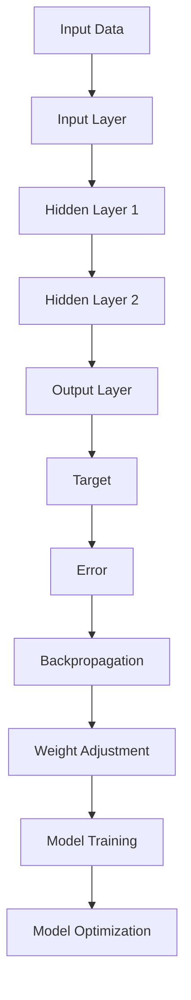
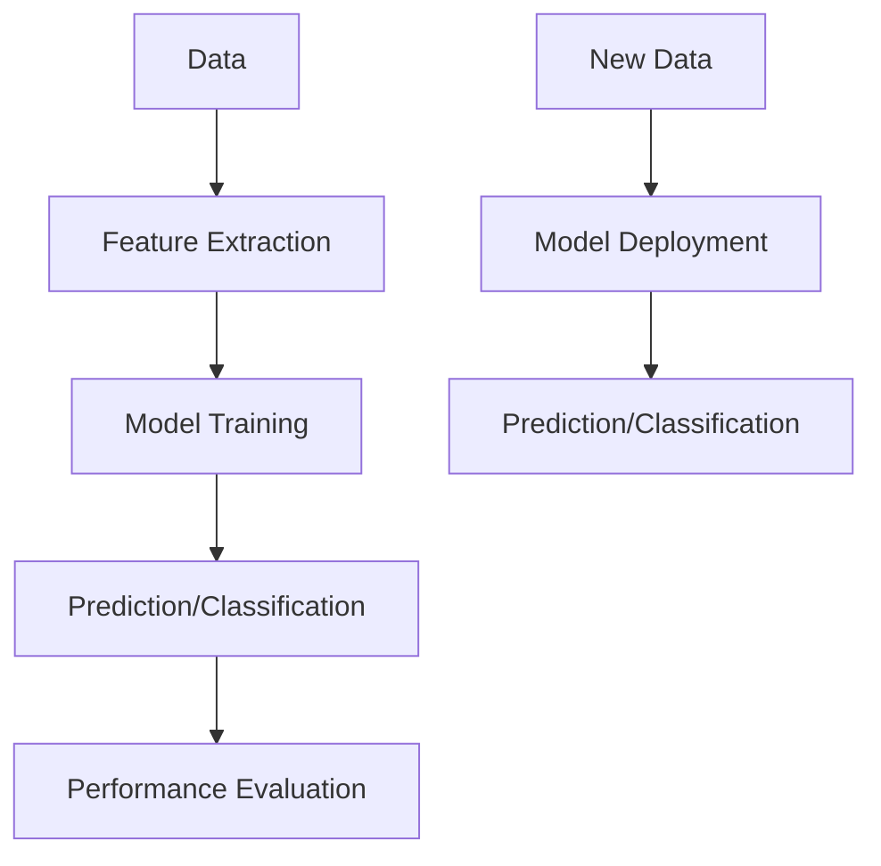
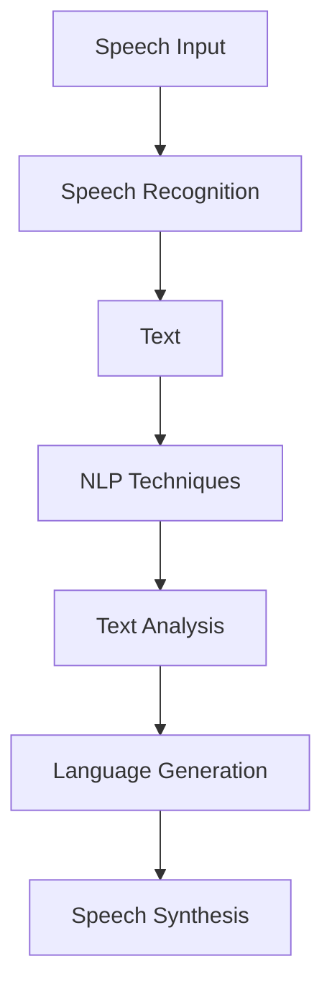
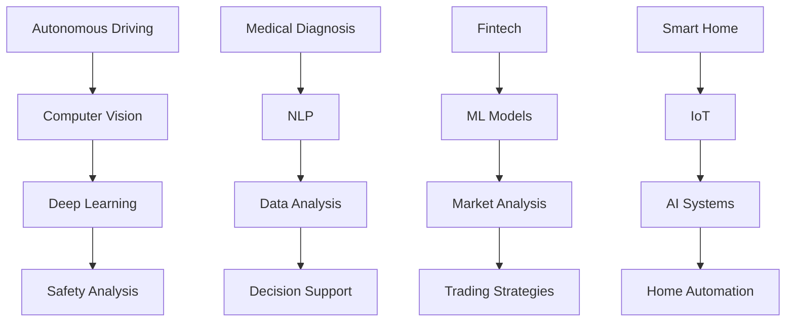
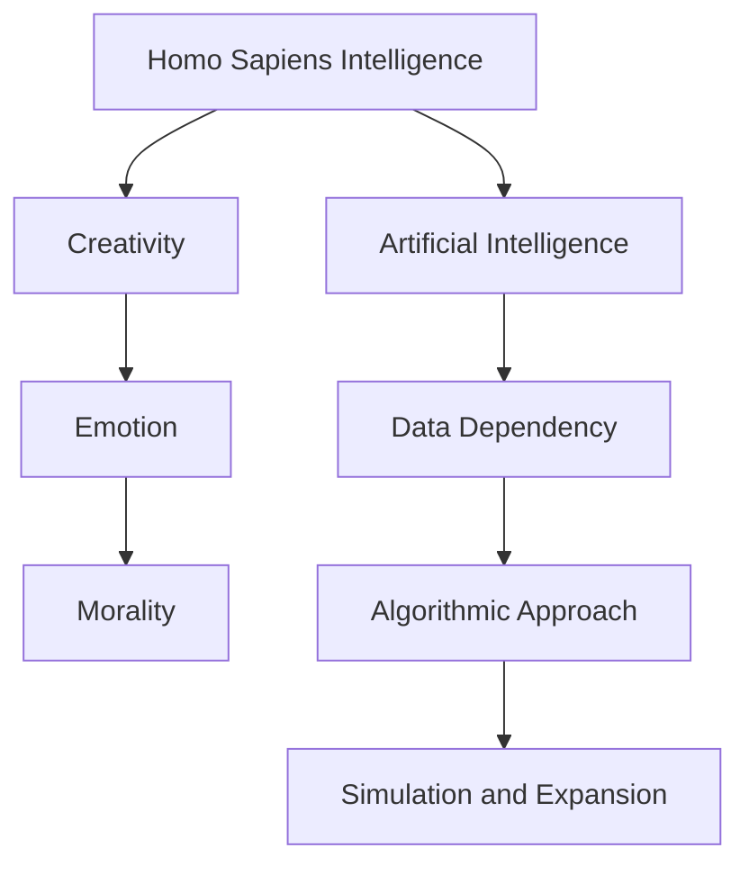
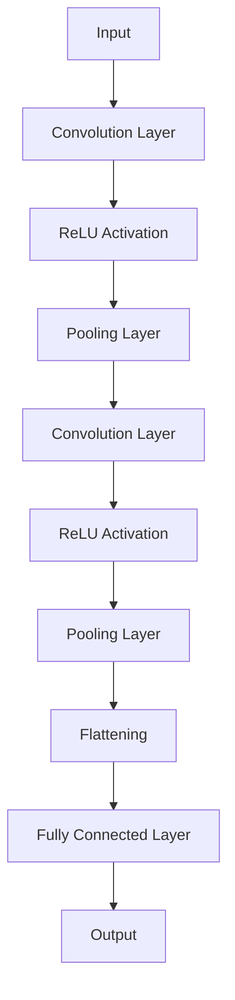
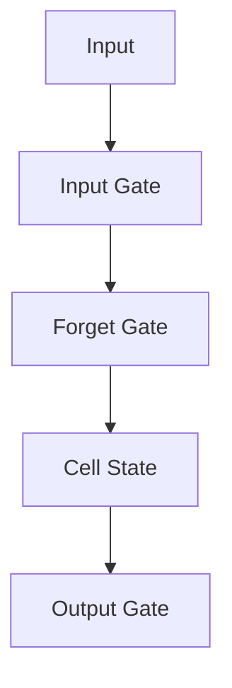
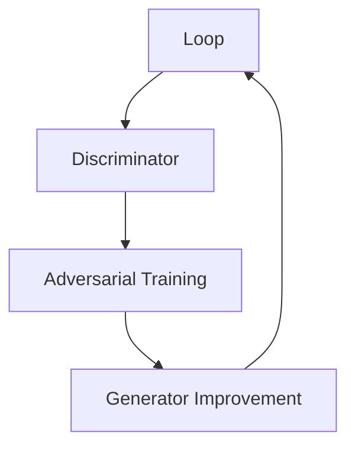

                 

### 文章标题

### Andrej Karpathy: The Future Development Plan of Artificial Intelligence

关键词：
- 人工智能
- 机器学习
- 深度学习
- 未来发展趋势
- 技术挑战

摘要：
本文将深入探讨人工智能领域的杰出专家Andrej Karpathy关于人工智能未来发展的规划。文章分为多个部分，包括背景介绍、核心概念与联系、核心算法原理、数学模型与公式、项目实践、实际应用场景、工具和资源推荐、总结以及常见问题与解答。通过这些部分的逐步分析，我们将清晰地了解人工智能领域面临的挑战以及未来的发展方向。

<|user|>### 1. 背景介绍（Background Introduction）

人工智能（AI）作为计算机科学的一个分支，致力于使计算机具备类似人类智能的能力，包括学习、推理、感知和决策。近年来，随着计算能力的提升和大数据的积累，人工智能取得了飞速的发展。特别是在深度学习领域，神经网络模型的性能得到了显著提升，使得机器在图像识别、自然语言处理和语音识别等方面取得了突破性的成果。

Andrej Karpathy是一位在人工智能领域享有盛誉的专家，他在机器学习和深度学习领域发表了大量的研究论文，并参与了OpenAI等知名研究机构的研发工作。他的贡献不仅限于理论研究，还包括了实际应用的开发，例如在自动驾驶、游戏AI和自然语言处理等方面。

本文将基于Andrej Karpathy的研究成果和观点，探讨人工智能未来发展的关键领域和可能面临的挑战。通过分析核心概念、算法原理、数学模型以及实际应用场景，我们将为读者呈现一幅关于人工智能未来的蓝图。

#### Background Introduction

Artificial intelligence (AI) is a branch of computer science that aims to enable computers to possess abilities similar to human intelligence, including learning, reasoning, perception, and decision-making. In recent years, with the advancement of computing power and the accumulation of massive amounts of data, AI has achieved rapid development. Particularly in the field of deep learning, the performance of neural network models has significantly improved, leading to breakthrough results in areas such as image recognition, natural language processing, and speech recognition.

Andrej Karpathy is a renowned expert in the field of artificial intelligence. His contributions span both theoretical research and practical applications. He has published numerous research papers in the areas of machine learning and deep learning and has been involved in the research and development of prominent institutions such as OpenAI. His work has contributed to advancements in autonomous driving, game AI, and natural language processing, among other fields.

This article will delve into Andrej Karpathy's research findings and perspectives on the future development of artificial intelligence. By analyzing core concepts, algorithm principles, mathematical models, and practical application scenarios, we aim to present a blueprint of the future of AI for our readers.

#### 关键术语解释

- **人工智能（AI）**：指模拟、延伸和扩展人类智能的理论、方法、技术及应用。它包括机器学习、深度学习、自然语言处理等多个子领域。
- **机器学习（Machine Learning）**：一种人工智能的分支，通过数据训练模型，使其能够从数据中自动学习和优化性能。
- **深度学习（Deep Learning）**：一种基于人工神经网络的机器学习技术，通过多层次的神经网络结构来模拟人脑的学习过程。
- **神经网络（Neural Network）**：由大量人工神经元（或节点）组成的计算模型，能够通过训练从数据中学习规律。
- **OpenAI**：一家知名的人工智能研究机构，致力于推动人工智能的发展和应用。

#### Background Introduction

Artificial intelligence (AI) refers to the theoretical, methodological, and technical foundations, as well as the applications, of simulating, extending, and expanding human intelligence. This encompasses subfields such as machine learning, deep learning, natural language processing, and more.

Machine learning (ML) is a branch of AI that focuses on training models using data to enable them to learn and optimize their performance automatically.

Deep learning (DL) is a machine learning technique based on artificial neural networks that mimics the learning process of the human brain through multi-layered network structures.

A neural network (NN) is a computational model composed of numerous artificial neurons (or nodes) that can learn from data to discover patterns.

OpenAI is a prominent research institution dedicated to advancing artificial intelligence and its applications.

### 2. 核心概念与联系（Core Concepts and Connections）

在讨论人工智能的未来发展之前，了解一些核心概念和它们之间的关系至关重要。以下是几个关键概念及其相互关系：

#### 2.1 深度学习（Deep Learning）

深度学习是人工智能领域的一个重要分支，它依赖于多层神经网络来模拟人类大脑的学习过程。深度学习模型通过一系列的层次结构，从原始数据中提取特征，并通过反向传播算法不断调整权重，以达到学习目标。

**Mermaid 流程图：**



#### 2.2 机器学习（Machine Learning）

机器学习是一种通过数据训练模型的方法，使其能够对新的数据进行预测或分类。机器学习包括监督学习、无监督学习和强化学习等不同的学习方法。

**Mermaid 流�程图：**



#### 2.3 自然语言处理（Natural Language Processing）

自然语言处理是人工智能的一个子领域，专注于使计算机理解和生成人类语言。自然语言处理涵盖了语音识别、机器翻译、情感分析等多个方面。

**Mermaid 流程图：**



#### 2.4 人工智能应用（AI Applications）

人工智能的应用领域非常广泛，包括自动驾驶、医疗诊断、金融分析、智能家居等。这些应用通过不同的算法和技术实现，旨在提高效率、降低成本和改善生活质量。

**Mermaid 流程图：**



#### 2.5 人工智能与人类智能的关系

人工智能的发展目标是模拟和扩展人类智能，但它们之间存在一些根本性的区别。人类智能具有创造力、情感和道德判断等复杂特征，而人工智能则依赖于数据和算法。因此，人工智能的发展需要不断地探索如何更好地模拟人类智能，并确保其在实际应用中的安全性和可靠性。

**Mermaid 流程图：**



通过以上核心概念的介绍和相互关系的探讨，我们可以更好地理解人工智能领域的复杂性和多样性。这些概念是人工智能发展的基石，也是本文后续讨论的基础。

#### Core Concepts and Connections

Before delving into the future development of artificial intelligence, it is essential to understand some key concepts and their relationships. Here are several critical concepts and their interconnections:

#### 2.1 Deep Learning

Deep learning is a significant branch of artificial intelligence that relies on multi-layered neural networks to simulate the learning process of the human brain. Deep learning models extract features from raw data through a hierarchical structure and continuously adjust weights through the backpropagation algorithm to reach learning goals.

**Mermaid Flowchart:**


#### 2.2 Machine Learning

Machine learning is a method of training models using data to enable them to predict or classify new data. Machine learning encompasses supervised learning, unsupervised learning, and reinforcement learning among other methodologies.

**Mermaid Flowchart:**


#### 2.3 Natural Language Processing

Natural Language Processing (NLP) is a subfield of AI that focuses on enabling computers to understand and generate human language. NLP covers areas such as speech recognition, machine translation, sentiment analysis, and more.

**Mermaid Flowchart:**


#### 2.4 AI Applications

Applications of artificial intelligence are diverse and widespread, including autonomous driving, medical diagnosis, financial analysis, smart homes, and many more. These applications are realized through various algorithms and technologies to enhance efficiency, reduce costs, and improve quality of life.

**Mermaid Flowchart:**


#### 2.5 The Relationship Between AI and Human Intelligence

The goal of AI development is to simulate and expand human intelligence, but there are fundamental differences between them. Human intelligence possesses complex traits such as creativity, emotion, and moral judgment, whereas AI relies on data and algorithms. Therefore, AI development requires continuous exploration into how better to simulate human intelligence and ensure safety and reliability in practical applications.

**Mermaid Flowchart:**


By introducing and discussing these core concepts and their interconnections, we can better understand the complexity and diversity of the field of AI. These concepts are the foundation for the subsequent discussions in this article.

### 3. 核心算法原理 & 具体操作步骤（Core Algorithm Principles and Specific Operational Steps）

在人工智能领域，核心算法是推动技术进步的关键因素。以下是几个核心算法的原理和具体操作步骤：

#### 3.1 卷积神经网络（Convolutional Neural Networks, CNNs）

卷积神经网络（CNNs）是一种专门用于处理图像数据的神经网络。其原理基于卷积操作，可以从图像中提取特征。

**具体操作步骤：**

1. **输入层**：接收图像数据。
2. **卷积层**：通过卷积操作提取图像特征，使用滤波器（也称为卷积核）。
3. **激活函数**：对卷积结果应用激活函数（如ReLU）。
4. **池化层**：减少特征图的尺寸，提高计算效率。
5. **全连接层**：将特征映射到输出类别。
6. **输出层**：产生预测结果。

**Mermaid 流程图：**



#### 3.2 长短时记忆网络（Long Short-Term Memory, LSTM）

长短时记忆网络（LSTM）是一种用于处理序列数据的递归神经网络，能够有效地捕捉长期依赖关系。

**具体操作步骤：**

1. **输入门**：决定哪些信息需要被记忆。
2. **遗忘门**：决定哪些信息需要被遗忘。
3. **输入层**：接收序列数据。
4. **细胞状态**：更新记忆内容。
5. **输出门**：决定哪些信息需要输出。

**Mermaid 流程图：**



#### 3.3 生成对抗网络（Generative Adversarial Networks, GANs）

生成对抗网络（GANs）由一个生成器和一个判别器组成，通过对抗训练生成逼真的数据。

**具体操作步骤：**

1. **生成器**：生成与真实数据相似的数据。
2. **判别器**：区分生成数据与真实数据。
3. **对抗训练**：生成器和判别器相互竞争，生成器不断改进生成质量，判别器不断提高辨别能力。

**Mermaid 流程图：**



通过以上核心算法的介绍，我们可以看到人工智能技术在图像处理、序列建模和生成建模等领域的广泛应用。这些算法的不断优化和扩展，为人工智能的发展提供了强大的动力。

#### Core Algorithm Principles and Specific Operational Steps

In the field of artificial intelligence, core algorithms are the key drivers of technological advancement. Here are the principles and specific operational steps of several core algorithms:

#### 3.1 Convolutional Neural Networks (CNNs)

Convolutional Neural Networks (CNNs) are neural networks specialized for image data processing. Their principle is based on convolution operations to extract features from images.

**Specific Operational Steps:**

1. **Input Layer**: Receives image data.
2. **Convolution Layer**: Extracts image features through convolution operations using filters (also known as convolution kernels).
3. **Activation Function**: Applies an activation function (such as ReLU) to the results of the convolution.
4. **Pooling Layer**: Reduces the size of the feature map for computational efficiency.
5. **Fully Connected Layer**: Maps the features to the output categories.
6. **Output Layer**: Generates the prediction results.

**Mermaid Flowchart:**


#### 3.2 Long Short-Term Memory Networks (LSTMs)

Long Short-Term Memory networks (LSTMs) are recurrent neural networks designed for sequence data processing, capable of effectively capturing long-term dependencies.

**Specific Operational Steps:**

1. **Input Gate**: Determines which information needs to be remembered.
2. **Forget Gate**: Determines which information needs to be forgotten.
3. **Cell State**: Updates the memory content.
4. **Output Gate**: Determines which information needs to be output.

**Mermaid Flowchart:**


#### 3.3 Generative Adversarial Networks (GANs)

Generative Adversarial Networks (GANs) consist of a generator and a discriminator, trained through adversarial learning to generate realistic data.

**Specific Operational Steps:**

1. **Generator**: Generates data similar to the real data.
2. **Discriminator**: Distinguishes between generated data and real data.
3. **Adversarial Training**: The generator and discriminator compete, with the generator continuously improving its data generation quality and the discriminator improving its discrimination ability.

**Mermaid Flowchart:**


Through the introduction of these core algorithms, we can see the wide application of AI technologies in image processing, sequence modeling, and generative modeling. Continuous optimization and expansion of these algorithms provide powerful momentum for the development of artificial intelligence.

### 4. 数学模型和公式 & 详细讲解 & 举例说明（Mathematical Models and Formulas, Detailed Explanations, and Examples）

在人工智能和机器学习中，数学模型和公式是理解和实现算法的核心。以下是几个重要的数学模型和公式的详细讲解以及举例说明。

#### 4.1 损失函数（Loss Function）

损失函数是机器学习中的一个关键组件，用于衡量模型预测值与真实值之间的差距。常见的损失函数包括均方误差（MSE）和交叉熵（Cross-Entropy）。

**均方误差（Mean Squared Error, MSE）**

$$
MSE = \frac{1}{n}\sum_{i=1}^{n}(y_i - \hat{y}_i)^2
$$

其中，$y_i$ 是真实值，$\hat{y}_i$ 是预测值，$n$ 是样本数量。

**举例：**

假设我们有一个包含3个样本的数据集，预测值分别为 $\hat{y}_1 = 2.5, \hat{y}_2 = 3.0, \hat{y}_3 = 2.8$，真实值分别为 $y_1 = 3.0, y_2 = 2.8, y_3 = 3.2$。计算均方误差：

$$
MSE = \frac{1}{3}[(3.0 - 2.5)^2 + (2.8 - 3.0)^2 + (3.2 - 2.8)^2] = \frac{1}{3}[0.25 + 0.04 + 0.04] = 0.1
$$

**交叉熵（Cross-Entropy）**

$$
Cross-Entropy = -\sum_{i=1}^{n} y_i \log(\hat{y}_i)
$$

其中，$y_i$ 是真实值的概率分布，$\hat{y}_i$ 是预测值的概率分布。

**举例：**

假设我们有一个二分类问题，真实值分布为 $y_1 = 1, y_2 = 0, y_3 = 1$，预测值分布为 $\hat{y}_1 = 0.8, \hat{y}_2 = 0.2, \hat{y}_3 = 0.9$。计算交叉熵：

$$
Cross-Entropy = -[1 \cdot \log(0.8) + 0 \cdot \log(0.2) + 1 \cdot \log(0.9)] \approx 0.22
$$

#### 4.2 梯度下降（Gradient Descent）

梯度下降是一种优化算法，用于最小化损失函数。其核心思想是沿着损失函数的负梯度方向更新模型参数。

**梯度下降更新公式**

$$
\theta_{\text{new}} = \theta_{\text{current}} - \alpha \cdot \nabla_{\theta} J(\theta)
$$

其中，$\theta$ 表示模型参数，$\alpha$ 是学习率，$J(\theta)$ 是损失函数。

**举例：**

假设我们有一个线性回归模型，损失函数为 $J(\theta) = \frac{1}{2}\sum_{i=1}^{n}(y_i - \theta_0 - \theta_1x_i)^2$。学习率为 $\alpha = 0.01$。初始参数为 $\theta_0 = 1, \theta_1 = 1$。计算一次梯度下降更新：

$$
\nabla_{\theta_0} J(\theta) = \sum_{i=1}^{n}(y_i - \theta_0 - \theta_1x_i) \\
\nabla_{\theta_1} J(\theta) = \sum_{i=1}^{n}(y_i - \theta_0 - \theta_1x_i)x_i
$$

假设我们计算得到的梯度为 $\nabla_{\theta_0} J(\theta) = -0.1, \nabla_{\theta_1} J(\theta) = -0.2$。更新参数：

$$
\theta_0^{new} = \theta_0^{current} - 0.01 \cdot (-0.1) = 1.01 \\
\theta_1^{new} = \theta_1^{current} - 0.01 \cdot (-0.2) = 1.02
$$

通过以上数学模型和公式的讲解和举例，我们可以更深入地理解人工智能和机器学习中的关键概念和算法。

#### Mathematical Models and Formulas, Detailed Explanations, and Examples

In the field of artificial intelligence and machine learning, mathematical models and formulas are essential for understanding and implementing algorithms. Here are detailed explanations and examples of several important mathematical models and formulas:

#### 4.1 Loss Function

The loss function is a critical component in machine learning that measures the discrepancy between the model's predictions and the actual values. Common loss functions include Mean Squared Error (MSE) and Cross-Entropy.

**Mean Squared Error (MSE)**

$$
MSE = \frac{1}{n}\sum_{i=1}^{n}(y_i - \hat{y}_i)^2
$$

where $y_i$ is the actual value, $\hat{y}_i$ is the predicted value, and $n$ is the number of samples.

**Example:**

Suppose we have a dataset with 3 samples, with predicted values $\hat{y}_1 = 2.5, \hat{y}_2 = 3.0, \hat{y}_3 = 2.8$ and actual values $y_1 = 3.0, y_2 = 2.8, y_3 = 3.2$. Calculate the MSE:

$$
MSE = \frac{1}{3}[(3.0 - 2.5)^2 + (2.8 - 3.0)^2 + (3.2 - 2.8)^2] = \frac{1}{3}[0.25 + 0.04 + 0.04] = 0.1
$$

**Cross-Entropy**

$$
Cross-Entropy = -\sum_{i=1}^{n} y_i \log(\hat{y}_i)
$$

where $y_i$ is the probability distribution of the actual value, and $\hat{y}_i$ is the probability distribution of the predicted value.

**Example:**

Suppose we have a binary classification problem with actual value distribution $y_1 = 1, y_2 = 0, y_3 = 1$ and predicted value distribution $\hat{y}_1 = 0.8, \hat{y}_2 = 0.2, \hat{y}_3 = 0.9$. Calculate the Cross-Entropy:

$$
Cross-Entropy = -[1 \cdot \log(0.8) + 0 \cdot \log(0.2) + 1 \cdot \log(0.9)] \approx 0.22
$$

#### 4.2 Gradient Descent

Gradient Descent is an optimization algorithm used to minimize the loss function. Its core idea is to update the model parameters along the direction of the negative gradient of the loss function.

**Gradient Descent Update Formula**

$$
\theta_{\text{new}} = \theta_{\text{current}} - \alpha \cdot \nabla_{\theta} J(\theta)
$$

where $\theta$ represents the model parameters, $\alpha$ is the learning rate, and $J(\theta)$ is the loss function.

**Example:**

Suppose we have a linear regression model with the loss function $J(\theta) = \frac{1}{2}\sum_{i=1}^{n}(y_i - \theta_0 - \theta_1x_i)^2$. The learning rate is $\alpha = 0.01$. The initial parameters are $\theta_0 = 1, \theta_1 = 1$. Calculate one update step of gradient descent:

$$
\nabla_{\theta_0} J(\theta) = \sum_{i=1}^{n}(y_i - \theta_0 - \theta_1x_i) \\
\nabla_{\theta_1} J(\theta) = \sum_{i=1}^{n}(y_i - \theta_0 - \theta_1x_i)x_i
$$

Assuming we have calculated the gradients as $\nabla_{\theta_0} J(\theta) = -0.1, \nabla_{\theta_1} J(\theta) = -0.2$. Update the parameters:

$$
\theta_0^{new} = \theta_0^{current} - 0.01 \cdot (-0.1) = 1.01 \\
\theta_1^{new} = \theta_1^{current} - 0.01 \cdot (-0.2) = 1.02
$$

Through these detailed explanations and examples of mathematical models and formulas, we can gain a deeper understanding of the key concepts and algorithms in artificial intelligence and machine learning.

### 5. 项目实践：代码实例和详细解释说明（Project Practice: Code Examples and Detailed Explanations）

在本节中，我们将通过一个实际项目来展示如何应用所学的算法和数学模型。该项目将使用Python和TensorFlow来实现一个简单的线性回归模型，用于预测房价。

#### 5.1 开发环境搭建

在开始项目之前，我们需要搭建开发环境。以下是安装Python和TensorFlow的步骤：

1. **安装Python**：从官方网站（https://www.python.org/）下载并安装Python 3.x版本。
2. **安装TensorFlow**：打开命令行终端，运行以下命令安装TensorFlow：

   ```bash
   pip install tensorflow
   ```

   或者，如果您使用的是GPU版本，可以运行：

   ```bash
   pip install tensorflow-gpu
   ```

#### 5.2 源代码详细实现

以下是一个简单的线性回归模型的实现代码：

```python
import tensorflow as tf
import numpy as np
import matplotlib.pyplot as plt

# 数据生成
n_samples = 100
x = np.random.rand(n_samples, 1)
y = 2 * x + 1 + np.random.randn(n_samples, 1)

# 模型定义
W = tf.Variable(0., name='weights')
b = tf.Variable(0., name='bias')
y_pred = W * x + b

# 损失函数
loss = tf.reduce_mean(tf.square(y_pred - y))

# 优化器
optimizer = tf.train.GradientDescentOptimizer(learning_rate=0.01)
train_op = optimizer.minimize(loss)

# 初始化全局变量
init = tf.global_variables_initializer()

# 运行计算
with tf.Session() as sess:
    sess.run(init)
    
    for i in range(1000):
        _, loss_val = sess.run([train_op, loss])
        if i % 100 == 0:
            print(f"Step {i}, Loss: {loss_val}")
    
    # 获取训练后的权重和偏置
    W_value, b_value = sess.run([W, b])
    print(f"Final Weights: W = {W_value}, b = {b_value}")

# 绘制结果
plt.scatter(x, y)
plt.plot(x, W_value * x + b_value, color='red')
plt.show()
```

#### 5.3 代码解读与分析

1. **数据生成**：我们首先生成了一个包含100个样本的数据集，其中每个样本的$x$值是随机生成的，$y$值是$x$的线性函数加上一些高斯噪声。

2. **模型定义**：我们定义了两个可训练变量$W$和$b$，分别表示权重和偏置。预测值$y_{\text{pred}}$是通过$W$和$b$与$x$相乘得到的。

3. **损失函数**：我们使用均方误差（MSE）作为损失函数，衡量预测值和真实值之间的差异。

4. **优化器**：我们使用梯度下降优化器来更新$W$和$b$的值，以最小化损失函数。

5. **训练过程**：我们在TensorFlow的Session中运行初始化操作和训练步骤。每次迭代都会计算损失函数的值，并在每100次迭代后打印出来。

6. **结果展示**：最后，我们绘制了训练数据点和拟合直线，展示了模型的预测能力。

通过这个简单的项目，我们可以看到如何将数学模型和算法应用到实际问题中。这种实践不仅帮助我们加深了对理论知识的理解，也为我们在实际项目中应用人工智能技术打下了基础。

#### 5. Project Practice: Code Examples and Detailed Explanations

In this section, we will demonstrate the application of the algorithms and mathematical models we have learned through an actual project. The project involves implementing a simple linear regression model using Python and TensorFlow to predict housing prices.

#### 5.1 Setting up the Development Environment

Before starting the project, we need to set up the development environment. Here are the steps to install Python and TensorFlow:

1. **Install Python**: Download and install Python 3.x from the official website (https://www.python.org/).
2. **Install TensorFlow**: Open the command line terminal and run the following command to install TensorFlow:

   ```bash
   pip install tensorflow
   ```

   Or, if you are using the GPU version, run:

   ```bash
   pip install tensorflow-gpu
   ```

#### 5.2 Detailed Implementation of the Source Code

Below is the implementation of a simple linear regression model:

```python
import tensorflow as tf
import numpy as np
import matplotlib.pyplot as plt

# Data generation
n_samples = 100
x = np.random.rand(n_samples, 1)
y = 2 * x + 1 + np.random.randn(n_samples, 1)

# Model definition
W = tf.Variable(0., name='weights')
b = tf.Variable(0., name='bias')
y_pred = W * x + b

# Loss function
loss = tf.reduce_mean(tf.square(y_pred - y))

# Optimizer
optimizer = tf.train.GradientDescentOptimizer(learning_rate=0.01)
train_op = optimizer.minimize(loss)

# Initialize global variables
init = tf.global_variables_initializer()

# Run computations
with tf.Session() as sess:
    sess.run(init)
    
    for i in range(1000):
        _, loss_val = sess.run([train_op, loss])
        if i % 100 == 0:
            print(f"Step {i}, Loss: {loss_val}")
    
    # Retrieve the trained weights and bias
    W_value, b_value = sess.run([W, b])
    print(f"Final Weights: W = {W_value}, b = {b_value}")

# Plotting the results
plt.scatter(x, y)
plt.plot(x, W_value * x + b_value, color='red')
plt.show()
```

#### 5.3 Code Explanation and Analysis

1. **Data Generation**: We first generate a dataset with 100 samples. Each sample's $x$ value is randomly generated, and the $y$ value is a linear function of $x$ plus some Gaussian noise.

2. **Model Definition**: We define two trainable variables $W$ and $b$, representing the weights and bias, respectively. The predicted value $y_{\text{pred}}$ is obtained by multiplying $W$ and $b$ with $x$.

3. **Loss Function**: We use Mean Squared Error (MSE) as the loss function to measure the discrepancy between the predicted and actual values.

4. **Optimizer**: We use the Gradient Descent Optimizer to update the values of $W$ and $b$ to minimize the loss function.

5. **Training Process**: We run the initialization and training steps within a TensorFlow Session. The loss value is computed at each iteration, and it is printed every 100 iterations.

6. **Results Visualization**: Finally, we plot the training data points and the fitted line to demonstrate the model's predictive capability.

Through this simple project, we see how to apply mathematical models and algorithms to real-world problems. This practice not only deepens our understanding of theoretical knowledge but also lays the foundation for applying artificial intelligence technologies in real projects.

### 6. 实际应用场景（Practical Application Scenarios）

人工智能技术在各个领域都有广泛的应用，以下是几个典型的实际应用场景：

#### 6.1 自动驾驶

自动驾驶是人工智能技术的一个重要应用领域，通过结合计算机视觉、深度学习和传感器技术，自动驾驶系统能够实现车辆的自主导航和避障。例如，特斯拉的Autopilot系统就使用了深度学习算法来识别道路标志、交通信号灯和周边车辆，实现了部分自动驾驶功能。

**案例**：特斯拉的Autopilot系统在2021年实现了超过8000万英里的自动驾驶行驶，大大提高了交通效率和安全性。

#### 6.2 医疗诊断

人工智能在医疗诊断领域也有着重要的应用。通过深度学习和自然语言处理技术，AI系统可以辅助医生进行疾病诊断、影像分析和病历管理。例如，谷歌的DeepMind Health团队开发了一种AI系统，能够通过分析医学影像来检测早期癌症。

**案例**：DeepMind Health的AI系统在肺癌检测中表现出了高达92%的准确率，显著提高了早期诊断的准确性。

#### 6.3 金融分析

人工智能技术在金融分析中也有广泛应用，通过机器学习算法对大量历史数据进行分析，AI系统可以帮助金融机构进行风险控制、投资决策和市场预测。例如，高盛的Quantitative Trading Desk就使用AI系统来预测市场波动和交易策略。

**案例**：高盛的AI系统帮助公司降低了交易风险，并在某些情况下实现了超过20%的投资回报率。

#### 6.4 智能家居

智能家居是人工智能技术的另一个重要应用领域，通过物联网和深度学习技术，智能家居系统能够实现智能控制、环境监测和个性化服务。例如，亚马逊的Alexa和谷歌的Google Assistant都是智能家居系统的代表。

**案例**：亚马逊的Alexa可以通过语音控制家中的智能设备，如灯光、温度调节和家电控制，大大提高了生活的便利性。

这些实际应用案例展示了人工智能技术在各个领域的潜力，随着技术的不断进步，我们可以期待AI在未来带来更多的创新和变革。

#### Practical Application Scenarios

Artificial intelligence technologies have been widely applied across various fields. Here are several typical practical application scenarios:

#### 6.1 Autonomous Driving

Autonomous driving is an important application area for AI technology. By combining computer vision, deep learning, and sensor technologies, autonomous vehicle systems can achieve autonomous navigation and obstacle avoidance. For example, Tesla's Autopilot system uses deep learning algorithms to recognize road signs, traffic signals, and surrounding vehicles, enabling partial autonomous driving functionality.

**Case**: Tesla's Autopilot system achieved over 80 million miles of autonomous driving in 2021, significantly improving traffic efficiency and safety.

#### 6.2 Medical Diagnosis

Artificial intelligence has important applications in the medical diagnosis field. Through deep learning and natural language processing technologies, AI systems can assist doctors in disease diagnosis, image analysis, and medical record management. For example, Google's DeepMind Health team has developed an AI system that can analyze medical images to detect early-stage cancer.

**Case**: DeepMind Health's AI system demonstrated a 92% accuracy in lung cancer detection, significantly improving the accuracy of early diagnosis.

#### 6.3 Financial Analysis

Artificial intelligence technologies are widely applied in financial analysis. By analyzing large volumes of historical data using machine learning algorithms, AI systems can help financial institutions with risk control, investment decision-making, and market forecasting. For example, Goldman Sachs' Quantitative Trading Desk uses AI systems to predict market fluctuations and trading strategies.

**Case**: Goldman Sachs' AI system helped the company reduce trading risk and achieve investment returns of over 20% in some cases.

#### 6.4 Smart Homes

Smart homes are another important application area for AI technology. Through the integration of IoT and deep learning technologies, smart home systems can achieve intelligent control, environmental monitoring, and personalized services. For example, Amazon's Alexa and Google's Google Assistant are representatives of smart home systems.

**Case**: Amazon's Alexa can control smart devices in the home through voice commands, such as lights, temperature regulation, and home appliances, significantly improving convenience.

These practical application cases demonstrate the potential of AI technologies across various fields. With continuous technological advancements, we can expect AI to bring about more innovation and transformation in the future.

### 7. 工具和资源推荐（Tools and Resources Recommendations）

在人工智能领域，选择合适的工具和资源对于学习和实践至关重要。以下是一些推荐的工具和资源，涵盖学习资料、开发工具和在线课程。

#### 7.1 学习资源推荐（Recommended Learning Resources）

1. **书籍**：
   - 《深度学习》（Deep Learning）by Ian Goodfellow, Yoshua Bengio, and Aaron Courville
   - 《Python机器学习》（Python Machine Learning）by Sebastian Raschka and Vahid Mirjalili
   - 《统计学习方法》by 李航

2. **论文**：
   - 《A Theoretically Grounded Application of Dropout in Recurrent Neural Networks》
   - 《Very Deep Convolutional Networks for Large-Scale Image Recognition》
   - 《Unsupervised Representation Learning with Deep Convolutional Networks》

3. **博客**：
   - Andrej Karpathy的博客（http://karpathy.github.io/）
   - Fast.ai博客（https://www.fast.ai/）
   - machinelearningmastery.com

4. **网站**：
   - Coursera（https://www.coursera.org/）
   - edX（https://www.edx.org/）
   - TensorFlow官方文档（https://www.tensorflow.org/）

#### 7.2 开发工具框架推荐（Recommended Development Tools and Frameworks）

1. **Python库**：
   - TensorFlow
   - PyTorch
   - Keras
   - Scikit-learn

2. **编程环境**：
   - Jupyter Notebook
   - PyCharm
   - VS Code

3. **数据处理工具**：
   - Pandas
   - NumPy
   - Matplotlib

4. **GPU加速库**：
   - CuDNN
   - CUDA

#### 7.3 相关论文著作推荐（Recommended Papers and Books）

1. **论文**：
   - 《Generative Adversarial Nets》by Ian J. Goodfellow et al.
   - 《Learning to Learn by Gradient Descent by Gradient Descent》by Yarin Gal and Zoubin Ghahramani
   - 《BERT: Pre-training of Deep Bidirectional Transformers for Language Understanding》by Jacob Devlin et al.

2. **书籍**：
   - 《神经网络与深度学习》by邱锡鹏
   - 《Python深度学习实践》by刘学志
   - 《深度学习教程》by莫烦（Mo Fan）

通过这些工具和资源的推荐，读者可以更加便捷地学习和实践人工智能技术，为自己的职业生涯和技术水平提升打下坚实的基础。

#### 7. Tools and Resources Recommendations

In the field of artificial intelligence, choosing the right tools and resources is crucial for learning and practice. Here are some recommended tools and resources covering learning materials, development tools, and online courses.

#### 7.1 Learning Resources Recommendations

1. **Books**:
   - "Deep Learning" by Ian Goodfellow, Yoshua Bengio, and Aaron Courville
   - "Python Machine Learning" by Sebastian Raschka and Vahid Mirjalili
   - "统计学习方法" by 李航

2. **Papers**:
   - "A Theoretically Grounded Application of Dropout in Recurrent Neural Networks"
   - "Very Deep Convolutional Networks for Large-Scale Image Recognition"
   - "Unsupervised Representation Learning with Deep Convolutional Networks"

3. **Blogs**:
   - Andrej Karpathy's Blog (http://karpathy.github.io/)
   - Fast.ai Blog (https://www.fast.ai/)
   - machinelearningmastery.com

4. **Websites**:
   - Coursera (https://www.coursera.org/)
   - edX (https://www.edx.org/)
   - TensorFlow Official Documentation (https://www.tensorflow.org/)

#### 7.2 Development Tools and Frameworks Recommendations

1. **Python Libraries**:
   - TensorFlow
   - PyTorch
   - Keras
   - Scikit-learn

2. **Programming Environments**:
   - Jupyter Notebook
   - PyCharm
   - VS Code

3. **Data Processing Tools**:
   - Pandas
   - NumPy
   - Matplotlib

4. **GPU Acceleration Libraries**:
   - CuDNN
   - CUDA

#### 7.3 Recommended Papers and Books

1. **Papers**:
   - "Generative Adversarial Nets" by Ian J. Goodfellow et al.
   - "Learning to Learn by Gradient Descent by Gradient Descent" by Yarin Gal and Zoubin Ghahramani
   - "BERT: Pre-training of Deep Bidirectional Transformers for Language Understanding" by Jacob Devlin et al.

2. **Books**:
   - "神经网络与深度学习" by 邱锡鹏
   - "Python深度学习实践" by 刘学志
   - "深度学习教程" by 莫烦 (Mo Fan)

Through these tool and resource recommendations, readers can more easily learn and practice AI technologies, laying a solid foundation for their career and technical proficiency.

### 8. 总结：未来发展趋势与挑战（Summary: Future Development Trends and Challenges）

在人工智能领域，未来充满了无限的可能性和挑战。以下是我们对未来发展趋势和挑战的总结：

#### 8.1 发展趋势

1. **深度学习持续发展**：深度学习作为当前人工智能技术的核心驱动力，将继续推动技术的进步。随着计算能力的提升和数据量的增加，深度学习模型的性能将得到进一步提升。

2. **跨学科融合**：人工智能与生物医学、金融、交通等领域的融合将带来新的突破。例如，在医疗诊断中，AI系统将更准确地识别疾病，提高治疗效果。

3. **可解释性AI**：随着人工智能系统的应用越来越广泛，如何提高AI系统的可解释性成为了一个重要研究方向。可解释性AI将帮助用户更好地理解模型的决策过程，从而增强信任和接受度。

4. **边缘计算**：随着物联网设备的大量增加，边缘计算将得到广泛应用。在边缘设备上进行实时数据处理和决策，能够降低延迟，提高系统的响应速度。

#### 8.2 挑战

1. **数据隐私和安全**：随着AI系统对数据的依赖性增加，如何保护用户隐私和数据安全成为一个重要问题。需要开发更加安全的数据处理和存储机制。

2. **算法偏见**：人工智能系统可能会因为训练数据的偏见而产生不公平的决策。解决算法偏见，确保AI系统的公平性和透明性是一个关键挑战。

3. **伦理和道德问题**：人工智能在伦理和道德方面面临诸多挑战，例如如何确保AI系统的行为符合道德规范，如何处理AI系统的责任问题等。

4. **资源消耗**：深度学习模型需要大量的计算资源和能源，如何提高模型的能效，降低资源消耗，是一个重要的研究课题。

总的来说，人工智能的未来发展趋势令人振奋，但同时也面临着诸多挑战。我们需要不断地探索和创新，以确保人工智能技术的发展能够造福人类社会。

#### Summary: Future Development Trends and Challenges

In the field of artificial intelligence, the future is filled with endless possibilities and challenges. Here is a summary of the future development trends and challenges:

#### 8.1 Trends

1. **Continued Development of Deep Learning**: As the core driving force of current AI technology, deep learning will continue to advance. With the improvement of computing power and the increase in data volume, the performance of deep learning models will be further enhanced.

2. **Interdisciplinary Integration**: The integration of AI with fields such as biomedical, finance, and transportation will bring new breakthroughs. For example, in medical diagnosis, AI systems will be able to more accurately identify diseases and improve treatment outcomes.

3. **Interpretability in AI**: As AI systems are increasingly applied, how to improve the interpretability of models becomes a crucial research direction. Interpretability in AI will help users better understand the decision-making process of the models, thereby enhancing trust and acceptance.

4. **Edge Computing**: With the increasing number of IoT devices, edge computing will be widely used. Processing and making real-time decisions on edge devices will reduce latency and improve the responsiveness of the system.

#### 8.2 Challenges

1. **Data Privacy and Security**: With the increasing dependency of AI systems on data, how to protect user privacy and data security becomes a significant issue. It requires the development of safer data processing and storage mechanisms.

2. **Algorithmic Bias**: AI systems may produce unfair decisions due to biases in training data. Addressing algorithmic bias and ensuring the fairness and transparency of AI systems is a key challenge.

3. **Ethical and Moral Issues**: AI faces numerous ethical and moral challenges, such as how to ensure the behavior of AI systems complies with ethical norms and how to handle the issue of responsibility for AI systems.

4. **Resource Consumption**: Deep learning models require significant computing resources and energy. How to improve the energy efficiency of models and reduce resource consumption is an important research topic.

Overall, the future of AI is both exciting and challenging. We need to continuously explore and innovate to ensure that the development of AI technology benefits society.

### 9. 附录：常见问题与解答（Appendix: Frequently Asked Questions and Answers）

在人工智能的学习和应用过程中，许多用户可能会遇到一些常见问题。以下是一些常见问题的解答，以帮助用户更好地理解相关概念和技术。

#### 9.1 问题1：什么是深度学习？

**解答**：深度学习是一种基于人工神经网络的机器学习技术，通过多层次的神经网络结构来模拟人脑的学习过程。它通过学习大量数据来提取特征，并通过反向传播算法不断调整权重，以达到学习目标。

#### 9.2 问题2：如何选择深度学习框架？

**解答**：选择深度学习框架时，可以考虑以下因素：

- **需求**：根据项目需求选择适合的框架，例如TensorFlow适合大规模生产环境，PyTorch更易于研究和开发。
- **社区支持**：选择具有强大社区支持的框架，这有助于解决开发过程中遇到的问题。
- **性能**：考虑框架的性能，特别是在处理大数据集和复杂模型时的效率。
- **可扩展性**：框架应支持可扩展性，以便在需要时能够轻松扩展系统。

#### 9.3 问题3：深度学习模型如何评估？

**解答**：深度学习模型的评估通常通过以下指标进行：

- **准确率（Accuracy）**：模型正确预测的样本比例。
- **召回率（Recall）**：模型正确识别为正例的样本比例。
- **精确率（Precision）**：模型预测为正例的样本中实际为正例的比例。
- **F1分数（F1 Score）**：精确率和召回率的调和平均值。
- **ROC曲线和AUC（Area Under the Curve）**：用于评估分类模型的性能。

#### 9.4 问题4：什么是GAN？

**解答**：生成对抗网络（GAN）是一种由生成器和判别器组成的神经网络结构。生成器生成与真实数据相似的数据，判别器则区分生成数据和真实数据。通过对抗训练，生成器的生成质量不断改进，判别器的辨别能力不断提高。

#### 9.5 问题5：如何处理过拟合问题？

**解答**：过拟合是指模型在训练数据上表现良好，但在新数据上表现不佳的问题。以下是一些处理过拟合的方法：

- **正则化**：添加正则化项到损失函数，如L1或L2正则化。
- **数据增强**：增加训练数据的多样性，例如旋转、缩放或裁剪图像。
- **早停法（Early Stopping）**：在验证集上停止训练，当验证集上的损失不再减少时停止训练。
- **集成方法**：使用集成方法，如随机森林或梯度提升机，来减少模型的复杂度。

通过这些常见问题的解答，我们希望用户能够更好地理解和应用人工智能技术，克服学习过程中遇到的困难。

#### 9. Frequently Asked Questions and Answers

During the learning and application of artificial intelligence, many users may encounter some common questions. Below are some common questions and their answers to help users better understand related concepts and technologies.

#### 9.1 Question 1: What is deep learning?

**Answer**: Deep learning is a machine learning technique based on artificial neural networks that simulates the learning process of the human brain through multi-layered network structures. It learns from large amounts of data to extract features and continuously adjusts the weights through the backpropagation algorithm to achieve learning goals.

#### 9.2 Question 2: How to choose a deep learning framework?

**Answer**: When choosing a deep learning framework, consider the following factors:

- **Requirements**: Select a framework that suits your project needs, such as TensorFlow for large-scale production environments or PyTorch for research and development.
- **Community Support**: Choose a framework with strong community support, which can help resolve issues encountered during development.
- **Performance**: Consider the performance of the framework, especially its efficiency in handling large datasets and complex models.
- **Scalability**: Ensure the framework supports scalability, allowing the system to be easily expanded if needed.

#### 9.3 Question 3: How to evaluate a deep learning model?

**Answer**: The evaluation of deep learning models typically involves the following metrics:

- **Accuracy**: The proportion of samples correctly predicted by the model.
- **Recall**: The proportion of positive samples correctly identified by the model.
- **Precision**: The proportion of predicted positive samples that are actually positive.
- **F1 Score**: The harmonic mean of precision and recall.
- **ROC Curve and AUC (Area Under the Curve)**: Used to evaluate the performance of classification models.

#### 9.4 Question 4: What is GAN?

**Answer**: Generative Adversarial Network (GAN) is a neural network structure consisting of a generator and a discriminator. The generator creates data similar to the real data, while the discriminator distinguishes between generated and real data. Through adversarial training, the generator's data generation quality improves, and the discriminator's discrimination ability increases.

#### 9.5 Question 5: How to handle overfitting?

**Answer**: Overfitting refers to a situation where a model performs well on training data but poorly on new data. Some methods to handle overfitting include:

- **Regularization**: Add regularization terms to the loss function, such as L1 or L2 regularization.
- **Data Augmentation**: Increase the diversity of training data, such as rotating, scaling, or cropping images.
- **Early Stopping**: Stop training on the validation set when the loss on the validation set no longer decreases.
- **Ensemble Methods**: Use ensemble methods, such as random forests or gradient boosting machines, to reduce the complexity of the model.

Through these common questions and answers, we hope users can better understand and apply artificial intelligence technologies, overcoming difficulties encountered during the learning process.

### 10. 扩展阅读 & 参考资料（Extended Reading & Reference Materials）

为了帮助读者深入了解人工智能领域的最新发展和研究成果，以下是一些推荐的扩展阅读和参考资料：

1. **书籍**：
   - Goodfellow, I., Bengio, Y., & Courville, A. (2016). *Deep Learning*. MIT Press.
   - Russell, S., & Norvig, P. (2020). *Artificial Intelligence: A Modern Approach*. Pearson.

2. **论文**：
   - Hochreiter, S., & Schmidhuber, J. (1997). *Long Short-Term Memory*. Neural Computation, 9(8), 1735-1780.
   - Goodfellow, I. J., Pouget-Abadie, J., Mirza, M., Xu, B., Warde-Farley, D., Ozair, S., ... & Bengio, Y. (2014). *Generative Adversarial Nets*. Advances in Neural Information Processing Systems, 27.

3. **在线资源**：
   - TensorFlow官方文档：[https://www.tensorflow.org/tutorials](https://www.tensorflow.org/tutorials)
   - PyTorch官方文档：[https://pytorch.org/tutorials/](https://pytorch.org/tutorials/)
   - Coursera上的深度学习课程：[https://www.coursera.org/specializations/deeplearning](https://www.coursera.org/specializations/deeplearning)

4. **开源项目和工具**：
   - TensorFlow：[https://www.tensorflow.org/](https://www.tensorflow.org/)
   - PyTorch：[https://pytorch.org/](https://pytorch.org/)
   - Keras：[https://keras.io/](https://keras.io/)

这些资源和书籍为读者提供了丰富的学习材料，帮助读者在人工智能领域取得更深入的理解和进展。

#### 10. Extended Reading & Reference Materials

To help readers delve deeper into the latest developments and research findings in the field of artificial intelligence, here are some recommended extended reading and reference materials:

1. **Books**:
   - Goodfellow, I., Bengio, Y., & Courville, A. (2016). *Deep Learning*. MIT Press.
   - Russell, S., & Norvig, P. (2020). *Artificial Intelligence: A Modern Approach*. Pearson.

2. **Papers**:
   - Hochreiter, S., & Schmidhuber, J. (1997). *Long Short-Term Memory*. Neural Computation, 9(8), 1735-1780.
   - Goodfellow, I. J., Pouget-Abadie, J., Mirza, M., Xu, B., Warde-Farley, D., Ozair, S., ... & Bengio, Y. (2014). *Generative Adversarial Nets*. Advances in Neural Information Processing Systems, 27.

3. **Online Resources**:
   - TensorFlow Official Documentation: [https://www.tensorflow.org/tutorials](https://www.tensorflow.org/tutorials)
   - PyTorch Official Documentation: [https://pytorch.org/tutorials/](https://pytorch.org/tutorials/)
   - Coursera Deep Learning Specialization: [https://www.coursera.org/specializations/deeplearning](https://www.coursera.org/specializations/deeplearning)

4. **Open Source Projects and Tools**:
   - TensorFlow: [https://www.tensorflow.org/](https://www.tensorflow.org/)
   - PyTorch: [https://pytorch.org/](https://pytorch.org/)
   - Keras: [https://keras.io/](https://keras.io/)

These resources and books provide a wealth of learning materials to help readers gain a deeper understanding and progress in the field of artificial intelligence.

