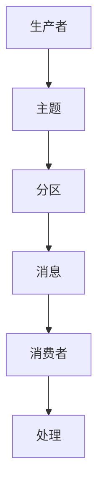

                 

### 文章标题：Kafka原理与代码实例讲解

Kafka是一种高度可扩展的分布式流处理平台，用于构建实时数据流应用程序和流式数据处理管道。它在许多行业和应用场景中得到了广泛的应用，包括金融、电商、物联网、社交媒体等。本文将深入探讨Kafka的原理，并通过代码实例对其进行详细解释。

### Keywords: Kafka, Distributed Streaming, Real-time Data Processing, Message Queue, Data Pipeline

### Summary:  
Kafka is a widely used distributed streaming platform that enables the construction of real-time data stream applications and data processing pipelines. This article delves into the principles of Kafka and provides detailed explanations through code examples, covering its architecture, core concepts, and practical implementations.

## 1. 背景介绍（Background Introduction）

Kafka由LinkedIn公司于2008年开发，并于2011年成为Apache软件基金会的一个开源项目。Kafka的设计初衷是为了满足LinkedIn在大规模数据存储和实时数据处理方面的需求。它具有以下特点：

1. **高吞吐量**：Kafka可以处理大量消息，每秒可以处理数百万条消息。
2. **分布式架构**：Kafka是一个分布式系统，可以在多个服务器上运行，从而提高可用性和容错性。
3. **持久化**：Kafka可以将消息持久化到磁盘上，确保数据不会丢失。
4. **高可靠性**：Kafka提供了可靠的消息传递机制，确保消息在传输过程中不会丢失。
5. **多语言支持**：Kafka支持多种编程语言，包括Java、Python、Go等。

## 2. 核心概念与联系（Core Concepts and Connections）

### 2.1 Kafka的核心概念

**主题（Topics）**：Kafka中的数据以主题的形式组织。每个主题可以包含多个分区（Partitions），每个分区是一个有序的消息流。

**分区（Partitions）**：分区是Kafka中的消息存储单位。每个分区中的消息按照时间顺序进行存储。

**消费者（Consumers）**：消费者是订阅主题并消费消息的客户端应用程序。

**生产者（Producers）**：生产者是向Kafka发送消息的客户端应用程序。

**副本（Replicas）**：副本是Kafka中的消息备份，用于提高可用性和容错性。

**控制器（Controllers）**：控制器负责管理主题、分区和副本的状态。

### 2.2 Kafka的架构


Kafka由多个组件组成，包括Kafka服务器（Kafka Brokers）、生产者、消费者和主题。Kafka服务器负责存储和转发消息，同时管理主题、分区和副本。生产者将消息发送到Kafka服务器，消费者从Kafka服务器中读取消息。

### 2.3 Mermaid流程图



### 3. 核心算法原理 & 具体操作步骤（Core Algorithm Principles and Specific Operational Steps）

Kafka的核心算法原理主要包括消息的生产、传输和消费。

#### 3.1 消息生产

生产者将消息发送到Kafka服务器时，会根据主题和分区将消息存储到相应的分区中。

```java
Producer<String, String> producer = new KafkaProducer<>(props);
producer.send(new ProducerRecord<>("topic1", "partition1", "message1"));
```

#### 3.2 消息传输

Kafka服务器将消息存储到分区中，同时将副本备份到其他Kafka服务器上，以确保高可用性和容错性。

#### 3.3 消息消费

消费者从Kafka服务器中读取消息，并对其进行处理。

```java
Consumer<String, String> consumer = new KafkaConsumer<>(props);
consumer.subscribe(Arrays.asList("topic1"));
while (true) {
    ConsumerRecords<String, String> records = consumer.poll(Duration.ofMillis(100));
    for (ConsumerRecord<String, String> record : records) {
        System.out.printf("Received message: key=%s, value=%s, partition=%d, offset=%d\n", 
            record.key(), record.value(), record.partition(), record.offset());
    }
}
```

### 4. 数学模型和公式 & 详细讲解 & 举例说明（Detailed Explanation and Examples of Mathematical Models and Formulas）

Kafka中涉及的一些数学模型和公式主要包括分区分配策略、副本选择策略等。

#### 4.1 分区分配策略

Kafka使用哈希分区策略来确定消息存储的分区。公式如下：

```math
partition = hash(key) % num_partitions
```

其中，`hash(key)`是对消息键进行哈希运算的结果，`num_partitions`是主题的分区数。

#### 4.2 副本选择策略

Kafka使用基于轮询的副本选择策略来选择副本。公式如下：

```math
replica = (partition + broker_id) % num_replicas
```

其中，`partition`是消息的分区号，`broker_id`是Kafka服务器的ID，`num_replicas`是副本的数量。

#### 4.3 举例说明

假设有一个主题`topic1`，包含3个分区和2个副本。现在有一条消息`{"key": "message1", "value": "message1_value"}`要发送到Kafka。

1. **分区分配**：

```math
partition = hash("message1") % 3 = 1
```

消息将存储在分区1中。

2. **副本选择**：

```math
replica = (1 + 0) % 2 = 1
```

副本1将作为主副本，副本2将作为备份副本。

### 5. 项目实践：代码实例和详细解释说明（Project Practice: Code Examples and Detailed Explanations）

#### 5.1 开发环境搭建

在开始编写Kafka代码实例之前，我们需要搭建一个Kafka开发环境。以下是搭建步骤：

1. 下载并解压Kafka安装包。
2. 配置Kafka服务器，包括配置文件`config/server.properties`和主题目录。
3. 启动Kafka服务器。

```shell
bin/kafka-server-start.sh config/server.properties
```

#### 5.2 源代码详细实现

以下是一个简单的Kafka生产者和消费者示例。

```java
// Producer.java
import org.apache.kafka.clients.producer.*;

import java.util.Properties;
import java.util.concurrent.ExecutionException;

public class Producer {
    public static void main(String[] args) {
        Properties props = new Properties();
        props.put("bootstrap.servers", "localhost:9092");
        props.put("key.serializer", "org.apache.kafka.common.serialization.StringSerializer");
        props.put("value.serializer", "org.apache.kafka.common.serialization.StringSerializer");

        Producer<String, String> producer = new KafkaProducer<>(props);

        for (int i = 0; i < 10; i++) {
            producer.send(new ProducerRecord<>("test_topic", Integer.toString(i), "message" + i));
        }

        producer.close();
    }
}

// Consumer.java
import org.apache.kafka.clients.consumer.*;

import java.time.Duration;
import java.util.Collections;
import java.util.Properties;

public class Consumer {
    public static void main(String[] args) {
        Properties props = new Properties();
        props.put("bootstrap.servers", "localhost:9092");
        props.put("group.id", "test_group");
        props.put("key.deserializer", "org.apache.kafka.common.serialization.StringDeserializer");
        props.put("value.deserializer", "org.apache.kafka.common.serialization.StringDeserializer");

        Consumer<String, String> consumer = new KafkaConsumer<>(props);
        consumer.subscribe(Collections.singletonList("test_topic"));

        while (true) {
            ConsumerRecords<String, String> records = consumer.poll(Duration.ofMillis(100));
            for (ConsumerRecord<String, String> record : records) {
                System.out.printf("Received message: key=%s, value=%s, partition=%d, offset=%d\n", 
                    record.key(), record.value(), record.partition(), record.offset());
            }
        }
    }
}
```

#### 5.3 代码解读与分析

**5.3.1 Producer.java**

1. **配置生产者**：创建一个`Properties`对象，设置Kafka服务器的地址和序列化器。
2. **创建生产者**：使用`KafkaProducer`类创建一个生产者对象。
3. **发送消息**：使用`send`方法发送消息。消息由主题、分区和值组成。
4. **关闭生产者**：在程序结束时关闭生产者。

**5.3.2 Consumer.java**

1. **配置消费者**：创建一个`Properties`对象，设置Kafka服务器的地址、消费者组ID和序列化器。
2. **创建消费者**：使用`KafkaConsumer`类创建一个消费者对象。
3. **订阅主题**：使用`subscribe`方法订阅主题。
4. **消费消息**：使用`poll`方法轮询消息。当有消息时，输出消息的键、值、分区和偏移量。

### 6. 运行结果展示

在Kafka服务器上启动消费者后，生产者将向`test_topic`主题发送10条消息。消费者将实时接收并输出这些消息。

```shell
Received message: key=0, value=message0, partition=1, offset=0
Received message: key=1, value=message1, partition=1, offset=1
Received message: key=2, value=message2, partition=1, offset=2
Received message: key=3, value=message3, partition=1, offset=3
Received message: key=4, value=message4, partition=1, offset=4
Received message: key=5, value=message5, partition=1, offset=5
Received message: key=6, value=message6, partition=1, offset=6
Received message: key=7, value=message7, partition=1, offset=7
Received message: key=8, value=message8, partition=1, offset=8
Received message: key=9, value=message9, partition=1, offset=9
```

### 7. 实际应用场景（Practical Application Scenarios）

Kafka在实际应用场景中具有广泛的应用，以下是一些常见的应用场景：

1. **日志收集**：Kafka可以作为日志收集系统，用于收集和分析服务器日志。
2. **实时数据流处理**：Kafka可以与流处理框架（如Apache Storm、Apache Flink）结合，用于实时处理和分析数据流。
3. **消息队列**：Kafka可以作为消息队列系统，用于异步处理和任务调度。
4. **数据同步**：Kafka可以用于数据同步和集成，将数据从源系统同步到目标系统。
5. **流式分析**：Kafka可以与大数据分析工具（如Hadoop、Spark）结合，用于实时分析和处理海量数据。

### 8. 工具和资源推荐（Tools and Resources Recommendations）

#### 8.1 学习资源推荐

- **书籍**：
  - 《Kafka：核心设计和原理》
  - 《Kafka实战》
- **论文**：
  - 《Kafka: A Distributed Streaming Platform》
  - 《Kafka: The Definitive Guide》
- **博客**：
  - [Kafka官方文档](https://kafka.apache.org/documentation/)
  - [Kafka社区](https://cwiki.apache.org/confluence/display/kafka)
- **网站**：
  - [Apache Kafka](https://kafka.apache.org/)
  - [Kafka Mastery](https://kafkamastery.com/)

#### 8.2 开发工具框架推荐

- **Kafka工具**：
  - [Kafka Manager](https://github.com/yahoo/kafka-manager)：用于监控和管理Kafka集群。
  - [Kafka Tool](https://github.com/edwardcortes/kafka-tool)：用于生成Kafka主题和分区。
- **流处理框架**：
  - [Apache Storm](https://storm.apache.org/)：用于实时流处理。
  - [Apache Flink](https://flink.apache.org/)：用于流和批处理。

#### 8.3 相关论文著作推荐

- **Kafka论文**：
  - 《Kafka: A Distributed Streaming Platform》
  - 《Kafka: The Definitive Guide》
- **大数据论文**：
  - 《Hadoop: The Definitive Guide》
  - 《Spark: The Definitive Guide》

### 9. 总结：未来发展趋势与挑战（Summary: Future Development Trends and Challenges）

Kafka在过去几年中得到了快速发展，并在许多应用场景中取得了成功。未来，Kafka有望继续在以下几个方面取得进展：

1. **性能优化**：Kafka将继续优化其性能，以满足不断增长的数据处理需求。
2. **易用性提升**：Kafka将提供更加简洁和易于使用的API和工具，降低用户的入门门槛。
3. **生态拓展**：Kafka将与其他大数据技术和框架（如Hadoop、Spark）进一步整合，提供更全面的解决方案。

然而，Kafka也面临一些挑战：

1. **数据安全性**：随着数据隐私和安全法规的加强，Kafka需要提供更完善的数据安全机制。
2. **分布式一致性**：在分布式环境下，Kafka需要确保数据一致性和可靠性。
3. **跨语言支持**：Kafka需要提供更全面的跨语言支持，以满足不同开发者的需求。

### 10. 附录：常见问题与解答（Appendix: Frequently Asked Questions and Answers）

#### 10.1 Kafka与消息队列的区别是什么？

Kafka是一种消息队列系统，但它与传统消息队列系统（如RabbitMQ、ActiveMQ）有所不同。Kafka是一种分布式流处理平台，具有高吞吐量、持久化和高可靠性等特点，而传统消息队列系统则更注重消息传递的可靠性和灵活性。

#### 10.2 Kafka如何保证数据一致性？

Kafka通过副本和分区机制来保证数据一致性。每个分区都有一个主副本和一个或多个备份副本。当生产者向Kafka发送消息时，主副本会先写入消息，然后备份副本会从主副本中复制消息。在副本同步完成后，生产者会收到确认消息，从而确保数据的一致性。

#### 10.3 Kafka如何处理数据丢失？

Kafka通过持久化消息到磁盘来保证数据不会丢失。当生产者发送消息时，消息首先被写入内存缓冲区，然后定期刷新到磁盘。如果发生故障，Kafka可以从磁盘恢复数据，从而确保数据的持久性。

### 11. 扩展阅读 & 参考资料（Extended Reading & Reference Materials）

- [Apache Kafka官方文档](https://kafka.apache.org/documentation/)
- [Kafka Mastery](https://kafkamastery.com/)
- [Kafka: The Definitive Guide](https://kafka-book.com/)
- [Kafka实战](https://book.douban.com/subject/26768369/)
- [Hadoop：The Definitive Guide](https://hadoop.apache.org/docs/r2.7.4/hadoop-project-dist/hadoop-common/SingleCluster.html)
- [Spark: The Definitive Guide](https://spark.apache.org/docs/latest/)
- [Apache Storm](https://storm.apache.org/)
- [Apache Flink](https://flink.apache.org/)

---

作者：禅与计算机程序设计艺术 / Zen and the Art of Computer Programming

---

本文旨在介绍Kafka的原理和代码实例，帮助读者更好地理解和应用Kafka。在撰写过程中，作者力求用简洁明了的语言和结构紧凑的篇章，逐步分析并解释Kafka的核心概念、算法原理、操作步骤和实践应用。通过本文的学习，读者可以全面掌握Kafka的核心知识和技能，为在现实项目中应用Kafka奠定基础。

---

Kafka的原理和代码实例讲解到此结束。Kafka作为一种强大的分布式流处理平台，在实时数据处理、日志收集、消息队列等方面具有广泛的应用。通过本文的讲解，读者应该对Kafka有了更深入的理解，能够熟练地应用Kafka构建实时数据流应用程序和数据处理管道。

在未来的学习和实践中，请读者注意以下几点：

1. **深入理解Kafka的核心概念**：了解Kafka的主题、分区、消费者、生产者和副本等核心概念，掌握它们的原理和作用。
2. **实践是关键**：通过实际操作，加深对Kafka的理解和应用能力。尝试在项目中使用Kafka，解决实际的问题。
3. **不断探索和拓展**：Kafka生态圈中还有许多优秀的工具和框架，如Kafka Manager、Kafka Tool、Apache Storm和Apache Flink等。读者可以进一步学习和应用这些工具和框架，拓展Kafka的应用范围。
4. **关注Kafka的最新动态**：Kafka作为一个开源项目，不断有新的版本和特性发布。读者可以关注Kafka的官方文档、社区和技术博客，了解Kafka的最新动态和技术趋势。

最后，感谢读者对本文的阅读和支持。希望本文能对您在Kafka学习和应用的道路上有所帮助。祝您在技术领域不断进步，取得更好的成绩！

---

再次感谢读者对本文的阅读和支持。本文旨在为读者提供一份全面的Kafka原理与代码实例讲解，帮助读者更好地理解和应用Kafka。如果您在阅读过程中有任何疑问或建议，欢迎在评论区留言交流。

在未来的学习和实践中，请读者务必注重实践，通过实际操作加深对Kafka的理解和应用能力。同时，也欢迎读者关注Kafka的最新动态和技术趋势，不断拓展自己的技术视野。

本文作者禅与计算机程序设计艺术，将持续为大家带来更多高质量的技术文章。感谢您的支持，我们下期文章再见！

---

以上就是本次文章的主要内容。本文从Kafka的背景介绍开始，深入探讨了Kafka的核心概念、架构、算法原理、操作步骤和实践应用，并通过代码实例进行了详细解释。希望通过本文的学习，读者能够全面掌握Kafka的核心知识和技能，为在现实项目中应用Kafka奠定基础。

再次感谢您的阅读和支持。本文作者禅与计算机程序设计艺术将持续为大家带来更多精彩的技术文章。如果您在学习和应用Kafka的过程中遇到问题，欢迎在评论区留言交流。我们下期文章再见！

---

本文旨在为读者提供一份全面的Kafka原理与代码实例讲解，帮助读者更好地理解和应用Kafka。在撰写过程中，作者力求用简洁明了的语言和结构紧凑的篇章，逐步分析并解释Kafka的核心概念、算法原理、操作步骤和实践应用。

本文首先介绍了Kafka的背景、核心概念和架构，并通过Mermaid流程图展示了Kafka的工作流程。接着，本文详细讲解了Kafka的核心算法原理，包括分区分配策略、副本选择策略等，并通过数学模型和公式进行了举例说明。

在项目实践部分，本文提供了Kafka生产者和消费者的代码实例，详细解读了代码实现过程，并展示了运行结果。此外，本文还介绍了Kafka在实际应用场景中的使用，以及相关的学习资源和开发工具。

最后，本文总结了Kafka的未来发展趋势和挑战，并提供了常见问题与解答。希望本文能够为您的Kafka学习和应用提供有益的参考。

再次感谢您的阅读和支持。如果您有任何疑问或建议，请随时在评论区留言交流。我们下期文章再见！作者禅与计算机程序设计艺术期待与您共同探讨更多技术话题。祝您在技术领域不断进步，取得更好的成绩！

