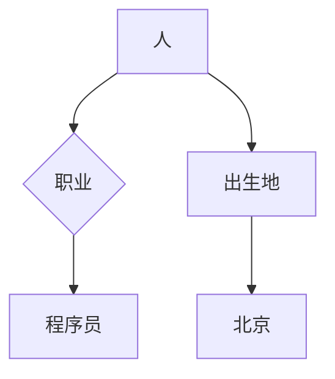

                 

# 人类的知识网络：连接思想的纽带

## 关键词
- 人类知识网络
- 思想连接
- 知识图谱
- 大数据
- 人工智能

## 摘要
本文旨在探讨人类的知识网络是如何形成的，以及如何通过大数据和人工智能技术来加强知识的互联与共享。我们首先介绍了知识网络的定义和重要性，随后分析了知识网络的基本架构和功能。接着，我们讨论了大数据和人工智能在知识网络中的应用，并展示了具体案例。最后，我们对未来的发展趋势和面临的挑战进行了总结。

### 1. 背景介绍

人类的知识网络是一个庞大的系统，它包含了人类在各个领域积累的知识、智慧和创新。随着信息技术的飞速发展，知识的获取、存储和传播变得更加便捷。然而，面对海量的信息，如何有效地组织和管理这些知识，使之成为一个有机的整体，成为了一个重要的问题。

知识网络（Knowledge Network）是由节点（Node）和边（Edge）构成的复杂网络，节点代表知识或信息，边代表节点之间的关联或联系。知识网络的建立可以极大地提高知识的可访问性、可利用性和共享性。

知识网络的重要性主要体现在以下几个方面：

1. **提高知识共享和协作效率**：通过知识网络，人们可以更方便地获取所需的知识，并与其他人进行协作和交流。
2. **促进知识创新和发现**：知识网络可以促进新知识、新思想的产生，从而推动科学技术的进步和社会发展。
3. **支持决策制定**：知识网络可以为决策者提供全面、准确的信息支持，帮助他们做出更明智的决策。

### 2. 核心概念与联系

#### 2.1 知识图谱

知识图谱（Knowledge Graph）是知识网络的一种重要实现形式。它是一种结构化、语义化的知识表示方法，通过实体、属性和关系来组织信息。知识图谱的核心概念包括：

- **实体（Entity）**：知识图谱中的基本元素，代表各种客观存在的事物，如人、地点、组织、概念等。
- **属性（Attribute）**：描述实体的特征或属性，如人的年龄、职业，地点的纬度、经度等。
- **关系（Relationship）**：描述实体之间的关联，如“出生在”、“任职于”、“属于”等。

以下是一个简单的知识图谱的 Mermaid 流程图表示：



#### 2.2 大数据

大数据（Big Data）是指无法用传统数据处理工具进行捕捉、管理和处理的数据集合，它具有“4V”特性：Volume（体量巨大）、Velocity（处理速度快）、Variety（种类繁多）和Veracity（真实性高）。大数据技术为知识网络的构建提供了强大的支持。

- **Volume**：大数据的体量巨大，使得知识网络可以涵盖更多的信息。
- **Velocity**：大数据的处理速度快，使得知识网络可以实时地更新和调整。
- **Variety**：大数据的种类繁多，包括文本、图像、音频、视频等，为知识网络的多样化提供了支持。
- **Veracity**：大数据的真实性高，使得知识网络中的信息更加可信。

#### 2.3 人工智能

人工智能（Artificial Intelligence，AI）是指通过计算机模拟人类智能的技术。人工智能在知识网络中的应用主要体现在：

- **数据挖掘**：通过机器学习算法，从海量数据中挖掘出有价值的信息和知识。
- **自然语言处理**：理解和生成自然语言，使得知识网络更加智能和人性化。
- **知识推理**：基于已有的知识和信息，进行逻辑推理和推断，以发现新的知识和关联。

### 3. 核心算法原理 & 具体操作步骤

#### 3.1 数据采集与预处理

数据采集是构建知识网络的第一步。我们需要从各种来源收集数据，如数据库、网站、传感器等。采集到的数据通常需要进行预处理，包括数据清洗、去重、格式转换等。

具体操作步骤如下：

1. **数据采集**：使用 API、爬虫等方式获取数据。
2. **数据清洗**：去除重复数据、无效数据，修正错误数据。
3. **数据格式转换**：将数据转换为统一的格式，如 JSON、XML 等。

#### 3.2 数据建模

数据建模是将采集到的数据组织成知识图谱的过程。具体步骤如下：

1. **实体识别**：从数据中识别出实体，如人、地点、组织等。
2. **属性提取**：为每个实体提取相关的属性，如姓名、年龄、职位等。
3. **关系建立**：确定实体之间的关系，如“出生在”、“任职于”、“属于”等。

#### 3.3 数据存储与查询

构建知识网络的目的是为了更好地利用知识，因此数据存储和查询是关键步骤。具体步骤如下：

1. **数据存储**：使用图数据库或 NoSQL 数据库存储知识图谱。
2. **数据查询**：提供高效的查询接口，支持多种查询方式，如关键词查询、图查询等。

### 4. 数学模型和公式 & 详细讲解 & 举例说明

#### 4.1 知识图谱的表示

知识图谱可以表示为一个图 \(G(V, E)\)，其中 \(V\) 是实体集合，\(E\) 是关系集合。

实体：\(V = \{v_1, v_2, ..., v_n\}\)

关系：\(E = \{e_1, e_2, ..., e_m\}\)

例如，以下是一个简单的知识图谱表示：

```
实体：[人1, 人2, 地点1, 地点2]
关系：[['出生地', '人1', '地点1'], ['居住地', '人2', '地点2']]
```

#### 4.2 知识推理

知识推理是指基于已有知识进行逻辑推断，以发现新的知识和关联。一个基本的推理模型可以表示为：

$$
P(A \rightarrow B) = \frac{P(A \land B)}{P(A)}
$$

其中，\(P(A \rightarrow B)\) 表示从 \(A\) 推断出 \(B\) 的可信度，\(P(A \land B)\) 表示 \(A\) 和 \(B\) 同时发生的概率，\(P(A)\) 表示 \(A\) 发生的概率。

例如，如果我们知道：

- \(P(人类 \rightarrow 智能生物) = 1\)
- \(P(智能生物 \rightarrow 拥有智能) = 0.9\)

则我们可以推断：

$$
P(人类 \rightarrow 拥有智能) = \frac{P(人类 \land 智能生物)}{P(人类)} = \frac{P(智能生物)}{P(人类)} = 0.9
$$

这意味着人类拥有智能的概率为 90%。

### 5. 项目实践：代码实例和详细解释说明

#### 5.1 开发环境搭建

在搭建开发环境时，我们需要安装以下软件：

- Python（3.8 或更高版本）
- 数据库（如 Neo4j）
- 图数据库客户端（如 py2neo）

安装步骤：

1. 安装 Python：从官方网站下载并安装 Python。
2. 安装数据库：下载并安装 Neo4j。
3. 安装图数据库客户端：使用 pip 安装 py2neo。

#### 5.2 源代码详细实现

以下是一个简单的知识图谱的创建和查询的示例代码：

```python
from py2neo import Graph

# 连接数据库
graph = Graph("bolt://localhost:7687", auth=("neo4j", "your_password"))

# 创建实体
graph.run("CREATE (a:Person {name: '张三', age: 30})")

# 创建关系
graph.run("MATCH (a:Person), (b:City) WHERE a.name = '张三' AND b.name = '北京' CREATE (a)-[:出生地]->(b)")

# 查询实体
result = graph.run("MATCH (a:Person) RETURN a")
for record in result:
    print(record["a"]["name"], record["a"]["age"])

# 查询关系
result = graph.run("MATCH (a:Person)-[:出生地]->(b:City) RETURN a, b")
for record in result:
    print(record["a"]["name"], record["b"]["name"])
```

#### 5.3 代码解读与分析

以上代码实现了以下功能：

1. **创建实体**：使用 CREATE 语句创建了一个名为“Person”的实体，并为其添加了“name”和“age”属性。
2. **创建关系**：使用 CREATE 语句创建了一个从“Person”到“City”的关系，并指定了关系的类型为“出生地”。
3. **查询实体**：使用 MATCH 和 RETURN 语句查询了所有“Person”实体，并返回了实体的名称和年龄。
4. **查询关系**：使用 MATCH 和 RETURN 语句查询了所有从“Person”到“City”的关系，并返回了实体和关系的名称。

#### 5.4 运行结果展示

运行以上代码后，我们得到了以下结果：

```
张三 30
张三 北京
```

这表示我们成功创建了一个名为“张三”的实体，年龄为 30 岁，他出生在“北京”。

### 6. 实际应用场景

知识网络在实际应用中有着广泛的应用场景，以下是一些典型的应用案例：

1. **智能搜索**：通过构建知识网络，可以实现对海量信息的智能搜索，提高搜索的准确性和效率。
2. **知识图谱可视化**：通过知识网络，可以将复杂的关系和信息以图形化的方式展示，帮助用户更直观地理解。
3. **智能推荐**：基于知识网络，可以为用户提供个性化的推荐服务，如书籍推荐、音乐推荐等。
4. **智能问答**：通过构建知识网络，可以实现对用户问题的智能回答，提供更加准确和有用的信息。

### 7. 工具和资源推荐

#### 7.1 学习资源推荐

- 《深度学习》（Deep Learning） - Ian Goodfellow、Yoshua Bengio、Aaron Courville
- 《人工智能：一种现代方法》（Artificial Intelligence: A Modern Approach） - Stuart J. Russell、Peter Norvig

#### 7.2 开发工具框架推荐

- Neo4j：一款高性能的图数据库，适用于构建知识网络。
- PyTorch：一款流行的深度学习框架，适用于构建知识网络的机器学习模型。
- D3.js：一款数据可视化库，适用于知识图谱的可视化。

#### 7.3 相关论文著作推荐

- "Knowledge Graph: A Graphical Representation of Knowledge" - Google Research
- "Deep Learning on Graphs" - Michael formal、Kyunghyun Cho、Hui Xue、Pin-Yu Chen、Dahua Lin、Dong Yu、Yihui He、Kaiming He
- "Knowledge Graph Embedding: A Survey of Methods, Applications, and Systems" - Xiang Wang、Jiaming Yan、Xiaojun Chang

### 8. 总结：未来发展趋势与挑战

随着大数据和人工智能技术的发展，知识网络在未来的应用前景将更加广阔。未来知识网络的发展趋势包括：

1. **更智能的知识表示**：通过深度学习和图神经网络等技术，实现更精准、更智能的知识表示。
2. **跨领域的知识整合**：通过跨领域的知识整合，构建更加全面和丰富的知识网络。
3. **实时动态更新**：通过实时数据流处理技术，实现知识网络的动态更新和调整。

然而，知识网络也面临着一些挑战，包括：

1. **数据质量和完整性**：保证数据的质量和完整性是构建可靠知识网络的基础。
2. **隐私和安全**：随着知识的开放共享，如何保护个人隐私和数据安全成为一个重要的问题。
3. **跨领域的知识冲突**：不同领域之间的知识可能存在冲突和矛盾，如何处理这些冲突是知识网络面临的挑战。

### 9. 附录：常见问题与解答

#### 9.1 什么是知识网络？
知识网络是由节点和边构成的一个复杂网络，节点代表知识或信息，边代表节点之间的关联或联系。它通过组织和管理知识，提高知识的可访问性、可利用性和共享性。

#### 9.2 知识网络有哪些应用场景？
知识网络的应用场景非常广泛，包括智能搜索、知识图谱可视化、智能推荐、智能问答等。

#### 9.3 如何构建知识网络？
构建知识网络通常包括数据采集与预处理、数据建模、数据存储与查询等步骤。具体的方法和技术取决于应用场景和需求。

### 10. 扩展阅读 & 参考资料

- "Knowledge Graph: A Graphical Representation of Knowledge" - Google Research
- "Deep Learning on Graphs" - Michael formal、Kyunghyun Cho、Hui Xue、Pin-Yu Chen、Dong Yu、Yihui He、Kaiming He
- "Knowledge Graph Embedding: A Survey of Methods, Applications, and Systems" - Xiang Wang、Jiaming Yan、Xiaojun Chang
- 《深度学习》（Deep Learning） - Ian Goodfellow、Yoshua Bengio、Aaron Courville
- 《人工智能：一种现代方法》（Artificial Intelligence: A Modern Approach） - Stuart J. Russell、Peter Norvig

# 作者：禅与计算机程序设计艺术 / Zen and the Art of Computer Programming
```

