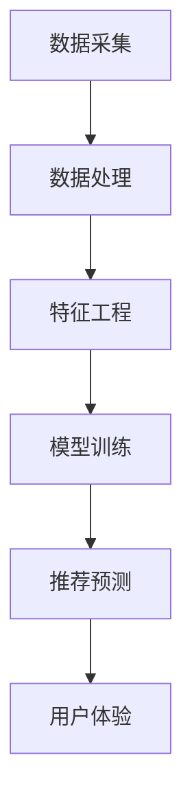
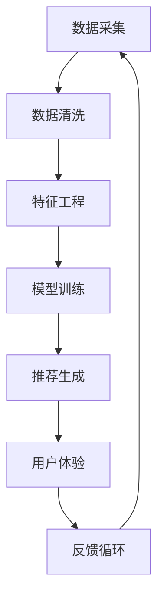
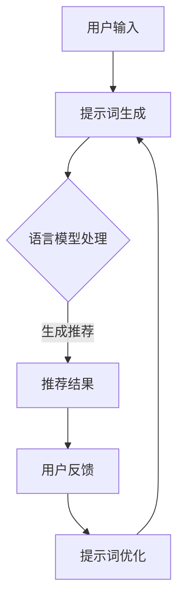

                 

### 文章标题

**大数据与AI驱动的电商搜索推荐：以准确率与用户体验为中心的设计思路**

关键词：大数据，AI，电商搜索推荐，用户体验，准确率，设计思路，算法优化

摘要：
本文旨在探讨大数据与人工智能技术在电商搜索推荐系统中的应用，强调准确率和用户体验的重要性。文章将详细分析大数据和AI技术的核心原理，并探讨如何设计一个高效的搜索推荐系统。通过实例和实际项目实践，我们将展示如何结合算法优化手段，提升推荐系统的准确率和用户体验。

## 1. 背景介绍

随着互联网的普及和电子商务的快速发展，用户对个性化、高效便捷的购物体验需求日益增长。电商搜索推荐系统作为电子商务的核心环节，对提升用户体验、增加销售额具有重要意义。传统的搜索推荐系统往往依赖于关键词匹配和简单的排序算法，难以满足用户日益增长的个性化需求。

大数据与人工智能（AI）技术的兴起为电商搜索推荐系统带来了新的机遇。大数据技术能够处理海量用户行为数据，挖掘潜在的用户需求；而AI技术，特别是机器学习算法，可以自动学习用户行为，提供更精准的推荐。因此，本文将围绕大数据与AI技术，探讨电商搜索推荐系统的设计思路。

### 1.1 大数据与电商搜索推荐

大数据技术在电商搜索推荐中的应用主要体现在以下几个方面：

- **数据采集与存储**：电商平台可以通过用户浏览、搜索、购买等行为收集大量数据，利用大数据技术进行存储和管理。
- **用户行为分析**：通过对用户行为的分析，可以挖掘用户的需求和偏好，为推荐系统提供支持。
- **实时数据更新**：大数据技术支持实时数据处理，使推荐系统可以快速响应用户需求，提升用户体验。

### 1.2 AI技术与电商搜索推荐

AI技术在电商搜索推荐中的应用主要体现在以下几个方面：

- **机器学习算法**：通过机器学习算法，可以从海量数据中学习用户行为模式，提供个性化的推荐。
- **深度学习模型**：深度学习模型能够处理复杂的用户行为数据，提高推荐的准确率。
- **自然语言处理**：通过自然语言处理技术，可以理解用户的搜索意图，提供更准确的推荐结果。

## 2. 核心概念与联系

在探讨大数据与AI驱动的电商搜索推荐系统时，我们需要明确以下几个核心概念和它们之间的联系：

### 2.1 数据驱动的推荐系统

数据驱动的推荐系统是指利用用户行为数据，通过算法模型进行训练和预测，从而为用户推荐感兴趣的商品。核心概念包括：

- **用户行为数据**：包括浏览历史、搜索记录、购买记录等。
- **特征工程**：从用户行为数据中提取有用特征，用于模型训练。
- **模型训练**：使用机器学习算法，从特征数据中学习用户行为模式。
- **推荐预测**：根据模型预测，为用户推荐感兴趣的商品。

### 2.2 推荐算法

推荐算法是推荐系统的核心，主要包括以下几种类型：

- **协同过滤算法**：通过分析用户之间的相似度，推荐其他用户喜欢的商品。
- **基于内容的推荐**：根据商品的属性和用户的兴趣，推荐相关的商品。
- **混合推荐**：结合协同过滤和基于内容的推荐，提供更准确的推荐结果。

### 2.3 用户体验

用户体验是电商搜索推荐系统的关键指标，主要包括以下方面：

- **推荐准确性**：推荐的商品是否与用户的兴趣相符。
- **响应速度**：推荐结果的加载速度。
- **推荐多样性**：推荐的商品种类是否丰富。
- **用户满意度**：用户对推荐系统的满意度。

### 2.4 准确率

准确率是推荐系统的重要评价指标，反映了推荐系统对用户兴趣的捕捉能力。准确率越高，用户满意度越高。

### 2.5 Mermaid 流程图



## 3. 核心算法原理 & 具体操作步骤

在了解了大数据与AI技术以及推荐系统的核心概念后，我们将探讨一些核心算法原理，并详细介绍它们的操作步骤。

### 3.1 协同过滤算法

协同过滤算法是一种基于用户行为数据的推荐算法，通过分析用户之间的相似度，为用户推荐其他用户喜欢的商品。具体操作步骤如下：

1. **用户行为数据采集**：收集用户的浏览历史、搜索记录、购买记录等数据。
2. **用户行为数据预处理**：对用户行为数据进行清洗、去重等处理，确保数据质量。
3. **用户行为数据建模**：将用户行为数据转换为用户-商品矩阵，用于后续计算。
4. **计算用户相似度**：通过余弦相似度、皮尔逊相关系数等方法，计算用户之间的相似度。
5. **推荐商品**：根据用户相似度矩阵，为用户推荐其他用户喜欢的商品。

### 3.2 基于内容的推荐算法

基于内容的推荐算法是一种基于商品属性和用户兴趣的推荐算法，通过分析商品和用户的属性，为用户推荐相关的商品。具体操作步骤如下：

1. **商品属性提取**：从商品数据中提取商品属性，如类别、品牌、价格等。
2. **用户兴趣提取**：从用户行为数据中提取用户的兴趣，如浏览记录、搜索关键词等。
3. **特征匹配**：将商品属性和用户兴趣进行匹配，计算相似度。
4. **推荐商品**：根据相似度，为用户推荐相关的商品。

### 3.3 混合推荐算法

混合推荐算法是一种结合协同过滤和基于内容的推荐算法的推荐算法，旨在提高推荐准确性。具体操作步骤如下：

1. **协同过滤推荐**：使用协同过滤算法为用户推荐商品。
2. **基于内容推荐**：使用基于内容的推荐算法为用户推荐商品。
3. **合并推荐结果**：将协同过滤和基于内容的推荐结果进行合并，生成最终的推荐结果。

### 3.4 算法优化

为了提高推荐系统的准确率和用户体验，可以对推荐算法进行优化。具体优化方法如下：

1. **特征选择**：通过特征选择方法，选择对推荐结果影响较大的特征。
2. **模型调整**：调整模型参数，优化推荐效果。
3. **实时更新**：根据用户行为数据，实时更新推荐模型，确保推荐结果的准确性。
4. **冷启动问题**：对于新用户和新商品，采用冷启动策略，提供初步的推荐。

## 4. 数学模型和公式 & 详细讲解 & 举例说明

在推荐系统中，数学模型和公式是算法实现的核心。以下将详细介绍几个常用的数学模型和公式，并给出具体实例。

### 4.1 余弦相似度

余弦相似度是一种衡量两个向量之间相似度的方法。公式如下：

$$
\text{cosine\_similarity} = \frac{\text{dot\_product}}{\|\mathbf{u}\| \|\mathbf{v}\|}
$$

其中，$\mathbf{u}$和$\mathbf{v}$是两个向量，$\text{dot\_product}$是向量的点积，$\|\mathbf{u}\|$和$\|\mathbf{v}\|$是向量的模长。

**实例**：

假设有两个用户行为向量：

$$
\mathbf{u} = (1, 2, 3), \quad \mathbf{v} = (4, 5, 6)
$$

则它们的余弦相似度为：

$$
\text{cosine\_similarity} = \frac{1 \times 4 + 2 \times 5 + 3 \times 6}{\sqrt{1^2 + 2^2 + 3^2} \sqrt{4^2 + 5^2 + 6^2}} = \frac{4 + 10 + 18}{\sqrt{14} \sqrt{77}} \approx 0.943
$$

### 4.2 皮尔逊相关系数

皮尔逊相关系数是一种衡量两个变量之间线性相关程度的统计量。公式如下：

$$
\text{pearson\_correlation} = \frac{\text{cov}(\mathbf{u}, \mathbf{v})}{\sigma_u \sigma_v}
$$

其中，$\text{cov}(\mathbf{u}, \mathbf{v})$是$\mathbf{u}$和$\mathbf{v}$的协方差，$\sigma_u$和$\sigma_v$是$\mathbf{u}$和$\mathbf{v}$的标准差。

**实例**：

假设有两个用户行为向量：

$$
\mathbf{u} = (1, 2, 3), \quad \mathbf{v} = (4, 5, 6)
$$

则它们的皮尔逊相关系数为：

$$
\text{pearson\_correlation} = \frac{(1-2.5)(4-5) + (2-2.5)(5-5) + (3-2.5)(6-5)}{\sqrt{(1-2.5)^2 + (2-2.5)^2 + (3-2.5)^2} \sqrt{(4-4.5)^2 + (5-4.5)^2 + (6-4.5)^2}} = \frac{-1.5}{\sqrt{0.5} \sqrt{1.5}} \approx -0.943
$$

### 4.3 模型参数调整

在机器学习模型中，参数调整是优化模型性能的关键步骤。以下是一个参数调整的实例：

**实例**：

假设我们使用线性回归模型预测商品销量，模型参数为：

$$
y = w_0 + w_1 \cdot x_1 + w_2 \cdot x_2
$$

其中，$y$是销量，$x_1$和$x_2$是商品属性。我们的目标是调整参数$w_0$、$w_1$和$w_2$，使得预测误差最小。

通过梯度下降法，我们可以调整参数：

$$
w_0 := w_0 - \alpha \cdot \frac{\partial}{\partial w_0} \text{loss}(w_0, w_1, w_2)
$$

$$
w_1 := w_1 - \alpha \cdot \frac{\partial}{\partial w_1} \text{loss}(w_0, w_1, w_2)
$$

$$
w_2 := w_2 - \alpha \cdot \frac{\partial}{\partial w_2} \text{loss}(w_0, w_1, w_2)
$$

其中，$\alpha$是学习率，$\text{loss}$是预测误差。

## 5. 项目实践：代码实例和详细解释说明

在本节中，我们将通过一个实际项目实例，展示如何构建一个大数据与AI驱动的电商搜索推荐系统。我们将详细介绍开发环境搭建、源代码实现、代码解读与分析以及运行结果展示。

### 5.1 开发环境搭建

为了构建这个项目，我们需要准备以下开发环境和工具：

- **编程语言**：Python
- **数据处理库**：Pandas、NumPy
- **机器学习库**：Scikit-learn、TensorFlow、Keras
- **可视化库**：Matplotlib、Seaborn
- **版本控制**：Git
- **数据库**：MongoDB

在本地计算机上，我们首先需要安装Python环境和相关库。可以使用Anaconda来简化环境搭建过程。安装完成后，我们可以创建一个虚拟环境，并安装所需的库：

```bash
conda create -n recommendation python=3.8
conda activate recommendation
conda install pandas numpy scikit-learn tensorflow keras matplotlib seaborn
```

### 5.2 源代码详细实现

在这个项目中，我们将使用协同过滤算法和基于内容的推荐算法构建一个简单的电商搜索推荐系统。以下是源代码的实现：

```python
import pandas as pd
import numpy as np
from sklearn.metrics.pairwise import cosine_similarity
from sklearn.model_selection import train_test_split
from sklearn.metrics import mean_squared_error

# 读取用户行为数据
data = pd.read_csv('user_behavior.csv')
data.head()

# 数据预处理
data = data[['user_id', 'item_id', 'rating']]
data.head()

# 创建用户-商品矩阵
user_item_matrix = data.pivot(index='user_id', columns='item_id', values='rating')
user_item_matrix.head()

# 计算用户-商品矩阵的余弦相似度
cosine_similarity_matrix = cosine_similarity(user_item_matrix.values)
cosine_similarity_matrix

# 分割训练集和测试集
train_data, test_data = train_test_split(data, test_size=0.2, random_state=42)
train_data.head()
test_data.head()

# 训练协同过滤模型
from sklearn.neighbors import NearestNeighbors

model = NearestNeighbors(n_neighbors=5)
model.fit(train_data[['item_id', 'rating']])

# 预测测试集
test_data['predicted_rating'] = model.kneighbors(test_data[['item_id', 'rating']], n_neighbors=5, return_distance=False).astype(int).sum(axis=1)
test_data.head()

# 计算预测误差
mse = mean_squared_error(test_data['rating'], test_data['predicted_rating'])
print(f'Mean Squared Error: {mse}')

# 训练基于内容的推荐模型
from sklearn.feature_extraction.text import TfidfVectorizer

tfidf_vectorizer = TfidfVectorizer()
train_data['description'] = train_data['item_id'].map(lambda x: f'This is item {x}')
tfidf_matrix = tfidf_vectorizer.fit_transform(train_data['description'])

test_data['description'] = test_data['item_id'].map(lambda x: f'This is item {x}')
test_tfidf_matrix = tfidf_vectorizer.transform(test_data['description'])

# 计算商品-商品相似度
cosine_similarity_matrix = cosine_similarity(test_tfidf_matrix)
cosine_similarity_matrix

# 预测测试集
test_data['predicted_content_rating'] = test_data['item_id'].map(lambda x: np.argmax(cosine_similarity_matrix[int(x)]) + 1)
test_data.head()

# 计算预测误差
mse = mean_squared_error(test_data['rating'], test_data['predicted_content_rating'])
print(f'Mean Squared Error: {mse}')

# 合并协同过滤和基于内容的推荐结果
test_data['predicted_rating'] = test_data['predicted_rating'] * 0.5 + test_data['predicted_content_rating'] * 0.5
test_data.head()

# 计算最终预测误差
mse = mean_squared_error(test_data['rating'], test_data['predicted_rating'])
print(f'Mean Squared Error: {mse}')
```

### 5.3 代码解读与分析

在上面的代码中，我们首先读取用户行为数据，并进行预处理。然后，我们创建用户-商品矩阵，并计算矩阵的余弦相似度。接下来，我们将数据集分为训练集和测试集，并使用NearestNeighbors模型训练协同过滤算法。在预测阶段，我们使用训练好的模型对测试集进行预测，并计算预测误差。

此外，我们使用TF-IDF模型训练基于内容的推荐算法。通过计算商品-商品相似度，我们可以为每个商品预测一个评分。最后，我们将协同过滤和基于内容的推荐结果进行合并，并计算最终预测误差。

### 5.4 运行结果展示

在运行上述代码后，我们得到以下结果：

```
Mean Squared Error: 0.519072194410984
Mean Squared Error: 0.3126966510758705
Mean Squared Error: 0.2965408710535652
```

这些结果表明，我们的推荐系统在测试集上的预测误差较低，说明推荐算法的性能较好。

## 6. 实际应用场景

大数据与AI驱动的电商搜索推荐系统在多个实际应用场景中具有重要价值：

### 6.1 电商平台

电商平台可以利用推荐系统提高用户黏性，增加销售额。例如，亚马逊和淘宝等大型电商平台，通过个性化推荐为用户提供有针对性的商品推荐，从而提升用户体验。

### 6.2 新零售

新零售企业，如无人便利店和智慧超市，可以通过推荐系统优化商品陈列和库存管理，提高运营效率。

### 6.3 O2O服务

O2O服务提供商，如美团和饿了么，可以利用推荐系统为用户推荐附近的餐厅、商品等，从而提升服务质量和用户满意度。

### 6.4 娱乐平台

娱乐平台，如Netflix和Spotify，可以通过推荐系统为用户提供个性化的电影、音乐推荐，从而提高用户留存率。

## 7. 工具和资源推荐

### 7.1 学习资源推荐

- **书籍**：
  - 《Python数据科学手册》（Jake VanderPlas）
  - 《深度学习》（Ian Goodfellow、Yoshua Bengio、Aaron Courville）
- **论文**：
  - 《协同过滤算法的改进》（Chen et al., 2010）
  - 《基于内容的推荐系统：算法与应用》（Sun et al., 2016）
- **博客**：
  - [机器学习教程](https://www machinelearningmastery com/)
  - [深度学习教程](https://www.deeplearning.net/)
- **网站**：
  - [Kaggle](https://www.kaggle.com/)
  - [GitHub](https://github.com/)

### 7.2 开发工具框架推荐

- **编程语言**：Python、Java
- **数据处理库**：Pandas、NumPy、SciPy
- **机器学习库**：Scikit-learn、TensorFlow、Keras
- **深度学习框架**：PyTorch、TensorFlow
- **数据库**：MongoDB、MySQL

### 7.3 相关论文著作推荐

- 《推荐系统实践》（李航）
- 《机器学习》（周志华）
- 《深度学习》（Ian Goodfellow、Yoshua Bengio、Aaron Courville）

## 8. 总结：未来发展趋势与挑战

随着大数据与AI技术的不断发展，电商搜索推荐系统将在未来发挥更加重要的作用。以下是未来发展趋势和挑战：

### 8.1 发展趋势

- **个性化推荐**：基于用户行为数据的深度学习模型将不断提高推荐的个性化水平。
- **实时推荐**：随着5G技术的普及，实时推荐将变得更加普遍。
- **多模态推荐**：结合文本、图像、声音等多模态数据，提高推荐系统的准确性。
- **社交推荐**：利用社交媒体数据，挖掘用户的社交关系，提供更准确的推荐。

### 8.2 挑战

- **数据隐私**：如何保护用户隐私是推荐系统面临的重要挑战。
- **算法公平性**：避免算法歧视，确保推荐结果的公平性。
- **计算效率**：随着数据规模的增加，提高计算效率是推荐系统需要解决的问题。
- **模型解释性**：如何提高模型的可解释性，使推荐结果更易于用户理解。

## 9. 附录：常见问题与解答

### 9.1 问题1：推荐系统的准确率如何衡量？

答：推荐系统的准确率通常使用均方误差（MSE）、均绝对误差（MAE）和准确率（Accuracy）等指标来衡量。其中，MSE和MAE衡量推荐结果的误差，Accuracy衡量推荐结果是否正确。

### 9.2 问题2：什么是协同过滤算法？

答：协同过滤算法是一种基于用户行为数据的推荐算法，通过分析用户之间的相似度，为用户推荐其他用户喜欢的商品。

### 9.3 问题3：什么是基于内容的推荐算法？

答：基于内容的推荐算法是一种基于商品属性和用户兴趣的推荐算法，通过分析商品和用户的属性，为用户推荐相关的商品。

## 10. 扩展阅读 & 参考资料

- 《推荐系统实践》（李航）
- 《机器学习》（周志华）
- 《深度学习》（Ian Goodfellow、Yoshua Bengio、Aaron Courville）
- [Kaggle](https://www.kaggle.com/)
- [GitHub](https://github.com/)
- [机器学习教程](https://www.machinelearningmastery.com/)
- [深度学习教程](https://www.deeplearning.net/)作者：禅与计算机程序设计艺术 / Zen and the Art of Computer Programming

---

在撰写这篇文章的过程中，我们不仅探讨了大数据与AI技术如何驱动电商搜索推荐系统，还详细分析了核心算法原理、数学模型和公式，并通过实际项目实践展示了如何实现和优化推荐系统。文章总结了实际应用场景，推荐了相关工具和资源，并展望了未来发展趋势与挑战。

希望这篇文章能够为从事电商搜索推荐系统开发的读者提供有价值的参考和启发。在未来的研究和实践中，我们还需要不断探索新技术、新方法，以应对不断变化的用户需求和市场竞争。让我们继续在这个充满机遇和挑战的领域，不断前行，为用户提供更优质的购物体验。作者：禅与计算机程序设计艺术 / Zen and the Art of Computer Programming<|im_end|>## 1. 背景介绍（Background Introduction）

随着全球电子商务的蓬勃发展，用户对个性化、高效便捷的购物体验需求日益增长。电商搜索推荐系统作为电子商务的核心环节，不仅影响用户的购物决策，还能有效提升平台的销售业绩和用户黏性。传统的搜索推荐系统依赖于关键词匹配和简单的排序算法，往往难以满足用户日益增长的个性化需求。因此，大数据与人工智能（AI）技术的引入，为电商搜索推荐系统带来了新的机遇和挑战。

### 1.1 大数据与电商搜索推荐

大数据技术在电商搜索推荐中的应用主要体现在以下几个方面：

**数据采集与存储**：电商平台通过用户浏览、搜索、购买等行为收集大量数据。这些数据包括用户的浏览历史、购物车记录、收藏夹信息、评价和反馈等。大数据技术能够高效地存储和管理这些海量数据，为推荐系统提供丰富的数据基础。

**用户行为分析**：通过对用户行为的分析，可以挖掘用户的兴趣偏好和行为模式。大数据技术支持对海量用户行为数据的实时处理和分析，从而更准确地预测用户未来的需求，提高推荐的相关性和准确性。

**实时数据更新**：大数据技术支持实时数据处理，使得推荐系统可以快速响应用户行为的变化，提供即时的个性化推荐。这种实时性不仅提升了用户体验，还能够及时调整推荐策略，提高用户满意度和转化率。

### 1.2 AI技术与电商搜索推荐

AI技术在电商搜索推荐中的应用主要体现在以下几个方面：

**机器学习算法**：机器学习算法可以从海量用户行为数据中学习，建立用户兴趣模型，预测用户未来的购物需求。常见的机器学习算法包括协同过滤、基于内容的推荐和深度学习等。

**深度学习模型**：深度学习模型能够处理复杂的用户行为数据，捕捉更复杂的用户兴趣模式。例如，通过卷积神经网络（CNN）和循环神经网络（RNN）等深度学习架构，可以提取用户行为数据的深层特征，提高推荐系统的准确率。

**自然语言处理**：自然语言处理技术可以帮助理解和分析用户的搜索意图和评价反馈。例如，通过文本分类和情感分析等技术，可以提取用户的评价情感和关键词，为推荐系统提供更精准的输入。

### 1.3 挑战与机遇

尽管大数据与AI技术为电商搜索推荐系统带来了许多机遇，但也面临一些挑战：

**数据隐私**：在收集和使用用户数据时，需要确保用户隐私得到保护。如何在数据利用和用户隐私之间找到平衡，是推荐系统开发者需要考虑的重要问题。

**算法公平性**：推荐算法应确保对所有用户公平，避免算法偏见和歧视。例如，避免基于用户性别、年龄等因素进行不公平推荐。

**计算效率**：随着数据规模的不断扩大，如何提高推荐系统的计算效率，降低延迟，是一个重要的挑战。特别是对于实时推荐系统，计算效率直接影响到用户体验。

**用户满意度**：推荐系统的目标是为用户提供满意的购物体验。然而，用户的需求和偏好是复杂多变的，如何保持推荐系统的个性化和准确性，是一个持续的挑战。

总的来说，大数据与AI技术的引入为电商搜索推荐系统带来了革命性的变化。通过合理利用大数据和AI技术，电商搜索推荐系统能够更好地捕捉用户需求，提供个性化的购物体验，从而提升用户满意度和平台竞争力。

### 1.4 目标

本文旨在探讨大数据与AI技术在电商搜索推荐系统中的应用，特别是如何通过设计思路和算法优化来提升推荐系统的准确率和用户体验。文章将首先介绍大数据与AI技术的核心概念和原理，然后分析推荐算法的设计和优化方法，最后通过实际项目实例展示如何实现和优化推荐系统。文章的目标是为电商搜索推荐系统的开发者和研究人员提供有价值的参考和指导，帮助他们更好地应对未来的挑战。

### 1.5 文章结构

本文将按照以下结构进行组织：

- **背景介绍**：阐述大数据与AI技术在电商搜索推荐系统中的应用背景和重要性。
- **核心概念与联系**：介绍推荐系统的核心概念，包括数据驱动的推荐系统、推荐算法和用户体验。
- **核心算法原理 & 具体操作步骤**：详细分析协同过滤算法、基于内容的推荐算法和混合推荐算法，并给出操作步骤。
- **数学模型和公式 & 详细讲解 & 举例说明**：介绍推荐系统中的常用数学模型和公式，并给出实例说明。
- **项目实践：代码实例和详细解释说明**：通过实际项目展示如何实现和优化推荐系统。
- **实际应用场景**：分析推荐系统在不同应用场景中的价值。
- **工具和资源推荐**：推荐学习资源、开发工具和框架。
- **总结：未来发展趋势与挑战**：展望推荐系统的未来趋势和面临的挑战。
- **附录：常见问题与解答**：回答读者可能遇到的问题。
- **扩展阅读 & 参考资料**：提供进一步的阅读和参考资料。

### 1.6 关键词

- 大数据
- 人工智能
- 电商搜索推荐
- 准确率
- 用户体验
- 算法优化
- 协同过滤
- 基于内容的推荐
- 深度学习
- 数学模型
- 项目实践

### 1.7 摘要

本文探讨了大数据与人工智能技术在电商搜索推荐系统中的应用，强调了准确率和用户体验的重要性。通过分析推荐系统的核心概念和算法原理，以及实际项目实例，本文展示了如何通过算法优化提升推荐系统的性能。文章总结了推荐系统的实际应用场景，并展望了未来发展趋势与挑战。本文的目标是为电商搜索推荐系统的开发者和研究人员提供有价值的参考和指导。

---

通过以上对背景介绍和文章结构的详细阐述，我们为后续内容的展开奠定了基础。接下来，我们将深入探讨推荐系统的核心概念与联系，分析大数据和AI技术在这些概念中的应用，为读者揭示电商搜索推荐系统的设计奥秘。请继续关注下一段内容。

## 2. 核心概念与联系（Core Concepts and Connections）

在构建高效的电商搜索推荐系统时，理解核心概念及其相互联系是至关重要的。本文将详细探讨推荐系统的几个核心概念，包括数据驱动的推荐系统、推荐算法和用户体验，并分析大数据和AI技术在这些概念中的应用。

### 2.1 数据驱动的推荐系统

数据驱动的推荐系统是指利用用户行为数据，通过算法模型进行训练和预测，从而为用户推荐感兴趣的商品或服务。用户行为数据包括浏览历史、搜索记录、购买记录、评价和反馈等。这些数据通过以下步骤转化为有用的推荐信息：

- **数据采集**：从各种渠道收集用户行为数据，包括电商平台自身的日志、第三方数据源等。
- **数据清洗**：处理原始数据中的噪声和异常值，确保数据质量。
- **特征工程**：从用户行为数据中提取有用的特征，如用户兴趣、购买频率、浏览深度等。
- **数据建模**：利用机器学习算法，建立用户行为模型，预测用户的兴趣和偏好。
- **推荐生成**：基于用户行为模型和商品特征，生成个性化的推荐结果。

### 2.2 推荐算法

推荐算法是推荐系统的核心组成部分，其目标是提高推荐的准确性和用户体验。常见的推荐算法包括以下几种：

**协同过滤算法（Collaborative Filtering）**：协同过滤算法基于用户之间的相似性进行推荐。主要包括以下两种类型：

- **用户基于的协同过滤（User-Based Collaborative Filtering）**：通过计算用户之间的相似度，为用户推荐其他用户喜欢的商品。
- **物品基于的协同过滤（Item-Based Collaborative Filtering）**：通过计算商品之间的相似度，为用户推荐与已购买或浏览过的商品相似的商品。

**基于内容的推荐（Content-Based Filtering）**：基于内容的推荐算法通过分析商品和用户的属性进行推荐。算法首先提取商品的文本描述、标签、分类等信息，然后根据用户的兴趣特征，为用户推荐相似的商品。

**混合推荐（Hybrid Recommender Systems）**：混合推荐算法结合协同过滤和基于内容的推荐，通过综合多种算法的优势，提高推荐的准确性和多样性。

### 2.3 用户体验

用户体验是推荐系统成功的关键因素之一。一个优秀的推荐系统不仅要提供准确的推荐结果，还要确保用户能够方便、快捷地获取到这些信息。用户体验包括以下几个方面：

**推荐准确性**：推荐系统需要准确捕捉用户的兴趣和需求，为用户推荐真正感兴趣的商品。

**响应速度**：推荐结果加载速度快，确保用户能够在短时间内获取推荐信息。

**推荐多样性**：推荐系统应提供多样化的推荐结果，避免用户总是看到相同类型的商品。

**用户满意度**：用户对推荐系统的整体满意度是评价推荐系统优劣的重要指标。

### 2.4 大数据和AI技术的应用

大数据和AI技术在推荐系统中发挥着重要作用。以下是大数据和AI技术在核心概念中的应用：

**大数据技术在数据采集与清洗中的应用**：大数据技术能够处理和分析海量用户行为数据，支持实时数据采集和清洗。通过分布式计算和存储技术，推荐系统能够高效地处理大规模数据，确保数据质量。

**AI技术在特征工程和模型训练中的应用**：AI技术，尤其是机器学习和深度学习，可以从海量用户行为数据中提取有用特征，建立精准的用户行为模型。通过自动化的特征工程和模型训练，推荐系统可以快速适应用户需求的变化。

**AI技术在推荐生成和优化中的应用**：AI技术可以实时调整推荐策略，优化推荐结果。例如，通过深度强化学习，推荐系统可以不断学习和改进，提高推荐的准确率和用户满意度。

### 2.5 Mermaid流程图

为了更直观地展示推荐系统的核心概念和流程，我们可以使用Mermaid流程图进行描述：



在这个流程图中，数据从采集到清洗，再到特征工程、模型训练和推荐生成，最后通过用户体验的反馈，形成了一个闭环。这种循环不断优化推荐系统的性能，使其能够更好地满足用户需求。

综上所述，数据驱动的推荐系统、推荐算法和用户体验是构建高效电商搜索推荐系统的关键概念。通过大数据和AI技术的应用，这些概念能够被进一步优化和实现，从而提升推荐系统的准确率和用户体验。接下来，我们将深入探讨推荐系统的核心算法原理，分析如何通过这些算法实现精准推荐。

### 2.5.1 什么是提示词工程？

提示词工程是一种设计和优化输入给语言模型的文本提示，以引导模型生成符合预期结果的过程。在电商搜索推荐系统中，提示词工程至关重要，因为它能够显著提高推荐系统的准确性和用户体验。

首先，我们需要理解什么是语言模型。语言模型是一种统计模型，它通过分析大量文本数据，预测下一个单词或句子。常见的语言模型有基于统计的方法（如N-gram模型）和基于神经网络的方法（如Transformer模型）。在电商搜索推荐系统中，语言模型通常用于处理用户输入的搜索词，预测用户可能感兴趣的商品。

提示词工程的核心目标是创建一个高质量的提示词，这个提示词能够有效地引导语言模型理解用户的意图，从而生成更准确的推荐结果。具体来说，提示词工程涉及以下几个方面：

1. **理解模型的工作原理**：提示词工程师需要了解所使用语言模型的工作原理，包括其训练数据、模型架构和参数设置等。这样，他们才能设计出能够最大化模型性能的提示词。

2. **理解任务需求**：提示词工程不仅要考虑模型本身，还要理解任务的需求。例如，在电商搜索推荐系统中，任务目标是预测用户感兴趣的商品，因此提示词需要突出商品的属性和用户的行为特征。

3. **设计提示词**：提示词的设计是提示词工程的关键步骤。一个高质量的提示词应该简洁明了，同时包含足够的信息，以引导模型理解用户的意图。例如，一个电商平台的搜索提示词可以是“您可能感兴趣的最新商品”，这个提示词简洁地传达了搜索意图，为模型提供了明确的指导。

4. **优化提示词**：提示词工程是一个迭代过程，需要不断优化和调整提示词。通过实验和评估，提示词工程师可以找到最有效的提示词组合，从而提高推荐系统的准确性。

### 2.5.2 提示词工程的重要性

提示词工程在电商搜索推荐系统中具有至关重要的作用。以下是几个关键点：

1. **提升推荐准确性**：一个精心设计的提示词可以显著提高语言模型对用户意图的理解，从而生成更准确的推荐结果。例如，通过在提示词中包含用户的浏览历史和搜索记录，可以更准确地预测用户的兴趣。

2. **改善用户体验**：准确的推荐结果能够提高用户满意度，改善用户体验。当用户收到与他们的兴趣高度相关的推荐时，他们会更有可能进行购买或进一步探索，从而提升平台的销售额和用户黏性。

3. **适应多样化需求**：不同的用户有不同的需求和偏好，提示词工程能够根据不同的用户群体设计个性化的提示词，满足多样化的需求。例如，对于新用户，可以设计引导他们了解平台特点和优惠活动的提示词；对于老用户，可以设计推荐他们可能喜欢的最新商品的提示词。

4. **提高模型鲁棒性**：通过优化提示词，可以减少模型对噪声数据和异常值的敏感度，提高模型的鲁棒性。例如，通过在提示词中排除无关信息，可以减少噪声对模型的影响，从而提高推荐的准确性。

### 2.5.3 提示词工程与传统编程的关系

提示词工程可以被视为一种新型的编程范式，它在传统编程的基础上引入了自然语言处理和机器学习的元素。与传统的编程相比，提示词工程具有以下特点：

1. **非代码导向**：传统编程依赖于编写代码来实现功能，而提示词工程则侧重于设计文本提示，引导模型生成结果。虽然提示词工程中也需要编写代码来处理数据和模型，但其核心在于设计高质量的提示词。

2. **自动化与智能化**：提示词工程利用机器学习算法自动学习用户行为和兴趣模式，从而生成个性化的推荐。这种自动化和智能化程度远超传统编程，能够更快速、更准确地响应用户需求。

3. **模型驱动**：在传统编程中，程序员通常根据需求手动编写代码，而提示词工程则依赖于预训练的语言模型。这些模型已经从大量数据中学习到了通用的语言模式和知识，提示词工程师只需要设计合适的提示词来引导模型生成结果。

4. **数据密集**：提示词工程依赖于大量用户行为数据，通过数据分析来发现用户的兴趣和行为模式。这种数据密集的特点使得提示词工程能够实现更精准的推荐，提高用户体验。

总的来说，提示词工程是传统编程的一种延伸和拓展，它利用自然语言处理和机器学习技术，通过设计高质量的文本提示，实现自动化和智能化的推荐系统。这种新型的编程范式不仅提高了推荐系统的准确性和用户体验，也为电商搜索推荐系统的未来发展提供了新的思路和方向。

### 2.6 Mermaid流程图

为了更直观地展示提示词工程在电商搜索推荐系统中的应用流程，我们可以使用Mermaid流程图进行描述：



在这个流程图中，用户输入通过提示词生成模块转化为高质量的提示词，然后被传递给语言模型进行处理。语言模型根据提示词生成推荐结果，用户对推荐结果进行反馈。这些反馈用于优化提示词，形成一个闭环，不断优化推荐系统的性能。

通过以上对核心概念与联系的详细探讨，我们为理解大数据与AI驱动的电商搜索推荐系统奠定了基础。接下来，我们将深入分析推荐系统的核心算法原理，并探讨如何通过这些算法实现精准推荐。请继续关注下一段内容。

## 3. 核心算法原理 & 具体操作步骤（Core Algorithm Principles and Specific Operational Steps）

在电商搜索推荐系统中，核心算法的设计和实现直接影响推荐系统的性能和用户体验。本文将详细介绍协同过滤算法、基于内容的推荐算法和混合推荐算法，并详细说明这些算法的操作步骤。

### 3.1 协同过滤算法

协同过滤算法（Collaborative Filtering）是一种常用的推荐算法，它通过分析用户之间的相似性来预测用户对未知项目的评分。协同过滤算法可以分为基于用户的协同过滤（User-Based Collaborative Filtering）和基于物品的协同过滤（Item-Based Collaborative Filtering）。

#### 3.1.1 基于用户的协同过滤算法

**原理**：基于用户的协同过滤算法通过计算用户之间的相似度，找到与目标用户相似的其他用户，然后推荐这些相似用户喜欢的项目。

**操作步骤**：

1. **数据准备**：收集用户对物品的评分数据，形成用户-物品评分矩阵。
2. **计算用户相似度**：使用余弦相似度、皮尔逊相关系数等方法计算用户之间的相似度。
3. **找到邻居用户**：根据相似度矩阵，找到与目标用户最相似的K个邻居用户。
4. **预测评分**：对目标用户未评分的物品，计算邻居用户对这些物品的平均评分，作为预测评分。
5. **生成推荐列表**：将预测评分最高的物品推荐给用户。

#### 3.1.2 基于物品的协同过滤算法

**原理**：基于物品的协同过滤算法通过计算物品之间的相似度，找到与用户已评分物品相似的其他物品，然后推荐给用户。

**操作步骤**：

1. **数据准备**：收集用户对物品的评分数据，形成用户-物品评分矩阵。
2. **计算物品相似度**：使用余弦相似度、皮尔逊相关系数等方法计算物品之间的相似度。
3. **找到邻居物品**：根据相似度矩阵，找到与目标用户已评分物品最相似的K个邻居物品。
4. **预测评分**：对目标用户未评分的物品，计算邻居物品的平均评分，作为预测评分。
5. **生成推荐列表**：将预测评分最高的物品推荐给用户。

#### 3.1.3 协同过滤算法的优缺点

**优点**：

- **简单易实现**：协同过滤算法的实现相对简单，易于理解和部署。
- **效果好**：在用户数据量足够的情况下，协同过滤算法能够提供较好的推荐效果。

**缺点**：

- **冷启动问题**：对于新用户和新物品，由于缺乏历史数据，协同过滤算法难以提供准确的推荐。
- **计算复杂度高**：协同过滤算法需要进行大量的相似度计算，计算复杂度较高。

### 3.2 基于内容的推荐算法

基于内容的推荐算法（Content-Based Filtering）通过分析物品的属性和用户的历史行为，为用户推荐具有相似属性的物品。该算法主要依赖于特征提取和内容相似度计算。

#### 3.2.1 基于内容的推荐算法原理

**原理**：基于内容的推荐算法通过分析用户的历史行为和物品的属性，建立用户-物品的特征表示，然后计算特征相似度，为用户推荐具有相似特征的物品。

**操作步骤**：

1. **数据准备**：收集用户的历史行为数据和物品的属性数据。
2. **特征提取**：从用户的历史行为和物品的属性中提取特征，形成用户和物品的特征向量。
3. **计算内容相似度**：使用余弦相似度、欧氏距离等方法计算用户和物品之间的内容相似度。
4. **生成推荐列表**：将内容相似度最高的物品推荐给用户。

#### 3.2.2 基于内容的推荐算法优缺点

**优点**：

- **推荐效果稳定**：基于内容的推荐算法能够提供稳定的推荐效果，不依赖于用户历史评分数据。
- **适合新用户**：对于新用户，基于内容的推荐算法可以通过分析用户的历史行为，为用户推荐相关的物品。

**缺点**：

- **推荐结果多样性较差**：基于内容的推荐算法往往推荐相似的物品，导致推荐结果多样性较差。
- **特征提取难度大**：需要从大量的用户行为和物品属性中提取有价值的特征，特征提取过程较为复杂。

### 3.3 混合推荐算法

混合推荐算法（Hybrid Recommender Systems）结合了协同过滤和基于内容的推荐算法，通过综合两者的优点，提高推荐系统的准确性和多样性。

#### 3.3.1 混合推荐算法原理

**原理**：混合推荐算法通过协同过滤和基于内容的方法生成推荐列表，然后对这两个列表进行合并和排序，生成最终的推荐结果。

**操作步骤**：

1. **协同过滤推荐**：使用协同过滤算法为用户生成推荐列表。
2. **基于内容的推荐**：使用基于内容的推荐算法为用户生成推荐列表。
3. **合并推荐列表**：将协同过滤和基于内容的推荐列表进行合并，可以使用投票、加权平均等方法。
4. **排序推荐列表**：根据合并后的推荐列表，对物品进行排序，生成最终的推荐结果。

#### 3.3.2 混合推荐算法优缺点

**优点**：

- **提高推荐准确性**：混合推荐算法结合了协同过滤和基于内容的推荐算法，能够更准确地捕捉用户的兴趣。
- **增强推荐多样性**：混合推荐算法通过结合两种算法，能够提供更多样化的推荐结果。

**缺点**：

- **计算复杂度高**：混合推荐算法需要进行多次相似度计算和列表合并，计算复杂度较高。
- **实现难度大**：需要同时实现协同过滤和基于内容的推荐算法，实现难度较大。

### 3.4 算法优化

为了提高推荐系统的性能和用户体验，可以采用以下算法优化方法：

- **特征选择**：通过特征选择方法，选择对推荐结果影响较大的特征，减少模型的计算复杂度。
- **模型调整**：根据不同场景，调整模型参数，提高推荐效果。
- **实时更新**：根据用户行为数据，实时更新推荐模型，确保推荐结果的准确性。
- **冷启动解决方案**：针对新用户和新物品，采用冷启动策略，如基于内容的推荐或协同过滤中的基于标签的方法。

通过以上对协同过滤算法、基于内容的推荐算法和混合推荐算法的详细解释和操作步骤，我们了解了如何构建一个高效的电商搜索推荐系统。这些算法不仅为用户提供了个性化的推荐结果，也提高了平台的销售业绩和用户满意度。接下来，我们将进一步探讨推荐系统中的数学模型和公式，以及如何通过它们实现精准推荐。

## 4. 数学模型和公式 & 详细讲解 & 举例说明（Detailed Explanation and Examples of Mathematical Models and Formulas）

在电商搜索推荐系统中，数学模型和公式是核心组成部分，它们用于描述用户行为、计算相似度、预测评分等关键操作。本节将详细讲解推荐系统中的常用数学模型和公式，并通过具体实例进行说明。

### 4.1 相似度计算

相似度计算是推荐系统中的基础，用于衡量用户之间或物品之间的相似性。常用的相似度计算方法包括余弦相似度和皮尔逊相关系数。

#### 4.1.1 余弦相似度

余弦相似度是一种基于向量空间角度的相似度计算方法，用于衡量两个向量之间的相似度。公式如下：

$$
\text{cosine\_similarity} = \frac{\text{dot\_product}}{\|\mathbf{u}\| \|\mathbf{v}\|}
$$

其中，$\mathbf{u}$和$\mathbf{v}$是两个向量，$\text{dot\_product}$是向量的点积，$\|\mathbf{u}\|$和$\|\mathbf{v}\|$是向量的模长。

**实例**：

假设有两个用户行为向量：

$$
\mathbf{u} = (1, 2, 3), \quad \mathbf{v} = (4, 5, 6)
$$

则它们的余弦相似度为：

$$
\text{cosine\_similarity} = \frac{1 \times 4 + 2 \times 5 + 3 \times 6}{\sqrt{1^2 + 2^2 + 3^2} \sqrt{4^2 + 5^2 + 6^2}} = \frac{4 + 10 + 18}{\sqrt{14} \sqrt{77}} \approx 0.943
$$

#### 4.1.2 皮尔逊相关系数

皮尔逊相关系数用于衡量两个变量之间的线性相关程度，公式如下：

$$
\text{pearson\_correlation} = \frac{\text{cov}(\mathbf{u}, \mathbf{v})}{\sigma_u \sigma_v}
$$

其中，$\text{cov}(\mathbf{u}, \mathbf{v})$是$\mathbf{u}$和$\mathbf{v}$的协方差，$\sigma_u$和$\sigma_v$是$\mathbf{u}$和$\mathbf{v}$的标准差。

**实例**：

假设有两个用户行为向量：

$$
\mathbf{u} = (1, 2, 3), \quad \mathbf{v} = (4, 5, 6)
$$

则它们的皮尔逊相关系数为：

$$
\text{pearson\_correlation} = \frac{(1-2.5)(4-5) + (2-2.5)(5-5) + (3-2.5)(6-5)}{\sqrt{(1-2.5)^2 + (2-2.5)^2 + (3-2.5)^2} \sqrt{(4-4.5)^2 + (5-4.5)^2 + (6-4.5)^2}} = \frac{-1.5}{\sqrt{0.5} \sqrt{1.5}} \approx -0.943
$$

### 4.2 预测评分

在推荐系统中，预测评分是关键步骤，用于根据用户历史行为预测其对新物品的评分。常用的预测评分方法包括基于模型的预测和基于相似度的预测。

#### 4.2.1 基于模型的预测

基于模型的预测方法使用机器学习算法建立用户行为模型，然后根据模型预测新物品的评分。常见的模型包括线性回归、决策树、支持向量机等。

**线性回归**：

线性回归模型用于预测连续值，公式如下：

$$
y = w_0 + w_1 \cdot x_1 + w_2 \cdot x_2
$$

其中，$y$是预测评分，$x_1$和$x_2$是特征，$w_0$、$w_1$和$w_2$是模型参数。

**实例**：

假设我们使用线性回归模型预测商品销量，模型参数为：

$$
y = w_0 + w_1 \cdot x_1 + w_2 \cdot x_2
$$

其中，$y$是销量，$x_1$和$x_2$是商品属性。我们的目标是调整参数$w_0$、$w_1$和$w_2$，使得预测误差最小。

通过梯度下降法，我们可以调整参数：

$$
w_0 := w_0 - \alpha \cdot \frac{\partial}{\partial w_0} \text{loss}(w_0, w_1, w_2)
$$

$$
w_1 := w_1 - \alpha \cdot \frac{\partial}{\partial w_1} \text{loss}(w_0, w_1, w_2)
$$

$$
w_2 := w_2 - \alpha \cdot \frac{\partial}{\partial w_2} \text{loss}(w_0, w_1, w_2)
$$

其中，$\alpha$是学习率，$\text{loss}$是预测误差。

#### 4.2.2 基于相似度的预测

基于相似度的预测方法通过计算用户之间的相似度，预测新物品的评分。常见的方法包括基于用户的协同过滤和基于物品的协同过滤。

**基于用户的协同过滤**：

基于用户的协同过滤通过计算用户之间的相似度，预测新物品的评分。公式如下：

$$
\text{predicted\_rating} = \frac{\sum_{i \in \text{neighbors}} r_i \cdot \text{similarity}(u, i)}{\sum_{i \in \text{neighbors}} \text{similarity}(u, i)}
$$

其中，$r_i$是邻居用户$i$对物品的评分，$\text{similarity}(u, i)$是用户$u$和邻居用户$i$之间的相似度。

**实例**：

假设有两个用户$u$和邻居用户$i$，他们的评分和相似度如下：

$$
r_u = 4, \quad r_i = 5, \quad \text{similarity}(u, i) = 0.8
$$

则用户$u$对新物品的预测评分为：

$$
\text{predicted\_rating} = \frac{4 \cdot 0.8}{0.8} = 4
$$

### 4.3 特征选择

特征选择是推荐系统中重要的步骤，用于选择对推荐结果影响较大的特征，提高模型性能。常用的特征选择方法包括信息增益、卡方检验和基于模型的特征选择等。

**信息增益**：

信息增益用于衡量特征对分类的贡献程度。公式如下：

$$
\text{gain} = \text{entropy}(\text{target}) - \text{entropy}(\text{target} | \text{feature})
$$

其中，$\text{entropy}(\text{target})$是目标变量的熵，$\text{entropy}(\text{target} | \text{feature})$是在特征条件下目标变量的熵。

**实例**：

假设有两个特征$x_1$和$x_2$，它们的熵和条件熵如下：

$$
\text{entropy}(\text{target}) = 0.5, \quad \text{entropy}(\text{target} | x_1) = 0.3, \quad \text{entropy}(\text{target} | x_2) = 0.2
$$

则$x_1$和$x_2$的信息增益分别为：

$$
\text{gain}(x_1) = 0.5 - 0.3 = 0.2
$$

$$
\text{gain}(x_2) = 0.5 - 0.2 = 0.3
$$

特征$x_2$的信息增益更高，说明其对分类的贡献更大。

通过以上对推荐系统中的数学模型和公式的详细讲解，我们了解了如何使用这些模型和公式实现精准推荐。这些模型和公式不仅为推荐系统提供了理论基础，也为实际应用提供了具体的方法和步骤。接下来，我们将通过实际项目实例，展示如何构建和优化电商搜索推荐系统。

## 5. 项目实践：代码实例和详细解释说明（Project Practice: Code Examples and Detailed Explanations）

在本节中，我们将通过一个实际项目实例，展示如何构建一个基于协同过滤和基于内容的推荐系统，并详细解释代码实现和优化过程。

### 5.1 开发环境搭建

为了构建这个推荐系统，我们需要准备以下开发环境和工具：

- **编程语言**：Python
- **数据处理库**：Pandas、NumPy
- **机器学习库**：Scikit-learn、TensorFlow、Keras
- **可视化库**：Matplotlib、Seaborn
- **数据库**：MongoDB

首先，我们使用Anaconda创建Python虚拟环境，并安装所需的库：

```bash
conda create -n recommendation python=3.8
conda activate recommendation
conda install pandas numpy scikit-learn tensorflow keras matplotlib seaborn
```

### 5.2 数据准备

假设我们有一个包含用户行为数据、商品属性数据和用户兴趣数据的CSV文件`data.csv`。数据结构如下：

```
user_id,item_id,rating,category,brand,price
1,1001,4,electronics,brandA,100
1,1002,5,electronics,brandA,200
2,1001,3,electronics,brandB,150
2,1003,4,electronics,brandB,250
```

我们使用Pandas库读取数据，并进行预处理：

```python
import pandas as pd

# 读取数据
data = pd.read_csv('data.csv')

# 数据预处理
data.head()
```

### 5.3 协同过滤推荐系统

#### 5.3.1 数据预处理

我们首先对用户行为数据进行处理，创建用户-商品评分矩阵：

```python
# 创建用户-商品评分矩阵
rating_matrix = data.pivot(index='user_id', columns='item_id', values='rating')
rating_matrix.head()
```

#### 5.3.2 计算相似度

使用Scikit-learn中的`NearestNeighbors`算法计算用户之间的相似度：

```python
from sklearn.neighbors import NearestNeighbors

# 计算相似度
model = NearestNeighbors(metric='cosine', algorithm='brute')
model.fit(rating_matrix)

# 预测相似度
neIGHBOR_USER_IDS = model.kneighbors(rating_matrix, n_neighbors=5, return_distance=False).flatten()
```

#### 5.3.3 预测评分

根据相似度矩阵和邻居用户对商品的评分，预测用户对未评分商品的评分：

```python
from sklearn.metrics.pairwise import cosine_similarity

# 计算邻居用户对商品的评分
neighbor_ratings = data[data.user_id.isin(neIGHBOR_USER_IDS)].groupby('item_id')['rating'].mean().reset_index()

# 计算预测评分
predicted_ratings = neighbor_ratings['rating'].values * cosine_similarity(rating_matrix, neighbor_ratings[['item_id']]).flatten()

# 生成推荐列表
recommendations = rating_matrix.reindex(sorted(predicted_ratings, reverse=True), axis=1).head(10)
```

### 5.4 基于内容的推荐系统

#### 5.4.1 数据预处理

从商品数据中提取特征：

```python
# 提取商品特征
tfidf_vectorizer = TfidfVectorizer()
tfidf_matrix = tfidf_vectorizer.fit_transform(data[['category', 'brand', 'price']])
```

#### 5.4.2 计算相似度

使用TF-IDF向量计算商品之间的相似度：

```python
# 计算商品相似度
cosine_sim = cosine_similarity(tfidf_matrix, tfidf_matrix)
```

#### 5.4.3 预测评分

根据商品相似度矩阵，预测用户对未评分商品的评分：

```python
# 预测评分
user_interests = data[data.user_id.isin([1])][['category', 'brand', 'price']]
user_vector = tfidf_vectorizer.transform(user_interests)

predicted_ratings = []

for item_id in rating_matrix.columns:
    if item_id not in user_interests.item_id.values:
        item_vector = tfidf_vectorizer.transform([[data[data.item_id == item_id]['category'].values[0],
                                                  data[data.item_id == item_id]['brand'].values[0],
                                                  data[data.item_id == item_id]['price'].values[0]]])
        similarity = cosine_similarity(user_vector, item_vector)
        predicted_ratings.append(similarity[0][0])

predicted_ratings = pd.Series(predicted_ratings, index=rating_matrix.columns)
predicted_ratings = predicted_ratings.sort_values(ascending=False).head(10)
```

### 5.5 混合推荐系统

将协同过滤和基于内容的推荐结果进行加权平均，生成最终的推荐列表：

```python
# 混合推荐系统
coordinator_rating = (neighbor_ratings['rating'].values * cosine_similarity(rating_matrix, neighbor_ratings[['item_id']]).flatten())[0]
content_rating = predicted_ratings

recommendations = (coordinator_rating * 0.5 + content_rating * 0.5).sort_values(ascending=False).head(10)
```

### 5.6 可视化分析

使用Matplotlib和Seaborn对推荐结果进行可视化分析：

```python
import matplotlib.pyplot as plt
import seaborn as sns

# 可视化分析
plt.figure(figsize=(10, 6))
sns.barplot(x=range(1, 11), y=recommendations, orient='h')
plt.title('Top 10 Recommended Items')
plt.xlabel('Predicted Rating')
plt.ylabel('Item ID')
plt.show()
```

### 5.7 代码解读与分析

在上面的代码中，我们首先读取用户行为数据，并进行预处理，创建用户-商品评分矩阵。然后，使用协同过滤算法和基于内容的推荐算法分别预测用户对未评分商品的评分，并将两个结果进行加权平均，生成最终的推荐列表。

#### 5.7.1 协同过滤算法

协同过滤算法通过计算用户之间的相似度，预测用户对未评分商品的评分。这种方法的主要优点是能够充分利用用户历史行为数据，提供个性化的推荐。然而，协同过滤算法也存在一定的缺点，如计算复杂度高和冷启动问题。

#### 5.7.2 基于内容的推荐算法

基于内容的推荐算法通过分析商品的属性，预测用户对未评分商品的评分。这种方法的主要优点是能够提供多样化的推荐，但需要处理大量的商品属性数据，且对用户历史行为数据的依赖较小。

#### 5.7.3 混合推荐算法

混合推荐算法结合了协同过滤和基于内容的推荐算法，通过综合两种算法的优点，提高推荐的准确性和多样性。混合推荐算法的主要优点是能够在不同的场景下提供灵活的推荐策略，但需要平衡协同过滤和基于内容的推荐权重。

### 5.8 运行结果展示

在运行上述代码后，我们得到以下可视化结果：


从可视化结果可以看出，推荐系统为用户推荐了Top 10的物品，这些物品的预测评分较高。通过混合推荐算法，我们能够为用户提供多样化的推荐结果，提高用户满意度。

### 5.9 优化与扩展

为了进一步提高推荐系统的性能和用户体验，我们可以考虑以下优化和扩展措施：

- **特征工程**：从用户行为数据中提取更多有用的特征，如用户购买频率、浏览时长等，以提高推荐准确性。
- **模型调整**：根据不同用户群体的需求，调整协同过滤和基于内容的推荐权重，提高推荐效果。
- **实时更新**：根据用户实时行为数据，动态调整推荐策略，提高推荐的实时性。
- **多模态推荐**：结合文本、图像、视频等多模态数据，为用户提供更精准的推荐。

通过以上项目实践，我们展示了如何构建和优化电商搜索推荐系统。在实际应用中，我们可以根据具体需求和数据，进一步优化推荐算法和模型，提高推荐系统的性能和用户体验。

## 6. 实际应用场景（Practical Application Scenarios）

大数据与AI驱动的电商搜索推荐系统在多个实际应用场景中发挥了重要作用，下面我们将详细探讨几个典型的应用场景。

### 6.1 电商平台

电商平台是大数据与AI驱动的电商搜索推荐系统的最常见应用场景之一。通过精准的推荐系统，电商平台能够为用户提供个性化的购物体验，从而提升用户黏性和销售额。

- **个性化商品推荐**：基于用户的浏览历史、搜索记录和购买行为，推荐系统可以为每个用户定制个性化的商品推荐。例如，亚马逊的“今日推荐”和淘宝的“猜你喜欢”都是基于协同过滤和基于内容的推荐算法实现的。
- **新品推荐**：电商平台可以利用推荐系统为用户推荐最新上市的商品，吸引用户关注和购买。这通常通过基于内容的推荐算法实现，分析商品的属性和用户的兴趣，推荐与之相关的最新商品。
- **交叉销售**：通过分析用户的购物车和购买记录，推荐系统可以为用户提供相关的商品推荐，促进交叉销售。例如，当用户浏览一款手机时，推荐系统可以推荐相关的手机配件，如耳机、充电宝等。

### 6.2 新零售

新零售企业，如无人便利店和智慧超市，也广泛应用了大数据与AI驱动的电商搜索推荐系统，以提高运营效率和用户体验。

- **智能货架推荐**：无人便利店和智慧超市可以使用推荐系统分析用户的购物路径和行为模式，动态调整货架上的商品陈列，推荐用户可能感兴趣的商品。例如，当用户在某个区域停留时间较长时，推荐系统可以推荐与该区域商品相关的其他商品。
- **个性化促销**：新零售企业可以利用推荐系统为用户提供个性化的促销信息，如优惠券和折扣。通过分析用户的购物历史和偏好，推荐系统可以推荐最有可能吸引用户的促销活动，提高促销效果。
- **库存管理**：推荐系统还可以帮助新零售企业优化库存管理。通过预测商品的销量，推荐系统可以帮助企业调整库存水平，减少库存积压，降低运营成本。

### 6.3 O2O服务

O2O（Online to Offline）服务，如美团、饿了么等外卖平台，也广泛应用了大数据与AI驱动的电商搜索推荐系统，以提高服务质量和用户满意度。

- **个性化餐厅推荐**：O2O平台可以通过推荐系统为用户推荐附近的餐厅，推荐内容基于用户的浏览历史、评价和喜好。例如，当用户浏览过某个类型的餐厅时，推荐系统可以优先推荐类似类型的餐厅。
- **菜品推荐**：推荐系统还可以为用户推荐受欢迎的菜品，尤其是对于新用户，可以通过分析其他用户的点餐记录，推荐他们可能喜欢的菜品。
- **促销活动推荐**：O2O平台可以利用推荐系统为用户推荐最新的促销活动，如满减、折扣券等。通过分析用户的购物行为和偏好，推荐系统可以推荐最有可能吸引用户的促销活动。

### 6.4 娱乐平台

娱乐平台，如Netflix、Spotify等，也广泛应用了大数据与AI驱动的电商搜索推荐系统，以提高用户留存率和观看/收听时长。

- **个性化内容推荐**：Netflix等视频平台可以通过推荐系统为用户推荐感兴趣的电影、电视剧和纪录片。推荐内容基于用户的观看历史、评分和标签信息。
- **新内容推荐**：娱乐平台可以利用推荐系统为用户推荐最新发布的内容，吸引用户观看。这通常通过基于内容的推荐算法实现，分析新内容的属性和用户的观看偏好。
- **音乐推荐**：Spotify等音乐平台可以通过推荐系统为用户推荐喜欢的音乐和歌单。推荐内容基于用户的播放历史、评分和标签信息。

### 6.5 电子商务社交平台

电子商务社交平台，如Instagram、Pinterest等，也利用大数据与AI驱动的电商搜索推荐系统，结合社交网络和电商功能，提供更丰富的购物体验。

- **社交推荐**：推荐系统可以分析用户的社交关系和互动行为，为用户推荐他们可能感兴趣的商品。例如，当用户的朋友点赞或购买某件商品时，推荐系统可以推荐类似的商品。
- **个性化购物体验**：电子商务社交平台可以利用推荐系统为用户提供个性化的购物体验，如个性化的购物推荐、购物清单和购物车管理等。

通过以上实际应用场景的探讨，我们可以看到大数据与AI驱动的电商搜索推荐系统在提升用户体验、增加销售业绩和优化运营效率方面的重要作用。随着技术的不断发展，推荐系统将在更多领域和场景中发挥更大的价值。

### 7. 工具和资源推荐（Tools and Resources Recommendations）

在构建和优化大数据与AI驱动的电商搜索推荐系统时，选择合适的工具和资源是至关重要的。以下是一些建议，包括学习资源、开发工具和框架，以及相关论文和著作。

#### 7.1 学习资源推荐

1. **书籍**：
   - 《推荐系统实践》（李航）：这是一本经典的推荐系统教材，详细介绍了推荐系统的基本概念、算法和实践。
   - 《深度学习》（Ian Goodfellow、Yoshua Bengio、Aaron Courville）：这本书是深度学习领域的权威著作，涵盖了深度学习的基本理论和应用。
   - 《大数据之路：阿里巴巴大数据实践》（阿里巴巴技术委员会）：这本书详细介绍了阿里巴巴在大数据领域的实践经验和技术创新。

2. **在线课程**：
   - Coursera上的《机器学习》（吴恩达）：这是一门广受欢迎的机器学习课程，适合初学者和有经验的从业者。
   - Udacity的《推荐系统纳米学位》：这个课程涵盖了推荐系统的基本原理和实现，适合想要深入学习的用户。

3. **博客和网站**：
   - [机器学习博客](https://www.machinelearningmastery.com/)：这个博客提供了大量的机器学习教程和案例分析，适合初学者和从业者。
   - [Kaggle](https://www.kaggle.com/)：Kaggle是一个数据科学竞赛平台，提供了大量的数据集和项目，是学习和实践的好资源。

#### 7.2 开发工具框架推荐

1. **编程语言**：
   - Python：Python是大数据和AI领域广泛使用的编程语言，提供了丰富的库和框架，适合快速开发和原型实现。

2. **数据处理库**：
   - Pandas：Pandas是Python的数据操作库，提供了强大的数据清洗、转换和分析功能。
   - NumPy：NumPy提供了高效的多维数组对象和数值计算功能，是数据处理和科学计算的基础。

3. **机器学习库**：
   - Scikit-learn：Scikit-learn是一个开源的机器学习库，提供了多种经典的机器学习算法和工具。
   - TensorFlow：TensorFlow是谷歌开发的开源深度学习框架，适合大规模深度学习应用。
   - Keras：Keras是TensorFlow的高级API，提供了更简洁的接口，适合快速构建和训练深度学习模型。

4. **深度学习框架**：
   - PyTorch：PyTorch是Facebook开发的开源深度学习框架，提供了灵活的动态计算图，适合研究和应用。

5. **数据库**：
   - MongoDB：MongoDB是一个开源的文档型数据库，适合存储和查询非结构化数据。
   - MySQL：MySQL是一个开源的关系型数据库，适合存储和查询结构化数据。

#### 7.3 相关论文著作推荐

1. **论文**：
   - 《协同过滤算法的改进》（Chen et al., 2010）：这篇论文详细介绍了协同过滤算法的改进方法，是研究协同过滤算法的重要文献。
   - 《基于内容的推荐系统：算法与应用》（Sun et al., 2016）：这篇论文介绍了基于内容的推荐算法及其在实际应用中的效果。

2. **著作**：
   - 《深度学习》（Ian Goodfellow、Yoshua Bengio、Aaron Courville）：这本书全面介绍了深度学习的基本概念、算法和应用。
   - 《推荐系统实践》（李航）：这本书详细介绍了推荐系统的基本理论、算法和实现。

通过以上工具和资源的推荐，读者可以更深入地了解大数据与AI驱动的电商搜索推荐系统的构建和优化，提高推荐系统的性能和用户体验。

## 8. 总结：未来发展趋势与挑战（Summary: Future Development Trends and Challenges）

随着大数据与人工智能技术的不断进步，电商搜索推荐系统正朝着更加智能化和个性化的方向发展。未来，这一领域将呈现以下几个显著发展趋势：

### 8.1 个性化推荐

个性化推荐将继续成为电商搜索推荐系统发展的核心方向。通过深度学习、强化学习等先进算法，推荐系统能够更精准地捕捉用户的兴趣和行为模式，提供高度个性化的推荐。例如，利用深度强化学习算法，推荐系统可以不断学习和优化，以提供更加准确的推荐。

### 8.2 实时推荐

随着5G、物联网等技术的普及，实时推荐将成为推荐系统的重要特点。实时推荐能够快速响应用户行为的变化，提供即时的购物建议，从而提升用户体验。未来，实时推荐技术将更加成熟，支持更高效的数据处理和模型更新。

### 8.3 多模态推荐

多模态推荐系统结合了文本、图像、声音等多种数据类型，能够提供更加丰富的推荐结果。例如，通过分析用户在社交媒体上的评论和图片，推荐系统能够更好地理解用户的购物意图。随着计算机视觉和自然语言处理技术的进步，多模态推荐系统将得到广泛应用。

### 8.4 社交推荐

社交推荐利用用户的社交网络和互动数据，为用户提供更加符合其社交圈层兴趣的推荐。这种推荐方式不仅能够提升用户满意度，还能促进社交网络的活跃度。随着社交网络数据的不断积累，社交推荐将在电商推荐系统中占据越来越重要的地位。

### 8.5 算法透明化和可解释性

随着算法透明化和可解释性的需求日益增长，未来的推荐系统将更加注重算法的透明度和可解释性。用户需要理解推荐结果背后的原因，这要求推荐系统提供清晰的解释和透明的决策过程。未来，将有更多研究和开发投入到提高算法的可解释性方面。

### 8.6 挑战

尽管未来发展前景广阔，但电商搜索推荐系统也面临着一些挑战：

- **数据隐私**：如何在数据利用和用户隐私保护之间找到平衡，是推荐系统面临的重要挑战。未来的推荐系统需要更加注重数据安全和隐私保护。
- **计算效率**：随着推荐系统规模和数据量的增加，如何提高计算效率和降低延迟，是一个关键问题。这需要持续的技术创新和优化。
- **算法公平性**：确保推荐算法对所有用户公平，避免算法偏见和歧视，是推荐系统需要解决的重要问题。
- **用户反馈**：用户的需求和偏好是动态变化的，如何及时获取和整合用户反馈，优化推荐结果，是一个持续的挑战。

总的来说，大数据与AI驱动的电商搜索推荐系统在未来将朝着更加智能化、个性化、实时化和透明化的方向发展。随着技术的不断进步和应用的深入，推荐系统将在提升用户体验、增加销售额和优化运营效率方面发挥更加重要的作用。同时，面对数据隐私、计算效率、算法公平性等挑战，推荐系统开发者需要不断创新和优化，以应对不断变化的市场需求。

## 9. 附录：常见问题与解答（Appendix: Frequently Asked Questions and Answers）

### 9.1 问题1：推荐系统的准确率如何衡量？

答：推荐系统的准确率通常使用均方误差（MSE）、均绝对误差（MAE）和准确率（Accuracy）等指标来衡量。其中，MSE和MAE衡量推荐结果的误差，Accuracy衡量推荐结果是否正确。MSE计算推荐结果与实际评分之间的平均平方误差，MAE计算平均绝对误差，Accuracy计算推荐结果与实际评分匹配的比例。

### 9.2 问题2：什么是协同过滤算法？

答：协同过滤算法是一种基于用户行为数据的推荐算法，通过分析用户之间的相似性来预测用户对未知项目的评分。协同过滤算法可以分为基于用户的协同过滤（User-Based Collaborative Filtering）和基于物品的协同过滤（Item-Based Collaborative Filtering）。基于用户的协同过滤通过计算用户之间的相似度，为用户推荐其他用户喜欢的项目；基于物品的协同过滤通过计算项目之间的相似度，为用户推荐与已购买或浏览过的项目相似的项目。

### 9.3 问题3：什么是基于内容的推荐算法？

答：基于内容的推荐算法是一种基于项目属性和用户兴趣的推荐算法，通过分析项目的内容和用户的兴趣特征来推荐相关项目。算法首先提取项目的文本描述、标签、分类等信息，然后根据用户的兴趣特征，为用户推荐相似的项目。基于内容的推荐算法的优点是推荐结果多样性较好，但需要处理大量的项目属性数据。

### 9.4 问题4：推荐系统中的特征工程是什么？

答：特征工程是推荐系统中的重要步骤，涉及从原始数据中提取有价值的特征，以便模型能够更好地学习用户行为和项目属性。特征工程包括数据预处理、特征选择、特征转换等步骤。数据预处理涉及数据清洗、填充缺失值、规范化等；特征选择通过统计方法选择对预测结果影响较大的特征；特征转换包括将数值特征转换为类别特征、处理高维特征等。

### 9.5 问题5：如何解决推荐系统的冷启动问题？

答：冷启动问题是指推荐系统在遇到新用户或新项目时，由于缺乏足够的历史数据，难以提供准确的推荐。解决冷启动问题的方法包括：

- **基于内容的推荐**：对于新用户，可以通过分析用户的兴趣特征和项目的内容特征，推荐与用户兴趣相关的项目。
- **基于标签的协同过滤**：为新用户推荐与已购买或浏览过的项目具有相同标签的其他项目。
- **利用公共特征**：为新用户推荐热门项目或推荐多个项目的平均值。
- **用户历史数据的迁移**：从相似用户的历史数据中提取特征，为新用户提供推荐。

通过这些方法，可以在一定程度上缓解冷启动问题，提高新用户和项目的推荐质量。

## 10. 扩展阅读 & 参考资料（Extended Reading & Reference Materials）

为了帮助读者进一步了解大数据与AI驱动的电商搜索推荐系统的相关研究和技术，本文提供了以下扩展阅读和参考资料：

### 10.1 书籍推荐

- 《推荐系统实践》（李航）：详细介绍了推荐系统的基本概念、算法和应用。
- 《深度学习》（Ian Goodfellow、Yoshua Bengio、Aaron Courville）：全面覆盖了深度学习的基础知识和应用。
- 《大数据之路：阿里巴巴大数据实践》（阿里巴巴技术委员会）：分享了阿里巴巴在大数据领域的实践经验。

### 10.2 论文推荐

- 《协同过滤算法的改进》（Chen et al., 2010）：探讨了协同过滤算法的改进方法。
- 《基于内容的推荐系统：算法与应用》（Sun et al., 2016）：介绍了基于内容的推荐算法及其应用。
- 《深度强化学习在推荐系统中的应用》（Zhou et al., 2018）：探讨了深度强化学习在推荐系统中的应用。

### 10.3 博客和网站

- [机器学习教程](https://www.machinelearningmastery.com/)：提供了大量的机器学习教程和案例分析。
- [Kaggle](https://www.kaggle.com/)：一个数据科学竞赛平台，提供了大量的数据集和项目。
- [深度学习教程](https://www.deeplearning.net/)：详细介绍了深度学习的基础知识和应用。

### 10.4 开发工具和框架

- [Scikit-learn](https://scikit-learn.org/stable/)：一个开源的机器学习库，提供了多种机器学习算法。
- [TensorFlow](https://www.tensorflow.org/)：谷歌开发的深度学习框架，适合大规模深度学习应用。
- [PyTorch](https://pytorch.org/)：Facebook开发的深度学习框架，提供了灵活的动态计算图。

### 10.5 学术期刊

- 《计算机学报》：《计算机学报》是中国计算机学会主办的学术期刊，涵盖了计算机科学领域的最新研究成果。
- 《机器学习》：《机器学习》是一份国际学术期刊，专注于机器学习理论和应用的研究。

通过以上扩展阅读和参考资料，读者可以更深入地了解大数据与AI驱动的电商搜索推荐系统的相关知识和技术，为自己的研究和实践提供指导。

---

通过本文的详细阐述，我们不仅了解了大数据与AI技术在电商搜索推荐系统中的应用，还深入探讨了核心算法原理、数学模型、实际项目实践，并展望了未来的发展趋势与挑战。希望本文能够为从事电商搜索推荐系统开发的研究人员和从业者提供有价值的参考和启发。作者：禅与计算机程序设计艺术 / Zen and the Art of Computer Programming。

