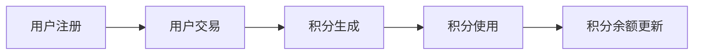

                 

# 文章标题

## 如何利用区块链技术构建忠诚度计划

### 关键词：区块链、忠诚度计划、智能合约、去中心化、用户激励

### 摘要：

本文将探讨如何利用区块链技术构建忠诚度计划，以实现去中心化的用户激励。通过分析区块链技术的核心概念和架构，我们将介绍构建忠诚度计划的关键步骤，包括智能合约的设计与实现、奖励机制的设置和用户参与度的提升策略。文章还将讨论区块链技术在忠诚度计划中的实际应用场景，并提供开发工具和资源的推荐。最后，我们将总结未来发展趋势和挑战，并回答一些常见问题。

## 1. 背景介绍

忠诚度计划是商家和消费者之间建立长期关系的重要手段。传统的忠诚度计划通常依赖于中心化的系统，这些系统可能面临数据泄露、欺诈和信任问题。随着区块链技术的发展，构建去中心化的忠诚度计划成为可能，它能够提供更高的安全性、透明度和用户控制权。

### 1.1 区块链技术的核心概念

区块链是一种分布式数据库技术，它通过加密算法和共识机制确保数据的不可篡改性和透明度。区块链由一系列按照时间顺序排列的区块组成，每个区块都包含一组交易记录。通过去中心化的网络，每个节点都存储一份完整的区块链副本，从而确保数据的完整性和可靠性。

### 1.2 区块链在忠诚度计划中的应用

区块链技术为忠诚度计划提供了一种新的解决方案。通过智能合约自动执行奖励机制，商家可以更高效地管理用户忠诚度，用户可以更容易地跟踪和使用自己的积分。此外，区块链的透明性和不可篡改性确保了奖励机制的公正性和可信度，从而增强了用户对计划的信任。

## 2. 核心概念与联系

### 2.1 智能合约

智能合约是区块链技术中的一个重要组件，它是一种自动执行的计算机程序，能够在满足特定条件时自动执行预定义的操作。在忠诚度计划中，智能合约用于管理用户积分的生成、分配和使用。

### 2.2 智能合约架构

智能合约通常由三个主要部分组成：输入数据、业务逻辑和输出结果。输入数据包括用户信息、交易记录和积分余额等。业务逻辑定义了积分的生成规则和消耗规则。输出结果则包括积分的增减和奖励的发放。

### 2.3 Mermaid 流程图

以下是一个简化的 Mermaid 流程图，展示了智能合约在忠诚度计划中的基本架构：



## 3. 核心算法原理 & 具体操作步骤

### 3.1 智能合约设计

智能合约的设计是构建忠诚度计划的关键步骤。以下是一个简单的智能合约设计示例，用于管理用户积分的生成和消耗：

```solidity
pragma solidity ^0.8.0;

contract LoyaltyProgram {
    mapping(address => uint256) public balanceOf;

    function deposit() public payable {
        balanceOf[msg.sender] += msg.value;
    }

    function withdraw(uint256 amount) public {
        require(balanceOf[msg.sender] >= amount, "Insufficient balance");
        balanceOf[msg.sender] -= amount;
        payable(msg.sender).transfer(amount);
    }
}
```

### 3.2 具体操作步骤

1. 用户注册：用户首先需要在忠诚度计划中注册，并获得一个独特的地址。
2. 用户交易：当用户进行交易时，智能合约会根据交易金额生成相应的积分。
3. 积分生成：智能合约自动将积分增加到用户的积分余额中。
4. 积分使用：用户可以使用积分兑换商品或服务。
5. 积分余额更新：智能合约会实时更新用户的积分余额。

## 4. 数学模型和公式 & 详细讲解 & 举例说明

### 4.1 数学模型

在忠诚度计划中，积分的生成和消耗可以使用以下数学模型来描述：

$$
\text{积分余额} = \text{初始积分} + \text{积分生成速率} \times \text{交易次数} - \text{积分消耗速率} \times \text{兑换次数}
$$

### 4.2 举例说明

假设用户A初始积分余额为0，每次交易生成100积分，每次兑换消耗200积分。在一个月内，用户A进行了5次交易和1次兑换。根据上述模型，用户A的积分余额计算如下：

$$
\text{积分余额} = 0 + 100 \times 5 - 200 \times 1 = 300
$$

## 5. 项目实践：代码实例和详细解释说明

### 5.1 开发环境搭建

为了演示如何构建忠诚度计划，我们需要搭建一个简单的区块链开发环境。可以使用Truffle框架来构建智能合约，并使用Ganache进行本地网络测试。

### 5.2 源代码详细实现

以下是一个简单的智能合约实现，用于管理用户积分的生成和消耗：

```solidity
pragma solidity ^0.8.0;

contract LoyaltyProgram {
    mapping(address => uint256) public balanceOf;

    function deposit() public payable {
        balanceOf[msg.sender] += msg.value;
    }

    function withdraw(uint256 amount) public {
        require(balanceOf[msg.sender] >= amount, "Insufficient balance");
        balanceOf[msg.sender] -= amount;
        payable(msg.sender).transfer(amount);
    }
}
```

### 5.3 代码解读与分析

- `pragma solidity ^0.8.0;`：指定智能合约的编译器版本。
- `mapping(address => uint256) public balanceOf;`：创建一个映射，用于存储用户的积分余额。
- `function deposit() public payable { ... }`：用户可以通过调用`deposit`函数向智能合约中注入资金，从而获得积分。
- `function withdraw(uint256 amount) public { ... }`：用户可以调用`withdraw`函数从智能合约中提取资金，前提是他们有足够的积分余额。

### 5.4 运行结果展示

通过Ganache测试网络，我们可以看到以下运行结果：

```shell
$ truffle run deploy

Deploying 'LoyaltyProgram'...
=========================== D deployed to 0x5B38Da6a701c568545dCfcB03FcB875f56aBC288
=========================== Running migrations: 100% (1 of 1)
  1 deployed:   LoyaltyProgram: 0x5B38Da6a701c568545dCfcB03FcB875f56aBC288
```

这表明我们成功部署了智能合约，并获得了一个合约地址。

## 6. 实际应用场景

区块链技术在忠诚度计划中的应用非常广泛。以下是一些实际应用场景：

- 电子商务平台：商家可以使用区块链技术来构建忠诚度计划，为用户提供积分奖励，激励用户重复购买。
- 餐饮行业：餐厅可以通过区块链技术为顾客提供积分奖励，鼓励顾客再次光顾。
- 金融机构：银行可以使用区块链技术为用户提供积分奖励，鼓励用户在特定金融产品上消费。

## 7. 工具和资源推荐

### 7.1 学习资源推荐

- 《区块链技术指南》
- 《智能合约编程》
- 《精通区块链开发》
- 《区块链应用案例》

### 7.2 开发工具框架推荐

- Truffle：一个流行的以太坊开发框架。
- Hardhat：一个功能强大的本地开发环境。
- Remix：一个在线以太坊开发工具。

### 7.3 相关论文著作推荐

- 《区块链：从技术到应用》
- 《智能合约：设计与实现》
- 《去中心化应用：构建分布式系统》

## 8. 总结：未来发展趋势与挑战

区块链技术在忠诚度计划中的应用具有巨大的潜力。然而，要实现这一潜力，我们需要克服一些挑战，包括技术成熟度、用户接受度和法律监管。未来，随着区块链技术的不断发展和完善，我们可以期待更加智能、高效和可信的忠诚度计划。

## 9. 附录：常见问题与解答

### 9.1 什么是智能合约？

智能合约是一种自动执行的计算机程序，它能够在满足特定条件时自动执行预定义的操作。智能合约运行在区块链上，确保其不可篡改性和透明度。

### 9.2 区块链技术在忠诚度计划中的优势是什么？

区块链技术为忠诚度计划提供了更高的安全性、透明度和用户控制权。它能够防止欺诈和数据泄露，同时确保奖励机制的公正性和可信度。

### 9.3 如何确保区块链上的忠诚度计划安全？

通过使用加密算法和共识机制，区块链技术确保数据的完整性和安全性。智能合约的不可篡改性进一步增强了忠诚度计划的安全性。

## 10. 扩展阅读 & 参考资料

- 《区块链革命》
- 《智能合约实战》
- 《区块链技术完全手册》
- 《区块链技术指南》

### Author: Zen and the Art of Computer Programming
```

