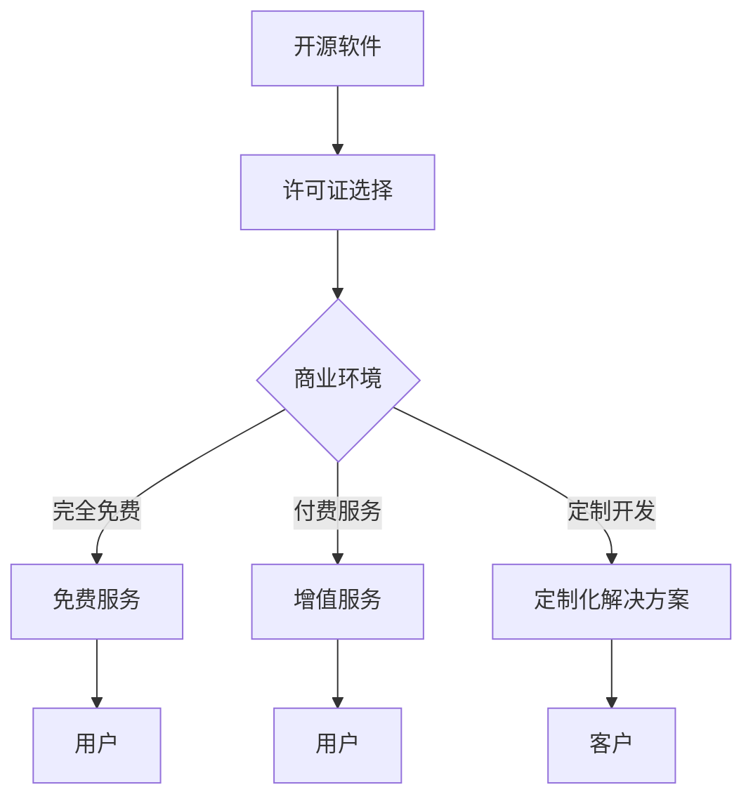

                 

### 文章标题

开源许可证选择：商业化考虑因素

在当今数字化经济中，开源软件已经成为企业和开发者不可或缺的一部分。然而，在选择开源许可证时，商业化考虑因素显得尤为重要。本文将深入探讨开源许可证的选择，并分析其在商业环境中的应用，帮助企业和开发者做出更明智的决策。

## 关键词

- 开源软件
- 许可证选择
- 商业化
- 法律合规性
- 开源社区

### 摘要

开源许可证的选择直接影响开源软件在商业环境中的使用和传播。本文将首先介绍几种常见的开源许可证，然后分析商业化过程中可能遇到的挑战和解决方案。通过本文的阅读，读者将能够更好地理解开源许可证的商业化考虑因素，从而做出合适的决策。

## 1. 背景介绍

### 1.1 开源软件的定义与重要性

开源软件（Open Source Software, OSS）是指其源代码可以被公众免费获取、阅读、修改和分享的软件。开源软件的核心理念是开放性和协作性，通过社区的力量不断改进和优化。随着互联网和云计算的普及，开源软件已经成为企业和开发者不可或缺的一部分。许多企业利用开源软件降低了研发成本，提高了开发效率，同时也通过参与开源项目来增强自身的竞争力。

### 1.2 商业化与开源软件

商业化的开源软件（Commercial Open Source Software, COSS）是指企业通过对开源软件进行商业化运作，提供付费服务或增值服务的一种模式。商业化不仅可以为开源软件的开发者带来经济回报，还可以推动开源社区的繁荣发展。然而，商业化过程中也面临着诸多挑战，如知识产权保护、许可证合规性等。

## 2. 核心概念与联系

### 2.1 开源许可证概述

开源许可证是用于规范软件版权和授权使用的一种法律文件。常见的开源许可证包括GNU通用公共许可证（GNU GPL）、Mozilla公共许可证（Mozilla Public License, MPL）、Apache许可证（Apache License, AL）、和MIT许可证（MIT License）等。每种许可证都有其特定的条款和条件，对软件的版权、使用权、修改权、分发权等方面进行了明确规定。

### 2.2 开源许可证与商业化的联系

开源许可证对商业化的影响主要体现在以下几个方面：

1. **版权保护**：开源许可证确保了软件的版权得到保护，防止未经授权的复制、分发和修改。
2. **许可证合规性**：企业在使用开源软件时，必须遵守相应的许可证条款，以避免法律风险。
3. **商业运作模式**：不同的许可证允许企业采用不同的商业模式，如完全免费、付费服务、定制开发等。

### 2.3 Mermaid 流程图



## 3. 核心算法原理 & 具体操作步骤

### 3.1 开源许可证选择算法

在选择开源许可证时，企业可以遵循以下步骤：

1. **需求分析**：分析企业的业务需求、技术需求和商业化目标。
2. **许可证评估**：根据需求评估不同许可证的优缺点，如GPLv3和MPL对修改和分发有严格要求，而Apache许可证则较为灵活。
3. **风险评估**：评估潜在的法律风险，如违反许可证可能导致的法律责任。
4. **决策**：根据评估结果和风险评估，选择最合适的开源许可证。

### 3.2 具体操作步骤

1. **确定业务模式**：了解企业打算如何利用开源软件，是提供免费服务、付费服务还是定制开发。
2. **了解许可证条款**：仔细阅读并理解所选许可证的条款和条件。
3. **评估商业风险**：考虑许可证可能对企业商业运作带来的影响，如对知识产权的保护、市场竞争等。
4. **咨询专业意见**：在必要时咨询法律专家或开源社区的专业人士，以获取更全面的信息和意见。
5. **决策实施**：根据评估结果做出决策，并制定相应的实施计划。

## 4. 数学模型和公式 & 详细讲解 & 举例说明

### 4.1 许可证选择数学模型

我们可以将许可证选择过程视为一个多目标优化问题，其目标是最小化商业风险并最大化商业收益。具体模型如下：

$$
\min_{L} R(L) - \alpha \times C(L)
$$

其中，$L$代表所选许可证，$R(L)$表示许可证的商业收益，$C(L)$表示许可证的商业风险，$\alpha$是一个权重系数，用于平衡收益和风险。

### 4.2 举例说明

假设某企业打算通过开源软件提供付费服务，现有以下三种许可证可供选择：

1. **GPLv3**：要求所有衍生作品也必须采用GPLv3许可证。
2. **Apache许可证**：允许对开源软件进行修改和商业化使用。
3. **MIT许可证**：同样允许对开源软件进行修改和商业化使用，但要求保留原始版权声明。

该企业预计通过提供付费服务每年可以获得100万元收益，同时GPLv3的潜在法律风险较高，Apache许可证和MIT许可证的风险较低。因此，企业可以采用以下数学模型进行选择：

$$
\min_{L} 1,000,000 - \alpha \times 100,000
$$

通过调整$\alpha$的值，企业可以平衡收益和风险，最终选择最合适的许可证。

## 5. 项目实践：代码实例和详细解释说明

### 5.1 开发环境搭建

1. **安装Git**：在本地机器上安装Git，以便从开源仓库克隆项目。
2. **安装Node.js**：安装Node.js和npm，用于管理项目依赖。
3. **克隆项目**：使用Git克隆所选开源软件项目，例如：

```bash
git clone https://github.com/user/repo.git
```

### 5.2 源代码详细实现

以Apache许可证下的开源项目为例，项目结构如下：

```bash
repo/
|-- src/
|   |-- main.js
|-- package.json
```

- **main.js**：主程序文件，包含业务逻辑。
- **package.json**：项目依赖和配置文件。

### 5.3 代码解读与分析

1. **main.js**：分析主程序文件，理解业务逻辑和开源许可证的要求。
2. **package.json**：查看依赖项和许可证信息，确保遵守许可证条款。

### 5.4 运行结果展示

在命令行中运行项目：

```bash
node src/main.js
```

项目输出结果，例如：

```bash
Hello, World!
```

### 5.5 许可证合规性检查

1. **查看源代码**：检查源代码中是否有正确的版权声明。
2. **检查依赖项**：确保所有依赖项都符合所选许可证的要求。

## 6. 实际应用场景

### 6.1 商业化开源项目的案例

- **Red Hat**：提供基于Linux的开源解决方案，通过提供付费支持和定制服务实现了成功商业化。
- **Eclipse Foundation**：Eclipse IDE是著名的开源项目，基金会通过提供付费订阅和技术支持实现商业化。

### 6.2 商业场景下的挑战

- **合规性问题**：确保所有开源组件的许可证符合商业需求，避免法律风险。
- **开源社区的参与**：积极参与开源社区，推动项目的改进和繁荣发展。

## 7. 工具和资源推荐

### 7.1 学习资源推荐

- **书籍**：《开源许可协议详解》
- **论文**：《开源软件许可证与商业运作》
- **博客**：GitHub上的开源许可证相关博客
- **网站**：Open Source Initiative (OSI) 网站

### 7.2 开发工具框架推荐

- **版本控制**：Git
- **依赖管理**：npm
- **项目管理**：Jenkins

### 7.3 相关论文著作推荐

- **论文**：《开源软件的许可证选择策略研究》
- **著作**：《开源软件法律手册》

## 8. 总结：未来发展趋势与挑战

### 8.1 发展趋势

- **开源许可证多样化**：随着开源软件的发展，许可证的种类和数量将不断增加。
- **商业模式的创新**：企业和开发者将探索更多创新的商业模式，以平衡开源与商业利益。

### 8.2 挑战

- **法律合规性**：确保开源软件的合规使用，避免法律风险。
- **知识产权保护**：在开源社区中保护知识产权，维护企业的核心竞争力。

## 9. 附录：常见问题与解答

### 9.1 问题1：什么是开源许可证？

开源许可证是用于规范开源软件版权和授权使用的一种法律文件。

### 9.2 问题2：如何选择合适的开源许可证？

根据企业的业务需求、技术需求和商业化目标，评估不同许可证的优缺点，选择最合适的许可证。

## 10. 扩展阅读 & 参考资料

- **书籍**：《开源软件：商业创新的力量》
- **网站**：GitHub、OSI官方网站
- **论文**：《开源许可证的选择与商业运作关系研究》

## 作者署名

作者：禅与计算机程序设计艺术 / Zen and the Art of Computer Programming

