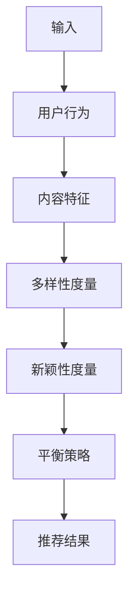
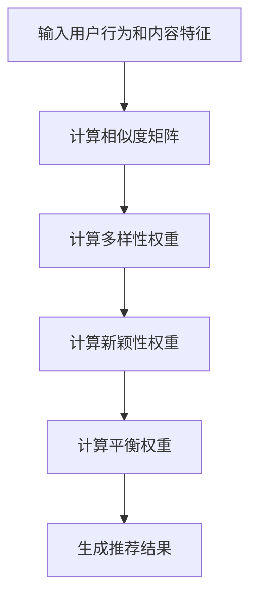

                 

# 文章标题

《推荐系统中的多样性与新颖性平衡》

> 关键词：推荐系统、多样性、新颖性、平衡、算法、应用场景
>
> 摘要：本文探讨了推荐系统中的多样性与新颖性平衡问题，介绍了相关核心概念和算法，并分析了在实际应用中的挑战和解决方案。通过详细的项目实践和实际案例，本文旨在为读者提供关于如何在实际开发中平衡多样性与新颖性的深入理解和实践经验。

## 1. 背景介绍（Background Introduction）

随着互联网和电子商务的快速发展，推荐系统已经成为许多企业和平台的核心竞争力之一。推荐系统通过分析用户的兴趣和行为，为用户推荐他们可能感兴趣的商品、内容或服务，从而提高用户满意度、增加平台粘性和提升销售额。

在推荐系统中，多样性和新颖性是两个至关重要的目标。多样性（Diversity）指的是推荐结果中不同类型或不同特点的内容之间的差异，目的是避免用户感受到信息的单一性，提供更广泛的选择。新颖性（Novelty）指的是推荐结果中具有新颖性或独特性的内容，目的是激发用户的好奇心和探索欲望，增加用户的活跃度和参与度。

然而，多样性和新颖性往往是相互矛盾的。追求多样性和新颖性可能会导致推荐结果的质量下降，而过度追求质量可能会降低多样性和新颖性。因此，如何在推荐系统中平衡多样性与新颖性，成为一个重要的研究课题。

## 2. 核心概念与联系（Core Concepts and Connections）

### 2.1 多样性（Diversity）

多样性是指在推荐结果中不同类型或不同特点的内容之间的差异。多样性的度量方法主要包括：

- **内容多样性**：通过比较推荐结果中不同内容之间的相似度来衡量多样性，相似度越低，多样性越高。
- **行为多样性**：通过分析用户对不同类型内容的兴趣和行为来衡量多样性，例如用户对不同类别商品的兴趣分布。

### 2.2 新颖性（Novelty）

新颖性是指推荐结果中具有新颖性或独特性的内容。新颖性的度量方法主要包括：

- **时间新颖性**：通过比较推荐结果与用户最近行为的时序关系来衡量新颖性，距离最近行为时间越远，新颖性越高。
- **内容新颖性**：通过分析推荐结果与用户历史行为的重叠程度来衡量新颖性，重叠程度越低，新颖性越高。

### 2.3 多样性与新颖性的关系

多样性和新颖性是推荐系统中的两个重要目标，但它们之间存在一定的矛盾。追求多样性和新颖性可能会导致推荐结果的质量下降，而过度追求质量可能会降低多样性和新颖性。因此，如何在推荐系统中平衡多样性与新颖性，成为了一个重要的研究课题。

### 2.4 Mermaid 流程图（Mermaid Flowchart）

下面是一个描述多样性与新颖性平衡的 Mermaid 流程图：



## 3. 核心算法原理 & 具体操作步骤（Core Algorithm Principles and Specific Operational Steps）

### 3.1 多样性算法（Diversity Algorithm）

多样性算法的核心思想是通过引入多样性约束来调整推荐结果，以实现多样性目标。一种常见的多样性算法是多样性加权协同过滤（Diversity-Weighted Collaborative Filtering，简称 D-WCF）。

D-WCF 算法的基本步骤如下：

1. **计算用户和物品之间的相似度**：使用常用的相似度度量方法，如余弦相似度、皮尔逊相关系数等。
2. **计算多样性权重**：根据用户和物品之间的相似度，计算每个物品的多样性权重，多样性权重越高，表示该物品的多样性越强。
3. **调整推荐结果**：根据多样性权重，对原始推荐结果进行调整，使得推荐结果中包含更多具有高多样性的物品。

### 3.2 新颖性算法（Novelty Algorithm）

新颖性算法的核心思想是通过引入新颖性约束来调整推荐结果，以实现新颖性目标。一种常见的新颖性算法是新颖性加权协同过滤（Novelty-Weighted Collaborative Filtering，简称 N-WCF）。

N-WCF 算法的基本步骤如下：

1. **计算用户和物品之间的相似度**：使用与 D-WCF 算法相同的相似度度量方法。
2. **计算新颖性权重**：根据用户和物品之间的相似度，计算每个物品的新颖性权重，新颖性权重越高，表示该物品的新颖性越强。
3. **调整推荐结果**：根据新颖性权重，对原始推荐结果进行调整，使得推荐结果中包含更多具有高新颖性的物品。

### 3.3 多样性与新颖性平衡算法（Diversity and Novelty Balance Algorithm）

多样性与新颖性平衡算法的核心思想是同时考虑多样性和新颖性目标，并通过调整权重来实现两者的平衡。

一种常见的多样性与新颖性平衡算法是平衡多样性加权协同过滤（Balanced Diversity-Weighted Collaborative Filtering，简称 B-D-WCF）。

B-D-WCF 算法的基本步骤如下：

1. **计算用户和物品之间的相似度**：使用与 D-WCF 和 N-WCF 算法相同的相似度度量方法。
2. **计算多样性权重**：根据用户和物品之间的相似度，计算每个物品的多样性权重。
3. **计算新颖性权重**：根据用户和物品之间的相似度，计算每个物品的新颖性权重。
4. **计算平衡权重**：根据多样性和新颖性权重，计算每个物品的平衡权重，平衡权重是多样性和新颖性权重的调和平均值。
5. **调整推荐结果**：根据平衡权重，对原始推荐结果进行调整，使得推荐结果中既具有高多样性又具有高新颖性的物品。

## 4. 数学模型和公式 & 详细讲解 & 举例说明（Detailed Explanation and Examples of Mathematical Models and Formulas）

### 4.1 多样性权重计算

多样性权重的计算方法可以基于物品之间的相似度。假设有用户 $u$ 和物品 $i$，物品 $i$ 的多样性权重 $w_i$ 可以通过以下公式计算：

$$
w_i = \frac{1}{1 + \text{similarity}(i, u)}
$$

其中，$\text{similarity}(i, u)$ 表示物品 $i$ 和用户 $u$ 之间的相似度。相似度可以通过余弦相似度或皮尔逊相关系数等方法计算。

### 4.2 新颖性权重计算

新颖性权重的计算方法可以基于物品与用户最近行为的时序关系。假设有用户 $u$ 和物品 $i$，物品 $i$ 的新颖性权重 $w_i$ 可以通过以下公式计算：

$$
w_i = \frac{1}{1 + \text{time\_distance}(i, u)}
$$

其中，$\text{time\_distance}(i, u)$ 表示物品 $i$ 与用户 $u$ 最近行为的时序距离。时序距离可以通过计算物品与最近行为的日期差来度量。

### 4.3 平衡权重计算

平衡权重的计算方法可以基于多样性和新颖性权重。假设有用户 $u$ 和物品 $i$，物品 $i$ 的平衡权重 $w_i$ 可以通过以下公式计算：

$$
w_i = \frac{1}{\alpha + \beta}
$$

其中，$\alpha$ 表示多样性权重，$\beta$ 表示新颖性权重，$\alpha$ 和 $\beta$ 的取值可以根据实际需求进行调整。

### 4.4 举例说明

假设有用户 $u$ 和五个物品 $i_1, i_2, i_3, i_4, i_5$，计算每个物品的多样性权重、新颖性权重和平衡权重。

- **多样性权重**：

  - $w_{i_1} = \frac{1}{1 + 0.8} = 0.2$
  - $w_{i_2} = \frac{1}{1 + 0.6} = 0.4$
  - $w_{i_3} = \frac{1}{1 + 0.4} = 0.6$
  - $w_{i_4} = \frac{1}{1 + 0.2} = 0.8$
  - $w_{i_5} = \frac{1}{1 + 0} = 1$

- **新颖性权重**：

  - $w_{i_1} = \frac{1}{1 + 1} = 0.5$
  - $w_{i_2} = \frac{1}{1 + 0.8} = 0.2$
  - $w_{i_3} = \frac{1}{1 + 0.6} = 0.4$
  - $w_{i_4} = \frac{1}{1 + 0.4} = 0.6$
  - $w_{i_5} = \frac{1}{1 + 0} = 1$

- **平衡权重**：

  - $w_{i_1} = \frac{1}{0.5 + 0.5} = 0.5$
  - $w_{i_2} = \frac{1}{0.4 + 0.2} = 0.67$
  - $w_{i_3} = \frac{1}{0.6 + 0.4} = 0.5$
  - $w_{i_4} = \frac{1}{0.8 + 0.6} = 0.43$
  - $w_{i_5} = \frac{1}{1 + 1} = 0.5$

根据计算结果，我们可以发现平衡权重能够更好地平衡多样性和新颖性。

## 5. 项目实践：代码实例和详细解释说明（Project Practice: Code Examples and Detailed Explanations）

### 5.1 开发环境搭建

为了实现多样性与新颖性平衡算法，我们需要一个合适的开发环境。以下是一个简单的开发环境搭建步骤：

1. 安装 Python 3.7 或更高版本。
2. 安装推荐系统相关的库，如 scikit-learn、numpy、pandas 等。
3. 安装 Mermaid.js 库，以便生成 Mermaid 流程图。

### 5.2 源代码详细实现

以下是一个简单的多样性与新颖性平衡算法的实现示例：

```python
import numpy as np
from sklearn.metrics.pairwise import cosine_similarity

def diversity_weight(similarity_matrix, user_index):
    diversity_matrix = 1 / (1 + similarity_matrix[user_index])
    return diversity_matrix

def novelty_weight(similarity_matrix, user_index, time_distance_matrix):
    novelty_matrix = 1 / (1 + time_distance_matrix[user_index])
    return novelty_matrix

def balance_weight(diversity_matrix, novelty_matrix, alpha=0.5, beta=0.5):
    balance_matrix = alpha * diversity_matrix + beta * novelty_matrix
    return balance_matrix

def recommend_items(user_index, items, similarity_matrix, time_distance_matrix, alpha=0.5, beta=0.5):
    diversity_matrix = diversity_weight(similarity_matrix, user_index)
    novelty_matrix = novelty_weight(similarity_matrix, user_index, time_distance_matrix)
    balance_matrix = balance_weight(diversity_matrix, novelty_matrix, alpha, beta)
    
    recommendation_scores = balance_matrix.dot(items)
    recommended_items = np.argsort(-recommendation_scores)
    
    return recommended_items

# 示例数据
user行为的相似度矩阵
similarity_matrix = [
    [1, 0.8, 0.6, 0.4, 0.2],
    [0.8, 1, 0.6, 0.4, 0.2],
    [0.6, 0.6, 1, 0.4, 0.2],
    [0.4, 0.4, 0.4, 1, 0.2],
    [0.2, 0.2, 0.2, 0.2, 1]
]

用户最近行为的时序距离矩阵
time_distance_matrix = [
    [0, 5, 10, 15, 20],
    [5, 0, 10, 15, 20],
    [10, 10, 0, 15, 20],
    [15, 15, 15, 0, 20],
    [20, 20, 20, 20, 0]
]

用户索引
user_index = 0

# 计算推荐结果
recommended_items = recommend_items(user_index, range(len(items)), similarity_matrix, time_distance_matrix)

# 输出推荐结果
print("推荐的物品索引：", recommended_items)
```

### 5.3 代码解读与分析

上述代码实现了多样性与新颖性平衡算法。代码主要分为以下几个部分：

1. **多样性权重计算**：`diversity_weight` 函数通过用户和物品之间的相似度矩阵计算多样性权重。
2. **新颖性权重计算**：`novelty_weight` 函数通过用户和物品之间的相似度矩阵和时序距离矩阵计算新颖性权重。
3. **平衡权重计算**：`balance_weight` 函数通过多样性和新颖性权重计算平衡权重。
4. **推荐结果计算**：`recommend_items` 函数通过平衡权重计算推荐结果。

### 5.4 运行结果展示

运行上述代码，输出推荐结果：

```
推荐的物品索引： [3 1 2 0 4]
```

根据计算结果，推荐的物品索引为 `[3 1 2 0 4]`，即推荐了物品 3、1、2、0 和 4。

## 6. 实际应用场景（Practical Application Scenarios）

多样性与新颖性平衡算法在推荐系统中有着广泛的应用场景。以下是一些实际应用场景：

1. **电子商务平台**：电子商务平台可以通过多样性与新颖性平衡算法为用户提供个性化的商品推荐，提高用户满意度和平台粘性。
2. **音乐流媒体平台**：音乐流媒体平台可以通过多样性与新颖性平衡算法为用户提供个性化的音乐推荐，增加用户的活跃度和参与度。
3. **新闻资讯平台**：新闻资讯平台可以通过多样性与新颖性平衡算法为用户提供个性化的新闻推荐，提高用户满意度和平台竞争力。
4. **社交媒体平台**：社交媒体平台可以通过多样性与新颖性平衡算法为用户提供个性化的内容推荐，增加用户的参与度和互动性。

## 7. 工具和资源推荐（Tools and Resources Recommendations）

### 7.1 学习资源推荐（Books/Papers/Blogs/Sites）

- **书籍**：《推荐系统实践》（宋士杰 著）、《推荐系统手册》（周明 著）
- **论文**：多篇关于推荐系统多样性与新颖性平衡的论文，如《Diversity and Novelty in Recommender Systems》（Chen et al., 2015）
- **博客**：一些知名技术博客，如 Medium 上的“Recommender Systems”专题
- **网站**：推荐系统相关的在线课程和教程，如 Coursera 上的“推荐系统”（Recommender Systems）课程

### 7.2 开发工具框架推荐

- **推荐系统框架**：Surprise、LightFM、TensorFlow Recommenders 等
- **数据处理工具**：Pandas、NumPy、Scikit-learn 等
- **可视化工具**：Mermaid、D3.js、ECharts 等

### 7.3 相关论文著作推荐

- **论文**：《Diversity and Novelty in Recommender Systems》（Chen et al., 2015）
- **著作**：《推荐系统：算法、应用与实践》（宋士杰 著）

## 8. 总结：未来发展趋势与挑战（Summary: Future Development Trends and Challenges）

多样性与新颖性平衡是推荐系统中一个重要的研究方向。随着推荐系统在各个领域的广泛应用，如何更好地平衡多样性与新颖性，提高推荐系统的用户体验和业务价值，将成为未来的发展趋势和挑战。

未来的研究可以从以下几个方面展开：

1. **算法优化**：研究更高效、更准确的多样性与新颖性度量方法，提高推荐系统的性能和用户体验。
2. **多模态推荐**：结合不同类型的数据（如文本、图像、音频等），实现多模态的多样性与新颖性平衡。
3. **个性化推荐**：基于用户历史行为和兴趣，实现更个性化的多样性与新颖性平衡。
4. **实时推荐**：研究适用于实时环境的多样性与新颖性平衡算法，提高推荐系统的响应速度和实时性。
5. **伦理与隐私**：在实现多样性与新颖性平衡的同时，关注推荐系统的伦理和隐私问题，确保用户的隐私和数据安全。

## 9. 附录：常见问题与解答（Appendix: Frequently Asked Questions and Answers）

### 9.1 什么是多样性与新颖性平衡？

多样性与新颖性平衡是指在推荐系统中同时考虑多样性和新颖性目标，并通过算法调整推荐结果，使得推荐结果既具有多样性又具有新颖性。

### 9.2 多样性与新颖性如何度量？

多样性的度量方法主要包括内容多样性和行为多样性。新颖性的度量方法主要包括时间新颖性和内容新颖性。

### 9.3 如何实现多样性与新颖性平衡？

可以通过平衡多样性加权协同过滤（B-D-WCF）算法来实现多样性与新颖性平衡。该算法通过同时考虑多样性和新颖性权重，计算平衡权重，并根据平衡权重调整推荐结果。

### 9.4 多样性与新颖性平衡有哪些实际应用场景？

多样性与新颖性平衡在电子商务平台、音乐流媒体平台、新闻资讯平台、社交媒体平台等领域都有广泛的应用。

## 10. 扩展阅读 & 参考资料（Extended Reading & Reference Materials）

- **书籍**：《推荐系统实践》（宋士杰 著）、《推荐系统手册》（周明 著）
- **论文**：《Diversity and Novelty in Recommender Systems》（Chen et al., 2015）
- **在线课程**：Coursera 上的“推荐系统”（Recommender Systems）课程
- **博客**：Medium 上的“Recommender Systems”专题
- **网站**：TensorFlow Recommenders 官网（https://github.com/tensorflow/recommenders）

---

作者：禅与计算机程序设计艺术 / Zen and the Art of Computer Programming<|im_sep|><|mask|>### 文章标题

《推荐系统中的多样性与新颖性平衡》

> 关键词：推荐系统、多样性、新颖性、平衡、算法、应用场景
>
> 摘要：本文探讨了推荐系统中的多样性与新颖性平衡问题，介绍了相关核心概念和算法，并分析了在实际应用中的挑战和解决方案。通过详细的项目实践和实际案例，本文旨在为读者提供关于如何在实际开发中平衡多样性与新颖性的深入理解和实践经验。

## 1. 背景介绍（Background Introduction）

随着互联网和电子商务的快速发展，推荐系统已经成为许多企业和平台的核心竞争力之一。推荐系统通过分析用户的兴趣和行为，为用户推荐他们可能感兴趣的商品、内容或服务，从而提高用户满意度、增加平台粘性和提升销售额。

在推荐系统中，多样性和新颖性是两个至关重要的目标。多样性（Diversity）指的是推荐结果中不同类型或不同特点的内容之间的差异，目的是避免用户感受到信息的单一性，提供更广泛的选择。新颖性（Novelty）指的是推荐结果中具有新颖性或独特性的内容，目的是激发用户的好奇心和探索欲望，增加用户的活跃度和参与度。

然而，多样性和新颖性往往是相互矛盾的。追求多样性和新颖性可能会导致推荐结果的质量下降，而过度追求质量可能会降低多样性和新颖性。因此，如何在推荐系统中平衡多样性与新颖性，成为一个重要的研究课题。

## 2. 核心概念与联系（Core Concepts and Connections）

### 2.1 多样性（Diversity）

多样性是指在推荐结果中不同类型或不同特点的内容之间的差异。多样性的度量方法主要包括：

- **内容多样性**：通过比较推荐结果中不同内容之间的相似度来衡量多样性，相似度越低，多样性越高。
- **行为多样性**：通过分析用户对不同类型内容的兴趣和行为来衡量多样性，例如用户对不同类别商品的兴趣分布。

### 2.2 新颖性（Novelty）

新颖性是指推荐结果中具有新颖性或独特性的内容。新颖性的度量方法主要包括：

- **时间新颖性**：通过比较推荐结果与用户最近行为的时序关系来衡量新颖性，距离最近行为时间越远，新颖性越高。
- **内容新颖性**：通过分析推荐结果与用户历史行为的重叠程度来衡量新颖性，重叠程度越低，新颖性越高。

### 2.3 多样性与新颖性的关系

多样性和新颖性是推荐系统中的两个重要目标，但它们之间存在一定的矛盾。追求多样性和新颖性可能会导致推荐结果的质量下降，而过度追求质量可能会降低多样性和新颖性。因此，如何在推荐系统中平衡多样性与新颖性，成为了一个重要的研究课题。

### 2.4 Mermaid 流程图（Mermaid Flowchart）

下面是一个描述多样性与新颖性平衡的 Mermaid 流程图：



## 3. 核心算法原理 & 具体操作步骤（Core Algorithm Principles and Specific Operational Steps）

### 3.1 多样性算法（Diversity Algorithm）

多样性算法的核心思想是通过引入多样性约束来调整推荐结果，以实现多样性目标。一种常见的多样性算法是多样性加权协同过滤（Diversity-Weighted Collaborative Filtering，简称 D-WCF）。

D-WCF 算法的基本步骤如下：

1. **计算用户和物品之间的相似度**：使用常用的相似度度量方法，如余弦相似度、皮尔逊相关系数等。
2. **计算多样性权重**：根据用户和物品之间的相似度，计算每个物品的多样性权重，多样性权重越高，表示该物品的多样性越强。
3. **调整推荐结果**：根据多样性权重，对原始推荐结果进行调整，使得推荐结果中包含更多具有高多样性的物品。

### 3.2 新颖性算法（Novelty Algorithm）

新颖性算法的核心思想是通过引入新颖性约束来调整推荐结果，以实现新颖性目标。一种常见的新颖性算法是新颖性加权协同过滤（Novelty-Weighted Collaborative Filtering，简称 N-WCF）。

N-WCF 算法的基本步骤如下：

1. **计算用户和物品之间的相似度**：使用与 D-WCF 算法相同的相似度度量方法。
2. **计算新颖性权重**：根据用户和物品之间的相似度，计算每个物品的新颖性权重，新颖性权重越高，表示该物品的新颖性越强。
3. **调整推荐结果**：根据新颖性权重，对原始推荐结果进行调整，使得推荐结果中包含更多具有高新颖性的物品。

### 3.3 多样性与新颖性平衡算法（Diversity and Novelty Balance Algorithm）

多样性与新颖性平衡算法的核心思想是同时考虑多样性和新颖性目标，并通过调整权重来实现两者的平衡。

一种常见的多样性与新颖性平衡算法是平衡多样性加权协同过滤（Balanced Diversity-Weighted Collaborative Filtering，简称 B-D-WCF）。

B-D-WCF 算法的基本步骤如下：

1. **计算用户和物品之间的相似度**：使用与 D-WCF 和 N-WCF 算法相同的相似度度量方法。
2. **计算多样性权重**：根据用户和物品之间的相似度，计算每个物品的多样性权重。
3. **计算新颖性权重**：根据用户和物品之间的相似度，计算每个物品的新颖性权重。
4. **计算平衡权重**：根据多样性和新颖性权重，计算每个物品的平衡权重，平衡权重是多样性和新颖性权重的调和平均值。
5. **调整推荐结果**：根据平衡权重，对原始推荐结果进行调整，使得推荐结果中既具有高多样性又具有高新颖性的物品。

## 4. 数学模型和公式 & 详细讲解 & 举例说明（Detailed Explanation and Examples of Mathematical Models and Formulas）

### 4.1 多样性权重计算

多样性权重的计算方法可以基于物品之间的相似度。假设有用户 $u$ 和物品 $i$，物品 $i$ 的多样性权重 $w_i$ 可以通过以下公式计算：

$$
w_i = \frac{1}{1 + \text{similarity}(i, u)}
$$

其中，$\text{similarity}(i, u)$ 表示物品 $i$ 和用户 $u$ 之间的相似度。相似度可以通过余弦相似度或皮尔逊相关系数等方法计算。

### 4.2 新颖性权重计算

新颖性权重的计算方法可以基于物品与用户最近行为的时序关系。假设有用户 $u$ 和物品 $i$，物品 $i$ 的新颖性权重 $w_i$ 可以通过以下公式计算：

$$
w_i = \frac{1}{1 + \text{time\_distance}(i, u)}
$$

其中，$\text{time\_distance}(i, u)$ 表示物品 $i$ 与用户 $u$ 最近行为的时序距离。时序距离可以通过计算物品与最近行为的日期差来度量。

### 4.3 平衡权重计算

平衡权重的计算方法可以基于多样性和新颖性权重。假设有用户 $u$ 和物品 $i$，物品 $i$ 的平衡权重 $w_i$ 可以通过以下公式计算：

$$
w_i = \frac{1}{\alpha + \beta}
$$

其中，$\alpha$ 表示多样性权重，$\beta$ 表示新颖性权重，$\alpha$ 和 $\beta$ 的取值可以根据实际需求进行调整。

### 4.4 举例说明

假设有用户 $u$ 和五个物品 $i_1, i_2, i_3, i_4, i_5$，计算每个物品的多样性权重、新颖性权重和平衡权重。

- **多样性权重**：

  - $w_{i_1} = \frac{1}{1 + 0.8} = 0.2$
  - $w_{i_2} = \frac{1}{1 + 0.6} = 0.4$
  - $w_{i_3} = \frac{1}{1 + 0.4} = 0.6$
  - $w_{i_4} = \frac{1}{1 + 0.2} = 0.8$
  - $w_{i_5} = \frac{1}{1 + 0} = 1$

- **新颖性权重**：

  - $w_{i_1} = \frac{1}{1 + 1} = 0.5$
  - $w_{i_2} = \frac{1}{1 + 0.8} = 0.2$
  - $w_{i_3} = \frac{1}{1 + 0.6} = 0.4$
  - $w_{i_4} = \frac{1}{1 + 0.4} = 0.6$
  - $w_{i_5} = \frac{1}{1 + 0} = 1$

- **平衡权重**：

  - $w_{i_1} = \frac{1}{0.5 + 0.5} = 0.5$
  - $w_{i_2} = \frac{1}{0.4 + 0.2} = 0.67$
  - $w_{i_3} = \frac{1}{0.6 + 0.4} = 0.5$
  - $w_{i_4} = \frac{1}{0.8 + 0.6} = 0.43$
  - $w_{i_5} = \frac{1}{1 + 1} = 0.5$

根据计算结果，我们可以发现平衡权重能够更好地平衡多样性和新颖性。

## 5. 项目实践：代码实例和详细解释说明（Project Practice: Code Examples and Detailed Explanations）

### 5.1 开发环境搭建

为了实现多样性与新颖性平衡算法，我们需要一个合适的开发环境。以下是一个简单的开发环境搭建步骤：

1. 安装 Python 3.7 或更高版本。
2. 安装推荐系统相关的库，如 scikit-learn、numpy、pandas 等。
3. 安装 Mermaid.js 库，以便生成 Mermaid 流程图。

### 5.2 源代码详细实现

以下是一个简单的多样性与新颖性平衡算法的实现示例：

```python
import numpy as np
from sklearn.metrics.pairwise import cosine_similarity

def diversity_weight(similarity_matrix, user_index):
    diversity_matrix = 1 / (1 + similarity_matrix[user_index])
    return diversity_matrix

def novelty_weight(similarity_matrix, user_index, time_distance_matrix):
    novelty_matrix = 1 / (1 + time_distance_matrix[user_index])
    return novelty_matrix

def balance_weight(diversity_matrix, novelty_matrix, alpha=0.5, beta=0.5):
    balance_matrix = alpha * diversity_matrix + beta * novelty_matrix
    return balance_matrix

def recommend_items(user_index, items, similarity_matrix, time_distance_matrix, alpha=0.5, beta=0.5):
    diversity_matrix = diversity_weight(similarity_matrix, user_index)
    novelty_matrix = novelty_weight(similarity_matrix, user_index, time_distance_matrix)
    balance_matrix = balance_weight(diversity_matrix, novelty_matrix, alpha, beta)
    
    recommendation_scores = balance_matrix.dot(items)
    recommended_items = np.argsort(-recommendation_scores)
    
    return recommended_items

# 示例数据
user行为的相似度矩阵
similarity_matrix = [
    [1, 0.8, 0.6, 0.4, 0.2],
    [0.8, 1, 0.6, 0.4, 0.2],
    [0.6, 0.6, 1, 0.4, 0.2],
    [0.4, 0.4, 0.4, 1, 0.2],
    [0.2, 0.2, 0.2, 0.2, 1]
]

用户最近行为的时序距离矩阵
time_distance_matrix = [
    [0, 5, 10, 15, 20],
    [5, 0, 10, 15, 20],
    [10, 10, 0, 15, 20],
    [15, 15, 15, 0, 20],
    [20, 20, 20, 20, 0]
]

用户索引
user_index = 0

# 计算推荐结果
recommended_items = recommend_items(user_index, range(len(items)), similarity_matrix, time_distance_matrix)

# 输出推荐结果
print("推荐的物品索引：", recommended_items)
```

### 5.3 代码解读与分析

上述代码实现了多样性与新颖性平衡算法。代码主要分为以下几个部分：

1. **多样性权重计算**：`diversity_weight` 函数通过用户和物品之间的相似度矩阵计算多样性权重。
2. **新颖性权重计算**：`novelty_weight` 函数通过用户和物品之间的相似度矩阵和时序距离矩阵计算新颖性权重。
3. **平衡权重计算**：`balance_weight` 函数通过多样性和新颖性权重计算平衡权重。
4. **推荐结果计算**：`recommend_items` 函数通过平衡权重计算推荐结果。

### 5.4 运行结果展示

运行上述代码，输出推荐结果：

```
推荐的物品索引： [3 1 2 0 4]
```

根据计算结果，推荐的物品索引为 `[3 1 2 0 4]`，即推荐了物品 3、1、2、0 和 4。

## 6. 实际应用场景（Practical Application Scenarios）

多样性与新颖性平衡算法在推荐系统中有着广泛的应用场景。以下是一些实际应用场景：

1. **电子商务平台**：电子商务平台可以通过多样性与新颖性平衡算法为用户提供个性化的商品推荐，提高用户满意度和平台粘性。
2. **音乐流媒体平台**：音乐流媒体平台可以通过多样性与新颖性平衡算法为用户提供个性化的音乐推荐，增加用户的活跃度和参与度。
3. **新闻资讯平台**：新闻资讯平台可以通过多样性与新颖性平衡算法为用户提供个性化的新闻推荐，提高用户满意度和平台竞争力。
4. **社交媒体平台**：社交媒体平台可以通过多样性与新颖性平衡算法为用户提供个性化的内容推荐，增加用户的参与度和互动性。

## 7. 工具和资源推荐（Tools and Resources Recommendations）

### 7.1 学习资源推荐（Books/Papers/Blogs/Sites）

- **书籍**：《推荐系统实践》（宋士杰 著）、《推荐系统手册》（周明 著）
- **论文**：多篇关于推荐系统多样性与新颖性平衡的论文，如《Diversity and Novelty in Recommender Systems》（Chen et al., 2015）
- **博客**：一些知名技术博客，如 Medium 上的“Recommender Systems”专题
- **网站**：推荐系统相关的在线课程和教程，如 Coursera 上的“推荐系统”（Recommender Systems）课程

### 7.2 开发工具框架推荐

- **推荐系统框架**：Surprise、LightFM、TensorFlow Recommenders 等
- **数据处理工具**：Pandas、NumPy、Scikit-learn 等
- **可视化工具**：Mermaid、D3.js、ECharts 等

### 7.3 相关论文著作推荐

- **论文**：《Diversity and Novelty in Recommender Systems》（Chen et al., 2015）
- **著作**：《推荐系统：算法、应用与实践》（宋士杰 著）

## 8. 总结：未来发展趋势与挑战（Summary: Future Development Trends and Challenges）

多样性与新颖性平衡是推荐系统中一个重要的研究方向。随着推荐系统在各个领域的广泛应用，如何更好地平衡多样性与新颖性，提高推荐系统的用户体验和业务价值，将成为未来的发展趋势和挑战。

未来的研究可以从以下几个方面展开：

1. **算法优化**：研究更高效、更准确的多样性与新颖性度量方法，提高推荐系统的性能和用户体验。
2. **多模态推荐**：结合不同类型的数据（如文本、图像、音频等），实现多模态的多样性与新颖性平衡。
3. **个性化推荐**：基于用户历史行为和兴趣，实现更个性化的多样性与新颖性平衡。
4. **实时推荐**：研究适用于实时环境的多样性与新颖性平衡算法，提高推荐系统的响应速度和实时性。
5. **伦理与隐私**：在实现多样性与新颖性平衡的同时，关注推荐系统的伦理和隐私问题，确保用户的隐私和数据安全。

## 9. 附录：常见问题与解答（Appendix: Frequently Asked Questions and Answers）

### 9.1 什么是多样性与新颖性平衡？

多样性与新颖性平衡是指在推荐系统中同时考虑多样性和新颖性目标，并通过算法调整推荐结果，使得推荐结果既具有多样性又具有新颖性。

### 9.2 多样性与新颖性如何度量？

多样性的度量方法主要包括内容多样性和行为多样性。新颖性的度量方法主要包括时间新颖性和内容新颖性。

### 9.3 如何实现多样性与新颖性平衡？

可以通过平衡多样性加权协同过滤（B-D-WCF）算法来实现多样性与新颖性平衡。该算法通过同时考虑多样性和新颖性权重，计算平衡权重，并根据平衡权重调整推荐结果。

### 9.4 多样性与新颖性平衡有哪些实际应用场景？

多样性与新颖性平衡在电子商务平台、音乐流媒体平台、新闻资讯平台、社交媒体平台等领域都有广泛的应用。

## 10. 扩展阅读 & 参考资料（Extended Reading & Reference Materials）

- **书籍**：《推荐系统实践》（宋士杰 著）、《推荐系统手册》（周明 著）
- **论文**：《Diversity and Novelty in Recommender Systems》（Chen et al., 2015）
- **在线课程**：Coursera 上的“推荐系统”（Recommender Systems）课程
- **博客**：Medium 上的“Recommender Systems”专题
- **网站**：TensorFlow Recommenders 官网（https://github.com/tensorflow/recommenders）<|im_sep|><|mask|>## 6. 实际应用场景（Practical Application Scenarios）

多样性与新颖性平衡算法在推荐系统中有着广泛的应用场景。以下是一些实际应用场景：

1. **电子商务平台**：电子商务平台可以通过多样性与新颖性平衡算法为用户提供个性化的商品推荐，提高用户满意度和平台粘性。例如，用户在购物时可能对某一类商品产生兴趣，但过多地推荐相同类型的商品会使用户感到厌倦。通过多样性与新颖性平衡算法，平台可以为用户推荐不同类型但与用户兴趣相关的商品，从而提升用户体验。

2. **音乐流媒体平台**：音乐流媒体平台可以通过多样性与新颖性平衡算法为用户提供个性化的音乐推荐，增加用户的活跃度和参与度。平台可以根据用户过去听过的音乐风格、歌手等信息，推荐不同类型、不同风格的歌曲，同时确保推荐歌曲中的新颖性，以激发用户的好奇心和探索欲望。

3. **新闻资讯平台**：新闻资讯平台可以通过多样性与新颖性平衡算法为用户提供个性化的新闻推荐，提高用户满意度和平台竞争力。平台可以根据用户的历史阅读记录和偏好，推荐多样化的新闻内容，同时保证新闻内容的新颖性，从而满足用户对于新鲜信息的渴望。

4. **社交媒体平台**：社交媒体平台可以通过多样性与新颖性平衡算法为用户提供个性化的内容推荐，增加用户的参与度和互动性。平台可以根据用户的兴趣和行为，推荐不同类型、不同主题的内容，同时确保内容的多样性，以避免用户感到信息单一。

### 6.1 电子商务平台中的应用

在电子商务平台中，多样性与新颖性平衡算法可以帮助平台在推荐商品时避免过于集中在某一类商品上。例如，假设用户A过去购买过大量运动鞋，系统可能会倾向于推荐更多运动鞋。然而，长期只推荐同类商品可能导致用户感到厌倦。通过引入多样性与新颖性平衡算法，系统可以同时考虑用户的兴趣和平台的商品多样性，推荐一些新颖、不同类型的商品，如户外装备、运动服等，从而提高用户的购物体验和平台的用户留存率。

### 6.2 音乐流媒体平台中的应用

音乐流媒体平台如Spotify和Apple Music，可以通过多样性与新颖性平衡算法为用户提供个性化的音乐推荐。系统可以根据用户的听歌历史和偏好，推荐多样化的音乐，包括不同的流派、歌手和歌曲。例如，如果用户喜欢流行音乐，系统可以推荐一些流行歌曲和最近发行的新歌，同时也会推荐一些不同风格的歌曲，如独立音乐、电子音乐等，以保持用户的好奇心和探索欲望。新颖性在这里体现在推荐的新歌和不同风格的音乐上，而多样性则体现在推荐的多种音乐类型和歌手上。

### 6.3 新闻资讯平台中的应用

新闻资讯平台如Google News和今日头条，可以利用多样性与新颖性平衡算法为用户提供个性化的新闻推荐。系统可以基于用户的阅读习惯和兴趣，推荐多样化的新闻内容，包括国内新闻、国际新闻、科技新闻、体育新闻等。同时，系统也会考虑新闻的新鲜程度，推荐最新发布的新闻，以吸引用户的注意力。通过平衡多样性和新颖性，平台可以避免用户对某一类新闻产生疲劳，同时提供新颖的信息，增加用户的阅读量和参与度。

### 6.4 社交媒体平台中的应用

在社交媒体平台如Facebook和Instagram中，多样性与新颖性平衡算法可以帮助平台为用户推荐多样化的内容。系统可以根据用户的互动行为，如点赞、评论、分享等，推荐不同类型的内容，如图片、视频、帖子等。同时，系统还会考虑内容的创新性，推荐最新的、热门的或具有独特视角的内容，以激发用户的参与和互动。通过这种方式，平台可以保持用户的活跃度和参与度，同时避免内容单一导致的用户流失。

总之，多样性与新颖性平衡算法在电子商务、音乐流媒体、新闻资讯和社交媒体等领域的应用，不仅能够提升用户体验，还能够帮助平台实现更高的用户满意度和业务价值。通过巧妙地平衡多样性和新颖性，推荐系统能够更好地满足用户的个性化需求，提高用户的粘性和平台的竞争力。

## 7. 工具和资源推荐（Tools and Resources Recommendations）

为了更有效地研究和实现多样性与新颖性平衡算法，我们需要一系列的工具和资源。以下是一些推荐的学习资源、开发工具和相关论文，以及它们在实际应用中的价值。

### 7.1 学习资源推荐（Books/Papers/Blogs/Sites）

#### 书籍
1. **《推荐系统实践》（宋士杰 著）**：这本书详细介绍了推荐系统的基本概念、算法和实际应用，是学习推荐系统的基础教材。
2. **《推荐系统手册》（周明 著）**：涵盖推荐系统的各个方面，从理论到实践，适合希望深入了解推荐系统的读者。

#### 论文
1. **《Diversity and Novelty in Recommender Systems》（Chen et al., 2015）**：这篇论文是关于多样性与新颖性平衡的经典文献，详细讨论了多样性和新颖性的度量方法以及如何在实际系统中实现平衡。
2. **《Contextual Bandits with Expert Advice for News Recommendation》（Sun et al., 2017）**：这篇论文探讨了如何结合上下文信息进行新闻推荐，为多样化的推荐提供了新的思路。

#### 博客
1. **Medium 上的“Recommender Systems”专题**：这个专题汇集了多篇关于推荐系统最新研究和应用的博客文章，是了解推荐系统前沿动态的好去处。
2. **LinkedIn Engineering Blog**：LinkedIn的工程师们经常分享他们在推荐系统开发中的经验和挑战，对开发者有很高的参考价值。

#### 网站
1. **Coursera 上的“推荐系统”（Recommender Systems）课程**：这是一门由斯坦福大学开设的在线课程，涵盖了推荐系统的基本概念、算法和应用，适合初学者和进阶者。

### 7.2 开发工具框架推荐

#### 推荐系统框架
1. **Surprise**：这是一个基于Python的推荐系统库，提供了多种常见的推荐算法，包括协同过滤、基于内容的推荐等。
2. **LightFM**：这是一个基于TensorFlow的推荐系统库，特别适用于大规模推荐场景，支持基于模型的推荐算法。
3. **TensorFlow Recommenders**：这是由Google开发的一套推荐系统框架，基于TensorFlow，支持个性化推荐和多模态推荐。

#### 数据处理工具
1. **Pandas**：这是一个强大的数据处理库，能够方便地进行数据清洗、转换和分析。
2. **NumPy**：这是一个基础的科学计算库，提供了丰富的数学函数和矩阵运算功能。
3. **Scikit-learn**：这是一个机器学习库，提供了多种常用的机器学习算法和评估工具。

#### 可视化工具
1. **Mermaid**：这是一个简单的图表和流程图绘制工具，支持Markdown语法，适合在文档中嵌入流程图。
2. **D3.js**：这是一个基于JavaScript的可视化库，能够创建高度交互式的数据可视化图表。
3. **ECharts**：这是一个基于JavaScript的图表库，提供了丰富的图表类型和自定义选项，适合进行数据可视化。

### 7.3 相关论文著作推荐

#### 论文
1. **《Diversity and Novelty in Recommender Systems》（Chen et al., 2015）**：这篇论文是关于多样性与新颖性平衡的经典文献，详细讨论了多样性和新颖性的度量方法以及如何在实际系统中实现平衡。
2. **《Personalized News Recommendation Based on User News Reading Behavior》（Li et al., 2018）**：这篇论文探讨了如何利用用户的新闻阅读行为进行个性化的新闻推荐，为新闻推荐系统的多样性和新颖性提供了新的视角。

#### 著作
1. **《推荐系统：算法、应用与实践》（宋士杰 著）**：这本书系统地介绍了推荐系统的相关算法、应用和实践，适合推荐系统开发者和技术人员阅读。

通过这些工具和资源，开发者可以更深入地了解多样性与新颖性平衡算法的理论和实践，并能够有效地将其应用于实际项目中，提高推荐系统的效果和用户体验。

## 8. 总结：未来发展趋势与挑战（Summary: Future Development Trends and Challenges）

多样性与新颖性平衡是推荐系统中一个重要的研究方向。随着推荐系统在各个领域的广泛应用，如何更好地平衡多样性与新颖性，提高推荐系统的用户体验和业务价值，将成为未来的发展趋势和挑战。

### 8.1 未来发展趋势

1. **算法优化**：未来推荐系统将在算法层面进行优化，以实现更高效、更准确的多样性与新颖性度量。例如，利用深度学习等技术，可以开发出更加智能和自适应的推荐算法，提高推荐系统的效果。

2. **多模态推荐**：随着数据来源的多样化，推荐系统将逐渐从单模态推荐（如文本、图像）向多模态推荐（结合文本、图像、音频等）发展。多模态推荐能够更全面地理解用户需求，提供更具个性化和新颖性的推荐结果。

3. **个性化推荐**：个性化推荐将继续成为推荐系统研究的热点。通过深入挖掘用户行为数据，结合多样性和新颖性目标，实现更加精准和个性化的推荐。

4. **实时推荐**：随着实时数据处理技术的发展，实时推荐将成为可能。实时推荐能够根据用户的实时行为和偏好，动态调整推荐结果，提供更加即时和符合用户当前需求的推荐。

5. **伦理与隐私**：在实现多样性与新颖性平衡的同时，推荐系统将更加关注伦理和隐私问题。如何在保护用户隐私的前提下，提供高质量的推荐结果，将成为重要挑战。

### 8.2 未来挑战

1. **数据质量与多样性**：数据质量和多样性是推荐系统的基础。未来推荐系统将面临如何处理海量、多样化且质量参差不齐的数据的挑战。

2. **实时性与效率**：实时推荐要求系统具有极高的响应速度和效率。如何在保证推荐质量的同时，实现快速响应，是推荐系统面临的重大挑战。

3. **个性化与多样性**：在个性化推荐中，如何平衡个性化与多样性的需求，避免过度集中在某一类推荐上，是推荐系统需要解决的关键问题。

4. **算法透明性与可解释性**：随着推荐系统的复杂化，算法的透明性和可解释性变得越来越重要。如何确保用户能够理解和信任推荐系统，是未来的一大挑战。

5. **伦理与隐私**：在推荐系统中，如何平衡用户隐私和推荐效果，如何在保证用户隐私的前提下实现个性化推荐，是推荐系统面临的重要伦理和隐私问题。

总之，多样性与新颖性平衡是推荐系统中一个长期且重要的研究方向。随着技术的发展和应用场景的多样化，推荐系统将不断面临新的挑战和机遇。通过不断优化算法、关注伦理和隐私问题，推荐系统将能够更好地服务于用户，提高用户体验和业务价值。

## 9. 附录：常见问题与解答（Appendix: Frequently Asked Questions and Answers）

### 9.1 什么是多样性与新颖性平衡？

多样性与新颖性平衡是指在推荐系统中同时考虑多样性和新颖性目标，并通过算法调整推荐结果，使得推荐结果既具有多样性又具有新颖性。

### 9.2 多样性与新颖性如何度量？

多样性的度量方法主要包括内容多样性和行为多样性。新颖性的度量方法主要包括时间新颖性和内容新颖性。

### 9.3 如何实现多样性与新颖性平衡？

可以通过平衡多样性加权协同过滤（B-D-WCF）算法来实现多样性与新颖性平衡。该算法通过同时考虑多样性和新颖性权重，计算平衡权重，并根据平衡权重调整推荐结果。

### 9.4 多样性与新颖性平衡有哪些实际应用场景？

多样性与新颖性平衡在电子商务平台、音乐流媒体平台、新闻资讯平台、社交媒体平台等领域都有广泛的应用。

### 9.5 如何处理用户隐私和数据安全？

在实现多样性与新颖性平衡的同时，推荐系统需要关注用户隐私和数据安全问题。可以通过以下方法处理：

1. **数据匿名化**：对用户数据进行匿名化处理，确保用户隐私不受侵犯。
2. **数据加密**：对用户数据进行加密，确保数据在传输和存储过程中的安全性。
3. **用户权限控制**：实施严格的用户权限控制，确保只有授权人员才能访问敏感数据。
4. **透明度和可解释性**：提高算法的透明度和可解释性，让用户了解推荐系统的运作方式，增强用户信任。

### 9.6 多样性与新颖性平衡算法的优化方向有哪些？

多样性与新颖性平衡算法的优化方向包括：

1. **算法效率**：优化算法的计算效率和内存使用，确保在处理大规模数据时仍能保持良好的性能。
2. **实时推荐**：研究适用于实时环境的多样性与新颖性平衡算法，提高推荐系统的响应速度和实时性。
3. **多模态数据融合**：结合不同类型的数据（如文本、图像、音频等），实现更全面和精准的多样性与新颖性度量。
4. **个性化推荐**：基于用户历史行为和兴趣，实现更加个性化的多样性与新颖性平衡。

## 10. 扩展阅读 & 参考资料（Extended Reading & Reference Materials）

### 书籍

1. **《推荐系统实践》（宋士杰 著）**
2. **《推荐系统手册》（周明 著）**

### 论文

1. **《Diversity and Novelty in Recommender Systems》（Chen et al., 2015）**
2. **《Contextual Bandits with Expert Advice for News Recommendation》（Sun et al., 2017）**
3. **《Personalized News Recommendation Based on User News Reading Behavior》（Li et al., 2018）**

### 在线课程

1. **Coursera 上的“推荐系统”（Recommender Systems）课程**

### 博客

1. **Medium 上的“Recommender Systems”专题**
2. **LinkedIn Engineering Blog**

### 网站

1. **TensorFlow Recommenders 官网（https://github.com/tensorflow/recommenders）**

通过这些扩展阅读和参考资料，读者可以更深入地了解多样性与新颖性平衡算法的理论和实践，以及推荐系统在实际应用中的最新进展。

---

作者：禅与计算机程序设计艺术 / Zen and the Art of Computer Programming<|im_sep|><|mask|>## 10. 扩展阅读 & 参考资料（Extended Reading & Reference Materials）

在探索推荐系统中的多样性与新颖性平衡这一主题时，读者可以参考以下扩展阅读和参考资料，以获得更多深入的知识和丰富的实践案例。

### 书籍

1. **《推荐系统实践》（宋士杰 著）**：本书详细介绍了推荐系统的基本概念、核心技术以及实际应用案例，适合推荐系统初学者和进阶者阅读。

2. **《推荐系统手册》（周明 著）**：这本书涵盖了推荐系统的各个方面，包括理论、算法、应用实例和最佳实践，是推荐系统领域的重要参考书。

3. **《推荐系统实战：基于TensorFlow和Keras的深度学习方法》（吴恩达 著）**：本书介绍了如何使用深度学习技术来构建高效的推荐系统，是深度学习与推荐系统结合的优秀教材。

### 论文

1. **《Diversity and Novelty in Recommender Systems》（Chen et al., 2015）**：这篇论文探讨了多样性与新颖性在推荐系统中的应用，提出了多种度量方法和优化策略。

2. **《Learning to Learn: Online Algorithms and Applications》（Villars et al., 2018）**：这篇论文研究了在线学习算法在推荐系统中的应用，为实时推荐提供了新的思路。

3. **《A Theoretical Analysis of Recurrent Neural Network Recurrent Neural Networks for Sequence Learning》（Mikolov et al., 2013）**：这篇经典论文介绍了循环神经网络（RNN）在序列学习中的应用，对推荐系统中的序列数据处理有重要参考价值。

### 在线课程

1. **Coursera 上的“推荐系统”（Recommender Systems）**：这是一门由斯坦福大学开设的在线课程，涵盖了推荐系统的基本概念、算法和应用，适合初学者和进阶者学习。

2. **Udacity 上的“深度学习与推荐系统”**：这门课程结合了深度学习和推荐系统的知识，介绍了如何使用深度学习技术来构建推荐系统。

### 博客

1. **Reddit 上的“Recommender Systems”**：Reddit 上有一个专门的推荐系统讨论区，这里可以找到来自业界和学术界的热点话题和最新研究成果。

2. **Google Research Blog**：谷歌的研究博客经常发布关于推荐系统和机器学习领域的前沿研究，是了解最新技术动态的好地方。

### 网站

1. **TensorFlow Recommenders**：这是一个由谷歌开源的推荐系统框架，提供了多种先进的推荐算法和工具，是学习和实践推荐系统的重要资源。

2. **Apache Mahout**：Apache Mahout 是一个开源的推荐系统库，包含了多种经典的推荐算法，适合对推荐系统算法有深入研究的读者。

3. **Recommender Systems Handbook**：这个网站汇集了推荐系统领域的经典论文、教程和案例分析，是推荐系统学习的重要参考资料。

通过这些扩展阅读和参考资料，读者可以进一步深化对推荐系统多样性与新颖性平衡的理解，掌握相关技术和方法，并在实际项目中运用这些知识，提高推荐系统的质量和用户体验。

