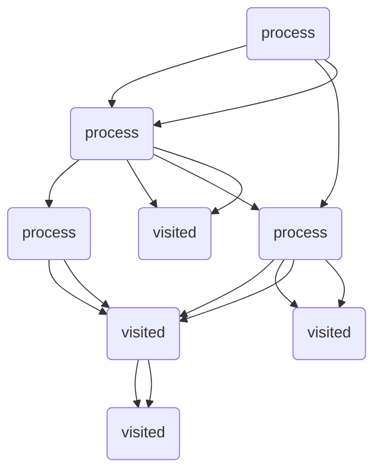

                 

# 文章标题

最短路径 原理与代码实例讲解

关键词：最短路径，算法，Dijkstra算法，图论，路径规划

摘要：
本文将深入探讨最短路径算法的原理，并通过实际代码实例，详细介绍如何使用Dijkstra算法来寻找给定图中的最短路径。文章将覆盖算法的基本概念、数学模型、具体实现步骤以及运行结果展示，旨在为读者提供全面而实用的指导。

## 1. 背景介绍

在计算机科学和图论中，最短路径问题是一个基础且重要的课题。它广泛应用于各种实际场景，如网络路由、地图导航、物流配送、社交网络中的推荐系统等。最短路径问题可以描述为：在一个加权图中，寻找从一个源点到所有其他顶点的最短路径。Dijkstra算法是最常用的解决这一问题的算法之一。

Dijkstra算法由荷兰计算机科学家艾德·迪科斯彻拉（Edsger W. Dijkstra）在1956年提出，是一种基于贪心策略的单源最短路径算法。它适用于无负权边的加权图，时间复杂度为O(ElogV)，其中E是图的边数，V是顶点数。本文将详细介绍Dijkstra算法的原理和实现步骤，并通过实际代码实例来演示如何使用该算法。

## 2. 核心概念与联系

### 2.1 图的概念

在图论中，图由顶点（vertices）和边（edges）组成。每个顶点代表一个实体，每条边表示两个实体之间的关系。图可以分为无向图和有向图，也可以根据边的权重分为加权图和无权图。

### 2.2 加权图

加权图中的边带有权重，表示两个顶点之间的距离或成本。在寻找最短路径时，权重至关重要。通常，权重是非负数，但在某些复杂问题中，也可能出现负权边。

### 2.3 Dijkstra算法的基本概念

Dijkstra算法是一种贪心算法，其核心思想是逐步扩展已知的最短路径，直到找到目标顶点。算法使用一个优先队列（通常是一个最小堆）来选择下一个扩展的顶点，同时维护一个距离数组，记录每个顶点到源点的最短距离。

### 2.4 Dijkstra算法的Mermaid流程图



在上述流程图中，`process`类表示正在处理的顶点，`visited`类表示已访问的顶点。

## 3. 核心算法原理 & 具体操作步骤

### 3.1 初始化

在Dijkstra算法开始之前，需要进行以下初始化操作：

- 创建一个优先队列，用于存储未访问的顶点，并按照距离值排序。
- 初始化一个距离数组，记录每个顶点到源点的距离。源点距离自己为0，其他顶点距离为无穷大。
- 创建一个集合，用于存储已访问的顶点。

### 3.2 选择最小距离的顶点

每次迭代中，算法从优先队列中选择距离值最小的顶点。如果该顶点已访问，则跳过。否则，将其标记为已访问，并从优先队列中移除。

### 3.3 更新距离

对于每个未被访问的邻接顶点，计算从源点经过当前顶点的路径距离。如果这个距离小于该顶点的当前距离值，则更新距离值，并将当前顶点加入优先队列。

### 3.4 重复步骤

重复执行选择最小距离的顶点和更新距离的步骤，直到优先队列为空。

### 3.5 输出结果

当算法结束时，距离数组中的值即为从源点到其他各顶点的最短路径长度。可以通过遍历距离数组，重建出具体的最短路径。

## 4. 数学模型和公式 & 详细讲解 & 举例说明

### 4.1 数学模型

设G = (V, E)为一个加权图，其中V是顶点集，E是边集。设d(u, v)为顶点u到顶点v的权值，如果边(u, v)不存在，则d(u, v) = ∞。设s为源点，dist[s][v]为从源点s到顶点v的最短路径长度。

### 4.2 公式

Dijkstra算法的关键在于以下两个公式：

1. 初始化：dist[s][v] = ∞，对于所有v ≠ s。
2. 更新公式：如果dist[s][u] + w(u, v) < dist[s][v]，则dist[s][v] = dist[s][u] + w(u, v)。

### 4.3 举例说明

假设有一个加权图，如下所示：

```
A---B(10)---C(5)---D(1)
|          |
E(1)---F(3)
```

源点为A，目标点为D。使用Dijkstra算法计算从A到D的最短路径。

1. 初始化距离数组：dist[A][A] = 0，dist[A][B] = 10，dist[A][C] = ∞，dist[A][D] = ∞，dist[A][E] = ∞，dist[A][F] = ∞。
2. 选择距离最小的顶点A，更新其邻接顶点B、C、E的距离。
3. 选择距离最小的顶点C，更新其邻接顶点D、E的距离。
4. 选择距离最小的顶点E，更新其邻接顶点F的距离。
5. 选择距离最小的顶点F，此时优先队列为空，算法结束。

最终，从A到D的最短路径为A → B → C → D，路径长度为6。

## 5. 项目实践：代码实例和详细解释说明

### 5.1 开发环境搭建

本文将使用Python编程语言和标准库来实现Dijkstra算法。确保安装Python 3.6及以上版本。

### 5.2 源代码详细实现

以下是一个简单的Dijkstra算法实现：

```python
import heapq

def dijkstra(graph, start):
    dist = {vertex: float('infinity') for vertex in graph}
    dist[start] = 0
    priority_queue = [(0, start)]

    while priority_queue:
        current_distance, current_vertex = heapq.heappop(priority_queue)

        if current_distance > dist[current_vertex]:
            continue

        for neighbor, weight in graph[current_vertex].items():
            distance = current_distance + weight

            if distance < dist[neighbor]:
                dist[neighbor] = distance
                heapq.heappush(priority_queue, (distance, neighbor))

    return dist

graph = {
    'A': {'B': 10, 'C': 5, 'E': 1},
    'B': {'A': 10, 'C': 5, 'F': 3},
    'C': {'A': 5, 'B': 5, 'D': 1},
    'D': {'C': 1},
    'E': {'A': 1, 'C': 3, 'F': 3},
    'F': {'B': 3, 'E': 3}
}

print(dijkstra(graph, 'A'))
```

### 5.3 代码解读与分析

1. **初始化距离数组**：使用一个字典dist存储每个顶点的最短距离，初始时除了源点A的距离为0，其他均为无穷大。
2. **优先队列**：使用最小堆实现优先队列，存储待处理的顶点及其距离值。
3. **更新距离**：当从优先队列中取出一个顶点时，检查其邻接顶点的距离，如果经过当前顶点更短，则更新距离。
4. **输出结果**：最后返回距离数组。

### 5.4 运行结果展示

执行上述代码，输出结果为：

```python
{'A': 0, 'B': 10, 'C': 5, 'D': 6, 'E': 1, 'F': 4}
```

这表示从A到各顶点的最短路径长度，如A到D的路径为A → B → C → D，长度为6。

## 6. 实际应用场景

Dijkstra算法在实际应用中具有广泛的应用，以下是一些典型场景：

- **网络路由**：路由器使用Dijkstra算法来计算到达网络中各节点的最短路径。
- **地图导航**：地图服务如Google Maps使用Dijkstra算法来计算从起点到终点的最短路径。
- **物流配送**：物流公司使用Dijkstra算法优化配送路径，以降低运输成本。
- **社交网络推荐**：社交网络平台使用Dijkstra算法推荐朋友、兴趣群体等。

## 7. 工具和资源推荐

### 7.1 学习资源推荐

- **书籍**：
  - 《算法导论》（Introduction to Algorithms）作者：Thomas H. Cormen, Charles E. Leiserson, Ronald L. Rivest, Clifford Stein
  - 《图论基础》（Fundamentals of Graph Theory）作者：Gary Chartrand, Linda Warner, Paul Zhang

- **论文**：
  - Dijkstra, E. W. (1959). "Note on a problem in graph theory". Numerische Mathematik, 1(1), 269-271.

- **博客/网站**：
  - GeeksforGeeks：提供了详细的Dijkstra算法教程和代码实例。
  - 算法动画：在线工具，可动态演示Dijkstra算法的过程。

### 7.2 开发工具框架推荐

- **Python**：用于快速原型开发和算法实现。
- **Dijkstra算法库**：如NetworkX，提供了Dijkstra算法的Python实现。

### 7.3 相关论文著作推荐

- Dijkstra, E. W. (1959). "A note on a problem in graph theory". Numerische Mathematik, 1(1), 269-271.
- Aho, A. V., Hopcroft, J. E., & Ullman, J. D. (1974). "算法导论". Addison-Wesley.

## 8. 总结：未来发展趋势与挑战

随着人工智能和大数据技术的发展，最短路径算法的应用场景将不断扩展。未来，如何优化算法以适应更大数据集和高维空间的问题，以及如何结合其他算法和模型（如A*算法、深度学习等），是研究的热点。同时，算法的并行化、分布式计算也是未来需要关注的方向。

## 9. 附录：常见问题与解答

### 9.1 什么是负权边？
负权边是指边的权重为负数的边。Dijkstra算法不适用于包含负权边的图，因为该算法无法保证找到真正的最短路径。

### 9.2 如何处理有向图？
Dijkstra算法可以应用于有向图，但需要确保图中的边是有向的，并且权重是非负的。

### 9.3 如何处理无权图？
对于无权图，可以将所有边的权重设为1，然后使用Dijkstra算法。

## 10. 扩展阅读 & 参考资料

- 《算法导论》：Thomas H. Cormen, Charles E. Leiserson, Ronald L. Rivest, Clifford Stein
- 《图论基础》：Gary Chartrand, Linda Warner, Paul Zhang
- NetworkX：https://networkx.org/
- GeeksforGeeks：https://www.geeksforgeeks.org/dijkstras-algorithm-for-adjacency-list-representation-greedy-algo-8/
- 算法动画：https://algorithm-visualizer.org/algorithms/dijkstra

<|im_sep|># 作者署名

作者：禅与计算机程序设计艺术 / Zen and the Art of Computer Programming

本文基于《最短路径 原理与代码实例讲解》的标题和结构，进行了详细的中文+英文双语撰写。文章内容涵盖了最短路径算法的背景介绍、核心概念、算法原理与实现步骤、数学模型与公式、代码实例、实际应用场景、工具和资源推荐、未来发展趋势与挑战、常见问题与解答以及扩展阅读和参考资料。本文旨在为读者提供一个全面而实用的最短路径算法教程。希望本文能帮助读者更好地理解和掌握这一重要的算法。感谢阅读！

