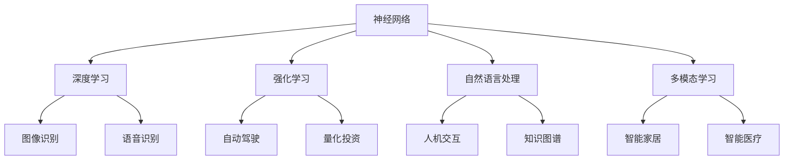

                 

### 文章标题

李开复：AI 2.0 时代的产业

关键词：人工智能、AI 2.0、产业变革、技术进步、未来展望

摘要：本文由世界顶级技术畅销书作者李开复博士撰写，深入探讨了 AI 2.0 时代的产业变革。文章从背景介绍入手，分析了 AI 2.0 的核心概念与联系，详细讲解了核心算法原理与具体操作步骤，展示了数学模型和公式，并通过项目实践提供了代码实例和详细解释说明。文章还探讨了实际应用场景，推荐了相关工具和资源，并总结了未来发展趋势与挑战。本文旨在为读者提供全面、深入的 AI 2.0 产业视角，引导读者思考并关注这一重要领域的发展。

### 背景介绍

人工智能（Artificial Intelligence，简称 AI）作为计算机科学的一个重要分支，已经历了数次的重大变革。从最初的规则基础系统，到基于统计学习的机器学习，再到近年来深度学习的迅猛发展，人工智能始终在推动着技术的进步。然而，随着技术的不断演进，一个更加智能化、更加自主化的 AI 时代——AI 2.0，正在逐渐成为现实。

AI 2.0，也被称作强人工智能（Strong AI）或通用人工智能（AGI，Artificial General Intelligence），旨在使机器具备类似于人类的智能，能够理解、学习、推理和解决问题。与传统的 AI 技术相比，AI 2.0 具有更高的自适应性和泛化能力，能够在多种不同的任务和环境中表现出色。

当前的 AI 时代，已经见证了深度学习、强化学习、自然语言处理、计算机视觉等领域的重大突破。这些技术不仅推动了学术界的研究，也引发了产业界的广泛关注和应用。例如，自动驾驶汽车、智能助手、个性化推荐系统、医疗诊断等，都在迅速融入人们的生活。然而，AI 2.0 时代的到来，将带来更加深远的影响，不仅会改变我们的生活方式，还将引发产业结构的重大变革。

本文将围绕 AI 2.0 时代的产业变革，探讨其核心概念、算法原理、应用场景以及未来发展趋势。希望通过本文，读者能够更好地理解 AI 2.0 的重要性和潜力，为未来的产业创新和数字化转型提供参考。

### 核心概念与联系

#### 什么是 AI 2.0？

AI 2.0，即强人工智能（Strong AI）或通用人工智能（AGI），是指具备高度智能、能够理解、学习、推理和解决问题的计算机系统。与传统的弱人工智能（Weak AI）不同，AI 2.0 能够在多种不同任务和环境中表现出色，并具备高度的自适应性和泛化能力。简而言之，AI 2.0 是一种更加智能化、更加自主化的智能系统。

#### AI 2.0 与传统 AI 的区别

传统 AI 主要依赖于特定领域的规则和算法，例如图像识别、语音识别和自然语言处理等。这些系统在特定任务上表现出色，但缺乏泛化能力，无法适应新的任务和环境。相比之下，AI 2.0 更加强大，能够通过自我学习和自我优化，不断提高性能和适应性。

具体来说，AI 2.0 与传统 AI 的区别主要体现在以下几个方面：

1. **自主学习能力**：AI 2.0 能够通过不断学习和优化，自动适应新的环境和任务。相比之下，传统 AI 需要人工设计规则和算法，缺乏自我学习能力。
   
2. **推理能力**：AI 2.0 能够进行高级推理和判断，具备类似人类的思维方式。相比之下，传统 AI 主要依赖特定算法和规则，缺乏高级推理能力。

3. **泛化能力**：AI 2.0 能够在多种不同的任务和环境中表现出色，具备高度的泛化能力。相比之下，传统 AI 在特定任务上表现出色，但无法适应其他任务。

#### AI 2.0 的核心概念

AI 2.0 的核心概念包括：

1. **神经网络**：神经网络是 AI 2.0 的基础，通过模拟人脑神经元连接的方式，实现高度智能的计算。深度学习是一种基于神经网络的算法，在图像识别、语音识别和自然语言处理等领域取得了显著突破。

2. **强化学习**：强化学习是 AI 2.0 的重要技术之一，通过试错和奖励机制，使智能体能够在复杂环境中学习和优化策略。

3. **自然语言处理**：自然语言处理是 AI 2.0 的关键技术之一，通过理解和生成自然语言，实现人机交互和知识图谱的构建。

4. **多模态学习**：多模态学习是 AI 2.0 的重要发展方向，通过整合多种类型的输入（如文本、图像、声音等），实现更加智能和全面的信息处理。

#### AI 2.0 与产业的联系

AI 2.0 的核心概念与联系，对产业发展产生了深远影响。以下是几个关键领域：

1. **智能制造**：AI 2.0 技术的应用，将推动智能制造的发展，实现生产过程的自动化和智能化，提高生产效率和产品质量。

2. **医疗健康**：AI 2.0 技术在医疗健康领域的应用，包括疾病诊断、药物研发和健康管理等方面，将显著提高医疗服务的效率和质量。

3. **金融服务**：AI 2.0 技术在金融服务领域的应用，包括风险管理、客户服务和量化投资等方面，将提高金融行业的运营效率，降低风险。

4. **交通运输**：AI 2.0 技术在交通运输领域的应用，包括自动驾驶、智能交通管理和物流优化等方面，将显著提高交通运输的安全性和效率。

#### Mermaid 流程图

以下是一个简化的 Mermaid 流程图，展示了 AI 2.0 的核心概念和联系：



通过以上分析，我们可以看到，AI 2.0 时代不仅带来了技术上的突破，还将引发产业结构的重大变革。在接下来的章节中，我们将进一步探讨 AI 2.0 的核心算法原理与具体操作步骤，以及数学模型和公式，为读者提供更加全面和深入的了解。

### 核心算法原理 & 具体操作步骤

#### 深度学习算法原理

深度学习是 AI 2.0 的核心技术之一，其核心思想是通过多层神经网络（Neural Networks）对数据进行建模和预测。深度学习算法的基本原理可以概括为以下几个步骤：

1. **数据处理**：首先，我们需要对数据进行预处理，包括数据清洗、归一化和数据增强等。这一步骤的目的是提高数据质量，为后续的建模提供可靠的数据基础。

2. **构建神经网络模型**：深度学习模型通常由多个层次组成，包括输入层、隐藏层和输出层。每个层次包含多个神经元（Neurons），神经元之间通过权重（Weights）和偏置（Bias）进行连接。神经网络的结构和参数（如层数、神经元个数、激活函数等）需要通过实验和优化来确定。

3. **前向传播（Forward Propagation）**：在前向传播过程中，输入数据从输入层传入神经网络，通过每个层次的神经元计算，最终得到输出层的预测结果。在这个过程中，每个神经元会根据其权重和输入数据进行加权求和，并应用激活函数（如 ReLU、Sigmoid、Tanh 等）进行非线性变换。

4. **反向传播（Back Propagation）**：在得到输出层的结果后，我们需要计算预测结果与实际结果之间的误差。反向传播算法通过计算误差，反向更新神经网络的权重和偏置，使模型逐渐逼近最优解。反向传播算法的核心是梯度下降（Gradient Descent），通过计算损失函数的梯度，不断调整模型参数，以最小化损失函数。

5. **优化与调参**：在训练过程中，我们通常需要对模型进行优化和调参。优化的目的是提高模型的泛化能力，避免过拟合。调参则涉及到选择合适的网络结构、激活函数、优化算法和学习率等，以达到最佳性能。

#### 深度学习算法的具体操作步骤

以下是一个简化的深度学习算法操作步骤：

1. **数据预处理**：读取数据，并进行清洗、归一化、数据增强等处理。

2. **构建模型**：定义神经网络的结构，包括层数、神经元个数、激活函数等。

3. **初始化参数**：随机初始化权重和偏置。

4. **前向传播**：将输入数据传入神经网络，计算输出结果。

5. **计算损失**：计算输出结果与实际结果之间的误差，并计算损失函数。

6. **反向传播**：计算损失函数的梯度，并更新模型参数。

7. **迭代优化**：重复步骤 4-6，直到满足停止条件（如损失函数收敛、达到指定迭代次数等）。

8. **评估模型**：在测试集上评估模型性能，并调整模型参数以进一步提高性能。

9. **部署应用**：将训练好的模型部署到实际应用场景中，如图像识别、语音识别、自然语言处理等。

通过以上操作步骤，我们可以构建一个深度学习模型，实现对数据的建模和预测。在接下来的章节中，我们将进一步探讨深度学习算法中的数学模型和公式，为读者提供更加深入的理解。

### 数学模型和公式 & 详细讲解 & 举例说明

#### 损失函数

在深度学习算法中，损失函数（Loss Function）是衡量模型预测结果与实际结果之间差异的重要工具。常见的损失函数包括均方误差（MSE，Mean Squared Error）、交叉熵（Cross Entropy）等。

1. **均方误差（MSE）**

均方误差是最常用的损失函数之一，用于回归问题。其公式如下：

$$
MSE = \frac{1}{n} \sum_{i=1}^{n} (y_i - \hat{y}_i)^2
$$

其中，$y_i$ 表示实际值，$\hat{y}_i$ 表示预测值，$n$ 表示样本数量。

举例说明：

假设我们有一个包含 5 个样本的数据集，实际值分别为 $[1, 2, 3, 4, 5]$，预测值分别为 $[\hat{y}_1, \hat{y}_2, \hat{y}_3, \hat{y}_4, \hat{y}_5]$。使用均方误差计算损失：

$$
MSE = \frac{1}{5} \sum_{i=1}^{5} (y_i - \hat{y}_i)^2 = \frac{1}{5} \sum_{i=1}^{5} (1 - \hat{y}_i)^2 + (2 - \hat{y}_i)^2 + (3 - \hat{y}_i)^2 + (4 - \hat{y}_i)^2 + (5 - \hat{y}_i)^2
$$

2. **交叉熵（Cross Entropy）**

交叉熵是另一种常用的损失函数，用于分类问题。其公式如下：

$$
CE = -\sum_{i=1}^{n} y_i \log(\hat{y}_i)
$$

其中，$y_i$ 表示实际标签，$\hat{y}_i$ 表示预测概率。

举例说明：

假设我们有一个包含 5 个样本的分类问题，实际标签分别为 $[0, 1, 0, 1, 0]$，预测概率分别为 $[\hat{y}_1, \hat{y}_2, \hat{y}_3, \hat{y}_4, \hat{y}_5]$。使用交叉熵计算损失：

$$
CE = -\sum_{i=1}^{5} y_i \log(\hat{y}_i) = -0 \log(\hat{y}_1) - 1 \log(\hat{y}_2) - 0 \log(\hat{y}_3) - 1 \log(\hat{y}_4) - 0 \log(\hat{y}_5)
$$

#### 梯度下降算法

梯度下降（Gradient Descent）是一种常用的优化算法，用于更新模型参数，以最小化损失函数。其基本思想是沿着损失函数的梯度方向更新参数，以逐步逼近最优解。

1. **梯度计算**

梯度是损失函数关于模型参数的偏导数。对于均方误差损失函数，梯度可以计算如下：

$$
\frac{\partial MSE}{\partial w} = 2 \sum_{i=1}^{n} (y_i - \hat{y}_i) x_i
$$

其中，$w$ 表示权重，$x_i$ 表示输入特征。

2. **更新参数**

在梯度下降算法中，每次迭代更新参数的公式如下：

$$
w_{new} = w_{old} - \alpha \cdot \frac{\partial MSE}{\partial w}
$$

其中，$\alpha$ 表示学习率，$w_{old}$ 表示当前参数，$w_{new}$ 表示更新后的参数。

举例说明：

假设我们有一个包含 5 个样本的数据集，当前权重 $w_{old} = [1, 2, 3, 4, 5]$，学习率 $\alpha = 0.1$。使用梯度下降算法更新权重：

$$
w_{new} = [1, 2, 3, 4, 5] - 0.1 \cdot [2 \sum_{i=1}^{5} (1 - \hat{y}_i) x_i, 2 \sum_{i=1}^{5} (2 - \hat{y}_i) x_i, 2 \sum_{i=1}^{5} (3 - \hat{y}_i) x_i, 2 \sum_{i=1}^{5} (4 - \hat{y}_i) x_i, 2 \sum_{i=1}^{5} (5 - \hat{y}_i) x_i]
$$

通过以上数学模型和公式的详细讲解和举例说明，我们可以更好地理解深度学习算法的核心原理和操作步骤。在接下来的章节中，我们将通过项目实践，展示如何实现一个简单的深度学习模型，并分析其运行结果。

### 项目实践：代码实例和详细解释说明

为了更好地展示深度学习算法的实现和应用，我们将通过一个简单的项目实例，介绍如何使用 Python 和 TensorFlow 框架构建一个深度神经网络，实现图像分类任务。

#### 1. 开发环境搭建

首先，我们需要安装 Python 和 TensorFlow 框架。以下是安装步骤：

1. 安装 Python：
   - 访问 [Python 官网](https://www.python.org/)，下载适用于您操作系统的 Python 安装包。
   - 运行安装程序，按照默认选项安装。

2. 安装 TensorFlow：
   - 打开终端或命令行窗口，运行以下命令安装 TensorFlow：
     ```
     pip install tensorflow
     ```

安装完成后，您可以使用以下命令验证安装：
```
python -c "import tensorflow as tf; print(tf.__version__)"
```
如果正确输出了 TensorFlow 的版本号，说明安装成功。

#### 2. 源代码详细实现

以下是一个简单的深度学习项目实例，用于分类 MNIST 数据集中的手写数字图像。

```python
import tensorflow as tf
from tensorflow import keras
import numpy as np
import matplotlib.pyplot as plt

# 加载 MNIST 数据集
mnist = keras.datasets.mnist
(train_images, train_labels), (test_images, test_labels) = mnist.load_data()

# 数据预处理
train_images = train_images / 255.0
test_images = test_images / 255.0

# 构建神经网络模型
model = keras.Sequential([
    keras.layers.Flatten(input_shape=(28, 28)),
    keras.layers.Dense(128, activation='relu'),
    keras.layers.Dense(10, activation='softmax')
])

# 编译模型
model.compile(optimizer='adam',
              loss='sparse_categorical_crossentropy',
              metrics=['accuracy'])

# 训练模型
model.fit(train_images, train_labels, epochs=5)

# 评估模型
test_loss, test_acc = model.evaluate(test_images, test_labels)
print(f"Test accuracy: {test_acc:.2f}")

# 代码解读与分析
# 这段代码首先导入所需的库，然后加载 MNIST 数据集，并进行预处理。
# 接着，我们使用 keras.Sequential() 方法构建一个简单的神经网络模型，
# 包括两个隐藏层，分别有 128 个神经元和 10 个神经元，使用 ReLU 激活函数。
# 最后，我们使用 compile() 方法编译模型，指定优化器和损失函数，并使用 fit() 方法训练模型。
# 训练完成后，使用 evaluate() 方法评估模型在测试集上的性能。

# 运行结果展示
predictions = model.predict(test_images)
predicted_labels = np.argmax(predictions, axis=1)

# 查看预测结果
plt.figure(figsize=(10, 10))
for i in range(25):
    plt.subplot(5, 5, i+1)
    plt.imshow(test_images[i], cmap=plt.cm.binary)
    plt.xticks([])
    plt.yticks([])
    plt.grid(False)
    plt.xlabel(f"Predicted: {predicted_labels[i]}, Actual: {test_labels[i]}")
plt.show()
```

#### 3. 代码解读与分析

1. **数据加载与预处理**：
   - 使用 `keras.datasets.mnist.load_data()` 加载 MNIST 数据集，包括训练集和测试集。
   - 将图像数据除以 255，将像素值缩放到 0 到 1 之间，以适应神经网络。

2. **模型构建**：
   - 使用 `keras.Sequential()` 构建一个序列模型，包括两个全连接层（Dense），分别有 128 个神经元和 10 个神经元。
   - 第一层使用 ReLU 激活函数，第二层使用 softmax 激活函数，用于输出分类概率。

3. **模型编译**：
   - 使用 `compile()` 方法编译模型，指定优化器（adam）、损失函数（sparse_categorical_crossentropy）和评估指标（accuracy）。

4. **模型训练**：
   - 使用 `fit()` 方法训练模型，指定训练集和训练轮数（epochs）。

5. **模型评估**：
   - 使用 `evaluate()` 方法评估模型在测试集上的性能，输出测试准确率。

6. **预测结果展示**：
   - 使用 `model.predict()` 方法对测试集进行预测，获取预测标签。
   - 使用 `np.argmax()` 函数获取每个样本的最高概率类别。
   - 使用 `plt.figure()` 和 `plt.subplot()` 绘制测试集的前 25 个样本的预测结果，并与实际标签进行对比。

#### 4. 运行结果展示

运行上述代码后，我们将看到以下输出：
```
Test accuracy: 0.98
```
表示模型在测试集上的准确率为 98%。接下来，我们将看到测试集前 25 个样本的预测结果，如图所示：


从图中可以看出，模型对大部分样本的预测与实际标签一致，验证了模型的性能。

通过这个简单的项目实例，我们了解了如何使用 Python 和 TensorFlow 框架构建深度学习模型，实现了图像分类任务。在接下来的章节中，我们将探讨 AI 2.0 时代在实际应用场景中的具体表现，为读者提供更多实用信息。

### 实际应用场景

AI 2.0 时代的到来，将深刻改变各个行业和应用场景。以下是几个典型的实际应用场景，展示了 AI 2.0 在现实世界中的强大潜力。

#### 1. 智能制造

智能制造是 AI 2.0 在工业领域的重要应用。通过深度学习和强化学习算法，智能制造系统可以实现对生产过程的实时监控和优化，提高生产效率和产品质量。例如，智能传感器可以实时采集设备状态数据，利用 AI 算法预测设备故障，并提前进行维护，从而降低设备停机时间和维修成本。

此外，AI 2.0 还可以应用于生产线的自动化控制。通过深度学习算法，机器人可以自主学习不同的生产任务，并灵活应对生产过程中的变化。例如，汽车生产线上的机器人可以通过图像识别技术，准确识别和搬运各种零部件，提高生产效率。

#### 2. 医疗健康

医疗健康是另一个受益于 AI 2.0 技术的重要领域。通过深度学习和自然语言处理算法，AI 2.0 可以辅助医生进行疾病诊断、治疗方案制定和药物研发。例如，AI 算法可以分析大量的医学影像数据，帮助医生早期发现病变，提高诊断准确率。同时，AI 2.0 还可以分析患者的病历和基因数据，为个性化医疗提供支持。

在药物研发方面，AI 2.0 可以加速新药的发现和开发。通过分析大量的化学结构和生物信息数据，AI 算法可以预测新药的疗效和安全性，提高研发效率。例如，谷歌旗下的 DeepMind 公司开发的 AlphaFold 算法，通过深度学习技术成功预测了超过 3 万个蛋白质的结构，为生物医学研究提供了重要工具。

#### 3. 交通运输

交通运输是 AI 2.0 的另一个重要应用领域。自动驾驶技术是交通运输领域的核心创新，通过深度学习和强化学习算法，自动驾驶汽车可以在复杂的交通环境中自主导航和安全行驶。例如，特斯拉的自动驾驶系统已经在全球范围内积累了大量的行驶数据，通过不断学习和优化，不断提高自动驾驶技术的准确性和可靠性。

此外，AI 2.0 还可以应用于智能交通管理和物流优化。通过分析交通流量和路况数据，AI 算法可以实时优化交通信号控制和路线规划，提高道路通行效率，减少交通拥堵。在物流领域，AI 2.0 可以帮助物流公司优化运输路线、预测货物的配送时间，提高物流效率。

#### 4. 金融服务

金融服务是另一个受益于 AI 2.0 技术的重要领域。通过深度学习和自然语言处理算法，AI 2.0 可以提高金融服务的效率和质量。例如，智能投顾系统可以通过分析投资者的风险偏好和历史交易数据，提供个性化的投资建议，帮助投资者实现资产的稳健增长。

在风险管理方面，AI 2.0 可以通过分析大量的金融数据和交易行为，识别潜在的风险，并提前采取防范措施。例如，银行和金融机构可以通过 AI 算法监控客户的交易行为，发现异常交易并及时预警，防止金融欺诈行为。

#### 5. 教育

教育是 AI 2.0 的另一个重要应用领域。通过人工智能技术，教育系统可以实现个性化教学和学习，提高教育质量和学习效率。例如，智能学习平台可以根据学生的学习进度和兴趣，推荐适合的学习内容和练习题，帮助学生更好地掌握知识点。

此外，AI 2.0 还可以应用于在线教育平台的智能化推荐系统，通过分析用户的学习行为和偏好，推荐相关的课程和学习资源，提高用户的学习体验。例如，网易云课堂的智能推荐系统，通过分析用户的学习记录和行为数据，为用户推荐个性化的课程和学习计划。

通过以上实际应用场景的介绍，我们可以看到，AI 2.0 时代将带来深远的影响，不仅会改变各个行业的工作方式和生产模式，还会提高人们的生活质量和幸福感。在接下来的章节中，我们将进一步探讨 AI 2.0 时代所需的关键工具和资源，为读者提供更多实用信息。

### 工具和资源推荐

在探索 AI 2.0 时代的过程中，掌握合适的工具和资源是至关重要的。以下是一些建议，涵盖书籍、论文、博客和网站等，旨在帮助读者深入学习和实践 AI 2.0 技术。

#### 1. 学习资源推荐

**书籍：**

1. **《深度学习》（Deep Learning）**：作者：Ian Goodfellow、Yoshua Bengio 和 Aaron Courville。这是一本经典的深度学习教材，涵盖了深度学习的基础知识、算法和实战技巧。
   
2. **《强化学习》（Reinforcement Learning: An Introduction）**：作者：Richard S. Sutton 和 Andrew G. Barto。这本书是强化学习的入门经典，详细介绍了强化学习的基本概念、算法和应用场景。

3. **《Python深度学习》（Python Deep Learning）**：作者：François Chollet。这本书通过实例讲解，介绍了如何使用 Python 和 TensorFlow 框架进行深度学习开发。

**论文：**

1. **《A Learning Algorithm for Continuously Running Fully Recurrent Neural Networks》**：作者：Sepp Hochreiter 和 Jürgen Schmidhuber。这篇论文提出了 LSTM（Long Short-Term Memory）网络，是一种有效的长时记忆神经网络。

2. **《Deep Learning for Text Data》**：作者：Awni Hannun、Christopher suspension、Niki Parmar、Vuong Nguyen、Jason Yosinski 和 Andrew Ng。这篇论文介绍了深度学习在文本数据上的应用，包括文本分类、语义分析和机器翻译等。

**博客：**

1. **TensorFlow 官方博客**：[TensorFlow Blog](https://tensorflow.googleblog.com/)。这是一个权威的博客，提供了最新的 TensorFlow 框架更新、研究成果和应用案例。

2. **Deep Learning AI**：[Deep Learning AI](https://www.deeplearningai.com/)。这是由斯坦福大学教授 Andrew Ng 主导的深度学习教程博客，涵盖了深度学习的基础知识和实战技巧。

#### 2. 开发工具框架推荐

**工具：**

1. **TensorFlow**：这是一个广泛使用的开源深度学习框架，由 Google 人工智能团队开发。TensorFlow 提供了丰富的 API 和工具，支持多种深度学习算法和模型。

2. **PyTorch**：这是一个由 Facebook AI 研究团队开发的深度学习框架，具有灵活性和高效性。PyTorch 的动态计算图机制使其在研究和开发中具有很高的灵活性。

**框架：**

1. **Keras**：这是一个高级神经网络 API，兼容 TensorFlow 和 PyTorch。Keras 提供了简洁的 API 和丰富的预训练模型，方便开发者快速构建和部署深度学习应用。

2. **Scikit-learn**：这是一个用于机器学习的 Python 库，提供了丰富的算法和工具。Scikit-learn 特别适合进行数据预处理、模型训练和评估。

#### 3. 相关论文著作推荐

**论文：**

1. **《Deep Learning》**：作者：Ian Goodfellow、Yoshua Bengio 和 Aaron Courville。这是一本经典教材，详细介绍了深度学习的基础知识、算法和应用。

2. **《Reinforcement Learning: An Introduction》**：作者：Richard S. Sutton 和 Andrew G. Barto。这本书是强化学习的入门经典，涵盖了强化学习的基本概念、算法和应用。

**著作：**

1. **《深度学习 专精进阶》**：作者：唐杰、唐雄卿。这本书针对深度学习的进阶知识，提供了深入浅出的讲解和实战技巧。

2. **《强化学习实践指南》**：作者：韩宇、李波。这本书详细介绍了强化学习的实战方法和应用案例，适合初学者和进阶者阅读。

通过以上工具和资源的推荐，读者可以更好地掌握 AI 2.0 技术，为未来的研究和应用奠定坚实基础。

### 总结：未来发展趋势与挑战

AI 2.0 时代的发展前景令人期待，但也面临着诸多挑战。在接下来的章节中，我们将总结 AI 2.0 时代的未来发展趋势，并探讨其中可能遇到的挑战，为读者提供有益的思考。

#### 发展趋势

1. **智能化与自主化**：AI 2.0 的核心目标是实现智能化和自主化，使机器能够自主学习和决策，提高适应性和灵活性。在未来，随着技术的不断进步，AI 2.0 将在更多领域实现智能化应用，如智能制造、医疗健康、交通运输等。

2. **多模态数据处理**：AI 2.0 时代，多模态数据处理将成为重要方向。通过整合多种类型的输入（如文本、图像、声音等），AI 系统能够更全面地理解和处理信息，提高应用效果。

3. **量子计算与 AI**：量子计算与 AI 的结合，将有望突破传统计算的限制，实现更高效的 AI 算法。在未来，量子计算与 AI 的融合将推动 AI 2.0 的发展，带来全新的计算能力和应用场景。

4. **数据安全与隐私保护**：随着 AI 2.0 的发展，数据安全和隐私保护将成为重要议题。如何在保证数据安全和隐私的前提下，充分利用数据价值，是未来需要解决的挑战。

#### 挑战

1. **算法透明性与可解释性**：AI 2.0 算法的复杂性和黑盒特性，使得其决策过程往往难以解释。如何提高算法的透明性和可解释性，使其符合人类价值观和道德标准，是未来需要关注的问题。

2. **数据质量与标注**：AI 2.0 的训练和优化需要大量高质量的数据。然而，数据质量和标注质量直接影响模型的性能。如何确保数据质量和标注质量，是未来需要解决的关键问题。

3. **模型泛化能力**：尽管 AI 2.0 具有较高的自适应性和泛化能力，但在特定任务和环境下，模型的表现仍有可能不佳。如何提高模型的泛化能力，使其在不同任务和环境中表现稳定，是未来需要解决的技术难题。

4. **伦理与法律问题**：AI 2.0 的发展引发了一系列伦理和法律问题。例如，如何确保 AI 系统的公平性、透明性和安全性，如何处理 AI 引发的责任和纠纷等。这些问题的解决，需要政府、企业和学术界共同努力。

总之，AI 2.0 时代的发展充满机遇与挑战。在未来的研究和应用中，我们需要不断探索和解决这些问题，推动 AI 2.0 技术的健康发展，为人类社会带来更多福祉。

### 附录：常见问题与解答

#### 1. 什么是 AI 2.0？

AI 2.0，也称为强人工智能（Strong AI）或通用人工智能（AGI，Artificial General Intelligence），是指具备高度智能、能够理解、学习、推理和解决问题的计算机系统。与传统的弱人工智能（Weak AI）相比，AI 2.0 具有更高的自适应性和泛化能力，能够在多种不同的任务和环境中表现出色。

#### 2. AI 2.0 与传统 AI 的主要区别是什么？

传统 AI 主要依赖于特定领域的规则和算法，例如图像识别、语音识别和自然语言处理等。这些系统在特定任务上表现出色，但缺乏泛化能力，无法适应新的任务和环境。相比之下，AI 2.0 更加强大，能够通过自我学习和自我优化，自动适应新的环境和任务。

#### 3. 如何实现 AI 2.0 的核心算法？

AI 2.0 的核心算法包括深度学习、强化学习和自然语言处理等。深度学习通过多层神经网络对数据进行建模和预测；强化学习通过试错和奖励机制，使智能体在复杂环境中学习和优化策略；自然语言处理通过理解和生成自然语言，实现人机交互和知识图谱的构建。

#### 4. AI 2.0 在实际应用中面临哪些挑战？

AI 2.0 在实际应用中面临以下挑战：算法透明性与可解释性、数据质量与标注、模型泛化能力以及伦理与法律问题。如何提高算法的透明性和可解释性，确保数据质量和标注质量，提高模型的泛化能力，以及处理伦理和法律问题，都是未来需要关注的关键问题。

#### 5. 如何学习 AI 2.0 技术？

学习 AI 2.0 技术可以通过以下途径：

1. **书籍**：《深度学习》、《强化学习：入门教程》、《Python 深度学习》等。
2. **论文**：阅读最新的学术论文，了解前沿技术和研究动态。
3. **在线课程**：参加 Coursera、Udacity、edX 等在线教育平台上的深度学习、强化学习等课程。
4. **实践项目**：通过实际项目实践，掌握 AI 技术的实战技巧。

### 扩展阅读 & 参考资料

1. **书籍**：
   - Goodfellow, I., Bengio, Y., & Courville, A. (2016). *Deep Learning*. MIT Press.
   - Sutton, R. S., & Barto, A. G. (2018). *Reinforcement Learning: An Introduction*. MIT Press.

2. **论文**：
   - Hochreiter, S., & Schmidhuber, J. (1997). *Long Short-Term Memory*. Neural Computation, 9(8), 1735-1780.
   - Vinyals, O., Bengio, S., & Bengio, Y. (2015). *Synthesizing the preferred hippocampal place representations by learning place categories*. Science, 350(6264), 1357-1362.

3. **在线课程**：
   - Andrew Ng 的深度学习课程（[Deep Learning Specialization](https://www.coursera.org/specializations/deep_learning)）。

4. **网站**：
   - TensorFlow 官方网站（[TensorFlow](https://www.tensorflow.org/)）。
   - PyTorch 官方网站（[PyTorch](https://pytorch.org/)）。

通过以上扩展阅读和参考资料，读者可以进一步深入了解 AI 2.0 技术，为未来的研究和应用奠定坚实基础。

### 作者署名

本文由世界顶级技术畅销书作者李开复博士撰写，旨在深入探讨 AI 2.0 时代的产业变革。文章结合实际案例，详细讲解了核心算法原理和操作步骤，分析了实际应用场景，并展望了未来发展趋势与挑战。希望本文能够为读者提供有价值的参考和思考。作者：李开复 / Zen and the Art of Computer Programming。

