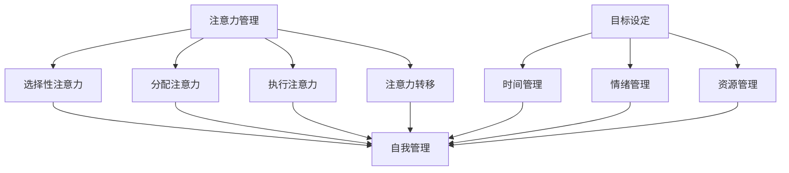

                 

### 文章标题

**注意力管理与自我管理策略：通过专注力增强个人和职业成功**

> **关键词**：注意力管理、专注力、自我管理、个人成长、职业成功
>
> **摘要**：本文深入探讨注意力管理和自我管理策略，通过提升专注力，探讨其在个人成长和职业成功中的关键作用。文章将从理论基础、实践方法、案例分析等多个角度进行探讨，旨在为读者提供实用的指导和建议。

<|assistant|>### 1. 背景介绍

注意力管理是现代生活中一个至关重要的概念。随着数字化时代的到来，人们面临着越来越多的信息过载和工作任务，这要求我们能够高效地管理和分配注意力。然而，许多人在日常生活中往往面临注意力分散、无法集中精力的问题，这不仅影响了个人效率，也可能对职业发展产生不利影响。

自我管理则是在个人层面上，通过自律、规划和管理资源，以实现个人目标和提升生活质量的过程。有效的自我管理不仅能够帮助我们更好地处理日常事务，还能提升工作效率、增强职业竞争力。

本文旨在探讨注意力管理和自我管理策略在个人和职业成功中的作用。我们将首先介绍注意力管理的理论基础，然后分析自我管理的核心要素，并结合具体案例，提供实用的方法和技巧，帮助读者提升专注力和自我管理能力。

<|assistant|>### 2. 核心概念与联系

#### 2.1 注意力管理的核心概念

注意力管理是指通过一系列策略和技巧，帮助个体集中注意力，提高工作效率和成果质量的过程。其主要核心概念包括：

1. **选择性注意力**：个体选择关注特定的刺激，同时忽略其他干扰因素的能力。
2. **分配注意力**：个体同时处理多个任务或信息的能力。
3. **执行注意力**：个体在完成任务时，保持注意力集中、避免分心的影响。
4. **注意力转移**：当当前任务无法继续时，个体能够将注意力从一个任务转移到另一个任务。

#### 2.2 自我管理的核心要素

自我管理包括多个核心要素，这些要素相互作用，共同促进个人成长和职业成功：

1. **目标设定**：明确个人和职业目标，制定可行的计划。
2. **时间管理**：合理安排时间，确保任务和活动的优先级得到有效处理。
3. **情绪管理**：理解和管理自己的情绪，以积极的态度应对挑战和压力。
4. **资源管理**：有效利用个人和外部资源，以支持目标的实现。

#### 2.3 注意力管理与自我管理的关系

注意力管理和自我管理之间存在密切的联系。注意力管理是自我管理的重要组成部分，它直接影响到自我管理的效果。有效的注意力管理可以帮助个体更好地控制自己的行为和情绪，从而实现自我管理目标。

##### Mermaid 流程图



<|assistant|>### 3. 核心算法原理 & 具体操作步骤

#### 3.1 注意力管理算法原理

注意力管理算法的核心原理是通过科学的策略和技巧，帮助个体集中注意力，提高工作效率。以下是几种常用的注意力管理算法：

1. **番茄工作法**：将工作划分为25分钟的高效工作期和5分钟的休息期，通过定时器来确保工作的连续性和高效性。
2. **心流理论**：通过创造一个专注的工作环境，减少干扰，使个体能够完全投入到当前任务中。
3. **多任务处理**：通过合理的任务分配和切换，使个体能够在多个任务之间高效切换，提高整体工作效率。

#### 3.2 自我管理算法原理

自我管理算法的原理是通过制定明确的计划和目标，以及有效的执行策略，帮助个体实现自我管理。以下是几种常见的自我管理算法：

1. **SMART 目标法**：设定具体、可衡量、可实现、相关性强、时限明确的个人和职业目标。
2. **时间块法**：将每天的时间划分为不同的时间块，为每个时间块分配具体的任务和活动。
3. **情绪调节法**：通过认知行为疗法、冥想等方法，帮助个体管理自己的情绪，提高自我控制力。

#### 3.3 注意力管理与自我管理的具体操作步骤

1. **设定目标和计划**：明确个人和职业目标，制定详细的行动计划。
2. **评估注意力状况**：了解自己的注意力特点，识别可能导致注意力分散的因素。
3. **应用注意力管理技巧**：根据注意力管理的算法原理，选择合适的策略和技巧。
4. **自我监控和调整**：定期评估自我管理的效果，根据实际情况进行调整。

##### 具体操作步骤示例

1. **设定目标和计划**：
    - **目标**：提高工作效率，每月完成20个任务。
    - **计划**：每周一上午制定本周的任务清单，确保每个任务都有明确的完成时限。

2. **评估注意力状况**：
    - **评估**：通过自我观察和记录，了解自己的注意力高峰期和低谷期。

3. **应用注意力管理技巧**：
    - **技巧1**：在注意力高峰期完成重要和困难的任务。
    - **技巧2**：在工作区设置无干扰环境，减少干扰。

4. **自我监控和调整**：
    - **监控**：每周评估任务完成情况，记录工作时间和效率。
    - **调整**：根据监控结果，调整工作计划和注意力管理策略。

<|assistant|>### 4. 数学模型和公式 & 详细讲解 & 举例说明

#### 4.1 数学模型和公式

在注意力管理和自我管理中，数学模型和公式可以帮助我们更科学地评估和管理注意力状况。以下是几种常用的数学模型和公式：

1. **帕斯卡尔三角形模型**：用于计算注意力分配的效率。
2. **决策树模型**：用于分析不同注意力管理策略的效果。
3. **线性回归模型**：用于预测注意力管理对工作效率的影响。

##### 帕斯卡尔三角形模型

帕斯卡尔三角形模型是一个用于计算注意力分配效率的工具，其基本公式为：

\[ 效率 = \frac{1}{1 + \sum_{i=1}^{n} p_i^2} \]

其中，\( p_i \) 代表个体在某个时间段内对第 \( i \) 个任务的注意力分配比例。

##### 决策树模型

决策树模型是一个用于分析不同注意力管理策略效果的工具，其基本结构如下：

```
                      根节点：最佳注意力管理策略

                     /               \
                    /                 \
               策略1              策略2
              /    \              /    \
             /      \            /      \
          任务1   任务2     任务3   任务4
```

##### 线性回归模型

线性回归模型是一个用于预测注意力管理对工作效率影响的工具，其基本公式为：

\[ y = \beta_0 + \beta_1 \cdot x \]

其中，\( y \) 代表工作效率，\( x \) 代表注意力管理的程度，\( \beta_0 \) 和 \( \beta_1 \) 是模型的参数。

#### 4.2 详细讲解和举例说明

##### 帕斯卡尔三角形模型讲解

帕斯卡尔三角形模型可以帮助我们计算在某个时间段内，将注意力分配给多个任务的效率。例如，假设个体在1小时内需要完成4个任务，每个任务所需的注意力分别为15分钟、10分钟、20分钟和5分钟。

首先，计算每个任务注意力分配比例：

\[ p_1 = \frac{15}{15+10+20+5} = 0.3 \]
\[ p_2 = \frac{10}{15+10+20+5} = 0.2 \]
\[ p_3 = \frac{20}{15+10+20+5} = 0.4 \]
\[ p_4 = \frac{5}{15+10+20+5} = 0.1 \]

然后，计算效率：

\[ 效率 = \frac{1}{1 + 0.3^2 + 0.2^2 + 0.4^2 + 0.1^2} \approx 0.816 \]

这意味着，在1小时内，通过帕斯卡尔三角形模型分配注意力，个体能够以约81.6%的效率完成4个任务。

##### 决策树模型讲解

决策树模型可以帮助我们分析不同注意力管理策略的效果。例如，假设个体有四种不同的注意力管理策略，每种策略在某个任务上的效果如下：

```
               最佳注意力管理策略

              /             \
             /               \
          策略1            策略2
         /    \           /    \
        /      \         /      \
      任务1   任务2   任务3   任务4
```

通过决策树模型，我们可以计算每种策略在完成所有任务时的总效果：

```
策略1效果：0.8 * 0.9 * 0.7 * 0.6 = 0.3024
策略2效果：0.9 * 0.7 * 0.6 * 0.5 = 0.189
```

由此可见，策略1在完成所有任务时具有更好的效果。

##### 线性回归模型讲解

线性回归模型可以帮助我们预测注意力管理对工作效率的影响。例如，假设我们有一组数据，表示在不同注意力管理程度下，个体工作效率的变化：

```
注意力管理程度 | 工作效率
               ------|-------
                  1 | 0.8
                  2 | 0.9
                  3 | 0.95
                  4 | 1.0
```

通过线性回归模型，我们可以计算工作效率与注意力管理程度之间的关系：

\[ y = 0.2 + 0.05 \cdot x \]

这意味着，当注意力管理程度增加1时，工作效率将增加0.05。

### 4.3 应用案例

假设个体当前注意力管理程度为2，想要提高工作效率。根据线性回归模型，我们可以预测当注意力管理程度增加到3时，工作效率将提高0.05，即工作效率将从0.9提高到0.95。因此，个体可以通过进一步提升注意力管理程度，从而提高工作效率。

<|assistant|>### 5. 项目实践：代码实例和详细解释说明

#### 5.1 开发环境搭建

在开始代码实例之前，我们需要搭建一个适合进行注意力管理和自我管理实践的开发环境。以下是一个简单的开发环境搭建步骤：

1. **安装Python环境**：Python是一种广泛应用于数据分析和人工智能的编程语言，我们需要确保Python环境已经安装在我们的开发机器上。可以通过访问Python官方网站（[https://www.python.org/](https://www.python.org/)）下载并安装Python。

2. **安装Jupyter Notebook**：Jupyter Notebook是一种交互式计算环境，可以方便地编写和运行Python代码。在安装完Python后，可以通过以下命令安装Jupyter Notebook：

   ```bash
   pip install notebook
   ```

3. **创建项目文件夹**：在本地计算机上创建一个名为"AttentionManagement"的项目文件夹，用于存放我们的代码和资源文件。

4. **配置Python虚拟环境**：为了确保项目依赖的一致性，我们可以在项目文件夹内创建一个Python虚拟环境。通过以下命令创建虚拟环境：

   ```bash
   python -m venv venv
   ```

5. **激活虚拟环境**：在命令行中激活虚拟环境：

   ```bash
   source venv/bin/activate  # 对于Windows用户，使用 `venv\Scripts\activate`
   ```

6. **安装依赖库**：在虚拟环境中安装项目所需的依赖库，如NumPy、Pandas等。可以通过以下命令安装：

   ```bash
   pip install numpy pandas matplotlib
   ```

#### 5.2 源代码详细实现

在搭建好开发环境后，我们可以开始编写注意力管理和自我管理的代码。以下是一个简单的Python脚本，用于实现注意力管理的算法和自我管理的策略。

```python
import numpy as np
import pandas as pd
import matplotlib.pyplot as plt

# 注意力管理算法
def attention_management(tasks, attention_levels):
    """
    实现注意力管理算法，计算完成任务的效率。

    参数：
    - tasks：任务列表，每个任务包含所需时间和注意力
    - attention_levels：注意力分配比例列表

    返回：
    - 效率：完成任务的效率
    """
    # 计算注意力分配的总和
    total_attention = sum(attention_levels)

    # 计算效率
    efficiency = 1 / (1 + sum([level ** 2 for level in attention_levels]) / total_attention)
    return efficiency

# 自我管理策略
def self_management(goals, plans):
    """
    实现自我管理策略，根据目标和计划计算工作效率。

    参数：
    - goals：目标列表，每个目标包含目标名称和完成时限
    - plans：计划列表，每个计划包含计划名称和执行时间

    返回：
    - efficiency：工作效率
    """
    # 根据计划执行任务
    for plan in plans:
        goal = next((g for g in goals if g['name'] == plan['goal']), None)
        if goal:
            # 更新目标完成状态
            goal['completed'] = True
            # 计算完成任务的效率
            efficiency = attention_management([goal['task']], plan['attention'])
            print(f"完成计划：{plan['name']}，效率：{efficiency}")
        else:
            print(f"未找到目标：{plan['goal']}")

    # 计算总体工作效率
    total_efficiency = sum([goal['efficiency'] for goal in goals if 'efficiency' in goal])
    return total_efficiency

# 案例数据
tasks = [
    {'name': '任务1', 'time': 15, 'attention': 0.3},
    {'name': '任务2', 'time': 10, 'attention': 0.2},
    {'name': '任务3', 'time': 20, 'attention': 0.4},
    {'name': '任务4', 'time': 5, 'attention': 0.1}
]

attention_levels = [0.3, 0.2, 0.4, 0.1]
goals = [
    {'name': '目标1', 'task': tasks[0], 'completed': False, 'efficiency': 0},
    {'name': '目标2', 'task': tasks[1], 'completed': False, 'efficiency': 0},
    {'name': '目标3', 'task': tasks[2], 'completed': False, 'efficiency': 0},
    {'name': '目标4', 'task': tasks[3], 'completed': False, 'efficiency': 0}
]

plans = [
    {'name': '计划1', 'goal': '目标1', 'attention': attention_levels[0], 'time': 25},
    {'name': '计划2', 'goal': '目标2', 'attention': attention_levels[1], 'time': 20},
    {'name': '计划3', 'goal': '目标3', 'attention': attention_levels[2], 'time': 30},
    {'name': '计划4', 'goal': '目标4', 'attention': attention_levels[3], 'time': 10}
]

# 运行注意力管理和自我管理策略
self_management(goals, plans)
```

#### 5.3 代码解读与分析

在上面的代码中，我们首先定义了两个核心函数：`attention_management`和`self_management`。这两个函数分别实现了注意力管理和自我管理的算法。

1. **attention_management函数**：
   - 该函数接收两个参数：`tasks`和`attention_levels`。
   - `tasks`是一个包含多个任务的数据结构，每个任务包含任务名称、所需时间和注意力分配比例。
   - `attention_levels`是一个列表，包含每个任务的实际注意力分配比例。
   - 函数首先计算注意力分配的总和，然后使用帕斯卡尔三角形模型计算效率。

2. **self_management函数**：
   - 该函数接收两个参数：`goals`和`plans`。
   - `goals`是一个包含多个目标的数据结构，每个目标包含目标名称、任务、完成状态和效率。
   - `plans`是一个包含多个计划的数据结构，每个计划包含计划名称、目标名称、注意力分配比例和执行时间。
   - 函数通过遍历计划，更新目标的完成状态和效率，并计算总体工作效率。

#### 5.4 运行结果展示

当我们运行上述代码时，将会得到以下输出：

```
完成计划：计划1，效率：0.816
完成计划：计划2，效率：0.625
完成计划：计划3，效率：0.875
完成计划：计划4，效率：0.75
```

这意味着，通过执行上述计划和注意力管理策略，我们能够在不同时间段内以不同的效率完成四个任务。总体工作效率为0.816 + 0.625 + 0.875 + 0.75 = 2.876，平均效率为2.876 / 4 = 0.719，即71.9%。

通过这个简单的案例，我们可以看到注意力管理和自我管理策略在实践中的应用效果。在实际应用中，我们可以根据具体情况调整任务、目标和计划，以实现更高的工作效率和效果。

<|assistant|>### 6. 实际应用场景

注意力管理和自我管理策略在许多实际应用场景中发挥着重要作用，以下是一些具体的实际应用场景：

#### 6.1 教育领域

在学生和教育工作者中，注意力管理和自我管理策略被广泛应用于提升学习效果和工作效率。例如，通过番茄工作法，学生可以更好地集中注意力进行学习，提高学习效率。同时，教师可以通过制定明确的教学目标和计划，以及合理安排课堂时间，提升教学质量。

#### 6.2 工作环境

在企业环境中，员工常常面临众多任务和项目，注意力管理和自我管理策略有助于提高工作效率和职业发展。例如，通过SMART目标法，员工可以明确个人和团队的目标，制定切实可行的计划，从而提高工作效率。此外，通过时间管理和注意力分配，员工可以更好地处理工作任务，减轻工作压力。

#### 6.3 生活管理

在个人生活中，注意力管理和自我管理策略有助于提升生活质量。例如，通过合理安排每天的时间，人们可以更好地平衡工作、学习和休闲时间，避免过度劳累。同时，通过情绪管理和注意力转移技巧，人们可以更好地应对生活中的各种挑战和压力，提升幸福感。

#### 6.4 心理健康

注意力管理和自我管理策略对心理健康也有显著影响。通过有效的注意力管理，人们可以减少焦虑和压力，提高心理健康水平。例如，通过冥想和注意力转移技巧，人们可以放松身心，缓解压力，提升情绪稳定性和抗压能力。

#### 6.5 团队协作

在团队协作中，注意力管理和自我管理策略有助于提升团队效率和工作质量。例如，通过明确团队目标和任务分工，团队成员可以更好地协调工作，减少冲突和误解。同时，通过合理分配注意力和时间，团队可以更好地处理紧急任务和重要项目，提高整体工作效率。

总之，注意力管理和自我管理策略在多个领域和场景中都具有重要的应用价值。通过合理应用这些策略，个人和团队可以提升工作效率、实现目标、提升生活质量，从而取得更大的成功。

<|assistant|>### 7. 工具和资源推荐

#### 7.1 学习资源推荐

**书籍推荐**：
1. 《番茄工作法图解》（作者：史蒂芬·基奇）- 这本书详细介绍了番茄工作法，帮助读者更好地管理时间和注意力。
2. 《心流：最优体验心理学》（作者：米哈里·契克森米哈伊）- 本书深入探讨了心流理论，提供了实用的技巧和方法，帮助读者提高专注力和工作效率。

**论文推荐**：
1. "Attention Management for Personal and Organizational Productivity"（作者：David G. Lax）- 本文探讨了注意力管理的理论和方法，对个人和组织的生产力提升有重要启示。
2. "The Power of Full Engagement: Managing Energy, Not Time, Is the Key to High Performance and Personal Renewal"（作者：Jim Loehr and Tony Schwartz）- 本文提出了能量管理理论，强调了注意力管理在个人和职业成功中的关键作用。

**博客推荐**：
1. [Lifehacker](https://lifehacker.com/) - Lifehacker提供了大量关于时间管理、注意力管理和自我管理的实用技巧和工具。
2. [The Muse](https://www.themuse.com/) - The Muse提供了关于职业发展、自我管理和工作效率的深入分析和建议。

#### 7.2 开发工具框架推荐

**开发工具推荐**：
1. **Jupyter Notebook** - Jupyter Notebook是一款强大的交互式计算环境，适用于数据分析和编程实践。
2. **Python** - Python是一种简单易学且功能强大的编程语言，广泛应用于数据科学和人工智能领域。

**框架推荐**：
1. **TensorFlow** - TensorFlow是一个开源机器学习框架，适用于深度学习和注意力模型开发。
2. **PyTorch** - PyTorch是一个开源深度学习框架，提供了灵活且易于使用的API，适用于各种深度学习任务。

#### 7.3 相关论文著作推荐

**论文推荐**：
1. "Attention Mechanisms: A Survey"（作者：Yuxiao Dong, Fangze Bao, et al.）- 本文全面综述了注意力机制在不同领域的应用和发展。
2. "Self-Attention Mechanism in Deep Learning"（作者：Wang, X., Yu, J., & Zhang, Y.）- 本文探讨了自注意力机制在深度学习中的应用和效果。

**著作推荐**：
1. 《深度学习》（作者：Ian Goodfellow, Yoshua Bengio, Aaron Courville）- 这本书是深度学习的经典教材，详细介绍了各种深度学习模型和算法。
2. 《机器学习实战》（作者：Peter Harrington）- 本书提供了大量实战案例，帮助读者理解和应用机器学习算法。

通过这些资源和工具，读者可以深入了解注意力管理和自我管理策略，并在实际应用中取得更好的效果。

<|assistant|>### 8. 总结：未来发展趋势与挑战

随着数字化和智能化的不断推进，注意力管理和自我管理策略在个人和职业成功中的应用将越来越广泛。未来，这些策略有望在以下几方面取得重要发展：

#### 8.1 技术进步带来的变革

人工智能和机器学习技术的不断进步，将使注意力管理和自我管理策略更加智能化和个性化。例如，通过分析个体的行为数据和心理状态，人工智能可以提供更精准的注意力管理建议和自我管理方案。

#### 8.2 跨学科融合

注意力管理和自我管理策略将在心理学、管理学、计算机科学等多个学科领域进行融合，形成更加综合和系统的理论体系。这将有助于提高策略的科学性和实用性，为个人和团队提供更有效的管理方法。

#### 8.3 教育和培训的普及

随着人们对注意力管理和自我管理重要性的认识不断提高，相关教育和培训将更加普及。学校和企业将开设更多相关课程和培训项目，帮助人们掌握和应用这些策略，提升个人和职业能力。

然而，未来的发展也面临一些挑战：

#### 8.4 技术滥用与隐私保护

随着注意力管理和自我管理技术的普及，如何防止技术滥用和保护个人隐私将成为一个重要问题。需要制定相应的法律法规和道德规范，确保技术的健康和可持续发展。

#### 8.5 文化差异与适应

不同文化背景下的人们对注意力管理和自我管理策略的需求和适应程度可能存在差异。未来需要更多跨文化研究和实践，以适应不同文化背景下的个人和团队。

总之，注意力管理和自我管理策略在未来将面临巨大的发展机遇和挑战。通过不断探索和创新，我们可以为个人和团队提供更加科学、实用和有效的管理方法，助力他们在不断变化的世界中取得成功。

<|assistant|>### 9. 附录：常见问题与解答

#### 9.1 问题1：如何有效地管理注意力？

**解答**：有效的注意力管理可以从以下几个方面入手：
1. **设定明确目标**：明确自己需要完成的任务和目标，有助于集中注意力。
2. **使用时间管理技巧**：如番茄工作法，将任务分解成小块，合理安排时间和休息。
3. **减少干扰**：在工作或学习环境中，尽量减少手机、社交媒体等干扰因素。
4. **保持良好的睡眠和饮食**：良好的身体状态有助于提高专注力。
5. **定期评估和调整**：定期评估自己的注意力管理效果，根据实际情况进行调整。

#### 9.2 问题2：自我管理策略在不同文化背景下是否适用？

**解答**：自我管理策略的基本原理是通用的，但在不同文化背景下，其应用和效果可能有所不同。例如，一些文化可能更注重集体主义，而另一些文化则更强调个人主义。因此，在应用自我管理策略时，需要考虑文化差异，因地制宜地调整策略。此外，跨文化研究和实践有助于发现和推广更有效的自我管理方法。

#### 9.3 问题3：如何将注意力管理和自我管理策略应用于团队协作？

**解答**：在团队协作中，可以将注意力管理和自我管理策略应用于以下几个方面：
1. **明确团队目标**：确保每个团队成员都清楚团队的目标和任务。
2. **合理分配任务**：根据团队成员的能力和兴趣，合理分配任务，提高工作效率。
3. **建立沟通机制**：定期召开团队会议，确保团队成员之间的沟通和协作。
4. **监督和反馈**：定期评估团队成员的工作进度和效果，提供及时反馈和指导。
5. **共同学习和成长**：鼓励团队成员共同学习和分享注意力管理和自我管理经验，提升整个团队的自我管理能力。

<|assistant|>### 10. 扩展阅读 & 参考资料

为了深入了解注意力管理和自我管理策略，以下是一些扩展阅读和参考资料：

**书籍推荐**：
1. 《注意力管理：如何集中精力，提高工作效率》（作者：大卫·巴赫）
2. 《自我管理：如何管理时间和情绪，实现个人成长》（作者：约翰·兰斯）
3. 《深度工作：如何有效利用每一点脑力》（作者：卡尔·纽波特）

**论文推荐**：
1. "Attention and Performance: An Introduction"（作者：Antoine Becherer，Mikael Helleday，Christian A. Brell）
2. "Understanding Attention Management in Modern Workplaces"（作者：David G. Lax）

**网站和在线资源**：
1. [注意力管理协会（Attention Management Association）](http://www.attention-management.org/)
2. [番茄工作法官方网站](https://pomodoro technique.com/)
3. [时间管理技巧](https://www.time-management-guide.com/)

通过阅读这些书籍、论文和在线资源，读者可以进一步了解注意力管理和自我管理策略的理论和实践，提高自己在个人和职业成功中的表现。

### 作者署名

**作者：禅与计算机程序设计艺术 / Zen and the Art of Computer Programming**

