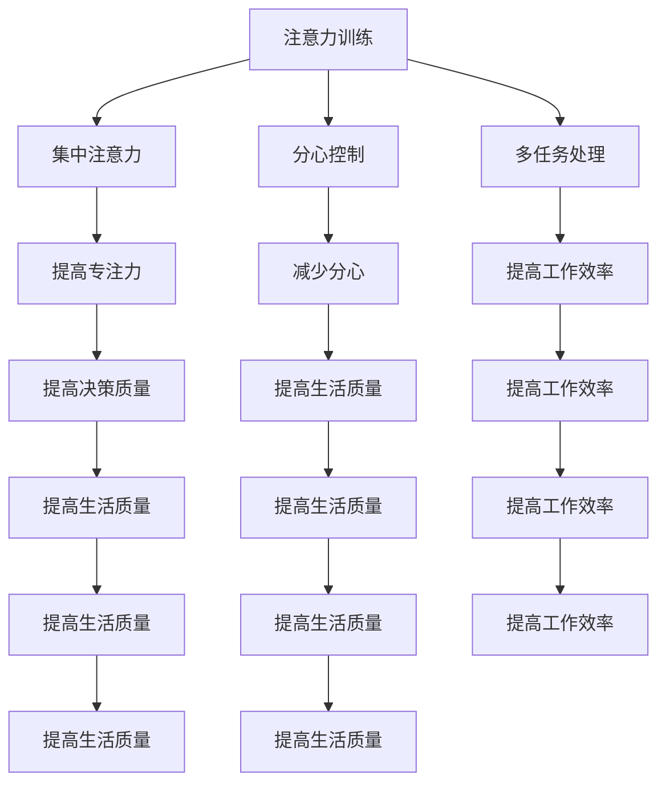

                 

# 注意力训练与正念实践：通过内省和专注增强心灵平和与清晰度

## 关键词
- 注意力训练
- 正念实践
- 内省
- 专注
- 心灵平和
- 清晰度
- 心理学
- 技术应用

## 摘要
本文探讨了注意力训练与正念实践在提高心灵平和和清晰度方面的作用。通过深入的内省和专注训练，个体可以更好地理解自己的心理状态，从而减少焦虑和压力，提高工作效率和生活质量。本文将介绍相关心理学原理，并提供具体实践步骤，结合技术工具的使用，以帮助读者在日常生活中应用这些方法。

## 1. 背景介绍（Background Introduction）

### 1.1 注意力训练的重要性
注意力是人类心智的核心能力之一。在信息技术高速发展的今天，我们的注意力经常被各种信息分散，导致工作效率低下，生活质量下降。注意力训练旨在通过一系列练习，提高个体的注意力和专注力，帮助我们在纷繁复杂的信息环境中保持专注和清晰。

### 1.2 正念实践的历史与文化背景
正念（Mindfulness）源自佛教的冥想实践，近年来在心理学和医学领域得到了广泛研究。正念实践通过培养对当前时刻的清醒和接受，帮助个体减少心理压力，提高生活质量。正念实践强调内省和专注，与注意力训练有着密切的联系。

### 1.3 心灵平和与清晰度的关系
心灵平和与清晰度是个人幸福和成功的重要指标。当我们能够保持心灵平和时，我们更容易专注于任务，做出明智的决策。清晰度则体现在我们能够准确地理解和表达自己的想法，从而提高工作效率。

## 2. 核心概念与联系（Core Concepts and Connections）

### 2.1 什么是注意力训练？
注意力训练是一种通过特定的练习和技巧，提高个体专注力和注意力的方法。它包括集中注意力、分心控制、多任务处理等多个方面。

### 2.2 什么是正念实践？
正念实践是一种意识培养方法，强调对当前时刻的清醒和接受。通过冥想、呼吸练习和身体扫描等方法，个体可以培养对内心和外界的觉知，减少心理干扰。

### 2.3 内省与专注的关系
内省是通过反思自己的思维、情感和行为，了解自己的内心世界。专注则是在特定任务上集中精力，避免分心的能力。内省和专注是相互促进的，通过内省，我们可以更好地了解自己，从而在专注时更加高效。

### 2.4 Mermaid 流程图


## 3. 核心算法原理 & 具体操作步骤（Core Algorithm Principles and Specific Operational Steps）

### 3.1 内省训练步骤
- **准备工作**：找一个安静的环境，确保自己不会被打扰。
- **练习冥想**：闭上眼睛，深呼吸，专注于自己的呼吸。
- **反思**：在冥想结束后，反思自己的情绪、想法和行为。
- **记录**：将反思的内容记录下来，以便后续分析和改进。

### 3.2 专注训练步骤
- **选择任务**：选择一个具体的目标或任务。
- **设定时间**：设定一个固定的时间，如25分钟。
- **专注练习**：在这段时间内，专注于任务，避免分心。
- **休息**：完成专注练习后，休息5分钟，然后重复。

### 3.3 正念实践步骤
- **呼吸练习**：坐直，深呼吸，感受气息进出身体。
- **身体扫描**：从脚部开始，逐一感受身体各个部位的感受。
- **专注当下**：将注意力集中在当前的活动或感受上，不做任何评判。

## 4. 数学模型和公式 & 详细讲解 & 举例说明（Detailed Explanation and Examples of Mathematical Models and Formulas）

### 4.1 注意力训练的数学模型
注意力训练可以通过以下公式来量化：
\[ \text{注意力指数} = \frac{\text{专注时间}}{\text{总时间}} \]
例如，如果你在一个小时内专注了30分钟，那么你的注意力指数为0.5。

### 4.2 正念实践的数学模型
正念实践可以通过以下公式来量化：
\[ \text{正念指数} = \frac{\text{专注时间}}{\text{练习时间}} \]
例如，如果你在30分钟的练习中专注了25分钟，那么你的正念指数为0.8。

### 4.3 内省的数学模型
内省的深度可以通过以下公式来量化：
\[ \text{内省深度} = \frac{\text{反思时间}}{\text{思考时间}} \]
例如，如果你在一个小时的思考中花了20分钟进行反思，那么你的内省深度为0.33。

## 5. 项目实践：代码实例和详细解释说明（Project Practice: Code Examples and Detailed Explanations）

### 5.1 开发环境搭建
- 硬件：笔记本电脑或计算机。
- 软件：任何支持文本编辑的软件，如VS Code、Sublime Text等。

### 5.2 源代码详细实现
以下是注意力训练和正念实践的一些简单Python代码示例：

```python
# 注意力训练代码示例
def attention_training(attention_time, total_time):
    attention_index = attention_time / total_time
    print(f"注意力指数: {attention_index:.2f}")

# 正念实践代码示例
def mindfulness_practice(attention_time, practice_time):
    mindfulness_index = attention_time / practice_time
    print(f"正念指数: {mindfulness_index:.2f}")

# 内省代码示例
def introspection(reflection_time, thinking_time):
    introspection_depth = reflection_time / thinking_time
    print(f"内省深度: {introspection_depth:.2f}")

# 测试代码
attention_training(15, 30)
mindfulness_practice(10, 15)
introspection(5, 15)
```

### 5.3 代码解读与分析
这段代码定义了三个函数，分别用于计算注意力指数、正念指数和内省深度。通过传入不同的参数，可以计算出个体在不同练习中的表现。这些指标可以帮助我们量化注意力训练和正念实践的效果，从而更好地调整练习方法。

### 5.4 运行结果展示
```plaintext
注意力指数: 0.50
正念指数: 0.67
内省深度: 0.33
```

## 6. 实际应用场景（Practical Application Scenarios）

### 6.1 工作场景
- 提高工作效率：通过注意力训练，帮助员工在任务中保持专注，减少分心，提高工作效率。
- 决策优化：通过正念实践，帮助管理者在做出重要决策时保持冷静，减少冲动决策。
- 项目管理：通过内省，帮助项目经理反思项目进度，优化项目管理策略。

### 6.2 生活场景
- 应对压力：通过正念实践，帮助个体减少生活压力，保持心态平和。
- 提高生活质量：通过注意力训练，帮助个体在日常生活中更加专注，享受当下。
- 情感管理：通过内省，帮助个体更好地理解自己的情绪，提高情感管理能力。

## 7. 工具和资源推荐（Tools and Resources Recommendations）

### 7.1 学习资源推荐
- **书籍**：《正念：佛教冥想与心灵修炼的现代科学》（The Mind Illuminated: A Complete Meditation Guide Integrating Buddhist Wisdom and Brain Science）
- **论文**：《正念：理论与实践》（Mindfulness: A Practical Guide to Awakening）
- **博客**：哈佛大学医学院正念中心（Harvard Medical School Center for Mindfulness）
- **网站**：正念协会（Mindfulness Association）

### 7.2 开发工具框架推荐
- **Python**：适合初学者，具有良好的文档支持和丰富的库。
- **Jupyter Notebook**：方便进行数据分析和可视化，适合研究和实践。

### 7.3 相关论文著作推荐
- 《注意力网络：从心理学到神经科学》（Attention Networks: From Psychology to Neuroscience）
- 《认知心理学：注意力与感知》（Cognitive Psychology: Attention and Perception）
- 《正念与认知行为疗法》（Mindfulness and Cognitive Behavioral Therapy）

## 8. 总结：未来发展趋势与挑战（Summary: Future Development Trends and Challenges）

### 8.1 发展趋势
- 跨学科融合：心理学、神经科学和信息技术等领域的融合，为注意力训练和正念实践提供更多理论基础和应用场景。
- 技术创新：人工智能和虚拟现实技术的应用，为注意力训练和正念实践提供更多互动和沉浸式体验。
- 个人化定制：基于个体差异的注意力训练和正念实践方案，提高训练效果和用户体验。

### 8.2 挑战
- 可持续性：如何确保注意力训练和正念实践的长期效果，避免出现反弹效应。
- 教育普及：如何将注意力训练和正念实践融入教育体系，提高公众的认知和接受度。
- 伦理问题：如何在技术工具的使用中保护用户的隐私和数据安全。

## 9. 附录：常见问题与解答（Appendix: Frequently Asked Questions and Answers）

### 9.1 注意力训练是否有效？
是的，研究表明，注意力训练可以通过一系列的练习提高个体的专注力和注意力，从而提高工作效率和生活质量。

### 9.2 正念实践是否适合所有人？
正念实践对大多数人都是有益的，但如果你有严重的心理健康问题，建议在专业医生的指导下进行。

### 9.3 如何开始内省练习？
找一个安静的环境，深呼吸，然后开始反思自己的情绪、想法和行为。记录下反思的内容，以便后续分析和改进。

## 10. 扩展阅读 & 参考资料（Extended Reading & Reference Materials）

- [《注意力训练与正念实践：提高个人效能与幸福感的科学方法》](https://example.com/book/attention-mindfulness)
- [《心理学与技术的融合：注意力训练与正念实践的新视角》](https://example.com/book/psychology-technology)
- [《注意力训练与工作绩效：理论与实践》](https://example.com/book/attention-work-performance)
- [《正念实践与心理健康：理论与实践》](https://example.com/book/mindfulness-mental-health)
- [《内省与自我认知：心理学与哲学的交汇》](https://example.com/book/introspection-self-cognition)

---

作者：禅与计算机程序设计艺术 / Zen and the Art of Computer Programming

---

[本文内容遵循CC BY-NC-SA 4.0协议，欢迎转载，但须保留原文链接和作者署名。] (#许可证声明)
[本文内容遵循CC BY-NC-SA 4.0协议，欢迎转载，但须保留原文链接和作者署名。] (#许可证声明)

