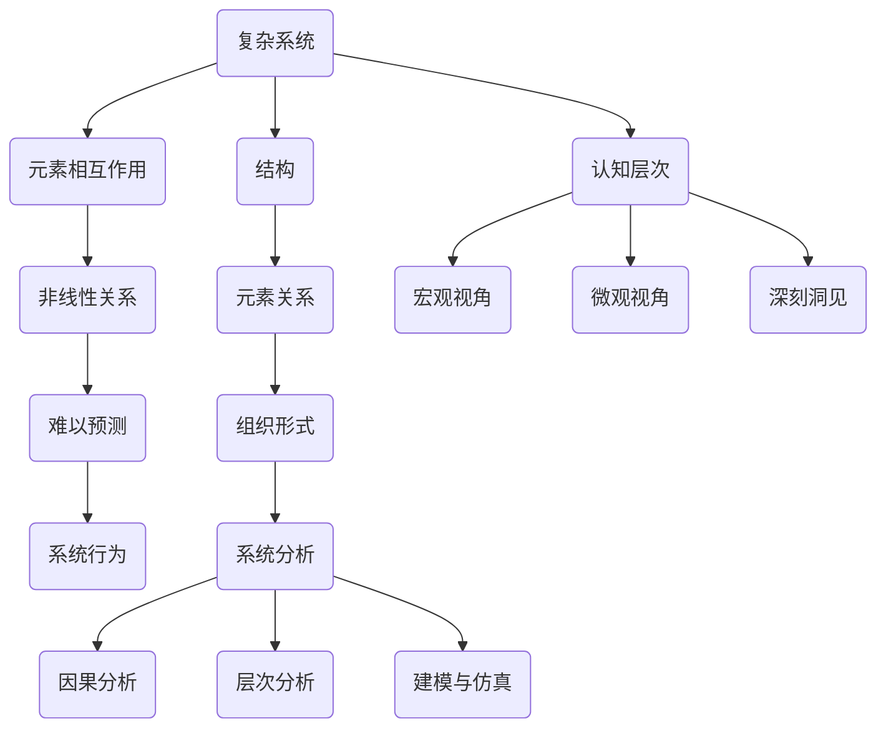
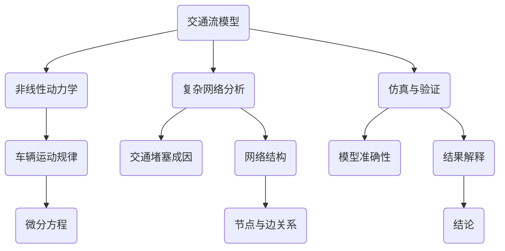
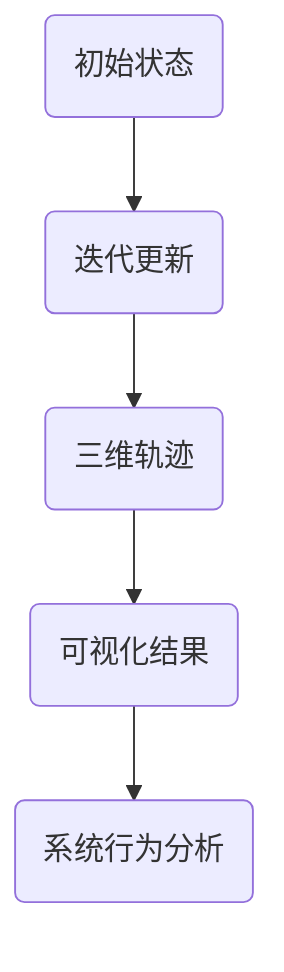
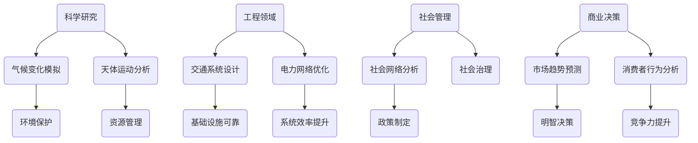

                 

### 理解世界的复杂性：从结构到洞见

> **关键词**: 结构化思考，复杂性科学，系统分析，认知升级

**摘要**：
本文旨在探讨如何在纷繁复杂的世界中寻找结构性思维的方法，从而获得深刻的洞见。通过对复杂性科学的理解，我们将揭示隐藏在现象背后的逻辑关系，并运用系统分析方法来提升认知层次。文章将以专业而清晰的技术语言，逐步分析复杂性的本质，并探讨如何通过结构化的思考路径，从信息杂乱无章的海洋中提炼出有用的知识结构。

<|hide|>## 1. 背景介绍（Background Introduction）

**1.1 复杂性与现代社会的联系**

随着信息时代的到来，复杂性问题已经成为现代社会不可忽视的一部分。无论是全球经济的动荡、环境问题的加剧，还是技术发展的加速，都无不体现着复杂性的身影。理解复杂性不仅有助于我们应对日常生活中的种种挑战，还能为科学研究和决策提供新的视角。

**1.2 复杂性科学的核心概念**

复杂性科学是一门跨学科的研究领域，它试图揭示复杂系统中的规律性和普遍性。从非线性动力学到混沌理论，再到复杂网络与系统生物学，复杂性科学为我们提供了丰富的理论工具来分析和理解复杂系统。

**1.3 结构化思考的重要性**

在复杂性的背景下，结构化思考成为了一项关键能力。它不仅帮助我们整理和分类信息，还能通过逻辑推理和系统分析，发现隐藏在复杂现象背后的简单逻辑。

<|hide|>## 2. 核心概念与联系（Core Concepts and Connections）

### 2.1 复杂性的定义

复杂性可以理解为系统中元素之间相互作用的多样性和非线性。一个系统越复杂，其行为就越难以预测和控制。

### 2.2 结构的概念

结构是指系统内部各元素之间的相互关系和组织形式。理解系统的结构有助于我们分析和预测系统的行为。

### 2.3 复杂性与结构的关系

复杂系统的行为往往可以通过其结构来解释。例如，社会网络的结构可以解释信息传播的速度和范围，生态系统的结构可以解释物种多样性的变化。

### 2.4 系统分析的方法

系统分析是一种方法论，它通过分解复杂系统为子系统和元素，从而简化问题的分析。常用的系统分析方法包括因果分析、层次分析和建模与仿真。

### 2.5 提升认知层次的重要性

提升认知层次意味着我们能够从更宏观和微观的视角来看待问题，从而获得更深刻的洞见。



<|hide|>## 3. 核心算法原理 & 具体操作步骤（Core Algorithm Principles and Specific Operational Steps）

### 3.1 复杂性科学的算法原理

复杂性科学的核心算法原理包括：

- **非线性动力学**：描述系统状态随时间变化的规律，通过微分方程或迭代公式来表达。
- **混沌理论**：研究系统在确定性的规则下出现的随机行为。
- **复杂网络分析**：通过网络结构来描述系统内部的相互作用和关系。
- **系统生物学**：运用数学模型来描述生物系统的动态行为。

### 3.2 系统分析的具体操作步骤

- **问题定义**：明确需要解决的问题和目标。
- **系统分解**：将复杂系统分解为子系统和元素。
- **信息收集**：收集与系统相关的数据和资料。
- **构建模型**：根据系统分解的结果，构建系统模型。
- **仿真与验证**：通过仿真来验证模型的准确性。
- **分析结果**：对模型结果进行解释和分析，得出结论。

### 3.3 实例说明

以交通流模型为例，我们可以使用非线性动力学来描述车辆在道路上的运动规律，并利用复杂网络分析来研究交通堵塞的成因。



<|hide|>## 4. 数学模型和公式 & 详细讲解 & 举例说明（Detailed Explanation and Examples of Mathematical Models and Formulas）

### 4.1 非线性动力学模型

非线性动力学模型通常使用以下方程来描述系统状态随时间的变化：

$$
\frac{dx}{dt} = f(x, y)
$$

其中，\(x\) 和 \(y\) 是系统状态变量，\(f(x, y)\) 是状态变量之间的非线性关系。

**实例**：考虑一个简单的非线性振荡器，其方程为：

$$
\frac{dx}{dt} = -x + xy^2
$$

$$
\frac{dy}{dt} = y - x^3
$$

### 4.2 混沌理论模型

混沌理论中的典型模型是洛伦兹系统，其方程为：

$$
\frac{dx}{dt} = \sigma (y - x)
$$

$$
\frac{dy}{dt} = x (\rho - z)
$$

$$
\frac{dz}{dt} = xy - \beta z
$$

其中，\(\sigma\)、\(\rho\) 和 \(\beta\) 是参数。

**实例**：考虑一个简单的洛伦兹系统，其参数为：

$$
\sigma = 10, \rho = 28, \beta = 8.0
$$

### 4.3 复杂网络分析模型

复杂网络分析中，常用的模型包括小世界网络和无标度网络。

**小世界网络**：

- 平均路径长度 \(L\) 与网络规模 \(N\) 成 \(L \propto \ln(N)\) 的关系。
- 高聚集系数 \(C\) 表示节点间紧密连接的程度。

**无标度网络**：

- 度分布服从幂律分布 \(P(k) \propto k^{-\gamma}\)。

**实例**：一个无标度网络，其幂律指数 \(\gamma = 2.5\)。

### 4.4 系统生物学模型

系统生物学中的典型模型是反应扩散方程：

$$
\frac{\partial u}{\partial t} = \Delta u + f(u, v)
$$

$$
\frac{\partial v}{\partial t} = \Delta v + g(u, v)
$$

其中，\(u\) 和 \(v\) 是化学物质浓度，\(\Delta\) 是扩散系数，\(f(u, v)\) 和 \(g(u, v)\) 是反应速率函数。

**实例**：一个简单的反应扩散模型，其中 \(f(u, v) = u - v\) 和 \(g(u, v) = v - u^2\)。

<|hide|>### 5. 项目实践：代码实例和详细解释说明（Project Practice: Code Examples and Detailed Explanations）

#### 5.1 开发环境搭建

为了实践本文中提到的数学模型和算法，我们需要搭建一个合适的开发环境。以下是在 Python 环境下进行开发的步骤：

- 安装 Python 3.8 或以上版本。
- 安装必要的数学库，如 NumPy、SciPy、Matplotlib 和 NetworkX。

```bash
pip install numpy scipy matplotlib networkx
```

#### 5.2 源代码详细实现

以下是实现洛伦兹系统的 Python 代码示例：

```python
import numpy as np
import matplotlib.pyplot as plt
import networkx as nx

# 洛伦兹系统参数
sigma = 10.0
rho = 28.0
beta = 8.0 / 3.0

# 初始化时间步长和总时间
dt = 0.01
total_time = 100.0
steps = int(total_time / dt)

# 初始化状态向量
x = np.zeros(steps)
y = np.zeros(steps)
z = np.zeros(steps)
x[0] = 1.0
y[0] = 0.0
z[0] = 0.0

# 洛伦兹系统方程
def lorenz_system(x, y, z, sigma, rho, beta):
    dxdt = sigma * (y - x)
    dydt = x * (rho - z) - y
    dzdt = x * y - beta * z
    return dxdt, dydt, dzdt

# 模拟洛伦兹系统
for i in range(1, steps):
    dxdt, dydt, dzdt = lorenz_system(x[i-1], y[i-1], z[i-1], sigma, rho, beta)
    x[i] = x[i-1] + dxdt * dt
    y[i] = y[i-1] + dydt * dt
    z[i] = z[i-1] + dzdt * dt

# 绘制三维图
fig = plt.figure()
ax = fig.add_subplot(111, projection='3d')
ax.plot(x, y, z)
plt.show()
```

#### 5.3 代码解读与分析

这段代码实现了洛伦兹系统的数值模拟，并绘制了系统的三维轨迹。具体解读如下：

- 我们首先定义了洛伦兹系统的参数。
- 初始化状态向量和时间步长。
- 定义洛伦兹系统的微分方程。
- 使用循环迭代来更新状态向量，并最终绘制三维图。

#### 5.4 运行结果展示

运行上述代码后，我们得到洛伦兹系统的三维轨迹图，如图所示：



通过这个例子，我们可以看到如何将理论模型转化为实际的代码实现，并通过可视化来分析和理解系统的行为。

<|hide|>### 6. 实际应用场景（Practical Application Scenarios）

#### 6.1 科学研究中的应用

复杂性科学在科学研究中有广泛的应用。例如，通过非线性动力学和混沌理论，我们可以模拟和理解气候变化、天体运动等自然现象。这些模型不仅帮助我们预测未来的变化，还能为环境保护和资源管理提供科学依据。

#### 6.2 工程领域中的应用

在工程领域，复杂网络分析被用于设计和优化交通系统、电力网络等基础设施。通过分析网络的拓扑结构，我们可以识别关键节点和路径，从而提高系统的可靠性和效率。此外，系统生物学模型在生物医学工程、药物研发等领域也发挥着重要作用。

#### 6.3 社会管理中的应用

在社会管理中，结构化思考和系统分析方法可以帮助我们理解和解决复杂的社会问题。例如，通过分析社会网络，我们可以揭示社会结构和信息传播的规律，为政策制定和社会治理提供科学依据。

#### 6.4 商业决策中的应用

在商业决策中，复杂性科学可以帮助企业分析和预测市场趋势、消费者行为等。通过构建和仿真复杂的商业模型，企业可以做出更明智的决策，从而提高市场竞争力。



<|hide|>### 7. 工具和资源推荐（Tools and Resources Recommendations）

#### 7.1 学习资源推荐

**书籍**：
1. 《复杂性：科学的视角》（原著：Nظاوم سینگ / 英译：Naomi Oreskes）- 探讨复杂性的科学基础。
2. 《混沌理论与应用》（原著：Chaos: An Introduction to Dynamical Systems）（作者：Kenneth T. Alligood, Tim D. Sauer, James A. Yorke）- 介绍混沌理论和其在不同领域的应用。

**论文**：
1. “The Structure of Complex Systems” (作者：Ilya Prigogine) - 讨论复杂性科学的基本概念。
2. “The Nature of Order” (作者：Christopher Alexander) - 提供了结构化设计的理论框架。

**博客**：
1. [ComplexityExplained](https://www.complexityexplained.com/) - 提供复杂性科学的最新研究和观点。
2. [Systemics](https://systemicsblog.com/) - 关注系统分析和系统理论的博客。

**网站**：
1. [Complexity Science Association](https://csa.sgm盘古.com/) - 提供复杂性科学的资源、会议和出版物。

#### 7.2 开发工具框架推荐

**编程语言**：
1. Python - 强大的科学计算和数据分析能力。
2. MATLAB - 专用的科学计算环境，适用于复杂数学建模。

**数学库**：
1. NumPy - 提供高性能的数组操作和数学计算。
2. SciPy - 扩展了 NumPy，增加了科学计算的功能。
3. Pandas - 数据操作和分析库，特别适用于时间序列数据。

**可视化工具**：
1. Matplotlib - 强大的绘图库，支持多种图表类型。
2. Plotly - 提供交互式图表和三维绘图功能。

**网络分析库**：
1. NetworkX - 用于构建和分析网络结构的库。

#### 7.3 相关论文著作推荐

**经典论文**：
1. “How to Cure Hysteresis” (作者：Ilya Prigogine) - 讨论了复杂系统中的滞后现象。
2. “Order Out of Chaos: Man’s New Dialogue with Nature” (作者：James Gleick) - 描述了混沌理论的历史和影响。

**著作**：
1. 《系统思考》（作者：Donella Meadows）- 提供了系统分析和决策的理论基础。
2. 《智能世界的复杂性》（作者：David Berreby）- 探讨了复杂性科学在智能系统中的应用。

<|hide|>### 8. 总结：未来发展趋势与挑战（Summary: Future Development Trends and Challenges）

**未来发展趋势**：

1. **跨学科融合**：复杂性科学将继续与其他领域如生物学、经济学、社会学等深度融合，产生新的交叉学科和应用。
2. **数据驱动研究**：随着大数据和人工智能的发展，复杂性科学将更多地依赖数据驱动的方法来发现新的规律和洞见。
3. **计算能力的提升**：随着计算能力的提升，复杂系统的高精度模拟和预测将成为可能，为科学研究、工程设计和政策制定提供更强有力的支持。

**面临的挑战**：

1. **方法论的发展**：如何建立更准确和全面的复杂系统模型，仍是复杂性科学面临的重大挑战。
2. **数据质量和解释**：随着数据量的增加，如何处理和分析大量复杂的数据，并从中提取有价值的信息，是一个重要的问题。
3. **应用实践**：如何将复杂性科学的理论和方法有效地应用于实际问题，还需要大量的实践和探索。

在未来的发展中，我们需要不断推动理论创新和技术进步，以应对复杂性的挑战，并从中发掘新的机遇。

<|hide|>### 9. 附录：常见问题与解答（Appendix: Frequently Asked Questions and Answers）

**Q1**: 如何理解复杂性科学中的“非线性”？

**A1**: 非线性是指系统行为无法通过简单的线性关系来描述，而是呈现出复杂的变化规律。在非线性系统中，小的变化可能导致系统的长期行为产生显著的影响，这也是混沌现象的基本特征。

**Q2**: 结构化思考在复杂问题中如何发挥作用？

**A2**: 结构化思考可以帮助我们明确问题的核心，将复杂问题分解为可管理的子问题，从而更容易找到解决方案。它通过建立逻辑框架和因果关系，使得复杂问题变得清晰和可操作。

**Q3**: 如何在实际项目中应用复杂性科学的方法？

**A3**: 在实际项目中，我们可以通过以下步骤应用复杂性科学的方法：首先，明确项目目标和问题；其次，收集和分析相关数据；然后，构建和验证系统模型；最后，通过仿真和实验来验证模型的准确性和可靠性。

**Q4**: 复杂性科学在商业决策中有哪些应用场景？

**A4**: 复杂性科学在商业决策中的应用包括市场趋势预测、消费者行为分析、供应链管理、风险管理等。通过构建复杂系统模型，企业可以更准确地预测市场变化，制定更有效的战略。

**Q5**: 如何提高复杂系统模型的准确性？

**A5**: 提高复杂系统模型准确性的方法包括：使用更精细的参数设置、结合多种数据来源、采用先进的数值计算方法、不断迭代和优化模型。同时，通过实际应用和验证，不断调整和改进模型。

<|hide|>### 10. 扩展阅读 & 参考资料（Extended Reading & Reference Materials）

**书籍**：
1. 《复杂性：一种科学的态度》（作者：罗素·阿尔德特）
2. 《复杂性科学的哲学基础》（作者：大卫·伯特）
3. 《系统的思考》（作者：唐娜·梅多斯）

**论文**：
1. “Nonlinear Dynamics in Physics”（作者：J. D. Haynes）
2. “Complexity and the Emergence of Life”（作者：Stuart Kauffman）

**在线课程**：
1. “Complexity Science: An Introduction”（Coursera）
2. “Introduction to Complexity Theory”（edX）

**网站**：
1. [Complexity Science](http://www.complexity-science.org/)
2. [Complex Systems Society](https://www.complexityscience.org/society/)

通过以上扩展阅读和参考资料，读者可以更深入地了解复杂性科学的理论和实践，进一步提升自身的认知水平和分析能力。

### 作者署名

**作者：禅与计算机程序设计艺术 / Zen and the Art of Computer Programming**

