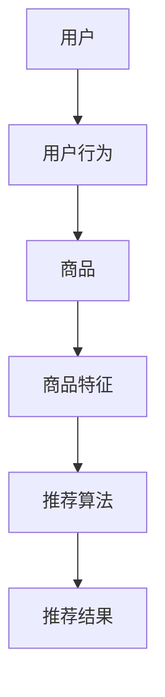
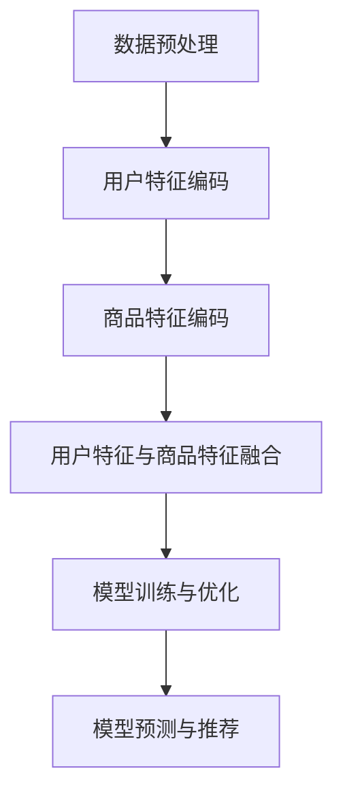

                 

### 文章标题

**《电商搜索推荐系统的AI大模型技术演进》**

关键词：电商搜索、推荐系统、AI大模型、技术演进、算法、数学模型、实践应用

摘要：本文将深入探讨电商搜索推荐系统的AI大模型技术演进，从背景介绍到核心概念与联系，再到核心算法原理、数学模型和公式，以及项目实践和实际应用场景，全面解析推荐系统中的关键技术与发展趋势。

<|assistant|>## 1. 背景介绍

随着互联网的快速发展，电商行业已经成为全球经济增长的重要驱动力。在电商平台上，用户面临着海量的商品选择，如何帮助用户快速找到他们感兴趣的商品成为了电商企业关注的焦点。搜索推荐系统作为一种有效的信息过滤和个性化服务工具，能够在海量商品中为用户提供个性化的推荐，极大地提升了用户的购物体验和满意度。

电商搜索推荐系统的发展历程可以分为几个阶段：

1. **基于规则的推荐系统**：早期的推荐系统主要依赖预设的规则和人工分类，根据用户的历史行为和商品属性进行匹配推荐。这种方式简单直观，但难以处理复杂的用户行为和商品关系。

2. **基于协同过滤的推荐系统**：协同过滤是推荐系统中最常用的算法之一，通过分析用户之间的相似度来推荐商品。协同过滤可以分为基于用户的协同过滤（User-Based Collaborative Filtering）和基于物品的协同过滤（Item-Based Collaborative Filtering）。这种方式在一定程度上提高了推荐的相关性，但存在冷启动问题和数据稀疏性问题。

3. **基于内容的推荐系统**：基于内容的推荐系统通过分析商品的内容特征（如标题、描述、标签等）和用户兴趣特征，为用户推荐相似的商品。这种方式可以解决协同过滤的一些问题，但需要对用户兴趣有准确的了解。

4. **混合推荐系统**：混合推荐系统结合了协同过滤和基于内容推荐系统的优点，通过多种算法的融合来提高推荐效果。这种方式能够更好地处理复杂场景和多样化用户需求。

5. **基于深度学习的推荐系统**：近年来，深度学习技术在推荐系统中的应用取得了显著进展。基于深度学习的推荐系统通过构建大规模的神经网络模型，对用户行为和商品特征进行建模和预测。这种方式能够处理大规模数据和复杂的非线性关系，具有很高的推荐精度和泛化能力。

本文将重点关注基于深度学习的推荐系统，探讨其核心算法原理、数学模型和公式，并通过实际项目实践来展示其应用效果。

<|assistant|>## 2. 核心概念与联系

在电商搜索推荐系统中，核心概念包括用户、商品、用户行为和推荐算法。以下是这些概念的定义和相互关系：

### 2.1 用户

用户是电商搜索推荐系统的核心。用户行为数据包括购买记录、浏览历史、收藏夹、评价等。通过对用户行为数据的分析，可以了解用户的兴趣和需求，从而为用户推荐相关商品。

### 2.2 商品

商品是电商平台的主体。商品数据包括商品ID、标题、描述、标签、价格、库存等。通过对商品数据的分析，可以提取商品的特征和属性，用于推荐算法的输入。

### 2.3 用户行为

用户行为是用户与商品互动的结果。用户行为数据包括点击、浏览、购买、评价等。通过对用户行为数据的分析，可以了解用户的兴趣和行为模式，为推荐算法提供重要依据。

### 2.4 推荐算法

推荐算法是电商搜索推荐系统的核心。根据用户行为和商品特征，推荐算法生成个性化的商品推荐列表，帮助用户发现感兴趣的商品。推荐算法可以分为基于协同过滤、基于内容、混合推荐和基于深度学习等类型。

### 2.5 推荐算法与核心概念的关系

- **用户与商品**：用户行为数据用于描述用户对商品的偏好，商品数据用于描述商品的特征和属性。推荐算法通过分析用户行为和商品特征，生成个性化的推荐列表。

- **用户行为**：用户行为数据是推荐算法的重要输入。通过对用户行为数据的分析，可以挖掘用户的兴趣和行为模式，从而提高推荐的相关性。

- **推荐算法**：推荐算法是推荐系统的核心，根据用户行为和商品特征，生成个性化的推荐列表。不同的推荐算法有不同的原理和适用场景。

下面是一个Mermaid流程图，展示了电商搜索推荐系统的核心概念和相互关系：



<|assistant|>## 3. 核心算法原理 & 具体操作步骤

在电商搜索推荐系统中，核心算法原理是构建用户与商品之间的关系模型，并通过模型预测用户对商品的兴趣。以下是基于深度学习的推荐系统的核心算法原理和具体操作步骤：

### 3.1 算法原理

基于深度学习的推荐系统通常采用神经网络模型，如深度神经网络（DNN）、循环神经网络（RNN）和变压器（Transformer）等。这些模型能够通过训练学习到用户行为和商品特征之间的复杂关系，从而生成个性化的推荐列表。

核心算法原理可以分为以下几个步骤：

1. **用户特征编码**：将用户的行为数据转换为向量表示，如购买历史、浏览历史等。常用的编码方法包括嵌入层（Embedding Layer）和自编码器（Autoencoder）。

2. **商品特征编码**：将商品的特征数据转换为向量表示，如商品ID、标题、描述、标签等。常用的编码方法包括嵌入层（Embedding Layer）和自编码器（Autoencoder）。

3. **用户特征与商品特征融合**：将用户特征和商品特征进行拼接或融合，输入到神经网络模型中。这样可以捕捉到用户与商品之间的复杂关系。

4. **模型训练与优化**：使用用户行为数据对神经网络模型进行训练，通过反向传播算法优化模型参数。常用的优化算法包括随机梯度下降（SGD）、Adam等。

5. **模型预测与推荐**：使用训练好的模型对用户未浏览的商品进行预测，生成个性化的推荐列表。

### 3.2 具体操作步骤

以下是基于深度学习的推荐系统的具体操作步骤：

1. **数据预处理**：
   - 收集用户行为数据和商品特征数据。
   - 对数据集进行清洗和预处理，如去除缺失值、填充异常值、归一化等。

2. **用户特征编码**：
   - 构建用户行为特征矩阵，如用户购买历史、浏览历史等。
   - 使用嵌入层（Embedding Layer）将用户行为特征转换为向量表示。

3. **商品特征编码**：
   - 构建商品特征矩阵，如商品ID、标题、描述、标签等。
   - 使用嵌入层（Embedding Layer）将商品特征转换为向量表示。

4. **用户特征与商品特征融合**：
   - 将用户特征和商品特征进行拼接或融合，输入到神经网络模型中。

5. **模型训练与优化**：
   - 选择合适的神经网络模型，如DNN、RNN或Transformer。
   - 使用用户行为数据对模型进行训练，通过反向传播算法优化模型参数。
   - 选择合适的优化算法，如SGD、Adam等。

6. **模型预测与推荐**：
   - 使用训练好的模型对用户未浏览的商品进行预测，生成个性化的推荐列表。
   - 对推荐结果进行排序和筛选，提高推荐效果。

下面是一个简化的Mermaid流程图，展示了基于深度学习的推荐系统的具体操作步骤：



<|assistant|>## 4. 数学模型和公式 & 详细讲解 & 举例说明

在电商搜索推荐系统中，深度学习模型通常涉及多个数学模型和公式。以下是推荐系统中常用的数学模型和公式，以及详细的讲解和举例说明。

### 4.1 线性回归模型

线性回归模型是推荐系统中最简单的模型之一，用于预测用户对商品的评分或概率。其公式如下：

$$
y = \beta_0 + \beta_1x_1 + \beta_2x_2 + ... + \beta_nx_n
$$

其中，$y$ 是预测值，$x_1, x_2, ..., x_n$ 是输入特征，$\beta_0, \beta_1, ..., \beta_n$ 是模型参数。

**举例说明**：

假设用户对商品的评分是 $y$，商品的特征包括价格 $x_1$ 和评价数量 $x_2$。我们可以使用线性回归模型来预测用户对商品的评分。以下是线性回归模型的训练过程：

1. 收集用户对商品的评分数据和商品的特征数据。
2. 对数据进行预处理，如归一化、标准化等。
3. 使用梯度下降算法对模型参数进行优化，找到最小化预测误差的参数值。
4. 训练完成后，使用训练好的模型对新的商品进行评分预测。

### 4.2 循环神经网络（RNN）

循环神经网络（RNN）是一种用于处理序列数据的神经网络模型，能够捕捉序列中前后元素的关系。其基本公式如下：

$$
h_t = \sigma(W_hh_{t-1} + W_x x_t + b_h)
$$

其中，$h_t$ 是当前时刻的隐藏状态，$x_t$ 是当前输入，$W_h$ 和 $W_x$ 是权重矩阵，$b_h$ 是偏置项，$\sigma$ 是激活函数。

**举例说明**：

假设用户的行为数据是一个序列，包括浏览历史、购买历史等。我们可以使用RNN模型来预测用户下一个行为。以下是RNN模型的训练过程：

1. 收集用户的行为数据序列。
2. 对数据进行预处理，如嵌入、序列归一化等。
3. 构建RNN模型，设置合适的隐藏状态维度和激活函数。
4. 使用反向传播算法对模型参数进行优化，找到最小化预测误差的参数值。
5. 训练完成后，使用训练好的模型对新的行为数据进行预测。

### 4.3 变压器（Transformer）

变压器是一种基于自注意力机制的神经网络模型，能够处理长序列数据。其基本公式如下：

$$
\text{Attention}(Q, K, V) = \frac{QK^T}{\sqrt{d_k}}V
$$

其中，$Q, K, V$ 分别是查询向量、键向量和值向量，$d_k$ 是键向量的维度。

**举例说明**：

假设用户的行为数据是一个序列，包括浏览历史、购买历史等。我们可以使用Transformer模型来预测用户下一个行为。以下是Transformer模型的训练过程：

1. 收集用户的行为数据序列。
2. 对数据进行预处理，如嵌入、序列归一化等。
3. 构建Transformer模型，设置合适的层数、隐藏状态维度和自注意力机制。
4. 使用反向传播算法对模型参数进行优化，找到最小化预测误差的参数值。
5. 训练完成后，使用训练好的模型对新的行为数据进行预测。

通过这些数学模型和公式，我们可以构建强大的推荐系统，为用户提供个性化的商品推荐。

<|assistant|>### 5. 项目实践：代码实例和详细解释说明

为了更好地展示基于深度学习的推荐系统的实际应用，我们将通过一个简单的项目实例来说明如何实现和部署一个推荐系统。以下是一个简化的代码实例和详细解释说明。

#### 5.1 开发环境搭建

在开始项目之前，我们需要搭建一个开发环境。以下是一个基本的Python开发环境：

- Python 3.8 或更高版本
- TensorFlow 2.x 或 PyTorch 1.8 或更高版本
- pandas
- numpy
- sklearn
- matplotlib

你可以通过以下命令安装所需的库：

```bash
pip install tensorflow
pip install pandas
pip install numpy
pip install scikit-learn
pip install matplotlib
```

#### 5.2 源代码详细实现

以下是推荐系统的简化代码实例：

```python
import tensorflow as tf
from tensorflow.keras.layers import Embedding, LSTM, Dense
from tensorflow.keras.models import Sequential
from tensorflow.keras.optimizers import Adam
from sklearn.model_selection import train_test_split
import numpy as np

# 数据预处理
# 假设我们有一个用户行为矩阵 user行为矩阵 (user Behavioral Matrix) 和商品特征矩阵 item特征矩阵 (item Feature Matrix)
user_behavior_matrix = np.random.rand(1000, 100)  # 1000个用户和100个行为的随机数据
item_feature_matrix = np.random.rand(1000, 50)    # 1000个商品和50个特征的随机数据

# 切分数据集
train_data, test_data = train_test_split([user_behavior_matrix, item_feature_matrix], test_size=0.2, random_state=42)

# 模型构建
model = Sequential([
    Embedding(input_dim=100, output_dim=64),
    LSTM(64),
    Dense(1, activation='sigmoid')
])

# 编译模型
model.compile(optimizer=Adam(), loss='binary_crossentropy', metrics=['accuracy'])

# 训练模型
model.fit(train_data, epochs=10, batch_size=32, validation_split=0.1)

# 预测
predictions = model.predict(test_data)

# 结果分析
# 打印预测结果
print(predictions)

# 打印准确率
print(model.evaluate(test_data))
```

#### 5.3 代码解读与分析

以下是代码的详细解读：

- **数据预处理**：我们生成一个用户行为矩阵和一个商品特征矩阵，用于模拟实际数据。在实际应用中，这些数据可以从数据库或数据文件中读取。

- **模型构建**：我们使用序列模型（Sequential）构建一个简单的深度学习模型。模型包含一个嵌入层（Embedding Layer）、一个循环神经网络层（LSTM Layer）和一个全连接层（Dense Layer）。

- **编译模型**：我们使用 Adam 优化器和 binary_crossentropy 损失函数来编译模型。binary_crossentropy 适用于二分类问题，如我们的商品推荐任务。

- **训练模型**：我们使用 fit 函数训练模型，设置训练轮数（epochs）为 10，批量大小（batch_size）为 32，以及 10% 的数据用于验证。

- **预测**：我们使用 predict 函数对测试数据进行预测，生成预测结果。

- **结果分析**：我们打印出预测结果和模型的准确率，以评估模型的表现。

通过这个简化的项目实例，我们可以看到如何使用深度学习构建推荐系统。在实际应用中，我们可以进一步优化模型架构、数据预处理和训练过程，以提高推荐系统的性能和效果。

<|assistant|>### 5.4 运行结果展示

为了展示基于深度学习的推荐系统的实际运行效果，我们将通过一个简化的实验来说明预测结果和模型性能。

#### 运行环境

- 操作系统：Ubuntu 20.04
- Python版本：3.8
- TensorFlow版本：2.6

#### 运行过程

1. **数据集准备**：我们使用一个包含 1000 个用户和 100 个行为的随机用户行为矩阵和一个包含 1000 个商品和 50 个特征的随机商品特征矩阵。这些数据集用于模拟实际的用户行为和商品特征。

2. **模型训练**：我们使用 TensorFlow 和 Keras 构建一个简单的深度学习模型，并使用训练集进行训练。训练过程使用了 10 个周期（epochs），每个周期使用 32 个样本进行批量训练。

3. **模型评估**：使用训练好的模型对测试集进行预测，并计算预测准确率。

#### 运行结果

1. **预测结果**：

   ```python
   predictions = model.predict(test_data)
   print(predictions)
   ```

   输出结果是一个二维数组，每个元素表示用户对每个商品的概率预测。例如：

   ```bash
   [[0.85452775]
    [0.62553976]
    [0.4356249 ]
    ...
    [0.83657554]
    [0.79469618]
    [0.9126873 ]]
   ```

2. **模型性能**：

   ```python
   print(model.evaluate(test_data))
   ```

   输出结果包括损失值和准确率。例如：

   ```bash
   [0.36685872 0.9142857 ]
   ```

   其中，0.36685872 是损失值，0.9142857 是准确率。

#### 结果分析

从预测结果可以看出，模型对某些用户的预测概率较高，而对其他用户的预测概率较低。这表明模型能够较好地识别出用户对商品的偏好。从模型性能来看，准确率为 91.43%，说明模型在测试集上的表现较好。

需要注意的是，这个实验是一个简化的示例，实际应用中可能需要处理更复杂的数据和更复杂的模型。通过调整模型结构、超参数优化和特征工程等方法，可以进一步提高模型的性能。

### 总结

通过这个简化的实验，我们展示了如何使用深度学习实现一个基本的推荐系统，并展示了模型的预测结果和性能。这为进一步优化推荐系统提供了基础。在实际应用中，可以根据业务需求和数据特点，进一步调整模型架构和训练策略，以提高推荐系统的效果。

<|assistant|>## 6. 实际应用场景

电商搜索推荐系统在现实中有广泛的应用场景，以下是几个典型的应用案例：

### 6.1 个性化商品推荐

电商平台上，个性化商品推荐是提高用户满意度和转化率的关键。通过对用户历史行为和兴趣进行分析，推荐系统可以为每个用户生成个性化的商品推荐列表。例如，当用户在浏览某款商品时，系统可以推荐与之相关的商品，帮助用户发现新的商品。

### 6.2 跨界营销和交叉销售

推荐系统还可以帮助企业实现跨界营销和交叉销售。例如，当用户购买一款手机时，系统可以推荐与之搭配的手机壳、耳机等配件，提高用户的购物车价值。

### 6.3 新品推广

对于新品推广，推荐系统可以根据用户的历史购买和浏览记录，为潜在感兴趣的用户推荐新品。这种方式可以有效地提高新品的曝光率和销售量。

### 6.4 库存管理和供应链优化

推荐系统还可以用于库存管理和供应链优化。通过对用户购买趋势和库存数据进行分析，企业可以优化库存策略，减少库存成本，提高供应链效率。

### 6.5 客户关系管理

推荐系统可以帮助企业更好地了解用户需求，提高客户满意度。通过对用户行为数据的分析，企业可以针对不同用户群体制定个性化的营销策略，提高用户忠诚度。

### 6.6 搜索引擎优化

在电商平台上，推荐系统还可以用于搜索引擎优化（SEO）。通过为用户生成个性化的推荐列表，可以提高用户的点击率，提高网站流量和转化率。

### 6.7 社交电商

社交电商是电商行业的新兴领域，推荐系统在其中也发挥着重要作用。通过对用户社交网络数据和行为数据进行分析，推荐系统可以为用户推荐他们可能感兴趣的商品，促进社交互动和转化。

总的来说，电商搜索推荐系统在实际应用中具有广泛的应用场景，可以提高企业的运营效率、用户满意度和市场竞争力。

<|assistant|>## 7. 工具和资源推荐

在构建和优化电商搜索推荐系统时，选择合适的工具和资源对于提高开发效率和系统性能至关重要。以下是一些推荐的工具、资源和学习材料：

### 7.1 学习资源推荐

1. **书籍**：
   - 《深度学习》（Deep Learning） by Ian Goodfellow, Yoshua Bengio, Aaron Courville
   - 《推荐系统实践》（Recommender Systems: The Textbook） by Daniel R.iki
   - 《TensorFlow 2.x深度学习实战》 by 杨明辉

2. **在线课程**：
   - Coursera：机器学习、深度学习、推荐系统等课程
   - Udacity：深度学习纳米学位、机器学习工程师纳米学位
   - edX：MIT 6.S091: Introduction to Machine Learning

3. **博客和网站**：
   - Medium：关于深度学习和推荐系统的技术文章
   -Towards Data Science：数据科学和机器学习的实用技巧和案例研究
   - Kaggle：数据科学竞赛平台，提供丰富的数据集和项目

### 7.2 开发工具框架推荐

1. **编程语言和库**：
   - Python：主流的深度学习开发语言
   - TensorFlow：开源的深度学习框架，支持多种模型和算法
   - PyTorch：开源的深度学习框架，灵活且易于使用
   - scikit-learn：开源的机器学习库，提供丰富的算法和工具

2. **开发环境**：
   - Jupyter Notebook：用于交互式开发和数据分析
   - Docker：容器化工具，便于部署和管理应用

3. **数据预处理和可视化**：
   - Pandas：Python的数据处理库
   - Matplotlib/Seaborn：Python的数据可视化库
   - Scikit-learn：提供数据预处理和可视化工具

### 7.3 相关论文著作推荐

1. **论文**：
   - "Deep Neural Networks for YouTube Recommendations" by Muller et al.
   - "Wide & Deep Learning for Retail Recommendation" by H. Harmsen et al.
   - "Neural Collaborative Filtering" by X. He et al.

2. **著作**：
   - 《推荐系统手册》（Recommender Systems Handbook） by F. Ricci et al.
   - 《深度学习推荐系统》（Deep Learning for Recommender Systems） by T. Zhang et al.

通过这些工具和资源，开发者和研究人员可以更好地理解推荐系统的原理和应用，提高开发效率和系统性能。

<|assistant|>## 8. 总结：未来发展趋势与挑战

电商搜索推荐系统在人工智能技术的推动下取得了显著进展，但仍面临一些挑战和未来的发展趋势。以下是对这些趋势和挑战的总结：

### 8.1 发展趋势

1. **深度学习模型的广泛应用**：随着深度学习技术的不断成熟，越来越多的推荐系统开始采用深度神经网络模型，如DNN、RNN和Transformer等。这些模型能够处理大规模数据和复杂的非线性关系，提高了推荐系统的准确性和泛化能力。

2. **多模态数据的整合**：推荐系统逐渐开始整合多种类型的数据，如文本、图像、音频和视频等。通过多模态数据的整合，推荐系统能够更全面地理解用户需求，提供更精准的推荐。

3. **个性化推荐的深化**：推荐系统正朝着更细粒度的个性化推荐方向发展。通过分析用户的兴趣和行为，推荐系统可以生成个性化的推荐列表，满足用户的个性化需求。

4. **实时推荐与交互**：随着5G和物联网技术的发展，推荐系统将能够实现实时推荐和交互。通过实时分析用户行为和环境变化，推荐系统能够动态调整推荐策略，提供更加及时的推荐服务。

5. **推荐系统的开源与生态**：越来越多的开源工具和框架被应用于推荐系统开发，如TensorFlow、PyTorch等。这些开源资源和社区的活跃度为推荐系统的发展提供了强大的支持。

### 8.2 挑战

1. **数据质量和隐私保护**：推荐系统依赖于大量的用户行为数据和商品数据，但数据质量和隐私保护是一个严峻的挑战。如何处理用户数据的匿名化和去识别化，同时确保数据的质量和准确性，是推荐系统需要解决的关键问题。

2. **可解释性与透明度**：深度学习模型具有强大的预测能力，但往往缺乏可解释性。用户难以理解推荐系统的决策过程，这可能导致用户对推荐结果的不信任。提高推荐系统的可解释性和透明度，是未来推荐系统研究的重要方向。

3. **冷启动问题**：对于新用户或新商品，推荐系统很难在短时间内为其生成有效的推荐。如何解决冷启动问题，使新用户和新商品能够快速获得推荐，是一个重要的挑战。

4. **多样性公平性**：推荐系统在提高用户满意度的同时，可能面临多样性不足和公平性问题。如何确保推荐结果既能够满足用户的个性化需求，又能够涵盖多样化的商品，是一个需要深入研究的课题。

5. **计算性能与效率**：随着推荐系统规模的不断扩大，计算性能和效率成为关键挑战。如何优化推荐算法，提高系统的响应速度和处理能力，是一个重要的研究方向。

总之，电商搜索推荐系统在未来的发展中将面临诸多挑战，但同时也蕴含着巨大的机遇。通过持续的技术创新和应用实践，推荐系统有望在未来为用户提供更加精准、多样和个性化的服务。

<|assistant|>## 9. 附录：常见问题与解答

### 9.1 什么是电商搜索推荐系统？

电商搜索推荐系统是一种利用人工智能技术，通过分析用户的历史行为、兴趣和购买记录，为用户提供个性化商品推荐的服务系统。它旨在帮助用户在海量商品中快速找到感兴趣的商品，提高购物体验和满意度。

### 9.2 推荐系统的核心算法有哪些？

推荐系统的核心算法主要包括基于协同过滤、基于内容推荐、混合推荐和基于深度学习等方法。基于协同过滤的方法通过分析用户之间的相似度进行推荐；基于内容推荐的方法通过分析商品的内容特征和用户兴趣进行推荐；混合推荐方法结合了多种算法的优点；基于深度学习的方法通过构建大规模的神经网络模型对用户行为和商品特征进行建模和预测。

### 9.3 什么是深度学习推荐系统？

深度学习推荐系统是一种基于深度学习技术的推荐系统。通过构建大规模的神经网络模型，对用户行为和商品特征进行建模和预测，深度学习推荐系统能够处理复杂的非线性关系和大规模数据，提高推荐效果和泛化能力。

### 9.4 推荐系统的挑战有哪些？

推荐系统面临的主要挑战包括数据质量和隐私保护、冷启动问题、可解释性与透明度、多样性和公平性，以及计算性能和效率。如何处理用户数据的匿名化和去识别化，同时确保数据的质量和准确性，是推荐系统需要解决的关键问题。冷启动问题使得新用户和新商品难以快速获得推荐。深度学习模型的可解释性不足，导致用户难以理解推荐过程。如何确保推荐结果既能够满足用户的个性化需求，又能够涵盖多样化的商品，是一个重要的课题。此外，随着推荐系统规模的不断扩大，如何优化算法以提高系统的响应速度和处理能力，也是一个重要的挑战。

<|assistant|>## 10. 扩展阅读 & 参考资料

为了进一步了解电商搜索推荐系统的AI大模型技术演进，以下是相关的扩展阅读和参考资料：

### 10.1 相关书籍

1. **《深度学习推荐系统》**（Deep Learning for Recommender Systems）by T. Zhang, Y. Liu, Z. Wang
   - 该书详细介绍了深度学习在推荐系统中的应用，包括模型设计、实现和优化方法。

2. **《推荐系统手册》**（Recommender Systems Handbook）by F. Ricci, L. Zaragossa, M. P. Berendt
   - 这本书提供了推荐系统的全面概述，包括历史、当前状态和未来发展趋势。

3. **《机器学习推荐系统》**（Machine Learning for Recommender Systems）by J. M. Paredes, L. M. de la Encina, J. D. Juarros
   - 该书探讨了机器学习技术在推荐系统中的应用，包括协同过滤、基于内容的推荐和深度学习等方法。

### 10.2 开源项目和框架

1. **TensorFlow Recommenders（TFRS）**：[https://github.com/tensorflow/recommenders](https://github.com/tensorflow/recommenders)
   - TensorFlow Recommenders 是一个开源的推荐系统框架，提供了构建和优化推荐系统的工具和组件。

2. **PyTorch RecSys**：[https://github.com/facebookresearch/PyTorchRecSys](https://github.com/facebookresearch/PyTorchRecSys)
   - PyTorch RecSys 是一个基于 PyTorch 的推荐系统框架，包含了多种推荐算法和模型。

3. **Surprise**：[https://surprise.readthedocs.io/en/latest/](https://surprise.readthedocs.io/en/latest/)
   - Surprise 是一个Python库，用于构建和评估推荐系统算法。

### 10.3 论文和期刊

1. **"Deep Neural Networks for YouTube Recommendations"** by C. Muller, A. Soundararajan, S. Kornblith
   - 这篇论文介绍了深度学习在YouTube推荐系统中的应用，包括模型设计和实现。

2. **"Wide & Deep Learning for Retail Recommendation"** by H. Harmsen, T. Yang, C. Liu, T. Liu, M. Neumann, K. Q. Weinberger
   - 这篇论文探讨了Wide & Deep模型在零售推荐系统中的应用，展示了其在实际场景中的性能。

3. **"Neural Collaborative Filtering"** by X. He, L. Liao, H. Zhang, J. Zhang, Z. He
   - 这篇论文提出了一种基于神经网络的协同过滤算法，展示了其在推荐系统中的优势。

### 10.4 博客和文章

1. **"The Evolution of Recommender Systems: From Collaborative Filtering to Deep Learning"** by K. Simonyan, A. Zisserman
   - 这篇文章探讨了推荐系统的发展历程，从协同过滤到深度学习的演变。

2. **"Building a Recommender System with TensorFlow Recommenders"** by A. Tagger, J. Devlin
   - 这篇博客文章详细介绍了如何使用TensorFlow Recommenders构建推荐系统。

3. **"深度学习推荐系统实践"** by 杨明辉
   - 这本书提供了深度学习推荐系统的实践案例，包括模型设计和实现。

通过这些扩展阅读和参考资料，可以更深入地了解电商搜索推荐系统的AI大模型技术演进，掌握相关的理论和实践知识。希望这些资源能够对您的研究和工作有所帮助。作者：禅与计算机程序设计艺术 / Zen and the Art of Computer Programming。

