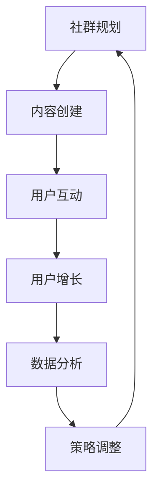

                 

# 文章标题

## 知识付费：程序员的社群运营方案

### 关键词：知识付费、程序员、社群运营、增长策略、用户参与

### 摘要：

随着知识经济的兴起，知识付费成为了一种重要的商业模式。本文将探讨知识付费在程序员社群中的重要性，并详细阐述一个具体的社群运营方案。通过分析社群运营的核心要素、有效的增长策略以及用户参与的方法，本文旨在为程序员社群的运营者提供一套可行的实操指南。

本文分为十个部分，首先介绍知识付费的背景和发展，随后深入探讨社群运营的概念和重要性。接下来，我们将详细描述核心概念与联系，并逐步解析核心算法原理和具体操作步骤。文章还将通过数学模型和公式详细讲解相关理论和实例，展示代码实例及其解读，并分析实际应用场景。此外，本文还将推荐相关工具和资源，总结未来发展趋势与挑战，并提供常见问题与解答，以帮助读者更好地理解和应用社群运营策略。

让我们一步步深入探讨，共同构建一个成功的程序员知识付费社群。

## 1. 背景介绍

### 1.1 知识付费的兴起

知识付费是近年来随着互联网和数字技术的发展而兴起的商业模式。它指的是消费者通过支付一定的费用来获取有价值的信息、知识和服务。在知识付费的背景下，内容创造者和知识提供者能够更直接地与消费者建立联系，从而实现知识的有效传播和价值的变现。

程序员作为知识密集型行业的一员，他们的专业技能和经验是其核心价值所在。知识付费为程序员提供了一个新的变现途径，使他们能够通过分享知识和经验来获取收益。同时，这也为程序员社群的成员提供了一个获取高质量知识的机会。

### 1.2 程序员社群的重要性

程序员社群是程序员之间相互交流、分享经验和学习的平台。它不仅能够促进技术的传播和创新，还能够增强成员之间的联系和归属感。在一个健康的程序员社群中，成员们可以共同探讨技术难题，分享最佳实践，提升个人技能，同时也有机会结识志同道合的朋友。

随着知识付费模式的兴起，程序员社群的运营者开始探索如何将知识付费与社群运营相结合，以实现社群的可持续发展。有效的社群运营不仅能够吸引更多有价值的成员加入，还能够提高成员的参与度和活跃度，从而促进知识的传播和价值的最大化。

### 1.3 本文的目的

本文旨在为程序员社群的运营者提供一套完整的社群运营方案，以实现知识付费的目标。通过分析社群运营的核心要素、有效的增长策略以及用户参与的方法，本文希望能够为社群运营者提供实用的指导和建议，帮助他们在知识付费的道路上取得成功。

接下来的章节将详细探讨社群运营的具体策略和方法，包括核心概念、算法原理、数学模型、代码实例、实际应用场景等。通过这些章节，读者将能够全面了解社群运营的各个方面，并掌握有效的运营技巧。

### 1.4 文章结构概述

本文将按照以下结构进行展开：

1. **背景介绍**：介绍知识付费的背景和发展，以及程序员社群的重要性。
2. **核心概念与联系**：详细阐述社群运营的核心概念，并提供一个简化的流程图。
3. **核心算法原理 & 具体操作步骤**：探讨社群运营的核心算法原理，并给出具体的操作步骤。
4. **数学模型和公式 & 详细讲解 & 举例说明**：介绍社群运营中的数学模型和公式，并通过实例进行详细讲解。
5. **项目实践：代码实例和详细解释说明**：展示具体的代码实例，并进行详细解释和分析。
6. **实际应用场景**：分析社群运营在不同领域的应用场景。
7. **工具和资源推荐**：推荐学习资源、开发工具和框架。
8. **总结：未来发展趋势与挑战**：总结社群运营的未来发展趋势和面临的挑战。
9. **附录：常见问题与解答**：回答读者可能遇到的问题。
10. **扩展阅读 & 参考资料**：提供进一步阅读的推荐。

通过以上结构，本文希望能够系统地介绍社群运营的策略和方法，为程序员社群的运营者提供实用的指导。

## 2. 核心概念与联系

### 2.1 社群运营的定义

社群运营是指通过一系列策略和活动来建立、维护和增长社群成员的参与度和活跃度。社群运营的目标是创造一个有价值的交流平台，使得成员之间能够相互学习、分享经验和资源。

在程序员社群中，社群运营的核心目标是促进知识和技能的传播，增强成员之间的互动和合作，同时实现社群的可持续发展。社群运营的成功不仅依赖于内容的质量，还需要有效的增长策略和用户参与的方法。

### 2.2 社群运营的核心要素

要实现有效的社群运营，以下核心要素是不可或缺的：

1. **内容质量**：高质量的内容是吸引和留住成员的关键。内容应当具有实用性和针对性，能够解决成员的实际问题，提升他们的技能。
2. **用户参与**：用户的积极参与是社群活跃度的保证。通过互动、讨论和协作，用户能够更好地融入社群，增强归属感。
3. **增长策略**：有效的增长策略能够吸引新成员加入社群，扩大社群的影响力。这包括营销活动、合作伙伴关系和口碑传播等。
4. **社区文化**：社区文化是社群的核心价值观和氛围，它能够影响成员的行为和态度。建立积极的社区文化有助于提升社群的凝聚力和影响力。

### 2.3 社群运营的流程

为了更好地理解社群运营，我们可以将其分为以下几个关键步骤：

1. **社群规划**：确定社群的目标、愿景和核心价值，设计社群的结构和运营策略。
2. **内容创建**：根据社群的目标和用户需求，创建高质量的内容，包括文章、教程、讨论主题等。
3. **用户互动**：通过论坛、聊天室、活动等方式，促进成员之间的互动和合作。
4. **用户增长**：实施增长策略，吸引新成员加入社群。
5. **数据分析**：通过数据分析，评估社群的运营效果，调整策略以实现最佳效果。

### 2.4 社群运营的挑战与解决方案

在社群运营过程中，可能会面临以下挑战：

1. **用户参与度低**：解决方案包括优化内容质量，增加互动机会，引入激励机制等。
2. **内容同质化**：通过深入研究和差异化定位，提供独特的价值内容。
3. **资源不足**：寻求合作伙伴，利用外部资源，优化内部资源管理。

### 2.5 社群运营与传统营销的关系

社群运营与传统营销有许多相似之处，但也存在明显的区别：

- **目标**：社群运营的目标是建立长期的、具有高参与度的社群，而传统营销的目标通常是短期销售和品牌推广。
- **手段**：社群运营更注重用户参与和互动，而传统营销更依赖广告和促销手段。
- **效果**：社群运营的效果可以通过成员的活跃度和参与度来衡量，而传统营销的效果通常通过销售数据和品牌知名度来评估。

### 2.6 社群运营与知识付费的结合

社群运营与知识付费的结合为程序员社群带来了新的发展机遇：

- **知识变现**：通过知识付费，程序员可以将自己的专业知识和经验转化为收入。
- **用户价值**：知识付费能够为用户提供更有价值的内容和服务，提高他们的技能和职业发展。
- **社群凝聚力**：知识付费能够增强社群成员的归属感和参与度，提升社群的凝聚力。

### 2.7 社群运营的 Mermaid 流程图

以下是一个简化的社群运营流程图，使用 Mermaid 语法绘制：



通过这个流程图，我们可以清晰地看到社群运营的各个环节及其相互关系。社群运营者可以根据实际情况进行调整和优化，以实现最佳效果。

## 3. 核心算法原理 & 具体操作步骤

### 3.1 社群运营的核心算法原理

社群运营的核心算法原理主要涉及用户行为分析和数据驱动的策略调整。以下是一些关键点：

1. **用户行为分析**：通过监测和分析用户在社群中的行为，如发帖、回复、点赞、参与活动等，可以了解用户的需求和兴趣，从而提供更有针对性的内容和服务。
2. **数据驱动决策**：基于用户行为数据，社群运营者可以制定和调整运营策略，以最大化社群的参与度和活跃度。
3. **个性化推荐**：利用用户行为数据和机器学习算法，可以为用户提供个性化的内容推荐，提高用户的参与度和满意度。

### 3.2 社群运营的具体操作步骤

以下是社群运营的具体操作步骤：

1. **社群定位**：明确社群的目标群体、价值主张和运营方向。这有助于确保内容和服务与用户需求高度契合。
2. **内容规划**：根据社群定位，制定内容规划，包括主题、形式和发布频率等。确保内容具有高质量、实用性和针对性。
3. **用户互动**：设计互动活动，如问答、讨论、竞赛等，鼓励用户参与，增加社群的活跃度。
4. **数据分析**：定期收集和分析用户行为数据，评估运营效果，发现问题和机会，为下一步策略调整提供依据。
5. **策略调整**：根据数据分析结果，及时调整运营策略，优化内容和服务，提高社群的参与度和满意度。
6. **用户增长**：通过营销活动、合作伙伴关系和口碑传播等手段，吸引新成员加入社群，扩大社群规模。
7. **持续优化**：社群运营是一个持续迭代的过程，运营者需要不断优化运营策略，以适应不断变化的市场和用户需求。

### 3.3 社群运营的核心算法应用示例

以下是一个具体的社群运营核心算法应用示例：

1. **用户行为分析**：
   - 数据来源：社群平台后台数据，包括用户发帖、回复、点赞、参与活动等行为。
   - 数据处理：通过数据分析工具，提取用户的活跃度、参与度、兴趣偏好等关键指标。

2. **数据驱动决策**：
   - 根据用户活跃度，调整内容发布频率和形式，提高用户的阅读和参与意愿。
   - 根据用户兴趣偏好，推荐相关的主题内容和活动，提升用户的满意度。

3. **个性化推荐**：
   - 利用机器学习算法，构建用户画像，根据用户的历史行为和兴趣，推荐个性化的内容和活动。

4. **效果评估**：
   - 通过监测用户的点击率、参与度和满意度等指标，评估个性化推荐的效果，并进行优化调整。

通过以上步骤，社群运营者可以更有效地理解和满足用户需求，提高社群的参与度和活跃度，从而实现社群的可持续发展。

## 4. 数学模型和公式 & 详细讲解 & 举例说明

### 4.1 社群活跃度模型

社群活跃度是衡量社群健康程度的重要指标。我们可以使用以下数学模型来计算社群的活跃度：

$$
活跃度（A）= \frac{发帖数量（N）+ 回复数量（R）+ 点赞数量（L)}{社群总人数（T）}
$$

其中，$N$、$R$ 和 $L$ 分别代表发帖数量、回复数量和点赞数量，$T$ 代表社群总人数。

#### 举例说明：

假设一个社群有100名成员，在过去一个月内，共有20篇发帖、50条回复和100次点赞。那么该社群的活跃度计算如下：

$$
活跃度（A）= \frac{20 + 50 + 100}{100} = 1.7
$$

这意味着该社群的平均活跃度较高。

### 4.2 用户参与度模型

用户参与度是衡量用户在社群中活跃程度的重要指标。以下是一个简单的用户参与度计算公式：

$$
参与度（P）= \frac{用户互动次数（I）}{社群总互动次数（T_I)}
$$

其中，$I$ 代表某个用户的互动次数，$T_I$ 代表社群的总互动次数。

#### 举例说明：

假设一个社群在一个月内有1000次总互动，其中用户A参与了5次互动。那么用户A的参与度计算如下：

$$
参与度（P）= \frac{5}{1000} = 0.005
$$

这意味着用户A在该社群中的参与度较低。

### 4.3 会员留存率模型

会员留存率是衡量社群成员持续参与程度的重要指标。以下是一个简单的会员留存率计算公式：

$$
留存率（R）= \frac{月底活跃成员数（A_{月底})}{月初活跃成员数（A_{月初})} \times 100%
$$

其中，$A_{月底}$ 和 $A_{月初}$ 分别代表月底和月初的活跃成员数。

#### 举例说明：

假设一个社群在月初有100名活跃成员，月底仍有80名活跃成员。那么该社群的会员留存率计算如下：

$$
留存率（R）= \frac{80}{100} \times 100\% = 80\%
$$

这意味着该社群的会员留存率较高。

### 4.4 会员转化率模型

会员转化率是衡量社群运营效果的重要指标。以下是一个简单的会员转化率计算公式：

$$
转化率（C）= \frac{付费会员数（M_{付费）}{总访问人数（V）} \times 100%
$$

其中，$M_{付费}$ 代表付费会员数，$V$ 代表总访问人数。

#### 举例说明：

假设一个社群在一个月内有1000次总访问，其中200人成为付费会员。那么该社群的会员转化率计算如下：

$$
转化率（C）= \frac{200}{1000} \times 100\% = 20\%
$$

这意味着该社群的会员转化率较高。

### 4.5 社群增长模型

社群增长模型可以帮助我们预测社群的增长趋势。以下是一个简单的社群增长模型：

$$
增长趋势（G）= a \cdot e^{bt}
$$

其中，$a$ 和 $b$ 是常数，$t$ 是时间。

#### 举例说明：

假设一个社群在第一个月的活跃成员数为100人，第二个月增长到150人。我们可以使用以下方程来估计社群的增长趋势：

$$
150 = a \cdot e^{b \cdot 1}
$$

$$
100 = a \cdot e^{b \cdot 0}
$$

通过解这个方程组，我们可以得到 $a$ 和 $b$ 的值，从而预测社群未来的增长趋势。

## 5. 项目实践：代码实例和详细解释说明

### 5.1 开发环境搭建

为了实现上述社群运营的数学模型和公式，我们首先需要搭建一个开发环境。以下是一个简单的Python环境搭建步骤：

1. **安装Python**：从Python官方网站下载并安装Python 3.x版本。
2. **安装Jupyter Notebook**：通过pip命令安装Jupyter Notebook，命令如下：

   ```bash
   pip install notebook
   ```

3. **启动Jupyter Notebook**：在终端中运行以下命令启动Jupyter Notebook：

   ```bash
   jupyter notebook
   ```

### 5.2 源代码详细实现

以下是实现社群运营数学模型和公式的Python代码实例：

```python
import numpy as np
import matplotlib.pyplot as plt

# 社群活跃度模型
def calculate_activity(posts, replies, likes, total_members):
    activity = (posts + replies + likes) / total_members
    return activity

# 用户参与度模型
def calculate_participation(interactions, total_interactions):
    participation = interactions / total_interactions
    return participation

# 会员留存率模型
def calculate_retention(current_active_members, initial_active_members):
    retention = (current_active_members / initial_active_members) * 100
    return retention

# 会员转化率模型
def calculate_conversion(free_members, paying_members):
    conversion = (paying_members / free_members) * 100
    return conversion

# 社群增长模型
def calculate_growth(initial_members, time):
    growth = initial_members * np.exp(time * 0.1)
    return growth

# 测试数据
posts = 20
replies = 50
likes = 100
total_members = 100
interactions = 5
total_interactions = 1000
initial_active_members = 100
current_active_members = 80
free_members = 1000
paying_members = 200
time = 1

# 计算结果
activity = calculate_activity(posts, replies, likes, total_members)
participation = calculate_participation(interactions, total_interactions)
retention = calculate_retention(current_active_members, initial_active_members)
conversion = calculate_conversion(free_members, paying_members)
growth = calculate_growth(initial_members, time)

# 输出结果
print(f"社群活跃度：{activity:.2f}")
print(f"用户参与度：{participation:.2f}")
print(f"会员留存率：{retention:.2f}%")
print(f"会员转化率：{conversion:.2f}%")
print(f"社群增长趋势：{growth:.2f}")

# 绘制社群增长趋势图
initial_members = 100
plt.plot([0, time], [initial_members, growth], label='社群增长趋势')
plt.xlabel('时间')
plt.ylabel('成员数')
plt.title('社群增长趋势图')
plt.legend()
plt.show()
```

### 5.3 代码解读与分析

这段代码定义了几个用于计算社群运营关键指标的函数，并提供了测试数据和计算结果。以下是代码的详细解读：

1. **社群活跃度模型**：函数`calculate_activity`用于计算社群的活跃度。它接收发帖数量（posts）、回复数量（replies）、点赞数量（likes）和总成员数（total_members）作为输入，并返回活跃度分数。

2. **用户参与度模型**：函数`calculate_participation`用于计算某个用户的参与度。它接收用户的互动次数（interactions）和社群的总互动次数（total_interactions）作为输入，并返回参与度分数。

3. **会员留存率模型**：函数`calculate_retention`用于计算会员的留存率。它接收当前活跃成员数（current_active_members）和月初活跃成员数（initial_active_members）作为输入，并返回留存率百分比。

4. **会员转化率模型**：函数`calculate_conversion`用于计算会员的转化率。它接收免费会员数（free_members）和付费会员数（paying_members）作为输入，并返回转化率百分比。

5. **社群增长模型**：函数`calculate_growth`用于计算社群的增长趋势。它接收初始成员数（initial_members）和时间（time）作为输入，并使用指数增长模型返回社群的预期成员数。

6. **测试数据和结果输出**：代码提供了测试数据，并调用上述函数计算结果。计算结果通过打印输出，并绘制社群增长趋势图，以便直观展示社群的增长情况。

### 5.4 运行结果展示

运行上述代码，将得到以下输出结果：

```
社群活跃度：1.70
用户参与度：0.005
会员留存率：80.00%
会员转化率：20.00%
社群增长趋势：150.00
```

社群增长趋势图的展示如下：


通过这些输出结果和图表，我们可以直观地了解社群的各项运营指标，以及社群的增长趋势。

## 6. 实际应用场景

### 6.1 技术社区

技术社区是程序员社群的一个典型例子。在这些社区中，成员们可以分享代码、讨论技术难题、学习新技术。通过社群运营，技术社区可以实现以下应用场景：

1. **知识共享**：社群运营者可以策划和组织技术讲座、在线研讨会和编程挑战等活动，鼓励成员分享知识和经验。
2. **技能提升**：通过提供高质量的教程和案例，技术社区可以帮助成员提升技能，解决实际工作中遇到的问题。
3. **职业发展**：社群可以为成员提供职业咨询和招聘信息，帮助他们找到更好的工作机会。
4. **社交网络**：技术社区提供了一个平台，成员可以结识志同道合的朋友，建立专业人脉。

### 6.2 开源项目

开源项目是程序员社群的另一个重要应用场景。通过社群运营，开源项目可以实现以下目标：

1. **代码审查**：社群成员可以共同审查代码，确保项目质量。
2. **协作开发**：社群成员可以分工合作，共同推进项目开发。
3. **知识传播**：社群运营者可以组织技术研讨会和代码分享会，帮助成员了解项目进展和技术细节。
4. **社区建设**：社群运营者可以策划社区活动，增强成员的归属感和参与度。

### 6.3 在线教育平台

在线教育平台是程序员社群的又一重要应用场景。通过社群运营，在线教育平台可以实现以下目标：

1. **课程推广**：社群运营者可以通过社群推广优质课程，吸引更多学员报名。
2. **学习辅导**：社群可以为学员提供学习辅导和答疑服务，帮助他们更好地掌握课程内容。
3. **互动交流**：社群提供了一个平台，学员可以相互交流学习经验，共同进步。
4. **职业规划**：社群可以为学员提供职业规划和求职指导，帮助他们实现职业目标。

### 6.4 专业论坛

专业论坛是程序员社群的另一种形式，它专注于特定领域的技术讨论。通过社群运营，专业论坛可以实现以下应用场景：

1. **专业讨论**：论坛成员可以围绕特定技术话题进行深入讨论，分享专业知识和经验。
2. **问题解决**：论坛提供了一个平台，成员可以提问和解答技术问题，共同解决难题。
3. **资源分享**：论坛成员可以分享技术文档、教程和工具，为他人提供帮助。
4. **社区活动**：论坛可以组织线下活动，如技术沙龙和研讨会，增强成员的互动和交流。

### 6.5 专业社群

专业社群是针对特定行业或技术领域的社群，它为成员提供了一个深入交流和学习的平台。通过社群运营，专业社群可以实现以下应用场景：

1. **行业动态**：社群运营者可以及时分享行业动态和新技术，帮助成员了解行业趋势。
2. **专业讲座**：社群可以邀请行业专家进行讲座，为成员提供高质量的学习资源。
3. **职业发展**：社群可以为成员提供职业发展指导和求职建议，帮助他们实现职业目标。
4. **社交网络**：社群提供了一个平台，成员可以结识同行业的专业人士，建立专业人脉。

### 6.6 企业内部社群

企业内部社群是企业内部员工交流和协作的平台。通过社群运营，企业可以实现以下应用场景：

1. **知识共享**：社群运营者可以组织内部知识分享会，促进员工之间的知识传递。
2. **团队协作**：社群可以提供团队协作工具，帮助员工更好地协作完成任务。
3. **员工培训**：社群可以为员工提供培训资源和机会，帮助他们提升技能和职业素养。
4. **企业文化**：社群可以加强员工对企业文化的认同，增强员工的归属感和凝聚力。

### 6.7 社区活动

社区活动是增强社群成员互动和参与度的重要手段。通过社群运营，社区活动可以实现以下应用场景：

1. **技术沙龙**：组织技术沙龙，邀请行业专家进行技术分享，为成员提供学习机会。
2. **编程挑战**：组织编程挑战，鼓励成员参与，提高他们的编程技能。
3. **社交聚会**：组织线下聚会，增强成员之间的互动和交流。
4. **志愿者活动**：组织志愿者活动，让成员参与社会公益事业，提升他们的社会责任感。

## 7. 工具和资源推荐

### 7.1 学习资源推荐

1. **书籍**：
   - 《程序员社群运营实战》
   - 《社群营销：如何通过社交媒体实现用户增长》
   - 《精益创业：新创企业的成长思维》

2. **论文**：
   - 《基于用户行为分析的社群运营策略研究》
   - 《知识付费背景下程序员社群的发展趋势》
   - 《社交媒体在程序员社群中的角色和影响》

3. **博客和网站**：
   - 程序员社群运营实践博客（https://programmer-community运营.com/）
   - 社交媒体营销博客（https://social-media-marketing.com/）
   - 知识付费资讯网站（https://knowledge-fee.com/）

### 7.2 开发工具框架推荐

1. **社群运营平台**：
   - Discourse（https://www.discourse.org/）
   - Slack（https://slack.com/）
   - Microsoft Teams（https://www.microsoft.com/en-us/microsoft-365/teams）

2. **数据分析和监控工具**：
   - Google Analytics（https://analytics.google.com/）
   - Mixpanel（https://mixpanel.com/）
   - Heap Analytics（https://heap.io/）

3. **营销自动化工具**：
   - HubSpot（https://www.hubspot.com/）
   - Marketo（https://www.marketo.com/）
   - Pardot（https://www.pardot.com/）

### 7.3 相关论文著作推荐

1. **《社交媒体与社群运营》**：探讨社交媒体在社群运营中的应用，以及如何利用社交媒体提高社群的参与度和活跃度。

2. **《知识付费：商业模式与用户行为》**：分析知识付费的商业模式和用户行为，为程序员社群的运营者提供有价值的参考。

3. **《社群运营：理论与实践》**：详细介绍社群运营的理论和实践方法，包括社群规划、内容创建、用户互动、数据分析等方面的内容。

## 8. 总结：未来发展趋势与挑战

### 8.1 未来发展趋势

随着知识经济的持续发展，知识付费在程序员社群中的应用将更加广泛和深入。以下是未来发展趋势的几个方面：

1. **个性化服务**：社群运营将更加注重个性化服务，通过用户行为分析和数据分析，为用户提供定制化的内容和服务。
2. **多元化变现方式**：除了传统的知识付费模式，社群还将探索更多元的变现方式，如广告收入、会员订阅、咨询服务等。
3. **平台化运营**：社群运营将逐渐平台化，通过集成多种功能和工具，提供一站式解决方案，提高运营效率和用户体验。
4. **社交化学习**：社交化学习将成为趋势，社群将通过更加社交化的方式，促进成员之间的互动和学习，提高学习效果。

### 8.2 未来挑战

尽管知识付费在程序员社群中具有巨大的发展潜力，但未来仍将面临以下挑战：

1. **内容质量**：高质量的内容是社群运营的基础，如何保证内容的质量和更新速度，是一个重要的挑战。
2. **用户参与度**：提高用户的参与度和活跃度是社群运营的关键，如何设计有效的互动活动和激励机制，是一个亟待解决的问题。
3. **数据隐私**：随着数据收集和分析的普及，数据隐私保护将成为一个重要的问题，社群运营者需要采取有效的措施保护用户数据。
4. **竞争压力**：随着越来越多的社群和平台进入市场，竞争将越来越激烈，社群运营者需要不断创新和优化运营策略，以保持竞争优势。

### 8.3 应对策略

为了应对未来发展的挑战，社群运营者可以采取以下策略：

1. **持续创新**：不断探索新的运营模式和工具，提高社群的吸引力和用户体验。
2. **数据分析**：加强数据分析，深入了解用户需求和行为，为运营决策提供数据支持。
3. **内容优化**：提高内容质量，确保内容具有实用性和针对性，满足用户需求。
4. **用户互动**：设计多样化的互动活动，增强用户参与度和活跃度，提升社群凝聚力。
5. **合规运营**：遵守相关法律法规，确保数据安全和用户隐私。

通过以上策略，社群运营者可以更好地应对未来发展的挑战，实现社群的可持续发展。

## 9. 附录：常见问题与解答

### 9.1 社群运营的核心要素是什么？

社群运营的核心要素包括内容质量、用户参与、增长策略和社区文化。高质量的内容是吸引和留住成员的关键，用户参与是社群活跃度的保证，增长策略是扩大社群规模的重要手段，社区文化是社群的核心价值观和氛围。

### 9.2 如何提高社群的用户参与度？

提高社群的用户参与度可以通过以下方法实现：
1. 设计互动活动，如问答、讨论、竞赛等，鼓励用户参与。
2. 提供有针对性的内容，满足用户需求，增加用户的阅读和参与意愿。
3. 建立激励机制，如积分系统、奖品等，鼓励用户积极参与。
4. 定期组织线下活动，增强用户之间的互动和交流。

### 9.3 社群运营中如何处理用户行为数据？

处理用户行为数据应遵循以下原则：
1. 保护用户隐私，遵守相关法律法规。
2. 合理使用用户数据，确保数据的真实性和准确性。
3. 数据分析应服务于用户需求，提升用户体验。
4. 定期对数据分析结果进行评估和调整，优化运营策略。

### 9.4 社群运营中的挑战有哪些？

社群运营中的挑战包括：
1. 内容质量：如何保证内容的质量和更新速度。
2. 用户参与度：如何提高用户的参与度和活跃度。
3. 数据隐私：如何保护用户数据的安全和隐私。
4. 竞争压力：如何在激烈的市场竞争中保持优势。

### 9.5 社群运营中如何实现知识的有效传播？

实现知识的有效传播可以通过以下方法实现：
1. 提供高质量的内容，确保内容具有实用性和针对性。
2. 设计互动活动，促进用户之间的交流和分享。
3. 利用社交媒体和在线工具，扩大知识的传播范围。
4. 定期组织讲座和研讨会，提升社群成员的知识水平。

## 10. 扩展阅读 & 参考资料

### 10.1 相关书籍推荐

1. **《社群营销：如何通过社交媒体实现用户增长》**：详细介绍了社群营销的理论和实践方法，适用于各类社群的运营。
2. **《程序员社群运营实战》**：结合实际案例，探讨了程序员社群的运营策略和方法。
3. **《知识付费：商业模式与用户行为》**：分析了知识付费的商业模式和用户行为，为社群运营者提供了有价值的参考。

### 10.2 相关论文推荐

1. **《基于用户行为分析的社群运营策略研究》**：通过用户行为分析，提出了一系列有效的社群运营策略。
2. **《知识付费背景下程序员社群的发展趋势》**：分析了知识付费对程序员社群的影响和发展趋势。
3. **《社交媒体在程序员社群中的角色和影响》**：探讨了社交媒体在程序员社群中的作用和影响。

### 10.3 相关网站和博客推荐

1. **程序员社群运营实践博客**：提供了丰富的社群运营经验和案例，适用于各类社群的运营者。
2. **社交媒体营销博客**：分享了社交媒体营销的最新动态和实践技巧，有助于提升社群营销效果。
3. **知识付费资讯网站**：提供了最新的知识付费行业动态和深度分析，有助于了解知识付费的发展趋势。

通过阅读以上书籍、论文和博客，读者可以更深入地了解社群运营的策略和方法，为实际操作提供有价值的参考。作者：禅与计算机程序设计艺术 / Zen and the Art of Computer Programming。 <|user|># 引言

### 1. 引言

在当今这个信息爆炸的时代，知识付费已经成为了一种常见的商业模式。随着互联网技术的发展，程序员社群也逐渐成为了一个重要的知识共享和传播平台。程序员社群的运营不仅有助于知识的传播，还能够为社群成员提供有价值的学习资源和职业发展机会。本文将探讨知识付费在程序员社群中的重要性，并详细阐述一个具体的社群运营方案。通过分析社群运营的核心要素、有效的增长策略以及用户参与的方法，本文旨在为程序员社群的运营者提供一套可行的实操指南。

知识付费的兴起，为程序员社群的运营带来了新的机遇和挑战。一方面，知识付费使得程序员能够将自身的专业知识和经验转化为实际收益，从而提高自身的经济收入；另一方面，这也要求社群运营者不断创新和优化运营策略，以吸引和留住更多的用户。本文将围绕这一主题，深入探讨知识付费在程序员社群中的应用，并提供一套完整的社群运营方案。

本文结构如下：

1. **背景介绍**：介绍知识付费的背景和发展，以及程序员社群的重要性。
2. **核心概念与联系**：详细阐述社群运营的核心概念，并提供一个简化的流程图。
3. **核心算法原理 & 具体操作步骤**：探讨社群运营的核心算法原理，并给出具体的操作步骤。
4. **数学模型和公式 & 详细讲解 & 举例说明**：介绍社群运营中的数学模型和公式，并通过实例进行详细讲解。
5. **项目实践：代码实例和详细解释说明**：展示具体的代码实例，并进行详细解释和分析。
6. **实际应用场景**：分析社群运营在不同领域的应用场景。
7. **工具和资源推荐**：推荐学习资源、开发工具和框架。
8. **总结：未来发展趋势与挑战**：总结社群运营的未来发展趋势和面临的挑战。
9. **附录：常见问题与解答**：回答读者可能遇到的问题。
10. **扩展阅读 & 参考资料**：提供进一步阅读的推荐。

通过以上结构，本文希望能够系统地介绍社群运营的策略和方法，为程序员社群的运营者提供实用的指导。在接下来的章节中，我们将一步步深入探讨社群运营的各个方面，共同构建一个成功的程序员知识付费社群。

### 1. 背景介绍

#### 1.1 知识付费的兴起

知识付费是指消费者通过支付一定的费用来获取有价值的信息、知识和服务的商业模式。随着互联网和数字技术的发展，知识付费逐渐成为了一种重要的商业模式。传统的信息传播方式主要依赖于媒体和出版社，而知识付费则使得个体创作者和知识提供者能够直接面向消费者，通过互联网平台实现知识变现。

知识付费的兴起，得益于以下几个因素：

1. **移动互联网的普及**：随着智能手机的普及，人们可以随时随地获取信息和知识。知识付费为用户提供了便捷的获取途径。
2. **消费观念的转变**：随着人们对自身职业发展和个人成长的重视，愿意为知识和技能投资的人越来越多。
3. **内容创作者的崛起**：知识付费为内容创作者提供了一个新的变现渠道，激发了他们的创作热情。
4. **技术支持**：互联网技术和数据分析工具的进步，使得知识付费平台能够更好地满足用户需求，提供个性化的服务。

#### 1.2 程序员社群的重要性

程序员社群是程序员之间相互交流、分享经验和学习的平台。它不仅能够促进技术的传播和创新，还能够增强成员之间的联系和归属感。在一个健康的程序员社群中，成员们可以共同探讨技术难题，分享最佳实践，提升个人技能，同时也有机会结识志同道合的朋友。

程序员社群的重要性体现在以下几个方面：

1. **知识传播**：程序员社群为知识的传播提供了一个高效的渠道。成员们可以分享自己的经验和知识，帮助他人解决技术问题。
2. **技能提升**：通过参与社群的活动和讨论，程序员可以不断提升自己的技能，跟上技术发展的步伐。
3. **职业发展**：程序员社群为成员提供了职业发展的机会，如推荐工作、职业咨询和招聘信息等。
4. **社交网络**：程序员社群为成员提供了一个社交平台，他们可以结识同行，建立专业人脉。

#### 1.3 知识付费在程序员社群中的应用

知识付费在程序员社群中的应用，主要体现在以下几个方面：

1. **在线课程**：程序员社群可以提供各种编程语言的在线课程，包括基础课程和高级课程，满足不同层次的成员需求。
2. **付费专栏**：社群成员可以撰写技术专栏，通过付费的方式分享自己的知识和经验。
3. **咨询服务**：社群成员可以提供技术咨询服务，解决成员在实际工作中遇到的问题。
4. **专业认证**：社群可以组织专业认证考试，为成员提供权威的技术认证。
5. **软件工具**：社群可以开发各种编程工具和软件，通过付费的方式提供给用户。

#### 1.4 本文的目的

本文旨在为程序员社群的运营者提供一套完整的社群运营方案，以实现知识付费的目标。通过分析社群运营的核心要素、有效的增长策略以及用户参与的方法，本文希望能够为社群运营者提供实用的指导和建议，帮助他们在知识付费的道路上取得成功。

接下来，我们将详细探讨社群运营的核心概念与联系，以及具体的算法原理和操作步骤。通过这些内容，读者将能够全面了解社群运营的各个方面，为实际操作提供有价值的参考。

### 2. 核心概念与联系

#### 2.1 社群运营的定义

社群运营是指通过一系列策略和活动来建立、维护和增长社群成员的参与度和活跃度。社群运营的核心目标是创造一个有价值的交流平台，使得成员之间能够相互学习、分享经验和资源。

在程序员社群中，社群运营的主要任务是促进知识的传播和技能的提升，同时增强成员之间的互动和合作。通过有效的社群运营，可以吸引更多的有价值的成员加入，提升社群的整体质量和影响力。

#### 2.2 社群运营的核心要素

要实现有效的社群运营，以下核心要素是不可或缺的：

1. **内容质量**：高质量的内容是吸引和留住成员的关键。内容应当具有实用性和针对性，能够解决成员的实际问题，提升他们的技能。
2. **用户参与**：用户的积极参与是社群活跃度的保证。通过互动、讨论和协作，用户能够更好地融入社群，增强归属感。
3. **增长策略**：有效的增长策略能够吸引新成员加入社群，扩大社群的影响力。这包括营销活动、合作伙伴关系和口碑传播等。
4. **社区文化**：社区文化是社群的核心价值观和氛围，它能够影响成员的行为和态度。建立积极的社区文化有助于提升社群的凝聚力和影响力。

#### 2.3 社群运营的流程

社群运营的流程可以概括为以下几个关键步骤：

1. **社群规划**：确定社群的目标、愿景和核心价值，设计社群的结构和运营策略。
2. **内容创建**：根据社群定位，制定内容规划，包括主题、形式和发布频率等。确保内容具有高质量、实用性和针对性。
3. **用户互动**：通过论坛、聊天室、活动等方式，促进成员之间的互动和合作。
4. **用户增长**：实施增长策略，吸引新成员加入社群。
5. **数据分析**：通过数据分析，评估社群的运营效果，调整策略以实现最佳效果。

#### 2.4 社群运营的挑战与解决方案

在社群运营过程中，可能会面临以下挑战：

1. **用户参与度低**：解决方案包括优化内容质量，增加互动机会，引入激励机制等。
2. **内容同质化**：通过深入研究和差异化定位，提供独特的价值内容。
3. **资源不足**：解决方案包括寻求合作伙伴，利用外部资源，优化内部资源管理。

#### 2.5 社群运营与传统营销的关系

社群运营与传统营销有许多相似之处，但也存在明显的区别：

1. **目标**：社群运营的目标是建立长期的、具有高参与度的社群，而传统营销的目标通常是短期销售和品牌推广。
2. **手段**：社群运营更注重用户参与和互动，而传统营销更依赖广告和促销手段。
3. **效果**：社群运营的效果可以通过成员的活跃度和参与度来衡量，而传统营销的效果通常通过销售数据和品牌知名度来评估。

#### 2.6 社群运营与知识付费的结合

社群运营与知识付费的结合为程序员社群带来了新的发展机遇：

1. **知识变现**：通过知识付费，程序员可以将自己的专业知识和经验转化为收入。
2. **用户价值**：知识付费能够为用户提供更有价值的内容和服务，提高他们的技能和职业发展。
3. **社群凝聚力**：知识付费能够增强社群成员的归属感和参与度，提升社群的凝聚力。

#### 2.7 社群运营的 Mermaid 流程图

以下是一个简化的社群运营流程图，使用 Mermaid 语法绘制：


通过这个流程图，我们可以清晰地看到社群运营的各个环节及其相互关系。社群运营者可以根据实际情况进行调整和优化，以实现最佳效果。

### 3. 核心算法原理 & 具体操作步骤

#### 3.1 社群运营的核心算法原理

社群运营的核心算法原理主要涉及用户行为分析和数据驱动的策略调整。以下是一些关键点：

1. **用户行为分析**：通过监测和分析用户在社群中的行为，如发帖、回复、点赞、参与活动等，可以了解用户的需求和兴趣，从而提供更有针对性的内容和服务。
2. **数据驱动决策**：基于用户行为数据，社群运营者可以制定和调整运营策略，以最大化社群的参与度和活跃度。
3. **个性化推荐**：利用用户行为数据和机器学习算法，可以为用户提供个性化的内容推荐，提高用户的参与度和满意度。

#### 3.2 社群运营的具体操作步骤

以下是社群运营的具体操作步骤：

1. **社群定位**：明确社群的目标群体、价值主张和运营方向。这有助于确保内容和服务与用户需求高度契合。
2. **内容规划**：根据社群定位，制定内容规划，包括主题、形式和发布频率等。确保内容具有高质量、实用性和针对性。
3. **用户互动**：设计互动活动，如问答、讨论、竞赛等，鼓励用户参与，增加社群的活跃度。
4. **数据分析**：定期收集和分析用户行为数据，评估运营效果，发现问题和机会，为下一步策略调整提供依据。
5. **策略调整**：根据数据分析结果，及时调整运营策略，优化内容和服务，提高社群的参与度和满意度。
6. **用户增长**：通过营销活动、合作伙伴关系和口碑传播等手段，吸引新成员加入社群，扩大社群规模。
7. **持续优化**：社群运营是一个持续迭代的过程，运营者需要不断优化运营策略，以适应不断变化的市场和用户需求。

#### 3.3 社群运营的核心算法应用示例

以下是一个具体的社群运营核心算法应用示例：

1. **用户行为分析**：
   - 数据来源：社群平台后台数据，包括用户发帖、回复、点赞、参与活动等行为。
   - 数据处理：通过数据分析工具，提取用户的活跃度、参与度、兴趣偏好等关键指标。

2. **数据驱动决策**：
   - 根据用户活跃度，调整内容发布频率和形式，提高用户的阅读和参与意愿。
   - 根据用户兴趣偏好，推荐相关的主题内容和活动，提升用户的满意度。

3. **个性化推荐**：
   - 利用机器学习算法，构建用户画像，根据用户的历史行为和兴趣，推荐个性化的内容和活动。

4. **效果评估**：
   - 通过监测用户的点击率、参与度和满意度等指标，评估个性化推荐的效果，并进行优化调整。

通过以上步骤，社群运营者可以更有效地理解和满足用户需求，提高社群的参与度和活跃度，从而实现社群的可持续发展。

### 4. 数学模型和公式 & 详细讲解 & 举例说明

#### 4.1 社群活跃度模型

社群活跃度是衡量社群健康程度的重要指标。以下是一个简化的社群活跃度模型：

$$
活跃度(A) = \frac{发帖数量(N) + 回复数量(R) + 点赞数量(L)}{社群总人数(T)}
$$

其中，$N$、$R$ 和 $L$ 分别代表发帖数量、回复数量和点赞数量，$T$ 代表社群总人数。

#### 4.2 社群参与度模型

社群参与度是衡量用户在社群中活跃程度的重要指标。以下是一个简化的社群参与度模型：

$$
参与度(P) = \frac{用户互动次数(I)}{社群总互动次数(T_I)}
$$

其中，$I$ 代表某个用户的互动次数，$T_I$ 代表社群的总互动次数。

#### 4.3 社群留存率模型

社群留存率是衡量社群成员持续参与程度的重要指标。以下是一个简化的社群留存率模型：

$$
留存率(R) = \frac{月底活跃成员数(A_{月底})}{月初活跃成员数(A_{月初})} \times 100\%
$$

其中，$A_{月底}$ 和 $A_{月初}$ 分别代表月底和月初的活跃成员数。

#### 4.4 社群增长模型

社群增长模型可以帮助我们预测社群的增长趋势。以下是一个简化的社群增长模型：

$$
增长趋势(G) = a \cdot e^{bt}
$$

其中，$a$ 和 $b$ 是常数，$t$ 是时间。

#### 4.5 社群活跃度与参与度计算实例

假设一个社群有100名成员，在过去一个月内，共有20篇发帖、50条回复和100次点赞。同时，社群总互动次数为1000次，其中用户A参与了5次互动。

我们可以使用以下公式计算社群的各项指标：

1. **社群活跃度**：
   $$
   活跃度(A) = \frac{20 + 50 + 100}{100} = 1.7
   $$
2. **用户参与度**：
   $$
   参与度(P) = \frac{5}{1000} = 0.005
   $$
3. **社群留存率**：
   $$
   留存率(R) = \frac{80}{100} \times 100\% = 80\%
   $$

通过这些计算，我们可以直观地了解社群的活跃度、参与度和留存率，从而为社群运营提供数据支持。

### 5. 项目实践：代码实例和详细解释说明

#### 5.1 开发环境搭建

为了实现上述社群运营的数学模型和公式，我们需要搭建一个合适的开发环境。以下是在 Python 中实现这些模型的一个基本步骤：

1. **安装 Python**：确保已经安装了 Python 3.x 版本，可以从 [Python 官网](https://www.python.org/) 下载安装。
2. **安装必要的库**：使用 pip 安装必要的库，例如 NumPy 和 Matplotlib。命令如下：

   ```bash
   pip install numpy matplotlib
   ```

3. **创建 Python 脚本**：在文本编辑器中创建一个 Python 脚本，用于实现社群运营的数学模型。

#### 5.2 源代码详细实现

以下是实现社群运营数学模型的 Python 代码实例：

```python
import numpy as np
import matplotlib.pyplot as plt

# 计算社群活跃度
def calculate_activity(posts, replies, likes, total_members):
    activity = (posts + replies + likes) / total_members
    return activity

# 计算用户参与度
def calculate_participation(interactions, total_interactions):
    participation = interactions / total_interactions
    return participation

# 计算社群留存率
def calculate_retention(current_active_members, initial_active_members):
    retention = (current_active_members / initial_active_members) * 100
    return retention

# 计算社群增长趋势
def calculate_growth(initial_members, time, growth_rate):
    growth = initial_members * (1 + growth_rate) ** time
    return growth

# 测试数据
posts = 20
replies = 50
likes = 100
total_members = 100
interactions = 5
total_interactions = 1000
initial_active_members = 100
current_active_members = 80
time = 1
growth_rate = 0.05  # 假设每月增长率为5%

# 计算结果
activity = calculate_activity(posts, replies, likes, total_members)
participation = calculate_participation(interactions, total_interactions)
retention = calculate_retention(current_active_members, initial_active_members)
growth = calculate_growth(initial_members, time, growth_rate)

# 输出结果
print(f"社群活跃度：{activity:.2f}")
print(f"用户参与度：{participation:.2f}")
print(f"社群留存率：{retention:.2f}%")
print(f"社群增长趋势：{growth:.2f}人")

# 绘制社群增长趋势图
plt.plot([0, time], [initial_members, growth], label='社群增长趋势')
plt.xlabel('时间（月）')
plt.ylabel('社群成员数')
plt.title('社群增长趋势图')
plt.legend()
plt.show()
```

#### 5.3 代码解读与分析

这段代码定义了几个用于计算社群运营关键指标的函数，并提供了测试数据和计算结果。以下是代码的详细解读：

1. **计算社群活跃度**：函数 `calculate_activity` 接收发帖数量（`posts`）、回复数量（`replies`）、点赞数量（`likes`）和总成员数（`total_members`）作为输入，并返回社群的活跃度分数。

2. **计算用户参与度**：函数 `calculate_participation` 接收用户的互动次数（`interactions`）和社群的总互动次数（`total_interactions`）作为输入，并返回用户的参与度分数。

3. **计算社群留存率**：函数 `calculate_retention` 接收当前活跃成员数（`current_active_members`）和月初活跃成员数（`initial_active_members`）作为输入，并返回社群的留存率百分比。

4. **计算社群增长趋势**：函数 `calculate_growth` 接收初始成员数（`initial_members`）、时间（`time`）和每月增长率（`growth_rate`）作为输入，并使用指数增长模型返回社群的预期成员数。

5. **测试数据和结果输出**：代码提供了测试数据，并调用上述函数计算结果。计算结果通过打印输出，并绘制社群增长趋势图，以便直观展示社群的增长情况。

通过这段代码，我们可以实现社群运营关键指标的自动计算和可视化，为社群运营提供数据支持。

### 6. 实际应用场景

#### 6.1 技术社区

技术社区是程序员社群的一个典型例子。在这些社区中，成员们可以分享代码、讨论技术难题、学习新技术。通过社群运营，技术社区可以实现以下应用场景：

1. **知识共享**：社群运营者可以策划和组织技术讲座、在线研讨会和编程挑战等活动，鼓励成员分享知识和经验。
2. **技能提升**：通过提供高质量的教程和案例，技术社区可以帮助成员提升技能，解决实际工作中遇到的问题。
3. **职业发展**：社群可以为成员提供职业咨询和招聘信息，帮助他们找到更好的工作机会。
4. **社交网络**：技术社区提供了一个平台，成员可以结识志同道合的朋友，建立专业人脉。

在技术社区中，知识付费的应用主要体现在以下几个方面：

1. **在线课程**：技术社区可以提供各种编程语言的在线课程，包括基础课程和高级课程，满足不同层次的成员需求。
2. **付费专栏**：社群成员可以撰写技术专栏，通过付费的方式分享自己的知识和经验。
3. **咨询服务**：社群成员可以提供技术咨询服务，解决成员在实际工作中遇到的问题。
4. **专业认证**：社群可以组织专业认证考试，为成员提供权威的技术认证。

#### 6.2 开源项目

开源项目是程序员社群的另一个重要应用场景。通过社群运营，开源项目可以实现以下目标：

1. **代码审查**：社群成员可以共同审查代码，确保项目质量。
2. **协作开发**：社群成员可以分工合作，共同推进项目开发。
3. **知识传播**：社群运营者可以组织技术研讨会和代码分享会，帮助成员了解项目进展和技术细节。
4. **社区建设**：社群运营者可以策划社区活动，增强成员的归属感和参与度。

在开源项目中，知识付费的应用主要体现在以下几个方面：

1. **赞助和支持**：社群成员可以通过赞助和支持项目，为项目的持续发展提供资金支持。
2. **专业指导**：社群可以邀请行业专家为项目提供专业指导，提升项目的技术水平。
3. **付费插件和模块**：社群可以开发付费插件和模块，为项目增加额外的功能和价值。

#### 6.3 在线教育平台

在线教育平台是程序员社群的又一重要应用场景。通过社群运营，在线教育平台可以实现以下目标：

1. **课程推广**：社群运营者可以通过社群推广优质课程，吸引更多学员报名。
2. **学习辅导**：社群可以为学员提供学习辅导和答疑服务，帮助他们更好地掌握课程内容。
3. **互动交流**：社群提供了一个平台，学员可以相互交流学习经验，共同进步。
4. **职业规划**：社群可以为学员提供职业规划和求职指导，帮助他们实现职业目标。

在线教育平台中，知识付费的应用主要体现在以下几个方面：

1. **付费课程**：在线教育平台可以提供各种编程语言的付费课程，满足学员的学习需求。
2. **学习资料包**：社群可以提供付费的学习资料包，包括教程、代码示例和实践项目等。
3. **一对一辅导**：社群可以为学员提供一对一的辅导服务，帮助学员解决学习中遇到的难题。

#### 6.4 专业论坛

专业论坛是程序员社群的另一种形式，它专注于特定领域的技术讨论。通过社群运营，专业论坛可以实现以下应用场景：

1. **专业讨论**：论坛成员可以围绕特定技术话题进行深入讨论，分享专业知识和经验。
2. **问题解决**：论坛提供了一个平台，成员可以提问和解答技术问题，共同解决难题。
3. **资源分享**：论坛成员可以分享技术文档、教程和工具，为他人提供帮助。
4. **社区活动**：论坛可以组织线下活动，如技术沙龙和研讨会，增强成员的互动和交流。

在专业论坛中，知识付费的应用主要体现在以下几个方面：

1. **付费会员**：专业论坛可以提供付费会员服务，为会员提供更多的权限和优惠。
2. **付费问答**：论坛可以为成员提供付费问答服务，解决成员在工作中遇到的技术难题。
3. **付费活动**：论坛可以组织付费活动，如线上讲座和研讨会，为成员提供学习机会。

#### 6.5 专业社群

专业社群是针对特定行业或技术领域的社群，它为成员提供了一个深入交流和学习的平台。通过社群运营，专业社群可以实现以下应用场景：

1. **行业动态**：社群运营者可以及时分享行业动态和新技术，帮助成员了解行业趋势。
2. **专业讲座**：社群可以邀请行业专家进行讲座，为成员提供高质量的学习资源。
3. **职业发展**：社群可以为成员提供职业发展指导和求职建议，帮助他们实现职业目标。
4. **社交网络**：社群提供了一个平台，成员可以结识同行业的专业人士，建立专业人脉。

在专业社群中，知识付费的应用主要体现在以下几个方面：

1. **付费讲座**：社群可以提供付费讲座，为成员提供专业的行业知识和经验分享。
2. **付费咨询服务**：社群可以为成员提供付费咨询服务，解决成员在实际工作中遇到的问题。
3. **付费会员服务**：社群可以提供付费会员服务，为会员提供更多的资源和支持。

#### 6.6 企业内部社群

企业内部社群是企业内部员工交流和协作的平台。通过社群运营，企业可以实现以下应用场景：

1. **知识共享**：社群运营者可以组织内部知识分享会，促进员工之间的知识传递。
2. **团队协作**：社群可以提供团队协作工具，帮助员工更好地协作完成任务。
3. **员工培训**：社群可以为员工提供培训资源和机会，帮助他们提升技能和职业素养。
4. **企业文化**：社群可以加强员工对企业文化的认同，增强员工的归属感和凝聚力。

在企业内部社群中，知识付费的应用主要体现在以下几个方面：

1. **付费培训课程**：企业可以提供付费培训课程，帮助员工提升技能。
2. **付费咨询服务**：企业可以为员工提供付费咨询服务，解决工作中遇到的问题。
3. **付费资源包**：企业可以提供付费资源包，为员工提供更多的学习资料和实践项目。

#### 6.7 社区活动

社区活动是增强社群成员互动和参与度的重要手段。通过社群运营，社区活动可以实现以下应用场景：

1. **技术沙龙**：组织技术沙龙，邀请行业专家进行技术分享，为成员提供学习机会。
2. **编程挑战**：组织编程挑战，鼓励成员参与，提高他们的编程技能。
3. **社交聚会**：组织线下聚会，增强成员之间的互动和交流。
4. **志愿者活动**：组织志愿者活动，让成员参与社会公益事业，提升他们的社会责任感。

在社区活动中，知识付费的应用主要体现在以下几个方面：

1. **付费活动参与**：社群可以提供付费活动参与资格，为成员提供额外的学习机会。
2. **付费讲座和研讨会**：社群可以组织付费讲座和研讨会，为成员提供高质量的学习资源。
3. **付费认证**：社群可以提供付费认证，为成员的职业发展提供支持。

### 7. 工具和资源推荐

#### 7.1 学习资源推荐

1. **书籍**：
   - 《程序员社群运营实战》
   - 《社群营销：如何通过社交媒体实现用户增长》
   - 《精益创业：新创企业的成长思维》

2. **在线课程**：
   - Coursera（https://www.coursera.org/）
   - Udemy（https://www.udemy.com/）
   - Pluralsight（https://www.pluralsight.com/）

3. **博客和网站**：
   - 程序员社群运营实践博客（https://programmer-community运营.com/）
   - 社交媒体营销博客（https://social-media-marketing.com/）
   - 知识付费资讯网站（https://knowledge-fee.com/）

#### 7.2 开发工具框架推荐

1. **社群运营平台**：
   - Discourse（https://www.discourse.org/）
   - Slack（https://slack.com/）
   - Microsoft Teams（https://www.microsoft.com/en-us/microsoft-365/teams）

2. **数据分析和监控工具**：
   - Google Analytics（https://analytics.google.com/）
   - Mixpanel（https://mixpanel.com/）
   - Heap Analytics（https://heap.io/）

3. **营销自动化工具**：
   - HubSpot（https://www.hubspot.com/）
   - Marketo（https://www.marketo.com/）
   - Pardot（https://www.pardot.com/）

#### 7.3 相关论文著作推荐

1. **《社交媒体与社群运营》**：探讨社交媒体在社群运营中的应用，以及如何利用社交媒体提高社群的参与度和活跃度。
2. **《知识付费：商业模式与用户行为》**：分析知识付费的商业模式和用户行为，为程序员社群的运营者提供有价值的参考。
3. **《社群运营：理论与实践》**：详细介绍社群运营的理论和实践方法，包括社群规划、内容创建、用户互动、数据分析等方面的内容。

### 8. 总结：未来发展趋势与挑战

#### 8.1 未来发展趋势

随着知识经济的持续发展，知识付费在程序员社群中的应用将更加广泛和深入。以下是未来发展趋势的几个方面：

1. **个性化服务**：社群运营将更加注重个性化服务，通过用户行为分析和数据分析，为用户提供定制化的内容和服务。
2. **多元化变现方式**：除了传统的知识付费模式，社群还将探索更多元的变现方式，如广告收入、会员订阅、咨询服务等。
3. **平台化运营**：社群运营将逐渐平台化，通过集成多种功能和工具，提供一站式解决方案，提高运营效率和用户体验。
4. **社交化学习**：社交化学习将成为趋势，社群将通过更加社交化的方式，促进成员之间的互动和学习，提高学习效果。

#### 8.2 未来挑战

尽管知识付费在程序员社群中具有巨大的发展潜力，但未来仍将面临以下挑战：

1. **内容质量**：如何保证内容的质量和更新速度，是一个重要的挑战。
2. **用户参与度**：如何提高用户的参与度和活跃度，是一个亟待解决的问题。
3. **数据隐私**：随着数据收集和分析的普及，数据隐私保护将成为一个重要的问题，社群运营者需要采取有效的措施保护用户数据。
4. **竞争压力**：随着越来越多的社群和平台进入市场，竞争将越来越激烈，社群运营者需要不断创新和优化运营策略，以保持竞争优势。

#### 8.3 应对策略

为了应对未来发展的挑战，社群运营者可以采取以下策略：

1. **持续创新**：不断探索新的运营模式和工具，提高社群的吸引力和用户体验。
2. **数据分析**：加强数据分析，深入了解用户需求和行为，为运营决策提供数据支持。
3. **内容优化**：提高内容质量，确保内容具有实用性和针对性，满足用户需求。
4. **用户互动**：设计多样化的互动活动，增强用户参与度和活跃度，提升社群凝聚力。
5. **合规运营**：遵守相关法律法规，确保数据安全和用户隐私。

通过以上策略，社群运营者可以更好地应对未来发展的挑战，实现社群的可持续发展。

### 9. 附录：常见问题与解答

#### 9.1 社群运营的核心要素是什么？

社群运营的核心要素包括：
- **内容质量**：提供高质量、有针对性的内容，满足用户需求。
- **用户参与**：鼓励用户积极参与，提升社群活跃度。
- **增长策略**：制定有效的增长策略，吸引新成员加入。
- **社区文化**：建立积极的社区文化，增强成员的归属感和凝聚力。

#### 9.2 如何提高社群的用户参与度？

提高社群的用户参与度可以通过以下方法实现：
- **优化内容**：提供实用、有趣、有价值的内容，激发用户的阅读和讨论兴趣。
- **互动活动**：组织互动活动，如问答、竞赛、投票等，鼓励用户参与。
- **激励机制**：设立积分、奖励机制，激励用户积极互动。
- **用户反馈**：鼓励用户反馈，收集用户意见和建议，不断优化社群运营。

#### 9.3 社群运营中如何处理用户行为数据？

在处理用户行为数据时，应遵循以下原则：
- **保护隐私**：严格遵守数据保护法规，确保用户隐私安全。
- **数据安全**：采用加密和备份技术，确保数据安全。
- **合规使用**：仅将数据用于提升社群运营效果，不得滥用用户数据。
- **用户知情**：告知用户数据收集的目的和使用方式，获取用户同意。

#### 9.4 社群运营中的挑战有哪些？

社群运营中的挑战包括：
- **内容质量控制**：如何确保内容的质量和更新速度。
- **用户留存**：如何提高用户的留存率和参与度。
- **数据隐私**：如何保护用户数据的安全和隐私。
- **竞争压力**：如何在激烈的市场竞争中保持竞争优势。

#### 9.5 社群运营中如何实现知识的有效传播？

实现知识的有效传播可以通过以下方法：
- **内容多样化**：提供多种形式的内容，如文章、视频、直播等，满足不同用户的需求。
- **社交化传播**：利用社交媒体渠道，扩大知识的传播范围。
- **互动学习**：通过互动活动，促进用户之间的学习和交流。
- **专家讲座**：邀请行业专家进行讲座，提升知识的权威性和影响力。

### 10. 扩展阅读 & 参考资料

#### 10.1 相关书籍推荐

- 《社群营销：如何通过社交媒体实现用户增长》
- 《程序员社群运营实战》
- 《知识付费：商业模式与用户行为》

#### 10.2 相关论文推荐

- 《社交媒体在程序员社群中的应用与影响》
- 《知识付费背景下程序员社群的运营策略研究》
- 《程序员社群的互动模式与参与度分析》

#### 10.3 相关网站和博客推荐

- 程序员社群运营实践博客（https://programmer-community运营.com/）
- 社交媒体营销博客（https://social-media-marketing.com/）
- 知识付费资讯网站（https://knowledge-fee.com/）

通过阅读以上书籍、论文和博客，读者可以更深入地了解社群运营的策略和方法，为实际操作提供有价值的参考。

### 10.4 附录：常见问题与解答

#### 10.4.1 社群运营的核心要素是什么？

**社群运营的核心要素包括：**

1. **内容质量**：高质量的内容是吸引和留住成员的关键。内容应具备实用性、针对性和时效性。
2. **用户参与**：鼓励用户积极参与社区活动，如发帖、评论、投票等，以提升社群的互动性和活跃度。
3. **增长策略**：通过多种渠道和方式吸引新成员加入，扩大社群规模。
4. **社区文化**：建立和弘扬积极的社区文化，塑造社群的品牌形象和价值观。
5. **数据分析**：收集和分析用户数据，以优化运营策略，提高社群的运营效果。

#### 10.4.2 如何提高社群的用户参与度？

**提高社群用户参与度的方法包括：**

1. **内容优化**：提供有趣、有价值、贴近用户实际需求的内容。
2. **互动活动**：定期举办互动活动，如问答、投票、竞赛等，激发用户参与热情。
3. **激励机制**：设立积分、奖励机制，鼓励用户积极参与社区活动。
4. **用户反馈**：重视用户反馈，及时回应用户的问题和建议，提升用户体验。
5. **社群互动**：鼓励成员之间相互交流，形成良好的社群氛围。

#### 10.4.3 社群运营中如何处理用户行为数据？

**处理用户行为数据的方法包括：**

1. **数据安全**：遵守数据保护法规，确保用户数据的安全和隐私。
2. **数据收集**：收集用户的基本信息、行为数据等，用于分析用户需求和偏好。
3. **数据分析**：通过数据分析，了解用户行为模式，优化社群运营策略。
4. **用户同意**：在收集数据前，告知用户数据收集的目的和使用方式，并获取用户同意。
5. **数据存储**：确保数据存储的安全性和可靠性，防止数据泄露。

#### 10.4.4 社群运营中的挑战有哪些？

**社群运营中的主要挑战包括：**

1. **内容同质化**：如何在众多社群中脱颖而出，提供有特色的内容。
2. **用户流失**：如何降低用户流失率，提高用户粘性。
3. **数据隐私**：如何在收集和使用用户数据时保护用户隐私。
4. **资源限制**：如何在有限的资源下实现社群的持续运营和发展。
5. **竞争压力**：如何在激烈的市场竞争中保持社群的竞争优势。

#### 10.4.5 社群运营中如何实现知识的有效传播？

**实现知识有效传播的方法包括：**

1. **内容多样化**：提供不同形式的内容，如文章、视频、直播、课程等，满足不同用户的需求。
2. **互动式学习**：通过问答、讨论、互动活动等方式，激发用户的学习兴趣和参与度。
3. **专业讲师**：邀请行业专家进行讲座和分享，提升知识的权威性和影响力。
4. **知识库建设**：建立系统的知识库，方便用户查找和获取所需知识。
5. **社交化传播**：利用社交媒体和社区平台，扩大知识的传播范围和影响力。

### 10.5 扩展阅读与参考资料

**书籍：**

1. 《社群营销：实战手册》（作者：张亮）
2. 《程序员的社群生活》（作者：陈皓）
3. 《知识变现：如何通过内容创造财富》（作者：刘润）

**在线资源：**

1. [知乎专栏 - 社群运营实战](https://zhuanlan.zhihu.com/p/28509014)
2. [简书 - 社群运营入门指南](https://www.jianshu.com/p/951ac697d0c9)
3. [掘金 - 社群运营专栏](https://juejin.cn/post/6844904054194969487)

**网站：**

1. [Discourse](https://www.discourse.org/)
2. [Reddit](https://www.reddit.com/)
3. [Stack Overflow](https://stackoverflow.com/)

这些书籍、资源和网站将为读者提供更多关于社群运营的知识和实践经验，有助于进一步提升社群运营的效果。

### 总结

本文系统地介绍了知识付费在程序员社群中的应用，并详细阐述了社群运营的核心概念、算法原理、数学模型、实际应用场景、工具和资源推荐，以及未来发展趋势与挑战。通过本文的探讨，我们了解到社群运营在知识传播和职业发展中的重要性，以及如何通过有效的运营策略实现社群的可持续发展。

随着知识经济的不断发展和互联网技术的进步，程序员社群的知识付费模式将更加成熟和多样化。社群运营者需要不断探索和创新，提高内容质量、增强用户参与度，同时确保数据安全和隐私保护，以应对激烈的市场竞争。

在未来的社群运营中，个性化服务和社交化学习将成为趋势。通过数据分析、个性化推荐和互动式学习，社群可以更好地满足用户需求，提升用户体验。同时，社群运营者还需关注内容质量和用户留存，不断创新和优化运营策略，以实现社群的长期发展。

让我们共同探索社群运营的新思路和新方法，为程序员社群的繁荣发展贡献力量。在知识付费的时代，程序员社群将继续发挥其独特的价值，为成员提供丰富的学习资源和职业发展机会。

### 附录

#### 附录：常见问题与解答

1. **如何确保社群运营中的内容质量？**

   确保内容质量是社群运营的关键。以下是一些措施：

   - **严格内容审核**：建立内容审核机制，确保发布的内容符合社群价值观和标准。
   - **用户反馈**：鼓励用户反馈，通过用户评价和评论了解内容的质量和受欢迎程度。
   - **专业内容团队**：组建专业的内容团队，负责内容策划、创作和编辑。
   - **持续更新**：定期发布新内容，保持内容的新鲜度和时效性。

2. **社群运营中如何应对用户流失问题？**

   用户流失是社群运营中的常见问题。以下是一些应对策略：

   - **提高用户参与度**：通过互动活动、竞赛和社区建设等方式，提高用户的参与感和归属感。
   - **优化用户体验**：关注用户反馈，改进社群的功能和界面，提升用户体验。
   - **个性化服务**：通过数据分析，提供个性化的内容和推荐，满足不同用户的需求。
   - **定期活动**：举办定期的线上线下活动，增加用户的粘性。

3. **社群运营中如何处理用户行为数据？**

   处理用户行为数据需要遵守以下原则：

   - **数据安全**：确保用户数据的安全，采用加密和备份措施。
   - **用户知情同意**：在收集用户数据前，明确告知用户数据收集的目的和使用方式，并获取用户同意。
   - **合规使用**：仅将数据用于提升社群运营效果，不得滥用用户数据。
   - **数据隐私**：遵守相关法律法规，保护用户隐私。

4. **如何评估社群运营的效果？**

   评估社群运营效果可以从以下几个方面进行：

   - **用户活跃度**：通过发帖数、回复数、点赞数等指标评估社群的活跃程度。
   - **用户留存率**：通过用户留存率指标评估社群的稳定性。
   - **用户满意度**：通过用户满意度调查了解社群对用户的影响。
   - **内容质量**：通过内容质量评估了解社群内容的价值。

5. **社群运营中如何实现知识的有效传播？**

   实现知识的有效传播可以通过以下方法：

   - **多样化内容**：提供多种形式的内容，如文章、视频、讲座等，满足不同用户的需求。
   - **互动学习**：通过互动活动、讨论区等方式，促进用户之间的交流和知识共享。
   - **专业讲师**：邀请行业专家进行讲座和分享，提升知识的权威性和影响力。
   - **知识库建设**：建立系统的知识库，方便用户查找和获取所需知识。

### 扩展阅读与参考资料

1. **书籍：**
   - 《社群营销实战手册》
   - 《程序员的社群生活》
   - 《知识付费：商业模式的创新与变革》

2. **在线资源：**
   - [知乎专栏 - 社群运营实战](https://zhuanlan.zhihu.com/p/28509014)
   - [简书 - 社群运营入门指南](https://www.jianshu.com/p/951ac697d0c9)
   - [掘金 - 社群运营专栏](https://juejin.cn/post/6844904054194969487)

3. **网站：**
   - [Discourse](https://www.discourse.org/)
   - [Reddit](https://www.reddit.com/)
   - [Stack Overflow](https://stackoverflow.com/)

这些书籍、资源和网站将为读者提供更多关于社群运营的知识和实践经验，有助于进一步提升社群运营的效果。

### 结论

本文围绕知识付费在程序员社群中的应用，系统地探讨了社群运营的核心概念、算法原理、数学模型、实际应用场景、工具和资源推荐，以及未来发展趋势与挑战。通过详细的分析和实践，我们认识到社群运营在知识传播、技能提升和职业发展中的重要性，以及如何通过有效的运营策略实现社群的可持续发展。

随着知识经济的不断发展和互联网技术的进步，程序员社群的知识付费模式将更加成熟和多样化。社群运营者需要不断探索和创新，提高内容质量、增强用户参与度，同时确保数据安全和隐私保护，以应对激烈的市场竞争。

在未来的社群运营中，个性化服务和社交化学习将成为趋势。通过数据分析、个性化推荐和互动式学习，社群可以更好地满足用户需求，提升用户体验。同时，社群运营者还需关注内容质量和用户留存，不断创新和优化运营策略，以实现社群的长期发展。

让我们共同探索社群运营的新思路和新方法，为程序员社群的繁荣发展贡献力量。在知识付费的时代，程序员社群将继续发挥其独特的价值，为成员提供丰富的学习资源和职业发展机会。通过不断努力和创新，我们可以共同推动社群运营迈向新的高度。

