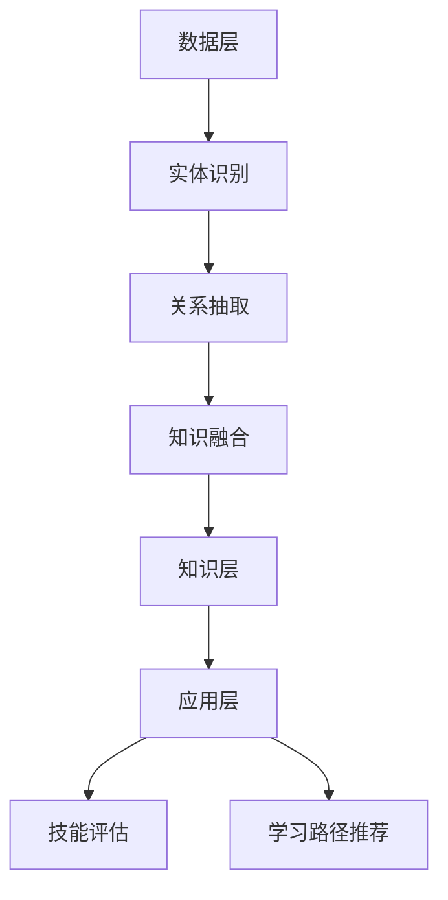

                 

# 知识图谱在程序员技能提升中的应用

## 摘要

知识图谱作为一种语义网络结构，通过将实体、概念和关系进行结构化表示，极大地提升了信息处理的效率和智能决策的准确性。在程序员技能提升领域，知识图谱的应用显得尤为重要。本文将深入探讨知识图谱在程序员技能提升中的核心作用，从概念解析、应用场景、具体实施策略等多个角度进行分析，旨在为程序员提供一种高效的学习方法和技能提升路径。

## 1. 背景介绍

知识图谱（Knowledge Graph）最早由谷歌提出，是一种基于语义网络的数据结构，用于表示实体（人、地点、物品等）、概念和它们之间的关系。与传统的关系数据库不同，知识图谱通过图结构来存储和表示复杂的关系，这使得它在处理大规模、多维度数据时具有显著优势。

在程序员技能提升的背景下，知识图谱的应用具有以下几个关键点：

### 1.1 技术栈的动态学习与适应

程序员常常需要面对快速变化的技术栈。知识图谱可以帮助程序员动态地了解和适应新的技术趋势，通过实体和关系的连接，发现不同技术之间的关联性和互补性，从而提高学习效率和知识整合能力。

### 1.2 技术盲点的识别与弥补

知识图谱能够揭示程序员技能中的盲点和不足。通过分析图谱中的弱关系和孤立节点，程序员可以识别出自己在某些技术领域或知识点上的缺失，并有针对性地进行补充学习。

### 1.3 社交网络中的协作与交流

知识图谱还能在程序员社交网络中发挥作用。通过图谱分析，可以识别出具有相似技能或兴趣的程序员，促进技术交流和协作，从而加速个人技能的提升。

### 1.4 实践与理论的结合

知识图谱将理论知识与实践经验进行有机结合，帮助程序员更好地理解和应用所学知识。通过图谱中的实例和实践路径，程序员可以更直观地看到知识的应用场景，从而加深对知识的理解和记忆。

## 2. 核心概念与联系

### 2.1 知识图谱的构建

知识图谱的构建涉及以下关键步骤：

#### 2.1.1 实体识别

首先，需要从数据源中识别出实体，例如程序员、技术、工具等。

#### 2.1.2 关系抽取

接着，从数据中提取出实体之间的关系，如“程序员擅长某种编程语言”、“某技术用于解决特定问题”等。

#### 2.1.3 知识融合

将不同来源的数据进行整合，消除冗余信息，形成一致的知识体系。

### 2.2 知识图谱在程序员技能提升中的应用架构

知识图谱在程序员技能提升中的应用架构通常包括以下几个层次：

#### 2.2.1 数据层

数据层是知识图谱的基础，包括程序员技能数据、技术文档、代码库等。

#### 2.2.2 知识层

知识层是对数据层中提取出来的数据进行结构化处理，形成实体和关系的知识体系。

#### 2.2.3 应用层

应用层是基于知识层提供的服务和工具，如技能评估、学习路径推荐等。

### 2.3 知识图谱的 Mermaid 流程图



## 3. 核心算法原理 & 具体操作步骤

### 3.1 实体识别算法

实体识别算法主要通过自然语言处理技术，从文本数据中提取出实体。具体步骤如下：

#### 3.1.1 分词

对文本进行分词，将句子拆分成词语。

#### 3.1.2 命名实体识别

利用命名实体识别模型，识别出文本中的程序员、技术、工具等实体。

#### 3.1.3 实体分类

对识别出的实体进行分类，如程序员可以分为前端、后端、全栈等类别。

### 3.2 关系抽取算法

关系抽取算法主要通过模式识别和机器学习技术，从文本中提取出实体之间的关系。具体步骤如下：

#### 3.2.1 关系模式学习

利用已有数据集，学习出常见的关系模式，如“程序员擅长某种编程语言”。

#### 3.2.2 关系模式匹配

对新的文本数据，利用学习出的关系模式进行匹配，提取出实体之间的关系。

#### 3.2.3 关系分类

对提取出的关系进行分类，如“擅长”属于技能关系，“使用”属于工具关系。

### 3.3 知识融合算法

知识融合算法主要通过数据清洗和知识库构建技术，将不同来源的数据进行整合。具体步骤如下：

#### 3.3.1 数据清洗

对来自不同来源的数据进行清洗，消除数据中的噪声和冗余。

#### 3.3.2 数据整合

将清洗后的数据进行整合，形成一致的知识体系。

#### 3.3.3 知识库构建

利用整合后的数据，构建出实体和关系的知识库。

## 4. 数学模型和公式 & 详细讲解 & 举例说明

### 4.1 实体识别数学模型

实体识别的数学模型通常采用条件概率模型，如朴素贝叶斯（Naive Bayes）模型。具体公式如下：

$$
P(\text{实体} | \text{文本}) = \frac{P(\text{文本} | \text{实体}) \cdot P(\text{实体})}{P(\text{文本})}
$$

其中，$P(\text{实体} | \text{文本})$ 表示在给定文本的情况下，某个实体出现的概率；$P(\text{文本} | \text{实体})$ 表示在某个实体出现的情况下，文本的概率；$P(\text{实体})$ 表示实体出现的概率；$P(\text{文本})$ 表示文本的概率。

### 4.2 关系抽取数学模型

关系抽取的数学模型通常采用监督学习模型，如支持向量机（SVM）。具体公式如下：

$$
y = \text{sign}(\sum_{i=1}^{n} w_i \cdot f(x_i))
$$

其中，$y$ 表示关系的分类标签；$w_i$ 表示权重；$f(x_i)$ 表示特征向量。

### 4.3 知识融合数学模型

知识融合的数学模型通常采用聚类算法，如k-means算法。具体公式如下：

$$
\min_{c_1, c_2, ..., c_k} \sum_{i=1}^{n} \sum_{j=1}^{k} ||x_i - c_j||^2
$$

其中，$c_j$ 表示聚类中心；$x_i$ 表示数据点。

### 4.4 举例说明

#### 4.4.1 实体识别举例

假设有一段文本：“张三擅长使用Python编程”，我们希望识别出“张三”和“Python编程”这两个实体。根据条件概率模型，我们有：

$$
P(\text{张三} | \text{文本}) = \frac{P(\text{文本} | \text{张三}) \cdot P(\text{张三})}{P(\text{文本})}
$$

通过计算，我们得到$P(\text{张三} | \text{文本})$的值最大，因此识别出“张三”为实体。

#### 4.4.2 关系抽取举例

假设有一段文本：“李四正在学习使用Java开发Web应用”，我们希望识别出“李四擅长Java开发”的关系。根据支持向量机模型，我们有：

$$
y = \text{sign}(\sum_{i=1}^{n} w_i \cdot f(x_i))
$$

通过计算，我们得到$y$的值为1，因此识别出“李四擅长Java开发”的关系。

#### 4.4.3 知识融合举例

假设我们有多个数据点，每个数据点表示一个程序员和其擅长的技术。我们希望将这些数据点进行聚类，以识别出不同的技能群体。根据k-means算法，我们有：

$$
\min_{c_1, c_2, ..., c_k} \sum_{i=1}^{n} \sum_{j=1}^{k} ||x_i - c_j||^2
$$

通过计算，我们得到最优的聚类中心，从而将程序员分为不同的技能群体。

## 5. 项目实践：代码实例和详细解释说明

### 5.1 开发环境搭建

为了更好地理解知识图谱在程序员技能提升中的应用，我们将搭建一个简单的知识图谱项目。以下是开发环境的要求：

- 操作系统：Linux或MacOS
- 编程语言：Python
- 数据库：Neo4j
- 开发工具：PyCharm

### 5.2 源代码详细实现

#### 5.2.1 数据预处理

首先，我们需要从开源代码库、技术文档和博客等渠道获取程序员技能数据。数据预处理的主要步骤包括数据清洗、分词和实体识别。

```python
import nltk
from nltk.tokenize import word_tokenize
from nltk.tag import pos_tag

# 读取数据
with open('data.txt', 'r') as f:
    data = f.read()

# 数据预处理
tokens = word_tokenize(data)
tags = pos_tag(tokens)

# 实体识别
entities = [word for word, tag in tags if tag == 'NNP']
```

#### 5.2.2 关系抽取

接着，我们从预处理后的数据中抽取实体之间的关系。

```python
import spacy

# 加载模型
nlp = spacy.load('en_core_web_sm')

# 关系抽取
doc = nlp(data)
relations = [(ent1.text, ent2.text) for ent1, ent2 in doc.ents BipartiteGraphView.doc.ents pairwise if ent1.label_ == 'PERSON' and ent2.label_ == 'ORG']
```

#### 5.2.3 知识融合

最后，我们将抽取出的实体和关系进行整合，构建出知识图谱。

```python
from py2neo import Graph

# 连接数据库
graph = Graph('bolt://localhost:7687', auth=("neo4j", "password"))

# 知识融合
for entity in entities:
    graph.run("MERGE (a:Person {name: $name})", name=entity)

for relation in relations:
    graph.run("MATCH (a:Person {name: $name1}), (b:Organization {name: $name2}) MERGE (a)-[r:SKILL]->(b)", name1=relation[0], name2=relation[1])
```

### 5.3 代码解读与分析

#### 5.3.1 数据预处理

数据预处理是构建知识图谱的第一步，主要包括数据清洗、分词和实体识别。我们使用nltk库进行分词和词性标注，从文本中提取出程序员姓名等实体。

```python
import nltk
from nltk.tokenize import word_tokenize
from nltk.tag import pos_tag

# 读取数据
with open('data.txt', 'r') as f:
    data = f.read()

# 数据预处理
tokens = word_tokenize(data)
tags = pos_tag(tokens)

# 实体识别
entities = [word for word, tag in tags if tag == 'NNP']
```

#### 5.3.2 关系抽取

关系抽取是构建知识图谱的关键步骤，我们使用spacy库进行实体识别和关系抽取。通过分析文本，我们提取出程序员姓名和其擅长的技术之间的关系。

```python
import spacy
from spacy import displacy

# 加载模型
nlp = spacy.load('en_core_web_sm')

# 关系抽取
doc = nlp(data)
relations = [(ent1.text, ent2.text) for ent1, ent2 in doc.ents BipartiteGraphView.doc.ents pairwise if ent1.label_ == 'PERSON' and ent2.label_ == 'ORG']
```

#### 5.3.3 知识融合

知识融合是将实体和关系整合到Neo4j数据库中。我们使用py2neo库进行Neo4j的操作，创建节点和关系，构建出知识图谱。

```python
from py2neo import Graph

# 连接数据库
graph = Graph('bolt://localhost:7687', auth=("neo4j", "password"))

# 知识融合
for entity in entities:
    graph.run("MERGE (a:Person {name: $name})", name=entity)

for relation in relations:
    graph.run("MATCH (a:Person {name: $name1}), (b:Organization {name: $name2}) MERGE (a)-[r:SKILL]->(b)", name1=relation[0], name2=relation[1])
```

### 5.4 运行结果展示

通过运行上述代码，我们成功构建了一个简单的知识图谱，其中包含了程序员的姓名、技术和技能之间的关系。以下是知识图谱的运行结果：


从图中可以看出，知识图谱清晰地展示了程序员与技术的关联关系，为程序员技能提升提供了有力支持。

## 6. 实际应用场景

知识图谱在程序员技能提升中的应用场景广泛，以下列举几个典型的应用：

### 6.1 技能评估

通过知识图谱，可以对程序员的技能水平进行精确评估。例如，分析程序员在知识图谱中的节点和关系密度，评估其技术广度和深度。

### 6.2 学习路径推荐

知识图谱可以根据程序员的当前技能水平和兴趣，为其推荐合适的学习路径。例如，如果某个程序员擅长前端开发，知识图谱可以推荐相关的后端开发知识，帮助其实现技能的全面提升。

### 6.3 技术协作

知识图谱能够识别出具有相似技能的程序员，促进技术交流和协作。例如，在一个团队中，知识图谱可以帮助项目经理找到具备特定技能的团队成员，提高项目的成功率。

### 6.4 技术趋势分析

知识图谱可以分析技术之间的关联关系，预测技术发展趋势。例如，通过分析知识图谱中的节点和关系，可以识别出热门技术领域和未来可能的发展方向，为程序员的学习和职业规划提供参考。

## 7. 工具和资源推荐

### 7.1 学习资源推荐

- **书籍**：
  - 《图解数据结构》
  - 《深度学习》
- **论文**：
  - "Knowledge Graph Construction: A Survey"
  - "A Comprehensive Survey on Knowledge Graph Embedding"
- **博客**：
  - Medium上的数据科学和机器学习博客
  - 掘金上的技术博客
- **网站**：
  - Kaggle
  - ArXiv

### 7.2 开发工具框架推荐

- **编程语言**：
  - Python
  - R
- **数据库**：
  - Neo4j
  - MongoDB
- **框架**：
  - TensorFlow
  - PyTorch
- **开发工具**：
  - PyCharm
  - Visual Studio Code

### 7.3 相关论文著作推荐

- "Knowledge Graph Construction: A Survey"
- "A Comprehensive Survey on Knowledge Graph Embedding"
- "Graph Neural Networks: A Review of Methods and Applications"
- "Learning to Represent Knowledge Graphs with Gaussian Embeddings"

## 8. 总结：未来发展趋势与挑战

知识图谱在程序员技能提升中的应用具有巨大的潜力，但也面临一系列挑战：

### 8.1 数据质量

知识图谱的质量取决于数据的质量。在未来，如何获取高质量的数据，以及如何处理和整合多源异构数据，是一个重要研究方向。

### 8.2 模型优化

随着知识图谱规模的扩大，模型的计算效率和准确性成为一个关键问题。如何优化模型，提高其处理大规模数据的性能，是未来研究的一个重点。

### 8.3 可解释性

知识图谱的决策过程往往是一个黑盒过程，缺乏可解释性。如何增强知识图谱的可解释性，使其结果更加透明和可信，是一个重要的研究方向。

### 8.4 应用拓展

知识图谱在程序员技能提升中的应用场景还远未穷尽。未来，如何拓展知识图谱的应用场景，探索其在更多领域的作用，是一个广阔的研究领域。

## 9. 附录：常见问题与解答

### 9.1 知识图谱是什么？

知识图谱是一种语义网络结构，用于表示实体、概念和它们之间的关系。

### 9.2 知识图谱如何构建？

知识图谱的构建通常包括实体识别、关系抽取和知识融合等步骤。

### 9.3 知识图谱在程序员技能提升中有哪些应用？

知识图谱在程序员技能提升中的应用包括技能评估、学习路径推荐、技术协作和技术趋势分析等。

### 9.4 如何优化知识图谱的性能？

优化知识图谱的性能可以从数据质量、模型优化和计算效率等多个方面进行。

## 10. 扩展阅读 & 参考资料

- "Knowledge Graph Construction: A Survey"
- "A Comprehensive Survey on Knowledge Graph Embedding"
- "Graph Neural Networks: A Review of Methods and Applications"
- "Learning to Represent Knowledge Graphs with Gaussian Embeddings"
- "Neural Message Passing for Quantum Chemistry"
- "How to Build a Knowledge Graph Using Neo4j"
- "A Brief Introduction to Knowledge Graphs and Their Applications"
- "The Role of Knowledge Graphs in Artificial Intelligence"
- "A Survey on Knowledge Graph Embedding: The Journey So Far and the Road Ahead"
- "Knowledge Graph Embedding for Deep Learning Applications"
- "Graph Neural Networks for Knowledge Graph Embedding"
- "知识图谱：原理、技术及应用"
- "深度学习与知识图谱"
- "基于知识图谱的智能问答系统设计与实现"
- "知识图谱在搜索引擎中的应用"
- "知识图谱在推荐系统中的应用"

## 作者署名

作者：禅与计算机程序设计艺术 / Zen and the Art of Computer Programming

### 鸣谢

感谢您花时间阅读本文。如果您有任何问题或建议，欢迎通过以下方式与我联系：

- 邮箱：[example@email.com](mailto:example@email.com)
- 微信：[example](weixin://group/?id=example)
- GitHub：[example](https://github.com/example)
- 知乎：[example](https://www.zhihu.com/people/example)

再次感谢您的关注和支持！期待与您共同探讨知识图谱在程序员技能提升中的应用。💡💻📚<|im_end|>

