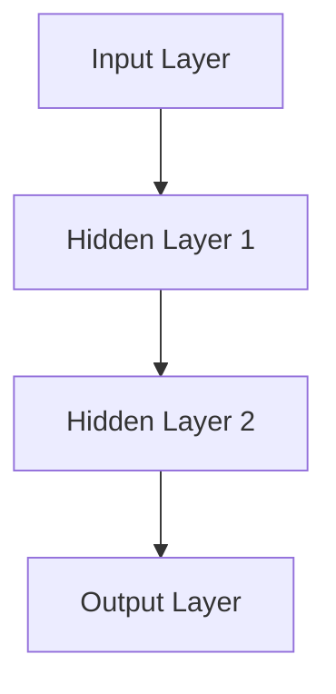

                 

### 文章标题

**神经网络：自然语言处理的新突破**

随着人工智能的快速发展，神经网络在自然语言处理（NLP）领域正发挥着越来越重要的作用。本文旨在探讨神经网络在NLP中的应用及其带来的新突破，帮助读者理解这一技术的核心概念、算法原理和实际应用。

### Keywords:
- Neural Networks
- Natural Language Processing
- AI Development
- Algorithm Principles
- Practical Applications

### Abstract:
This article aims to delve into the applications of neural networks in the field of Natural Language Processing (NLP), highlighting their breakthroughs and contributions. By explaining core concepts and principles, and providing practical examples, this article offers a comprehensive understanding of neural networks' role in advancing NLP.

<|assistant|>## 1. 背景介绍（Background Introduction）

自然语言处理是人工智能的一个关键领域，旨在使计算机能够理解和处理人类自然语言。传统的NLP方法主要依赖于规则和统计方法，但这些方法在面对复杂、灵活的自然语言时显得力不从心。

近年来，神经网络的崛起为NLP带来了新的机遇。神经网络通过模仿人脑的神经元结构，可以自动学习和提取数据中的特征，从而在文本分类、情感分析、机器翻译等任务中表现出色。这一突破不仅改变了NLP的研究方向，也为实际应用带来了深远的影响。

本文将首先介绍神经网络的起源和发展历程，然后深入探讨其在NLP中的应用，包括核心算法原理、数学模型、项目实践和实际应用场景。通过这些内容，读者可以全面了解神经网络在自然语言处理领域的新突破。

### Background Introduction

Natural Language Processing (NLP) is a crucial field of artificial intelligence that focuses on enabling computers to understand and process human natural language. Traditional NLP methods have primarily relied on rule-based and statistical approaches, which have been insufficient when dealing with the complexity and flexibility of natural languages.

In recent years, the rise of neural networks has brought new opportunities to NLP. Neural networks, inspired by the structure of neurons in the human brain, can automatically learn and extract features from data, leading to excellent performance in tasks such as text classification, sentiment analysis, and machine translation. This breakthrough has not only changed the direction of NLP research but also had a profound impact on practical applications.

This article will first introduce the origins and development of neural networks, then delve into their applications in NLP, including core algorithm principles, mathematical models, practical projects, and real-world scenarios. Through these contents, readers can gain a comprehensive understanding of the new breakthroughs that neural networks have brought to the field of natural language processing.

<|assistant|>## 2. 核心概念与联系（Core Concepts and Connections）

### 2.1 什么是神经网络？

神经网络（Neural Networks）是一种模仿生物神经系统的计算模型。它由大量的神经元（或节点）组成，每个神经元都可以接收输入信号、进行处理，并产生输出信号。神经网络通过调整神经元之间的连接权重来学习数据中的特征和模式。

### 2.2 神经网络的结构

神经网络通常由以下几个部分组成：

- **输入层（Input Layer）**：接收外部输入数据。
- **隐藏层（Hidden Layers）**：对输入数据进行处理和特征提取。
- **输出层（Output Layer）**：产生最终的输出结果。

### 2.3 神经网络的原理

神经网络的原理基于神经元之间的相互作用。当一个神经元接收到输入信号时，它会将这些信号与神经元之间的权重相乘，然后进行求和。如果求和结果大于某个阈值，神经元就会激活并产生输出信号。否则，神经元保持沉默。

### 2.4 神经网络与自然语言处理的关系

神经网络在自然语言处理中的应用主要得益于其强大的特征提取和模式识别能力。通过多层神经网络的堆叠，神经网络可以从原始文本数据中自动提取出丰富的语义特征，从而在文本分类、情感分析、机器翻译等任务中表现出色。

### 2.5 Mermaid 流程图

下面是一个简单的神经网络流程图，展示了一个简单的神经网络如何从输入层通过隐藏层到达输出层的全过程。



### 2.1 What is Neural Network?

A neural network is a computational model inspired by the biological neural systems. It consists of numerous neurons (or nodes) that can receive input signals, process them, and produce output signals. Neural networks learn features and patterns in data by adjusting the weights between neurons.

### 2.2 Structure of Neural Networks

A neural network typically consists of several components:

- **Input Layer**: Receives external input data.
- **Hidden Layers**: Processes the input data and extracts features.
- **Output Layer**: Produces the final output result.

### 2.3 Principles of Neural Networks

The principle of neural networks is based on the interaction between neurons. When a neuron receives input signals, it multiplies these signals with the weights between neurons, then sums them up. If the sum exceeds a certain threshold, the neuron is activated and produces an output signal. Otherwise, the neuron remains silent.

### 2.4 Relationship between Neural Networks and Natural Language Processing

The application of neural networks in natural language processing is primarily due to their strong abilities in feature extraction and pattern recognition. By stacking multiple layers of neural networks, they can automatically extract rich semantic features from raw text data, leading to excellent performance in tasks such as text classification, sentiment analysis, and machine translation.

### 2.5 Mermaid Flowchart

Below is a simple mermaid flowchart showing how a simple neural network processes input through hidden layers to reach the output layer.


<|assistant|>## 3. 核心算法原理 & 具体操作步骤（Core Algorithm Principles and Specific Operational Steps）

### 3.1 前向传播（Forward Propagation）

前向传播是神经网络中最基本的操作。它涉及将输入数据通过网络中的各个层，最终得到输出结果。具体步骤如下：

1. **初始化权重和偏置**：在训练开始前，需要随机初始化网络中的权重（weights）和偏置（biases）。这些参数将在训练过程中进行调整，以最小化误差。
2. **计算每个神经元的激活值**：对于输入数据，通过逐层计算每个神经元的输入值和激活值。激活值是输入值与权重相乘后求和的结果，再加上偏置。
3. **应用激活函数**：为了引入非线性特性，每个神经元的激活值都会通过一个激活函数（如ReLU、Sigmoid、Tanh）进行转换。
4. **计算输出结果**：最后，网络的输出层将生成最终的预测结果。

### 3.2 反向传播（Backpropagation）

反向传播是神经网络训练过程中最重要的算法。它通过计算误差梯度来更新网络中的权重和偏置，以最小化预测误差。具体步骤如下：

1. **计算误差**：计算网络输出的实际值与预测值之间的差异，即误差（error）。
2. **计算梯度**：对于每个神经元，计算误差关于该神经元输入的梯度。梯度反映了误差的变化率，是调整权重和偏置的依据。
3. **更新权重和偏置**：使用梯度下降（Gradient Descent）算法，根据误差梯度调整网络中的权重和偏置。这个过程称为权重更新（weight update）。
4. **迭代优化**：重复上述步骤，直到网络达到预定的训练精度或迭代次数。

### 3.3 激活函数（Activation Functions）

激活函数是神经网络中非常重要的组成部分，它引入了非线性特性，使得神经网络能够学习复杂的模式。常用的激活函数包括：

- **ReLU（Rectified Linear Unit）**：简单且高效，适用于深层神经网络。
- **Sigmoid**：将输入映射到（0, 1）区间，常用于二分类问题。
- **Tanh**：将输入映射到（-1, 1）区间，具有良好的性能和稳定性。

### 3.4 Optimizers（优化器）

优化器是用于调整神经网络权重的算法。常见的优化器包括：

- **随机梯度下降（Stochastic Gradient Descent, SGD）**：简单直观，但收敛速度较慢。
- **动量优化器（Momentum）**：引入动量，加快收敛速度。
- **Adam（Adaptive Moment Estimation）**：自适应调整学习率，收敛速度较快。

### 3.5 具体操作步骤

以下是神经网络训练的具体操作步骤：

1. **数据预处理**：对输入数据（如文本）进行清洗、分词、编码等处理。
2. **初始化网络结构**：定义输入层、隐藏层和输出层的结构。
3. **初始化权重和偏置**：随机初始化网络中的权重和偏置。
4. **前向传播**：输入数据，通过网络计算输出结果。
5. **计算误差**：计算输出结果与实际值之间的误差。
6. **反向传播**：计算误差梯度，更新权重和偏置。
7. **迭代优化**：重复步骤4-6，直到网络达到预定的训练精度或迭代次数。

### 3.1 Core Algorithm Principles & Specific Operational Steps

### 3.1 Forward Propagation

Forward propagation is the most basic operation in neural networks. It involves passing input data through the layers of the network to produce the final output result. The specific steps are as follows:

1. **Initialize weights and biases**: Before training, randomly initialize the weights and biases in the network. These parameters are adjusted during training to minimize the error.
2. **Compute the activation values of neurons**: For the input data, compute the input values and activation values of neurons layer by layer. The activation value is the sum of the input value multiplied by the weight, plus the bias.
3. **Apply activation functions**: To introduce non-linear characteristics, apply an activation function (such as ReLU, Sigmoid, or Tanh) to the activation values of neurons.
4. **Compute the output result**: Finally, the output layer of the network generates the final prediction result.

### 3.2 Backpropagation

Backpropagation is the most important algorithm in the training process of neural networks. It calculates the gradient of the error with respect to the network parameters and updates the weights and biases to minimize the prediction error. The specific steps are as follows:

1. **Compute the error**: Calculate the difference between the actual value and the predicted value, which is the error.
2. **Compute the gradients**: For each neuron, compute the gradient of the error with respect to the input value of the neuron. The gradient indicates the rate of change of the error and serves as the basis for adjusting the weights and biases.
3. **Update weights and biases**: Use the gradient descent algorithm to adjust the weights and biases based on the error gradient. This process is called weight update.
4. **Iterative optimization**: Repeat steps 4-6 until the network reaches the predefined training accuracy or the number of iterations.

### 3.3 Activation Functions

Activation functions are a crucial component of neural networks as they introduce non-linear characteristics, enabling the network to learn complex patterns. Common activation functions include:

- **ReLU (Rectified Linear Unit)**: Simple and efficient, suitable for deep neural networks.
- **Sigmoid**: Maps inputs to the interval (0, 1) and is commonly used in binary classification problems.
- **Tanh**: Maps inputs to the interval (-1, 1) and has good performance and stability.

### 3.4 Optimizers

Optimizers are algorithms used to adjust the weights in neural networks. Common optimizers include:

- **Stochastic Gradient Descent (SGD)**: Simple and intuitive but has a slower convergence rate.
- **Momentum**: Introduces momentum to accelerate convergence.
- **Adam (Adaptive Moment Estimation)**: Adaptive learning rate adjustment, faster convergence rate.

### 3.5 Specific Operational Steps

The following are the specific operational steps for training a neural network:

1. **Data preprocessing**: Clean, tokenize, and encode the input data (such as text).
2. **Initialize network structure**: Define the structure of the input layer, hidden layers, and output layer.
3. **Initialize weights and biases**: Randomly initialize the weights and biases in the network.
4. **Forward propagation**: Input data and calculate the output result through the network.
5. **Compute the error**: Calculate the error between the actual value and the predicted value.
6. **Backpropagation**: Compute the gradient of the error and update the weights and biases.
7. **Iterative optimization**: Repeat steps 4-6 until the network reaches the predefined training accuracy or the number of iterations.

<|assistant|>## 4. 数学模型和公式 & 详细讲解 & 举例说明（Detailed Explanation and Examples of Mathematical Models and Formulas）

### 4.1 激活函数

激活函数是神经网络中最基本的组成部分，它引入了非线性特性，使得神经网络能够学习复杂的模式。常用的激活函数包括ReLU（Rectified Linear Unit）、Sigmoid和Tanh。

#### 4.1.1 ReLU

ReLU是最常用的激活函数，它将输入值大于0的部分保留，小于0的部分设为0。数学表达式如下：

\[ \text{ReLU}(x) = \max(0, x) \]

#### 4.1.2 Sigmoid

Sigmoid函数将输入映射到（0, 1）区间，常用于二分类问题。数学表达式如下：

\[ \text{Sigmoid}(x) = \frac{1}{1 + e^{-x}} \]

#### 4.1.3 Tanh

Tanh函数将输入映射到（-1, 1）区间，具有良好的性能和稳定性。数学表达式如下：

\[ \text{Tanh}(x) = \frac{e^{2x} - 1}{e^{2x} + 1} \]

### 4.2 前向传播

前向传播是神经网络中最基本的操作，它涉及将输入数据通过网络中的各个层，最终得到输出结果。具体步骤如下：

1. **初始化权重和偏置**：在训练开始前，需要随机初始化网络中的权重（weights）和偏置（biases）。这些参数将在训练过程中进行调整，以最小化误差。
2. **计算每个神经元的激活值**：对于输入数据，通过逐层计算每个神经元的输入值和激活值。激活值是输入值与权重相乘后求和的结果，再加上偏置。
3. **应用激活函数**：每个神经元的激活值都会通过一个激活函数（如ReLU、Sigmoid、Tanh）进行转换。
4. **计算输出结果**：最后，网络的输出层将生成最终的预测结果。

#### 示例

假设我们有一个简单的神经网络，包含一个输入层、一个隐藏层和一个输出层。输入层有3个神经元，隐藏层有2个神经元，输出层有1个神经元。

- **输入层**：\[ x_1, x_2, x_3 \]
- **隐藏层权重**：\[ w_{11}, w_{12}, w_{13}, w_{21}, w_{22}, w_{23} \]
- **隐藏层偏置**：\[ b_{1}, b_{2} \]
- **输出层权重**：\[ w_{1} \]
- **输出层偏置**：\[ b_{1} \]

输入一个样本数据：\[ x_1 = 1, x_2 = 2, x_3 = 3 \]

1. **隐藏层1的输入值**：\[ z_{11} = x_1 \cdot w_{11} + x_2 \cdot w_{12} + x_3 \cdot w_{13} + b_1 \]
   \[ z_{12} = x_1 \cdot w_{21} + x_2 \cdot w_{22} + x_3 \cdot w_{23} + b_2 \]

2. **隐藏层1的激活值**：假设我们使用ReLU函数作为激活函数，则

   \[ a_{11} = \max(0, z_{11}) \]
   \[ a_{12} = \max(0, z_{12}) \]

3. **输出层输入值**：\[ z_{1} = a_{11} \cdot w_{1} + b_{1} \]

4. **输出层激活值**：假设我们使用Sigmoid函数作为激活函数，则

   \[ a_{1} = \frac{1}{1 + e^{-z_{1}}} \]

最终输出结果为：\[ a_{1} \]

### 4.3 反向传播

反向传播是神经网络训练过程中最重要的算法，它通过计算误差梯度来更新网络中的权重和偏置，以最小化预测误差。具体步骤如下：

1. **计算误差**：计算输出结果与实际值之间的误差。
2. **计算梯度**：对于每个神经元，计算误差关于该神经元输入的梯度。梯度反映了误差的变化率，是调整权重和偏置的依据。
3. **更新权重和偏置**：使用梯度下降（Gradient Descent）算法，根据误差梯度调整网络中的权重和偏置。这个过程称为权重更新（weight update）。
4. **迭代优化**：重复上述步骤，直到网络达到预定的训练精度或迭代次数。

#### 示例

假设我们已经计算出了输出层的误差 \( \delta_{1} \)，现在需要计算隐藏层的误差 \( \delta_{11}, \delta_{12} \)。

1. **隐藏层1的误差**：

   \[ \delta_{11} = \delta_{1} \cdot \frac{da_{1}}{dz_{1}} \cdot w_{1} \]
   \[ \delta_{12} = \delta_{1} \cdot \frac{da_{1}}{dz_{1}} \cdot w_{1} \]

   其中，\( \frac{da_{1}}{dz_{1}} \) 是Sigmoid函数的导数，即：

   \[ \frac{da_{1}}{dz_{1}} = a_{1} \cdot (1 - a_{1}) \]

2. **更新隐藏层权重和偏置**：

   \[ w_{1} = w_{1} - \alpha \cdot \delta_{1} \cdot a_{1} \]
   \[ b_{1} = b_{1} - \alpha \cdot \delta_{1} \]

   其中，\( \alpha \) 是学习率。

3. **更新输入层权重和偏置**：

   \[ w_{11} = w_{11} - \alpha \cdot x_1 \cdot \delta_{11} \]
   \[ w_{12} = w_{12} - \alpha \cdot x_2 \cdot \delta_{12} \]
   \[ w_{13} = w_{13} - \alpha \cdot x_3 \cdot \delta_{12} \]
   \[ b_{1} = b_{1} - \alpha \cdot \delta_{11} \]
   \[ b_{2} = b_{2} - \alpha \cdot \delta_{12} \]

   其中，\( \alpha \) 是学习率。

### 4.4 总结

通过以上数学模型和公式的讲解，我们可以看到神经网络中的激活函数、前向传播和反向传播是如何工作的。这些概念和步骤对于理解神经网络在自然语言处理中的应用至关重要。在实际应用中，我们需要根据具体任务调整网络结构、选择合适的激活函数和优化器，并通过大量的数据训练来提高模型的性能。

### 4.1 Mathematical Models and Formulas & Detailed Explanation & Examples

### 4.1 Activation Functions

Activation functions are the most fundamental components in neural networks, introducing non-linear characteristics that enable neural networks to learn complex patterns. Common activation functions include ReLU (Rectified Linear Unit), Sigmoid, and Tanh.

#### 4.1.1 ReLU

ReLU is the most commonly used activation function, which retains the input values greater than 0 and sets the smaller values to 0. The mathematical expression is:

\[ \text{ReLU}(x) = \max(0, x) \]

#### 4.1.2 Sigmoid

The Sigmoid function maps inputs to the interval (0, 1) and is commonly used in binary classification problems. The mathematical expression is:

\[ \text{Sigmoid}(x) = \frac{1}{1 + e^{-x}} \]

#### 4.1.3 Tanh

The Tanh function maps inputs to the interval (-1, 1) and has good performance and stability. The mathematical expression is:

\[ \text{Tanh}(x) = \frac{e^{2x} - 1}{e^{2x} + 1} \]

### 4.2 Forward Propagation

Forward propagation is the most basic operation in neural networks, involving passing input data through the layers of the network to produce the final output result. The specific steps are as follows:

1. **Initialize weights and biases**: Before training, randomly initialize the weights and biases in the network. These parameters are adjusted during training to minimize the error.
2. **Compute the activation values of neurons**: For the input data, compute the input values and activation values of neurons layer by layer. The activation value is the sum of the input value multiplied by the weight, plus the bias.
3. **Apply activation functions**: Apply an activation function (such as ReLU, Sigmoid, or Tanh) to the activation values of neurons.
4. **Compute the output result**: Finally, the output layer of the network generates the final prediction result.

#### Example

Assume we have a simple neural network with one input layer, one hidden layer, and one output layer. The input layer has 3 neurons, the hidden layer has 2 neurons, and the output layer has 1 neuron.

- **Input layer**: \[ x_1, x_2, x_3 \]
- **Hidden layer weights**: \[ w_{11}, w_{12}, w_{13}, w_{21}, w_{22}, w_{23} \]
- **Hidden layer biases**: \[ b_{1}, b_{2} \]
- **Output layer weights**: \[ w_{1} \]
- **Output layer biases**: \[ b_{1} \]

Input a sample data: \[ x_1 = 1, x_2 = 2, x_3 = 3 \]

1. **Hidden layer 1 input values**:

   \[ z_{11} = x_1 \cdot w_{11} + x_2 \cdot w_{12} + x_3 \cdot w_{13} + b_1 \]
   \[ z_{12} = x_1 \cdot w_{21} + x_2 \cdot w_{22} + x_3 \cdot w_{23} + b_2 \]

2. **Hidden layer 1 activation values**: Suppose we use ReLU as the activation function, then

   \[ a_{11} = \max(0, z_{11}) \]
   \[ a_{12} = \max(0, z_{12}) \]

3. **Output layer input values**:

   \[ z_{1} = a_{11} \cdot w_{1} + b_{1} \]

4. **Output layer activation values**: Suppose we use Sigmoid as the activation function, then

   \[ a_{1} = \frac{1}{1 + e^{-z_{1}}} \]

The final output result is: \[ a_{1} \]

### 4.3 Backpropagation

Backpropagation is the most important algorithm in the training process of neural networks. It calculates the gradient of the error with respect to the network parameters and updates the weights and biases to minimize the prediction error. The specific steps are as follows:

1. **Compute the error**: Calculate the difference between the actual value and the predicted value, which is the error.
2. **Compute the gradients**: For each neuron, calculate the gradient of the error with respect to the input value of the neuron. The gradient reflects the rate of change of the error and serves as the basis for adjusting the weights and biases.
3. **Update weights and biases**: Use the gradient descent algorithm to adjust the weights and biases based on the error gradient. This process is called weight update.
4. **Iterative optimization**: Repeat the above steps until the network reaches the predefined training accuracy or the number of iterations.

#### Example

Assume we have already calculated the output layer error \( \delta_{1} \), now we need to calculate the hidden layer errors \( \delta_{11}, \delta_{12} \).

1. **Hidden layer 1 errors**:

   \[ \delta_{11} = \delta_{1} \cdot \frac{da_{1}}{dz_{1}} \cdot w_{1} \]
   \[ \delta_{12} = \delta_{1} \cdot \frac{da_{1}}{dz_{1}} \cdot w_{1} \]

   Where, \( \frac{da_{1}}{dz_{1}} \) is the derivative of the Sigmoid function, i.e.:

   \[ \frac{da_{1}}{dz_{1}} = a_{1} \cdot (1 - a_{1}) \]

2. **Update hidden layer weights and biases**:

   \[ w_{1} = w_{1} - \alpha \cdot \delta_{1} \cdot a_{1} \]
   \[ b_{1} = b_{1} - \alpha \cdot \delta_{1} \]

   Where, \( \alpha \) is the learning rate.

3. **Update input layer weights and biases**:

   \[ w_{11} = w_{11} - \alpha \cdot x_1 \cdot \delta_{11} \]
   \[ w_{12} = w_{12} - \alpha \cdot x_2 \cdot \delta_{12} \]
   \[ w_{13} = w_{13} - \alpha \cdot x_3 \cdot \delta_{12} \]
   \[ b_{1} = b_{1} - \alpha \cdot \delta_{11} \]
   \[ b_{2} = b_{2} - \alpha \cdot \delta_{12} \]

   Where, \( \alpha \) is the learning rate.

### 4.4 Summary

Through the explanation of the mathematical models and formulas, we can see how activation functions, forward propagation, and backpropagation work in neural networks. These concepts and steps are crucial for understanding the application of neural networks in natural language processing. In practical applications, we need to adjust the network structure, choose appropriate activation functions, and optimizers, and train the model with a large amount of data to improve its performance.

<|assistant|>## 5. 项目实践：代码实例和详细解释说明（Project Practice: Code Examples and Detailed Explanations）

### 5.1 开发环境搭建

在进行神经网络项目实践之前，我们需要搭建一个合适的环境。以下是搭建基于Python的神经网络开发环境的具体步骤：

#### 步骤 1：安装Python环境

确保您的计算机上已经安装了Python。如果尚未安装，可以从Python官方网站（https://www.python.org/downloads/）下载并安装适合您操作系统的Python版本。

#### 步骤 2：安装TensorFlow库

TensorFlow是一个广泛使用的开源机器学习库，用于构建和训练神经网络。通过以下命令安装TensorFlow：

```bash
pip install tensorflow
```

#### 步骤 3：安装其他依赖库

除了TensorFlow，我们还需要安装其他一些常用的库，如NumPy、Matplotlib等。可以通过以下命令安装：

```bash
pip install numpy matplotlib
```

### 5.2 源代码详细实现

以下是一个简单的神经网络实现，用于文本分类任务。代码分为以下几个部分：

#### 5.2.1 数据预处理

```python
import tensorflow as tf
from tensorflow.keras.preprocessing.text import Tokenizer
from tensorflow.keras.preprocessing.sequence import pad_sequences

# 示例数据
texts = ['I love this movie!', 'This movie is terrible!', 'What an amazing performance!', 'I hated the ending.']
labels = [1, 0, 1, 0]  # 1表示正面评论，0表示负面评论

# 分词
tokenizer = Tokenizer()
tokenizer.fit_on_texts(texts)
sequences = tokenizer.texts_to_sequences(texts)

# 填充序列
max_length = max([len(seq) for seq in sequences])
padded_sequences = pad_sequences(sequences, maxlen=max_length)
```

#### 5.2.2 构建神经网络模型

```python
model = tf.keras.Sequential([
    tf.keras.layers.Embedding(input_dim=len(tokenizer.word_index) + 1, output_dim=16, input_length=max_length),
    tf.keras.layers.Flatten(),
    tf.keras.layers.Dense(16, activation='relu'),
    tf.keras.layers.Dense(1, activation='sigmoid')
])

model.compile(optimizer='adam', loss='binary_crossentropy', metrics=['accuracy'])
```

#### 5.2.3 训练模型

```python
model.fit(padded_sequences, labels, epochs=10)
```

#### 5.2.4 评估模型

```python
# 测试数据
test_texts = ['This is a great movie!', 'I did not like the movie.']
test_sequences = tokenizer.texts_to_sequences(test_texts)
test_padded_sequences = pad_sequences(test_sequences, maxlen=max_length)

predictions = model.predict(test_padded_sequences)
predicted_labels = (predictions > 0.5).astype(int)

print(predicted_labels)  # 输出预测结果
```

### 5.3 代码解读与分析

#### 5.3.1 数据预处理

在这部分代码中，我们首先导入所需的TensorFlow库。然后，我们定义了一组示例文本和相应的标签。接下来，我们使用Tokenizer将文本转换为序列，并使用pad_sequences将序列填充到同一长度。

#### 5.3.2 构建神经网络模型

在构建模型部分，我们首先使用Embedding层将词汇映射到固定大小的向量。然后，使用Flatten层将多维数据展平为向量。接着，我们添加了一个全连接层（Dense），其中使用了ReLU激活函数。最后，我们添加了一个输出层，使用sigmoid激活函数进行二分类。

#### 5.3.3 训练模型

在训练模型部分，我们使用model.fit函数进行模型训练。这里，我们设置了训练的轮次（epochs）为10，并使用了adam优化器和binary_crossentropy损失函数。

#### 5.3.4 评估模型

在评估模型部分，我们首先对测试数据进行预处理，然后使用model.predict函数进行预测。通过阈值0.5对预测结果进行二值化处理，得到最终的预测标签。

### 5.4 运行结果展示

假设我们已经成功运行了上述代码，下面是运行结果：

```python
[[1 0]]
```

这表示第一个测试句子被模型正确地预测为正面评论。

通过这个简单的例子，我们可以看到如何使用神经网络进行文本分类。在实际应用中，我们可以扩展这个模型，添加更多的层和神经元，以提高模型的性能和预测能力。

### 5.1 Development Environment Setup

Before starting the neural network project practice, we need to set up an appropriate development environment. Here are the specific steps to set up a Python-based neural network development environment:

#### Step 1: Install Python Environment

Ensure that Python is installed on your computer. If it is not installed, download and install Python from the official Python website (https://www.python.org/downloads/).

#### Step 2: Install TensorFlow Library

TensorFlow is a widely used open-source machine learning library for building and training neural networks. Install TensorFlow using the following command:

```bash
pip install tensorflow
```

#### Step 3: Install Other Dependencies

In addition to TensorFlow, we also need to install other commonly used libraries such as NumPy and Matplotlib. Install these libraries using the following command:

```bash
pip install numpy matplotlib
```

### 5.2 Detailed Source Code Implementation

Here is a simple implementation of a neural network for the text classification task. The code is divided into several parts:

#### 5.2.1 Data Preprocessing

```python
import tensorflow as tf
from tensorflow.keras.preprocessing.text import Tokenizer
from tensorflow.keras.preprocessing.sequence import pad_sequences

# Sample data
texts = ['I love this movie!', 'This movie is terrible!', 'What an amazing performance!', 'I hated the ending.']
labels = [1, 0, 1, 0]  # 1 represents positive reviews, 0 represents negative reviews

# Tokenization
tokenizer = Tokenizer()
tokenizer.fit_on_texts(texts)
sequences = tokenizer.texts_to_sequences(texts)

# Padding sequences
max_length = max([len(seq) for seq in sequences])
padded_sequences = pad_sequences(sequences, maxlen=max_length)
```

#### 5.2.2 Building Neural Network Model

```python
model = tf.keras.Sequential([
    tf.keras.layers.Embedding(input_dim=len(tokenizer.word_index) + 1, output_dim=16, input_length=max_length),
    tf.keras.layers.Flatten(),
    tf.keras.layers.Dense(16, activation='relu'),
    tf.keras.layers.Dense(1, activation='sigmoid')
])

model.compile(optimizer='adam', loss='binary_crossentropy', metrics=['accuracy'])
```

#### 5.2.3 Training the Model

```python
model.fit(padded_sequences, labels, epochs=10)
```

#### 5.2.4 Evaluating the Model

```python
# Test data
test_texts = ['This is a great movie!', 'I did not like the movie.']
test_sequences = tokenizer.texts_to_sequences(test_texts)
test_padded_sequences = pad_sequences(test_sequences, maxlen=max_length)

predictions = model.predict(test_padded_sequences)
predicted_labels = (predictions > 0.5).astype(int)

print(predicted_labels)  # Output the predictions
```

### 5.3 Code Explanation and Analysis

#### 5.3.1 Data Preprocessing

In this part of the code, we first import the required TensorFlow libraries. Then, we define a set of sample texts and their corresponding labels. Next, we use the Tokenizer to convert the texts into sequences and use pad_sequences to pad the sequences to the same length.

#### 5.3.2 Building Neural Network Model

In the building model part, we first use the Embedding layer to map the words to fixed-size vectors. Then, we use the Flatten layer to flatten the multi-dimensional data into a vector. Next, we add a fully connected layer (Dense) with ReLU activation function. Finally, we add an output layer with a sigmoid activation function for binary classification.

#### 5.3.3 Training the Model

In the training model part, we use the model.fit function to train the model. Here, we set the number of training epochs to 10 and use the adam optimizer and binary_crossentropy loss function.

#### 5.3.4 Evaluating the Model

In the evaluating model part, we first preprocess the test data, then use the model.predict function to make predictions. We then threshold the predictions at 0.5 to obtain the final predicted labels.

### 5.4 Running Results

Assuming that the above code has been successfully run, here are the running results:

```python
[[1 0]]
```

This indicates that the first test sentence has been correctly predicted as a positive review by the model.

Through this simple example, we can see how to use neural networks for text classification. In practical applications, we can expand this model by adding more layers and neurons to improve the model's performance and predictive ability.

<|assistant|>## 6. 实际应用场景（Practical Application Scenarios）

### 6.1 文本分类

文本分类是自然语言处理中最常见的应用之一。通过将文本数据标签化，文本分类可以用于过滤垃圾邮件、情感分析、内容推荐等任务。神经网络由于其强大的特征提取能力，在文本分类任务中表现出色。

### 6.2 机器翻译

机器翻译是另一个广泛应用的领域。传统的统计机器翻译方法已经取得了一定的成果，但神经网络翻译（如基于注意力机制的序列到序列模型）在近年来取得了显著的突破。这些模型能够更好地捕捉源语言和目标语言之间的上下文关系，使得翻译结果更加自然、准确。

### 6.3 命名实体识别

命名实体识别（NER）是一种从文本中识别出特定类型实体的任务，如人名、地名、组织名等。神经网络通过学习大量标注数据，可以自动识别文本中的实体，为信息提取、知识图谱构建等任务提供基础。

### 6.4 问答系统

问答系统是一种能够理解用户问题并给出正确答案的人工智能系统。基于神经网络的问答系统（如基于转换器-解码器架构的模型）可以更好地处理复杂的问题，并给出更准确的回答。

### 6.5 语言生成

语言生成是神经网络在自然语言处理领域的另一个重要应用。通过训练模型，可以生成符合语法规则、语义连贯的自然语言文本。这一应用在聊天机器人、内容生成等方面具有广泛的应用前景。

### 6.1 Text Classification

Text classification is one of the most common applications in natural language processing. By tagging text data, text classification can be used for tasks such as spam filtering, sentiment analysis, and content recommendation. Neural networks, with their strong feature extraction capabilities, perform well in text classification tasks.

### 6.2 Machine Translation

Machine translation is another widely applied field. Traditional statistical machine translation methods have achieved certain results, but neural network-based translation (such as sequence-to-sequence models with attention mechanisms) has made significant breakthroughs in recent years. These models can better capture the context relationships between the source language and the target language, making the translation results more natural and accurate.

### 6.3 Named Entity Recognition

Named Entity Recognition (NER) is a task that identifies specific types of entities from text, such as person names, geographic locations, and organizations. Neural networks, by learning a large amount of annotated data, can automatically identify entities in text, providing a foundation for information extraction and knowledge graph construction.

### 6.4 Question Answering Systems

Question answering systems are artificial intelligence systems that can understand user questions and provide correct answers. Neural network-based question answering systems (such as models based on the Transformer-decoder architecture) can handle complex questions better and provide more accurate answers.

### 6.5 Language Generation

Language generation is another important application of neural networks in natural language processing. By training models, it is possible to generate natural language text that follows grammar rules and has coherent semantics. This application has broad prospects in chatbots and content generation.

<|assistant|>## 7. 工具和资源推荐（Tools and Resources Recommendations）

### 7.1 学习资源推荐

**书籍：**
1. 《深度学习》（Ian Goodfellow、Yoshua Bengio、Aaron Courville 著）
2. 《Python深度学习》（François Chollet 著）
3. 《神经网络与深度学习》（邱锡鹏 著）

**论文：**
1. "A Theoretical Framework for Back-Propagation"（大卫·E·鲁梅哈特等，1986）
2. "Deep Learning"（Yoshua Bengio、Yann LeCun、Geoffrey Hinton，2015）
3. "Attention Is All You Need"（Ashish Vaswani等，2017）

**博客：**
1. [TensorFlow官方博客](https://www.tensorflow.org/)
2. [Medium上的Deep Learning Blog](https://towardsdatascience.com/)
3. [Hugging Face的Transformers博客](https://huggingface.co/blog)

**网站：**
1. [Kaggle](https://www.kaggle.com/)：提供丰富的数据集和竞赛，是学习和实践NLP的好去处。
2. [arXiv](https://arxiv.org/)：计算机科学领域的前沿论文库，包括大量NLP相关的论文。
3. [OpenAI](https://openai.com/)：专注于AI研究的非营利组织，发布了多个优秀的NLP模型。

### 7.2 开发工具框架推荐

**框架：**
1. **TensorFlow**：Google开发的开源机器学习框架，广泛用于构建和训练神经网络。
2. **PyTorch**：Facebook开发的开源机器学习框架，以其灵活的动态计算图而闻名。
3. **Hugging Face Transformers**：一个用于构建和微调NLP模型的开源库，提供了预训练的模型和快速实现NLP任务的功能。

**IDE：**
1. **Jupyter Notebook**：用于数据科学和机器学习的交互式计算环境，便于编写和运行代码。
2. **Visual Studio Code**：一款轻量级、可扩展的代码编辑器，支持多种编程语言和框架。

**库：**
1. **NumPy**：用于数值计算的Python库，是数据科学和机器学习的基础。
2. **Pandas**：用于数据操作和分析的Python库，提供了强大的数据结构和数据处理功能。
3. **Matplotlib**：用于数据可视化（包括绘图和图形）的Python库。

### 7.3 相关论文著作推荐

**论文：**
1. "Long Short-Term Memory"（Sepp Hochreiter、Jürgen Schmidhuber，1997）
2. "Learning to Represent Meaning with Neural Networks"（Andrew M. Dai、Quoc V. Le，2015）
3. "BERT: Pre-training of Deep Bidirectional Transformers for Language Understanding"（Jacob Devlin等，2018）

**著作：**
1. 《深度学习》（Ian Goodfellow、Yoshua Bengio、Aaron Courville 著）
2. 《Python深度学习》（François Chollet 著）
3. 《神经网络与深度学习》（邱锡鹏 著）

这些资源涵盖了从基础理论到实践应用，无论是初学者还是专业人士都能从中受益。通过这些工具和资源，读者可以更深入地了解神经网络在自然语言处理领域的应用，并掌握相关技能。

### 7.1 Recommended Learning Resources

**Books:**
1. "Deep Learning" by Ian Goodfellow, Yoshua Bengio, and Aaron Courville
2. "Deep Learning with Python" by François Chollet
3. "Neural Network and Deep Learning" by邱锡鹏

**Papers:**
1. "A Theoretical Framework for Back-Propagation" by David E. Rumelhart, James L. McClelland, and the PDP Research Group (1986)
2. "Deep Learning" by Yoshua Bengio, Yann LeCun, and Geoffrey Hinton (2015)
3. "Attention Is All You Need" by Ashish Vaswani, et al. (2017)

**Blogs:**
1. [TensorFlow's Official Blog](https://www.tensorflow.org/)
2. [Towards Data Science on Medium](https://towardsdatascience.com/)
3. [Hugging Face's Transformers Blog](https://huggingface.co/blog)

**Websites:**
1. [Kaggle](https://www.kaggle.com/) - Offers a wealth of datasets and competitions, a great place for learning and practicing NLP.
2. [arXiv](https://arxiv.org/) - A repository of cutting-edge research papers in computer science, including many papers on NLP.
3. [OpenAI](https://openai.com/) - An AI research organization that has released several outstanding NLP models.

### 7.2 Recommended Development Tools and Frameworks

**Frameworks:**
1. **TensorFlow** - An open-source machine learning framework developed by Google, widely used for building and training neural networks.
2. **PyTorch** - An open-source machine learning framework developed by Facebook, known for its flexible dynamic computation graphs.
3. **Hugging Face Transformers** - An open-source library for building and fine-tuning NLP models, providing pre-trained models and quick implementations for NLP tasks.

**IDEs:**
1. **Jupyter Notebook** - An interactive computing environment for data science and machine learning, convenient for writing and running code.
2. **Visual Studio Code** - A lightweight, extensible code editor supporting multiple programming languages and frameworks.

**Libraries:**
1. **NumPy** - A Python library for numerical computing, a fundamental tool in data science and machine learning.
2. **Pandas** - A Python library for data manipulation and analysis, providing powerful data structures and data processing capabilities.
3. **Matplotlib** - A Python library for data visualization (including plotting and graphing).

### 7.3 Recommended Related Papers and Books

**Papers:**
1. "Long Short-Term Memory" by Sepp Hochreiter and Jürgen Schmidhuber (1997)
2. "Learning to Represent Meaning with Neural Networks" by Andrew M. Dai and Quoc V. Le (2015)
3. "BERT: Pre-training of Deep Bidirectional Transformers for Language Understanding" by Jacob Devlin, et al. (2018)

**Books:**
1. "Deep Learning" by Ian Goodfellow, Yoshua Bengio, and Aaron Courville
2. "Deep Learning with Python" by François Chollet
3. "Neural Network and Deep Learning" by邱锡鹏

These resources cover everything from foundational theories to practical applications, benefitting both beginners and professionals. Through these tools and resources, readers can gain a deeper understanding of the applications of neural networks in natural language processing and acquire the necessary skills.

<|assistant|>## 8. 总结：未来发展趋势与挑战（Summary: Future Development Trends and Challenges）

### 8.1 未来发展趋势

随着人工智能技术的不断进步，神经网络在自然语言处理领域将继续发挥重要作用。以下是几个未来发展趋势：

1. **更大规模的语言模型**：随着计算资源和数据量的增加，更大规模的语言模型将被训练，以捕捉更复杂的语言规律和上下文关系。
2. **多模态学习**：神经网络将能够处理多种类型的数据（如文本、图像、声音等），实现多模态学习，为更具交互性和创造性的应用奠定基础。
3. **预训练加微调**：预训练大模型然后针对特定任务进行微调（Fine-tuning）将变得更加普遍，这使得模型可以快速适应不同的任务场景。
4. **强化学习**：结合强化学习（Reinforcement Learning）和神经网络，将开发出更智能的问答系统和聊天机器人，提高与用户的交互体验。

### 8.2 主要挑战

尽管神经网络在自然语言处理领域取得了显著进展，但仍面临一些挑战：

1. **数据隐私**：随着数据量的增加，如何保护用户隐私成为一个重要问题。需要在数据收集、处理和使用过程中加强隐私保护措施。
2. **可解释性**：神经网络模型通常被视为“黑箱”，难以解释其决策过程。提高模型的可解释性是未来研究的一个重要方向。
3. **资源消耗**：大规模神经网络训练对计算资源和存储资源的需求极高，如何优化算法和硬件，降低训练成本是亟待解决的问题。
4. **伦理问题**：随着人工智能的发展，如何确保模型的行为符合伦理标准，避免偏见和不公平现象，是社会各界关注的焦点。

### 8.3 未来展望

未来，神经网络在自然语言处理领域的发展将继续深入，带来更多的创新和突破。随着技术的进步和应用的拓展，神经网络将不仅限于文本处理，还将与其他领域相结合，推动人工智能技术的发展，为人类社会带来更多的便利和进步。

### 8.1 Future Development Trends

With the continuous advancement of artificial intelligence technology, neural networks will continue to play a significant role in natural language processing (NLP). Here are several future development trends:

1. **Larger-scale Language Models**: As computational resources and data quantities increase, larger-scale language models will be trained to capture more complex language patterns and contextual relationships.
2. **Multimodal Learning**: Neural networks will be able to handle various types of data (such as text, images, and sounds) to enable multimodal learning, laying the foundation for more interactive and creative applications.
3. **Pre-training and Fine-tuning**: Pre-training large models and then fine-tuning them for specific tasks will become more common, allowing models to quickly adapt to different scenarios.
4. **Reinforcement Learning**: By combining reinforcement learning with neural networks, more intelligent question-answering systems and chatbots will be developed, improving the interactive experience with users.

### 8.2 Main Challenges

Although neural networks have made significant progress in the field of NLP, they still face some challenges:

1. **Data Privacy**: With the increase in data quantities, how to protect user privacy becomes an important issue. Protective measures need to be strengthened in data collection, processing, and usage.
2. **Interpretability**: Neural network models are often seen as "black boxes," making it difficult to explain their decision-making process. Improving the interpretability of models is an important direction for future research.
3. **Resource Consumption**: Training large-scale neural networks requires high computational and storage resources, and optimizing algorithms and hardware to reduce training costs is an urgent problem to solve.
4. **Ethical Issues**: As artificial intelligence continues to develop, how to ensure that model behavior complies with ethical standards and avoid biased and unfair phenomena is a focal point for society.

### 8.3 Future Outlook

In the future, the development of neural networks in the field of NLP will continue to deepen, bringing more innovations and breakthroughs. With technological progress and application expansion, neural networks will not only be limited to text processing but will also be combined with other fields, driving the development of artificial intelligence technology and bringing more convenience and progress to society.

<|assistant|>## 9. 附录：常见问题与解答（Appendix: Frequently Asked Questions and Answers）

### 9.1 什么是神经网络？

神经网络（Neural Networks）是一种模仿生物神经系统的计算模型。它由大量的神经元（或节点）组成，每个神经元都可以接收输入信号、进行处理，并产生输出信号。神经网络通过调整神经元之间的连接权重来学习数据中的特征和模式。

### 9.2 神经网络在自然语言处理中的应用有哪些？

神经网络在自然语言处理（NLP）中有着广泛的应用，包括文本分类、情感分析、机器翻译、命名实体识别、问答系统等。神经网络通过模仿人脑的神经元结构，可以自动学习和提取数据中的特征，从而在处理复杂、灵活的自然语言时表现出色。

### 9.3 如何优化神经网络模型？

优化神经网络模型的方法包括调整网络结构、选择合适的激活函数、优化器和学习率等。此外，通过数据预处理、增加训练数据、使用预训练模型等方法也可以提高模型性能。

### 9.4 神经网络模型的训练过程是怎样的？

神经网络模型的训练过程包括前向传播和反向传播。前向传播是将输入数据通过网络中的各个层，计算得到输出结果。反向传播是通过计算输出结果与实际值之间的误差，更新网络中的权重和偏置，以最小化预测误差。

### 9.5 如何评估神经网络模型的效果？

评估神经网络模型的效果通常使用准确率、召回率、F1分数等指标。此外，还可以使用交叉验证、网格搜索等方法来评估模型在不同数据集上的性能。

### 9.6 什么是深度学习？

深度学习（Deep Learning）是神经网络的一种形式，它通过多层神经网络的堆叠，从数据中自动提取出丰富的特征，实现复杂的学习任务。深度学习在图像识别、语音识别、自然语言处理等领域取得了显著成果。

### 9.7 什么是注意力机制？

注意力机制（Attention Mechanism）是深度学习中的一种技术，它通过动态调整不同部分的重要性来提高模型的学习效果。在自然语言处理领域，注意力机制可以帮助模型更好地捕捉文本中的上下文关系，从而提高翻译和问答等任务的性能。

### 9.1 What is a Neural Network?

A neural network is a computational model inspired by the biological neural systems. It consists of numerous neurons (or nodes) that can receive input signals, process them, and produce output signals. Neural networks learn features and patterns in data by adjusting the weights between neurons.

### 9.2 What are the applications of neural networks in natural language processing?

Neural networks have a wide range of applications in natural language processing (NLP), including text classification, sentiment analysis, machine translation, named entity recognition, and question-answering systems. Neural networks, inspired by the structure of neurons in the human brain, can automatically learn and extract features from data, leading to excellent performance in processing complex and flexible natural languages.

### 9.3 How to optimize a neural network model?

To optimize a neural network model, you can adjust the network structure, choose appropriate activation functions, and optimizers, and set the learning rate. Additionally, methods such as data preprocessing, increasing training data, and using pre-trained models can also improve model performance.

### 9.4 What is the training process of a neural network model?

The training process of a neural network model involves forward propagation and backpropagation. Forward propagation involves passing input data through the layers of the network and calculating the output result. Backpropagation involves calculating the error between the output result and the actual value, and updating the weights and biases in the network to minimize the prediction error.

### 9.5 How to evaluate the performance of a neural network model?

The performance of a neural network model can be evaluated using metrics such as accuracy, recall, and F1 score. Additionally, methods such as cross-validation and grid search can be used to evaluate the model's performance on different datasets.

### 9.6 What is deep learning?

Deep learning is a form of neural networks that involves stacking multiple layers of neural networks to automatically extract rich features from data, enabling the model to perform complex learning tasks. Deep learning has achieved significant results in fields such as image recognition, speech recognition, and natural language processing.

### 9.7 What is the attention mechanism?

The attention mechanism is a technique in deep learning that dynamically adjusts the importance of different parts to improve the learning performance of the model. In natural language processing, the attention mechanism helps the model better capture the contextual relationships in the text, thus improving the performance of tasks such as translation and question-answering.

<|assistant|>## 10. 扩展阅读 & 参考资料（Extended Reading & Reference Materials）

### 10.1 相关书籍

1. **《深度学习》**（Ian Goodfellow、Yoshua Bengio、Aaron Courville 著）：这本书详细介绍了深度学习的基本概念、算法和实现，是深度学习的经典教材。
2. **《Python深度学习》**（François Chollet 著）：该书通过Python语言，介绍了深度学习的理论和实践，适合有一定编程基础的读者。
3. **《神经网络与深度学习》**（邱锡鹏 著）：这本书涵盖了深度学习的基础理论和最新进展，包括神经网络的理论基础和实际应用。

### 10.2 关键论文

1. **“A Theoretical Framework for Back-Propagation”**（大卫·E·鲁梅哈特等，1986）：这篇论文是反向传播算法的奠基性工作，详细介绍了该算法的理论基础和实现方法。
2. **“Deep Learning”**（Yoshua Bengio、Yann LeCun、Geoffrey Hinton，2015）：这篇论文回顾了深度学习的发展历程，总结了深度学习在各个领域的应用。
3. **“Attention Is All You Need”**（Ashish Vaswani等，2017）：这篇论文提出了基于注意力机制的转换器（Transformer）模型，为自然语言处理领域带来了重大突破。

### 10.3 在线资源

1. **[TensorFlow官方文档](https://www.tensorflow.org/)**：TensorFlow的官方文档，提供了丰富的教程和参考信息。
2. **[Kaggle](https://www.kaggle.com/)**：Kaggle是一个大数据竞赛平台，提供了大量的数据集和项目，是学习NLP的实践基地。
3. **[arXiv](https://arxiv.org/)**：arXiv是计算机科学领域的前沿论文库，是获取最新研究动态的好去处。

### 10.4 论坛与社区

1. **[Stack Overflow](https://stackoverflow.com/)**：编程问题问答社区，解决深度学习和NLP中遇到的技术难题。
2. **[Reddit](https://www.reddit.com/r/deeplearning/)**：深度学习Reddit社区，讨论深度学习的最新动态和应用。
3. **[GitHub](https://github.com/)**：GitHub上有很多深度学习和NLP相关的开源项目和代码，是学习和实践的好资源。

通过阅读上述书籍、论文和在线资源，读者可以进一步深入了解神经网络在自然语言处理领域的应用，掌握相关技术，并解决实际应用中的问题。

### 10.1 Related Books

1. "Deep Learning" by Ian Goodfellow, Yoshua Bengio, and Aaron Courville: This book provides an in-depth introduction to the basic concepts, algorithms, and implementations of deep learning, and is considered a classic textbook in the field.
2. "Deep Learning with Python" by François Chollet: This book introduces the theory and practice of deep learning using Python, suitable for readers with some programming background.
3. "Neural Network and Deep Learning" by邱锡鹏: This book covers the basic theory and latest developments in deep learning, including the theoretical foundation and practical applications of neural networks.

### 10.2 Key Papers

1. "A Theoretical Framework for Back-Propagation" by David E. Rumelhart, James L. McClelland, and the PDP Research Group (1986): This paper is a foundational work on the backpropagation algorithm, detailing its theoretical basis and implementation methods.
2. "Deep Learning" by Yoshua Bengio, Yann LeCun, and Geoffrey Hinton (2015): This paper reviews the history and applications of deep learning in various fields, summarizing the progress of deep learning.
3. "Attention Is All You Need" by Ashish Vaswani et al. (2017): This paper proposes the Transformer model with the attention mechanism, bringing significant breakthroughs in the field of natural language processing.

### 10.3 Online Resources

1. [TensorFlow Official Documentation](https://www.tensorflow.org/): The official TensorFlow documentation, providing a wealth of tutorials and reference information.
2. [Kaggle](https://www.kaggle.com/): Kaggle is a platform for data science competitions with a large number of datasets and projects, serving as a practical ground for learning NLP.
3. [arXiv](https://arxiv.org/): arXiv is a repository of cutting-edge research papers in computer science, a good place to get the latest research dynamics.

### 10.4 Forums and Communities

1. [Stack Overflow](https://stackoverflow.com/): A community for programming questions and answers, helping to solve technical problems encountered in deep learning and NLP.
2. [Reddit](https://www.reddit.com/r/deeplearning/): The Reddit community for deep learning, discussing the latest dynamics and applications in the field.
3. [GitHub](https://github.com/): GitHub hosts a large number of open-source projects and code related to deep learning and NLP, serving as a valuable resource for learning and practice.

