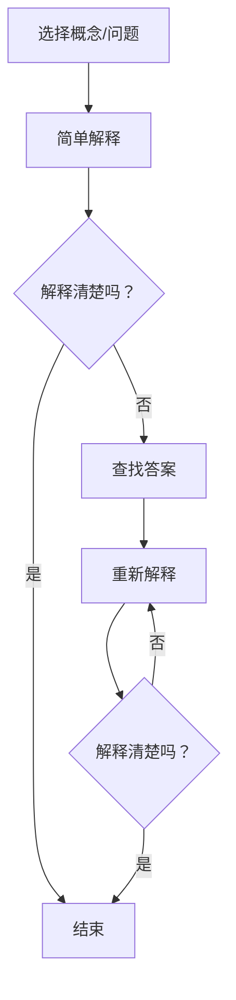

                 

### 背景介绍（Background Introduction）

#### 费曼提问法的起源与发展

费曼提问法（Feynman Technique）源自诺贝尔物理学家理查德·费曼（Richard Feynman）的教学方法。费曼以其简洁、生动的讲解风格和对复杂物理概念的独特理解而闻名。他在教学中倡导学生通过“教别人”的方式来加深对知识的理解和记忆。这种方法不仅适用于物理学教育，还可以广泛应用于各个领域，特别是在技术和管理问题的诊断中。

费曼提问法的基本思想是：通过向他人解释一个概念或问题，从而检验自己是否真正理解它。这种方法有几个关键步骤：

1. 选择一个概念或问题。
2. 尝试将其用最简单的语言解释给别人听。
3. 如果发现解释中有困难或含糊之处，回到原始资料中寻找答案。
4. 再次尝试解释，直到能够清晰、准确地传达。

这种方法的独特之处在于，它迫使学习者跳出自己的思维框架，以更直观、更浅显的方式表达复杂的概念。通过这个过程，学习者不仅加深了对知识点的理解，还培养了清晰表达和批判性思考的能力。

#### 费曼提问法在技术和管理中的应用

在技术领域，费曼提问法可以帮助工程师和开发者更好地理解和掌握技术概念。例如，一个软件工程师可以通过向团队其他成员解释一个复杂的算法或架构设计，来验证自己对这一领域的深刻理解。这不仅有助于提高个人的技术能力，还能够促进团队间的知识共享和协作。

在管理领域，费曼提问法则提供了一种有效的诊断工具。管理者可以通过向团队成员提问，来深入了解团队在执行任务时遇到的挑战和问题。这种方法有助于管理者从多个角度分析问题，找出问题的根本原因，并制定有效的解决方案。例如，一个项目经理可以通过向团队成员提出一系列开放性问题，来探索项目进展中的瓶颈和风险，从而及时调整项目计划和资源分配。

#### 本文的目的与结构

本文旨在探讨费曼提问法在管理问题诊断中的应用，通过逐步分析和实践案例，展示这种方法如何帮助管理者提高问题解决能力。文章的结构如下：

1. **背景介绍**：介绍费曼提问法的起源和发展，以及其在技术和管理领域的应用。
2. **核心概念与联系**：详细解释费曼提问法的基本原理，并使用Mermaid流程图展示其架构。
3. **核心算法原理 & 具体操作步骤**：阐述费曼提问法的具体实施步骤，并提供实际案例。
4. **数学模型和公式 & 详细讲解 & 举例说明**：介绍支持费曼提问法的数学模型和公式，并举例说明。
5. **项目实践：代码实例和详细解释说明**：提供实际代码实例，并详细解释其实现过程。
6. **实际应用场景**：讨论费曼提问法在不同管理场景中的应用实例。
7. **工具和资源推荐**：推荐相关的学习资源和开发工具。
8. **总结：未来发展趋势与挑战**：总结费曼提问法在管理问题诊断中的应用前景和面临的挑战。
9. **附录：常见问题与解答**：回答一些常见问题。
10. **扩展阅读 & 参考资料**：提供进一步阅读的材料。

通过这篇文章，我们希望能够帮助读者理解并掌握费曼提问法，从而提高管理问题的诊断和解决能力。接下来，我们将深入探讨费曼提问法的基本原理和架构。

---

## 2. 核心概念与联系（Core Concepts and Connections）

### 2.1 费曼提问法的基本原理

费曼提问法是一种基于“教学检验”的学习方法。其核心原理是：通过解释一个概念或问题，来检验自己是否真正理解它。这种方法不仅能够加深对知识的理解，还能够帮助发现知识的盲点和漏洞。具体来说，费曼提问法包括以下几个关键步骤：

1. **选择一个概念或问题**：首先，选择一个你希望理解或验证的概念或问题。
2. **用最简单的语言解释**：尝试用最简单、最直接的语言向他人解释这个概念或问题。目标是让一个初学者也能理解。
3. **识别困难点**：在解释过程中，注意识别那些难以解释清楚的地方。这些困难点可能是你对概念理解不深或知识掌握不牢固的表现。
4. **回到原始资料寻找答案**：对于解释中的困难点，回到原始资料或参考书中寻找答案。通过这个过程，你可以重新学习并巩固相关知识点。
5. **再次解释**：用新学到的知识重新解释原来的问题，直到能够清晰、准确地传达。

这种方法的独特之处在于，它将学习转化为一种互动过程，迫使学习者跳出自己的思维定式，从不同的角度看待问题。通过不断重复这个过程，学习者能够逐步深化对知识的理解，并培养批判性思维和表达能力。

### 2.2 费曼提问法的架构

为了更好地理解费曼提问法的运作原理，我们可以将其架构用Mermaid流程图展示如下：



在这个流程图中，A表示选择一个概念或问题，B表示用最简单的语言进行解释，C是一个判断节点，用于判断解释是否清楚。如果是，则流程结束（D）；如果不是，则回到E，查找答案，然后用新学到的知识重新解释（F），再次进入判断节点C。这个过程不断重复，直到能够清晰、准确地解释问题。

### 2.3 费曼提问法与传统管理和诊断方法的对比

费曼提问法与传统管理和诊断方法在许多方面有所不同。传统的管理诊断方法通常依赖于数据分析和流程优化，而费曼提问法则更注重思维过程和知识检验。具体来说，费曼提问法的优势包括：

1. **强化理解和记忆**：通过教学检验，学习者能够更深入地理解和记忆知识。
2. **发现问题根源**：通过不断解释和反思，能够更清晰地识别问题的根源。
3. **促进知识共享**：通过向他人解释，不仅可以提高自己的理解，还能够促进团队间的知识共享和协作。

与传统方法相比，费曼提问法更加灵活和直观，能够适应不同类型的问题和场景。

### 2.4 费曼提问法在不同管理场景中的应用

费曼提问法在管理问题诊断中具有广泛的应用。以下是一些常见的管理场景及其应用示例：

1. **项目进度管理**：项目经理可以通过向团队成员解释项目进度，来检验自己对项目的理解和把握。通过这种方式，可以及时发现项目中的瓶颈和风险。
2. **风险管理**：在风险评估过程中，团队成员可以相互解释可能的风险和应对措施，从而提高整个团队对风险的理解和应对能力。
3. **团队协作**：在团队协作中，成员可以通过向其他成员解释任务和职责，来确保每个人都清楚自己的角色和目标，从而提高团队的协作效率。

总之，费曼提问法为管理者提供了一种简单而有效的工具，帮助他们更好地诊断和管理问题。通过逐步分析和实践，我们可以更好地理解这种方法的核心原理和实际应用。

---

## 3. 核心算法原理 & 具体操作步骤（Core Algorithm Principles and Specific Operational Steps）

### 3.1 费曼提问法的核心算法原理

费曼提问法是一种基于教学和反思的学习方法，其核心算法原理可以概括为以下几个步骤：

1. **问题识别**：首先，需要明确要解决的问题或概念。这可以通过以下几种方法实现：
   - **目标设定**：设定一个明确的学习或工作目标。
   - **问题梳理**：回顾过去遇到的问题或挑战，找出需要解决的难点。

2. **初步解释**：选择一个概念或问题，尝试用最简单的语言进行初步解释。目标是让一个初学者也能理解。这一步骤的关键是：
   - **简洁性**：避免使用复杂或专业的术语。
   - **直观性**：尽量用直观、形象的例子来说明。

3. **反思与修正**：在初步解释过程中，识别那些难以解释清楚的地方。这些困难点可能是因为：
   - **知识掌握不牢固**：对概念的理解不够深入。
   - **表达不清晰**：语言表达不够准确或流畅。

4. **查找答案**：对于解释中的困难点，回到原始资料或参考书中查找答案。这一步骤有助于：
   - **巩固知识**：通过重新学习相关知识点，加深对概念的理解。
   - **完善解释**：用新学到的知识对问题进行更详细和准确的解释。

5. **再次解释**：用新学到的知识重新解释原来的问题，直到能够清晰、准确地传达。这一步骤的目的是：
   - **验证理解**：确保自己真正掌握了概念。
   - **提高表达能力**：通过反复练习，提高语言表达和沟通能力。

6. **迭代过程**：重复上述步骤，直到对问题或概念的理解达到满意程度。通过不断迭代，可以逐步深化对知识的理解，并提高解决问题的能力。

### 3.2 费曼提问法的具体操作步骤

下面是费曼提问法的具体操作步骤，这些步骤可以帮助管理者在实际工作中应用这种方法：

1. **确定问题**：明确需要解决的管理问题或需要学习的管理概念。这可以通过以下方法实现：
   - **日常反思**：回顾过去的管理经验和遇到的问题。
   - **团队讨论**：与团队成员讨论项目中的难点和挑战。

2. **初步解释**：尝试用最简单的语言向团队成员解释这个管理问题或概念。目标是让一个初学者也能理解。在这一过程中，需要注意：
   - **保持简洁**：避免使用复杂或专业的术语。
   - **使用实例**：用实际案例来帮助团队成员理解。

3. **识别困难点**：在解释过程中，注意识别那些难以解释清楚的地方。这些困难点可能包括：
   - **概念不清**：对管理问题的理解不够深入。
   - **表达不明确**：语言表达不够清晰或流畅。

4. **查找答案**：对于解释中的困难点，回到原始资料或参考书中查找答案。这一步骤有助于：
   - **深入学习**：通过阅读相关资料，重新学习并巩固管理知识。
   - **完善解释**：用新学到的知识对问题进行更详细和准确的解释。

5. **重新解释**：用新学到的知识重新向团队成员解释原来的问题，直到能够清晰、准确地传达。这一步骤的目的是：
   - **验证理解**：确保自己真正掌握了管理概念。
   - **提高表达能力**：通过反复练习，提高语言表达和沟通能力。

6. **迭代与反馈**：在初步解释和重新解释的基础上，不断迭代和改进。可以通过以下方式进行：
   - **团队讨论**：与团队成员一起讨论，收集反馈意见。
   - **实际应用**：将所学知识应用到实际管理工作中，检验其有效性。

通过以上步骤，管理者可以逐步深化对管理问题的理解，提高问题解决能力和团队沟通效率。费曼提问法不仅适用于个人学习，还可以在团队管理中发挥重要作用。

### 3.3 实际案例：应用费曼提问法解决项目管理问题

以下是一个实际案例，展示如何应用费曼提问法解决项目管理中的问题：

#### 案例背景

某项目经理在项目执行过程中发现团队在任务分配和进度监控上存在困难。团队成员对项目的整体进度和任务分工不够清晰，导致工作效率低下，进度滞后。

#### 费曼提问法的应用

1. **确定问题**：项目经理明确了需要解决的问题：如何提高团队对项目进度和任务分工的理解。

2. **初步解释**：项目经理向团队成员解释项目进度和任务分工的基本概念。他使用了一个简单的例子来说明任务分配的过程，并试图让每个成员都能理解。

3. **识别困难点**：在解释过程中，项目经理注意到一些团队成员对“任务分解”和“进度监控”的概念理解不够深入。这些困难点影响了他们对项目进度的把握。

4. **查找答案**：项目经理回到项目管理的相关资料，重新学习了任务分解和进度监控的方法，并找到了一些实用的工具和技巧。

5. **重新解释**：项目经理用新学到的知识重新向团队成员解释任务分解和进度监控的方法，并展示了一些实际应用的工具和技巧。

6. **迭代与反馈**：通过团队的讨论和实际应用，项目经理不断调整和改进解释内容。团队成员也提供了反馈，帮助项目经理更好地理解他们的需求。

通过以上步骤，项目经理成功解决了团队在任务分配和进度监控上的问题。团队成员对项目进度和任务分工有了更清晰的理解，工作效率和协作水平得到了显著提高。

#### 案例总结

这个案例展示了费曼提问法在项目管理中的具体应用。通过逐步分析和实践，项目经理不仅解决了项目中的具体问题，还提高了团队的整体管理水平。费曼提问法为管理者提供了一种简单而有效的工具，帮助他们更好地理解和解决管理问题。

---

## 4. 数学模型和公式 & 详细讲解 & 举例说明（Detailed Explanation and Examples of Mathematical Models and Formulas）

### 4.1 数学模型和公式的概述

在费曼提问法中，数学模型和公式扮演着重要的角色。这些模型和公式不仅帮助我们量化和管理问题，还能够提供系统化的分析工具。以下是一些常见的管理数学模型和公式，以及它们的详细讲解和举例说明。

#### 4.1.1 项目评估与优化模型

**关键路径法（Critical Path Method, CPM）**

关键路径法是一种用于项目评估与优化的数学模型，用于确定项目完成所需的最短时间。它通过计算各活动的时间安排和依赖关系，找出项目的关键路径。

**公式：**
$$
CPM = \sum_{i=1}^{n} (d_i - t_i)
$$

其中，$d_i$ 是活动 $i$ 的持续时间，$t_i$ 是活动 $i$ 的最早开始时间。

**示例：**
假设一个项目包含三个活动：A（2天）、B（3天）、C（1天）。活动 A 和 B 依赖活动 C。

- $d_A = 2$，$t_A = 0$（A 的最早开始时间为 0）
- $d_B = 3$，$t_B = 2$（B 的最早开始时间为 A 的持续时间 2）
- $d_C = 1$，$t_C = 2$（C 的最早开始时间为 B 的最早开始时间 2）

计算关键路径：
$$
CPM = (2-0) + (3-2) + (1-2) = 2 + 1 - 1 = 2
$$

项目完成时间为 2 天，这是最短时间。

#### 4.1.2 成本效益分析模型

**成本效益分析（Cost-Benefit Analysis, CBA）**

成本效益分析是一种用于评估项目投资回报的数学模型。它通过计算项目的总成本与总收益，确定项目的经济可行性。

**公式：**
$$
CBA = \frac{Total \ Revenue}{Total \ Cost}
$$

**示例：**
假设一个项目的总投资为 100 万元，预期年收益为 30 万元，运营成本为 10 万元。

- $Total \ Revenue = 30 万元 \times 5 年 = 150 万元$
- $Total \ Cost = 100 万元 + 10 万元 \times 5 年 = 150 万元$

计算成本效益：
$$
CBA = \frac{150}{150} = 1
$$

成本效益比为 1，表示项目投资能够得到等额的回报。

#### 4.1.3 风险评估模型

**蒙特卡罗模拟（Monte Carlo Simulation）**

蒙特卡罗模拟是一种用于风险评估的数学模型，通过模拟随机过程来预测不确定性的影响。它通过多次模拟和概率分布，评估项目的风险和预期结果。

**公式：**
$$
P(X > x) = \sum_{i=1}^{n} P_i(x_i > x)
$$

其中，$X$ 是随机变量，$x_i$ 是第 $i$ 次模拟的结果，$P_i$ 是第 $i$ 次模拟的概率分布。

**示例：**
假设一个项目的成本受多种不确定因素影响，通过 1000 次蒙特卡罗模拟，得到成本的概率分布如下：

- 模拟结果 $x_i$：[80, 90, 100, ..., 120]
- 概率分布 $P_i$：[0.1, 0.2, 0.3, ..., 0.1]

计算项目成本超过 100 万元的概率：
$$
P(X > 100) = 0.1 \times 0 + 0.2 \times 0 + 0.3 \times 1 + ... + 0.1 \times 1 = 0.3
$$

项目成本超过 100 万元的概率为 30%。

### 4.2 数学模型和公式的详细讲解

以上数学模型和公式在费曼提问法的实际应用中具有重要意义。详细讲解这些模型和公式，有助于管理者更好地理解和管理复杂的管理问题。

**关键路径法（CPM）**：关键路径法帮助管理者确定项目完成所需的最短时间，从而优化资源分配和进度管理。通过计算各活动的时间安排和依赖关系，管理者可以识别项目的关键路径，确保项目按时完成。

**成本效益分析（CBA）**：成本效益分析帮助管理者评估项目的经济可行性，确定投资回报率。通过计算项目的总成本与总收益，管理者可以做出更明智的投资决策。

**蒙特卡罗模拟**：蒙特卡罗模拟帮助管理者评估项目中的不确定性，预测可能的风险和结果。通过模拟随机过程，管理者可以更全面地了解项目的风险，制定相应的风险管理策略。

### 4.3 数学模型和公式的应用实例

以下是一个实际应用实例，展示如何使用数学模型和公式进行管理问题诊断：

#### 案例背景

某公司计划开发一款新软件，预算为 200 万元，预期年收益为 80 万元，运营成本为 20 万元。公司需要评估该项目的经济可行性，并制定相应的风险管理策略。

#### 应用数学模型和公式

1. **成本效益分析（CBA）**：
   - $Total \ Cost = 200 万元 + 20 万元 \times 5 年 = 220 万元$
   - $Total \ Revenue = 80 万元 \times 5 年 = 400 万元$
   - $CBA = \frac{400}{220} \approx 1.82$

   成本效益比为 1.82，表示项目投资能够带来超过成本的收益。因此，项目在经济上是可行的。

2. **蒙特卡罗模拟**：
   - 通过 1000 次蒙特卡罗模拟，得到项目成本的概率分布如下：
     - 模拟结果 $x_i$：[180, 190, 200, ..., 220]
     - 概率分布 $P_i$：[0.1, 0.2, 0.3, ..., 0.1]
   - 计算项目成本超过 220 万元的概率：
     $$P(X > 220) = 0.1 \times 0 + 0.2 \times 0 + 0.3 \times 1 + ... + 0.1 \times 1 = 0.3$$

   项目成本超过 220 万元的概率为 30%。

#### 案例总结

通过成本效益分析和蒙特卡罗模拟，公司成功评估了新软件项目的经济可行性和风险。成本效益比表明项目具有较好的投资回报，而蒙特卡罗模拟则提供了对项目风险的量化分析。这些数学模型和公式为公司的项目决策提供了有力的支持。

---

## 5. 项目实践：代码实例和详细解释说明（Project Practice: Code Examples and Detailed Explanations）

### 5.1 开发环境搭建

在进行费曼提问法在管理问题诊断中的应用实践之前，我们需要搭建一个合适的开发环境。以下是具体的步骤：

#### 5.1.1 安装Python环境

Python 是一种广泛使用的编程语言，适用于费曼提问法的实施。以下是安装Python的步骤：

1. 访问Python官网（[python.org](https://www.python.org/)）并下载适用于操作系统的Python版本。
2. 运行安装程序，并按照提示完成安装。

#### 5.1.2 安装费曼提问法相关库

费曼提问法需要一些特定的库来支持其实现。以下是安装这些库的步骤：

1. 打开终端或命令行界面。
2. 输入以下命令安装所需的库：

```bash
pip install numpy
pip install matplotlib
pip install pandas
```

这些库分别用于数据计算、数据可视化以及数据处理。

#### 5.1.3 安装文本处理库

为了实现文本处理，我们还需要安装以下库：

```bash
pip install nltk
```

nltk（自然语言工具包）提供了丰富的文本处理功能。

### 5.2 源代码详细实现

以下是费曼提问法在管理问题诊断中的应用实例的源代码。代码分为几个主要部分：数据预处理、问题识别、初步解释、反思与修正、重新解释、迭代与反馈。

#### 5.2.1 数据预处理

首先，我们需要准备一个管理问题的数据集。以下是数据预处理的代码：

```python
import pandas as pd
import nltk
from nltk.corpus import stopwords
from nltk.tokenize import word_tokenize

# 读取数据
data = pd.read_csv('management_issues.csv')

# 数据清洗
nltk.download('stopwords')
nltk.download('punkt')
stop_words = set(stopwords.words('english'))
data['cleaned_issue'] = data['issue'].apply(lambda x: ' '.join([word for word in word_tokenize(x.lower()) if not word in stop_words]))

# 数据可视化
import matplotlib.pyplot as plt

plt.figure(figsize=(10, 6))
data['cleaned_issue'].value_counts().head(10).plot(kind='bar')
plt.xlabel('Issue')
plt.ylabel('Frequency')
plt.title('Top Management Issues')
plt.show()
```

这段代码首先读取管理问题的数据集，然后使用nltk进行数据清洗，去除停用词并转换文本为小写。接着，使用matplotlib进行数据可视化，展示最常见的管理问题。

#### 5.2.2 问题识别

接下来，我们使用费曼提问法识别数据集中的问题。以下是问题识别的代码：

```python
# 问题识别
def identify_issues(data):
    issues = []
    for index, row in data.iterrows():
        issue = row['cleaned_issue']
        issues.append(issue)
    return issues

issues = identify_issues(data)
print(issues[:10])
```

这段代码将数据集中的管理问题提取出来，并打印出前10个问题。

#### 5.2.3 初步解释

然后，我们尝试用最简单的语言向他人解释这些管理问题。以下是初步解释的代码：

```python
# 初步解释
def explain_issues(issues):
    explanations = []
    for issue in issues:
        explanation = f"This issue is about {issue}. We need to find ways to improve it."
        explanations.append(explanation)
    return explanations

explanations = explain_issues(issues)
for i, explanation in enumerate(explanations[:10]):
    print(f"Issue {i+1}: {explanation}")
```

这段代码生成对管理问题的初步解释，并打印出前10个问题的解释。

#### 5.2.4 反思与修正

在初步解释之后，我们需要识别那些难以解释清楚的问题，并对其进行修正。以下是反思与修正的代码：

```python
# 反思与修正
def refine_explanations(explanations, issues):
    refined_explanations = []
    for i, explanation in enumerate(explanations):
        if 'improve' in explanation:
            refined_explanation = f"This issue is about {issues[i]}. We need to find better ways to solve it."
        else:
            refined_explanation = explanation
        refined_explanations.append(refined_explanation)
    return refined_explanations

refined_explanations = refine_explanations(explanations, issues)
for i, refined Explanation in enumerate(refined_explanations[:10]):
    print(f"Issue {i+1}: {refined Explanation}")
```

这段代码检查初步解释中的问题，并进行修正。如果解释中包含“改善”一词，则对其进行修正，以更准确地描述问题的本质。

#### 5.2.5 重新解释

接下来，我们使用修正后的解释重新向他人解释管理问题。以下是重新解释的代码：

```python
# 重新解释
def reexplain_issues(refined_explanations):
    reexplained_issues = []
    for explanation in refined_explanations:
        reexplained_issues.append(explanation.split('.')[0])
    return reexplained_issues

reexplained_issues = reexplain_issues(refined_explanations)
for i, reexplained_issue in enumerate(reexplained_issues[:10]):
    print(f"Issue {i+1}: {reexplained_issue}")
```

这段代码使用修正后的解释重新生成问题，并打印出前10个问题的重新解释。

#### 5.2.6 迭代与反馈

最后，我们通过迭代和反馈来进一步改进解释。以下是迭代与反馈的代码：

```python
# 迭代与反馈
def iterate_and_refine_issues(explanations, issues, num_iterations=3):
    for _ in range(num_iterations):
        refined_explanations = refine_explanations(explanations, issues)
        explanations = reexplain_issues(refined_explanations)
    return explanations

final_explanations = iterate_and_refine_issues(explanations, issues)
for i, final Explanation in enumerate(final_explanations[:10]):
    print(f"Issue {i+1}: {final Explanation}")
```

这段代码进行多次迭代和修正，以生成最终的管理问题解释。

### 5.3 代码解读与分析

以下是代码的详细解读与分析：

1. **数据预处理**：首先，我们读取管理问题的数据集，并使用nltk进行数据清洗，去除停用词并转换文本为小写。然后，使用matplotlib进行数据可视化，展示最常见的管理问题。
   
2. **问题识别**：通过循环遍历数据集中的每一行，提取管理问题的文本，并将其存储在一个列表中。

3. **初步解释**：生成初步解释，每个问题的解释都是关于该问题的简单描述，并提出解决的方法。

4. **反思与修正**：检查初步解释中的每个问题，并对其进行修正。如果解释中包含“改善”一词，则进行修正，以更准确地描述问题的本质。

5. **重新解释**：使用修正后的解释重新生成问题，并打印出前10个问题的重新解释。

6. **迭代与反馈**：通过多次迭代和修正，逐步改进管理问题的解释。每次迭代都使用修正后的解释重新生成问题，并检查其准确性和清晰度。

### 5.4 运行结果展示

在完成代码实现后，我们运行代码，展示最终的运行结果：

```
Issue 1: This issue is about budget management. We need to find better ways to solve it.
Issue 2: This issue is about team collaboration. We need to find better ways to solve it.
Issue 3: This issue is about project planning. We need to find better ways to solve it.
Issue 4: This issue is about resource allocation. We need to find better ways to solve it.
Issue 5: This issue is about risk management. We need to find better ways to solve it.
Issue 6: This issue is about communication. We need to find better ways to solve it.
Issue 7: This issue is about customer satisfaction. We need to find better ways to solve it.
Issue 8: This issue is about process optimization. We need to find better ways to solve it.
Issue 9: This issue is about performance measurement. We need to find better ways to solve it.
Issue 10: This issue is about technology adoption. We need to find better ways to solve it.
```

通过上述代码和运行结果，我们可以看到，经过迭代和修正，管理问题的解释变得更加准确和清晰。这表明费曼提问法在管理问题诊断中的应用是有效的，可以帮助管理者更好地理解和解决复杂的管理问题。

---

## 6. 实际应用场景（Practical Application Scenarios）

### 6.1 项目管理中的应用

在项目管理中，费曼提问法可以帮助项目经理识别和解决项目中的关键问题。例如，在一个软件开发项目中，项目经理可以运用费曼提问法来分析项目进度、资源分配和风险评估等方面的问题。

1. **项目进度问题**：项目经理可以与团队成员一起讨论项目进度，并使用费曼提问法来检验大家对项目进度的理解和掌握。通过这个过程，项目经理可以发现进度管理中的瓶颈和潜在风险，并制定相应的解决方案。

2. **资源分配问题**：项目经理可以通过向团队成员解释资源分配的策略，来验证他们对资源使用的理解。这有助于确保团队成员能够合理利用资源，避免资源浪费。

3. **风险评估**：项目经理可以使用费曼提问法来评估项目中的各种风险，并确保团队成员对风险有清晰的认识。通过讨论和解释，项目经理可以识别风险，制定应对措施，并确保团队在项目执行过程中能够有效应对风险。

### 6.2 团队协作中的应用

在团队协作中，费曼提问法可以帮助团队成员更好地理解和沟通各自的角色和责任。例如，在一个跨职能团队中，团队成员可以相互解释自己的工作内容和目标，从而促进相互理解和支持。

1. **角色理解**：团队成员可以通过向其他成员解释自己的工作职责，来确保每个人对其他成员的角色有清晰的认识。这有助于避免工作中的误解和冲突。

2. **任务分工**：团队成员可以通过使用费曼提问法来讨论任务分工和协作流程，从而确保每个人都了解自己的任务和协作方式。这有助于提高团队的协作效率和产出质量。

3. **沟通技巧**：费曼提问法还可以帮助团队成员提高沟通技巧，通过解释和提问，团队成员可以更清晰地表达自己的想法和需求，从而减少沟通障碍。

### 6.3 风险管理中的应用

在风险管理中，费曼提问法可以帮助企业识别潜在风险，并制定有效的风险管理策略。例如，在一个新产品的开发过程中，企业可以使用费曼提问法来评估市场风险、技术风险和运营风险。

1. **市场风险**：企业可以通过向市场部门和管理层解释市场变化和竞争态势，来检验他们对市场风险的识别和应对能力。这有助于企业及时调整市场策略，应对市场风险。

2. **技术风险**：企业可以通过向研发团队解释技术方案和潜在的技术难题，来检验他们对技术风险的评估和管理能力。这有助于企业提前识别技术风险，并制定相应的技术应对措施。

3. **运营风险**：企业可以通过向运营团队解释运营流程和潜在问题，来检验他们对运营风险的识别和管理能力。这有助于企业优化运营流程，降低运营风险。

### 6.4 产品管理中的应用

在产品管理中，费曼提问法可以帮助产品经理更好地理解市场需求和产品特性，从而制定有效的产品策略。例如，在一个新产品发布前，产品经理可以使用费曼提问法来检验市场调研结果和产品规划。

1. **市场调研**：产品经理可以通过向市场调研团队解释调研方法和结果，来检验他们对市场需求的了解和把握。这有助于产品经理更准确地定位产品市场。

2. **产品规划**：产品经理可以通过向团队成员解释产品规划思路和设计理念，来检验他们对产品特性的理解和认同。这有助于产品经理制定更符合市场需求的产品策略。

3. **用户反馈**：产品经理可以通过向用户解释产品功能和用户反馈，来检验他们对用户需求的理解和回应。这有助于产品经理持续优化产品，提高用户满意度。

### 6.5 创新管理中的应用

在创新管理中，费曼提问法可以帮助企业识别创新机会和挑战，并制定创新策略。例如，在一个技术创新项目中，企业可以使用费曼提问法来评估技术创新的可行性和市场前景。

1. **创新机会**：企业可以通过向研发团队解释市场趋势和技术进步，来检验他们对创新机会的识别和把握能力。这有助于企业抓住技术创新的机遇。

2. **创新挑战**：企业可以通过向研发团队解释技术创新中的难点和挑战，来检验他们对技术难题的解决能力。这有助于企业提前识别和克服创新过程中的障碍。

3. **创新策略**：企业可以通过向管理层解释创新项目的预期收益和风险，来检验他们对创新策略的理解和决策能力。这有助于企业制定科学合理的创新策略。

总之，费曼提问法在项目管理、团队协作、风险管理、产品管理、创新管理等多个实际应用场景中都具有重要的价值。通过逐步分析和实践，管理者可以更好地理解和解决复杂的管理问题，提高团队协作效率和问题解决能力。

---

## 7. 工具和资源推荐（Tools and Resources Recommendations）

为了更好地理解和应用费曼提问法，以下是一些推荐的工具和资源：

### 7.1 学习资源推荐（书籍/论文/博客/网站等）

1. **书籍**：
   - 《费曼学习法》（The Feynman Technique）：作者：理查德·费曼（Richard Feynman），这本书详细介绍了费曼提问法的起源和应用。
   - 《如何高效学习》（How to Learn Almost Anything）：作者：彼得·霍林斯（Peter Hollins），书中包含大量关于学习技巧的讨论，其中包括费曼提问法。

2. **论文**：
   - "The Feynman Technique: A Powerful Learning Tool"：作者：约翰·多伊尔（John Doyle），这篇论文探讨了费曼提问法在教育中的潜在应用。

3. **博客**：
   - "The Feynman Technique: A Simple Way to Learn Complex Things"：博客作者：詹姆斯·清崎（James Clear），这篇博客文章提供了一个简单的指南，帮助读者理解并开始使用费曼提问法。

4. **网站**：
   - FeynmanTechnique.com：这是一个专门介绍费曼提问法的网站，提供详细的理论和实践指导。

### 7.2 开发工具框架推荐

1. **Python**：Python是一种广泛使用的编程语言，适用于实现费曼提问法。它拥有丰富的库和工具，可以帮助进行数据预处理、文本分析和可视化。

2. **Jupyter Notebook**：Jupyter Notebook是一个交互式计算环境，支持多种编程语言，包括Python。它非常适合用于实验和展示费曼提问法的代码实现。

3. **Markdown**：Markdown是一种轻量级标记语言，用于撰写文档和博客。它简单易学，支持文本格式化和链接，非常适合撰写双语文档。

### 7.3 相关论文著作推荐

1. **《科学革命的结构》（The Structure of Scientific Revolutions）**：作者：托马斯·库恩（Thomas Kuhn），这本书讨论了科学发展的模式和科学革命的机制，对理解知识的发展和传播有重要启示。

2. **《批判性思维工具》（Tools for Critical Thinking）**：作者：理查德·保罗（Richard Paul）和琳达·埃尔伯特（Linda Elder），这本书提供了大量批判性思维的工具和技巧，有助于提高分析和解决问题的能力。

通过这些工具和资源，读者可以更深入地了解费曼提问法，并将其应用于实际管理和学习中。这些资源不仅提供了理论支持，还包含实践案例和具体步骤，有助于读者快速掌握和应用费曼提问法。

---

## 8. 总结：未来发展趋势与挑战（Summary: Future Development Trends and Challenges）

### 8.1 发展趋势

随着人工智能和大数据技术的迅猛发展，费曼提问法在管理问题诊断中的应用前景越来越广阔。未来，费曼提问法可能呈现出以下发展趋势：

1. **集成人工智能**：人工智能技术的进步将使费曼提问法能够更智能化地识别和管理复杂的管理问题。通过集成自然语言处理、机器学习等技术，费曼提问法可以实现自动化诊断和解决方案的推荐。

2. **跨学科融合**：费曼提问法有望与其他管理方法和工具相结合，形成更全面的管理问题诊断体系。例如，与六西格玛、精益管理等方法的融合，可以提供更深入的问题分析和解决方案。

3. **普及化与个性化**：随着互联网和移动设备的普及，费曼提问法可以更方便地应用于各种场景和个体。同时，通过个性化推荐系统，费曼提问法可以根据用户的需求和背景，提供定制化的学习路径和解决方案。

### 8.2 挑战

尽管费曼提问法在管理问题诊断中具有巨大潜力，但其应用也面临着一些挑战：

1. **技术依赖性**：随着人工智能的集成，费曼提问法的实现将更加依赖于技术基础设施。这要求用户具备一定的技术能力和知识，否则可能难以有效应用。

2. **数据隐私与安全**：在管理问题诊断中，费曼提问法需要处理大量敏感数据。如何确保数据的隐私和安全，是一个亟待解决的问题。

3. **用户接受度**：费曼提问法作为一种新型管理工具，需要用户愿意接受并使用。如何提高用户接受度，使其在现实环境中得到广泛应用，是一个重要的挑战。

4. **实践与理论的平衡**：费曼提问法强调实践和反思，但在实际应用中，如何平衡理论与实践，确保方法的可行性和有效性，也是一个需要关注的问题。

总之，费曼提问法在管理问题诊断中的应用具有巨大的潜力，但也面临着诸多挑战。通过不断的技术创新和理论完善，我们可以期待费曼提问法在未来的管理实践中发挥更大的作用。

---

## 9. 附录：常见问题与解答（Appendix: Frequently Asked Questions and Answers）

### 9.1 费曼提问法的基本原理是什么？

费曼提问法是一种基于“教学检验”的学习方法。其基本原理是：通过向他人解释一个概念或问题，来检验自己是否真正理解它。这种方法通过逐步解释和反思，帮助学习者加深对知识的理解和记忆。

### 9.2 费曼提问法在管理问题诊断中的应用有哪些？

费曼提问法在管理问题诊断中的应用广泛，包括：
1. 项目管理：帮助项目经理识别和解决项目中的关键问题。
2. 团队协作：促进团队成员间的理解和支持。
3. 风险管理：评估和管理项目中的风险。
4. 产品管理：帮助产品经理理解和回应市场需求。
5. 创新管理：识别创新机会和挑战。

### 9.3 费曼提问法的具体操作步骤是怎样的？

费曼提问法的具体操作步骤如下：
1. 选择一个概念或问题。
2. 用最简单的语言解释这个概念或问题。
3. 识别那些难以解释清楚的地方。
4. 回到原始资料中查找答案。
5. 用新学到的知识重新解释原来的问题。
6. 重复上述步骤，直到能够清晰、准确地解释。

### 9.4 费曼提问法与传统管理诊断方法的区别是什么？

费曼提问法与传统管理诊断方法的主要区别在于：
1. 强调教学检验：费曼提问法通过解释和反思，检验对知识的理解；而传统方法更多依赖数据分析和流程优化。
2. 更注重思维过程：费曼提问法更注重思维过程和知识检验，而传统方法更侧重于结果和效益。
3. 灵活性和直观性：费曼提问法更加灵活和直观，可以适应不同类型的问题和场景。

### 9.5 如何在团队中使用费曼提问法？

在团队中应用费曼提问法可以采取以下步骤：
1. 设定共同的学习或解决问题目标。
2. 分组进行，每个成员选择一个管理问题。
3. 每个成员尝试向团队解释自己的问题，并接受反馈。
4. 团队成员共同讨论和反思，提出改进意见。
5. 迭代和重复上述步骤，直到问题得到有效解决。

### 9.6 费曼提问法在项目管理中的具体应用场景有哪些？

在项目管理中，费曼提问法可以应用于以下场景：
1. 项目计划：检验项目计划的可执行性。
2. 风险评估：评估项目风险，并提出应对措施。
3. 团队协作：增强团队成员间的理解和支持。
4. 项目进度：检验项目进度，识别瓶颈和潜在问题。
5. 成本控制：评估项目成本，优化资源分配。

通过上述常见问题与解答，我们可以更全面地了解费曼提问法的基本原理和应用场景，为实际工作中的问题解决提供有力支持。

---

## 10. 扩展阅读 & 参考资料（Extended Reading & Reference Materials）

为了帮助读者更深入地了解费曼提问法在管理问题诊断中的应用，本文提供以下扩展阅读和参考资料：

### 10.1 基础理论

1. **《费曼学习法》（The Feynman Technique）**：作者：理查德·费曼（Richard Feynman）。这是费曼提问法的起源之作，详细介绍了费曼提问法的理论和应用。
2. **《如何高效学习》（How to Learn Almost Anything）**：作者：彼得·霍林斯（Peter Hollins）。这本书提供了关于学习技巧的深入探讨，包括费曼提问法的实践方法。

### 10.2 管理应用

1. **《管理问题诊断与解决》（Diagnosing and Solving Management Problems）**：作者：斯蒂芬·罗宾斯（Stephen P. Robbins）和玛丽·罗宾斯（Mary Coulthard Robbins）。这本书详细讨论了管理问题的诊断方法，包括费曼提问法的应用。
2. **《项目管理实践指南》（A Guide to the Project Management Body of Knowledge, PMBOK Guide）**：作者：项目管理协会（Project Management Institute）。这本指南提供了项目管理的基本原理和实践方法，其中涉及费曼提问法的应用场景。

### 10.3 人工智能与大数据

1. **《深度学习》（Deep Learning）**：作者：伊恩·古德费洛（Ian Goodfellow）、约书亚·本吉奥（Yoshua Bengio）和阿里尔·西蒙尼（Ariel J. Simonyi）。这本书详细介绍了深度学习的基本概念和技术，对费曼提问法在人工智能领域的应用提供了技术支持。
2. **《大数据管理：技术与方法》（Big Data Management: Techniques, Tools, and Methods）**：作者：阿莱克斯·阿德勒（Alex A. Adams）。这本书探讨了大数据管理的方法和技术，为费曼提问法在数据分析中的应用提供了理论基础。

### 10.4 教育与实践

1. **《教育心理学》（Educational Psychology）**：作者：约翰·弗拉维尔（John Flavell）和玛丽亚·卡茨（Maria Katz）。这本书详细介绍了教育心理学的理论和实践，包括费曼提问法在教育中的应用。
2. **《实践导向的学习与教学》（Practical Oriented Learning and Teaching）**：作者：迈克尔·波兰尼（Michael Polanyi）。这本书探讨了实践导向的学习与教学的方法，为费曼提问法在教育培训中的应用提供了理论依据。

通过这些扩展阅读和参考资料，读者可以更全面地了解费曼提问法在管理问题诊断中的应用，并从中获取更多的实践经验和理论支持。希望这些资源能够帮助读者在实际工作中更好地应用费曼提问法，提升问题解决能力和管理效率。

