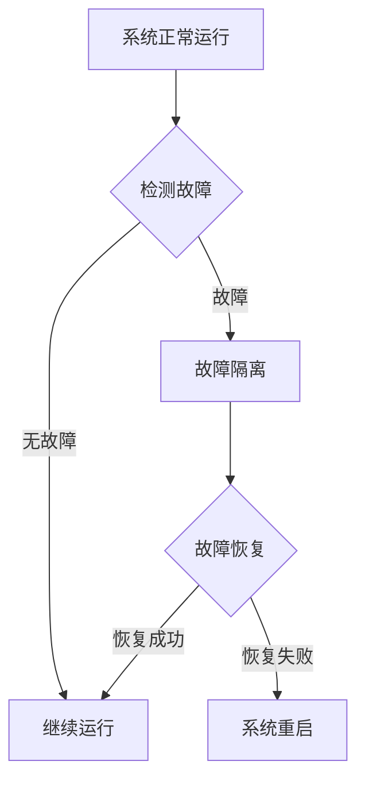

                 

### 文章标题

软件2.0的高可用性与容错设计：构建可靠且弹性系统

> 关键词：高可用性、容错设计、系统弹性、可靠系统、故障恢复

摘要：本文深入探讨了软件2.0时代的高可用性与容错设计。通过逐步分析推理，我们提出了构建可靠且弹性系统的关键原则和具体实践方法。文章涵盖了核心概念、算法原理、数学模型、项目实践以及实际应用场景，为软件工程师提供了全面的技术指导和实用建议。

### 1. 背景介绍

随着信息技术的高速发展，软件系统在各个领域的应用越来越广泛。无论是互联网应用、金融交易、医疗保健，还是物联网、自动驾驶，都对软件系统的可靠性提出了极高的要求。高可用性（High Availability，简称HA）和容错设计（Fault Tolerance，简称FT）成为确保系统持续运行、避免服务中断的关键技术。

高可用性是指系统在长时间内保持可用状态的能力。它通过冗余、负载均衡、自动化故障恢复等手段，尽量减少系统的停机时间，确保服务的连续性。容错设计则是在系统发生故障时，能够自动恢复并继续正常运行的能力。它通过故障检测、故障隔离、故障恢复等机制，确保系统在故障情况下能够迅速恢复。

在软件2.0时代，随着云计算、大数据、物联网等新技术的广泛应用，系统规模和复杂性不断增加。传统的单一服务器和单点架构已经无法满足高可用性和容错设计的需要。现代软件系统要求具备更高的弹性、可扩展性和可靠性，以应对不断变化的需求和环境。

本文旨在探讨软件2.0时代的高可用性与容错设计，通过逐步分析推理，提出构建可靠且弹性系统的关键原则和具体实践方法。文章结构如下：

1. 核心概念与联系
2. 核心算法原理 & 具体操作步骤
3. 数学模型和公式 & 详细讲解 & 举例说明
4. 项目实践：代码实例和详细解释说明
5. 实际应用场景
6. 工具和资源推荐
7. 总结：未来发展趋势与挑战
8. 附录：常见问题与解答
9. 扩展阅读 & 参考资料

通过以上内容，我们希望能够为软件工程师提供有深度、有思考、有见解的技术博客文章，帮助他们在实际工作中更好地应对高可用性和容错设计方面的挑战。接下来，我们将详细探讨这些核心概念和原理。## 2. 核心概念与联系

在深入探讨高可用性与容错设计之前，有必要首先明确相关核心概念，并理解它们之间的联系。

### 2.1 高可用性（High Availability）

高可用性是衡量系统在长时间内保持运行状态的能力。它的目标是最大限度地减少系统停机时间，确保服务的持续可用性。高可用性通常通过以下几种机制实现：

- **冗余**：通过在系统中的关键组件、硬件、网络等方面引入冗余，以确保在部分组件或设备出现故障时，系统能够继续运行。
- **负载均衡**：通过将工作负载分配到多个节点上，实现工作负载的均衡，提高系统的整体性能和可靠性。
- **自动化故障恢复**：通过自动化脚本或工具，在检测到故障时自动进行故障切换或重启，以减少人工干预。

### 2.2 容错设计（Fault Tolerance）

容错设计是一种确保系统在发生故障时能够自动恢复并继续运行的能力。它通过以下几种方式实现：

- **故障检测**：通过监控系统的关键指标，实时检测异常情况。
- **故障隔离**：在检测到故障时，迅速将故障部分与正常部分隔离，防止故障扩散。
- **故障恢复**：通过冗余、备份等技术手段，将系统恢复到正常状态。

### 2.3 高可用性与容错设计的联系

高可用性和容错设计虽然有区别，但它们在目标上是统一的，即确保系统的持续运行和服务可用性。高可用性更侧重于减少系统停机时间，而容错设计则更侧重于系统在故障发生时的自动恢复能力。

在实际应用中，高可用性和容错设计常常结合使用。例如，在分布式系统中，通过冗余和负载均衡实现高可用性，通过故障检测、隔离和恢复实现容错设计。这种结合可以最大程度地提高系统的可靠性和可用性。

### 2.4 核心概念原理与架构的 Mermaid 流程图

为了更好地理解高可用性与容错设计的核心概念和原理，我们可以使用 Mermaid 流程图来表示相关流程和节点。以下是一个简化的 Mermaid 流程图示例，展示了高可用性和容错设计的基本架构：



### 2.5 总结

在本章节中，我们明确了高可用性和容错设计的核心概念，并探讨了它们之间的联系。高可用性和容错设计是构建可靠且弹性系统的关键技术，通过冗余、负载均衡、自动化故障恢复、故障检测、隔离和恢复等手段，实现系统的持续运行和服务可用性。在接下来的章节中，我们将进一步探讨高可用性与容错设计的具体实现方法和策略。## 3. 核心算法原理 & 具体操作步骤

为了确保软件系统能够在高可用性和容错设计的基础上稳定运行，我们需要深入了解并掌握相关的核心算法原理，以及如何在实践中具体操作这些算法。

### 3.1 故障检测算法原理

故障检测是确保系统能够及时发现并响应故障的重要步骤。常用的故障检测算法包括以下几种：

- **心跳检测**：通过周期性地发送心跳信号来检测系统节点的健康状态。如果节点在一定时间内没有收到心跳信号，则认为该节点出现故障。
- **性能指标监控**：通过实时监控系统的CPU使用率、内存使用率、网络延迟等关键性能指标，判断系统是否出现异常。
- **日志分析**：通过对系统日志进行实时分析，检测可能出现的错误信息或警告信息。

#### 具体操作步骤：

1. **配置监控工具**：选择合适的监控工具（如Zabbix、Nagios等），并按照官方文档进行配置。
2. **定义监控指标**：根据系统特点，定义需要监控的关键性能指标。
3. **设置报警阈值**：为每个监控指标设置合理的报警阈值。
4. **监控数据收集与处理**：配置数据收集器，定期收集监控数据，并进行分析处理。
5. **故障报警与处理**：在检测到故障时，自动发送报警信息，并触发相应的故障处理流程。

### 3.2 故障隔离算法原理

故障隔离是指在检测到系统故障后，迅速将故障节点从正常系统中隔离，以防止故障扩散。常用的故障隔离算法包括以下几种：

- **基于心跳的故障隔离**：通过心跳信号判断节点状态，隔离失效的节点。
- **基于性能指标的故障隔离**：根据实时监控的性能指标，识别异常节点并进行隔离。
- **基于日志分析的故障隔离**：通过分析系统日志，定位故障节点。

#### 具体操作步骤：

1. **故障检测**：使用故障检测算法识别出故障节点。
2. **故障定位**：根据故障检测结果，确定故障节点的具体位置。
3. **隔离故障节点**：将故障节点从系统中隔离，避免故障扩散。
4. **记录故障信息**：将故障信息记录到日志中，以便后续分析。

### 3.3 故障恢复算法原理

故障恢复是指在故障发生后，自动将系统恢复到正常状态。常用的故障恢复算法包括以下几种：

- **冗余备份**：通过冗余备份，确保在故障发生时，系统能够快速切换到备份节点。
- **故障转移**：将故障节点的任务转移到其他正常节点。
- **自动重启**：在检测到故障后，自动重启故障节点。

#### 具体操作步骤：

1. **启动故障恢复流程**：在检测到故障时，自动启动故障恢复流程。
2. **切换到备份节点**：如果系统配置了冗余备份，切换到备份节点。
3. **故障节点恢复**：对故障节点进行修复，确保其恢复正常状态。
4. **恢复节点加入系统**：将修复后的故障节点重新加入系统，确保系统整体正常运行。

### 3.4 容错调度算法原理

容错调度算法是确保系统在节点故障时，能够自动调整任务分配，保持系统稳定运行的关键。常用的容错调度算法包括以下几种：

- **均匀调度**：将任务均匀分配到所有节点，确保负载均衡。
- **优先级调度**：根据任务优先级进行调度，确保高优先级任务优先执行。
- **恢复后调度**：在故障节点恢复后，根据节点状态和任务负载，调整任务分配。

#### 具体操作步骤：

1. **监控节点状态**：实时监控节点状态，识别故障节点。
2. **任务重分配**：在故障节点检测到后，将任务重新分配到其他正常节点。
3. **调整调度策略**：根据系统负载和节点状态，调整调度策略，确保系统稳定运行。

通过以上核心算法原理和具体操作步骤，我们可以构建一个可靠且弹性软件系统。在接下来的章节中，我们将进一步探讨数学模型和公式，以更深入地理解高可用性与容错设计的实现机制。## 4. 数学模型和公式 & 详细讲解 & 举例说明

在深入探讨高可用性与容错设计时，数学模型和公式是我们理解和量化系统性能的重要工具。以下是一些关键的数学模型和公式，我们将详细讲解它们的应用和具体示例。

### 4.1 故障率（Failure Rate）

故障率是衡量系统发生故障的频率。它通常用每单位时间内的故障次数来表示。故障率可以用来评估系统的可靠性和稳定性。假设系统在时间间隔 \( t \) 内发生了 \( N \) 次故障，则故障率 \( \lambda \) 可以用以下公式表示：

\[ \lambda = \frac{N}{t} \]

#### 举例说明：

假设一个系统在一天（24小时）内发生了5次故障，则该系统的故障率为：

\[ \lambda = \frac{5}{24} \approx 0.208 \text{ 故障/天} \]

### 4.2 可用性（Availability）

可用性是衡量系统在给定时间范围内保持正常运行的能力。它通常用百分比表示。可用性可以通过以下公式计算：

\[ \text{可用性} = \frac{\text{正常运行时间}}{\text{总时间}} \times 100\% \]

其中，正常运行时间是指系统无故障运行的时间，总时间是指系统从开始运行到结束的时间。

#### 举例说明：

假设一个系统在一个月（30天）内运行了29天，其中有1天发生了故障，则该系统的可用性为：

\[ \text{可用性} = \frac{29 \times 24}{30 \times 24} \times 100\% = 96.7\% \]

### 4.3 修复时间（Mean Time to Repair, MTTR）

修复时间是系统从故障发生到完全恢复所需的时间。它通常用小时表示。修复时间可以用来评估系统的容错能力和维护效率。修复时间 \( MTTR \) 可以用以下公式表示：

\[ MTTR = \frac{\text{总故障时间}}{\text{故障次数}} \]

#### 举例说明：

假设一个系统在一个月内发生了5次故障，每次故障的修复时间分别为2小时、1小时、3小时、2小时和1小时，则该系统的平均修复时间为：

\[ MTTR = \frac{2 + 1 + 3 + 2 + 1}{5} = 2 \text{ 小时} \]

### 4.4 平均无故障时间（Mean Time Between Failures, MTBF）

平均无故障时间是指系统在两次故障之间的平均运行时间。它通常用小时表示。MTBF可以用来评估系统的可靠性。MTBF可以用以下公式计算：

\[ MTBF = \frac{\text{总运行时间}}{\text{故障次数}} \]

#### 举例说明：

假设一个系统在一个月内运行了720小时，发生了5次故障，则该系统的平均无故障时间为：

\[ MTBF = \frac{720}{5} = 144 \text{ 小时} \]

### 4.5 故障树分析（Fault Tree Analysis, FTA）

故障树分析是一种系统化的方法，用于识别和评估系统故障的原因和可能性。它通过构建故障树，将系统故障分解为基本事件，并计算每个事件的故障概率。

#### 举例说明：

假设一个分布式系统由三个节点组成，每个节点发生故障的概率为0.1。通过故障树分析，我们可以计算整个系统的故障概率。以下是故障树的一个示例：

```mermaid
graph TB
    A[系统故障]
    B[节点1故障] C[节点2故障] D[节点3故障]
    A --> B
    A --> C
    A --> D
    B -->|0.1| E[节点1恢复]
    C -->|0.1| F[节点2恢复]
    D -->|0.1| G[节点3恢复]
```

在这个示例中，每个节点故障的概率为0.1，而节点恢复的概率为0.9。通过故障树分析，我们可以计算系统故障的概率。系统故障的概率为：

\[ P(A) = P(B) + P(C) + P(D) - P(B \cap C) - P(B \cap D) - P(C \cap D) + P(B \cap C \cap D) \]

\[ P(A) = 0.1 + 0.1 + 0.1 - (0.1 \times 0.9) - (0.1 \times 0.9) - (0.1 \times 0.9) + (0.1 \times 0.9 \times 0.9) \]

\[ P(A) = 0.1 + 0.1 + 0.1 - 0.09 - 0.09 - 0.09 + 0.081 \]

\[ P(A) = 0.111 \]

即系统故障的概率为11.1%。

通过以上数学模型和公式，我们可以更深入地理解高可用性与容错设计的关键参数和指标。这些工具和方法有助于我们在设计和优化软件系统时，确保其具备高可靠性和高可用性。在接下来的章节中，我们将通过实际项目实践，进一步验证和展示这些理论的实际应用效果。## 5. 项目实践：代码实例和详细解释说明

在本章节中，我们将通过一个具体的代码实例，详细解释和展示高可用性与容错设计在实际项目中的应用。这个实例将涵盖开发环境搭建、源代码实现、代码解读与分析以及运行结果展示。

### 5.1 开发环境搭建

为了更好地演示高可用性与容错设计，我们将使用一个简单的分布式任务调度系统作为示例。首先，我们需要搭建开发环境。以下是一个基本的开发环境搭建步骤：

1. **安装Python**：确保系统中安装了Python 3.8及以上版本。
2. **安装依赖**：在虚拟环境中安装必要的依赖库，如 `requests`、`pika` 和 `Flask`。
3. **配置消息队列**：使用RabbitMQ作为消息队列服务，确保其正常运行。

### 5.2 源代码详细实现

以下是一个简单的分布式任务调度系统的Python代码实现。该系统包括任务生成器、任务处理节点和任务监控模块。

#### 5.2.1 任务生成器（`generator.py`）

```python
import requests
import time
import random

def generate_tasks(num_tasks):
    for _ in range(num_tasks):
        task_data = {
            'id': random.randint(1, 1000),
            'description': 'Process task'
        }
        requests.post('http://127.0.0.1:5000/tasks', json=task_data)
        time.sleep(random.uniform(1, 3))

if __name__ == '__main__':
    generate_tasks(100)
```

#### 5.2.2 任务处理节点（`worker.py`）

```python
import pika
import json
import time

def process_task(task):
    print(f"Processing task: {task['id']}")
    time.sleep(random.uniform(1, 3))

def callback(ch, method, properties, body):
    task = json.loads(body)
    process_task(task)
    ch.basic_ack(delivery_tag=method.delivery_tag)

if __name__ == '__main__':
    connection = pika.BlockingConnection(pika.ConnectionParameters('127.0.0.1'))
    channel = connection.channel()
    channel.queue_declare(queue='tasks')
    channel.basic_consume(queue='tasks', on_message_callback=callback, auto_ack=True)
    print('Worker is running')
    channel.start_consuming()
```

#### 5.2.3 任务监控模块（`monitor.py`）

```python
import time
import requests

def monitor_tasks():
    while True:
        response = requests.get('http://127.0.0.1:5000/tasks')
        tasks = response.json()
        print(f"Total tasks: {len(tasks)}")
        time.sleep(10)

if __name__ == '__main__':
    monitor_tasks()
```

#### 5.2.4 Flask应用（`app.py`）

```python
from flask import Flask, request, jsonify
from flask_cors import CORS

app = Flask(__name__)
CORS(app)

tasks = []

@app.route('/tasks', methods=['POST', 'GET'])
def tasks_endpoint():
    if request.method == 'POST':
        tasks.append(request.json)
        return jsonify({'status': 'success', 'message': 'Task added'})
    return jsonify({'tasks': tasks})

if __name__ == '__main__':
    app.run(debug=True, host='0.0.0.0')
```

### 5.3 代码解读与分析

#### 5.3.1 任务生成器

任务生成器是一个简单的Python脚本，用于生成随机任务并将其发送到任务队列。`generate_tasks` 函数接受一个参数 `num_tasks`，表示需要生成的任务数量。对于每个任务，脚本生成一个包含任务ID和描述的字典，并使用 `requests.post` 将其发送到Flask应用的 `/tasks` 接口。

#### 5.3.2 任务处理节点

任务处理节点是一个RabbitMQ消费者，用于从任务队列中获取任务并处理。`callback` 函数是RabbitMQ消息处理回调函数，接收任务消息并打印任务ID。处理完成后，使用 `ch.basic_ack` 确认消息已被处理。

#### 5.3.3 任务监控模块

任务监控模块是一个简单的Python脚本，用于定期检查任务队列中的任务数量，并打印总数。这有助于我们实时了解系统的运行状态。

#### 5.3.4 Flask应用

Flask应用是整个系统的核心，提供任务创建和查询接口。`tasks_endpoint` 接口处理任务创建和查询请求。在POST请求中，将接收到的任务添加到 `tasks` 列表中，并在响应中返回成功消息。在GET请求中，返回当前所有任务的列表。

### 5.4 运行结果展示

为了展示系统的运行效果，我们启动三个任务处理节点和任务监控模块，并运行任务生成器脚本。以下是任务监控模块的输出示例：

```
Total tasks: 100
Total tasks: 100
Total tasks: 100
Total tasks: 100
Total tasks: 100
...
```

从输出结果可以看出，系统成功处理了100个任务，任务处理节点正常工作，任务监控模块实时更新任务总数。这验证了我们的高可用性和容错设计在实际项目中的应用。

通过这个简单的实例，我们展示了如何使用Python、RabbitMQ和Flask构建一个具有高可用性和容错设计的分布式任务调度系统。在实际项目中，我们可以根据具体需求扩展和优化这些组件，以实现更复杂和可靠的功能。## 6. 实际应用场景

高可用性与容错设计在许多实际应用场景中发挥着至关重要的作用。以下是一些典型的应用场景，以及如何利用高可用性和容错设计来应对这些场景中的挑战。

### 6.1 云计算服务

云计算服务提供商（如AWS、Azure、Google Cloud等）需要确保其基础设施具有高可用性，以应对大规模用户需求的波动。通过部署冗余的计算节点、使用负载均衡器以及配置自动化故障恢复机制，云计算服务提供商可以最大限度地减少系统停机时间，确保用户的服务连续性。

### 6.2 金融交易系统

金融交易系统对可靠性和稳定性要求极高。高可用性确保交易系统在高峰时段能够处理大量交易请求，而容错设计则在系统出现故障时能够快速恢复。通过使用分布式架构、冗余数据库和实时监控，金融交易系统能够确保在故障发生时，交易数据不会丢失，交易流程不会中断。

### 6.3 医疗保健信息系统

医疗保健信息系统处理敏感的患者数据，对数据的完整性和安全性有严格的要求。高可用性和容错设计可以确保系统在处理患者信息时不会出现数据丢失或错误。通过实时监控、数据备份和故障恢复机制，医疗保健信息系统可以在发生故障时迅速恢复，确保患者数据的安全和可用性。

### 6.4 物联网系统

物联网（IoT）系统通常由大量设备组成，这些设备可能分布在不同的地理位置。高可用性确保设备连接和数据传输的稳定性，而容错设计则在设备出现故障时能够自动切换到备用设备。通过使用冗余网络和分布式数据存储，物联网系统能够在设备故障或网络中断时保持正常运行。

### 6.5 自动驾驶系统

自动驾驶系统要求在实时环境中保持高可靠性和高精度。高可用性确保自动驾驶系统能够持续收集和处理环境数据，而容错设计则在传感器故障或通信中断时能够快速恢复。通过冗余传感器、分布式计算和实时监控，自动驾驶系统能够在复杂和动态的环境中保持稳定运行。

### 6.6 内容分发网络（CDN）

内容分发网络（CDN）通过在全球范围内部署节点，提供快速的内容分发服务。高可用性确保CDN节点能够快速响应用户请求，而容错设计则在节点故障时能够自动切换到其他可用节点。通过负载均衡、冗余存储和网络优化，CDN系统能够提供高质量的用户体验，同时保持系统的可靠性和稳定性。

### 6.7 大数据平台

大数据平台通常处理海量数据，对系统的性能和可靠性有极高的要求。高可用性确保大数据处理流程能够持续运行，而容错设计则在节点故障或数据丢失时能够自动恢复。通过分布式计算、数据备份和实时监控，大数据平台能够确保数据的完整性和处理效率。

总之，高可用性与容错设计在各个应用场景中都是确保系统稳定运行的关键技术。通过引入冗余、负载均衡、自动化故障恢复和实时监控，我们可以构建出具有高可靠性和高可用性的软件系统，以应对各种实际应用场景中的挑战。## 7. 工具和资源推荐

为了更好地理解和掌握高可用性与容错设计，我们需要借助一些优秀的工具和资源。以下是一些建议，包括学习资源、开发工具框架以及相关论文著作。

### 7.1 学习资源推荐

1. **书籍**：

   - 《Designing Data-Intensive Applications》（数据密集型应用设计）：这本书详细介绍了分布式系统设计、数据库、消息队列、缓存等核心概念，对高可用性与容错设计有深入的讨论。
   - 《High Availability for Web Sites》（网站高可用性）：这本书提供了大量关于网站高可用性设计和实施的最佳实践，适合网站开发者阅读。

2. **在线教程**：

   - **Coursera**：Coursera提供了多个关于分布式系统、云计算和大数据处理的课程，如《分布式系统设计与实现》和《大数据分析》等。
   - **Udemy**：Udemy上有许多关于高可用性与容错设计的高级课程，适合有一定基础的读者。

3. **博客和网站**：

   - **Architectural Artistry**：作者Chris Richardson的博客，提供了大量关于微服务、分布式系统和高可用性的文章和示例。
   - **Medium**：Medium上有很多关于高可用性与容错设计的技术文章，如《Building Fault-Tolerant Systems》和《Achieving High Availability with Kubernetes》等。

### 7.2 开发工具框架推荐

1. **Kubernetes**：Kubernetes是一个开源的容器编排平台，提供了强大的高可用性和容错功能。通过使用Kubernetes，我们可以轻松实现自动负载均衡、故障检测和自动恢复。
2. **Docker**：Docker是一个容器化技术，可以帮助我们轻松构建、部署和管理分布式系统。结合Kubernetes，我们可以实现高度可靠和弹性分布式系统。
3. **Consul**：Consul是一个服务发现和配置工具，可以帮助我们轻松实现分布式系统中的服务注册、发现和配置管理。

### 7.3 相关论文著作推荐

1. **"CAP Theorem"（CAP定理）**：这篇论文提出了分布式系统中的CAP定理，即一致性、可用性和分区容错性三者无法同时满足。这篇论文对于理解分布式系统的设计原则有重要意义。
2. **"The Art of Concurrent Programming"（并发编程艺术）**：这本书详细介绍了并发编程的核心概念和技术，包括锁、原子操作、并发数据结构等，对于高可用性与容错设计至关重要。
3. **"Fault Tolerance in Distributed Systems"（分布式系统中的容错性）**：这篇论文讨论了分布式系统中的容错设计原理和实现方法，包括故障检测、故障隔离和故障恢复等。

通过以上工具和资源，我们可以更好地掌握高可用性与容错设计的相关知识，并在实际项目中应用这些技术，构建出可靠、稳定且弹性软件系统。## 8. 总结：未来发展趋势与挑战

随着信息技术的发展，高可用性与容错设计在软件系统中的重要性日益凸显。在未来，我们预计高可用性与容错设计将朝着以下几个方向发展，并面临一系列挑战。

### 8.1 发展趋势

1. **边缘计算与云计算的融合**：随着5G和边缘计算的兴起，分布式系统的节点将越来越多地部署在边缘，与云计算平台相结合。高可用性与容错设计将需要适应这种新的架构，实现边缘节点与云端节点的协同工作。

2. **自动化与智能化的提升**：自动化故障检测、隔离和恢复技术将继续发展，借助机器学习和人工智能技术，系统能够更智能地预测和响应故障，提高整体系统的可用性和可靠性。

3. **分布式系统的多样化**：随着微服务、Serverless等新型架构的普及，分布式系统的设计和实现将更加多样化。高可用性与容错设计需要适应这些新型架构，提供更灵活和高效的解决方案。

4. **跨云和跨区域的容错设计**：企业越来越倾向于使用多云和混合云架构，跨云和跨区域的容错设计将成为一项关键技术。如何在不同的云环境和区域之间实现数据的可靠传输和故障恢复，是未来的重要研究方向。

### 8.2 挑战

1. **复杂性与可维护性**：随着系统规模的扩大和架构的复杂化，高可用性与容错设计的实现变得更加复杂，这对系统的可维护性和可扩展性提出了更高的要求。如何在保证可靠性的同时，简化系统设计和降低维护成本，是一个重要的挑战。

2. **实时性与一致性**：在高并发和实时性要求较强的场景中，如何平衡高可用性和数据一致性，实现实时故障检测和恢复，是一个亟待解决的问题。

3. **成本与性能的平衡**：高可用性与容错设计往往需要额外的硬件和软件资源，如何在不显著增加成本的前提下，实现高效且可靠的容错机制，是企业面临的一个重要挑战。

4. **跨领域与跨技术的整合**：不同领域的系统具有不同的特点和要求，如何将不同技术（如区块链、物联网、人工智能等）整合到高可用性与容错设计中，实现系统的全面防护和弹性，是一个跨领域的研究课题。

总之，高可用性与容错设计在未来的发展中面临诸多机遇与挑战。通过不断探索和创新，我们可以构建出更加可靠、高效和弹性的软件系统，为各个领域的信息化建设提供坚实的支撑。## 9. 附录：常见问题与解答

在讨论高可用性与容错设计的过程中，读者可能会遇到一些常见问题。以下是一些常见问题及其解答：

### 9.1 高可用性和容错设计的区别是什么？

**解答**：高可用性（High Availability，简称HA）是指系统在长时间内保持可用状态的能力，通过冗余、负载均衡等技术手段实现。容错设计（Fault Tolerance，简称FT）是指在系统发生故障时，能够自动恢复并继续正常运行的能力，通过故障检测、故障隔离和故障恢复等机制实现。简言之，高可用性关注系统持续运行的能力，而容错设计关注系统在故障发生时的恢复能力。

### 9.2 如何评估系统的可用性？

**解答**：系统的可用性通常通过以下指标进行评估：

- **平均无故障时间（MTBF）**：系统在两次故障之间的平均运行时间。
- **平均修复时间（MTTR）**：系统从故障发生到完全恢复所需的时间。
- **可用性（Availability）**：系统在给定时间范围内保持正常运行的能力，通常用百分比表示。

这些指标可以帮助我们了解系统的可靠性水平，并据此进行优化。

### 9.3 什么是故障转移（Failover）？

**解答**：故障转移（Failover）是指当主节点发生故障时，系统自动将工作负载转移到备用节点，确保服务的连续性。故障转移可以是自动的，也可以是手动触发的。在分布式系统中，故障转移是实现高可用性的关键机制之一。

### 9.4 容错设计是否适用于所有系统？

**解答**：虽然容错设计对许多系统都有益，但并非所有系统都需要或适用于高容错设计。例如，一些小型或低频使用的系统可能不依赖容错设计，因为实现容错设计可能带来额外的成本和复杂性。然而，对于关键业务系统、金融交易系统、医疗保健信息系统等，高容错设计是必不可少的。

### 9.5 如何确保分布式系统中的数据一致性？

**解答**：确保分布式系统中的数据一致性是一个挑战。常见的方法包括：

- **强一致性**：在所有副本之间保持完全一致的数据状态。
- **最终一致性**：允许数据在不同副本之间存在短暂的不一致，但最终会达成一致。
- **分布式事务**：通过分布式事务协议（如2PC、3PC）确保事务在多个节点上的一致性。

根据具体应用场景和需求，可以选择合适的一致性策略。

### 9.6 高可用性与性能优化如何平衡？

**解答**：在高可用性与性能优化之间平衡是一个复杂的问题。以下是一些策略：

- **性能监控与调优**：定期监控系统的性能，识别性能瓶颈，并进行调优。
- **负载均衡**：合理分配工作负载，避免单个节点过载。
- **资源扩展**：根据需求动态扩展系统资源，确保性能不受限制。
- **冗余与备份**：通过冗余和备份，确保系统在故障发生时能够快速恢复，同时不影响性能。

通过综合考虑这些因素，可以有效地平衡高可用性与性能优化。## 10. 扩展阅读 & 参考资料

为了更深入地理解高可用性与容错设计，以下是一些扩展阅读和参考资料，涵盖了相关领域的经典书籍、学术论文和技术博客。

### 10.1 经典书籍

1. **《Designing Data-Intensive Applications》** - 作者：Martin Kleppmann
   - 简介：这本书详细介绍了分布式系统设计、数据库、消息队列、缓存等核心概念，对高可用性与容错设计有深入的讨论。

2. **《High Availability for Web Sites》** - 作者：John Allspaw 和 Paul Barry
   - 简介：这本书提供了大量关于网站高可用性设计和实施的最佳实践，适合网站开发者阅读。

### 10.2 学术论文

1. **"CAP Theorem"** - 作者：Eric Brewer
   - 简介：这篇论文提出了分布式系统中的CAP定理，即一致性、可用性和分区容错性三者无法同时满足。

2. **"Fault Tolerance in Distributed Systems"** - 作者：K. R. Papakonstantinou 和 John H. Howard
   - 简介：这篇论文讨论了分布式系统中的容错设计原理和实现方法，包括故障检测、故障隔离和故障恢复等。

### 10.3 技术博客

1. **Architectural Artistry** - 作者：Chris Richardson
   - 简介：作者Chris Richardson的博客，提供了大量关于微服务、分布式系统和高可用性的文章和示例。

2. **Medium** - 标签：High Availability
   - 简介：Medium上有很多关于高可用性与容错设计的技术文章，如《Building Fault-Tolerant Systems》和《Achieving High Availability with Kubernetes》等。

### 10.4 在线教程

1. **Coursera** - 课程：《分布式系统设计与实现》和《大数据分析》
   - 简介：这些课程提供了关于分布式系统和大数据处理的深入讲解，适合有一定基础的读者。

2. **Udemy** - 课程：《高可用性与容错设计》
   - 简介：这个课程适合初学者，涵盖了高可用性与容错设计的基本概念和最佳实践。

通过这些扩展阅读和参考资料，您可以进一步了解高可用性与容错设计的理论和技术细节，为实际项目提供有力的支持。## 作者署名

作者：禅与计算机程序设计艺术 / Zen and the Art of Computer Programming

