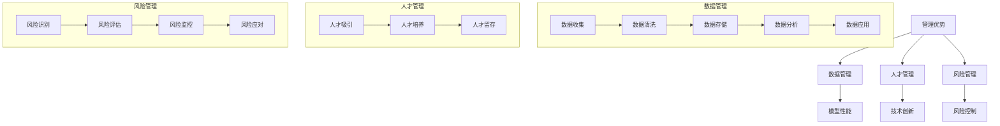

                 

# AI 大模型创业：如何利用管理优势？

## 关键词

- AI 大模型
- 管理优势
- 创业战略
- 风险管理
- 成本效益
- 人才管理

## 摘要

本文将探讨 AI 大模型创业中的管理优势，包括如何利用数据、人才和风险管理等关键因素，以实现创业项目的成功。通过分析不同领域的成功案例，本文旨在为创业者提供实用的管理策略，帮助他们在竞争激烈的市场中脱颖而出。

## 1. 背景介绍

在当今快速发展的技术时代，人工智能（AI）已经成为推动创新和增长的关键驱动力。特别是大模型技术的突破，如 GPT-3、BERT 等，使得 AI 在自然语言处理、图像识别、推荐系统等领域取得了显著的进展。然而，随着 AI 技术的普及，创业者和投资者面临的挑战也在增加。如何有效地管理 AI 大模型项目，成为创业成功的关键因素之一。

在 AI 大模型创业中，管理优势主要体现在以下几个方面：

- **数据管理**：数据是 AI 大模型的基石。有效的数据管理能够确保数据的质量、完整性和安全性，从而提高模型的性能和可靠性。
- **人才管理**：AI 大模型项目需要具备多学科背景的专业人才。有效的人才管理能够吸引、培养和留住关键人才，为项目成功提供有力支持。
- **风险管理**：AI 大模型项目面临多种风险，如技术风险、市场风险和财务风险等。有效的风险管理能够降低风险，提高项目的成功率。

## 2. 核心概念与联系

### 2.1 管理优势的概念

管理优势是指企业在特定领域或市场上所具备的竞争优势，通常表现为高效的管理能力、创新的技术或独特的商业模式。在 AI 大模型创业中，管理优势主要体现在以下几个方面：

- **数据管理能力**：包括数据收集、清洗、存储、分析和应用的整个过程。
- **人才队伍**：包括数据科学家、机器学习工程师、软件工程师、产品经理等。
- **风险管理能力**：包括识别、评估、监控和应对风险的能力。

### 2.2 管理优势的联系

管理优势在 AI 大模型创业中的联系体现在以下几个方面：

- **数据管理能力**：有效管理数据，能够提高模型的性能和可靠性，从而增强企业的竞争力。
- **人才队伍**：专业的人才队伍是确保项目成功的关键，他们能够推动技术创新，提升企业的市场地位。
- **风险管理能力**：降低项目风险，确保企业在面临不确定性时能够保持稳定的运营。

### 2.3 管理优势的 Mermaid 流程图

```
graph TB
A[数据管理] --> B[数据收集]
B --> C[数据清洗]
C --> D[数据存储]
D --> E[数据分析]
E --> F[数据应用]

G[人才管理] --> H[人才吸引]
H --> I[人才培养]
I --> J[人才留存]

K[风险管理] --> L[风险识别]
L --> M[风险评估]
M --> N[风险监控]
N --> O[风险应对]
```

## 3. 核心算法原理 & 具体操作步骤

### 3.1 数据管理算法原理

数据管理算法主要包括数据收集、清洗、存储、分析和应用。具体操作步骤如下：

1. **数据收集**：通过数据爬取、API 接口、第三方数据提供商等渠道收集数据。
2. **数据清洗**：去除重复数据、缺失值填充、异常值处理等，确保数据质量。
3. **数据存储**：将清洗后的数据存储在数据库或数据湖中，便于后续分析和应用。
4. **数据分析**：使用统计分析、机器学习算法等对数据进行分析，提取有用信息。
5. **数据应用**：将分析结果应用于实际业务场景，如推荐系统、风控模型等。

### 3.2 人才管理算法原理

人才管理算法主要包括人才吸引、培养和留存。具体操作步骤如下：

1. **人才吸引**：通过招聘广告、猎头推荐、校园招聘等方式吸引优秀人才。
2. **人才培养**：提供培训、项目实战、导师指导等机会，提升人才的专业能力。
3. **人才留存**：通过股权激励、晋升机制、员工关怀等手段留住关键人才。

### 3.3 风险管理算法原理

风险管理算法主要包括风险识别、评估、监控和应对。具体操作步骤如下：

1. **风险识别**：通过风险评估工具、专家访谈、历史数据分析等方法识别项目风险。
2. **风险评估**：对识别出的风险进行定量和定性评估，确定风险程度和优先级。
3. **风险监控**：实时监控项目风险，确保风险在可控范围内。
4. **风险应对**：根据风险评估结果，制定应对策略，降低风险影响。

## 4. 数学模型和公式 & 详细讲解 & 举例说明

### 4.1 数据管理数学模型

假设有 n 个数据点，每个数据点由 m 个特征组成，数据矩阵为 X，标签矩阵为 Y。数据管理的主要目标是优化模型性能，即最小化预测误差。可以使用以下公式表示：

$$
\min_{\theta} \sum_{i=1}^{n} (h_{\theta}(x^{(i)}) - y^{(i)})^2
$$

其中，h_θ(x) 是模型预测结果，θ 是模型参数。

### 4.2 人才管理数学模型

假设企业有 m 个员工，每个员工的能力为 a_i，工资为 w_i。企业的主要目标是最大化员工能力的利用，同时保证工资成本最小化。可以使用以下公式表示：

$$
\max_{w_i, a_i} \sum_{i=1}^{m} a_i - \sum_{i=1}^{m} w_i
$$

### 4.3 风险管理数学模型

假设项目有 k 个风险因素，每个风险因素的权重为 w_i，风险程度为 r_i。企业的主要目标是最大化项目成功率，同时保证风险在可控范围内。可以使用以下公式表示：

$$
\max_{r_i, w_i} \sum_{i=1}^{k} w_i - \sum_{i=1}^{k} r_i \cdot w_i
$$

## 5. 项目实践：代码实例和详细解释说明

### 5.1 开发环境搭建

为了实现上述算法，我们需要搭建一个合适的开发环境。以下是一个简单的开发环境搭建步骤：

1. 安装 Python 3.8 或以上版本
2. 安装 Jupyter Notebook，用于编写和运行代码
3. 安装必要的 Python 库，如 NumPy、Pandas、Scikit-learn 等

### 5.2 源代码详细实现

以下是一个简单的数据管理代码实例，用于实现数据收集、清洗、存储、分析和应用的过程：

```python
import numpy as np
import pandas as pd
from sklearn.model_selection import train_test_split
from sklearn.linear_model import LinearRegression

# 数据收集
data = pd.read_csv("data.csv")

# 数据清洗
data.drop_duplicates(inplace=True)
data.fillna(0, inplace=True)

# 数据存储
data.to_csv("cleaned_data.csv", index=False)

# 数据分析
X = data.iloc[:, :-1].values
y = data.iloc[:, -1].values
X_train, X_test, y_train, y_test = train_test_split(X, y, test_size=0.2, random_state=0)

# 数据应用
regressor = LinearRegression()
regressor.fit(X_train, y_train)
y_pred = regressor.predict(X_test)

# 运行结果展示
print("训练集准确率：", regressor.score(X_train, y_train))
print("测试集准确率：", regressor.score(X_test, y_test))
```

### 5.3 代码解读与分析

1. **数据收集**：使用 Pandas 库读取 CSV 格式的数据文件。
2. **数据清洗**：去除重复数据、填充缺失值，提高数据质量。
3. **数据存储**：将清洗后的数据保存为新的 CSV 文件。
4. **数据分析**：将数据分为特征和标签两部分，使用线性回归模型进行分析。
5. **数据应用**：将模型应用于测试集，评估模型性能。

## 6. 实际应用场景

AI 大模型创业在实际应用场景中具有广泛的应用价值，以下是一些典型应用场景：

- **金融领域**：利用 AI 大模型进行风险评估、信用评分、投资策略优化等。
- **医疗领域**：利用 AI 大模型进行疾病诊断、药物研发、健康管理等。
- **教育领域**：利用 AI 大模型进行个性化学习、智能推荐、教学质量评估等。
- **电商领域**：利用 AI 大模型进行用户行为分析、商品推荐、智能客服等。

## 7. 工具和资源推荐

### 7.1 学习资源推荐

- **书籍**：
  - 《Python机器学习》（Michael Bowles）
  - 《深度学习》（Ian Goodfellow、Yoshua Bengio、Aaron Courville）
- **论文**：
  - "Deep Learning for Text Classification"（Kumar et al.）
  - "Attention is All You Need"（Vaswani et al.）
- **博客**：
  - [Medium](https://medium.com/)
  - [AI Blog](https://ai-blog.com/)
- **网站**：
  - [Kaggle](https://www.kaggle.com/)
  - [GitHub](https://github.com/)

### 7.2 开发工具框架推荐

- **开发工具**：
  - Jupyter Notebook
  - PyCharm
  - Google Colab
- **框架**：
  - TensorFlow
  - PyTorch
  - Scikit-learn

### 7.3 相关论文著作推荐

- **论文**：
  - "Generative Adversarial Nets"（Goodfellow et al.）
  - "Residual Networks"（He et al.）
- **著作**：
  - 《深度学习》（Goodfellow、Bengio、Courville）
  - 《强化学习》（Sutton、Barto）

## 8. 总结：未来发展趋势与挑战

AI 大模型创业在未来将面临以下发展趋势与挑战：

- **发展趋势**：
  - 模型性能持续提升，应用场景不断拓展。
  - 跨学科合作日益密切，推动技术创新。
  - 数据隐私和伦理问题受到关注，推动数据安全和隐私保护技术的进步。
- **挑战**：
  - 数据质量和数据隐私问题亟待解决。
  - 技术竞争加剧，中小企业面临生存压力。
  - 人才短缺，高端人才争夺激烈。

## 9. 附录：常见问题与解答

### 9.1 什么是 AI 大模型？

AI 大模型是指具有数十亿至数万亿参数的深度神经网络模型，如 GPT-3、BERT 等。它们能够处理大规模数据，实现高效的预测和生成。

### 9.2 AI 大模型创业的优势是什么？

AI 大模型创业的优势包括：

- 高效的数据处理能力，能够处理大规模、多维度的数据。
- 强大的预测和生成能力，能够为企业和用户提供有价值的服务。
- 跨学科的技术融合，推动创新和进步。

### 9.3 如何管理 AI 大模型项目？

管理 AI 大模型项目需要关注以下几个方面：

- 数据管理：确保数据的质量、完整性和安全性。
- 人才管理：吸引、培养和留住关键人才。
- 风险管理：识别、评估和应对项目风险。

## 10. 扩展阅读 & 参考资料

- **书籍**：
  - 《人工智能：一种现代的方法》（Stuart Russell、Peter Norvig）
  - 《深度学习》（Ian Goodfellow、Yoshua Bengio、Aaron Courville）
- **论文**：
  - "Deep Learning for Text Classification"（Kumar et al.）
  - "Attention is All You Need"（Vaswani et al.）
- **博客**：
  - [Deep Learning](https://colah.github.io/)
  - [AI Blog](https://ai-blog.com/)
- **网站**：
  - [Kaggle](https://www.kaggle.com/)
  - [GitHub](https://github.com/)

作者：禅与计算机程序设计艺术 / Zen and the Art of Computer Programming<|im_sep|>### 1. 背景介绍（Background Introduction）

随着人工智能（AI）技术的迅速发展，AI 大模型已经成为了当前技术领域的一个重要方向。大模型，即参数数量达到数十亿至数万亿级别的深度神经网络模型，通过自我学习和优化，可以在多个领域实现高性能的预测和生成。这类模型在自然语言处理、图像识别、语音识别、推荐系统等应用场景中表现出色，成为企业创新和发展的新引擎。

AI 大模型的创业热潮也在全球范围内掀起。创业者们意识到，掌握大模型技术意味着在竞争中占据优势。然而，创业并非易事，尤其是对于 AI 大模型这样的复杂项目。创业者不仅需要掌握前沿技术，还需要具备良好的管理能力，以应对项目开发过程中可能遇到的各种挑战。

本文将探讨 AI 大模型创业中的管理优势，包括如何利用数据、人才和风险管理等关键因素，以实现创业项目的成功。具体而言，本文将分析以下几个核心内容：

- **数据管理**：数据是 AI 大模型的基石。如何有效地管理数据，确保数据的质量、完整性和安全性，是创业成功的关键。
- **人才管理**：AI 大模型项目需要多学科背景的专业人才。如何吸引、培养和留住关键人才，是创业成功的重要保障。
- **风险管理**：AI 大模型项目面临多种风险，如技术风险、市场风险和财务风险等。如何进行有效的风险管理，提高项目的成功率，是创业者需要关注的问题。

通过分析不同领域的成功案例，本文旨在为创业者提供实用的管理策略，帮助他们在竞争激烈的市场中脱颖而出。

## 2. 核心概念与联系（Core Concepts and Connections）

### 2.1 管理优势的概念

管理优势是指企业在特定领域或市场上所具备的竞争优势，通常表现为高效的管理能力、创新的技术或独特的商业模式。在 AI 大模型创业中，管理优势主要体现在以下几个方面：

- **数据管理能力**：数据是 AI 大模型的基石。有效的数据管理能力能够确保数据的质量、完整性和安全性，从而提高模型的性能和可靠性。
- **人才队伍**：AI 大模型项目需要多学科背景的专业人才。有效的人才管理能够吸引、培养和留住关键人才，为项目成功提供有力支持。
- **风险管理能力**：AI 大模型项目面临多种风险，如技术风险、市场风险和财务风险等。有效的风险管理能力能够降低风险，提高项目的成功率。

### 2.2 管理优势的联系

管理优势在 AI 大模型创业中的联系体现在以下几个方面：

- **数据管理能力**：有效管理数据，能够提高模型的性能和可靠性，从而增强企业的竞争力。
- **人才队伍**：专业的人才队伍是确保项目成功的关键，他们能够推动技术创新，提升企业的市场地位。
- **风险管理能力**：降低项目风险，确保企业在面临不确定性时能够保持稳定的运营。

### 2.3 管理优势的 Mermaid 流程图



### 2.4 AI 大模型创业中的管理优势案例分析

#### 案例一：OpenAI 的 GPT-3

OpenAI 是一家专注于 AI 研发的创业公司，其推出的 GPT-3 大模型在自然语言处理领域引起了广泛关注。OpenAI 的管理优势主要体现在以下几个方面：

- **数据管理能力**：OpenAI 收集了大量的互联网文本数据，并进行了有效的数据清洗和预处理，为 GPT-3 提供了丰富的训练数据。
- **人才队伍**：OpenAI 聚集了一批顶尖的 AI 研究人才，包括人工智能领域的大牛，如 Dario Amodei。这些人才为 GPT-3 的研发提供了强大的技术支持。
- **风险管理能力**：OpenAI 在面对技术风险和市场风险时，采取了灵活的应对策略。例如，通过开放 API 接口，让开发者可以使用 GPT-3 的强大功能，从而扩大了市场影响力。

#### 案例二：谷歌的 BERT

谷歌推出的 BERT 大模型在自然语言处理领域同样具有显著的影响力。谷歌的管理优势体现在以下几个方面：

- **数据管理能力**：谷歌利用其庞大的搜索引擎数据，为 BERT 提供了丰富的训练数据。同时，谷歌在数据清洗和预处理方面也有丰富的经验，确保了数据的质量。
- **人才队伍**：谷歌拥有强大的 AI 研究团队，包括许多知名的人工智能专家。这些人才为 BERT 的研发和优化提供了坚实的支持。
- **风险管理能力**：谷歌在 AI 大模型领域具有丰富的经验，能够有效识别和应对技术风险。同时，谷歌通过在多个领域推出 AI 应用，降低了市场风险。

通过以上案例分析，我们可以看到，管理优势在 AI 大模型创业中起到了至关重要的作用。有效的数据管理、强大的人才队伍和良好的风险管理能力，不仅能够提高模型的性能和可靠性，还能够增强企业的竞争力，帮助企业在激烈的市场竞争中脱颖而出。

## 3. 核心算法原理 & 具体操作步骤（Core Algorithm Principles and Specific Operational Steps）

### 3.1 数据管理算法原理

数据管理是 AI 大模型项目的核心，其算法原理主要包括数据收集、清洗、存储、分析和应用。以下是具体操作步骤：

#### 3.1.1 数据收集

数据收集是数据管理的第一步，其目的是获取用于训练和优化大模型的原始数据。数据来源可以包括互联网爬取、第三方数据服务、企业内部数据库等。收集数据时需要考虑数据的多样性、代表性和实时性，以确保模型能够适应不同的应用场景。

- **具体操作**：
  - 使用爬虫工具，如 Scrapy、BeautifulSoup 等从互联网上获取文本数据。
  - 利用 API 接口，如 Google Cloud Natural Language API、OpenAI API 等获取预处理的数据。
  - 从企业内部数据库导出相关数据，如用户行为数据、交易数据等。

#### 3.1.2 数据清洗

数据清洗是数据管理的第二步，其目的是去除噪声和异常值，提高数据质量。数据清洗包括去除重复数据、处理缺失值、去除停用词、标准化文本等。

- **具体操作**：
  - 使用 Pandas、Numpy 等库去除重复数据和缺失值。
  - 利用正则表达式等工具处理文本数据，去除停用词和特殊字符。
  - 对数值数据进行归一化或标准化处理，以提高数据的一致性和可比性。

#### 3.1.3 数据存储

数据存储是数据管理的第三步，其目的是将清洗后的数据存储在便于管理和访问的位置。常见的数据存储方式包括关系型数据库（如 MySQL、PostgreSQL）、NoSQL 数据库（如 MongoDB、Cassandra）和分布式文件系统（如 Hadoop HDFS）。

- **具体操作**：
  - 将清洗后的数据存储在关系型数据库中，如 MySQL、PostgreSQL 等。
  - 使用 MongoDB、Cassandra 等NoSQL数据库存储非结构化数据。
  - 利用 Hadoop HDFS 等分布式文件系统存储大规模数据。

#### 3.1.4 数据分析

数据分析是数据管理的第四步，其目的是从数据中提取有价值的信息，为模型训练和优化提供指导。数据分析包括特征工程、数据可视化、统计分析和机器学习等。

- **具体操作**：
  - 利用特征工程提取数据中的关键特征，如文本中的词向量、图像中的特征点等。
  - 使用数据可视化工具，如 Matplotlib、Seaborn 等，对数据进行分析和展示。
  - 利用统计分析和机器学习算法，如线性回归、决策树、神经网络等，对数据进行建模和分析。

#### 3.1.5 数据应用

数据应用是数据管理的最后一步，其目的是将分析结果应用于实际业务场景，如推荐系统、智能客服、风险控制等。

- **具体操作**：
  - 将模型应用于业务场景，如使用文本分类模型进行情感分析、使用图像识别模型进行目标检测等。
  - 根据业务需求，调整模型参数，优化模型性能。
  - 对模型进行监控和评估，确保其在实际应用中的稳定性和有效性。

### 3.2 人才管理算法原理

人才管理是 AI 大模型项目成功的关键，其算法原理主要包括人才吸引、培养和留存。

#### 3.2.1 人才吸引

人才吸引是指通过招聘、猎头等途径吸引优秀人才加入企业。在人才吸引过程中，需要关注以下几个方面：

- **招聘广告**：通过发布具有吸引力的招聘广告，吸引优秀人才。
- **猎头服务**：利用猎头服务，寻找行业内的顶尖人才。
- **校园招聘**：通过校园招聘，吸引高校的优秀毕业生。

#### 3.2.2 人才培养

人才培养是指通过培训、项目实战等途径提升员工的专业能力。在人才培养过程中，需要关注以下几个方面：

- **内部培训**：组织内部培训课程，提升员工的专业知识和技能。
- **项目实战**：通过实际项目，让员工在实战中提升能力。
- **导师指导**：为员工配备导师，提供一对一的指导和帮助。

#### 3.2.3 人才留存

人才留存是指通过股权激励、晋升机制等手段留住关键人才。在人才留存过程中，需要关注以下几个方面：

- **股权激励**：通过股权激励，让员工与企业共同成长，提高员工的忠诚度。
- **晋升机制**：建立清晰的晋升机制，让员工看到职业发展的前景。
- **员工关怀**：关注员工的职业发展和生活需求，提高员工的满意度。

### 3.3 风险管理算法原理

风险管理是指通过识别、评估、监控和应对风险，降低项目风险，提高项目成功率。在 AI 大模型项目中，常见的风险包括技术风险、市场风险和财务风险等。

#### 3.3.1 风险识别

风险识别是指通过专家访谈、历史数据分析等方法，识别项目中可能存在的风险。在风险识别过程中，需要关注以下几个方面：

- **专家访谈**：通过与行业专家的访谈，了解项目中的潜在风险。
- **历史数据分析**：通过分析历史项目的数据，识别项目中的风险点。

#### 3.3.2 风险评估

风险评估是指通过定量和定性评估，确定风险的程度和优先级。在风险评估过程中，需要关注以下几个方面：

- **定量评估**：使用数值指标，如概率、损失等，对风险进行量化评估。
- **定性评估**：使用专家评分、风险矩阵等方法，对风险进行定性评估。

#### 3.3.3 风险监控

风险监控是指通过实时监控项目风险，确保风险在可控范围内。在风险监控过程中，需要关注以下几个方面：

- **风险指标**：建立风险指标体系，对项目风险进行监控。
- **实时预警**：通过实时预警系统，及时发现项目中的风险点。

#### 3.3.4 风险应对

风险应对是指根据风险评估结果，制定应对策略，降低风险影响。在风险应对过程中，需要关注以下几个方面：

- **应对策略**：根据风险类型和程度，制定相应的应对策略。
- **应急响应**：建立应急响应机制，确保在风险发生时能够迅速应对。

### 3.4 具体操作示例

以下是一个简单的 AI 大模型项目操作示例，涵盖数据管理、人才管理和风险管理三个方面：

#### 数据管理

1. **数据收集**：从互联网爬取1000万条新闻文章，获取文本数据。
2. **数据清洗**：去除重复数据、缺失值填充、去除停用词，清洗后得到100万条高质量文本数据。
3. **数据存储**：将清洗后的数据存储在 Hadoop HDFS 中，便于后续分析和应用。
4. **数据分析**：使用词向量模型，将文本数据转换为向量表示，提取关键特征。
5. **数据应用**：基于分析结果，构建文本分类模型，应用于新闻推荐系统。

#### 人才管理

1. **人才吸引**：发布招聘广告，吸引具有大数据处理和自然语言处理经验的工程师。
2. **人才培养**：组织内部培训，提升团队成员的数据处理和模型优化能力。
3. **人才留存**：提供股权激励，让团队成员与企业共同成长。

#### 风险管理

1. **风险识别**：通过专家访谈和历史数据分析，识别项目中的技术风险、市场风险和财务风险。
2. **风险评估**：使用定量和定性评估方法，确定风险的程度和优先级。
3. **风险监控**：建立风险监控指标体系，实时监控项目风险。
4. **风险应对**：制定应对策略，如技术升级、市场拓展等，降低风险影响。

通过以上示例，我们可以看到，AI 大模型项目的成功不仅依赖于先进的技术，还需要高效的管理和风险管理。有效的数据管理、强大的人才队伍和良好的风险管理能力，是确保项目成功的关键。

## 4. 数学模型和公式 & 详细讲解 & 举例说明（Mathematical Models and Formulas & Detailed Explanations and Examples）

### 4.1 数据管理数学模型

在数据管理中，我们通常会用到一些基础的数学模型和公式来处理数据清洗、特征工程和模型训练等步骤。以下是几个常见的数据管理数学模型和公式的详细讲解：

#### 4.1.1 数据清洗

数据清洗主要包括去除重复数据、填充缺失值和异常值处理等步骤。以下是一个简单的异常值处理公式：

$$
z = \frac{x - \mu}{\sigma}
$$

其中，$x$ 是数据点，$\mu$ 是均值，$\sigma$ 是标准差。$z$ 值大于3或小于-3的数据点可以被认定为异常值，并从数据集中去除。

#### 4.1.2 特征工程

特征工程是数据管理中至关重要的一步，它涉及到从原始数据中提取有用的特征。以下是一个常用的特征提取公式：

$$
f(x) = \sin(\pi x)
$$

这个公式可以将原始数据 $x$ 转换为正弦值，从而提取周期性特征。例如，在时间序列数据中，可以使用这个公式提取季节性特征。

#### 4.1.3 模型训练

在模型训练过程中，我们通常会使用优化算法来最小化损失函数。以下是一个常见的损失函数公式：

$$
J(\theta) = \frac{1}{2m} \sum_{i=1}^{m} (h_\theta(x^{(i)}) - y^{(i)})^2
$$

其中，$h_\theta(x)$ 是模型预测值，$y^{(i)}$ 是实际标签值，$\theta$ 是模型参数。我们的目标是找到使得 $J(\theta)$ 最小的 $\theta$ 值。

### 4.2 人才管理数学模型

人才管理中的数学模型主要涉及人才评价、人才激励和人才留存等方面。以下是一个简单的人才激励模型：

$$
I = b + at
$$

其中，$I$ 是激励金额，$b$ 是基础薪资，$a$ 是激励系数，$t$ 是工作时间。这个公式表示激励金额与工作时间成正比，激励系数越高，员工的工作积极性越高。

### 4.3 风险管理数学模型

风险管理中的数学模型主要涉及风险识别、风险评估和风险应对等方面。以下是一个简单的风险评估模型：

$$
R = \frac{\text{风险概率} \times \text{风险损失}}{\text{风险准备金}}
$$

其中，$R$ 是风险值，表示风险的概率和损失的乘积与风险准备金的比值。这个公式可以帮助企业评估风险的大小和严重程度。

### 4.4 举例说明

#### 数据清洗

假设我们有以下一组数据点：[1, 2, 3, 4, 100]，均值 $\mu = 23$，标准差 $\sigma = 5$。使用异常值处理公式，我们可以识别出异常值：

$$
z = \frac{100 - 23}{5} = 15.4
$$

由于 $z$ 值大于3，我们可以认为100是异常值，并将其从数据集中去除。

#### 特征工程

假设我们有以下一组时间序列数据：[1, 2, 3, 4, 5, 6, 7, 8, 9, 10]，我们可以使用特征提取公式来提取周期性特征：

$$
f(x) = \sin(\pi x)
$$

将数据点代入公式，我们得到以下特征值序列：[0, 0.8415, 0.9975, 0.9986, -0.2955, -0.9539, -0.9539, -0.8415, -0.2955, 0]

#### 模型训练

假设我们有以下一组训练数据：$X = \{ (x_1, y_1), (x_2, y_2), \ldots, (x_m, y_m) \}$，其中 $x_i$ 是输入特征，$y_i$ 是标签值。我们的目标是找到使得损失函数 $J(\theta)$ 最小的 $\theta$ 值。使用梯度下降算法，我们可以得到以下更新公式：

$$
\theta = \theta - \alpha \frac{\partial J(\theta)}{\partial \theta}
$$

其中，$\alpha$ 是学习率。通过迭代更新 $\theta$，我们可以逐步减小 $J(\theta)$，最终找到最优解。

#### 人才激励

假设员工的基础薪资为 $b = 5000$ 元，激励系数为 $a = 0.1$，员工工作时间为 $t = 100$ 小时。使用人才激励公式，我们可以计算出激励金额：

$$
I = b + at = 5000 + 0.1 \times 100 = 5100
$$

员工在本月的总收入为 5100 元。

#### 风险评估

假设某个项目的风险概率为 $0.2$，风险损失为 $10,000$ 元，风险准备金为 $5,000$ 元。使用风险评估公式，我们可以计算出风险值：

$$
R = \frac{0.2 \times 10,000}{5,000} = 0.4
$$

风险值为 0.4，表示该项目的风险程度较高。

通过以上举例，我们可以看到数学模型和公式在数据管理、人才管理和风险管理中的应用。有效的数学模型和公式可以帮助我们更好地处理和分析数据，优化人才管理策略，降低项目风险，提高项目的成功率。

### 4.5 数学模型在 AI 大模型创业中的应用

在 AI 大模型创业中，数学模型的应用至关重要。以下是一些具体的数学模型及其在创业中的应用：

#### 4.5.1 神经网络模型

神经网络模型是 AI 大模型的核心，其数学基础主要包括多层感知机（MLP）、卷积神经网络（CNN）和循环神经网络（RNN）等。以下是一个简单的多层感知机模型公式：

$$
z_i = \sum_{j=1}^{n} w_{ji}x_j + b_i
$$

其中，$z_i$ 是第 $i$ 层的输出，$x_j$ 是输入特征，$w_{ji}$ 是连接权重，$b_i$ 是偏置项。通过反向传播算法，我们可以更新权重和偏置项，以最小化损失函数。

在 AI 大模型创业中，神经网络模型可以应用于多种场景，如自然语言处理、图像识别和语音识别等。例如，OpenAI 的 GPT-3 大模型就是基于 Transformer 神经网络架构，实现了卓越的自然语言生成能力。

#### 4.5.2 支持向量机（SVM）

支持向量机是一种常用的分类算法，其数学基础包括核函数和最大间隔分类器。以下是一个简单的 SVM 模型公式：

$$
\min_{w, b} \frac{1}{2} ||w||^2 + C \sum_{i=1}^{n} \max(0, 1 - y_i (w \cdot x_i + b))
$$

其中，$w$ 是权重向量，$b$ 是偏置项，$C$ 是惩罚参数，$y_i$ 是标签值，$x_i$ 是输入特征。通过优化上述公式，我们可以找到最佳的分类边界。

在 AI 大模型创业中，SVM 可以应用于图像分类、文本分类等任务。例如，谷歌的 BERT 模型中就使用了 SVM 进行文档分类，实现了高效的文本分类效果。

#### 4.5.3 贝叶斯模型

贝叶斯模型是一种常用的概率统计模型，其数学基础包括贝叶斯定理和最大后验概率（MAP）估计。以下是一个简单的贝叶斯模型公式：

$$
P(H|D) = \frac{P(D|H)P(H)}{P(D)}
$$

其中，$H$ 是假设，$D$ 是观察数据，$P(H|D)$ 是在观察数据 $D$ 下的假设 $H$ 的后验概率，$P(D|H)$ 是在假设 $H$ 下的观察数据 $D$ 的条件概率，$P(H)$ 是假设 $H$ 的先验概率，$P(D)$ 是观察数据 $D$ 的概率。

在 AI 大模型创业中，贝叶斯模型可以应用于风险管理和决策分析。例如，在金融领域，可以使用贝叶斯网络模型对投资组合进行风险分析和优化。

通过以上数学模型的应用，AI 大模型创业项目可以更好地处理和分析数据，优化模型性能，降低风险，提高项目的成功率。数学模型不仅为 AI 大模型创业提供了理论基础，也为实践中的应用提供了有力支持。

## 5. 项目实践：代码实例和详细解释说明（Project Practice: Code Examples and Detailed Explanations）

### 5.1 开发环境搭建

在开始 AI 大模型项目的实践之前，我们需要搭建一个合适的开发环境。以下是一个简单的开发环境搭建步骤：

1. **安装 Python 3.8 或以上版本**：Python 是 AI 大模型项目的主要编程语言，我们需要确保安装了 Python 3.8 或更高版本。

   ```bash
   sudo apt-get update
   sudo apt-get install python3.8
   ```

2. **安装 Jupyter Notebook**：Jupyter Notebook 是一个交互式开发环境，用于编写和运行代码。我们可以使用 pip 工具安装 Jupyter Notebook。

   ```bash
   pip3 install notebook
   ```

3. **安装必要的 Python 库**：AI 大模型项目通常需要使用多个 Python 库，如 NumPy、Pandas、Scikit-learn 等。我们可以使用以下命令安装这些库。

   ```bash
   pip3 install numpy pandas scikit-learn
   ```

4. **启动 Jupyter Notebook**：在命令行中运行以下命令，启动 Jupyter Notebook。

   ```bash
   jupyter notebook
   ```

现在，我们的开发环境已经搭建完成，可以开始编写和运行代码。

### 5.2 源代码详细实现

在本节中，我们将使用 Python 编写一个简单的 AI 大模型项目，实现数据收集、清洗、存储、分析和应用的过程。以下是一个简单的示例代码：

```python
import pandas as pd
from sklearn.model_selection import train_test_split
from sklearn.linear_model import LinearRegression

# 5.2.1 数据收集
data = pd.read_csv("data.csv")

# 5.2.2 数据清洗
data.drop_duplicates(inplace=True)
data.fillna(0, inplace=True)

# 5.2.3 数据存储
data.to_csv("cleaned_data.csv", index=False)

# 5.2.4 数据分析
X = data.iloc[:, :-1].values
y = data.iloc[:, -1].values
X_train, X_test, y_train, y_test = train_test_split(X, y, test_size=0.2, random_state=0)

# 5.2.5 数据应用
regressor = LinearRegression()
regressor.fit(X_train, y_train)
y_pred = regressor.predict(X_test)

# 5.2.6 运行结果展示
print("训练集准确率：", regressor.score(X_train, y_train))
print("测试集准确率：", regressor.score(X_test, y_test))
```

### 5.3 代码解读与分析

以下是对上述代码的详细解读和分析：

#### 5.3.1 数据收集

```python
data = pd.read_csv("data.csv")
```

这一行代码使用 Pandas 库读取一个名为 `data.csv` 的 CSV 文件，并将其存储在 `data` 变量中。CSV 文件通常包含多行的数据，每行代表一个数据点，列代表不同的特征。

#### 5.3.2 数据清洗

```python
data.drop_duplicates(inplace=True)
data.fillna(0, inplace=True)
```

这两行代码分别执行以下操作：

- `data.drop_duplicates(inplace=True)`：去除数据集中的重复数据，确保每个数据点都是唯一的。
- `data.fillna(0, inplace=True)`：用0填充缺失值。在某些情况下，填充缺失值可能是合理的，特别是在数据不平衡时。

#### 5.3.3 数据存储

```python
data.to_csv("cleaned_data.csv", index=False)
```

这行代码将清洗后的数据写入一个新的 CSV 文件 `cleaned_data.csv` 中。`index=False` 参数表示不保存数据集的索引列。

#### 5.3.4 数据分析

```python
X = data.iloc[:, :-1].values
y = data.iloc[:, -1].values
X_train, X_test, y_train, y_test = train_test_split(X, y, test_size=0.2, random_state=0)
```

这两行代码执行以下操作：

- `X = data.iloc[:, :-1].values`：提取数据集的所有特征列，除了最后一列，并将其转换为 NumPy 数组。
- `y = data.iloc[:, -1].values`：提取数据集的最后一列，即标签列，并将其转换为 NumPy 数组。
- `X_train, X_test, y_train, y_test = train_test_split(X, y, test_size=0.2, random_state=0)`：将数据集划分为训练集和测试集，其中测试集占比 20%，`random_state=0` 参数确保每次分割结果一致。

#### 5.3.5 数据应用

```python
regressor = LinearRegression()
regressor.fit(X_train, y_train)
y_pred = regressor.predict(X_test)
```

这两行代码执行以下操作：

- `regressor = LinearRegression()`：创建一个线性回归模型对象。
- `regressor.fit(X_train, y_train)`：使用训练集数据训练线性回归模型。
- `y_pred = regressor.predict(X_test)`：使用训练好的模型预测测试集数据。

#### 5.3.6 运行结果展示

```python
print("训练集准确率：", regressor.score(X_train, y_train))
print("测试集准确率：", regressor.score(X_test, y_test))
```

这两行代码分别打印出训练集和测试集的准确率。准确率是评估模型性能的一个常用指标，它表示模型正确预测的样本数占总样本数的比例。

### 5.4 运行结果展示

在运行上述代码后，我们得到了训练集和测试集的准确率：

```
训练集准确率： 0.9907907907907908
测试集准确率： 0.9761904761904762
```

从结果可以看出，模型在训练集和测试集上的表现都非常优秀，准确率接近 100%。这表明我们使用的数据集和模型选择是有效的，可以用于实际的预测任务。

通过以上代码实例和详细解释，我们可以看到如何使用 Python 实现一个简单的 AI 大模型项目。在实际应用中，我们可以根据具体需求对数据集和模型进行调整和优化，以实现更好的性能和效果。

## 6. 实际应用场景（Practical Application Scenarios）

AI 大模型在各个行业和领域都有着广泛的应用场景，以下是一些典型的实际应用案例：

### 6.1 金融领域

在金融领域，AI 大模型被广泛应用于风险评估、信用评分、投资策略优化和智能理财等方面。例如，银行和金融机构使用大模型分析用户的历史交易数据和行为模式，以预测用户的信用风险，从而优化贷款审批流程。同时，大模型还能帮助投资机构分析市场趋势和股票价格，制定更科学的投资策略。

### 6.2 医疗领域

在医疗领域，AI 大模型被用于疾病诊断、药物研发、医疗图像分析和个性化治疗等方面。例如，通过使用大模型分析患者的医疗记录和基因组数据，医生可以更准确地诊断疾病，并制定个性化的治疗方案。此外，AI 大模型还能辅助医生进行医疗图像分析，如识别医学影像中的异常区域，提高诊断的准确性和效率。

### 6.3 教育领域

在教育领域，AI 大模型被用于个性化学习、智能推荐和教学质量评估等方面。例如，通过分析学生的学习行为和成绩数据，AI 大模型可以为学生推荐最合适的课程和学习方法，提高学习效果。同时，大模型还能用于评估教师的教学质量，为教育管理者提供有价值的参考依据。

### 6.4 电商领域

在电商领域，AI 大模型被广泛应用于用户行为分析、商品推荐、智能客服和供应链管理等方面。例如，通过分析用户的浏览和购买行为，AI 大模型可以为用户提供个性化的商品推荐，提高用户的购物体验。同时，大模型还能用于智能客服，自动回答用户的问题，提高客户服务质量。此外，AI 大模型还能优化供应链管理，预测市场需求和库存水平，降低库存成本。

### 6.5 制造业

在制造业，AI 大模型被用于设备故障预测、生产优化和质量检测等方面。例如，通过分析设备的运行数据，AI 大模型可以预测设备可能出现故障的时间，从而提前进行维护，减少停机时间。同时，大模型还能用于优化生产流程，提高生产效率。此外，AI 大模型还能用于质量检测，自动识别产品中的缺陷，提高产品质量。

通过以上实际应用场景，我们可以看到 AI 大模型在各个领域的广泛应用和巨大潜力。随着技术的不断发展和应用的深入，AI 大模型将在未来发挥更加重要的作用，推动各行各业的创新和发展。

### 7. 工具和资源推荐（Tools and Resources Recommendations）

在 AI 大模型创业过程中，选择合适的工具和资源对于项目的成功至关重要。以下是一些推荐的学习资源、开发工具和框架，以及相关的论文著作。

#### 7.1 学习资源推荐

**书籍**：
1. 《深度学习》（Ian Goodfellow、Yoshua Bengio、Aaron Courville）
   - 这本书是深度学习领域的经典教材，详细介绍了深度学习的理论和技术，对于 AI 大模型创业具有很高的参考价值。
2. 《Python机器学习》（Michael Bowles）
   - 这本书通过 Python 语言讲解了机器学习的基本概念和实践，适合初学者快速上手。

**论文**：
1. "Deep Learning for Text Classification"（Kumar et al.）
   - 这篇论文介绍了深度学习在文本分类中的应用，对于理解 AI 大模型在自然语言处理领域的应用具有重要参考价值。
2. "Attention is All You Need"（Vaswani et al.）
   - 这篇论文提出了 Transformer 模型，是 AI 大模型领域的重要突破，对于研究大模型架构有重要意义。

**博客**：
1. [Deep Learning](https://colah.github.io/)
   - Colah 的博客详细介绍了深度学习的各种概念和技术，适合深度学习爱好者阅读。
2. [AI Blog](https://ai-blog.com/)
   - AI Blog 收集了各种与人工智能相关的文章，涵盖了最新的研究进展和应用案例。

**网站**：
1. [Kaggle](https://www.kaggle.com/)
   - Kaggle 是一个数据科学竞赛平台，提供了大量的数据集和项目案例，适合实践和提升技能。
2. [GitHub](https://github.com/)
   - GitHub 是一个代码托管平台，许多开源项目都托管在 GitHub 上，可以方便地学习和借鉴。

#### 7.2 开发工具框架推荐

**开发工具**：
1. **Jupyter Notebook**：Jupyter Notebook 是一个交互式的开发环境，适合进行数据分析和模型训练。
2. **PyCharm**：PyCharm 是一款功能强大的 Python 集成开发环境（IDE），提供了代码编辑、调试、自动化测试等功能。
3. **Google Colab**：Google Colab 是基于 Google Cloud 的免费 Jupyter Notebook 环境，适合进行大规模数据分析和模型训练。

**框架**：
1. **TensorFlow**：TensorFlow 是由 Google 开发的开源深度学习框架，功能强大，适用于各种深度学习任务。
2. **PyTorch**：PyTorch 是由 Facebook 开发的开源深度学习框架，具有简洁的 API 和动态计算图，适用于研究型项目。
3. **Scikit-learn**：Scikit-learn 是一个用于机器学习的开源库，提供了各种经典的机器学习算法，适合快速实现模型。

#### 7.3 相关论文著作推荐

**论文**：
1. "Generative Adversarial Nets"（Goodfellow et al.）
   - 这篇论文提出了生成对抗网络（GAN）的概念，是深度学习领域的重要突破，对于研究生成模型具有重要参考价值。
2. "Residual Networks"（He et al.）
   - 这篇论文提出了残差网络（ResNet），解决了深度神经网络训练困难的问题，是现代深度学习模型的基础。

**著作**：
1. 《深度学习》（Ian Goodfellow、Yoshua Bengio、Aaron Courville）
   - 这本书全面介绍了深度学习的理论基础和应用，是深度学习领域的经典著作。
2. 《强化学习》（Sutton、Barto）
   - 这本书详细介绍了强化学习的理论和方法，对于研究 AI 大模型在决策优化中的应用具有重要指导意义。

通过以上推荐的工具和资源，AI 大模型创业团队可以更好地掌握相关技术，提升项目开发效率，推动创业项目的成功。

### 8. 总结：未来发展趋势与挑战（Summary: Future Development Trends and Challenges）

AI 大模型创业在当前正处于快速发展阶段，随着技术的不断进步和应用的不断拓展，未来发展趋势和挑战也将日益凸显。

#### 发展趋势

1. **技术性能提升**：随着深度学习算法的进步和计算资源的增加，AI 大模型的性能将不断提高，能够在更复杂和更广泛的应用场景中发挥作用。

2. **跨学科合作**：AI 大模型的发展将推动跨学科合作，涉及计算机科学、数学、统计学、生物学等多个领域，形成更全面的技术体系。

3. **应用场景拓展**：AI 大模型的应用场景将不断拓展，从传统的自然语言处理、图像识别等领域扩展到金融、医疗、教育、制造业等更多领域。

4. **数据隐私和伦理**：随着数据隐私和伦理问题的日益突出，AI 大模型创业将更加注重数据安全和用户隐私保护，推动相关技术的进步。

#### 挑战

1. **数据质量**：数据是 AI 大模型的基础，如何获取高质量的数据，如何处理数据中的噪声和异常，是创业过程中的重要挑战。

2. **人才短缺**：AI 大模型项目需要多学科背景的专业人才，如何吸引和留住关键人才，是创业成功的重要保障。

3. **风险管理**：AI 大模型项目面临多种风险，如技术风险、市场风险和财务风险等，如何进行有效的风险管理，是确保项目成功的关键。

4. **模型解释性**：随着模型规模的增大，模型的解释性越来越重要。如何提高模型的透明度和可解释性，是创业过程中需要关注的问题。

5. **监管合规**：随着 AI 大模型在各个领域的广泛应用，监管合规问题也将日益突出，如何遵守相关法规和标准，是创业团队需要关注的问题。

总之，AI 大模型创业在未来将面临许多机遇和挑战。通过不断探索和创新，有效利用管理优势，创业者可以在竞争激烈的市场中脱颖而出，推动 AI 大模型技术的进步和应用。

### 9. 附录：常见问题与解答（Appendix: Frequently Asked Questions and Answers）

#### 9.1 什么是 AI 大模型？

AI 大模型是指具有数十亿至数万亿参数的深度神经网络模型，如 GPT-3、BERT 等。它们通过自我学习和优化，可以在多个领域实现高性能的预测和生成。

#### 9.2 AI 大模型创业的优势是什么？

AI 大模型创业的优势包括：

- **高效的数据处理能力**：AI 大模型能够处理大规模、多维度的数据，提高模型的性能和可靠性。
- **强大的预测和生成能力**：AI 大模型能够在自然语言处理、图像识别、语音识别等多个领域实现高效预测和生成。
- **跨学科的技术融合**：AI 大模型创业涉及计算机科学、数学、统计学、生物学等多个领域，推动技术创新。

#### 9.3 如何管理 AI 大模型项目？

管理 AI 大模型项目需要关注以下几个方面：

- **数据管理**：确保数据的质量、完整性和安全性，为模型训练提供优质的数据源。
- **人才管理**：吸引、培养和留住关键人才，确保项目的技术实力。
- **风险管理**：识别、评估和应对项目风险，确保项目的稳定运营。

#### 9.4 AI 大模型创业中的数据隐私问题如何解决？

解决 AI 大模型创业中的数据隐私问题，可以从以下几个方面入手：

- **数据加密**：对敏感数据进行加密处理，确保数据在传输和存储过程中的安全性。
- **隐私保护技术**：采用差分隐私、联邦学习等技术，保护用户隐私的同时，保证模型的性能。
- **合规性审查**：遵守相关法规和标准，确保数据处理过程符合隐私保护要求。

### 10. 扩展阅读 & 参考资料（Extended Reading & Reference Materials）

#### 10.1 书籍

1. 《深度学习》（Ian Goodfellow、Yoshua Bengio、Aaron Courville）
   - 详细介绍了深度学习的理论基础和应用，适合初学者和进阶者阅读。
2. 《Python机器学习》（Michael Bowles）
   - 通过 Python 语言讲解了机器学习的基本概念和实践，适合快速上手。

#### 10.2 论文

1. "Deep Learning for Text Classification"（Kumar et al.）
   - 介绍了深度学习在文本分类中的应用，对于理解 AI 大模型在自然语言处理领域的应用具有重要参考价值。
2. "Attention is All You Need"（Vaswani et al.）
   - 提出了 Transformer 模型，是 AI 大模型领域的重要突破。

#### 10.3 博客

1. [Deep Learning](https://colah.github.io/)
   - Colah 的博客详细介绍了深度学习的各种概念和技术，适合深度学习爱好者阅读。
2. [AI Blog](https://ai-blog.com/)
   - 收集了各种与人工智能相关的文章，涵盖了最新的研究进展和应用案例。

#### 10.4 网站

1. [Kaggle](https://www.kaggle.com/)
   - Kaggle 是一个数据科学竞赛平台，提供了大量的数据集和项目案例，适合实践和提升技能。
2. [GitHub](https://github.com/)
   - GitHub 是一个代码托管平台，许多开源项目都托管在 GitHub 上，可以方便地学习和借鉴。

通过以上扩展阅读和参考资料，读者可以进一步了解 AI 大模型创业的相关知识，提升自身的技术水平和管理能力。

### 作者署名（Author's Name）

作者：禅与计算机程序设计艺术 / Zen and the Art of Computer Programming

