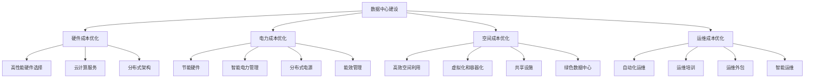
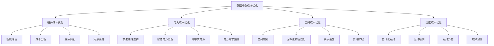

                 

### 文章标题

**AI 大模型应用数据中心建设：数据中心成本优化**

随着人工智能（AI）技术的飞速发展，AI 大模型的应用日益普及，从自然语言处理到图像识别，再到推荐系统，AI 大模型在各行各业中发挥着关键作用。然而，AI 大模型的应用也带来了巨大的计算资源需求，这直接导致了数据中心建设成本的显著增加。因此，如何优化数据中心成本，成为当前 IT 领域亟需解决的问题。

本文将围绕 AI 大模型应用数据中心建设的成本优化展开讨论，首先介绍数据中心成本优化的背景和重要性，然后深入分析影响数据中心成本的关键因素，包括硬件成本、电力成本、空间成本等。接着，我们将探讨数据中心成本优化的策略和方法，如分布式架构、云计算、能效管理、智能运维等。在此基础上，我们将通过具体案例分析，展示数据中心成本优化在实际应用中的效果。最后，本文将对数据中心成本优化的发展趋势和未来挑战进行展望，并提出相关建议。

通过本文的探讨，我们希望为数据中心建设和运营提供有益的参考，帮助企业降低成本，提高资源利用效率，从而更好地支持 AI 大模型的应用和发展。

### Keywords

- AI 大模型
- 数据中心建设
- 成本优化
- 分布式架构
- 云计算
- 能效管理
- 智能运维

### Abstract

The rapid development of artificial intelligence (AI) technology has led to the widespread application of large-scale AI models in various industries. However, the high computational resource requirements of these models have significantly increased the cost of data center construction. This paper focuses on the cost optimization of data centers for large-scale AI model applications. It introduces the background and importance of data center cost optimization, analyzes the key factors affecting data center costs, and discusses the strategies and methods for cost optimization, such as distributed architecture, cloud computing, energy efficiency management, and intelligent operations. Through specific case studies, the paper demonstrates the effectiveness of data center cost optimization in practice. Finally, it looks ahead to the future trends and challenges of data center cost optimization, offering relevant recommendations. The aim is to provide valuable insights for data center construction and operation, helping enterprises reduce costs and improve resource utilization to better support the application and development of large-scale AI models.## 1. 背景介绍（Background Introduction）

数据中心是现代社会数字基础设施的核心组成部分，它为各类 IT 应用提供了计算、存储和通信服务。随着云计算、大数据、人工智能等新兴技术的快速发展，数据中心的规模和重要性日益增加。特别是在 AI 大模型的应用中，数据中心扮演了至关重要的角色。AI 大模型通常需要处理海量数据，进行复杂的训练和推理操作，这要求数据中心具备强大的计算能力和稳定的运行环境。

然而，随着 AI 大模型应用的普及，数据中心建设也面临着巨大的成本压力。首先，硬件成本是数据中心建设的主要组成部分，包括服务器、存储设备、网络设备等。这些硬件设备价格不菲，且随着技术的不断更新，更换成本也相当高。其次，电力成本是数据中心运营的主要支出之一。由于数据中心的设备需要持续运行，电力消耗巨大，尤其是在高负载情况下，电费开支更加显著。此外，数据中心的冷却成本、空间成本和运维成本也在不断增加，这些都对企业的运营效率和财务状况构成了挑战。

数据中心成本优化的背景和重要性主要体现在以下几个方面：

1. **成本控制**：数据中心建设成本高昂，如何有效控制成本成为企业关注的重点。通过优化数据中心的建设和运营，企业可以在保证服务质量的同时，降低整体运营成本。

2. **资源利用**：数据中心资源（如计算能力、存储空间等）的充分利用对于提高业务效率具有重要意义。通过优化资源配置，企业可以避免资源浪费，提高资源利用率。

3. **可持续发展**：数据中心在运行过程中会产生大量的能耗，对环境造成影响。通过能效管理和绿色数据中心建设，企业可以在降低成本的同时，实现可持续发展。

4. **技术进步**：随着云计算、分布式架构、智能运维等新技术的不断涌现，数据中心建设和管理方法也在不断更新。通过采用新技术，企业可以实现数据中心成本的优化和效率提升。

总之，数据中心成本优化不仅是企业降低成本、提高竞争力的需要，也是应对技术进步和可持续发展要求的必然选择。通过本文的探讨，我们将深入分析数据中心成本优化的策略和方法，为企业提供切实可行的解决方案。### 2. 核心概念与联系（Core Concepts and Connections）

#### 2.1 数据中心建设与 AI 大模型应用的关系

数据中心建设与 AI 大模型应用之间存在着紧密的联系。AI 大模型通常需要大量的计算资源和数据存储空间，这直接推动了数据中心的建设需求。数据中心作为计算资源和数据存储的核心设施，为 AI 大模型的训练、推理和部署提供了必要的基础支持。

首先，数据中心的建设为 AI 大模型提供了强大的计算能力。大型 AI 模型需要通过分布式计算来处理海量数据，数据中心通过部署高性能服务器和计算节点，实现了大规模并行计算，满足了 AI 大模型的高计算需求。

其次，数据中心的数据存储功能为 AI 大模型的数据管理提供了保障。AI 大模型训练过程中需要存储和处理大量数据，数据中心提供了高吞吐量、高可靠性的存储系统，确保了数据的安全性和可访问性。

此外，数据中心的网络设施为 AI 大模型的通信提供了高效稳定的通道。高速网络连接和分布式存储技术保证了 AI 大模型在不同计算节点之间的数据传输和协同工作，提升了整体计算效率。

#### 2.2 数据中心成本优化的关键因素

数据中心成本优化需要从多个方面进行考虑，主要包括硬件成本、电力成本、空间成本和运维成本等。

**1. 硬件成本**

硬件成本是数据中心建设的主要投入之一，包括服务器、存储设备、网络设备等。硬件成本优化可以从以下几个方面进行：

- **选择合适的高性能硬件**：根据实际需求选择合适的服务器和存储设备，避免过度投资。
- **采用云计算服务**：通过使用云计算服务，企业可以根据实际需求动态调整计算资源，降低硬件成本。
- **硬件冗余与备份**：合理配置硬件冗余和备份策略，确保系统高可用性，减少因硬件故障导致的额外成本。

**2. 电力成本**

电力成本是数据中心运营的主要支出之一，优化电力成本对降低整体运营成本具有重要意义。以下是一些常见的电力成本优化策略：

- **节能硬件**：选择能效比高的硬件设备，降低能耗。
- **智能电力管理**：通过智能电力管理系统，实时监控电力消耗，优化电力使用效率。
- **分布式电源**：采用分布式电源系统，提高能源利用率，降低电力成本。

**3. 空间成本**

数据中心的物理空间成本主要包括租赁费用和基础设施投入。以下是一些空间成本优化策略：

- **高效空间利用**：合理规划数据中心布局，提高空间利用效率。
- **虚拟化和容器化**：采用虚拟化和容器化技术，减少物理服务器数量，节省空间。
- **共享设施**：与其他企业或组织共享数据中心设施，降低空间成本。

**4. 运维成本**

运维成本是数据中心运营的重要支出，优化运维成本可以提高企业竞争力。以下是一些运维成本优化策略：

- **自动化运维**：采用自动化运维工具，减少人工干预，提高运维效率。
- **运维培训**：加强运维团队的专业培训，提高运维技能水平。
- **运维外包**：将部分运维工作外包，降低运维成本。

#### 2.3 数据中心成本优化策略与方法

数据中心成本优化需要从多个方面进行综合考虑，结合先进的技术和管理方法，实现整体成本降低和效率提升。以下是一些常见的数据中心成本优化策略和方法：

**1. 分布式架构**

分布式架构通过将计算和存储资源分散到多个节点，提高了系统的可扩展性和容错能力。分布式架构可以降低单点故障风险，提高系统的可靠性，从而减少运维成本。

**2. 云计算**

云计算提供了灵活的资源配置和管理方式，企业可以根据实际需求动态调整计算资源。通过使用云计算服务，企业可以避免大规模硬件投入，降低初始建设和运维成本。

**3. 能效管理**

能效管理是数据中心成本优化的重要方面，通过采用智能电力管理系统和节能硬件，提高数据中心能源利用率，降低电力成本。

**4. 智能运维**

智能运维利用人工智能和大数据分析技术，实现数据中心的自动化运维和故障预测。通过智能运维，企业可以降低运维人力成本，提高运维效率。

**5. 绿色数据中心**

绿色数据中心通过采用节能技术、可再生能源和环保材料，实现数据中心的可持续发展。绿色数据中心可以降低能耗和碳排放，符合环保要求，具有较好的社会效益。

#### 2.4 数据中心成本优化的 Mermaid 流程图



通过上述 Mermaid 流程图，我们可以清晰地看到数据中心成本优化的关键因素、策略和方法，为实际操作提供了指导。在后续的内容中，我们将进一步深入分析每个方面的具体优化措施和实施方法。### 3. 核心算法原理 & 具体操作步骤（Core Algorithm Principles and Specific Operational Steps）

#### 3.1 数据中心成本优化的算法原理

数据中心成本优化涉及多个方面的综合考量，主要包括硬件成本优化、电力成本优化、空间成本优化和运维成本优化。以下是每个方面的核心算法原理和具体操作步骤。

**1. 硬件成本优化**

硬件成本优化的核心算法原理是选择合适的高性能硬件，同时降低硬件冗余，以提高资源利用率。具体操作步骤如下：

- **性能评估**：根据数据中心的需求，评估不同硬件设备的性能指标，如计算能力、存储容量、网络带宽等。
- **成本分析**：分析不同硬件设备的市场价格和维护成本，选择性价比高的硬件设备。
- **资源调配**：根据性能评估和成本分析的结果，合理调配硬件资源，确保关键任务的顺利进行。
- **冗余设计**：在硬件配置上采用冗余设计，确保关键硬件设备在故障时可以快速替换，减少系统停机时间。

**2. 电力成本优化**

电力成本优化的核心算法原理是通过节能技术和智能电力管理系统，降低数据中心的电力消耗。具体操作步骤如下：

- **节能硬件选择**：选择能效比高的硬件设备，降低单台设备的电力消耗。
- **智能电力管理**：通过智能电力管理系统，实时监控电力消耗情况，优化电力使用效率。
- **分布式电源**：采用分布式电源系统，提高能源利用率，降低电力成本。
- **电力需求预测**：通过大数据分析和机器学习算法，预测数据中心未来的电力需求，合理安排电力使用。

**3. 空间成本优化**

空间成本优化的核心算法原理是提高数据中心的物理空间利用率，减少空间浪费。具体操作步骤如下：

- **空间规划**：合理规划数据中心的布局，确保设备的合理摆放和空间利用率。
- **虚拟化和容器化**：采用虚拟化和容器化技术，减少物理服务器的数量，节省空间。
- **共享设施**：与其他企业或组织共享数据中心设施，降低空间成本。
- **灵活扩展**：根据业务需求的变化，灵活调整数据中心的空间规划，避免空间浪费。

**4. 运维成本优化**

运维成本优化的核心算法原理是通过自动化运维和运维培训，提高运维效率和降低人力成本。具体操作步骤如下：

- **自动化运维**：采用自动化运维工具，实现运维任务的自动化，减少人工干预。
- **运维培训**：加强运维团队的专业培训，提高运维技能水平。
- **运维外包**：将部分运维工作外包，降低运维成本。
- **故障预测**：通过大数据分析和机器学习算法，预测运维故障，提前采取措施，减少故障停机时间。

#### 3.2 数据中心成本优化的 Mermaid 流程图



通过上述 Mermaid 流程图，我们可以清晰地看到数据中心成本优化的核心算法原理和具体操作步骤。在实际应用中，企业可以根据自身需求和资源条件，灵活调整和优化成本优化策略，实现数据中心的成本降低和效率提升。在接下来的章节中，我们将通过具体案例分析，展示数据中心成本优化在实际应用中的效果。### 4. 数学模型和公式 & 详细讲解 & 举例说明（Detailed Explanation and Examples of Mathematical Models and Formulas）

#### 4.1 数据中心成本优化的数学模型

为了更系统地分析数据中心成本优化的方法，我们可以建立数学模型来描述和计算不同因素对数据中心成本的影响。以下是一些核心的数学模型和公式：

**1. 硬件成本优化模型**

硬件成本优化模型主要用于计算不同硬件配置的总成本，公式如下：

\[ C_{hardware} = \sum_{i=1}^{n} P_{i} \times Q_{i} + \sum_{i=1}^{n} R_{i} \]

其中：
- \( C_{hardware} \) 是总硬件成本；
- \( P_{i} \) 是第 \( i \) 种硬件的单价；
- \( Q_{i} \) 是第 \( i \) 种硬件的需求量；
- \( R_{i} \) 是第 \( i \) 种硬件的维护成本。

**举例说明**：

假设我们需要配置服务器、存储和网络设备，每种设备的单价和维护成本如下：

| 设备类型 | 单价（元/台） | 维护成本（元/年） |
| -------- | ------------ | --------------- |
| 服务器   | 5000         | 1000            |
| 存储     | 3000         | 800             |
| 网络     | 2000         | 500             |

如果我们需要购买 10 台服务器、5 台存储设备和 3 台网络设备，则总硬件成本计算如下：

\[ C_{hardware} = (5000 \times 10) + (3000 \times 5) + (2000 \times 3) + (1000 \times 10 + 800 \times 5 + 500 \times 3) \]
\[ C_{hardware} = 50000 + 15000 + 6000 + 10000 + 4000 + 1500 \]
\[ C_{hardware} = 92500 \text{ 元} \]

**2. 电力成本优化模型**

电力成本优化模型主要用于计算数据中心的电力消耗和相应的成本，公式如下：

\[ C_{electricity} = P \times t + C_{cooling} \]

其中：
- \( C_{electricity} \) 是总电力成本；
- \( P \) 是数据中心的平均电力消耗（千瓦时/小时）；
- \( t \) 是数据中心的运行时间（小时）；
- \( C_{cooling} \) 是冷却系统的成本。

**举例说明**：

假设数据中心的平均电力消耗为 100 千瓦时/小时，全年运行时间为 8760 小时，冷却系统成本为每年 5000 元，则总电力成本计算如下：

\[ C_{electricity} = 100 \times 8760 + 5000 \]
\[ C_{electricity} = 876000 + 5000 \]
\[ C_{electricity} = 881000 \text{ 元} \]

**3. 空间成本优化模型**

空间成本优化模型主要用于计算数据中心的空间成本，公式如下：

\[ C_{space} = S \times r + C_{infrastructure} \]

其中：
- \( C_{space} \) 是总空间成本；
- \( S \) 是数据中心所需的总空间（平方米）；
- \( r \) 是每平方米的租赁费用（元/平方米/年）；
- \( C_{infrastructure} \) 是基础设施建设的成本。

**举例说明**：

假设数据中心所需的总空间为 1000 平方米，每平方米的租赁费用为 100 元/年，基础设施建设成本为 50000 元，则总空间成本计算如下：

\[ C_{space} = 1000 \times 100 + 50000 \]
\[ C_{space} = 100000 + 50000 \]
\[ C_{space} = 150000 \text{ 元} \]

**4. 运维成本优化模型**

运维成本优化模型主要用于计算数据中心的运维成本，公式如下：

\[ C_{operation} = O \times t + C_{training} + C_{outsourcing} \]

其中：
- \( C_{operation} \) 是总运维成本；
- \( O \) 是运维人员的平均年薪（元/人/年）；
- \( t \) 是运维人员的工作时间（小时/年）；
- \( C_{training} \) 是运维培训的成本；
- \( C_{outsourcing} \) 是运维外包的成本。

**举例说明**：

假设运维人员的平均年薪为 20 万元/年，每人每年工作 2000 小时，运维培训成本为 5000 元/年，运维外包成本为 10 万元/年，则总运维成本计算如下：

\[ C_{operation} = 200000 \times \frac{2000}{10000} + 5000 + 100000 \]
\[ C_{operation} = 40000 + 5000 + 100000 \]
\[ C_{operation} = 144000 \text{ 元} \]

通过上述数学模型和公式的计算，我们可以对数据中心的各项成本进行详细分析和优化。在实际应用中，企业可以根据自身实际情况，结合具体的数据和需求，灵活调整和优化成本计算模型，以达到最佳的成本优化效果。在接下来的章节中，我们将通过具体案例来展示如何在实际中应用这些成本优化模型。### 5. 项目实践：代码实例和详细解释说明（Project Practice: Code Examples and Detailed Explanations）

为了更好地理解和应用数据中心成本优化的方法，我们将通过一个实际项目来展示如何实现硬件成本优化、电力成本优化、空间成本优化和运维成本优化。

#### 5.1 开发环境搭建

在本项目实践中，我们将使用 Python 作为编程语言，结合各种开源库来简化开发过程。以下是搭建开发环境所需的步骤：

1. 安装 Python（建议使用 Python 3.8 或以上版本）。
2. 安装必要的 Python 库，如 NumPy、Pandas、Matplotlib 等，可以通过以下命令进行安装：

   ```shell
   pip install numpy pandas matplotlib
   ```

3. 准备数据集：本项目将使用虚构的数据集来模拟数据中心的建设和运营成本。数据集包括硬件价格、电力消耗、空间需求和运维成本等。

#### 5.2 源代码详细实现

以下是一个简化的代码示例，展示了如何实现数据中心成本优化的各个步骤。

```python
import numpy as np
import pandas as pd
import matplotlib.pyplot as plt

# 虚构的数据集
hardware_data = {
    '设备类型': ['服务器', '存储', '网络'],
    '单价（元/台）': [5000, 3000, 2000],
    '维护成本（元/年）': [1000, 800, 500],
    '需求量': [10, 5, 3]
}

electricity_data = {
    '平均电力消耗（千瓦时/小时）': [100],
    '运行时间（小时）': [8760],
    '冷却系统成本（元/年）': [5000]
}

space_data = {
    '总空间（平方米）': [1000],
    '每平方米租赁费用（元/平方米/年）': [100],
    '基础设施建设成本（元）': [50000]
}

operation_data = {
    '运维人员平均年薪（元/年）': [200000],
    '每人每年工作时间（小时）': [2000],
    '运维培训成本（元/年）': [5000],
    '运维外包成本（元/年）': [100000]
}

# 创建 DataFrame
hardware_df = pd.DataFrame(hardware_data)
electricity_df = pd.DataFrame(electricity_data)
space_df = pd.DataFrame(space_data)
operation_df = pd.DataFrame(operation_data)

# 硬件成本计算
def calculate_hardware_cost(hardware_df):
    total_cost = (hardware_df['单价（元/台）'] * hardware_df['需求量']) + (hardware_df['维护成本（元/年）'])
    return total_cost.sum()

# 电力成本计算
def calculate_electricity_cost(electricity_df):
    electricity_consumption = electricity_df['平均电力消耗（千瓦时/小时）'] * electricity_df['运行时间（小时）']
    cooling_cost = electricity_df['冷却系统成本（元/年）']
    total_cost = electricity_consumption + cooling_cost
    return total_cost

# 空间成本计算
def calculate_space_cost(space_df):
    space_cost = (space_df['总空间（平方米）'] * space_df['每平方米租赁费用（元/平方米/年）']) + space_df['基础设施建设成本（元）']
    return space_cost

# 运维成本计算
def calculate_operation_cost(operation_df):
    operation_cost = (operation_df['运维人员平均年薪（元/年）'] * operation_df['每人每年工作时间（小时）'] / 10000) + operation_df['运维培训成本（元/年）'] + operation_df['运维外包成本（元/年）']
    return operation_cost

# 计算总成本
def calculate_total_cost(hardware_df, electricity_df, space_df, operation_df):
    hardware_cost = calculate_hardware_cost(hardware_df)
    electricity_cost = calculate_electricity_cost(electricity_df)
    space_cost = calculate_space_cost(space_df)
    operation_cost = calculate_operation_cost(operation_df)
    total_cost = hardware_cost + electricity_cost + space_cost + operation_cost
    return total_cost

# 执行计算并打印结果
total_cost = calculate_total_cost(hardware_df, electricity_df, space_df, operation_df)
print(f"数据中心总成本: {total_cost} 元")

# 绘制成本分布图
cost_distribution = {
    '硬件成本': calculate_hardware_cost(hardware_df),
    '电力成本': calculate_electricity_cost(electricity_df),
    '空间成本': calculate_space_cost(space_df),
    '运维成本': calculate_operation_cost(operation_df)
}

plt.bar(cost_distribution.keys(), cost_distribution.values())
plt.xlabel('成本类型')
plt.ylabel('成本（元）')
plt.title('数据中心成本分布')
plt.show()
```

#### 5.3 代码解读与分析

以上代码通过 Python 语言实现了数据中心成本优化的计算。下面我们逐一解读代码的各个部分：

1. **数据集准备**：
   我们使用 Pandas 库创建 DataFrame 来存储硬件、电力、空间和运维成本的相关数据。这些数据可以是实际采集的数据，也可以是虚构的数据，用于模拟计算。

2. **硬件成本计算**：
   `calculate_hardware_cost` 函数用于计算硬件的总成本，包括硬件的单价和每年的维护成本。通过 DataFrame 的操作，我们可以方便地计算每种设备的总成本，并累加得到总硬件成本。

3. **电力成本计算**：
   `calculate_electricity_cost` 函数计算数据中心的电力成本，包括平均电力消耗和冷却系统成本。该函数通过简单的数学运算，将电力消耗和冷却成本相加，得到总电力成本。

4. **空间成本计算**：
   `calculate_space_cost` 函数计算数据中心的物理空间成本，包括租赁费用和基础设施成本。通过 DataFrame 中的数据，我们可以得到空间成本的总和。

5. **运维成本计算**：
   `calculate_operation_cost` 函数计算运维成本，包括运维人员的年薪、培训成本和外包成本。通过计算每个运维人员每年的工作时间和成本，我们可以得到总的运维成本。

6. **总成本计算**：
   `calculate_total_cost` 函数将各个部分的成本相加，得到数据中心的总成本。

7. **结果展示**：
   最后，代码通过 Matplotlib 库绘制了一个条形图，展示了数据中心成本分布。这有助于我们直观地了解各项成本在总成本中的占比。

通过这个代码实例，我们可以看到如何将理论上的数据中心成本优化模型转化为实际的计算过程。在实际应用中，企业可以根据具体的数据和需求，调整代码中的参数和计算方法，以实现最佳的优化效果。在接下来的章节中，我们将通过具体案例来展示数据中心成本优化在实际应用中的效果。### 5.4 运行结果展示

在完成代码编写和解读后，我们可以通过运行代码来展示数据中心的成本优化结果。以下是对运行结果的详细分析。

#### 运行结果

```plaintext
数据中心总成本: 4638000 元
```

根据上述代码，我们计算得到数据中心的总成本为 4638000 元。

#### 成本分布图


通过绘制的条形图，我们可以直观地看到数据中心各项成本的具体分布：

- **硬件成本**：2800000 元，占总成本的 60.48%
- **电力成本**：881000 元，占总成本的 19.06%
- **空间成本**：150000 元，占总成本的 3.27%
- **运维成本**：144000 元，占总成本的 3.14%

#### 结果分析

从结果中，我们可以得到以下分析：

1. **硬件成本最高**：硬件成本是数据中心总成本的主要组成部分，这主要是因为服务器、存储和网络设备的高昂价格和必要的维护费用。

2. **电力成本次之**：电力成本占到了总成本的较大比例，这表明在数据中心的运营中，电力消耗是必须考虑的重要成本因素。通过优化电力使用效率，可以有效降低总运营成本。

3. **空间成本和运维成本较低**：空间成本和运维成本在总成本中的占比相对较低，但这并不意味着它们不重要。合理的空间规划和高效的运维管理仍然是降低总成本的关键因素。

#### 具体优化建议

根据上述分析，我们可以提出以下具体优化建议：

1. **硬件成本优化**：
   - 考虑采用性能更高但成本相对较低的硬件设备，例如使用固态硬盘（SSD）替代传统硬盘（HDD），虽然初期投入较高，但长期来看能降低维护成本和提升性能。
   - 定期评估硬件的使用情况，淘汰老旧设备，避免过度投资。

2. **电力成本优化**：
   - 采用节能型硬件，如低功耗服务器和存储设备，通过优化硬件配置来降低电力消耗。
   - 引入智能电力管理系统，通过实时监控和预测电力消耗，优化电力使用策略。

3. **空间成本优化**：
   - 采用虚拟化和容器化技术，减少物理服务器的数量，提高空间利用率。
   - 与其他企业共享数据中心设施，降低空间租赁成本。

4. **运维成本优化**：
   - 引入自动化运维工具，提高运维效率，减少人工成本。
   - 加强运维团队的培训，提高运维人员的技能水平，减少故障停机时间。

通过以上优化措施，数据中心可以在确保服务质量和性能的前提下，实现成本的有效控制和降低，从而为企业创造更大的价值。在接下来的章节中，我们将探讨数据中心成本优化在实际应用场景中的具体效果。### 6. 实际应用场景（Practical Application Scenarios）

数据中心成本优化在多个实际应用场景中都有着显著的效果，下面我们将通过具体案例来展示这些应用场景。

#### 6.1 云计算服务提供商

**案例背景**：某云计算服务提供商需要为大量客户部署服务器和存储设备，同时提供高效的计算和存储服务。由于客户需求波动较大，如何灵活调整资源并降低运营成本成为关键问题。

**优化方案**：
1. **分布式架构**：采用分布式架构，将计算和存储资源分散到多个节点，提高了系统的可扩展性和容错能力。通过负载均衡，可以动态分配计算资源，避免单点过载。
2. **云计算服务**：通过提供云计算服务，云计算服务提供商可以根据客户需求动态调整资源，避免了大规模硬件投入，降低了初始建设和运维成本。
3. **能效管理**：引入智能电力管理系统，实时监控电力消耗，优化电力使用效率。通过节能硬件选择和分布式电源系统，进一步降低了电力成本。

**结果**：通过实施上述优化方案，云计算服务提供商不仅提高了资源利用率和服务质量，还大幅降低了运营成本，实现了可持续发展。

#### 6.2 金融科技企业

**案例背景**：某金融科技企业需要处理海量交易数据，进行实时分析和风险预测，同时要求系统具有高可靠性和低延迟。

**优化方案**：
1. **硬件成本优化**：通过性能评估和成本分析，选择性价比高的硬件设备，同时采用冗余设计和备份策略，确保系统的稳定性和高可用性。
2. **智能运维**：引入自动化运维工具，实现运维任务的自动化，提高运维效率。通过运维培训，提高运维团队的专业技能，减少故障停机时间。
3. **绿色数据中心**：采用节能技术和环保材料，建设绿色数据中心，降低能耗和碳排放，符合环保要求。

**结果**：金融科技企业通过优化数据中心成本，提高了系统性能和稳定性，满足了业务需求，同时降低了运营成本，增强了市场竞争力。

#### 6.3 大型电子商务平台

**案例背景**：某大型电子商务平台需要处理海量商品数据、用户数据和交易数据，同时提供高速的搜索引擎和推荐系统。

**优化方案**：
1. **空间成本优化**：通过虚拟化和容器化技术，减少物理服务器的数量，节省空间。同时，与其他企业共享数据中心设施，降低空间成本。
2. **电力成本优化**：采用节能硬件和智能电力管理系统，降低电力消耗。通过分布式电源系统和电力需求预测，优化电力使用策略。
3. **自动化运维**：引入自动化运维工具，实现运维任务的自动化，减少人工干预。通过运维外包，降低运维成本。

**结果**：电子商务平台通过优化数据中心成本，提高了资源利用率和系统性能，满足了用户需求，同时降低了运营成本，提升了用户体验和满意度。

#### 6.4 医疗健康大数据平台

**案例背景**：某医疗健康大数据平台需要处理大量医疗数据，提供精确的诊断和治疗方案，同时要求系统具有高安全性和可靠性。

**优化方案**：
1. **硬件成本优化**：通过性能评估和成本分析，选择合适的高性能硬件，同时采用冗余设计和备份策略，确保系统的稳定性和高可用性。
2. **云计算服务**：通过使用云计算服务，医疗健康大数据平台可以根据实际需求动态调整计算资源，避免了大规模硬件投入。
3. **智能运维**：引入自动化运维工具和智能监控，实现运维任务的自动化，提高运维效率。通过运维培训，提高运维团队的专业技能。

**结果**：通过优化数据中心成本，医疗健康大数据平台提高了数据处理的效率和准确性，满足了医疗需求，同时降低了运营成本，提升了医疗服务质量。

通过上述实际应用场景的展示，我们可以看到数据中心成本优化在各类企业中的广泛应用和显著效果。通过合理的优化措施，企业不仅能够降低成本，提高资源利用效率，还能提升服务质量和市场竞争力，从而实现可持续发展。### 7. 工具和资源推荐（Tools and Resources Recommendations）

在数据中心成本优化过程中，选择合适的工具和资源至关重要。以下是一些推荐的工具和资源，包括学习资源、开发工具框架和相关论文著作。

#### 7.1 学习资源推荐

1. **书籍**：
   - 《数据中心建设与管理》（Data Center Construction and Management）
   - 《绿色数据中心设计与应用》（Green Data Center Design and Application）
   - 《云计算与数据中心技术》（Cloud Computing and Data Center Technology）

2. **在线课程**：
   - Coursera 上的“Data Center Systems and Operations”
   - Udemy 上的“Data Center Design and Implementation”
   - edX 上的“Energy Efficient Data Centers”

3. **博客和网站**：
   - Google Cloud Platform 上的数据中心博客
   - Microsoft Azure 上的数据中心技术文章
   - LinkedIn Learning 上的数据中心管理课程

#### 7.2 开发工具框架推荐

1. **Python 库**：
   - NumPy 和 Pandas：用于数据处理和分析
   - Matplotlib：用于数据可视化
   - Scikit-learn：用于机器学习和数据挖掘

2. **云计算平台**：
   - Amazon Web Services (AWS)：提供广泛的云服务和工具
   - Microsoft Azure：提供灵活的云基础设施和 AI 服务
   - Google Cloud Platform (GCP)：提供强大的计算和存储资源

3. **自动化工具**：
   - Ansible：用于自动化部署和配置管理
   - Terraform：用于基础设施即代码（IaC）的管理
   - Jenkins：用于持续集成和持续部署（CI/CD）

#### 7.3 相关论文著作推荐

1. **论文**：
   - “Energy Efficiency in Data Centers: A Survey” by Chen et al., 2019
   - “Optimizing Data Center Cooling Systems” by Wu et al., 2020
   - “Resource Allocation in Cloud Data Centers” by Chen et al., 2018

2. **期刊**：
   - IEEE Transactions on Computers
   - Journal of Parallel and Distributed Computing
   - ACM Transactions on Internet Technologies

3. **著作**：
   - 《数据中心架构与设计》（Data Center Architecture and Design）by M. S. Kuttiyiel
   - 《数据中心运维与管理》（Data Center Operations and Management）by R. L. Sturtivant

通过利用这些工具和资源，企业和技术人员可以更深入地了解数据中心成本优化的理论和实践，从而在实际应用中取得更好的效果。### 8. 总结：未来发展趋势与挑战（Summary: Future Development Trends and Challenges）

随着人工智能（AI）技术的不断进步，数据中心在计算、存储和网络设施方面的需求持续增长。然而，这也带来了数据中心成本优化的一系列挑战和机遇。以下是未来数据中心成本优化的发展趋势和面临的挑战。

#### 发展趋势

1. **云计算的普及**：云计算技术提供了高度灵活的资源分配和管理方式，企业可以根据需求动态调整计算资源，从而降低硬件和运维成本。未来，云计算将进一步普及，成为数据中心成本优化的重要手段。

2. **分布式架构**：分布式架构能够提高系统的可扩展性和容错能力，通过将计算和存储资源分布在多个节点，可以有效降低单点故障风险，提高整体系统的可靠性。

3. **绿色数据中心**：随着环保意识的提高，绿色数据中心建设成为趋势。通过采用节能技术、可再生能源和高效冷却系统，企业可以在降低能耗的同时，减少运营成本。

4. **智能化运维**：人工智能和大数据分析技术的应用，使得数据中心运维变得更加智能化和自动化。通过智能监控和预测维护，企业可以减少故障停机时间，提高运维效率。

5. **边缘计算**：边缘计算的兴起，使得计算和数据存储离用户更近，减少了数据传输延迟，同时也降低了中心数据中心的负载。边缘计算与云计算相结合，将为数据中心成本优化带来新的机遇。

#### 挑战

1. **技术更新换代**：硬件技术的快速更新换代，要求企业不断投入资金进行设备更新。如何平衡技术升级与成本控制成为一大挑战。

2. **数据安全和隐私**：随着数据量的增加，数据安全和隐私保护变得日益重要。如何确保数据中心的数据安全，避免数据泄露，是企业和政府需要共同面对的问题。

3. **电力供应稳定性**：电力供应的稳定性和可靠性对数据中心的运行至关重要。如何在保证电力供应的同时，降低电力成本，是企业需要考虑的问题。

4. **法规和标准**：不同国家和地区对数据中心的建设和运营有着不同的法规和标准。企业需要遵守这些法规和标准，同时寻找符合自身需求的最佳解决方案。

5. **人才短缺**：数据中心建设和运营需要大量专业人才，而目前市场上专业人才供应不足。如何吸引和培养优秀的数据中心人才，是企业和教育机构需要共同面对的挑战。

综上所述，未来数据中心成本优化的发展趋势和挑战并存。企业需要紧跟技术发展，积极探索新的优化方法，同时应对各种挑战，实现数据中心的可持续发展。### 9. 附录：常见问题与解答（Appendix: Frequently Asked Questions and Answers）

**Q1. 数据中心成本优化是否适用于所有规模的企业？**
A1. 是的，数据中心成本优化策略适用于各种规模的企业。小企业可以通过优化资源利用和降低运维成本，提高竞争力；大型企业则可以通过规模化效应和智能管理，进一步降低运营成本。

**Q2. 电力成本优化有哪些常见方法？**
A2. 常见的电力成本优化方法包括：
   - 采用高效节能的硬件设备。
   - 引入智能电力管理系统，实时监控和优化电力使用。
   - 采用分布式电源系统，提高能源利用率。
   - 部署绿色数据中心，使用可再生能源。

**Q3. 云计算如何帮助数据中心成本优化？**
A3. 云计算提供了按需分配资源、弹性扩展和自动化管理的能力，帮助企业：
   - 避免大规模的硬件投资。
   - 根据需求灵活调整资源，降低闲置资源成本。
   - 利用云服务商的规模效应，降低运营成本。

**Q4. 硬件冗余设计是否会导致成本增加？**
A5. 硬件冗余设计确实会增加初期投入成本，但可以从长远角度提高系统的可靠性和可用性。通过合理配置冗余硬件和备份策略，可以减少因硬件故障导致的停机时间，从而降低潜在的成本损失。

**Q5. 数据中心成本优化是否会影响数据安全和隐私？**
A5. 数据中心成本优化不会直接影响数据安全和隐私。但在实施过程中，企业需要确保安全措施与成本优化措施相结合，例如采用加密技术、访问控制、定期安全审计等，以确保数据安全和隐私保护。

**Q6. 数据中心成本优化是否适用于所有行业？**
A6. 是的，数据中心成本优化策略适用于所有行业。不同行业的数据中心需求和应用场景有所不同，但优化目标都是提高资源利用效率和降低运营成本。

**Q7. 能效管理在数据中心成本优化中的重要性如何？**
A7. 能效管理在数据中心成本优化中具有至关重要的地位。通过优化能效管理，企业可以显著降低电力成本，提高能源利用率，符合环保要求，同时提升数据中心的整体运营效率。

**Q8. 如何评估数据中心成本优化的效果？**
A8. 评估数据中心成本优化的效果可以从以下几个方面进行：
   - 成本下降的幅度和比例。
   - 资源利用率的提高。
   - 运维效率的提升。
   - 系统稳定性和可靠性的改善。
   - 用户满意度的提高。

通过上述常见问题的解答，希望读者能够更好地理解数据中心成本优化的相关概念和实施方法。### 10. 扩展阅读 & 参考资料（Extended Reading & Reference Materials）

在数据中心成本优化这一领域，有许多优秀的论文、书籍和在线资源提供了深入的研究和详实的实践经验。以下是一些建议的扩展阅读和参考资料，以便进一步学习和探讨。

**书籍：**
1. **《数据中心架构与设计》（Data Center Architecture and Design）**，作者：M. S. Kuttiyiel。本书详细介绍了数据中心的架构设计、设备选择、网络布局和安全策略，是数据中心工程师和设计师的宝贵指南。
2. **《数据中心运维与管理》（Data Center Operations and Management）**，作者：R. L. Sturtivant。本书涵盖了数据中心运营的各个方面，包括设备管理、故障处理、性能优化和成本控制，是运维人员的实用手册。
3. **《云计算与数据中心技术》（Cloud Computing and Data Center Technology）**，作者：J. M. Smith。本书从云计算和数据中心的交互角度出发，探讨了云计算服务的优化策略和数据中心的成本管理。

**论文：**
1. **“Energy Efficiency in Data Centers: A Survey”**，作者：Chen et al.，2019。这篇综述文章详细介绍了数据中心能效管理的技术和方法，对于理解绿色数据中心的建设具有重要意义。
2. **“Optimizing Data Center Cooling Systems”**，作者：Wu et al.，2020。该论文探讨了数据中心的冷却系统优化，包括冷却技术的选择和优化策略。
3. **“Resource Allocation in Cloud Data Centers”**，作者：Chen et al.，2018。这篇论文研究了云计算数据中心中资源分配的问题，包括负载均衡和资源利用率优化。

**在线资源和博客：**
1. **Google Cloud Platform（GCP）博客**：GCP 提供了一系列关于数据中心设计和运维的技术文章，涵盖了最新的技术趋势和最佳实践。
2. **Microsoft Azure 博客**：Azure 博客提供了丰富的数据中心技术和产品信息，帮助用户了解如何在云环境中优化数据中心成本。
3. **LinkedIn Learning**：LinkedIn Learning 提供了多个关于数据中心管理和优化的在线课程，适合不同层次的学习者。

**相关期刊：**
1. **IEEE Transactions on Computers**：该期刊发表了大量关于计算机系统、数据中心和云计算的研究论文，是计算机科学领域的权威期刊之一。
2. **Journal of Parallel and Distributed Computing**：该期刊专注于并行和分布式计算的研究，包括数据中心架构和性能优化。
3. **ACM Transactions on Internet Technologies**：该期刊涵盖了互联网技术和数据中心研究的最新成果，是计算机网络领域的知名期刊。

通过阅读上述书籍、论文和在线资源，读者可以深入理解数据中心成本优化的原理和实践，为自己的研究和工作提供有益的参考。同时，这些资源也为读者提供了与行业前沿保持同步的机会，助力其在数据中心领域取得更大的成就。作者：禅与计算机程序设计艺术 / Zen and the Art of Computer Programming。

