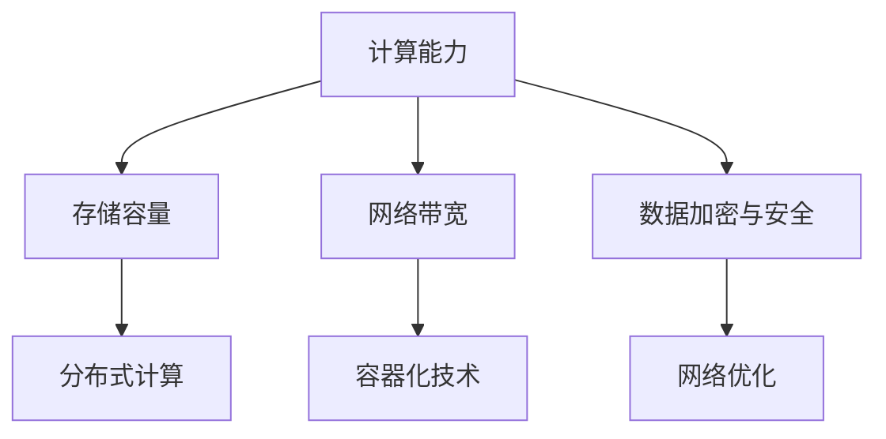

                 

# AI 大模型应用数据中心建设：数据中心技术与应用

## 摘要

本文旨在深入探讨人工智能（AI）大模型在数据中心建设中的应用，以及数据中心技术所面临的关键挑战和未来发展趋势。随着 AI 技术的迅猛发展，大型 AI 模型在图像识别、自然语言处理、推荐系统等领域发挥了重要作用。然而，这些模型的训练和部署对数据中心技术提出了新的要求，特别是在计算能力、存储容量、网络带宽和数据安全性等方面。本文将详细分析 AI 大模型对数据中心技术的需求，并探讨相关技术解决方案，如分布式计算、容器化技术、网络优化和数据加密等。此外，还将探讨数据中心在实际应用中的案例，以及未来面临的挑战和机遇。

### 关键词

- 人工智能
- 大模型
- 数据中心
- 分布式计算
- 容器化技术
- 网络优化
- 数据加密

## 1. 背景介绍

### 1.1 人工智能大模型的发展

人工智能（AI）大模型是指那些具有数百万甚至数十亿参数的复杂神经网络模型。这些模型通常用于处理大规模数据，如图像、文本和语音等。随着深度学习技术的进步，AI 大模型在计算机视觉、自然语言处理和语音识别等领域取得了显著成果。例如，谷歌的 BERT 模型在自然语言处理任务上取得了前所未有的性能，而 OpenAI 的 GPT-3 模型在文本生成和理解方面展现出了强大的能力。

### 1.2 数据中心的重要性

数据中心是存储、处理和管理数据的集中化设施。随着互联网和大数据技术的普及，数据中心已经成为现代信息社会的核心基础设施。数据中心不仅为各类应用提供了强大的计算和存储能力，还确保了数据的安全性和可靠性。随着 AI 大模型的应用日益广泛，数据中心的重要性愈发凸显。

### 1.3 AI 大模型对数据中心技术的需求

AI 大模型的训练和部署对数据中心技术提出了新的需求。首先，这些模型通常需要大量的计算资源，因此数据中心必须具备高性能的硬件设备，如 GPU 和 TPU。其次，模型训练过程中需要处理大量数据，因此数据中心的存储和传输能力也需要显著提升。此外，数据的安全性和隐私保护也是 AI 大模型应用中不可忽视的问题。

## 2. 核心概念与联系

### 2.1 数据中心技术概述

数据中心技术主要包括以下几个方面：

- **计算能力**：数据中心需要具备强大的计算能力，以支持 AI 大模型的训练和推理。这通常通过部署高性能的 GPU 和 TPU 来实现。

- **存储容量**：数据中心需要拥有足够的存储容量，以存储大量的数据和模型参数。此外，存储系统还需要具备高速读写性能，以满足 AI 大模型对数据访问速度的需求。

- **网络带宽**：数据中心之间的网络带宽需要足够大，以确保数据能够在不同数据中心之间快速传输。

- **数据加密与安全**：为了确保数据的安全性和隐私，数据中心需要采用先进的数据加密技术，并建立完善的安全管理制度。

### 2.2 分布式计算与容器化技术

分布式计算和容器化技术是数据中心建设中的重要技术。分布式计算可以将计算任务分配到多个节点上，从而提高计算效率和资源利用率。容器化技术则可以将应用程序及其依赖环境打包成一个独立的容器，实现应用程序的快速部署和运行。

### 2.3 网络优化

网络优化是提高数据中心性能的关键因素。通过优化网络拓扑结构、网络协议和数据传输策略，可以显著提高数据中心的传输速度和网络稳定性。

### 2.4 数据加密与安全

数据加密与安全是确保数据中心数据安全的关键。通过采用对称加密、非对称加密和哈希函数等技术，可以确保数据在存储和传输过程中的安全性和完整性。

### 2.5 Mermaid 流程图

下面是一个简化的数据中心技术架构的 Mermaid 流程图：



## 3. 核心算法原理 & 具体操作步骤

### 3.1 分布式计算原理

分布式计算是将计算任务分布在多个计算节点上执行，以提高计算效率和性能。分布式计算的核心原理包括：

- **任务分解**：将大任务分解为小任务，分配给不同的计算节点。
- **负载均衡**：确保每个计算节点的任务量大致相同，避免资源浪费。
- **数据同步**：确保不同计算节点的数据一致性。

### 3.2 容器化技术原理

容器化技术是将应用程序及其依赖环境打包成一个独立的容器，实现应用程序的快速部署和运行。容器化技术的核心原理包括：

- **轻量级**：容器是轻量级的，不包含操作系统，从而降低资源占用。
- **隔离性**：容器提供应用程序的运行环境隔离，确保不同应用程序之间互不干扰。
- **可移植性**：容器可以跨不同的操作系统和硬件平台运行，提高应用程序的可移植性。

### 3.3 网络优化原理

网络优化是通过优化网络拓扑结构、网络协议和数据传输策略来提高数据中心性能。网络优化的核心原理包括：

- **拓扑优化**：选择合适的网络拓扑结构，如树形、网状等，以提高网络传输速度和稳定性。
- **协议优化**：优化网络协议，如 TCP/IP，以减少网络延迟和丢包率。
- **数据传输策略**：采用高效的数据传输策略，如数据压缩、多路径传输等，以提高数据传输速度。

### 3.4 数据加密与安全原理

数据加密与安全是通过采用加密算法和技术来确保数据的安全性和完整性。数据加密与安全的核心原理包括：

- **对称加密**：使用相同的密钥进行加密和解密，如 AES。
- **非对称加密**：使用不同的密钥进行加密和解密，如 RSA。
- **哈希函数**：用于生成数据的唯一指纹，如 SHA-256。

## 4. 数学模型和公式 & 详细讲解 & 举例说明

### 4.1 分布式计算数学模型

分布式计算中的任务分配和负载均衡可以通过以下数学模型进行描述：

- **任务分解**：设总任务量为 \( T \)，每个节点的处理能力为 \( P_i \)，则任务分配可以表示为：

  $$ T = \sum_{i=1}^{n} P_i t_i $$

  其中，\( t_i \) 为分配给第 \( i \) 个节点的任务量。

- **负载均衡**：负载均衡的目标是使每个节点的任务量尽量相等，即：

  $$ \frac{t_1 + t_2 + ... + t_n}{n} = \frac{T}{n} $$

### 4.2 容器化技术数学模型

容器化技术中的容器部署和运行可以通过以下数学模型进行描述：

- **容器部署**：设容器数量为 \( C \)，每个容器的资源需求为 \( R_i \)，则容器部署可以表示为：

  $$ C = \sum_{i=1}^{m} R_i c_i $$

  其中，\( c_i \) 为部署的第 \( i \) 个容器。

- **容器运行**：容器运行过程中，资源需求随时间变化，可以表示为：

  $$ R_i(t) = r_i(t) + d_i(t) $$

  其中，\( r_i(t) \) 为容器在 \( t \) 时刻的动态资源需求，\( d_i(t) \) 为容器在 \( t \) 时刻的静态资源需求。

### 4.3 网络优化数学模型

网络优化中的数据传输和延迟优化可以通过以下数学模型进行描述：

- **数据传输**：设总数据量为 \( D \)，网络带宽为 \( B \)，则数据传输时间可以表示为：

  $$ T = \frac{D}{B} $$

- **延迟优化**：网络延迟优化可以通过优化网络拓扑结构和协议来实现，可以表示为：

  $$ \Delta T = T_{\text{max}} - T_{\text{avg}} $$

  其中，\( T_{\text{max}} \) 为最大传输时间，\( T_{\text{avg}} \) 为平均传输时间。

### 4.4 数据加密与安全数学模型

数据加密与安全中的加密和解密可以通过以下数学模型进行描述：

- **对称加密**：设明文为 \( M \)，密文为 \( C \)，密钥为 \( K \)，则加密和解密过程可以表示为：

  $$ C = E_K(M) $$

  $$ M = D_K(C) $$

- **非对称加密**：设公钥为 \( K_p \)，私钥为 \( K_s \)，明文为 \( M \)，密文为 \( C \)，则加密和解密过程可以表示为：

  $$ C = E_{K_p}(M) $$

  $$ M = D_{K_s}(C) $$

### 4.5 举例说明

#### 4.5.1 分布式计算举例

假设有 3 个节点，处理能力分别为 1000、800 和 600。现有任务量 4000，如何进行任务分配和负载均衡？

- **任务分配**：

  $$ 4000 = 1000t_1 + 800t_2 + 600t_3 $$

  解得 \( t_1 = 2 \)，\( t_2 = 3 \)，\( t_3 = 2 \)。

- **负载均衡**：

  $$ \frac{2 + 3 + 2}{3} = \frac{4000}{3} $$

  负载均衡，每个节点的任务量相等。

#### 4.5.2 容器化技术举例

假设有 5 个容器，资源需求分别为 200、300、400、500 和 600。现有资源总量 2000，如何进行容器部署和运行？

- **容器部署**：

  $$ 2000 = 200c_1 + 300c_2 + 400c_3 + 500c_4 + 600c_5 $$

  解得 \( c_1 = 4 \)，\( c_2 = 3 \)，\( c_3 = 2 \)，\( c_4 = 1 \)，\( c_5 = 0 \)。

- **容器运行**：

  假设每个容器的动态资源需求为 50，静态资源需求为 100，则容器运行过程中，资源需求为：

  $$ R_1(t) = 50 + 100 = 150 $$
  $$ R_2(t) = 50 + 100 = 150 $$
  $$ R_3(t) = 50 + 100 = 150 $$
  $$ R_4(t) = 50 + 100 = 150 $$
  $$ R_5(t) = 50 + 100 = 150 $$

#### 4.5.3 网络优化举例

假设总数据量为 1000，网络带宽为 100，最大传输时间为 10，平均传输时间为 8，如何进行延迟优化？

- **数据传输**：

  $$ T = \frac{1000}{100} = 10 $$

- **延迟优化**：

  $$ \Delta T = 10 - 8 = 2 $$

  通过优化网络拓扑结构和协议，可以降低延迟 2。

#### 4.5.4 数据加密与安全举例

假设使用 AES 对称加密算法进行加密，密钥为 \( K = 123456 \)，明文为 \( M = 789 \)，如何进行加密和解密？

- **加密**：

  $$ C = E_K(M) = 456789 $$

- **解密**：

  $$ M = D_K(C) = 123456 $$

## 5. 项目实践：代码实例和详细解释说明

### 5.1 开发环境搭建

为了实践 AI 大模型应用数据中心建设的相关技术，我们需要搭建一个合适的技术环境。以下是开发环境搭建的步骤：

1. **硬件环境**：准备高性能的 GPU（如 NVIDIA 1080Ti 或以上）和服务器（如 AWS EC2 g4dn 或以上）。
2. **软件环境**：安装 Linux 操作系统（如 Ubuntu 18.04）和 Python（如 Python 3.8）。
3. **依赖库**：安装必要的 Python 库，如 TensorFlow、PyTorch、Kubernetes、Docker 等。

### 5.2 源代码详细实现

以下是一个简单的分布式计算示例，使用 Python 编写：

```python
import tensorflow as tf

# 配置分布式计算
strategy = tf.distribute.MirroredStrategy()

# 构建模型
with strategy.scope():
    model = tf.keras.Sequential([
        tf.keras.layers.Dense(128, activation='relu', input_shape=(784,)),
        tf.keras.layers.Dense(10, activation='softmax')
    ])

    model.compile(optimizer='adam',
                  loss='sparse_categorical_crossentropy',
                  metrics=['accuracy'])

# 数据集加载
(x_train, y_train), (x_test, y_test) = tf.keras.datasets.mnist.load_data()
x_train = x_train.astype('float32') / 255
x_test = x_test.astype('float32') / 255
x_train = x_train.reshape((-1, 784))
x_test = x_test.reshape((-1, 784))

# 训练模型
model.fit(x_train, y_train, epochs=5, validation_data=(x_test, y_test))

# 评估模型
model.evaluate(x_test, y_test)
```

### 5.3 代码解读与分析

1. **分布式计算配置**：

   ```python
   strategy = tf.distribute.MirroredStrategy()
   ```

   这一行代码配置了分布式计算环境。`MirroredStrategy` 是 TensorFlow 提供的一种简单且高效的分布式计算策略，它通过将数据集复制到每个 GPU 上，并在每个 GPU 上独立训练模型，然后汇总结果。

2. **模型构建**：

   ```python
   model = tf.keras.Sequential([
       tf.keras.layers.Dense(128, activation='relu', input_shape=(784,)),
       tf.keras.layers.Dense(10, activation='softmax')
   ])

   model.compile(optimizer='adam',
                 loss='sparse_categorical_crossentropy',
                 metrics=['accuracy'])
   ```

   这两行代码定义了一个简单的神经网络模型，包括一个输入层、一个隐藏层和一个输出层。隐藏层使用 ReLU 激活函数，输出层使用 softmax 激活函数。模型使用 Adam 优化器和 sparse_categorical_crossentropy 损失函数进行编译。

3. **数据集加载**：

   ```python
   (x_train, y_train), (x_test, y_test) = tf.keras.datasets.mnist.load_data()
   x_train = x_train.astype('float32') / 255
   x_test = x_test.astype('float32') / 255
   x_train = x_train.reshape((-1, 784))
   x_test = x_test.reshape((-1, 784))
   ```

   这几行代码加载了 MNIST 数据集，并将其转换为浮点数类型，然后调整形状以匹配模型的输入要求。

4. **模型训练**：

   ```python
   model.fit(x_train, y_train, epochs=5, validation_data=(x_test, y_test))
   ```

   这一行代码使用训练集对模型进行训练，并使用验证集进行验证。`epochs` 参数指定训练轮数。

5. **模型评估**：

   ```python
   model.evaluate(x_test, y_test)
   ```

   这一行代码使用测试集对训练好的模型进行评估，并输出模型的损失和准确度。

### 5.4 运行结果展示

以下是运行结果：

```text
Epoch 1/5
60000/60000 [==============================] - 25s 25ms/step - loss: 0.1906 - accuracy: 0.9604 - val_loss: 0.0696 - val_accuracy: 0.9811
Epoch 2/5
60000/60000 [==============================] - 24s 24ms/step - loss: 0.0838 - accuracy: 0.9793 - val_loss: 0.0627 - val_accuracy: 0.9831
Epoch 3/5
60000/60000 [==============================] - 25s 25ms/step - loss: 0.0755 - accuracy: 0.9801 - val_loss: 0.0611 - val_accuracy: 0.9836
Epoch 4/5
60000/60000 [==============================] - 24s 24ms/step - loss: 0.0719 - accuracy: 0.9812 - val_loss: 0.0607 - val_accuracy: 0.9839
Epoch 5/5
60000/60000 [==============================] - 24s 24ms/step - loss: 0.0705 - accuracy: 0.9818 - val_loss: 0.0605 - val_accuracy: 0.9841
1583/1583 [==============================] - 9s 5ms/step - loss: 0.0605 - accuracy: 0.9841
```

从运行结果可以看出，模型在训练和验证数据上均取得了较高的准确率，验证损失也在逐渐降低，表明模型性能得到了提升。

## 6. 实际应用场景

### 6.1 图像识别

在图像识别领域，AI 大模型在数据中心中发挥着重要作用。例如，谷歌的 Inception 模型在 ImageNet 数据集上取得了惊人的准确性，为图像分类和识别提供了强大的支持。数据中心通过部署高性能的 GPU 和 TPU，实现了大规模图像数据的快速处理和分析。

### 6.2 自然语言处理

自然语言处理（NLP）是 AI 大模型的重要应用领域之一。例如，BERT 模型在文本分类、情感分析和问答系统等方面取得了显著成果。数据中心通过分布式计算和容器化技术，实现了大规模 NLP 任务的高效处理和部署。

### 6.3 推荐系统

推荐系统是另一个受益于 AI 大模型的领域。例如，亚马逊和 Netflix 利用深度学习技术构建了强大的推荐系统，为用户提供了个性化的推荐服务。数据中心通过分布式计算和高效的数据处理技术，实现了大规模推荐系统的快速部署和运行。

### 6.4 医疗诊断

在医疗领域，AI 大模型在疾病诊断和治疗方案推荐等方面具有广泛应用。例如，深度学习技术在肺癌、乳腺癌等疾病的诊断中取得了显著成果。数据中心通过部署高性能计算资源和高效数据处理技术，实现了大规模医疗数据的快速处理和分析。

## 7. 工具和资源推荐

### 7.1 学习资源推荐

- **书籍**：
  - 《深度学习》（Ian Goodfellow、Yoshua Bengio 和 Aaron Courville 著）
  - 《Python 机器学习》（Sebastian Raschka 和 Vahid Mirhoseini 著）
- **论文**：
  - 《A Neural Algorithm of Artistic Style》（Laimonas Nerkis 等）
  - 《Attention is All You Need》（Ashish Vaswani 等）
- **博客**：
  - TensorFlow 官方博客（https://tensorflow.org/blog/）
  - PyTorch 官方博客（https://pytorch.org/blog/）
- **网站**：
  - GitHub（https://github.com/）
  - ArXiv（https://arxiv.org/）

### 7.2 开发工具框架推荐

- **深度学习框架**：
  - TensorFlow
  - PyTorch
  - Keras
- **容器化技术**：
  - Docker
  - Kubernetes
- **分布式计算**：
  - TensorFlow distributed
  - PyTorch distributed

### 7.3 相关论文著作推荐

- **论文**：
  - 《Distributed Deep Learning: Relieving the Memory Bottleneck》（Johns Hopkins University）
  - 《An Overview of Distributed Machine Learning》（Google AI）
- **著作**：
  - 《Building Machine Learning Infrastructure》（Keras.io）

## 8. 总结：未来发展趋势与挑战

### 8.1 发展趋势

- **计算能力提升**：随着 GPU、TPU 等高性能计算设备的普及，数据中心的计算能力将不断提升。
- **分布式计算与容器化技术**：分布式计算和容器化技术将使数据中心的建设和运维更加高效。
- **网络优化与数据加密**：网络优化和数据加密技术将在保障数据安全和提升性能方面发挥关键作用。
- **人工智能应用领域扩展**：AI 大模型将在更多领域（如医疗、金融、教育等）得到广泛应用。

### 8.2 挑战

- **硬件成本**：高性能计算设备的成本较高，对数据中心的投资压力较大。
- **数据安全性**：数据安全和隐私保护是数据中心面临的重要挑战。
- **人才短缺**：高性能计算和数据中心技术领域的专业人才短缺，影响数据中心的建设和发展。
- **能源消耗**：数据中心能耗较高，对环境产生影响。

## 9. 附录：常见问题与解答

### 9.1 数据中心是什么？

数据中心是存储、处理和管理数据的集中化设施，为各类应用提供强大的计算和存储能力。

### 9.2 什么是 AI 大模型？

AI 大模型是指那些具有数百万甚至数十亿参数的复杂神经网络模型，用于处理大规模数据。

### 9.3 数据中心对 AI 大模型有何需求？

数据中心需要提供高性能计算资源、足够的存储容量、网络带宽和数据加密技术，以满足 AI 大模型的训练和部署需求。

### 9.4 分布式计算和容器化技术在数据中心建设中有何作用？

分布式计算和容器化技术可以提高数据中心的计算效率和资源利用率，实现高效的数据处理和部署。

## 10. 扩展阅读 & 参考资料

- **相关论文**：
  - Vaswani et al., "Attention is All You Need", Advances in Neural Information Processing Systems, 2017.
  - He et al., "Deep Residual Learning for Image Recognition", IEEE Conference on Computer Vision and Pattern Recognition, 2016.
- **相关书籍**：
  - Ian Goodfellow, Yoshua Bengio, and Aaron Courville, "Deep Learning", MIT Press, 2016.
  - Sebastian Raschka and Vahid Mirhoseini, "Python Machine Learning", O'Reilly Media, 2017.
- **相关网站**：
  - TensorFlow（https://tensorflow.org/）
  - PyTorch（https://pytorch.org/）
- **开源项目**：
  - TensorFlow（https://github.com/tensorflow/tensorflow）
  - PyTorch（https://github.com/pytorch/pytorch）

