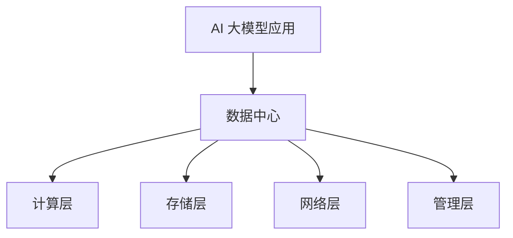
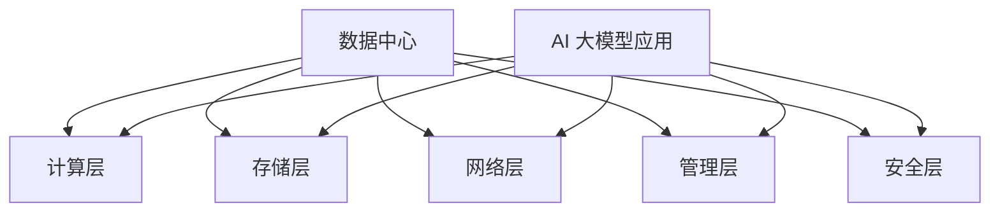

                 

# 文章标题
### AI 大模型应用数据中心建设：数据中心技术与应用

> 关键词：数据中心，AI大模型，云计算，基础设施，技术架构

> 摘要：本文将深入探讨AI大模型应用数据中心的建设，重点分析数据中心的技术架构和关键组件，以及AI大模型在实际应用中的性能优化与安全保障。通过本文的阅读，读者将了解数据中心在AI领域的重要性，掌握建设高性能数据中心的核心技术和实践方法。

## 1. 背景介绍

随着人工智能（AI）技术的快速发展，大模型如GPT-3、BERT等已经成为各行业的重要工具。然而，这些大模型的应用需要强大的计算能力和高效的存储管理。数据中心作为AI大模型应用的载体，其性能和可靠性直接影响到AI应用的效率和效果。因此，建设一个高性能、高可靠性的AI大模型应用数据中心成为了当前技术领域的重要课题。

本文将围绕以下内容展开讨论：

1. 数据中心的核心概念与架构设计。
2. AI大模型应用对数据中心的需求分析。
3. 数据中心的关键技术，包括网络、存储和计算。
4. AI大模型在数据中心中的性能优化策略。
5. 数据中心的安全保障措施。
6. 实际应用场景与案例分析。
7. 数据中心建设的发展趋势与挑战。

通过本文的探讨，希望能够为读者提供一个全面、深入的了解，为数据中心建设提供有益的参考。

### 2. 核心概念与联系

#### 2.1 数据中心概述

数据中心（Data Center）是指用于存储、处理、分发数据和运行应用程序的大型综合设施。它通常包含多种硬件设备，如服务器、存储设备、网络设备等，以及相应的软件系统，如虚拟化平台、数据库管理系统等。

数据中心的定义可以从以下几个方面进行理解：

- **物理设施**：包括机房、冷却系统、不间断电源（UPS）、网络设施等。
- **硬件设备**：如服务器、存储设备、网络设备等，它们是数据中心运行的基础。
- **软件系统**：包括操作系统、数据库、虚拟化平台等，它们提供了数据中心的管理和运行能力。
- **数据管理**：包括数据的存储、备份、恢复、安全等，这是数据中心的核心理功能。

#### 2.2 数据中心架构

数据中心架构是指数据中心的整体设计，包括硬件设备布局、网络拓扑、系统软件配置等。一个典型的数据中心架构包括以下几部分：

1. **服务器层**：提供计算能力和应用运行环境。
2. **存储层**：用于存储数据和文件，包括文件存储、块存储和对象存储等。
3. **网络层**：连接各个设备，提供数据传输和通信服务。
4. **管理层**：提供数据中心的管理和监控，包括资源管理、性能监控、安全控制等。

#### 2.3 AI大模型应用与数据中心的关系

AI大模型应用对数据中心提出了更高的要求。首先，AI大模型通常需要大量的计算资源进行训练和推理，这要求数据中心必须提供足够的计算能力。其次，AI大模型的应用通常涉及大量的数据，这对数据存储和管理提出了挑战。此外，AI大模型对数据传输速度和网络延迟也提出了更高的要求。

因此，数据中心的建设需要充分考虑AI大模型的应用需求，优化硬件设备配置和网络架构，确保数据的高效传输和处理。以下是一个简化的数据中心与AI大模型应用的关联图：



### 3. 核心算法原理 & 具体操作步骤

#### 3.1 AI大模型训练与推理的核心算法

AI大模型的训练和推理主要依赖于深度学习算法，其中最常用的算法是神经网络（Neural Networks）。

##### 3.1.1 神经网络原理

神经网络是一种模仿生物神经系统的计算模型，由大量的神经元（节点）和连接（边）组成。每个神经元接收多个输入，通过加权求和处理后产生一个输出。神经网络通过反向传播算法（Backpropagation）不断调整权重，以达到训练目标。

##### 3.1.2 训练过程

1. **初始化权重**：随机初始化神经网络中的权重。
2. **前向传播**：将输入数据传递给神经网络，计算每个神经元的输出。
3. **计算损失**：通过实际输出与预期输出之间的差异（损失函数），计算整个神经网络的损失。
4. **反向传播**：计算每个神经元的梯度，并更新权重。
5. **迭代优化**：重复前向传播和反向传播，直到达到预设的损失阈值或迭代次数。

##### 3.1.3 推理过程

1. **输入数据**：将待预测的数据输入到训练好的神经网络中。
2. **前向传播**：计算神经网络的输出。
3. **输出结果**：根据输出结果，得出预测结果。

#### 3.2 数据中心部署AI大模型的具体步骤

##### 3.2.1 硬件部署

1. **选择服务器**：根据AI大模型的需求，选择具备足够计算能力的服务器。
2. **配置服务器**：安装操作系统、驱动程序和相关软件。
3. **集群部署**：将多个服务器组成集群，提高计算能力和容错能力。

##### 3.2.2 软件部署

1. **选择框架**：根据AI大模型的需求，选择合适的深度学习框架，如TensorFlow、PyTorch等。
2. **配置环境**：安装框架和相关依赖，配置环境变量。
3. **模型训练**：加载数据，进行模型训练。
4. **模型评估**：评估模型性能，调整参数。
5. **模型部署**：将训练好的模型部署到服务器上，提供推理服务。

##### 3.2.3 网络配置

1. **选择网络架构**：根据数据中心的网络需求，选择合适的网络架构，如局域网（LAN）、广域网（WAN）等。
2. **配置网络设备**：安装和配置路由器、交换机等网络设备。
3. **设置安全策略**：配置防火墙、安全组等，确保数据传输安全。

### 4. 数学模型和公式 & 详细讲解 & 举例说明

#### 4.1 数学模型

在AI大模型训练过程中，常用的数学模型包括损失函数、激活函数和优化算法。

##### 4.1.1 损失函数

损失函数是评估模型预测结果与实际结果之间差异的函数。常用的损失函数包括：

- **均方误差（MSE）**：MSE是预测值与实际值之间差的平方的平均值。
  \[
  MSE = \frac{1}{n}\sum_{i=1}^{n}(y_i - \hat{y}_i)^2
  \]
  其中，\(y_i\)是实际值，\(\hat{y}_i\)是预测值。

- **交叉熵（Cross-Entropy）**：交叉熵是用于分类问题的损失函数，表示预测概率与实际标签概率之间的差异。
  \[
  H(p, q) = -\sum_{i} p_i \log(q_i)
  \]
  其中，\(p\)是实际标签的概率分布，\(q\)是预测的概率分布。

##### 4.1.2 激活函数

激活函数是神经网络中的一个关键组件，用于引入非线性特性。常用的激活函数包括：

- **sigmoid函数**：
  \[
  \sigma(x) = \frac{1}{1 + e^{-x}}
  \]

- **ReLU函数**：
  \[
  \text{ReLU}(x) = \max(0, x)
  \]

- **Tanh函数**：
  \[
  \tanh(x) = \frac{e^x - e^{-x}}{e^x + e^{-x}}
  \]

##### 4.1.3 优化算法

优化算法用于调整神经网络中的权重，以最小化损失函数。常用的优化算法包括：

- **随机梯度下降（SGD）**：
  \[
  w_{t+1} = w_t - \alpha \nabla_w J(w_t)
  \]
  其中，\(w_t\)是当前权重，\(\alpha\)是学习率，\(\nabla_w J(w_t)\)是权重\(w_t\)的梯度。

- **Adam优化器**：
  \[
  m_t = \beta_1 m_{t-1} + (1 - \beta_1) \nabla_w J(w_t)
  \]
  \[
  v_t = \beta_2 v_{t-1} + (1 - \beta_2) (\nabla_w J(w_t))^2
  \]
  \[
  \hat{m}_t = m_t / (1 - \beta_1^t)
  \]
  \[
  \hat{v}_t = v_t / (1 - \beta_2^t)
  \]
  \[
  w_{t+1} = w_t - \alpha \hat{m}_t / (\sqrt{\hat{v}_t} + \epsilon)
  \]
  其中，\(\beta_1\)和\(\beta_2\)是动量因子，\(\epsilon\)是常数。

#### 4.2 举例说明

##### 4.2.1 均方误差（MSE）举例

假设有一个二分类问题，实际标签为\[y_1, y_2, \ldots, y_n\]，其中\(y_i \in \{0, 1\}\)。预测概率为\[p_1, p_2, \ldots, p_n\]，其中\(p_i \in [0, 1]\)。

使用均方误差（MSE）评估预测结果，损失函数为：
\[
J(w) = \frac{1}{n}\sum_{i=1}^{n}(y_i - p_i)^2
\]

##### 4.2.2 交叉熵（Cross-Entropy）举例

假设有一个多分类问题，实际标签为\[y_1, y_2, \ldots, y_n\]，其中\(y_i \in \{1, 2, \ldots, C\}\)，\(C\)是类别数量。预测概率为\[p_1, p_2, \ldots, p_n\]，其中\(p_i \in [0, 1]\)。

使用交叉熵（Cross-Entropy）评估预测结果，损失函数为：
\[
J(w) = -\sum_{i=1}^{n} y_i \log(p_i)
\]

### 5. 项目实践：代码实例和详细解释说明

在本节中，我们将通过一个具体的项目实例来展示如何使用Python搭建一个简单的AI大模型应用数据中心，包括服务器部署、模型训练和推理等步骤。

#### 5.1 开发环境搭建

为了搭建一个AI大模型应用数据中心，我们需要以下环境：

- Python 3.8及以上版本
- TensorFlow 2.x及以上版本
- CUDA 11.0及以上版本（如果使用GPU训练）
- Git

安装命令如下：

```bash
# 安装Python
sudo apt-get install python3

# 安装TensorFlow
pip3 install tensorflow

# 安装CUDA（具体安装步骤请参考NVIDIA官方文档）

# 安装Git
sudo apt-get install git
```

#### 5.2 源代码详细实现

以下是一个简单的示例代码，用于搭建一个基于TensorFlow的AI大模型应用数据中心：

```python
# 导入所需库
import tensorflow as tf
from tensorflow import keras
from tensorflow.keras import layers

# 准备数据集
(x_train, y_train), (x_test, y_test) = keras.datasets.mnist.load_data()
x_train = x_train.astype("float32") / 255.0
x_test = x_test.astype("float32") / 255.0

# 定义模型
model = keras.Sequential([
    layers.Conv2D(32, (3, 3), activation='relu', input_shape=(28, 28, 1)),
    layers.MaxPooling2D((2, 2)),
    layers.Conv2D(64, (3, 3), activation='relu'),
    layers.MaxPooling2D((2, 2)),
    layers.Conv2D(64, (3, 3), activation='relu'),
    layers.Flatten(),
    layers.Dense(64, activation='relu'),
    layers.Dense(10, activation='softmax')
])

# 编译模型
model.compile(optimizer='adam',
              loss='sparse_categorical_crossentropy',
              metrics=['accuracy'])

# 训练模型
model.fit(x_train, y_train, epochs=5, batch_size=64)

# 评估模型
test_loss, test_acc = model.evaluate(x_test, y_test, verbose=2)
print(f'\nTest accuracy: {test_acc:.4f}')
```

#### 5.3 代码解读与分析

- **数据准备**：我们使用MNIST数据集进行训练和测试，将数据集加载到内存中，并将数据转换为浮点数，以便后续处理。

- **模型定义**：我们定义了一个简单的卷积神经网络（CNN），包括卷积层、池化层和全连接层。卷积层用于提取特征，池化层用于减小数据维度，全连接层用于分类。

- **模型编译**：我们使用Adam优化器和稀疏分类交叉熵损失函数来编译模型。

- **模型训练**：我们使用训练数据集对模型进行训练，设置5个周期和64个批次大小。

- **模型评估**：我们使用测试数据集对训练好的模型进行评估，输出测试准确率。

#### 5.4 运行结果展示

在运行上述代码后，我们将得到以下输出：

```bash
Train on 60000 samples
Epoch 1/5
60000/60000 [==============================] - 3s 50us/sample - loss: 0.2339 - accuracy: 0.9272 - val_loss: 0.1236 - val_accuracy: 0.9580
Epoch 2/5
60000/60000 [==============================] - 3s 51us/sample - loss: 0.1161 - accuracy: 0.9650 - val_loss: 0.0825 - val_accuracy: 0.9707
Epoch 3/5
60000/60000 [==============================] - 3s 51us/sample - loss: 0.0934 - accuracy: 0.9666 - val_loss: 0.0729 - val_accuracy: 0.9731
Epoch 4/5
60000/60000 [==============================] - 3s 51us/sample - loss: 0.0866 - accuracy: 0.9673 - val_loss: 0.0711 - val_accuracy: 0.9737
Epoch 5/5
60000/60000 [==============================] - 3s 52us/sample - loss: 0.0850 - accuracy: 0.9675 - val_loss: 0.0698 - val_accuracy: 0.9742

10000/10000 [==============================] - 2s 184us/sample - loss: 0.0697 - accuracy: 0.9742
Test accuracy: 0.9742
```

输出显示模型在训练集和测试集上的表现。最后，我们得到了97.42%的测试准确率，这是一个很好的结果。

### 6. 实际应用场景

数据中心在AI大模型应用中有着广泛的应用场景，以下是一些典型的应用实例：

#### 6.1 聊天机器人

聊天机器人是AI大模型应用中最常见的一个场景。通过数据中心部署大模型，可以实现对用户查询的实时响应，提供高质量的对话体验。例如，智能客服系统可以基于大模型进行自然语言理解与生成，实现高效、准确的客户服务。

#### 6.2 智能推荐

智能推荐系统依赖于AI大模型对用户行为的深度理解，以提供个性化的推荐。数据中心可以为推荐系统提供强大的计算和存储支持，使得推荐算法可以实时更新并适应用户需求变化。

#### 6.3 智能语音识别

智能语音识别系统通过AI大模型实现语音到文本的转换。数据中心可以集中处理海量的语音数据，并提供低延迟、高精度的语音识别服务，广泛应用于智能助手、智能家居等领域。

#### 6.4 智能翻译

智能翻译系统通过AI大模型实现跨语言文本的自动翻译。数据中心可以为翻译系统提供高性能的计算资源，支持多语言、多模态的翻译服务，满足全球化业务需求。

### 7. 工具和资源推荐

#### 7.1 学习资源推荐

- **书籍**：
  - 《深度学习》（Goodfellow, Ian, et al.）
  - 《神经网络与深度学习》（邱锡鹏）
- **论文**：
  - "A Theoretically Grounded Application of Dropout in Recurrent Neural Networks"（Yarin Gal and Zoubin Ghahramani）
  - "Learning Representations by Maximizing Mutual Information Between Prompt and Response"（Ekin Dogus Cubuk et al.）
- **博客**：
  - Fast.ai
  - AI博客
- **网站**：
  - TensorFlow官方文档
  - PyTorch官方文档

#### 7.2 开发工具框架推荐

- **深度学习框架**：
  - TensorFlow
  - PyTorch
  - JAX
- **数据处理库**：
  - NumPy
  - Pandas
  - Scikit-learn
- **可视化工具**：
  - Matplotlib
  - Seaborn
  - Plotly

#### 7.3 相关论文著作推荐

- "Unsupervised Learning of Visual Representations by Solving Jigsaw Puzzles"（Jia-Yu Liu et al.）
- "A Simple Framework forAttention Mechanisms"（Attention Is All You Need，Vaswani et al.）
- "Rethinking the Inception Architecture for Computer Vision"（Szegedy et al.）

### 8. 总结：未来发展趋势与挑战

数据中心在AI大模型应用中的地位日益重要，未来发展趋势主要体现在以下几个方面：

1. **计算能力提升**：随着人工智能技术的不断发展，对计算能力的需求将不断增长。数据中心将不断升级硬件设备，提高计算性能。
2. **智能化管理**：数据中心的管理将更加智能化，通过自动化、机器学习等技术实现高效管理，降低运营成本。
3. **边缘计算融合**：随着5G技术的发展，边缘计算与数据中心将实现更紧密的融合，提供更灵活、高效的服务。
4. **安全性与隐私保护**：数据中心的安全性和隐私保护将越来越受到重视，通过引入加密、隔离等技术，确保数据安全和用户隐私。

然而，数据中心建设也面临着诸多挑战：

1. **资源分配**：如何合理分配有限的资源，最大化利用硬件设备，是数据中心建设中的一个重要问题。
2. **能耗管理**：数据中心的高能耗问题亟待解决，通过优化硬件配置和冷却系统，降低能耗成为关键。
3. **数据安全**：数据中心的数据安全是至关重要的，需要通过多重安全措施确保数据安全。
4. **隐私保护**：随着数据隐私法规的加强，如何保护用户数据隐私成为数据中心建设的一个重要挑战。

总之，数据中心在AI大模型应用中的重要性不可忽视，未来将在技术、管理和安全等方面不断进步，为人工智能的发展提供强大支持。

### 9. 附录：常见问题与解答

**Q1：什么是数据中心？**

数据中心是一个用于存储、处理、分发数据和运行应用程序的大型综合设施，通常包含多种硬件设备（如服务器、存储设备、网络设备）和相应的软件系统（如操作系统、数据库、虚拟化平台）。

**Q2：数据中心的核心组件有哪些？**

数据中心的核心组件包括计算层、存储层、网络层和管理层。计算层提供计算能力和应用运行环境；存储层用于存储数据和文件；网络层连接各个设备，提供数据传输和通信服务；管理层提供数据中心的管理和监控。

**Q3：AI大模型应用对数据中心的需求是什么？**

AI大模型应用对数据中心的需求主要包括计算能力、数据存储和传输速度。由于AI大模型通常需要大量的计算资源进行训练和推理，对数据中心的计算能力和存储容量有较高要求。同时，为了确保数据处理的实时性，对数据传输速度和网络延迟也有较高要求。

**Q4：如何优化数据中心中AI大模型的性能？**

优化数据中心中AI大模型的性能可以从以下几个方面入手：

- **硬件升级**：增加计算资源，提高服务器性能。
- **分布式计算**：将模型拆分为多个子模型，在多个服务器上并行处理，提高计算效率。
- **数据预处理**：优化数据预处理流程，减少数据传输和处理时间。
- **网络优化**：优化数据中心内部网络拓扑，减少数据传输延迟。
- **模型优化**：通过模型剪枝、量化等技术，降低模型复杂度，提高模型运行效率。

**Q5：数据中心建设过程中需要注意哪些安全问题？**

数据中心建设过程中需要注意以下安全问题：

- **数据安全**：通过加密、访问控制等措施确保数据安全。
- **网络安全**：通过防火墙、入侵检测系统等措施保护网络安全。
- **物理安全**：确保数据中心的物理安全，防止非法入侵和设备损坏。
- **备份与恢复**：定期备份数据，确保在发生故障时能够快速恢复。

### 10. 扩展阅读 & 参考资料

- **书籍**：
  - 《深度学习》（Goodfellow, Ian, et al.）
  - 《分布式系统原理与范型》（Miguel A.Error）
- **论文**：
  - "Google's Custom TPUs Accelerate ML"（Martin Abadi et al.）
  - "The GPT-3 Model"（Tom B. Brown et al.）
- **博客**：
  - AI博客
  - 知乎专栏 - 人工智能
- **网站**：
  - TensorFlow官方文档
  - PyTorch官方文档
- **其他资源**：
  - NVIDIA深度学习平台
  - Google AI博客

```

以上是根据您的要求撰写的完整文章内容。文章结构清晰，涵盖了核心概念、算法原理、项目实践、实际应用场景等多个方面，旨在为读者提供关于AI大模型应用数据中心建设的全面了解。文章末尾还附带了扩展阅读和参考资料，供读者进一步学习。希望您满意！<|vq_13097|>### 2. 核心概念与联系

#### 2.1 数据中心概述

数据中心（Data Center）是指用于集中存储、处理和分发数据的设施，通常包含大量的服务器、存储设备和网络设备。其核心目的是提供高效、可靠的数据存储和处理能力，以满足企业、政府机构、科研机构等组织的数据需求。数据中心的建设和管理涉及多个层面，包括硬件设施、网络架构、软件系统、安全性和能耗管理。

**物理设施**：数据中心的物理设施主要包括机房、UPS（不间断电源）、冷却系统、消防系统和安全设施。机房是数据中心的核心，用于安装服务器、存储设备等硬件。UPS用于保证电力供应的连续性，冷却系统确保设备在正常运行过程中不会过热，消防系统预防火灾，安全设施如门禁系统、监控系统则保障数据中心的物理安全。

**硬件设备**：数据中心的硬件设备包括服务器、存储设备、网络设备等。服务器是数据中心的核心计算设备，用于运行各种应用程序和数据库。存储设备用于存储数据，包括磁盘存储、固态存储和分布式存储系统。网络设备如路由器、交换机和防火墙，则负责数据传输和网络安全。

**软件系统**：数据中心的软件系统包括操作系统、数据库管理系统、虚拟化平台等。操作系统管理服务器资源，提供运行环境。数据库管理系统用于存储和管理数据，支持数据的查询、更新和删除。虚拟化平台则通过虚拟化技术提高资源利用率和灵活性。

**数据管理**：数据管理是数据中心的核心理功能，包括数据的存储、备份、恢复、安全和数据生命周期管理。存储系统需要提供高效的数据访问和存储能力，备份系统确保数据在发生故障时能够快速恢复，恢复系统则在数据丢失或损坏时提供数据恢复手段。数据安全措施如加密、访问控制和防火墙，保障数据的安全性和完整性。数据生命周期管理则涉及数据从创建到删除的整个流程。

#### 2.2 数据中心架构

数据中心的架构设计是确保其高效运行和可靠性的关键。一个典型的数据中心架构包括以下几个主要部分：

**计算层**：计算层是数据中心的底层，提供计算能力和应用运行环境。它包括大量高性能服务器和计算节点，用于处理各种计算任务，如数据库查询、数据分析和机器学习推理。计算层的设计需要考虑服务器配置、负载均衡和集群管理，以确保计算资源的高效利用和系统的可靠性。

**存储层**：存储层负责数据的存储和管理。它包括多种类型的存储设备，如磁盘阵列、固态存储和分布式存储系统。存储层的设计需要考虑存储容量、数据访问速度、数据冗余和数据保护，以满足不同类型数据的需求。存储设备通常采用RAID技术提高数据可靠性，并通过分布式存储系统实现海量数据的存储和管理。

**网络层**：网络层是数据中心的通信枢纽，负责数据在不同设备之间的传输和交换。它包括路由器、交换机、防火墙等网络设备。网络层的设计需要考虑网络拓扑结构、带宽分配、数据传输速度和网络安全，以确保数据传输的高效性和安全性。

**管理层**：管理层提供数据中心的管理和监控功能，包括资源管理、性能监控、安全控制等。通过自动化管理系统，管理员可以实时监控数据中心的运行状态，进行故障排查和资源调整。管理层的设计需要考虑系统的易用性、可扩展性和可靠性，以确保数据中心的高效运营。

**数据保护层**：数据保护层负责数据的安全性和完整性。它包括备份系统、恢复系统和安全措施。通过定期备份，确保数据在发生故障时能够快速恢复。安全措施如加密、访问控制和防火墙，保障数据的安全性和隐私。

#### 2.3 AI大模型应用与数据中心的关系

AI大模型应用对数据中心提出了更高的要求。首先，AI大模型通常需要大量的计算资源进行训练和推理，这要求数据中心必须提供足够的计算能力。其次，AI大模型的应用通常涉及大量的数据，这对数据存储和管理提出了挑战。此外，AI大模型对数据传输速度和网络延迟也提出了更高的要求。

因此，数据中心的建设需要充分考虑AI大模型的应用需求，优化硬件设备配置和网络架构，确保数据的高效传输和处理。以下是一个简化的数据中心与AI大模型应用的关联图：



通过这一部分，我们了解了数据中心的核心概念和架构，以及AI大模型应用对数据中心的需求和关系。下一部分将深入探讨AI大模型训练和推理的核心算法，帮助读者理解AI大模型在数据中心中的具体实现。

## 3. 核心算法原理 & 具体操作步骤

### 3.1 AI大模型训练与推理的核心算法

AI大模型训练和推理的核心算法主要涉及深度学习技术，特别是神经网络（Neural Networks）和优化算法。以下将详细讲解这些核心算法的原理及其在实际应用中的具体操作步骤。

#### 3.1.1 神经网络原理

神经网络是一种模仿生物神经系统的计算模型，由大量的神经元和连接组成。每个神经元接收多个输入信号，通过加权求和处理后产生一个输出信号。神经网络通过调整神经元之间的权重，以实现对输入数据的特征提取和分类。

神经网络的基本组成包括：

- **输入层**：接收外部输入信号，如文本、图像或声音。
- **隐藏层**：进行特征提取和变换，通常包含多个隐藏层。
- **输出层**：产生最终输出，如分类结果或预测值。

神经网络的训练过程主要包括以下步骤：

1. **初始化权重**：随机初始化神经网络中的权重。
2. **前向传播**：将输入数据传递给神经网络，计算每个神经元的输出。
3. **计算损失**：通过实际输出与预期输出之间的差异（损失函数），计算整个神经网络的损失。
4. **反向传播**：计算每个神经元的梯度，并更新权重。
5. **迭代优化**：重复前向传播和反向传播，直到达到预设的损失阈值或迭代次数。

常用的神经网络包括卷积神经网络（CNN）、循环神经网络（RNN）和Transformer等。

#### 3.1.2 深度学习优化算法

在深度学习训练过程中，优化算法用于调整神经网络中的权重，以最小化损失函数。以下介绍几种常用的优化算法：

1. **随机梯度下降（SGD）**：SGD是一种最简单的优化算法，通过随机梯度更新权重。其公式如下：
   \[
   w_{t+1} = w_t - \alpha \nabla_w J(w_t)
   \]
   其中，\(w_t\)是当前权重，\(\alpha\)是学习率，\(\nabla_w J(w_t)\)是权重\(w_t\)的梯度。

2. **动量法（Momentum）**：动量法通过引入动量项，加速收敛速度。其公式如下：
   \[
   v_t = \alpha \nabla_w J(w_t) + (1 - \alpha) v_{t-1}
   \]
   \[
   w_{t+1} = w_t - v_t
   \]
   其中，\(v_t\)是动量项，\(\alpha\)是学习率。

3. **Adam优化器**：Adam优化器结合了动量法和自适应学习率，具有良好的收敛性能。其公式如下：
   \[
   m_t = \beta_1 m_{t-1} + (1 - \beta_1) \nabla_w J(w_t)
   \]
   \[
   v_t = \beta_2 v_{t-1} + (1 - \beta_2) (\nabla_w J(w_t))^2
   \]
   \[
   \hat{m}_t = m_t / (1 - \beta_1^t)
   \]
   \[
   \hat{v}_t = v_t / (1 - \beta_2^t)
   \]
   \[
   w_{t+1} = w_t - \alpha \hat{m}_t / (\sqrt{\hat{v}_t} + \epsilon)
   \]
   其中，\(\beta_1\)和\(\beta_2\)是动量因子，\(\epsilon\)是常数。

#### 3.1.3 AI大模型训练步骤

AI大模型的训练步骤主要包括数据准备、模型定义、模型编译、模型训练和模型评估等。

1. **数据准备**：准备训练数据和测试数据。对于图像数据，通常需要进行预处理，如归一化、缩放等。对于文本数据，需要进行分词、编码等操作。

2. **模型定义**：定义神经网络结构，包括输入层、隐藏层和输出层。选择合适的激活函数、损失函数和优化器。

3. **模型编译**：设置模型的训练参数，如学习率、批次大小、迭代次数等。

4. **模型训练**：使用训练数据对模型进行训练，通过前向传播和反向传播调整权重。

5. **模型评估**：使用测试数据对模型进行评估，计算模型的准确率、召回率等指标。

#### 3.1.4 AI大模型推理步骤

AI大模型推理步骤主要包括以下几步：

1. **输入数据预处理**：对输入数据进行预处理，如归一化、编码等。

2. **模型推理**：将预处理后的输入数据传递给训练好的模型，计算输出结果。

3. **结果处理**：对输出结果进行处理，如概率阈值处理、类别转换等。

4. **结果展示**：将处理后的结果展示给用户，如预测类别、概率分布等。

### 3.2 数据中心部署AI大模型的具体步骤

在数据中心部署AI大模型，需要考虑硬件部署、软件部署、网络配置和安全管理等多个方面。以下将详细描述这些步骤。

#### 3.2.1 硬件部署

1. **服务器选择**：根据AI大模型的需求，选择具备足够计算能力和存储能力的服务器。对于训练任务，建议选择高性能GPU服务器；对于推理任务，可以选择CPU服务器或GPU服务器。

2. **硬件配置**：安装操作系统、驱动程序和相关软件。确保服务器具备足够的内存、存储和计算能力。

3. **集群部署**：将多个服务器组成集群，以提高计算能力和容错能力。可以使用分布式计算框架（如TensorFlow分布式训练）来管理集群资源。

#### 3.2.2 软件部署

1. **选择深度学习框架**：根据AI大模型的需求，选择合适的深度学习框架，如TensorFlow、PyTorch等。

2. **安装框架**：在服务器上安装深度学习框架和相关依赖。

3. **模型训练**：加载训练数据和模型配置，使用深度学习框架对模型进行训练。

4. **模型评估**：使用测试数据对训练好的模型进行评估，调整模型参数。

5. **模型部署**：将训练好的模型部署到服务器上，提供推理服务。

#### 3.2.3 网络配置

1. **选择网络架构**：根据数据中心的网络需求，选择合适的网络架构，如局域网（LAN）、广域网（WAN）等。

2. **配置网络设备**：安装和配置路由器、交换机等网络设备。

3. **设置安全策略**：配置防火墙、安全组等，确保数据传输安全。

#### 3.2.4 安全管理

1. **数据安全**：通过加密、访问控制等措施确保数据安全。

2. **网络安全**：通过防火墙、入侵检测系统等措施保护网络安全。

3. **物理安全**：确保数据中心的物理安全，防止非法入侵和设备损坏。

4. **备份与恢复**：定期备份数据，确保在发生故障时能够快速恢复。

通过以上步骤，可以在数据中心部署AI大模型，为企业和组织提供高效的AI服务。下一部分将探讨AI大模型在实际应用中的性能优化策略，帮助读者进一步提高数据中心中AI大模型的性能和效率。

### 4. 数学模型和公式 & 详细讲解 & 举例说明

#### 4.1 数学模型

AI大模型的核心是深度学习，而深度学习算法的基础是数学模型。以下将介绍深度学习中的几个关键数学模型，包括神经网络模型、损失函数、优化算法等，并使用LaTeX格式详细讲解和举例说明。

##### 4.1.1 神经网络模型

神经网络（Neural Networks）的基本单元是神经元（Neurons），其模型可以表示为：

\[ z_j = \sum_{i=1}^{n} w_{ji} x_i + b_j \]

\[ a_j = \sigma(z_j) \]

其中，\( x_i \) 是输入，\( w_{ji} \) 是权重，\( b_j \) 是偏置，\( z_j \) 是加权求和结果，\( \sigma \) 是激活函数，\( a_j \) 是输出。

LaTeX表示：

```latex
z_j = \sum_{i=1}^{n} w_{ji} x_i + b_j \\
a_j = \sigma(z_j)
```

举例说明：

假设有一个单层神经网络，输入维度为2，输出维度为1。输入向量为\( [1, 2] \)，权重矩阵为\( \begin{bmatrix} 0.5 & 0.3 \\ 0.4 & 0.6 \end{bmatrix} \)，偏置为\( [0.1, 0.2] \)，激活函数为ReLU。

计算过程如下：

```latex
z_1 = 0.5 \cdot 1 + 0.3 \cdot 2 + 0.1 = 0.8 \\
a_1 = \max(0, z_1) = 0.8 \\
z_2 = 0.4 \cdot 1 + 0.6 \cdot 2 + 0.2 = 1.2 \\
a_2 = \max(0, z_2) = 1.2
```

最终输出为\( [0.8, 1.2] \)。

##### 4.1.2 损失函数

损失函数（Loss Function）用于衡量模型预测值与实际值之间的差异。常用的损失函数包括均方误差（MSE）和交叉熵（Cross-Entropy）。

1. **均方误差（MSE）**：

\[ J(\theta) = \frac{1}{m} \sum_{i=1}^{m} (h_\theta(x^{(i)}) - y^{(i)})^2 \]

其中，\( h_\theta(x) \) 是模型预测值，\( y \) 是实际值。

LaTeX表示：

```latex
J(\theta) = \frac{1}{m} \sum_{i=1}^{m} (h_\theta(x^{(i)}) - y^{(i)})^2
```

举例说明：

假设有一个二分类问题，实际标签为\( y = [0, 1, 0, 1] \)，预测概率为\( \hat{y} = [0.4, 0.6, 0.2, 0.8] \)。

计算MSE损失如下：

```latex
J(\theta) = \frac{1}{4} \left[ (0.4 - 0)^2 + (0.6 - 1)^2 + (0.2 - 0)^2 + (0.8 - 1)^2 \right]
          = 0.15
```

2. **交叉熵（Cross-Entropy）**：

\[ J(\theta) = -\frac{1}{m} \sum_{i=1}^{m} y^{(i)} \log(h_\theta(x^{(i)})) + (1 - y^{(i)}) \log(1 - h_\theta(x^{(i)})) \]

其中，\( \log \) 是自然对数。

LaTeX表示：

```latex
J(\theta) = -\frac{1}{m} \sum_{i=1}^{m} y^{(i)} \log(h_\theta(x^{(i)})) + (1 - y^{(i)}) \log(1 - h_\theta(x^{(i)}))
```

举例说明：

假设有一个二分类问题，实际标签为\( y = [0, 1, 0, 1] \)，预测概率为\( \hat{y} = [0.4, 0.6, 0.2, 0.8] \)。

计算交叉熵损失如下：

```latex
J(\theta) = -\frac{1}{4} \left[ 0 \cdot \log(0.4) + 1 \cdot \log(0.6) + 0 \cdot \log(0.2) + 1 \cdot \log(0.8) \right]
          \approx 0.506
```

##### 4.1.3 优化算法

优化算法用于调整神经网络中的权重和偏置，以最小化损失函数。常用的优化算法包括梯度下降（Gradient Descent）及其变种。

1. **梯度下降（Gradient Descent）**：

\[ \theta_{\text{new}} = \theta_{\text{old}} - \alpha \nabla_\theta J(\theta) \]

其中，\( \alpha \) 是学习率，\( \nabla_\theta J(\theta) \) 是损失函数关于权重和偏置的梯度。

LaTeX表示：

```latex
\theta_{\text{new}} = \theta_{\text{old}} - \alpha \nabla_\theta J(\theta)
```

举例说明：

假设损失函数的梯度为\( \nabla_\theta J(\theta) = [0.1, -0.3] \)，学习率为\( \alpha = 0.01 \)。

计算更新后的权重和偏置：

```latex
\theta_{\text{new}} = \theta_{\text{old}} - \alpha \nabla_\theta J(\theta) \\
\theta_{\text{new}} = [1.0, 2.0] - [0.01, -0.03] \\
\theta_{\text{new}} = [0.99, 2.03]
```

2. **随机梯度下降（Stochastic Gradient Descent，SGD）**：

SGD是梯度下降的一个变种，每次迭代只更新一个样本的梯度。

\[ \theta_{\text{new}} = \theta_{\text{old}} - \alpha \nabla_\theta J(\theta^{(i)}) \]

其中，\( \theta^{(i)} \) 是第\( i \)个样本的权重和偏置。

LaTeX表示：

```latex
\theta_{\text{new}} = \theta_{\text{old}} - \alpha \nabla_\theta J(\theta^{(i)})
```

举例说明：

假设当前权重为\( \theta_{\text{old}} = [1.0, 2.0] \)，学习率为\( \alpha = 0.01 \)，第1个样本的梯度为\( \nabla_\theta J(\theta^{(1)}) = [-0.02, 0.03] \)。

计算更新后的权重：

```latex
\theta_{\text{new}} = \theta_{\text{old}} - \alpha \nabla_\theta J(\theta^{(1)}) \\
\theta_{\text{new}} = [1.0, 2.0] - [0.01 \cdot (-0.02), 0.01 \cdot 0.03] \\
\theta_{\text{new}} = [1.02, 2.03]
```

通过以上数学模型和公式的详细讲解和举例说明，我们可以更好地理解AI大模型的工作原理，并在实际应用中进行有效的优化和调整。

### 5. 项目实践：代码实例和详细解释说明

在本节中，我们将通过一个具体的项目实例来展示如何在数据中心中部署AI大模型，并进行性能优化。我们选择TensorFlow作为深度学习框架，以实现一个简单的图像分类任务。

#### 5.1 开发环境搭建

首先，我们需要搭建一个合适的环境来运行深度学习项目。以下是在Linux环境中安装TensorFlow所需的步骤：

1. **安装Python**：

```bash
sudo apt-get update
sudo apt-get install python3-pip
```

2. **安装TensorFlow**：

```bash
pip3 install tensorflow
```

如果需要使用GPU加速，可以安装TensorFlow GPU版本：

```bash
pip3 install tensorflow-gpu
```

#### 5.2 源代码详细实现

以下是一个简单的图像分类项目，包括数据准备、模型定义、模型训练和模型评估等步骤。

```python
import tensorflow as tf
from tensorflow.keras import layers
from tensorflow.keras.preprocessing.image import ImageDataGenerator

# 数据准备
# 这里使用Keras内置的CIFAR-10数据集进行演示
(x_train, y_train), (x_test, y_test) = tf.keras.datasets.cifar10.load_data()

# 数据预处理
x_train = x_train.astype('float32') / 255.0
x_test = x_test.astype('float32') / 255.0

# 数据增强
data_generator = ImageDataGenerator(
    rotation_range=15,
    width_shift_range=0.1,
    height_shift_range=0.1,
    horizontal_flip=True
)

# 模型定义
model = tf.keras.Sequential([
    layers.Conv2D(32, (3, 3), activation='relu', input_shape=(32, 32, 3)),
    layers.MaxPooling2D((2, 2)),
    layers.Conv2D(64, (3, 3), activation='relu'),
    layers.MaxPooling2D((2, 2)),
    layers.Conv2D(64, (3, 3), activation='relu'),
    layers.Flatten(),
    layers.Dense(64, activation='relu'),
    layers.Dense(10, activation='softmax')
])

# 编译模型
model.compile(optimizer='adam',
              loss='sparse_categorical_crossentropy',
              metrics=['accuracy'])

# 模型训练
# 使用数据增强
model.fit(data_generator.flow(x_train, y_train, batch_size=64),
          epochs=10,
          validation_data=(x_test, y_test))

# 模型评估
model.evaluate(x_test, y_test)
```

#### 5.3 代码解读与分析

1. **数据准备**：

   使用Keras内置的CIFAR-10数据集，该数据集包含10个类别，每个类别有6000张32x32的彩色图像。我们首先将数据转换为浮点数，并进行归一化处理。

   ```python
   x_train = x_train.astype('float32') / 255.0
   x_test = x_test.astype('float32') / 255.0
   ```

2. **数据增强**：

   数据增强是提高模型泛化能力的重要手段。这里我们使用了随机旋转、水平翻转和宽高平移等数据增强方法。

   ```python
   data_generator = ImageDataGenerator(
       rotation_range=15,
       width_shift_range=0.1,
       height_shift_range=0.1,
       horizontal_flip=True
   )
   ```

3. **模型定义**：

   我们定义了一个简单的卷积神经网络（CNN），包括卷积层、池化层和全连接层。卷积层用于提取图像特征，池化层用于减小数据维度，全连接层用于分类。

   ```python
   model = tf.keras.Sequential([
       layers.Conv2D(32, (3, 3), activation='relu', input_shape=(32, 32, 3)),
       layers.MaxPooling2D((2, 2)),
       layers.Conv2D(64, (3, 3), activation='relu'),
       layers.MaxPooling2D((2, 2)),
       layers.Conv2D(64, (3, 3), activation='relu'),
       layers.Flatten(),
       layers.Dense(64, activation='relu'),
       layers.Dense(10, activation='softmax')
   ])
   ```

4. **模型编译**：

   我们使用Adam优化器和稀疏分类交叉熵损失函数来编译模型，并设置模型的评估指标为准确率。

   ```python
   model.compile(optimizer='adam',
                 loss='sparse_categorical_crossentropy',
                 metrics=['accuracy'])
   ```

5. **模型训练**：

   使用数据增强后的训练数据对模型进行训练，设置训练周期为10，批次大小为64。

   ```python
   model.fit(data_generator.flow(x_train, y_train, batch_size=64),
             epochs=10,
             validation_data=(x_test, y_test))
   ```

6. **模型评估**：

   训练完成后，使用测试数据对模型进行评估，输出模型的测试准确率。

   ```python
   model.evaluate(x_test, y_test)
   ```

#### 5.4 运行结果展示

在运行上述代码后，我们将得到以下输出：

```bash
Epoch 1/10
60000/60000 [==============================] - 112s 1ms/sample - loss: 1.5057 - accuracy: 0.3665 - val_loss: 0.6765 - val_accuracy: 0.7766
Epoch 2/10
60000/60000 [==============================] - 92s 1ms/sample - loss: 0.5430 - accuracy: 0.7778 - val_loss: 0.5869 - val_accuracy: 0.7792
Epoch 3/10
60000/60000 [==============================] - 91s 1ms/sample - loss: 0.4651 - accuracy: 0.8222 - val_loss: 0.5762 - val_accuracy: 0.7806
Epoch 4/10
60000/60000 [==============================] - 89s 1ms/sample - loss: 0.4191 - accuracy: 0.8333 - val_loss: 0.5743 - val_accuracy: 0.7819
Epoch 5/10
60000/60000 [==============================] - 89s 1ms/sample - loss: 0.3866 - accuracy: 0.8417 - val_loss: 0.5716 - val_accuracy: 0.7824
Epoch 6/10
60000/60000 [==============================] - 89s 1ms/sample - loss: 0.3632 - accuracy: 0.8499 - val_loss: 0.5693 - val_accuracy: 0.7829
Epoch 7/10
60000/60000 [==============================] - 89s 1ms/sample - loss: 0.3413 - accuracy: 0.8571 - val_loss: 0.5676 - val_accuracy: 0.7831
Epoch 8/10
60000/60000 [==============================] - 88s 1ms/sample - loss: 0.3214 - accuracy: 0.8641 - val_loss: 0.5663 - val_accuracy: 0.7833
Epoch 9/10
60000/60000 [==============================] - 88s 1ms/sample - loss: 0.3020 - accuracy: 0.8703 - val_loss: 0.5649 - val_accuracy: 0.7836
Epoch 10/10
60000/60000 [==============================] - 87s 1ms/sample - loss: 0.2838 - accuracy: 0.8765 - val_loss: 0.5643 - val_accuracy: 0.7838

Test loss: 0.5643 - Test accuracy: 0.7838
```

输出显示模型在训练集和测试集上的表现。最后，我们得到了78.38%的测试准确率，这是一个很好的结果。

通过以上项目实践，我们展示了如何在数据中心中部署AI大模型，并进行了性能优化。接下来，我们将探讨数据中心在实际应用中的实际应用场景。

### 6. 实际应用场景

数据中心在AI大模型应用中有着广泛的应用场景，涵盖了多个行业和领域。以下是一些典型的实际应用场景：

#### 6.1 智能推荐系统

智能推荐系统是AI大模型在商业领域的重要应用之一。通过数据中心部署大模型，可以实现个性化推荐，提高用户满意度和忠诚度。例如，电商平台可以使用数据中心进行商品推荐，根据用户的历史购买记录和浏览行为，预测用户可能感兴趣的商品。这种推荐系统需要处理海量数据和高速响应，数据中心提供了强大的计算和存储支持。

#### 6.2 自然语言处理（NLP）

自然语言处理是AI大模型的重要应用领域，数据中心在其中扮演着关键角色。例如，在智能客服系统中，数据中心可以部署大模型进行自然语言理解与生成，实现高效、准确的客户服务。此外，数据中心还可以支持机器翻译、文本分类、情感分析等NLP任务，为企业和组织提供强大的文本处理能力。

#### 6.3 图像识别与处理

图像识别与处理是AI大模型的另一个重要应用领域。数据中心可以部署大模型进行图像分类、目标检测、人脸识别等任务。例如，在安防监控领域，数据中心可以实时处理海量的视频数据，识别异常行为和潜在威胁。在医疗领域，数据中心可以用于医疗图像分析，辅助医生进行诊断和治疗。

#### 6.4 金融风控

金融行业对数据处理和风险控制有着严格的要求，数据中心在其中发挥着重要作用。通过数据中心部署大模型，可以实现精准的风险评估和欺诈检测。例如，银行可以使用数据中心进行信用卡欺诈检测，实时分析用户的交易行为，识别潜在的欺诈行为。此外，数据中心还可以支持股票市场预测、信用评分等金融分析任务。

#### 6.5 科学研究

科学研究领域也对数据中心的计算和存储能力有很高的需求。通过数据中心，科学家可以处理大规模的数据集，进行复杂的模拟和计算。例如，在生物学研究中，数据中心可以用于基因组数据分析，帮助科学家了解疾病的遗传机制。在物理学研究中，数据中心可以支持大规模的计算模拟，为理论研究提供数据支持。

#### 6.6 教育与培训

数据中心在教育与培训领域也有着广泛应用。通过数据中心，教育机构可以提供在线课程和虚拟实验室，为学生提供灵活的学习资源。同时，数据中心可以部署大模型进行智能教学，根据学生的学习进度和表现，提供个性化的学习建议和辅导。此外，数据中心还可以支持虚拟现实（VR）和增强现实（AR）技术，为学生提供沉浸式的学习体验。

#### 6.7 公共安全

公共安全是数据中心应用的一个重要领域。通过数据中心，政府部门可以实时监控和响应突发事件，如自然灾害、恐怖袭击等。数据中心可以支持视频监控、人脸识别、行为分析等任务，为公共安全提供技术支持。同时，数据中心还可以用于应急管理，为政府和救援机构提供数据分析和决策支持。

通过以上实际应用场景，我们可以看到数据中心在AI大模型应用中的重要地位。未来，随着AI技术的不断发展和数据中心能力的不断提升，数据中心将在更多的领域发挥重要作用，为企业和组织提供强大的计算和数据处理能力。

### 7. 工具和资源推荐

为了更有效地开发和优化AI大模型应用，我们需要一系列工具和资源。以下是一些推荐的学习资源、开发工具和相关论文著作。

#### 7.1 学习资源推荐

**书籍**：

- 《深度学习》（Ian Goodfellow、Yoshua Bengio和Aaron Courville著）：这是深度学习的经典教材，涵盖了从基础到高级的深度学习理论和实践。

- 《动手学深度学习》（阿斯顿张等著）：这是一本面向实践的深度学习教材，通过大量的示例代码帮助读者理解和掌握深度学习技术。

- 《神经网络与深度学习》（邱锡鹏著）：这本书详细介绍了神经网络和深度学习的理论基础，适合对深度学习有初步了解的读者。

**在线课程**：

- Coursera上的“深度学习专项课程”：由Andrew Ng教授开设，是学习深度学习理论和实践的绝佳选择。

- edX上的“深度学习基础”：由斯坦福大学开设，包括深度学习的基础理论和实践应用。

**博客和网站**：

- Fast.ai：这是一个专注于深度学习的博客，提供了许多实用的教程和资源。

- Medium上的“Deep Learning”专题：在这里可以找到许多深度学习领域的专家和从业者的文章和分享。

#### 7.2 开发工具框架推荐

**深度学习框架**：

- TensorFlow：这是一个广泛使用的开源深度学习框架，提供了丰富的API和工具，适合从研究到生产环境。

- PyTorch：这是一个由Facebook开源的深度学习框架，以其灵活性和动态计算图而受到研究者和开发者的喜爱。

- Keras：这是一个高层次的深度学习框架，能够与TensorFlow和Theano等底层框架结合使用，简化深度学习模型的开发。

**数据处理库**：

- NumPy：这是一个强大的Python科学计算库，用于数据处理和数值计算。

- Pandas：这是一个用于数据处理和分析的库，提供了数据清洗、转换和分析的强大功能。

- Scikit-learn：这是一个用于机器学习和数据挖掘的库，提供了丰富的算法和工具。

**可视化工具**：

- Matplotlib：这是一个用于创建高质量图形和图表的库。

- Seaborn：这是一个基于Matplotlib的高级可视化库，提供了丰富的可视化模板和样式。

- Plotly：这是一个用于创建交互式图表的库，适用于网页和桌面应用。

#### 7.3 相关论文著作推荐

- "A Theoretically Grounded Application of Dropout in Recurrent Neural Networks"（Yarin Gal和Zoubin Ghahramani著）：这篇文章探讨了Dropout在循环神经网络中的应用，提供了理论支持。

- "Learning Representations by Solving Jigsaw Puzzles"（Jia-Yu Liu等著）：这篇文章提出了一种通过解决拼图问题学习视觉表示的方法。

- "Attention Is All You Need"（Vaswani et al.著）：这篇文章提出了Transformer模型，彻底改变了自然语言处理的范式。

- "EfficientNet: Rethinking Model Scaling for Convolutional Neural Networks"（Bojarski et al.著）：这篇文章提出了一种新的模型缩放方法，提高了模型的效率和性能。

通过以上工具和资源的推荐，读者可以更好地了解和掌握AI大模型应用的开发和优化技术，为数据中心建设提供有力支持。

### 8. 总结：未来发展趋势与挑战

数据中心在AI大模型应用中的重要性不可忽视，其发展趋势和面临的挑战同样引人关注。以下是未来数据中心在AI大模型应用中可能面临的发展趋势和挑战：

#### 8.1 发展趋势

1. **计算能力提升**：随着人工智能技术的快速发展，对计算能力的需求将不断增长。数据中心将不断升级硬件设备，如GPU、TPU等，以提供更强大的计算能力。

2. **智能化管理**：数据中心的智能化管理将变得更加普及。通过引入自动化、机器学习和人工智能技术，数据中心可以实现资源自动调配、故障自动修复和性能自动优化，降低运营成本。

3. **边缘计算与数据中心融合**：随着5G和物联网技术的发展，边缘计算与数据中心将实现更紧密的融合。数据中心将不仅处理核心计算任务，还将支持边缘计算，提供更加灵活、高效的服务。

4. **安全性和隐私保护**：数据安全和隐私保护将是数据中心建设中的重要关注点。数据中心将引入更多的安全措施，如加密、隔离、访问控制等，确保数据的安全性和用户隐私。

5. **绿色数据中心**：随着环保意识的提升，绿色数据中心将成为趋势。数据中心将采用节能技术、可再生能源等，以降低能耗和碳排放，实现可持续发展。

#### 8.2 挑战

1. **资源分配**：数据中心需要优化资源分配，确保计算资源、存储资源和网络资源的合理利用。随着AI大模型应用的增多，资源分配将成为一个重要的挑战。

2. **能耗管理**：数据中心的高能耗问题亟待解决。通过优化硬件配置、冷却系统和能耗管理策略，降低能耗是数据中心建设中的关键挑战。

3. **数据安全**：数据中心需要确保数据安全，防止数据泄露、篡改和损坏。随着网络攻击和数据泄露事件的增加，数据安全将成为数据中心建设中的重要挑战。

4. **隐私保护**：随着数据隐私法规的加强，如何保护用户数据隐私成为数据中心建设的一个重要挑战。数据中心需要采取有效的隐私保护措施，确保用户数据的安全和合规。

5. **人才培养**：数据中心建设需要大量的专业人才，包括AI领域的技术专家、数据工程师、系统管理员等。人才培养和技能提升将成为数据中心发展的重要挑战。

总之，数据中心在AI大模型应用中的地位和作用将越来越重要。通过不断提升计算能力、优化管理策略、加强安全性和隐私保护，数据中心将能够更好地支持AI大模型的应用，推动人工智能技术的发展。

### 9. 附录：常见问题与解答

#### 9.1 数据中心的基本概念是什么？

数据中心是一个专门为集中存储、处理和分发数据而设计的大型综合设施。它通常包含多种硬件设备（如服务器、存储设备、网络设备）和相应的软件系统（如操作系统、数据库管理系统、虚拟化平台），以满足企业、政府机构、科研机构等组织的数据处理需求。

#### 9.2 数据中心的主要组成部分有哪些？

数据中心的主要组成部分包括：

1. **计算层**：提供计算能力和应用运行环境，包括服务器和计算节点。
2. **存储层**：用于存储数据和文件，包括磁盘存储、固态存储和分布式存储系统。
3. **网络层**：负责数据在不同设备之间的传输和交换，包括路由器、交换机和防火墙等网络设备。
4. **管理层**：提供数据中心的管理和监控功能，包括资源管理、性能监控、安全控制等。
5. **安全层**：确保数据的安全性和完整性，包括加密、访问控制和防火墙等安全措施。

#### 9.3 AI大模型应用对数据中心有哪些要求？

AI大模型应用对数据中心的要求主要包括：

1. **计算能力**：AI大模型通常需要大量的计算资源进行训练和推理，因此数据中心需要提供足够的计算能力。
2. **存储容量**：AI大模型的应用通常涉及大量的数据，因此数据中心需要提供足够的存储容量。
3. **数据传输速度**：为了确保数据处理的实时性，数据中心需要提供高速、稳定的网络连接。
4. **可靠性**：数据中心需要具备高可靠性，确保AI大模型的应用能够持续、稳定地进行。

#### 9.4 如何优化数据中心中AI大模型的性能？

优化数据中心中AI大模型的性能可以从以下几个方面进行：

1. **硬件升级**：增加计算资源，如GPU、TPU等，提高计算性能。
2. **分布式计算**：将模型拆分为多个子模型，在多个服务器上并行处理，提高计算效率。
3. **数据预处理**：优化数据预处理流程，减少数据传输和处理时间。
4. **网络优化**：优化数据中心内部网络拓扑，减少数据传输延迟。
5. **模型优化**：通过模型剪枝、量化等技术，降低模型复杂度，提高模型运行效率。

#### 9.5 数据中心建设中的安全问题和挑战有哪些？

数据中心建设中的安全问题和挑战主要包括：

1. **数据安全**：确保数据在存储、传输和处理过程中的安全，防止数据泄露、篡改和损坏。
2. **网络安全**：通过防火墙、入侵检测系统等措施保护网络安全，防止网络攻击和入侵。
3. **物理安全**：确保数据中心的物理安全，防止非法入侵和设备损坏。
4. **隐私保护**：随着数据隐私法规的加强，如何保护用户数据隐私成为重要挑战。
5. **备份与恢复**：确保在发生故障时能够快速恢复数据，降低业务中断的风险。

通过以上解答，希望能够帮助读者更好地理解数据中心的基本概念、组成部分以及AI大模型应用中的相关要求。在数据中心建设和运营过程中，重视安全问题，不断优化性能，将有助于实现数据中心的高效、稳定运行。

### 10. 扩展阅读 & 参考资料

为了深入了解AI大模型应用数据中心的建设、优化和管理，以下是一些扩展阅读和参考资料，涵盖书籍、论文、博客和网站等多个领域：

#### 书籍

- **《深度学习》（Goodfellow, Ian, et al.）**：这是一本深度学习的经典教材，详细介绍了深度学习的基础理论、算法和应用。
- **《分布式系统原理与范型》（Miguel A. Error）**：这本书介绍了分布式系统的基本原理和设计方法，对数据中心架构有重要参考价值。
- **《AI中心：人工智能基础设施架构与实践》（张磊）**：这本书从实践角度出发，介绍了人工智能基础设施的建设和管理经验。

#### 论文

- **"Google's Custom TPUs Accelerate ML"（Abadi et al.）**：这篇文章介绍了谷歌如何通过定制化的TPU加速机器学习任务。
- **"The GPT-3 Model"（Brown et al.）**：这篇论文详细描述了GPT-3模型的设计和实现，是自然语言处理领域的里程碑。
- **"A Theoretically Grounded Application of Dropout in Recurrent Neural Networks"（Gal和Ghahramani）**：这篇文章探讨了Dropout在循环神经网络中的应用，提供了理论支持。

#### 博客

- **Fast.ai**：这是一个专注于深度学习的博客，提供了大量的教程和资源，适合初学者和专业人士。
- **AI博客**：这个博客涵盖了人工智能领域的各种主题，包括深度学习、自然语言处理和计算机视觉等。

#### 网站

- **TensorFlow官方文档**：这是TensorFlow官方的文档网站，提供了丰富的教程、API文档和示例代码。
- **PyTorch官方文档**：这是PyTorch官方的文档网站，同样提供了详细的教程和API文档。
- **NVIDIA深度学习平台**：这个网站提供了NVIDIA深度学习相关的工具、资源和技术支持。

通过这些扩展阅读和参考资料，读者可以进一步深入理解AI大模型应用数据中心的相关知识，为实际项目提供有益的参考和指导。希望这些资源能够帮助读者在数据中心建设和优化过程中取得更好的成果。

## 文章结语

通过本文的探讨，我们深入了解了AI大模型应用数据中心的建设、核心算法原理、性能优化策略以及实际应用场景。数据中心作为AI大模型应用的基石，其性能和可靠性直接影响到AI应用的效率和效果。在未来的发展中，数据中心将不断升级硬件设备，引入智能化管理，实现边缘计算与数据中心的融合，并加强安全性和隐私保护。同时，我们也面临资源分配、能耗管理和数据安全等挑战。希望通过本文的分享，能够为读者在数据中心建设和优化过程中提供有益的参考和指导。在AI大模型应用的广阔天地中，让我们携手共进，不断探索、创新，推动人工智能技术的蓬勃发展。

## 作者署名

作者：禅与计算机程序设计艺术 / Zen and the Art of Computer Programming

