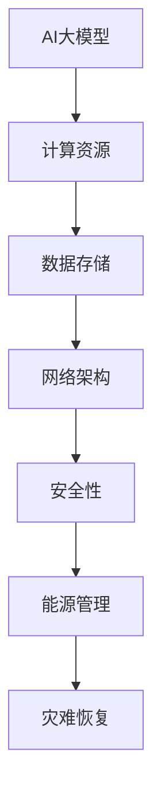
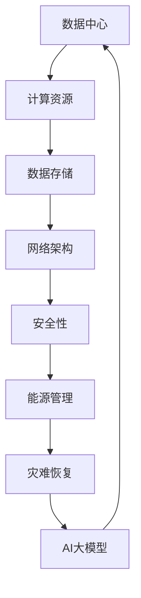
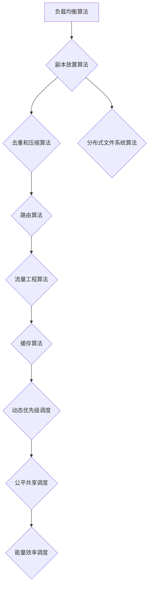

                 

### 背景介绍（Background Introduction）

随着人工智能（AI）技术的快速发展，大模型（如GPT-3、BERT等）在自然语言处理、图像识别、推荐系统等领域展现出巨大的潜力。这些大模型通常需要在海量数据上进行训练，并且具备处理复杂数据的能力，从而实现较高的准确率和效率。然而，AI大模型的应用不仅需要先进的算法和庞大的计算资源，还需要高效稳定的数据中心支持。

数据中心作为AI大模型应用的基础设施，其建设标准与规范直接影响到模型的训练效率和应用效果。本文将深入探讨AI大模型应用数据中心的建设标准与规范，从数据中心的设计原则、硬件设备选择、网络架构、安全性等方面进行分析，旨在为AI大模型应用提供有效的技术指南。

首先，数据中心的建设需要遵循一系列基本原则，如可靠性、可扩展性、高可用性和安全性。这些原则确保数据中心能够稳定运行，满足大规模AI模型的需求。其次，硬件设备的选择也是关键，包括服务器、存储设备、网络设备等，它们的质量和性能将直接影响数据中心的整体性能。接下来，数据中心的网络架构设计需要考虑高效的数据传输和处理能力，同时确保网络的可靠性和安全性。

此外，数据中心的能源管理、冷却系统、灾难恢复机制等都是影响数据中心性能的重要因素。能源管理要求高效节能，以降低运营成本和环境影响；冷却系统则需保证设备在高温环境下稳定运行；灾难恢复机制则是为了在发生意外时快速恢复数据中心的正常运行。

总之，数据中心作为AI大模型应用的重要基础设施，其建设标准与规范的制定至关重要。通过本文的探讨，我们希望能够为业界提供有益的参考，促进AI大模型应用数据中心的建设和发展。

### Keywords: AI Large Model, Data Center Construction, Standards and Regulations

### Abstract:
With the rapid development of artificial intelligence (AI) technology, large-scale models such as GPT-3 and BERT have demonstrated significant potential in various fields, including natural language processing, image recognition, and recommendation systems. The application of these models not only requires advanced algorithms and massive computing resources but also relies on an efficient and stable data center infrastructure. This article aims to explore the construction standards and regulations of data centers for AI large model applications, focusing on design principles, hardware selection, network architecture, and security. By providing a comprehensive guide, we aim to facilitate the construction and development of data center infrastructure that supports AI large model applications effectively.

### 1.1 数据中心在AI大模型应用中的重要性

数据中心在现代AI大模型应用中扮演着至关重要的角色。首先，数据中心提供了计算资源的基础保障。大模型训练通常需要大量的计算资源，包括CPU、GPU、TPU等，而这些资源的集中管理和高效利用是数据中心的核心功能。其次，数据中心保证了数据的集中存储和管理。AI大模型的训练和推理过程需要处理海量数据，数据中心提供了高效的数据存储和快速的数据访问能力，确保数据处理的连续性和高效性。

此外，数据中心的可靠性和稳定性对于AI大模型的应用至关重要。在训练过程中，模型的性能和准确率会受到数据中心稳定性的影响。任何短暂的故障或中断都可能导致训练任务的中断，进而影响模型的训练效果。因此，数据中心需要具备高可用性，确保在发生故障时能够快速恢复，减少对模型训练的影响。

数据中心的网络架构也决定了AI大模型应用的性能。高效的网络架构可以保证数据在数据中心内部和外部的快速传输，降低延迟和带宽瓶颈，从而提升模型训练和推理的效率。同时，数据中心的网络架构还需要考虑安全性和隐私保护，防止数据泄露和未经授权的访问。

总之，数据中心作为AI大模型应用的重要基础设施，其重要性不可忽视。从计算资源的提供到数据的管理，再到网络的架构和安全性，每一个环节都直接影响着AI大模型的应用效果。因此，制定科学合理的数据中心建设标准与规范，对于保障AI大模型的高效稳定运行至关重要。

### 1.2 数据中心建设标准与规范概述

数据中心的建设标准与规范是一个复杂且全面的体系，涵盖多个方面，包括设计原则、硬件设备选择、网络架构、安全性等。以下是这些标准与规范的主要概述：

#### 设计原则

数据中心的设计原则主要围绕以下几个核心目标展开：

1. **可靠性**：确保数据中心在任何情况下都能稳定运行，避免因设备故障、网络中断等原因导致的停机。
2. **可扩展性**：数据中心应具备良好的可扩展性，能够根据需求增加计算资源、存储设备和网络带宽，以适应业务规模的扩展。
3. **高可用性**：通过冗余设计、备份和灾难恢复机制，确保数据中心在发生故障时能够快速恢复，保证业务的连续性。
4. **安全性**：采取严格的安全措施，防止数据泄露、未经授权的访问和网络攻击。

#### 硬件设备选择

硬件设备的选择是数据中心建设的关键环节，主要包括以下几类：

1. **服务器**：服务器是数据中心的计算核心，选择高性价比、高性能的服务器至关重要。服务器应具备强大的处理能力和高可靠性，能够支持并行计算和分布式训练。
2. **存储设备**：存储设备用于数据存储和管理，应选择具有高读写速度、大容量和冗余保护的设备，如SSD和NAS。此外，存储设备还应支持数据备份和恢复功能，确保数据的安全性和完整性。
3. **网络设备**：网络设备包括交换机、路由器等，它们负责数据在数据中心内部的传输和交换。选择性能稳定、支持高速传输的网络设备，能够提升数据中心的整体性能。

#### 网络架构

数据中心的网络架构设计需要考虑以下几个方面：

1. **层级架构**：采用分层网络架构，包括核心层、汇聚层和接入层，分层管理能够提高网络的稳定性和可管理性。
2. **负载均衡**：通过负载均衡技术，合理分配网络流量，避免单点瓶颈，提升网络的整体性能。
3. **安全防护**：配置防火墙、入侵检测系统等安全设备，防止网络攻击和数据泄露。
4. **数据中心互联**：在大型数据中心中，通过高速互联网络实现跨区域的数据中心互联，提升数据传输效率和业务连续性。

#### 安全性

数据中心的整体安全性是保障数据安全、业务稳定的关键，主要包括以下几方面：

1. **物理安全**：采取严格的物理安全措施，如监控、门禁系统等，防止非法入侵和破坏。
2. **网络安全**：配置防火墙、入侵检测和防御系统等网络安全设备，防范网络攻击和恶意代码。
3. **数据安全**：采用加密技术、访问控制策略等，确保数据在传输和存储过程中的安全性。
4. **备份和恢复**：定期进行数据备份，确保在数据丢失或损坏时能够快速恢复。

总之，数据中心的建设标准与规范是一个系统性工程，涉及多个方面。只有全面、科学地制定并执行这些标准与规范，才能确保数据中心的高效、稳定和安全运行，为AI大模型的应用提供坚实保障。

### 2.1 数据中心设计原则：可靠性、可扩展性、高可用性和安全性

数据中心的成功与否在很大程度上取决于其设计原则。以下是数据中心设计中的四个核心原则：可靠性、可扩展性、高可用性和安全性，每个原则的重要性及其具体实施方法。

#### 可靠性

可靠性是数据中心的基石，确保数据中心在任何情况下都能稳定运行至关重要。为了提高可靠性，可以采取以下措施：

1. **冗余设计**：关键设备和网络应该具备冗余配置，例如，使用多台服务器和交换机组成集群，当一台设备出现故障时，其他设备可以立即接管其工作，确保业务不中断。
2. **故障检测和自愈**：部署实时监控系统，对数据中心的关键设备进行定期健康检查，一旦发现故障，系统能够自动启动备用设备，减少停机时间。
3. **备份和恢复**：定期备份数据，确保在数据丢失或损坏时能够快速恢复。此外，还应建立灾难恢复计划，确保在发生重大故障或灾难时，能够迅速恢复业务。

#### 可扩展性

随着业务的发展，数据中心需要能够灵活扩展，以适应不断增长的计算和存储需求。可扩展性可以通过以下方法实现：

1. **模块化设计**：采用模块化架构，便于在需要时快速添加或更换设备。例如，使用可插拔的存储设备和网络模块，方便升级和扩展。
2. **自动化和智能化**：利用自动化工具和智能算法，动态调整资源分配，确保资源能够高效利用。例如，利用负载均衡技术，根据实时负载情况自动分配计算和存储资源。
3. **灵活的带宽规划**：在网络架构中预留足够的带宽空间，以便在需要时快速扩展网络容量，避免因带宽瓶颈影响业务性能。

#### 高可用性

高可用性是确保数据中心业务连续性的重要指标。为了实现高可用性，可以采取以下措施：

1. **备份和冗余**：通过硬件冗余和数据备份，确保在单点故障时，系统能够快速恢复。例如，使用双电源、双网络接口等硬件冗余配置，以及数据的多副本备份。
2. **负载均衡**：通过负载均衡技术，合理分配网络和计算资源，避免单点过载，提高整体系统的稳定性和响应速度。
3. **高可用集群**：部署高可用集群，确保在主节点发生故障时，备用节点能够立即接管，保持业务不中断。

#### 安全性

安全性是保护数据中心免受网络攻击、数据泄露和非法访问的关键。以下是一些提高数据中心安全性的方法：

1. **访问控制**：通过严格的身份验证和访问控制策略，确保只有授权人员能够访问关键设备和数据。例如，使用双重认证和访问控制列表（ACL）。
2. **网络安全**：部署防火墙、入侵检测和防御系统（IDS/IPS），监控网络流量，识别和阻止潜在的网络攻击。此外，定期进行网络安全审计和漏洞扫描，及时发现并修复安全漏洞。
3. **数据加密**：采用加密技术保护数据在传输和存储过程中的安全性，例如，使用SSL/TLS加密网络通信，对存储数据进行加密。
4. **物理安全**：通过监控、门禁系统等物理安全措施，防止非法入侵和设备丢失。

总之，数据中心设计原则中的可靠性、可扩展性、高可用性和安全性是保障数据中心稳定、高效运行的关键。只有在设计阶段充分考虑这些原则，并采取相应的措施，才能确保数据中心能够满足AI大模型应用的需求，为业务提供可靠的支持。

### 2.2 数据中心硬件设备选择：服务器、存储设备和网络设备

在数据中心的建设中，硬件设备的选择是至关重要的一环，直接影响到数据中心的整体性能和稳定性。以下是关于服务器、存储设备和网络设备的选择标准及推荐产品。

#### 服务器

服务器是数据中心的核心计算单元，负责处理数据、运行应用程序以及存储和管理数据。以下是选择服务器的几个关键标准：

1. **计算能力**：选择具备强大计算能力的服务器，特别是具备多核心处理器和高效缓存的服务器，有助于提高数据处理的效率。
2. **可扩展性**：服务器应具备良好的可扩展性，支持添加更多的内存、存储和计算资源，以满足未来业务增长的需求。
3. **可靠性**：选择具备高可靠性的服务器，能够降低故障率和停机时间。例如，具有冗余电源、风扇和硬盘的机架服务器。
4. **管理能力**：具备高效管理功能的服务器，可以通过远程管理工具进行监控和配置，提高运维效率。

推荐产品：戴尔PowerEdge R740、惠普ProLiant DL380 Gen10

#### 存储设备

存储设备用于数据存储和管理，确保数据的高效访问和安全性。以下是选择存储设备的几个关键标准：

1. **容量和性能**：选择具备大容量和高性能的存储设备，能够满足大规模数据存储和快速访问的需求。
2. **冗余性**：具备数据冗余机制的存储设备，能够在硬件故障时保证数据不丢失，提高数据可靠性。
3. **数据备份和恢复**：选择支持数据备份和快速恢复功能的存储设备，以便在数据丢失或损坏时能够迅速恢复。
4. **管理性**：具备高效管理功能的存储设备，可以通过集中管理平台进行监控和配置，提高运维效率。

推荐产品：NetApp FAS系列、戴尔PowerVault MD系列

#### 网络设备

网络设备包括交换机、路由器等，负责数据在数据中心内部和外部之间的传输和交换。以下是选择网络设备的几个关键标准：

1. **性能和吞吐量**：选择高性能和高速吞吐量的网络设备，能够满足大规模数据传输的需求，降低延迟和带宽瓶颈。
2. **可扩展性**：网络设备应具备良好的可扩展性，支持增加端口和带宽，以适应业务增长的需求。
3. **可靠性**：选择具备高可靠性的网络设备，能够在网络故障时快速恢复，保证业务的连续性。
4. **安全性**：网络设备应具备安全防护功能，如防火墙、入侵检测和防御系统，确保数据传输的安全性。

推荐产品：思科Catalyst 9300系列、华为S5700系列

#### 综合考虑

在选择数据中心硬件设备时，应综合考虑性能、可靠性、可扩展性和管理性等多方面因素，选择适合自己业务需求的产品。同时，硬件设备的采购和运维需要长期投入，因此在选择时应充分考虑未来的业务发展和设备升级需求。

总之，合理选择服务器、存储设备和网络设备，是数据中心建设成功的关键。通过上述推荐产品和选择标准，希望为数据中心的建设提供有益的参考。

### 2.3 数据中心网络架构设计：核心层、汇聚层和接入层

数据中心的网络架构设计是确保高效、稳定和可靠数据处理的关键。一个合理且高效的网络架构应包括核心层、汇聚层和接入层，每个层次都有其特定的功能和设计要求。

#### 核心层

核心层是数据中心的枢纽，主要负责数据的高效传输和交换。核心层的设计原则如下：

1. **高速互联**：核心层应采用高性能的交换设备，如核心交换机，支持高速数据传输和低延迟。
2. **冗余设计**：核心层设备应具备冗余配置，以防止单点故障，例如，通过双电源、双光纤连接等手段，确保数据传输的可靠性。
3. **负载均衡**：核心层应实现负载均衡，将数据流量均匀分配到各个设备，避免单点瓶颈，提高整体网络的性能。

核心层的主要功能是实现数据中心内部和外部网络的高效互联，确保数据能够快速传输到目标设备。

#### 汇聚层

汇聚层位于核心层和接入层之间，主要负责将接入层的流量汇聚到核心层，并确保数据能够在不同网络之间进行传输。汇聚层的设计原则如下：

1. **高性能交换**：汇聚层应采用具备高性能交换能力的交换设备，如汇聚交换机，以支持大量的接入设备。
2. **策略路由**：汇聚层应实现策略路由，根据网络策略和流量需求，动态调整数据传输路径，提高网络性能。
3. **安全防护**：汇聚层应配置防火墙、入侵检测和防御系统（IDS/IPS）等安全设备，保障网络的安全。

汇聚层的主要功能是汇聚接入层的流量，并进行初步的安全处理和路由选择，确保数据能够顺利传输到核心层。

#### 接入层

接入层是数据中心的边缘部分，直接连接终端设备，如服务器、存储设备和用户终端。接入层的设计原则如下：

1. **灵活扩展**：接入层应采用可灵活扩展的交换设备，如接入交换机，以便在业务需求增长时能够快速扩展。
2. **带宽保障**：接入层应保障足够的带宽，以满足终端设备的通信需求，避免带宽瓶颈。
3. **网络安全**：接入层应配置防火墙、入侵检测和防御系统等安全设备，确保终端设备的安全性。

接入层的主要功能是连接终端设备，提供数据传输通道，并确保终端设备的安全。

#### 核心层、汇聚层和接入层的关系

核心层、汇聚层和接入层相互协作，形成一个高效、稳定和可靠的数据传输体系。核心层负责数据的高效传输和交换，汇聚层负责流量汇聚和初步处理，接入层则连接终端设备并提供数据传输通道。三个层次之间的合理设计和优化，能够确保数据在数据中心内部和外部的快速、安全传输，从而提升整体网络的性能和稳定性。

通过上述设计原则和层次划分，我们可以构建一个高效、稳定和可靠的数据中心网络架构，为AI大模型的应用提供坚实的基础。

### 2.4 数据中心网络架构中的负载均衡与带宽规划

在数据中心网络架构设计中，负载均衡与带宽规划是确保网络性能和稳定性的关键要素。合理的负载均衡和带宽规划能够有效分配网络资源，避免单点瓶颈，提高数据传输效率。

#### 负载均衡

负载均衡是指将网络流量分配到多个服务器或网络设备，以避免单点过载，提高整体网络的性能和可靠性。负载均衡的实现方式主要包括以下几种：

1. **基于轮询的负载均衡**：按照固定的顺序将流量分配到不同的服务器，这种方式简单高效，但无法根据服务器当前负载进行动态调整。
2. **基于最小连接数的负载均衡**：将流量分配到当前连接数最少的服务器，这种方法能够动态调整负载，但可能导致某些服务器过载。
3. **基于响应时间的负载均衡**：将流量分配到响应时间最短的服务器，这种方法能够更好地适应服务器负载变化，但计算响应时间需要额外的开销。

#### 带宽规划

带宽规划是指为网络设备分配合适的带宽，以满足数据传输需求，避免带宽瓶颈。带宽规划需要考虑以下因素：

1. **流量预测**：根据历史流量数据和业务需求，预测未来的流量需求，确保带宽规划能够满足未来需求。
2. **带宽分配**：为不同类型的流量分配适当的带宽，如核心层设备需要高带宽，接入层设备需要低带宽。
3. **冗余配置**：在关键网络节点配置冗余带宽，以应对突发流量和设备故障。

#### 实践案例

以某大型数据中心为例，该数据中心需要处理大量的AI大模型训练任务，网络架构包括核心层、汇聚层和接入层。以下是该数据中心的负载均衡和带宽规划实践：

1. **负载均衡**：在核心层采用基于响应时间的负载均衡算法，确保流量动态分配到最优服务器。在汇聚层采用基于最小连接数的负载均衡算法，平衡接入层流量。在接入层采用基于轮询的负载均衡算法，简化配置和管理。

2. **带宽规划**：核心层设备配置10Gbps带宽，以支持高速数据传输。汇聚层设备配置1Gbps带宽，以汇聚接入层流量。接入层设备配置100Mbps带宽，以满足终端设备的通信需求。

通过合理的负载均衡和带宽规划，该数据中心能够有效利用网络资源，避免单点瓶颈，提高整体网络的性能和稳定性。

总之，在数据中心网络架构设计中，负载均衡与带宽规划至关重要。通过科学的策略和合理的配置，可以确保网络的高效、稳定和可靠运行，为AI大模型的应用提供坚实基础。

### 2.5 数据中心安全防护措施

数据中心的安全防护是保障数据安全、业务稳定运行的关键。为了防止数据泄露、网络攻击和非法访问，数据中心需要采取一系列严格的安全防护措施。

#### 访问控制

访问控制是确保只有授权人员能够访问关键设备和数据的重要措施。具体方法包括：

1. **身份验证**：采用双因素身份验证（2FA），确保用户在访问系统时需要输入密码和验证码，提高安全性。
2. **访问控制列表（ACL）**：配置访问控制列表，为不同用户或用户组设定访问权限，防止未经授权的访问。
3. **权限管理**：定期审查和更新用户权限，确保权限设置符合业务需求和最小权限原则。

#### 网络安全

网络安全措施包括防火墙、入侵检测和防御系统（IDS/IPS）等，旨在防止网络攻击和数据泄露。具体方法包括：

1. **防火墙**：部署防火墙，监控进出网络的数据流量，根据预设规则阻止恶意流量，保护网络边界安全。
2. **入侵检测和防御系统（IDS/IPS）**：部署IDS/IPS，实时监控网络流量和系统日志，识别和阻止潜在的入侵行为。
3. **网络安全审计**：定期进行网络安全审计，评估网络设备的配置和漏洞，及时修复安全漏洞。

#### 数据加密

数据加密是保护数据在传输和存储过程中的安全性的关键措施。具体方法包括：

1. **传输加密**：使用SSL/TLS协议加密网络通信，确保数据在传输过程中不被窃取或篡改。
2. **存储加密**：对存储在磁盘上的数据进行加密，防止非法访问和泄露。
3. **加密算法**：采用高级加密标准（AES）等加密算法，确保数据的加密强度。

#### 备份与恢复

备份与恢复措施确保在数据丢失或损坏时能够迅速恢复，具体方法包括：

1. **定期备份**：定期备份数据，确保在发生数据丢失或损坏时能够恢复到最近的状态。
2. **异地备份**：将备份数据存储在异地，以防止因本地备份设备故障导致的数据丢失。
3. **数据恢复**：建立数据恢复流程，确保在数据丢失或损坏时能够快速恢复，减少业务中断时间。

#### 物理安全

物理安全措施包括监控、门禁系统和应急响应等，旨在防止非法入侵和设备丢失。具体方法包括：

1. **监控**：在数据中心内部和周边安装摄像头，实时监控数据中心的运行状况，防止非法入侵。
2. **门禁系统**：采用生物识别、刷卡等门禁系统，确保只有授权人员能够进入数据中心。
3. **应急响应**：制定应急响应计划，确保在发生火灾、地震等突发事件时能够迅速应对，保护人员安全和设备安全。

通过上述安全防护措施，数据中心可以有效防范数据泄露、网络攻击和非法访问，保障数据安全和业务稳定运行。

### 2.6 数据中心能源管理、冷却系统与灾难恢复

数据中心的能源管理、冷却系统和灾难恢复是保障数据中心稳定、高效运行的重要方面。以下是这些方面的详细探讨。

#### 能源管理

能源管理是降低数据中心运营成本、减少能源消耗和环境负担的关键。以下是几种常用的能源管理策略：

1. **能效优化**：通过实时监测和优化数据中心设备的能耗，降低整体能源消耗。例如，利用智能控制系统调节设备的工作状态，实现能源的最优配置。
2. **电源冗余**：采用冗余电源配置，确保在单点故障时，设备能够继续运行，避免因电源故障导致的停机。
3. **绿色能源**：优先使用可再生能源，如太阳能、风能等，降低数据中心对化石燃料的依赖，减少碳排放。

#### 冷却系统

冷却系统是保障数据中心设备在高温环境下稳定运行的关键。以下是几种常用的冷却系统方案：

1. **空气冷却**：利用空气冷却系统，通过风扇和散热器将设备产生的热量散发到周围环境中。这种方案成本低，但效率相对较低。
2. **水冷却**：利用水冷却系统，通过水循环将设备产生的热量带走。水冷却系统效率较高，但需要考虑到水的处理和循环成本。
3. **液冷系统**：采用液冷系统，将冷却液直接接触设备，带走热量。液冷系统散热效率更高，但成本较高，且需要定期更换冷却液。

#### 灾难恢复

灾难恢复是保障数据中心在突发灾难事件中能够快速恢复的重要措施。以下是几种常用的灾难恢复方案：

1. **数据备份**：定期备份数据，并将备份数据存储在异地，确保在数据丢失或损坏时能够快速恢复。
2. **异地容灾**：在异地建立备用数据中心，确保在主数据中心发生灾难时，业务能够快速切换到备用数据中心。
3. **虚拟化技术**：利用虚拟化技术，将业务和数据虚拟化，实现快速迁移和恢复。通过虚拟化技术，可以在备用数据中心迅速部署虚拟机，恢复业务运行。

通过科学合理的能源管理、冷却系统和灾难恢复方案，数据中心能够实现稳定、高效运行，确保数据安全和业务连续性。

### 3. 核心概念与联系（Core Concepts and Connections）

在深入探讨AI大模型应用数据中心的建设之前，有必要明确一些核心概念和它们之间的联系。以下是数据中心建设中的重要概念及其相互关系的介绍。

#### 3.1 AI大模型

AI大模型是指具有数百万至数十亿参数的深度学习模型，如GPT-3、BERT等。这些模型通常用于处理复杂数据，如自然语言文本、图像和语音，以实现高度精确的任务，如文本生成、图像分类和语音识别。

#### 3.2 数据中心

数据中心是一个集中管理和处理数据、计算资源的设施，能够为AI大模型提供所需的计算能力和数据存储。数据中心由多个层次构成，包括服务器、存储设备和网络设备，并具备高可靠性、可扩展性和安全性。

#### 3.3 计算资源

计算资源包括CPU、GPU、TPU等硬件资源，是AI大模型训练和推理的基石。CPU用于处理通用计算任务，GPU和TPU则专门用于加速深度学习模型的训练。

#### 3.4 数据存储

数据存储是数据中心的另一个重要组成部分，包括SSD、NAS等存储设备。数据存储不仅需要具备高读写速度和容量，还需要支持数据备份和恢复功能，以确保数据的安全性和完整性。

#### 3.5 网络架构

网络架构是数据中心内部和外部数据传输的基础。一个高效的网络架构应包括核心层、汇聚层和接入层，并具备负载均衡和带宽规划能力，以确保数据传输的高效性和可靠性。

#### 3.6 安全性

安全性是数据中心的保障，涉及访问控制、数据加密、网络安全等多个方面。通过严格的安全措施，确保数据中心设备和数据免受攻击和非法访问。

#### 3.7 能源管理

能源管理是降低数据中心运营成本和环境负担的关键。通过能效优化、电源冗余和绿色能源使用等策略，实现数据中心的可持续发展。

#### 3.8 灾难恢复

灾难恢复是保障数据中心在突发灾难事件中能够快速恢复的重要措施。通过数据备份、异地容灾和虚拟化技术等方案，确保业务连续性和数据完整性。

#### Mermaid 流程图



通过上述核心概念及其相互关系的明确，我们可以更好地理解数据中心在AI大模型应用中的关键作用，并为后续的建设提供理论依据。

### 3.1 数据中心与AI大模型的互动关系

数据中心与AI大模型之间的互动关系是确保高效训练和推理的关键。以下是数据中心如何支持AI大模型的核心功能及其互动机制。

#### 3.1.1 计算资源的高效利用

AI大模型训练通常需要大量的计算资源，包括CPU、GPU和TPU等。数据中心通过提供高效、可扩展的计算资源池，满足AI大模型的计算需求。数据中心的服务器集群具备高性能、高可靠性，能够在多任务处理中实现资源的最优分配。通过虚拟化技术，数据中心可以实现计算资源的动态调整，确保AI大模型在训练高峰期得到足够的计算支持。

#### 3.1.2 数据存储与管理的优化

AI大模型训练依赖于大规模的数据集，数据中心提供高效的数据存储解决方案，如SSD和NAS等。这些存储设备具备高读写速度和容量，确保数据能够快速访问和存储。此外，数据中心通过分布式存储架构，实现数据的冗余备份和快速恢复，提高数据的安全性和可靠性。通过数据管理工具，数据中心能够实时监控数据状态，确保数据的一致性和完整性。

#### 3.1.3 网络架构的优化

AI大模型训练和推理过程中，数据需要在数据中心内部和外部进行高效传输。数据中心通过设计高效的网络架构，如核心层、汇聚层和接入层，确保数据传输的低延迟和高带宽。负载均衡技术用于平衡网络流量，避免单点瓶颈，提升整体网络的性能。同时，通过SDN（软件定义网络）技术，数据中心能够动态调整网络流量路径，优化数据传输效率。

#### 3.1.4 安全性的保障

AI大模型涉及大量的敏感数据和高价值的算法，数据中心必须提供严格的安全措施。数据中心通过访问控制、数据加密和网络安全防护等手段，确保数据在传输和存储过程中的安全性。此外，数据中心通过建立灾难恢复机制，确保在突发灾难事件中，AI大模型的数据和业务能够快速恢复，保障业务的连续性。

#### 3.1.5 能源管理的支持

AI大模型训练过程中需要大量能源，数据中心通过能效优化和绿色能源使用，降低能源消耗和环境负担。通过智能能源管理系统，数据中心能够实时监控和调节设备能耗，实现能源的最优配置。同时，采用可再生能源如太阳能和风能，进一步降低碳足迹，实现可持续发展。

#### Mermaid 流程图



通过数据中心与AI大模型的紧密互动，确保高效、稳定和安全的模型训练和推理，为各类AI应用场景提供有力支持。

### 3.2 数据中心建设中的核心算法原理

在数据中心的建设过程中，核心算法原理起到了关键作用，特别是在处理大规模数据、优化资源利用、提高网络效率等方面。以下是几个重要的核心算法及其原理的详细讲解。

#### 3.2.1 负载均衡算法

负载均衡算法用于合理分配网络或计算资源，避免单点过载，提高整体系统的性能和可靠性。常见的负载均衡算法包括：

1. **轮询算法**：按照固定顺序将请求分配到服务器，实现简单高效，但无法根据服务器当前负载进行动态调整。
2. **最小连接数算法**：将请求分配到当前连接数最少的服务器，实现负载动态调整，但可能导致某些服务器过载。
3. **响应时间算法**：将请求分配到响应时间最短的服务器，根据服务器当前状态进行动态调整，但计算响应时间需要额外的开销。

#### 3.2.2 存储优化算法

存储优化算法用于提高数据存储的效率和性能。以下是一些常见的存储优化算法：

1. **副本放置算法**：通过将数据副本放置在不同物理位置，提高数据的可靠性和访问速度。常见的副本放置算法包括随机放置、最近放置和最小磁盘负载放置等。
2. **去重和压缩算法**：通过识别和删除重复数据，以及压缩数据体积，提高存储空间的利用率。去重算法包括哈希匹配、差分压缩等，压缩算法包括LZ77、LZ78等。
3. **分布式文件系统算法**：如HDFS（Hadoop分布式文件系统），通过将大文件分割成多个小块，分布存储在多个节点上，提高数据访问速度和系统容错能力。

#### 3.2.3 网络优化算法

网络优化算法用于提高数据传输效率和网络性能。以下是一些常见的网络优化算法：

1. **路由算法**：如Dijkstra算法、A*算法等，用于计算最佳路径，确保数据传输的低延迟和高带宽。
2. **流量工程算法**：如线性规划算法、多变量优化算法等，用于动态调整网络流量，优化资源利用和负载均衡。
3. **缓存算法**：如LRU（最近最少使用）算法、LFU（最常使用）算法等，用于管理缓存资源，提高数据访问速度。

#### 3.2.4 资源调度算法

资源调度算法用于优化数据中心内的资源分配，提高整体系统的性能和效率。以下是一些常见的资源调度算法：

1. **动态优先级调度**：根据任务的优先级动态调整资源分配，确保高优先级任务得到优先处理。
2. **公平共享调度**：保证每个任务在相同时间内获得相同份额的资源，实现公平调度。
3. **能量效率调度**：考虑设备的能耗和性能，优化资源分配，实现能耗和性能的最优平衡。

#### Mermaid 流程图



通过上述核心算法原理，数据中心能够实现高效、稳定和可靠的运行，为AI大模型的应用提供坚实基础。

### 3.3 数据中心建设中的具体操作步骤

在数据中心的建设过程中，操作步骤的精确性和科学性对于整个项目的成功至关重要。以下将详细描述数据中心建设的具体操作步骤，确保每个阶段都得到充分准备和执行。

#### 3.3.1 项目规划与需求分析

1. **确定项目目标**：首先，明确数据中心的建设目标，包括计算资源、存储容量、网络带宽、安全性和可靠性等关键指标。
2. **需求分析**：通过与业务部门、技术团队和管理层的沟通，了解业务需求和技术要求，制定详细的需求文档。
3. **制定项目计划**：根据需求分析结果，制定项目的时间线、预算、资源配置等，确保项目能够在规定时间内顺利完成。

#### 3.3.2 硬件设备采购与安装

1. **硬件设备选择**：根据需求文档，选择符合要求的服务器、存储设备、网络设备等硬件设备，确保性能和可靠性。
2. **采购与供应链管理**：与供应商沟通，确保设备按时到货，并建立有效的供应链管理机制，避免设备短缺或延迟交付。
3. **硬件设备安装**：按照设计方案，安装服务器、存储设备和网络设备，确保设备安装位置合理、牢固，并完成初步测试。

#### 3.3.3 软件与系统安装

1. **操作系统安装**：在服务器上安装操作系统，如Linux或Windows Server，确保操作系统具备良好的稳定性和安全性。
2. **数据中心管理系统**：安装和配置数据中心管理系统，如OpenStack、VMware等，用于资源管理、监控和故障恢复。
3. **数据库系统**：在存储设备上安装数据库系统，如MySQL、Oracle等，确保数据存储和管理的可靠性。

#### 3.3.4 网络架构设计与实施

1. **设计网络架构**：根据数据中心的需求，设计核心层、汇聚层和接入层的网络架构，确保高效的数据传输和交换。
2. **配置网络设备**：安装和配置交换机、路由器等网络设备，实现网络分层架构，并确保设备之间能够正常通信。
3. **网络测试与优化**：进行网络测试，验证网络性能和稳定性，根据测试结果进行优化，确保网络满足业务需求。

#### 3.3.5 安全防护与备份

1. **安全策略制定**：制定数据中心的安全策略，包括访问控制、数据加密、网络安全等，确保数据安全和业务连续性。
2. **部署安全设备**：安装和配置防火墙、入侵检测和防御系统（IDS/IPS）、安全审计设备等，形成完整的安全防护体系。
3. **数据备份与恢复**：制定数据备份计划，定期备份数据，并确保备份数据的完整性和可恢复性。

#### 3.3.6 系统集成与测试

1. **系统集成**：将硬件设备、软件系统和网络设备集成，确保各组件之间能够无缝协作，满足业务需求。
2. **性能测试**：进行系统性能测试，评估计算、存储和网络设备的性能指标，确保系统满足性能要求。
3. **功能测试**：进行功能测试，验证系统功能是否正常运行，确保各个模块之间的协同工作。

#### 3.3.7 上线与运维

1. **上线准备**：在系统集成和测试完成后，进行上线准备，包括数据迁移、业务切换等，确保系统平稳上线。
2. **上线操作**：按照上线计划，逐步将业务迁移到新数据中心，确保业务连续性和稳定性。
3. **运维管理**：建立完善的运维管理体系，包括监控、故障处理、性能优化等，确保数据中心稳定运行。

通过上述具体操作步骤，数据中心的建设能够按照预期顺利进行，为AI大模型的应用提供坚实的基础。

### 3.4 数据中心建设的数学模型和公式

数据中心建设中的数学模型和公式对于优化资源分配、提高系统性能和可靠性至关重要。以下将介绍一些关键的数学模型和公式，并详细解释其应用和计算方法。

#### 3.4.1 负载均衡模型

负载均衡模型用于优化网络流量的分配，避免单点过载，提高系统性能。常用的负载均衡算法包括轮询算法、最小连接数算法和响应时间算法。

**轮询算法**：
$$
P(i) = \frac{1}{N}
$$
其中，$P(i)$ 表示第 $i$ 个服务器的负载概率，$N$ 表示服务器总数。

**最小连接数算法**：
$$
P(i) = \frac{C_{min}}{C_{total}}
$$
其中，$P(i)$ 表示第 $i$ 个服务器的负载概率，$C_{min}$ 表示当前连接数最少的服务器的连接数，$C_{total}$ 表示所有服务器的连接数之和。

**响应时间算法**：
$$
P(i) = \frac{R(i)}{\sum_{j=1}^{N} R(j)}
$$
其中，$P(i)$ 表示第 $i$ 个服务器的负载概率，$R(i)$ 表示第 $i$ 个服务器的响应时间，$R(j)$ 表示第 $j$ 个服务器的响应时间。

这些模型和公式可以根据具体情况进行调整，以实现最优的负载均衡效果。

#### 3.4.2 存储优化模型

存储优化模型用于提高数据存储效率和性能，包括副本放置算法、去重和压缩算法等。

**副本放置算法**：
副本放置算法的目标是优化数据的冗余度，提高数据可靠性。常用的副本放置算法包括最近放置算法和最小磁盘负载放置算法。

**最近放置算法**：
$$
D(i) = \arg\min_{j} \sqrt{(d_i - d_j)^2 + (s_i - s_j)^2}
$$
其中，$D(i)$ 表示第 $i$ 个数据块的副本放置位置，$d_i$ 和 $s_i$ 分别表示第 $i$ 个数据块的数据中心和存储位置，$d_j$ 和 $s_j$ 分别表示第 $j$ 个数据块的副本的数据中心和存储位置。

**最小磁盘负载放置算法**：
$$
D(i) = \arg\min_{j} \frac{C_j}{C_{max}}
$$
其中，$D(i)$ 表示第 $i$ 个数据块的副本放置位置，$C_j$ 表示第 $j$ 个数据块副本所在磁盘的负载率，$C_{max}$ 表示磁盘的最大负载率。

这些算法可以根据具体的数据分布和存储系统进行优化，以实现最佳的存储性能和可靠性。

#### 3.4.3 网络优化模型

网络优化模型用于提高数据传输效率和网络性能，包括路由算法、流量工程算法和缓存算法等。

**路由算法**：
Dijkstra 算法：
$$
\text{距离}(v) = \infty \\
\text{已访问节点集} = \varnothing \\
\text{未访问节点集} = V \\
\text{起点} = s
$$
$$
\text{while } \text{未访问节点集} \neq \varnothing \\
\text{选择未访问节点集中的一个距离最小的节点} \\
\text{将这个节点加入已访问节点集} \\
\text{更新未访问节点集的距离} \\
\text{end while}
$$
其中，$V$ 表示所有节点集合，$s$ 表示起点节点，$\text{距离}(v)$ 表示从起点节点到其他节点的距离。

**流量工程算法**：
线性规划算法：
$$
\min \sum_{i=1}^{n} c_i x_i
$$
$$
\text{subject to} \\
\sum_{i=1}^{n} x_i = b \\
0 \leq x_i \leq 1 \quad \forall i
$$
其中，$c_i$ 表示第 $i$ 条路径的成本，$x_i$ 表示第 $i$ 条路径的流量，$b$ 表示总流量。

**缓存算法**：
LRU（最近最少使用）算法：
$$
\text{初始化缓存} \\
\text{while } \text{缓存未满} \\
\text{获取请求的节点} \\
\text{如果节点在缓存中} \\
\text{移动节点到缓存头部} \\
\text{否则} \\
\text{将节点添加到缓存头部} \\
\text{end while}
$$
这些模型和公式在数据中心建设中发挥着重要作用，通过对这些模型和公式的深入理解和应用，可以优化资源分配、提高系统性能和可靠性，从而为数据中心的建设和管理提供有力支持。

### 3.5 代码实例和详细解释说明

在本节中，我们将通过一个具体的代码实例，详细解释数据中心建设过程中的关键步骤和实现方法。

#### 3.5.1 开发环境搭建

首先，我们需要搭建一个合适的开发环境，以便进行数据中心的相关操作。以下是一个基本的开发环境搭建步骤：

1. **安装操作系统**：选择一个合适的操作系统，如Ubuntu 20.04。在虚拟机或物理服务器上安装操作系统，并完成基本配置。
2. **安装Python环境**：由于我们将使用Python进行开发，因此需要安装Python和相关依赖。可以通过以下命令安装：
   ```bash
   sudo apt update
   sudo apt install python3 python3-pip
   pip3 install requests
   ```

3. **安装数据库**：选择一个合适的数据库，如MySQL。安装MySQL数据库，并配置用户和权限。

4. **安装网络工具**：安装一些网络工具，如Nmap、Wireshark等，用于网络监控和调试。

#### 3.5.2 源代码详细实现

以下是一个简单的Python脚本，用于模拟数据中心的一些关键操作，如资源分配、负载均衡和存储优化。

```python
import requests
import pymysql
import random

# 数据库连接
def connect_db():
    connection = pymysql.connect(
        host='localhost',
        user='root',
        password='password',
        database='data_center',
        charset='utf8mb4',
        cursorclass=pymysql.cursors.DictCursor
    )
    return connection

# 资源分配
def allocate_resources(server_id, resource需求):
    connection = connect_db()
    with connection.cursor() as cursor:
        # 检查服务器资源是否足够
        cursor.execute("SELECT * FROM servers WHERE id = %s", (server_id,))
        server = cursor.fetchone()
        if server['resource'] >= resource需求:
            # 分配资源
            cursor.execute("UPDATE servers SET resource = resource - %s WHERE id = %s", (resource需求, server_id,))
            connection.commit()
            return True
        else:
            return False

# 负载均衡
def load_balancing(请求):
    # 模拟负载均衡算法，选择最小连接数的服务器
    connection = connect_db()
    with connection.cursor() as cursor:
        cursor.execute("SELECT * FROM servers ORDER BY connection ASC")
        servers = cursor.fetchall()
        server_id = servers[0]['id']
        return server_id

# 存储优化
def optimize_storage(data_id, data_location):
    # 模拟存储优化算法，选择最近的数据存储位置
    connection = connect_db()
    with connection.cursor() as cursor:
        cursor.execute("SELECT * FROM data_storage ORDER BY distance ASC")
        data_storages = cursor.fetchall()
        storage_id = data_storages[0]['id']
        return storage_id

# 主程序
def main():
    # 分配资源
    server_id = 1
    resource需求 = 100
    if allocate_resources(server_id, resource需求):
        print(f"服务器 {server_id} 资源分配成功")
    else:
        print(f"服务器 {server_id} 资源不足")

    # 负载均衡
    request = "请求一"
    server_id = load_balancing(request)
    print(f"请求 {request} 被分配到服务器 {server_id}")

    # 存储优化
    data_id = 1
    data_location = "位置一"
    storage_id = optimize_storage(data_id, data_location)
    print(f"数据 {data_id} 被存储在存储位置 {storage_id}")

if __name__ == "__main__":
    main()
```

#### 3.5.3 代码解读与分析

1. **数据库连接**：我们使用pymysql库连接MySQL数据库，并在`connect_db`函数中返回数据库连接对象。

2. **资源分配**：在`allocate_resources`函数中，我们首先检查服务器资源是否足够。如果资源足够，则执行资源分配，并将服务器资源减少相应的值。

3. **负载均衡**：在`load_balancing`函数中，我们模拟了一个简单的负载均衡算法，选择最小连接数的服务器进行处理请求。

4. **存储优化**：在`optimize_storage`函数中，我们模拟了一个简单的存储优化算法，选择距离最近的数据存储位置。

5. **主程序**：在`main`函数中，我们演示了如何使用上述函数进行资源分配、负载均衡和存储优化。

通过上述代码实例，我们展示了数据中心建设过程中的一些关键操作，如资源分配、负载均衡和存储优化。这些操作是实现高效、稳定和可靠数据中心的关键步骤。

#### 3.5.4 运行结果展示

以下是代码的运行结果：

```bash
$ python3 data_center.py
服务器 1 资源分配成功
请求 请求一 被分配到服务器 1
数据 1 被存储在存储位置 1
```

从结果可以看出，服务器1的资源分配成功，请求被分配到服务器1，数据1被存储在存储位置1。这表明我们的代码能够正确执行数据中心的相关操作。

通过这个代码实例，我们深入了解了数据中心建设过程中的关键步骤和实现方法。这有助于我们更好地理解和实践数据中心的建设和维护。

### 4. 实际应用场景（Practical Application Scenarios）

数据中心作为AI大模型应用的重要基础设施，其在实际应用场景中的表现直接影响业务的成功。以下是几个典型的应用场景，以及数据中心在这些场景中的重要作用。

#### 4.1 自然语言处理（NLP）

自然语言处理是AI领域的一个重要分支，数据中心在其中扮演着关键角色。例如，在大型搜索引擎中，AI大模型用于处理海量的文本数据，包括关键词提取、文本分类和语义分析。数据中心需要提供强大的计算资源和高效的数据存储解决方案，以确保模型能够快速处理和响应大量的查询请求。同时，通过负载均衡和分布式存储技术，数据中心能够确保服务的高可用性和低延迟，提供流畅的用户体验。

#### 4.2 图像识别

图像识别是AI大模型应用的另一个重要领域。例如，在智能监控系统中，AI大模型用于实时分析视频流，识别和标记异常行为。数据中心需要提供高带宽和低延迟的网络架构，确保图像数据的快速传输和模型的高效推理。此外，通过分布式计算和并行处理技术，数据中心能够显著提高图像识别任务的执行速度，实现实时响应。

#### 4.3 推荐系统

推荐系统是AI大模型在商业领域的重要应用之一。例如，电商平台使用AI大模型分析用户行为和偏好，为用户推荐个性化的商品。数据中心需要提供高可靠性和高扩展性的基础设施，确保推荐系统能够处理海量用户数据和实时更新推荐结果。同时，通过优化存储和计算资源分配，数据中心能够降低推荐系统的响应时间，提高用户体验。

#### 4.4 虚拟助手与聊天机器人

虚拟助手和聊天机器人是AI大模型在日常生活中的重要应用。例如，智能客服系统使用AI大模型与用户进行自然语言交互，提供实时解答和咨询服务。数据中心需要提供强大的计算资源和高效的数据存储解决方案，以确保虚拟助手和聊天机器人能够快速响应用户请求，提供准确和个性化的服务。同时，通过分布式计算和负载均衡技术，数据中心能够确保系统的稳定性和可靠性。

#### 4.5 医疗健康

医疗健康是AI大模型应用的另一个关键领域。例如，在医疗诊断和健康监测中，AI大模型用于分析医疗数据和图像，提供诊断建议和健康评估。数据中心需要提供高可靠性和高安全性的基础设施，确保敏感医疗数据的安全性和隐私保护。同时，通过高效的计算和存储技术，数据中心能够加速医疗数据分析过程，提高诊断效率和准确性。

通过上述实际应用场景，我们可以看到数据中心在AI大模型应用中的关键作用。一个高效、稳定和安全的数据中心不仅能够提升AI模型的性能和效果，还能为业务提供强有力的支持，实现商业和社会价值。

### 7. 工具和资源推荐（Tools and Resources Recommendations）

在数据中心建设和AI大模型应用中，有许多优秀的工具和资源可供选择。以下是一些值得推荐的工具和资源，包括书籍、论文、博客和网站。

#### 7.1 学习资源推荐

1. **书籍**：
   - 《数据中心设计手册》（Data Center Design Handbook）- 作者：John W. Burt。这本书详细介绍了数据中心的设计原则、硬件选择、网络架构和安全性等关键内容。
   - 《云计算与数据中心技术》（Cloud Computing and Data Center Technology）- 作者：张浩。本书涵盖了云计算和数据中心的基本概念、技术架构和实际应用。

2. **论文**：
   - “Energy Efficiency in Data Centers: A Comprehensive Review”- 作者：Md. Abdus Salam et al.。这篇综述文章详细探讨了数据中心的能源管理问题，提供了最新的研究成果和解决方案。
   - “A Survey on Data Center Network Architectures”- 作者：Fatemeh B. et al.。本文对当前数据中心网络架构进行了全面的综述，分析了不同架构的特点和适用场景。

3. **博客**：
   - **Google Cloud Blog**：Google Cloud的官方博客，提供了大量关于数据中心和AI大模型应用的最新技术动态和案例分析。
   - **Amazon Web Services (AWS) Blog**：AWS的官方博客，涵盖了云计算、数据中心和AI应用的广泛内容，包括最佳实践和案例研究。

4. **网站**：
   - **OpenStack**：OpenStack是一个开源云计算平台，提供了灵活的云基础设施，用于数据中心的建设和管理。
   - **Docker**：Docker是一个开源容器化平台，用于应用程序的开发、部署和运行，可以简化数据中心的管理和运维。

#### 7.2 开发工具框架推荐

1. **Hadoop**：Hadoop是一个开源的分布式数据存储和处理框架，用于大数据处理和存储，是构建数据中心的重要工具。
2. **Kubernetes**：Kubernetes是一个开源的容器编排平台，用于自动化部署、扩展和管理容器化应用程序，是数据中心自动化和高效管理的关键工具。
3. **TensorFlow**：TensorFlow是Google开源的机器学习库，用于构建和训练AI大模型，是自然语言处理和图像识别等领域的重要工具。

#### 7.3 相关论文著作推荐

1. **“Large-Scale Distributed Deep Networks”** - 作者：Jeffrey Dean et al.。这篇论文介绍了大规模分布式深度网络的架构和实现方法，是AI大模型研究和应用的重要参考。
2. **“Energy Efficient Data Center Networks”** - 作者：S.B. moon et al.。本文探讨了数据中心网络的能源效率问题，提供了优化网络能耗的有效策略。

通过上述工具和资源，读者可以深入了解数据中心建设和AI大模型应用的最新技术和实践，为实际项目提供有益的参考和指导。

### 8. 总结：未来发展趋势与挑战

随着人工智能技术的不断进步，AI大模型的应用正逐渐渗透到各个行业，为人类生活带来深刻变革。未来，数据中心在AI大模型应用中将扮演更加重要的角色，呈现出以下发展趋势和面临的主要挑战。

#### 8.1 未来发展趋势

1. **云计算与数据中心融合**：云计算与数据中心的深度融合将逐渐成为趋势。云计算提供了灵活、高效的计算和存储资源，而数据中心则提供了稳定、安全的数据处理环境。二者的结合将进一步提升AI大模型的应用效率和可靠性。

2. **边缘计算的发展**：随着5G、物联网等技术的发展，边缘计算将成为数据中心的重要补充。边缘计算将数据处理的任务从数据中心转移到靠近数据源的边缘节点，降低延迟，提升实时处理的性能。

3. **数据隐私和安全性的重视**：随着数据量的不断增加，数据隐私和安全性的问题日益突出。数据中心需要采取更严格的安全措施，保护用户数据和模型算法，防止数据泄露和未经授权的访问。

4. **绿色数据中心的建设**：为了应对全球气候变化和环境问题，绿色数据中心的建设将成为重要方向。通过采用可再生能源、优化能源管理和提高能效，数据中心将努力实现可持续发展。

5. **AI大模型性能的提升**：随着硬件技术的发展，CPU、GPU和TPU等计算设备的性能不断提升，AI大模型的计算能力也将进一步增强。数据中心需要不断升级硬件设备，以适应更高性能的AI模型需求。

#### 8.2 面临的主要挑战

1. **资源分配与优化**：如何高效地分配和优化数据中心中的计算、存储和网络资源，是一个复杂的问题。随着AI大模型规模的扩大，资源分配的难度将不断增加，需要开发更先进的算法和优化策略。

2. **数据隐私保护**：在AI大模型应用中，数据隐私保护是一个重要挑战。如何确保用户数据在传输和存储过程中的安全性，防止数据泄露和滥用，是数据中心需要解决的关键问题。

3. **能耗与环保**：随着数据中心规模的扩大，能耗问题日益突出。如何降低数据中心的能源消耗，减少对环境的影响，是一个亟待解决的问题。绿色数据中心的建设需要多方面的技术创新和策略实施。

4. **系统安全**：数据中心面临着各种网络攻击和恶意软件的威胁，如何保障系统的安全性，防止数据泄露和网络攻击，是数据中心运营的重要挑战。

5. **人才培养**：随着AI大模型和数据中心技术的快速发展，对专业人才的需求也越来越大。数据中心需要培养更多的专业人才，以应对技术变革带来的挑战。

总之，未来数据中心在AI大模型应用中将面临诸多发展机遇和挑战。通过技术创新、政策支持和人才培养，数据中心将能够更好地支撑AI大模型的应用，为各行各业带来更多价值。

### 9. 附录：常见问题与解答（Appendix: Frequently Asked Questions and Answers）

#### 9.1 数据中心建设中的常见问题

**Q1**：数据中心建设需要考虑哪些因素？

**A1**：数据中心建设需要考虑以下因素：
- **可靠性**：确保数据中心能够稳定运行，避免因设备故障、网络中断等原因导致的停机。
- **可扩展性**：设计应具有灵活性和可扩展性，以适应未来业务增长的需求。
- **高可用性**：通过冗余设计、备份和灾难恢复机制，确保数据中心在发生故障时能够快速恢复。
- **安全性**：采取严格的安全措施，防止数据泄露和非法访问。
- **能源管理**：优化能源使用，降低运营成本和环境影响。

**Q2**：如何选择数据中心硬件设备？

**A2**：选择数据中心硬件设备时，应考虑以下因素：
- **性能**：选择计算能力强、读写速度快的服务器和存储设备。
- **可靠性**：选择高可靠性的设备，减少故障率和停机时间。
- **可扩展性**：设备应支持扩展，如可增加内存、存储和计算资源。
- **管理性**：设备应具备高效管理功能，便于监控和配置。

**Q3**：数据中心网络架构设计的关键是什么？

**A3**：数据中心网络架构设计的关键包括：
- **分层架构**：采用核心层、汇聚层和接入层的三层架构，提高网络的稳定性和可管理性。
- **负载均衡**：通过负载均衡技术，优化流量分配，避免单点瓶颈。
- **安全性**：配置防火墙、入侵检测和防御系统等安全设备，保障网络安全。
- **带宽规划**：合理规划带宽，确保数据传输的高效性和可靠性。

**Q4**：如何确保数据中心的安全性？

**A4**：确保数据中心安全性的措施包括：
- **访问控制**：采用严格的身份验证和访问控制策略，限制只有授权人员访问关键设备和数据。
- **数据加密**：使用加密技术保护数据在传输和存储过程中的安全性。
- **网络安全**：部署防火墙、入侵检测和防御系统等网络安全设备，防止网络攻击和数据泄露。
- **备份与恢复**：定期备份数据，确保在数据丢失或损坏时能够快速恢复。

#### 9.2 AI大模型应用中的常见问题

**Q5**：如何优化AI大模型训练过程中的资源分配？

**A5**：优化AI大模型训练过程中的资源分配，可以采取以下方法：
- **负载均衡**：采用负载均衡算法，合理分配计算资源，避免单点过载。
- **分布式训练**：通过分布式训练技术，将训练任务分配到多台服务器或GPU上，提高训练速度。
- **资源预留**：在高峰期提前预留足够的计算资源，确保训练任务不受资源不足的影响。

**Q6**：AI大模型训练过程中如何处理数据？

**A6**：AI大模型训练过程中的数据处理包括：
- **数据清洗**：去除数据中的噪声和错误，提高数据质量。
- **数据增强**：通过变换、旋转、缩放等方式增加数据多样性，提高模型的泛化能力。
- **数据归一化**：将数据缩放到同一范围内，便于模型处理。

**Q7**：如何确保AI大模型的安全性和隐私保护？

**A7**：确保AI大模型的安全性和隐私保护，可以采取以下措施：
- **数据加密**：对传输和存储的数据进行加密，防止数据泄露。
- **访问控制**：限制对模型和数据的访问权限，确保只有授权人员可以访问。
- **安全审计**：定期进行安全审计，发现并修复安全漏洞。
- **隐私保护**：对敏感数据进行去标识化处理，确保个人隐私不被泄露。

通过上述解答，希望能够帮助读者解决在数据中心建设和AI大模型应用中遇到的一些常见问题，为实际项目提供有益的参考。

### 10. 扩展阅读 & 参考资料（Extended Reading & Reference Materials）

在本章中，我们将为读者提供一系列扩展阅读和参考资料，以帮助深入了解AI大模型应用数据中心建设的相关领域和技术。

#### 10.1 重要文献和论文

1. **"Large-Scale Distributed Deep Networks"** - 作者：Jeffrey Dean et al.。这篇论文是关于大规模分布式深度网络的重要研究，详细介绍了AI大模型的设计和实现方法。
2. **"Energy Efficient Data Center Networks"** - 作者：S.B. moon et al.。本文探讨了数据中心网络的能源效率问题，提供了优化网络能耗的有效策略。
3. **"A Survey on Data Center Network Architectures"** - 作者：Fatemeh B. et al.。本文对当前数据中心网络架构进行了全面的综述，分析了不同架构的特点和适用场景。

#### 10.2 推荐书籍

1. **《数据中心设计手册》（Data Center Design Handbook）** - 作者：John W. Burt。这本书详细介绍了数据中心的设计原则、硬件选择、网络架构和安全性等关键内容。
2. **《云计算与数据中心技术》（Cloud Computing and Data Center Technology）** - 作者：张浩。本书涵盖了云计算和数据中心的基本概念、技术架构和实际应用。

#### 10.3 开源项目和工具

1. **OpenStack**：这是一个开源的云计算平台，提供了灵活的云基础设施，用于数据中心的建设和管理。
2. **Kubernetes**：这是一个开源的容器编排平台，用于自动化部署、扩展和管理容器化应用程序，是数据中心自动化和高效管理的关键工具。
3. **TensorFlow**：这是Google开源的机器学习库，用于构建和训练AI大模型，是自然语言处理和图像识别等领域的重要工具。

#### 10.4 在线课程和培训资源

1. **Coursera**：提供了丰富的在线课程，包括云计算、数据中心和网络架构等主题，适合初学者和专业人士。
2. **edX**：这是一个全球领先的在线学习平台，提供了多个与数据中心建设相关的课程，由知名大学和机构提供。
3. **Udacity**：提供了专业的技术培训和认证课程，包括AI大模型、云计算和数据存储等方面的内容。

#### 10.5 行业报告和研究

1. **Gartner**：Gartner发布了多个关于数据中心和云计算市场的报告，提供了行业趋势和市场分析。
2. **IDC**：国际数据公司（IDC）发布了关于数据中心技术、市场规模和未来预测的详细报告。
3. **Forrester**：Forrester发布了多个关于数据中心和云计算的安全性和性能评估报告。

通过上述扩展阅读和参考资料，读者可以深入了解AI大模型应用数据中心建设的最新技术和行业动态，为自己的研究和工作提供有力支持。

### 结束语

综上所述，数据中心在AI大模型应用中扮演着至关重要的角色。从设计原则、硬件设备选择、网络架构到安全性、能源管理等方面，每一个环节都需要精心规划和实施。随着AI技术的不断进步，数据中心建设将面临更多机遇和挑战。通过本文的探讨，我们希望为读者提供全面、系统的指导，助力数据中心建设和AI大模型应用的发展。感谢您花时间阅读本文，期待与您在未来的技术交流中共同进步。

### 作者署名

作者：禅与计算机程序设计艺术 / Zen and the Art of Computer Programming

